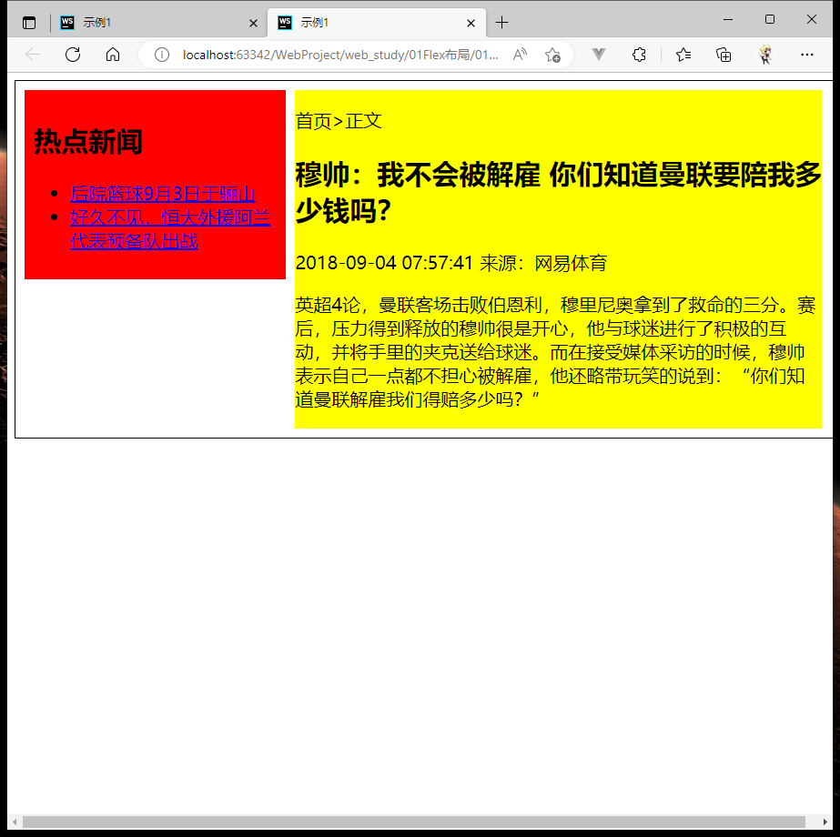
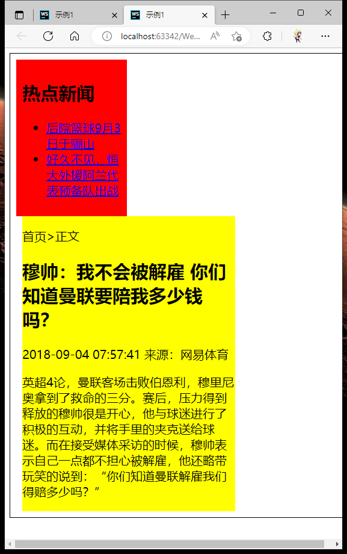
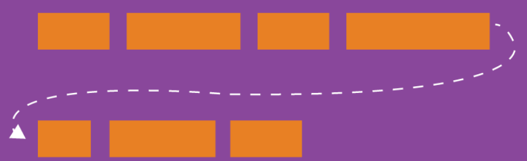
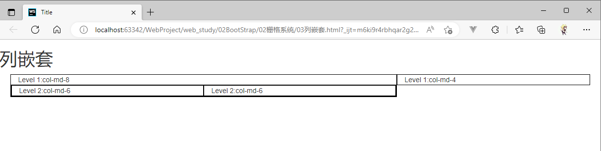
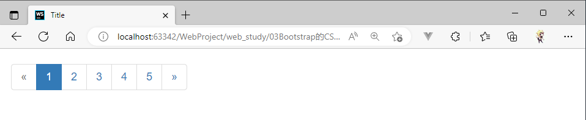

# BootStrap学习

## Flex布局

知识导图

* Flex布局与响应式布局
  * Flex弹性盒布局
    * 实现方式
      * 浮动+百分比
      * Flex布局
    * 作用
    * Flex属性
      * flex-direction
      * felx-wrap
      * justify-content
      * align-items
  * 响应式布局
    * 设计概念
    * 媒体查询
      * 媒体特性
      * 关键词
      * 媒体查询的使用

### 普通弹性布局

#### 案例：盒子左浮动

```html
<!DOCTYPE html>
<html lang="en">
<head>
    <meta charset="UTF-8">
    <title>示例1</title>
    <style>
        .box {
            width: 960px;
            border: 1px solid #000000;
            padding: 10px;
            float: left;
        }

        aside {
            width: 280px;
            float: left;
            background: red;
            padding: 10px;
        }

        article {
            margin-left: 10px;
            width: 650px;
            float: left;
            background: yellow;
        }
    </style>
</head>
<body>
<div class="box clear">
    <aside>
        <h2>热点新闻</h2>
        <ul>
            <li><a href="#">后院篮球9月3日于骊山</a></li>
            <li><a href="#">好久不见，恒大外援阿兰代表预备队出战</a></li>
        </ul>
    </aside>
    <article>
        <p>首页>正文</p>
        <h2>穆帅：我不会被解雇 你们知道曼联要陪我多少钱吗？</h2>
        <p class="time">2018-09-04 07:57:41 来源：网易体育</p>
        <div>
            <p>
                英超4论，曼联客场击败伯恩利，穆里尼奥拿到了救命的三分。赛后，压力得到释放的穆帅很是开心，他与球迷进行了积极的互动，并将手里的夹克送给球迷。而在接受媒体采访的时候，穆帅表示自己一点都不担心被解雇，他还略带玩笑的说到：“你们知道曼联解雇我们得赔多少吗？”</p>
        </div>
    </article>
</div>
</body>
</html>
```

上面合理利用div的全部空间：10(div-padding)+280(aside-width)+10(article-margin-left)+650(article-width)+10(div-padding) = 960(div-width)

效果：左边出现大量空白，原因是设计的样式宽度为固定


在浏览器窗口小时，因为宽度固定而出现了遮挡。


#### 案例：浮动+百分比(初步弹性)

在上面案例的条件下，追加宽度百分比适配窗口的自适应宽度。

```html
<!DOCTYPE html>
<html lang="en">
<head>
    <meta charset="UTF-8">
    <title>示例1</title>
    <style>
        .box {
            width: 100%;
            border: 1px solid #000000;
            padding: 10px;
            float: left;
        }

        aside {
            width: 30%;
            float: left;
            background: red;
            padding: 10px;
        }

        article {
            margin-left: 10px;
            width: 65%;
            float: left;
            background: yellow;
        }
    </style>
</head>
<body>
<div class="box clear">
    <aside>
        <h2>热点新闻</h2>
        <ul>
            <li><a href="#">后院篮球9月3日于骊山</a></li>
            <li><a href="#">好久不见，恒大外援阿兰代表预备队出战</a></li>
        </ul>
    </aside>
    <article>
        <p>首页>正文</p>
        <h2>穆帅：我不会被解雇 你们知道曼联要陪我多少钱吗？</h2>
        <p class="time">2018-09-04 07:57:41 来源：网易体育</p>
        <div>
            <p>
                英超4论，曼联客场击败伯恩利，穆里尼奥拿到了救命的三分。赛后，压力得到释放的穆帅很是开心，他与球迷进行了积极的互动，并将手里的夹克送给球迷。而在接受媒体采访的时候，穆帅表示自己一点都不担心被解雇，他还略带玩笑的说到：“你们知道曼联解雇我们得赔多少吗？”</p>
        </div>
    </article>
</div>
</body>
</html>
```

在屏幕宽度：960px时下面的效果成立，大于960px时会看到右边的空白较左边大

10px(div-padding)+30%(aside-width)+10px(article-margin-left)+65%(article-width)+10px(div-padding) = 100%(div-width)




上面基本实现了一个弹性布局，但因为这种方式可以看到高度存在问题，并且在小屏时的展示也不好。




### Flex布局

Flex（Flexible Box）布局是在CSS3中引入的，又称 "弹性盒模型"。该模型决定一个盒子在其他盒子中的分布方式以及如何处理可用的空间。

* 可以在屏幕和浏览器窗口大小发生变化时，保持元素的相对位置和大小不变
* 减少了实现元素位置的定义以及重置元素大小时对浮动布局的依赖
* 控制元素在页面上的布局方向
* 按照不同于**文档对象模型DOM**所指定的排序方式对屏幕上的元素**重新排序**

#### 案例：flex弹性盒模型

代码：

```html
<!DOCTYPE html>
<html lang="en">
<head>
    <meta charset="UTF-8">
    <title>示例1</title>
    <style>
        .box {
            display: flex;
            border: 1px solid #000000;
            padding: 10px;
        }

        aside {
            background: red;
            padding: 10px;
        }

        article {
            margin-left: 10px;
            background: yellow;
        }
    </style>
</head>
<body>
<div class="box clear">
    <aside>
        <h2>热点新闻</h2>
        <ul>
            <li><a href="#">后院篮球9月3日于骊山</a></li>
            <li><a href="#">好久不见，恒大外援阿兰代表预备队出战</a></li>
        </ul>
    </aside>
    <article>
        <p>首页>正文</p>
        <h2>穆帅：我不会被解雇 你们知道曼联要陪我多少钱吗？</h2>
        <p class="time">2018-09-04 07:57:41 来源：网易体育</p>
        <div>
            <p>
                英超4论，曼联客场击败伯恩利，穆里尼奥拿到了救命的三分。赛后，压力得到释放的穆帅很是开心，他与球迷进行了积极的互动，并将手里的夹克送给球迷。而在接受媒体采访的时候，穆帅表示自己一点都不担心被解雇，他还略带玩笑的说到：“你们知道曼联解雇我们得赔多少吗？”</p>
        </div>
    </article>
</div>
</body>
</html>
```

效果：


解释：

* 在父级盒子div中定义`display:flex`就把其变为弹性盒子
* 弹性盒子里的元素默认排在一行
* 盒子里的元素高度相同

### Flex布局-伸缩性flex


#### 案例：flex弹性盒模型-伸缩性1

在上面的案例中可以看到两个内容是是以最小宽度（根据其内容大小）显示的（`<aside>`较小，`<article>`较大）

可以使用flex的一些属性来进行调整。（注意一些浏览器可能不支持，得使用浏览器前缀来支持）

代码：

```html
<!DOCTYPE html>
<html lang="en">
<head>
    <meta charset="UTF-8">
    <title>示例2</title>
    <style>
        .box{
            display: flex;
            border:1px solid #000000;
            padding: 10px;
        }
        aside{
            flex: 1;
            background: red;
            padding: 10px;
        }
        article{
            flex: 1;
            margin-left: 10px;
            background: yellow;
        }
    </style>
</head>
<body>
<div class="box clear">
    <aside>
        <h2>热点新闻</h2>
        <ul>
            <li><a href="#">后院篮球9月3日于骊山</a></li>
            <li><a href="#">好久不见，恒大外援阿兰代表预备队出战</a></li>
        </ul>
    </aside>
    <article>
        <p>首页>正文</p>
        <h2>穆帅：我不会被解雇 你们知道曼联要陪我多少钱吗？</h2>
        <p class="time">2018-09-04 07:57:41 来源：网易体育</p>
        <div>
            <p>
                英超4论，曼联客场击败伯恩利，穆里尼奥拿到了救命的三分。赛后，压力得到释放的穆帅很是开心，他与球迷进行了积极的互动，并将手里的夹克送给球迷。而在接受媒体采访的时候，穆帅表示自己一点都不担心被解雇，他还略带玩笑的说到：“你们知道曼联解雇我们得赔多少吗？”</p>
        </div>
    </article>
</div>
</body>
</html>
```

效果：


#### 案例：flex弹性盒模型-伸缩性2

和上面一样，不过把`<aside>`提高比例值

```html
<!DOCTYPE html>
<html lang="en">
<head>
    <meta charset="UTF-8">
    <title>示例2</title>
    <style>
        .box{
            display: flex;
            border:1px solid #000000;
            padding: 10px;
        }
        aside{
            flex: 2;
            background: red;
            padding: 10px;
        }
        article{
            flex: 1;
            margin-left: 10px;
            background: yellow;
        }
    </style>
</head>
<body>
<div class="box clear">
    <aside>
        <h2>热点新闻</h2>
        <ul>
            <li><a href="#">后院篮球9月3日于骊山</a></li>
            <li><a href="#">好久不见，恒大外援阿兰代表预备队出战</a></li>
        </ul>
    </aside>
    <article>
        <p>首页>正文</p>
        <h2>穆帅：我不会被解雇 你们知道曼联要陪我多少钱吗？</h2>
        <p class="time">2018-09-04 07:57:41 来源：网易体育</p>
        <div>
            <p>
                英超4论，曼联客场击败伯恩利，穆里尼奥拿到了救命的三分。赛后，压力得到释放的穆帅很是开心，他与球迷进行了积极的互动，并将手里的夹克送给球迷。而在接受媒体采访的时候，穆帅表示自己一点都不担心被解雇，他还略带玩笑的说到：“你们知道曼联解雇我们得赔多少吗？”</p>
        </div>
    </article>
</div>
</body>
</html>
```

效果：


#### 总结

flex属性具体值不是带啊吗具体的宽度值，而是一个比例值。

* 在父容器的剩余空间里按比例分配自己的宽度。
* 如果两个容器的比例值都是1，则最终保持以浏览器宽度下的容器宽度1:1
* 如果其中一个值为2，则比例调整为1:2


### Flex布局-项目item

采用Flex布局的元素，称为Flex容器（flex container），简称容器。它的所有子元素自动称为容器成员，称为Flex项目（flex item），简称项目。

容器默认两根轴：

* 水平的主轴：main axis
  * 开始位置（与边框的交叉点）：main start 
  * 结束位置：main end
* 垂直的交叉轴（侧轴）：cross axis
  * 开始位置：cross start
  * 结束位置：cross end

项目默认沿着主轴排列。单个项目占据的主轴空间叫做main size，占据的交叉轴空间叫做cross size。


代码：

```html
<!DOCTYPE html>
<html lang="en">
<head>
    <meta charset="UTF-8">
    <title>Flex布局-伸缩流-row</title>
    <style>

        div[class^='item']{
            width: 100px;
            height: 100px;
            text-align: center;
            line-height: 100px;
            color: white;
            font-size: 2em;
            margin: 10px;
        }

        .item-1{
            background-color: lightblue;
        }
        .item-2{
            background-color: lightpink;
        }
        .item-3{
            background-color: lightcoral;
        }
        .item-4{
            background-color: lightsalmon;
        }

        .box{
            display: flex;
        }
    </style>
</head>
<body>
    <div class="box">
        <div class="item-1">
            1
        </div>
        <div class="item-2">
            2
        </div>
        <div class="item-3">
            3
        </div>
        <div class="item-4">
            4
        </div>
    </div>
</body>
</html>
```

效果：


### Flex布局-伸缩流方向flex-direction

flex-direction属性决定主轴方向（[项目](###Flex布局-项目)排列方向）。可以将多个元素排列从水平改为垂直，或垂直改为水平。

测试代码：上面的项目


**语法**

> flex-direction: row | row-reverse | column | column-reverse

* row：主轴为水平方向，起点在左端。（默认）

  ```css
  .box{
      display: flex;
      flex-direction: row;
  }
  ```

  

* row-reverse：主轴为水平方向，起点在右端

  ```css
  .box{
      display: flex;
      flex-direction: row-reverse;
  }
  ```

  

* column：主轴为垂直方向，起点在上端

  ```css
  .box{
      display: flex;
      flex-direction: column;
  }
  ```

  

* column-reverse：主轴为垂直方向，起点在下端

  ```css
  .box{
      display: flex;
      flex-direction: column-reverse;
  }
  ```
  
  

#### 案例：水平反向分布

```html
<!DOCTYPE html>
<html lang="en">
<head>
    <meta charset="UTF-8">
    <title>示例2</title>
    <style>
        .box{
            display: flex;
            flex-direction: row-reverse;
            border:1px solid #000000;
            padding: 10px;
        }
        aside{
            flex: 2;
            background: red;
            padding: 10px;
        }
        article{
            flex: 1;
            margin-left: 10px;
            background: yellow;
        }
    </style>
</head>
<body>
<div class="box clear">
    <aside>
        <h2>热点新闻</h2>
        <ul>
            <li><a href="#">后院篮球9月3日于骊山</a></li>
            <li><a href="#">好久不见，恒大外援阿兰代表预备队出战</a></li>
        </ul>
    </aside>
    <article>
        <p>首页>正文</p>
        <h2>穆帅：我不会被解雇 你们知道曼联要陪我多少钱吗？</h2>
        <p class="time">2018-09-04 07:57:41 来源：网易体育</p>
        <div>
            <p>
                英超4论，曼联客场击败伯恩利，穆里尼奥拿到了救命的三分。赛后，压力得到释放的穆帅很是开心，他与球迷进行了积极的互动，并将手里的夹克送给球迷。而在接受媒体采访的时候，穆帅表示自己一点都不担心被解雇，他还略带玩笑的说到：“你们知道曼联解雇我们得赔多少吗？”</p>
        </div>
    </article>
</div>
</body>
</html>
```


#### 案例：垂直分布

在上面的基础上改样式


效果


### Flex布局-伸缩换行flex-wrap

flex-wrap属性适用于伸缩容器，也就是伸缩项目的父元素，主要用来定义伸缩容器里是单行还是多行显示。侧轴的方向决定了新行堆放的方向。



测试代码：

```html
<!DOCTYPE html>
<html lang="en">
<head>
    <meta charset="UTF-8">
    <title>Flex布局</title>
    <style>

        div[class^='item']{
            width: 100px;
            height: 100px;
            text-align: center;
            line-height: 100px;
            color: white;
            font-size: 2em;
            margin: 10px;
        }

        .item-1{
            background-color: lightblue;
        }
        .item-2{
            background-color: lightpink;
        }
        .item-3{
            background-color: lightcoral;
        }
        .item-4{
            background-color: lightsalmon;
        }
        .item-5{
            background-color: lightgray;
        }
        .item-6{
            background-color: lightsteelblue;
        }
        .item-7{
            background-color: lightgreen;
        }
        .item-8{
            background-color: lightskyblue;
        }
        .item-9{
            background-color: lightseagreen;
        }
        .item-10{
            background-color: lightslategrey;
        }

        .box{
            display: flex;
        }
    </style>
</head>
<body>
    <div class="box">
        <div class="item-1">
            1
        </div>
        <div class="item-2">
            2
        </div>
        <div class="item-3">
            3
        </div>
        <div class="item-4">
            4
        </div>
        <div class="item-5">
            5
        </div>
        <div class="item-6">
            6
        </div>
        <div class="item-7">
            7
        </div>
        <div class="item-8">
            8
        </div>
        <div class="item-9">
            9
        </div>
        <div class="item-10">
            10
        </div>
    </div>
</body>
</html>
```

效果：默认不换行，所以项目被压缩了宽度


**语法**

> flex-wrap: nowrap | wrap | wrap-reverse

* nowrap：单行显示，伸缩时项目不会换行（默认）

  ```css
  .box{
      display: flex;
      flex-wrap: nowrap;
  }
  ```

  

* wrap：伸缩容器时项目多行显示，项目会换行

  ```css
  .box{
      display: flex;
      flex-wrap: wrap;
  }
  ```

  

* wrap-reverse：伸缩容器时i项目多行显示，并且颠倒顺序（换行，第一行在下面）

  ```css
  .box{
      display: flex;
      flex-wrap: wrap-reverse;
  }
  ```
  
  
  
  

### Flex布局-主轴对齐justify-content

justify-content属性适用于伸缩容器，也就是伸缩项目的父元素，主要用来定义伸缩项目在主轴上的对齐方式。

代码：

```html
<!DOCTYPE html>
<html lang="en">
<head>
    <meta charset="UTF-8">
    <title>Flex布局</title>
    <style>

        div[class^='item']{
            width: 100px;
            height: 100px;
            text-align: center;
            line-height: 100px;
            color: white;
            font-size: 2em;
            margin: 10px;
        }

        .item-1{
            background-color: lightblue;
        }
        .item-2{
            background-color: lightpink;
        }
        .item-3{
            background-color: lightcoral;
        }
        .item-4{
            background-color: lightsalmon;
        }
        .item-5{
            background-color: lightslategrey;
        }

        .box{
            display: flex;
        }
    </style>
</head>
<body>
    <div class="box">
        <div class="item-1">
            1
        </div>
        <div class="item-2">
            2
        </div>
        <div class="item-3">
            3
        </div>
        <div class="item-4">
            4
        </div>
        <div class="item-5">
            5
        </div>
    </div>
</body>
</html>
```

效果：


**语法**

> justify-content: flex-start | flex-end | center | space-between | space-around

* flex-start：伸缩项目向一行的起始位置靠齐（默认）

  ```css
  .box{
      display: flex;
      justify-content: flex-start;
  }
  ```

  

* flex-end：伸缩项目向一行的结束位置靠齐

  ```css
  .box{
      display: flex;
      justify-content: flex-end;
  }
  ```

  

* center：伸缩项目向一行的中间位置靠齐

  ```css
  .box{
      display: flex;
      justify-content: center;
  }
  ```

  

* space-between：伸缩项目会平均分配在行里。第一个伸缩项目在一行中的最开始位置，最后一个伸缩项目在一行中的最终点位置。

  ```css
  .box{
      display: flex;
      justify-content: space-between;
  }
  ```

  

* space-around：伸缩项目会平均分配在行里。两端保留一半的空间(每个项目两侧的间隔相等，所以项目之间的间隔比项目与边缘的间隔大一倍。)

  ```css
  .box{
      display: flex;
      justify-content: space-around;
  }
  ```
  
  


### Flex布局-侧轴对齐align-items

align-items属性定义伸缩项目在侧轴上的对齐方式。align-items与justify-content相呼应，可以把它想象成侧轴的justify-content。

代码：

```html
<!DOCTYPE html>
<html lang="en">
<head>
    <meta charset="UTF-8">
    <title>Flex布局</title>
    <style>

        div[class^='item']{
            width: 100px;
            height: 100px;
            text-align: center;
            line-height: 100px;
            color: white;
            font-size: 2em;
            margin: 10px;
        }

        .item-1{
            background-color: lightskyblue;
        }
        .item-2{
            background-color: lightpink;
        }
        .item-3{
            background-color: lightcoral;
        }
        .item-4{
            background-color: lightsalmon;
        }
        .item-5{
            background-color: lightslategrey;
        }

        .box{
            display: flex;
            height: 300px;
            background-color: #c7ddef;
        }
    </style>
</head>
<body>
    <div class="box">
        <div class="item-1">
            1
        </div>
        <div class="item-2">
            2
        </div>
        <div class="item-3">
            3
        </div>
        <div class="item-4">
            4
        </div>
        <div class="item-5">
            5
        </div>
    </div>
</body>
</html>
```

效果：


**语法**

> align-items: flex-start | flex-end | center | baseline | stretch

* stretch：伸缩项目拉伸填满整个伸缩容器（默认）（如果项目未设置高度或者设为 auto，将占满整个容器的高度。）

  ```css
  div[class^='item']{
      width: 100px;
      height: auto;
      text-align: center;
      line-height: 100px;
      color: white;
      font-size: 2em;
      margin: 10px;
  }
  
  ...省略
  
  .box{
      height: 300px;
      background-color: #c7ddef;
      display: flex;
      align-items: stretch;
  }
  ```

  

* flex-start：伸缩项目在侧轴起点边的外边距紧靠该行侧轴起点边。（项目分别为 100px, 120px, 140px, 160px, 180px, 则显示效果。和默认一样）

  ```css
  .box{
      height: 300px;
      background-color: #c7ddef;
      display: flex;
      align-items: flex-start;
  }
  ```

  

  

* flex-end：伸缩项目在侧轴终点边的外边距紧靠该行侧轴终点边（和flex-start一样的项目高度）

  ```css
  .box{
      height: 300px;
      background-color: #c7ddef;
      display: flex;
      align-items: flex-end;
  }
  ```

  

* center：伸缩项目的外边距盒在该行的侧轴上居中放置（和flex-start一样的项目高度）

  ```css
  .box{
      height: 300px;
      background-color: #c7ddef;
      display: flex;
      align-items: center;
  }
  ```

  

* baseline ：伸缩项目根据伸缩项目的第一行文字的基线对齐（这里为了效果明显将字体大小设置为夸张点）

  ```css
  div[class^='item']{
      width: 100px;
      text-align: center;
      line-height: 100px;
      color: white;
      margin: 10px;
  }
  
  .item-1{
      background-color: lightskyblue;
      height: 100px;
      font-size: 1em;
  }
  .item-2{
      background-color: lightpink;
      height: 120px;
      font-size: 5em;
  }
  .item-3{
      background-color: lightcoral;
      height: 140px;
      font-size: 1em;
  }
  .item-4{
      background-color: lightsalmon;
      height: 160px;
      font-size: 4em;
  }
  .item-5{
      background-color: lightslategrey;
      height: 180px;
      font-size: 1em;
  }
  
  .box{
      height: 300px;
      background-color: #c7ddef;
      display: flex;
      align-items: baseline;
  }
  ```

  


### Flex布局-多轴对齐align-content

* 当你 flex-wrap（伸缩换行）设置为 nowrap 的时候，容器仅存在一根轴线，因为项目不会换行，就不会产生多条轴线。

  

* 当你 flex-wrap 设置为 wrap 的时候，容器可能会出现多条轴线，这时候你就需要去设置多条轴线之间的对齐方式了。

  

代码：

```html
<!DOCTYPE html>
<html lang="en">
<head>
    <meta charset="UTF-8">
    <title>Flex布局</title>
    <style>

        div[class^='item']{
            width: 100px;
            height: 100px;
            text-align: center;
            line-height: 100px;
            color: white;
            font-size: 2em;
            margin: 10px;
        }

        .item-1{
            background-color: lightblue;
        }
        .item-2{
            background-color: lightpink;
        }
        .item-3{
            background-color: lightcoral;
        }
        .item-4{
            background-color: lightsalmon;
        }
        .item-5{
            background-color: lightgray;
        }
        .item-6{
            background-color: lightsteelblue;
        }
        .item-7{
            background-color: lightgreen;
        }
        .item-8{
            background-color: lightskyblue;
        }
        .item-9{
            background-color: lightseagreen;
        }
        .item-10{
            background-color: lightslategrey;
        }
        .item-11{
            background-color: bisque;
        }
        .item-12{
            background-color: thistle;
        }

        .box{
            height: 800px;
            background-color: #5bc0de;
            display: flex;
            flex-wrap: wrap;
            flex-direction: row;
        }
    </style>
</head>
<body>
<div class="box">
    <div class="item-1">
        1
    </div>
    <div class="item-2">
        2
    </div>
    <div class="item-3">
        3
    </div>
    <div class="item-4">
        4
    </div>
    <div class="item-5">
        5
    </div>
    <div class="item-6">
        6
    </div>
    <div class="item-7">
        7
    </div>
    <div class="item-8">
        8
    </div>
    <div class="item-9">
        9
    </div>
    <div class="item-10">
        10
    </div>
    <div class="item-11">
        11
    </div>
    <div class="item-12">
        12
    </div>
</div>
</body>
</html>
```

效果：伸缩流方向水平，伸缩换行。（给个高度后，项目的换行是最终实现高度上填充满容器）


前面提到的一些展示效果也是可以在这里实现，三条轴线会平分垂直轴上的空间。

**语法**

> align-content: flex-start | flex-end | center | space-between | space-around | stretch;

* stretch：伸缩项目拉伸填满整个伸缩容器（默认）（如果项目未设置高度或者设为 auto，将占满整个容器的高度。）

  ```css
  div[class^='item']{
      width: 100px;
      height: auto;
      text-align: center;
      line-height: 100px;
      color: white;
      font-size: 2em;
      margin: 10px;
  }
  
  ....省略
  
  .box{
      height: 800px;
      background-color: #5bc0de;
      display: flex;
      flex-wrap: wrap;
      flex-direction: row;
      align-content: stretch;
  }
  ```

  

* flex-start：轴线全部在交叉轴上的起点对齐

  ```css
  .box{
      height: 800px;
      background-color: #5bc0de;
      display: flex;
      flex-wrap: wrap;
      flex-direction: row;
      align-content: flex-start;
  }
  ```

  

* flex-end：轴线全部在交叉轴上的终点对齐

  ```css
  .box{
      height: 800px;
      background-color: #5bc0de;
      display: flex;
      flex-wrap: wrap;
      flex-direction: row;
      align-content: flex-end;
  }
  ```

  

  

* center：轴线全部在交叉轴上的中间对齐

  ```css
  .box{
      height: 800px;
      background-color: #5bc0de;
      display: flex;
      flex-wrap: wrap;
      flex-direction: row;
      align-content: center;
  }
  ```

  

* space-between：轴线两端对齐，之间的间隔相等，即剩余空间等分成间隙。

  ```css
  .box{
      height: 800px;
      background-color: #5bc0de;
      display: flex;
      flex-wrap: wrap;
      flex-direction: row;
      align-content: space-between;
  }
  ```

  

* space-around：每个轴线两侧的间隔相等，所以轴线之间的间隔比轴线与边缘的间隔大一倍。

  ```css
  .box{
      height: 800px;
      background-color: #5bc0de;
      display: flex;
      flex-wrap: wrap;
      flex-direction: row;
      align-content: space-around;
  }
  ```

  

### Flex项目属性

#### order 权值

定义项目在容器中的排列顺序，数值越小，排列越靠前，默认值为 0

```html
<!DOCTYPE html>
<html lang="en">
<head>
    <meta charset="UTF-8">
    <title>Flex布局</title>
    <style>

        div[class^='item']{
            width: 100px;
            height: 100px;
            text-align: center;
            line-height: 100px;
            color: white;
            font-size: 2em;
            margin: 10px;
        }

        .item-1{
            background-color: lightskyblue;
            order: -1;
        }
        .item-2{
            background-color: lightpink;
            order: -3;
        }
        .item-3{
            background-color: lightcoral;
            order: 8;
        }
        .item-4{
            background-color: lightsalmon;
            order: 1;
        }
        .item-5{
            background-color: lightslategrey;
            order: 0;
        }

        .box{
            display: flex;
            height: 300px;
            background-color: #c7ddef;
        }
    </style>
</head>
<body>
    <div class="box">
        <div class="item-1">
            -1
        </div>
        <div class="item-2">
            -3
        </div>
        <div class="item-3">
            8
        </div>
        <div class="item-4">
            1
        </div>
        <div class="item-5">
            0
        </div>
    </div>
</body>
</html>
```


#### flex-basis 声明占用

定义了在分配多余空间之前，项目要占据的主轴空间，浏览器根据这个属性，计算主轴是否有多余空间。（可以配置下面flex-grow和flex-shrink。同时如果不设置换行则可能出现样式没有改变）

**当主轴为水平方向的时候，当设置了 flex-basis，项目的宽度设置值会失效，flex-basis 需要跟 flex-grow 和 flex-shrink 配合使用才能发挥效果。**

- 当 flex-basis 值为 0 % 时，是把该项目视为零尺寸的，故即使声明该尺寸为 140px，也并没有什么用。
- 当 flex-basis 值为 auto 时，则跟根据尺寸的设定值(假如为 100px)，则这 100px 不会纳入剩余空间。

```html
<!DOCTYPE html>
<html lang="en">
<head>
    <meta charset="UTF-8">
    <title>Flex布局</title>
    <style>

        div[class^='item']{
            width: 100px;
            height: 100px;
            text-align: center;
            line-height: 100px;
            color: white;
            font-size: 2em;
            margin: 10px;
        }

        .item-1{
            background-color: lightskyblue;
            flex-basis: 30%;
        }
        .item-2{
            background-color: lightpink;
            flex-basis: 30%;
        }
        .item-3{
            background-color: lightcoral;
            flex-basis: 30%;
        }
        .item-4{
            background-color: lightsalmon;
            flex-basis: 20%;
        }
        .item-5{
            background-color: lightslategrey;
            flex-basis: 50%;
        }
        .item-6{
            background-color: lightseagreen;
            flex-basis: 20%;
        }

        .box{
            display: flex;
            height: 300px;
            background-color: #c7ddef;
            flex-wrap: wrap;
        }
    </style>
</head>
<body>
    <div class="box">
        <div class="item-1">
            1
        </div>
        <div class="item-2">
            2
        </div>
        <div class="item-3">
            3
        </div>
        <div class="item-4">
            4
        </div>
        <div class="item-5">
            5
        </div>
        <div class="item-6">
            6
        </div>
    </div>
</body>
</html>
```


#### flex-grow 空白利用

定义项目的放大比例

* 当所有的项目都以 flex-basis 的值进行排列后，仍有剩余空间，那么这时候 flex-grow 就会发挥作用了。
* 如果所有项目的 flex-grow 属性都为 1，则它们将等分剩余空间。(如果有的话)
* 如果一个项目的 flex-grow 属性为 2，其他项目都为 1，则前者占据的剩余空间将比其他项多一倍。
* 当然如果当所有项目以 flex-basis 的值排列完后发现空间不够了，且 flex-wrap：nowrap 时，此时 flex-grow 则不起作用了

**grow 在 flex 容器下的子元素的宽度和比容器和小的时候起作用。grow 定义了子元素的尺寸增长因子，容器中除去子元素之和剩下的尺寸会按照各个子元素的 grow 值进行平分加大各个子元素上。**


场景：使用flex-basis定义每个项目占据30%。支持换行，但此时发现出现了一些空白区域。

```html
<!DOCTYPE html>
<html lang="en">
<head>
    <meta charset="UTF-8">
    <title>Flex布局</title>
    <style>

        div[class^='item']{
            width: 100px;
            height: 100px;
            text-align: center;
            line-height: 100px;
            color: white;
            font-size: 2em;
            margin: 10px;
        }

        .item-1{
            background-color: lightskyblue;
            flex-basis: 30%;
        }
        .item-2{
            background-color: lightpink;
            flex-basis: 30%;
        }
        .item-3{
            background-color: lightcoral;
            flex-basis: 30%;
        }
        .item-4{
            background-color: lightsalmon;
            flex-basis: 30%;
        }
        .item-5{
            background-color: lightslategrey;
            flex-basis: 30%;
        }

        .box{
            display: flex;
            height: 300px;
            background-color: #c7ddef;
            flex-wrap: wrap;
        }
    </style>
</head>
<body>
    <div class="box">
        <div class="item-1">
            1
        </div>
        <div class="item-2">
            2
        </div>
        <div class="item-3">
            3
        </div>
        <div class="item-4">
            4
        </div>
        <div class="item-5">
            5
        </div>
    </div>
</body>
</html>
```


使用**flex-grow**放大项目，将空白区域进行利用。

* 第一行设定3个项目的放大比例1:1:1表示3个项目都占用1/3份空白区域
* 第二行设计2个项目的放大比例1:1表示2个项目占用1/2份空白区域

```css
.item-1{
    background-color: lightskyblue;
    flex-basis: 30%;
    flex-grow:1;
}
.item-2{
    background-color: lightpink;
    flex-basis: 30%;
    flex-grow:1;
}
.item-3{
    background-color: lightcoral;
    flex-basis: 30%;
    flex-grow:1;
}
.item-4{
    background-color: lightsalmon;
    flex-basis: 30%;
    flex-grow:1;
}
.item-5{
    background-color: lightslategrey;
    flex-basis: 30%;
    flex-grow:1;
}
```


这是对与空白区域的补救手段，像下面4和5项目也可以调整3:1，会比较明显看到谁拿了较多空白区域。

```css
.item-4{
    background-color: lightsalmon;
    flex-basis: 30%;
    flex-grow:3;
}
.item-5{
    background-color: lightslategrey;
    flex-basis: 30%;
    flex-grow:1;
}
```


#### flex-shrink 缩小比例

默认值: 1，即如果空间不足，该项目将缩小，负值对该属性无效。正常都是比例1的话，那缩小的效果是这样的。（只有在空间不足发生搜小动作时才起效，如果屏幕可以存放则不做缩小比例）


按照项目的序号依次给加上缩小比例后，可以发现值越大，在搜小时的程度越大。（缩小这个动作的强度）

```html
<!DOCTYPE html>
<html lang="en">
<head>
    <meta charset="UTF-8">
    <title>Flex布局</title>
    <style>

        div[class^='item']{
            width: 100px;
            height: 100px;
            text-align: center;
            line-height: 100px;
            color: white;
            font-size: 1em;
            margin: 10px;
        }

        .item-1{
            background-color: lightblue;
            flex-shrink: 1;
        }
        .item-2{
            background-color: lightpink;
            flex-shrink: 2;
        }
        .item-3{
            background-color: lightcoral;
            flex-shrink: 3;
        }
        .item-4{
            background-color: lightsalmon;
            flex-shrink: 4;
        }
        .item-5{
            background-color: lightgray;
            flex-shrink: 5;
        }
        .item-6{
            background-color: lightsteelblue;
            flex-shrink: 6;
        }
        .item-7{
            background-color: lightgreen;
            flex-shrink: 7;
        }
        .item-8{
            background-color: lightskyblue;
            flex-shrink: 8;
        }
        .item-9{
            background-color: lightseagreen;
            flex-shrink: 9;
        }
        .item-10{
            background-color: lightslategrey;
            flex-shrink: 10;
        }
        .item-11{
            background-color: bisque;
            flex-shrink: 11;
        }
        .item-12{
            background-color: thistle;
            flex-shrink: 12;
        }

        .box{
            display: flex;
            height: 300px;
            background-color: #c7ddef;
        }
    </style>
</head>
<body>
<div class="box">
    <div class="item-1">
        1
    </div>
    <div class="item-2">
        2
    </div>
    <div class="item-3">
        3
    </div>
    <div class="item-4">
        4
    </div>
    <div class="item-5">
        5
    </div>
    <div class="item-6">
        6
    </div>
    <div class="item-7">
        7
    </div>
    <div class="item-8">
        8
    </div>
    <div class="item-9">
        9
    </div>
    <div class="item-10">
        10
    </div>
    <div class="item-11">
        11
    </div>
    <div class="item-12">
        12
    </div>
</div>
</body>
</html>
```


#### flex 前面3个的简写

建议优先使用这个属性，而不是单独写三个分离的属性。

grow 和 shrink 是一对双胞胎，grow 表示伸张因子，shrink 表示是收缩因子。都是用来配置basis

```css
flex: none | [ <'flex-grow'> <'flex-shrink'>? || <'flex-basis'> ]
```

flex 的默认值是以上三个属性值的组合。假设以上三个属性同样取默认值，则 flex 的默认值是 0 1 auto。

有关快捷值：auto (1 1 auto) 和 none (0 0 auto)

* 当 flex 取值为一个非负数字，则该数字为 flex-grow 值，flex-shrink 取 1，flex-basis 取 0%，如下是等同的：

  ```css
  .item {flex: 1;}
  .item {
      flex-grow: 1;/*空白利用*/
      flex-shrink: 1;/*缩小比例*/
      flex-basis: 0%;/*声明占用*/
  }
  ```

* 当 flex 取值为 0 时，对应的三个值分别为 0 1 0%

  ```css
  .item {flex: 0;}
  .item {
      flex-grow: 0;
      flex-shrink: 1;
      flex-basis: 0%;
  }
  ```

* 当 flex 取值为一个长度或百分比，则视为 flex-basis 值，flex-grow 取 1，flex-shrink 取 1，有如下等同情况（注意 0% 是一个百分比而不是一个非负数字）

  ```css
  .item-1 {flex: 0%;}
  .item-1 {
      flex-grow: 1;
      flex-shrink: 1;
      flex-basis: 0%;
  }
  
  .item-2 {flex: 24px;}
  .item-2 {
      flex-grow: 1;
      flex-shrink: 1;
      flex-basis: 24px;
  }
  ```

* 当 flex 取值为两个非负数字，则分别视为 flex-grow 和 flex-shrink 的值，flex-basis 取 0%，如下是等同的：

  ```css
  .item {flex: 2 3;}
  .item {
      flex-grow: 2;/*空白利用*/
      flex-shrink: 3;/*缩小比例*/
      flex-basis: 0%;/*声明占用*/
  }
  ```

* 当 flex 取值为一个非负数字和一个长度或百分比，则分别视为 flex-grow 和 flex-basis 的值，flex-shrink 取 1，如下是等同的：

  ```css
  .item {flex: 11 32px;}
  .item {
      flex-grow: 11;
      flex-shrink: 1;
      flex-basis: 32px;
  }
  ```


#### align-self

允许单个项目有与其他项目不一样的对齐方式

>  align-self: auto | flex-start | flex-end | center | baseline | stretch;

前面是对主轴展示的每个项目的处理。这里是对侧轴展示的每个项目处理。

和前面的侧轴对齐align-items样式类似，不过作用范围是单个项目

```html
<!DOCTYPE html>
<html lang="en">
<head>
    <meta charset="UTF-8">
    <title>Flex布局</title>
    <style>

        div[class^='item']{
            width: 100px;
            height: 100px;
            text-align: center;
            line-height: 100px;
            color: white;
            font-size: 2em;
            margin: 10px;
        }

        .item-1{
            background-color: lightblue;
            align-self: flex-start;
        }
        .item-2{
            background-color: lightpink;
            align-self: flex-end;
        }
        .item-3{
            background-color: lightcoral;
            align-self: center;
        }
        .item-4{
            background-color: lightsalmon;
            align-self: baseline;
        }
        .item-5{
            background-color: lightgray;
            align-self: stretch;
        }
        .item-6{
            background-color: lightsteelblue;
            align-self: auto;
        }

        .box{
            display: flex;
            height: 300px;
            background-color: #c7ddef;
        }
    </style>
</head>
<body>
<div class="box">
    <div class="item-1">
        1
    </div>
    <div class="item-2">
        2
    </div>
    <div class="item-3">
        3
    </div>
    <div class="item-4">
        4
    </div>
    <div class="item-5">
        5
    </div>
    <div class="item-6">
        6
    </div>
</div>
</body>
</html>
```


#### 总结

1. 当 flex-wrap 为 wrap | wrap-reverse，且子项宽度和不及父容器宽度时，flex-grow 会起作用，子项会根据 flex-grow 设定的值放大（为0的项不放大）
2. 当 flex-wrap 为 wrap | wrap-reverse，且子项宽度和超过父容器宽度时，首先一定会换行，换行后，每一行的右端都可能会有剩余空间（最后一行包含的子项可能比前几行少，所以剩余空间可能会更大），这时 flex-grow 会起作用，若当前行所有子项的 flex-grow 都为0，则剩余空间保留，若当前行存在一个子项的 flex-grow 不为0，则剩余空间会被 flex-grow 不为0的子项占据
3. 当 flex-wrap 为 nowrap，且子项宽度和不及父容器宽度时，flex-grow 会起作用，子项会根据 flex-grow 设定的值放大（为0的项不放大）
4. 当 flex-wrap 为 nowrap，且子项宽度和超过父容器宽度时，flex-shrink 会起作用，子项会根据 flex-shrink 设定的值进行缩小（为0的项不缩小）。但这里有一个较为特殊情况，就是当这一行所有子项 flex-shrink 都为0时，也就是说所有的子项都不能缩小，就会出现讨厌的横向滚动条
5. 总结上面四点，可以看出不管在什么情况下，在同一时间，flex-shrink 和 flex-grow 只有一个能起作用，这其中的道理细想起来也很浅显：空间足够时，flex-grow 就有发挥的余地，而空间不足时，flex-shrink 就能起作用。当然，flex-wrap 的值为 wrap | wrap-reverse 时，表明可以换行，既然可以换行，一般情况下空间就总是足够的，flex-shrink 当然就不会起作用

**支持换行的时候，要注意空白利用和声明占用**

**不支持换行的时候，要注意声明占用和缩小比例**


## 响应式布局-媒体查询

将已有的三种技术（弹性布局、弹性图片、媒体和媒体查询）整合起来，并命名为响应式网页设计。（流布局、自适应布局、跨设备设计、弹性设计）

**媒体查询**

媒体查询是向不同设备提供不同样式的一种不错选择，它为每种类型的用户提供最佳的体验效果。媒体查询有3个属性

* 媒体类型
* 媒体特性
* 关键词

### 媒体类型

媒体类型（Midia Type）在CSS3中是一个常见的属性，也是一个非常有用的属性，可以通过媒体类型对不同设备指定不同的样式。

在CSS3中的媒体类型：All（全部）、Screen（屏幕）、Print（页面打印或打印预览模式）

W3C中提供了10种：

| Media Types 媒体类型 | CSS Version 版本 | Compatibility 兼容性 | Description 简介                                 |
| :------------------- | :--------------- | :------------------- | :----------------------------------------------- |
| All                  | CSS2             | 所有浏览器           | 用于所有媒体设备类型                             |
| Aural                | CSS2             | Opera                | 用于语音和音乐合成器                             |
| Braille              | CSS2             | Opera                | 用于触觉反馈设备                                 |
| Handheld             | CSS2             | Chrome,Safari,Opera  | 用于小型或手持设备                               |
| Print                | CSS2             | 所有浏览器           | 用于打印机                                       |
| Projection           | CSS2             | Opera                | 用于投影图像，如幻灯片                           |
| Screen               | CSS2             | 所有浏览器           | 用于计算机显示器                                 |
| Tty                  | CSS2             | Opera                | 用于使用固定间距字符格的设备。如电传打字机和终端 |
| Tv                   | CSS2             | Opera                | 用于电视类设备                                   |
| Embossed             | CSS2             | Opera                | 用于凸点字符（盲文）印刷设备                     |

常用的是：All、Screen、Print

**使用方式**

在样式设计时，使用媒体查询关键字@media

```css
@media 媒体类型{
    选择器{
        /*样式代码*/
    }
}
```

使用link标签的media属性来指定引入样式属于哪种媒体类型

```html
<link rel="stylesheet" href="style1.css" media="媒体类型" />
```


### 媒体特性

媒体特性（Media Query）是CSS3对媒体类型（Media Type）的增强，可以将Media Query看成是 "Media Type（判断条件）+ CSS（符合条件的样式规则）"

W3C列出了13种CSS3中常用的媒体特性：

| 媒体功能            | 值                       | 作用               | 接受最小值/最大值 |
| :------------------ | :----------------------- | :----------------- | :---------------- |
| width               | length                   | 渲染界面的宽度     | yes               |
| height              | length                   | 渲染界面的高度     | yes               |
| device-width        | length                   | 设置屏幕的输出宽度 | yes               |
| device-height       | length                   | 设置屏幕的输出高度 | yes               |
| orientation         | portrait \| landscape    | 横屏或竖屏         | no                |
| aspect-ratio        | ratio                    | 位图媒体类型       | yes               |
| device-aspect-ratio | ratio                    | 位图媒体类型       | yes               |
| color               | integer                  | 每种色彩的字节数   | yes               |
| color-index         | integer                  | 色彩表中的色彩数   | yes               |
| monochrome          | integer                  | 视觉媒体类型       | yes               |
| resolution          | resolution               | 分辨率             | yes               |
| scan                | progressive \| interlace | “电视”媒体类型     | no                |
| grid                | integer                  | 视觉和触觉媒体类型 | no                |

**兼容的浏览器：**

| IE6        | 不支持 |
| :--------- | ------ |
| IE7        | 不支持 |
| IE8        | 不支持 |
| IE9        | 支持   |
| Chrome5    | 支持   |
| Opera10    | 支持   |
| Firefox3.6 | 支持   |
| Safari4    | 支持   |


**语法**

```css
@media 媒体类型 and (媒体特性){
    选择器{
        /*样式代码*/
    }
}
```

与CSS属性不同的是，媒体特性是通过min/max来表示大于、等于或小于等逻辑判断，而不是用符号来判断。

**关键词**

媒体特性有时候不只一条，有多个条件时就需要关键词来连接。

* and：表示同时满足

  ```css
  /*表示在计算机显示器和屏幕小于1200px的所有设备应用此样式*/
  @media screen and(max-width:1200px){
      选择器{
          /*样式代码*/
      }
  }
  ```

* only：用来指定某种特定的媒体类型，可以用来排除不支持媒体查询的浏览器。

  ```html
  <!--为了让不识别媒体特性的浏览器依然能够识别媒体类型-->
  <link rel="stylesheet" href="style1.css" media="only screen and(max-width:500px)"/>
  ```

* not：用来排除某种指定的媒体类型，使用表达式来匹配符合的去排除

  ```css
  /*表示在除了是打印机设备还有是屏幕小于1200px之外，的任何设备都应用下面的代码*/
  @media not print and(max-width:1200px){
      选择器{
          /*样式代码*/
      }
  }
  ```


### 使用

* 多设备适配（如果刚刚好是800px宽度，则第一匹配到是应用styleB.css）

  ```html
  <!--800以上-->
  <link rel="stylesheet" href="styleA.css" media="screen and(min-width:800px)">
  <!--600-800-->
  <link rel="stylesheet" href="styleB.css" media="screen and(min-width:600px) and(max-width:800px)">
  <!--600以下-->
  <link rel="stylesheet" href="styleC.css" media="screen and(max-width:600px)">
  ```

* 如果要避免800px的适配，可以使用下面的配置方式

  ```css
  <!--800以上-->
  <link rel="stylesheet" href="styleA.css" media="screen">
  <!--600-800-->
  <link rel="stylesheet" href="styleB.css" media="screen and(max-width:800px)">
  <!--600以下-->
  <link rel="stylesheet" href="styleC.css" media="screen and(max-width:600px)">
  ```


**设置主要断点**

这里主要断点指的是：设备宽度的临界值。使用主要断点创建媒体查询的条件，每个断点会对于调用一个样式文件（或样式代码）。常见的断点值：320px、480px、640px、768px、1024px


### 案例：热门活动

使用媒体查询，让浏览器在不同屏幕展示下，切换不同的样式。这个样式包括对div盒子大小调整，文字大小调整，盒子内部使用不同的flex样式实现换行或直接竖行展示。

```html
<!DOCTYPE html>
<html>
<head>
    <meta charset="utf-8">
    <title>示例3</title>
    <style>
        .list{
            list-style-type: none;
            text-align: center;
        }

        /* 在1024px下的显示样式 */
        @media all and (min-width:1024px) {
            .box{
                width: 1024px;
                padding: 30px;
                margin: 10px auto 0;
                background: lightcoral;
            }
            h2{
                font-size: 28px;
            }
            h2 strong{
                font-size: 14px;
                color: #5b666b;
                float: right;
                margin-right: 30px;
            }
            .list{
                margin-top: 30px;
                display: flex;
                justify-content: space-around;
            }
            .list li img{
                width: 90%;
            }
            .list li p{
                font-size: 12px;
            }
        }
        /* 在640-1023之间的样式 */
        @media all and (min-width:640px) and (max-width:1023px) {
            .box{
                width: 630px;
                padding: 24px;
                margin: 10px auto 0;
                background-color: lightseagreen;
                display: flex;
                flex-direction: column;
            }
            h2{
                font-size: 20px;
            }
            h2 strong{
                font-size: 16px;
                color: #5b666b;
                float: right;
                margin-right: 24px;
            }
            .list{
                margin-top: 30px;
                display: flex;
                flex-wrap: wrap;
            }
            .list li img{
                width: 90%;
            }
            .list li p{
                font-size: 14px;
            }
        }
        /* 在320-639px之间的样式 */
        @media all and (min-width:320px) and (max-width:639px) {
            .box{
                width: 320px;
                padding: 20px;
                margin: 10px auto 0;
                background: lightsalmon;
                display: flex;
                flex-direction: column;
            }
            h2{
                font-size: 22px;
            }
            h2 strong{
                font-size: 18px;
                color: #5B666B;
                float: right;
                margin-right: 20px;
            }
            .list{
                margin-right: 30px;
                display: flex;
                flex-wrap: wrap;/*支持换行*/
                justify-content: center;/*主轴中间*/
            }
            .list li img{
                width: 100%;
            }
            .list li p{
                font-size: 16px;
            }
        }
    </style>
</head>
<body>

<div class="box">
    <h2>热门活动<strong>更多</strong></h2>
    <ul class="list">
        <li>
            
            <p>推荐活动|原创音乐现金榜T榜</p>
        </li>
        <li>
            
            <p>推荐节目|《TAImusic》爆笑来袭</p>
        </li>
        <li>
            
            <p>推荐歌单|继续宠爱张国荣</p>
        </li>
        <li>
            
            <p>推荐活动|330金属音乐巡演</p>
        </li>
    </ul>
</div>

</body>
</html>
```

* 大于1024px时

  

* 640-1023px

  

* 640以下

  


## BootStrap基本使用

知识导图

* 初识BootStrap
  * 认识BootStrap
    * BootStrap的应用场景
    * 下载及引入
    * BootStrap整体架构
      * 12栅格系统
      * 基础布局组件
      * jQuery
      * 响应式设计
      * CSS组件
      * Javascript组件
  * 使用栅格系统
    * 栅格系统简介
    * 实现原理
      * 通过定义容器的大小，平均分为12份，再调整内外边距，最后再结合媒体查询，制作出强大的响应
    * 栅格系统的使用
      * 列组合、列偏移、列嵌套、列排序
    * 响应式栅格
  * 使用BootStrap CSS全局样式
    * BootStrap排版
      * 标题、页面主体、强调文本、列表
    * BootStrap表单
      * 内联表单、横向表单、验证提示状态、控件大小
    * BootStrap按钮
      * 按钮样式、按钮大小
    * BootStrap图片
      * 响应式图片、图片形状 

**BootStrap可以快速开发响应式页面。**

### 概述

BootStrap来自twitter，是一个前端框架。基于HTML、CSS、JavaScript的一个简洁、灵活的开源框架。

前面学习的响应式设计，再针对适配每种终端都得设置相应的样式甚至是改变网页结构，开发和维护起来麻烦。

BootStrap库中包含很多现成的样式和功能的代码片段，兼容适用于不同的终端设备。

BootStrap框架里的一些效果是适用HTML5和CSS3开发。处理了CSS3在特定浏览器上无法兼容的情况，让IE、Chrome、Firefox等浏览器都展示统一的界面。


### 使用场景

用于开发响应式布局，移动设备web项目。


### 使用方法

官网：https://www.bootcss.com/


点击下载 


用于生产环境的BootStrap结构

```
C:\USERS\ZHUZHE\ONEDRIVE\桌面\BOOTSTRAP-3.4.1-DIST
├─css
│      bootstrap-theme.css
│      bootstrap-theme.css.map
│      bootstrap-theme.min.css
│      bootstrap-theme.min.css.map
│      bootstrap.css
│      bootstrap.css.map
│      bootstrap.min.css
│      bootstrap.min.css.map
│
├─fonts
│      glyphicons-halflings-regular.eot
│      glyphicons-halflings-regular.svg
│      glyphicons-halflings-regular.ttf
│      glyphicons-halflings-regular.woff
│      glyphicons-halflings-regular.woff2
│
└─js
        bootstrap.js
        bootstrap.min.js
        npm.js
```

BootStrap源码(只展示文件夹)

```
C:\USERS\ZHUZHE\ONEDRIVE\桌面\BOOTSTRAP-3.4.1
+---dist
|   +---css
|   +---fonts
|   \---js
+---docs
|   +---assets
|   |   +---brand
|   |   +---css
|   |   +---img
|   |   +---js
|   |   |   +---src
|   |   |   \---vendor
|   |   \---less
|   +---dist
|   |   +---css
|   |   +---fonts
|   |   \---js
|   +---examples
|   |   +---blog
|   |   +---carousel
|   |   +---cover
|   |   +---dashboard
|   |   +---grid
|   |   +---jumbotron
|   |   +---jumbotron-narrow
|   |   +---justified-nav
|   |   +---navbar
|   |   +---navbar-fixed-top
|   |   +---navbar-static-top
|   |   +---non-responsive
|   |   +---offcanvas
|   |   +---screenshots
|   |   +---signin
|   |   +---starter-template
|   |   +---sticky-footer
|   |   +---sticky-footer-navbar
|   |   +---theme
|   |   \---tooltip-viewport
|   +---_data
|   +---_includes
|   |   +---components
|   |   +---css
|   |   +---getting-started
|   |   +---js
|   |   \---nav
|   +---_layouts
|   +---_plugins
|   \---_pug
+---fonts
+---grunt
+---js
|   \---tests
|       +---unit
|       +---vendor
|       \---visual
+---less
|   \---mixins
\---nuget
```

**注意**

在使用时可以根据自己的情况去改css、js的存放路径文件夹名。但是不能更改fonts文件夹，js引用字体文件都是使用相对路径`./fonts/...`的。写死。


### 案例：模板


```html
<!DOCTYPE html>
<html>
	<head lang="en">
		<meta charset="utf-8">
		<meta http-equiv="X-UA-Compatible" content="IE=edge" />
		<!-- BootStrap3: 移动设备支持代码： 强制让文档的宽度与设备的宽度保持1：1，文档的最大宽度比例是1且不允许用户单击屏幕放大浏览器 -->
		<meta name="viewport" content="width=device-width,user-scalable=no.initial-scale=1.0,maximum-scale=1.0,minimum-scale=1.0" />
		<title></title>
		<link href="./css/bootstrap.css" rel="stylesheet"/>
		<!--以下两个插件是用来在IE8中支持HTML5元素和媒体查询-->
		<script src="https://oss.maxcdn.com/html5shiv/3.7.2/html5shiv.min.js"></script>
		<script src="https://oss.maxcdn.com/respond/1.4.2/respond.min.js"></script>
		<style>
			/*自定义样式*/
		</style>
	</head>
	<body>
		<h1>这是一个Bootstrap框架的最基本HTML模板</h1>
		<!--bootstrap中所有JavaScript都用到jquery1.10+，使用要先引入jquery库-->
		<script src="./js/jquery-1.12.4.js"></script>
		<script src="./js/bootstrap.js"></script>
		<script type="application/javascript">
			console.log('测试文本输出：',$('h1').text())
			/*自定义代码*/
		</script>
	</body>
</html>
```

效果：文字风格有很大改变


### 架构

BootStrap不仅仅是提供了CSS组件和Javascript插件，它是构建在基础平台之上的一套框架。


### 12栅格系统

是BootStrap框架的三大核心——栅格系统

#### 概述

栅格：是以规则的网格阵列来指导和规范网页中版面布局以及信息分布。

BootStrap的12栅格是把网页的总宽度平分为12份，开发人员可以自由地按份组合，以开发出简洁方便的程序。栅格的定义较为灵活，也可以不规定栅格所使用的总宽度，是以一个元素来按照百分比划分12等分。

12栅格系统是BootStrap的核心功能，是响应式设计核心理念的一个表现形式。

**基础布局组件**

是在12栅格系统的基础上，所提供的基础布局组件。包括了排版、代码、表单按钮等功能。基础布局组件可以用在页面的任何元素上面。

**jQuery**

BootStrap中所有的Javascript插件都依赖于jQuery1.10+。如果只使用CSS组件可以不用引入。

**响应式设计**

页面的设计开发根据用户行为以及设备环境（系统平台、屏幕尺寸、屏幕定向）进行相应的响应和调整。实践方式有：弹性网格和布局、图片、CSS媒体查询的使用。

响应式设计是一个理念，BootStrap的所有内容都是以响应式设计为设计理念来实现的。

**CSS组件**

BootStrap中提供了20种CSS组件，分别是：

* 下拉菜单（Dropdown）
* 按钮组（Button group）
* 按钮下拉菜单（Button dropdown）
* 导航（Nav）
* 导航条（Navbar）
* 面包屑导航（Breadcrumb）
* 分页导航（Pagination）
* 标签（Label）
* 徽章（Badge）
* 排版（Typography）
* 缩略图（Thumbnail）
* 警告框（Alert）
* 进度条（Progress bar）
* 媒体对象（Media object）
* ...


#### 使用

BootStrap提供了一套响应式、移动设备先行的流式栅格系统，随着屏幕或视口尺寸的增加，系统会自动分为12列。

栅格系统是通过一系列的行(row)于列(column)的组合来创建页面的布局，设置的内容可以放在这个创建好的布局中。

**实现原理**：定义容器大小+平分12份+调整内外边距+结合媒体查询。

栅格系统的用法就是列的各种组合：列组合、列偏移、列嵌套、列排序

**列组合**：col-md-* 根据不同屏幕比例，将多个列column组合在一个row中，并凑满12个。（md中型、sm小型、lg大型）

```html
<!DOCTYPE html>
<html lang="en">
<head>
    <meta charset="UTF-8">
    <title>Title</title>
</head>
<style>
  .row div{
    border: 1px solid black;
  }
</style>
<link rel="stylesheet" type="text/css" href="./css/bootstrap.css"/>
<body>
<h1>列组合</h1>
<div class="container">
  <div class="row">
    <div class="col-md-1">col-md-1</div>
    <div class="col-md-1">col-md-1</div>
    <div class="col-md-1">col-md-1</div>
    <div class="col-md-1">col-md-1</div>
    <div class="col-md-1">col-md-1</div>
    <div class="col-md-1">col-md-1</div>
    <div class="col-md-1">col-md-1</div>
    <div class="col-md-1">col-md-1</div>
    <div class="col-md-1">col-md-1</div>
    <div class="col-md-1">col-md-1</div>
    <div class="col-md-1">col-md-1</div>
    <div class="col-md-1">col-md-1</div>
  </div>
  <br />
  <div class="row">
    <div class="col-md-4">col-md-4</div>
    <div class="col-md-8">col-md-8</div>
  </div>
  <br />
  <div class="row">
    <div class="col-md-4">col-md-4</div>
    <div class="col-md-4">col-md-4</div>
    <div class="col-md-4">col-md-4</div>
  </div>
</div>
<script src="./js/jquery-1.12.4.js"></script>
<script src="./js/bootstrap.js"></script>
</body>
</html>
```


这一个自适应都是在样式代码中定义好的。


**列偏移**：col-md-offset-* 如果不想两个列都挨在一起，可以使用列偏移，偏移单位是一个列的宽度

```html
<!DOCTYPE html>
<html lang="en">
<head>
    <meta charset="UTF-8">
    <title>Title</title>
</head>
<style>
  .row div{
    border: 1px solid black;
  }
</style>
<link rel="stylesheet" type="text/css" href="./css/bootstrap.css"/>
<body>
<h1>列组合</h1>
<div class="container">
  <h1>列偏移</h1>
  <div class="container">
    <div class="row">
      <div class="col-md-1">col-md-1</div>
      <div class="col-md-1">col-md-1</div>
      <div class="col-md-1">col-md-1</div>
      <div class="col-md-1">col-md-1</div>
      <div class="col-md-1">col-md-1</div>
      <div class="col-md-1">col-md-1</div>
      <div class="col-md-1">col-md-1</div>
      <div class="col-md-1">col-md-1</div>
      <div class="col-md-1">col-md-1</div>
      <div class="col-md-1">col-md-1</div>
      <div class="col-md-1">col-md-1</div>
      <div class="col-md-1">col-md-1</div>
    </div>
    <br />
    <div class="row" style="border: 1px dashed black;">
      <div class="col-md-1">col-md-1</div>
      <div class="col-md-1">col-md-1</div>
      <div class="col-md-1">col-md-1</div>
      <div class="col-md-4 col-md-offset-4">col-md-4 col-md-offset-4</div>
    </div>
    <br />
    <div class="row" style="border: 1px dashed black;">
      <div class="col-md-4 col-md-offset-4">col-md-4 col-md-offset-4</div>
    </div>
    <br />
    <div class="row" style="border: 1px dashed black;">
      <div class="col-md-6 col-md-offset-6">col-md-6 col-md-offset-6</div>
    </div>
  </div>
</div>
<script src="./js/jquery-1.12.4.js"></script>
<script src="./js/bootstrap.js"></script>
</body>
</html>
```


内部代码是实现是利用margin-left百分比


**列嵌套**：栅格系统可以再次嵌套、即在一个列中声明多个行。内部行的宽度100%就是当前列的宽度。同样嵌套的栅格也是不能超过12列。

```html
<!DOCTYPE html>
<html lang="en">
<head>
    <meta charset="UTF-8">
    <title>Title</title>
</head>
<style>
  .row div{
    border: 1px solid black;
  }
</style>
<link rel="stylesheet" type="text/css" href="./css/bootstrap.css"/>
<body>
<h1>列嵌套</h1>
<div class="container">
  <div class="row">
    <div class="col-md-8">
      Level 1:col-md-8
      <div class="row">
        <div class="col-md-6">Level 2:col-md-6</div>
        <div class="col-md-6">Level 2:col-md-6</div>
      </div>
    </div>
    <div class="col-md-4">Level 1:col-md-4</div>
  </div>
</div>
<script src="./js/jquery-1.12.4.js"></script>
<script src="./js/bootstrap.js"></script>
</body>
</html>
```



**列排序**：列排序就是改变列的方向（改变左右浮动，并设置浮动的距离）。和列偏移不同的是，列偏移是改margin，所以最终左右两个列是不能越过的。而列排序与改的是浮动，右边的可以浮动到左边。左边的可以浮动到右边。

```html
<!DOCTYPE html>
<html lang="en">
<head>
    <meta charset="UTF-8">
    <title>Title</title>
</head>
<style>
  .row div{
    border: 1px solid black;
  }
</style>
<link rel="stylesheet" type="text/css" href="./css/bootstrap.css"/>
<body>
<h1>列排序</h1>
<div class="container">
  <div class="row">
    <div class="col-md-9">col-md-9</div>
    <div class="col-md-3">col-md-3</div>
  </div>
  <br />
  <div class="row">
    <div class="col-md-9 col-md-push-3">col-md-9 col-md-push-3</div>
    <div class="col-md-3 col-md-pull-9">col-md-3 col-md-push-9</div>
  </div>
</div>
<script src="./js/jquery-1.12.4.js"></script>
<script src="./js/bootstrap.js"></script>
</body>
</html>
```


源码实现：


#### 响应式栅格

BootStrap可以制作响应式页面，能为不同尺寸屏幕提供不同栅格样式前缀。

* 中等屏幕：md
* 超小屏幕：xs
* 小型屏幕：sm
* 大型屏幕：lg


源码：使用媒体查询来实现屏幕监视


#### 案例：使用媒体查询+响应式栅格

实现一个网页在PC端和移动端的不同自适应展示。

```html
<!DOCTYPE html>
<html>
	<head>
		<meta charset="utf-8">
		<title></title>
		<link rel="stylesheet" type="text/css" href="./css/bootstrap.css"/>
		<style type="text/css">
			body{
				color: #686868;
				font-family: "微软雅黑";
			}
			.cont{
				height: 300px;
				padding-top: 30px;
			}
			.mysea{
				color: #2AAAEC;
			}
			@media (max-width:768) {
				p{
					font-size: 12px;
				}
				h2{
					font-size: 16px;
				}
				h3{
					font-size: 14px;
				}
				li{
					font-size: 14px;
					margin-left: 30px;
				}
				.myimg{
					width: 50%;
				}
			}
		</style>
	</head>
	<body>
		<!-- 中等屏幕和小屏幕 -->
		<div class="container">
			
			<!-- 左边图片右边文字 -->
			<div class="row cont">
				<div class="col-md-4 col-xs-12 text-center"><!-- 图片：中屏幕时占4份，小屏幕时占12份 -->
					
					<h2 class="mysea">SAE</h2>
					<p>云应用</p>
				</div>
				<div class="col-md-8 col-xs-12"><!-- 文字：中屏幕时第一行剩下的占8份，小屏幕时占下一行12份 -->
					<h3>应用开发、优化及运行的PaaS云计算平台</h3>
					<p>国内公有云计算平台，支持PHP、Java、Python语言，提供Windows应用开发所需的众多服务，国内最好的Paas云计算平台</p>
					<div class="row"><!-- 列嵌套：中屏幕时两句占一行，小屏幕时两句占两行 -->
						<ul class="col-md-6 col-xs-12">
							<li>弹性扩展，负载均衡智能应对大数据处理请求</li>
							<li>沙箱技术隔离应用</li>
							<li>无需运营管理与架构设计</li>
						</ul>
						<ul class="col-md-6 col-xs-12">
							<li>防火墙防止攻击</li>
							<li>99.95%SLA，首批可信云认证</li>
							<li>免费配额，零成本创业</li>
						</ul>
					</div>
					<a href="#">了解详情</a>
				</div>
			</div>
			
			<!-- 右边文字左边图片 -->
			<div class="row cont">
				<div class="col-md-4 col-xs-12 col-md-push-8 text-center">
					
					<h2 class="mysea">SAE</h2>
					<p>云应用</p>
				</div>
				<div class="col-md-8 col-xs-12 col-md-pull-4">
					<h3>应用开发、优化及运行的PaaS云计算平台</h3>
					<p>国内公有云计算平台，支持PHP、Java、Python语言，提供Windows应用开发所需的众多服务，国内最好的Paas云计算平台</p>
					<div class="row">
						<ul class="col-md-6 col-xs-12">
							<li>弹性扩展，负载均衡智能应对大数据处理请求</li>
							<li>沙箱技术隔离应用</li>
							<li>无需运营管理与架构设计</li>
						</ul>
						<ul class="col-md-6 col-xs-12">
							<li>防火墙防止攻击</li>
							<li>99.95%SLA，首批可信云认证</li>
							<li>免费配额，零成本创业</li>
						</ul>
					</div>
					<a href="#">了解详情</a>
				</div>
			</div>
			
		</div>
	</body>
</html>
```


在小型屏幕时


### CSS全局样式

#### 排版

基础排版是指网页需要的各种基本要素，比如标题、列表、文本等。Bootstrap对此做了样式优化。

**标题**

| 元素 | 字体大小 | 计算比例  |                其他                 |
| :--: | :------: | :-------: | :---------------------------------: |
|  h1  |   36px   | 14px*2.60 | margin-top:20px; margin-bottom:10px |
|  h2  |   30px   | 14px*2.15 | margin-top:20px; margin-bottom:10px |
|  h3  |   24px   | 14px*1.70 | margin-top:20px; margin-bottom:10px |
|  h4  |   18px   | 14px*1.25 | margin-top:10px; margin-bottom:10px |
|  h5  |   14px   | 14px*1.00 | margin-top:10px; margin-bottom:10px |
|  h6  |   12px   | 14px*0.85 | margin-top:10px; margin-bottom:10px |

代码

```html
<!DOCTYPE html>
<html>
<head>
  <meta charset="utf-8">
  <title></title>
  <link rel="stylesheet" type="text/css" href="./css/bootstrap.css"/>
</head>
<body>
<h1>原版标题</h1>
<hr />
<h1>我是h1</h1>
<h2>我是h2</h2>
<h3>我是h3</h3>
<h4>我是h4</h4>
<h5>我是h5</h5>
<h6>我是h6</h6>
<hr />
<h1>Bootstrap标题</h1>
<hr />
<span class="h1">我是h1</span><br />
<span class="h2">我是h2</span><br />
<span class="h3">我是h3</span><br />
<span class="h4">我是h4</span><br />
<span class="h5">我是h5</span><br />
<span class="h6">我是h6</span><br />
</body>
</html>
```


**页面主体**

默认情况下，Bootstrap设置全局字体大小12px，行间距为字体带下1.428倍（20px）

段落元素p会有额外的margin-bottom，大小是行间距的一半（10px）

如果需要文字突出显示，可以用lead样式。

```html
<!DOCTYPE html>
<html>
<head>
  <meta charset="utf-8">
  <title></title>
  <link rel="stylesheet" type="text/css" href="./css/bootstrap.css"/>
</head>
<body>
<h1>普通文字</h1>
直播吧12月3日讯 世界杯小组赛H组，韩国2-1逆转葡萄牙出线，赛后，进球功臣金英权接受采访时表达了极大的喜悦，也谈到了本场比赛的焦点人物C罗。<br><br>
金英权在赛后采访中说道：“我更喜欢对葡萄牙的胜利，而不是对德国的胜利，我很感动。”<br><br>
“进球开出后对方碰了一下，我看球可能会落在那里，所以我就移到了那个位置，球就落在那，我很幸运。”<br><br>
“C罗在禁区内非常有威胁，不管怎样年纪大了，活力确实有所减少，但还是很强的球员，上一次对决他也进球了。”<br><br>
“C罗用葡语骂人了，我们教练是葡萄牙人，我们经常听所以知道，C罗也说了很多。对谁说不清楚，也可能是自言自语吧。”<br><br>
<h1>段落元素</h1>
<p>直播吧12月3日讯 世界杯小组赛H组，韩国2-1逆转葡萄牙出线，赛后，进球功臣金英权接受采访时表达了极大的喜悦，也谈到了本场比赛的焦点人物C罗。</p>
<p>金英权在赛后采访中说道：“我更喜欢对葡萄牙的胜利，而不是对德国的胜利，我很感动。”</p>
<p>“进球开出后对方碰了一下，我看球可能会落在那里，所以我就移到了那个位置，球就落在那，我很幸运。”</p>
<p>“C罗在禁区内非常有威胁，不管怎样年纪大了，活力确实有所减少，但还是很强的球员，上一次对决他也进球了。”</p>
<p>“C罗用葡语骂人了，我们教练是葡萄牙人，我们经常听所以知道，C罗也说了很多。对谁说不清楚，也可能是自言自语吧。”</p>
<h1>文字突出</h1>
<p class="lead">直播吧12月3日讯 世界杯小组赛H组，韩国2-1逆转葡萄牙出线，赛后，进球功臣金英权接受采访时表达了极大的喜悦，也谈到了本场比赛的焦点人物C罗。</p>
<p>金英权在赛后采访中说道：“我更喜欢对葡萄牙的胜利，而不是对德国的胜利，我很感动。”</p>
<p>“进球开出后对方碰了一下，我看球可能会落在那里，所以我就移到了那个位置，球就落在那，我很幸运。”</p>
<p>“C罗在禁区内非常有威胁，不管怎样年纪大了，活力确实有所减少，但还是很强的球员，上一次对决他也进球了。”</p>
<p>“C罗用葡语骂人了，我们教练是葡萄牙人，我们经常听所以知道，C罗也说了很多。对谁说不清楚，也可能是自言自语吧。”</p>
</body>
</html>
```


**强调文本**

Bootstrap对默认的文本强调元素进行了轻量级实现：small、strong、em等

也为对齐方式定义了4个简单的样式：text-left、text-right、text-center、text-justify

```html
<!DOCTYPE html>
<html>
<head>
  <meta charset="utf-8">
  <title></title>
  <link rel="stylesheet" type="text/css" href="./css/bootstrap.css"/>
</head>
<body>
<h1>强调元素</h1>
<small>small</small>
<strong>strong</strong>
<em>em</em>
<h1>对齐方式</h1>
<p class="text-left" style="border: 1px dashed black;">左对齐</p>
<p class="text-center" style="border: 1px dashed black;">中间对其</p>
<p class="text-right" style="border: 1px dashed black;">右对齐</p>
<p class="text-justify" style="border: 1px dashed black;">两端对齐</p>
</body>
</html>
```


#### 列表

**列表**

Bootstrap中的列表在样式上做了改变，增加了间隙。

* 内联列表：横向排列
* 水平定义列表：Bootstrap提供了dl-horizontal样式，提供dl元素使用，可以实现水平显示

```html
<!DOCTYPE html>
<html>
<head>
  <meta charset="utf-8">
  <title></title>
  <link rel="stylesheet" type="text/css" href="./css/bootstrap.css"/>
</head>
<body>
<h1>Bootstrap内联列表</h1>
<hr />
<ul class="list-inline" style="border: 1px dashed black;">
  <li>首页</li>
  <li>岗位课</li>
  <li>商城</li>
  <li>关于我们</li>
</ul>
<hr />
<h1>Bootstrap水平定义列表</h1>
<hr />
<dl class="dl-horizontal" style="border: 1px dashed black;">
  <dt>购物指南</dt>
  <dd>购物流程、会员价格</dd>
  <dt>配送方式</dt>
  <dd>上门自提、海外配送</dd>
  <dt>购物指南</dt>
  <dd>售后政策、价格保护、退款说明、取消订单、退换货</dd>
</dl>
</body>
</html>
```


#### 表单

Bootstrap对基础表单未做太多定制化效果设计，默认都采用全局设置。单独的表单控件会被自动赋予一些全局样式。

* 所有设置了form-controller类的input和select元素都将默认设置宽度为100%
* 使用form-group包裹起来，显示效果会更好。会给元素设置15px的外下边距。
* form-controller类可以让元素的placeholder延时设置为#999999

**普通表单**

Bootstrap提供了很多表单样式。

```html
<!DOCTYPE html>
<html>
<head>
  <meta charset="utf-8">
  <title></title>
  <link rel="stylesheet" type="text/css" href="./css/bootstrap.css"/>
</head>
<body>
<h1>原始表单</h1>
<form action="#">
  姓名：<input type="text" placeholder="请输入你的姓名" /><br>
  邮箱：<input type="email" placeholder="请输入你的邮箱" /><br>
  <input type="submit" value="提交"/>
</form>
<h1>Bootstrap普通表单</h1>
<form action="#">
  <div class="form-group">
    姓名：
    <input type="text" class="form-control" placeholder="请输入你的姓名" />
  </div>
  <div class="form-group">
    邮箱：
    <input type="email" class="form-control" placeholder="请输入你的邮箱" />
  </div>
  <input type="submit" class="form-control" value="提交"/>
</form>
</body>
</html>
```


****


**内联表单**

当需要将一个所有元素都处于一行中的表单，则可以在表单form元素上面添加form-inline样式实现。

* 该样式实际就是给所有子元素赋予display:inline-block样式
* 该样式只能在屏幕宽度大于768px的浏览器才能使用。

```html
<!DOCTYPE html>
<html>
<head>
  <meta charset="utf-8">
  <title></title>
  <link rel="stylesheet" type="text/css" href="./css/bootstrap.css"/>
</head>
<body>
<h1>原始表单</h1>
<form action="#">
  姓名：<input type="text" placeholder="请输入你的姓名" /><br>
  邮箱：<input type="email" placeholder="请输入你的邮箱" /><br>
  <input type="submit" value="提交"/>
</form>
<h1>内联表单</h1>
<form action="#" class="form-inline">
  <div class="form-group">
    姓名：
    <input type="text" class="form-control" placeholder="请输入你的姓名" />
  </div>
  <div class="form-group">
    邮箱：
    <input type="email" class="form-control" placeholder="请输入你的邮箱" />
  </div>
  <input type="submit" class="form-control" value="提交"/>
</form>
</body>
</html>
```


**横向表单**

将前面普通表单的文字和控件都保持在一行。文字在坐标，表单控件在右边。使用form-horizontal实现。

```html
<!DOCTYPE html>
<html>
<head>
  <meta charset="utf-8">
  <title></title>
  <link rel="stylesheet" type="text/css" href="./css/bootstrap.css"/>
</head>
<body>
<h1>原始表单</h1>
<form action="#">
  姓名：<input type="text" placeholder="请输入你的姓名" /><br>
  邮箱：<input type="email" placeholder="请输入你的邮箱" /><br>
  <input type="submit" value="提交"/>
</form>
<h1>横向表单</h1>
<form action="#" class="form-horizontal">
  <div class="form-group">
    <span class="col-sm-2 text-center">姓名：</span>
    <div class="col-sm-10">
      <input type="text" class="form-control" placeholder="请输入你的姓名" />
    </div>
  </div>
  <div class="form-group">
    <span class="col-sm-2 text-center">邮箱：</span>
    <div class="col-sm-10">
      <input type="email" class="form-control" placeholder="请输入你的邮箱" />
    </div>
  </div>
  <div class="form-group">
    <div class="col-sm-offset-4 col-sm-4">
      <input type="submit" class="form-control" value="提交"/>
    </div>
  </div>
</form>
</body>
</html>
```


**验证提示状态**

配合表单使用，在校验用户输入是否合法、长度是否符合、重复输入密码是否一致的场景下可以使用。提供了：has-warning、has-eror、has-success三种样式。分别代表：警告、错误、成功语境。

```html
<!DOCTYPE html>
<html>
<head>
  <meta charset="utf-8">
  <title></title>
  <link rel="stylesheet" type="text/css" href="./css/bootstrap.css"/>
</head>
<body>
<h1>原始表单</h1>
<form action="#">
  姓名：<input type="text" placeholder="请输入你的姓名" /><br>
  邮箱：<input type="email" placeholder="请输入你的邮箱" /><br>
  <input type="submit" value="提交"/>
</form>
<h1>表单验证提示状态</h1>
<form action="#" class="form-horizontal">
  <div class="form-group has-warning">
    <span class="col-sm-2 text-center">警告：</span>
    <div class="col-sm-10">
      <input type="text" class="form-control" placeholder="警告输入框" />
    </div>
  </div>
  <div class="form-group has-error">
    <span class="col-sm-2 text-center">错误：</span>
    <div class="col-sm-10">
      <input type="text" class="form-control" placeholder="错误输入框" />
    </div>
  </div>
  <div class="form-group has-success">
    <span class="col-sm-2 text-center">成功：</span>
    <div class="col-sm-10">
      <input type="text" class="form-control" placeholder="成功输入框" />
    </div>
  </div>
</form>
</body>
</html>
```


**控件大小**

Bootstrap中可以自由设置表单控件的大小，有：大型、正常、小型

```html
<!DOCTYPE html>
<html>
<head>
  <meta charset="utf-8">
  <title></title>
  <link rel="stylesheet" type="text/css" href="./css/bootstrap.css"/>
</head>
<body>
<h1>表单验证提示状态</h1>
<form action="#" class="form-horizontal">
  <div class="form-group">
    <div class="col-sm-8 col-sm-offset-2">
      <input type="text" class="input-lg form-control" placeholder="大型输入框" />
      <input type="text" class="form-control" placeholder="普通输入框" />
      <input type="text" class="input-sm form-control" placeholder="小型输入框" />
    </div>
  </div>
</form>
</body>
</html>
```


#### 按钮

不同的系统需要的按钮各式各样，按钮是设置涉及按钮的大小、颜色、状态等。

* 可以支持input、button、a元素

**按钮样式**

按钮风格是网页交互过程中不可缺少的一部分，Bootstrap提供了7种样式的按钮风格。

* 定义了基础的.btn样式以及相关的hover、focus、active等行为特效
* 为特殊风格.btn-xxx定义特殊颜色

```html
<!DOCTYPE html>
<html lang="en">
<head>
  <meta charset="UTF-8">
  <title>Title</title>
  <link rel="stylesheet" type="text/css" href="./css/bootstrap.css"/>
</head>
<body>
  <h1>原始按钮</h1>
  <input type="button" value="原始按钮">
  <h1>Bootstrap按钮颜色</h1>
  <input type="button" class="btn btn-default" value="default(灰色)"/>
  <input type="button" class="btn btn-primary" value="primary(深蓝色)"/>
  <input type="button" class="btn btn-success" value="success(绿色)"/>
  <input type="button" class="btn btn-info" value="info(天蓝色)"/>
  <input type="button" class="btn btn-warning" value="warning(黄色)"/>
  <input type="button" class="btn btn-danger" value="danger(红色)"/>
  <input type="button" class="btn btn-link" value="link(链接)"/>
</body>
</html>
```


**按钮大小**

提供了控制按钮大小的CSS样式：btn-lg、btn-sm、btn-xs

```html
<!DOCTYPE html>
<html lang="en">
<head>
  <meta charset="UTF-8">
  <title>Title</title>
  <link rel="stylesheet" type="text/css" href="./css/bootstrap.css"/>
</head>
<body>
  <h1>原始按钮</h1>
  <input type="button" value="原始按钮">
  <h1>按钮大小</h1>
  <input type="button" class="btn btn-default btn-lg" value="大型default(灰色)"/>
  <input type="button" class="btn btn-primary" value="普通primary(深蓝色)"/>
  <input type="button" class="btn btn-success btn-sm" value="小型success(绿色)"/>
  <input type="button" class="btn btn-info btn-xs" value="超小型info(天蓝色)"/>
  <a href="#" class="btn btn-info btn-xs">a标签</a>
</body>
</html>
```


#### 图片

在制作响应式网页时要面临的一个问题：图片随着屏幕的大小而改变。Bootstrap提供了三种图片的风格效果。


**响应式图片**

通过为图片元素添加img-responsive类，让其支持响应式布局。内部的实现原理就是设置图片的宽度、高度自适应，同时设置为块级（display:block），从而让图片在其父元素中能更好地缩放。

```html
<!DOCTYPE html>
<html lang="en">
<head>
  <meta charset="UTF-8">
  <title>Title</title>
  <link rel="stylesheet" type="text/css" href="./css/bootstrap.css"/>
</head>
<body>
  <h1>原始图片</h1>
  
  <h1>Bootstrap响应式图片</h1>
  
</body>
</html>
```


**图片形状**

Bootstrap提供了三种图片形状。圆角、圆形、圆角边框

```html
<!DOCTYPE html>
<html lang="en">
<head>
  <meta charset="UTF-8">
  <title>Title</title>
  <link rel="stylesheet" type="text/css" href="./css/bootstrap.css"/>
</head>
<body>
  <h1>原始图片</h1>
  
  <h1>Bootstrap图片形状</h1>
  
  
  
</body>
</html>
```


## BootStrap CSS

是BootStrap框架的三大核心——组件

知识导图

* BootStrap CSS组件
  * 图标组件
    * 使用方法
    * 应用场景
    * 实现方式
  * 下拉菜单组件
    * 基本下拉菜单
    * 分割的按钮下拉菜单
  * 输入框组件
    * 基本的输入框组件
    * 输入框组件的大小
    * 按钮组件
  * 导航和导航栏组件
    * 导航
      * 标签式导航菜单
      * 胶囊式选项卡导航
      * 自适应导航
      * 二级导航
    * 导航栏
      * 默认导航栏
      * 导航栏中的表单
      * 导航栏中的按钮、文本、导航链接
      * 固定到顶部或底部
      * 响应式导航栏
  * 缩略图：基本使用
  * 媒体对象：基本使用
  * 列表组：基本使用
  * 分页导航
    * 分页
    * 翻页


### 图标组件

BootStrap提供了250种图标，可以使用在内联元素上。

有关内联元素的介绍，请看[块级元素和内联元素](###块级元素和内联元素)

只需要在任何内联元素应用对应的样式即可。

```html
<!DOCTYPE html>
<html>
	<head>
		<meta charset="utf-8">
		<title></title>
		<style type="text/css">
			/*
			图片是来源glyphicon.com，提供给bootstrap250个免费图片
			可在https://v3.bootcss.com/components/
			注意：
				1.一个元素只能用一个图标属性
				2.只有内容为空的元素才能使用图标属性
				3.要fonts文件夹处于同级位置
				4.可用元素：button、nav、输入框
				5.通过@font-face特性结合代码来用fonts下文件制作出图标
			*/
			
		</style>
		<link rel="stylesheet" type="text/css" href="./css/bootstrap.css"/>
	</head>
	<body>
		<div class="container" style="border: 1px solid rgba(0,0,0,0.09);">
			<div class="row text-center mylist">
				<div class="col-xs-3">
					<span class="glyphicon glyphicon-home"></span>
					<span class="text">首页</span>
				</div>
				<div class="col-xs-3">
					<span class="glyphicon glyphicon-zoom-in"></span>
					<span class="text">服务</span>
				</div>
				<div class="col-xs-3">
					<span class="glyphicon glyphicon-gift"></span>
					<span class="text">商品</span>
				</div>
				<div class="col-xs-3">
					<span class="glyphicon glyphicon-user"></span>
					<span class="text">我的联通</span>
				</div>
			</div>
		</div>
	</body>
</html>
```


上面展示的所有图标来自图标与字体文件：


所有的图标都以glyphicon开头，由http://glyphicons.com/网站提供，使用时必须提供两个样式

* `.glyphicon`
* `.glyphicon-*`


是一个提供商业图片集的网站，上面提到的250个图标都是可以免费使用。可以去www.getbootstrap.com/components查询

**注意点**

* 图标类组件不能和其他组件直接联合使用，也不能在同一个元素上与其他类同时存在，应该创建一个嵌套的span元素，并将图标应用到这个span元素上。
* 只对内容为空的元素起效
* 对引入的图标位置有规定，假如所有图标字体全部位于font目录内，相对于预编译版CSS文件，应该是同级目录才有效果。

### 下拉菜单组件

在网页中经常使用的上下文菜单或隐藏/展示菜单项。BootStrap提供了通用的菜单显示效果，但各种交互状态下的菜单显示需要和JavaScript的Dropdown插件配合才能使用。

基本下拉菜单是将下拉菜单触发器和下拉菜单包裹在`.dropdown`里，或者声明一个position:relative元素，然后加入组成菜单的HTML代码。

**基本下拉菜单**

* 容器div + .dropdown

  * 按钮button + data-toggle="dropdown"

  * 下拉菜单项容器ul + class="dropdown-menu"

```html
<!DOCTYPE html>
<html lang="en">
<head>
    <meta charset="UTF-8">
    <title>基本下拉菜单</title>
    <link rel="stylesheet" href="./css/bootstrap.css"/>
</head>
<body>
<h1>基本下拉菜单</h1>
<div class="dropdown open"><!-- .dropdown容器：下拉菜单 -->
    <button class="btn btn-default" data-toggle="dropdown"><!-- data-toggle：和JS交互的接口 -->
        Dropdown
        <span class="caret"></span><!-- caret：倒三角 -->
    </button>
    <ul class="dropdown-menu"><!-- .dropdown-menu容器：下拉菜单项 -->
        <li class="active"><a href="#">Action</a></li>
        <li><a href="#">Another action</a></li>
        <li class="divider"></li><!-- 选项分界线 -->
        <li><a href="#">Something else here</a></li>
        <li><a href="#">Separated link</a></li>
    </ul>
</div>
<script type="text/javascript" src="./js/jquery-1.12.4.js"></script>
<script type="text/javascript" src="./js/bootstrap.js"></script>
</body>
</html>
```


**反向下拉菜单**

和上面的代码一致，只是在容器那里不是dropdown而是dropup

```html
<!DOCTYPE html>
<html lang="en">
<head>
    <meta charset="UTF-8">
    <title>反向下拉菜单</title>
    <link rel="stylesheet" href="./css/bootstrap.css"/>
</head>
<body>
<h1>基本下拉菜单</h1>
<div class="dropup open" style="margin-top: 400px;"><!-- 改变为dropup -->
    <button class="btn btn-default" data-toggle="dropdown">
        Dropup
        <span class="caret"></span>
    </button>
    <ul class="dropdown-menu">
        <li class="active"><a href="#">Action</a></li>
        <li><a href="#">Another action</a></li>
        <li class="divider"></li>
        <li><a href="#">Something else here</a></li>
        <li><a href="#">Separated link</a></li>
    </ul>
</div>
<script type="text/javascript" src="./js/jquery-1.12.4.js"></script>
<script type="text/javascript" src="./js/bootstrap.js"></script>
</body>
</html>
```


**分离式下拉菜单**

在前面的下拉菜单设计中，`.caret`是用来创建下拉菜单点击状态切换的三角形图标。此时我们点击菜单按钮或是按钮中的图标都是可以起到打开/关闭下拉菜单的功能。同时BootStrap也提供了将这两个点击给分离开的设计。（点击按钮文字不触发下拉菜单，点击三角形才触发下拉菜单）

* 设计多个按钮，在下拉菜单中如果一个按钮包含文字，另外一个按钮包含三角形是会在样式上组合成一个完整按钮。
* 普通按钮就支持其他业务，而三角形按钮就负责下拉菜单

```html
<!DOCTYPE html>
<html lang="en">
<head>
    <meta charset="UTF-8">
    <title>分离式下拉菜单</title>
    <link rel="stylesheet" href="./css/bootstrap.css"/>
</head>
<body>
<h1>分离式下拉菜单</h1>
<div class="btn-group">
    <!-- 按钮 -->
    <button type="button" class="btn btn-danger">Action</button>
    <button type="button" class="btn btn-danger dropdown-toggle" data-toggle="dropdown">
        <span class="caret"></span>
    </button>
    <!-- 下拉菜单项 -->
    <ul class="dropdown-menu">
        <li><a href="#">Action</a></li>
        <li><a href="#">Another action</a></li>
        <li><a href="#">Something else here</a></li>
        <li><a href="#">Separated link</a></li>
    </ul>
</div>
<script type="text/javascript" src="./js/jquery-1.12.4.js"></script>
<script type="text/javascript" src="./js/bootstrap.js"></script>
</body>
</html>
```


可以添加多个按钮进入，效果


这一块组合完整按钮样式是通过代码控制的。在源码中按钮系列->按钮组的样式中。


容器中排列在一起的按钮称为按钮组，BootStrap会对这种按钮组做对应的美化样式。


**按钮：导航条**

```html
<!DOCTYPE html>
<html>
	<head>
		<meta charset="utf-8">
		<title></title>
		<link rel="stylesheet" href="./css/bootstrap.css"/>
		<style type="text/css">
			/* build自己的.white类并将其添加到glyphicon元素 */
			.white, .white span {
				color: #fff; 
			} 
			span.text{
				color: #fff;
			}
			div.container{
				background-color: #0056B3;
				margin: 0 auto;
			}
			/* 定义栅格里的文字永远不换行 */
			.mylist{
				white-space:nowrap;
			}
			/* 定义一个八分之一col，八份合起来就是100% */
			.col-lg-1-8{
				margin: 10px auto;
				width: 12.5%;
				float: left;
			}
			/* 菜单项有dropdown-menu-left和dropdown-menu-right 这里仿造定一个居中的 */
			.dropdown-menu-center{right:auto;left:auto}
			
		</style>
	</head>
	<body>
			<div class="container">
				<div class="row text-center mylist">
					<div class="col-lg-1-8">
						<span class="glyphicon glyphicon-home white"></span>
						<span class="text">首页</span>
					</div>
					<div class="col-lg-1-8">
						<span class="glyphicon glyphicon-gift white"></span>
						<span class="text">通用英语</span>
					</div>
					<div class="col-lg-1-8">
						<span class="glyphicon glyphicon-pencil white"></span>
						<span class="text">海外考试</span>
					</div>
					<div class="col-lg-1-8">
						<span class="glyphicon glyphicon-globe white"></span>
						<span class="text">青少英语</span>
					</div>
					<div class="col-lg-1-8">
						<span class="glyphicon glyphicon-pawn white"></span>
						<span class="text">行业英语</span>
					</div>
					<div class="col-lg-1-8">
						<span class="glyphicon glyphicon-shopping-cart white"></span>
						<span class="text">在线购买</span>
					</div>
					<div class="col-lg-1-8">
						<span class="glyphicon glyphicon-user white"></span>
						<span class="text">全球师资</span>
					</div>
					<div class="col-lg-1-8" style="text-align: center;">
						<span class="text dropdown" >
							<a href="#" data-toggle="dropdown" style="color: white;outline: none;">
								更多栏目
							</a>
							<ul class="dropdown-menu dropdown-menu-center">
								<li class="active"><a href="#">Action</a></li>
								<li><a href="#">Another action</a></li>
								<li class="divider"></li>
								<li><a href="#">Something else here</a></li>
								<li><a href="#">Separated link</a></li>
							</ul>
						</span>
					</div>
				</div>
			</div>
			<script type="text/javascript" src="./js/jquery-1.12.4.js"></script>
			<script type="text/javascript" src="./js/bootstrap.js"></script>
		</body>
</html>
```


### 输入框组件

有时候需要将文本输入框和文字组合，或者和图标组合的常见下，就可以使用输入框组件。

* div + input-group 输入框组件容器
  * input-group-addon 个性组合元素
  * form-control 表单元素

在容器上应用`.input-group`就可以实现元素的组合。

```html
<!DOCTYPE html>
<html>
	<head>
		<meta charset="utf-8">
		<title></title>
		<style type="text/css">
			/*
			注意：
				1.输入框样式不能使用在select元素中
				2.input-group不能嵌套input-group
				3.可以表单组件和栅格样式里加输入框组件
				4.不能在输入框组件中混用表单组件和栅格元素
			*/
		</style>
		<link rel="stylesheet" type="text/css" href="./css/bootstrap.css"/>
	</head>
	<body>
		<h1>基本输入框</h1>
		<div class="input-group">
			<span class="input-group-addon">@</span>
			<input type="text" class="form-control" placeholder="Username"/>
		</div>
		<br/>
		<div class="input-group">
			<input type="text" class="form-control" placeholder="请输入要搜索的内容"/>
			<span class="input-group-addon">百度一下</span>
		</div>
		<br/>
		<div class="input-group">
			<span class="input-group-addon">$</span>
			<input type="text" class="form-control" placeholder="请输入要搜索的内容"/>
			<span class="input-group-addon">00</span>
		</div>
		<script src="./js/jquery-1.12.4.js" type="text/javascript" charset="utf-8"></script>
		<script src="./js/bootstrap.js" type="text/javascript" charset="utf-8"></script>
	</body>
</html>
```


**注意事项**

* 避免在select元素上使用，因为部分webkit内核浏览器不支持
* 不要直接将`.input-group`和`.form-group`混合使用，因为`.input-group`是一个独立的组件
* 不要将表单组件或栅格与输入框直接混合使用，而是将输入框组件嵌套到表单组件或栅格的元素内部


**输入框组件大小**

输入框组件也可以设置大小。在`.input-group-addon`样式容器上添加相应尺寸类，容器内部就会调整输入框的大小。

```html
<!DOCTYPE html>
<html>
	<head>
		<meta charset="utf-8">
		<title></title>
		<style type="text/css">
			/*
			注意：
				1.输入框样式不能使用在select元素中
				2.input-group不能嵌套input-group
				3.可以表单组件和栅格样式里加输入框组件
				4.不能在输入框组件中混用表单组件和栅格元素
			*/
		</style>
		<link rel="stylesheet" type="text/css" href="./css/bootstrap.css"/>
	</head>
	<body>
        <h1>输入框大小</h1>
        <h3>大框</h3>
        <div class="input-group input-group-lg">
            <input type="text" class="form-control" placeholder="请输入要搜索的内容"/>
            <span class="input-group-addon">百度一下</span>
        </div>
        <h3>标准框</h3>
        <div class="input-group">
            <input type="text" class="form-control" placeholder="请输入要搜索的内容"/>
            <span class="input-group-addon">百度一下</span>
        </div>
        <h3>小框</h3>
        <div class="input-group input-group-sm">
            <input type="text" class="form-control" placeholder="请输入要搜索的内容"/>
            <span class="input-group-addon">百度一下</span>
        </div>
		<script src="./js/jquery-1.12.4.js" type="text/javascript" charset="utf-8"></script>
		<script src="./js/bootstrap.js" type="text/javascript" charset="utf-8"></script>
	</body>
</html>
```


**输入框组件+按钮组件**

输入框组件支持以普通按钮以addon方式引入，这一类按钮都支持前面提到的CSS全局样式的按钮样式。

```html
<!DOCTYPE html>
<html>
	<head>
		<meta charset="utf-8">
		<title></title>
		<style type="text/css">
			/*
			注意：
				1.输入框样式不能使用在select元素中
				2.input-group不能嵌套input-group
				3.可以表单组件和栅格样式里加输入框组件
				4.不能在输入框组件中混用表单组件和栅格元素
			*/
		</style>
		<link rel="stylesheet" type="text/css" href="./css/bootstrap.css"/>
	</head>
	<body>
        <h1>用嵌套按钮方式使按钮样式多样化</h1>
        <div class="input-group">
            <input type="text" class="form-control" placeholder="请输入要搜索的内容"/>
            <span class="input-group-btn"><!-- 换用专属的class样式 -->
                    <button type="button" class="btn btn-primary">百度一下</button>
                </span>
        </div>
		<script src="./js/jquery-1.12.4.js" type="text/javascript" charset="utf-8"></script>
		<script src="./js/bootstrap.js" type="text/javascript" charset="utf-8"></script>
	</body>
</html>
```


### 导航组件

一个完整的导航条除了包含导航，还有可能包含LOGO、图片、表单等多种元素。

**导航nav**

BootStrap中的导航组件都依赖于`.nav`样式。其状态是全局的。需要特定的样式配合特定的类。


**选项卡导航**

选项卡导航也称为标签式导航，是最常用的一种导航方式。适合多内容编辑，使用选项卡来进行分组显示。

* ul + nav + nav-tabs 导航条
  * li 导航内容

```html
<!DOCTYPE html>
<html>
	<head>
		<meta charset="utf-8">
		<title></title>
		<style type="text/css">
			/*
			选项卡导航执行内部：
				1.让每个li按照块级元素显示
				2.非高亮元素的样式、事件绑定
				3.高亮元素的样式、事件绑定
			*/
		</style>
		<link rel="stylesheet" type="text/css" href="./css/bootstrap.css"/>
	</head>
	<body>
		<h1>选项卡导航（标签式导航：用做网页内容分组、固定不会随着屏幕变化而变化，类似豆瓣电影榜单）</h1>
		<ul class="nav nav-tabs">
			<li class="active"><a href="#">主页</a></li>
			<li><a href="#">微博</a></li>
			<li><a href="#">图书</a></li>
			<li><a href="#">关于我们</a></li>
		</ul>
		<script src="./js/jquery-1.12.4.js" type="text/javascript" charset="utf-8"></script>
		<script src="./js/bootstrap.js" type="text/javascript" charset="utf-8"></script>
	</body>
</html>
```


**胶囊式导航**

实际就是上面选项卡式到导航的一种样式改变

```html
<!DOCTYPE html>
<html>
	<head>
		<meta charset="utf-8">
		<title></title>
		<style type="text/css">
			/*
			选项卡导航执行内部：
				1.让每个li按照块级元素显示
				2.非高亮元素的样式、事件绑定
				3.高亮元素的样式、事件绑定
			*/
		</style>
		<link rel="stylesheet" type="text/css" href="./css/bootstrap.css"/>
	</head>
	<body>
		<h1>胶囊式选项卡导航</h1>
		<ul class="nav nav-pills">
			<li class="active"><a href="#">主页</a></li>
			<li><a href="#">微博</a></li>
			<li><a href="#">图书</a></li>
			<li><a href="#">关于我们</a></li>
		</ul>
		<script src="./js/jquery-1.12.4.js" type="text/javascript" charset="utf-8"></script>
		<script src="./js/bootstrap.js" type="text/javascript" charset="utf-8"></script>
	</body>
</html>
```


**自适应导航**

上面的两种导航条都是固定，不会随着屏幕的变化而响应。自适应可以使得li元素充满父容器，使用样式`.nav-justified`。这一个样式需要依赖`.nav-tabs`或`.nav-pills`

```html
<!DOCTYPE html>
<html>
	<head>
		<meta charset="utf-8">
		<title></title>
		<style type="text/css">
			/*
			选项卡导航执行内部：
				1.让每个li按照块级元素显示
				2.非高亮元素的样式、事件绑定
				3.高亮元素的样式、事件绑定
			*/
		</style>
		<link rel="stylesheet" type="text/css" href="./css/bootstrap.css"/>
	</head>
	<body>
		<h1>自适应选项卡导航（随着屏幕变化而改变，是在选项卡和胶囊的基础上的新增属性）</h1>
		<ul class="nav nav-pills nav-justified">
			<li class="active"><a href="#">主页</a></li>
			<li><a href="#">微博</a></li>
			<li><a href="#">图书</a></li>
			<li><a href="#">关于我们</a></li>
		</ul>
		<script src="./js/jquery-1.12.4.js" type="text/javascript" charset="utf-8"></script>
		<script src="./js/bootstrap.js" type="text/javascript" charset="utf-8"></script>
	</body>
</html>
```


内部是实现是通过源码中对于媒体查询的监听。


**二级导航**

一般网站的导航都支持二级菜单。二级菜单都是下拉菜单，也就是 导航组件+下拉菜单组件

```html
<!DOCTYPE html>
<html>
	<head>
		<meta charset="utf-8">
		<title></title>
		<style type="text/css">
			/*
			选项卡导航执行内部：
				1.让每个li按照块级元素显示
				2.非高亮元素的样式、事件绑定
				3.高亮元素的样式、事件绑定
			*/
		</style>
		<link rel="stylesheet" type="text/css" href="./css/bootstrap.css"/>
	</head>
	<body>
		<h1>配合下拉菜单实现的具备二级菜单的导航</h1>
		<ul class="nav nav-pills">
			<li class="active"><a href="#">首页</a></li>
			<li><a href="#">微博</a></li>
			<li><a href="#">图书</a></li>
			<li class="dropdown"><!-- 下拉菜单属性 -->
				<!-- 外部展示的按钮 -->
				<a href="#" class="dropdown-toggle" data-toggle="dropdown">
					关于我们<span class="caret"></span>
				</a>
				<!-- 点击展示的下拉菜单项 -->
				<ul class="dropdown-menu">
					<li><a href="#">收藏</a></li>
					<li><a href="#">关于我们</a></li>
					<li><a href="#">联系卖家</a></li>
					<li><a href="#">退换货</a></li>
				</ul>
			</li>
		</ul>
		<script src="./js/jquery-1.12.4.js" type="text/javascript" charset="utf-8"></script>
		<script src="./js/bootstrap.js" type="text/javascript" charset="utf-8"></script>
	</body>
</html>
```


**菜单浮动**

无论是选项卡还是胶囊式，都支持展示位置的浮动。

* 向左浮动:`.pull-left`
* 向右浮动：`pull-right`

```html
<!DOCTYPE html>
<html>
	<head>
		<meta charset="utf-8">
		<title></title>
		<style type="text/css">
			/*
			选项卡导航执行内部：
				1.让每个li按照块级元素显示
				2.非高亮元素的样式、事件绑定
				3.高亮元素的样式、事件绑定
			*/
		</style>
		<link rel="stylesheet" type="text/css" href="./css/bootstrap.css"/>
	</head>
	<body>
		<h1>导航浮动</h1>
		<h4>右浮动</h4>
		<ul class="nav nav-tabs pull-right">
			<li class="active"><a href="#">主页</a></li>
			<li><a href="#">微博</a></li>
			<li><a href="#">图书</a></li>
			<li><a href="#">关于我们</a></li>
		</ul>
		<br/><br/>
		<h4>左浮动(默认)</h4>
		<ul class="nav nav-tabs pull-left">
			<li class="active"><a href="#">主页</a></li>
			<li><a href="#">微博</a></li>
			<li><a href="#">图书</a></li>
			<li><a href="#">关于我们</a></li>
		</ul>
		<script src="./js/jquery-1.12.4.js" type="text/javascript" charset="utf-8"></script>
		<script src="./js/bootstrap.js" type="text/javascript" charset="utf-8"></script>
	</body>
</html>
```


### 导航栏组件

导航栏是一个很好的功能，在应用或网站中作为导航页头的响应式基础组件，导航栏在移动设备的视图中是折叠的，随着可用视口的增加，导航栏会水平展开。

* nav元素  + navbar + navbar-*
  * 导航栏头部div + navbar-header
    * 导航栏名称a + navbar-brand
  * 导航栏选项div + navbar-nav
    * li


**默认导航栏**

是在普通导航的基础上改进而来。

```html
<!DOCTYPE html>
<html>
	<head>
		<meta charset="utf-8">
		<title></title>
		<style type="text/css">
			/*
			选项卡导航执行内部：
				1.让每个li按照块级元素显示
				2.非高亮元素的样式、事件绑定
				3.高亮元素的样式、事件绑定
			*/
		</style>
		<link rel="stylesheet" type="text/css" href="./css/bootstrap.css"/>
	</head>
	<body>
		<h1>默认导航栏（在导航的基础上改进过来）</h1>
		<nav class="navbar navbar-default" role="navigation"><!-- 设定导航栏样式,role="navigation"增强可访问性 -->
			<div class="navbar-header">
				<!-- 导航栏的名称 -->
				<a href="#" class="navbar-brand">LOGO</a>
			</div>
			<!-- 分组项按钮 -->
			<div class="nav navbar-nav">
				<li class="active"><a href="#">主页</a></li>
				<li><a href="#">微博</a></li>
				<li><a href="#">图书</a></li>
			</div>
		</nav>
		<script src="./js/jquery-1.12.4.js" type="text/javascript" charset="utf-8"></script>
		<script src="./js/bootstrap.js" type="text/javascript" charset="utf-8"></script>
	</body>
</html>
```


使用样式nav class="navbar navbar-inverse"可以实现反色。


**导航栏组件+表单**

有的导航栏中还有表单元素，如搜索框等。BootStrap专门提供了一个附加样式`.navber-form`来满足。（前面有涉及到form的是哪个输入框组件）

* 控制表单组件在导航栏组件中的浮动，也可以像下拉菜单组件一样用一个样式就实现
  * 向左浮动：`.navbar-left`
  * 向右浮动：`.navbar-right`

```html
<!DOCTYPE html>
<html>
	<head>
		<meta charset="utf-8">
		<title></title>
		<style type="text/css">
			/*
			选项卡导航执行内部：
				1.让每个li按照块级元素显示
				2.非高亮元素的样式、事件绑定
				3.高亮元素的样式、事件绑定
			*/
		</style>
		<link rel="stylesheet" type="text/css" href="./css/bootstrap.css"/>
	</head>
	<body>
		<h4>导航栏+表单（用了前面提到的1.导航的右浮动，2.bootstrap的表单）</h4>
		<nav class="navbar navbar-default">
			<div class="navbar-header">
				<a href="#" class="navbar-brand">LOGO</a>
			</div>
			<div class="nav navbar-nav">
				<li class="active"><a href="#">主页</a></li>
				<li><a href="#">微博</a></li>
				<li><a href="#">图书</a></li>
			</div>
			<form class="navbar-form navbar-right" role="search">
				<div class="form-group">
					<input type="text" class="form-control" placeholder="Search"/>
				</div>
				<button type="button" class="btn btn-primary">搜索</button>
			</form>
		</nav>
		<script src="./js/jquery-1.12.4.js" type="text/javascript" charset="utf-8"></script>
		<script src="./js/bootstrap.js" type="text/javascript" charset="utf-8"></script>
	</body>
</html>
```


**导航栏组件+按钮、文本、导航链接**

在普通导航栏中还可以引入文本、按钮、普通链接。

```html
<!DOCTYPE html>
<html>
	<head>
		<meta charset="utf-8">
		<title></title>
		<style type="text/css">
			/*
			选项卡导航执行内部：
				1.让每个li按照块级元素显示
				2.非高亮元素的样式、事件绑定
				3.高亮元素的样式、事件绑定
			*/
		</style>
		<link rel="stylesheet" type="text/css" href="./css/bootstrap.css"/>
	</head>
	<body>
		<h4>导航栏+表单（用了前面提到的1.导航的右浮动，2.bootstrap的表单）</h4>
		<nav class="navbar navbar-default">
			<div class="navbar-header">
				<a href="#" class="navbar-brand">LOGO</a>
			</div>
			<div class="nav navbar-nav">
				<button class="btn btn-default navbar-btn">button</button>
				<button class="btn btn-primary navbar-btn">button</button>
				<button class="btn btn-success navbar-btn">button</button>
			</div>
		</nav>
		<nav class="navbar navbar-default">
			<div class="navbar-header">
				<a href="#" class="navbar-brand">LOGO</a>
			</div>
			<div class="nav navbar-nav">
				<p class="navbar-text">text</p>
				<p class="navbar-text">text</p>
				<p class="navbar-text">text</p>
			</div>
		</nav>
		<nav class="navbar navbar-default">
			<div class="navbar-header">
				<a href="#" class="navbar-brand">LOGO</a>
			</div>
			<div class="nav navbar-nav">
				<a href="#" class="navbar-link navbar-text">link</a><!--原始navbar-link没有居中，所以加上navbar-text-->
				<a href="#" class="navbar-link navbar-text">link</a>
				<a href="#" class="navbar-link navbar-text">link</a>
			</div>
		</nav>
		<script src="./js/jquery-1.12.4.js" type="text/javascript" charset="utf-8"></script>
		<script src="./js/bootstrap.js" type="text/javascript" charset="utf-8"></script>
	</body>
</html>
```


**固定到顶部或底部**

在很多需求下，导航栏也不一定就一直展示在顶部。BootStrap提供了两个样式`navbar-fixed-top`和`navbar-fixed-bottom`支持顶部和底部的固定。（这两个样式是通过固定定位还有设置容器的top和bottom来实现）

```html
<!DOCTYPE html>
<html>
	<head>
		<meta charset="utf-8">
		<title></title>
		<style type="text/css">
			/*
			选项卡导航执行内部：
				1.让每个li按照块级元素显示
				2.非高亮元素的样式、事件绑定
				3.高亮元素的样式、事件绑定
			*/
		</style>
		<link rel="stylesheet" type="text/css" href="./css/bootstrap.css"/>
	</head>
	<body>
		<h4>导航栏顶部和底部固定</h4>
		<nav class="navbar navbar-inverse navbar-fixed-top">
			<div class="navbar-header">
				<a href="#" class="navbar-brand">顶部</a>
			</div>
			<div class="nav navbar-nav">
				<a href="#" class="navbar-link navbar-text">link</a><!--原始navbar-link没有居中，所以加上navbar-text-->
				<a href="#" class="navbar-link navbar-text">link</a>
				<a href="#" class="navbar-link navbar-text">link</a>
			</div>
		</nav>
		<nav class="navbar navbar-inverse navbar-fixed-bottom">
			<div class="navbar-header">
				<a href="#" class="navbar-brand">底部</a>
			</div>
			<div class="nav navbar-nav">
				<a href="#" class="navbar-link navbar-text">link</a><!--原始navbar-link没有居中，所以加上navbar-text-->
				<a href="#" class="navbar-link navbar-text">link</a>
				<a href="#" class="navbar-link navbar-text">link</a>
			</div>
		</nav>
		<script src="./js/jquery-1.12.4.js" type="text/javascript" charset="utf-8"></script>
		<script src="./js/bootstrap.js" type="text/javascript" charset="utf-8"></script>
	</body>
</html>
```


**响应式导航栏**

导航栏默认情况下是全屏显示，通常都会有很多菜单项，以至于在小屏幕下回显示不完全，或者排版很乱。通常在小屏情况下会导航栏的所有内容都需要在小屏幕浏览器上显示，有些内容可以省略或者隐藏起来，当点击按钮时再出现。

BootStrap提供了这种响应式导航栏的功能。

```html
<!DOCTYPE html>
<html>
	<head>
		<meta charset="utf-8">
		<title></title>
		<link rel="stylesheet" type="text/css" href="./css/bootstrap.css"/>
	</head>
	<body>
		<h4>自适应导航栏</h4>
		<nav class="navbar navbar-inverse">
			<div class="navbar-header">
				<!--navbar-toggle样式用于收缩的内容，即nav-collapse collapse样式所在的元素-->
				<!--缩小后的下拉框按钮-->
				<button class="navbar-toggle" data-toggle="collapse" data-target=".navbar-collapse">
					<span class="icon-bar"></span><!--下拉框按钮的一条横线-->
					<span class="icon-bar"></span><!--共四条横线-->
					<span class="icon-bar"></span>
					<span class="icon-bar"></span>
				</button>
				<!--确保无论是宽屏还是窄屏都会显示-->
				<a href="#" class="navbar-brand">顶部</a>
			</div>
			<!--导航栏下拉菜单-->
			<div class="collapse navbar-collapse navbar-left">
				<ul class="nav navbar-nav">
					<li><a href="#" class="active">首页</a></li>
					<li><a href="#">图书</a></li>
					<li><a href="#">作品</a></li>
					<li><a href="#">展览</a></li>
					<li><a href="#">关于我们</a></li>
				</ul>
			</div>
			<!--普通导航栏组件，这个组件没在下拉菜单里，所以最后小屏时也不会缩小-->
			<form class="navbar-form navbar-right" role="search">
				<div class="form-group input-group"><!--这里搭配使用输入框组件，使得样式更合理好看-->
					<input type="text" class="form-control" placeholder="Search">
					<span class="input-group-btn">
						<button type="submit" class="btn btn-default">搜索</button>
					</span>
				</div>
			</form>
		</nav>
		<script src="./js/jquery-1.12.4.js" type="text/javascript" charset="utf-8"></script>
		<script src="./js/bootstrap.js" type="text/javascript" charset="utf-8"></script>
	</body>
</html>
```


实例中的toggle图标的data-target属性值设置为.navbar-collapse表示使用样式进行定位，即查找父容器下的子元素。如果有navbar-collapse样式，就进行切换。


### 缩略图组件

在实际的网站中，经常看到有图文上下排列的有序列表。在BootStrap中专门为这样的布局定制了缩略图组件。使用`.thumbnail`就可以把图像、文字或是视频展示为更加漂亮。

* 缩略图是配合前面提到的[12栅格系统](###12栅格系统)来使用

```html
<!DOCTYPE html>
<html lang="en">
<head>
    <meta charset="UTF-8">
    <title>Title</title>
</head>
<link rel="stylesheet" type="text/css" href="./css/bootstrap.css"/>
<body>
    <div class="container">
        <div class="row">
            <div class="col-md-2 col-xs-6">
                <a class="thumbnail" href="#">
                    
                </a>
            </div>
            <div class="col-md-2 col-xs-6">
                <a class="thumbnail" href="#">
                    
                </a>
            </div>
            <div class="col-md-2 col-xs-6">
                <a class="thumbnail" href="#">
                    
                </a>
            </div>
            <div class="col-md-2 col-xs-6">
                <a class="thumbnail" href="#">
                    
                </a>
            </div>
            <div class="col-md-2 col-xs-6">
                <a class="thumbnail" href="#">
                    
                </a>
            </div>
            <div class="col-md-2 col-xs-6">
                <a class="thumbnail" href="#">
                    
                </a>
            </div>
        </div>
    </div>

    <script src="./js/jquery-1.12.4.js" type="text/javascript" charset="utf-8"></script>
    <script src="./js/bootstrap.js" type="text/javascript" charset="utf-8"></script>
</body>
</html>
```


thumbnail为图片设置了边距和圆角，还有就是让图片在父级内100%填充。这样放入到栅格系统中，就会随着屏幕的变化而变化。


**注意，这里使用栅格和bootstrap时如果使用不恰当可能会有bug**

Bootstrap的栅格布局超级方便我们写网页。但是在不是全体配合使用的情况下，会出现横向滚动条的现象。

什么叫不是配合使用的情况呢？

* 一种情况是：你使用了row作为你的第一层父元素；而row是有样式：`margin-left: -15px;margin-right:-15px`。就是这两个负数和作为第一层div导致了横向滚动条的出现。
  其实这个row这样设计是与bootrap设计的container作为row父级配合的。

所以在使用的时候:

* 尽可能不把row放在某块的最外层元素 
* 即使想，那就给个确定的宽
* 或者加个container做其父级元素
* 当然，直接修改row的样式也是可以的：margin-left: 0; margin-right: 0.


**缩略图菜单**

实际网页中除了缩略图还有对于的一些菜单组件

```html
<!DOCTYPE html>
<html lang="en">
<head>
    <meta charset="UTF-8">
    <title>Title</title>
</head>
<link rel="stylesheet" type="text/css" href="./css/bootstrap.css"/>
<body>
    <div class="container">
        <div class="row">
            <div class="col-md-2 col-xs-4">
                <div class="thumbnail">
                    
                    <div class="caption">
                        <h3>空洞骑士</h3>
                        <p>原生音乐</p>
                        <p>
                            <a href="#" class="btn btn-primary" role="button">播放</a>
                            <a href="#" class="btn btn-default" role="button">下载</a>
                        </p>
                    </div>
                </div>
            </div>
            <div class="col-md-2 col-xs-4">
                <div class="thumbnail">
                    
                    <div class="caption">
                        <h3>空洞骑士</h3>
                        <p>原生音乐</p>
                        <p>
                            <a href="#" class="btn btn-primary" role="button">播放</a>
                            <a href="#" class="btn btn-default" role="button">下载</a>
                        </p>
                    </div>
                </div>
            </div>
            <div class="col-md-2 col-xs-4">
                <div class="thumbnail">
                    
                    <div class="caption">
                        <h3>空洞骑士</h3>
                        <p>原生音乐</p>
                        <p>
                            <a href="#" class="btn btn-primary" role="button">播放</a>
                            <a href="#" class="btn btn-default" role="button">下载</a>
                        </p>
                    </div>
                </div>
            </div>
        </div>
    </div>

    <script src="./js/jquery-1.12.4.js" type="text/javascript" charset="utf-8"></script>
    <script src="./js/bootstrap.js" type="text/javascript" charset="utf-8"></script>
</body>
</html>
```


可以在`.caption`样式的元素容器中添加任意风格的元素，比如按钮、链接、标题、段落等。直接使用。


### 媒体对象

媒体对象是一个抽象的样式，用来构建不同类型的组件，这些组件都具有在文本内左对齐或右对齐的图片。

 默认样式的媒体对象是在内容区域的左侧或右侧展示一个媒体内容（图片、视频、音频）

```html
<!DOCTYPE html>
<html lang="en">
<head>
    <meta charset="UTF-8">
    <title>Title</title>
</head>
<link rel="stylesheet" type="text/css" href="./css/bootstrap.css"/>
<body>
    <div class="container">
        <div class="media">
            <div class="media-left">
                <a href="#"></a>
            </div>
            <div class="media-body">
                <h4 class="media-heading">空洞骑士原生音乐集</h4>
                <p>
                    精致的石雕，永不停歇的大雨。栅栏缠着藤草，车站铃铛虽然老旧却依然富有光泽。 你坐在椅子上默默查看地图，旁边是一位永不停歇的老者。 雨声混杂— 他诉说着曾经的繁荣，耐心的向你介绍着这站台以及这片区域悠久的历史。 当你跳上它所背的座椅，它将带你去往下一段路程... 又一处歇脚，又一段故事
                </p>
                <small>5分钟前/游戏</small>
                <small> 评论 | 分享</small>
            </div>
        </div>
        <div class="media">
            <div class="media-left">
                <a href="#"></a>
            </div>
            <div class="media-body">
                <h4 class="media-heading">空洞骑士原生音乐集</h4>
                <p>
                    精致的石雕，永不停歇的大雨。栅栏缠着藤草，车站铃铛虽然老旧却依然富有光泽。 你坐在椅子上默默查看地图，旁边是一位永不停歇的老者。 雨声混杂— 他诉说着曾经的繁荣，耐心的向你介绍着这站台以及这片区域悠久的历史。 当你跳上它所背的座椅，它将带你去往下一段路程... 又一处歇脚，又一段故事
                </p>
                <small>5分钟前/游戏</small>
                <small> 评论 | 分享</small>
            </div>
        </div>
    </div>

    <script src="./js/jquery-1.12.4.js" type="text/javascript" charset="utf-8"></script>
    <script src="./js/bootstrap.js" type="text/javascript" charset="utf-8"></script>
</body>
</html>
```


媒体样式主要是设置各个样式的间距大小和左右浮动。在实际的应用中就会发现有的时候图片和文字是左右交叉的，这个可以通过`.media-left`和`.media-right`来实现。

```html
<!DOCTYPE html>
<html lang="en">
<head>
    <meta charset="UTF-8">
    <title>Title</title>
</head>
<link rel="stylesheet" type="text/css" href="./css/bootstrap.css"/>
<body>
    <div class="container">
        <div class="media">
            <div class="media-left">
                <a href="#"></a>
            </div>
            <div class="media-body">
                <h4 class="media-heading">空洞骑士原生音乐集</h4>
                <p>
                    精致的石雕，永不停歇的大雨。栅栏缠着藤草，车站铃铛虽然老旧却依然富有光泽。 你坐在椅子上默默查看地图，旁边是一位永不停歇的老者。 雨声混杂— 他诉说着曾经的繁荣，耐心的向你介绍着这站台以及这片区域悠久的历史。 当你跳上它所背的座椅，它将带你去往下一段路程... 又一处歇脚，又一段故事
                </p>
                <small>5分钟前/游戏</small>
                <small> 评论 | 分享</small>
            </div>
        </div>
        <div class="media">
            <div class="media-body text-right">
                <h4 class="media-heading">空洞骑士原生音乐集</h4>
                <p>
                    精致的石雕，永不停歇的大雨。栅栏缠着藤草，车站铃铛虽然老旧却依然富有光泽。 你坐在椅子上默默查看地图，旁边是一位永不停歇的老者。 雨声混杂— 他诉说着曾经的繁荣，耐心的向你介绍着这站台以及这片区域悠久的历史。 当你跳上它所背的座椅，它将带你去往下一段路程... 又一处歇脚，又一段故事
                </p>
                <small>5分钟前/游戏</small>
                <small> 评论 | 分享</small>
            </div>
            <div class="media-right">
                <a href="#"></a>
            </div>
        </div>
    </div>

    <script src="./js/jquery-1.12.4.js" type="text/javascript" charset="utf-8"></script>
    <script src="./js/bootstrap.js" type="text/javascript" charset="utf-8"></script>
</body>
</html>
```


### 列表组

列表组是灵活强大的组件，不仅可以用于显示一组简单元素，还能用于定制复杂的内容。大部分列表都是使用ul/li来实现的。然后添加特定样式。

**基础列表组**

```html
<!DOCTYPE html>
<html lang="en">
<head>
    <meta charset="UTF-8">
    <title>Title</title>
</head>
<link rel="stylesheet" type="text/css" href="./css/bootstrap.css"/>
<body>
    <div class="container">
        <ul class="list-group">
            <li class="list-group-item">同桌的你</li>
            <li class="list-group-item">同桌的他</li>
            <li class="list-group-item">同桌的她</li>
            <li class="list-group-item">同桌的谁</li>
        </ul>
    </div>
    <script src="./js/jquery-1.12.4.js" type="text/javascript" charset="utf-8"></script>
    <script src="./js/bootstrap.js" type="text/javascript" charset="utf-8"></script>
</body>
</html>
```


**列表组+徽章**

实现一个消息列表

```html
<!DOCTYPE html>
<html lang="en">
<head>
    <meta charset="UTF-8">
    <title>Title</title>
</head>
<link rel="stylesheet" type="text/css" href="./css/bootstrap.css"/>
<body>
    <div class="container">
        <ul class="list-group">
            <li class="list-group-item active">
                同桌的你
                <!--徽章图标-->
                <span class="badge">12</span>
            </li>
            <li class="list-group-item">
                同桌的他
                <!--徽章图标-->
                <span class="badge">99+</span>
            </li>
            <li class="list-group-item">
                同桌的她
                <!--徽章图标-->
                <span class="badge">1</span>
            </li>
            <li class="list-group-item">
                同桌的谁
                <!--徽章图标-->
                <span class="badge">1</span>
            </li>
        </ul>
    </div>
    <script src="./js/jquery-1.12.4.js" type="text/javascript" charset="utf-8"></script>
    <script src="./js/bootstrap.js" type="text/javascript" charset="utf-8"></script>
</body>
</html>
```


**彩色列表**

可以通过使用列表item的样式，来实现列表中的颜色背景

```html
<!DOCTYPE html>
<html lang="en">
<head>
    <meta charset="UTF-8">
    <title>Title</title>
</head>
<link rel="stylesheet" type="text/css" href="./css/bootstrap.css"/>
<body>
    <div class="container">
        <ul class="list-group">
            <li class="list-group-item list-group-item-success">
                同桌的你
                <!--徽章图标-->
                <span class="badge">12</span>
            </li>
            <li class="list-group-item list-group-item-info">
                同桌的他
                <!--徽章图标-->
                <span class="badge">99+</span>
            </li>
            <li class="list-group-item list-group-item-warning">
                同桌的她
                <!--徽章图标-->
                <span class="badge">1</span>
            </li>
            <li class="list-group-item list-group-item-danger">
                同桌的谁
                <!--徽章图标-->
                <span class="badge">1</span>
            </li>
        </ul>
    </div>
    <script src="./js/jquery-1.12.4.js" type="text/javascript" charset="utf-8"></script>
    <script src="./js/bootstrap.js" type="text/javascript" charset="utf-8"></script>
</body>
</html>
```


### 分页按钮

当网页内容很多时都会做分页显示，比如新闻列表、订单记录。一个用户体验良好的分页组件会使网页的观感提升一个等级。BootStrap提供了两种分页组件

* 带多个页面的组件
* 上一页、下一页组件

**常见分页组件**

```html
<!DOCTYPE html>
<html lang="en">
<head>
    <meta charset="UTF-8">
    <title>Title</title>
</head>
<link rel="stylesheet" type="text/css" href="./css/bootstrap.css"/>
<body>
    <div class="container">
        <ul class="pagination">
            <!--禁用状态-->
            <li class="disabled"><a href="#">&laquo;</a></li>
            <!--当前页-->
            <li class="active"><a href="#">1</a></li>
            <!--索引页-->
            <li><a href="#">2</a></li>
            <li><a href="#">3</a></li>
            <li><a href="#">4</a></li>
            <li><a href="#">5</a></li>
            <li><a href="#">&raquo;</a></li>

        </ul>
    </div>
    <script src="./js/jquery-1.12.4.js" type="text/javascript" charset="utf-8"></script>
    <script src="./js/bootstrap.js" type="text/javascript" charset="utf-8"></script>
</body>
</html>
```



原理：

* 将li元素设置为内联元素并设置边框，第一个和最后一个元素设置圆角边框
* active表示该按钮表示高亮选项
* disabled表示禁用选项
* 支持不同尺寸


**大尺寸和小尺寸分页按钮**

* pagination-lg：大尺寸
* pagination-sm：小尺寸

```html
<!DOCTYPE html>
<html lang="en">
<head>
    <meta charset="UTF-8">
    <title>Title</title>
</head>
<link rel="stylesheet" type="text/css" href="./css/bootstrap.css"/>
<body>
    <div class="container">
        <h1>默认尺寸</h1>
        <ul class="pagination">
            <!--禁用状态-->
            <li class="disabled"><a href="#">&laquo;</a></li>
            <!--当前页-->
            <li class="active"><a href="#">1</a></li>
            <!--索引页-->
            <li><a href="#">2</a></li>
            <li><a href="#">3</a></li>
            <li><a href="#">4</a></li>
            <li><a href="#">5</a></li>
            <li><a href="#">&raquo;</a></li>
        </ul>
        <h1>大尺寸</h1>
        <ul class="pagination pagination-lg">
            <!--禁用状态-->
            <li class="disabled"><a href="#">&laquo;</a></li>
            <!--当前页-->
            <li class="active"><a href="#">1</a></li>
            <!--索引页-->
            <li><a href="#">2</a></li>
            <li><a href="#">3</a></li>
            <li><a href="#">4</a></li>
            <li><a href="#">5</a></li>
            <li><a href="#">&raquo;</a></li>
        </ul>
        <h1>小尺寸</h1>
        <ul class="pagination pagination-sm">
            <!--禁用状态-->
            <li class="disabled"><a href="#">&laquo;</a></li>
            <!--当前页-->
            <li class="active"><a href="#">1</a></li>
            <!--索引页-->
            <li><a href="#">2</a></li>
            <li><a href="#">3</a></li>
            <li><a href="#">4</a></li>
            <li><a href="#">5</a></li>
            <li><a href="#">&raquo;</a></li>
        </ul>
    </div>
    <script src="./js/jquery-1.12.4.js" type="text/javascript" charset="utf-8"></script>
    <script src="./js/bootstrap.js" type="text/javascript" charset="utf-8"></script>
</body>
</html>
```


**翻页按钮**

一些简单网站上不会显示很多的页码，都只提供一个上一页和下一页的简单分页按钮。

```html
<!DOCTYPE html>
<html lang="en">
<head>
    <meta charset="UTF-8">
    <title>Title</title>
</head>
<link rel="stylesheet" type="text/css" href="./css/bootstrap.css"/>
<body>
    <div class="container">
        <h1>翻页按钮</h1>
        <ul class="pager">
            <li><a href="#">上一页</a></li>
            <li><a href="#">下一页</a></li>
        </ul>
        <h1>翻页按钮(两端对其)</h1>
        <ul class="pager">
            <li class="previous disabled"><a href="#">上一页</a></li>
            <li class="next"><a href="#">下一页</a></li>
        </ul>
    </div>
    <script src="./js/jquery-1.12.4.js" type="text/javascript" charset="utf-8"></script>
    <script src="./js/bootstrap.js" type="text/javascript" charset="utf-8"></script>
</body>
</html>
```


(实现原理就是左右浮动，所以用`.pull-left`，`.pull-right`是一样的效果)

**li元素里使用a标签或span标签效果一样**


## BootStrap JS

知识导图

* Bootstrap Javascript插件

  * Javascript插件
    * 插件的几种引入方式：全部引入、单独引入
    * data属性：通过data属性API就能使用所有的Bootstrap插件，不用编写JS代码
  * 动画过渡效果
    * 一般不会直接使用动画过渡插件，而是配合其他插件
  * Model插件实现模态框
    * 基础布局与样式
    * 尺寸设置
      * 通过样式：modal-lg、modal-sm来控制大小
    * 常用属性
      * 是否包含一个背景：divdata-backdrop
      * 按esc时关闭弹窗data-keyboard
      * 初始化时是否显示data-show
      * 加载地址Modal属性
    * 动态设置Modal属性

  * 使用Tab插件实现选项卡
    * 基础布局与样式
    * 动态操作tab插件属性及方法
      * 选项卡方法
      * 选项卡时间
  * 使用Carousel插件实现轮播图
    * 基础布局与样式
    * 自定义属性
      * 轮播的等待时间data-interval
      * 停止轮播data-pause
      * 是否持续循环data-wrap
    * 动态调用
  * 使用ScrollSpy插件实现滚动监听
    * 基础布局与样式
    * 动态调用
      * 属性：offset
      * 时间：activate.bs.scrollspy
  * 总结
    * 了解Bootstrap的优缺点
    * Bootstrap的使用场景


### 简介

从前面的介绍中可以得知，Bootstrap的插件是依赖于Jquery基础之上的。所以在使用时需要在前面引入jQuery库。

主要提供了以下的常用插件（共有12种插件）

* 动画过渡Transition
* 模态框Modal
* 下拉菜单Dropdown
* 选项卡Tab
* 旋转轮播Carousel
* 滚动监听Scrollspy


### 插件的引入

在前面使用一些组件时有引入过，大致就是在基本的DOM元素加载完成后去加载对应的库，不然先加载库而DOM元素还没加载出来就无法实现初始化效果了。

```html
<!DOCTYPE html>
<html lang="en">
<head>
    <meta charset="UTF-8">
    <title>Title</title>
</head>
<link rel="stylesheet" type="text/css" href="./css/bootstrap.css"/>
<body>
    <div class="container">
        <!-- ... -->
    </div>
    <script src="./js/jquery-1.12.4.js" type="text/javascript" charset="utf-8"></script>
    <script src="./js/bootstrap.js" type="text/javascript" charset="utf-8"></script>
</body>
</html>
```

官网：http://caibaojian.com/bootstrap/javascript.html

每个插件都可以单独的引入到页面中（注意插件间的依赖关系），或者一次性引入。**bootstrap.js** 和**bootstrap.min.js** 文件都将所有插件包含在一个文件中了（前者是未压缩版，后者是压缩版）。


### data属性

Bootstrap通过jQuery和JavaScript封装出对应的插件，所以才可以通过使用些简单HTML代码实现效果。

data属性API是bootstrap中的一等API，仅仅通过data属性API就能使用所有的bootstrap插件，而无需写一行JavaScript代码。

如果不需要data属性可以在代码中进行关闭

```js
$(document).off('.data-api')
```

同理，这种方式也可以用来屏蔽某些不需要的插件

```js
$(document).off('.alert.data-api')
```


### 动画过渡效果

bootstrap的动画效果全部使用是CSS3语法。所以IE6-8不支持。可以通过引入transition.js来使用，但通常bootstrap都是基于原有的组件，给其添加上动画效果。

例子：

* 模态框Modal添加滑动和渐变效果
* 选项卡Tab提供渐变效果
* 旋转轮播Carousel提供滑动效果

动画过渡不是一个标准 的动画库，是一个片段动画的工具方法。一个基本辅助工具。是对CSS过渡效果的模拟。


**案例：直接使用transition.js**

```html
<!DOCTYPE html>
<html lang="en">
<head>
  <meta charset="UTF-8">
  <title>Title</title>
</head>
<link rel="stylesheet" type="text/css" href="./css/bootstrap.css"/>
<style>
  #div1{
    width: 100px;
    height: 100px;
    background: red;
    transition: all 3s;/*动画效果 匀速3s*/
  }
  #div1:hover{
    transition: all 3s;/*动画效果 匀速3s*/
    background: green;
  }
</style>
<body>
  <div id="div1"></div>

  <script src="./js/jquery-1.12.4.js" type="text/javascript" charset="utf-8"></script>
  <script src="./js/bootstrap.js" type="text/javascript" charset="utf-8"></script>
  <script type="application/javascript">
    var div = document.getElementById('div1');
    div.addEventListener('transitionend',function (e) {/*在动画执行完毕之后触发回调*/
      alert('浏览器支持动画过渡效果！')
    })
  </script>
</body>
</html>
```

（这里因为我下载的不是源码，所以所有插件都包含在一个bootstrap.js文件中）


### 使用Modal实现模态框

模态框是常见的交互式功能，bootstrap中可以仅引入data属性API就能使用。

模态框组件

* 模态框头部：标题和关闭符号
* 模态框中间主体：表单组件、文字、按钮、[输入框组件](###输入框组件)
* 模态框底部：操作按钮

**基础模态框**

* 不要在一个模态框中重叠另外一个模态框，要想实现多个模态框，需要自己写额外的代码实现
* 一定要将模态框的HTML代码放在文档的最高层位置（尽量作为body标签的直接子元素），以避免其他组件影响模态框的展现和功能。

```html
<!DOCTYPE html>
<html lang="en">
<head>
  <meta charset="UTF-8">
  <title>Title</title>
</head>
<link rel="stylesheet" type="text/css" href="./css/bootstrap.css"/>
<body>
  <div id="myModal" class="modal fade">
    <div class="modal-dialog">
      <div class="modal-content">
        <div class="modal-header">
          <button class="close" data-dismiss="modal">&times;</button>
          <h4>标题</h4>
        </div>
        <div class="modal-body">
          <p>我是内容</p>
        </div>
        <div class="modal-footer">
          <button class="btn btn-default" data-dismiss="modal">关闭</button>
          <button class="btn btn-primary">保存</button>
        </div>
      </div>
    </div>
  </div>

  <script src="./js/jquery-1.12.4.js" type="text/javascript" charset="utf-8"></script>
  <script src="./js/bootstrap.js" type="text/javascript" charset="utf-8"></script>
  <script>
    /*激活模态框*/
    $('#myModal').modal()
  </script>
</body>
</html>
```

在完成DOM加载，再引入js文件后，执行js代码，将一个id=myModal的模态框进行启动。


（Bootstrap自动帮我们设计了一个经典的模态框样式，包括弹框的居中，基础按钮功能，蒙版）

**注意点**

* modal样式作用于整个背景容器，100%充满全屏，支持移动设备触摸方式。
* modal在充满全屏情况下，默认内部放置了宽度自适应，左右水平居中的modal-dialog样式div容器
* modal-content样式主要是设置模态框的边框、边距、背景色、阴影效果
* fade样式则是给模态框增加淡入淡出的过渡效果

如果需要通过按钮来触发模态框，可以使用

```html
<body>
  <button class="btn btn-success" data-toggle="modal" data-target="#myModal">点我打开模态框</button>

  <div id="myModal" class="modal fade">
      ...模态框代码
  </div>

  <script src="./js/jquery-1.12.4.js" type="text/javascript" charset="utf-8"></script>
  <script src="./js/bootstrap.js" type="text/javascript" charset="utf-8"></script>
</body>
```

也可以使用a标签

```html
<body>
  <a href="#myModal" class="btn btn-primary" data-toggle="modal">点我打开模态框</a>

  <div id="myModal" class="modal fade">
      ...模态框代码
  </div>

  <script src="./js/jquery-1.12.4.js" type="text/javascript" charset="utf-8"></script>
  <script src="./js/bootstrap.js" type="text/javascript" charset="utf-8"></script>
</body>
```


**模态框尺寸**

同前面提到的[输入框组件](###输入框组件)、[分页按钮](###分页按钮)一样，这一个模态框也支持大小尺寸调整。

```html
<!DOCTYPE html>
<html lang="en">
<head>
  <meta charset="UTF-8">
  <title>Title</title>
</head>
<link rel="stylesheet" type="text/css" href="./css/bootstrap.css"/>
<body>
  <button class="btn btn-success" data-toggle="modal" data-target="#myModal1">大尺寸模态框</button>

  <div id="myModal1" class="modal fade bs-example-modal-lg">
    <div class="modal-dialog modal-lg">
      <div class="modal-content">
        <div class="modal-header">
          <button class="close" data-dismiss="modal">&times;</button>
          <h4>标题</h4>
        </div>
        <div class="modal-body">
          <p>我是内容</p>
        </div>
        <div class="modal-footer">
          <button class="btn btn-default" data-dismiss="modal">关闭</button>
          <button class="btn btn-primary">保存</button>
        </div>
      </div>
    </div>
  </div>
  <button class="btn btn-success" data-toggle="modal" data-target="#myModal2">小尺寸模态框</button>

  <div id="myModal2" class="modal fade bs-example-modal-sm">
    <div class="modal-dialog modal-sm">
      <div class="modal-content">
        <div class="modal-header">
          <button class="close" data-dismiss="modal">&times;</button>
          <h4>标题</h4>
        </div>
        <div class="modal-body">
          <p>我是内容</p>
        </div>
        <div class="modal-footer">
          <button class="btn btn-default" data-dismiss="modal">关闭</button>
          <button class="btn btn-primary">保存</button>
        </div>
      </div>
    </div>
  </div>
  <script src="./js/jquery-1.12.4.js" type="text/javascript" charset="utf-8"></script>
  <script src="./js/bootstrap.js" type="text/javascript" charset="utf-8"></script>
  <script>
    /*激活模态框*/
    $('#myModal').modal()
  </script>
</body>
</html>
```


#### 常用data属性

使用data属性API可以实现一些交互功能，除了data-toggle外，模态框还可以使用别的data属性来实现别的功能，

| 属性名称      | 类型    | 默认值 | 描述                                                         |
| ------------- | ------- | ------ | ------------------------------------------------------------ |
| data-backdrop | 布尔值  | true   | 是否包含一个背景div，如果设置为true，则单击背景（不是模态框本身）时关闭模态框。如果设置为false，则单击背景div元素时不关闭模态框。 |
| data-keyborad | 布尔值  | true   | 按esc键时关闭模态框，如果设置为false，则不会关闭模态框       |
| data-show     | 布尔值  | true   | 初始化时是否显示                                             |
| href          | URL路径 | 空值   | 如果提供的是URL，将利用jQuery的load方法从此URL地址加载展示的内容（只加载一次）并插入到.modal-content内。如果使用的是data属性API，将利用href属性指定内容来源地址。 |

除了href外，其他可以设置在触发元素或模态框最外层元素上。


#### 动态设置模态框属性

模态框可以使用JavaScript来操作，那么可以在传入一部分可选参数的JavaScript对象字面量，来实现自定义属性控制模态框效果。

```js
$('#myModal').modal({
    keyborad:false
})
```

可选属性

| 属性名称 | 类型   | 默认值 | 描述                                                         |
| -------- | ------ | ------ | ------------------------------------------------------------ |
| backdrop | 布尔值 | true   | 是否包含一个背景div，如果设置为true，则单击背景（不是模态框本身）时关闭模态框。如果设置为false，则单击背景div元素时不关闭模态框。 |
| keyborad | 布尔值 | true   | 按esc键时关闭模态框，如果设置为false，则不会关闭模态框       |
| show     | 布尔值 | true   | 初始化时是否显示                                             |


#### 模态框方法

所有的JavaScript组件都支持传入特定的字符串执行其内部方法行为。

| 参数名称 | 使用方法                      | 描述                                                         |
| -------- | ----------------------------- | ------------------------------------------------------------ |
| toggle   | $('#myModal').modal('toggle') | 触发时，反转模态框的状态，如果当时是开启，则关闭，反之则开启 |
| show     | $('#myModal').modal('show')   | 触发时，显示模态框                                           |
| hide     | $('#myModal').modal('hide')   | 触发时，隐藏模态框                                           |

注意：使用Javascript来调用也需要遵循模态框的编写标签结构


#### 模态框事件

在实际的使用中，还有可能需要在模态框弹出前或者在模态框弹出后执行某个功能。

| 事件类型        | 描述                                                         |
| --------------- | ------------------------------------------------------------ |
| show.bs.modal   | show方法调用之后立即触发该事件。如果是通过单击某个作为触发器的元素触发，则此元素可以通过事件的relatedTarget属性访问 |
| shown.bs.modal  | 此事件在模态框已经显示出来（同时CSS过渡效果完成）之后触发。如果是通过单击某个作为触发器的元素触发，则此元素可以通过事件的relatedTarget属性访问 |
| hide.bs.modal   | hide方法调用之后立即触发该事件                               |
| hidden.bs.modal | 此事件在模态框被隐藏（同时CSS过渡效果完成）之后触发          |

这些事件的使用和jQuery普通代码一样。

```js
$('#myModal').on('hidden.bs.modal',function (e) {
    alert('模态框在完全隐藏后执行这个事件')
})
```


### 使用Tab插件实现选项卡效果

这一个就是我们前面有使用过的[导航组件](###导航组件)的选项卡导航效果。不过这次不只是一个导航，还有搭配的选项卡页面。

```html
<!DOCTYPE html>
<html lang="en">
<head>
  <meta charset="UTF-8">
  <title>Title</title>
</head>
<link rel="stylesheet" type="text/css" href="./css/bootstrap.css"/>
<body>
  <!--选项卡导航-->
  <ul class="nav nav-tabs">
    <li class="active"><a href="#tab1" data-toggle="tab">空话1</a></li>
    <li><a href="#tab2" data-toggle="tab">空话2</a></li>
    <li><a href="#tab3" data-toggle="tab">空话3</a></li>
    <li><a href="#tab4" data-toggle="tab">空话4</a></li>
  </ul>
  <!--选项卡面板-->
  <div class="tab-content">
    <!--fade有淡入淡出效果-->
    <div class="tab-pane fade in active" id="tab1">
      <p>今天开会的主要目的是给大家讲一个非常简单的问题，那么下面我就简单地讲一下这个非常简单的问题。为什么说这是一个非常简单的问题呢？因为它是一个小问题，一个不能引起我们足够重视的小问题；所以，我要在这里简单强调一下这个小问题，好让大家充分关注这个小问题，从而达到解决这个问题的目的。</p>
    </div>
    <div class="tab-pane fade" id="tab2">
      <p>我们究竟怎样解决这个小问题呢？其实这是一个非常简单的问题，只要我们能拿出解决问题的决心和信心，拿出解决问题的勇气和魄力，那么，解决这个问题也就不成什么问题了。当然，在解决问题的时候，重在发现问题，旨在改正问题，即以发现问题为先导，抓住问题为手段，重视问题为思想，解决问题为目的。</p>
    </div>
    <div class="tab-pane fade" id="tab3">
      <p>总而言之。言而总之，这个问题是需要我们全面了解的问题，深入贯彻的问题，不可忽视的问题。如果我们一旦忽视了这个问题，那么就会随之出现许多新的问题。我作为主要领导，不想在还没有解决旧问题的时候，出现一些新问题、大问题，一些让我们无法想象的问题，一些让我们不可估计的问题。当然，这并不是因为我怕问题，逃避问题；而是因为我们作为一名共产党员，要随时发现问题，思考问题，研究问题，探索问题。只有这样，我们才能杜绝恶性问题的发生，制止严重问题的出现。</p>
    </div>
    <div class="tab-pane fade" id="tab4">
      <p>  同志们！只要我们真抓实干，少说空话，同心协力，团结一致，一定能取得这次“问题工作”的伟大胜利！</p>
    </div>
  </div>

  <script src="./js/jquery-1.12.4.js" type="text/javascript" charset="utf-8"></script>
  <script src="./js/bootstrap.js" type="text/javascript" charset="utf-8"></script>
</body>
</html>
```


**注意**

* 选项卡导航和选项卡面板都得有
* 导航链接里要设置data-toggle='tab'，还要设置data-target或href（和前面的模态框触发按钮一样）以便单击的时候能找到该选择符对应的tab-pane面板。
* tab-pane要放在tab-content里，要有id并且必须和data-target的值或href的值相同。


**胶囊式导航**

```html
<!DOCTYPE html>
<html lang="en">
<head>
  <meta charset="UTF-8">
  <title>Title</title>
</head>
<link rel="stylesheet" type="text/css" href="./css/bootstrap.css"/>
<body>
  <!--选项卡导航-->
  <ul class="nav nav-pills">
    <li class="active"><a href="#tab1" data-toggle="pill">空话1</a></li>
    <li><a href="#tab2" data-toggle="pill">空话2</a></li>
    <li><a href="#tab3" data-toggle="pill">空话3</a></li>
    <li><a href="#tab4" data-toggle="pill">空话4</a></li>
  </ul>
  <!--选项卡面板-->
  <div class="tab-content">
    <!--fade有淡入淡出效果-->
    <div class="tab-pane fade in active" id="tab1">
      <p>今天开会的主要目的是给大家讲一个非常简单的问题，那么下面我就简单地讲一下这个非常简单的问题。为什么说这是一个非常简单的问题呢？因为它是一个小问题，一个不能引起我们足够重视的小问题；所以，我要在这里简单强调一下这个小问题，好让大家充分关注这个小问题，从而达到解决这个问题的目的。</p>
    </div>
    <div class="tab-pane fade" id="tab2">
      <p>我们究竟怎样解决这个小问题呢？其实这是一个非常简单的问题，只要我们能拿出解决问题的决心和信心，拿出解决问题的勇气和魄力，那么，解决这个问题也就不成什么问题了。当然，在解决问题的时候，重在发现问题，旨在改正问题，即以发现问题为先导，抓住问题为手段，重视问题为思想，解决问题为目的。</p>
    </div>
    <div class="tab-pane fade" id="tab3">
      <p>总而言之。言而总之，这个问题是需要我们全面了解的问题，深入贯彻的问题，不可忽视的问题。如果我们一旦忽视了这个问题，那么就会随之出现许多新的问题。我作为主要领导，不想在还没有解决旧问题的时候，出现一些新问题、大问题，一些让我们无法想象的问题，一些让我们不可估计的问题。当然，这并不是因为我怕问题，逃避问题；而是因为我们作为一名共产党员，要随时发现问题，思考问题，研究问题，探索问题。只有这样，我们才能杜绝恶性问题的发生，制止严重问题的出现。</p>
    </div>
    <div class="tab-pane fade" id="tab4">
      <p>  同志们！只要我们真抓实干，少说空话，同心协力，团结一致，一定能取得这次“问题工作”的伟大胜利！</p>
    </div>
  </div>

  <script src="./js/jquery-1.12.4.js" type="text/javascript" charset="utf-8"></script>
  <script src="./js/bootstrap.js" type="text/javascript" charset="utf-8"></script>
</body>
</html>
```


#### 动态实现选项卡插件的属性及方法

如果不使用HTML声明data-toggle，选项卡组件也支持JavaScript代码直接初始化

```html
<!DOCTYPE html>
<html lang="en">
<head>
  <meta charset="UTF-8">
  <title>Title</title>
</head>
<link rel="stylesheet" type="text/css" href="./css/bootstrap.css"/>
<body>
<!--选项卡导航-->
<ul class="nav nav-tabs">
  <li class="active"><a href="#tab1">空话1</a></li>
  <li><a href="#tab2">空话2</a></li>
  <li><a href="#tab3">空话3</a></li>
  <li><a href="#tab4">空话4</a></li>
</ul>
<!--选项卡面板-->
<div class="tab-content">
  <!--fade有淡入淡出效果-->
  <div class="tab-pane fade in active" id="tab1">
    <p>今天开会的主要目的是给大家讲一个非常简单的问题，那么下面我就简单地讲一下这个非常简单的问题。为什么说这是一个非常简单的问题呢？因为它是一个小问题，一个不能引起我们足够重视的小问题；所以，我要在这里简单强调一下这个小问题，好让大家充分关注这个小问题，从而达到解决这个问题的目的。</p>
  </div>
  <div class="tab-pane fade" id="tab2">
    <p>我们究竟怎样解决这个小问题呢？其实这是一个非常简单的问题，只要我们能拿出解决问题的决心和信心，拿出解决问题的勇气和魄力，那么，解决这个问题也就不成什么问题了。当然，在解决问题的时候，重在发现问题，旨在改正问题，即以发现问题为先导，抓住问题为手段，重视问题为思想，解决问题为目的。</p>
  </div>
  <div class="tab-pane fade" id="tab3">
    <p>总而言之。言而总之，这个问题是需要我们全面了解的问题，深入贯彻的问题，不可忽视的问题。如果我们一旦忽视了这个问题，那么就会随之出现许多新的问题。我作为主要领导，不想在还没有解决旧问题的时候，出现一些新问题、大问题，一些让我们无法想象的问题，一些让我们不可估计的问题。当然，这并不是因为我怕问题，逃避问题；而是因为我们作为一名共产党员，要随时发现问题，思考问题，研究问题，探索问题。只有这样，我们才能杜绝恶性问题的发生，制止严重问题的出现。</p>
  </div>
  <div class="tab-pane fade" id="tab4">
    <p>  同志们！只要我们真抓实干，少说空话，同心协力，团结一致，一定能取得这次“问题工作”的伟大胜利！</p>
  </div>
</div>

<script src="./js/jquery-1.12.4.js" type="text/javascript" charset="utf-8"></script>
<script src="./js/bootstrap.js" type="text/javascript" charset="utf-8"></script>
<script type="application/javascript">
  $('.nav a').click(function (e) {
    e.preventDefault();
    $(this).tab('show');
  })
</script>
</body>
</html>
```

这个tab方法就是bootstrap提供的方法，可以识别出这一个导航选项卡，去激活对应绑定关联的选项卡面板。

也可以自己手动一个个激活

```js
 $('#myTabs a:first').tab('show');
```


#### 选项卡事件

和模态框一样，选项卡也支持对事件回调

| 事件类型     | 描述                                              |
| ------------ | ------------------------------------------------- |
| show.bs.tab  | 该事件在选项卡即将显示还未显示之前触发            |
| shown.bs.tab | 该事件在选项卡完全显示之后（CSS动画也要结束）触发 |

使用方式在之前模态框时有介绍：[模态框事件](####模态框事件)

```js
$('a[data-toggle="tab"]').on('shown.bs.tab',function(e){
    alert('tab完全显示后要做的事情')
})
```


### 使用Carousel插件实现轮播图

轮播图也叫旋转轮播或焦点图，主要显示效果是各大网站的轮播广告。轮播图有自适应。

**普通轮播图**

```html
<!DOCTYPE html>
<html lang="en">
<head>
  <meta charset="UTF-8">
  <title>Title</title>
</head>
<link rel="stylesheet" type="text/css" href="./css/bootstrap.css"/>
<body>
<div id="myCarousel" class="carousel slide" data-ride="carousel">
  <!--图片容器-->
  <div class="carousel-inner">
    <div class="item active">
      
    </div>
    <div class="item">
      
    </div>
  </div>
  <!--圆点指示符-->
  <ol class="carousel-indicators">
    <li data-target="#myCarousel" data-slide-to="0" class="active"></li>
    <li data-target="#myCarousel" data-slide-to="1"></li>
  </ol>
  <!--左右控制箭头-->
  <a class="left carousel-control" href="#myCarousel" data-slide="prev">
    <span class="glyphicon glyphicon-chevron-left"></span>
  </a>
  <a class="right carousel-control" href="#myCarousel" data-slide="next">
    <span class="glyphicon glyphicon-chevron-right"></span>
  </a>
</div>
  <script src="./js/jquery-1.12.4.js" type="text/javascript" charset="utf-8"></script>
  <script src="./js/bootstrap.js" type="text/javascript" charset="utf-8"></script>
</body>
</html>
```


**注意点**

如果觉得轮播图中的文字位置或者字体颜色不合适，都可以自己修改css样式进行调整。

比如改小圆点。

```html
<!DOCTYPE html>
<html lang="en">
<head>
  <meta charset="UTF-8">
  <title>Title</title>
</head>
<link rel="stylesheet" type="text/css" href="./css/bootstrap.css"/>
<style>
  /*插件中小圆点的默认样式*/
  .carousel-indicators li{
    background-color: rgba(0,0,0,0);
    border-radius: 2px;
  }
  /*插件中小圆点的激活样式*/
  .carousel-indicators .active{
    width: 12px;
    height: 12px;
    margin: 0;
    background-color: lightgrey;
  }
</style>
<body>
<div id="myCarousel" class="carousel slide" data-ride="carousel">
  <!--图片容器-->
  <div class="carousel-inner">
    <div class="item active">
      
    </div>
    <div class="item">
      
    </div>
  </div>
  <!--圆点指示符-->
  <ol class="carousel-indicators">
    <li data-target="#myCarousel" data-slide-to="0" class="active"></li>
    <li data-target="#myCarousel" data-slide-to="1"></li>
  </ol>
  <!--左右控制箭头-->
  <a class="left carousel-control" href="#myCarousel" data-slide="prev">
    <span class="glyphicon glyphicon-chevron-left"></span>
  </a>
  <a class="right carousel-control" href="#myCarousel" data-slide="next">
    <span class="glyphicon glyphicon-chevron-right"></span>
  </a>
</div>
  <script src="./js/jquery-1.12.4.js" type="text/javascript" charset="utf-8"></script>
  <script src="./js/bootstrap.js" type="text/javascript" charset="utf-8"></script>
</body>
</html>
```


#### 功能讲解

* 任何一个插件都有一个父容器，轮播图插件中带有data-ride="carousel"的div就算轮播图的父容器。容器的id为myCarousel。还有两个样式
  * carousel：作为样式容器
  * slide：和fade类似，用来定义切换图片的时候是否有特效
* carousel-inner样式的div内部包含多个item的div样式，在这些div里定义要显示的幻灯片图片
* carousel-indicators样式的ol内部定义了一组标识符，用户单击这些标识符可以显示相应的图片，而这些标识符上面都定义了data-slide-to="1"这样的属性，表示单击改标识符显示第2张图片。
* 最后两个a标签是一组，用来显示向左和向右的箭头，控制图片切换的方向。这两哥a元素上都使用了data-slide属性，属性值只能是prev或next，发别表示上一张和下一张。
* ol指示符在三个部分中的位置可以任意定义，左右控制的a元素可以放在ol前面，也可以在后面，但是不能在carousel-inner前面，否则会被遮盖


**带文字的轮播图**

可以给每一个轮播图配字

```html
<!DOCTYPE html>
<html lang="en">
<head>
  <meta charset="UTF-8">
  <title>Title</title>
</head>
<link rel="stylesheet" type="text/css" href="./css/bootstrap.css"/>
<style>
  /*插件中小圆点的默认样式*/
  .carousel-indicators li{
    background-color: rgba(0,0,0,0);
    border-radius: 2px;
  }
  /*插件中小圆点的激活样式*/
  .carousel-indicators .active{
    width: 12px;
    height: 12px;
    margin: 0;
    background-color: lightgrey;
  }
</style>
<body>
<div id="myCarousel" class="carousel slide" data-ride="carousel">
  <!--图片容器-->
  <div class="carousel-inner">
    <div class="item active">
      
      <div class="carousel-caption">
        <h3>怎么下载啊</h3>
        <p>直接保存就好</p>
      </div>
    </div>
    <div class="item">
      
      <div class="carousel-caption">
        <h3>大佬有21：9的竖屏手机壁纸吗</h3>
        <p>这种比较少有</p>
      </div>
    </div>
  </div>
  <!--圆点指示符-->
  <ol class="carousel-indicators">
    <li data-target="#myCarousel" data-slide-to="0" class="active"></li>
    <li data-target="#myCarousel" data-slide-to="1"></li>
  </ol>
  <!--左右控制箭头-->
  <a class="left carousel-control" href="#myCarousel" data-slide="prev">
    <span class="glyphicon glyphicon-chevron-left"></span>
  </a>
  <a class="right carousel-control" href="#myCarousel" data-slide="next">
    <span class="glyphicon glyphicon-chevron-right"></span>
  </a>
</div>
  <script src="./js/jquery-1.12.4.js" type="text/javascript" charset="utf-8"></script>
  <script src="./js/bootstrap.js" type="text/javascript" charset="utf-8"></script>
</body>
</html>
```


#### 自定义属性

除了前面使用的几个属性外，还提供了下面三个属性

| 属性名称      | 类型    | 默认值 | 描述                                                      |
| ------------- | ------- | ------ | --------------------------------------------------------- |
| data-interval | number  | 5000   | 轮播的等待时间（毫秒）如果为false，轮播图不会主动开始轮播 |
| data-pause    | string  | hover  | 默认鼠标停留在图片区域停止轮播，鼠标离开即开始轮播        |
| data-wrap     | boolean | true   | 轮播是否支持持续循环                                      |

这三个都可以用在轮播图的外层父容器。（IE8，9不支持）


#### 动态调用

定义data-ride="carousel"可以实现图片轮播效果，如果没有这个属性可以通过JavaScript来实现。

```js
$('.carousel').carousel()
```

**轮播图属性**

使用轮播图插件可以像自定义属性一样，使用三个参数

| 属性名称 | 类型    | 默认值 | 描述                                                      |
| -------- | ------- | ------ | --------------------------------------------------------- |
| interval | number  | 5000   | 轮播的等待时间（毫秒）如果为false，轮播图不会主动开始轮播 |
| pause    | string  | hover  | 默认鼠标停留在图片区域停止轮播，鼠标离开即开始轮播        |
| wrap     | boolean | true   | 轮播是否支持持续循环                                      |

使用JavaScript来启动轮播图时，可以直接传入这些参数

```js
$('.carousel').carousel({
    interval:2000
})
```

**轮播图方法**

除了支持自定义属性外，轮播图插件还支持外部调用。当获取到一个轮播图插件实例后，可以使用其一些方法。

| 方法名称            | 描述                              |
| ------------------- | --------------------------------- |
| .carousel('cycle')  | 循环各帧（默认是从左到右）        |
| .carousel('pause')  | 停止轮播                          |
| .carousel('number') | 轮播到指定的图片上（下标从0开始） |
| .carousel('prev')   | 播放上一张                        |
| .carousel('next')   | 播放下一张                        |

使用方式

```js
$('.carousel').carousel('next')
```


**轮播图事件**

也提供了相关的事件回调

| 事件类型          | 描述                                                         |
| ----------------- | ------------------------------------------------------------ |
| slide.bs.carousel | 此事件在slide方法被调用之后（还未开始处理下一张图片之前）立即触发 |
| slid.bs.carousel  | 在一张图片结束轮播之后触发                                   |

这些事件的回调使用也和前面提到的几种类似

```js
$('#myCarousel').on('slide.bs.carousel',function(e){
    //执行操作
})
$('#myCarousel').on('slid.bs.carousel',function(){
    alert('图片切换完之后执行该事件')
})
```


### 使用ScrollSpy插件实现滚动监听

滚动监听插件工具滚动的位置自动更新导航栏中的相应导航项。（在一些长篇文章中起到很好的目录作用）

插件可以自动监测到达了哪个位置，然后再需要高亮显示的菜单父元素上增加一个active样式。

通常我们自己实现滚动监听有两种方式

* 一种是固定一个元素的高度，进行滚动，并对相应的菜单进行高亮显示。
* 另外一种就是对整个页面（body）进行滚动监听


**简单滚动监听**

```html
<!DOCTYPE html>
<html lang="en">
<head>
    <meta charset="UTF-8">
    <title>Title</title>
</head>
<link rel="stylesheet" type="text/css" href="./css/bootstrap.css"/>
<body>
    <!--菜单容器-->
    <div id="selector">
        <nav class="navbar navbar-default"><!--navbar-fixed-top这个使用相对定位，会导致容器不占当前父容器，而使得下面的内容挤上来-->
            <ul class="nav navbar-nav">
                <li class="active"><a href="#name1">@fat</a></li>
                <li><a href="#name2">@mdo</a></li>
                <li><a href="#name3">one</a></li>
                <li><a href="#name4">two</a></li>
            </ul>
        </nav>
    </div>
    <!--滚动监听区域-->
    <div data-offset="0" data-target="#selector" data-spy="scroll" style="height: 300px;overflow: auto;">
        <h3 id="name1">@fat</h3>
        <p>if God had gifted me with some beauty and much wealth, I should have made it as hard for you to leave me, as it is now for me to leave you. I am not talking to you now through the medium of custom, conventionalities, nor even of mortal flesh: it is my spirit that addresses your spirit; just as if both had passed through the grave, and we stood at God’s feet, equal — as we are!</p>
        <br><br><br>
        <br><br><br>
        <br><br><br>

        <h3 id="name2">@mdo</h3>
        <p>will be able to become the moon. Are an extraordinary hearing: Even across the mountains, but also exciting to hear each other's heartbeat. Are a bunch of wonderful languagebe, earth-shattering. Is a solid lock: it put the situation such as intimate lovers such as language, then lock into the memory of the dream. Is a letter from the Principal: inside are packed in a sweet kiss send a kiss to the greetings</p>
        <br><br><br>
        <br><br><br>
        <br><br><br>

        <h3 id="name3">one</h3>
        <p>please, sir, i want some more.” oliver, asking the cook at the workhouse for more gruel. pg. 12 2.‘“good-bye dear! god bless you!”’ …dick told oliver on his way to london, which warmed oliver’s heart and gave him courage. pg. 54 3. “as he spoke, he pointed hastily to the picture above oliver’s head; and then to the boy’s face. there was its living copy. the eyes, the head, the mouth; every feature was the same. the expression was, for an instant, so precisely alike, that the minutest line seemed copied with startling accuracy” …from the moment when mr. bumble realizes who oliver is. pg. 90 4. ‘“am i,’ said the girl [nancy] ‘take care i don’t overdo it. you will be the worse for it fagin, if i do; so i tell you in good time keep clear of me’”…nancy protecting oliver from fagin’s beatings. this line foreshadows the downfall of the jew brought about by nancy’s hand. pg. 126 5. “the mother, when the pains of death first came upon her, whispered in my ear that if her babe was born alive, and thrived, the day might come when it would not feel so much disgraced to here it’s poor young mother named…whether it be a boy or girl, raise up some friends for it in this troubled world; and take pity upon a lonely and desolate child, abandoned to its mercy.</p>
        <br><br><br>
        <br><br><br>
        <br><br><br>

        <h3 id="name4">two</h3>
        <p>There is neither happiness nor misery in the world; there is only the comparison of one state with another, nothing more. He who has felt the deepest grief is best able to experience supreme happiness. We must have felt what it is to die, Morrel, that we may appreciate the enjoyments of living.</p>
        <br><br><br>
        <br><br><br>
    </div>
    <script src="./js/jquery-1.12.4.js" type="text/javascript" charset="utf-8"></script>
    <script src="./js/bootstrap.js" type="text/javascript" charset="utf-8"></script>
</body>
</html>
```

这一个还存在些bug，比如我点了一个导航跳到对应的位置，如果当前展示的滚动页面中有下一个导航的标题，则我在导航中的下一个点击是无效的。


**全页面滚动监听**

页面滚动监听实际就是将滚动页面的样式换到body上，将selector合并到nav里

```html
<!DOCTYPE html>
<html lang="en">
<head>
    <meta charset="UTF-8">
    <title>Title</title>
</head>
<link rel="stylesheet" type="text/css" href="./css/bootstrap.css"/>
<body data-spy="scroll" data-target="#selector">
    <!--菜单容器-->
    <nav id="selector" class="navbar navbar-default">
        <ul class="nav navbar-nav">
            <li class="active"><a href="#name1">@fat</a></li>
            <li><a href="#name2">@mdo</a></li>
            <li><a href="#name3">one</a></li>
            <li><a href="#name4">two</a></li>
        </ul>
    </nav>
    <!--滚动监听区域-->
    <h4 id="name1">@fat</h4>
    <p>if God had gifted me with some beauty and much wealth, I should have made it as hard for you to leave me, as it is now for me to leave you. I am not talking to you now through the medium of custom, conventionalities, nor even of mortal flesh: it is my spirit that addresses your spirit; just as if both had passed through the grave, and we stood at God’s feet, equal — as we are!</p>
    <h4 id="name2">@mdo</h4>
    <p>will be able to become the moon. Are an extraordinary hearing: Even across the mountains, but also exciting to hear each other's heartbeat. Are a bunch of wonderful languagebe, earth-shattering. Is a solid lock: it put the situation such as intimate lovers such as language, then lock into the memory of the dream. Is a letter from the Principal: inside are packed in a sweet kiss send a kiss to the greetings</p>
    <h4 id="name3">one</h4>
    <p>please, sir, i want some more.” oliver, asking the cook at the workhouse for more gruel. pg. 12 2.‘“good-bye dear! god bless you!”’ …dick told oliver on his way to london, which warmed oliver’s heart and gave him courage. pg. 54 3. “as he spoke, he pointed hastily to the picture above oliver’s head; and then to the boy’s face. there was its living copy. the eyes, the head, the mouth; every feature was the same. the expression was, for an instant, so precisely alike, that the minutest line seemed copied with startling accuracy” …from the moment when mr. bumble realizes who oliver is. pg. 90 4. ‘“am i,’ said the girl [nancy] ‘take care i don’t overdo it. you will be the worse for it fagin, if i do; so i tell you in good time keep clear of me’”…nancy protecting oliver from fagin’s beatings. this line foreshadows the downfall of the jew brought about by nancy’s hand. pg. 126 5. “the mother, when the pains of death first came upon her, whispered in my ear that if her babe was born alive, and thrived, the day might come when it would not feel so much disgraced to here it’s poor young mother named…whether it be a boy or girl, raise up some friends for it in this troubled world; and take pity upon a lonely and desolate child, abandoned to its mercy.</p>
    <h4 id="name4">two</h4>
    <p>There is neither happiness nor misery in the world; there is only the comparison of one state with another, nothing more. He who has felt the deepest grief is best able to experience supreme happiness. We must have felt what it is to die, Morrel, that we may appreciate the enjoyments of living.</p>
    <script src="./js/jquery-1.12.4.js" type="text/javascript" charset="utf-8"></script>
    <script src="./js/bootstrap.js" type="text/javascript" charset="utf-8"></script>
</body>
</html>
```


#### 动态调用

如果不想使用data-spy="scroll" 和 data-target="#selector"还可以使用JavaScript来控制监听。

```js
$('滚动监听容器选择器').scrollspy({target:'#菜单容器的选择器'})
$('body').scrollspy({target:'#selector'})
```

#### 滚动监听属性

在使用上面的动态调用时，可以配置属性

| 属性名称 | 类型   | 默认值 | 描述                                                         |
| -------- | ------ | ------ | ------------------------------------------------------------ |
| offset   | number | 10     | 计算滚动位置时相对于顶部的偏移量（像素值），默认的offset为10，表示滚动内容距离滚动容器10px以内的话，就高亮显示对应的菜单项 |

使用方式

```js
$('body').scrollspy({
    "offset":50
})
```

#### 滚动监听的事件

滚动监听插件也支持事件的订阅和触发功能，目前只支持一个activate事件。

| 事件类型              | 描述                                                 |
| --------------------- | ---------------------------------------------------- |
| activate.bs.scrollspy | 当滚动监听插件将某一个元素设置为active时，触发此事件 |

使用方法

```js
$('body').on('activate.bs.scrollspy',function(){
    //代码
})
```


## 移动端页面布局

知识导图

* 移动端页面布局
  * 移动端概述
    * JavaScript插件的引入方式
      * 全部引入
      * 单独引入
    * data属性概述
      * 通过data属性api就能使用所有的bootstrap插件，无需写一行代码
  * 移动端开发、测试浏览器
    * 移动端浏览器的类型
      * 内置浏览器
      * 可下载浏览器
      * 代理浏览器
      * WebView
    * 测试浏览器
  * 移动端视口以及视口标签
    * 移动端的三种视口
      * 布局视口
      * 视觉视口
      * 理想视口
    * 视口标签
  * 设备像素比
    * 理解什么是设备像素
    * 设备像素比
    * DPI
  * 实现移动端布局
    * 使用em布局网页内容
    * 使用rem布局网页内容


### 概述

这部分是讲移动端开发的方法。主要内容包括移动端开发的测试环境、移动端视口、分辨率以及使用em和rem两种可变单位来开发移动网页。

### 移动web

所谓移动web是指运行在移动设备（手机、平板）上的产品。在实际开发中主要涉及平台为Android和iOS

### 背景

移动网站的浏览器已经超越桌面网站的浏览器。随处可见人们使用移动设备学习、购物、聊天、消遣。

移动Web应用的起点比PC Web应用要高，但适用范围窄。

#### 比较

移动端与PC端开发的区别

|                                    | PC端                                                         | 移动端                                                       |
| ---------------------------------- | ------------------------------------------------------------ | ------------------------------------------------------------ |
| **终端设备及浏览器**               | PC端运行在浏览器，有多种浏览器需要兼容                       | 移动端运行在各种不同型号的手机或平板上，仅手机就有二三十种浏览器，很多浏览器都基于同一种浏览器的不同版本。（Android Webkit） |
| **分辨率**                         | 在PC端中有着几种不同的分辨率（1024×768、1280×1024、1920×1080） | 手机的分辨率比PC端更为丰富                                   |
| **视口**                           | 在计算机上只有一个视口Viewport：浏览器窗口                   | 手机上有三种视口                                             |
| **输入特性（鼠标、键盘、触摸屏）** | PC端只有键盘和鼠标事件                                       | 触摸屏需要特殊的JavaScript事件来响应用户的操作，touch事件就是开发移动端应用的一个技术。 |


### 移动端开发浏览器

手机上有四种浏览器比较常见

* 内置浏览器
* 可下载浏览器
* 代理浏览器
* WebView

这些浏览器在某些方面可能功能重叠。一个浏览器不一定要属于一种类型。


#### 内置浏览器

每部手机都有内置浏览器，通常都是由操作系统厂商开发的。如苹果开发的Safari，就是iOS的内置浏览器。微软开发的IE，就算window phone的内置浏览器。

下面是市面上常见的移动端对应的内置浏览器

| 平台          | 内置浏览器                              |
| ------------- | --------------------------------------- |
| iOS           | safari                                  |
| Android       | Android Webkit或Chrome                  |
| 黑莓          | 黑莓Webkit                              |
| Windows Phone | IE                                      |
| 塞班          | 塞班Webkit                              |
| Firefox OS    | 火狐                                    |
| Sailfish OS   | 暂未命名                                |
| S40           | 在老版本上是S40Webkit，在Asha上是Xpress |
| 其他功能手机  | Open Mini、NetFront、UC Mini            |

大多数的内置浏览器集成到底层操作系统中，所以无法单独升级，都是跟随系统进行升级。


#### 可下载浏览器

相比内置浏览器更有优势，可以更新，最新的功能可以使用。Chrome、Opera、Firefox


#### 代理浏览器

代理浏览器的渲染引擎能够解析和执行HTML、CSS、JavaScript。但不是运行在设备上，而是在远程服务器上。

1. 当用户请求一个页面时，不会发送一个普通的HTTP请求，而是通过一个加密连接发送一个特殊请求到一个 特殊代理浏览器。
2. 代理浏览器会发送正常HTTP请求给用户希望访问的Web服务器，会请求HTML和其他资源，如CSS、JavaScript和图片
3. 代理浏览器包含一个渲染引擎，能够正常渲染页面
4. 代理浏览器会压缩渲染的页面，使其以图片的形式出现在网站上。
5. 代理浏览器同样通过加密连接把文件发送到客户端
6. 客户端把文件展示给用户，如果用户单击链接或执行一些需要代码的操作，就会重复上面的行为。

代理服务器主要致力于为用户提供静态文件页面，可以使其浏览器运行在低配置的环境中。缺点就是没有客户端交互。每次操作对于客户端来说都是重新请求出来的新页面。


#### WebView

WebView是留给原生应用的一个操作系统浏览器接口。可以用来展示网页。WebView是独立的程序，用了内置浏览器很多底层的组件，但是在一些表现上可能会与实际的浏览器有差距。


### 移动端测试浏览器

每种浏览器都有渲染引擎，负责解析HTML、CSS、JavaScript的DOM部分。就像在PC端一样。手机上也有四个重要的渲染引擎

* Gecko
* Trident
* WebKit
* Blink

此外Opera的Presto引擎仍然存在于Opera Mini中。

目前大部分浏览器厂商都在使用WebKit。很多手机浏览器都用WebKit作为渲染引擎。

通常对于开发者来说，在开发过程中不可能都进行测试。往往都是通过移动端的测试模拟器来进行。使用模拟器可以模拟各种浏览器环境。完成开发后再用真机测试。

Chrome就提供了移动端的测试模拟器。


 

### 移动端视口与视口标签

移动端屏幕比桌面屏幕要小很多，因此一个针对PC端桌面涉及的界面不一定很好适用移动端。在前面学习响应式时就需要对移动端视口配置一个标签。

手机浏览器是把页面放在一个虚拟的“窗口”（viewport）中，通常这个虚拟的“窗口”（viewport）比屏幕宽，这样就不用把每个网页挤到很小的窗口中（这样会破坏没有针对手机浏览器优化的网页的布局），用户可以通过平移和缩放来看网页的不同部分。

浏览器中的 **viewport** 和`<html>`区域相同，可以看作是`<html>`上层的包含块。在大多数移动设备中，浏览器是全屏的，所以 viewport 是整个屏幕的大小。

```html
<!DOCTYPE html>
<html lang="en">
<head>
    <meta charset="UTF-8">
    <meta name=”viewport” content=”width=device-width, initial-scale=1, maximum-scale=1″>
    <title>Title</title>
</head>
<body>

</body>
</html>
```

在CSS中没有声明任何宽度时，每个块级元素都会默认宽度100%，这个宽度是相对于父元素。设计一个body中有三个元素。其中一个aside占了父元素body的30%。body没有被显式声明宽度。所以占用父级html元素宽度100%

在桌面上，视口的宽度和浏览器宽度一致。所以aside就算占用视口宽度的30%

```html
<!DOCTYPE html>
<html lang="en">
<head>
    <meta charset="UTF-8">
    <title>Title</title>
    <style>
        header{
            height: 50px;
            background: pink;
            margin-bottom: 10px;
        }
        aside{
            width: 30%;
            background: red;
            height: 300px;
            float: left;
        }
        article{
            background: pink;
            height: 300px;
            float: right;
            width: 68%;
            margin-left: 10px;
        }
    </style>
</head>
<body>
    <header></header>
    <aside></aside>
    <article></article>
</body>
</html>
```


**布局视口**可以看作是CSS布局时的画布，**视觉视口**是当前显示的页面区域，**理想视口**是页面在设备最佳的呈现。


#### 布局视口

上面的案例在小屏幕移动设备上的问题：如果其视口宽度和浏览器窗口宽度一样会导致显示效果挤压。（就是实际的网站页面区域）


此时aside显示非常窄而且小，很难使用。当窗口变窄时，只能尽可能缩小网站来让用户看到网站全貌。所以大多数处理都是：将手机上的视口与以哦电脑浏览器屏幕宽度不再关联，而是完全独立。这种操作方式称为视口。

在Chrome浏览器中，鼠标处于模拟移动端浏览器中，按住Shift+鼠标单击长按上下拉。就可以模拟出用户的缩小放大手势。

这里我们模拟用户打开后，如果是布局视口，最最后的实现效果。


这里我们打开浏览器工具>更多工具>图层 来展示出视口与实际宽度。


这个就算布局视口的效果。


#### 视觉视口

虽然布局视口可以很大程度改善桌面网站到手机的迁移。但也不能完全无视移动端设备的屏幕尺寸。视觉视口是用户正在看的网站区域。用户可以通过缩放来操作视觉视口，同时不会影响布局视口，布局视口还是原理的宽度，视觉视口就算看到的那一部分。（就是在布局视口中能被移动端用户所观测到的部分就是视觉视口）


#### 理想视口

理想的状态:

**布局视口宽度 = 视觉视口宽度 = 设备宽度**

实际的状态：

**布局视口宽度 ≠ 视觉视口宽度**， 出现的情况就是内容过宽，用户可能就需要缩放来查看内容，缩小后，看起来费劲，放大后需要左右滑动查看。


显示在理想视口中的网站拥有最理想的浏览器和阅读宽度，用户进来也不用去缩放。

如果这个页面是专门为移动端设计，则需要提供出理想视口体验。就需要添加之前讲到的meta视口标签。如果没有添加，则布局视口会维持默认宽度。

```html
<meta name="viewport" content="width=device-width, initial-scale=1.0">
```


在这种视口下，前面固定的margin会导致此时每个元素的width比例不是之前的30%+68%+10px。

这里我们将article的宽度比例下调即可。68% -> 67%

```html
<!DOCTYPE html>
<html lang="en">
<head>
    <meta charset="UTF-8">
    <meta name="viewport" content="width=device-width, initial-scale=1.0">
    <title>Title</title>
    <style>
        header{
            height: 50px;
            background: pink;
            margin-bottom: 10px;
        }
        aside{
            width: 30%;
            background: red;
            height: 300px;
            float: left;
        }
        article{
            background: pink;
            height: 300px;
            float: right;
            width: 67%;
            margin-left: 10px;
        }
    </style>
</head>
<body>
    <header></header>
    <aside></aside>
    <article></article>
</body>
</html>
```


此时就算实现了理想视口（之前是因为布局视口大，缩放后又太小看不了，上面标签直接将布局视口压缩宽度，压缩到视觉视口宽度，两个宽度一致就是理想视口了）

开发人员可以直接告诉浏览器使用自己的理想视口，然后网站去做媒体查询来适配各种理想视口内容。这样就不用去关注这个浏览器的理想视口是多少。

完整版meta标签

```html
<meta name="viewport" content="width=device-width, user-scalable=no, initial-scale=1.0, maximum-scale=1.0, minimum-scale=1.0">
```

在webstorm中的快捷键是meta:vp

#### 理想视口标签解释

| 属性名        | 默认值       | 功能                                           |
| ------------- | ------------ | ---------------------------------------------- |
| width         | device-width | 设置布局视口的宽度为特定值                     |
| initial-scale | 1.0          | 设置页面的初始缩放程度（1表示100%，2表示200%） |
| minimum-scale | 1.0          | 设置最小的缩放程度（用户可以缩小的程度）       |
| maximum-scale | 1.0          | 设置最大的缩放程度（用户可以放大的程度）       |
| user-scalable | no           | 是否阻止用户进行缩放                           |


### 设备像素

在CSS中设置的单位像素值，其正式称谓是CSS像素。

设备像素是指设备屏幕的物理像素，任何设备的物理像素的数量是固定的。

* 在旧的手机上，当缩放程度100%时，一个CSS像素等于一个设备像素
* 在高密度屏幕上（iPhone的视网膜屏幕），一个CSS像素往往跨越多个设备像素
* 如果屏幕缩小到足够小，一个CSS像素会比一个设备像素大。

例子：width:200px。200px的元素跨越了200个CSS像素，200个CSS像素相当于多少个设备像素取决于屏幕的特性（是否高密度）和用户采用的缩放。缩放得越大，一个CSS像素覆盖的设备像素越多。


### 设备像素比

JavaScript有一个属性Window.devicePixelRatio，CSS也有一个属性device-pixel-ratio它们都和物理分辨率无关，而是提供了设备像素个数和理想视口的比，这一个比值称为设备像素比。

**DPI**

用像素的数量除以以英寸为单位的屏幕宽度可以得到设备没英寸的点数（简称DPI）。每英寸内的像素数量越多越好，较高的DPI意味着画面更清晰。


### 移动端布局

在页面整体布局中，页面元素的尺寸大小（长度、宽度、内外边距）和页面字体的大小也很重要。

在CSS中，W3C文档把尺寸单位划分为两类：

* 相对长度单位
  * 按照不同的参考元素
    * 字体相对单位：em、ex、ch、rem
    * 视窗相对单位：vw、vh、vmin、vmax
* 绝对长度单位
  * 决定定位是固定尺寸，采用物理度量单位
    * cm、mm、in、px、pt、pc

我们日常使用的是：em、rem、px、百分比

#### em

em用于描述相对于当前对象内文本的字体尺寸，它是相对长度单位。一般浏览器的字体大小是16px。在Chrome中是20px


如果给div设置1.5em，则相对自己的父元素body就是20*1.5=30px


如果给p元素设置1.5em，则就会根据自己的父元素div，设置30*1.5=45px


如果给span设置1.5em，就会根据自己的父元素p标签，设置45*1.5=67.5px


代码

```html
<!DOCTYPE html>
<html lang="en">
<head>
    <meta charset="UTF-8">
    <meta name="viewport" content="width=device-width, initial-scale=1.0">
    <title>Title</title>
    <style>
        html{
            font-size: 1em;
        }
        div{
            font-size: 1.5em;
        }
        p{
            font-size: 1.5em;
        }
        span{
            font-size: 1.5em;
        }
    </style>
</head>
<body>
    <div>
        我是div的内容
        <p>
            我是div->p的内容<br>
            <span>
                我是div->p->span的内容
            </span>
        </p>
    </div>
</body>
</html>
```

**结论**

* em的值并不是固定的
* em会继承父元素的字体大小

常见的em和px转化表

| **Pixels** | **EMs** | **Percent** | **Points** |
| ---------- | ------- | ----------- | ---------- |
| 6px        | 0.375em | 37.50%      | 5pt        |
| 7px        | 0.438em | 43.80%      | 5pt        |
| 8px        | 0.5em   | 50%         | 6pt        |
| 9px        | 0.563em | 56.30%      | 7pt        |
| 10px       | 0.625em | 62.50%      | 8pt        |
| 11px       | 0.688em | 68.80%      | 8pt        |
| 12px       | 0.75em  | 75%         | 9pt        |
| 13px       | 0.813em | 81.30%      | 10pt       |
| 14px       | 0.875em | 87.50%      | 11pt       |
| 15px       | 0.938em | 93.80%      | 11pt       |
| 16px       | 1em     | 100%        | 12pt       |
| 17px       | 1.063em | 106.30%     | 13pt       |
| 18px       | 1.125em | 112.50%     | 14pt       |
| 19px       | 1.188em | 118.80%     | 14pt       |
| 20px       | 1.25em  | 125%        | 15pt       |
| 21px       | 1.313em | 131.30%     | 16pt       |
| 22px       | 1.375em | 137.50%     | 17pt       |
| 23px       | 1.438em | 143.80%     | 17pt       |
| 24px       | 1.5em   | 150%        | 18pt       |


#### rem

rem = root em

CSS3新增单位，也是相对单位。但是与em的差别在于始终相对的是HTML根元素。可以避免字体大小逐层复合的连锁反应。除IE8外其他都支持。

```html
<!DOCTYPE html>
<html lang="en">
<head>
    <meta charset="UTF-8">
    <meta name="viewport" content="width=device-width, initial-scale=1.0">
    <title>Title</title>
    <style>
        html{
            font-size: 1rem;
        }
        div{
            font-size: 1.5rem;
        }
        p{
            font-size: 1.5rem;
        }
        span{
            font-size: 1.5rem;
        }
    </style>
</head>
<body>
    <div>
        我是div的内容
        <p>
            我是div->p的内容<br>
            <span>
                我是div->p->span的内容
            </span>
        </p>
    </div>
</body>
</html>
```


在最里层的span，也还是计算为最外层文字20px*1.5 = 30px

**总结**

* rem与px之间的换算和em一样
* 实际开发中一般把html的根节点设置为10px（62.5%）方便后续计算
* rem和em不仅能设置字体大小，还能设置宽度和内外边距。和px一样。


### 移动端事件与Zepto框架（没看）

因为目前不是主要涉及，这一块可以参考书中P138-P155


## 移动端开发技巧

知识导图

* 移动端开发技巧
  * 开发技巧
    * meta相关
    * 手机端字体样式
    * HTML5标签的使用
    * 块级化a标签
    * 使用弹性盒布局
  * 常见问题
    * 防止手机中网页的放大和缩小
    * iOS和Android下触摸元素时出现半透明灰色遮罩
    * iPhone及iPad下输入框默认内阴影
    * 在iPhone长按图片出现保存图片弹窗
    * 在iOS中输入框的光标发生位移，上移或下移
    * Android浏览器看背景图片，有些设备会模糊
    * 点透现象
  * 移动端优化
    * 加载优化
    * 图片优化
    * 脚本优化

### 概念

在开发过程中，除了要考虑移动端的布局及特效开发，还需要考虑移动端特有的一些长剑问题及开发技巧。还要考虑网页性能、网页加载。


### meta相关

```html
<meta charset="UTF-8">
<meta name="viewport" content="width=device-width, initial-scale=1.0, maximum-scale=1.0, user-scalable=no" />
<!-- 设置在苹果手机上以应用模式启动时，是否全屏 -->
<meta name='apple-touch-fullscreen' content='yes' />
<!-- 是否识别手机号码、电子邮件、地址 等-->
<meta name="format-detection" content="telephone=no,email=no,address=no" />
<!-- 让360双核浏览器用webkit内核渲染页面 -->  
<meta name="renderer" content="webkit" />
<!-- 避免IE使用兼容模式 -->  
<meta http-equiv="X-UA-Compatible" content="IE=edge" />
<meta http-equiv="X-UA-Compatible" content="IE=Edge，chrome=1" />
<!-- 允许全屏模式浏览,隐藏浏览器导航栏-->
<meta name="apple-mobile-web-app-capable" content="yes" />
<!-- 微信缓存 -->  
<meta http-equiv="Cache-Control" content="no-cache, no-store, must-revalidate" />
<meta http-equiv="Pragma" content="no-cache" />
<meta http-equiv="Expires" content="0" />
<!--[if lt IE 9]>
<script src="https://oss.maxcdn.com/libs/html5shiv/3.7.0/html5shiv.js"></script>
<script src="https://oss.maxcdn.com/libs/respond.js/1.3.0/respond.min.js"></script>
<![endif]-->
<meta charset="UTF-8">
<meta name="viewport" content="width=device-width,initial-scale=1,maximum-scale=1,minimum-scale=1,user-scalable=no" />
<!-- 是否启动webapp功能，会删除默认的苹果工具栏和菜单栏。 -->
<meta name="apple-mobile-web-app-capable" content="yes" />
<!-- 这个主要是根据实际的页面设计的主体色为搭配来进行设置。 -->
<meta name="apple-mobile-web-app-status-bar-style" content="black" />
<!-- 忽略页面中的数字识别为电话号码,email识别 -->
<meta name="format-detection"content="telephone=no, email=no" />
<!-- 启用360浏览器的极速模式(webkit) -->
<meta name="renderer" content="webkit">
<!-- 避免IE使用兼容模式 -->
<meta http-equiv="X-UA-Compatible" content="IE=edge">
<!-- 针对手持设备优化，主要是针对一些老的不识别viewport的浏览器，比如黑莓 -->
<meta name="HandheldFriendly" content="true">
<!-- 微软的老式浏览器 -->
<meta name="MobileOptimized" content="320">
<!-- uc强制竖屏 -->
<meta name="screen-orientation" content="portrait">
<!-- QQ强制竖屏 -->
<meta name="x5-orientation" content="portrait">
<!-- UC强制全屏 -->
<meta name="full-screen" content="yes">
<!-- QQ强制全屏 -->
<meta name="x5-fullscreen" content="true">
<!-- UC应用模式 -->
<meta name="browsermode" content="application">
<!-- QQ应用模式 -->
<meta name="x5-page-mode" content="app">
<!-- windows phone 点击无高光 -->
<meta name="msapplication-tap-highlight" content="no">
```


### 手机端字体样式

手机端不支持微软雅黑字体。中文字体一般不设置，使用系统默认。英文字体一般设置为font-family:helvetica


### HTML5标签使用

在编写移动端页面时，通常建议使用HTML5，可以实现HTML4中无法实现的丰富功能。


### 块级化a标签

在台式机上使用块级化a标签是不符合规范。但在移动端中却要保证每一条数据都在一个a标签中。

尽量保证用户的可单击区域较大。


### 使用弹性盒布局

自己去定义各种媒体查询很麻烦，使用弹性盒布局可以较好开发。即使容器中的条目尺寸未知或是动态变化，弹性盒布局也能正常工作，尤其是在移动端。

```css
1、防止手机中网页放大和缩小，这点是最基本的，最为手机网站开发者来说应该都知道的，就是设置meta中的viewport
还有就是，有些手机网站我们看到如下声明：
<!DOCTYPE html PUBLIC "-//WAPFORUM//DTD XHTML Mobile 1.0//EN" "http://www.wapforum.org/DTD/xhtml-mobile10.dtd">
设置了DTD的方式是XHTML的写法，假如我们页面运用的是html5，可以不用设置DTD,直接声明<!DOCTYPE html>。

使用viewport使页面禁止缩放。 通常把user-scalable设置为0来关闭用户对页面视图缩放的行为。
<metaname="viewport"content="user-scalable=0"/>
但是为了更好的兼容，我们会使用完整的viewport设置。
<meta name="viewport" content="width=device-width,initial-scale=1.0,maximum-scale=1.0,user-scalable=0" />
当然，user-scalable=0,有的人也写成user-scalable=no，都可以的。

2、apple-mobile-web-app-capable
apple-mobile-web-app-capable是设置Web应用是否以全屏模式运行。
语法：<meta name="apple-mobile-web-app-capable"content="yes">
说明：如果content设置为yes，Web应用会以全屏模式运行，反之，则不会。content的默认值是no，表示正常显示。你可以通过只读属性window.navigator.standalone来确定网页是否以全屏模式显示。

3、format-detection
format-detection 启动或禁用自动识别页面中的电话号码。
语法：<meta name="format-detection"content="telephone=no">
说明：默认情况下，设备会自动识别任何可能是电话号码的字符串。设置telephone=no可以禁用这项功能。

4、html5调用安卓或者ios的拨号功能
html5提供了自动调用拨号的标签，只要在a标签的href中添加tel:就可以了。
如下：ahref="tel:4008106999,1034">400-810-6999 转 1034</a>
拨打手机直接如下
 <a href="tel:15677776767">点击拨打15677776767</a>

5、禁止复制、选中文本
* {
  -webkit-user-select:none;
  -moz-user-select:none;
  -khtml-user-select:none;
   user-select:none;
}

6、长时间按住页面出现闪退
* {
  -webkit-touch-callout:none;
}

7、iphone及ipad下输入框默认内阴影
input{
  -webkit-appearance:none;
}

8、ios和android下触摸元素时出现半透明灰色遮罩
a {
  -webkit-tap-highlight-color:rgba(255,255,255,0)
}
设置alpha值为0就可以去除半透明灰色遮罩，备注：transparent的属性值在android下无效。

9、圆角bug
某些Android手机圆角失效
background-clip: padding-box;

10、设置缓存
<metahttp-equiv="Cache-Control"content="no-cache"/>
手机页面通常在第一次加载后会进行缓存，然后每次刷新会使用缓存而不是去重新向服务器发送请求。如果不希望使用缓存可以设置no-cache。

11、移动端点击300ms延迟
300ms尚可接受，不过因为300ms产生的问题，我们必须要解决。300ms导致用户体验并不是很好，解决这个问题，我们一般在移动端用tap事件来取代click事件。
$("#haorooms").on("touchend",function(event) {
   event.preventDefault();
 });

12、移动端 HTML5 audio autoplay 失效问题
这个不是 BUG，由于自动播放网页中的音频或视频，会给用户带来一些困扰或者不必要的流量消耗，所以苹果系统和安卓系统通常都会禁止自动播放和使用 JS 的触发播放，必须由用户来触发才可以播放。
解决方法思路：先通过用户 touchstart 触碰，触发播放并暂停（音频开始加载，后面用 JS 再操作就没问题了）。
解决代码：
document.addEventListener('touchstart',function() {
  document.getElementsByTagName('audio')[0].play();
  document.getElementsByTagName('audio')[0].pause();
});

13、JS判断微信浏览器
function isWeixin(){
    var ua = navigator.userAgent.toLowerCase();
    if(ua.match(/MicroMessenger/i)=='micromessenger'){
        return true;
    }else{
        return false;
    }
}

14、JS判断设备
function browserRedirect() {
     var sUserAgent = navigator.userAgent.toLowerCase();
     var bIsIpad = sUserAgent.match(/ipad/i) == "ipad";
     var bIsIphoneOs = sUserAgent.match(/iphone os/i) == "iphone os";
     var bIsMidp = sUserAgent.match(/midp/i) == "midp";
     var bIsUc7 = sUserAgent.match(/rv:1.2.3.4/i) == "rv:1.2.3.4";
     var bIsUc = sUserAgent.match(/ucweb/i) == "ucweb";
     var bIsAndroid = sUserAgent.match(/android/i) == "android";
     var bIsCE = sUserAgent.match(/windows ce/i) == "windows ce";
     var bIsWM = sUserAgent.match(/windows mobile/i) == "windows mobile";
     document.writeln("您的浏览设备为：");
     if (bIsIpad || bIsIphoneOs || bIsMidp || bIsUc7 || bIsUc || bIsAndroid || bIsCE || bIsWM) {
         document.writeln("phone");
      } else {
         document.writeln("pc");
      }
}
browserRedirect();

15、微信浏览器用户调整字体大小后页面矬了，怎么阻止用户调整
//以下代码可使Android机页面不再受用户字体缩放强制改变大小，但是会有1S左右延时，期间可以考虑loading来处理
if (typeof(WeixinJSBridge) == "undefined") {
    document.addEventListener("WeixinJSBridgeReady", function (e) {
        setTimeout(function(){
            WeixinJSBridge.invoke('setFontSizeCallback', { 'fontSize':0}, function(res){
                alert(JSON.stringify(res));
            })
        }, 0)
    });
}else{  
    setTimeout(function(){
        WeixinJSBridge.invoke('setFontSizeCallback', { 'fontSize':0}, function(res){
            alert(JSON.stringify(res));
        })
    }, 0)   
}
//IOS下可使用 -webkit-text-size-adjust禁止用户调整字体大小
body { -webkit-text-size-adjust:100%!important; }

16、屏幕旋转的事件和样式
//JS处理
function orientInit(){
    var orientChk = document.documentElement.clientWidth > document.documentElement.clientHeight?'landscape':'portrait';
    if(orientChk =='lapdscape'){
        //这里是横屏下需要执行的事件
    }else{
        //这里是竖屏下需要执行的事件
    }
}
 
orientInit();
window.addEventListener('onorientationchange' in window?'orientationchange':'resize', function(){
    setTimeout(orientInit, 100);
},false)    
 
//CSS处理
//竖屏时样式
@media all and (orientation:portrait){   }
//横屏时样式
@media all and (orientation:landscape){   }

17、CSS样式
// 禁止长按链接与图片弹出菜单
a,img { -webkit-touch-callout: none }    
 
// 禁止ios和android用户选中文字
html,body {-webkit-user-select:none; user-select: none; }
 
// 改变输入框placeholder的颜色值
::-webkit-input-placeholder { /* WebKit browsers */
color: #999; }
:-moz-placeholder { /* Mozilla Firefox 4 to 18 */
color: #999; }
::-moz-placeholder { /* Mozilla Firefox 19+ */
color: #999; }
:-ms-input-placeholder { /* Internet Explorer 10+ */
color: #999; }
input:focus::-webkit-input-placeholder{ color:#999; }

18、空白页基本meta标签
<!-- 设置缩放 -->
<meta name="viewport" content="width=device-width, initial-scale=1, user-scalable=no, minimal-ui" />
<!-- 可隐藏地址栏，仅针对IOS的Safari（注：IOS7.0版本以后，safari上已看不到效果） -->
<meta name="apple-mobile-web-app-capable" content="yes" />
<!-- 仅针对IOS的Safari顶端状态条的样式（可选default/black/black-translucent ） -->
<meta name="apple-mobile-web-app-status-bar-style" content="black" />
<!-- IOS中禁用将数字识别为电话号码/忽略Android平台中对邮箱地址的识别 -->
<meta name="format-detection"content="telephone=no, email=no" />
```


### 点透现象

因为在移动端使用click有明显的延迟，事件的触发时间由早到晚以此为：touchstart->touchend->click。即click的触发是有延迟的，这个时间大概在300ms，可以将click换成移动端事件或者使用zepto、fastclick库。


### 加载优化

对于移动端网页来说，加载过程是最为耗时的，可能会占用到总耗时的80%。

* 减少HTTP请求
  * 请求优先加载
  * 请求合并加载
    * 合并CSS/JavaScript
    * 合并小图片，使用雪碧图：将多个图片集成在一个图片中。
* 使用本地缓存：HTTP请求头中加：Cache-Control和Expires属性
* 服务器启用压缩
  * 服务端对文件压缩，浏览器对文件解压。对HTML、CSS、JavaScript启用Gzip压缩
* 使用按需加载
  * 当用户触发了动作时才加载对应的功能


### 图片优化

格式	压缩	透明	动画	其他
jpg	有损	否	否	色彩丰富、文件小
png	无损	是	否	apng支持动画
gif	无损	是	是	256色、文件较小
bmp	无压缩	否	否	大，约等于原图(raw数据格式)
svg	无损	是	是	简单图形，矢量图
ico	无损	是	否	存储单个图案、多尺寸、多色板的图标文件
webp	无损、有损	是	是	目前相对最优
avif	无损	是	是	超压缩，新出，支持少
————————————————
版权声明：本文为CSDN博主「前端江湖」的原创文章，遵循CC 4.0 BY-SA版权协议，转载请附上原文出处链接及本声明。
原文链接：https://blog.csdn.net/jimojianghu/article/details/127811644

1. 图片压缩

   

   * 颜色丰富的照片，用jpg
   * 需要动画用gif
   * 要程序控制和显示特效用svg
   * 需要清晰显示用png

2. 先加载压缩图片，再加载高清大图，加载完毕后代替掉

3. 使用base64、css、canvas代替简单图片

   > #### 使用base64代替图片
   >
   > - 原理：将图片转换为base64编码字符串inline到页面或css中
   >
   > ```
   > background-image: url("data:image/png;base64,iVBORw0KGgo=...");` 或
   > `
   > ```
   >
   > - 场景：适用于图片大小**小于2KB**，页面上引用图片总数不多的情况
   > - 优势：1. 减少http的请求次数； 2. 并可以放到后台数据库中，只传输字符串，更快
   > - 图片太大对应的字符串过长，也不利于传输
   >
   > #### 使用CSS代替图片
   >
   > - 原理：使用before或者after`伪元素`来丰富图案的复杂度。
   > - 场景：适用于移动端或较高级的浏览器，用于绘制`简单图案`。
   > - 优势：具有实现简单，图片体积小的特点，可以实现简单的动态效果
   > - 劣势：也受限于css的`兼容性`特点，绘制`复杂图案`困难
   >
   > #### canvas代替图片
   >
   > - 原理：html5的`canvas元素`
   > - 场景：绘制高性能的图片或`动画`
   > - 优势：整个就是画2D图形时，页面渲染性能比较高，页面渲染性能受图形复杂度影响小，`性能只受图形的分辨率的影响`，画出来的图形可以直接保存为 .png 或者 .jpg的图形，适合于画光栅图像或者不规则图形
   > - 劣势：没有dom操作，必须依赖定时器，文字渲染性能差，不能添加图片描述，兼容性限制

4. 图片预加载

   > 资源预加载是一个性能优化技术，我们可以使用该技术来`预先告知浏览器`某些资源可能在`将来会被使用到`
   >
   > ### DNS 预解析 rel=”dns-prefetch”
   >
   > 例如，我们将来可能加载名为 image.png 这种图片，那么可以在文档顶部的 `<head>`标签中加入以下内容：
   > `<link rel="dns-prefetch" href="image.png">`
   > 通过简单的一行代码就可以告知那些兼容的浏览器进行 DNS 预解析，这意味着当浏览器真正请求该域中的某个资源时，DNS 的解析就已经完成了
   >
   > ### 预获取 rel=”prefetch”
   >
   > 与 DNS 预解析不同，预获取`真正请求并下载了资源`，并储存在`缓存`中
   >
   > 在文档顶部的 `<head>`标签中加入以下内容：`<link rel="prefetch" href="image.png">`
   >
   > ### 预渲染 rel=”prerender”
   >
   > 对一个用户将来一定会打开的 tab 页：将【下载所有资源、创建 DOM 结构、完成页面布局、应用 CSS 样式和执行 JavaScript 脚本】等。当用户真正访问该链接时，隐藏的页面就切换为可见，使页面看起来就是瞬间加载完成一样
   >
   > 前提是：用户在`将来一定会打开`该tab页，否则会造成不必要的资源浪费

5. 图片懒加载

   在用户即将看到图片时进行加载，如果位处于视窗区域内则暂且不加载

6. 使用 CDN 加速


### 脚本优化

* 尽量使用id选择器

  不要在使用id选择器的同时使用标签选择器或类选择器。浏览器在找不到时会继续匹配继续查找元素，影响渲染时间。

* 合理缓存DOM对象

  对于需要重复使用的DOM对象，要优化设置缓存变量，避免每次使用都是从DOM树中找。

* 页面元素尽量使用事件代理，避免直接绑定事件

* 尽量使用ES6特性来编程


## 互联网产品开发流程

开发流程制定与分工，在书中P166-P168

互联网产品团队按照角色可以分为以下：

### **1.产品经理（Product Manager）**

产品经理是项目的核心成员，负责策划产品从无到有的过程，锻造一款让用户喜欢让投资者喜欢的产品。产品经理主要的职责是发起产品、明确市场定位、定义产品功能、确定上线时间、协调工作、整合资源等。

**主要输出：**产品需求文档（PRD）、市场需求文档（MRD）、原型图等

**使用软件：**办公软件（Office）、原型图软件（Axure、墨刀等）

> PRD：产品需求文档，主要表述产品的概念，规划产品各个步骤的完成时间、产品内容包含产品界面、产品流程、功能需求、测试需求、体验需求等。
> MRD：商业需求文档，主要表述产品的业务模式，明确产品的用户人群，产出内容包含产品模式、业务模式、运营模式、市场模式等。
> 原型图：用线条或图形绘制的产品框架图。


### **2.用户研究人员（User Researcher）**

用户研究人员通过用户研究的手段，负责分析需求、分析产品的易用性与可用性、分析用户的使用行为、收集用户反馈等工作，然后对分析后的数据进行总结。

**主要输出：**用户研究报告

**使用软件：**办公软件（Office）、眼动仪

用户研究的方式主要有可用性测试、焦点小组、问卷调查、用户访谈、眼动测试、用户画像、用户反馈和大数据分析。

> **可用性测试：**通过筛选不同用户群对产品进行操作，同时观察人员在旁边观察并记录。可用性测试要求用户是产品的真的用户群体，不可以是互联网从业者。
> **焦点小组：**一般由6-12人组成，1名专业人士主持，依照访谈提纲引导小组成员各抒己见，并记录分析。焦点小组的房间会有一扇单向玻璃窗，用户看不到里面，但另一侧的房间里的开发团队可以清晰地看到用户对产品的评价和吐槽。
> **问卷调查：**分为纸质问卷调查和网络问卷调查。根据产品列出需要了解的问题，做成问卷形式让用户回答，最后分析并整理结果数据。
> **用户访谈：**邀请用户回答产品的相关问题，并记录，做出后续分析。用户访谈分为结构式访谈、半结构式访谈、开放式访谈三种形式。用户访谈需要注意用户不可以是互联网从业专业人员，不可以对用户提出诱导性问题，不要使用专业术语。
> **眼动测试：**使用眼动仪设备，追踪用户使用产品时眼睛聚焦在哪里，盲区是哪里。
> **用户反馈和大数据分析：**根据市场提供的反馈和数据，得出客观的判断和合理的推测。


### **3.交互设计师（User Experience Designer）**

交互设计师是产品设计的灵魂岗位，主要负责通过用户分析建立用户心理模型、确定产品功能需求、设计任务流程、运用交互知识搭建产品核心架构并设计出产品原型，最终搭建出易用、好用的产品。

**主要输出：**交互设计图

**使用软件：**办公软件（Office）

> 交互设计图：表现操作行为后对象之间的关系，以及触发的下一步信息，模拟APP完成以后的使用效果。


### **4.UI设计师（User Interface Designer）**

UI设计师根据各平台的设计规范，将原型图转化为具有一定美感的视觉页面。定稿后需要提供切图及标注给技术开发人员，并出一套产品的UI设计师规范，方便其他成员查看、也方便后续产品的迭代升级。

**主要输出：**优化原型、视觉设计、切图、标注、设计规范等

**使用软件：**Figma、Photoshop、Illustrator等

> **优化原型图：**根据具体视觉元素对交互图提出优化方案。
> **视觉设计：**根据人机交互、操作逻辑等原理，对原型图进行界面的设计与美化。
> **切图：**根据不同平台的尺寸，输出相应倍数的图片。
> **标注：**对最终的视觉稿上的元素尺寸进行标注及说明
> **设计规范：**对设计作品中的字体、字号、颜色等做出具体的总结说明。


### **5.前端开发工程师（Front-end development engineer）**

开发人员有数据库端和用户端两种，通常我们接触的是用户端开发，即负责还原设计。一般我们接触的用户端主要是电脑、安卓、iOS三种主流设备，负责网页用户端开发的工程师称为前端工程师，负责安卓设备开发的称为安卓开发工程师，负责iOS设备开发的称为iOS开发工程师。这三种平台使用的代码不同，所以对各种特殊视觉效果的支持也有所不同。

> **网页前端工程师：**使用网页代码搭建好页面，同时和数据库端给到的接口联调，没有问题后放到服务器上，使用的代码语言主要有HTML、CSS、JS等。
> **苹果开发工程师：**完成iOS平台上App的开发，并和后端工程师联调后上线，使用的代码语言主要有Object-C、Swift等。
> **安卓开发工程师：**完成安卓平台上App的开发，并和后端工程师联调后上线，使用的代码语言主要有Java、Kotlin等。


### **6.后端开发工程师（Front-end development engineer）**

后端工程师的主要工作是数据存储。用户在使用产品的过程中产品的数据，比如头像、昵称、图片等，都是通过互联网传输到服务器再交换信息分发出去，这些资料的存储就是后端工程师的工作。

> 数据库编程分为网状数据库、层次数据库和关系数据库。后端工程师利用数据库编程存储管理数据，常用的代码语言有PHP、JSP、Java等。


### **7.测试工程师（QA）**

测试工程师是产品的保险类岗位，负责产品的错误排查，比如平台的适配和兼容性等。

测试通常包含黑盒测试、白盒测试、灰度测试。

> **黑盒测试：**按照用户的视觉进行摸黑测试。
> **白盒测试：**按照产品需求文档的功能点逐一测试。
> **灰度测试：**直接给30%的用户发送新版本升级，70%的用户没有发放灰度包。这种测试方法就是将产品直接发放给部分用户以听取反馈意见。


### **8.运营（Operational）**

产品上线后进入运营阶段，运营通过内容建设、用户维护、活动策划层面来推进当前产品的优化和推广。


比较完整的开发分工：https://baijiahao.baidu.com/s?id=1708603586130329643&wfr=spider&for=pc


## 常见问题

### 块级元素和内联元素

大多数 HTML 元素被定义为**块级元素**或**内联元素**。

在html中常见的块元素有：div, p, h1, h2, h3, ul, table等

常见的内联元素有：span, a, img,  b, td等

* 块元素的属性：无论内容是是什么，都会独占一行。主要用于页面布局。

  更多：https://developer.mozilla.org/zh-CN/docs/Web/HTML/Block-level_elements

* 内联元素的属性：只占自身大小的元素，不会占一行。主要用于选中文本设置样式。

  更多：https://developer.mozilla.org/zh-CN/docs/Web/HTML/Inline_elements

例子：

div：div块元素仅仅只用来进行页面布局，自身不带任何默认样式

span：span内联元素可以用来选中文本设置文本的样式，其自身不会带任何默认样式。

a：a元素可以包含任意元素，但除了本身

p：p元素不可以包含任何**块元素**

**一般情况下，只会使用块元素来包含内联元素，而不会使用内联元素去包含块元素。**

**规范问题**

1. 块级元素在网页中一般用于页面布局，行内元素主要用于包裹内容，细节控制
2. 一般情况下块级元素放内联元素，内联元素不能放块级元素
3. 特殊块级元素不要包含其他块级元素 （h1、h2、h3、h4、h5、h6、p、dt），强调p元素不能放任何的块级元素
4. 块级元素与块级元素平级、内联元素与内联元素平级；
5. 优化问题:为了提高浏览器的渲染效率问题，应该尽可能少的的嵌套标签。

