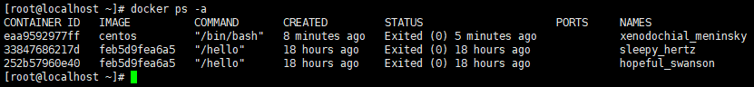
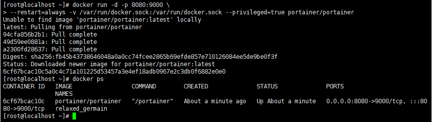
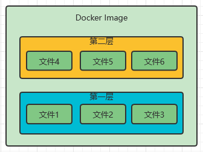
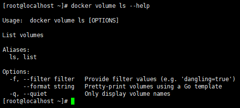
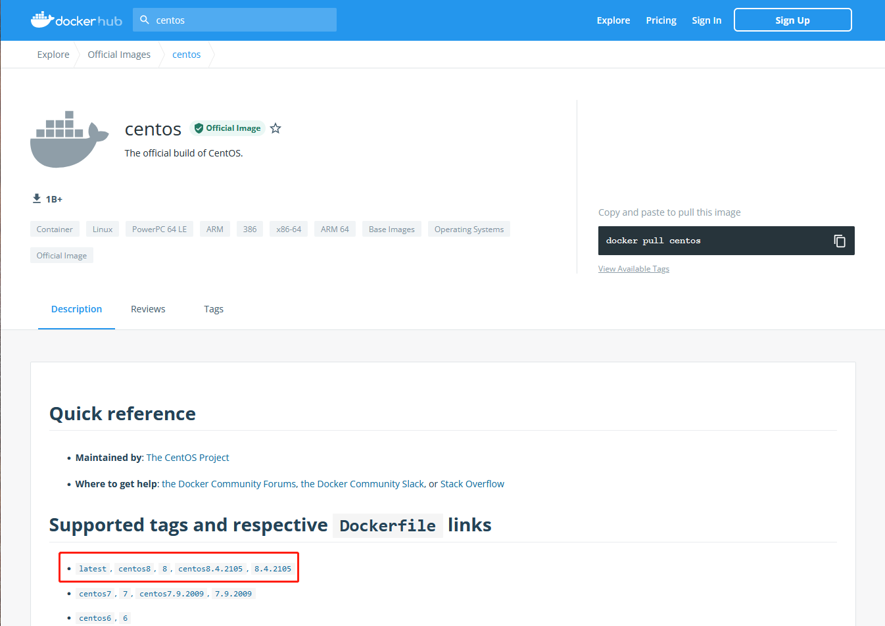
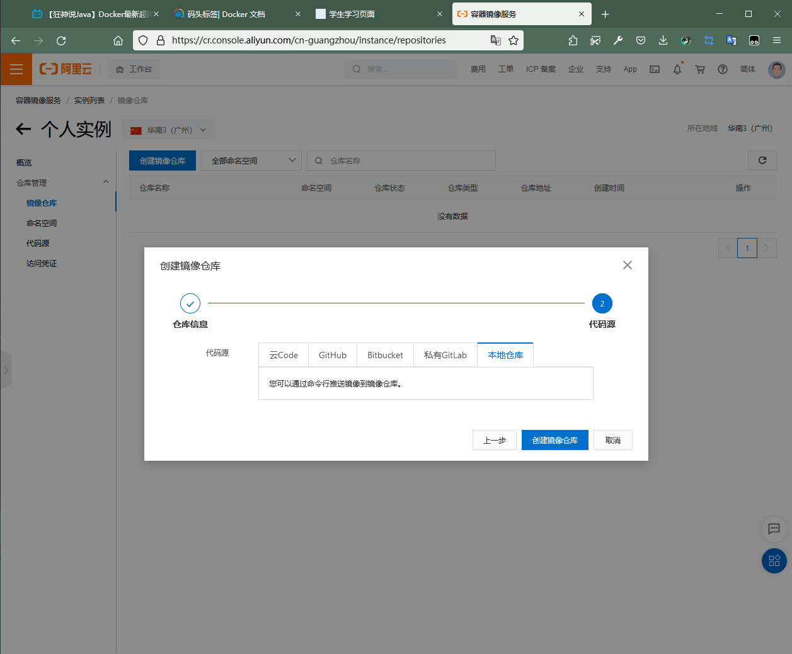
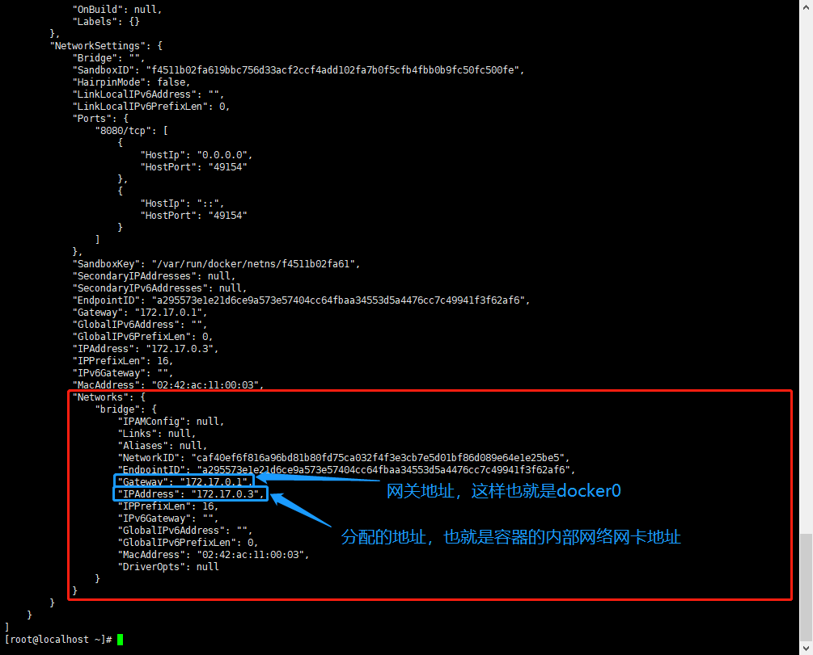
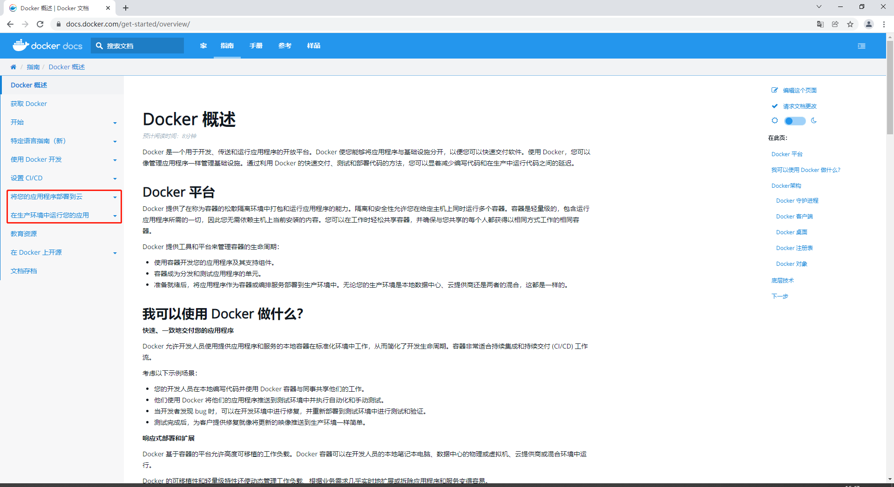
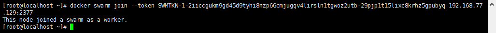

# Docker学习

**总体概述**

* Docker概述
* Docker安装
* Docker命令
  * 镜像命令
  * 容器命令
  * 操作命令
  * 。。。
* Docker镜像
* 容器数据卷
* DockerFile
* Idea整合Docker
* Dockers Compose
* Docker Swarm（简化版的K8s）
* CI\CD jenkins

------

# 1. Docker为什么会出现

## 1.1 Dockers的概述

​		在开发项目中有多套环境，或者是在环境中的各种配置。需要有多种环境的操作。这个过程中要保证产品在多环境中能够稳定运行。

​		在以往的多机器，集群的开发常见中。环境的配置过于麻烦。需要一个整合包来整体发布项目（项目+环境）。Docker即是这种方法。

​		在之前开发负责项目的开发，而运维来做项目部署上线。现在使用Docker即可一个人来完成。

​		Docker的核心思想就是隔离，将多个项目打包分箱，做到环境的隔离（隔离是为了避免以往的多个项目使用一个环境，导致各种业务端口，功能连接、项目配置都是交叉的、复杂的）。分箱将环境的复用和使用发挥到极致。

​		虚拟机的系统创建是很重的，在虚拟化过程中将各种软硬件进行实例化，这导致了一台虚拟机系统会占用多种资源。同时创建相同的一台系统也是同样进行这种方式，两台机子之间是重合的。而Docker使用了容器技术（也是一种虚拟化技术）。不虚拟化其他东西，只获取系统最核心的环境，这是一个镜像。启动系统只需要运行这个镜像就可以了。

​		Docker是使用golang语言开发。官网：https://www.docker.com/


文档：https://docs.docker.com/


仓库：https://hub.docker.com/


## 1.2 Docker和虚拟机的区别

传统虚拟机的虚拟化技术

**APP**：应用

**Lib**：类库

**Kernel**：核心

​	

**虚拟机技术的问题**：

1. 资源占用多
2. 冗余步骤多
3. 启动慢

​	

Docker技术


比较Docker和虚拟机技术的不同：

* 传统虚拟机：虚拟出硬件，在上面再去安装软件
* 容器化技术：容器内的应用直接运行在宿主机的内容，容器没有自己的内核，也没有虚拟机硬件
* 每个容器相互隔离，**每个容器都有一个自己的文件系统**，互不影响

* 传统：一对文档给运维，安装程序
* Docker：打包镜像发布测试，一键运行
* **更便捷的升级和扩容**
* 更简单的系统运维
* 开发和测试的环境的高度一致的
* 满足更高效的计算资源利用
* **内核级别的虚拟化**

# 2. Docker的安装

## 2.1 Docker的基本组成


* Client（image）：客户端、**镜像**、模板。可以通过这个镜像来创建容器服务。通过镜像可以创建多个容器。最终服务运行在容器中的。
* DOCKER_HOST（container）：服务端、容器。Docker利用容器技术，独立运行一个或者一组应用，通过镜像来创建的。启动、停止、删除这些基本命令。
* Registry（repository）：远程仓库、Docker Hub是国外的，国内有阿里云这种服务。仓库分为共有仓库和私有仓库

## 2.2 Centos7安装

​		使用虚拟机方式进行安装。安装带有gui界面的系统，这个安装耗时较长。安装完毕后：


需要启动进入gui的方式：

```bash
# 查看当前的系统启动模式
[root@localhost ~]# systemctl get-default
graphical.target
# 设置为图形界面模式
[root@localhost ~]# systemctl set-default graphical.target
Removed symlink /etc/systemd/system/default.target.
Created symlink from /etc/systemd/system/default.target to /usr/lib/systemd/system/graphical.target.

# 设置为命令行模式
[root@localhost ~]# systemctl set-default multi-user.target
Removed symlink /etc/systemd/system/default.target.
Created symlink from /etc/systemd/system/default.target to /usr/lib/systemd/system/multi-user.target.
```

reboot命令进行重启，切换系统界面：


使用Xshell来操作更加方便，这里需要查看这个系统的IP：

```bash
# 查看当前系统的IP
ip addr
```


这里可以看到虚拟机的网卡ens33没有显示出来IP，需要配置网卡，使其在启动系统时自动获取虚拟网卡的IP。这里如果是同其他命令来初始化网卡出现IP，但重启之后仍会失效，修改网卡配置是永久的。

```bash
# 进入网卡配置文件列表
cd /etc/sysconfig/network-scripts/
```

查看当前文件夹下文件的信息，可以看到网卡ens33的配置文件：


这里使用vi编辑器来操作配置文件：

```bash
# 编辑ifcfg-ens33
vi ifcfg-ens33
```

将`ONBOOT=NO`改为`ONBOOT=yes`。之后从重启系统就可以看到自动生成虚拟网卡的IP地址。这一个地址是动态的，但正常来说这个IP并不会出现突然的变化，如果要改为固定的IP，则可以使用这个方法提供的步骤：https://jingyan.baidu.com/article/363872ec796dfc6e4ba16f09.html


(这里可以看到虚拟网卡的IP是192.168.77.128)

如果遇到了启动之后仍然没有IP，则先检查是否为虚拟机的服务被禁用，有关虚拟机的服务可以用`win+R`打开，执行`services.msc`。按下按键`v`来找到虚拟机VMware的服务。这里要确保三个服务是启动状态：

1. **Virtual Disk**
2. **VMware DHCP Service** 
3. **VMware NAT Service**


然后再重启系统，使用命令`ifconfig`来查看网卡的IP分配。

如果还是不行，请检查下是否两个网卡服务的冲突：

1. NetworkManager
2. network.service

这里的话可以选择禁用Network Manager来使得network.serivce起效

```bash
# 停止NetworkManager服务
systemctl stop NetworkManager
# 关闭NetworkManager不开机启动
systemctl disable NetworkManager
# 重启网卡服务network.service
systemctl restart network
```

再实在不行只能百度查看问题了

在完成IP的虚拟网卡配置之后，就使用Xshell进行连接


关于这里为什么要使用`22`端口号，是因为计算机的网络协议中定义的。常见的网络协议端口有：


补充两个就是：

**HTTP协议所使用的端口是80**

**HTTPS协议所使用的端口是443**

在访问时会将这个端口号就会默认浏览器进行隐藏

使用Xshell连接成功：


## 2.3 Docker安装

环境的准备

1. 需要会Linux的基本使用
2. 运行的系统是CentOS7

**环境的查看**

```bash
# 查看当前系统
[root@localhost ~]# cat /etc/os-release
NAME="CentOS Linux"
VERSION="7 (Core)"
ID="centos"
ID_LIKE="rhel fedora"
VERSION_ID="7"
PRETTY_NAME="CentOS Linux 7 (Core)"
ANSI_COLOR="0;31"
CPE_NAME="cpe:/o:centos:centos:7"
HOME_URL="https://www.centos.org/"
BUG_REPORT_URL="https://bugs.centos.org/"

CENTOS_MANTISBT_PROJECT="CentOS-7"
CENTOS_MANTISBT_PROJECT_VERSION="7"
REDHAT_SUPPORT_PRODUCT="centos"
REDHAT_SUPPORT_PRODUCT_VERSION="7"

[root@localhost ~]# 
```

安装的方式是根据官方的文档进行：

https://docs.docker.com/engine/install/centos/


**卸载旧版本**：

```bash
yum remove docker \
                  docker-client \
                  docker-client-latest \
                  docker-common \
                  docker-latest \
                  docker-latest-logrotate \
                  docker-logrotate \
                  docker-engine
```

**安装基本环境**：

```bash
yum install -y yum-utils
```

**设置镜像的仓库**(这里不使用官方推荐的国外仓库地址，使用国内阿里云的镜像地址)：

```bash
yum-config-manager \
    --add-repo \
    http://mirrors.aliyun.com/docker-ce/linux/centos/docker-ce.repo
```

**更新yum索引**：

```bash
yum makecache fast
```

安装docker引擎(docker-ce:社区版、docker-ee:企业版)：

```bash
yum install docker-ce docker-ce-cli containerd.io
```

**启动docker**：

```bash
systemctl start docker
```

**查看docker的状态**：

```bash
docker version
```


**测试docker**：

```bash
# 查找下载并运行docker
docker run -d hello-world
docker run hello-world
# 先从本地查找，查找不到之后就会取网上查找，找到之后就会拉取镜像，拉取到本地之后就会进行运行
```


在启动运行hello-world镜像的过程

.png)

查看docker的镜像**：**

```bash
docker images
```


**卸载docker**：

```bash
# 卸载依赖
yum remove docker-ce docker-ce-cli containerd.io
# 移除目录（默认的工作目录）
rm -rf /var/lib/docker
```

关于docker的镜像加速地址，找到对应购买的云服务商官网，找到镜像加速，使用这个镜像加速地址来加速自己目前docker的环境。

具体配置为：

```bash
mkdir -p /etc/docker
tee /etc/docker/daemon.json <<-'EOF'
{
	"registry-mirrors":["https://qiyb9988.mirror.aliyuncs.com"]
}
EOF

systemctl daemon-reload
systemctl restart docker
```

## 2.4 Docker的工作原理

​		Docker是一个Client-Server结构的系统，Docker的守护进程运行在主机上。通过Socket从客户端访问。

​		Docker Server接收到Docker Client的指令，就执行这个命令。


Docker比虚拟机快：


1. Docker有着比虚拟机更少的抽象层
2. Docker利用的是宿主机的内核，vm需要是GuestOS(虚拟机操作系统，虚拟硬件)

​		新建一个容器的时候，docker不需要像虚拟机一样加载一个操作系统内核，避免引导。虚拟机是加载Guest OS，分钟级别的，而Docker是


## 2.5Docker的常用命令

帮助命令

```bash
# 显示版本信息
docker version
# 显示详细信息(镜像和容器的数量)
docker info
# 帮助命令
docker --help
```

更多的docker命令（官网）：

https://docs.docker.com/engine/reference/run/


### 2.5.1 镜像命令

**查看所有本地主机的镜像**：

```bash
[root@localhost ~]# docker images
REPOSITORY    TAG       IMAGE ID       CREATED        SIZE
hello-world   latest    feb5d9fea6a5   2 months ago   13.3kB
```

| REPOSITORY  | TAG    | IMAGE ID     | CREATED      | SIZE   |
| ----------- | ------ | ------------ | ------------ | ------ |
| hello-world | latest | feb5d9fea6a5 | 2 months ago | 13.3kB |

```bash
# 对应的字段功能
REPOSITORY 镜像的仓库
TAG        镜像的标签
IMAGE ID   镜像的id
CREATED    镜像的创建时间
SIZE       镜像的大小
```


查看`images`命令的参数：


这些参数的对应效果如下：

| 名称，简写         | 默认 | 描述                             |
| ------------------ | ---- | -------------------------------- |
| `--all` ,  `-a`    |      | 显示所有图像（默认隐藏中间图像） |
| `--digests`        |      | 显示摘要                         |
| `--filter` ,  `-f` |      | 根据提供的条件过滤输出           |
| `--format`         |      | 使用 Go 模板打印漂亮的图像       |
| `--no-trunc`       |      | 不要截断输出                     |
| `--quiet` ,  `-q`  |      | 仅显示图像 ID                    |


**Docker的搜索**：

在Docker Hub页面进行搜索：

https://hub.docker.com/search?q=mysql&type=image


在命令中进行搜索：

```shell
docker search [OPTIONS] TERM
```

这里搜索mysql镜像：


可以使用的参数：

```shell
docker search --help
```


每个参数对应的功能：

| 名称，简写         | 默认 | 描述                         |
| ------------------ | ---- | ---------------------------- |
| `--filter` ,  `-f` |      | 根据提供的条件过滤输出       |
| `--format`         |      | 使用 Go 模板进行漂亮打印搜索 |
| `--limit`          | `25` | 最大搜索结果数               |
| `--no-trunc`       |      | 不要截断输出                 |

例子（搜索mysql镜像，条件是stars树大于3000的）：

```shell
docker search mysql --filter=STARS=3000
```


**镜像的下载**：

```shell
docker pull [OPTIONS] NAME[:TAG|@DIGEST]
```

这里下载mysql镜像：

```shell
[root@localhost ~]# docker pull mysql
Using default tag: latest #如果不写tag，默认就是latest
latest: Pulling from library/mysql
a10c77af2613: Pull complete #分层下载，docker image的核心，联合文件系统
b76a7eb51ffd: Pull complete 
258223f927e4: Pull complete 
2d2c75386df9: Pull complete 
63e92e4046c9: Pull complete 
f5845c731544: Pull complete 
bd0401123a9b: Pull complete 
3ef07ec35f1a: Pull complete 
c93a31315089: Pull complete 
3349ed800d44: Pull complete 
6d01857ca4c1: Pull complete 
4cc13890eda8: Pull complete 
Digest: sha256:aeecae58035f3868bf4f00e5fc623630d8b438db9d05f4d8c6538deb14d4c31b #签名
Status: Downloaded newer image for mysql:latest 
docker.io/library/mysql:latest #真实地址
[root@localhost ~]# 
```

指定版本下载mysql（官网中有提供的）：

```shell
[root@localhost ~]# docker pull mysql:5.7
5.7: Pulling from library/mysql
a10c77af2613: Already exists # 分层下载中，比如这个版本中和之前版本不一样的去除，一样的分层就不用下载，剩余部分进行下载（5.7和最新版中有部分相同和部分不相同）
b76a7eb51ffd: Already exists 
258223f927e4: Already exists 
2d2c75386df9: Already exists 
63e92e4046c9: Already exists 
f5845c731544: Already exists 
bd0401123a9b: Already exists 
2724b2da64fd: Pull complete 
d10a7e9e325c: Pull complete 
1c5fd9c3683d: Pull complete 
2e35f83a12e9: Pull complete 
Digest: sha256:7a3a7b7a29e6fbff433c339fc52245435fa2c308586481f2f92ab1df239d6a29
Status: Downloaded newer image for mysql:5.7
docker.io/library/mysql:5.7
[root@localhost ~]# 
```


**删除镜像**：

```shell
docker rmi [OPTIONS] IMAGE [IMAGE...]
```

根据id来删除镜像（删除之前的Mysql5.7）：

`docker rmi -f 8b43c6af2ad0`


根据镜像id来批量删除（使用查询全部镜像的id结果集来做删除的参数）：

`docker rmi -f $(docker images -aq)`


### 2.5.2 容器命令

有了镜像之后才能创建容器。

```shell
# 下载一个Centos7系统
docker pull centos
```


**新建容器并启动**：

```shell
docker run [OPTIONS] IMAGE [COMMAND] [ARG...]
```

参数的说明：

| 名称，简写                | 默认      | 描述                                                         |
| ------------------------- | --------- | ------------------------------------------------------------ |
| `--add-host`              |           | 添加自定义主机到 IP 映射 (host:ip)                           |
| `--attach` ,  `-a`        |           | 附加到 STDIN、STDOUT 或 STDERR                               |
| `--blkio-weight`          |           | Block IO（相对权重），10到1000之间，或者0禁用（默认0）       |
| `--blkio-weight-device`   |           | 块IO权重（相对设备权重）                                     |
| `--cap-add`               |           | 添加 Linux 功能                                              |
| `--cap-drop`              |           | 删除 Linux 功能                                              |
| `--cgroup-parent`         |           | 容器的可选父 cgroup                                          |
| `--cgroupns`              |           | [API 1.41+ ](https://docs.docker.com/engine/api/v1.41/) 要使用的 Cgroup 命名空间（主机\|私有） ‘host’：在 Docker 主机的 cgroup 命名空间中运行容器 'private'：在自己的私有 cgroup 命名空间中运行容器 ''：使用配置的 cgroup 命名空间            守护进程上的 default-cgroupns-mode 选项（默认） |
| `--cidfile`               |           | 将容器 ID 写入文件                                           |
| `--cpu-count`             |           | CPU 计数（仅限 Windows）                                     |
| `--cpu-percent`           |           | CPU 百分比（仅限 Windows）                                   |
| `--cpu-period`            |           | 限制 CPU CFS（完全公平调度程序）周期                         |
| `--cpu-quota`             |           | 限制 CPU CFS（完全公平调度程序）配额                         |
| `--cpu-rt-period`         |           | [API 1.25+ ](https://docs.docker.com/engine/api/v1.25/) 以微秒为单位限制 CPU 实时周期 |
| `--cpu-rt-runtime`        |           | [API 1.25+ ](https://docs.docker.com/engine/api/v1.25/) 以微秒为单位限制 CPU 实时运行时间 |
| `--cpu-shares` ,  `-c`    |           | CPU份额（相对权重）                                          |
| `--cpus`                  |           | [API 1.25+ ](https://docs.docker.com/engine/api/v1.25/) CPU数量 |
| `--cpuset-cpus`           |           | 允许执行的 CPU (0-3, 0,1)                                    |
| `--cpuset-mems`           |           | 允许执行的 MEMs (0-3, 0,1)                                   |
| `--detach` ,  `-d`        |           | 在后台运行容器并打印容器 ID                                  |
| `--detach-keys`           |           | 覆盖用于分离容器的键序列                                     |
| `--device`                |           | 将主机设备添加到容器                                         |
| `--device-cgroup-rule`    |           | 向 cgroup 允许的设备列表添加规则                             |
| `--device-read-bps`       |           | 限制设备的读取速率（每秒字节数）                             |
| `--device-read-iops`      |           | 限制设备的读取速率（每秒 IO）                                |
| `--device-write-bps`      |           | 限制设备的写入速率（每秒字节数）                             |
| `--device-write-iops`     |           | 限制设备的写入速率（每秒 IO）                                |
| `--disable-content-trust` | `true`    | 跳过图像验证                                                 |
| `--dns`                   |           | 设置自定义 DNS 服务器                                        |
| `--dns-opt`               |           | 设置 DNS 选项                                                |
| `--dns-option`            |           | 设置 DNS 选项                                                |
| `--dns-search`            |           | 设置自定义 DNS 搜索域                                        |
| `--domainname`            |           | Container NIS domain name                                    |
| `--entrypoint`            |           | 覆盖图像的默认 ENTRYPOINT                                    |
| `--env` ,  `-e`           |           | 设置环境变量                                                 |
| `--env-file`              |           | 读入环境变量文件                                             |
| `--expose`                |           | 公开一个端口或一系列端口                                     |
| `--gpus`                  |           | [API 1.40+ ](https://docs.docker.com/engine/api/v1.40/) 要添加到容器中的 GPU 设备（'all' 以传递所有 GPU） |
| `--group-add`             |           | 添加要加入的其他组                                           |
| `--health-cmd`            |           | 运行以检查健康状况的命令                                     |
| `--health-interval`       |           | 运行检查之间的时间（ms\|s\|m\|h）（默认为 0s）               |
| `--health-retries`        |           | 报告不健康需要连续失败                                       |
| `--health-start-period`   |           | [API 1.29+ ](https://docs.docker.com/engine/api/v1.29/) 在开始健康重试倒计时（ms\|s\|m\|h）之前容器初始化的开始时间（默认为 0s） |
| `--health-timeout`        |           | 允许运行一次检查的最长时间（ms\|s\|m\|h）（默认为 0s）       |
| `--help`                  |           | 打印使用                                                     |
| `--hostname` ,  `-h`      |           | 容器主机名                                                   |
| `--init`                  |           | [API 1.25+ ](https://docs.docker.com/engine/api/v1.25/) 在容器内运行一个 init 来转发信号和收获进程 |
| `--interactive` ,  `-i`   |           | 即使未连接，也要保持 STDIN 打开                              |
| `--io-maxbandwidth`       |           | 系统驱动器的最大 IO 带宽限制（仅限 Windows）                 |
| `--io-maxiops`            |           | 系统驱动器的最大 IOps 限制（仅限 Windows）                   |
| `--ip`                    |           | IPv4 地址（例如 172.30.100.104）                             |
| `--ip6`                   |           | IPv6 地址（例如，2001:db8::33）                              |
| `--ipc`                   |           | 使用IPC模式                                                  |
| `--isolation`             |           | 容器隔离技术                                                 |
| `--kernel-memory`         |           | 内核内存限制                                                 |
| `--label` ,  `-l`         |           | 在容器上设置元数据                                           |
| `--label-file`            |           | 读入一行分隔的标签文件                                       |
| `--link`                  |           | 添加到另一个容器的链接                                       |
| `--link-local-ip`         |           | 容器 IPv4/IPv6 链路本地地址                                  |
| `--log-driver`            |           | 容器的日志驱动程序                                           |
| `--log-opt`               |           | 日志驱动程序选项                                             |
| `--mac-address`           |           | 容器 MAC 地址（例如，92:d0:c6:0a:29:33）                     |
| `--memory` ,  `-m`        |           | 内存限制                                                     |
| `--memory-reservation`    |           | 内存软限制                                                   |
| `--memory-swap`           |           | 交换限制等于内存加交换：“-1”启用无限交换                     |
| `--memory-swappiness`     | `-1`      | 调整容器内存交换（0 到 100）                                 |
| `--mount`                 |           | 将文件系统挂载附加到容器                                     |
| `--name`                  |           | 为容器指定名称                                               |
| `--net`                   |           | 将容器连接到网络                                             |
| `--net-alias`             |           | 为容器添加网络范围的别名                                     |
| `--network`               |           | 将容器连接到网络                                             |
| `--network-alias`         |           | 为容器添加网络范围的别名                                     |
| `--no-healthcheck`        |           | 禁用任何容器指定的 HEALTHCHECK                               |
| `--oom-kill-disable`      |           | 禁用 OOM 杀手                                                |
| `--oom-score-adj`         |           | 调整主机的 OOM 首选项（-1000 到 1000）                       |
| `--pid`                   |           | 要使用的 PID 命名空间                                        |
| `--pids-limit`            |           | 调整容器 pids 限制（设置 -1 表示无限制）                     |
| `--platform`              |           | [API 1.32+ ](https://docs.docker.com/engine/api/v1.32/) 如果服务器支持多平台，则设置平台 |
| `--privileged`            |           | 授予此容器扩展权限                                           |
| `--publish` ,  `-p`       |           | 将容器的端口发布到主机                                       |
| `--publish-all` ,  `-P`   |           | 将所有暴露的端口发布到随机端口                               |
| `--pull`                  | `missing` | 运行前拉取镜像（“总是”\|“缺失”\|“从不”）                     |
| `--read-only`             |           | 将容器的根文件系统挂载为只读                                 |
| `--restart`               | `no`      | 容器退出时应用的重启策略                                     |
| `--rm`                    |           | 退出时自动移除容器                                           |
| `--runtime`               |           | 用于此容器的运行时                                           |
| `--security-opt`          |           | 安全选项                                                     |
| `--shm-size`              |           | /dev/shm 的大小                                              |
| `--sig-proxy`             | `true`    | 代理接收到进程的信号                                         |
| `--stop-signal`           | `SIGTERM` | 停止容器的信号                                               |
| `--stop-timeout`          |           | [API 1.25+ ](https://docs.docker.com/engine/api/v1.25/) 停止容器的超时（以秒为单位） |
| `--storage-opt`           |           | 容器的存储驱动程序选项                                       |
| `--sysctl`                |           | sysctl 选项                                                  |
| `--tmpfs`                 |           | 挂载一个 tmpfs 目录                                          |
| `--tty` ,  `-t`           |           | 分配一个伪 TTY                                               |
| `--ulimit`                |           | 超限选项                                                     |
| `--user` ,  `-u`          |           | 用户名或 UID（格式：<name\|uid>[:<group\|gid>]）             |
| `--userns`                |           | 要使用的用户命名空间                                         |
| `--uts`                   |           | 要使用的 UTS 命名空间                                        |
| `--volume` ,  `-v`        |           | 绑定挂载卷                                                   |
| `--volume-driver`         |           | 容器的可选卷驱动程序                                         |
| `--volumes-from`          |           | 从指定的容器挂载卷                                           |
| `--workdir` ,  `-w`       |           | 容器内的工作目录                                             |

```shell
# 常用的命令
--name="Name"   容器的名字
-d              后台方式运行
-it				使用交互方式运行，进入容器查看内容
-p				小p指定容器的端口-p 主机和外部的对应端口
	|- -p 主机IP:主机端口:容器端口
	|- -p 主机端口:容器端口
	|- -p 容器端口
	|- 容器端口
-P				大P随机指定端口

```

例子：

```shell
# 启动centos镜像(创建容器)进行交互（进入容器），使用bash命令作为交互的控制台
docker run -it centos /bin/bash
```


这一个内部的系统是一个基础版本，所以很多命令并不能支持。

在内部系统时。使用`exit`进行退出。


（可以看到内外部都是Centos环境，但实际会有差别）


**运行中容器的查看**：

```shell
docker ps
```


**查看曾经运行过的容器**：

```shell
docker ps [OPTIONS]
```

这里使用`docker ps -a`来查询之前的docker正在运行+运行历史（不加-a下是只查正在运行）：



使用help命令可以查看到这个命令参数：

`docker ps --help`


参数对应的效果：

| 名称，简写        | 默认 | 描述                                    |
| ----------------- | ---- | --------------------------------------- |
| `--all` , `-a`    |      | 显示所有容器（默认显示正在运行）        |
| `--filter` , `-f` |      | 根据提供的条件过滤输出                  |
| `--format`        |      | 使用 Go 模板的漂亮打印容器              |
| `--last` , `-n`   | `-1` | 显示 n 个最后创建的容器（包括所有状态） |
| `--latest` , `-l` |      | 显示最新创建的容器（包括所有状态）      |
| `--no-trunc`      |      | 不要截断输出                            |
| `--quiet` , `-q`  |      | 只显示容器 ID                           |
| `--size` , `-s`   |      | 显示总文件大小                          |

 例子：

```shell
# 显示目前正在运行的容器信息
[root@localhost ~]# docker ps
CONTAINER ID   IMAGE     COMMAND   CREATED   STATUS    PORTS     NAMES

# 显示目前正在运行的容器信息+已运行的容器历史
[root@localhost ~]# docker ps -a
CONTAINER ID   IMAGE          COMMAND       CREATED          STATUS                      PORTS     NAMES
eaa9592977ff   centos         "/bin/bash"   23 minutes ago   Exited (0) 20 minutes ago             xenodochial_meninsky
33847686217d   feb5d9fea6a5   "/hello"      18 hours ago     Exited (0) 18 hours ago               sleepy_hertz
252b57960e40   feb5d9fea6a5   "/hello"      18 hours ago     Exited (0) 18 hours ago               hopeful_swanson

# 查看在运行+已运行历史+过滤剩最近的两条
[root@localhost ~]# docker ps -a -n=2
CONTAINER ID   IMAGE          COMMAND       CREATED          STATUS                      PORTS     NAMES
eaa9592977ff   centos         "/bin/bash"   24 minutes ago   Exited (0) 20 minutes ago             xenodochial_meninsky
33847686217d   feb5d9fea6a5   "/hello"      18 hours ago     Exited (0) 18 hours ago               sleepy_hertz

# 查看(在运行+已运行历史)的id+过滤剩最近的两条
[root@localhost ~]# docker ps -aq -n=2
eaa9592977ff
33847686217d
[root@localhost ~]# 
```


**退出容器**：

```shell
exit #直接退出并停止容器
Ctrl+P+Q #容器退出不停止
```

例子（容器退出不停止）：


**删除容器**：

```shell
docker rm [OPTIONS] CONTAINER [CONTAINER...]

# 删除指定id的容器
docker rm  容器id
```

对应参数的作用：

| 名称，简写         | 默认 | 描述                                   |
| ------------------ | ---- | -------------------------------------- |
| `--force` , `-f`   |      | 强制移除正在运行的容器（使用 SIGKILL） |
| `--link` , `-l`    |      | 删除指定链接                           |
| `--volumes` , `-v` |      | 删除与容器关联的匿名卷                 |

例子（使用参数传递方式来删除容器）

`docker rm -f $(docker ps -aq)`


同样删除全部镜像可以使用一个linux的命令

`docker ps -a -q|xargs docker rm`（将上一个命令的结果给当前命令做参数）


启动和停止容器命令：

```shell
# 启动容器
docker start 容器id
# 重启容器
docker restart 容器id
# 停止当前正在运行的一个容器
docker stop 容器id
# 停止当前正在运行的一个容器
docker kill 容器id
```

例子：


## 2.6Docker的其他命令

后台启动centos容器

```shell
docker run -d centos
```

发现没有前台应用，所以后台挂的程序给停了


这里如果选择后台运行则需要指定一个前台进程


### 2.6.1**查看日志**：

```shell
docker logs [OPTIONS] CONTAINER
```

可选用的参数有：

| 名称，简写             | 默认  | 描述                                                         |
| ---------------------- | ----- | ------------------------------------------------------------ |
| `--details`            |       | 显示提供给日志的额外详细信息                                 |
| `--follow` ,  `-f`     |       | 跟踪日志输出                                                 |
| `--since`              |       | 显示自时间戳（例如 2013-01-02T13:23:37Z）或相关（例如 42m 为 42 分钟）以来的日志 |
| `--tail` ,  `-n`       | `all` | 从日志末尾显示的行数                                         |
| `--timestamps` ,  `-t` |       | 显示时间戳                                                   |
| `--until`              |       | [API 1.35+ ](https://docs.docker.com/engine/api/v1.35/) 在时间戳（例如 2013-01-02T13:23:37Z）或相关（例如 42m 为 42 分钟）之前显示日志 |

例子：

`docker logs -f -t --tail 10 容器id`

这里先在内部系统里面使用shell脚本来输出这个日志

`docker run -d centos /bin/sh -c "while true;do echo zhuzhe;sleep 1;done"`


然后使用外部的日志命令来查看内容（查看最新的10条日志）：

`docker logs -f -t --tail 10 322ef04b3dab`


### 2.6.2**查看进程信息**：

```shell
docker top CONTAINER [ps OPTIONS]
```

根据当前容器id来查看进程信息：

```shell
[root@localhost ~]# docker top 322ef04b3dab
UID                 PID                 PPID                C                   STIME               TTY                 TIME                CMD
root                12096               12075               0                   02:08               ?                   00:00:05            /bin/sh -c while true;do echo zhuzhe;sleep 1;done
root                26553               12096               0                   05:04               ?                   00:00:00            /usr/bin/coreutils --coreutils-prog-shebang=sleep /usr/bin/sleep 1
[root@localhost ~]# 
```


### 2.6.3**查看容器的元数据**：

```shell
docker inspect [OPTIONS] NAME|ID [NAME|ID...]
```

这里使用`docker inspect 容器id`来获取容器的元数据


Id：是原实例id的全称id

Created：是实例的创建时间

Path：是实例的控制台

Args：是容器的启动参数

State：是容器的状态

Image：是容器来源的镜像

关于`docker inspect`的参数：

```shell
docker inspect --help
```


| 名称，简写        | 默认 | 描述                             |
| ----------------- | ---- | -------------------------------- |
| `--format` , `-f` |      | 使用给定的 Go 模板格式化输出     |
| `--size` , `-s`   |      | 如果类型为容器，则显示总文件大小 |
| `--type`          |      | 返回指定类型的 JSON              |


### 2.6.4**进入当前正在运行的容器**：

```shell
docker exec [OPTIONS] CONTAINER COMMAND [ARG...]
```

这里在之前有启动一个后台运行的容器，所以使用`docker exec -it 容器id bashShell`的方式来进入到容器。

使用**交互模式，指定容器id，指定默认投票命令控制台**的方式进入容器

```shell
[root@localhost ~]# docker exec -it 322ef04b3dab /bin/bash
[root@322ef04b3dab /]# ls
bin  dev  etc  home  lib  lib64  lost+found  media  mnt  opt  proc  root  run  sbin  srv  sys  tmp  usr  var
[root@322ef04b3dab /]# exit
exit
[root@localhost ~]# 

```


```shell
docker attach [OPTIONS] CONTAINER
```

这也是一个能进入正在运行容器的命令，并且进入到正在运行的命令行，不是新建一个会话，参数的功能有：

```shell
[root@localhost ~]# docker attach --help

Usage:  docker attach [OPTIONS] CONTAINER

Attach local standard input, output, and error streams to a running container

Options:
      --detach-keys string   Override the key sequence for detaching a container
      --no-stdin             Do not attach STDIN
      --sig-proxy            Proxy all received signals to the process (default true)
[root@localhost ~]# 

```

| 名称，简写      | 默认   | 描述                         |
| --------------- | ------ | ---------------------------- |
| `--detach-keys` |        | 覆盖用于分离容器的键序列     |
| `--no-stdin`    |        | 不要附加标准输入             |
| `--sig-proxy`   | `true` | 将所有接收到的信号代理到进程 |

例子：


### 2.6.5**将容器内的文件拷贝到容器外**：

```shell
docker cp [OPTIONS] CONTAINER:SRC_PATH DEST_PATH|-
docker cp 容器id:容器内路径 目的主机路径
```

例子（在容器内创建文件，然后在外部copy文件出来）：

```shell
# 查看当前正在运行的容器
[root@localhost ~]# docker ps
CONTAINER ID   IMAGE     COMMAND       CREATED         STATUS         PORTS     NAMES
59df965b9d35   centos    "/bin/bash"   2 minutes ago   Up 2 minutes             blissful_lewin

# 进入当前容器的命令行
[root@localhost ~]# docker attach 59df965b9d35

# 进入到文件夹下创建文件
[root@59df965b9d35 /]# cd /home/
[root@59df965b9d35 home]# touch zhuzhe.java
[root@59df965b9d35 home]# ls
zhuzhe.java

# 这里退出并无关系，只要容器的id在，就可以去copy文件出来
[root@59df965b9d35 home]# exit
exit

# copy容器的/home/目录下的文件到外部/home/目录下
[root@localhost ~]# cd /home/
[root@localhost home]# docker cp 59df965b9d35:/home/zhuzhe.java /home
[root@localhost home]# ls
zhuzhe  zhuzhe.java
[root@localhost home]# 
```


### 2.6.5**查看当前CPU的情况**：

```shell
docker stats [OPTIONS] [CONTAINER...]
```

这里使用`docker stats`命令返回用于运行容器的实时数据流。


关于参数的功能：

| 名称，简写     | 默认 | 描述                             |
| -------------- | ---- | -------------------------------- |
| `--all` , `-a` |      | 显示所有容器（默认显示正在运行） |
| `--format`     |      | 使用 Go 模板打印漂亮的图像       |
| `--no-stream`  |      | 禁用流统计并只提取第一个结果     |
| `--no-trunc`   |      | 不要截断输出                     |


## 2.6.6 容器的剩余命令


在之前的学习中都是基于本地的镜像和容器的操作命令，在下面将学习有关Docker Server的命令


### 2.6.7 Docker安装NGINX

* 搜索镜像

  ```shell
  docker search nginx
  ```

* 拉取镜像

  ```shell
  docker pull nginx
  ```

* 启动nginx

  ```shell
  # -d后台启动、--name指定nginx（启动多实例时）、指定外部的端口3344是映射到容器80端口
  docker run -d --name nginx01 -p 3344:80 nginx
  ```

* 测试nginx

  ```shell
  # 访问容器地址
  curl localhost:3344
  ```

* 解析访问过程

  

​		

```shell
# 外部访问到容器
# 查看外部机的防火墙状态
firewall-cmd --state
# 开启3344端口
firewall-cmd --zone=public --add-port=3344/tcp --permanent
# 重启防火墙
systemctl restart firewalld.service
# 查看防火墙开启的端口
firewall-cmd --list-ports
# 删除防火墙的已开启端口3345
firewall-cmd --permanent --remove-port=3345/tcp
# 使用自己的电脑（Windows）访问这个地址http://虚拟机网卡IP:3344
```

访问的结果：


这里是从Windows-->虚拟机（Linux）-->容器（Linux）-->容器的应用NGINX


### 2.6.7 Docker安装Tomcat

* 拉取镜像并运行容器

  ```shell
  # 拉取启动tomcat，并在停止容器之后自动删除容器（测试用）
  docker run -it --rm tomcat:9.0
  # 这里如果使用传统方式则先拉取镜像
  docker pull tomcat:9.0
  # 再启动tomcat
  docker run -d --name tomcat01 -p 3355:8080 tomcat:9.0
  ```

* 进入容器，修改下tomcat的配置

  ```shell
  # 进入到容器，以命令行作为控制台
  [root@localhost ~]# docker exec -it tomcat01 /bin/bash
  
  # 查看到当前容器实际是一个缩小版的Tomcat，和原版tomcat有点区别
  root@e638e1487503:/usr/local/tomcat# ls
  BUILDING.txt	 LICENSE  README.md	 RUNNING.txt  conf  logs	    temp     webapps.dist
  CONTRIBUTING.md  NOTICE   RELEASE-NOTES  bin	      lib   native-jni-lib  webapps  work
  
  # 再webapps下没有默认应用
  root@e638e1487503:/usr/local/tomcat# cd webapps
  root@e638e1487503:/usr/local/tomcat/webapps# ls
  root@e638e1487503:/usr/local/tomcat/webapps# cd ..
  
  # 应用是压缩在这个目录下，将其复制到webapps
  root@e638e1487503:/usr/local/tomcat# cp -r webapps.dist/* webapps
  
  # 查看复制的结果
  root@e638e1487503:/usr/local/tomcat# cd webapps
  root@e638e1487503:/usr/local/tomcat/webapps# ls
  ROOT  docs  examples  host-manager  manager
  ```

* 防火墙开启容器Tomcat的端口

  ```shell
  # 外部访问到容器
  # 查看外部机的防火墙状态
  firewall-cmd --state
  # 开启3355端口
  firewall-cmd --zone=public --add-port=3355/tcp --permanent
  # 重启防火墙
  systemctl restart firewalld.service
  # 查看防火墙开启的端口
  firewall-cmd --list-ports
  # 使用自己的电脑（Windows）访问这个地址http://虚拟机网卡IP:3344
  ```

* 外部测试访问

​		访问链接http://192.168.77.128:3355/

​		


### 2.6.7 Docker安装ES+Kibana

```shell
# es:elasticsearch
# es暴露的端口很多
# es十分耗费内存
# es的数据一般需要放置到安全目录
```

* 拉取镜像并运行容器

  ```shell
  docker run -d --name elasticsearch --net somenetwork -p 9200:9200 -p 9300:9300 -e "discovery.type=single-node" elasticsearch:tag
  ```

  `--net`: 网络配置

  `"discovery.type=single-node"`:集群，默认单个节点

  `elasticsearch:tag`:指定版本

  删除不需要的内容之后，只需使用下面的命令拉取镜像来运行容器

  ```shell
  docker run -d --name elasticsearch -p 9200:9200 -p 9300:9300 -e "discovery.type=single-node" elasticsearch:7.6.2
  ```

* 测试es

  ```shell
  curl localhost:9200
  ```

  

* 查看es占用的内存

  ```shell
  docker stats
  ```

  

* 开发防火墙端口

  ```shell
  # 外部访问到容器
  # 查看外部机的防火墙状态
  firewall-cmd --state
  # 开启9200和9300端口
  firewall-cmd --zone=public --add-port=9200/tcp --permanent
  firewall-cmd --zone=public --add-port=9300/tcp --permanent
  # 重启防火墙
  systemctl restart firewalld.service
  # 查看防火墙开启的端口
  firewall-cmd --list-ports
  # 使用自己的电脑（Windows）访问这个地址http://虚拟机网卡IP:9200
  ```

  访问结果：

  

  ```shell
  # 使用kibana
  # 使用kibana来连接ES，不能直接连接，以为容器内部是互相隔离的，kibana和ES是两个独立的容器
  # 以为两个容器的使用都是依赖Linux的内部网络系统的，可以使用Linux的内网来访问其他容器（Docker的网络知识）
  ```

  


# 3. Docker的可视化

## 3.1 portainer

portainer是一个Docker的图形界面工具。提供一个后台面板来操作Docker

先使用这个，后期使用Rancher（CI/CD再用）

```shell
docker run -d -p 8888:9000 \
--restart=always -v /var/run/docker.sock:/var/run/docker.sock --privileged=true portainer/portainer
```

命令中主要的是。其他的参数是对这个挂在的参数

```shell
docker run -d -p 8888:9000 portainer/portainer
```

再下载镜像完成之后就自动运行容器了（下面的截图中8080-->8888）



之后需要开启这个防火墙端口，因为需要外部浏览器来访问。

```shell
# 外部访问到容器
# 查看外部机的防火墙状态
firewall-cmd --state
# 开启8888端口
firewall-cmd --zone=public --add-port=8888/tcp --permanent
# 重启防火墙
systemctl restart firewalld.service
# 查看防火墙开启的端口
firewall-cmd --list-ports
# 使用自己的电脑（Windows）访问这个地址http://虚拟机网卡IP:9200
```

通过访问测试，可以看到这个管理平台：

http://192.168.77.128:8888


设置下密码，设置为12345678


设置数据源为本地


点击连接之后，可以看到正在运行一个容器，就是当前的容器


# 4. Docker镜像讲解


## 4.1 镜像是什么

​		镜像是一种轻量级、可执行的独立软件包，用来打包软件运行环境和基于运行环境开发的软件，它包含运行某个软件所需的所有内容，包括代码、运行时库、环境变量和配置文件。

​		获得镜像的方式有从远程仓库下载、朋友拷贝给你、自己制作一个。


## 4.2 联合文件系统

> UnionFS（联合文件系统，文件复用原理）

​		UnionFS（联合文件系统）：Union文件系统是一种分层、轻量级并且高性能的文件系统，它不仅支持对文件系统的修改作为一次提来一层层的叠加，同时可以将不同目录挂载到同一个虚拟文件系统下（unite several directories into a single virtual file system）。Union文件系统是Docker镜像的基础，镜像可以通过分层来进行继承，基于基础镜像（没有父镜像），可以制作各种具体的应用镜像。

​		**在之前下载不同版本的Tomcat中可以看到，文件是一层层组成。新版本的Tomcat也是在旧版本Tomcat更新过来的，所以底层相同的就可以进行复用。就像下载一个Tomcat和JDK的镜像。因为都是使用了Linxu内核，所以这一层可以一次下载多次复用。**


​		镜像使用分层的结构的好处是可以资源共享。多个镜像都从相同的Base镜像构建而来，那么宿主机只需要在磁盘上保留一份base镜像，同时内存中也只需要加载一份base镜像，就可以为所有容器服务了。镜像的每一层都可以被共享。


## 4.3 镜像结构

> Docker镜像加载原理

​		Docker的镜像实际上由一层一层的文件系统组成，这种层级的文件系统UnionFS。

​		**bootfs**（boot file system）主要包含bootloader和kernel（内核），boot loader主要是引导加载kernel。Linux刚启动时会加载bootfs文件系统，再Docker镜像的最底层是bootfs。这一层与我们典型的Linux/Unix系统是一样的，包含boot加载器和内核。当boot加载完成之后整个内核就都在内存中了，此时内存的使用权已由bootfs转交给内核，此时系统也会卸载bootfs。

​		**rootfs**（root file system），再bootfs之上。包含的就是典型Linux系统中的/dev，/proc，/bin，/etc 等标准目录和文件，rootfs就是各种不同的**操作系统**发行版，比如Ubuntu，Centos等等。


**平时安装虚拟机的centOS都是好几个G，为什么Docker才200M。**

​		因为对于一个**精简的OS**，rootfs可以很小，只需要包含最基本的命令，工具和程序库就可以了，因为底层直接用Host的kernel，自己只需要提供rootfs就可以了。由此可见对于不同的Linux发行版，bootfs基本是一致的，rootfs会有差别，因此不同的发行版就可以公用。

 


## 4.4 镜像层

​		**所有的Docker镜像都起始于一个基础镜像**，当进行修改或增加时，就会在当前镜像上，创建新的镜像层。

​		例如基于Ubuntu创建一个新的镜像，这就是第一层。如果在该镜像中添加Python包，就会在基础镜像之上创建第二个镜像。如果再添加一个安全补丁，则创建了第三层。

​		**修改或新增内容后提交，就会产生一个新的镜像层。**


​		在添加额外的镜像层的同时，镜像始终保持是当前所有镜像的组合（顺序）。


## 4.5 镜像层文件

​		假设每个镜像层包含3个文件，那最终这个镜像中包含两个镜像层就是6个文件（文件分层是抽象的，实际文件都放在一块）。



​		所以在下载镜像时看到的一个个Layer，就是这个镜像所组成的文件。

​		


## 4.5 镜像层文件迭代替换		

​		在Docker镜像中还存在一种情况，就是多层镜像间的文件迭代替换。在外部看来只有6个文件，这是因为最上层中的文件7是文件5的一个更新版。


​		这种情况下，上层镜像层中的文件覆盖了底层中的文件。这样就使得文件的更新版本作为一个新镜像层添加到镜像中（下载新版时是分层下载的，其他文件不变，只有版本文件下载）。

​		Docker通过存储引擎（新版本使用快照机制）的方式来实现镜像层堆栈，并保证多镜像层对外展示为统一的文件系统。

​		Linux上可用的存储引擎有AUFS、Overlay2、Device Mapper、Btrfs以及ZFS。每种存储引擎都基于Linux中对应的文件系统或者块设备技术，每种存储引擎都有独特的功能。

​		Docker在Windows上仅支持windowsfilter一种存储引擎，该引擎基于NTFS文件系统之上实现了分层和Cow[1]。

​		镜像层在对外时堆叠合并，提供统一的视图。


​		Docker镜像都是只读的，当容器启动时，一个新的可写层被加载到镜像的顶部。这一层就是我们通常说的容器层，容器之下的都叫镜像层。


## 4.6 镜像提交

```shell
# 提交镜像
docker commit 提交容器成为一个新的副本
docker commit [OPTIONS] CONTAINER [REPOSITORY[:TAG]]
# 命令和git原理类似
docker commit -m="提交的描述信息" -a="作者" 容器id 目标镜像名:[TAG]
```

有关这个提交时的参数：

| 名称，简写         | 默认   | 描述                                                     |
| ------------------ | ------ | -------------------------------------------------------- |
| `--author` , `-a`  |        | 作者（例如，“约翰·汉尼拔·史密斯 <hannibal@a-team.com>”） |
| `--change` , `-c`  |        | 对创建的镜像应用Dockerfile指令                           |
| `--message` , `-m` |        | 提交消息                                                 |
| `--pause` , `-p`   | `true` | 提交期间暂停容器                                         |


​		**一个镜像在运行容器后，容器的更改并不会直接影响到镜像。下面例子中，一个容器的更改后，重新从镜像运行一个容器，其内容还是和之前一样。**

1. 运行一个容器

   ```shell
   docker run -d --name tomcat01 -p 8081:8080 tomcat:9.0
   ```

   

   

2. 修改容器的内容

   ```shell
   docker exec -it 容器id /bin/bash
   ```

   

   

3. 停止容器重新启动，可以看到容器本身是能保存的

   ```shell
   docker stop 容器id
   docker start 容器id
   docker exec -it 容器id /bin/bash
   ```

   

   

4. 但将容器删除之后，重新运行一个容器，其内容是之前的。也就是说前面的操作没有保存到镜像中。

   ```shell
   docker rm 容器id
   ```
   
   
   
   

​	


​	**容器在进行修改之后，可以提交到一个镜像里。这样使用这个镜像就可以运行出当时的容器环境状态。**

1. 对容器进行操作，并提交至镜像

   ```shell
   docker commit -a="作者" -m="提交信息" 容器id 自定义镜像名:自定义镜像版本
   ```

   

   

2. 删除当前的容器，并使用提交的镜像来运行容器，发现容器就是之前的修改后的状态

   ```shell
   docker run -d --name 容器名 -p 宿主端口:容器端口 新镜像名:对应镜像的版本
   ```
   
   
   
   


# 5. 容器数据卷

​		数据如果都在容器中，在删除容器时，就会导致数据丢失。需要将容器的数据存储在本地。容器数据源使得容器之间有一个数据共享的技术，将Docker容器中产生的数据，同步到本地。将容器中的目录，挂载到Linux上面。


1. 容器和宿主Linux的数据共享
2. 容器和容器的数据共享


## 5.1 使用数据卷

> 方式一：直接使用docker的运行命令参数 `-v` 来挂载

```shell
docker run -it -v 主机目录:容器目录
```

**运行一个centos容器，挂载/home目录到本地的/home/test_dir**

1. 挂载方式启动容器`docker run -it -v /home/test_dir:/home centos /bin/bash`

   

   在启动之后，就会对容器目录镜像挂载到宿主机目录。如果宿主机目录不存在，则会创建。

2. 容器中创建内容`touch zhuzhe.java`

   

3. 查看到宿主机已经`ll /home/test_dir/`

   

**在挂载成功之后，容器和宿主机之间可以进行交互。**

1. 容器在退出之后会停止，此时宿主机挂载的目录还在，进入修改文件`vim /home/test_dir/zhuzhe.java`

   

2. 重新启动容器，并进入容器目录`docker exec -it e4e16e245b24 /bin/bash`

   

3. 查看容器文件，发现记录了宿主机的操作

   


## 5.2 MySQL的数据文件挂载

**解决MySQL的数据持久化问题。**


### 5.2.1 **正常情况使用MySQL容器**

```shell
# 工具官方dockerhub的解释，后台运行mysql并指定密码
docker run --name mysql01 -e MYSQL_ROOT_PASSWORD=123456 -p 3306:3306 -d mysql:5.7
# 开启防火墙来支持远程访问
# 查看外部机的防火墙状态
firewall-cmd --state
# 开启8888端口
firewall-cmd --zone=public --add-port=3306/tcp --permanent
# 重启防火墙
systemctl restart firewalld.service
# 查看防火墙开启的端口
firewall-cmd --list-ports
```

开启之后通过远程连接的方式来操作数据库：


连接成功之后创建数据库和表：

```sql
# 创建数据库
CREATE DATABASE DOCKER_DB;
USE DOCKER_DB;
# 创建数据表
CREATE TABLE IF NOT EXISTS `T_DOCKER`(
   `id` INT UNSIGNED AUTO_INCREMENT,
   `title` VARCHAR(100) NOT NULL,
   `name` VARCHAR(40) NOT NULL,
   PRIMARY KEY ( `id` )
)ENGINE=InnoDB DEFAULT CHARSET=utf8;
# 插入一条数据
INSERT T_DOCKER(title,name) VALUES('Hello World!','zhuzhe');
# 查询数据
SELECT * FROM T_DOCKER;
```


回到容器中查看，可以使用`docker attach -it mysql01 bash`或是`docker exec -it mysql01 bash`来进入MySQL容器。


​		在这个时候可以发现，当MySQL发生数据丢失时，处在容器外的我们不能及时处理 这种情况。所以需要将容器内的数据文件同步到容器外宿主机上。这种方式就是挂载，通过Linux的文件系统，实现操作同步。


### 5.2.2**容器指定路径挂载**

​		这种方式的挂载是指定两个路径来映射。在启动容器时需要指定这些路径的内容，路径不存在时会自动创建，但有一方挂载文件夹为空时，会导致另一方的文件夹文件被清空。


1. 启动一个临时的容器来复制数据文件。

   ```shell
   # 进入MySQL容器
   [root@localhost ~]# docker exec -it mysql01 bash
   ```

   

   找到配置文件：

   ```shell
   root@357c47caf102:/# ls /etc/mysql/conf.d
   docker.cnf  mysql.cnf  mysqldump.cnf
   ```

   

   找到数据文件：

   ```shell
   root@357c47caf102:/# ls /var/lib/mysql
   auto.cnf    client-cert.pem  ib_logfile0  ibtmp1	      private_key.pem  server-key.pem
   ca-key.pem  client-key.pem   ib_logfile1  mysql		      public_key.pem   sys
   ca.pem	    ib_buffer_pool   ibdata1	  performance_schema  server-cert.pem
   ```

   

2. 先将文件复制到宿主机（因为直接空目录挂载会可能导致容器文件被清空）。

   ```shell
   # 创建文件夹
   [root@localhost ~]# mkdir -p /home/mysql/conf && mkdir -p /home/mysql/data
   # 复制配置文件到宿主机目录
   [root@localhost ~]# docker cp mysql01:/etc/mysql/conf.d/. /home/mysql/conf
   # 复制数据文件到宿主机目录
   [root@localhost ~]# docker cp mysql01:/var/lib/mysql/. /home/mysql/data
   ```

   

3. 删除当前容器，这次启动一个挂载的MySQL，也就是正式运行的容器

   ```shell
   # 停止并删除容器
   [root@localhost ~]# docker stop mysql01
   [root@localhost ~]# docker rm mysql01
   ```

   

   ```shell
   # 挂载方式启动容器(启动失败时检查是否已经有容器了，有的话需要删除)
   [root@localhost ~]# docker run -d -p 3306:3306 -v /home/mysql/conf:/etc/mysql/conf.d -v /home/mysql/data:/var/lib/mysql -e MYSQL_ROOT_PASSWORD=123456 --name mysql01 mysql:5.7
   # 进入容器查看数据文件是否丢失
   [root@localhost ~]# docker exec -it mysql01 bash
   root@c9063761f4a0:/# ls /etc/mysql/conf.d
   root@c9063761f4a0:/# ls /var/lib/mysql
   ```

   可以看到，以这种方式启动容器不会导致挂载容器的文件被删除

   

4. 在开通端口后，使用外部工具来添加数据库数据

   

   这里添加了一个库DOCKER_DB，库里有一个表T_DOCKER

5. 查看MySQL容器中的数据文件，看是否有DOCKER_DB库和T_DOCKER表

   

   可以看到容器中已经有这一个数据了

6. 再去查看挂载的宿主机文件

   

   可以看到挂载的文件夹下也是同样有这个数据文件了，这样就算容器挂掉，这外部同样保留着这些数据文件。


### 5.2.3 容器匿名挂载和具名挂载

这两种挂载方式都不同前面指定容器路径名、宿主机路径名的方式。使用`-v`参数带`/`时会识别为以路径来挂载。不使用时有匿名挂载和具名挂载两种方式。可以通过`docker volume`的命令来进行操作。

```shell
# docker volume [param]
```


#### 5.2.3.1 查看所有容器数据卷

列出Docker已知所有卷。可以使用参数来过滤信息。

```shell
docker volume ls [OPTIONS]
```



提供的参数有：

| 名称，简写         | 默认 | 描述                                |
| ------------------ | ---- | ----------------------------------- |
| `--filter` ,  `-f` |      | 提供过滤器值（例如'dangling=true'） |
| `--format`         |      | 使用 Go 模板漂亮地打印卷            |
| `--quiet` ,  `-q`  |      | 只显示卷名                          |


#### 5.2.3.2 查看容器数据卷的详情

查看一个或者多个卷的详细信息

```shell
docker volume inspect [OPTIONS] VOLUME [VOLUME...]
```


提供的参数有：

| 名称，简写         | 默认 | 描述                         |
| ------------------ | ---- | ---------------------------- |
| `--format` ,  `-f` |      | 使用给定的 Go 模板格式化输出 |


#### 5.2.3.6**匿名挂载**

**在挂载时只指定容器路径**

`docker run -d -P --name 容器名 -v 容器路径名 镜像名`

例子：

```shell
# 匿名挂载nginx容器
[root@localhost ~]# docker run -d -P --name nginx01 -v /etc/nginx nginx
# 查看所有容器数据卷信息
[root@localhost ~]# docker volume ls
```


没有指定数据卷名，会自动分配一个随机名。


#### 5.2.3.7**具名挂载**

**在挂载时指定数据卷名和容器路径**

```shell
# 具名挂载nginx容器
[root@localhost ~]# docker run -d -P --name nginx02 -v shujujuan-nginx02:/etc/nginx nginx
# 查看所有容器数据卷信息
[root@localhost ~]# docker volume ls
```


有指定这个数据卷名，在挂载运行后，可以查看到数据卷的名称。定义这个卷名一方面为了区分，另一方是使用查看卷详情时方便

```shell
# 查看shujujuan-nginx02的详情
[root@localhost ~]# docker volume inspect shujujuan-nginx02
```


可以看到这个卷详情中，说明了分配到宿主机中的挂载路径`/var/lib/docker/volumes/shujujuan-nginx02/_data`。

在这个路径下可以看到挂载后的文件：


这个挂载后的文件，实际docker都是放在一起的，可以通过切换上级目录，看到：


（这一个和一开始是同`docker volume ls`看到的所有卷信息一致）


#### 5.2.3.8 挂载操作权限

​		在挂载时指定这个文件夹的操作权限，一旦设置了这个权限，容器对我们挂载出来的内容就有限定了。

```shell
# ro: read-only（只读），说明这个路径只能通过宿主机来操作
[root@localhost ~]# docker run -d -P --name nginx03 -v shujujuan-nginx03:/etc/nginx:ro nginx
# rw: read-write（读写）
[root@localhost ~]# docker run -d -P --name nginx03 -v shujujuan-nginx03:/etc/nginx:rw nginx
```

默认是rw的权限，如果设置了只读的权限，则挂载目录宿主机能更改，容器不能更改。


### 5.2.4 DockerFile

​		DockerFile是一种命令脚本，可以用来构建Docker镜像。命令编写分层对应docker中的镜像层文件。


新建一个文件区域用于保存编写的脚本：

```shell
# 新建文件夹
[root@localhost ~]# cd /home/
[root@localhost home]# mkdir docker_script
[root@localhost home]# cd docker_script/
# 编写脚本
[root@localhost docker_script]# vim dockerfile1
```


然后编写一个脚本，对应的内容是

```shell
# 使用centos作为基础【指令需要大写】
FROM centos

# 挂载卷(匿名挂载，可以看后面的效果图)
VOLUME ["volume01","volume02"]

# 构建结束信息
CMD echo "------end------"
# 构建完进入容器使用bash控制台
CMD /bin/bash
```


使用`docker build`命令来构建。

```shell
docker build [OPTIONS] PATH | URL | -
```


参数的解释是：

| Name, shorthand           | Default | Description                                                  |
| ------------------------- | ------- | ------------------------------------------------------------ |
| `--add-host`              |         | 添加自定义主机到 IP 映射 (host:ip)                           |
| `--build-arg`             |         | 设置构建时变量                                               |
| `--cache-from`            |         | 考虑作为缓存源的镜像                                         |
| `--cgroup-parent`         |         | 容器的可选父 cgroup                                          |
| `--compress`              |         | 使用gzip压缩构建上下文                                       |
| `--cpu-period`            |         | 限制 CPU CFS（完全公平调度程序）周期                         |
| `--cpu-quota`             |         | 限制 CPU CFS（完全公平调度程序）配额                         |
| `--cpu-shares` , `-c`     |         | CPU份额（相对权重）                                          |
| `--cpuset-cpus`           |         | 允许执行的 CPU (0-3, 0,1)                                    |
| `--cpuset-mems`           |         | 允许执行的 MEMs (0-3, 0,1)                                   |
| `--disable-content-trust` | `true`  | 跳过镜像验证                                                 |
| `--file` , `-f`           |         | Dockerfile的名称（默认为“PATH/Dockerfile”）                  |
| `--force-rm`              |         | 始终移除中间容器                                             |
| `--iidfile`               |         | 将镜像ID写入文件                                             |
| `--isolation`             |         | 容器隔离技术                                                 |
| `--label`                 |         | 设置镜像的元数据                                             |
| `--memory` , `-m`         |         | 内存限制                                                     |
| `--memory-swap`           |         | 交换限制等于内存加交换：“-1”启用无限交换                     |
| `--network`               |         | [API 1.25+ ](https://docs.docker.com/engine/api/v1.25/) 在构建期间为 RUN 指令设置网络模式 |
| `--no-cache`              |         | 构建镜像时不要使用缓存                                       |
| `--output` ,  `-o`        |         | [API 1.40+ ](https://docs.docker.com/engine/api/v1.40/) 输出目的地（格式：type=local,dest=path） |
| `--platform`              |         | [API 1.38+ ](https://docs.docker.com/engine/api/v1.38/) 如果服务器支持多平台，则设置平台 |
| `--progress`              | `auto`  | 设置进度输出的类型（自动、普通、tty）。  使用plain显示容器输出 |
| `--pull`                  |         | 总是尝试拉取更新版本的镜像                                   |
| `--quiet` ,  `-q`         |         | 成功时禁止构建输出并打印镜像 ID                              |
| `--rm`                    | `true`  | 成功构建后删除中间容器                                       |
| `--secret`                |         | [API 1.39+ ](https://docs.docker.com/engine/api/v1.39/) 公开给构建的秘密文件（仅当启用 BuildKit 时）：id=mysecret,src=/local/secret |
| `--security-opt`          |         | 安全选项                                                     |
| `--shm-size`              |         | /dev/shm 的大小                                              |
| `--squash`                |         | [实验（守护进程） ](https://docs.docker.com/engine/reference/commandline/dockerd/#daemon-configuration-file)[API 1.25+ ](https://docs.docker.com/engine/api/v1.25/) 将新建的层压缩成一个新层 |
| `--ssh`                   |         | [API 1.39+ ](https://docs.docker.com/engine/api/v1.39/) SSH 代理套接字或要暴露给构建的密钥（仅当启用 BuildKit 时）（格式：default\|<id>[=<socket>\|<key>[,<key>]]） |
| `--stream`                |         | 流附加到服务器以协商构建上下文                               |
| `--tag` ,  `-t`           |         | 名称和可选的“名称：标签”格式的标签                           |
| `--target`                |         | 将目标构建阶段设置为构建。                                   |
| `--ulimit`                |         | 超限选项                                                     |

这里使用一个例子方式来构建镜像`docker build -f dockerfile1 -t zhuzhe-centos:1.0 .`


启动我们构建好的镜像，这次启动就不用指定这个挂载参数。启动运行这个容器，查看这个容器的目录

```shell
[root@localhost ~]# docker run -it 6063a610a676 /bin/bash
[root@fc697c4e5744 /]# ls -l
```

可以看到，在这个容器的目录中，是基本centos的根目录。同时里面还包含了之前定义的两个挂载目录`volume01`和`volume02`。


并且这个卷和外部宿主机有一个挂载的目录，可以通过`docker inspect 容器id`来查看到


可以看到这个匿名挂载后，分配的本地挂载目录

```shell
# volume01
"Source": "/var/lib/docker/volumes/d200dadfe6a700d982dbb8766e95ec5ef8a068300f6935649a3a6de0adad4950/_data"
# volume02
"Source": "/var/lib/docker/volumes/26529536f25843c204d4cf85b98620d95d922600693bab813885e6d0e2fa24e2/_data"
```

所以这个脚本是在构建镜像时指定这个目录挂载。现在可以在容器中创建文件，来宿主机中验证的挂载的效果。


而这种挂载方式就是数据卷的匿名挂载：


### 5.2.5 数据卷容器

```txt
选择一个容器挂载数据卷，让其它容器通过挂载这个(父容器)实现挂载相同的数据卷（模拟出数据共享），这一个容器称之为数据卷容器。
```

使用命令`--volumes-from`。


```shell
# 启动一个容器docker01，作为数据卷容器
[root@localhost ~]# docker run -it --name docker01 zhuzhe-centos:1.0
# 启动第二个容器docker02，挂载数据卷容器
[root@localhost ~]# docker run -it --name docker02 --volumes-from docker01 zhuzhe-centos:1.0
```

启动`docker02`之后，可以看到在`docker01`中创建的文件，可以在`docker02`中看到。


这里是因为，容器`docker02`复制使用了`docker01`的数据卷，而这个数据卷是挂载宿主机的一个目录。也就是说现在有两个容器挂载同一个目录，所以看起来两个容器是数据同步的。


可以通过`docker inspect docker01`和`docker inspect docker02`来对比信息。`挂载（Mounts）`是一样的。


所以上面的修改中创建了一个文件`zhuzhe.java`，可以在宿主机中查看到：


因为这种方式是通过挂载 “数据卷容器” 的方式，更加快捷。同时这种挂载方式是一个数据卷支持多个容器，可以再创建一个`docker03`来继续挂载 “数据卷容器” 。


这种数据卷方式的挂载，实际是通过命令给每个其他容器赋予了挂载到数据卷容器的功能。所以并不直接依赖数据卷容器。在删除数据卷容器后，可以看到其他容器的挂载并不受影响。


```shell
这种多机挂载数据卷的方式，适合在类型搭建MySQL集群的情况下，挂载相同的文件。
```


# 6. DockerFile

## 6.1 介绍

用来构建docker镜像的脚本。dockerfile的使用有四个步骤：

* 编写一个dockerfile文件
* docker build 构建成为一个镜像
* docker run 运行镜像
* docker push 发布镜像（DockerHub、阿里云镜像仓库）


在DockerHub中，可以查看官方镜像的发布细节。





可以看到这里也是使用到了DockerFile来作为镜像的构建脚本。


## 6.2 构建过程（指令）

​		在官网可以看到这个构建指令的介绍：https://docs.docker.com/engine/reference/builder/


在官网可以看到各种构建命令的详细介绍。


### 6.2.1 编写一个自定义centos构建脚本

* 每个保留关键字（指令）都是必须大写字母
* 执行从上到下顺序执行
* `#`表示注释
* 每一个指令都会创建提交一个新的镜像层

```shell
FROM 		# 指定基础镜像，当前镜像构建的基础来源
MAINTAINER 	# 维护者信息
RUN 		# 镜像构建的时候需要运行的命令
ADD			# 主机构建环境（上下文）目录中的文件和目录、以及一个URL标记的文件 拷贝到镜像中
WORKDIR		# 镜像的工作目录
VOLUME		# 挂载的目录位置
EXPOSE		# 暴露端口
CMD			# 镜像运行默认参数，可被重写覆盖
ENTRYPOINT	# 镜像在初始化时需要执行的命令，不可被重写覆盖
ONBUILD		# 后面跟其他指令，比如RUN，COPY等。而这一个指令使用后，当前镜像构建时并不会被执行。只有当以当前镜像为基础镜像，去构建下一级镜像的时候才会被执行。（Dockerfile中大部分指令是为了当前镜像而准备的，唯有ONBUILD是为了别人定制自己而准备的）
COPY		# 将文件拷贝到镜像中，和ADD类似
ENV			# 构建的时候设置环境变量
```

结合之前的官方构建centos的脚本，可以看到一开始是引用了一个源镜像。https://github.com/CentOS/sig-cloud-instance-images/blob/607af70702bacc6f46fab2ded055ab23d9113831/docker/Dockerfile

```dockerfile
FROM scratch
ADD centos-8-x86_64.tar.xz /
LABEL org.label-schema.schema-version="1.0"     org.label-schema.name="CentOS Base Image"     org.label-schema.vendor="CentOS"     org.label-schema.license="GPLv2"     org.label-schema.build-date="20210915"
CMD ["/bin/bash"]
```

`FROM scratch`就是一个最基础的基础镜像。

`ADD centos-8-x86_64.tar.xz /`是添加进了一个centos的压缩包

所以一共系统的镜像的由上面的几步构建的，可以自己来自定义一个命令更全的centos系统。

```dockerfile
FROM centos
MAINTAINER zhuzhe<zhuzhe_96@163.com>
ENV MYPATH /usr/local
WORKDIR $MYPATH
RUN yum -y install vim
RUN yum -y install net-tools
EXPOSE 80
CMD echo $MYPATH
CMD echo "------end------"
CMD /bin/bash
```


通过这个脚本来构建自己的镜像

```shell
# 以脚本来构建镜像，输出镜像到当前目录
docker build -f dockerfile2 -t mycentos:0.1 .
```

执行效果


构建过程中执行了源镜像的拉取，yum下载，语句输出。。。最后提示了构建完毕的镜像信息。


这一个自定义构建的镜像是和原始centos镜像有着些差别。


从这里可以看出来，一个是进入镜像时的位置不同，这里自定义的镜像中指定了初始目录是`/usr/local`。而这个命令的支持不同，原始的centos镜像不支持IP的命令，这里自定义的镜像中通过yum源来引入软件支持这个`ifconfig`命令

```shell
# 查看镜像的构建历史
docker history 镜像id
```


（可以看到，构建过程中使用yum来下载了东西）

同理，可以查看一个远程下载的镜像来研究这个镜像的构建过程。


### 6.2.2 解析CMD和ENTRYPOINT的区别

**CMD的介绍：**

> 根据官方的介绍可以得知，CMD是一个容器默认的可执行体。也就是容器启动之后默认的执行命令。如果docker run命令中没有指定任何的执行命令或是dockerfile编写时没有使用ENTRYPOINT命令，那在启动容器时就会使用CMD内容作为默认的命令执行。


```shell
# CMD有三种定义方式
CMD ["executable","param1","param2"]（exec形式，这是首选形式）
CMD ["param1","param2"]（作为ENTRYPOINT的默认参数 ）
CMD command param1 param2（shell形式）
```

这里使用一个例子`在启动时执行一个ls命令`来构建一个容器。

```shell
# 编辑脚本文件
[root@localhost docker_script]# vim dockerfile3
[root@localhost docker_script]# cat dockerfile3 
FROM centos
CMD ["ls","-a"]
# 使用脚本构建镜像
[root@localhost docker_script]# docker build -f dockerfile3 -t cmdtest .
# 运行镜像实例化出容器并启动
[root@localhost docker_script]# docker run -t cmdtest
```


（可以看出在运行容器时执行了CMD中的命令，使用的是`shell形式`定义命令。那命令会使用`/bin/sh -c`来执行命令）

而这一个命令不是指定的，是运行时默认的，可以通过运行容器时的指定命令来覆盖。


（这里镜像的`ls -a`被替换为`ls -al`）


**ENTRYPOINT介绍：**

> ENTERPOINT是容器在启动以后指定要执行的（是指定不是默认），如果你指定了，那默认（CMD）就不会被执行。
>


```shell
# ENPTYPOINT有两种定义方式
ENTRYPOINT ["executable", "param1", "param2"]（EXEC 的形式）
ENTRYPOINT command param1 param2（shell形式）
```

这里使用一个例子`在启动时执行一个ls命令`来构建一个容器。

```shell
# 编辑脚本文件
[root@localhost docker_script]# vim dockerfile4
[root@localhost docker_script]# cat dockerfile4
FROM centos
ENTRYPOINT ["ls","-a"]
# 使用脚本构建镜像
[root@localhost docker_script]# docker build -f dockerfile4 -t entrypointtest .
# 运行镜像实例化出容器并启动
[root@localhost docker_script]# docker run -it entrypointtest
```


（可以看出在运行容器时执行了ENTRYPOINT中的命令，使用的是`shell形式`定义命令。那命令会使用`/bin/sh -c`来执行命令）

而这一个命令是指定的，所以不能进行覆盖。可以在运行时追加命令。就像上面的例子中

```shell
docker run -it entrypointtest -l
```

这一条命令是在原有的命令`ls -a`的基础上追加命令`-l`即最终的命令是`ls -a -l`。使用CMD时并不能追加，如果这条命令在CMD的镜像运行时使用会报错，因为Linux系统中并不能识别`-l`这一条命令


### 6.2.3 自定义Tomcat镜像

* 准备文件

  * 源镜像文件：Tomcat压缩包、JDK压缩包

    

* 构建文件区域和追加介绍文件

  

* 编写脚本（Dockerfile）

  ```dockerfile
  # 基础镜像centos系统
  FROM centos
  # 镜像创建者的名字
  MAINTAINER zhuzhe<zhuzhe_96@163.com>
  # 将介绍文件复制到镜像中
  COPY readme.txt /usr/local/readme.txt
  # 将需要的文件压缩包复制到镜像中（这个过程中压缩包会被自动解压）
  ADD jdk-8u311-linux-x64.tar.gz /usr/local/
  ADD apache-tomcat-9.0.56.tar.gz /usr/local/
  # 在运行时使用yum下载一个vim工具
  RUN yum -y install vim
  # 设置环境变量作为工作区域
  ENV MYPATH /usr/local
  WORKDIR $MYPATH
  # 设置要运行的Tomcat和JDK的环境变量，追加到PATH总环境变量的后面
  ENV JAVA_HOME /usr/local/jdk1.8.0_311
  ENV CLASSPATH $JAVA_HOME/lib/dt.jar:$JAVA_HOME/lib/tools.jar
  ENV CATALINA_HOME /usr/local/apache-tomcat-9.0.56
  ENV CATALINA_BASE /usr/local/apache-tomcat-9.0.56
  ENV PATH $PATH:$JAVA_HOME/bin:$CATALINA_HOME/lib:$CATALINA_HOME/bin
  # 暴露Tomcat要用的端口
  EXPOSE 8080
  # 在运行容器后默认启动Tomcat并查看日志
  CMD /usr/local/apache-tomcat-9.0.56/bin/startup.sh && tail -f /usr/local/apache-tomcat-9.0.56/logs/catalina.out
  ```

  

* 使用脚本构建镜像

  ```shell
  docker build -t diy-tomcat .
  ```

  

  

  

  构建结果：

  

* 使用镜像启动容器，并挂载

  ```shell
  # docker容器启动命令
  docker run -d -p 9090:8080 --name zhuzhe-tomcat -v /home/tomcat/docker-data/test:/usr/local/apache-tomcat-9.0.56/webapps/test -v /home/tomcat/docker-data/logs:/usr/local/apache-tomcat-9.0.56/logs diy-tomcat
  # 开放外部访问端口
  ## 添加端口到防火墙
  firewall-cmd --zone=public --add-port=9090/tcp --permanent
  ## 重启防火墙
  systemctl restart firewalld.service
  ## 查看当前防火墙的端口开放情况
  firewall-cmd --list-ports
  ```

* 外部访问自定义容器的Tomcat

  ```shell
  # 访问连接
  http://192.168.77.128:9090/
  ```

  

  

* 发布项目到Tomcat 

  因为在启动容器时进行了挂载，所以可以直接在容器外部进行项目的发布。

  index.jsp

  ```jsp
  <%@ page language="java" contentType="text/html; charset=UTF-8"
      pageEncoding="UTF-8"%>
  <!DOCTYPE html>
  <html>
      <head>
          <meta charset="utf-8">
          <title>Test Docker Tomcat</title>
      </head>
      <body>
          Hello ZhuZhe!<br/>
          <%
          System.out.println("the visitors ip is " + request.getRemoteAddr());
          %>
      </body>
  </html>
  ```

  web.xml

  ```xml
  <?xml version="1.0" encoding="UTF-8"?>
  <web-app xmlns="http://xmlns.jcp.org/xml/ns/javaee"
    xmlns:xsi="http://www.w3.org/2001/XMLSchema-instance"
    xsi:schemaLocation="http://xmlns.jcp.org/xml/ns/javaee
                        http://xmlns.jcp.org/xml/ns/javaee/web-app_4_0.xsd"
    version="4.0">
  </web-app>
  ```

  这里test中需要建这个`WEB-INF`作为文件夹存储。

  

* 外部访问部署的项目内容

  

  因为同时也挂载了这个日志的文件，所以可以直接在外部访问这个日志文件，查看项目的访问结果。

  ```shell
  [root@localhost test]# tail -f ../logs/catalina.out
  ```

  


## 6.3 发布镜像

> 把镜像发布到DockerHub:https://hub.docker.com/
>
> 需要注册登录账号


### 6.3.1 登录

```shell
docker login [OPTIONS] [SERVER]
```

通过`docker login --help`的方式可以得知，登录的有三个参数。


这里三个参数分别的意思是：

| 名称，简写           | 默认 | 描述                 |
| -------------------- | ---- | -------------------- |
| `--password` ,  `-p` |      | 密码                 |
| `--password-stdin`   |      | 从标准输入中获取密码 |
| `--username` ,  `-u` |      | 用户名               |

所以可以得知这个登录的方式为

```shell
docker login -u 用户名 -p 密码
```


### 6.3.2 推送镜像

```shell
docker push [OPTIONS] NAME[:TAG]
```

通过`docker push --help`的方式可以得知，推送镜像有三个参数。


这三个参数分别的意思是：

| 名称，简写                | 默认   | 描述                       |
| ------------------------- | ------ | -------------------------- |
| `--all-tags` ,  `-a`      |        | 推送存储库中的所有标记图像 |
| `--disable-content-trust` | `true` | 跳过图像签名               |
| `--quiet` ,  `-q`         |        | 抑制详细输出               |

> 镜像推送到Docker Hub上，要使用docker tag进行修改。因为之前创建的镜像不符合Docker Hupush要求 `docker push 注册用户名/镜像名`
>


需要使用`docker tag`来修改镜像，然后再提交

```shell
docker tag SOURCE_IMAGE[:TAG] TARGET_IMAGE[:TAG]
```

这一个`docker tag`有多种使用方式，其中有使用镜像id或是使用镜像名来引用更改镜像。

```shell
# 使用镜像id来修改
docker tag 0e5574283393 fedora/httpd:version1.0
# 使用镜像名来修改
docker tag httpd fedora/httpd:version1.0
```

这里使用镜像名来修改`docker tag diy-tomcat zhuzhe96/diy-tomcat`

再重新推送，就可以成功推送到Docker Hub上了。


推送成功结果：


### 6.3.3 推送镜像到云服务器

* 登录阿里云，创建容器镜像服务


* 创建命名空间

  

* 创建容器镜像

  * 仓库信息

    

  * 代码源

    

  * 创建成功

    

    

* 登录阿里云

  ```shell
  # 退出原账号
  [root@localhost ~]# docker logout
  Removing login credentials for https://index.docker.io/v1/
  # 登录阿里云账号
  docker login --username=zhuzhe96 registry.cn-guangzhou.aliyuncs.com
  ```

  

  

* 生成镜像版本号

  

  ```shell
  docker tag [ImageId] registry.cn-guangzhou.aliyuncs.com/space-docker-test/zhuzhe-test:[镜像版本号]
  
  [root@localhost ~]# docker tag zhuzhe96/diy-tomcat registry.cn-guangzhou.aliyuncs.com/space-docker-test/zhuzhe-test:1.0
  ```

  

* 推送镜像到阿里云

  

  ```shell
  docker push registry.cn-guangzhou.aliyuncs.com/space-docker-test/zhuzhe-test:[镜像版本号]
  
  [root@localhost ~]# docker push registry.cn-guangzhou.aliyuncs.com/space-docker-test/zhuzhe-test:1.0
  ```

  推送过程（因为选的是广州的节点，所以速度上会快许多）：

  

  推送结果：

  

* 查看镜像版本（本地推送的结果）

  

* 查看层信息（就是之前自己自定义镜像时的内容）

  


# 7. Docker命令小结

* Images 镜像
* Containers 容器
* Dockerfile 构建脚本
* Docker registry 远程仓库
* backup.tar 压缩


# 8. Docker网络

​		主要是理解Docker里的网络的核心`docker0`


> 在实际的工作场景中，每个容器都是运行一个单一的内容，容器之间存在通信，像是Tomcat容器需要访问MySQL容器的数据。像是这种方式其内部就是docker网络的实现。而docker0这个虚拟网卡是实现整个容器网络的主要部分。


## 8.1 宿主机访问容器的网络


```shell
# 后台启动一个容器
[root@localhost ~]# docker run -d -P --name tomcat01 tomcat
# 进入容器并获取容器内的网络（证明运行一个容器会有一个内容网络）
[root@localhost ~]# docker exec -it tomcat01 ip addr
```


(这里新版的tomcat中没有了ip指令，需要自己进入容器添加)

```shell
root@730d2ac74ef4:/usr/local/tomcat# apt update && apt install -y iproute2
```


在Linux系统中可以ping进入容器的网络，也就是Linux系统可以连接容器的网络。

```she
[root@localhost ~]# ping 172.17.0.2
```


同时可以查看Linux的网卡`docker0`可以看到，容器内部的网络就是当前`docker0`所分配的子网，看子网掩码部分是一样的。


> 启动docker容器时，会分配一个IP，宿主机的`docker0`会使用桥接模式去连接这一个网络，使用的技术是`veth-pair`（虚拟网络设备）技术。
>
> 所以除了容器内部是分配的子网外，还会在宿主机产生一个虚拟网卡。


每一个容器对应一个虚拟网卡，所以当我再启动一个容器后，就会发现有两个网卡。

```shell
[root@localhost ~]# docker run -d -P --name tomcat02 tomcat
[root@localhost ~]# ip addr
```


```shell
# veth-pair 是一对虚拟设备接口，和tap/tun设备不同的是，它都是成对出现的。一段连着协议栈，一段彼此相连。
# 正因为有这个特性，veth-pair充当一个桥梁，连接各种虚拟网络设备
```


测试在tomcat01中ping通tomcat02。（这里内部实际是通过docker0来处理了请求，作为网桥来链接两个容器进行通信）


同样，也是在启动完tomcat02后，为了使用`ip addr`命令需要安装`apt update && apt install -y iproute2`。为了使用`ping`命令还需要安装`apt install iputils-ping`。

测试：


可以看到，容器`tomcat01`里是可以ping通容器`tomcat02`的。

> 所有的容器不指定网络的情况下，都是docker0路由的，docker会给我们的容器分配一个默认的可用IP


这一个docker0使用子网掩码的方式，为着容器局域网提供了很多个网络号。

> 172.17.0.1 这里并不止提供到172.17.0.255个。因为docker0中是设置172.17.0.1/16这就说明了
>
> **172.17**.0.1
>
> **10101100.00010001**.00000000.00000001 在二进制中前面16位是作为网络号和子网号是固定的，后面的都是可以分配给这个局域子网的。
>
> 这里的话还需要规避特殊的两个网络地址。回环地址**172.17**.0.0和**172.17**.0.255
>
> 所以是 (255*255)-2=65023 个可分配的容器网络


## 8.2 使用名称地址来代替IP访问容器网络


这些docker容器网卡都是虚拟的，所以在删除容器后，这个虚拟网卡就会去除。

> 虚拟的网卡就存在一个问题，如果有启动多个docker容器，那就会分配很多IP地址。而这些地址默认是随机分配的，那就是说可能有的容器在重启之后IP和之前的不一样。这在**分布式微服务**架构中是一个需要考虑的问题。
>
> 处理的方法就是docker的`--link`


在之前的启动方式中。容器并不能通过容器名访问网络


> 需要在启动时通过`--link`参数来连接两个容器，这样连接的容器就可以使用容器名来作为域名地址访问对象容器的IP网络。

```shell
docker run -d -P --name tomcat03 --link tomcat02 tomcat
```


```shell
docker exec -it tomcat03 ping tomcat02
```


但这一种连接方式的单向的，也就是说tomcat02并不能同样ping向tomcat03


可以查看到Tomcat03中，配置了将Tomcat02的IP的映射规则


可以查看这个docker网络的配置信息

```shell
docker network COMMAND
```

通过`docker network --help`可以看到这些命令


| 命令       | 描述                         |
| ---------- | ---------------------------- |
| connect    | 将容器连接到网络             |
| create     | 创建网络                     |
| disconnect | 断开一个容器与网络的连接     |
| inspect    | 显示一个或多个网络的详细信息 |
| ls         | 网络列表                     |
| prune      | 删除所有未使用的网络         |
| rm         | 删除一个或多个网络           |

```shell
# 查看当前的docker网络
docker network ls
```


可以看到有一个桥接的网络，这一个网络就是docker0

```shell
# 查看docker0的网络配置
docker network inspect caf40ef6f816
```


可以通过查看容器的配置信息中网络的部分，看到和`docker0(172.17.0.1)`联系

```shell
# 查看之前的被link的tomcat02容器的配置（这里是查看配置，不是查看网络配置）
docker inspect tomcat02
```




因为之前是使用tomcat03去连接(`--link`)Tomcat02。所以会在tomcat03中看到一个连接的配置信息

```shell
docker inspect tomcat03
```


## 8.3 自定义网络（网卡，类似docker0）

根据之前的命令`docker network ls`进行解析。


**网络模式**

birdge：桥接docker（默认）

none：不配置网络

host：和宿主机共享网络

container：容器内网络联通（使用比较少）


在之前的容器启动命令中，实际是默认追加了这一个网络参数

> docker run -d -P --name tomcat01 **--net bridge** tomcat


**自定义一个网络：**

```shell
docker network create [OPTIONS] NETWORK
```

可以通过`docker network create --help`


| 名称，简写         | 默认     | 描述                                                         |
| ------------------ | -------- | ------------------------------------------------------------ |
| `--attachable`     |          | [API 1.25+ ](https://docs.docker.com/engine/api/v1.25/) 启用手动容器连接 |
| `--aux-address`    |          | 网络驱动程序使用的辅助 IPv4 或 IPv6 地址                     |
| `--config-from`    |          | [API 1.30+ ](https://docs.docker.com/engine/api/v1.30/) 从中复制配置的网络 |
| `--config-only`    |          | [API 1.30+ ](https://docs.docker.com/engine/api/v1.30/) 创建仅配置网络 |
| `--driver` ,  `-d` | `bridge` | 管理网络的驱动程序                                           |
| `--gateway`        |          | 主子网的 IPv4 或 IPv6 网关                                   |
| `--ingress`        |          | [API 1.29+ ](https://docs.docker.com/engine/api/v1.29/) 创建群路由网状网络 |
| `--internal`       |          | 限制外部访问网络                                             |
| `--ip-range`       |          | 从子范围分配容器 ip                                          |
| `--ipam-driver`    |          | IP 地址管理驱动程序                                          |
| `--ipam-opt`       |          | 设置 IPAM 驱动程序特定选项                                   |
| `--ipv6`           |          | 启用 IPv6 网络                                               |
| `--label`          |          | 在网络上设置元数据                                           |
| `--opt` ,  `-o`    |          | 设置驱动程序特定选项                                         |
| `--scope`          |          | [API 1.30+ ](https://docs.docker.com/engine/api/v1.30/) 控制网络的范围 |
| `--subnet`         |          | 表示网段的 CIDR 格式的子网                                   |

例子（自定义一个网络**zhuzhe_net**）：

```shell
[root@localhost ~]# docker network create --driver bridge --subnet 172.18.0.0/24 --gateway 172.18.0.1 zhuzhe_net
```


查看docker网络信息：

```shell
docker network ls
```


查看当前的网卡信息：

```shell
[root@localhost ~]# ip addr
```


查看docker网络信息：

```shell
[root@localhost ~]# docker network inspect zhuzhe_net
```


启动容器。使用自己定义的网络。

```shell
[root@localhost ~]# docker run -d -P --name tomcat04 --net zhuzhe_net tomcat
[root@localhost ~]# docker run -d -P --name tomcat05 --net zhuzhe_net tomcat
```

可以看到容器使用了自定义的网络


容器在使用后，查看创建的网络中可以看到容器的信息。


使用这种自定义容器的好处是，可以直接通过容器名来访问对方网络。

注：安装`apt update && apt install -y iproute2`。安装`apt install iputils-ping`。


但是这种方式不能使用docker0管理的容器来访问zhuzhe_net管理的容器。


## 8.4 指定容器连接网络（docker network connect）

想要docker0网络管理的容器访问zhuzhe_net网络管理的容器的话，需要使用到`docker network connect`这一个命令。

```shell
docker network connect [OPTIONS] NETWORK CONTAINER
```


这里通过help命令查看到有几个参数


| 名称，简写        | 默认 | 描述                             |
| ----------------- | ---- | -------------------------------- |
| `--alias`         |      | 为容器添加网络范围的别名         |
| `--driver-opt`    |      | 网络驱动程序选项                 |
| `--ip`            |      | IPv4 地址（例如 172.30.100.104） |
| `--ip6`           |      | IPv6 地址（例如，2001:db8::33）  |
| `--link`          |      | 添加到另一个容器的链接           |
| `--link-local-ip` |      | 为容器添加链接本地地址           |

例子（将Tomcat01连接到zhuzhe_net网络）：

```shell
[root@localhost ~]# docker network connect zhuzhe_net tomcat01
```

查看自定义网络中的容器信息（连接到了zhuzhe_net）：

```shell
[root@localhost ~]# docker network inspect zhuzhe_net
```


查看原先的docker0中的网络信息（还是有连docker0）：

```shell
[root@localhost ~]# docker network inspect 5eeaef4d1b5a
```


查看Tomcat01容器可以看到有了第二个网卡，这一个网卡指向了Tomcat04，并且在host中也是配置tomcat04的映射。


在这时这一个Tomcat01是连接了docker0和zhuzhe_net两个网卡，所以可以在Tomcat01中ping通Tomcat04。(但是Tomcat04并没有更改网络设置，所以不能ping通Tomcat01)


## 8.5 Redis集群部署

​		部署Redis实现`分片+高可用+集群`的架构。


```shell
# 创建Redis，并指定子网
docker network create --driver bridge --subnet 172.19.0.0/24 --gateway 172.19.0.1 zhuzhe_redis

[root@localhost ~]# docker network create redis --subnet 172.38.0.0/16
# 查看网络可以看到这一个redis的网络
[root@localhost ~]# docker network ls
```


```shell
# 查看网络信息，即是自己配置的子网信息
[root@localhost ~]# docker network inspect e743b7578a06
```


```shell
# 通过脚本创建六个redis配置
for port in $(seq 1 6); \
do \
mkdir -p /mydata/redis/node-${port}/conf
touch /mydata/redis/node-${port}/conf/redis.conf
cat << EOF >/mydata/redis/node-${port}/conf/redis.conf
port 6379
bind 0.0.0.0
protected-mode no
daemonize no
appendonly yes
cluster-enabled yes
cluster-config-file nodes.conf
cluster-node-timeout 15000
cluster-announce-ip 172.19.0.1${port}
cluster-announce-port 6379
cluster-announce-bus-port 16379
EOF
done
```

可以通过tree这个插件来查看这个创建的结果：

```shell
# yum源安装
[root@localhost ~]# yum install -y tree
# 查看文件树
[root@localhost ~]# tree /mydata/
```


```shell
# 启动redis-1
docker run -itd --name redis-1 -p 6371:6379 -p 16371:16379 -v /mydata/redis/node-1/data:/data -v /mydata/redis/node-1/conf/redis.conf:/etc/redis/redis.conf --net zhuzhe_redis --ip 172.19.0.11 redis redis-server /etc/redis/redis.conf
# 启动redis-2
docker run -itd --name redis-2 -p 6372:6379 -p 16372:16379 -v /mydata/redis/node-2/data:/data -v /mydata/redis/node-2/conf/redis.conf:/etc/redis/redis.conf --net zhuzhe_redis --ip 172.19.0.12 redis redis-server /etc/redis/redis.conf
# 同理，后面启动redis的3，4，5，6都是改一下这一个配置的信息即可
# 可以将其简约为
for port in $(seq 1 6); \
do \
  docker run -itd --name redis-${port} -p 637${port}:6379 -p 1637${port}:16379 \
  -v /mydata/redis/node-${port}/data:/data \
  -v /mydata/redis/node-${port}/conf/redis.conf:/etc/redis/redis.conf \
  --net zhuzhe_redis --ip 172.19.0.1${port} \
  redis redis-server /etc/redis/redis.conf; \
done
```


进入到其中一个redis的容器（这里使用sh命令）：

```shell
[root@localhost ~]# docker exec -it redis-1 /bin/sh
```


进入容器之后，使用docker网络的方式来链接其他的redis容器

```shell
# 链接其他5台机器，形成集群
redis-cli --cluster create 172.19.0.11:6379 172.19.0.12:6379 172.19.0.13:6379 172.19.0.14:6379 172.19.0.15:6379 172.19.0.16:6379 --cluster-replicas 1
```

这里要输入`yes`来确认执行集群配置：


创建集群成功结果：


进入集群：

```shell
redis-cli -c
```

查看集群配置：

```sh
# 查看当前集群的信息，可以看到根据集群配置启动了三台主机
127.0.0.1:6379> cluster info
# 查看集群的全部节点，可以看到三台主机和三台从机
127.0.0.1:6379> cluster nodes
```


测试一个操作的结果：

```shell
# 设置一个字符串，会有一台机器进行处理
127.0.0.1:6379> set name zhuzhe
# 讲处理命令的机器停掉
[root@localhost ~]# docker stop redis-2
# 重新进入机器查看这个字符串
127.0.0.1:6379> get name
```

发现创建的内容是被同步到多个容器的redis上，所以其中一台停了并不会影响整个redis的数据丢失，这实现了`高可用`。


查看集群节点信息，可以得知redis-2进行故障转移了（因为我们前面将整个容器进行了停止）。


# 9.SpringBoot微服务打包Dockers镜像


## 9.1 构建springboot项目

构建springboot项目，需要引入web依赖，并编写简单的Controller

HelloController.java

```java
@RestController
public class HelloController {
    @RequestMapping("/hello")
    public String hello(){
        return "Hello zhuzhe !";
    }
}
```


可以正常通过启动并访问：

```http
http://localhost:8080/hello
```


## 9.2 打包应用

点击maven的package进行打包


将项目放到这个服务器中，测试这一个外部的访问：


使用curl来模拟这一个http的请求：

```shell
curl http://localhost:8080/hello
```


开启防火墙端口，使用外部Windows机器来访问：

```shell
# 开启8080端口
firewall-cmd --zone=public --add-port=8080/tcp --permanent
# 重启防火墙
systemctl restart firewalld.service
# 查看防火墙开启的端口
firewall-cmd --list-ports
```


```shell
http://192.168.113.128:8080/hello
```


## 9.3 编写dockerfile

引入插件Docker，来使得创建DockerFile文件高亮提示：


在项目中创建Dockerfile文件，并编写镜像构建脚本：

```dockerfile
# 基础镜像jdk
FROM java:8
# 复制jar包并改名
COPY *.jar /app.jar
# 设置端口
CMD ["--server.port=8080"]
#暴露容器端口
EXPOSE 8080
# 启动jar包
ENTRYPOINT ["java","-jar","/app.jar"]
```


将Dockerfile上传到服务器中：


## 9.4 构建镜像

因为编写好了镜像，所以直接使用命令执行Dockerfile脚本构建镜像：

```shell
[root@localhost test-springboot-demo]# docker build -t zhuzhe-springboot .
```


## 9.5 发布运行

前面构建好了镜像，这里就直接运行

```shell
[root@localhost test-springboot-demo]# docker run -d -p 8082:8080 --name zz-web zhuzhe-springboot
```


在通过配置防火墙的端口，然后在外部Windows电脑访问这个容器：

```shell
# 开启8080端口
firewall-cmd --zone=public --add-port=8082/tcp --permanent
# 重启防火墙
systemctl restart firewalld.service
# 查看防火墙开启的端口
firewall-cmd --list-ports
# 外部浏览器访问
http://192.168.77.129:8082/hello
```


注：如果遇到了访问容器失败的情况，尝试运行一个tomcat容器来访问看看。


# 10. 企业实战

## 10.1 Docker Compose容器编排

在官网中可以查看到Docker Compose的介绍：https://docs.docker.com/reference/


### 10.1.1 简介

​		在之前的容器操作中，都是需要手动去创建脚本去编写代码，并且一个个去手动地构建除镜像，这时效率很低。

​		在后面很多微服务这种需要多个容器的项目，在部署时并不是手动一个个去构建，去启动，而是通过docker-compose.yaml来一件构建部署。

​		使用Docker Compose来高效处理容器，它支持了操作多个容器。官网文档：https://docs.docker.com/compose/

> **Docker Compose 概述**:
>
> * 是一个用于定义和运行多容器 Docker 应用程序的工具。
> * 运行需要`YAML`文件
> * 简单的命令


所需要的东西有：

1. Dockerfile定义环境
2. 启动服务和定义docker-compose.yml
3. docker compose up命令启动程序


> Compose是一个项目，需要下载安装。

Dockerfile让程序在任何地方运行。

Compose是可以支持多个程序：


一个services下包含了两个程序，自己的web应用程序、Redis程序

同时在web应用程序中使用到了Redis就表明链接了Redis。这样需要多个容器的场景就一个文件一次执行即可。

最终在打包完成之后就不是一个容器了，这是一个项目。一组关联的容器，比如微服务场景下的多个服务。


### 10.1.2 安装

使用官方的地址下载会很慢：

```shell
sudo curl -L "https://github.com/docker/compose/releases/download/1.29.2/docker-compose-$(uname -s)-$(uname -m)" -o /usr/local/bin/docker-compose
```


共花了11分钟下载完成：


通过查看在`usr/local/bin`目录下是否有`docker-compose`来确定是否有下载成功：


### 10.1.2 授权

在安装完毕之后并不能直接使用，需要进行授权：

```shell
sudo chmod +x /usr/local/bin/docker-compose
```


### 10.1.2 启动

因为是下载后存放在bin的目录，所以能在任意地方使用`docker-compose`命令：

```shell
[root@localhost bin]# docker-compose version
```


### 10.1.2入门——搭建一个python项目并启动

官方文档：https://docs.docker.com/compose/gettingstarted/

文档中有详细的介绍。

```shell
# 进入home目录
[root@localhost ~]# cd /home/
# 创建文件夹
[root@localhost home]# mkdir composetest
# 进入文件夹
[root@localhost home]# cd composetest/
# 创建py文件
[root@localhost home]# vim app.py
```

> app.py （记得去掉注释）

```python
import time #引用包

import redis
from flask import Flask #导入框架

app = Flask(__name__)
cache = redis.Redis(host='redis', port=6379) #链接redis，这里直接使用容器名说明在启动服务后，网络做了设配，支持容器名访问网络

def get_hit_count():
    retries = 5
    while True:
        try:
            return cache.incr('hits') #每次访问就往redis中自增值
        except redis.exceptions.ConnectionError as exc:
            if retries == 0:
                raise exc
            retries -= 1
            time.sleep(0.5)

@app.route('/') #在访问时会返回一个当前自增的数量
def hello():
    count = get_hit_count()
    return 'Hello World! I have been seen {} times.\n'.format(count)
```

```shell
# 创建一个文本文件，文件中指明需要的依赖
[root@localhost composetest]# vim requirements.txt
```

> requirements.txt

```txt
flask
redis
```

```shell
# 创建Dockerfile
[root@localhost composetest]# vim Dockerfile
```

> Dockerfile （需要去掉注释）

```dockerfile
# syntax=docker/dockerfile:1
FROM python:3.7-alpine # 基础镜像
WORKDIR /code # 工作目录
ENV FLASK_APP=app.py # 环境变量
ENV FLASK_RUN_HOST=0.0.0.0
RUN apk add --no-cache gcc musl-dev linux-headers # 启动命令
COPY requirements.txt requirements.txt # 引入前面创建的文件
RUN pip install -r requirements.txt
EXPOSE 5000 #暴露端口
COPY . .
CMD ["flask", "run"] #启动时命令
```

```shell
# 定义一个服务
[root@localhost composetest]# vim docker-compose.yml
```

> docker-compose.yml （需要去掉注释）

```yaml
version: "3.9"
services:
  web: # web服务（自己定义的镜像）
    build: . # 构建镜像
    ports:
      - "5000:5000"
  redis: # redis服务
    image: "redis:alpine" # 使用镜像
```

```shell
# build应用
[root@localhost composetest]# docker-compose up
```

首次build需要构建镜像，拉取基础内容等，所以执行比较多。可以使用后面的步骤来加快这个过程。


上面运行服务的compose过程中：

1. 创建网络
2. 执行docker-compose.yml
   1. build镜像
   2. 启动容器
3. 启动服务
   1. Creating 文件夹明-服务名-
   2. Creating composetest_web_1   ... done
   3. Creating composetest_redis_1 ... done
4. 

这种情况需要重新build镜像，提示先构建后启动服务。


```shell
[root@localhost composetest]# docker-compose build
```


 然后再重新启动，这次就很快了。

```shell
[root@localhost composetest]# docker-compose up
```


这时候是一个yml启动了两个容器，可以通过查看运行的容器得知：

```shell
[root@localhost composetest]# docker ps
```

容器的命名是 "文件夹名_服务名 _num"，这一个`num`是用作集群使用。`num`代表副本的数量，如果后续部署多个容器时，就要使用这个num做区分。


测试访问引用：

```shell
# 开启5000端口
firewall-cmd --zone=public --add-port=5000/tcp --permanent
# 重启防火墙
systemctl restart firewalld.service
# 查看防火墙开启的端口
firewall-cmd --list-ports
# 外部浏览器访问
http://192.168.77.129:5000
```


查看镜像：

```shell
[root@localhost composetest]# docker images
```


查看网络：

```shell
[root@localhost composetest]# docker network ls
```

因为启动一个项目包括多个服务，每个服务对应容器，这样多个容器之间的网络也就由docker compose 来完成维护：


containers中自动维护了容器的网络：


### 10.1.3 停止项目

在官网中也是有介绍关闭项目的方式：


通过命令进行停止：

```shell
[root@localhost composetest]# docker-compose stop
```


通过运行界面进行`Ctrl+C`停止：


### 10.1.4 yaml规则

在前面的项目构建和启动过程中，和之前的容器操作相比，从操作单体应用变为多个服务。而这之中起到作用的就是`docker-compose.yaml`文件。

> 这一个环境配置docker-compose.yaml是只有三层
>

https://docs.docker.com/compose/compose-file/compose-file-v3/


docker-compose.yaml文件结构：

```yaml
# 基本配置
version: "3.9" 			# [1]版本
services:      			# [2]服务
  web:					# 服务1：web
  	image: redis:alpine	# 服务配置
    ports:
    ...
  redis:				# 服务2：redis
  	image: ...			# 服务配置
  	...
# [3]其他配置：网络、卷、全局规则
```

注意的配置[**依赖**]：`depends_on:`

```yaml
version: "3.9"		
services:
  web:
    build: .
    depends_on:		# 这里注明了依赖的服务
      - db			# 在启动当前服务前就会优先启动这两个服务
      - redis
  redis:			# 被依赖的服务1
    image: redis
  db:				# 被依赖的服务2
    image: postgres
```

注意的配置[副本]:`deploy`

```shell
version: "3.9"
services:
  redis:
    image: redis:alpine
    deploy:				# 部署参数
      replicas: 6		# 设置副本的数量
      placement:
        max_replicas_per_node: 1
      update_config:
        parallelism: 2
        delay: 10s
      restart_policy:
        condition: on-failure
```


### 10.1.5入门——搭建一个博客项目并启动

这一个博客项目也是在docker的网站中有提供教程：https://docs.docker.com/samples/wordpress/


> 1. 创建文件

```shell
# 建一个新文件夹
[root@localhost home]# mkdir my_wordpress
# 进入文件夹
[root@localhost home]# cd my_wordpress
# 编写环境文件yml
[root@localhost my_wordpress]# vim docker-compose.yml
```

> docker-compose.yml

```shell
version: "3.9"
    
services:									# 服务配置
  db:										# 数据库
    image: mysql:5.7						# 引用镜像
    volumes:								# 挂载文件夹到db_data
      - db_data:/var/lib/mysql
    restart: always							# 重启
    environment:							# 环境配置
      MYSQL_ROOT_PASSWORD: somewordpress
      MYSQL_DATABASE: wordpress
      MYSQL_USER: wordpress
      MYSQL_PASSWORD: wordpress
    
  wordpress:
    depends_on:								# 依赖于前面的db服务，所以前面的db服务会先启动
      - db
    image: wordpress:latest					# 引用镜像
    volumes:								# 挂载目录到wordpress_data
      - wordpress_data:/var/www/html
    ports:									# 暴露的端口
      - "8000:80"
    restart: always							# 需要重启
    environment:							# 环境配置
      WORDPRESS_DB_HOST: db					# 数据库的主机名
      WORDPRESS_DB_USER: wordpress			# 数据库的用户名
      WORDPRESS_DB_PASSWORD: wordpress		# 数据库的密码
      WORDPRESS_DB_NAME: wordpress			# 数据库的名称
volumes:									# 全局配置
  db_data: {}
  wordpress_data: {}
```

```shell
# 启动项目
[root@localhost my_wordpress]# docker-compose up
# 启动项目（后台启动）
[root@localhost my_wordpress]# docker-compose up -d
```


启动完成之后，是可以通过`docker ps`的命令进行查看：

```shell
[root@localhost my_wordpress]# docker ps
```


外部访问：

```shell
# 开启8000端口
firewall-cmd --zone=public --add-port=8000/tcp --permanent
# 重启防火墙
systemctl restart firewalld.service
# 查看防火墙开启的端口
firewall-cmd --list-ports
# 外部浏览器访问
http://192.168.77.129:8000
```


填写基本信息：


登录：


到达后台管理系统：


点击`查看站点`跳转到前台：


在这一个过程中，操作前台的日志信息都会在后台展示：


### 10.1.6入门——使用springcloud构建微服务项目镜像部署

​		和之前部署一个web应用一样，这里只需创建一个简单的spring boot项目进行部署。因为是自己来构建的，所以需要以下几个步骤


> 1. **编写项目，打包**


选择web和redis的依赖，因为要实现一个访问记录次数的应用：


编写一个使用redis进行访问次数记录的接口：

TestDockerComposeDemoApplication.class

```java
@SpringBootApplication
@RestController
public class TestDockerComposeDemoApplication {
    @Autowired
    private StringRedisTemplate redisTemplate;

    public static void main(String[] args) {
        SpringApplication.run(TestDockerComposeDemoApplication.class, args);
    }

    @GetMapping("/hello")
    public String hello(){
        Long views = redisTemplate.opsForValue().increment("views");
        return "hello , zhuzhe ,thank you.views:"+views;
    }
}
```

配置文件中，因为是使用容器编排技术，所以在容器间的访问提供了使用容器名来访问网络：

application.properties

```properties
server.port=8080 # 项目端口
spring.redis.host=redis # 以容器名方式连接redis
```

打包项目：


> 2. **编写Dockerfile构建镜像脚本**

Dockerfile

```dockerfile
# 引用基础镜像
FROM java:8
# 复制指定的jar包
COPY test-docker-compose-demo-0.0.1-SNAPSHOT.jar app.jar
# 配置容器对宿主机的暴露端口
CMD["--server.port=8080"]
# 暴露端口
EXPOSE 8080
# 在启动容器之后，运行jar包
ENTRYPOINT ["java","-jar","app.jar"]
```


> 3. **编写docker-compose.yaml项目编排脚本**

docker-compose.yaml

```yaml
version: '3.9' 			# 使用3.9的docker-compose语法
services:				# 配置服务
  zhuzhe-web:			# 服务1：服务名
    build: . 			# 需要构建镜像，以当前的目录下的Dockerfile脚本文件执行
    image: zhuzhe-web	# 设定构建完毕的镜像名
    depends_on:			# 需要依赖其他镜像
      - redis			# 依赖redis镜像，所以redis镜像会优先构建
    ports:				# 配置对外的暴露端口
      - "8080:8080"		# 对外和对内都一样是8080
  redis:				# 项目要使用到的redis镜像
    image: "redis"		# 直接搜索引用最新版本的镜像
```


> 4. **启动项目**

​		在服务器中创建一个目录，在目录中放入之前编写的脚本文件、jar包、环境文件。之后进行项目的构建和启动。

```shell
# 在docker-compose过程中，镜像都是
[root@localhost home]# mkdir zz-docker-compose-demo
```


 先构建项目：

```shell
[root@localhost zz-docker-compose-demo]# docker-compose build
```


再启动项目：

```shell
[root@localhost zz-docker-compose-demo]# docker-compose up
```


在完成防火墙配置端口之后，在外部进行访问：

```http
http://192.168.77.129:8080/hello
```


这一个访问在后台，也就是docker-compose的项目运行界面，可以看到这个日志：


## 10.2 Docker Swarm集群部署

​		在前面将的单个容器，和多个容器，到多容器的服务化这些都是停留在一台机器上的，所以这里的集群部署是考虑到单台机器的宕机如何处理，需要实现高可用的场景，则需要多台机器构建集群的环境。


在官方的文档中有关于Swarm的两种使用方式：

> 1. 部署到云端



> 2. 在生产环境中运行


### 10.2.1 docker swarm的工作模式

官方链接：https://docs.docker.com/engine/swarm/how-swarm-mode-works/nodes/


相关概念：


* 节点

  * 管理节点**`managers`**

    > 
    >
    > 需要有三个管理节点是为了保证高可用，参与选举的节点一定要奇数。因为使用的是投票的半数机制（少数服从多数）。

  * 工作节点**`workers`**

    > 

* 操作

  * 操作都在管理节点上

* 一致性算法

  > 


### 10.2.1 docker swarm的命令

```shell
docker swarm COMMAND
```

可以通过`docker swarm --help`来查看：


这几个命令分别是：

| 命令                                                         | 描述                        |
| ------------------------------------------------------------ | --------------------------- |
| [docker swarm ca](https://docs.docker.com/engine/reference/commandline/swarm_ca/) | 显示和旋转根 CA             |
| [docker swarm init](https://docs.docker.com/engine/reference/commandline/swarm_init/) | 初始化一个集群              |
| [docker swarm join](https://docs.docker.com/engine/reference/commandline/swarm_join/) | 作为节点和/或管理器加入集群 |
| [docker swarm join-token](https://docs.docker.com/engine/reference/commandline/swarm_join-token/) | 管理加入令牌                |
| [docker swarm leave](https://docs.docker.com/engine/reference/commandline/swarm_leave/) | 离开集群                    |
| [docker swarm unlock](https://docs.docker.com/engine/reference/commandline/swarm_unlock/) | 解锁集群                    |
| [docker swarm unlock-key](https://docs.docker.com/engine/reference/commandline/swarm_unlock-key/) | 管理解锁密钥                |
| [docker swarm update](https://docs.docker.com/engine/reference/commandline/swarm_update/) | 更新集群                    |


#### 10.2.1.1 初始化集群 docker swarm init

```shell
docker swarm init [OPTIONS]
```

使用`docker swarm init --help`来查看可选用的参数：


这些参数是：

| 名称，简写                        | 默认           | 描述                                                         |
| --------------------------------- | -------------- | ------------------------------------------------------------ |
| `--advertise-addr`                |                | 广播地址（格式：<ip\|interface>[:port]）**`对外的展示地址，告诉别人你在哪里`** |
| `--autolock`                      |                | 启用管理器自动锁定（需要解锁密钥才能启动已停止的管理器）     |
| `--availability`                  | `active`       | 节点的可用性（“活动”\|“暂停”\|“排水”）                       |
| `--cert-expiry`                   | `2160h0m0s`    | 节点证书的有效期 (ns\|us\|ms\|s\|m\|h)                       |
| `--data-path-addr`                |                | [**API 1.31+**](https://docs.docker.com/engine/api/v1.31/) 用于数据路径流量的地址或接口（格式：<ip\|interface>） |
| `--data-path-port`                |                | [**API 1.40+**](https://docs.docker.com/engine/api/v1.40/) 用于数据路径流量的端口号 (1024 - 49151)。如果未设置任何值或设置为 0，则使用默认端口 (4789)。 |
| `--default-addr-pool`             |                | [**API 1.39+**](https://docs.docker.com/engine/api/v1.39/) CIDR 格式的默认地址池 |
| `--default-addr-pool-mask-length` | `24`           | [**API 1.39+**](https://docs.docker.com/engine/api/v1.39/) 默认地址池子网掩码长度 |
| `--dispatcher-heartbeat`          | `5s`           | 调度器心跳周期 (ns\|us\|ms\|s\|m\|h)                         |
| `--external-ca`                   |                | 一个或多个证书签名端点的规范                                 |
| `--force-new-cluster`             |                | 强制从当前状态创建一个新集群                                 |
| `--listen-addr`                   | `0.0.0.0:2377` | 监听地址（格式：<ip\|interface>[:port]）                     |
| `--max-snapshots`                 |                | [**API 1.25+**](https://docs.docker.com/engine/api/v1.25/) 要保留的额外 Raft 快照的数量 |
| `--snapshot-interval`             | `10000`        | [**API 1.25+**](https://docs.docker.com/engine/api/v1.25/) Raft 快照之间的日志条目数 |
| `--task-history-limit`            | `5`            | 任务历史保留限制                                             |

将当前的这台机器，作为在内网中的一个节点：

```shell
docker swarm init --advertise-addr 服务器IP
```


所以这里使用这一个IP来广播表明当前的机器是作为一个节点

```shell
[root@localhost ~]# docker swarm init --advertise-addr 192.168.77.129
```


这一个的意思是：

> Swarm已初始化：当前节点（0mraedl33r4hywslr4kpkjc2q）现在是一个管理者。
>
> 要将工作节点添加到此集群，请运行以下命令：
>
> ​	docker swarm join --token SWMTKN-1-2iiccgukm9gd45d9tyhi8nzp66cmjugqv4lirsln1tgwoz2utb-29pjp1t15lixc8krhz5gpubyq 192.168.77.129:2377
>
> 要将管理者添加到此集群，请先运行 "docker swarm join-token manager" 并按照说明操作。


#### 10.2.1.2 节点加入集群 docker swarm join


在前面`10.2.1.1 初始化集群`那里，初始化完毕后的信息中，包含了一个加入到当前集群作为工作节点的命令：


```shell
docker swarm join --token SWMTKN-1-2iiccgukm9gd45d9tyhi8nzp66cmjugqv4lirsln1tgwoz2utb-29pjp1t15lixc8krhz5gpubyq 192.168.77.129:2377
```

这里可以看到是使用了`docker swarm join`命令，并用`--token`来出示令牌。只有令牌对的上的才能加入成功，同时这里是使用了2377端口作为连接，所以从外部进来的访问会经过防火墙，防火墙要开放2377端口的访问：

```shell
# 开启2377端口
firewall-cmd --zone=public --add-port=2377/tcp --permanent
# 重启防火墙
systemctl restart firewalld.service
# 查看防火墙开启的端口
firewall-cmd --list-ports
```

然后使用这个命令来加入到当前机器的集群：


在加入成功之后，可以在管理节点的机器上查看到当前的节点信息：

```shell
[root@localhost ~]# docker node ls
```


#### 10.2.1.3 获取节点令牌 docker swarm join-token

官网链接：https://docs.docker.com/engine/reference/commandline/swarm_join-token/

只有获取到令牌才能允许该节点加入到集群中，节点分为两种：

* 获取工作节点（worker）令牌：

  

  ```she
  [root@localhost ~]# docker swarm join-token worker
  ```

  会返回一个命令，命令中有令牌的参数，只要在其他机器中执行这段命令，就会将这个机器加到当前机器的集群中：

  

  * 在其他机器中执行：

    

  

* 获取管理节点（manager）令牌：

  

  ```shell
  docker swarm join-token manager
  ```

  会返回一个命令，命令中有令牌的参数，只要在其他机器中执行这段命令，就会将这个机器加到当前机器的集群中：

  

  * 在其他机器中执行，因为也是作为manager节点，所以也是需要暴露2377这个端口，没有暴露端口时会报错：

    

    ```shell
    # 开启2377端口
    firewall-cmd --zone=public --add-port=2377/tcp --permanent
    # 重启防火墙
    systemctl restart firewalld.service
    # 查看防火墙开启的端口
    firewall-cmd --list-ports
    ```

    配置好端口后，执行加入集群的命令：

    

    在主机中可以通过docker node ls来查看这个新manager的的信息：

    


如果在前面`10.2.1.2节点加入集群`那里有执行加入集群的话，那这里会显示为4个节点：


 此时就完成了官网推荐的集群中的2主2从配置：


#### 10.2.1.4 一致性算法 Raft consensus group


官网地址：https://docs.docker.com/engine/swarm/raft/


这里大致的内容是：

> Raft(共识算法)：用来管理全局集群状态，确保在集群中的manager和调度任务的所有manager都存储相同一致的状态。在发生故障时，任何manager节点都可以接收任务并将服务恢复到稳定状态。
>
> Raft 最多可以容忍`(N-1)/2`失败，并且需要多数或法定人数的 `(N/2)+1`成员就提议给集群的值达成一致。所以这里有一个投票选举机制，如果manager机器小于3台，则会导致无法选举出新manager。

只有两个manager节点时，一个节点宕机会导致另外一个manager无法判断出是已经掉线或是对方掉线，此时选举失败：

> 1. 作为manager是可以通过`docker node ls`来查看当前的所有节点的
>
>    虚拟机1（manager）：
>
>    
>
>    虚拟机2（worker）：
>
>    
>
>    虚拟机3（worker）：
>
>    
>
>    虚拟机4（manager）：
>
>    
>
> 2. 但因为只有2台manager，所以当虚拟机1（manager）宕机时，会导致剩下的虚拟机4（manager）无法被选举成功，从而无法使用：
>
>    虚拟机1（manager）：
>
>    
>
>    虚拟机4（manager）提示这个集群中没leader了：
>
>    
>
> 3. 在之后重新启动虚拟机1（manager）的话，此时会触发之前的选举，会选举之前的虚拟机4（manager）为主机：
>
>    在之前：
>
>    
>
>    启动之后：
>
>    
>
>    此时虚拟机4（manager）可以执行命令：
>
>    

这一个一致性算法要求manager需要有三个，如果只剩下一个manager是不能运行的。


#### 10.2.1.5 离开集群 docker swarm leave

```shell
docker swarm leave [OPTIONS]
```

可以通过`docker swarm leave --help`来查看可选参数


可选参数有：

| 名称，简写       | 默认 | 描述                       |
| ---------------- | ---- | -------------------------- |
| `--force` , `-f` |      | 强制此节点离开群，忽略警告 |

目前有4台机器在集群中：

| 名称    | 类型    |
| ------- | ------- |
| 虚拟机1 | manager |
| 虚拟机2 | worker  |
| 虚拟机3 | worker  |
| 虚拟机4 | manager |

将虚拟机2移除当前的集群：

```shell
[root@localhost ~]# docker swarm leave
```


移除之后，虚拟机1和虚拟机4都可以通过查看当前集群节点信息得知，少了一个节点：


#### 10.2.1.6 扩缩容

> 回顾

* 在第2节中介绍了这个单个容器的启动 。`docker run xxx`

  

* 在第8.5节中介绍了多个容器使用网络进行互联，并通过一个自定义网卡来实现Redis的高可用。`docker network xxx`

  

* 在10.1节介绍了这个容器编排，此时不用手动启动一个个容器，而是通过一个配置文件。`docker-compose.yaml`

  

* 在10.2中介绍了集群的部署，此时的对象从一台服务器变为多台服务器

  

  这时，web应用访问Redis也是继续使用容器名来访问，这个过程由docker swarm来帮我们处理

  

* 在此时就有一个问题，如果目前3个redis还是不够用，其中一台机器需要扩容到10个redis。那此时并不用去麻烦的配置，因为Docker Swarm管理了对外的统一网卡Redis，所以在隔离了应用和Redis的耦合度，可以进动态的扩缩容。

  


> docker service

官网链接：https://docs.docker.com/engine/swarm/how-swarm-mode-works/services/


官网链接：https://docs.docker.com/engine/reference/commandline/service/

这一个是和操作一个容器类似的命令，目的是操作一个服务（service），这个和docker-compose中的服务（server）不一样的概念。例如在集群中，因为项目要使用到Redis，则需要一个Redis的服务，这一个Redis的服务可以3个，可以更多。创建一个service是为了实现扩缩容，动态增加Redis服务里容器的数量：

* 一个Redis服务
  * 多个Redis副本
    * redis-01
    * redis-02
    * redis-xx


```shell
docker service COMMAND
```

这一个命令的种类有这些：

| 命令                                                         | 描述                         |
| ------------------------------------------------------------ | ---------------------------- |
| [docker service create](https://docs.docker.com/engine/reference/commandline/service_create/) | 创建新服务                   |
| [docker service inspect](https://docs.docker.com/engine/reference/commandline/service_inspect/) | 显示一项或多项服务的详细信息 |
| [docker service logs](https://docs.docker.com/engine/reference/commandline/service_logs/) | 获取服务或任务的日志         |
| [docker service ls](https://docs.docker.com/engine/reference/commandline/service_ls/) | 列出服务                     |
| [docker service ps](https://docs.docker.com/engine/reference/commandline/service_ps/) | 列出一项或多项服务的任务     |
| [docker service rm](https://docs.docker.com/engine/reference/commandline/service_rm/) | 删除一项或多项服务           |
| [docker service rollback](https://docs.docker.com/engine/reference/commandline/service_rollback/) | 还原对服务配置的更改         |
| [docker service scale](https://docs.docker.com/engine/reference/commandline/service_scale/) | **扩展一个或多个复制服务**   |
| [docker service update](https://docs.docker.com/engine/reference/commandline/service_update/) | 更新服务                     |

可用于实现：灰度发布（不影响线上项目的平滑发布）、金丝雀发布。


> docker service create

```shell
docker service create [OPTIONS] IMAGE [COMMAND] [ARG...]
```

这一个命令的使用基本和docker的命令类似，-p指定端口，-d后台运行：

| 名称，简写                     | 默认         | 描述                                                         |
| ------------------------------ | ------------ | ------------------------------------------------------------ |
| `--cap-add`                    |              | [**API 1.41+**](https://docs.docker.com/engine/api/v1.41/) 添加 Linux 功能 |
| `--cap-drop`                   |              | [**API 1.41+**](https://docs.docker.com/engine/api/v1.41/) 删除 Linux 功能 |
| `--config`                     |              | [**API 1.30+**](https://docs.docker.com/engine/api/v1.30/) 指定要向服务公开的配置 |
| `--constraint`                 |              | 放置约束                                                     |
| `--container-label`            |              | 容器标签                                                     |
| `--credential-spec`            |              | [**API 1.29+**](https://docs.docker.com/engine/api/v1.29/) 托管服务帐户的凭据规范（仅限 Windows） |
| `--detach` , **`-d`**          |              | [**API 1.29+**](https://docs.docker.com/engine/api/v1.29/) **立即退出而不是等待服务收敛** |
| `--dns`                        |              | [**API 1.25+**](https://docs.docker.com/engine/api/v1.25/) 设置自定义 DNS 服务器 |
| `--dns-option`                 |              | [**API 1.25+**](https://docs.docker.com/engine/api/v1.25/) 设置 DNS 选项 |
| `--dns-search`                 |              | [**API 1.25+**](https://docs.docker.com/engine/api/v1.25/) 设置自定义 DNS 搜索域 |
| `--endpoint-mode`              | `vip`        | 端点模式（vip 或 dnsrr）                                     |
| `--entrypoint`                 |              | 覆盖图像的默认 ENTRYPOINT                                    |
| `--env` , `-e`                 |              | 设置环境变量                                                 |
| `--env-file`                   |              | 读入环境变量文件                                             |
| `--generic-resource`           |              | 用户定义的资源                                               |
| `--group`                      |              | [**API 1.25+**](https://docs.docker.com/engine/api/v1.25/) 为容器设置一个或多个补充用户组 |
| `--health-cmd`                 |              | [**API 1.25+**](https://docs.docker.com/engine/api/v1.25/) 运行以检查健康状况的命令 |
| `--health-interval`            |              | [**API 1.25+**](https://docs.docker.com/engine/api/v1.25/) 运行检查之间的时间 (ms\|s\|m\|h) |
| `--health-retries`             |              | [**API 1.25+**](https://docs.docker.com/engine/api/v1.25/) 报告不健康需要连续失败 |
| `--health-start-period`        |              | [**API 1.29+**](https://docs.docker.com/engine/api/v1.29/) 在对不稳定的重试计数之前容器初始化的开始时间 (ms\|s\|m\|h) |
| `--health-timeout`             |              | [**API 1.25+**](https://docs.docker.com/engine/api/v1.25/) 允许运行一项检查的最长时间 (ms\|s\|m\|h) |
| `--host`                       |              | [**API 1.25+**](https://docs.docker.com/engine/api/v1.25/) 设置一个或多个自定义主机到 IP 的映射 (host:ip) |
| `--hostname`                   |              | [**API 1.25+**](https://docs.docker.com/engine/api/v1.25/) 容器主机名 |
| `--init`                       |              | [**API 1.37+**](https://docs.docker.com/engine/api/v1.37/) 在每个服务容器内使用一个 init 来转发信号和获取进程 |
| `--isolation`                  |              | [**API 1.35+**](https://docs.docker.com/engine/api/v1.35/) 服务容器隔离模式 |
| `--label` , `-l`               |              | 服务标签                                                     |
| `--limit-cpu`                  |              | 限制 CPU                                                     |
| `--limit-memory`               |              | 限制内存                                                     |
| `--limit-pids`                 |              | [**API 1.41+**](https://docs.docker.com/engine/api/v1.41/)**一群** 限制最大进程数（默认 0 = 无限制） |
| `--log-driver`                 |              | 服务的日志驱动程序                                           |
| `--log-opt`                    |              | 记录驱动程序选项                                             |
| `--max-concurrent`             |              | [**API 1.41+**](https://docs.docker.com/engine/api/v1.41/) 并发运行的作业任务数（默认等于 --replicas） |
| `--mode`                       | `replicated` | 服务模式（replicated、global、replicated-job 或 global-job） |
| `--mount`                      |              | 将文件系统挂载附加到服务                                     |
| `--name`                       |              | 服务名称                                                     |
| `--network`                    |              | 网络附件                                                     |
| `--no-healthcheck`             |              | [**API 1.25+**](https://docs.docker.com/engine/api/v1.25/) 禁用任何容器指定的 HEALTHCHECK |
| `--no-resolve-image`           |              | [**API 1.30+**](https://docs.docker.com/engine/api/v1.30/) 不要查询注册表来解析图像摘要和支持的平台 |
| `--placement-pref`             |              | [**API 1.28+**](https://docs.docker.com/engine/api/v1.28/) 添加展示位置首选项 |
| `--publish` , `-p`             |              | 将端口发布为节点端口                                         |
| `--quiet` , `-q`               |              | 抑制进度输出                                                 |
| `--read-only`                  |              | [**API 1.28+**](https://docs.docker.com/engine/api/v1.28/) 将容器的根文件系统挂载为只读 |
| `--replicas`                   |              | 任务数                                                       |
| `--replicas-max-per-node`      |              | [**API 1.40+**](https://docs.docker.com/engine/api/v1.40/) 每个节点的最大任务数（默认 0 = 无限制） |
| `--reserve-cpu`                |              | 预留 CPU                                                     |
| `--reserve-memory`             |              | 保留内存                                                     |
| `--restart-condition`          |              | 满足条件时重新启动（“none”\|“on-failure”\|“any”）（默认为“any”） |
| `--restart-delay`              |              | 重启尝试之间的延迟 (ns\|us\|ms\|s\|m\|h)（默认 5s）          |
| `--restart-max-attempts`       |              | 放弃前最大重启次数                                           |
| `--restart-window`             |              | 用于评估重启策略的窗口 (ns\|us\|ms\|s\|m\|h)                 |
| `--rollback-delay`             |              | [**API 1.28+**](https://docs.docker.com/engine/api/v1.28/) 任务回滚之间的延迟（ns\|us\|ms\|s\|m\|h）（默认为 0s） |
| `--rollback-failure-action`    |              | [**API 1.28+**](https://docs.docker.com/engine/api/v1.28/) 回滚失败时的操作（“暂停”\|“继续”）（默认为“暂停”） |
| `--rollback-max-failure-ratio` |              | [**API 1.28+**](https://docs.docker.com/engine/api/v1.28/) 回滚期间允许的故障率（默认为 0） |
| `--rollback-monitor`           |              | [**API 1.28+**](https://docs.docker.com/engine/api/v1.28/) 每个任务回滚后监控失败的持续时间（ns\|us\|ms\|s\|m\|h）（默认 5s） |
| `--rollback-order`             |              | [**API 1.29+**](https://docs.docker.com/engine/api/v1.29/) 回滚顺序（“start-first”\|“stop-first”）（默认“stop-first”） |
| `--rollback-parallelism`       | `1`          | [**API 1.28+**](https://docs.docker.com/engine/api/v1.28/) 同时回滚的最大任务数（0 表示一次全部回滚） |
| `--secret`                     |              | [**API 1.25+**](https://docs.docker.com/engine/api/v1.25/) 指定要向服务公开的机密 |
| `--stop-grace-period`          |              | 在强制杀死容器之前等待的时间（ns\|us\|ms\|s\|m\|h）（默认 10s） |
| `--stop-signal`                |              | [**API 1.28+**](https://docs.docker.com/engine/api/v1.28/) 停止容器的信号 |
| `--sysctl`                     |              | [**API 1.40+**](https://docs.docker.com/engine/api/v1.40/) sysctl 选项 |
| `--tty` , `-t`                 |              | [**API 1.25+**](https://docs.docker.com/engine/api/v1.25/) 分配一个伪 TTY |
| `--ulimit`                     |              | [**API 1.41+**](https://docs.docker.com/engine/api/v1.41/) 超限选项 |
| `--update-delay`               |              | 更新之间的延迟 (ns\|us\|ms\|s\|m\|h)（默认 0s）              |
| `--update-failure-action`      |              | 更新失败时的操作（“暂停”\|“继续”\|“回滚”）（默认“暂停”）     |
| `--update-max-failure-ratio`   |              | [**API 1.25+**](https://docs.docker.com/engine/api/v1.25/) 更新期间允许的故障率（默认为 0） |
| `--update-monitor`             |              | [**API 1.25+**](https://docs.docker.com/engine/api/v1.25/) 每个任务更新后监控失败的持续时间（ns\|us\|ms\|s\|m\|h）（默认 5s） |
| `--update-order`               |              | [**API 1.29+**](https://docs.docker.com/engine/api/v1.29/) 更新顺序("start-first"\|"stop-first") (默认"stop-first") |
| `--update-parallelism`         | `1`          | 同时更新的最大任务数（0 表示一次更新）                       |
| `--user` , `-u`                |              | 用户名或 UID（格式：<name\|uid>[:<group\|gid>]）             |
| `--with-registry-auth`         |              | 将注册表身份验证详细信息发送给 swarm 代理                    |
| `--workdir` , `-w`             |              | 容器内的工作目录                                             |

例子，现在模拟在整个项目的集群中，只有一个nginx的容器，这个容器是归属于一个服务的zhuzhe-nginx-service：

```shell
# 创建一个服务
[root@localhost ~]# docker service create -p 8888:80 --name zhuzhe-nginx-service nginx
```


查看这一个服务中的副本信息，只有一个：

```shell
[root@localhost ~]# docker service ps zhuzhe-nginx-service
```


查看这一个服务的配置信息，基本描述了创建时的配置，还有运行在哪台机器上：

```shell
[root@localhost ~]# docker service inspect zhuzhe-nginx-service
```


这一个服务是存于整个集群的，也就是说这一个服务在启动之后，具体的容器会创建在某一台机器上：

这里可以一个个查看：

虚拟机1（manager）：没有


虚拟机2（worker）：有


虚拟机3（worker）：没有


虚拟机4（manager）：没有


现在整个集群中的nginx服务是只有一个nginx容器，此时如果有大量的请求过来，那请求就会全进入到虚拟机2上的nginx服务，此时是导致一个项目的访问卡顿。那要处理的话就要增加一台nginx，在docker service中，不用考虑nginx的配置文件和增加一台要不要重启整个nginx。可以直接使用docker service命令，增加新的容器：https://docs.docker.com/engine/reference/commandline/service_update/


```shell
docker service update [OPTIONS] SERVICE
```

这一个命令的可选参数有：

| 名称，简写                     | 默认 | 描述                                                         |
| ------------------------------ | ---- | ------------------------------------------------------------ |
| `--args`                       |      | 服务命令参数                                                 |
| `--cap-add`                    |      | [**API 1.41+**](https://docs.docker.com/engine/api/v1.41/) 添加 Linux 功能 |
| `--cap-drop`                   |      | [**API 1.41+**](https://docs.docker.com/engine/api/v1.41/) 删除 Linux 功能 |
| `--config-add`                 |      | [**API 1.30+**](https://docs.docker.com/engine/api/v1.30/) 在服务上添加或更新配置文件 |
| `--config-rm`                  |      | [**API 1.30+**](https://docs.docker.com/engine/api/v1.30/) 删除配置文件 |
| `--constraint-add`             |      | 添加或更新放置约束                                           |
| `--constraint-rm`              |      | 删除约束                                                     |
| `--container-label-add`        |      | 添加或更新容器标签                                           |
| `--container-label-rm`         |      | 通过其键删除容器标签                                         |
| `--credential-spec`            |      | [**API 1.29+**](https://docs.docker.com/engine/api/v1.29/) 托管服务帐户的凭据规范（仅限 Windows） |
| `--detach` , `-d`              |      | [**API 1.29+**](https://docs.docker.com/engine/api/v1.29/) 立即退出而不是等待服务收敛 |
| `--dns-add`                    |      | [**API 1.25+**](https://docs.docker.com/engine/api/v1.25/) 添加或更新自定义 DNS 服务器 |
| `--dns-option-add`             |      | [**API 1.25+**](https://docs.docker.com/engine/api/v1.25/) 添加或更新 DNS 选项 |
| `--dns-option-rm`              |      | [**API 1.25+**](https://docs.docker.com/engine/api/v1.25/) 删除 DNS 选项 |
| `--dns-rm`                     |      | [**API 1.25+**](https://docs.docker.com/engine/api/v1.25/) 删除自定义 DNS 服务器 |
| `--dns-search-add`             |      | [**API 1.25+**](https://docs.docker.com/engine/api/v1.25/) 添加或更新自定义 DNS 搜索域 |
| `--dns-search-rm`              |      | [**API 1.25+**](https://docs.docker.com/engine/api/v1.25/) 删除 DNS 搜索域 |
| `--endpoint-mode`              |      | 端点模式（vip 或 dnsrr）                                     |
| `--entrypoint`                 |      | 覆盖图像的默认 ENTRYPOINT                                    |
| `--env-add`                    |      | 添加或更新环境变量                                           |
| `--env-rm`                     |      | 删除环境变量                                                 |
| `--force`                      |      | [**API 1.25+**](https://docs.docker.com/engine/api/v1.25/) 即使不需要更改也强制更新 |
| `--generic-resource-add`       |      | 添加通用资源                                                 |
| `--generic-resource-rm`        |      | 删除通用资源                                                 |
| `--group-add`                  |      | [**API 1.25+**](https://docs.docker.com/engine/api/v1.25/) 向容器添加额外的补充用户组 |
| `--group-rm`                   |      | [**API 1.25+**](https://docs.docker.com/engine/api/v1.25/) 从容器中删除之前添加的补充用户组 |
| `--health-cmd`                 |      | [**API 1.25+**](https://docs.docker.com/engine/api/v1.25/) 运行以检查健康状况的命令 |
| `--health-interval`            |      | [**API 1.25+**](https://docs.docker.com/engine/api/v1.25/) 运行检查之间的时间 (ms\|s\|m\|h) |
| `--health-retries`             |      | [**API 1.25+**](https://docs.docker.com/engine/api/v1.25/) 报告不健康需要连续失败 |
| `--health-start-period`        |      | [**API 1.29+**](https://docs.docker.com/engine/api/v1.29/) 在对不稳定的重试计数之前容器初始化的开始时间 (ms\|s\|m\|h) |
| `--health-timeout`             |      | [**API 1.25+**](https://docs.docker.com/engine/api/v1.25/) 允许运行一项检查的最长时间 (ms\|s\|m\|h) |
| `--host-add`                   |      | [**API 1.32+**](https://docs.docker.com/engine/api/v1.32/) 添加自定义主机到 IP 映射 (host:ip) |
| `--host-rm`                    |      | [**API 1.25+**](https://docs.docker.com/engine/api/v1.25/) 删除自定义主机到 IP 的映射 (host:ip) |
| `--hostname`                   |      | [**API 1.25+**](https://docs.docker.com/engine/api/v1.25/) 容器主机名 |
| `--image`                      |      | 服务图片标签                                                 |
| `--init`                       |      | [**API 1.37+**](https://docs.docker.com/engine/api/v1.37/) 在每个服务容器内使用一个 init 来转发信号和获取进程 |
| `--isolation`                  |      | [**API 1.35+**](https://docs.docker.com/engine/api/v1.35/) 服务容器隔离模式 |
| `--label-add`                  |      | 添加或更新服务标签                                           |
| `--label-rm`                   |      | 通过其键删除标签                                             |
| `--limit-cpu`                  |      | 限制 CPU                                                     |
| `--limit-memory`               |      | 限制内存                                                     |
| `--limit-pids`                 |      | [**API 1.41+**](https://docs.docker.com/engine/api/v1.41/)**一群** 限制最大进程数（默认 0 = 无限制） |
| `--log-driver`                 |      | 服务的日志驱动程序                                           |
| `--log-opt`                    |      | 记录驱动程序选项                                             |
| `--max-concurrent`             |      | [**API 1.41+**](https://docs.docker.com/engine/api/v1.41/) 并发运行的作业任务数（默认等于 --replicas） |
| `--mount-add`                  |      | 在服务上添加或更新安装                                       |
| `--mount-rm`                   |      | 按目标路径删除挂载                                           |
| `--network-add`                |      | [**API 1.29+**](https://docs.docker.com/engine/api/v1.29/) 添加网络 |
| `--network-rm`                 |      | [**API 1.29+**](https://docs.docker.com/engine/api/v1.29/) 删除网络 |
| `--no-healthcheck`             |      | [**API 1.25+**](https://docs.docker.com/engine/api/v1.25/) 禁用任何容器指定的 HEALTHCHECK |
| `--no-resolve-image`           |      | [**API 1.30+**](https://docs.docker.com/engine/api/v1.30/) 不要查询注册表来解析图像摘要和支持的平台 |
| `--placement-pref-add`         |      | [**API 1.28+**](https://docs.docker.com/engine/api/v1.28/) 添加展示位置首选项 |
| `--placement-pref-rm`          |      | [**API 1.28+**](https://docs.docker.com/engine/api/v1.28/) 删除展示位置首选项 |
| `--publish-add`                |      | 添加或更新已发布的端口                                       |
| `--publish-rm`                 |      | 通过目标端口删除已发布的端口                                 |
| `--quiet` , `-q`               |      | 抑制进度输出                                                 |
| `--read-only`                  |      | [**API 1.28+**](https://docs.docker.com/engine/api/v1.28/) 将容器的根文件系统挂载为只读 |
| **`--replicas`**               |      | **任务数**                                                   |
| `--replicas-max-per-node`      |      | [**API 1.40+**](https://docs.docker.com/engine/api/v1.40/) 每个节点的最大任务数（默认 0 = 无限制） |
| `--reserve-cpu`                |      | 预留 CPU                                                     |
| `--reserve-memory`             |      | 保留内存                                                     |
| `--restart-condition`          |      | 满足条件时重新启动（“无”\|“失败时”\|“任何”）                 |
| `--restart-delay`              |      | 重启尝试之间的延迟 (ns\|us\|ms\|s\|m\|h)                     |
| `--restart-max-attempts`       |      | 放弃前最大重启次数                                           |
| `--restart-window`             |      | 用于评估重启策略的窗口 (ns\|us\|ms\|s\|m\|h)                 |
| `--rollback`                   |      | [**API 1.25+**](https://docs.docker.com/engine/api/v1.25/) 回滚到以前的规范 |
| `--rollback-delay`             |      | [**API 1.28+**](https://docs.docker.com/engine/api/v1.28/) 任务回滚之间的延迟 (ns\|us\|ms\|s\|m\|h) |
| `--rollback-failure-action`    |      | [**API 1.28+**](https://docs.docker.com/engine/api/v1.28/) 回滚失败时的操作（“暂停”\|“继续”） |
| `--rollback-max-failure-ratio` |      | [**API 1.28+**](https://docs.docker.com/engine/api/v1.28/) 回滚期间允许的故障率 |
| `--rollback-monitor`           |      | [**API 1.28+**](https://docs.docker.com/engine/api/v1.28/) 每个任务回滚后监控失败的持续时间 (ns\|us\|ms\|s\|m\|h) |
| `--rollback-order`             |      | [**API 1.29+**](https://docs.docker.com/engine/api/v1.29/) 回滚顺序（“开始优先”\|“停止优先”） |
| `--rollback-parallelism`       |      | [**API 1.28+**](https://docs.docker.com/engine/api/v1.28/) 同时回滚的最大任务数（0 表示一次全部回滚） |
| `--secret-add`                 |      | [**API 1.25+**](https://docs.docker.com/engine/api/v1.25/) 添加或更新服务的秘密 |
| `--secret-rm`                  |      | [**API 1.25+**](https://docs.docker.com/engine/api/v1.25/) 删除机密 |
| `--stop-grace-period`          |      | 在强制杀死容器之前等待的时间（ns\|us\|ms\|s\|m\|h）          |
| `--stop-signal`                |      | [**API 1.28+**](https://docs.docker.com/engine/api/v1.28/) 停止容器的信号 |
| `--sysctl-add`                 |      | [**API 1.40+**](https://docs.docker.com/engine/api/v1.40/) 添加或更新 Sysctl 选项 |
| `--sysctl-rm`                  |      | [**API 1.40+**](https://docs.docker.com/engine/api/v1.40/) 删除 Sysctl 选项 |
| `--tty` , `-t`                 |      | [**API 1.25+**](https://docs.docker.com/engine/api/v1.25/) 分配一个伪 TTY |
| `--ulimit-add`                 |      | [**API 1.41+**](https://docs.docker.com/engine/api/v1.41/) 添加或更新 ulimit 选项 |
| `--ulimit-rm`                  |      | [**API 1.41+**](https://docs.docker.com/engine/api/v1.41/) 删除 ulimit 选项 |
| `--update-delay`               |      | 更新之间的延迟 (ns\|us\|ms\|s\|m\|h)                         |
| `--update-failure-action`      |      | 更新失败时的操作（“暂停”\|“继续”\|“回滚”）                   |
| `--update-max-failure-ratio`   |      | [**API 1.25+**](https://docs.docker.com/engine/api/v1.25/) 更新期间容许的故障率 |
| `--update-monitor`             |      | [**API 1.25+**](https://docs.docker.com/engine/api/v1.25/) 每个任务更新后监控失败的持续时间 (ns\|us\|ms\|s\|m\|h) |
| `--update-order`               |      | [**API 1.29+**](https://docs.docker.com/engine/api/v1.29/) 更新顺序（“开始优先”\|“停止优先”） |
| `--update-parallelism`         |      | 同时更新的最大任务数（0 表示一次更新）                       |
| `--user` , `-u`                |      | 用户名或 UID（格式：<name\|uid>[:<group\|gid>]）             |
| `--with-registry-auth`         |      | 将注册表身份验证详细信息发送给 swarm 代理                    |
| `--workdir` , `-w`             |      | 容器内的工作目录                                             |

例子：这里将之前创建的服务`zhuzhe-nginx-service`

```shell
[root@localhost ~]# docker service update --replicas 3 zhuzhe-nginx-service
```


此时就有启动多个服务了，多个服务在访问时就会负载均衡，避免应用卡顿了。

此时再去查看这些虚拟机中的容器信息：

虚拟机1（manager）：没有


虚拟机2（worker）：第一个容器


虚拟机3（worker）：第三个容器


虚拟机4（manager）：第二个容器


可以在manager中查看这个docker service的信息：

```shell
[root@localhost ~]# docker service ls
```

可以看到一个命令就成功将服务内的容器扩容到3台：


测试外部访问，因为是在集群中，所以请求会被整个集群处理（转发到具体的服务器），这里测试以虚拟机1的地址进行访问：

> 注意：因为请求是可能转发其他服务器，所以都要全部统一开启防火墙的8888的端口

```shell
# 开启8888端口
firewall-cmd --zone=public --add-port=8888/tcp --permanent
# 重启防火墙
systemctl restart firewalld.service
# 查看防火墙开启的端口
firewall-cmd --list-portsc
```

测试从外部的Windows电脑访问虚拟机1的地址的nginx：

```http
http://192.168.77.129:8888/
```

（这里虚拟机重启防火墙有时候没生效，简单方法就是直接把防火墙给关闭了）


同样还有一个命令可以进行扩容：

```shell
[root@localhost ~]# docker service scale zhuzhe-nginx-service=5
```


虚拟机1（manager）：**新增的两台**


虚拟机2（worker）：之前的一台


虚拟机3（worker）：之前的一台


虚拟机4（manager）：之前的一台


这一个命令和docker service update一样，也是扩展外还可以缩小：


 


如果这一个服务不需要了，那就直接移除：

```shell
[root@localhost ~]# docker service rm zhuzhe-nginx-service
```


服务的影响范围是可以跳转的，可以在全局上运行，或是在指定的副本上运行：

官网文档：https://docs.docker.com/engine/swarm/how-swarm-mode-works/services/


有两种类型的服务部署，复制的和全局的。

对于复制服务，您指定要运行的相同任务的数量。例如，您决定部署具有三个副本的 HTTP 服务，每个副本提供相同的内容。

全局服务是在每个节点上运行一个任务的服务。没有预先指定的任务数量。每次向 swarm 添加节点时，协调器都会创建一个任务，调度器将任务分配给新节点。全局服务的良好候选者是监控代理、反病毒扫描程序或您希望在集群中的每个节点上运行的其他类型的容器。

下图显示了黄色的三服务副本和灰色的全局服务。


对于切换方法为：

```shell
# 使用参数 --mode
# 默认，根据副本
docker service create --mode replicated --name mytom tomcat:7
# 切换为全局
docker service create --mode global --name mytom tomcat:7

```


> docker task

在集群中，任务操作都是由任务来完成，包括使用service的动态扩容也是。所以你并不能在扩容过程中进行缩容这种操作。所有的集群操作都是具有原子性。

官网链接：https://docs.docker.com/engine/swarm/how-swarm-mode-works/services/

```txt
任务是集群内调度的原子单元。当您通过创建或更新服务声明所需的服务状态时，编排器通过调度任务来实现所需的状态。例如，您定义了一个服务，该服务指示协调器始终保持 HTTP 侦听器的三个实例运行。协调器通过创建三个任务来响应。每个任务都是一个槽，调度程序通过生成一个容器来填充它。容器是任务的实例化。如果 HTTP 侦听器任务随后未通过其健康检查或崩溃，则协调器会创建一个新的副本任务，该任务会生成一个新容器。

任务是一种单向机制。它通过一系列状态单调前进：分配、准备、运行等。如果任务失败，协调器将删除任务及其容器，然后根据服务指定的所需状态创建一个新任务来替换它。

Docker swarm 模式的底层逻辑是一个通用的调度器和编排器。服务和任务抽象本身不知道它们实现的容器。假设您可以实现其他类型的任务，例如虚拟机任务或非容器化进程任务。调度器和协调器不知道任务的类型。但是，当前版本的 Docker 仅支持容器任务。

下图显示了 swarm 模式如何接受服务创建请求并将任务调度到工作节点。
```


docker swarm的task是：在deploy中配置了4个副本，则会使用taks依次完成创建


总结：

* swarm：集群的管理和编号，docker可以初始化一个swarm集群，其他节点可以加入。（管理、工作者）
* node：就是一个docker节点。多个节点就组成了一个网络集群。（管理、工作者）
* service：任务，可以在管理节点或者工作节点来运行。是核心，涉及到用户的访问
* task：容器内的命令，细节任务。


## 10.3 Docker Stack

docker-compose 单机部署项目

docker stack集群部署

官网链接：https://docs.docker.com/engine/reference/commandline/stack/

```shell
docker stack [OPTIONS] COMMAND
```


通过`docker stack --help`来查看这个具体的命令

| 命令                                                         | 描述                     |
| ------------------------------------------------------------ | ------------------------ |
| [docker stack deploy](https://docs.docker.com/engine/reference/commandline/stack_deploy/) | 部署新堆栈或更新现有堆栈 |
| [docker stack ls](https://docs.docker.com/engine/reference/commandline/stack_ls/) | 列出堆栈                 |
| [docker stack ps](https://docs.docker.com/engine/reference/commandline/stack_ps/) | 列出堆栈中的任务         |
| [docker stack rm](https://docs.docker.com/engine/reference/commandline/stack_rm/) | 删除一个或多个堆栈       |
| [docker stack services](https://docs.docker.com/engine/reference/commandline/stack_services/) | 列出堆栈中的服务         |


docker stack也是可以通过yaml文件来构建服务，这一个和docker compose是一样的。


## 10.4 Docker Secret权限认证

官网链接：https://docs.docker.com/engine/reference/commandline/secret/


```shell
docker secret COMMAND
```

这一个可以通过`docker secret --help`来查看具体的命令：

| 命令                                                         | 描述                                |
| ------------------------------------------------------------ | ----------------------------------- |
| [docker secret create](https://docs.docker.com/engine/reference/commandline/secret_create/) | 从文件或 STDIN 创建一个证书作为内容 |
| [docker secret inspect](https://docs.docker.com/engine/reference/commandline/secret_inspect/) | 显示一个或多个证书的详细信息        |
| [docker secret ls](https://docs.docker.com/engine/reference/commandline/secret_ls/) | 列出证书                            |
| [docker secret rm](https://docs.docker.com/engine/reference/commandline/secret_rm/) | 删除一个或多个证书                  |


## 10.5 Docker Config

统一配置。

官网链接：https://docs.docker.com/engine/reference/commandline/config/

```shell
docker config COMMAND
```

通过`docker config --help`命令可以查看到，有以下的具体命令：

| 命令                                                         | 描述                         |
| ------------------------------------------------------------ | ---------------------------- |
| [docker config create](https://docs.docker.com/engine/reference/commandline/config_create/) | 从文件或 STDIN 创建配置      |
| [docker config inspect](https://docs.docker.com/engine/reference/commandline/config_inspect/) | 显示一个或多个配置的详细信息 |
| [docker config ls](https://docs.docker.com/engine/reference/commandline/config_ls/) | 列出配置                     |
| [docker config rm](https://docs.docker.com/engine/reference/commandline/config_rm/) | 删除一个或多个配置           |


## 10.6 扩展到K8S

Go语言：是一个并发语言，需要在学k8s之前学习掌握。


## 10.7 CI/CD Jenkins流水线


