# JVM上篇

内容来自尚硅谷：https://www.bilibili.com/video/BV1PJ411n7xZ

字节码查看工具 JClassLib https://github.com/ingokegel/jclasslib

下载页面：https://github.com/ingokegel/jclasslib/releases


## JVM与Java体系结构

### Java及JVM简介

> 学习JVM的必要性


> 架构师的思路

* 应该如何让系统更快
* 如何避免系统出现瓶颈


> 提升技术

了解垃圾回收算法、JIT、虚拟机底层原理

### 虚拟机与Java虚拟机


> JVM规范

https://docs.oracle.com/javase/specs/index.html


这里看jdk8的规范


> 可以参考的书籍


> 学习使用的虚拟机

使用官方推荐的虚拟机Hotspot


> 热门语言排行榜

https://www.tiobe.com/tiobe-index/


> Java生态圈


> 跨平台性


> 字节码


> 多语言混合编程


> 真正搞懂JVM


> 虚拟机的概念


> JVM所处的位置


### JVM的整体结构

> JVM的架构简图


> JVM的架构详细图


### Java代码执行流程

Java文件编译成字节码文件，字节码解释执行就成为Java程序。


操作系统不能直接识别字节码指令，只能识别机器指令。


Java虚拟机通过执行引擎来解释执行字节码指令。


### JVM的架构模型


（使用栈的特点来实现0地址指令，操作对象不需要地址。因为都存储在一个栈中，每次操作栈顶元素，寄存器则需要使用地址）

使用栈的指令更多，使用寄存器的指令少。


#### 使用命令查看Java文件的字节码指令

编写一个基本的Java代码

```java
package jvm.chapter01;

/**
 * @Author: zhuzhe
 * @ClassName: Test01
 * @Date: 2022/12/14 17:14
 * @Description:
 * @Version: V1.0
 * @Param:
 */
public class Test01 {
    public static void main(String[] args) {
        int num = 2 + 3;
    }
}

```

进行编译


对编译后的文件使用反编译命令，查看其在虚拟机中的执行指令。

```shell
javap -v 字节码文件
```


在Code这一行就是执行的指令。编译过程已经识别并计算出结果5。前面的0，1，2就是操作数栈。


#### 使用操作数栈实现的特点

这一个代码的Code，使用操作数栈来实现是需要8行指令。（如果是使用寄存器的话，则会减少很多指令）

```java
package jvm.chapter01;

/**
 * @Author: zhuzhe
 * @ClassName: Test01
 * @Date: 2022/12/14 17:14
 * @Description:
 * @Version: V1.0
 * @Param:
 */
public class Test02 {
    public static void main(String[] args) {
        int i = 2;
        int j = 3;
        int k = i + j;
    }
}
```


#### 总结


### JVM的生命周期

#### 启动

Java虚拟机的启动是通过引导类加载器（bootstrap class loader）创建一个初始类（initial class）来完成的，这个类是由虚拟机的具体实现指定的。

#### 执行

* 一个运行中的Java虚拟机有着一个清晰的任务：执行Java程序
* 程序开始执行时才运行，程序结束时就停止
* 执行一个Java程序的时候，真正在执行的是一个叫做Java程序的进程

```java
package jvm.chapter01;

/**
 * @Author: zhuzhe
 * @ClassName: Test01
 * @Date: 2022/12/14 17:14
 * @Description:
 * @Version: V1.0
 * @Param:
 */
public class Test03 {
    public static void main(String[] args) {
        System.out.println("sleep start");
        try {
            Thread.sleep(6000);
        } catch (InterruptedException e) {
            e.printStackTrace();
        }
        System.out.println("sleep end");
    }
}
```

```shell
# 查看正在运行的Java进程
jps
```


#### 退出

* 程序正常执行结束

* 程序在执行过程中遇到了异常或错误而异常终止

* 由于操作系统出现错误而导致Java虚拟机进程终止

* 某线程调用Runtime类或System类的exit方法，或Runtime类的halt方法，并且Java安全管理器也允许这次exit或halt操作。

  

  

  

* 除此之外，JNI（Java Native Interface）规范描述了用JNI Invocation API来加载或卸载Java虚拟机时，Java虚拟机的退出情况。


### JVM的发展历史

> 虚拟机的种类

**Classes**


（Java虚拟机里面有解释器和编译器，实际两个的工作原理类似，不过没有编译器的情况下，执行效率会比较低）

（JIT会缓存热点代码，在运行次数多的情况下，优化会越明显。但不能直接将所有代码都缓存，因为这种优化方式是会影响性能，特别是一次性将全部代码操作的情况）


**Exact**


（垃圾回收算法中，每次回收过程都需要对对象的内存地址重新分配）

**HotSpot**


（提出了方法区的概念）

**JRockit**


（世界上最快是虚拟机，不使用解释器，不考虑启动速度，依靠即时编译提高速度）

**IBM J9**


（这个最快是指在其自家产品的测试环境下，和JRockit比还是不行）

**KVM和CDC**


（Java ME平台所使用的虚拟机）

**Azul**


（软硬件绑定配合）

**Liquid**


（虚拟机能够操作外部系统）

**Apache Harmony**


（Android SDK）

**Microsoft**


（为了支持Java Applet）

**Taobao**


（国内仿造）

**Dalvik**


（非Java虚拟机的虚拟机，不遵循Java虚拟机规范，使用寄存器）

**Graal**


（全语言共生）

**其他的虚拟机**


## 类加载子系统


将字节码文件加载到内存中，使用的就是类加载子系统。

程序按照字节码指令去解释执行，使用栈和堆。


### 内存结构概述


如果是想自己实现一个虚拟机，则至少需要实现**类加载器**和**执行引擎**。


### 类加载器与类加载过程

#### 类加载器的作用


（将字节码文件加载成一个大的类实例）

#### 加载

> 案例：加载一个Car类的过程


（类装载器）


> 案例：测试类加载

使用系统类装载器，如果是首次运行会将类进行加载。

```java
package jvm.chapter02;

/**
 * @Author: zhuzhe
 * @ClassName: HelloLoader
 * @Date: 2022/12/15 14:16
 * @Description:
 * @Version: V1.0
 * @Param:
 */
public class HelloLoader {
    public static void main(String[] args) {
        System.out.println("Class Loader开始加载");
        System.out.println("HelloLoader程序执行结束");
    }
}
```


> 类加载子系统


1. 通过一个类的全限定名获取这个类的二进制字节流
2. 将这个字节流所代表的静态存储结构转化为方法区（永久代\元空间）的运行时数据结构
3. 在内存中生成一个代表这个类的java.lang.Class对象，作为方法区这个类的各种数据的访问入口

> 加载.class文件的方式

* 从本地系统中直接加载
* 通过网络获取：Web Applet
* 从zip压缩包中读取，成为日后jar、war格式的基础
* 运行时计算生成，使用最多的是动态代理技术
* 由其他文件生成，典型场景：JSP应用
* 从专有数据库中提取.class文件，比较少见
* 从加密文件中获取，典型的防class文件被反编译的保护措施


#### 链接


##### 验证Verify

检查和保证文件安全性。


对任意一个字节码文件，使用二进制文件查看工具，可以看到对于的字节码。


其中Java的字节码文件都带有一个魔数CA FE BA BE。


##### 准备Prepare

为定义的**变量**赋默认初始值（零值）。

```java
package jvm.chapter02;

/**
 * @Author: zhuzhe
 * @ClassName: HelloApp
 * @Date: 2022/12/15 14:57
 * @Description:
 * @Version: V1.0
 * @Param:
 */
public class HelloApp {
    public static int a = 1;//在prepare阶段 a=0 在inital阶段 a=1

    public static void main(String[] args) {
        System.out.println("a=" + a);
    }
}
```


##### 解析Resolve

处理符号引用，在编写代码中使用到很多api，这些都是通过符号引用。在解析过程中会转为直接引用。

```java
package jvm.chapter02;

/**
 * @Author: zhuzhe
 * @ClassName: HelloApp
 * @Date: 2022/12/15 14:57
 * @Description:
 * @Version: V1.0
 * @Param:
 */
public class HelloApp {
    public static int a = 1;//在解析阶段 a=0 在初始化阶段 a=1

    public static void main(String[] args) {
        System.out.println("a=" + a);
    }
}

```


#### 初始化

* 初始化阶段就是执行类构造器方法`<clinit>()`的过程（Class Init）
* 此方法不需定义，是javac编译器自动收集类中的所有类变量的赋值动作和静态代码块的语句合并而来
* 构造器方法中指令按语句在源文件中出现的顺序执行
* `<clinit>()`不同于类的构造器。（关联：构造器是虚拟机视角下的`<init>()`）
* 若该类具有父类。JVM会保证子类的`<clinit>()`执行前，父类的`<clinit>()`已经执行完毕
* 虚拟机必须保证一个类的`<clinit>()`方法在多线程下被同步加锁


> **初始化阶段就是执行类构造器方法`<clinit>()`的过程（Class Init）**

测试一个字节码文件

```java
package jvm.chapter02;

/**
 * @Author: zhuzhe
 * @ClassName: ClassInitTest
 * @Date: 2022/12/15 15:09
 * @Description:
 * @Version: V1.0
 * @Param:
 */
public class ClassInitTest {
    private static int num = 1;

    public static void main(String[] args) {
        System.out.println(ClassInitTest.num);
    }
}
```

可以看到在执行clinit时，初始化静态变量


> **此方法不需定义，是javac编译器自动收集类中的所有类变量的赋值动作和静态代码块的语句合并而来**

初始化过程中，变量的赋值是会执行静态代码块。代码可以改为下面这样。

```java
package jvm.chapter02;

/**
 * @Author: zhuzhe
 * @ClassName: ClassInitTest
 * @Date: 2022/12/15 15:09
 * @Description:
 * @Version: V1.0
 * @Param:
 */
public class ClassInitTest {
    private static int num = 1;

    static {
        num = 2;
    }

    public static void main(String[] args) {
        System.out.println(ClassInitTest.num);
    }
}
```

clinit会将变量的显式初始化和静态代码块初始化合并在一起。


```java
package jvm.chapter02;

/**
 * @Author: zhuzhe
 * @ClassName: ClassInitTest
 * @Date: 2022/12/15 15:09
 * @Description:
 * @Version: V1.0
 * @Param:
 */
public class ClassInitTest {
    private static int num = 1;

    static {
        num = 2;
        number = 20;
    }

    private static int number = 10;//在linking中prepare阶段number=0 -> 在initial阶段number = 20; 再变为 number = 10

    public static void main(String[] args) {
        System.out.println(ClassInitTest.num);
        System.out.println(ClassInitTest.number);
    }
}
```


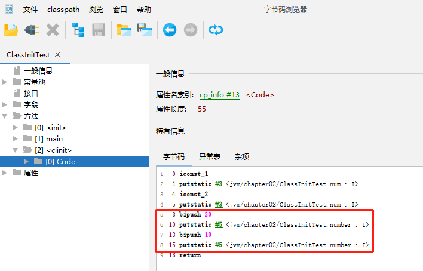

初始化过程先赋值number为20，再赋值为10。

最后是关于这个静态代码块的使用。

```java
package jvm.chapter02;

/**
 * @Author: zhuzhe
 * @ClassName: ClassInitTest
 * @Date: 2022/12/15 15:09
 * @Description:
 * @Version: V1.0
 * @Param:
 */
public class ClassInitTest {
    private static int num = 1;

    static {
        num = 2;
        number = 20;
        //正确
        System.out.println(num);
        //错误：变量定义在使用之后
        System.out.println(number);//报错：非法的前向引用
    }

    private static int number = 10;//在linking中prepare阶段number=0 -> 在initial阶段number = 20; 再变为 number = 10

    public static void main(String[] args) {
        System.out.println(ClassInitTest.num);
        System.out.println(ClassInitTest.number);
    }
}
```


> **构造器方法中指令按语句在源文件中出现的顺序执行**

一个类中没有类变量的操作，则也就没有clinit方法

```java
package jvm.chapter02;

/**
 * @Author: zhuzhe
 * @ClassName: ClassInitTest2
 * @Date: 2022/12/15 15:09
 * @Description:
 * @Version: V1.0
 * @Param:
 */
public class ClassInitTest2 {
    
    private int a = 7;

    public static void main(String[] args) {
        int b = 3;
    }
}
```


> **`<clinit>()`不同于类的构造器。（关联：构造器是虚拟机视角下的`<init>()`）**

init方法是构造器函数

任何一个类声明以后，内部至少存在一个类的构造器。默认提供或自定义。


测试一个init方法

```java
package jvm.chapter02;

/**
 * @Author: zhuzhe
 * @ClassName: ClassInitTest2
 * @Date: 2022/12/15 15:09
 * @Description:
 * @Version: V1.0
 * @Param:
 */
public class ClassInitTest3 {

    private int a = 1;
    private static int b = 3;

    public static void main(String[] args) {
        int c = 2;
    }

    public ClassInitTest3(){
        a = 10;
        int d = 20;
    }
}
```


> **若该类具有父类。JVM会保证子类的`<clinit>()`执行前，父类的`<clinit>()`已经执行完毕**

类加载过程，子类的加载慢于父类的加载

```java
package jvm.chapter02;

/**
 * @Author: zhuzhe
 * @ClassName: ClassInitTest2
 * @Date: 2022/12/15 15:09
 * @Description:
 * @Version: V1.0
 * @Param:
 */
public class ClassInitTest4 {

    static class Father{
        public static int A = 1;
        static {
            A = 2;
        }
    }
    static class Son extends Father{
        public static int B = A;
    }

    public static void main(String[] args) {
        System.out.println(Son.B);
    }
}
```

这里可以看到Son类的clinit方法中，先加载了A变量。而这个变量是来自父类Father。所以说这个A提取加载过，加载子类clinit前是先加载父类Father的clinit方法。


> **虚拟机必须保证一个类的`<clinit>()`方法在多线程下被同步加锁**

在类加载到内存中以后，实际是使用**直接内存**来缓存起来。以后再使用都是从直接内存中取。虚拟机在加载类时**只调用一次**clinit方法。

多个线程来加载同一个类，看是否有安全问题。（如果是异步，则线程1和线程2执行同个类的初始化是不会阻塞，如果同步，则其中一个线程必然要等待另外一个线程完成类的初始化。）

类的初始化过程中涉及到静态代码块的加载，所以可以在静态代码块设置一个死循环来测试。

```java
package jvm.chapter02;

/**
 * @Author: zhuzhe
 * @ClassName: ClassInitTest5
 * @Date: 2022/12/16 15:28
 * @Description:
 * @Version: V1.0
 * @Param:
 */
public class ClassInitTest5 {
    public static void main(String[] args) {
        Runnable runnable = ()->{
            System.out.println(Thread.currentThread().getName()+"开始");
            DeadThread deadThread = new DeadThread();
            System.out.println(Thread.currentThread().getName()+"结束");
        };

        Thread t1 = new Thread(runnable, "线程1");
        Thread t2 = new Thread(runnable, "线程2");

        t1.start();
        t2.start();
    }
}
class DeadThread{
    static {
        if (true){
            System.out.println(Thread.currentThread().getName()+"初始化当前类");
            while (true){

            }
        }
    }
}
```

可以看到阻塞，因为是同步。

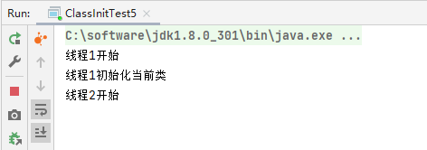

（所以这里引申出一个编码问题，操作同个类是如果遇到这种加载阻塞，则会导致两个线程都无法完成类初始化）


### 类加载器分类


自定义类加载器不是指用户自定义，而是直接或间接继承ClassLoader的一系列类加载器。


鼠标点击选中位置后，按Ctrl+H可以看到调用链。


所以ExtClassLoader简介继承了ClassLoader，是一种类加载器。

同时AppClassLoader也是属于一种自定义类加载器。


四款加载器（BootStrap Class Loader、Extension Class Loader、System Class Loader、Optional）之间不是继承关系，而是根据影响范围的一种包含关系。


#### 案例：获取类加载器

前面提到类加载器分为两种类型，系统为我们提供的是前面三种。


这里我们用代码来获取。当调用一个类时，会将一个类加载到内存中（String.class.getParent()）

```java
package jvm.chapter02;

/**
 * @Author: zhuzhe
 * @ClassName: ClassLoaderTest01
 * @Date: 2022/12/16 15:48
 * @Description:
 * @Version: V1.0
 * @Param:
 */
public class ClassLoaderTest01 {
    public static void main(String[] args) {
        //获取系统类加载器
        ClassLoader systemClassLoader = ClassLoader.getSystemClassLoader();
        //sun.misc.Launcher$AppClassLoader@18b4aac2 类型与地址值信息
        //sun.misc.Launcher的内部类AppClassLoader实例，其地址是18b4aac2
        System.out.println(systemClassLoader);

        //获取其上层：扩展类加载器
        ClassLoader extClassLoader = systemClassLoader.getParent();
        System.out.println(extClassLoader);//sun.misc.Launcher$ExtClassLoader@677327b6

        //获取其上层：获取不到引导类加载器
        ClassLoader bootstrapClassLoader = extClassLoader.getParent();
        System.out.println(bootstrapClassLoader);//null bootstrap这个加载器不是使用Java语言编写的

        //对于用户自定义类来说：默认使用系统类加载器进行加载
        ClassLoader cltClassLoader = ClassLoaderTest01.class.getClassLoader();
        System.out.println(cltClassLoader);//sun.misc.Launcher$AppClassLoader@18b4aac2

        //对于核心api的String类的加载器：使用引导类加载器进行加载（Java的核心类库都是使用引导类加载器进行加载的）
        ClassLoader stringClassLoader = String.class.getClassLoader();
        System.out.println(stringClassLoader);//null
    }
}
```


#### 引导类加载器Bootstrap ClassLoader


#### 扩展类加载器Extension ClassLoader


#### 系统类加载器System ClassLoader


#### 案例：查看Bootstrap ClassLoader加载了哪些文件

```java
package jvm.chapter02;

import sun.misc.Launcher;
import sun.security.ec.ECPublicKeyImpl;
import sun.security.util.CurveDB;

import java.net.URL;
import java.security.Provider;

/**
 * @Author: zhuzhe
 * @ClassName: ClassLoaderTest01
 * @Date: 2022/12/16 15:48
 * @Description:
 * @Version: V1.0
 * @Param:
 */
public class ClassLoaderTest02 {
    public static void main(String[] args) {
        System.out.println("========启动类加载器========");
        //获取BootstrapClassLoader能够加载的api的路径
        URL[] urLs = Launcher.getBootstrapClassPath().getURLs();
        for (URL element:urLs){
            System.out.println(element.toExternalForm());
        }
        //从上面路径中随意选择一个类，看看其类加载器是什么
        ClassLoader classLoader = Provider.class.getClassLoader();
        System.out.println(classLoader);//null 说明就是引导类加载器


        System.out.println("========扩展类加载器========");
        String extDirs = System.getProperty("java.ext.dirs");
        for (String path : extDirs.split(";")){
            System.out.println(path);
        }
        //从上面路径中随意选择一个类，看看其类加载器是什么
        ClassLoader classLoader1 = ECPublicKeyImpl.class.getClassLoader();
        System.out.println(classLoader1);//sun.misc.Launcher$ExtClassLoader@677327b6
    }
}
```

这里测试方法：先根据上面加载器加载的路径，找到


加载器加载了这些jar包，可以用压缩工具解压查看


这里进入目录，查看具体加载的类


可以看到加载了很多东西，这里我们选择一个普通的类，来查看其加载器。


就可以看到输出了：


上面代码的全部输出：


#### 用户自定义加载器


**隔离类加载器**

比如在开发中引入很多第三方jar包，存在一些类的命名和路径相同，此时就会发生冲突，就得将各自的类加载器做隔离。

**修改类加载器**

动态加载，如每次系统自动加载的类有很多没用到，就自己定义要加载的内容

**扩展加载源**

前面提到类的加载是可以接受磁盘文件和远程网络传输文件。这里还可以扩展为更多来源（数据库传输、电视机机顶盒）

**防止源码泄露**

加密，解密（自定义类加载器）


#### 案例：自定义类加载器加载指定文件

```java
package jvm.chapter02;

import java.io.FileNotFoundException;

/**
 * @Author: zhuzhe
 * @ClassName: CustomClassLoader
 * @Date: 2022/12/16 16:34
 * @Description:
 * @Version: V1.0
 * @Param:
 */
public class CustomClassLoader extends ClassLoader {
    @Override
    protected Class<?> findClass(String name) throws ClassNotFoundException {
        try {
            byte[] result = getClassFromCustomPath(name);
            if (result == null) {
                throw new FileNotFoundException();
            } else {
                return defineClass(name, result, 0, result.length);
            }
        } catch (FileNotFoundException e) {
            e.printStackTrace();
        }
        return super.findClass(name);
    }

    /**
     * 根据指定路径将文件以二进制流读取到内存
     * @param name
     * @return
     */
    private byte[] getClassFromCustomPath(String name) {
        //从自定义路径中加载指定类...stream
        //如果指定路径的字节码文件进行了加密，则需要在这一个阶段进行解密
        return null;
    }

    public static void main(String[] args) {
        CustomClassLoader customClassLoader = new CustomClassLoader();
        try {
            //指定类加载器获取对应的类对象
            Class<?> clazz = Class.forName("One", true, customClassLoader);
            Object obj = clazz.newInstance();
            System.out.println(obj.getClass().getClassLoader());
        } catch (Exception e) {
            e.printStackTrace();
        }
    }
}
```


### ClassLoader的使用说明


基本所有类加载器都是使用Java代码编写，除了引导类加载器使用c++（所以才定义类加载器分为两种类型：引导类加载器，自定义类加载器）


#### 获取类加载器的方法


```java
package jvm.chapter02;

import sun.misc.Launcher;
import sun.security.ec.ECPublicKeyImpl;

import java.net.URL;
import java.security.Provider;

/**
 * @Author: zhuzhe
 * @ClassName: ClassLoaderTest01
 * @Date: 2022/12/16 15:48
 * @Description:
 * @Version: V1.0
 * @Param:
 */
public class ClassLoaderTest03 {
    public static void main(String[] args) {
        try {
            //获取系统核心类的类加载器
            ClassLoader classLoader1 = Class.forName("java.lang.String").getClassLoader();
            System.out.println(classLoader1);
            //获取线程上下文类加载器
            ClassLoader classLoader2 = Thread.currentThread().getContextClassLoader();
            System.out.println(classLoader2);//线程在当前类创建，所以上下文也在当前类，就是当前类加载器
            //获取系统类加载器，获取它的上层扩展类加载器
            ClassLoader classLoader3 = ClassLoader.getSystemClassLoader().getParent();
            System.out.println(classLoader3);
        } catch (ClassNotFoundException e) {
            e.printStackTrace();
        }
    }
}
```


### 双亲委派机制

Java虚拟机对class文件采用的是按需加载的方式，也就是说当需要使用该类时才会将它的class文件加载到内存生成class对象。而且加载某个类的class文件时，Java虚拟机采用的是**双亲委派**模式，即把请求交由父类处理，它是一种任务委派模式。

为了保护项目，使用了双亲委派机制。

#### 案例：自定义String类测试

通常使用的String是来自java.lang.String。如果自己也自定义这么一个路径，实际执行的还是Java核心api中的String。


```java
package java.lang;

/**
 * @Author: zhuzhe
 * @ClassName: String
 * @Date: 2022/12/16 17:15
 * @Description:
 * @Version: V1.0
 * @Param:
 */
public class String {
    static {
        System.out.println("自定义String...");
    }
}
```

```java
package jvm.chapter02;

/**
 * @Author: zhuzhe
 * @ClassName: StringTest
 * @Date: 2022/12/16 17:14
 * @Description:
 * @Version: V1.0
 * @Param:
 */
public class StringTest {
    public static void main(String[] args) {
        String str = new String();
        System.out.println("str = " + str);
    }
}
```


这个效果就是双亲委派机制的保护。


#### 概念


比如上面的案例，我们使用到了一个String类，需要加载String类。那么不会在当前的类加载器中进行加载，而是委托父类加载器取加载。最终是委托到Bootstrap ClassLoader，这个引导类加载器就是一开始加载核心api的，里面就有String类，所以由它来加载String类。

```java
package jvm.chapter02;

/**
 * @Author: zhuzhe
 * @ClassName: StringTest
 * @Date: 2022/12/16 17:14
 * @Description:
 * @Version: V1.0
 * @Param:
 */
public class StringTest {
    public static void main(String[] args) {
        String str = new String();
        System.out.println("str = " + str);
        StringTest stringTest = new StringTest();
        System.out.println(stringTest.getClass().getClassLoader());
    }
}
```

* 先委派

  ① 系统类加载器 App ClassLoader 向上委托

  ② 扩展类加载器 Ext ClassLoader 向上委托

  ③ 引导类加载器 Bootstrap ClassLoader

* 再处理

  ① 引导类加载器 Bootstrap ClassLoader 的处理路径JAVA_HOME/jre/lib/... 当前类不属于这个范围，由下级类加载器处理

  ② 扩展类加载器 Ext ClassLoader 的处理路径jre/lib/ext/... 当前类不属于这个范围，由下级类加载器处理

  ③ 系统类加载器 App ClassLoader 的处理路径classpath 当前类属于，进行加载

所以最终这个StringTest是由系统类加载器加载。


像前面自定义的String，在父级加载器中就成功加载了，所以自己定义的同名同路径的类是不会被加载的。

同时，在自己仿照的String类中去运行它的话，也是当前的类无法去加载。


因为双亲委派机制原因，最终加载的是核心api中的String类，那一个String类是没有main方法的。


#### 案例：spi接口（反向委派）


比如加载一个jar包：rt.jar：

* 这个包需要依赖一些接口，这些接口要有具体的实现类。来自jdbc.jar（第三方jar包）

* 加载jdbc不属于核心的api，所以不由Bootstrap Class Loader来加载。

* 由系统类加载器加载，所以出现了加载jdbc是由BootstrapClassLoader反向委派到AppClassLoader。
* 加载是由当前线程获取上下文加载器，去加载jdbc的包内容

接口是自己BootstrapClass Loader加载的，但具体接口的实现类是由线程上下文加载器去加载的。


#### 案例：系统api路径下的其他类

前面测试时，自定义的java.lang.String类是无法启动的。因为BootstrapClassLoader查到路径匹配，找到对应类加载初始化时发现没有这个main方法。同理，定义一个非核心api的类在核心api路径下也是会报错。


#### 优势


#### 沙箱安全机制

自定义String类，但是在加载自定义String类的时候会率先使用引导类加载器加载，而引导类加载器在加载的过程中会先加载jdk自带的文件（rt.jar包中java/lang/String.class），报错信息说没有main方法，就是因为加载的是rt.jar包中的String类。这样就可以保证对Java核心源代码的保护，这就是沙箱安全机制。


### 其他

* 在JVM中表示两个class对象是否为同一个类存在的两个必要条件：
  * 类的完整类名必须一致，包括类名
  * 加载这个类的classloader（值classloader的实例对象）必须相同

* 换句话说，在JVM中，即使这两个类对象（class对象）来源同一股Class文件，被同一个虚拟机所加载，但只要加载它们的ClassLoader实例对象不同，那么这两个类对象也是不相同的。


> 对类加载器的引用

JVM必须知道一个类型是由启动加载器加载还是由用户类加载器加载。如果一个类型是由用户类加载器加载的，那么JVM会将这个类加载器的一个引用作为类型信息的一部分保存在方法区中。当解析一个类型到另一个类型的引用的时候，JVM需要保证这两个类型的类加载器是相同的。（动态链接）

> 类的主动使用和被动使用


## 运行时数据区概述及线程


### 概述


前面类初始化完成后，就需要执行引擎来解析成运行时数据。


> 内存的概念


> 运行时数据区


> 运行数据区的区域划分


Java虚拟机定义了若干种程序运行期间会使用到的运行时数据区，其中由一些会随着虚拟机启动而创建，随着虚拟机退出而销毁。另外一些则是与线程一一对应的，这些与线程对应的数据区域会随着线程的开始和结束而创建和销毁。

* 每个线程独立：**程序计数器、虚拟机栈、本地方法栈**
* 线程间共享：堆、堆外内存——方法区（永久代或元空间、代码缓存）

> Class Runtime


运行时对象。一个JVM实例就对应一个Runtime实例，也就对应一个运行时数据区。

https://www.matools.com/api/java8


### 线程


* 守护线程
* 普通线程


### 程序计数器（寄存器）

#### 介绍

官网Oracle虚拟机规范中对于寄存器的描述：https://docs.oracle.com/javase/specs/jvms/se8/html/jvms-2.html#jvms-2.5.1


在JVM中描述为程序计数寄存器（程序计数器）


是对电脑寄存器的一种模拟：


**可以理解为Java集合中的迭代器**


#### 举例

编写一个简单例子，查看字节码指令。

```java
package jvm.chapter03;

/**
 * @Author: zhuzhe
 * @ClassName: PCRegisterTest
 * @Date: 2022/12/17 16:43
 * @Description:
 * @Version: V1.0
 * @Param:
 */
public class PCRegisterTest {
    public static void main(String[] args) {
        int i = 10;
        int j = 20;
        int k = i + j;

    }
}
```

```shell
javap -verbose PCRegisterTest.class
```


这一个偏移地址（指令地址）就是PC寄存器存储的结构。

**执行引擎会到寄存器中找到地址5的指令，也就是下一个要执行的指令，去执行。**

* 操作虚拟机栈的局部变量表、操作数栈
* 将字节码指令翻译为机器指令，这样cpu就能帮助运算


在代码中增加字符串的操作，查看字节码指令。

```java
package jvm.chapter03;

/**
 * @Author: zhuzhe
 * @ClassName: PCRegisterTest
 * @Date: 2022/12/17 16:43
 * @Description:
 * @Version: V1.0
 * @Param:
 */
public class PCRegisterTest {
    public static void main(String[] args) {
        int i = 10;
        int j = 20;
        int k = i + j;

        String str = "abc";
        System.out.println(i);
        System.out.println(k);
    }
}
```


这里**#2**表示引用常量池的下标**2**的内容。

 


#### 常见问题

1. 使用PC寄存器存储字节码指令的地址有什么用？

2. 为什么使用PC寄存器记录当前线程的执行地址？

   

3. PC寄存器为什么会被设定为线程私有

   

> CPU时间片


串行：多线程同步等待

并行：多线程同时执行

并发：多线程切换模拟接近并行的执行


### 虚拟机栈

#### 概述

官网中对虚拟机栈的概述：https://docs.oracle.com/javase/specs/jvms/se8/html/jvms-2.html#jvms-2.5.2


由于跨平台的设计，Java的指令都是根据栈来设计的。不同平台CPU架构不同，所以不能设计为基于寄存器的。

优点是跨平台，指令集小，编译器容易实现，缺点是性能下降，实现同样的功能需要更多的指令。

> 内中中的栈与堆

**栈是运行时的单位，而堆是存储的单位**

* 栈解决程序运行问题，即程序如何执行，或者说如何处理数据。

* 堆解决的是数据存储问题，即数据怎么存放，存放在哪里。

栈（左）和堆（右）：


> Java虚拟机栈是什么

* Java虚拟机栈（Java virtual machine stack），早期也叫Java栈。每个线程在创建时都会创建一个虚拟机栈，其内部存储的是一个个栈帧（stack frame），对应一次次的Java方法调用。这一个是线程私有的。
* 生命周期和线程一致
* 主管Java程序的运行，它保存方法的局部变量、部分结果，并参与方法的调用和返回。

> 虚拟机栈测试

一个线程对应一个虚拟机栈。一个方法的创建实际是在栈中创建一个栈帧元素。方法在调用另外一个方法时，是在前一个栈帧基础上再创建一个栈帧，被调用的方法执行结束后对应的栈帧会被弹出，然后前一个栈帧中的代码。

```java
package jvm.chapter04;

/**
 * @Author: zhuzhe
 * @ClassName: StackTest
 * @Date: 2022/12/17 23:33
 * @Description:
 * @Version: V1.0
 * @Param:
 */
public class StackTest {
    public static void main(String[] args) {
        new StackTest().methodA();
    }

    public void methodA(){
        int i = 10;
        int j = 20;
        methodB();
    }

    public void methodB(){
        int k = 30;
        int m = 40;
    }
}
```


（上面两个方法对应两个栈帧，而这些局部变量是存储在栈帧的局部变量表中），局部变量的生命周期随着方法的创建开始，方法的销毁结束。


> 栈的特点——**先进后出**


#### 栈面试题

栈可能出现的异常：栈溢出、内存不足


> 栈溢出测试

```java
package jvm.chapter04;

/**
 * @Author: zhuzhe
 * @ClassName: StackErrorTest
 * @Date: 2022/12/17 23:49
 * @Description:
 * @Version: V1.0
 * @Param:
 */
public class StackErrorTest {
    public static void main(String[] args) {
        main(args);
    }
}
```


#### 设置栈大小

可以使用参数`-Xss`选项来设置线程的最大栈空间，栈的大小直接决定了函数调用的最大可达深度。

官网文档：https://docs.oracle.com/en/java/javase/11/tools/tools-and-command-reference.html


其中有关-Xss的参数：


> 测试栈

默认情况下递归增加count，最多只能增加到11410


设置运行时虚拟机的栈大小为256k


设置了栈大小后，允许时的count只能最多增加到2457次。


#### 栈的存储单位——栈帧

虚拟机栈内部的结构。

> 栈中存储什么

* 每个线程都有自己的栈，栈中的数据都是以栈帧（Stack Frame）的格式存在
* 在这个线程上正在执行的每个方法都各自对应一个栈帧（Stack Frame）
* 栈帧是一个内存区块，是一个数据集。维系着方法执行过程中的各种数据信息。

> 栈的操作

* JVM直接对Java栈的操作只有两个，就是对栈帧的压栈和出栈，遵循 "先进后出" / "后进先出"的原则。
* 在一个活动线程中，一个时间点上，只会有一个活动的栈帧。即只有当前正在执行的方法的栈帧（栈顶栈帧）是有效的，这个栈帧被称为当前栈帧（Current Frame），与当前栈帧相对应的方法就是当前方法（Current Method），定义这个方法的类就是当前类（Current Class）。
* 执行引擎允许的所有字节码指令只针对当前栈帧进行操作
* 如果该方法中调用了其他方法，对应的新的栈帧会被创建出来，放在栈的顶端，成为**新的当前栈**。


```java
package jvm.chapter04;

/**
 * @Author: zhuzhe
 * @ClassName: StackFrameTest
 * @Date: 2022/12/19 16:11
 * @Description:
 * @Version: V1.0
 * @Param:
 */
public class StackFrameTest {
    public static void main(String[] args) {
        StackFrameTest test = new StackFrameTest();
        test.method1();
    }

    public void method1(){
        System.out.println("method1开始执行...");
        int val = method2();
        System.out.println("method1执行结束...val="+val);
    }

    public int method2(){
        System.out.println("method2开始执行...");
        int i = 23;
        double val = method3();
        System.out.println("method2执行结束...val="+val);
        return i + (int) val;
    }

    public double method3(){
        System.out.println("method3开始执行...");
        double j = 41.5;
        boolean val = method4();
        System.out.println("method3执行结束...val="+val);
        return j + (val?0:1);
    }

    public boolean method4(){
        System.out.println("method4开始执行...");
        boolean flag = true;
        System.out.println("method4执行结束...");
        return flag;
    }
}
```


> 栈的规定

* **不同线程中所包含的栈帧是不允许相互引用的**，即不可能在一个栈帧之中引用另外一个线程的栈帧
* 如果当前方法调用了其他方法，方法返回之际，**当前栈帧会传回方法的执行结果**给前一个栈帧，接着虚拟机会丢弃当前栈帧，使得前一个栈帧重新成为当前栈帧。
* Java方法有两种返回函数的方式，**一种是正常的函数返回**，使用return指令，**另外一种是抛出异常**，不管使用哪种方式，都会导致栈帧被弹出。

使用前面的例子，在方法3执行时抛出异常。则调用流程会在方法3会以抛出异常方式结束，方法2引用方法3也以异常方式结束，方法1引用方法2也已异常方式结束，最终main方法捕获异常并处理。执行结束。

```java
package jvm.chapter04;

/**
 * @Author: zhuzhe
 * @ClassName: StackFrameTest
 * @Date: 2022/12/19 16:11
 * @Description:
 * @Version: V1.0
 * @Param:
 */
public class StackFrameTest {
    public static void main(String[] args) {
        StackFrameTest test = new StackFrameTest();
        try {
            test.method1();
        } catch (Exception e) {
            System.out.println("异常捕获："+e);
        }
        System.out.println("main执行结束...");
    }

    public void method1(){
        System.out.println("method1开始执行...");
        int val = method2();
        System.out.println("method1执行结束...val="+val);
    }

    public int method2(){
        System.out.println("method2开始执行...");
        int i = 23;
        double val = method3();
        System.out.println("method2执行结束...val="+val);
        return i + (int) val;
    }

    public double method3(){
        System.out.println("method3开始执行...");
        double j = 41.5;
        boolean val = method4();
        System.out.println(10/0);
        System.out.println("method3执行结束...val="+val);
        return j + (val?0:1);
    }

    public boolean method4(){
        System.out.println("method4开始执行...");
        boolean flag = true;
        System.out.println("method4执行结束...");
        return flag;
    }
}
```


#### 栈帧

每个栈帧中存储着：

* **局部变量表**（Local Variables）
* **操作数栈**（Operand Stack）（或表达式栈）
* **动态链接**（Dynamic Linking）（或指向运行时常量池的方法引用）
* **方法返回地址**（Return Address）（或方法正常退出或者异常退出的定义）
* **一些附加信息**


##### 局部变量表Local Variables

* 局部变量表也被称为局部变量数组或本地变量表
* 定义为一个数字数组，主要用于存储**方法参数**和定义在方法体内的**局部变量**，这些数据类型包括各类基本数据类型（byte，short、char、int、long、float、double、boolean）、引用类型（reference），以及returnAddress类型。
* 由于局部变量表是建立在线程的栈上，是线程私有数据，因此不存在数据安全问题。
* 局部变量表所需的容量大小是在编译期确定下来的，并保存在方法的Code属性的maximum local variables 数据项中。在方法运行期间是不会改变局部变量表的大小的。

```java
package jvm.chapter04;


import java.util.Date;

/**
 * @Author: zhuzhe
 * @ClassName: LocalVariablesTest
 * @Date: 2022/12/19 16:59
 * @Description:
 * @Version: V1.0
 * @Param:
 */
public class LocalVariablesTest {
    private int count = 0;

    public static void main(String[] args) {
        LocalVariablesTest test = new LocalVariablesTest();
        int num = 10;
        test.test1();
    }

    public void test1() {
        Date date = new Date();
        String str1 = "zhuzhe";
        String info = test2(date,str1);
        System.out.println(date + str1);
    }

    public String test2(Date dateP, String str2) {
        dateP = null;
        str2 = "cxr";
        double weight = 130.5;
        char gender = '男';
        return dateP + str2;
    }

    public void test3(){
        count++;
    }

    public void test4(){
        int a = 0;
        {
            int b = 0;
            b = a + 1;
        }
        int c = a + 1;
    }
}
```

test1方法的局部变量表


> 方法的嵌套调用

* 方法嵌套的次数由栈的大小决定。一般来说，栈越大，方法嵌套调用次数越多。对一个函数而言，它的参数和局部变量越多，使得局部变量表膨胀，它的栈帧就越大，以满足方法调用所需传递的信息增大的需求。进而函数调用就会占用更多的栈空间，导致其嵌套调用次数就会减少。
* 局部变量表中的变量只有在当前方法调用中有效。在方法指向时，虚拟机通过使用局部变量表完成参数变量列表的传递过程。当方法调用结束后，随着方法栈帧的销毁，局部变量表会也会随着销毁。


这里idea也提供了插件版 jclasslib


**LineNumberTable**

在字节码中，一个方法里的信息Code，包含着LineNumberTable（行号表）和LocalVariableTable（本地变量表）。其中行号表描述了字节码指令寄存器行号对应Java代码中的行号。


通过查看class字节码的反编译文件，对应18-21就是main方法的代码


这样也就解释了Code中的字节码指令描述


**LocalVariableTable**

局部变量表，描述运行时方法的局部变量信息。

和上面一样，查看main方法的局部变量表

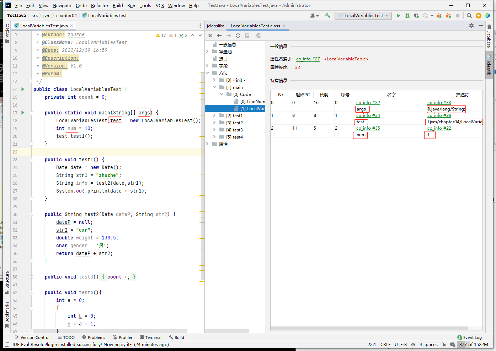


* StartPC 代表指令在寄存器中的偏移地址

  比如num这个变量是从寄存器偏移地址11开始

* Length 代表变量作用域的范围

  * 从StartPC位置开始的Length范围作用域。

    比如num是从寄存器指令偏移地址11开始，作用范围5，即到指令偏移地址16结束。前面行号表中有替代，地址11是在变量定义之后的代码，地址15 = return 方法结束。

    

    所以实际局部变量表中的num作用范围描述的是

    

  * 作用域的范围是和前面的Code的最大长度有关。

    字节码指令范围0-15，也就是16行。

    

    

    

（其实这里的字节码指令就可以看到，到字节码指令的结束，也是是说这几个变量的作用范围就是从声明时开始到方法的执行结束。）


**Slot变量槽**

方法在内存中是以创建栈帧存在。栈帧包含本地变量表，描述方法的局部变量和形参信息。而局部变量表是以数组的数据结构存在，该数组存储的元素就是一个个Slot变量槽。

* 参数值的存放总是在局部变量数组的index0开始，到数组的-1的索引结束。
* 局部变量表，最基本的存储单元是Slot（变量槽）
* 局部变量表中存放编译期可知的各种基本数据类型（8种），引用类型（reference），returnAddress类型的变量。
* 在局部变量表里，32位以内的类型只占用一个Slot（包括returnAddress类型），64位的类型（long和double）占用两个slot。
  * byte、short、char在存储前被转换为int。boolean也被转换为int，0表示false，1表示true。
  * long和double则占据两个Slot

> Slot的理解

* JVM会为局部变量表中的每一个Slot都分配一个访问索引，通过这个索引即可成功访问到局部变量表中指定的局部变量值。

* 当一个实例方法被调用的时候，它的方法参数和方法体内部定义的局部变量将会**按照顺序**被复制到局部变量表中的每一个Slot上。

* 如果需要访问局部变量中一个64bit的局部变量时，只需要使用前一个索引即可。（比如：访问long或double类型变量）

* 如果当前帧是由构造方法或者实例方法创建的，那么该对象引用this将会存放在index为0的slot处，其余的参数按照参数表顺序继续排列。

  静态的方法栈帧局部变量槽中没有this，所以不能使用

  ```java
  public static void testStatic(){
      LocalVariablesTest test = new LocalVariablesTest();
      Date date = new Date();
      int count = 10;
      System.out.println(count);
      //因为this变量不存在于当前的局部变量表中
      System.out.println(this.count);
  }
  ```

  实例方法的栈帧的局部变量槽中就有this

  ```java
  //关于slot的使用理解
  public LocalVariablesTest() {
      this.count = 1;
  }
  public void test1() {
      Date date = new Date();
      String str1 = "zhuzhe";
      String info = test2(date,str1);
      System.out.println(date + str1);
  }
  ```

  

  


double和long占据两个局部变量槽、

```java
public String test2(Date dateP, String str2) {
    dateP = null;
    str2 = "cxr";
    double weight = 130.5;
    char gender = '男';
    return dateP + str2;
}
```


占据了3和4两个局部变量槽。

构造器中也是有栈帧和对应的局部变量表，构造器中有this

```java
public LocalVariablesTest() {
    this.count = 1;
}
```


**slot重复利用**

栈帧中的局部变量中的槽位是可以重复使用。如果一个局部变量过了其作用域，那么在其他作用域之后声明的局部变量很有可能就复用过期局部变量的槽位，从而达到节省资源的目的。

例子：test4中的代码块，定义的b的作用域在代码块执行结束后结束，而变量槽中的位置是空闲出来给c的定义使用。

```java
public void test4(){
    int a = 0;
    {
        int b = 0;
        b = a + 1;
    }
    int c = a + 1;
}
```


当一个变量作用域结束也就不存在本地变量表中，会被清除，空闲出来的位置可以用作下一个变量的使用。

**变量的分类**：

* 按照数据类型划分：基本数据类型、引用类型
* 按照在类中声明的位置划分：
  * 成员变量
    * 类变量：linking的prepare阶段给类变量赋予默认值，在initial阶段给类变量显式赋值即静态代码块赋值
    * 实例变量：随着对象的创建，会在堆空间中分配实例变量空间，并进行默认赋值
  * 局部变量：在使用前，必须要进行显式赋值，否则编译不通过

**补充说明**

* 在栈帧中，与性能调优关系最密切的部分就是前面提到的局部变量表。在方法执行时，虚拟机使用局部变量表完成方法的传递。
* 局部变量表中的变量也是重要的垃圾回收根节点，只要被局部变量表中的直接或间接引用的对象都不会被回收。


##### 操作数栈Operand Stack

操作数栈也是栈的一种结构。即满足数组的特点，又满足栈的特点。

栈可以使用数组或链表来实现。


（上面的8和15两个元素在操作数栈中，进行了ladd操作执行引擎将其从操作数栈弹出，运算后将结果压回去。）


字节码指令在执行过程中需要使用到操作数栈。并且由执行引擎将字节码指令翻译成机器指令。来执行。


##### 代码追踪

```
 0 bipush 15 ---- 将15放入到操作数栈中，这里的一些类型会转为int，PC寄存器下移
 2 istore_1 ----- PC寄存器读取偏移地址2的指令：istore的i表示int类型，将其从操作数栈取出来放到局部变量表中。放到1的位置（因为这是一个实例方法，所以0的位置放的是this）
 3 bipush 8 ----- 同理
 5 istore_2 ----- 同理
 6 iload_1 ------ 从局部变量表中取出索引为1的变量放到操作数栈
 7 iload_2 ------ 从局部变量表中取出索引为2的变量放到操作数栈
 8 iadd --------- 将两个数据从操作数栈中出栈，进行加的运算（执行引擎），将结果23放回操作数栈
 9 istore_3 ----- 将23从操作数栈中弹出放入到局部变量表中，存放位置3
10 return ------- 方法执行结束
```


从上面可以看到，存储的局部变量表有存储3个变量＋一个this关键字，所以局部变量表深度为4。

操作数栈在最大的使用常见下就是拿两个变量去加运算，用到了两个空间，所以操作数栈的最大深度为2。


```java
package jvm.chapter05;

/**
 * @Author: zhuzhe
 * @ClassName: OperandStackTest
 * @Date: 2022/12/28 17:03
 * @Description:
 * @Version: V1.0
 * @Param:
 */
public class OperandStackTest {
    public void testAddOperation(){
        byte i = 15;
        int j = 8;
        int k = i + j;

        int m = 800;
    }

    public int getSum(){
        int m = 10;
        int n = 20;
        int k = m + n;
        return k;
    }

    public void testGet(){
        int i = getSum();
        int j = 10;

    }
}
```

getSum在调用之后，返回int类型结果ireturn。然后栈帧结束。


getSum结束，则当前栈就是testGet这个栈帧。


**常见的面试题**

```java
package jvm.chapter05;

/**
 * @Author: zhuzhe
 * @ClassName: OperandStackTest
 * @Date: 2022/12/28 17:03
 * @Description:
 * @Version: V1.0
 * @Param:
 */
public class OperandStackTest {

    public void add(){
        //第1类问题
        int i1 = 10;
        i1++;

        int i2 = 10;
        ++i2;

        //第2类问题
        int i3 = 10;
        int i4 = i3++;

        int i5 = 10;
        int i6 = ++i5;

        //第3类问题
        int i7 = 10;
        i7 = i7++;

        int i8 = 10;
        i8 = ++i8;

        //第4类问题
        int i9 = 10;
        int i10 = i9++ + ++i9;

    }
}
```


##### 栈顶缓存技术Top-of-Stack Cashing


##### 动态链接Dynamic Linking

帧数据区：方法返回地址、动态链接、一些附加信息


**运行时常量池中的符号引用**

```java
package jvm.chapter05;

/**
 * @Author: zhuzhe
 * @ClassName: DynamicLinkingTest
 * @Date: 2022/12/28 21:21
 * @Description:
 * @Version: V1.0
 * @Param:
 */
public class DynamicLinkingTest {

    int num = 10;

    public void methodA(){
        System.out.println("methodA...");
    }
    public void methodB(){
        System.out.println("methodB...");
        methodA();
        num++;
    }
}
```


这里偏移地址9的指令使用了**运行时常量池**#7的内容。


**运行时常量池**#7引用#8和#31，#8引用#32。


#31 : #19表示方法名称methodA #13表示一个方法没有参数，并且返回值为void类型。

#32 : 表示当前类的名称

（将类加载过程中的信息都作为符号存储在**运行时常量池**，供后续使用）


**动态链接的作用就是为了将这些符号引用转换为调用方法的直接引用**


常量池：在字节码文件中的常量池描述

运行时常量池：将字节码文件转换到内存后的所根据描述创建的常量池，本质内容和文件描述中的内容一致。

**为什么需要运行时常量池**

为了全局使用一些有关类的，固定的描述信息。复用共享。为了提供一些符号和常量，便于指令的识别。

 

##### 方法的调用：解析与分派

方法的调用原理，JVM虚拟机的具体执行。静态链接：普通的方法调用。动态链接：多态方法。


对应的是方法的绑定。

静态链接对应早期绑定

动态链接对应晚期绑定


例子（晚期绑定）：

```java
package jvm.chapter05;

class Animal{
    public void eat(){
        System.out.println("动物进食...");
    }
}

interface Huntable{
    void hunt();
}

class Dog extends Animal implements Huntable{

    @Override
    public void eat() {
        System.out.println("狗吃骨头");
    }

    @Override
    public void hunt() {
        System.out.println("捕食耗子，多管闲事");
    }
}

class Cat extends Animal implements Huntable{

    @Override
    public void eat() {
        System.out.println("猫吃鱼");
    }

    @Override
    public void hunt() {
        System.out.println("捕食耗子，天经地义");
    }
}

/**
 * @Author: zhuzhe
 * @ClassName: AnimalTest
 * @Date: 2022/12/28 21:57
 * @Description:
 * @Version: V1.0
 * @Param:
 */
public class AnimalTest {
    public void showAnimal(Animal animal){
        animal.eat();//表现为晚期绑定
    }
    public void showHunt(Huntable huntable){
        huntable.hunt();//表现为晚期绑定
    }

    public static void main(String[] args) {
        //在编译期间无法确定
    }
}
```

对应在jclasslib中只能看到动态链接到常量池信息。看不到具体的信息。


例子（前期绑定）：在前面的基础上改Cat类

```java
class Cat extends Animal implements Huntable{

    public Cat() {
        super();
    }

    public Cat(String name){
        this();
    }

    @Override
    public void eat() {
        System.out.println("猫吃鱼");
    }

    @Override
    public void hunt() {
        System.out.println("捕食耗子，天经地义");
    }
}
```


（加了final就不能被重写了，在编译期就已经确定的方法，也就只有前期绑定了。）

**方法的调用：虚方法与非虚方法**

晚期绑定的方法，在实际调用时就存在虚方法的调用。


子类对象的多态性的使用前提：①类的继承关系 ②方法的重写


例子：

```java
package jvm.chapter05;

class Father{
    /*构造方法*/
    public Father(){
        System.out.println("father的构造器...");
    }
    /*静态方法*/
    public static void showStatic(String str){
        System.out.println("father "+str);
    }
    /*final方法*/
    public final void showFinal(){
        System.out.println("father show final");
    }
    /*普通方法*/
    public void showCommon(){
        System.out.println("father 普通方法");
    }
}

interface MethodInterface{
    void methodA();
}

/**
 * @Author: zhuzhe
 * @ClassName: Son
 * @Date: 2022/12/28 22:31
 * @Description:
 * @Version: V1.0
 * @Param:
 */
public class Son extends Father{
    public Son(){
        super();
    }
    public Son(int age){
        this();
    }
    //不是重写父类的静态方法，因为静态方法不能被重写
    public static void showStatic(String str){
        System.out.println("son "+str);
    }
    private void showPrivate(String str){
        System.out.println("son private "+str);
    }
    public void show(){
        showStatic("zhuzhe.com");//子类有，调子类
        super.showStatic("good!");//直接调父类
        showPrivate("hello!");//子类有，调子类
        super.showCommon();//直接调父类
        showFinal();//子类没有，调用父类
        showCommon();//子类没有，调用父类
        info();//调用子类自己的方法

        MethodInterface in = null;
        in.methodA();//调一个接口类型的对象的方法
    }
    public void info(){

    }

    public void dispaly(Father f){
        f.showCommon();
    }

    public static void main(String[] args) {
        Son son = new Son();
        son.show();
    }
}
```

在Son中，前面调用的几个方法都是编译期间可见，属于前期绑定。


Son类show方法的字节指令


对应的解析

```java
...
public class Son extends Father{
    ...
    public void show(){
        showStatic("zhuzhe.com");//调子类静态方法 非虚方法invokestatic
        super.showStatic("good!");//直接调父类 非虚方法invokestatic
        showPrivate("hello!");//调子类私有方法 非虚方法invokespecial
        super.showCommon();//直接调父类 非虚方法invokespecial

        showFinal();//子类没有，调用父类 虚方法invokevirtual(因为此方法声明有final，不能被子类重写，所以也认为此方法是非虚方法)
        showCommon();//子类没有，调用父类 虚方法invokevirtual(因为没有指明调用者，对于虚拟机来说当前子类是有可能重写这个方法，所以在编译期间无法确定，如果显式加上super则是非虚方法)
        info();//调用子类自己的公开方法 虚方法invokevirtual（info在编译期间无法确定下来，他不属于父类的方法，是子类中额外加入的功能方法，这也算是多态的一种）

        MethodInterface in = null;
        in.methodA();//调一个接口类型的对象的方法 虚方法invokeinterface（编译时虚拟机认为接口会有多个实现类，无法具体确定）
    }
    ...
}
```


**方法的调用：关于invokedynamic指令**


Java语言就是静态类型。

例子：

```java
package jvm.chapter05;

@FunctionalInterface
interface Func{
    public boolean func(String str);
}
/**
 * @Author: zhuzhe
 * @ClassName: Lambda
 * @Date: 2022/12/28 23:15
 * @Description:
 * @Version: V1.0
 * @Param:
 */
public class Lambda {
    public void lambda(Func func){
        return;
    }

    public static void main(String[] args) {
        Lambda lambda = new Lambda();
        
        Func func = s ->{
            return true;
        };
        lambda.lambda(func);

        lambda.lambda(str -> {
            return true;
        });
    }
}
```


**方法的调用：方法重写的本质**


（在调用方法时，依次往上找）

**方法的调用：虚方法表**

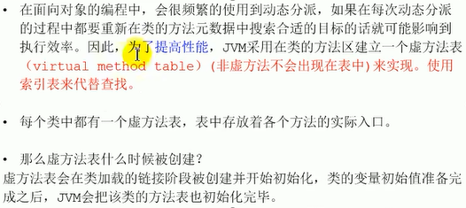

对未重写的方法，使用虚方法表直接指向object。避免再次寻找方法未果。


虚方法表例子：


Dog在调用重写方法时搜索，调用非重写方法不用搜索直接到object


##### 方法返回地址ReturnAddress

* 存放调用该方法的PC寄存器的值
* 一个方法的结束，有两种方式：
  * 正常执行完成
  * 出现未处理的异常，非正常退出
* 无论通过哪种方式退出，在方法退出后都返回到该方法被调用的位置。**方法正常退出时，调用者的pc计数器的值作为返回地址，即调用该方法的指令的下一条指令的地址。**而通过异常退出的，返回地址是要通过异常表来确定，栈帧中一般不会保存着部分信息。


异常表：

| Exception |      | table  |      |
| --------- | ---- | ------ | ---- |
| from      | to   | target | type |
| 4         | 16   | 19     | any  |

解析：从字节码指令地址4开始到字节码指令地址16结束这段代码出现了异常，则就按照字节码指令地址19开始的代码进行处理。针对的是任何类型（any）。

异常表例子：

```java
package jvm.chapter05;

import java.io.FileReader;
import java.io.IOException;
import java.util.Date;

/**
 * @Author: zhuzhe
 * @ClassName: ReturnAddressTest
 * @Date: 2022/12/29 16:13
 * @Description:
 * @Version: V1.0
 * @Param:
 */
public class ReturnAddressTest {

    public boolean methodBoolean(){
        return false;
    }
    public byte methodByte(){
        return 0;
    }
    public short methodShort(){
        return 0;
    }
    public char methodChar(){
        return 'a';
    }
    public int methodInt(){
        return 0;
    }
    public long methodLong(){
        return 0L;
    }
    public float methodFloat(){
        return 0.0f;
    }
    public double methodDouble(){
        return 0.0;
    }
    public String methodString(){
        return null;
    }
    public Date methodDate(){
        return null;
    }
    public void methodVoid(){

    }

    static {
        int i = 10;
    }

    public void method2(){
        methodVoid();

        try {
            method1();
        } catch (Exception e) {
            e.printStackTrace();
        }
    }

    public void method1() throws IOException {
        FileReader fis = new FileReader("zhuzhe.txt");
        char[] cBuffer = new char[1024];
        int len;
        while ((len = fis.read(cBuffer))!= -1){
            String str = new String(cBuffer, 0, len);
            System.out.println(str);
        }
        fis.close();
    }
}
```

使用指令javap进行查看字节码。


从第4行字节码指令地址开始到第8行字节码指令地址结束，如果发生异常则以第11行字节码指令进行处理。


看函数表可以转换出来对应的源码位置。


从源码的第59行开始到62行结束。如果遇到异常则以第60的代码进行异常处理。


##### 一些附加信息

栈帧中还允许携带与Java虚拟机实现相关的一些附加信息。例如，对程序调试提供支持的信息。


#### 栈的相关面试题

* 举例栈溢出的情况？

  * StackOverFlowError
  * -Xss设置栈大小，OOM

* 调整栈大小，就能保证不出现溢出吗？

  * 不能完全保证

* 分配的栈内存越大越好吗？

  * 不是，如果会引发栈溢出，则就算增大也无法避免
  * 整机内存是有限的，大量申请会导致其他线程使用线程时申请困难，造成整体性能下降

* 垃圾回收是否会涉及到虚拟机栈？

  * 不会的

    |            | 出现Error | 出现GC |
    | ---------- | --------- | ------ |
    | 程序计数器 | ×         | ×      |
    | 虚拟机栈   | √         | ×      |
    | 本地方法栈 | √         | ×      |
    | 堆         | √         | √      |
    | 方法区     | √         | √      |

* 方法中定义的局部变量是否线程安全？

  * 具体问题具体分析。

  * 何为线程安全

    如果只有一个线程才可以操作此数据，则必是线程安全。

    如果有多个线程操作此数据，则此数据是共享数据。如果不考虑同步机制的话，会存在线程安全问题。

    ```java
    package jvm.chapter05;
    
    /**
     * @Author: zhuzhe
     * @ClassName: StringBuilderTest
     * @Date: 2022/12/30 16:30
     * @Description:
     * @Version: V1.0
     * @Param:
     */
    public class StringBuilderTest {
    
        //builder的声明方式是线程安全的
        public static void method1(){
            StringBuilder builder = new StringBuilder();
            builder.append('a');
            builder.append('b');
        }
    
        //builder的操作过程，是线程不安全的
        public static void method2(StringBuilder builder){
            builder.append('a');
            builder.append('b');
    
        }
    
        //builder的操作有可能存在线程不安全问题
        public static StringBuilder method3(){
            StringBuilder builder = new StringBuilder();
            builder.append('a');
            builder.append('b');
            return builder;
        }
    
        //builder的操作是线程安全，因为toString是new一个新的String对象
        public static String method4(){
            StringBuilder builder = new StringBuilder();
            builder.append('a');
            builder.append('b');
            return  builder.toString();
        }
    
        public static void main(String[] args) {
            StringBuilder builder = new StringBuilder();
            //线程添加
            new Thread(()->{
                builder.append('a');
                builder.append('b');
            }).start();
            //主线程添加
            method2(builder);
        }
    }
    ```


### 本地方法接口

#### 什么是本地方法


Java的Thread中很多方法都要调用到系统线程。


例子：

native和abstract不能共用，native表示调用了一个本地方法，有方法体但不是Java实现的，而abstract是表示抽象方法，没有方法体。


**为什么要使用非Java语言编写的Api**

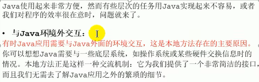


### 本地方法栈


官网：https://docs.oracle.com/javase/specs/jvms/se8/html/jvms-2.html#jvms-2.5.6


要先了解内存的结构才能看懂内存的分配与回收。才能使用内存的性能监控。

执行引擎：解释器+即时编译器


### 堆

#### 堆Heap的核心概述


例子：启动多个Java线程，对应的是不同的虚拟机

```java
package jvm.chapter06;

/**
 * @Author: zhuzhe
 * @ClassName: HeapDemo
 * @Date: 2022/12/31 18:02
 * @Description: -Xms10m -Xmx10m
 * @Version: V1.0
 * @Param:
 */
public class HeapDemo {
    public static void main(String[] args) {
        System.out.println("start...");
        try {
            Thread.sleep(1000000);
        } catch (InterruptedException e) {
            e.printStackTrace();
        }
        System.out.println("end...");
    }
}
```

```java
package jvm.chapter06;

/**
 * @Author: zhuzhe
 * @ClassName: HeapDemo2
 * @Date: 2022/12/31 18:02
 * @Description:
 * @Version: V1.0
 * @Param:
 */
public class HeapDemo2 {
    public static void main(String[] args) {
        System.out.println("start...");
        try {
            Thread.sleep(1000000);
        } catch (InterruptedException e) {
            e.printStackTrace();
        }
        System.out.println("end...");
    }
}
```

打开jvisualvm.exe可以看到对应的虚拟机进程信息


这里可以右键打开堆内存信息：


堆空间实现逻辑上连续，物理上不连续。（映射表）

线程共享堆，但有私有缓冲区


（栈上分配、逃逸分析、标量替换）


```java
package jvm.chapter06;

/**
 * @Author: zhuzhe
 * @ClassName: SimpleHeap
 * @Date: 2022/12/31 18:58
 * @Description:
 * @Version: V1.0
 * @Param:
 */
public class SimpleHeap {
    private int id;

    public SimpleHeap(int id){
        this.id = id;
    }

    public void show(){
        System.out.println("My Id is "+id);
    }

    public static void main(String[] args) {
        SimpleHeap s1 = new SimpleHeap(1);
        SimpleHeap s2 = new SimpleHeap(2);

        int[] arr = new int[10];
        Object[] arr2 = new Object[10];
    }
}
```

栈存放引用对象的地址值，堆存放具体的对象。方法区存放对象的类信息。


**内存细分**

现代垃圾收集器大部分都基于分代收集理论设计，堆空间细分为：


在内存逻辑进行划分。


根据前面设置的参数`-Xms10m -Xmx10m`可以得知，新生代所有内存+老年代 = 10m


使用JVM命令，让其运行时输出GC日志。

```shell
-XX:+PrintGCDetails
```


如果是在jdk8以前，则是称作永久代，在输出的日志上，命名有所差异。


#### 设置堆内存大小与OOM


官网中提供了更改jvm堆内存大小的详细参数。

https://docs.oracle.com/javase/8/docs/technotes/tools/unix/java.html


例子：测试初始内存信息

```java
package jvm.chapter06;

/**
 * @Author: zhuzhe
 * @ClassName: HeapSpaceInital
 * @Date: 2022/12/31 23:50
 * @Description:
 * @Version: V1.0
 * @Param:
 */
public class HeapSpaceInitial {
    public static void main(String[] args) {
        //返回Java虚拟机中的堆内存总量
        long initialMemory = Runtime.getRuntime().totalMemory() / 1024 / 1024;
        //返回Java虚拟机试图使用的最大堆内存量
        long maxMemory = Runtime.getRuntime().maxMemory() / 1024 / 1024;

        System.out.println("-Xms : " + initialMemory + "M");
        System.out.println("-Xmx : " + maxMemory + "M");
        System.out.println("系统内存大小为：" + initialMemory * 64.0 / 1024 + "G");
        System.out.println("系统内存大小为：" + maxMemory * 4.0 / 1024 + "G");
    }
}
```


在开发中建议将初始堆内存和最大堆内存设置成相同的值。

例子：在上面的运行中，使用jvm参数设置初始堆内存大小和最大堆内存大小为600m

```java
package jvm.chapter06;

/**
 * @Author: zhuzhe
 * @ClassName: HeapSpaceInital
 * @Date: 2022/12/31 23:50
 * @Description:
 * @Version: V1.0
 * @Param:
 */
public class HeapSpaceInitial {
    public static void main(String[] args) {
        //返回Java虚拟机中的堆内存总量
        long initialMemory = Runtime.getRuntime().totalMemory() / 1024 / 1024;
        //返回Java虚拟机试图使用的最大堆内存量
        long maxMemory = Runtime.getRuntime().maxMemory() / 1024 / 1024;

        System.out.println("-Xms : " + initialMemory + "M");
        System.out.println("-Xmx : " + maxMemory + "M");

        try {
            Thread.sleep(1000000);
        } catch (InterruptedException e) {
            e.printStackTrace();
        }
    }
}
```


**标记复制算法**：新生代分为一个Eden和两个Survivor。其中一个Survivor是和Eden一样存储对象。另外一个Survivor是用在半区复制时的移动使用，所以总会有一个Survivor是空闲的，这个不计入堆的实际可用空间。


也可以使用前面的输出GC详情，来展示GC内存信息。

```java
package jvm.chapter06;

/**
 * @Author: zhuzhe
 * @ClassName: HeapSpaceInital
 * @Date: 2022/12/31 23:50
 * @Description:
 * @Version: V1.0
 * @Param:
 */
public class HeapSpaceInitial {
    public static void main(String[] args) {
        //返回Java虚拟机中的堆内存总量
        long initialMemory = Runtime.getRuntime().totalMemory() / 1024 / 1024;
        //返回Java虚拟机试图使用的最大堆内存量
        long maxMemory = Runtime.getRuntime().maxMemory() / 1024 / 1024;

        System.out.println("-Xms : " + initialMemory + "M");
        System.out.println("-Xmx : " + maxMemory + "M");
    }
}
```


**OutOfMemory举例**

在面试中如果遇到对异常的举例，实际可以回答OOM。或是栈溢出。

例子：测试内存泄露

```java
package jvm.chapter08;

import java.util.ArrayList;
import java.util.List;
import java.util.Random;

/**
 * @Author: zhuzhe
 * @ClassName: OOMTest
 * @Date: 2023/1/1 11:20
 * @Description: -Xms600m -Xmx600m
 * @Version: V1.0
 * @Param:
 */
public class OOMTest {
    public static void main(String[] args) {
        List<Picture> list = new ArrayList<>();
        while (true) {
            try {
                Thread.sleep(20);
            } catch (InterruptedException e) {
                e.printStackTrace();
            }
            list.add(new Picture(new Random().nextInt(1024 * 1024)));
        }
    }
}

class Picture {
    private byte[] pixels;

    public Picture(int length) {
        this.pixels = new byte[length];
    }
}
```

可以在Java visual VM 中查看到老年代不断增长，知道内存溢出。


当Eden满时，触发标记复制。s1中的存活对象晋升到Old。发现Old空间不足以申请对象存放。则此时虚拟机报错，并停止。


也可以在抽样器中查看到是byte数组的创建增多。


#### 年轻代与老年代

* 存储在jvm中的Java对象可以被划分为两类：
  * 一类是生命周期较短的瞬时对象，这类对象的创建和消亡都非常迅速。
  * 另外一类对象的生命周期却非常长，在某些极端的情况下还能够与jvm的生命周期保持一致。
* Java堆区进一步细分的话，可以划分为年轻代（YoungGen）和老年代（OldGender）
* 其中年轻代又可以划分为Eden空间、Survivor0空间和Survivor1空间（有时也叫做from区、to区）


**新生代与老年代的堆结构占比**


例子：查看默认的JVM堆新生代老年代比例。

```java
package jvm.chapter08;

/**
 * @Author: zhuzhe
 * @ClassName: EdenSurvivorTest
 * @Date: 2023/1/1 14:36
 * @Description: -Xms600m -Xmx600m
 * @Version: V1.0
 * @Param:
 */
public class EdenSurvivorTest {
    public static void main(String[] args) {
        System.out.println("Eden Survivor Test...");
        try {
            Thread.sleep(1000000);
        } catch (InterruptedException e) {
            e.printStackTrace();
        }
    }
}
```

运行之后使用Java Visual VM查看堆内存信息。可以得知默认的-XX:NewRatio=2


```shell
-XX:NewRatio=2
```


如果是已知生命周期长的对象多，则可以考虑把老年代的占比调大。

也可以通过另外一个工具来查询到-XX:NewRatio=?的值。


```shell
jinfo -flag NewRatio 进程号
```

**年轻代中的Eden与Survivor比例**


在理论上是这样新生代分为8:1:1但实际在Java Visual VM中看到的是6:1:1。


使用jstat查看也是6:1:1


原因的虚拟机中有自适应机制，调整了实际的新生代Eden与Survivor的比例。可以通过参数关闭。（关闭自适应内存分配策略，暂时没有用）

```shell
-XX:-UseAdaptiveSizePolicy
```

https://docs.oracle.com/javase/8/docs/technotes/tools/unix/java.html


这个参数暂时没有作用，可以使用-XX:SurvivorRatio来指定固定的比例，则也算是不会启用自适应策略。


```shell
-XX:SurvivorRatio=8
```


设置新生代大小，这个值如果设置了，则会以当前参数为准（前面的-XX:NewRatio则不起作用，不过这种设置方式较为具体，通常都是使用NewRatio来设置比例）

```shell
-Xmn
```


#### 图解对象分配过程

创建的对象在堆空间中具体如何分配。


**Eden区的Minor GC**

新生代垃圾回收：只作用新生代区域的Eden、Survivor0、Survivor1


（第一次新生代垃圾回收(Eden)、可达性分析算法、年龄计数器、存活对象复制到s0清空Eden）


（第二次新生代垃圾回收(Eden+s0)、存活对象复制到s1，清空s0和Eden）


(第三次新生代垃圾回收(Eden+s1)、存活对象复制到s0，清空s1和Eden、同时存活年龄达到15的对象晋升到老年代)

```
* 新生代垃圾回收只在Eden区满时触发，Survivor满是不会触发。
* 也有一些特殊情况，从Eden直接晋升到老年代
```


**总结**

* 针对幸存者s0，s1区的总结：复制之后有交换，谁空谁是to
* 关于垃圾回收：频繁在新生区收集，很少在老年区收集，几乎不在永久代/元空间收集


**对象分配的特殊情况**


分配策略之一：如果垃圾回收后新生代存放不下的对象，可能直接存放到老年代。

分配策略之一：如果晋升对象老年代不够存放，会触发Full GC

例子：

```java
package jvm.chapter08;

import java.util.ArrayList;
import java.util.List;
import java.util.Random;

/**
 * @Author: zhuzhe
 * @ClassName: HeapInstanceTest
 * @Date: 2023/1/1 17:27
 * @Description: -Xms600m -Xmx600m
 * @Version: V1.0
 * @Param:
 */
public class HeapInstanceTest {
    byte[] buffer = new byte[new Random().nextInt(1024 * 200)];

    public static void main(String[] args) {
        List<HeapInstanceTest> list = new ArrayList<>();
        while (true){
            list.add(new HeapInstanceTest());
            try {
                Thread.sleep(10);
            } catch (InterruptedException e) {
                e.printStackTrace();
            }
        }
    }
}
```

一次新生代回收过程：


Old Gen满的时候就触发报错。


在Java Visual VM中可以看到GC过程的内存图。


#### 常用的调优工具

* JDK命令行
* Eclipse：Memory Analyzer Tool
* Jconsole
* Visual VM
* Jprofiler
* Java Flight Recorder
* GCViewer
* GC Easy


#### Minor GC、Major GC、Full GC

GC、用户线程、STW

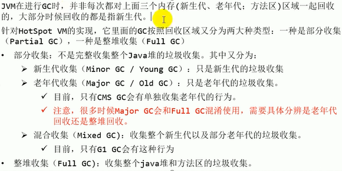

**年轻代GC（Minor GC）触发机制：**


**老年代GC（Major GC、Full GC）触发机制：**


**Full GC触发机制：**


例子：

```java
package jvm.chapter08;

import java.util.ArrayList;
import java.util.List;

/**
 * @Author: zhuzhe
 * @ClassName: GCTest
 * @Date: 2023/1/1 17:59
 * @Description: -Xms9m -Xmx9m -XX:+PrintGCDetails
 * @Version: V1.0
 * @Param:
 */
public class GCTest {
    public static void main(String[] args) {
        int i = 0;
        try {
            List<String> list = new ArrayList<>();
            String a = "zhuzhe.com";
            while (true){
                list.add(a);
                a = a + a;
                i++;
            }
        } catch (Throwable t) {
            t.printStackTrace();
            System.out.println("遍历次数为："+i);
        }
    }
}
```


```
[GC (Allocation Failure) [PSYoungGen: 1980K->480K(2560K)] 1980K->827K(9728K), 0.0037867 secs] [Times: user=0.00 sys=0.00, real=0.00 secs] 
```

[PSYoungGen: 1980K->480K(2560K)] 新生代垃圾回收前的大小->垃圾回收后的新生代大小(新生代总空间大小) Eden+s0+s1

1980K->827K(9728K) 堆总空间在垃圾回收前占用大小->垃圾回收后的堆占用大小(堆空间的总大小) 新生代+老年代

```
[Full GC (Ergonomics) [PSYoungGen: 480K->0K(2560K)] [ParOldGen: 6279K->4443K(7168K)] 6759K->4443K(9728K), [Metaspace: 3272K->3272K(1056768K)], 0.0065058 secs] [Times: user=0.00 sys=0.00, real=0.01 secs] 
```

[Full GC (Ergonomics) [PSYoungGen: 480K->0K(2560K)] : 整堆回收

[Metaspace: 3272K->3272K(1056768K)] : 元空间信息（这里因为没有涉及到类卸载情况，所以不变）

0.0065058 secs]  ： Full GC花费的时间


因为后面Full GC并没有清理大量在老年代存活的对象，所以再次触发了几次Full GC。直到最终新对象分配时老年代空间不足，报内存不足错误。


#### 堆空间分代思想

为什么要把Java堆分代？不分代就不能正常工作吗？

* 经研究，不同对象的生命周期不同。70%-99%的对象是临时对象。
  * 新生代：有Eden、两块大小相同的Survivor（又称from/to，s0/s1）构成，to总为空。
  * 老年代：存放新生代中经历多次GC仍然存活的对象

JDK7的堆内存模型


不设计分代也可以实现垃圾回收器。


JDK8的堆内存模型


#### 内存分配策略


**对象提升Promotion规则**


（大对象：很长的字符串、很大的数组）

（空间分配担保：大量对象在Minor GC后仍然存活，导致Survivor无法完全存储，则可以使用老年代来存储担保）

例子：大对象直接进入老年代

```java
package jvm.chapter08;

/**
 * @Author: zhuzhe
 * @ClassName: YoungOldAreaTest
 * @Date: 2023/1/1 21:41
 * @Description: -Xms60m -Xmx60m -XX:NewRatio=2 -XX:SurvivorRatio=8 -XX:+PrintGCDetails
 * @Version: V1.0
 * @Param:
 */
public class YoungOldAreaTest {
    public static void main(String[] args) {
        byte[] buffer = new byte[1024 * 1024 * 20];//20M
    }
}
```


没有触发垃圾回收。没有GC日志。可以看到老年代产生了大的占用，而新生代没有占用，说明这类大对象在超过新生代的大小时会被直接分配到老年代。


#### 堆对象分配内存：TLAB

为什么要有TLAB（Thread Local Allocation Buffer）线程本地分配缓冲区。

* 堆区是线程共享区域，任何线程都可以访问到堆区中的共享数据。
* 由于对象实例的创建在JVM中非常频繁，因此在并发环境下从堆区划分内存空间是线程不安全的。
* 为避免多个线程操作同一个地址，需要使用加锁等机制，进而影响分配速度。

什么是TLAB？


例子：查看TLAB的开启状态

```java
package jvm.chapter08;

/**
 * @Author: zhuzhe
 * @ClassName: TLABArgsTest
 * @Date: 2023/1/1 21:56
 * @Description:
 * @Version: V1.0
 * @Param:
 */
public class TLABArgsTest {
    public static void main(String[] args) {
        System.out.println("TLAB Args Test...");
        try {
            Thread.sleep(1000000);
        } catch (InterruptedException e) {
            e.printStackTrace();
        }
    }
}
```

上面程序主要是挂起Java进程，这样可以通过cmd查看虚拟机配置。

UseTLAB参数如果是-则是移除，如果是+表示增加。下面的代码中显示当前虚拟机就是在使用TLAB。


（说明默认开启UseTLAB）

**TLAB的补充说明**


（TLAB像是多个 "办事窗口"）


（通常在对象分配时会优先分配TLAB，如果不满足才直接在 Eden中分配）


#### 小结堆空间的参数设置

官网说明：https://docs.oracle.com/javase/8/docs/technotes/tools/unix/java.html

* 查看所有的参数的默认初始值

  ```shell
  -XX:+PrintFlagsInitial
  ```

* 查看所有参数的最终值（可能会存在修改不再是初始值）

  ```shell
  -XX:+PrintFlagsFinal
  ```

* 初始堆空间内存（默认为物理内存的1/64）

  ```shell
  -Xms
  ```

* 最大堆空间内存（默认为物理内存的1/4）

  ```shell
  -Xmx
  ```

* 设置新生代的大小（初始值及最大值）

  ```shell
  -Xmn
  ```

* 配置新生代与老年代在堆结构的占比

  ```shell
  -XX:NewRatio
  ```


例子：查看jvm的所有配置

```java
package jvm.chapter08;

import java.util.ArrayList;
import java.util.List;

/**
 * @Author: zhuzhe
 * @ClassName: GCTest
 * @Date: 2023/1/1 17:59
 * @Description: -Xms9m -Xmx9m -XX:+PrintGCDetails
 * @Version: V1.0
 * @Param:
 */
public class GCTest {
    public static void main(String[] args) {
        int i = 0;
        try {
            List<String> list = new ArrayList<>();
            String a = "zhuzhe.com";
            while (true){
                list.add(a);
                a = a + a;
                i++;
            }
        } catch (Throwable t) {
            t.printStackTrace();
            System.out.println("遍历次数为："+i);
        }
    }
}
```


**堆内存分配担保**


 

#### 堆是分配对象的唯一选择吗？

答案：不一定


**逃逸分析**


例子：没有发生逃逸

```java
public void my_method(){
    V v = new V();
    //...
    v = null;
}
```

没有发生逃逸的对象，则可以分配到栈上，随着方法执行的结束，栈空间就被移除。

例子：更改代码写法，实现对象不逃逸

```java
public static StringBuffer createStringBuffer(String s1, String s2){
    StringBuffer sb = new StringBuffer();
    sb.append(s1);
    sb.append(s2);
    return sb;
}
```

上述代码如果想要StringBuffer不逃逸出方法，可以改为：

```java
public static String createStringBuffer(String s1, String s2){
    StringBuffer sb = new StringBuffer();
    sb.append(s1);
    sb.append(s2);
    return sb.toString();
}
```

例子：

```java
package jvm.chapter08;

/**
 * @Author: zhuzhe
 * @ClassName: EscapeAnalysis
 * @Date: 2023/1/2 17:55
 * @Description: 逃逸分析
 * @Version: V1.0
 * @Param:
 */
public class EscapeAnalysis {
    public EscapeAnalysis obj;

    //方法返回 EscapeAnalysis 对象。发生逃逸
    public EscapeAnalysis getInstance(){
        return obj == null? new EscapeAnalysis():obj;
    }

    //为成员属性赋值，发生逃逸
    public void setObj(){
        this.obj = new EscapeAnalysis();
    }

    //思考：如果当前的obj引用声明为static的？仍然会发生逃逸吗？ 答：会，只有你将对象传递出方法，则仍然可能发生逃逸

    //对象的作用域仅在当前方法中有效，没有发生逃逸
    public void useEscapeAnalysis(){
        EscapeAnalysis e = new EscapeAnalysis();
    }

    //方法调用的其他方法getInstance()内部是操作引用成员变量。发生逃逸
    public void useEscapeAnalysis2(){
        EscapeAnalysis e = getInstance();
    }
}
```

**参数设置**


**结论**

开发中能使用局部变量的，就不要使用在方法外定义。

**逃逸分析：代码优化**


> **栈上分配**

例子：循环创建很多方法内的对象。关闭逃逸分析。

```java
package jvm.chapter08;

/**
 * @Author: zhuzhe
 * @ClassName: StackAllocation
 * @Date: 2023/1/2 18:20
 * @Description: 逃逸分析，栈上分配测试
 * @Version: V1.0
 * @Param: -Xms1G -Xmx1G -XX:-DoEscapeAnalysis -XX:+PrintGCDetails
 */
public class StackAllocation {
    public static void main(String[] args) {
        long start = System.currentTimeMillis();

        for (int i = 0; i< 10000000; i++){
            alloc();
        }
        //查看执行时间
        long end = System.currentTimeMillis();
        System.out.println("花费的时间为："+(end-start)+"ms");
        //为了方便查看堆内存中对象个数，线程sleep
        try {
            Thread.sleep(1000000);
        } catch (InterruptedException e) {
            e.printStackTrace();
        }
    }

    private static void alloc() {
        User user = new User();//未发生逃逸
    }
    static class User{

    }
}
```


在对象的创建上花费时间较长。


可以在堆内存中看到已经创建了1000w个对象。

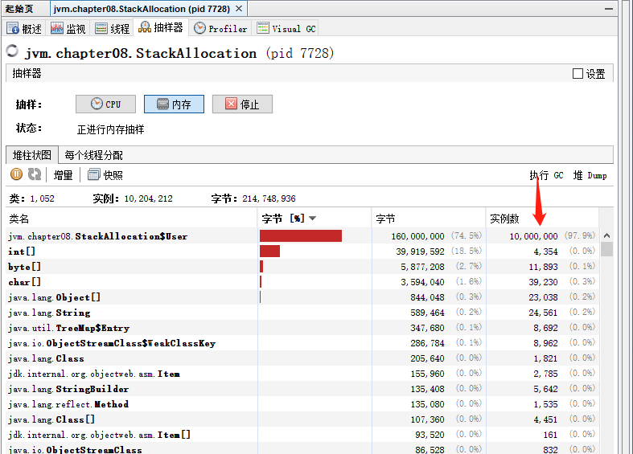

更改为使用逃逸分析


此时因为对象是创建在方法体内，没有发生逃逸，所以将使用逃逸分析后直接在栈上面进行对象分配。

在对象的分配上花费时间较短。


在堆内存中查看（并不是所有对象的创建都能被逃逸分析分配到栈上，但大部分都会进行）

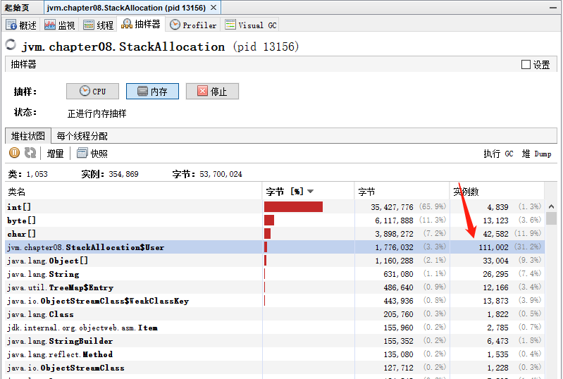

如果限制堆内存小点，并不开启逃逸分析，则会触发多次gc来保证对象能全在堆中分配（快速分配并快速回收）


在限制堆内存并且开启逃逸分析后，由于对象在堆上不够分配，则基本全部对象都会经过逃逸分析后进入栈分配。所以不会触发gc。


> **同步省略**


例子：下面的代码就可以不用同步代码块

```java
public void f(){
    Object hollis = new Object();
    synchronized(hollis){
        System.out.println(hollis);
    }
}
```

代码中堆hollis这个对象进行加锁，但是hollis对象的生命周期只在f()方法中，并不会被其他线程所访问到，所以在jit编译阶段就会进行优化。优化代码为：

```java
public void f(){
    Object hollis = new Object();
    System.out.println(hollis);
}
```


编译之后，在字节码文件上可以看到锁。但在运行之后锁就会被消除


> **分离对象或标量替换**


（标量：基本数据类型、非标量：对象）

聚合量的分解

```java
public static void main(String[] args){
    alloc();
}
private static void alloc(){
    Point point = new Point(1,2);
    System.out.println("point.x="+point.x+", point.y="+point.y);
}
class Point{
    private int x;
    private int y;
}
```

对象属于聚合量，正常来说对象是会被分配在堆空间中。如果逃逸分析发现对象不会被外部引用，则会将对象分解成标量。

```java
private static void alloc(){
    int x = 1;
    int y = 2;
    System.out.println("point.x="+x+", point.y="+y);
}
```


(标量替换处理对象后，变为方法内局部变量，也就算分配在栈空间中了)

**如何开启标量替换**

标量替换参数设置：开启了标量替换（默认打开），允许将对象打散分配在栈上。

```shell
-XX:+EliminateAllocations
```

例子：

```java
package jvm.chapter08;

/**
 * @Author: zhuzhe
 * @ClassName: ScalarReplace
 * @Date: 2023/1/2 19:00
 * @Description: -Xms100m -Xmx100m -XX:+DoEscapeAnalysis -XX:+PrintGC -XX:-EliminateAllocations
 * @Version: V1.0
 * @Param:
 */
public class ScalarReplace {
    public static class User {
        public int id;
        public String name;
    }

    public static void alloc() {
        User user = new User();//为发生逃逸
        user.id = 123;
        user.name = "zhuzhe";
    }

    public static void main(String[] args) {
        long start = System.currentTimeMillis();
        for (int i = 0; i < 10000000; i++) {
            alloc();
        }
        long end = System.currentTimeMillis();
        System.out.println("花费的时间为：" + (end - start) + "ms");
    }
}
```

开逃逸分析和去掉标量替换


发生了GC，说明堆空间对象活动频繁。


开启标量替换


大量对象以标量替换方式分解后分配在栈上，堆空间不会被占用满，所以没有发生GC。


（这里没有开启server还能起效，是因为在64位情况下启动的Java VM就是Server模式）


**总结**


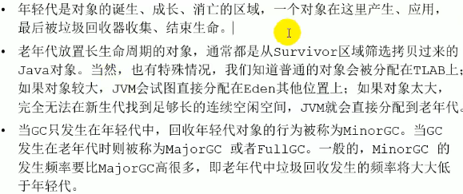


### 方法区

#### 栈、堆、方法区的交互关系

从内存划分角度：


从是否线程共享的角度：

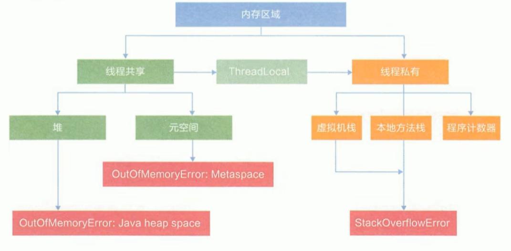

栈、堆、方法区三者的关系：实例化一个对象


#### 方法区的理解

官网文档：https://docs.oracle.com/javase/specs/jvms/se8/html/jvms-2.html#jvms-2.5.4


（存储类类型信息、常量、静态数据、全局变量、线程共享、非堆）

**方法区在哪里**


例子：

```java
package jvm.chapter09;

/**
 * @Author: zhuzhe
 * @ClassName: MethodAreaDemo
 * @Date: 2023/1/2 22:56
 * @Description: -Xms600m -Xmx600m
 * @Version: V1.0
 * @Param:
 */
public class MethodAreaDemo {
    public static void main(String[] args) {
        System.out.println("start...");
        try {
            Thread.sleep(1000000);
        } catch (InterruptedException e) {
            e.printStackTrace();
        }
        System.out.println("end...");
    }
}
```

启动之后打开Java visual VM。发现前面设置堆的参数是不会影响到方法区的配置。


（方法区是独立于堆的一个空间）


（内存溢出）

从前面学习类加载子系统中可以知道，类在加载时有几个类加载器，以双亲委派机制来加载一个Java程序中所使用到类。加载后的类信息会存储在方法区。


加载大量的第三方jar包，Tomcat部署的工程过多（30-50个），大量动态的生成反射类。这些情况都可能导致方法区的OOM。


#### 方法区的演进


方法区在jdk7与8中的区别：是否在虚拟机内存管理中。


Hotspot中方法区的演进


#### 设置方法区大小与OOM

设置方法区的大小：jdk7和jdk8的参数有所区别。


查看永久代默认设置：

使用前面的代码例子，挂住Java程序来查看配置。

```java
public class MethodAreaDemo {
    public static void main(String[] args) {
        System.out.println("start...");
        try {
            Thread.sleep(1000000);
        } catch (InterruptedException e) {
            e.printStackTrace();
        }
        System.out.println("end...");
    }
}
```

```shell
jinfo -flag PermSize 进程号
```

这个命令只在jdk7的环境才能使用


这一个数值是20mb。

```shell
jinfo -flag MaxPermSize 进程号
```


这个值的默认大小为80mb。


注意：jdk8中无法使用jdk7的永久代参数。


在官方文档中也有说明：https://docs.oracle.com/javase/8/docs/technotes/tools/unix/java.html


jdk8中使用：

```shell
-XX:MetaspaceSize
-XX:MaxMetaspaceSize
```

查询结果：20M和没有限制


设置方法区的大小


```shell
-XX:MetaspaceSize=100m -XX:MaxMetaspaceSize=100m
```


如果参数是正确的，则可以正常启动程序。如果有错误则会启动失败并提示。


并且可以查询到


如果在jdk8中使用jdk7的参数就会报错

```shell
-XX:PermSize
-XX:MaxPermSize
```


**实现方法区的OOM**

方法区的存储类加载信息，要使其oom，则就是不断创建新的类。

例子：

```java
package jvm.chapter09;

import jdk.internal.org.objectweb.asm.ClassWriter;
import jdk.internal.org.objectweb.asm.Opcodes;

/**
 * @Author: zhuzhe
 * @ClassName: OOMTest
 * @Date: 2023/1/2 23:54
 * @Description: 在元空间中创建并加载10000个类
 * @Version: V1.0
 * @Param: -XX:MetaspaceSize=10m -XX:MaxMetaspaceSize=10m
 */
public class OOMTest extends ClassLoader{
    public static void main(String[] args) {
        int j = 0;
        try {
            OOMTest test = new OOMTest();
            for (int i = 0; i < 10000; i++) {
                //创建ClassWriter对象，用于生成类的二制字节码
                ClassWriter classWriter = new ClassWriter(0);
                //指明版本号，修饰符，类名，包名，父类，接口
                classWriter.visit(Opcodes.V1_8,Opcodes.ACC_PUBLIC,"Class"+i,null,"java/lang/Object",null);
                //返回byte[]
                byte[] code = classWriter.toByteArray();
                //类的加载
                test.defineClass("Class"+i,code,0,code.length);//Class对象
                j++;
            }
        } finally {
            System.out.println(j);
        }
    }
}
```

这个是往元空间输入10000个类信息。如果是默认配置，则可以正常执行结束。


如果设置一个元空间大小 ，则可以明显看到元空间是不足以承载10000个类信息。

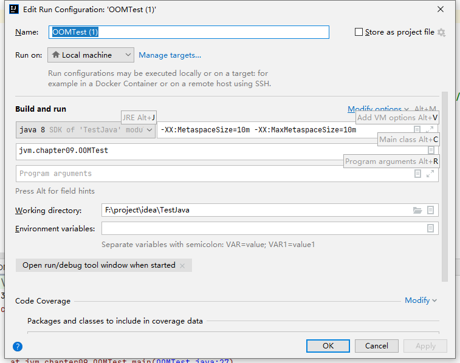


在jdk7中会报PermGen space的OOM


**如何解决OOM**


#### 方法区的内部结构

方法区中都存储什么信息？


**类型信息**


**域（Field）信息**

* JVM必须在方法区中保存类型的所有域的相关信息以及域的声明顺序
* 域的相关信息包括：域名称、域类型、域修饰符（public，private，protected，static，final，volatile，transient的某个子集）

**方法（Method）信息**


例子：

```java
package jvm.chapter09;

import java.io.Serializable;

/**
 * @Author: zhuzhe
 * @ClassName: MethodInnerStruckTest
 * @Date: 2023/1/3 22:22
 * @Description:
 * @Version: V1.0
 * @Param:
 */
public class MethodInnerStruckTest extends Object implements Comparable<String>, Serializable {
    //属性
    public int num = 10;
    private static String str = "测试方法的内部结构";

    //构造器

    //方法
    public void test1() {
        int count = 20;
        System.out.println("count=" + count);
    }

    public static int test2(int cal) {
        int result = 0;

        try {
            int value = 30;
            result = value / cal;
        } catch (Exception e) {
            e.printStackTrace();
        }
        return result;
    }

    

    @Override
    public int compareTo(String o) {
        return 0;
    }
}
```

使用javap命令来将字节码文件解析为字节码命令【-p: 允许将不同权限的属性都展示出来private】

```shell
javap -v -p MethodAreaDemo.class
```

将字节码命令结果输出到一个文本中，

```shell
javap -v -p MethodAreaDemo.class > test.txt
```


在文件中可以看到字节码命令中描述类的信息：类的类型，全名，接口


方法区中除了记录类基本信息外，还记录了类的加载器信息。（如果类的加载器没有用了，对应的加载出来的类也将会被处理。）


类的构造器，如果在类中没有定义的话，虚拟机会自动生成一个构造器，也就是对应字节码文件中的`<init>`方法


（在源代码方面，构造器和普通方法有所区别，在虚拟机中都归类于方法）

方法信息


（方法签名、方法返回类型为整型、方法权限为公开+私有、方操作数栈3、本地变量表深度2，参数大小1、行号表、本地变量表、异常表）

*方法信息、域信息、类型信息都会通过类加载器加载到方法区中*


**non-final的类变量**

* 静态变量和类关联在一起，随着类的加载而加载，它们成为类数据在逻辑上的一部分。
* 类变量被类的所有实例共享，即使没有类实例时你也可以访问它。

但这类访问并不规范，在idea中都不会提示可以访问的资源，在阅读时也会有歧义性。

```java
package jvm.chapter09;

/**
 * @Author: zhuzhe
 * @ClassName: MethodAreaTest
 * @Date: 2023/1/4 11:33
 * @Description:
 * @Version: V1.0
 * @Param:
 */
public class MethodAreaTest {
    public static void main(String[] args) {
        Order order = null;
        order.hello();
        System.out.println(order.count);
    }
}
class Order{
    public static int count = 1;
    public static final int number = 2;

    public static void hello(){
        System.out.println("hello!");
    }
}
```


**全局常量：static final**

被声明为final的类变量的处理方法则不同，每个全局常量在编译时就会被分配了。

例子：Order类中有两个变量，其中一个声明为final

```java
package jvm.chapter09;

/**
 * @Author: zhuzhe
 * @ClassName: MethodAreaTest
 * @Date: 2023/1/4 11:33
 * @Description:
 * @Version: V1.0
 * @Param:
 */
public class MethodAreaTest {
    public static void main(String[] args) {
        Order order = null;
        order.hello();
        System.out.println(order.count);
    }
}
class Order{
    public static int count = 1;
    public static final int number = 2;

    public static void hello(){
        System.out.println("hello!");
    }
}
```

编译后的字节码文件。


静态的变量在链接阶段（准备）就会进行一次初始化，在initial阶段`<clinit>`就会进行赋值。final则是在编译阶段就已经赋值。


**常量池与运行时常量池**


在字节码文件中描述的运行时常量池：


运行时常量池与常量池：

* 方法区，内部包含了运行时常量池
* 字节码文件，内部包含了常量池
* 要弄清楚方法区，需要理解清楚ClassFile，因为加载类的信息都在方法区。
* 要弄清楚方法区的运行时常量池，需要理解清楚ClassFile中的常量池。
* 官方文档：https://docs.oracle.com/javase/specs/jvms/se8/html/jvms-4.html


**常量池**

在字节码的二进制信息中，对应的常量池区域：


（一个有效的字节码文件中除了包含类的版本信息、字段、方法以及接口等描述信息外，还包含一项信息那就是常量池表（Constant Pool Table），包括各种**字面量**和对类型、域、方法的符号引用）

提供常量池的目的：将运行一个类所需的资源，以引用方式描述。而引用信息就需要存储在字节码文件的常量池中。


例子：

```java
package jvm.chapter09;

import java.io.Serializable;

/**
 * @Author: zhuzhe
 * @ClassName: MethodInnerStruckTest
 * @Date: 2023/1/3 22:22
 * @Description:
 * @Version: V1.0
 * @Param:
 */
public class MethodInnerStruckTest extends Object implements Comparable<String>, Serializable {
    //属性
    public int num = 10;
    private static String str = "测试方法的内部结构";

    //构造器

    //方法
    public void test1() {
        int count = 20;
        System.out.println("count=" + count);
    }

    public static int test2(int cal) {
        int result = 0;

        try {
            int value = 30;
            result = value / cal;
        } catch (Exception e) {
            e.printStackTrace();
        }
        return result;
    }


    @Override
    public int compareTo(String o) {
        return 0;
    }
}
```

编译后查看jclasslib


查看其中一个方法的字节码指令，可以看到有很多引用常量池的操作。


可以看到，源代码中的输出语句，实际的调用了StringBuilder的append


常量池中的信息：


总结：

常量池，可以看作是一张表，虚拟机指令根据这张常量表找到要执行的类名、方法名、参数类型、字面量等类型。


**运行时常量池**


**JIT代码缓存**

字节码指令翻译成机器指令后，会将其缓存到方法区。缓存的好处是这块代码如何频繁被调用的话，就会直接从内存中读取机器指令。


#### 方法区使用举例

例子：

```java
package jvm.chapter09;

/**
 * @Author: zhuzhe
 * @ClassName: MethodAreaDemo
 * @Date: 2023/1/2 22:56
 * @Description: -Xms600m -Xmx600m -XX:MetaspaceSize=100m -XX:MaxMetaspaceSize=100m
 * @Version: V1.0
 * @Param:
 */
public class MethodAreaDemo2 {
    public static void main(String[] args) {
        int x = 500;
        int y = 100;
        int a = x/y;
        int b = 50;
        System.out.println(a+b);
    }
}
```

```
Classfile /F:/project/idea/TestJava/out/production/TestJava/jvm/chapter09/MethodAreaDemo2.class
  Last modified 2023-1-6; size 635 bytes
  MD5 checksum 36ac915319b00681dbbe7895416d6808
  Compiled from "MethodAreaDemo2.java"
public class jvm.chapter09.MethodAreaDemo2
  minor version: 0
  major version: 52
  flags: ACC_PUBLIC, ACC_SUPER
Constant pool:
   #1 = Methodref          #5.#24         // java/lang/Object."<init>":()V
   #2 = Fieldref           #25.#26        // java/lang/System.out:Ljava/io/PrintStream;
   #3 = Methodref          #27.#28        // java/io/PrintStream.println:(I)V
   #4 = Class              #29            // jvm/chapter09/MethodAreaDemo2
   #5 = Class              #30            // java/lang/Object
   #6 = Utf8               <init>
   #7 = Utf8               ()V
   #8 = Utf8               Code
   #9 = Utf8               LineNumberTable
  #10 = Utf8               LocalVariableTable
  #11 = Utf8               this
  #12 = Utf8               Ljvm/chapter09/MethodAreaDemo2;
  #13 = Utf8               main
  #14 = Utf8               ([Ljava/lang/String;)V
  #15 = Utf8               args
  #16 = Utf8               [Ljava/lang/String;
  #17 = Utf8               x
  #18 = Utf8               I
  #19 = Utf8               y
  #20 = Utf8               a
  #21 = Utf8               b
  #22 = Utf8               SourceFile
  #23 = Utf8               MethodAreaDemo2.java
  #24 = NameAndType        #6:#7          // "<init>":()V
  #25 = Class              #31            // java/lang/System
  #26 = NameAndType        #32:#33        // out:Ljava/io/PrintStream;
  #27 = Class              #34            // java/io/PrintStream
  #28 = NameAndType        #35:#36        // println:(I)V
  #29 = Utf8               jvm/chapter09/MethodAreaDemo2
  #30 = Utf8               java/lang/Object
  #31 = Utf8               java/lang/System
  #32 = Utf8               out
  #33 = Utf8               Ljava/io/PrintStream;
  #34 = Utf8               java/io/PrintStream
  #35 = Utf8               println
  #36 = Utf8               (I)V
{
  public jvm.chapter09.MethodAreaDemo2();
    descriptor: ()V
    flags: ACC_PUBLIC
    Code:
      stack=1, locals=1, args_size=1
         0: aload_0
         1: invokespecial #1                  // Method java/lang/Object."<init>":()V
         4: return
      LineNumberTable:
        line 11: 0
      LocalVariableTable:
        Start  Length  Slot  Name   Signature
            0       5     0  this   Ljvm/chapter09/MethodAreaDemo2;

  public static void main(java.lang.String[]);
    descriptor: ([Ljava/lang/String;)V
    flags: ACC_PUBLIC, ACC_STATIC
    Code:
      stack=3, locals=5, args_size=1
         0: sipush        500
         3: istore_1
         4: bipush        100
         6: istore_2
         7: iload_1
         8: iload_2
         9: idiv
        10: istore_3
        11: bipush        50
        13: istore        4
        15: getstatic     #2                  // Field java/lang/System.out:Ljava/io/PrintStream;
        18: iload_3
        19: iload         4
        21: iadd
        22: invokevirtual #3                  // Method java/io/PrintStream.println:(I)V
        25: return
      LineNumberTable:
        line 13: 0
        line 14: 4
        line 15: 7
        line 16: 11
        line 17: 15
        line 18: 25
      LocalVariableTable:
        Start  Length  Slot  Name   Signature
            0      26     0  args   [Ljava/lang/String;
            4      22     1     x   I
            7      19     2     y   I
           11      15     3     a   I
           15      11     4     b   I
}
SourceFile: "MethodAreaDemo2.java"
```

①执行指令地址0的指令，程序计数器记录指令地址。对应的操作指令`0: sipush        500`就会将500push近操作数栈。


②执行指令地址3的操作指令`3: istore_1`，程序计数器记录指令地址。将操作数栈中的数据移动到本地变量表中地址1的位置。


③执行指令`4: bipush        100`将100放入到操作数栈中。


④执行指令`6: istore_2`将100放入到本地变量表地址2。


⑤执行指令`7: iload_1`将本地变量表中索引为1位置的数据取出来放入到操作数栈中


⑥执行指令`8: iload_2`将本地变量表中索引为2位置的数据取出来放入到操作数栈中


⑦执行指令`9: idiv`将操作数栈中的元素取出，相除并返回操作数栈


⑧执行指令`10: istore_3`将操作数栈的内容放入到本地变量表地址3的位置


⑨执行指令`11: bipush        50`将50push进入操作数栈


⑩执行指令`13: istore        4`将50放入到本地变量表地址4中


①①执行指令`15: getstatic     #2`调用常量池中的#2


（这里会先根据符号引用，先判断是否加载过System类，如果没有就去加载System类进方法区，此时的引用就不是符号引用而是直接引用）在字节码的常量池中描述是字符串，真实使用在运行时常量池中是以加载好的对象地址来使用。

①②执行指令`18: iload_3`读取本地变量表中地址3的内容到操作数栈


①③执行指令`19: iload         4`读取本地变量表中地址4的内容到操作数栈


①④执行指令`21: iadd`将操作数栈的内容进行加运算


①⑤执行指令`22: invokevirtual #3`执行[虚拟方法调用](#####方法的调用：解析与分派)（调系统Api）


①⑥执行指令`25: return`将方法执行结果返回，并移除栈帧


```
整个执行过程中，程序计数器起到记录当前执行位置索引的作用。避免在cpu做线程切换时当前线程的执行位置丢失。
```


#### 方法区的演进细节

在JDK8中，虚拟机的内存结构调整。


**为什么要设计元空间来替代永久代**

官网：https://openjdk.org/jeps/122


**字符串常量池的改变**


**静态变量的存放位置改变**

例子：创建一个大对象会直接存储到堆中老年代

```java
package jvm.chapter09;

/**
 * @Author: zhuzhe
 * @ClassName: StaticFieldTest
 * @Date: 2023/1/6 19:22
 * @Description:
 * jdk7:
 * -Xms200m -Xmx200m -XX:PermSize=300m -XX:MaxPermSize=300m -XX:+PrintGCDetails
 * jdk8：
 * -Xms200m -Xmx200m -XX:MetaspaceSize=300m -XX:MaxMetaspaceSize=300m -XX:+PrintGCDetails
 * @Version: V1.0
 * @Param:
 */
public class StaticFieldTest {
    private static byte[] arr = new byte[1024*1024*100];

    public static void main(String[] args) {
        System.out.println(StaticFieldTest.arr);
        /*try {
            Thread.sleep(10000000);
        } catch (InterruptedException e) {
            e.printStackTrace();
        }*/
    }
}
```


这里对象的分配还是和之前一样，但是对象的引用名`arr`这个在不同jdk版本中是存放位置不同。

使用工具JHSDB来分析（jdk默认自带，但是是从jdk9才开始引入）

jhsdb目的是用来监控Java进程。这里我下载新版本的jdk17中一样有这个工具。


例子：一个Java程序中有三个变量

```java
package jvm.chapter09;


/**
 * @Author: zhuzhe
 * @ClassName: StaticObjTest
 * @Date: 2023/1/7 15:52
 * @Description:
 * @Version: V1.0
 * @Param:
 */
public class StaticObjTest {
    static class Test{
        static ObjectHolder staticObj = new ObjectHolder();//静态成员
        ObjectHolder instanceObj = new ObjectHolder();//实例成员

        void foo(){
            ObjectHolder localObj = new ObjectHolder();//局部变量
            System.out.println("done");
        }
    }
    private static class ObjectHolder{

    }

    public static void main(String[] args) {

    }
}
```

测试：

按照前面所将，三个对象应该是下面这样。

staticObj：随着Test的类型信息存放在方法区

instanceObj：随着Test的对象实例存放在堆

localObj：存放在foo()方法栈帧的局部变量表中

使用jhsdb查看Eden区域，发现三个对象都在堆上分配。


结论：三个对象的数据在内存中的地址都落在Eden区范围，所以得出只要是对象实例，比如会在Java堆中分配。


#### 方法区的垃圾回收


（方法区中不是没有GC，是可以实现垃圾回收。）


（字面量和符号引用回收比较简单——没有被引用）


（对于方法区中的类的回收条件比较苛刻，但确实在一些场景下需要对大量产生的类进行回收。）


**运行时数据区常见面试题**

* 说下JVM的内存模型，有哪些区？分别是干什么的
* Java８的内存分代改进
* jvm内存分哪几个区，每个区的作用是什么
* jvm内存分布、内存结构？栈和堆的区别？堆的结果？为什么会有两个Survivor区？
* Eden和Survivor的区别
* jvm内存分布，为什么要有新生代和老年代
* Java的内存分布
* 讲讲jvm运行时数据库区
* 什么时候对象会进入老年代


### 对象实例化的几种方式

new的对象是存放在堆中的，对象的类型信息是存在方法区。在方法的局部变量对象可能就会分配的栈帧中。

解决问题：

* 对象在JVM中是怎么存储的
* 对象头信息里面有哪些东西
* Java对象头里有什么

#### 对象的实例化


* 创建对象的几种方式

  * new：常见方式、单例模式、建造者模式、工厂模式
  * Class的newInstance()：反射、只能调用空参的构造器，权限必须是public
  * Constructor的newInstance()：反射、可以调用空参、带参的构造器，权限没有要求
  * 使用clone()：原型模式、不调用任何构造器，当前类需要实现Cloneable接口
  * 使用反序列化：从文件、网络中获取一个对象的二进制流
  * 第三方Objenesis

* 创建对象的步骤

  ```java
  public class ObjectTest{
      public static void main(String[] args){
          Object obj = new Object();
      }
  }
  ```

  

  (具体过程就按照上面的6个步骤)

  > 给对象属性赋值的操作：①默认初始化、②显式初始化、③代码块中初始化、④构造器中初始化。

  1. 判断对象的类是否加载、链接、初始化

     > 虚拟机遇到一条new指令，首先去检查这个指令的参数能否在Metaspace的常量池中定位到一个类的符号引用，并且这个符号引用代表的类是否已经被加载、解析、初始化（即判断类元信息是否存在）。如果没有，那么在双亲委派机制模式下，使用当前类加载器以ClassLoader+包名+类名为Key进行查找对应的class文件。如果没有找到文件，则弹出ClassNotFoundException异常，如果找到，则进行类加载，并生成对应的Class类对象。

  2. 为对象分配内存

     > 首先计算对象占用空间大小，接着在堆中划分一块内存给新对象。如果实例成员变量是引用变量，仅分配引用变量空间即可，即4个字节大小。

     ```java
     package jvm.chapter10;
     
     /**
      * @Author: zhuzhe
      * @ClassName: Customer
      * @Date: 2023/1/7 16:52
      * @Description:
      * @Version: V1.0
      * @Param:
      */
     public class Customer {
         int id = 1001;
         String name;
         Account acct;
         {
             name = "匿名客户";
         }
     
         public Customer() {
             acct = new Account();
         }
     }
     class Account{
     
     }
     ```

     * 如果内存规整——指针碰撞

       > 如果内存是规整的，那么虚拟机将采用的是指针碰撞法（Bump The Pointer）来为对象分配内存。
       >
       > 意思是所有用过的内存在一边，空闲的内存在另外一边，中间放着一个指针作为分界点的指示器，分配内存就仅仅是把指针向空闲那边移动一段与对象大小相等的距离。如果垃圾收集器选择的是Serial、ParNew这种基于压缩算法的，虚拟机采用这种分配方式。一般使用带有compact（整理）过程的收集器时，使用指针碰撞。

     * 如果内存不规整

       * 虚拟机需要维护一个列表

       * 空闲列表分配

         > 如果内存不是规整的，已使用的内存和未使用的内存相互交错，那么虚拟机将采用的是空闲列表算法来为对象分配内存。
         >
         > 意思是虚拟机维护了一个列表，记录上哪些内存块是可用的，在分配的时候从列表中找到一块足够大的空间划分给对象实例，并更新列表上的内容。这种分配方式称为 "空闲列表（Free List）"。

     * 说明

       > 选择哪种分配方式由Java堆是否规整决定，而Java堆是否规整又由所采用的垃圾收集器是否带有压缩整理功能决定。

  3. 处理并发安全问题

     * 采用CAS失败重试、区域加锁保证更新的原子性
     * 每个线程预先分配一块TLAB，通过-XX:+/-UseTLAB参数来设定

  4. 初始化分配到的空间——所有属性设置默认值，保证对象实例字段在不赋值时可以直接使用

     > **①默认初始化**

  5. 设置对象的对象头

     > 将对象的所属类（即类的元数据信息）、对象的HashCode和对象的GC信息、锁信息等数据存储在对象头中。这个过程的具体设置方式取决于JVM的实现。

  6. 执行`<init>`方法进行初始化

     

     > **②显式初始化、③代码块中初始化、④构造器中初始化**
     >
     > 在Java程序的视角来看，初始化才正式开始，初始化成员变量，执行实例化代码块，调用类的构造方法，并把堆内对象的首地址赋值给引用变量。
     >
     > 因此一般来说（由字节码中是否跟随由invokespecial指令所决定），new指令之后会接着就是执行方法，把对象按照程序员的意愿进行初始化，这样一个真正可用的对象才算完全创建出来。

```
1. 加载类元信息
2. 为对象分配内存
3. 处理并发问题
4. 属性的默认初始化（零值初始化）
5. 设置对象头的信息
6. 属性的显式初始化、代码块中初始化、构造器中初始化
```


#### 对象的内存布局

介绍new之后在堆空间存放的对象，有哪些结构。


* 对象头（Header）

  * 运行时元数据（Mark Word）
    * 哈希值（HashCode）
    * GC分代年龄
    * 锁状态标志
    * 线程持有的锁
    * 偏向线程ID
    * 偏向时间戳
  * 类型指针——指向类元数据instanceKlass，确定该对象所属的类型
  * 说明：如果是数组，还需要记录数组的长度

* 实例数据（Instance Data）

  * 说明：它是对象真正存储的有效信息，包括程序代码中定义的各种类型的字段（包括从父类继承下来的和本身拥有的字段）
  * 规则
    * 相同宽度的字段总是被分配在一起
    * 父类中定义的变量会出现在子类之前
    * 如果CompactFields参数为true（默认）：子类的窄变量可能插入到父类变量的空隙。

* 对其填充（Padding）——不是必须的，也没有特别含义，仅仅起到占位符的作用

* 小结

  

  例子：

  ```java
  package jvm.chapter10;
  
  /**
   * @Author: zhuzhe
   * @ClassName: Customer
   * @Date: 2023/1/7 16:52
   * @Description:
   * @Version: V1.0
   * @Param:
   */
  public class Customer {
      int id = 1001;
      String name;
      Account acct;
      {
          name = "匿名客户";
      }
  
      public Customer() {
          acct = new Account();
      }
  }
  class Account{
  
  }
  ```

  ```java
  package jvm.chapter10;
  
  /**
   * @Author: zhuzhe
   * @ClassName: CustomerTest
   * @Date: 2023/1/7 20:56
   * @Description:
   * @Version: V1.0
   * @Param:
   */
  public class CustomerTest {
      public static void main(String[] args) {
          Customer cust = new Customer();
      }
  }
  ```

  

  （图片就是上面代码执行后，虚拟机内存中的处理）

  * main方法为主线程，所以会往虚拟机栈中压入main的栈帧，栈帧中就包含了很多个结构（局部变量表、操作数栈、动态链接、方法返回地址、附加信息）
  * 因为是静态方法，所以局部变量表不用存放this。第一个位置放args，第二个位置放cust
  * cust指向堆空间中new出来的对象，一个堆空间中的对象包含很多结构（对象头、实例数据、对齐填充）
  * 对象头中包含运行时元数据（哈希值、GC分代年龄、锁状态标志...）和类型指针（方法区中当前类元信息）
  * 实例数据中包含当前实例数据和父类实例数据
  * 当前实例数据中包含对象成员赋值过程（默认初始化、显式初始化、代码块中初始化、构造器中初始化）
  * 字符串成员变量则会在编译时将字符串常量存储到常量池（堆空间）
  * 对象成员变量在实例化对象也是使用到方法区中的类元


#### 对象的访问定位

JVM是如何通过栈帧中的对象引用访问到其内部的对象实例？


（因为栈帧中的对象引用记录了堆空间中对象的地址值）

* 创建对象的目的是为了使用它

* JVM是如何通过栈帧中的对象引用访问到其内部的对象实例的呢？——定位，通过栈上的reference访问

* 对象访问方式主要有两种

  * 句柄访问

    

    * 实现

      > java堆中会分出一块区域来作为句柄池。栈中的reference指向堆3中的句柄，句柄中存储的是指向堆中示例数据的地址以及指向方法区中对象实例类型的地址。

    * 好处

      > reference中存储稳定句柄地址，对象被移动（垃圾收集时移动对象很普遍）时只会改变句柄中实例数据指针即可，reference本身不需要被修改

  * 直接指针（Hotspot采用）

    

    * 实现

      > reference直接指向堆中对象，Java 堆对象的布局中就必须考虑如何放置访问类型数据的相关信息

    * 好处

      > 使用直接指针访问方式最大的好处就是速度快，它节省了一次指针定位的时间开销。


### 直接内存Direct Memory

jdk8中将方法区改为了元空间实现，元空间的主要设计就是直接内存。

**定义**


|                  | IO             | NIO（New IO/Non-Blocking IO） |
| ---------------- | -------------- | ----------------------------- |
| 传输时使用的结构 | byte[]、char[] | Buffer                        |
| 基于哪些对象实现 | Stream         | Channel                       |

例子：NIO

```java
package jvm.chapter10;

import java.nio.ByteBuffer;
import java.util.Scanner;

/**
 * @Author: zhuzhe
 * @ClassName: BufferTest
 * @Date: 2023/1/7 21:53
 * @Description:
 * @Version: V1.0
 * @Param:
 */
public class BufferTest {
    private static final int BUFFER = 1024 * 1024 * 1024;//1GB

    public static void main(String[] args) {
        ByteBuffer byteBuffer = ByteBuffer.allocateDirect(BUFFER);//使用本地直接内存的对象
        System.out.println("直接内存分配完毕...");

        Scanner scanner = new Scanner(System.in);//阻塞用
        scanner.next();

        System.out.println("直接内存开始释放！");
        byteBuffer = null;
        System.gc();
        scanner.next();
    }
}
```


在结束scanner的阻塞后，可以看到申请的内存直接结束。


**使用Java程序去访问物理磁盘上的文件**


**使用直接缓冲区去访问物理磁盘上的文件**


（使用直接缓冲区就不用去做用户态和内核态的转换）

```java
package jvm.chapter10;

import java.io.FileInputStream;
import java.io.FileNotFoundException;
import java.io.FileOutputStream;
import java.io.IOException;
import java.nio.ByteBuffer;
import java.nio.channels.FileChannel;

/**
 * @Author: zhuzhe
 * @ClassName: BufferTest2
 * @Date: 2023/1/7 22:10
 * @Description:
 * @Version: V1.0
 * @Param:
 */
public class BufferTest2 {
    private static final String TO = "F:\\project\\idea\\TestJava\\out\\production\\TestJava\\jvm\\chapter10\\巫师三.mp4";
    private static final int _100MB = 1024 * 1024 * 1024;

    //将视频复制3次，测试普通IO操作和NIO操作的效率差别
    public static void main(String[] args) {
        long sum = 0;
        String src = "F:\\data\\QQData\\2832143715\\FileRecv\\MyVideo_3.mp4";
        for (int i = 0;i<3;i++){
            String dest = "F:\\project\\idea\\TestJava\\out\\production\\TestJava\\jvm\\chapter10\\巫师三_"+i+".mp4";
            sum += io(src,dest);
            //sum += directBuffer(src,dest);
        }
        System.out.println("总花费的时间为："+sum);
    }

    /**
     * 使用普通IO，Java程序操作磁盘文件
     * @param src 输入文件地址
     * @param dest 输出文件地址
     * @return 一次io操作的耗时
     */
    private static long io(String src, String dest) {
        long start = System.currentTimeMillis();

        FileInputStream in = null;
        FileOutputStream out = null;

        try {
            in = new FileInputStream(src);
            out = new FileOutputStream(dest);
            byte[] buffer = new byte[_100MB];
            while (true){
                int len = in.read(buffer);
                if (len==-1){
                    break;
                }
                out.write(buffer,0,len);
            }
        } catch (IOException e) {
            e.printStackTrace();
        }finally {
            if (in!=null){
                try {
                    in.close();
                } catch (IOException e) {
                    e.printStackTrace();
                }
            }
            if (out!=null){
                try {
                    out.close();
                } catch (IOException e) {
                    e.printStackTrace();
                }
            }
        }
        long end = System.currentTimeMillis();
        return end-start;
    }

    /**
     * 使用NIO，直接内存方式操作磁盘文件
     * @param src 输入文件地址
     * @param dest 输出文件地址
     * @return 一次io操作的耗时
     */
    private static long directBuffer(String src, String dest) {
        long start = System.currentTimeMillis();

        FileChannel inChannel = null;
        FileChannel outChannel = null;
        try {
            inChannel = new FileInputStream(src).getChannel();
            outChannel = new FileOutputStream(dest).getChannel();

            ByteBuffer byteBuffer = ByteBuffer.allocateDirect(_100MB);//本地字节缓冲区
            while (inChannel.read(byteBuffer)!=-1){
                byteBuffer.flip();//修改为读数据模式
                outChannel.write(byteBuffer);
                byteBuffer.clear();//清空
            }
        } catch (IOException e) {
            e.printStackTrace();
        }finally {
            if (inChannel!=null){
                try {
                    inChannel.close();
                } catch (IOException e) {
                    e.printStackTrace();
                }
            }
            if (outChannel!=null){
                try {
                    outChannel.close();
                } catch (IOException e) {
                    e.printStackTrace();
                }
            }
        }


        long end = System.currentTimeMillis();
        return end-start;
    }
}
```

使用普通IO的耗时


使用NIO的方式，直接内存的缓冲使得读写加快。


**直接内存的缺点**


例子：一个不断申请直接内存的例子

```java
package jvm.chapter10;

import java.nio.ByteBuffer;
import java.util.ArrayList;

/**
 * @Author: zhuzhe
 * @ClassName: BufferTest3
 * @Date: 2023/1/7 23:06
 * @Description:
 * @Version: V1.0
 * @Param:
 */
public class BufferTest3 {

    private static final int BUFFER = 1024 * 1024 * 20;//20MB

    public static void main(String[] args) {
        ArrayList<ByteBuffer> list = new ArrayList<>();

        int count = 0;
        try {
            while (true){
                ByteBuffer byteBuffer = ByteBuffer.allocateDirect(BUFFER);//不断申请直接内存
                list.add(byteBuffer);
                count++;
                Thread.sleep(100);
            }
        } catch (Exception e) {
            e.printStackTrace();
        }finally {
            System.out.println(count);//测试最大可申请成功数
        }
    }
}
```


（对于内存溢出，可以去到处dump文件进行分析。如果分析不到，那么可能就是本地内存导致的OOM）

例子2：调用Buffer的底层去循环申请直接内存空间

```java
package jvm.chapter10;

import sun.misc.Unsafe;

import java.lang.reflect.Field;

/**
 * @Author: zhuzhe
 * @ClassName: MaxDirectMemorySizeTest
 * @Date: 2023/1/8 15:46
 * @Description: 前面使用BIO的Buffer创建缓冲区就是底层调用Unsafe
 * @Version: V1.0
 * @Param: -XX:MaxDirectMemorySize=10m
 */
public class MaxDirectMemorySizeTest {
    private static final long _1MB = 1024 * 1024;

    public static void main(String[] args) throws IllegalAccessException {
        Field unsafeField = Unsafe.class.getDeclaredFields()[0];//获取Unsafe的一个属性
        unsafeField.setAccessible(true);
        Unsafe unsafe = (Unsafe) unsafeField.get(null);
        while (true){
            unsafe.allocateMemory(_1MB);//开启循环不断分配1MB直接内存空间
        }
    }
}
```


（直接内存也是会出现OOM）


**小结**

简单理解Java进程空间：堆空间 + 本地内存空间


## 执行引擎

### 执行引擎概述


**JVM的主要任务**

将字节码加载到内存中，解释执行。


* 前端编译：Java源代码翻译成字节码
* 后端编译：字节码指令翻译为机器指令

**执行引擎工作过程**


（根据寄存器逐行执行）

> 从外观上看，所有的Java虚拟机的执行引擎输入、输出都是一致的。输入的是字节码二进制流，处理过程是字节码解析执行的等效过程，输出的是执行结果。


### Java代码编译和执行过程


橙色部分经过前端编译器javac来执行。生成抽象语法树，遍历语法树生成线性的字节码指令流。

绿色部分则是解释过程。蓝色部分是编译过程。

Java代码编译是由Java源码编译器来完成：


Java字节码的执行是由JVM执行引擎来完成：


**什么是解释器（Interpreter），什么是JIT编译器**

* 解释器：当Java虚拟机启动时会根据预定义的规范对字节码采用逐行解释方式执行，将每条字节码文件中的内容 "翻译" 为对应平台的本地机器指令执行。
* JIT（Just In Time Compiler）编译器：就是虚拟机将源代码直接编译成和本地机器平台相关的机器语言。

**为什么说Java是半编译半解释型语言**

* jdk1.0时代，将Java语言定位为 "解释执行" 还是比较准确的。再后来，Java也发展出可以直接生成本地代码的编译器。

* 现在JVM在执行Java代码的时候，通常都会将解释执行与编译执行二者结合起来进行。

  > :x: 因为Java语言要先经过编译，后经过解释运行
  >
  > :heavy_check_mark: 因为执行引擎在解释执行字节码文件让CPU去操作执行的时候，既可以使用解释器又可以使用即时编译器


### 机器码、指令、汇编语言


（解释器和编译器）

#### 机器码


####  指令


#### 指令集

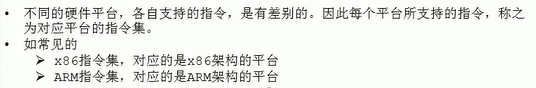

#### 汇编语言


#### 高级语言


#### C与C++源程序编译过程

编译过程又可以分成两个阶段：编译和汇编

* 编译阶段：是读取源程序（字符流），对之进行词法和语法分析，将高级语言指令转换为功能等效的汇编代码。
* 汇编阶段：实际上指把汇编语言代码翻译成目标机器指令的过程。


#### 字节码

* 字节码是一种中间状态（中间码）的二进制代码（文件），它比机器码更抽象，需要直译器转译后才能成为机器码
* 字节码主要为了实现特定软件运行和软件环境、与硬件环境无关
* 字节码的实现方式是通过编译器和虚拟机器。编译器将源码编译成字节码，特定平台上的虚拟机器将字节码转译为可以直接执行的指令。
  * 字节码的典型应用为Java bytecode


### 解释器

JVM设计者们的初衷仅仅是单纯为了满足Java程序实现跨平台特性，因此避免采用静态编译的方式直接去生成本地机器指令。从而诞生了实现解释器在运行时采用逐行解释字节码执行程序的想法。


 （如果是字节码直接汇编成机器指令，则需要设计一个可以在任何系统中运行的JVM。这个JVM要兼容将字节码解释成不同系统的机器指令，这导致JVM的工作量大。而设计字节码文件先编译成字节码指令，在经过适配不同系统的JVM解释成对应的机器指令，则就可以更灵活设计JVM）

**现状**


（JIT即时编译器也有存在缺点，所以JVM中才会同时存在解释器和编译器）


### JIT编译器

#### 编译器概念


（编译器比解释器执行速度快）

#### 编译器与解释器共存的原因


（编译器执行时间长、导致程序启动时间长、在一开始时解释器起到作用后面编译器起到作用、解释器作为编译器的逃生门）

#### 在Hotspot中对于编译器的使用

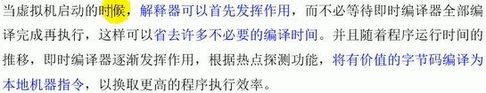

#### 对编译器性能的测试


例子：多次执行的代码，会被编译器定位成热点代码，将其编译为机器指令保存在内存中。

```java
package jvm.chapter12;

import java.util.ArrayList;

/**
 * @Author: zhuzhe
 * @ClassName: JITTest
 * @Date: 2023/1/10 21:47
 * @Description:
 * @Version: V1.0
 * @Param:
 */
public class JITTest {
    public static void main(String[] args) {
        ArrayList<String> list = new ArrayList<>();
        for (int i = 0; i < 1000; i++) {
            list.add("zhuzhe");
            try {
                Thread.sleep(1000);
            } catch (InterruptedException e) {
                e.printStackTrace();
            }
        }
    }
}
```

可以在Java visual VM


也可以在 Jconsole中查看


#### JIT编译器解释


#### 热点代码及探测方式


****


#### 方法调用计数器


（JIT代码缓存——元空间）

#### 热度衰减

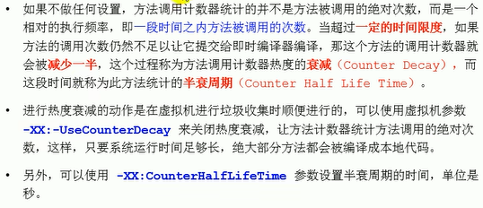

（动态的热度条）

#### 回边计数器

它的作用是统计一个方法中循环体代码执行的次数，在字节码中遇到控制流向后跳转的指令称为 "回边" （Back Edge）。显然，建立回边计数器统计的目的就是为了触发OSR编译。


#### Hotspot VM设置程序执行方式


（前面提到JVM默认是解释器和JIT编译器混合使用，也支持设置只使用解释器或编译器）

例子：查看当前虚拟机的模式


切换成纯解释器模式

```shell
-Xint
```


切换成纯编译器模式

```shell
-Xcomp
```


切换成混合模式

```shell
-Xmixed
```


例子2：测试不同模式下对一个Java程序的执行效率

```java
package jvm.chapter12;

/**
 * @Author: zhuzhe
 * @ClassName: IntCompTest
 * @Date: 2023/1/11 12:33
 * @Description: 测试在哪种编译器模式下，运行这个程序的速度最快（本机运行默认启动是Server环境）
 * @Version: V1.0
 * @Param: -Xint -Xcomp -Xmixed
 */
public class IntCompTest {
    public static void main(String[] args) {
        long start = System.currentTimeMillis();
        testPrimeNumber(1000000);
        long end = System.currentTimeMillis();
        System.out.println("花费的时间为："+(end-start));
    }

    /**
     * 求质数
     * @param count 次数
     */
    public static void testPrimeNumber(int count){
        for (int i = 0; i < count; i++) {
            //计算100以内的质数（除了1和自身外，不能被其他自然数整除）
            label:for (int j = 2; j <= 100 ; j++) {
                for (int k = 2; k <= Math.sqrt(j) ; k++) {
                    if (j%k==0){
                        continue label;
                    }
                }
            }
        }
    }
}
```

纯解释器模式


纯编译器模式


混合模式


（在开始的1000次时使用的是解释器，后面被定位为热点代码使用了编译器翻译成热点代码，后面就全从方法区读取内存中的机器指令直接执行）


#### Hotspot VM中JIT分类


（内置了两个编译器：客户端编译器，服务端编译器。都是C++编写的）

官网：https://docs.oracle.com/javase/8/docs/technotes/tools/unix/java.html

Server模式


Client模式


（目前所有主流的操作系统都是64位的，所以默认启动的是Server模式，因为server模式特点，所以启动慢）

#### C1和C2编译器模式优化策略


（server模式的优化 即是前面提到堆中逃逸分析优化处理）

#### 分层编译策略


（也就是说C1和C2两个编译器策略都有可能参与到当前的Java程序编译）

#### 总结


#### jdk10的改变


（Graal虚拟机）

#### AOT编译器

AOT是和JIT并列的编译器


（JIT是在程序运行过程中，发现热点代码，对这部分代码进行提前编译保存到内存中。AOT是在程序开始运行前，将文件编译【.so文件】）


（因为不同平台的机器指令不一样，这样就会导致产生了一些当前平台才能运行的文件）


## StringTable

### String的基本特性


（String已经实现得很完美，所以不需要子类。String实现了很多接口，天然支持跨进程传输。这也是在Javaweb中常用String来接受json数据的原因。也支持排序）

#### JDK9的改变

官方对改变String中存储结构的解释：https://openjdk.org/jeps/254


（就是为了提高数组中的空间利用率，也增加了一个flag用来判断是否目标字符集，是的话才回去启用优化去用一个字节存储，否则还是和以前一样用2个字节存储）

#### 对应的关联的其他对象改变


####  测试String的不可变性


例子：

```java
package jvm.chapter13;


import org.junit.Test;

/**
 * @Author: zhuzhe
 * @ClassName: StringTest1
 * @Date: 2023/1/12 12:09
 * @Description: 体现String的不可变性
 * @Version: V1.0
 * @Param:
 */
public class StringTest1 {

    //更改引用是在堆中方法区创建新的直接量
    //["abc","hello"]
    @Test
    public void test1(){
        String s1 = "abc";
        String s2 = "abc";
        s1 = "hello";

        System.out.println(s1 == s2);//判断地址是否相等
        System.out.println(s1);
        System.out.println(s2);
    }

    //String是数组创建时不可变。所以拼接操作实际是产生拼接后直接量
    //["abc","abcdef"]
    @Test
    public void test2(){
        String s1 = "abc";
        String s2 = "abc";
        s2+="def";
        System.out.println(s2);
        System.out.println(s1);
    }

    //replace方法不是直接对直接量的改变
    //["abc","mbc"]
    @Test
    public void test3(){
        String s1 = "abc";
        String s2 = s1.replace('a','m');
        System.out.println(s1);
        System.out.println(s2);
    }
}
```


例子2：

```java
package jvm.chapter13;

/**
 * @Author: zhuzhe
 * @ClassName: StringExer
 * @Date: 2023/1/12 12:39
 * @Description: 测试字符串的值传递
 * @Version: V1.0
 * @Param:
 */
public class StringExer {
    String str = new String("good");
    char[] ch = {'t','e','s','t'};

    public void change(String str, char ch[]){
        str = "test ok";
        ch[0] = 'b';
    }

    public static void main(String[] args) {
        StringExer ex = new StringExer();
        ex.change(ex.str,ex.ch);
        System.out.println(ex.str);
        System.out.println(ex.ch);
    }
}
```

方法中是str参数，是一个形参指向方法区中同一个String直接量。如果对形参改变内容，则是等同于给一个局部变量赋予一个新的String直接量。因为String的不可变性，所以str的修改不会影响到外部的传入参数。

数组是一个对象，方法中是对数组对象的操作，所以和实参都是同个地址的对象，被改变时两个变量读取到的都是同步的。

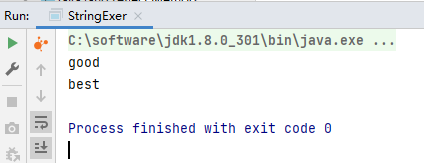

#### 总结


（Hashtable：哈希表=数组+链表）

例子：

```java
package jvm.chapter13;

/**
 * @Author: zhuzhe
 * @ClassName: StringTest2
 * @Date: 2023/1/12 17:11
 * @Description:
 * @Version: V1.0
 * @Param:
 */
public class StringTest2 {
    public static void main(String[] args) {
        //测试StringTables参数
        System.out.println("String Test 2 ...");
        try {
            Thread.sleep(10000000);
        } catch (InterruptedException e) {
            e.printStackTrace();
        }
    }
}
```


调试参数

```shell
-XX:StringTableSize=60013
```

#### 测试String的HashTable在不同容量下的性能

例子：

从文件中读取内容，并按行读取到的字符串检查是否在常量池中存在，不存在则在常量池中创建。

```java
package jvm.chapter13;

import java.io.BufferedReader;
import java.io.FileNotFoundException;
import java.io.FileReader;
import java.io.IOException;

/**
 * @Author: zhuzhe
 * @ClassName: StringTest2
 * @Date: 2023/1/12 17:11
 * @Description: 读取流中字符串并创建到字符串常量池中
 * @Version: V1.0
 * @Param:
 */
public class StringTest2 {
    public static void main(String[] args) {
        //测试StringTables参数
        System.out.println("String Test 2 ...");
        /*try {
            Thread.sleep(10000000);
        } catch (InterruptedException e) {
            e.printStackTrace();
        }*/

        BufferedReader br = null;

        try {
            br = new BufferedReader(new FileReader("word.txt"));
            long start = System.currentTimeMillis();
            String data;
            while ((data = br.readLine()) != null) {
                data.intern();//如果字符串常量池中没有这个字符串，则创建它（这个判断就是使用HashTable）
            }
            long end = System.currentTimeMillis();
            System.out.println("花费的时间为：" + (end - start));
        } catch (IOException e) {
            e.printStackTrace();
        } finally {
            if (br != null) {
                try {
                    br.close();
                } catch (IOException e) {
                    e.printStackTrace();
                }
            }
        }
    }
}
```

负责创建随机内容的文件

```java
package jvm.chapter13;

import java.io.FileWriter;
import java.io.IOException;

/**
 * @Author: zhuzhe
 * @ClassName: StringTest3
 * @Date: 2023/1/12 17:41
 * @Description: 生成随机字符串
 * @Version: V1.0
 * @Param:
 */
public class StringTest3 {
    public static void main(String[] args) {
        try {
            FileWriter fw = new FileWriter("word.txt");
            for (int i = 0; i < 100000; i++) {
                int length = (int) (Math.random() * (10 - 1 + 1) + 1);
                fw.write(getString(length) + "\n");
            }
            fw.close();
        } catch (IOException e) {
            e.printStackTrace();
        }
    }

    private static String getString(int length) {
        String str = "";
        for (int i = 0; i < length; i++) {
            int num = (int) (Math.random() * (90 - 65 + 1) + 65) + (int) (Math.random() * 2) * 32;
            str += (char)num;
        }
        return str;
    }
}
```

在默认的HashTable容量下


如果设定HashTable的大小，则可以看到由于哈希冲突导致HashTable表的效率降低。


### String的内存分配


#### StringTable为什么要调整内存位置

官网解释：https://www.oracle.com/technetwork/java/javase/jdk7-relnotes-418459.html#jdk7changes


(①permSize默认比较小 ②永久代垃圾回收频率低，容易会有性能问题)

例子：测试由于字符串常量池导致的内存溢出。

```java
package jvm.chapter13;

import java.util.HashSet;
import java.util.Set;

/**
 * @Author: zhuzhe
 * @ClassName: StringTest4
 * @Date: 2023/1/13 0:19
 * @Description: 不断创建String对象到堆内存中的set对象中，还有将直接量填入字符串常量池中
 * @Version: V1.0
 * @Param: jdk8： -XX:MetaspaceSize=6m -XX:MaxMetaspaceSize=6m -Xms6m -Xmx6m
 */
public class StringTest4 {
    public static void main(String[] args) {
        //使用set保持常量池的引用存在，避免full gc回收常量池
        Set<String> set = new HashSet<>();
        //在short可以取值的范围内足以让6MB的PermSize或heap产生OOM
        short i = 0;
        while (true){
            set.add(String.valueOf(i++).intern());
        }
    }
}
```

在jdk6中，因为字符串常量池是定义在永久代的，所以最终造成永久代的OOM


在jdk8中，因为字符串常量池是转移到了堆空间中，所以最终造成堆空间OOM


在后续更新时可能提示的是频繁的GC行为。


### String的基本操作

例子：输出字符串

```java
package jvm.chapter13;

/**
 * @Author: zhuzhe
 * @ClassName: StringTest5
 * @Date: 2023/1/13 16:52
 * @Description: 测试字符串常量池不会存储相同字符串规则
 * @Version: V1.0
 * @Param:
 */
public class StringTest5 {
    public static void main(String[] args) {
        System.out.println();
        System.out.println("1");
        System.out.println("2");
        System.out.println("3");
        System.out.println("4");
        System.out.println("5");
        System.out.println("6");
        System.out.println("7");
        System.out.println("8");
        System.out.println("9");
        System.out.println("10");

        System.out.println("1");
        System.out.println("2");
        System.out.println("3");
        System.out.println("4");
        System.out.println("5");
        System.out.println("6");
        System.out.println("7");
        System.out.println("8");
        System.out.println("9");
        System.out.println("10");
    }
}
```

这里使用idea的debug功能，将断点打在第一段输出代码的前面，还有第二段输出代码的前面。启动debug模式。


此时String类有2023个数量。双击即可查看2023个字符串常量池中的字符串直接量。

按下F7执行下一步。可以看到字符串的数量+1。说明在调用PrintStream的println()方法传入的实参是一个字符串直接量，会被加载到堆中的字符串常量池StringTable中。


如此执行到下一段字符串输出语句，可以看到一共加载了10个字符串直接量。


因为直接量是存储在常量池中，根据规则是不会存储相同的字符串。所以下面的一段字符串输出是直接加载使用常量池中已有的直接量，而不是再次创建到常量池中。


（Java语言规范里要求完全相同的字符串字面量，应该包含同样的Unicode字符序列（包含同一份码点序列的常量），并且必须是指向同一个String类实例）

官网：https://docs.oracle.com/javase/specs/jls/se8/html/jls-3.html#jls-3.10.5

例子：一个标准的Java程序案例，阐述字符串常量池的作用

```java
package jvm.chapter13;

/**
 * @Author: zhuzhe
 * @ClassName: StringTest6
 * @Date: 2023/1/13 17:10
 * @Description:
 * @Version: V1.0
 * @Param:
 */
public class StringTest6 {
    public static void main(String[] args) {
        int i = 1;
        Object obj = new Object();
        StringTest6 t = new StringTest6();
        t.foo(obj);
    }

    private void foo(Object param) {
        String str = param.toString();
        System.out.println(str);
    }
}
```


（上面代码在虚拟机内存中的展示。main方法中实例化当前对象，并调用foo方法。foo方法中调用Object的toString方法，会向常量池中存储当前Object对象的类型和内存地址）


### 字符串拼接操作


（字符串不同的使用方式，将使得在编译期间的处理不一样）

例子：各种字符串的处理场景

```java
package jvm.chapter13;

import org.junit.Test;

/**
 * @Author: zhuzhe
 * @ClassName: StringTest7
 * @Date: 2023/1/13 17:38
 * @Description:
 * @Version: V1.0
 * @Param:
 */
public class StringTest7 {

    //测试字符串直接量拼接：编译器优化
    @Test
    public void test1() {
        String s1 = "a" + "b" + "c";//等同于abc
        String s2 = "abc";
        System.out.println(s1 == s2);
        System.out.println(s1.equals(s2));
    }

    //测试使用字符串变量来拼接字符串
    @Test
    public void test2() {
        String s1 = "javaEE";
        String s2 = "hadoop";
        String s3 = "javaEEhadoop";
        String s4 = "javaEE" + "hadoop";//编译器优化
        //如果拼接符号的前后出现了变量，则相当于在堆空间中new String()，具体的内存为拼接后的结果
        String s5 = s1 + "hadoop";
        String s6 = "javaEE" + s2;
        String s7 = s1 + s2;

        System.out.println(s3 == s4);//true  : 编译器优化
        System.out.println(s3 == s5);//false : StringBuilder
        System.out.println(s3 == s6);//false :
        System.out.println(s3 == s7);//false :
        System.out.println(s5 == s6);//false :
        System.out.println(s5 == s7);//false :
        System.out.println(s6 == s7);//false :

        //intern()将s6对应的字符串和常量池中的做比较，如果没有就会在常量池中创建，如果有则返回字符串地址
        String s8 = s6.intern();
        System.out.println(s3 == s8);//true: 因为s6返回的就是s3的字符串地址
    }

    //讲解字符串变量拼接的虚拟机处理
    @Test
    public void test3() {
        String s1 = "a";
        String s2 = "b";
        String s3 = "ab";

        String s4 = s1 + s2;
        /*
            jdk5.0之前使用的是StringBuffer
            StringBuilder s = new StringBuilder();
            s.append("a");
            s.append("b");
            s.toString(); 约等于 new String("ab")
         */
        System.out.println(s3 == s4);//false
    }

    //定义为final的字符串变量用于拼接后的效果。针对于final修饰类、方法、基本数据类型、引用数据类型的时，能使用上final就使用上。
    @Test
    public void test4() {
        final String s1 = "a";
        final String s2 = "b";
        String s3 = "ab";
        //字符串拼接操作不一定使用的是StringBuilder
        //如果拼接符号左右两边都是字符串常量引用，则仍然使用编译器优化
        String s4 = s1 + s2;
        System.out.println(s3 == s4);//true
    }

    //测试字符串常量和直接量拼接后的效果
    @Test
    public void test5(){
        String s1 = "javaEEhadoop";
        String s2 = "javaEE";
        String s3 = s2 + "hadoop";
        System.out.println(s1 == s3);//false

        final String s4 = "javaEE";//常量可以被编译器优化
        String s5 = s4+"hadoop";
        System.out.println(s1 == s5);//true
    }

    //体会执行效率，使用传统字符串拼接的效率不如使用StringBuilder
    //使用StringBuidler自始至终都是只创建一个对象
    @Test
    public void test6(){
        long start = System.currentTimeMillis();
        //method1(100000);
        method2(100000);
        long end = System.currentTimeMillis();
        System.out.println("花费的时间为："+(end-start));
    }

    //循环字符串拼接（占用内存大，引发频繁GC）
    private void method1(int highLevel) {
        String src = "";
        for (int i = 0; i < highLevel; i++) {
            src = src + "a";//每次循环创建一个StringBuilder来append后toString
        }
    }

    //使用StringBuilder来实现循环字符串拼接
    private void method2(int highLevel) {
        StringBuilder src = new StringBuilder(highLevel);//直接指定容量，避免扩容发生来提升效率
        for (int i = 0; i < highLevel; i++) {
            src.append("a");
        }
    }
}
```


### intern()的使用

源码中有堆intern方法的注释。


####  如何保证变量s指向的是字符串常量池中的数据

* 使用字面量定义：String s = "zhuzhe";
* 使用intern方法：String s = new String("zhuzhe").intern();   String s = new StringBuilder("zhuzhe").toString().intern();

#### new String("ab")会创建几个对象

2个对象。从字节码中就可以知道。

```java
package jvm.chapter13;

/**
 * @Author: zhuzhe
 * @ClassName: StringNewTest
 * @Date: 2023/1/13 18:55
 * @Description:
 * @Version: V1.0
 * @Param:
 */
public class StringNewTest {
    public static void main(String[] args) {
        String str = new String("zhuzhe");
    }
}
```


#### new String("a") + new String("b")会创建几个对象

5个对象。String和StringBuilder

```java
package jvm.chapter13;

/**
 * @Author: zhuzhe
 * @ClassName: StringNewTest
 * @Date: 2023/1/13 18:55
 * @Description:
 * @Version: V1.0
 * @Param:
 */
public class StringNewTest {
    public static void main(String[] args) {
        String str = new String("zhu") + new String("zhe");
    }
}
```


如果深入看，StringBuilder的toString方法中，实际是通过new String(...)来实现返回字符串结果。


查看StringBuilder的toString方法的字节码


所以调用toString方法还会返回一个String对象。toString方法的调用不会使得在字符串常量池中创建ab直接量。


#### 面试题1

下面代码在jdk6和jdk7/8中的指向结果不一样。

```java
package jvm.chapter13;

/**
 * @Author: zhuzhe
 * @ClassName: StringIntern
 * @Date: 2023/1/13 23:30
 * @Description:
 * @Version: V1.0
 * @Param:
 */
public class StringIntern {
    public static void main(String[] args) {
        String s = new String("1");
        s.intern();
        String s2 = "1";
        //jdk6: false  jdk7/8: false
        System.out.println(s == s2);

        String s3 = new String("1") + new String("1");
        s3.intern();
        String s4 = "11";
        //jdk6: false  jdk7/8: true
        System.out.println(s3 == s4);
    }
}
```

jdk6的内存


jdk8的内存


第一个全都是false的解释

```
第一个：
s是创建了2个对象，一个堆空间的String对象，一个方法区的直接量。
s2定义时是直接引用方法区的直接量。
s == s2是拿对象地址比较直接量
第二个：
s3是两个变量相加，所以最终使用StringBuilder来拼接两个字符串并返回一个String对象。这个过程不会将拼接后的字符串添加到常量池中。
s3.intern();这个方法将s3的字符串内存作为直接量添加到常量池中。（
	jdk6：如果常量池中存在，则不会添加，如果不存在则添加。
	jdk7：如果常量池中存在，则不会添加，如果不存在则添加。并且为了节省空间，会生成一个指向s3字符串对象的地址的直接量，像是以s3字符串对象中的值为标准的设计。
）
s4在定义过程中就使用了常量池中的直接量，而直接量对应s3的内存地址。
s3 == s4是String对象地址比较由直接量链接的地址
```

按照那一个s3的intern规则。可以先定义s4再去调用s3的intern。则此时发现常量池中已经存在该直接量，就不会执行插入操作。

```java
package jvm.chapter13;

/**
 * @Author: zhuzhe
 * @ClassName: StringIntern2
 * @Date: 2023/1/13 23:30
 * @Description:
 * @Version: V1.0
 * @Param:
 */
public class StringIntern2 {
    public static void main(String[] args) {
        String s3 = new String("1") + new String("1");
        String s4 = "11";
        s3.intern();
        System.out.println(s3 == s4);
    }
}
```


#### 面试题2

例子：

```java
package jvm.chapter13;

/**
 * @Author: zhuzhe
 * @ClassName: StringIntern3
 * @Date: 2023/1/13 23:30
 * @Description:
 * @Version: V1.0
 * @Param:
 */
public class StringIntern3 {
    public static void main(String[] args) {
        String s = new String("a") + new String("b");
        //jdk6：在常量池中创建一个字符串"ab"
        //jdk8：没有在常量池中创建字符串"ab"，而是创建一个引用，指向new String("ab")
        String s2 = s.intern();
        System.out.println(s2 == "ab");//jdk6：true jdk7：true
        System.out.println(s == "ab");//jdk6：false jdk7：true 直接量引用对象地址
    }
}
```


#### 面试题3

```java
package jvm.chapter13;

/**
 * @Author: zhuzhe
 * @ClassName: StringIntern3
 * @Date: 2023/1/13 23:30
 * @Description:
 * @Version: V1.0
 * @Param:
 */
public class StringIntern4 {
    public static void main(String[] args) {
        String s1 = new String("ab");
        s1.intern();
        String s2 = "ab";
        System.out.println(s1 == s2);
    }
}
```


（这里的对象地址比较直接量）


#### intern()的效率测试：空间角度

```java
package jvm.chapter13;

/**
 * @Author: zhuzhe
 * @ClassName: StringIntern3
 * @Date: 2023/1/13 23:30
 * @Description: 往一个字符数组中填入数字字符串
 * @Version: V1.0
 * @Param:
 */
public class StringIntern5 {
    static final int MAX_COUNT = 1000 * 10000;
    static final String[] arr = new String[MAX_COUNT];

    public static void main(String[] args) {
        Integer[] data = new Integer[]{1,2,3,4,5,6,7,8,9,10};

        long start = System.currentTimeMillis();
        for (int i = 0; i < MAX_COUNT; i++) {
            arr[i] = new String(String.valueOf(data[i % data.length]));
            //arr[i] = new String(String.valueOf(data[i % data.length])).intern();
        }
        long end = System.currentTimeMillis();
        System.out.println("花费时间为："+(end-start));

        try {
            Thread.sleep(1000000);
        } catch (InterruptedException e) {
            e.printStackTrace();
        }
        System.gc();
    }
}
```


```java
package jvm.chapter13;

/**
 * @Author: zhuzhe
 * @ClassName: StringIntern3
 * @Date: 2023/1/13 23:30
 * @Description: 往一个字符数组中填入数字字符串
 * @Version: V1.0
 * @Param:
 */
public class StringIntern5 {
    static final int MAX_COUNT = 1000 * 10000;
    static final String[] arr = new String[MAX_COUNT];

    public static void main(String[] args) {
        Integer[] data = new Integer[]{1,2,3,4,5,6,7,8,9,10};

        long start = System.currentTimeMillis();
        for (int i = 0; i < MAX_COUNT; i++) {
            //arr[i] = new String(String.valueOf(data[i % data.length]));
            arr[i] = new String(String.valueOf(data[i % data.length])).intern();
        }
        long end = System.currentTimeMillis();
        System.out.println("花费时间为："+(end-start));

        try {
            Thread.sleep(1000000);
        } catch (InterruptedException e) {
            e.printStackTrace();
        }
        System.gc();
    }
}
```


（减少了String的创建）

结论：对于程序中大量存在的字符串，尤其存在很多重复字符串时，使用intern()可以节省内存空间。

大的网站平台，需要内存中存储大量的字符串。比如社交网络，很多人都存储：北京市、海定区等信息。这时候如果字符串都调用intern()方法，就会明显降低内存的大小。

### StringTable的垃圾回收

使用新的JVM参数来显示出常量池中的数量。

```java
package jvm.chapter13;

/**
 * @Author: zhuzhe
 * @ClassName: StringGCTest
 * @Date: 2023/1/15 17:18
 * @Description: 往StringTable中存入100个直接量
 * @Version: V1.0
 * @Param: -Xms15m -Xmx15m -XX:+PrintStringTableStatistics -XX:+PrintGCDetails
 */
public class StringGCTest {
    public static void main(String[] args) {
        for (int i = 0; i < 100; i++) {
            String.valueOf(i).intern();
        }
    }
}
```

在普通情况下的字符串常量池数量


测试程序往字符串常量池存入100个直接量。


（可以通过这个命令来直接查看字符串常量池的信息）

如果是添加10w的直接量，则效果可能不一样。因为字符串常量池是存在堆空间的，所以在设定堆空间 15m的情况下，大量创建的直接量将导致堆空间内存不足，触发GC。


并没有出现想象中的101772。因为这个值已经导致jvm进行了垃圾回收。

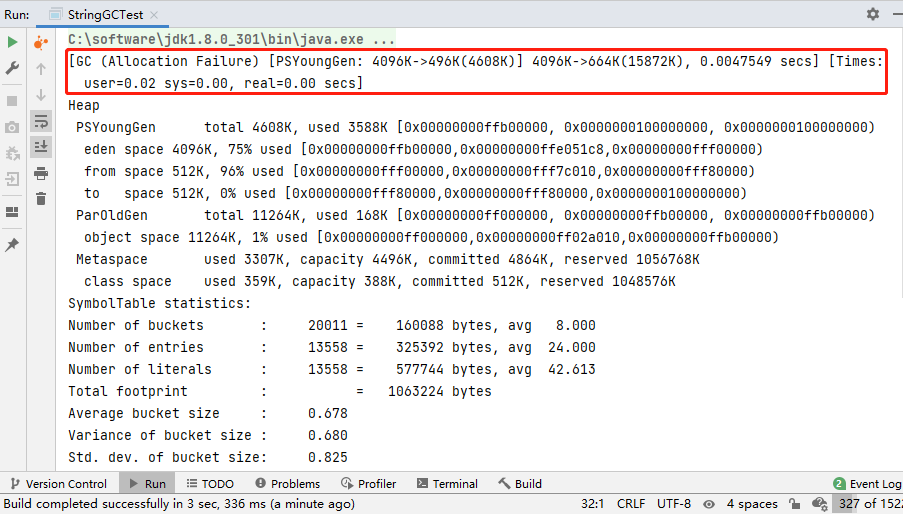

（触发了一次新生代垃圾回收）


### G1中的String去重操作

官网：https://openjdk.org/jeps/192


（在遵循String字符串不可变的情况下，假设创建两个字符串对象，创建的值一样时将其引用向对空间的同一个对象。但在其中一个变量发生对象值改变操作时，不会导致另外一个变量所引用的对象值发生改变）


（重复的String对象对堆空间的优化产生了阻碍，G1为此做了一个处理）

**G1垃圾回收器对String去重处理实现**


（去重线程、哈希表、归纳回收）


## 垃圾回收概述

要想对系统进行优化，一方面是上层代码的优化，另外一方面就是对程序性能的优化。了解程序性能优化的前提是了解性能监控，了解性能监控的前提是了解内存的分配与回收策略。要想了解内存分配与回收的策略的前提是需要懂内存的结构。内存结构在了解之前还需要了解类的加载器。类的加载器将字节码文件解析到内存中，再由执行引擎解释成机器码。


（前面的代码学习了jvm的上层和中层（内存的结构），接下来讲**内存的分配与回收**）

### 什么是垃圾


#### 大厂面试题

* 你知道哪几种垃圾回收器，各自的优缺点，重点讲一下cms和g1
* JVM GC算法有哪些，目前的jdk版本采用什么回收算法
* G1回收器讲下回收过程、GC是什么、为什么要有GC
* GC的两种判定方法、CMS收集器与G1收集器的特点
* 说一下GC算法，分代回收说一下
* 垃圾收集策略和算法
* JVM GC原理，JVM怎么回收内存
* CMS特点，垃圾回收算法有哪些，各自的优缺点，它们的共同缺点是什么
* Java的垃圾回收器有哪些，说下G1的应用场景，平时你是如何搭配使用垃圾回收器的
* 你知道哪几种垃圾收集器，各自的优缺点。重点讲下CMS和G1，包括原理，流程，优缺点。
* 垃圾回收算法的实现原理
* 讲一讲垃圾回收算法
* 什么情况下触发垃圾回收
* 如何选择合适的垃圾收集算法
* JVM有哪三种垃圾回收器
* 常见的垃圾回收期算法有哪些，各有什么优劣
* System.gc()和Runtime.gc()会做什么事情
* Java GC机制 GC Root有哪些
* Java对象的回收方式，回收算法
* CMS和G1了解么，CMS解决什么问题，说一下回收的过程
* CMS回收停顿了几次，为什么要停顿两次

#### 垃圾的定义


### 为什么需要GC


### 早期垃圾回收


#### 有了垃圾回收机制之后


### Java垃圾回收机制

* 自动内存管理，无需开发人员手动参与内存的分配与回收，这样降低内存泄露和内存溢出的风险

* 没有垃圾回收器，Java和python也会和cpp一样，各种悬垂指针，野指针，泄露问题

* 自动内存管理机制，将程序员从繁重的内存管理中释放出来，可以更专心地专注于业务开发

* Oracle官网关于垃圾回收的介绍

  https://docs.oracle.com/javase/8/docs/technotes/guides/vm/gctuning/toc.html

#### 过度依赖垃圾回收的问题


#### 内存溢出与内存泄露

> 内存溢出

指程序在申请内存时，没有足够的内存空间供给使用，出现了out of memory。比如申请一个Integer对象，但是给这个对象存储了Long长度的数，导致内部的数组空间不足，就是内存溢出。

> 内存泄露

内存泄露指的是程序在申请内存后，无法释放已经申请的内存空间，一次内存泄露危害可以忽略，但内存泄露堆积后果很严重，无论多少内存，迟早会被占光。

1. **常发性内存泄漏**。发生内存泄漏的代码会被多次执行到，每次被执行的时候都会导致一块内存泄漏。 

2. **偶发性内存泄漏**。发生内存泄漏的代码只有在某些特定环境或操作过程下才会发生。常发性和偶发性是相对的。对于特定的环境，偶发性的也许就变成了常发性的。所以测试环境和测试方法对检测内存泄漏至关重要。 

3. **一次性内存泄漏**。发生内存泄漏的代码只会被执行一次，或者由于算法上的缺陷，导致总会有一块仅且一块内存发生泄漏。比如，在类的构造函数中分配内存，在析构函数中却没有释放该内存，所以内存泄漏只会发生一次。 

4. **隐式内存泄漏**。程序在运行过程中不停的分配内存，但是直到结束的时候才释放内存。严格的说这里并没有发生内存泄漏，因为最终程序释放了所有申请的内存。但是对于一个服务器程序，需要运行几天，几周甚至几个月，不及时释放内存也可能导致最终耗尽系统的所有内存。所以，我们称这类内存泄漏为隐式内存泄漏。 

#### 总结

* 垃圾回收器可以对年轻代回收，也可以对老年代回收，甚至对全堆和方法区的回收
* 其中，Java堆是垃圾收集器的工作重点
* 从次数上讲
  * 频繁收集Young区
  * 较少收集Old
  * 基本不动Perm区


## 垃圾回收相关算法


（垃圾：是在堆内存中没有被引用的对象）

### 标记阶段：引用计数器算法

和年龄计数器类似的一个计数器，记录当前对象的被引用情况。


#### 循环引用

2个以上对象存在相互之间的关联引用，导致引用计数器算法判定为存活。这类对象在某些特殊场景下会大量产生，实际一对相互引用但又没有外部引用的对象，在堆内存中是无存在意义的。应该被清除，这也是引用计数算法的缺陷。


例子：jdk8环境中对于循环引用对象的处理。

```java
package jvm.chapter15;

/**
 * @Author: zhuzhe
 * @ClassName: RefCountGC
 * @Date: 2023/1/16 17:02
 * @Description: 测试循环引用对象在遇到垃圾回收时的处理
 * @Version: V1.0
 * @Param: -XX:+PrintGCDetails
 */
public class RefCountGC {
    private byte[] bigSize = new byte[5 * 1024 * 1024];//这个是为了模拟一个大对象
    Object reference = null;

    public static void main(String[] args) {
        RefCountGC obj1 = new RefCountGC();
        RefCountGC obj2 = new RefCountGC();

        obj1.reference = obj2;
        obj2.reference = obj1;

        obj1 = null;
        obj2 = null;
        //显式执行垃圾回收
        //这里发生GC，obj1和obj2会被进行回收
        System.gc();
    }
}
```

因为jdk8的JVM使用的不是引用计数器算法，所以这类循环引用对象仍然可以被回收。


#### 结论


（接入对象引用关系中，对循环引用片段并解除。弱引用使得部分循环引用对象将会被垃圾回收。）


### 标记阶段：可达性分析算法

根搜索算法、追踪性算法。


#### GC Roots的概念


（使用可达性分析算法后，对象存在循环引用并不重要，而是和GC Root断开后的循环引用对象，这类对象就会直接判定为可被回收。）

#### 哪些可以称为GC Roots


（面试中至少回答出前四个：虚拟机栈、JNI、静态属性、常量引用、同步锁、虚拟机内部引用、虚拟机内部情况相关类）


（:red_circle:GC Roots不可达对象 :large_blue_circle:GC Roots可达对象 **红色对象将被回收**）


（临时GC Roots对象、分析范围包括跨区引用（增加对关联区域的扫描范围）、回收时要STW的原因）


### 对象的finalization机制

JVM提供了一个接入垃圾回收的函数。finalization()


是在Object中提供的一个方法。

https://www.matools.com/api/java8


是可以被重写的方法。


#### finalize方法的使用限制


（由于引入finalization方法而使用的一套对象复活机制（一个复活币））

#### finalize方法对垃圾回收的作用


（没有引用链的对象拥有一次调用finalize方法来争取复活机会，只有一次。这里使用队列的原因是为了避免绑定垃圾回收线程比如有人在finalization方法中使用了会阻塞的操作，则不能因为这个用户操作来直接影响到原先虚拟机的垃圾回收进程。）

Finalize线程：使用Java Visual VM可以直接查看一个Java程序中的所有线程信息，finalization方法对应的就是Finalizer线程。


例子：测试一个对象被finalize方法救活一次

```java
package jvm.chapter15;

/**
 * @Author: zhuzhe
 * @ClassName: CanReliveObj
 * @Date: 2023/1/16 18:04
 * @Description: 测试finalize
 * @Version: V1.0
 * @Param:
 */
public class CanReliveObj {
    public static CanReliveObj obj;//静态对象变量 成为GCRoot的条件之一

    @Override
    protected void finalize() throws Throwable {
        super.finalize();
        System.out.println("调用当前类重写的finalize()方法");
        obj = this;
    }

    public static void main(String[] args) {
        try {
            obj = new CanReliveObj();

            //引用置空，将对象变为无引用，并启动垃圾回收
            System.out.println("第1次GC");
            obj = null;
            System.gc();

            //因为Finalize线程优先级较低，这里等等下
            Thread.sleep(2000);

            if (obj==null){
                System.out.println("对象在第1次GC时被回收");
                return;
            }else {
                System.out.println("对象经历第1次GC后存活");
            }

            //引用置空，将对象变为无引用，并启动垃圾回收
            System.out.println("第2次GC");
            obj = null;
            System.gc();

            //因为Finalize线程优先级较低，这里等等下
            Thread.sleep(2000);

            if (obj==null){
                System.out.println("对象在第2次GC时被回收");
            }else {
                System.out.println("对象经历第2次GC后存活");
            }
        } catch (Exception e) {
            e.printStackTrace();
        }
    }
}
```

先屏蔽不重写finalize方法，可以看到对象在失去与GC Roots（静态对象变量）的引用后，直接回收。


放开前面重写的finalize方法，并在方法中重新赋予GC Roots（静态对象变量）的引用。则会存活过当前这一次的垃圾回收。但在下一次回收时如果没有GC Roots的引用，将直接被回收。


### MAT与JProfiler的GC Root溯源

怎么知道跑起来一个Java程序中有什么GC Roots？有多少个？通过工具就可以来直观查看。

#### MAT

是Memory Analyzer的简称，是一款功能强大的Java堆内存分析器。用于查找内存泄露以及查看内存消耗情况的工具。MAT是基于Eclipse开发的，是一款免费的性能分析工具。

官网：http://www.eclipse.org/mat/下载并使用MAT

下载：https://www.eclipse.org/mat/downloads.php

下载之后的包：[MemoryAnalyzer-1.13.0.20220615-win32.win32.x86_64.zip](./JVM学习.assets/MemoryAnalyzer-1.13.0.20220615-win32.win32.x86_64.zip)

测试例子：使用局部变量表来方便查看GC Roots

```java
package jvm.chapter15;

import java.util.ArrayList;
import java.util.Date;
import java.util.List;
import java.util.Scanner;

/**
 * @Author: zhuzhe
 * @ClassName: GCRootsTest
 * @Date: 2023/1/17 13:55
 * @Description: 测试检查GC Root的软件MAT
 * @Version: V1.0
 * @Param:
 */
public class GCRootsTest {
    public static void main(String[] args) {
        List<Object> numList = new ArrayList<>();
        Date birth = new Date();

        for (int i = 0; i < 100; i++) {
            numList.add(String.valueOf(i));
            try {
                Thread.sleep(10);
            } catch (InterruptedException e) {
                e.printStackTrace();
            }
        }

        //这里是用来阻塞查看GC Root
        System.out.println("数据添加完毕，请操作：");
        new Scanner(System.in).next();
        numList = null;
        birth = null;

        System.out.println("numList、birth已置空，请操作：");
        new Scanner(System.in).next();
        System.out.println("结束");
    }
}
```

先运行程序，然后使用jmap来导出dump文件（内存记录）。

```shell
jmap -dump:format=b,live,file=xxx路径\xx文件 进程号
```


也可以使用Java Visual VM来导出


选择堆dump来导出堆日志文件。


生成一个快照，右键另存为到桌面。


这个MAT使用需要两个快照文件，一个是在程序启动后加载一个字符串列表的快照，一个是将局部变量都置空后的快照。主要是用来定位问题的位置。

上面JVisualVM已经导出来一个程序运行中的快照。

再导出来一个局部变量置空后的快照。


打开MAT工具。（解压后即可打开）


**这里注意，最新版的MAT只指出JDK11以上环境**。这里可以在官网中找其他版本来试试：jdk8使用1.11.0

https://www.eclipse.org/mat/previousReleases.php


点击上面的选项查看GC Roots的信息


这里就可以直观看到GC Roots的类型和信息。


这一个GC Roots信息和前面JVM理论提及的信息不一致的原因，在MAT中有对应说明。这里将虚拟机栈等其他的变量都列在一个类型中。是根据MAT的官方规范。

https://help.eclipse.org/latest/index.jsp?topic=%2Forg.eclipse.mat.ui.help%2Fconcepts%2Fgcroots.html

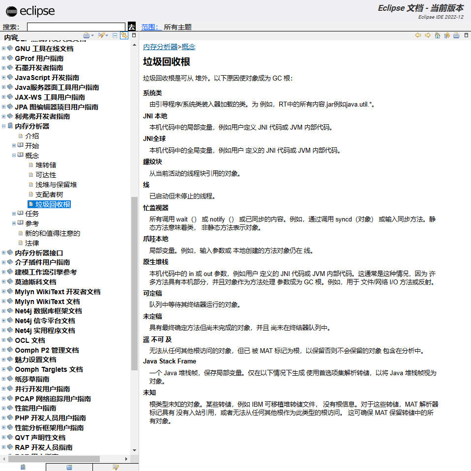

前面我们在MAT中看到了作为GC Roots的几种类型。在线程类型下找到主线程，就可以看到主线程中有哪些被作为GC Roots。（这一个就是虚拟机栈，局部变量表的内容，这些都是属于GC Roots的范围。）


这三个参数也就是对应我们编写的程序中的这几个


这就是MAT的作用。接下来我们打开另外一个快照，就是在置空局部变量后的快照。

* 按照上面一样的步骤去找到主线程中的GC Roots。结果发现没有ArrayList和Date了。

  ```
  在将引用置空之后，ArrayList和Date这两个对象就是堆中没有被引用的对象，那么就会被标记为垃圾并回收掉。
  ```

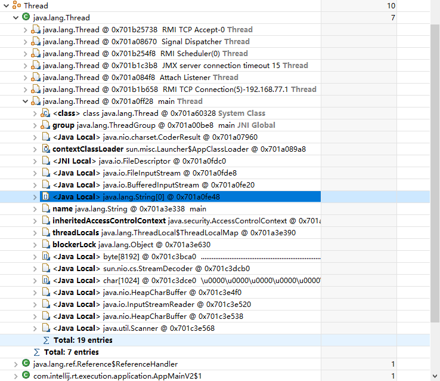

可以看到，虽然展示出了全部的GC Roots，但是一个普通的程序就有1千多个GC Roots，在实际开发中大程序的GC Roots数量更是数不胜数。

* 所以在实际开发中，要缩小查找范围，根据要查找的引用变量，来追查这个变量的GC Roots树。

自底向上追溯到GC Roots的最初位置。（这种方式算法比较贴合实际遇到问题的场景：比如你发现有个对象泄露，一直占用内存，为了排查原因可以使用这种方式来找到完整的引用链。这样可以用作对象关系分析或是手动断开引用关系。）


### 清除阶段：标记-清除算法


（标记-清除、标记-复制、标记-整理）

**背景**

标记-清除算法（Mark-Sweep）是一种非常基础和常见的垃圾收集算法，该算法被J.McCarthy等人在1960年提出并应用于Lisp语言。

**执行过程**


**执行原理图**


（标记存活对象，然后将除此之外的对象进行清除、对象标记存储在对象头）

**缺点以及注意**


在介绍运行时数据区时，说明了[空闲列表](####对象的实例化)


### 清除阶段：标记-复制算法

**背景**


**核心思想**


（这种也就是前面常常提到，并优化过的半区复制算法。）

**执行原理图**


（将存活对象复制到另外的空闲半区，并在这个过程利用句柄来实现对象到新空间后的引用地址更新。复制成功后情况原来的半区，作为下一次回收的转移区域。）

**缺点以及注意**


（适用于新生代的算法，存储空间变小，效率较高）


### 清除阶段：标记-整理算法

**背景**


（适用于老年代的算法，并且要避免标记-清除算法存在的缺陷。）

**执行过程**


（三个算法中标记都是一样的，使用可达性分析算法）

* 第一阶段和标记-清除算法一样，从根节点开发标记所有被引用对象。
* 第二阶段将所有的存活对象压缩到内存的一端，按顺序排放。
* 之后，清理边界外所有的空间

**缺点以及注意**


（这种算法避免了内存空间碎片过多，避免半区复制导致的内存空间减半，同时这里还涉及到了内存的再分配地址和调整。对应的就提到前面的对象分配空间方式——[指针碰撞](####对象的实例化)）


### 小结

三种算法的比较


效率上来说，复制算法是最高的，但是同时浪费的内存也是太多。


### 分代收集算法

就前面提到的三种算法，是目前在使用的。没有存在一种最优的算法，只有最合适的算法。分代收集算法是在前面的三种算法基础上，结合JVM中存在的内存分代理念，提出来的一种算法。


（有的对象朝生夕死，适合使用标记-复制算法。老年代的对象基本不变，就使用标记-清除和标记-整理算法的混合）


**新生代和老年代的算法使用**


**CMS+Serial Old组合垃圾回收器**


### 增量收集算法

**为了解决现有算法存在的问题**


（解决STW在某些场景造成严重影响的问题。但只是在收集上做的妥协，如果垃圾生成的速度大于垃圾回收速度，则还是会积满，进行Full GC（整堆收集））


### 分区算法


（这是部分垃圾回收器（G1）的设计，而带来的收集优化）


因为有很多个小空间，所以本质上是提升了垃圾回收的频率，但是降低了一次垃圾回收需要STW的时间。

这些都是基本的算法思路，在实际GC过程中。虚拟机实现的过程要复杂得多，目前还在发展中的前沿GC都是复合算法，并且并行和并发的兼并的。


## 垃圾回收相关概念

### System.gc()的理解


例子：手动触发GC，根据前面的finalize机制，将会调用finalize()方法

```java
package jvm.chapter16;

/**
 * @Author: zhuzhe
 * @ClassName: SystemGCTest
 * @Date: 2023/1/31 23:18
 * @Description:
 * @Version: V1.0
 * @Param:
 */
public class SystemGCTest {
    public static void main(String[] args) {
        new SystemGCTest();
        System.gc();//提醒JVM的垃圾回收期执行GC行为

        //System.runFinalization();
    }

    @Override
    protected void finalize() throws Throwable {
        super.finalize();
        System.out.println("SystemGCTest 重写了finalize()");
    }
}
```


这种只是提醒JVM去执行垃圾回收，但不一定就会去执行。不能马上执行，则主程序执行结束，也就来不及执行finalize()中的方法。


例子2：

```java
package jvm.chapter16;

/**
 * @Author: zhuzhe
 * @ClassName: LocalVarGC
 * @Date: 2023/1/31 23:30
 * @Description: 测试变量在GC过程
 * @Version: V1.0
 * @Param: -XX:+PrintGCDetails
 */
public class LocalVarGC {
    public void localVarGC1(){
        byte[] buffer = new byte[10 * 1024 * 1024];
        System.gc();
    }

    public void localVarGC2(){
        byte[] buffer = new byte[10 * 1024 * 1024];
        buffer = null;
        System.gc();
    }

    public void localVarGC3(){
        {
            byte[] buffer = new byte[10 * 1024 * 1024];
        }
        System.gc();
    }

    public void localVarGC4(){
        {
            byte[] buffer = new byte[10 * 1024 * 1024];
        }
        int value = 10;
        System.gc();
    }

    public void localVarGC5(){
        localVarGC1();
        System.gc();
    }

    public static void main(String[] args){
        LocalVarGC local = new LocalVarGC();
        local.localVarGC1();
    }
}
```

localVarGC1:


localVarGC2:


localVarGC3:

新生代没有直接回收掉buffer，而是在FullGC中直接晋升到老年代。在Java Class Lib中可以直接看到有2个局部变量槽，但是只有一个局部变量（因为局部变量槽slot具有复用性，在出了实例代码块作用域后，原本的buffer对象就会被移除，this这个局部变量就处于第一的位置）


localVarGC4:试验前面的实例代码块中对象超出作用域，移除后下面定义的变量的排列


localVarGC5:

在调用方法1的gc后，buffer没有被回收而是晋升老年代。在方法5执行中Full GC将老年代中，超过方法调用域的buffer进行了回收（出了栈帧，失去了栈帧的引用（GC Roots））。


### 内存溢出与内存泄漏

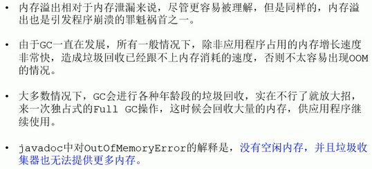

（前面垃圾回收那里已经有过解释[内存溢出与内存泄露](####内存溢出与内存泄露)）

#### 内存溢出Out Of Memory（空间不够）


#### 内存泄露Memory Leak（不使用但没回收）


因为这一个引用的存在，所以导致后面一大坨对象都是未被回收掉。

1. ThreadLocal

   > 使用ThreadLocal时，每个线程只要处于存活状态就可保留对其ThreadLocal变量副本的隐式调用，且将保留其自己的副本。使用不当，就会引起内存泄露。
   >
   > 一旦线程不在存在，ThreadLocals就应该被垃圾收集，而现在线程的创建都是使用线程池，线程池有线程重用的功能，因此线程就不会被垃圾回收器回收。所以使用到ThreadLocals来保留线程池中线程的变量副本时，ThreadLocals没有显示的删除时，就会一直保留在内存中，不会被垃圾回收。

   ```
   不再使用ThreadLocal时，调用remove()方法，该方法删除了此变量的当前线程值。
   不要使用ThreadLocal.set(null)，它只是查找与当前线程关联的Map并将键值对设置为当前线程为null。
   ```

2. static字段

   > 大量使用static字段会潜在的导致内存泄露，在Java中，静态字段通常拥有与整个应用程序相匹配的生命周期。
   >
   >  示例：单例的静态特性使得其生命周期和应用的生命周期一样长，如果一个对象已经不再需要使用了，而单例对象还持有该对象的引用，就会使得该对象不能被正常回收，从而导致了内存泄漏。

   ```
   最大限度的减少静态变量的使用；
   单例模式时，依赖于延迟加载对象而不是立即加载方式。
   ```

3. 未关闭的资源

   >  对于使用了File，Cursor，Stream，Bitmap，Socket等资源，应该及时关闭或者注销，否则这些资源将不会被回收，从而造成内存泄漏。

   ```
   调用它的close()函数将其关闭掉，然后再设置为null
   ```

4. 集合容器

   > 我们通常把一些对象的引用加入到了集合容器（比如ArrayList）中，如果在不需要该对象时，没有把对象的引用从集合中清理掉，这样这个集合就会越来越大。
   >
   >  如果这个List是临时的，那没问题，List被回收后里边的对象引用也就不会被持有了（对象不可达），对象引用也会被回收。如果这个List不是临时的，那么就会导致内存占用越来越大。
   >
   > 如果这个集合是static的话，那情况就更严重了。如果这些容器为静态的，那么它们的生命周期与程序一致，则容器中的对象在程序结束之前将不能被释放，从而造成内存泄漏。简单而言，长生命周期的对象持有短生命周期对象的引用，尽管短生命周期的对象不再使用，但是因为长生命周期对象持有它的引用而导致不能被回收。

   ```
   如果是static类型的集合，在退出程序之前，将集合里的东西clear，然后置为null，再退出程序
   ```

5. 改变哈希值

   > 当一个对象被存储进HashSet集合中以后，就不能修改这个对象中的那些参与计算哈希值的字段了，否则，对象修改后的哈希值与最初存储进HashSet集合中时的哈希值就不同了。在这种情况下，即使在contains方法使用该对象的当前引用作为的参数去HashSet集合中检索对象，也将返回找不到对象的结果，这也会导致无法从HashSet集合中单独删除当前对象，造成内存泄露

   ```
   不要修改这个对象中的那些参与计算哈希值的字段
   ```

6. 内部类持有外部类

   >  若一个外部类的实例对象的方法返回了一个内部类的实例对象，这个内部类对象被长期引用了，即使那个外部类实例对象不再被使用，但由于内部类持有外部类的实例对象，这个外部类对象将不会被垃圾回收，这也会造成内存泄露。
   >
   > 在Java中，非静态内部类和匿名类内部类都会潜在持有它们所属的外部类的引用，但是静态内部类却不会。

   ```
   如果内部类不需要访问外部类成员，考虑转换为静态内部类。
   ```

7. finalize()方法

   > 重写finalize()方法时，该类的对象不会立即被垃圾收集器收集，如果finalize()方法的代码有问题，那么会潜在的引发OOM；

   ```
   尽量避免重写finalize()；或者保证finalize方法没问题
   ```

8. 常量字符串

   > 如果我们读取一个很大的String对象，并调用了intern()，那么它将放到字符串池中，位于PermGen中，只要应用程序运行，该字符串就会保留，这就会占用内存，可能造成OOM。

   ```
   增加PermGen(Metaspace)的大小，-XX:MaxPermSize=512m；
   升级Java版本，JDK1.7后字符串池转移到了堆中。
   ```


### Stop The World


（停止用户线程的行为）


例子：记录当JVM发生垃圾回收时的停顿时间。

```java
package jvm.chapter16;

import java.util.ArrayList;
import java.util.List;

/**
 * @Author: zhuzhe
 * @ClassName: StopTheWorldDemo
 * @Date: 2023/2/1 17:01
 * @Description:
 * @Version: V1.0
 * @Param:
 */
public class StopTheWorldDemo {

    //创建大对象，然后触发垃圾回收掉，这个过程会在GC Roots枚举时STW
    public static class WorkThread extends Thread{
        List<byte[]> list = new ArrayList<>();

        @Override
        public void run() {
            try {
                while (true){
                    for (int i = 0; i<1000; i++){
                        byte[] buffer = new byte[1024];
                        list.add(buffer);
                    }
                    if (list.size()>10000){
                        list.clear();
                        System.gc();
                    }
                }
            } catch (Exception e) {
                e.printStackTrace();
            }
        }
    }

    //打点计时器，让这个线程来记录当前虚拟机的运行状态
    public static class PrintThread extends Thread{
        public static long startTime = System.currentTimeMillis();

        @Override
        public void run() {
            try {
                while (true){
                    //每秒打印时间信息
                    long t = System.currentTimeMillis() - startTime;
                    System.out.println(t/1000 + "." + t%1000);
                    Thread.sleep(1000);
                }
            } catch (Exception e) {
                e.printStackTrace();
            }
        }
    }

    public static void main(String[] args) {
        WorkThread workThread = new WorkThread();
        PrintThread printThread = new PrintThread();

        // workThread.start();
        printThread.start();
    }
}
```

先检查下计时器效果，基本是1秒输出一行


在同时启动两个程序后，观察计时器是否有过一段时间的停顿。


可以看到打点计时器的间隔变大，说明这个过程中另外一个线程的gc，有进行了STW。


### 垃圾回收的并行与并发

#### 程序中的并行与并发

并发


（同一个时间段，当前处理器处理多个处于运行中的程序。如果放在一个时刻上看，当前处理器是只处理一个程序，体现CPU在一个时间段的快速切换）

并行


（同一个时刻，多个处理器处理多个程序同时进行。）

并行与并发的区别


#### JVM中的并行与并发

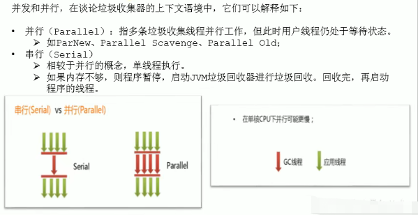

（并行指的是多条垃圾回收线程并行执行）


（并发指的是用户线程和垃圾回收线程并发执行，在一个时间段处理器快速切换两条线程）


### 安全点与安全区域

#### 安全点Safe Point


 （并不是可以随意找个位置进行停顿，开始GC。而是设定了安全点停顿，安全点设定都是程序中需要执行较长时间的操作的位置。在这个位置进行停顿，对程序的影响小。）


（全局信号）

#### 安全区域Safe Region


（安全区域是为了解决无法响应JVM中断请求的线程，如果线程在安全区域则算做停顿）


### 再谈引用


（垃圾回收器并不是想象中对一个图状对象关联关系，用可达性分析去直接处理，图的边（对象的关联关系）带有权值，不同的对象关系影响其在内存空间中的存活时间）


概述几种引用：


* 强引用：new关键字，最常见
* 软引用：内存不足时回收
* 弱引用：一垃圾收集就回收
* 虚引用：用来对象回收跟踪

#### 强引用Strong Reference


例子：

```java
package jvm.chapter16;

/**
 * @Author: zhuzhe
 * @ClassName: StrongReferenceTest
 * @Date: 2023/2/2 16:59
 * @Description: 对象强引用关系测试
 * @Version: V1.0
 * @Param:
 */
public class StrongReferenceTest {
    public static void main(String[] args) {
        StringBuffer b1 = new StringBuffer("Hello,尚硅谷");
        StringBuffer b2 = b1;

        //b1 = null;
        System.gc();//这一个强引用对象不会被回收
        try {
            Thread.sleep(3000);
        } catch (InterruptedException e) {
            e.printStackTrace();
        }
    }
}
```


#### 软引用Soft Reference


（内存溢出和软引用没有关系、MyBatis、内存足够时不会回收软引用可达对象，当内存不够时才会回收。）

在jdk1.2版之后提供了java.lang.ref.SoftReference类来实现软引用。

```java
Object obj = new Object();//声明强引用
SoftReference<Object> sf = new SoftReference<Object>(obj);
obj = null;//销毁强引用
```

例子：

```java
package jvm.chapter16;

import java.lang.ref.SoftReference;

/**
 * @Author: zhuzhe
 * @ClassName: SoftReference
 * @Date: 2023/2/2 17:14
 * @Description:
 * @Version: V1.0
 * @Param:
 */
public class SoftReferenceTest {
    public static class User{
        public int id;
        public String name;

        public User(int id, String name){
            this.id = id;
            this.name = name;
        }

        @Override
        public String toString() {
            return "User{" +
                    "id=" + id +
                    ", name='" + name + '\'' +
                    '}';
        }
    }

    public static void main(String[] args) {
        //创建对象，建立软引用
//        SoftReference<User> userSoftRef = new SoftReference<>(new User(1, "zhuzhe"));
        //上面的代码等价于
        User user = new User(1, "zhuzhe");
        SoftReference<User> userSoftRef = new SoftReference<>(user);
        user = null;//取消强引用

        //从软引用中重新获得强引用对象
        System.out.println(userSoftRef.get());
        /*System.gc();
        System.out.println("After GC");

        //垃圾回收之后获得软引用中的对象
        System.out.println(userSoftRef.get());
        try {
            //创建大对象，让系统资源紧张，看是否会触发gc回收掉软引用
            byte[] b = new byte[7* 1024 * 1024];
        } catch (Exception e) {
            e.printStackTrace();
        }finally {
            //再次从软引用中获取数据
            System.out.println(userSoftRef.get());
        }*/
    }
}
```

通过软引用封装的方法，在未发生垃圾回收的情况下，软引用对象是可以获取到。


把下面的gc代码解开，在进行gc时，如果空间充裕，则不会回收软引用。


前面讲运行时数据区讲到堆中有新生代和老年代，而使用参数-Xmx和-Xms是设置堆的大小，这影响了新生代和老年代的分配。[年轻代与老年代](####年轻代与老年代)。默认新生代和老年代的比例是1:2。所以是3M新生代，7M老年代。

下面代码创建一个7M的大对象，这会直接导致OOM，触发OOM后会执行垃圾回收。异常被捕获后就会执行finally获取软引用的代码，此时的软引用已经被回收掉了。


 同样，当内存不够的时候，也是会回收掉软引用的对象。这里我们先用指令来输出堆空间中老年代的大小，应该是7M使用了部分空间。


这里我们将剩余的老年空间完全用来存储大对象，因为大对象一开始就分配不进年轻代，会直接到老年代。


此时可以可以发现，在gc回收时，因为堆空间不足会把软引用对象一并清理。


#### 弱引用Weak Reference


比软引用还弱，一旦gc发生就会被回收。

代码：

```java
Object obj = new Object();//声明强引用
WeakReference<Object> wr = new WeakReference<Object>();
obj = null;//销毁强引用
```

弱引用对象与软引用对象最大的不同就在于，当GC在进行回收时，需要通过算法检查是否回收软引用对象，而对于弱引用对象，GC总是进行回收。弱引用对象更容易、更快被GC回收。

**面试题：在开发中使用过弱引用WeakHashMap吗？**

WeakReference和WeakHashMap有关系。

WeakHashMap内部维护一个Entry，这个Entry就是继承WeakReference。


所以这类API会在垃圾回收时进行清理。


**WeakReference测试**

例子：

```java
package jvm.chapter16;

import java.lang.ref.SoftReference;
import java.lang.ref.WeakReference;

/**
 * @Author: zhuzhe
 * @ClassName: WeakReference
 * @Date: 2023/2/2 17:14
 * @Description:
 * @Version: V1.0
 * @Param:
 */
public class WeakReferenceTest {
    public static class User{
        public int id;
        public String name;

        public User(int id, String name){
            this.id = id;
            this.name = name;
        }

        @Override
        public String toString() {
            return "User{" +
                    "id=" + id +
                    ", name='" + name + '\'' +
                    '}';
        }
    }

    public static void main(String[] args) {
        //构造弱引用
        WeakReference<User> userWeakRef = new WeakReference<>(new User(1, "zhuzhe"));
        //从弱引用中重新获取对象
        System.out.println(userWeakRef.get());

        System.gc();
        //只要有GC，弱引用就会直接被回收
        System.out.println("After GC");
        System.out.println(userWeakRef.get());
    }
}
```


#### 虚引用Phantom Reference


（最弱引用，对象的回收跟踪）

代码：

```java
Object obj = new Object();
ReferenceQueue phantomQueue = new ReferenceQueue();
PhantomReference<Object> pf = new PhantomReference<Object>(obj,phantomQueue);
obj = null;
```


（将回收的消息，通过队列方式向外传播）

例子：

```java
package jvm.chapter16;

import java.lang.ref.PhantomReference;
import java.lang.ref.ReferenceQueue;

/**
 * @Author: zhuzhe
 * @ClassName: PhantomReferenceTest
 * @Date: 2023/2/4 17:22
 * @Description:
 * @Version: V1.0
 * @Param:
 */
public class PhantomReferenceTest {
    public static PhantomReferenceTest obj;//当前类声明对象(GC Roots)
    static ReferenceQueue<PhantomReferenceTest> phantomQueue = null;//引用队列

    public static class CheckRefQueue extends Thread{

        @Override
        public void run() {
            while (true){
                if (phantomQueue !=null){
                    PhantomReference<PhantomReferenceTest> objt = null;
                    try {
                        objt = (PhantomReference<PhantomReferenceTest>) phantomQueue.remove();
                    } catch (InterruptedException e) {
                        e.printStackTrace();
                    }
                    if (objt!=null){
                        System.out.println("追踪垃圾回收过程：PhantomReference实例被GC了");
                    }
                }
            }
        }
    }

    @Override
    protected void finalize() throws Throwable {
        super.finalize();
        System.out.println("调用当前类的finalize()方法");
        obj = this;//复活一次
    }

    public static void main(String[] args) {
        /*Thread t = new CheckRefQueue();
        t.setDaemon(true);//设置为守护线程，当程序中没有非守护线程时，守护线程也就执行结束
        t.start();*/

        phantomQueue = new ReferenceQueue<>();//创建队列
        obj = new PhantomReferenceTest();//创建当前对象

        //构造虚引用，指定对象和队列
        PhantomReference<PhantomReferenceTest> phantomRef = new PhantomReference<>(obj, phantomQueue);

        try {
            //虚引用中的对象是获取不到的（因为虚引用的定义就是监测）
            System.out.println(phantomRef.get());

            /*System.out.println("第一次gc...");
            obj = null;//将强引用去除
            System.gc();
            Thread.sleep(1000);
            if (obj == null){
                System.out.println("obj 是 null");
            }else {
                System.out.println("obj 未被回收");
            }

            System.out.println("第二次gc...");
            obj = null;//将强引用去除
            System.gc();
            Thread.sleep(1000);
            if (obj == null){
                System.out.println("obj 是 null");
            }else {
                System.out.println("obj 未被回收");
            }*/

        } catch (Exception e) {
            e.printStackTrace();
        }

    }
}
```

一开始执行时，在对象关联到虚引用中后，是无法获取的。


我们让虚引用经历一次GC，通过另外的线程来监测到这一个虚引用的对象被回收掉的消息。消息就存储在队列中，所以我们建立一个线程来轮询这个队列。


#### 终结器引用Final Reference

使用情况很少。


## 垃圾回收器


> Java不同版本的新特性：语法、API、底层优化


### GC分类与性能指标

#### 垃圾收集器分类

**垃圾收集器分类**


（指的是垃圾回收线程的执行方式）


（性能较低的机器适合串行，多核处理器适合并行）


（指的是垃圾回收线程和用户线程的执行方式）

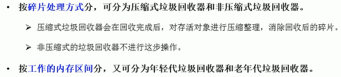

（标记-压缩算法：在完成回收后，是否整理内存空间。压缩式回收再分配对象空间时使用**指针碰撞**，非压缩式回收再分配对象空间时使用**空闲列表**）


#### 评估GC的性能指标


 （吞吐量和垃圾收集是互补）


（类似算法优化中的时间复杂度和空间复杂度的取舍。这里是吞吐量、暂停时间、内存占用）

#### 吞吐量throughput


**注重吞吐量和注重低延迟的收集器在停顿时间上的比较**


高吞吐量收集器表现在用户代码时间占比较多，但执行过程遇到垃圾收集停顿时间较长。

低延迟收集器表现在每次遇到垃圾收集停顿时间较短，但总用户代码时间较少。

#### 吞吐量VS暂停时间


### 不同的垃圾回收器概述

**面试题：Java常见的垃圾收集器有哪些？**


经典垃圾回收器：

* 串行回收器：Serial、Serial Old
* 并行回收器：ParNew、Parallel Scavenge、Parallel Old
* 并发回收器：CMS、G1


https://www.oracle.com/technetwork/java/javase/tech/memorymanagement-whitepaper-1-150020.pdf


**7款经典收集器与垃圾分代之间的关系**


**垃圾收集器的组合关系**


jdk9: G1

jdk8: Parallel Scavenge + Parallel Old


（就像算法中的排序算法，并不存在一个适用全部场景。因为场景不同，所以产生了不同的垃圾收集器）


**查看默认垃圾回收器**

```shell
# 查看命令行相关参数（包含适用的垃圾收集器）
-XX:+PrintCommandLineFlags 
# 使用命令行指令
jinfo -flag 相关垃圾回收器参数 进程ID 
```

例子：命令行参数

```java
package jvm.chapter16;

import java.util.ArrayList;

/**
 * @Author: zhuzhe
 * @ClassName: GCUseTest
 * @Date: 2023/2/4 22:11
 * @Description:
 * @Version: V1.0
 * @Param: -XX:+PrintCommandLineFlags
 */
public class GCUseTest {
    public static void main(String[] args) {
        ArrayList<byte[]> list = new ArrayList<>();

        while (true){
            byte[] arr = new byte[100];
            list.add(arr);
            try {
                Thread.sleep(10);
            } catch (InterruptedException e) {
                e.printStackTrace();
            }
        }
    }
}
```

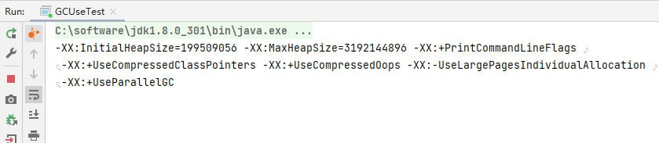


例子：命令行指令

针对任意一个正在运行的程序，使用该指令即可查看。


### Serial回收器：串行回收


（新生代和老年代都是单线程）

**优势**


例子：在代码中使用串行垃圾回收器

````shell
-XX:+UseSerialGC
````


### ParNew回收器：并行回收


（新生代是多线程，还是会有暂停，但是暂停时间变短。老年代是单线程。）


**ParNew的的效率**


**参数配置**


```shell
# 使用垃圾回收器
-XX:+UseParNewGC
# 设置线程数
-XX:ParallelGCThreads
```


这个收集器不建议使用，将在未来版本（jdk9）中移除。


### Parallel回收器：吞吐量优先


（Parallel覆盖了新生代和老年代）


（新生代和老年代都是多线程并行）


**优点**


**参数配置**


```shell
-XX:+UseParallelGC
-XX:+UseParallelOldGC
-XX:ParallelGCThreads
```

（只设置新生代，但老年代会自动配置，互相激活）


```shell
# 想要垃圾停顿时间短，那就是GC的垃圾量小，但这样GC的频率会增高
-XX:MaxGCPauseMillis
# 吞吐量的补数
-XX:GCTimeRatio 
```


```shell
# 这个就是前面提到的新生代8:1:1变为6:2:2
-XX:+UseAdaptiveSizePolicy
```

这个参数默认是开启的：


### CMS回收器：低延迟


（第一款并发收集器，用户线程和回收线程同时进行）


收集过程有多个步骤，以保证能和用户线程并发。


**CMS的优点**


（有阈值设置，但需要注意在这个过程中要避免用户线程垃圾生产速度小于垃圾回收速度。如果因此导致问题，则会启用Serial Old来补救）


**CMS使用标记清除会产生垃圾碎片，那为什么不使用标记压缩算法**


（使用标记压缩要移动对象内存地址，而这个过程并发的用户线程可能就在使用这个对象。）

  

**优点和弊端**


**参数**


```shell
-XX:+UseCMSCompactAtFullCollection
-XX:CMSFullGCsBeforeCompaction
-XX:ParallelCMSThreads
-XX:+UseConcMarkSweepGC
-XX:CMSInitiatingOccupanyFraction
```

例子：使用CMS收集器


如果直接指定老年代是CMS收集器的话，新生代就会默认指定ParNew收集器。

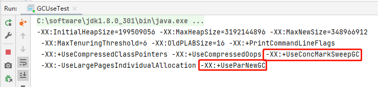


**总结**


### 小结


### G1回收器：区域化分代式

**既然前面已经有了几个GC，为什么还要发布G1？**

 

**起名Garbage First（G1）的原因**


```shell
-XX:+UseG1GC
```

**特点及优势**


（从两个Region间看是标记-复制算法，从整个堆空间看是标记-压缩算法）


**缺点**


**参数**


```shell
-XX:+UseG1GC
-XX:G1HeapRegionSize
-XX:MaxGCPauseMillis
-XX:ParallelGCThread
-XX:ConcGCThreads
-XX:InitiatingHeapOccupancyPercent
```


**使用场景**


#### region


**要设置Humongous区域的原因**


​    

（[指针碰撞](####对象的实例化)和[TLAB](####堆对象分配内存：TLAB)）


#### 回收过程

 


#### 记忆集


一个对象可能被其他区域的对象所引用。


（如果是为了找到一个Region中的对象是否被其他Region所引用，不用去直接扫描整个堆，而是借助了记忆集）


（使用写屏障来判断这个引用对象是否在其他Region中，不一样Region则通过卡表来将引用信息写到引用指向所在Region的记忆集）

（GC时就会参照记忆集来附加扫描Region）

#### GC过程一：年轻代GC

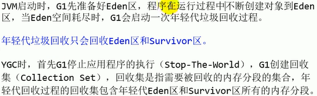


**年轻代GC的过程**


```
dirty card queue: 对于应用程序的引用赋值语句Object.field=object，JVM会在之前和之后执行特殊的操作以在dirty card queue中入队一个保存了对象引用信息的card，在年轻代回收的时候，G1会对dirty card queue中所有的card进行处理。以更新RSet，保证RSet实时准确的反映引用关系。

* 那为什么不在引用赋值语句处理直接跟新RSet呢？
：这是为了性能的需要，RSet的处理需要线程同步，开销会很大，使用队列性能会好很多。
```


#### GC过程二：并发标记过程


#### GC过程三：混合回收


#### GC过程四：可能出现的Full GC


#### 补充


#### 优化建议


### 垃圾回收器总结


**GC的发展阶段**

Serial -> Parallel（并行） -> CMS（并发） -> G1 -> ZGC


**垃圾回收器组合**


**怎么选择垃圾回收器**


**面试题**

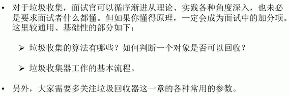


### GC日志分析

使用前面提到的参数，可以打印系统中堆内存的分代信息。还有GC的信息。

例子：

```java
package jvm.chapter16;

import java.util.ArrayList;

/**
 * @Author: zhuzhe
 * @ClassName: GCLogTest
 * @Date: 2023/2/5 21:11
 * @Description:
 * @Version: V1.0
 * @Param: -Xmx60m -Xms60m -XX:+PrintGCDetails
 */
public class GCLogTest {
    public static void main(String[] args) {
        ArrayList<byte[]> list = new ArrayList<>();

        for (int i = 0; i < 500; i++) {
            byte[] arr = new byte[1024 * 100];
            list.add(arr);
        }
    }
}
```


#### 内存分配与垃圾回收参数列表

```shell
# 输出GC日志。类似：-verbose:gc
-XX:+PrintGC
# 输出GC的详细日志
-XX:+PrintGCDetails
# 输出GC的时间戳（以基准时间的形式）
-XX:+PrintGCTimeStamps
# 输出GC的时间戳（以日期的形式，如2013-05-04T21:53:59.234+0800）
-XX:+PrintGCDateStamps
# 在进行GC的前后打印出堆的信息
-XX:+PrintHeapAtGC
# 日志文件的输出路径
-Xloggc:../logs/gc.log
```


#### 打开GC日志


例子：-Xmx60m -Xms60m -XX:+PrintGC

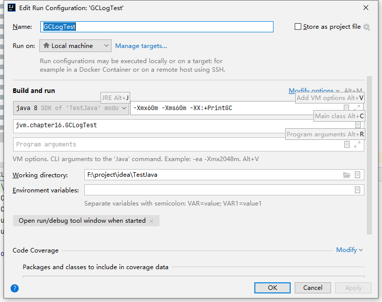


例子：-Xmx60m -Xms60m -XX:+PrintGC -XX:+PrintGCDetails

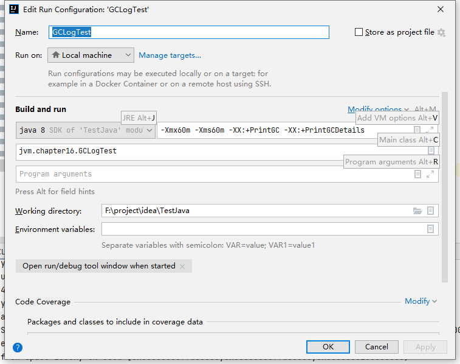


例子：-Xmx60m -Xms60m -XX:+PrintGC -XX:+PrintGCDetails -XX:+PrintGCTimeStamps


例子：-Xmx60m -Xms60m -XX:+PrintGC -XX:+PrintGCDetails -XX:+PrintGCTimeStamps -XX:+PrintGCDateStamps


#### 详情日志信息的说明


#### Minor GC日志


#### Full GC日志


#### 例子：堆空间日志分析

```java
package jvm.chapter16;

/**
 * @Author: zhuzhe
 * @ClassName: GCLogTest1
 * @Date: 2023/2/5 22:24
 * @Description:
 * @Version: V1.0
 * @Param: -Xms20M -Xmx20M -Xmn10M -XX:+PrintGCDetails -XX:SurvivorRatio=8 -XX:+UseSerialGC
 */
public class GCLogTest1 {
    private static final int _1MB = 1024 * 1024;

    public static void testAllocation(){
        byte[] allocation1, allocation2, allocation3, allocation4;
        allocation1 = new byte[2 * _1MB];
        allocation2 = new byte[2 * _1MB];
        allocation3 = new byte[2 * _1MB];
        allocation4 = new byte[4 * _1MB];
    }

    public static void main(String[] args) {
        testAllocation();
    }
}
```


设置的参数后的JVM内存布局


```
[GC (Allocation Failure) [DefNew: 7981K->640K(9216K), 0.0053447 secs] 7981K->6785K(19456K), 0.0053944 secs] [Times: user=0.00 sys=0.00, real=0.01 secs] 
Heap
 def new generation   total 9216K, used 4819K [0x00000000fec00000, 0x00000000ff600000, 0x00000000ff600000)
  eden space 8192K,  51% used [0x00000000fec00000, 0x00000000ff014930, 0x00000000ff400000)
  from space 1024K,  62% used [0x00000000ff500000, 0x00000000ff5a03e0, 0x00000000ff600000)
  to   space 1024K,   0% used [0x00000000ff400000, 0x00000000ff400000, 0x00000000ff500000)
 tenured generation   total 10240K, used 6144K [0x00000000ff600000, 0x0000000100000000, 0x0000000100000000)
   the space 10240K,  60% used [0x00000000ff600000, 0x00000000ffc00030, 0x00000000ffc00200, 0x0000000100000000)
 Metaspace       used 3305K, capacity 4496K, committed 4864K, reserved 1056768K
  class space    used 359K, capacity 388K, committed 512K, reserved 1048576K
```

total 9216K 表示可用新生代空间大小 = Eden8192K + 空闲Survivor1024K 总新生代可用空间是10M

eden space 8192K,  51% used 表示Eden空间被使用了大概4M的容量，实际就是对应**allocation4**

from space 1024K,  62% used 表示使用了0.5M

tenured generation   total 10240K, used 6144K 表示使用了6M的容量（6144/1024=6），对应**allocation1、allocation2、allocation3**


通过上面的信息可以看到，执行字节码指令时，逐步在堆空间Eden进行分配，当分配**allocation1、allocation2、allocation3**后，Eden空间剩余8-6=2。不够分配**allocation4**的空间，此时会触发新生代回收，将这三个对象晋升到老年代中，然后分配**allocation4**


#### 日志分析工具

使用指令将日志导出到当前目录下log文件夹下gc.log文件

```shell
-Xloggc:./logs/gc.log
```

新建文件和路径。


执行后会将GC日志输出到文件中。


这些日志可以使用日志分析工具，来辅助查看。


这里使用GCViewer和GCEasy

GCViewer官网：https://github.com/chewiebug/GCViewer

下载：https://github.com/chewiebug/GCViewer.git


下载完成后双击打开：


导入log文件


这个空白处原本是显示一个GC线图，如果日志多的话应该是显示如下。


GCEasy官网：https://gceasy.io/


### 垃圾回收器的新发展


#### jdk11新特性


http://openjdk.java.net/jeps/318

（Epsilon和ZGC）


#### jdk12的Shenandoah GC


#### ZGC

官网：https://docs.oracle.com/en/java/javase/12/gctuning/


**相比经典垃圾回收器的效率**


（灰色是吞吐量，黑色是低延迟）


（停顿时间）


#### AliGC


当然，其他厂商也提供了各种独具一格的GC实现，例如比较有名的低延迟GC，Zing(https://www.infoq.com/articles/azul_gc_in_detail)。


# JVM中篇


## Class文件结构

### 概述

#### 字节码文件的跨平台性


https://docs.oracle.com/javase/specs/index.html


#### Java的前端编译器

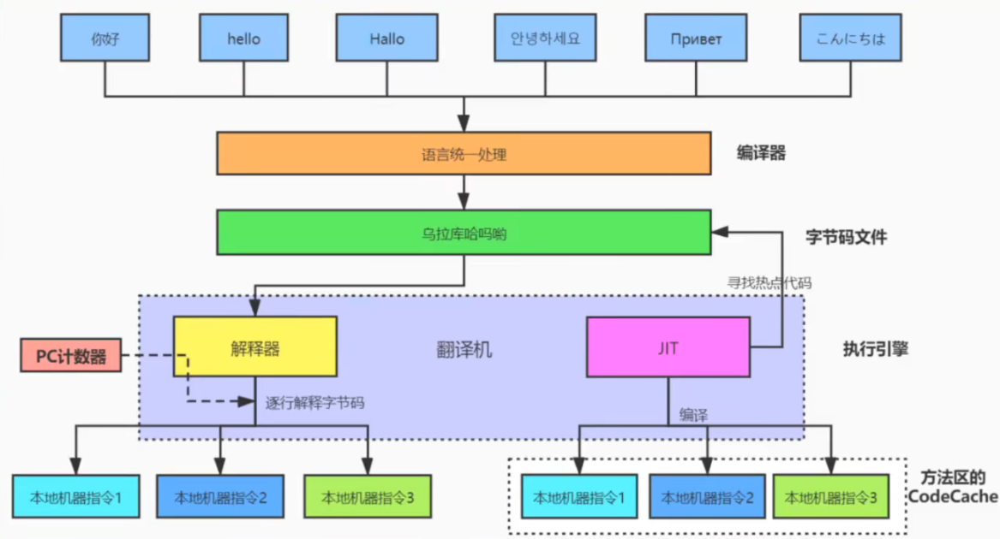


#### 透过字节码指令看代码细节

* 类文件结构有几个部分
* 知道字节码吗？字节码都有哪些？Integer x = 5; int y = 5; x==y; 都经过哪些步骤？

练习一：包装类

```java
package jvm.chapter18;

/**
 * @Author: zhuzhe
 * @ClassName: IntegerTest
 * @Date: 2023/2/6 16:57
 * @Description:
 * @Version: V1.0
 * @Param:
 */
public class IntegerTest {
    public static void main(String[] args) {
        Integer x = 5;
        int y = 5;
        System.out.println(x == y);

        Integer i1 = 10;
        Integer i2 = 10;
        System.out.println(i1 == i2);

        Integer i3 = 128;
        Integer i4 = 128;
        System.out.println(i3 == i4);
    }
}
```

运行结果：


字节码解析：


```
 0 iconst_5--------------------------------------------------------------得到常量5，放到操作数栈栈顶(因为这个5在-1到5，所以使用iconst)
 1 invokestatic #2 <java/lang/Integer.valueOf : (I)Ljava/lang/Integer;>--调用Integer.valueOf方法，入参是操作数栈顶元素5，返回一个Integer对象再压回操作数栈栈顶
 4 astore_1--------------------------------------------------------------将操作数栈顶元素(Integer对象5)，保存在局部变量表索引为1的位置
 5 iconst_5--------------------------------------------------------------得到常量5，放到操作数栈栈顶
 6 istore_2--------------------------------------------------------------将操作数栈顶元素5，保存在局部变量表索引为2的位置
 7 getstatic #3 <java/lang/System.out : Ljava/io/PrintStream;>-----------获取静态变量System.out（PrintStream对象）压入操作数栈栈顶
10 aload_1---------------------------------------------------------------加载局部变量表索引为1的内容(Integer对象5)到操作数栈栈顶
11 invokevirtual #4 <java/lang/Integer.intValue : ()I>-------------------调用Integer.intValue方法，入参是操作数栈顶元素(Integer对象5)，返回一个int基本数据类型，再重新压回栈顶
14 iload_2---------------------------------------------------------------加载局部变量表2的内容（基本类型5），压入操作数栈栈顶
15 if_icmpne 22 (+7)-----------------------------------------------------比较栈顶两int类型数值大小,当前者不等于后者时跳转22行，如果相等则继续执行
18 iconst_1--------------------------------------------------------------往操作数栈中存放1，表示true
19 goto 23 (+4)----------------------------------------------------------跳转到23
22 iconst_0--------------------------------------------------------------往操作数栈中存放0，表示false
23 invokevirtual #5 <java/io/PrintStream.println : (Z)V>-----------------调用PrintStream.println方法，入参是操作数栈顶元素

26 bipush 10-------------------------------------------------------------将一个byte的数字10压入到操作数栈中(因为这个10在负的128和正的127之间，所以使用bipush)
28 invokestatic #2 <java/lang/Integer.valueOf : (I)Ljava/lang/Integer;>--调用Integer.valueOf方法，入参是操作数栈顶元素10，返回一个Integer对象入操作数栈。
31 astore_3--------------------------------------------------------------将操作数栈顶元素(Integer对象10)，保存在局部变量表索引为3的位置
32 bipush 10-------------------------------------------------------------将一个byte的数字10压入到操作数栈中,因为这个10在负的128和正的127之间
34 invokestatic #2 <java/lang/Integer.valueOf : (I)Ljava/lang/Integer;>--调用Integer.valueOf方法，入参是操作数栈顶元素10，返回一个Integer对象入操作数栈。
37 astore 4--------------------------------------------------------------将操作数栈顶元素(Integer对象10)，保存在局部变量表索引为4的位置
39 getstatic #3 <java/lang/System.out : Ljava/io/PrintStream;>-----------获取静态变量System.out（PrintStream对象）压入操作数栈栈顶
42 aload_3---------------------------------------------------------------加载局部变量表3的内容（Integer对象10），压入操作数栈栈顶
43 aload 4---------------------------------------------------------------加载局部变量表4的内容（Integer对象10），压入操作数栈栈顶
45 if_acmpne 52 (+7)-----------------------------------------------------比较栈顶两个引用类型，直接比较两个引用的地址,当前者不等于后者时跳转52行，如果相等则继续执行
48 iconst_1--------------------------------------------------------------往操作数栈中存放1，表示true
49 goto 53 (+4)----------------------------------------------------------跳转到53
52 iconst_0--------------------------------------------------------------往操作数栈中存放0，表示false
53 invokevirtual #5 <java/io/PrintStream.println : (Z)V>-----------------调用PrintStream.println方法，入参是操作数栈顶元素

56 sipush 128------------------------------------------------------------将常量数字128压入到操作数栈中(因为这个128超过了127，所以使用sipush)
59 invokestatic #2 <java/lang/Integer.valueOf : (I)Ljava/lang/Integer;>--调用Integer.valueOf方法，入参是操作数栈顶元素128，返回一个Integer对象入操作数栈。
62 astore 5--------------------------------------------------------------将操作数栈顶元素(Integer对象128)，保存在局部变量表索引为5的位置
64 sipush 128------------------------------------------------------------将常量数字128压入到操作数栈中(因为这个128超过了127，所以使用sipush)
67 invokestatic #2 <java/lang/Integer.valueOf : (I)Ljava/lang/Integer;>--调用Integer.valueOf方法，入参是操作数栈顶元素128，返回一个Integer对象入操作数栈。
70 astore 6--------------------------------------------------------------将操作数栈顶元素(Integer对象128)，保存在局部变量表索引为6的位置
72 getstatic #3 <java/lang/System.out : Ljava/io/PrintStream;>-----------获取静态变量System.out（PrintStream对象）压入操作数栈栈顶
75 aload 5---------------------------------------------------------------加载局部变量表5的内容（Integer对象128），压入操作数栈栈顶
77 aload 6---------------------------------------------------------------加载局部变量表6的内容（Integer对象128），压入操作数栈栈顶
79 if_acmpne 86 (+7)-----------------------------------------------------比较栈顶两个引用类型，直接比较两个引用的地址,当前者不等于后者时跳转86行，如果相等则继续执行
82 iconst_1--------------------------------------------------------------往操作数栈中存放1，表示true
83 goto 87 (+4)----------------------------------------------------------跳转到87
86 iconst_0--------------------------------------------------------------往操作数栈中存放0，表示false
87 invokevirtual #5 <java/io/PrintStream.println : (Z)V>-----------------调用PrintStream.println方法，入参是操作数栈顶元素
90 return----------------------------------------------------------------从当前方法返回void

```

这里第一个为True有两个知识点：

Integer x = 5;
int y = 5;
System.out.println(x == y);

* 自动装箱和拆箱。
* Integer.valueOf的缓存机制

第二个为True是涉及到valueOf的缓存机制，两个对象都来自同个缓存数组的元素。

第三个为False是涉及到valueOf的缓存外机制，因为超过了127，所以重新new了Integer对象。


练习二：字符串

```java
package jvm.chapter18;

/**
 * @Author: zhuzhe
 * @ClassName: StringTest
 * @Date: 2023/2/6 16:58
 * @Description:
 * @Version: V1.0
 * @Param:
 */
public class StringTest {
    public static void main(String[] args) {
        String str = new String("hello") + new String("world");
        String str1 = "helloworld";
        System.out.println(str == str1);
    }
}
```

字节码解析：


```java
 0 new #2 <java/lang/StringBuilder>-------------------------------------------------------------------创建一个StringBuilder对象
 3 dup------------------------------------------------------------------------------------------------将前面创建的StringBuilder对象复制一份(一份用于给构造器里面的this，一份是给引用变量)
 4 invokespecial #3 <java/lang/StringBuilder.<init> : ()V>--------------------------------------------调用StringBuilder的初始化方法(完成对象的完整创建)
 7 new #4 <java/lang/String>--------------------------------------------------------------------------创建一个String对象
10 dup------------------------------------------------------------------------------------------------将前面创建的String对象复制一份
11 ldc #5 <hello>-------------------------------------------------------------------------------------将一个常量加载到操作数栈中(就是前面创建的String常量)
13 invokespecial #6 <java/lang/String.<init> : (Ljava/lang/String;)V>---------------------------------调用String的初始化方法
16 invokevirtual #7 <java/lang/StringBuilder.append : (Ljava/lang/String;)Ljava/lang/StringBuilder;>--调用StringBuilder的append方法添加前面创建好的String对象(hello)
19 new #4 <java/lang/String>--------------------------------------------------------------------------创建一个String对象
22 dup------------------------------------------------------------------------------------------------将前面创建的String对象复制一份
23 ldc #8 <world>-------------------------------------------------------------------------------------将一个常量加载到操作数栈中(就是前面创建的String常量)
25 invokespecial #6 <java/lang/String.<init> : (Ljava/lang/String;)V>---------------------------------调用String的初始化方法
28 invokevirtual #7 <java/lang/StringBuilder.append : (Ljava/lang/String;)Ljava/lang/StringBuilder;>--调用StringBuilder的append方法添加前面创建好的String对象(helloworld)
31 invokevirtual #9 <java/lang/StringBuilder.toString : ()Ljava/lang/String;>-------------------------调用StringBuild.toString将返回新new的String对象(helloworld)
34 astore_1-------------------------------------------------------------------------------------------将操作数栈顶元素(String对象helloworld)，保存在局部变量表索引为1的位置
35 ldc #10 <helloworld>-------------------------------------------------------------------------------将一个常量加载到操作数栈中helloworld
37 astore_2-------------------------------------------------------------------------------------------将操作数栈顶元素(String对象helloworld)，保存在局部变量表索引为2的位置
38 getstatic #11 <java/lang/System.out : Ljava/io/PrintStream;>---------------------------------------获取静态变量System.out（PrintStream对象）压入操作数栈栈顶
41 aload_1--------------------------------------------------------------------------------------------加载局部变量表1的内容（String对象helloworld），压入操作数栈栈顶
42 aload_2--------------------------------------------------------------------------------------------加载局部变量表2的内容（String对象helloworld），压入操作数栈栈顶
43 if_acmpne 50 (+7)----------------------------------------------------------------------------------比较栈顶两个引用类型，直接比较两个引用的地址,当前者不等于后者时跳转50行，如果相等则继续执行
46 iconst_1-------------------------------------------------------------------------------------------往操作数栈中存放1，表示true
47 goto 51 (+4)---------------------------------------------------------------------------------------跳转到51
50 iconst_0-------------------------------------------------------------------------------------------往操作数栈中存放0，表示false
51 invokevirtual #12 <java/io/PrintStream.println : (Z)V>---------------------------------------------调用PrintStream.println方法，入参是操作数栈顶元素
54 return---------------------------------------------------------------------------------------------从当前方法返回void
```

这里有两个知识点：

* 字符串对象的拼接操作实际是StringBuilder对象的append操作
* StringBuilder的toString方法中是重新new一个String对象


方法三：

```java
package jvm.chapter18;

/**
 * @Author: zhuzhe
 * @ClassName: SonTest
 * @Date: 2023/2/6 17:00
 * @Description:
 * @Version: V1.0
 * @Param:
 */
class Father{
    int x = 10;
    public Father() {
        this.print();
        x = 20;
    }
    public void print(){
        System.out.println("Father.x = "+x);
    }
}
class Son extends Father{
    int x = 30;
    public Son() {
        this.print();
        x = 40;
    }
    public void print(){
        System.out.println("Son.x = "+x);
    }
}
public class SonTest {
    public static void main(String[] args) {
        Father f = new Son();
        System.out.println(f.x);
    }
}
```


成员对象赋值过程：[对象的实例化](####对象的实例化)

1. 默认初始化
2. 显示初始化/代码块中初始化
3. 构造器中初始化
4. 有了对象之后，可以"对象.属性"或"对象.方法"的方式堆成员变量进行赋值

```
Son的构造器
 0 aload_0--------------------------------------------------------------------------------------------加载局部变量表0的内容(this)，压入操作数栈栈顶
 1 invokespecial #1 <jvm2/chapter01/Father.<init> : ()V>----------------------------------------------父类Father进行初始化
 4 aload_0--------------------------------------------------------------------------------------------加载局部变量表0的内容(this)，压入操作数栈栈顶
 5 bipush 30------------------------------------------------------------------------------------------将一个byte的数字30压入到操作数栈中(因为这个30在负的128和正的127之间，所以使用bipush)
 7 putfield #2 <jvm2/chapter01/Son.x : I>-------------------------------------------------------------给成员变量Son.x赋值30
10 aload_0--------------------------------------------------------------------------------------------加载局部变量表0的内容(this)，压入操作数栈栈顶
11 invokevirtual #3 <jvm2/chapter01/Son.print : ()V>--------------------------------------------------调用Son.print方法
14 aload_0--------------------------------------------------------------------------------------------加载局部变量表0的内容(this)，压入操作数栈栈顶
15 bipush 40------------------------------------------------------------------------------------------将一个byte的数字40压入到操作数栈中
17 putfield #2 <jvm2/chapter01/Son.x : I>-------------------------------------------------------------给成员变量Son.x赋值40
20 return---------------------------------------------------------------------------------------------执行结束return void

Son的print方法
 0 getstatic #4 <java/lang/System.out : Ljava/io/PrintStream;>----------------------------------------获取静态变量System.out(PrintStream对象)压入操作数栈栈顶
 3 new #5 <java/lang/StringBuilder>-------------------------------------------------------------------创建一个StringBuilder对象
 6 dup------------------------------------------------------------------------------------------------将前面创建的StringBuilder对象复制一份(一份用于给构造器里面的this，一份是给引用变量)
 7 invokespecial #6 <java/lang/StringBuilder.<init> : ()V>--------------------------------------------调用StringBuilder的初始化方法(完成对象的完整创建)
10 ldc #7 <Son.x = >----------------------------------------------------------------------------------将一个常量加载到操作数栈中("Son.x = ")
12 invokevirtual #8 <java/lang/StringBuilder.append : (Ljava/lang/String;)Ljava/lang/StringBuilder;>--调用StringBuilder的append方法添加前面创建好的String对象("Son.x = ")
15 aload_0--------------------------------------------------------------------------------------------加载局部变量表0的内容(this)，压入操作数栈栈顶
16 getfield #2 <jvm2/chapter01/Son.x : I>-------------------------------------------------------------获取Son.x的int值压入栈顶
19 invokevirtual #9 <java/lang/StringBuilder.append : (I)Ljava/lang/StringBuilder;>-------------------调用StringBuilder.append将栈顶元素append进去
22 invokevirtual #10 <java/lang/StringBuilder.toString : ()Ljava/lang/String;>------------------------StringBuilder.toString将结果返回一个新new的String对象
25 invokevirtual #11 <java/io/PrintStream.println : (Ljava/lang/String;)V>----------------------------调用输出方法输出结果
28 return---------------------------------------------------------------------------------------------执行结束return void


Father的构造器
 0 aload_0--------------------------------------------------------------------------------------------加载局部变量表0的内容(this)，压入操作数栈栈顶
 1 invokespecial #1 <java/lang/Object.<init> : ()V>---------------------------------------------------父类Object进行初始化
 4 aload_0--------------------------------------------------------------------------------------------加载局部变量表0的内容(this)，压入操作数栈栈顶
 5 bipush 10------------------------------------------------------------------------------------------将一个byte的数字10压入到操作数栈中(因为这个10在负的128和正的127之间，所以使用bipush)
 7 putfield #2 <jvm2/chapter01/Father.x : I>----------------------------------------------------------给成员变量Father.x赋值10
10 aload_0--------------------------------------------------------------------------------------------加载局部变量表0的内容(this)，压入操作数栈栈顶
11 invokevirtual #3 <jvm2/chapter01/Father.print : ()V>-----------------------------------------------调用Father.print方法
14 aload_0--------------------------------------------------------------------------------------------加载局部变量表0的内容(this)，压入操作数栈栈顶
15 bipush 20------------------------------------------------------------------------------------------将一个byte的数字20压入到操作数栈中
17 putfield #2 <jvm2/chapter01/Father.x : I>----------------------------------------------------------给成员变量Father.x赋值20
20 return---------------------------------------------------------------------------------------------执行结束return void

Father的print方法
 0 getstatic #4 <java/lang/System.out : Ljava/io/PrintStream;>----------------------------------------获取静态变量System.out(PrintStream对象)压入操作数栈栈顶
 3 new #5 <java/lang/StringBuilder>-------------------------------------------------------------------创建一个StringBuilder对象
 6 dup------------------------------------------------------------------------------------------------将前面创建的StringBuilder对象复制一份(一份用于给构造器里面的this，一份是给引用变量)
 7 invokespecial #6 <java/lang/StringBuilder.<init> : ()V>--------------------------------------------调用StringBuilder的初始化方法(完成对象的完整创建)
10 ldc #7 <Father.x = >-------------------------------------------------------------------------------将一个常量加载到操作数栈中("Father.x = ")
12 invokevirtual #8 <java/lang/StringBuilder.append : (Ljava/lang/String;)Ljava/lang/StringBuilder;>--调用StringBuilder的append方法添加前面创建好的String对象("Father.x = ")
15 aload_0--------------------------------------------------------------------------------------------加载局部变量表0的内容(this)，压入操作数栈栈顶
16 getfield #2 <jvm2/chapter01/Father.x : I>----------------------------------------------------------获取Father.x的int值压入栈顶
19 invokevirtual #9 <java/lang/StringBuilder.append : (I)Ljava/lang/StringBuilder;>-------------------调用StringBuilder.append将栈顶元素append进去
22 invokevirtual #10 <java/lang/StringBuilder.toString : ()Ljava/lang/String;>------------------------StringBuilder.toString将结果返回一个新new的String对象
25 invokevirtual #11 <java/io/PrintStream.println : (Ljava/lang/String;)V>----------------------------调用输出方法输出结果
28 return---------------------------------------------------------------------------------------------执行结束return void

SonTest的main方法
 0 new #2 <jvm2/chapter01/Son>------------------------------------------------------------------------创建一个Son对象
 3 dup------------------------------------------------------------------------------------------------将前面创建的Son对象复制一份(一份用于给构造器里面的this，一份是给引用变量)
 4 invokespecial #3 <jvm2/chapter01/Son.<init> : ()V>-------------------------------------------------调用Son的初始化方法(完成对象的完整创建)
 7 astore_1-------------------------------------------------------------------------------------------将操作数栈顶元素(Son对象)，保存在局部变量表索引为1的位置
 8 getstatic #4 <java/lang/System.out : Ljava/io/PrintStream;>----------------------------------------获取静态变量System.out(PrintStream对象)压入操作数栈栈顶
11 aload_1--------------------------------------------------------------------------------------------加载局部变量表1的内容（Son对象），压入操作数栈栈顶
12 getfield #5 <jvm2/chapter01/Father.x : I>----------------------------------------------------------获取成员变量Father.x，压入操作数栈顶
15 invokevirtual #6 <java/io/PrintStream.println : (I)V>----------------------------------------------调用输出方法输出结果
18 return---------------------------------------------------------------------------------------------执行结束return void
```

* Son重写了Father的print方法。所以在执行子类初始化前，先执行父类初始化，因为方法被覆盖，所以父类调用print是调子类print。由于此时子类print还未完成显式初始化，所以输出Son.x=0。

* 父类完成初始化后，执行子类初始化赋予x=30，并调用print。所以输出Son.x=30。
* 方法中使用了已经转型为Father类型的Son对象，调用.x时会先从父类查询x是否存在。这里是调用Father.x。所以输出20


### 虚拟机的基石：Class文件

#### 字节码文件是什么

源代码经过编译器编译之后便会生成一个字节码文件，字节码是一种二进制的类文件，他的内容是JVM的指令，而不是像C、C++经由编译器直接生成机器码。

#### 什么是字节码指令

Java虚拟机的指令由一个字节长度的、代表着某种特定操作含义的操作码 (opcode)以及跟随其后的零至多个代表此操作所需参数的操作数 (operand) 所构成。虚拟机中许多指令并不包含操作数，只有一个操作码。


#### 如何解读供虚拟机解释执行的二进制字节码

方式一：看二进制字节码（Notepad++、WinHex64、Binary Viewer）


方式二：使用jdk自带的反解析工具javap


方式三：使用idea插件：jclasslib、jclasslib bytecode viewer


### Class文件结构

官方文档：https://docs.oracle.com/javase/specs/jvms/se8/html/jvms-4.html


**Class类的本质**

任何一个Class文件都对应着唯一一个类或接口的定义信息，但反过来说，Class文件实际上它不一定以磁盘文件的形式存在。Class文件是一组以8位字节为基础单位的二进制流。

**Class文件格式**

Class的结构不像XML等描述语言，由于它没有任何分隔符号。所以在其中的数据项，无论是字节顺序还是数量，都是被严格限定的，哪个字节代表什么含义，长度是多少，先后顺序如何，都不允许改变。

Class文件格式采用一种类似于C语言结构体的方式进行数据存储，这种结构中只有两种数据类型：无符号数和表。

* 无符号数属于基本的数据类型，以u1、u2、u4、u8来分别代表1个字节、2个字节、4个字节和8个字节的无符号数，无符号数可以用来描述数字，索引引用、数量值或按照UTF-8编码构成字符串值。
* 表是由多个无符号数或者其他表作为数据项构成复合数据类型，所有的表都习惯地以"_info"结尾。表用于描述有层次关系的复合数据结构的数据，整个Class文件本质就是一张表。由于没有固定长度，所以通常会在其前面加上个数来说明。

例子：

```java
package jvm2.chapter01;

/**
 * @Author: zhuzhe
 * @ClassName: Demo
 * @Date: 2023/2/8 22:44
 * @Description:
 * @Version: V1.0
 * @Param:
 */
public class Demo {
    private int num = 1;

    public int add(){
        num = num + 2;
        return num;
    }
}
```

使用工具可以直接查看其字节码，同时idea也提供字节码的翻译。

```java
//
// Source code recreated from a .class file by IntelliJ IDEA
// (powered by FernFlower decompiler)
//

package jvm2.chapter01;

public class Demo {
    private int num = 1;

    public Demo() {
    }

    public int add() {
        this.num += 2;
        return this.num;
    }
}
```

**面试题**

* 类文件结构有几个部分？

  ```
  ClassFile {
      u4             magic;
      u2             minor_version;
      u2             major_version;
      u2             constant_pool_count;
      cp_info        constant_pool[constant_pool_count-1];
      u2             access_flags;
      u2             this_class;
      u2             super_class;
      u2             interfaces_count;
      u2             interfaces[interfaces_count];
      u2             fields_count;
      field_info     fields[fields_count];
      u2             methods_count;
      method_info    methods[methods_count];
      u2             attributes_count;
      attribute_info attributes[attributes_count];
  }
  ```

  

* 知道字节码吗？字节码都有哪些？Integer x = 5; int y = 5;比较x == y都经过哪些步骤？


对前面的例子的二进制字节码做解析。


binary viewer的下载地址。

https://binary-viewer.en.softonic.com/

下载完成后打开前面测试的Demo.class文件。可以直接看到二进制字节。


全选复制到vscode中，修改为csv可识别的字符串格式表格。

```
="CA",="FE",="BA",="BE",="00",="00",="00",="34",="00",="16",="0A",="00",="04",="00",="12",="09"
="00",="03",="00",="13",="07",="00",="14",="07",="00",="15",="01",="00",="03",="6E",="75",="6D"
="01",="00",="01",="49",="01",="00",="06",="3C",="69",="6E",="69",="74",="3E",="01",="00",="03"
="28",="29",="56",="01",="00",="04",="43",="6F",="64",="65",="01",="00",="0F",="4C",="69",="6E"
="65",="4E",="75",="6D",="62",="65",="72",="54",="61",="62",="6C",="65",="01",="00",="12",="4C"
="6F",="63",="61",="6C",="56",="61",="72",="69",="61",="62",="6C",="65",="54",="61",="62",="6C"
="65",="01",="00",="04",="74",="68",="69",="73",="01",="00",="15",="4C",="6A",="76",="6D",="32"
="2F",="63",="68",="61",="70",="74",="65",="72",="30",="31",="2F",="44",="65",="6D",="6F",="3B"
="01",="00",="03",="61",="64",="64",="01",="00",="03",="28",="29",="49",="01",="00",="0A",="53"
="6F",="75",="72",="63",="65",="46",="69",="6C",="65",="01",="00",="09",="44",="65",="6D",="6F"
="2E",="6A",="61",="76",="61",="0C",="00",="07",="00",="08",="0C",="00",="05",="00",="06",="01"
="00",="13",="6A",="76",="6D",="32",="2F",="63",="68",="61",="70",="74",="65",="72",="30",="31"
="2F",="44",="65",="6D",="6F",="01",="00",="10",="6A",="61",="76",="61",="2F",="6C",="61",="6E"
="67",="2F",="4F",="62",="6A",="65",="63",="74",="00",="21",="00",="03",="00",="04",="00",="00"
="00",="01",="00",="02",="00",="05",="00",="06",="00",="00",="00",="02",="00",="01",="00",="07"
="00",="08",="00",="01",="00",="09",="00",="00",="00",="38",="00",="02",="00",="01",="00",="00"
="00",="0A",="2A",="B7",="00",="01",="2A",="04",="B5",="00",="02",="B1",="00",="00",="00",="02"
="00",="0A",="00",="00",="00",="0A",="00",="02",="00",="00",="00",="0B",="00",="04",="00",="0C"
="00",="0B",="00",="00",="00",="0C",="00",="01",="00",="00",="00",="0A",="00",="0C",="00",="0D"
="00",="00",="00",="01",="00",="0E",="00",="0F",="00",="01",="00",="09",="00",="00",="00",="3D"
="00",="03",="00",="01",="00",="00",="00",="0F",="2A",="2A",="B4",="00",="02",="05",="60",="B5"
="00",="02",="2A",="B4",="00",="02",="AC",="00",="00",="00",="02",="00",="0A",="00",="00",="00"
="0A",="00",="02",="00",="00",="00",="0F",="00",="0A",="00",="10",="00",="0B",="00",="00",="00"
="0C",="00",="01",="00",="00",="00",="0F",="00",="0C",="00",="0D",="00",="00",="00",="01",="00"
="10",="00",="00",="00",="02",="00",="11"
```

打开之后可以看到：


将其复制到一个新的excel表格中，方便进行修改。


#### 魔数：Class文件的标志


* 每个Classs文件开头的4个字节的无符号整数成为魔数（Magic Number）

* 它的唯一作用是确定这个文件是否为一个能被虚拟机接受的有效合法的Class文件，即，魔数是Class文件的标识符。

* 魔数的固定为0xCAFEBABE。不会改变

* 如果一个Class文件不以这个开头，虚拟机在进行文件校验时就会直接抛出异常。

  

* 使用魔数而不是扩展名来进行识别主要是基于安全方面的考虑，因为文件扩展名是可以被用户随意改动的。


#### Class文件版本号


* 紧接着魔数的4个字节存储的就是Class文件的版本号，同时也是4个字节。第5，6字节代表的是副版本号minor_version，第7，8个字节是编译的主版本号major_version。
* 它们共同构成了class文件的格式版本号。譬如某个Class文件的主版本号为M，副版本号为m，那么这个Class文件的格式版本号就是M.m。
* 版本号和Java编译器的对应关系：

| 主版本（十进制） | 附版本（十进制） | 编译器版本 |
| ---------------- | ---------------- | ---------- |
| 45               | 3                | 1.1        |
| 46               | 0                | 1.2        |
| 47               | 0                | 1.3        |
| 48               | 0                | 1.4        |
| 49               | 0                | 1.5        |
| 50               | 0                | 1.6        |
| 51               | 0                | 1.7        |
| 52               | 0                | 1.8        |
| 53               | 0                | 1.9        |
| 54               | 0                | 1.10       |
| 55               | 0                | 1.11       |

在查看字节码时是十六进制，可以通过binary viewer来查看转换后的十进制。


52也就是jdk1.8。jdk虚拟机会向下兼容。

* Java 的版本号是从45开始的，JDK 1.1之后的每个JDK大版本发布主版本号向上加1。
* 不同版本的Java编译器编译的Class文件对应的版本是不一样的。目前，高版本的Java虚拟机可以执行由低版本编译器生成的class文件,但是低版本的Java虚拟机不能执行由高版本编译器生成的Class文件。否则JVM会抛出java .lang.UnsupportedClassVersionError异常。
* 在实际应用中，由于开发环境和生产环境的不同，可能会导致该问题的发生。因此，需要我们在开发时，特别注意开发编译的JDK版本和生产环境中的JDK版本是否一致。
*  虚拟机JDK版本为1.k (k >= 2)时，对应的class文件格式版本号的范围为45.0 - 44+k.0 (含两端)


#### 常量池：存放所有常量

* 常量池是Class文件中内容最为丰富的区域之一。常量池对于Class文件中的字段和方法解析也有若至关重要的作用。
* 随若Java虚拟机的不断发展，常量池的内容也日渐丰富，可以说，常量池是整个class文件的基石。


* 在版本号之后，紧跟若的是常量池的数量，以及若干个常量池表项.
* 常量池中常量的数量是不固定的，所以在常量池的入口需要放置一项u2类型的无符号数，代表常量池容量计数值《constant_pool_count)。与Java中语言习惯不一样的是，这个容量计数是从1而不是0开始的，

| 类型           | 名称                | 数量                  |
| -------------- | ------------------- | --------------------- |
| u2（无符号数） | constant_pool_count | 1                     |
| cp_info（表）  | constant_pool       | constant_pool_count-1 |

由上表可见:Class文件使用了一个前置的容量数器(constant_pool_count)加若个连续的数据项(constant_pool)的形式来描述常量池内容、我们把这一系列连续常量池数据称为常量池集合。

* 常量池表项中，用于存放编译时期生成的各种字面量和符号引用，这部分内容将在类加载后进入方法区的运行时常量池中存放


**常量池计数器constant_pool_count**


* 由于常量池的数量不固定，时长时短，所以需要放置两个字节来表示常量池容量计数器。
* 常量池容量计数器（u2类型）：从1开始，表示常量池中有多少项常量，即constant_pool_count=1表示常量池中有0个常量项。
* 例子中的常量池记录为0x0016，十六进制转为十进制即为22项常量。对应的索引范围为1-21。

```
通常我们写代码时遇到的数值都是从0开始的。这类的常量池却是从1开始，因为第0项空出来了。这是为了满足后面某些指向常量池的索引值的数据在特定情况下需要表达"不引用任何一个常量池项目"的含义，这种情况可以用索引值0来表示。
```


**常量池表constant_pool**

* constant_pool是一种表结构，以1~constant_pool_count-1为索引。表明后面有多少个常量项。
* 常量池主要存放两大类常量：字面量（Literal）和符号引用（Symbolic References）
* 它包含了class文件结构及其子结构中引用的所有字符串常量、类或接口名和其他常量。常量池中的每一项都具备相同的特征。第1个字节作为类型标记，用于该项的格式，这个字节称为tag byte（标记字节、标签字节）<类型,值>

| 类型                             | 标志（或标识） | 描述                 |
| -------------------------------- | -------------- | -------------------- |
| CONSTANT_Utf8_info               | 1              | UTF8编码的字符串     |
| CONSTANT_Integer_info            | 3              | 整型字面量           |
| CONSTANT_Float_info              | 4              | 浮点型字面量         |
| CONSTANT_Long_info               | 5              | 长整型字面量         |
| CONSTANT_Double_info             | 6              | 双精度浮点型字面量   |
| CONSTANT_Class_info              | 7              | 类或接口的符号引用   |
| CONSTANT_String_info             | 8              | 字符串类型字面量     |
| CONSTANT_Fieldref_info           | 9              | 字段的符号引用       |
| CONSTANT_Methodref_info          | 10             | 类中方法的符号引用   |
| CONSTANT_InterfaceMethodref_info | 11             | 接口中方法的符号引用 |
| CONSTANT_NameAndType_info        | 1 2            | 字段或方法的符号引用 |
| CONSTANT_MethodHandle_info       | 15             | 表示丰富句柄         |
| CONSTANT_MethodType_info         | 16             | 标志方法类型         |

> 字面量和符号引用

| 常量     | 具体的常量          |
| -------- | ------------------- |
| 字面量   | 文本字符串          |
|          | 声明为final的常量值 |
| 符号引用 | 类和接口的全限定名  |
|          | 字段的名称和描述符  |
|          | 方法的名称和描述符  |

> 全限定名
>

`com/zhuzhe/test/Demo`这个就是类的全限定名，仅仅是把包名的"."替换为"/"。为了使连续的多个限定名之间不产生混淆，在使用时最后一一般会加入一个";"表示全限定名结束。

> 简单名称

简单名称是指没有类型和参数修饰的方法或者字段名称，上面例子中的类add()方法和 num字段是简单哪名称分别是add和num。

> 描述符

描述符的作用是用来描述字段的数据类型，方法的参数列表（包括数量、类型以及顺序）和返回值。工具描述符规则，基本数据类型（byte,char,double,float,int,long,boolean）以及代表无返回值的void类型都用一个大写的字符来表示，而对象类型则使用字符L加对象的全限定名来表示。

| 描述符 | 含义                                                 |
| ------ | ---------------------------------------------------- |
| B      | 基本数据类型byte                                     |
| C      | 基本数据类型char                                     |
| D      | 基本数据类型double                                   |
| F      | 基本数据类型float                                    |
| I      | 基本数据类型int                                      |
| J      | 基本数据类型long                                     |
| S      | 基本数据类型short                                    |
| Z      | 基本数据类型boolean                                  |
| V      | 代表void类型                                         |
| L      | 对象类型，比如Ljava/lang/Object;                     |
| [      | 数据类型，代表一维数组，比如：`double[][][] is [[[D` |

例子：

```java
package jvm2.chapter01;

/**
 * @Author: zhuzhe
 * @ClassName: ArrayTest
 * @Date: 2023/2/9 22:54
 * @Description:
 * @Version: V1.0
 * @Param:
 */
public class ArrayTest {
    public static void main(String[] args) {
        Object[] arr = new Object[10];//[Ljava.lang.Object;@135fbaa4 是个数组，数组类型是对象，是Object
        System.out.println("arr = " + arr);
        String[] arr2 = new String[10];//[Ljava.lang.String;@45ee12a7 是个数组，数组类型是对象，是String
        System.out.println("arr2 = " + arr2);
        long[][] arr3 = new long[10][];//[[J@330bedb4 是个二维数组，数组类型是基本数据类型long
        System.out.println("arr3 = " + arr3);
    }
}
```

用描述符来描述方法时，按照先参数列表，后返回值的顺序描述，参数列表按照参数的严格顺序放在一组小括号“()”之内。如：

```
方法java,lang.String tostring()的播述符为() Ljava/lang/String;

方法int abc(int[] x,int y)的播述符为([II) I
```

成拟机在加载class文件时才会进行动态链接，也就是说，class文件中不会保存各个方法和字段的最终内存布局信息，因此，这些字段和方法的符号引用不经过转换是无法直接被虚拟机使用的。当虚拟机运行时，需要从常量池中获得对应的符号引用，再在类加载过程中的解析阶段将其替换为直接引用， 并翻译到具体的内存地址中。

这里说明下符号引用和直接引用的区别与关联

* **符号引用**：符号引用以一组符号来揣述所引用的目标，符号可以是任何形式的字面量，只要使用时能无歧义地定位到目标即可。符号引用与虚拟机实现的内存布局无关，引用的目标并不一定已经加载到了内存中。
* **直接引用**：直接引用可以是直接指向目标的指针、相对偏移量或是一个能间接定位到目标的句柄。直接引用是与虚拟机实现的内存布局相关的，同一个符号引用在不同虚拟机实例上翻详出来的直接引用一般不会相同。如果有了直接引用，那说明引用的目标必定已经存在于内存之中了。


对前面的例子继续解析：对常量池中每个常量的第一个字节查看十进制。


比如第一个元素0A等于十进制的10。在字典中是指：


一共占5字节（u1+u2+u2）。所以可以先划出第一个常量：


依次类推画出21个常量。其中字符串的表示非固定，需要再根据一个length来表示后面的bytes长度。


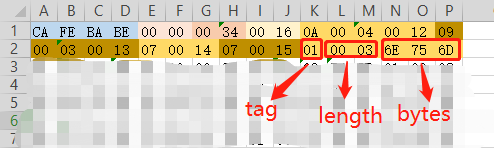

（注意这个length的查看也是按照十六进制的，这里0x0003等于十进制3）整个常量池表的范围是：


将其逐行解读后的内容：


这一个是对应我们使用javap和jclasslib的展示


**注意**

成员变量是不会出现在常量池中的，如果加了final修饰，则会出现。因为成员变量的初始化不在这个步骤中，得在完成类加载后进行。

常量池中没有提供8大基本数据类型的：char、short、byte、boolean因为这四种最终都可以以int来表示。


**总结**

* 这14种表（或者常量项结构)的共同点是:表开始的第一位是一个u1类型的标志位(tag)，代表当前这个常量项使用的是哪种表结构，即哪种常量类型。

* 在常量池列表中，CONSTANT_Uf8_info常量项是一种使用改进过的UTF-8编码格式来存储诸如文字字符串、类或者接口的全限定名、字段或者方法的简单名称以及描述符等常量字符串信息。

* 这14种常量项结构还有一个特点是，其中13个常量项占用的字节固定，只有CONSTANT_Utf8_info占用字节不固定，其大小由length决定。为什么呢?因为从常量池存放的内容可知，其存放的是字面量和符号引用，最终这些内容都会是一个字将串，这些字符串的大小是在编写程序时才确定，比如你定义一个类，类名可以取长取短，所以在没编译前，大小不固定。编译后，通过utf-8编码，就可以知道其长度。

* 常量池:可以理解为Class文件之中的资源仓库，它是Class文件结构中与其他项目关联量多的数据类型(后面的很多数据类型都会指向此处)，也是占用class文件空间最大的数据项目之一。

* 常量池中为什么要包含这些内容

  ```
  Java代码在进行Javac编译的时候，并不像C和IC++那样有“连接”这一步骤，而是在虚拟机加载Class文件的时供进行动态链接。也就是说。Class文件中不会保存各个方法、字段的最终内存布局信息，因此这些字段。方法的符号引用不经过运行期转换的话无法得到真止的内存入口地址，也就无法直按被虚拟机使用，当虚拟机运行时，需要从常量池获得对应的符号引用，再在类创建时或运行时解析、翻译到具体的内存地址之中。关于类的创建和动态链按的内容，在虚拟机类加载过程时再进行详细讲解
  ```


#### 访问标识

access_flag、访问标志、访问标记


在常量池后，紧跟着访问标记。该标记使用两个字节表示，用于识别一些类或者接口层次的访问信息，包括: 这个 class是类还是接口;是否定义为 public 类型;是否定义为 abstract 类型;如果是类的话，是否被声明为 final 等。各访问标记如下所示:

| 标志名称       | 标志值 | 含义                                                         |
| -------------- | ------ | ------------------------------------------------------------ |
| ACC_PUBLIC     | 0x0001 | 标志为public类型                                             |
| ACC_FINAL      | 0x0010 | 标志被声明为final，只有类可以设置                            |
| ACC_SUPER      | 0x0020 | 标志允许使用invokespecial字节码指令的新语义，JDK1.0.2之后编译出来的类的这个标志默认为真。 (使用增强的方法调用父类方法) |
| ACC_INTERFACE  | 0x0200 | 标志这是一个接口                                             |
| ACC_ABSTRACT   | 0x0400 | 是否为abstract类型，对于接口或者抽象类来说，次标志值为真，其他类型为假 |
| ACC_SYNTHETIC  | 0x1000 | 标志此类并非由用户代码产生(即: 由编译器产生的类，没有源码对应) |
| ACC_ANNOTATION | 0x2000 | 标志这是一个注解                                             |
| ACC_ENUM       | 0x4000 | 标志这是一个枚举                                             |

* 类的访问权限通常为 ACC 开头的常量
* 每一种类型的表示都是通过设置访问标记的32位中的特定位来实现的。比如，若是public final的类，则该标记为ACC_PUBLIC | ACC_FINAL
* 使用ACC_SUPER可以让类更准确地定位到父类的方法super.method(),现代编译器都会设置并且使用这个标记

这个访问标识是可以叠加的，所以上面展示21实际就是20+1即标识当前类的访问标志是**ACC_PUBLIC+ACC_SUPER**

1. 带有ACC_INTERFACE标志的class文件表示的是接口而不是类，反之则表示的是类而不是接口。
   1. 如果一个class文件被设置了 ACC_INTERTACE 标志，那么同时也得设置ACC_ABSTRACT 标志。同时它不能再设置 ACC_FINAL、ACC_SUPER 或 ACC_ENUM 标志。
   2. 如果没有设置ACC_INTERFACE标志，那么这个class文件可以具有上表中除 ACC_ANNOTATION外的其他所有标志。当然，ACC_FINAL和ACC_ABSTRACT这类互斥的标志除外。这两个标志不得同时设置。
2. ACC_SUPER标志用于确定类或接口里面的invokespecial指令使用的是哪一种执行语义。针对Java虚拟机指令集的编译器都应当设置这个标志。对于Java SE 8及后续版本来说，无论class文件中这个标志的实际值是什么，也不管class文件的版本号是多少，Java虚拟机都认为每个class文件均设置了ACC_SUPER标志。
   1. ACC_SUPER标志是为了向后兼容由旧Java编译器所编译的代码而设计的。目前的 ACC_SUPER标志在由JDK 1.0.2之前的编译器所生成的access_flags中是没有确定含义的，如果设置了该标志，那么oracle的Java虚拟机实现会将其忽略。
3. ACC_SYNTHETIC标志意味着该类或接口是由编译器生成的，而不是由源代码生成的
4. 注解类型必须设置ACC_ANNOTATION标志。如果设置了 ACC_ANNOTATION标， 那么也必须设置ACC_INTERFACE标志
5. ACC_ENUM标志表明该类或其父类为枚举类型


#### 类索引、父类索引、接口索引集合

* 在访问标志之后，会指定该类的列表，父类列表以及实现的接口

  | 长度 | 含义                         |
  | ---- | ---------------------------- |
  | u2   | this_class                   |
  | u2   | super_class                  |
  | u2   | interfaces_count             |
  | u2   | interfaces[interfaces_count] |

* 这三项数据来确定这个类的继承关系

  * 类索引用于确定这个类的全限定名
  * 父类索引用于确定这个类的父类的全限定名。由于 Java语言不允许多重继承，所以父类索引只有一个，除了java.lang.Object 之外，所有的Java类都有父类，因此除了java.lang.object 外，所有Java类的父类索引都不为 0。
  * 接口索引集合就用来描述这个类实现了哪些接口，这些被实现的接口将按 implements 语句(如果这个类本身是一个接口，则应当是 extends 语句) 后的接口顺序从左到右排列在接口索引集合中

**this_class（类索引）**


2字节无符号整数，指向常量池的索引。它提供了类的全限定名,如com/zhuzhe/Demo。this_class的值必须是对常量池表中某项的一个有效索引值。常量池在这个索引处的成员必须为CONSTANT_Class_ info类型结构体，该结构体表示这个class文件所定义的类或接口。


指向常量池索引3


**父类索引super_class**

* 2字节无符号整数，指向常量池的索引。它提供了当前类的父类的全限定名。如果我们现在没有继承任何类，其默认继承的就是java/lang/Object类。同时，由于Java不支持多继承，所以其父类只有一个。
* superclass指向的父类不能是final


指向常量池索引4


**接口索引interfaces**


（测试的Demo没有实现接口，这里为空）

* 指向常量池索引集合，它提供了一共符号引用到所有已实现的接口
* 由于一共类可以实现多个接口，因此需要以数组形式保存多个接口索引，表示接口的每个索引也是一共指向常量池的CONSTANT_Class（当然这里就必须是接口，而不是类）

这个信息对应在jclasslib中的位置


**接口计数器interfaces_count**

interfaces_count项的值表示当前类或接口的直接超接口数量


**接口索引集合interfaces[]**

interfaces[]中每个成员的值必须是对常量池表中某项的有效索引值，它的长度为interfaces_count。每个成员interfaces[i]必须为CONSTANT_Class_info结构，其中0<=i<=interfaces_count。在interfaces[]中，各成员所表示的接口顺序和对应的源代码中给定的接口顺序（从左至右）一样，即interfaces[0]对应的是源代码中最左边的接口。


#### 字段表集合

* 用于描述接口或类中声明的变量。字段 (field)包括类级变量以及实例级变量，但是不包括方法内部、代码块内部声明的局部变量。
* 字段叫什么名字、字段被定义为什么数据类型，这些都是无法固定的，只能引用常量池中的常量来描述。
* 它指向常量池索引集合，它描述了每个字段的完整信息。比如字段的标识符、访问修饰符(public、private或protected) 、是类变量还是实例变量(static修饰符) 、是否是常量 (final修饰符) 等。

注意事项

* 字段表集合中不会列出从父类或者实现的接口中继承而来的字段，但有可能列出原本Java代码之中不存在的字段。警如在内部类中为了保持对外部类的访问性，会自动添加指向外部类实例的字段。

* 在Java语言中字段是无法重载的，两个字段的数据类型、修饰符不管是否相同，都必须使用不一样的名称，但是对于字节码来讲，如果两个字段的描述符不一致，那字段重名就是合法的

  

**字段计数器fields_count**


fields_count的值表示当前class文件fields表的成员个数。使用两个字节来表示。

fields表中每个成员都是一共field_info结构，用于表示该类或接口所声明的所有类字段或者实例字段，不包括方法内部声明的变量，也不包括从父类或父接口继承的那些字段。


**字段表fields[]**

* fields表中的每个成员都必须是一共fields_info结构的数据项，用于表示当前类或接口中某个字段的完整描述。

* 一个字段的信息包括如下这些信息。这些信息中，各个修饰符都是布尔值、要么有、要么没

  * 作用域`public、private、protected修饰符`
  * 是实例变量还是类变量（static变量）
  * 可变性（final）
  * 并发可见性（volatile修饰符，是否强制从主内存读写）
  * 可否序列化（transient修饰符）
  * 字段数据类型（基本数据类型、对象、数组）
  * 字段名称

* fields_info结构

  | 类型           | 名称             | 含义       | 数量             |
  | -------------- | ---------------- | ---------- | ---------------- |
  | u2             | access_flag      | 访问标志   | 1                |
  | u2             | name_index       | 字段名索引 | 1                |
  | u2             | descriptor_index | 描述符索引 | 1                |
  | u2             | attribute_count  | 属性计数器 | 1                |
  | attribute_info | attributes       | 属性集合   | attributes_count |

* 字段访问标识

  

  一个字段可以被各种关键字去修饰，比如作用域修饰符（public、private、protect）、static修饰符、final修饰符、volatile修饰符等等。因此，其可像类的访问标志一样，使用一些标志来标记字段，字段的访问标志有如下这些:

  | 标志名称      | 标志值 | 含义                     |
  | ------------- | ------ | ------------------------ |
  | ACC_PUBLIC    | 0x0001 | 字段是否为public         |
  | ACC_PRIVATE   | 0x0002 | 字段是否为private        |
  | ACC_PROTECTED | 0x0004 | 字段是否为protected      |
  | ACC_STATIC    | 0x0008 | 字段是否为static         |
  | ACC_FINAL     | 0x0010 | 字段是否为final          |
  | ACC_VOLATLE   | 0x0040 | 字段是否为volatile       |
  | ACC_TRANSTENT | 0x0080 | 字段是否为transient      |
  | ACC_SYNCHETIC | 0x1000 | 字段是否为编译器自动产生 |
  | ACC_ENUM      | 0x4000 | 字段是否为enum           |

  （上面例子中标识字段为private）

* 字段名索引

  

  根据字段名索引的值，查询常量池中的指定索引即可。

  

  

* 描述符索引

  

  

  

  描述符的作用是用来描述字段的数据类型、方法的参数列表（包括数量、类型以及顺序）和返回值。根据描述符规则，基本数据类型（byte、char、double、float、int、long、short、boolean）及代表无返回值的void类型都用一共大写字符来表示。而对象则用字符L加对象的全限定名来表示。

  | 描述符       | 含义                    |
  | ------------ | ----------------------- |
  | B            | 有符号字节型数          |
  | C            | Unicode字符，UTF-16编码 |
  | D            | 双精度浮点数            |
  | F            | 单精度浮点数            |
  | I            | 整型数                  |
  | J            | 长整树                  |
  | S            | 有符号短整树            |
  | Z            | 布尔值true/false        |
  | L Classname; | 一个名为Classname的实例 |
  | [            | 一个一维数组            |
  
* 属性表集合

  

  （这类字段内的属性计数器为0，所以属性表为0）

  一个字段还可能拥有一些属性，用于存储更多的额外信息，比如初始化值、一些注释信息等。属性个数存放在attribute_count中，属性具体内容存放在attributes数组中。

  ```java
  以常量属性为例，结构为：
  ConstantValue_attribute{
      u2 attribute_name_index;
      u4 attribute_length;
      u2 constantvalue_index;
  }
  ```

  说明：对于常量属性而言，attribute_length的值为2

  


#### 方法表集合

**methods**：指向常量池索引集合，它完整描述了每个方法的签名

* 在字节码文件中，每一个method_info项都对应着一共类或者接口中的方法信息。比如方法的访问修饰符（public、private和protected），方法的返回值类型以及方法的参数信息等。
* 如果这个方法不是抽象的或者不是native的，那么字节码中会体现出来。
* 一方面，methods表只描述当前类或接口中声明的方法，不包括从父类或父类接口继承的方法。另一方面，methods表有可能会出现由编译器自动添加的方法。最典型的便是编译器产生的方法信息（比如：类（接口）初始化方`<clinit>()`和实例初始化方法<init>()）

使用注意事项：

在Java语言中，要重载(Overload)一个方法，除了要与原方法具有相同的简单名称之外，还要求必须拥有一个与原方法不同的特征签名，特征签名就是一个方法中各个参数在常量池中的字段符号引用的集合，也就是因为返回值不会包含在特征签名之中，因此Java语言里无法仅仅依靠返回值的不同来对一个已有方法进行重载。但在lass文件格式中，特征签名的范围更大一些，只要描述符不是完全一致的两个方法就可以共存。也就是说，如果两个方法有相同的名称和特征签名，但返回值不同，那么也是可以合法共存于同一个class文件中。

也就是说，尽管Java语法规范并不允许在一个类或者接口中声明多个方法签名相同的方法，但是和Java语法规范相反，字节码文件中却恰恰允许存放多个方法签名相同的方法，唯一的条件就是这些方法之间的返回值不能相同。


**方法计数器methods_count**


methods_count的值表示当前class文件methods表的成员个数。使用两个字节表示。

methods表中每个成员都是一共method_info结构。


**方法表methods[]**

* methods表中的每个成员都必须是一个method_info结构，用于表示当前类或接口中某个方法的完整描述。如果某个method_info结构的access_flag项既没有设置ACC_NATIVE标志也没有设置ACC_ABSTRACT标志，那么该结构中也应包含实现这个方法所用的Java虚拟机指令。
* method_info结构可以表示类和接口中定义的所有方法，包括实例方法、类方法、实例初始化方法和类接口初始化方法。
* 方法表的结构实际跟字段表是一样的，method_info结构如下：

| 类型           | 名称             | 含义       | 数量             |
| -------------- | ---------------- | ---------- | ---------------- |
| u2             | access_flags     | 访问标志   | 1                |
| u2             | name_index       | 方法名引用 | 1                |
| u2             | descriptor_index | 描述符索引 | 1                |
| u2             | attributes_count | 属性计数器 | 1                |
| attribute_info | attributes       | 属性集合   | attributes_count |

方法表访问标志access_flags

跟字段表一样，方法表也有访问标志，而且标志存在部分相同，部分不同。方法表的具体访问标志如下。

| 标志名        | 值     | 说明                              |
| ------------- | ------ | --------------------------------- |
| ACC_PUBLIC    | 0x0001 | public方法可以从包外访问          |
| ACC_PRIVATE   | 0x0002 | private方法只能本类中访问         |
| ACC_PROTECTED | 0x0004 | protected方法在自身和子类可以访问 |
| ACC_STATIC    | 0x0008 | static静态方法                    |


这几个的含义对应是


方法的内容字节码指令这些都是属于属性表，所以先看下面的属性表。


#### 属性表集合

.jpg)

（三个框 ： 属性表+属性表+附加属性表）

方法表集合之后的属性表集合，指的是class文件所携带的辅助信息，比如该class文件的源文件的名称，以及任何带有RetentionPolicy.CLASS或者RetentionPolicy.RUNTIME的注解，这类信息通常被使用于Java虚拟机的验证和允许，以及Java程序的调试，一般无需深入了解。

此外，字段表、方法表都可以有自己的属性表 ，用于描述某些场景的专有信息。

属性表集合的限制没有那么严格，不再要求各个属性具有严格的顺序，并且只要不与已有的属性名重复，任何人实现的编译器都可以向属性表中写入自己定义的属性信息，但Java虚拟机运行时会忽略掉它不认识的属性。


**属性计数器attributes_count**

attributes_count的值标识当前class文件属性表的成员个数。属性表中每一项都是一个attribute_info结构。

一个属性表集合 ： 属性计数器 + 属性表


**属性表attributes[]**

属性的每个项的值必须是attribute_info结构。属性表的结构比较灵活，各种不同的属性只要满足以下结构即可。

通用属性表：

| 类型 | 名称                 | 数量             | 含义       |
| ---- | -------------------- | ---------------- | ---------- |
| u2   | attribute_name_index | 1                | 属性名索引 |
| u2   | attribute_length     | 1                | 属性长度   |
| u1   | info                 | attribute_length | 属性表     |

只需说明属性的名称以及占用位数的长度即可，属性表具体结构可以去自定义。


**属性类型**

属性表实际上可以有很多类型，上面看到的Code属性只是其中一种，Java8中定义了23种属性。

官网：https://docs.oracle.com/javase/specs/jvms/se8/html/jvms-4.html#jvms-4.7

类型表：

| 属性名称                            | 使用位置           | 含义                                                         |
| ----------------------------------- | ------------------ | ------------------------------------------------------------ |
| Code                                | 方法表             | Java代码编译成的字节码指令                                   |
| ConstantValue                       | 字段表             | final关键字定义的常量池                                      |
| Deprecated                          | 类、方法、字段表   | 被声明为deprecated的方法和字段                               |
| Exceptions                          | 方法表             | 方法抛出的异常                                               |
| EnclosingMethod                     | 类文件             | 仅当一共类为局部类或者匿名类时才能拥有这个属性，这个属性用于标识这个类所在的外围方法。 |
| InnerClass                          | 类文件             | 内部类列表                                                   |
| LineNumberTable                     | Code属性           | Java源码的行号与字节码指令的对应关系                         |
| LocalVariableTable                  | Code属性           | 方法的局部变量描述                                           |
| StackMapTable                       | Code属性           | jdk1.6中新增的属性，供新的类型检查检验器检查和处理目标方法的局部变量和操作数有所需要的类是否匹配 |
| Signature                           | 类、方法表、字段表 | 用于支持泛型情况下的方法签名                                 |
| SourceFile                          | 类文件             | 记录源文件名称                                               |
| SourceDebugExtension                | 类文件             | 用于存储额外的调试信息                                       |
| Synthetic                           | 类、方法表、字段表 | 标志方法或字段为编译器自动生成的                             |
| LocalVariableTypeTable              | 类                 | 使用特征前面代替普通描述符，是为了引入泛型语法之后能描述泛型参数化类型而添加 |
| RuntimeVisibleAnnotations           | 类、方法表、字段表 | 为动态注解提供支持                                           |
| RuntimeInvisibleAnnotations         | 类、方法表、字段表 | 用于指明哪些注解的运行时不可见的                             |
| RuntimeVisibleParameterAnnotation   | 方法表             | 作用与RuntimeVisibleAnnotations属性类似，只不过作用对象为方法 |
| RuntimeInvisibleParameterAnnotation | 方法表             | 作用与RuntimeInvisibleAnnotations属性类似，只不过作用对象为方法参数 |
| AnnotationDefault                   | 方法表             | 用于记录注解类元素的默认值                                   |
| BootstrapMethods                    | 类文件             | 用于保存invokeddynamic指令引用的引导方式限定符               |


**①ConstantValue属性表**

ConstantValue属性表示一个常量字段的值，位于field_info结构的属性表中。

```
ConstantValue_attribute{
	u2 attribute_name_index;
	u4 attribute_length;
	u2 constantvalue_index;//字段值在常量池中的索引，常量池在该索引处的项给出该属性表示的常量值。（例如：值是long类型，在常量池中便是CONSTANT_Long）
}
```


**②Deprecated属性表**

Deprecated属性是在jdk1.1为了支持注释中关键词@deprecated而引入的。

```
Deprecated_attribute{
	u2 attribute_name_index;
	u4 attribute_length;
}
```


**③Code属性表**

Code属性就是存放方法体里面的代码，但是，并非所有方法表都有Code属性，像接口或抽象方法，它们没有具体的方法体，也就没有Code属性。

| 类型           | 名称                   | 数量             | 含义                     |
| -------------- | ---------------------- | ---------------- | ------------------------ |
| u2             | attribute_name_index   | 1                | 属性名索引               |
| u4             | attribute_length       | 1                | 属性长度                 |
| u2             | max_stack              | 1                | 操作数栈深度的最大值     |
| u2             | max_locals             | 1                | 局部变量表所需的存储空间 |
| u4             | code_length            | 1                | 字节码指令的长度         |
| u1             | code                   | code_length      | 存储的字节码指令         |
| u2             | exception_table_length | 1                | 异常表长度               |
| exception_info | exception_table        | exception_length | 异常表                   |
| u2             | attribute_count        | 1                | 属性集合计数器           |
| attribute_info | attributes             | attributes_count | 属性集合                 |

第一位识别到的Code类型，则来匹配这个Code属性表。后续的所有字节都按照Code属性表结构来对应。

其中，存储的字节码指令code：这个表中的字节码指令，是对照官方的表：https://docs.oracle.com/javase/specs/jvms/se8/html/jvms-6.html

比如字节码指令aload_0是等于二进制的2A。


所以这个方法的Code属性为：


这块就是Jclasslib中的Code这块内容：


逐行解析结果：


Code属性表最后有属性集合字段attributes，说明属性表是可以多层嵌套的：


（上面`<init>`方法表的Code属性表中，包含了一个属性表，这个表中又描述了LineNumberTable和LocalVariableTable两个属性表）


**④InnerClass属性表（内部类列表）**

为了方便说明特别定义一个表示类或接口的Class格式为C。如果C的常量池中包含某个CONSTANT_Class_info成员，且这个成员所表示的类或接口不属于任何一个包。那么C的ClassFile结构的属性表中就必须含有对应的InnerClass属性。InnerClasses属性是在jdk1.1中为了支持内部类和内部接口而引入的，位于ClassFile结构的属性表。


**⑤LineNumberTable属性表（行号表）**

LineNumberTable属性的可选边长参数，位于Code结构的属性表。

LineNumberTable属性是用来描述Java源码行号与字节码行号之间的对应关系。这个属性可以用来在调试的时候定位代码执行的行数。

* start_pc即字节码行号;line_number，即java源代码行号。

在Code属性的属性表中，LineNumberTable属性可以按照任意顺序出现，此外，多个LineNumberTable属性可以共同标识一个行号在源文件中表示的内容，即LineNumberTable属性不需要与源文件的行一一对应。

LineNumberTable属性表结构：

```
LineNumberTable_attribute {
    u2 attribute_name_index;
    u4 attribute_length;
    u2 line_number_table_length;
    {   u2 start_pc;
        u2 line_number;	
    } line_number_table[line_number_table_length];
}
```

Code属性表>属性表>行号表>行号


这一个行号表对应的就是这块信息


**⑥LocalVariableTable属性表（本地变量表）**

https://docs.oracle.com/javase/specs/jvms/se8/html/jvms-4.html#jvms-4.7.13


LocalVariableTable的是可选变长属性，位于Code属性的属性表中。它被调试器用于确定方法执行过程中局部变量的信息。在Code属性的属性表中，LocalVariableTable属性可以按照任意顺序出现，Code属性中的每个局部变量最多只能由一个LocalVariableTable属性。

* start pc + length表示这个变量在字节码中的生命周期起始和结束的偏移位置（this生命周期从头0到结尾10）
* index就是这个变量在局部变量表中的槽位（槽位可复用）
* name就是变量名称
* Descriptor表示局部变量类型描述

LocalVariableTable属性表结构：

```
LocalVariableTable_attribute {
    u2 attribute_name_index;
    u4 attribute_length;
    u2 local_variable_table_length;
    {   u2 start_pc;
        u2 length;
        u2 name_index;
        u2 descriptor_index;
        u2 index;
    } local_variable_table[local_variable_table_length];
}
```

上面字节码中的内容就是对应在`<init>`方法的Code属性表中的本地变量表信息。


**⑦签名Signature**

Signature属性是可选的定长属性，位于ClassFile，field_info

或method_info结构的属性表中，在Java语言中，任何类、接口、初始化方法或成员的泛型签名如果包含了类型变量（Type Variables）或参数化类型（Parameterized Types），则Signature属性会为它记录泛型签名信息。


**⑧SourceFile属性表（附加属性）**


SourceFile属性结构

| 类型 | 名称                 | 数量 | 含义         |
| ---- | -------------------- | ---- | ------------ |
| u2   | attribute_name_index | 1    | 属性索引     |
| u4   | attribute_length     | 1    | 属性长度     |
| u2   | sourcefile_index     | 1    | 源码文件索引 |

可以看到，SourceFile属性表是固定的8个字节。


（这个SourceFile属性表就是对应Jclasslib这块的描述。）


**⑨其他属性**

Java虚拟机中预定义的属性有20多个，在进行查找时先根据属性的名称索引，十六进制转十进制对饮的字符，去官网中找到对应的属性表。


#### 小结

Java平台的不断发展，在将来，Class文件的内容也一定会做进一步的扩充，但是其基本的格式和结构不会做重大调整。
从Java虚拟机的角度看，通过Class文件，可以让更多的计算机语言支持Java虚拟机平台。因此，Class文件结构不仅仅是Java虚拟机的执行入口，更是Java生态圈的基础和核心。


### 使用javap指令解析Class文件

#### 解析字节码的作用

通过反编译生成的字节码文件，可以深入了解java代码的工作机制，但是一个个字节去分析类文件结构太麻烦。除了使用第三方jclasslibe工具外，Oracle官方也提供了javap。

javap是jdk自带的反解析工具，它的作用是工具class字节码文件，反解析出当前类对应的code区（字节码指令）、局部变量表、异常表和代码行偏移量映射表、常量池等信息。

通过局部变量表，我们可以查看局部变量的作用域范围，所在槽位等信息，甚至可以看到槽位复用等信息。


#### javac -g操作

解析字节码文件得到的信息中，有些信息（如局部变量表、指令和代码行偏移量映射表、常量池中方法的参数名称等）需要在使用javac编译成class文件时，指定参数才能输出。

比如，直接javac xx.java就不会再生成对应的局部变量表等信息。如果你使用javac -g xx.java就可以生成所有相关信息，如果你使用eclipse或idea，默认情况下，eclipse、idea在编译时会帮你生成局部变量表、指令和代码偏移量映射表等信息。

例子：

```java
package jvm2.chapter01;

/**
 * @Author: zhuzhe
 * @ClassName: JavaTest
 * @Date: 2023/2/13 21:14
 * @Description:
 * @Version: V1.0
 * @Param:
 */
public class JavaTest {
    private int num;
    boolean flag;
    protected char gender;
    public String info;

    public static final int COUNTS = 1;

    static {
        String url = "www.zhuzhe96.com";
    }
    {
        info = "java";
    }

    public JavaTest(){

    }

    private JavaTest(boolean flag){
        this.flag = flag;
    }

    private void methodPrivate(){

    }

    int getNum(int i){
        return num + i;
    }

    protected char showGender(){
        return gender;
    }

    public void showInfo(){
        int i = 10;
        System.out.println(info + i);
    }
}
```

先进行普通的编译：


再进行带参编译：


生成两个字节码文件：


比较：

* 相同源文件编译出来的大小不同

  

* 使用javap对字节码做解析

  

  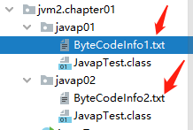

  使用idea的比较功能查看两者的字节码差别

  

  

* 可以发现使用参数后在字节码各个位置中出现了本地变量表

  在运行时常量池中

  

  方法的Code属性中

  

  代码块中

  

* 在使用idea的默认编译也是会生成

  比较这个的字节码

  

  

  可以看到，这一个idea的默认编译结果。是和我们使用`javac -g xxx.java`是一致的，编译出来的字节码文件也是一模一样。


#### javap的用法

javap的用法格式。

```shell
javap <options> <classes>
```

其中，classes就是你要反编译的class文件，在命令行中直接输入javap 或者 javap -help可以看到javap的options。


```
  -help  --help  -?        输出此用法消息                       
  -version                 版本信息    

  -public                  仅显示公共类和成员                   
  -protected               显示受保护的/公共类和成员            
  -package                 显示程序包/受保护的/公共类和成员 (默认)                        
  -p  -private             显示所有类和成员                                  
  -sysinfo                 显示正在处理的类的系统信息 (路径, 大小, 日期, MD5 散列)
  -constants               显示最终常量                         

  -c                       对代码进行反汇编               
  -l                       输出行号和本地变量表                       
  -s                       输出内部类型签名
  -v  -verbose             输出附加信息

  -classpath <path>        指定查找用户类文件的位置             
  -cp <path>               指定查找用户类文件的位置             
  -bootclasspath <path>    覆盖引导类文件的位置
```


**>>>显示版本号**

**-version**


**>>>显示访问权限符合的字段**

**-public**


**-protected**


**-p  -private**


**-package**


**>>>显示系统信息**

**-sysinfo**


**>>>显示常量**

**-constants**


**>>>指定输出**

**-s**


**-l**

idea编译：

```
PS F:\project\idea\TestJava\out\production\TestJava\jvm2\chapter01> javap -l .\JavapTest.class
Compiled from "JavapTest.java"
public class jvm2.chapter01.JavapTest {
  boolean flag;                        
                                       
  protected char gender;               
                                       
  public java.lang.String info;        
                                       
  public static final int COUNTS;      
                                       
  public jvm2.chapter01.JavapTest();   
    LineNumberTable:                   
      line 26: 0
      line 39: 0
    LocalVariableTable:
      Start  Length  Slot  Name   Signature
          0       7     0  this   Ljvm2/chapter01/JavapTest;
          0       7     1     i   I

  protected char showGender();
    LineNumberTable:
      line 43: 0
    LocalVariableTable:
      Start  Length  Slot  Name   Signature
          0       5     0  this   Ljvm2/chapter01/JavapTest;

  public void showInfo();
    LineNumberTable:
      line 47: 0
      line 48: 3
      line 49: 30
    LocalVariableTable:
      Start  Length  Slot  Name   Signature
          0      31     0  this   Ljvm2/chapter01/JavapTest;
          3      28     1     i   I

  static {};
    LineNumberTable:
      line 20: 0
      line 21: 3
    LocalVariableTable:
      Start  Length  Slot  Name   Signature
}
```

普通编译：因为在编译时没有传入本地变量表，所以这里获取不到。

```
PS F:\project\idea\TestJava\out\production\TestJava\jvm2\chapter01> javap -l F:\project\idea\TestJava\src\jvm2\c
hapter01\javap01\JavapTest.class
Compiled from "JavapTest.java"
public class jvm2.chapter01.JavapTest {
  boolean flag;

  protected char gender;

  public java.lang.String info;

  public static final int COUNTS;
  protected char showGender();
    LineNumberTable:
      line 43: 0

  public void showInfo();
    LineNumberTable:
      line 47: 0
      line 48: 3
      line 49: 30

  static {};
    LineNumberTable:
      line 20: 0
      line 21: 3
}
```

**-c**

输出方法的Code属性

```
PS F:\project\idea\TestJava\out\production\TestJava\jvm2\chapter01> javap -c .\JavapTest.class
Compiled from "JavapTest.java"
public class jvm2.chapter01.JavapTest {
  boolean flag;

  protected char gender;

  public java.lang.String info;

  public static final int COUNTS;

  public jvm2.chapter01.JavapTest();
    Code:
       0: aload_0
       1: invokespecial #1                  // Method java/lang/Object."<init>":()V
       4: aload_0
       5: ldc           #2                  // String java
       7: putfield      #3                  // Field info:Ljava/lang/String;
      10: return

  int getNum(int);
    Code:
       0: aload_0
       1: getfield      #5                  // Field num:I
       4: iload_1

  public void showInfo();
    Code:
       0: bipush        10
       2: istore_1
       3: getstatic     #7                  // Field java/lang/System.out:Ljava/io/PrintStream;
       6: new           #8                  // class java/lang/StringBuilder
       9: dup
      10: invokespecial #9                  // Method java/lang/StringBuilder."<init>":()V
      13: aload_0
      14: getfield      #3                  // Field info:Ljava/lang/String;
      17: invokevirtual #10                 // Method java/lang/StringBuilder.append:(Ljava/lang/String;)Ljava/l
ang/StringBuilder;
      20: iload_1
      21: invokevirtual #11                 // Method java/lang/StringBuilder.append:(I)Ljava/lang/StringBuilder
;
      24: invokevirtual #12                 // Method java/lang/StringBuilder.toString:()Ljava/lang/String;     
      27: invokevirtual #13                 // Method java/io/PrintStream.println:(Ljava/lang/String;)V
      30: return

  static {};
    Code:
       0: ldc           #14                 // String www.zhuzhe96.com
       2: astore_0
       3: return
}
```

**-v**

比-c的内容更为详细。

```
PS F:\project\idea\TestJava\out\production\TestJava\jvm2\chapter01> javap -v .\JavapTest.class
Classfile /F:/project/idea/TestJava/out/production/TestJava/jvm2/chapter01/JavapTest.class
  Last modified 2023-2-13; size 1353 bytes
  MD5 checksum 4f55454f85a5f158846c4ed2be328146
  Compiled from "JavapTest.java"               
public class jvm2.chapter01.JavapTest          
  minor version: 0                             
  major version: 52                            
  flags: ACC_PUBLIC, ACC_SUPER                 
Constant pool:
   #1 = Methodref          #16.#46        // java/lang/Object."<init>":()V
   #2 = String             #47            // java
   #3 = Fieldref           #15.#48        // jvm2/chapter01/JavapTest.info:Ljava/lang/String;
   #4 = Fieldref           #15.#49        // jvm2/chapter01/JavapTest.flag:Z
   #5 = Fieldref           #15.#50        // jvm2/chapter01/JavapTest.num:I
   #6 = Fieldref           #15.#51        // jvm2/chapter01/JavapTest.gender:C
   #7 = Fieldref           #52.#53        // java/lang/System.out:Ljava/io/PrintStream;
   #8 = Class              #54            // java/lang/StringBuilder
   #9 = Methodref          #8.#46         // java/lang/StringBuilder."<init>":()V
  #10 = Methodref          #8.#55         // java/lang/StringBuilder.append:(Ljava/lang/String;)Ljava/lang/Strin
gBuilder;
  #11 = Methodref          #8.#56         // java/lang/StringBuilder.append:(I)Ljava/lang/StringBuilder;        
  #12 = Methodref          #8.#57         // java/lang/StringBuilder.toString:()Ljava/lang/String;
  #13 = Methodref          #58.#59        // java/io/PrintStream.println:(Ljava/lang/String;)V
  #14 = String             #60            // www.zhuzhe96.com
  #15 = Class              #61            // jvm2/chapter01/JavapTest
  #16 = Class              #62            // java/lang/Object
  #17 = Utf8               num
  #18 = Utf8               I
  #19 = Utf8               flag
  #20 = Utf8               Z
  #21 = Utf8               gender
  #22 = Utf8               C
  #23 = Utf8               info
  #24 = Utf8               Ljava/lang/String;
  #25 = Utf8               COUNTS
  #26 = Utf8               ConstantValue
  #27 = Integer            1
  #28 = Utf8               <init>
  #29 = Utf8               ()V
  #30 = Utf8               Code
  #31 = Utf8               LineNumberTable
  #32 = Utf8               LocalVariableTable
  #33 = Utf8               this
  #34 = Utf8               Ljvm2/chapter01/JavapTest;
  #35 = Utf8               (Z)V
  #36 = Utf8               methodPrivate
  #37 = Utf8               getNum
  #38 = Utf8               (I)I
  #39 = Utf8               i
  #40 = Utf8               showGender
  #41 = Utf8               ()C
  #42 = Utf8               showInfo
  #43 = Utf8               <clinit>
  #44 = Utf8               SourceFile
  #45 = Utf8               JavapTest.java
  #46 = NameAndType        #28:#29        // "<init>":()V
  #47 = Utf8               java
  #48 = NameAndType        #23:#24        // info:Ljava/lang/String;
  #49 = NameAndType        #19:#20        // flag:Z
  #50 = NameAndType        #17:#18        // num:I
  #51 = NameAndType        #21:#22        // gender:C
  #52 = Class              #63            // java/lang/System
  #53 = NameAndType        #64:#65        // out:Ljava/io/PrintStream;
  #54 = Utf8               java/lang/StringBuilder
  #55 = NameAndType        #66:#67        // append:(Ljava/lang/String;)Ljava/lang/StringBuilder;
  #56 = NameAndType        #66:#68        // append:(I)Ljava/lang/StringBuilder;
  #57 = NameAndType        #69:#70        // toString:()Ljava/lang/String;
  #58 = Class              #71            // java/io/PrintStream
  #59 = NameAndType        #72:#73        // println:(Ljava/lang/String;)V
  #60 = Utf8               www.zhuzhe96.com
  #61 = Utf8               jvm2/chapter01/JavapTest
  #62 = Utf8               java/lang/Object
  #63 = Utf8               java/lang/System
  #64 = Utf8               out
  #65 = Utf8               Ljava/io/PrintStream;
  #66 = Utf8               append
  #67 = Utf8               (Ljava/lang/String;)Ljava/lang/StringBuilder;
  #68 = Utf8               (I)Ljava/lang/StringBuilder;
  #69 = Utf8               toString
  #70 = Utf8               ()Ljava/lang/String;
  #71 = Utf8               java/io/PrintStream
  #72 = Utf8               println
  #73 = Utf8               (Ljava/lang/String;)V
{
  boolean flag;
    descriptor: Z
    flags:

  protected char gender;
    descriptor: C
    flags: ACC_PROTECTED

  public java.lang.String info;
    descriptor: Ljava/lang/String;
    flags: ACC_PUBLIC

  public static final int COUNTS;
    descriptor: I
    flags: ACC_PUBLIC, ACC_STATIC, ACC_FINAL
    ConstantValue: int 1

  public jvm2.chapter01.JavapTest();
    descriptor: ()V
    flags: ACC_PUBLIC
    Code:
      stack=2, locals=1, args_size=1
         0: aload_0
         1: invokespecial #1                  // Method java/lang/Object."<init>":()V
         4: aload_0
         5: ldc           #2                  // String java
         7: putfield      #3                  // Field info:Ljava/lang/String;
        10: return
      LineNumberTable:
        line 26: 0
        line 23: 4
        line 28: 10
      LocalVariableTable:
        Start  Length  Slot  Name   Signature
            0      11     0  this   Ljvm2/chapter01/JavapTest;

  int getNum(int);
    descriptor: (I)I
    flags:
    Code:
      stack=2, locals=2, args_size=2
         0: aload_0
         1: getfield      #5                  // Field num:I
         4: iload_1
         5: iadd
         6: ireturn
      LineNumberTable:
        line 39: 0
      LocalVariableTable:
        Start  Length  Slot  Name   Signature
            0       7     0  this   Ljvm2/chapter01/JavapTest;
            0       7     1     i   I

  protected char showGender();
    descriptor: ()C
    flags: ACC_PROTECTED
    Code:
      stack=1, locals=1, args_size=1
         0: aload_0
         1: getfield      #6                  // Field gender:C
         4: ireturn
      LineNumberTable:
        line 43: 0
      LocalVariableTable:
        Start  Length  Slot  Name   Signature
            0       5     0  this   Ljvm2/chapter01/JavapTest;

  public void showInfo();
    descriptor: ()V
    flags: ACC_PUBLIC
    Code:
      stack=3, locals=2, args_size=1
         0: bipush        10
         2: istore_1
         3: getstatic     #7                  // Field java/lang/System.out:Ljava/io/PrintStream;
         6: new           #8                  // class java/lang/StringBuilder
         9: dup
        10: invokespecial #9                  // Method java/lang/StringBuilder."<init>":()V
        13: aload_0
        14: getfield      #3                  // Field info:Ljava/lang/String;
        17: invokevirtual #10                 // Method java/lang/StringBuilder.append:(Ljava/lang/String;)Ljava
/lang/StringBuilder;
        20: iload_1
        21: invokevirtual #11                 // Method java/lang/StringBuilder.append:(I)Ljava/lang/StringBuild
er;
        24: invokevirtual #12                 // Method java/lang/StringBuilder.toString:()Ljava/lang/String;   
        27: invokevirtual #13                 // Method java/io/PrintStream.println:(Ljava/lang/String;)V       
        30: return
      LineNumberTable:
        line 47: 0
        line 48: 3
        line 49: 30
      LocalVariableTable:
        Start  Length  Slot  Name   Signature
            0      31     0  this   Ljvm2/chapter01/JavapTest;
            3      28     1     i   I

  static {};
    descriptor: ()V
    flags: ACC_STATIC
    Code:
      stack=1, locals=1, args_size=0
         0: ldc           #14                 // String www.zhuzhe96.com
         2: astore_0
         3: return
      LineNumberTable:
        line 20: 0
        line 21: 3
      LocalVariableTable:
        Start  Length  Slot  Name   Signature
}
SourceFile: "JavapTest.java"
```

文件中的各个结构：

```
Classfile /F:/project/idea/TestJava/out/production/TestJava/jvm2/chapter01/JavapTest.class //字节码文件所属的路径
  Last modified 2023-2-13; size 1353 bytes                                                 //最后修改时间，字节码文件的大小
  MD5 checksum 4f55454f85a5f158846c4ed2be328146                                            //MD5散列值
  Compiled from "JavapTest.java"                                                           //源文件的名称
public class jvm2.chapter01.JavapTest
  minor version: 0                                                                         //副版本          
  major version: 52                                                                        //主版本
  flags: ACC_PUBLIC, ACC_SUPER                                                             //访问标志
Constant pool:                                                                             //常量池表
   #1 = Methodref          #16.#46        // java/lang/Object."<init>":()V
  ...
{                                                                                          //字段表集合信息
  boolean flag;                                                                            //字段名
    descriptor: Z                                                                          //字段描述符，字段的类型
    flags:                                                                                 //字段的访问标识

  protected char gender;
    descriptor: C
    flags: ACC_PROTECTED

  public java.lang.String info;
    descriptor: Ljava/lang/String;
    flags: ACC_PUBLIC

  public static final int COUNTS;
    descriptor: I
    flags: ACC_PUBLIC, ACC_STATIC, ACC_FINAL
    ConstantValue: int 1                                                                   //常量字段的属性：ConstantValue

  public jvm2.chapter01.JavapTest();                                                       //构造器1的信息
    descriptor: ()V
    flags: ACC_PUBLIC
    Code:
      stack=2, locals=1, args_size=1
         0: aload_0
         1: invokespecial #1                  // Method java/lang/Object."<init>":()V
         4: aload_0
         5: ldc           #2                  // String java
         7: putfield      #3                  // Field info:Ljava/lang/String;
        10: return
      LineNumberTable:
        line 26: 0
        line 23: 4
        line 28: 10
      LocalVariableTable:
        Start  Length  Slot  Name   Signature
            0      11     0  this   Ljvm2/chapter01/JavapTest;

  int getNum(int);
    descriptor: (I)I
    flags:
    Code:
      stack=2, locals=2, args_size=2
         0: aload_0
         1: getfield      #5                  // Field num:I
         4: iload_1
         5: iadd
         6: ireturn
      LineNumberTable:
        line 39: 0
      LocalVariableTable:
        Start  Length  Slot  Name   Signature
            0       7     0  this   Ljvm2/chapter01/JavapTest;
            0       7     1     i   I

  protected char showGender();
    descriptor: ()C
    flags: ACC_PROTECTED
    Code:
      stack=1, locals=1, args_size=1
         0: aload_0
         1: getfield      #6                  // Field gender:C
         4: ireturn
      LineNumberTable:
        line 43: 0
      LocalVariableTable:
        Start  Length  Slot  Name   Signature
            0       5     0  this   Ljvm2/chapter01/JavapTest;

  public void showInfo();
    descriptor: ()V                                                                        //方法的描述符
    flags: ACC_PUBLIC                                                                      //方法的访问标志
    Code:                                                                                  //方法的Code属性
      stack=3, locals=2, args_size=1                                                       //操作数栈的最大深度、本地变量表所需的存储空间、方法接受参数的个数
         0: bipush        10                                                               //字节码指令：偏移量 操作码 操作数
         2: istore_1
         3: getstatic     #7                  // Field java/lang/System.out:Ljava/io/PrintStream;
         6: new           #8                  // class java/lang/StringBuilder
         9: dup
        10: invokespecial #9                  // Method java/lang/StringBuilder."<init>":()V
        13: aload_0
        14: getfield      #3                  // Field info:Ljava/lang/String;
        17: invokevirtual #10                 // Method java/lang/StringBuilder.append:(Ljava/lang/String;)Ljava
/lang/StringBuilder;
        20: iload_1
        21: invokevirtual #11                 // Method java/lang/StringBuilder.append:(I)Ljava/lang/StringBuild
er;
        24: invokevirtual #12                 // Method java/lang/StringBuilder.toString:()Ljava/lang/String;   
        27: invokevirtual #13                 // Method java/io/PrintStream.println:(Ljava/lang/String;)V       
        30: return
      LineNumberTable:                                                                      //行号表
        line 47: 0                                                                          //line 程序中行号:指令偏移量
        line 48: 3
        line 49: 30
      LocalVariableTable:                                                                   //局部变量表
        Start  Length  Slot  Name   Signature                                               //变量作用范围开始偏移量 作用范围结束偏移量 所在槽位 变量名称 变量类型
            0      31     0  this   Ljvm2/chapter01/JavapTest;
            3      28     1     i   I

  static {};                                                                                //静态代码块，在clinit中
    descriptor: ()V
    flags: ACC_STATIC
    Code:
      stack=1, locals=1, args_size=0
         0: ldc           #14                 // String www.zhuzhe96.com
         2: astore_0
         3: return
      LineNumberTable:
        line 20: 0
        line 21: 3
      LocalVariableTable:
        Start  Length  Slot  Name   Signature
}
SourceFile: "JavapTest.java"
```

这些指令就是对应jclasslib工具的展示：


#### 使用举例

#### 总结

通过javap命令可以查看一个java类反汇编得到的CLass文件版本号、常量池、访问标志、变量表、指令代码行号表等信息，不显示类索引、父类索引、接口索引集合、`<clinit>()`、`<init>()`等结构。

通过对签名例子代码反编译文件的简单分析，可以发现，一个方法的执行通常会涉及下面几块内存的操作：

* java栈中：局部变量表、操作数栈
* java对：通过对象的地址引用区操作
* 常量池
* 其他如帧数据区、方法区的剩余部分等情况
* 平常我我们比较关注的是java类中每个方法的反汇编中的指令操作过程，这些指令都是顺序执行的，可以参考官方文档中的指令含义：
* https://docs.oracle.com/javase/specs/jvms/se7/html/jvms-6.html


## 字节码指令集与解析举例

### 概述

* Java字节码对于虚拟机，就好像汇编语言对于计算机，属于基本执行指令。
* Java虚拟机的指令由一个字节长度的、代表着某种特定操作含义的数字（称为操作码：Opcode）以及跟随其后的零至多个代表此操作的所需参数（称为操作数Operands）而构成。由于java虚拟机采用面向操作数栈而不是寄存器的结构，所以大多数的指令都不包含操作数，只有一个操作码。
* 由于限制了Java虚拟机操作码的长度为一个字节（0-255），这意味着指令集的操作码总数不能操作过256条。
* 官方文档：https://docs.oracle.com/javase/specs/jvms/se8/html/jvms-6.html
* 熟悉虚拟机的指令对于动态字节码生成，反编译Class文件、Class文件修补都有着非常重要的价值。因此，阅读字节码作为了解java虚拟机的基础技能，需要熟练掌握常见指令。


#### 执行模型

如果不考虑异常处理的话，Java虚拟机的解释器可以使用下面的伪代码来做基本的执行模型。

```java
do{
    自动计算PC寄存器的值+1;
    根据PC寄存器的指示位置，从字节码流中取出操作码;
    if（字节码存在操作数）从字节码流中取出操作数;
    执行操作码所定义的操作;
}while(字节码长度>0);
```


#### 字节码与数据模型

在Java虚拟机的指令集中，大多数的指令都包含了其操作所对应的数据类型信息。例如，iload指令用于从局部变量表中价值int型的数据到操作数栈中，而float指令价值的则是float类型的数据。

对于大部分与数据类型相关的字节码指令，他们的操作码助记符中都有特殊的字符来表明专门为哪种数据类型服务:

* i代表对int类型的数据操作
* l代表long类型
* s代表short
* b代表byte
* c代表char
* f代表float
* d代表double

也有一些指令的助记符中没有明确地指明操作类型的字面，如arraylength指令，它没有代表某一种数据类型的特殊字符。但操作数永远只能是一个数组类型的对象。

还有另外一些指令，如无条件跳转指令goto则是与数据类型无关的。

大部分的指令都没有支持整数类型byte、char和float，甚至没有任何指令支持boolean类型，编译器会在编译期或运行期将byte和short类型的数据带符号扩展（Sign-Extend）为相应的int类型数据，将boolean和char类型数据零位扩展（Zero-Extend）为相应的int类型数据，与之类似，在处理Boolean、byte、short和char类型的数组时，也会转换为使用对应的int类型的字节码指令来处理，因此，大多数对于boolean、byte、short和char类型数据的操作，实际上都是使用相应的int类型作为运算符。

```
byte b1 = 12;
short s1 = 10;
int i = b1 + s1;
```


#### 指令分类

* 由于完全介绍和学习这些指令需要花费大量时间，为了让大家能够更快地熟悉和了解这些基本指令，这里将JVM中的字节码指令集按用途大致分成9类。
  * 加载与存储指令
  * 算术指令
  * 类型转换指令
  * 对象的创建与访问指令
  * 方法调用与返回指令
  * 操作数栈管理指令
  * 比较控制指令
  * 异常处理指令
  * 同步控制指令
* 在做值相关操作时：
  * 一个指令，可以从局部变量表、常量池、堆中对象、方法调用、系统调用中等取得数据，这些数据（可能是值，可能是对象的引用）被压入操作数栈。
  * 一个指令，也可以从操作数栈中取出一到多个值（pop多次），完成赋值、加减乘除、方法传参、系统调用等操作。


### 加载与存储指令

**作用**

加载和存储指令用于将数据从栈帧的局部变量表和操作数栈之间来回传递。

**常用指令**

* 局部变量压栈指令

  ```
  将一个局部变量加载到操作系统操作数栈：xload、xload_<n>(其中x为i、l、f、d、a，n为0~3)、xaload、xaload_<n>(其中x为i、l、d、a、b、c、s，n为0~3)
  ```

* 常量压栈指令

  ```
  将一个常量加载到操作数栈：bipush、sipush、ldc、ldc_w、ldc2_w、aconst_null、iconst_m1、iconst_<i>、lconst_<l>、fconst_<f>、dconst_<d>
  ```

* 出栈装入局部变量表指令

  ```
  将一个数值从操作数栈存储到局部变量表：xstore、xstore_<n>(其中x为i、l、f、d、a，n为0~3)、xastore(其中x为i、l、f、d、a、b、c、s)
  ```

* 扩充局部变量表的访问索引的指令

上面所列举的指令助记符中，有一部分是以尖括号结尾的（例如`iload_<n>`）。这些指令助记符实际上代表了一组指令（例如`iload_<n>`代表了iload_0、iload_1、iload_2和iload_3这几个部分）。这几组指令都是某个带有一个操作数的通用指令（例如iload）的特殊形式，**对于这若干组特殊指令来说，它们表面上没有操作数，不需要进行取操作数的动作，但操作数都隐含在指令中**。

除此之外，它们的语义与原生的通用指令完全一致（例如iload_0的语义与操作数为0时的iload指令语义完全一致）在尖括号之间的字面指定指令隐含操作数的数据类型，`<n>`代表非负的整数，`<i>`代表int类型数据，`<l>`代表long类型，`<f>`代表float类型，`<d>`代表double类型。

操作byte、char、short和boolean类型数据时，经常用int类型的指令来表示。

**例子：**

iload_0 : 将局部变量表中索引为0位置上的数据压入操作数栈。

iload_4 : 将局部变量表中索引为4位置上的数据压入操作数栈。


#### 再谈操作数栈与局部变量表

**操作数栈**

Java字节码是Java虚拟机所使用的指令集。因此，它与Java虚拟机基于栈的计算模型是密不可分的。

在解释执行过程中，每当Java方法分配栈帧时，Java虚拟机需要开辟一块额外的空间作为操作数**栈**，来存放计算的操作数以及返回结果。

具体来说便是：执行每一条指令之前，Java虚拟机要求该指令的操作数已被压入操作数栈中。在执行指令时，Java虚拟机会将该指令所需的操作数弹出，并且将指令的结果重新压入栈中。


比如这个加法例子iadd：假设在执行该指令前，栈顶的两个元素分别为int值1和int值2，那么iadd指令将弹出这两个int，并将求得的和int值3压入栈中。


由于iadd指令只消耗栈顶的两个元素，因此，对于离栈顶距离为2的元素，即？。iadd不会影响到。

**局部变量表**

Java方法栈帧的另外一个重要组成部分则是局部变量表区，字节码程序可以将计算的结果缓存在局部变量区中。实际上，Java虚拟机将局部变量区当成一个**数组**，依次存放this指针（仅非静态方法），所传入人的参数，以及字节码中的局部变量。

和操作数一样，long类型以及double类型的值将占两个单元，其余类型仅占一个单元。


（不同类型的变量在局部变量表中所占槽位slot）

例子：

```java
public void foo(long l, float f){
    {
        int i = 0;
    }
    {
        String s = ""Hello, World;
    }
}
```


（上面代码中对应的局部变量表，l占用两个槽位，i与s共用一个槽位）

在栈帧中，与性能调优相关的就是局部变量表。局部变量表中的变量也是重要的垃圾回收根节点。只要被局部变量表中直接或间接引用的对象都不会被回收。

在方法执行时，虚拟机使用局部变量表完成方法的传递。


#### 局部变量压栈指令xload

局部变量压栈指令将给定的局部变量表中的数据压入操作数栈。

这类指令大体可以分为：

```shell
> xload_<n> (x为i、l、f、d、a，n为0~3)
> xload (x为i、l、f、d、a)
```

说明，这里的x取值表示数据类型。

指令xload_n表示将第n个局部变量压入操作数栈，比如iload_1、fload_0、aload_0等指令，其中aload_n表示将一个对象引用压栈。

指令xload通过指定参数的形式，把局部变量压入操作数栈，当使用这个命令时，表示局部变量的数量可能超过了4个，比如指令fload、fload等。

例子：

```java
package jvm2.chapter02;

/**
 * @Author: zhuzhe
 * @ClassName: LoadAndStoreTest
 * @Date: 2023/2/16 17:38
 * @Description:
 * @Version: V1.0
 * @Param:
 */
public class LoadAndStoreTest {
    //1. 局部变量压栈指令
    public void load(int num, Object obj, long count, boolean flag, short[] arr){
        System.out.println(num);
        System.out.println(obj);
        System.out.println(count);
        System.out.println(flag);
        System.out.println(arr);
    }
}
```

>  0 getstatic #2 <java/lang/System.out : Ljava/io/PrintStream;>
>  3 iload_1
>  4 invokevirtual #3 <java/io/PrintStream.println : (I)V>
>  7 getstatic #2 <java/lang/System.out : Ljava/io/PrintStream;>
> 10 aload_2
> 11 invokevirtual #4 <java/io/PrintStream.println : (Ljava/lang/Object;)V>
> 14 getstatic #2 <java/lang/System.out : Ljava/io/PrintStream;>
> 17 lload_3
> 18 invokevirtual #5 <java/io/PrintStream.println : (J)V>
> 21 getstatic #2 <java/lang/System.out : Ljava/io/PrintStream;>
> 24 iload 5
> 26 invokevirtual #6 <java/io/PrintStream.println : (Z)V>
> 29 getstatic #2 <java/lang/System.out : Ljava/io/PrintStream;>
> 32 aload 6
> 34 invokevirtual #4 <java/io/PrintStream.println : (Ljava/lang/Object;)V>
> 37 return

局部变量表：

|  0   |  1   |  2   |   3   |  4   |  5   |  6   |  7   |
| :--: | :--: | :--: | :---: | :--: | :--: | :--: | :--: |
| this | num  | obj  | count |      | flag | arr  |      |

执行过程：

1. 获取静态打印流的对象

   >  0 getstatic #2 <java/lang/System.out : Ljava/io/PrintStream;>

2. 从局部变量表角标为1的位置的元素放到操作数栈

   >  3 iload_1

   

3. 输出操作数栈顶元素

   >  4 invokevirtual #3 <java/io/PrintStream.println : (I)V>

   

4. 获取静态打印流的对象

   >  7 getstatic #2 <java/lang/System.out : Ljava/io/PrintStream;>

5. 从局部变量表角标为2的位置的元素放到操作数栈

   > 10 aload_2
   >
   > a代表引用类型

   

6. 输出操作数栈顶元素

   > 11 invokevirtual #4 <java/io/PrintStream.println : (Ljava/lang/Object;)V>

   

7. 获取静态打印流的对象

   > 14 getstatic #2 <java/lang/System.out : Ljava/io/PrintStream;>

8. 从局部变量表角标为3的位置的元素放到操作数栈

   > 17 lload_3

   

9. 输出操作数栈顶元素

   > 18 invokevirtual #5 <java/io/PrintStream.println : (J)V>

   

10. 获取静态打印流的对象

    > 21 getstatic #2 <java/lang/System.out : Ljava/io/PrintStream;>

11. 从局部变量表角标为5的位置的元素放到操作数栈

    > 24 iload 5
    >
    > 下划线只要0123

    

12. 输出操作数栈顶元素

    > 26 invokevirtual #6 <java/io/PrintStream.println : (Z)V>

    

13. 获取静态打印流的对象

    > 29 getstatic #2 <java/lang/System.out : Ljava/io/PrintStream;>

14. 从局部变量表角标为6的位置的元素放到操作数栈

    > 32 aload 6

    

15. 输出操作数栈顶元素

    > 34 invokevirtual #4 <java/io/PrintStream.println : (Ljava/lang/Object;)V>

    

16. 方法执行结束

    > 37 return


#### 常量入栈指令const、push、ldc

常量入栈指令的功能是将常量压入操作数栈，根据数据类型和入栈内容的不同，又可以 分为const系列、push系列和ldc系列。

* const系列

  对于特定的常量入栈，入栈的常量隐含在指令本身里。指令有：`iconst_<i>`(i从-1到5)、`lconst_<l>`(l从0到1)、`fconst_<f>`(f从0到2)、`dconst_<d>`(d从0到1)、`aconst_null`。

  比如：

  ```
  iconst_m1 将-1压入操作数栈
  iconst_x (x为0到5) 将x压入操作数栈中
  lconst_0、lconst_1分别将长整数0和1压入栈
  fconst_0、fconst_1、fconst_2分别将浮点数0、1、2压入栈
  dcont_0和dconst_1分别将double型0和1压入栈
  aconst_null将null压入操作数栈
  ```

  从指令的命名上不难找出规律，指令助记符的第一个字符总是喜欢表示数据类型，i表示整数，l表示长整数，f表示浮点数，d表示双精度浮点，习惯上用a表示对象引用。如果指令隐含操作的参数，会以下划线形式给出。

  ```
  int i = 3; iconst_3
  int j = 6; iconst 6?bipush 6?
  ```

* push系列

  主要包括bipush和sipush。它们的区别在于接收数据类型的不同，bipush接收8位整数作为参数，sipush接收16位整数，它们都将参数压入栈。

  ```
  int i = 23; bipush 23
  int j = 144; sipush 144
  int k = 32768; sipush 32768?ldc 32768
  ```

* ldc系列

  如果以上指令都不能满足需求，那么可以使用万能ldc指令，它可以接收一个8位的参数，该参数指向常量池中的int、float或者String的索引，将指定的内容压入堆栈。
  
  类似的还有ldc_w，它接收两个8位参数，能支持的索引分为大于ldc。
  
  如果要压入的元素的long或double类型的，则使用ldc2_w指令，使用方式都是类似的。
  
  ```
  int i = 32768; ldc 32768
  ```

| 类型                         | 常数指令 | 范围             |
| ---------------------------- | -------- | ---------------- |
| int(boolean,byte,char,short) | iconst   | [01,5]           |
|                              | bipush   | [-128,127]       |
|                              | sipush   | [-32768,32767]   |
|                              | ldc      | any int value    |
| long                         | lconst   | 0,1              |
|                              | ldc      | any long value   |
| float                        | fconst   | 0,1,2            |
|                              | ldc      | any float value  |
| double                       | dconst   | 0,1              |
|                              | ldc      | any double value |
| reference                    | aconst   | null             |

例子：

```java
package jvm2.chapter02;

/**
 * @Author: zhuzhe
 * @ClassName: LoadAndStoreTest
 * @Date: 2023/2/16 17:38
 * @Description:
 * @Version: V1.0
 * @Param:
 */
public class LoadAndStoreTest {
    //2. 常量入栈指令
    public void pushConstLdc(){
        int i = -1;
        int a = 5;
        int b = 6;
        int c = 127;
        int d = 128;
        int e = 1234567;
    }
}
```

```
 0 iconst_m1---------创建整数
 1 istore_1----------存储到局部变量表
 2 iconst_5
 3 istore_2
 4 bipush 6
 6 istore_3
 7 bipush 127
 9 istore 4
11 sipush 128
14 istore 5
16 ldc #7 <1234567>
18 istore 6
20 return
```

```java
package jvm2.chapter02;

import java.util.Date;

/**
 * @Author: zhuzhe
 * @ClassName: LoadAndStoreTest
 * @Date: 2023/2/16 17:38
 * @Description:
 * @Version: V1.0
 * @Param:
 */
public class LoadAndStoreTest {

    public void constLdc(){
        long a1 = 1;
        long a2 = 2;
        float b1 = 2;
        float b2 = 3;
        double c1 = 1;
        double c2 = 2;
        Date d = null;
    }
}
```

```
 0 lconst_1
 1 lstore_1
 2 ldc2_w #8 <2>----float类型
 5 lstore_3
 6 fconst_2---------float类型
 7 fstore 5
 9 ldc #10 <3.0>
11 fstore 6
13 dconst_1---------double类型
14 dstore 7
16 ldc2_w #11 <2.0>-都变了类型
19 dstore 9
21 aconst_null
22 astore 11
24 return
```


#### 出栈装入局部变量表指令xstore

出栈装入局部变量表指令用于将操作数栈中栈顶元素弹出后，装入局部变量表的指定位置，用于给局部变量赋值。

这类指令主要以store的形式存在，比如xstore（x为i、l、f、d、a）、xstore_n（x为i、l、f、d、a，n为0至3）

* 其中，指令istore_n将从操作数栈中弹出一个整数，并把它赋值给局部变量索引n位置。
* 指令xstore由于没有隐含参数信息，故需要提供一个byte类型的参数类指定目标局部变量表的位置。

说明：

**一般来说，类似store这样的命令需要带一个参数，用来指明将弹出的元素放在局部变量表的第几个位置**。但是，为了尽可能压缩指令大小，使用专门的istore_1指令表示将弹出的元素放置在局部变量表第1位置，类似的还有istore_0、istore_2、istore_3，它们分别表示从操作数栈顶弹出一个元素，存放在局部变量表第0、2、3、个位置。

由于局部变量表前几个位置总是非常有用，因此**这种做法虽然增加了指令数量，但是可以大大压缩生成的字节码体积**，如果局部变量表很大，需要存储的槽位大于3，那么可以使用istore指令，外加一个参数，来表示需要存放的槽位位置。

例子：

```java
package jvm2.chapter02;

import java.util.Date;

/**
 * @Author: zhuzhe
 * @ClassName: LoadAndStoreTest
 * @Date: 2023/2/16 17:38
 * @Description:
 * @Version: V1.0
 * @Param:
 */
public class LoadAndStoreTest {
    //3. 出栈装入局部变量表指令
    public void store(int k, double d){
        int m = k + 2;
        long l = 12;
        String str = "zhuzhe";
        float f = 10.0f;
        d = 10;
    }
}
```

```
 0 iload_1-----------加载局部变量表1元素（方法传参的值）
 1 iconst_2----------定义数值2
 2 iadd--------------将操作数栈上2个元素进行加操作再将结果放回操作数栈
 3 istore 4----------将结果放回局部变量表4的位置
 5 ldc2_w #13 <12>---加载数据值13
 8 lstore 5----------存放到操作数栈5位置
10 ldc #15 <zhuzhe>--加载数值，对应常量池中15的值，存放再操作数栈中
12 astore 7----------将操作数栈顶元素zhuhe存放到局部变量表7的位置
14 ldc #16 <10.0>----加载数值10.0,对应常量池中16的位置
16 fstore 8----------将数值存储到局部变量表中8的位置
18 ldc2_w #17 <10.0>-加载数值10.0对应常量池中17的位置
21 dstore_2----------将其存储到局部变量表2的位置
22 return------------方法指执行结束
```

局部变量表


例子：

```java
package jvm2.chapter02;

import java.util.Date;

/**
 * @Author: zhuzhe
 * @ClassName: LoadAndStoreTest
 * @Date: 2023/2/16 17:38
 * @Description:
 * @Version: V1.0
 * @Param:
 */
public class LoadAndStoreTest {
    public void foo(long l, float f){
        {
            int i = 0;
        }
        {
            String s = "Hello,World";
        }
    }
}
```

```
0 iconst_0
1 istore 4-------------这里放在4的位置，前面的变量this(1),l(2),f(1)
3 ldc #19 <Hello,World>
5 astore 4-------------这里放在4的位置，是因为前面定义的变量以及过了作用域范围，所以进行槽位复用。
7 return
```


### 算术指令

**作用**
算术指令用于对两个操作数栈的值进行某种特定运算，**并把结果重新压入操作数栈**。

**分类**

大体上算术指令可以分为两种：对整数数据进行运算的指令与对浮点类型数据进行运算的指令

**byte,short,char,boolean类型说明**

在每一大类中，都有针对Java虚拟机具体数据类型的专用算术指令。但没有直接支持byte、short、char和boolean类型的算术指令，对于这些数据的运算，都使用int类型的指令来处理。此外，在处理boolean、byte、short和char类型的数组时，也会转换为使用对应的int类型的字节码指令来处理。

| 实际类型      | 运算类型      | 分类 |
| ------------- | ------------- | ---- |
| boolean       | int           | 一   |
| byte          | int           | 一   |
| char          | int           | 一   |
| short         | int           | 一   |
| int           | int           | 一   |
| float         | float         | 一   |
| reference     | reference     | 一   |
| returnAddress | returnAddress | 一   |
| long          | long          | 二   |
| double        | double        | 二   |

**运运算时溢出**

数据运算可能导致溢出，例如两个很大的正整数相加，结果可能是一个负数。其实Java虚拟机规范并无明确规定过整型数据溢出的具体结果。仅规定了在处理整型数据时，只有除法指令以及求余指令中当出现除数为0时会导致虚拟机抛出ArithmeticException。

**运算模式**

* 向最接近数舍入模式：JVM要求在进行浮点数运算时，所有的运算结果都必须舍入到适当的精度，非精确结果必须舍入可被表示的最接近的精确值，如果有两种科表示的形式与该值一样接近，将优先选择最低有效位为零的。
* 向零舍入模式：将浮点数转换为整数时，采用该模式，该模式将在目标数值类型中选择一个最接近但是不大于原值的数字作为最精确的舍入结果。

**NaN值使用**

当一个操作产生溢出时，将会使用有符号的无穷大表示，如果某个操作结果没有明确的数学定义的话，将会使用NaN值来表示。而且所有使用NaN值作为操作数的算术操作，结果都会放回NaN。

例子：

```java
package jvm2.chapter02;

import org.junit.Test;

/**
 * @Author: zhuzhe
 * @ClassName: ArithmeticTest
 * @Date: 2023/2/17 0:54
 * @Description:
 * @Version: V1.0
 * @Param:
 */
public class ArithmeticTest {
    @Test
    public void method1(){
        int i = 10;
        double j = i/0.0;//一个固定值除以无穷小，结果就是无穷大
        System.out.println(j);

        double d1 = 0.0;
        double d2 = d1/0.0;//Not a Number 正常程序计算中两个相等的数相除是等于1，但同时又定义0除以任何数都是0
        System.out.println(d2);
    }

    public void method2(){
        float i = 10;
        float j = -i;
        i = -j;

    }
}
```


#### 所有算术指令

所有的算术指令：i、l、f、d

| 指令类型         | 具体指令                             | 备注            |
| ---------------- | ------------------------------------ | --------------- |
| **加法指令**add  | iadd、ladd、fadd、dadd               |                 |
| **减法指令**sub  | isub、lsub、fsub、dsub               |                 |
| **乘法指令**mul  | imul、lmul、fmul、dmul               |                 |
| **除法指令**div  | idiv、ldiv、fdiv、ddiv               |                 |
| **求余指令**rem  | irem、lrem、frem、drem               | remainder：余数 |
| **取反指令**neg  | ineg、lneg、fneg、dneg               | negation：取反  |
| **自增指令**inc  | iinc                                 |                 |
| **位运算指令：** |                                      |                 |
| 位移指令         | ishl、ishr、iushr、lshl、lshr、lushr |                 |
| 按位或指令       | ior、lor                             |                 |
| 按位与指令       | iand、land                           |                 |
| 按位异或指令     | ixor、lxor                           |                 |
| **比较指令**     | dcmpg、dcmp、fcmpg、fcmpl、lcmp      |                 |


例子：

```java
package jvm2.chapter02;

import org.junit.Test;

public class ArithmeticTest {
    public void method2(){
        float i = 10;
        float j = -i;
        i = -j;
    }
}
```

```
局部变量表
[this,10.0(i),-10.0(j)]
字节指令
0 ldc #4 <10.0>-创建数值（引用常量池中索引为4的值）到操作数栈[10.0]
2 fstore_1------将操作数栈中的值以float类型存入局部变量表索引为1位置[]
3 fload_1-------加载局部变量表中的索引为1的float值到操作数栈[10.0]
4 fneg----------将操作数栈顶内容进行取反[-10.0]
5 fstore_2------将操作数栈中的值以float类型存入局部变量表索引为2位置[]
6 fload_2-------加载局部变量表中的索引为2的float值到操作数栈[-10.0]
7 fneg----------将操作数栈顶内容进行取反[10.0]
8 fstore_1------将操作数栈中的值以float类型存入局部变量表索引为1位置[]
9 return--------方法执行结束
```

```java
package jvm2.chapter02;

import org.junit.Test;

public class ArithmeticTest {
    public void method3(int j){
        int i = 100;
        i = i + 10;
    }
}
```

```
局部变量表
[this,0(j),110(i)]
字节指令
0 bipush 100-定义数值100到操作数栈[100]
2 istore_2---以int类型存储到局部变量表索引为2位置[]
3 iload_2----以int类型加载局部变量表索引为2的元素[100]
4 bipush 10--定义数值10到操作数栈[100,10]
6 iadd-------弹出栈顶两个元素进行相加，并将结果放回栈顶[110]
7 istore_2---将栈顶元素以int类型存储到局部变量表索引为2位置[]
8 return-----方法执行结束
```

```java
public int method4() {
    int a = 80;
    int b = 7;
    int c = 10;
    return (a + b) * c;
}
```

```
局部变量表
[this,80(a),7(b),10(c)]
操作码指令
 0 bipush 80-定义80到操作数栈顶[80]
 2 istore_1--取出以int型存到局部变量表索引1位置[]
 3 bipush 7--定义7到操作数栈顶[7]
 5 istore_2--取出以int型存到局部变量表索引2位置[]
 6 bipush 10-定义10到操作数栈顶[10]
 8 istore_3--取出以int型存到局部变量表索引3位置[]
 9 iload_1---以int型加载局部变量表索引1位置数据到操作数栈顶[80]
10 iload_2---以int型加载局部变量表索引2位置数据到操作数栈顶[80,7]
11 iadd------弹出栈顶两个元素，执行相加操作，将结果存回操作数栈顶[87]
12 iload_3---以int型加载局部变量表索引3位置数据到操作数栈顶[87,10]
13 imul------弹出栈顶两个元素，执行相乘操作，将结果存辉操作数栈顶[870]
14 ireturn---方法执行结束，将操作数栈顶元素以int型做方法返回结果
```

```java
public int mehtod5(int i, int j){
    return ((i+j-1)&~(j-1));
}
```

```
局部变量表
[this,i,j]
操作码指令
 0 iload_1---以int类型加载局部变量表索引为1的元素到操作数栈[i]
 1 iload_2---以int类型加载局部变量表索引为2的元素到操作数栈[j]
 2 iadd------弹出栈顶两个元素，执行相加操作，将结果存回操作数栈顶[i+j]
 3 iconst_1--定义int类型数值1到操作数栈顶[i+j,1]
 4 isub------弹出栈顶两个元素，执行相减操作，将结果存回操作数栈顶[i+j-1]
 5 iload_2---以int类型加载局部变量表索引为2的元素到操作数栈[i+j-1,j]
 6 iconst_1--定义int类型数值1到操作数栈顶[i+j-1,j,1]
 7 isub------弹出栈顶两个元素，执行相减操作，将结果存回操作数栈顶[i+j-1,j-1]
 8 iconst_m1-定义int类型数值-1到操作数栈顶[i+j-1,j-1,-1]
 9 ixor------弹出栈顶两个元素，执行按位异或运算，将结果存回操作数栈顶[i+j-1,(j-1)^-1]
10 iand------弹出栈顶两个元素，执行按位与运算，，将结果存回操作数栈顶[(i+j-1)&((j-1)^-1)]
11 ireturn---方法执行结束，将操作数栈顶元素以int型做方法返回结果
```

这里取反操作就是(~0101->1010)，-1是1111，所以也可以写作异或操作0101^1111->1010

```java
public static int bar(int i){
    return ((i+1)-2)*3/4;
}
```

```
0 iload_0
1 iconst_1
2 iadd
3 iconst_2
4 isub
5 iconst_3
6 imul
7 iconst_4
8 idiv
9 ireturn
```


**案例1**

```java
public void add(){
    byte i = 15;
    int j = 8;
    int k = i + j;
}
```

```
 0 bipush 15
 2 istore_1
 3 bipush 8
 5 istore_2
 6 iload_1
 7 iload_2
 8 iadd
 9 istore_3
10 return
```


**案例2**


#### 比较指令的说明

### 类型转换指令

#### 宽化类型转换

#### 窄化类型转换

### 对象的创建与访问指令

#### 创建指令

#### 字段访问指令

#### 数组操作指令

#### 类型检查指令

### 方法调用与返回指令

#### 方法调用指令

#### 方法返回指令

### 操作数栈管理指令

### 比较控制指令

#### 比较指令

#### 条件跳转指令

#### 比较条件跳转指令

### 异常处理指令

### 同步控制指令


