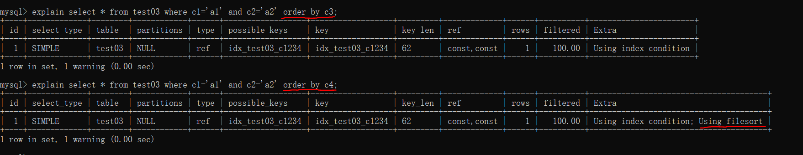
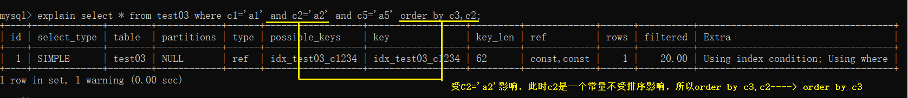
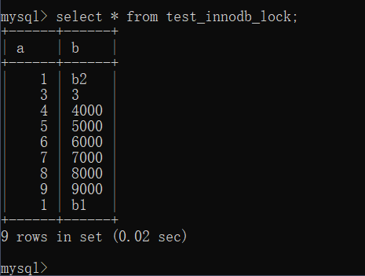
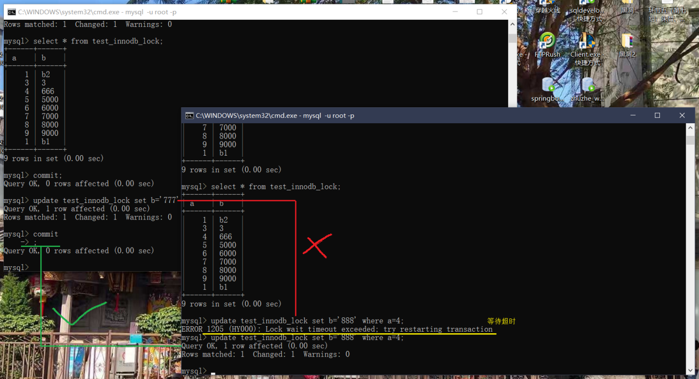

# MySQL高级

## SQL优化流程

① 观察系统运行1天的情况，快慢sql的情况

② 开启记录慢查询日志，设置判断慢查询阈值。（比如执行超过5秒）

③ 使用SQL执行计划Explain分析慢SQL

④ 使用show profile查看服务器的执行细节和生命周期

⑤ 根据情况找运维或DBA去调优MySQL数据库的参数

## MySQL结构


## MySQL存储引擎

使用命令`show engines;`


一共有9种，常用的两种介绍如下：

> **InnoDB存储引擎**

InnoDB是事务型数据库的首选引擎，支持事务安全表（ACID），支持**行锁**定和**外键**，上图也看到了，InnoDB是默认的MySQL引擎。InnoDB主要特性有：

1、InnoDB给MySQL提供了具有**提交、回滚和崩溃恢复**能力的事物安全（ACID兼容）存储引擎。InnoDB锁定在行级并且也在SELECT语句中提供一个类似Oracle的非锁定读。这些功能增加了多用户部署和性能。在SQL查询中，可以自由地将InnoDB类型的表和其他MySQL的表类型混合起来，甚至在同一个查询中也可以混合

2、InnoDB是为处理**巨大数据量**的最大性能设计。它的CPU效率可能是任何其他基于磁盘的关系型数据库引擎锁不能匹敌的

3、InnoDB存储引擎完全与MySQL服务器整合，InnoDB存储引擎为在主内存中缓存数据和索引而维持它自己的缓冲池。InnoDB将它的表和索引在一个逻辑表空间中，**表空间可以包含数个文件**（或原始磁盘文件）。这与MyISAM表不同，比如在MyISAM表中每个表被存放在分离的文件中。InnoDB表可以是任何尺寸，即使在文件尺寸被限制为2GB的操作系统上

4、InnoDB支持**外键**完整性约束，存储表中的数据时，每张表的存储都按主键顺序存放，如果没有显示在表定义时指定主键，InnoDB会为每一行生成一个6字节的ROWID，并以此作为主键

5、InnoDB被用在众多需要**高性能**的大型数据库站点上

InnoDB不创建目录，使用InnoDB时，MySQL将在MySQL数据目录下创建一个名为ibdata1的10MB大小的自动扩展数据文件，以及两个名为ib_logfile0和ib_logfile1的5MB大小的日志文件


> **MyISAM存储引擎**

MyISAM基于ISAM存储引擎，并对其进行扩展。它是在**Web、数据仓储**和其他应用环境下最常使用的存储引擎之一。MyISAM拥有较**高的插入、查询速度**，但不支持事物。MyISAM主要特性有：

1、大文件（达到63位文件长度）在支持**大文件**的文件系统和操作系统上被支持

2、当把删除和更新及插入操作混合使用的时候，动态尺寸的行产生更少碎片。这要通过合并相邻被删除的块，以及若下一个块被删除，就扩展到下一块自动完成

3、每个MyISAM表最大索引数是64，这可以通过重新编译来改变。每个索引最大的列数是16

4、最大的键长度是1000字节，这也可以通过编译来改变，对于键长度超过250字节的情况，一个超过1024字节的键将被用上

5、BLOB和TEXT列可以被索引

6、NULL被允许在索引的列中，这个值占每个键的0~1个字节

7、所有数字键值以高字节优先被存储以允许一个更高的索引压缩

8、每个MyISAM类型的表都有一个AUTO_INCREMENT的内部列，当INSERT和UPDATE操作的时候该列被更新，同时AUTO_INCREMENT列将被刷新。所以说，MyISAM类型表的AUTO_INCREMENT列更新比InnoDB类型的AUTO_INCREMENT更快

9、可以把数据文件和索引文件放在不同目录

10、每个字符列可以有不同的字符集

11、有VARCHAR的表可以固定或动态记录长度

12、VARCHAR和CHAR列可以多达64KB

使用MyISAM引擎创建数据库，将产生3个文件。文件的名字以表名字开始，扩展名之处文件类型：frm文件存储表定义、数据文件的扩展名为.MYD（MYData）、索引文件的扩展名时.MYI（MYIndex）


## SQL在数据库中的执行顺序

在编写时的顺序：查询字段→表操作→结果操作


在执行前查询优化的顺序：表操作→查询字段→结果操作


## MySQL的连接

> 内连接：左表和右表共有部分


```sql
select <select_list> from table a inner join table b on a.key=b.key;
```

> 左连接：左表的独有+左右两表的共有


```sql
select <select_list> from table a left join table b on a.key=b.key;
```

> 右连接：右表的独有+左右两表的共有


```sql
select <select_list> from table a right join table b on a.key=b.key;
```

> 左外连接：左表的独有


```sql
2.2.2.4select <select_list> from table a left join table b on a.key=b.key where b.key is null;
```

> 右外连接：右表的独有


```sql
select <select_list> from table a right join table b on a.key=b.key where a.key is null;
```

> 外连接：两个表的全部数据


```sql
select <select_list> from table a full outer join table b on a.key=b.key;
```

> 全外连接：两个表的独有部分


```sql
select <select_list> from table a full outer join table b on a.key=b.key where a.key is null or b.key is null;
```

## 建表SQL

```sql
create table `tbl_dept`(
`id` int not null auto_increment,
`deptName` varchar(30) default null,
`locAdd` varchar(40) default null,
primary key(`id`)
)engine=InnoDB default character set=utf8 collate=utf8_general_ci auto_increment=1;
```

## 索引简介

- 官方介绍索引是帮助MySQL高效获取数据的**数据结构**。更通俗的说，数据库索引好比是一本书前面的目录，能加快数据库的查询速度。
- 一般来说索引本身也很大，不可能全部存储在内存中，因此索引往往是存储在**磁盘**上的文件中的（可能存储在单独的索引文件中，也可能和数据一起存储在数据文件中）。
- 我们通常所说的索引，包括**聚集索引、覆盖索引、组合索引、前缀索引、唯一索引**等，没有特别说明，默认都是使用B+树结构组织（多路搜索树，并不一定是二叉的）的索引。


**优势**

* 可以提高数据检索的效率，降低数据库的IO成本，类似于书的目录。

* 通过索引列对数据进行排序，降低数据排序的成本，降低了CPU的消耗。（被索引的列会自动进行排序，包括【单列索引】和【组合索引】，只是组合索引的排序要复杂一些。如果按照索引列的顺序进行排序，对应order by语句来说，效率就会提高很多。）

**劣势**

* 索引会占据磁盘空间
* 索引虽然会提高查询效率，但是会降低更新表的效率。比如每次对表进行增删改操作，MySQL不仅要保存数据，还有保存或者更新对应的索引文件。


## 索引类型

* **主键索引**：索引列中的值必须是唯一的，不允许有空值。
* **普通索引**：MySQL中基本索引类型，没有什么限制，允许在定义索引的列中插入重复值和空值。
* **唯一索引**：索引列中的值必须是唯一的，但是允许为空值。
* **全文索引**：只能在文本类型**CHAR,VARCHAR,TEXT**类型字段上创建全文索引。**字段长度比较大时，如果创建普通索引，在进行like模糊查询时效率比较低**，这时可以创建全文索引。MyISAM和InnoDB中都可以使用全文索引。
* **空间索引**：MySQL在5.7之后的版本支持了空间索引，而且支持OpenGIS几何数据模型。MySQL在空间索引这方面遵循OpenGIS几何数据模型规则。
* **前缀索引**：在文本类型如**CHAR,VARCHAR,TEXT**类列上创建索引时，可以指定索引列的长度，但是数值类型不能指定。
* **其他**：Hash表，在Java中的HashMap，TreeMap就是Hash表结构，以键值对的方式存储数据。我们使用Hash表存储表数据Key可以存储索引列，Value可以存储行记录或者行磁盘地址。Hash表在等值查询时效率很高，时间复杂度为O(1)；但是不支持范围快速查找，范围查找时还是只能通过扫描全表方式。


## 索引创建SQL

直接创建：

```sql
create [unique] index indexName on mytable(columnname(length))
```

修改表方式创建：

```sql
alert mytable add [unique] index [indexName ] on (columnname(length))
```

删除索引：

```sql
drop index [indexName] on mytable;
```

查看表索引：

```sql
show index from table_name;
```

## 索引结构

### 二叉查找树


二叉树特点：每个节点最多有2个分叉，左子树和右子树数据顺序左小右大。

这个特点就是为了保证每次查找都可以这折半而减少IO次数、但在根节点选取不合适情况下，会有下面的情况。


此时就要在每次新增节点时，对树进行旋转操作，来构建平衡二叉树

### 平衡二叉树

平衡二叉查找树除了具备二叉树的特点，最主要的特征是树的左右两个子树的层级最多相差1。在插入删除数据时通过左旋/右旋操作保持二叉树的平衡，不会出现左子树很高、右子树很矮的情况。


但是使用平衡二叉树来查找数据，效率不高。

> 1. 时间复杂度和树高相关。树有多高就需要检索多少次，每个节点的读取，都对应一次磁盘 IO 操作。树的高度就等于每次查询数据时磁盘 IO 操作的次数。磁盘每次寻道时间为10ms，在表数据量大时，查询性能就会很差。（1百万的数据量，log2n约等于20次磁盘IO，时间20*10=0.2s）
> 2. 平衡二叉树不支持范围查询快速查找，范围查询时需要从根节点多次遍历，查询效率不高。

MySQL的数据是存储在磁盘文件中的，查询处理数据时，需要先把磁盘中的数据加载到内存中，磁盘IO 操作非常耗时，所以我们优化的重点就是尽量减少磁盘 IO 操作。

访问二叉树的每个节点就会发生一次IO，如果想要减少磁盘IO操作，就需要尽量降低树的高度。

因为在MySQL的InnoDB存储引擎一次IO会读取的一页（默认一页16K）的数据量，而二叉树一次IO有效数据量只有16字节，空间利用率极低。为了最大化利用一次IO空间，一个简单的想法是在每个节点存储多个元素，在每个节点尽可能多的存储数据。

### B数

将二叉树改造成了多叉树，通过增加树的叉数。这种数据结构我们称为**B树**，B树是一种**多叉平衡查找树**。


1. B树的节点中存储着多个元素，每个内节点有多个分叉。
2. 节点中的元素包含键值和数据，节点中的键值从大到小排列。也就是说，在所有的节点都储存数据。
3. 父节点当中的元素不会出现在子节点中。

相比二叉平衡查找树，在整个查找过程中，虽然数据的比较次数并没有明显减少，但是磁盘IO次数会大大减少。同时，由于我们的比较是在内存中进行的，比较的耗时可以忽略不计。B树的高度一般2至3层就能满足大部分的应用场景，所以使用B树构建索引可以很好的提升查询的效率。


1. B树不支持范围查询的快速查找，你想想这么一个情况如果我们想要查找10和35之间的数据，查找到15之后，需要回到根节点重新遍历查找，需要从根节点进行多次遍历，查询效率有待提高。
2. 如果data存储的是行记录，行的大小随着列数的增多，所占空间会变大。这时，一个页中可存储的数据量就会变少，树相应就会变高，磁盘IO次数就会变大。

### B+树

B+树，作为B树的升级版，在B树基础上，MySQL在B树的基础上继续改造，使用B+树构建索引。B+树和B树最主要的区别在于非叶子节点是否存储数据的问题


B+树的最**底层叶子节点包含了所有的索引项**。从图上可以看到，B+树在查找数据的时候，由于数据都存放在最底层的叶子节点上，所以每次查找都需要检索到叶子节点才能查询到数据。

所以在需要查询数据的情况下每次的磁盘的IO跟树高有直接的关系，但是从另一方面来说，由于数据都被放到了叶子节点，**放索引的磁盘块所存放的索引数量是会跟这增加的**，相对于B树来说，B+树的树高理论上情况下是比B树要矮的。

也存在索引覆盖查询的情况，在索引中数据满足了当前查询语句所需要的全部数据，此时只需要找到索引即可立刻返回，不需要检索到最底层的叶子节点。

**等值查询：**

> 假如我们查询值等于9的数据。查询路径磁盘块1->磁盘块2->磁盘块6。
>
> * 第一次磁盘IO：将磁盘块1加载到内存中，在内存中从头遍历比较，9<15，走左路，到磁盘寻址磁盘块2。
>
> * 第二次磁盘IO：将磁盘块2加载到内存中，在内存中从头遍历比较，7<9<12，到磁盘中寻址定位到磁盘块6。
>
> * 第三次磁盘IO：将磁盘块6加载到内存中，在内存中从头遍历比较，在第三个索引中找到9，取出data，如果data存储的行记录，取出data，查询结束。如果存储的是磁盘地址，还需要根据磁盘地址到磁盘中取出数据，查询终止。（这里需要区分的是在InnoDB中Data存储的为行数据，而MyIsam中存储的是磁盘地址。）
>
>   

**范围查询：**

> 假如我们想要查找9和26之间的数据。查找路径是磁盘块1->磁盘块2->磁盘块6->磁盘块7。
>
> * 首先查找值等于9的数据，将值等于9的数据缓存到结果集。这一步和前面等值查询流程一样，发生了三次磁盘IO。
>
> * 查找到15之后，底层的叶子节点是一个有序列表，我们从磁盘块6，键值9开始向后遍历筛选所有符合筛选条件的数据。
>
> * 第四次磁盘IO：根据磁盘6后继指针到磁盘中寻址定位到磁盘块7，将磁盘7加载到内存中，在内存中从头遍历比较，9<25<26，9<26<=26，将data缓存到结果集。
>
> 主键具备唯一性（后面不会有<=26的数据），不需再向后查找，查询终止。将结果集返回给用户。
>
> 

可以看到B+树可以保证等值和范围查询的快速查找，MySQL的索引就采用了B+树的数据结构。


### MyISAM的索引

新建一张user表，其中包含两个索引：

* id：主键索引
* age：普通索引

```sql
CREATE TABLE `user`
(
  `id`       int(11) NOT NULL AUTO_INCREMENT,
  `username` varchar(20) DEFAULT NULL,
  `age`      int(11)     DEFAULT NULL,
  PRIMARY KEY (`id`) USING BTREE,
  KEY `idx_age` (`age`) USING BTREE
) ENGINE = MyISAM
  AUTO_INCREMENT = 1
  DEFAULT CHARSET = utf8;
```

**MyISAM**的数据文件和索引文件是分开存储的。MyISAM使用B+树构建索引树时，叶子节点中存储的**键为索引列的值**，**数据为索引所在行的磁盘地址**。


表user的索引存储在索引文件`user.MYI`中，数据文件存储在数据文件 `user.MYD`中

MyISAM在查询时，会将索引节点缓存在MySQL缓存中，而数据缓存依赖于操作系统自身的缓存，所以并不是每次都是走的磁盘，这里只是为了分析索引的使用过程。


#### MyISAM主键索引在 等值查询 过程中的效果

SQL  : `select * from user where id = 28;`

1. 先从根节点开始检索，将根节点加载到内存，比较28<75，走左子树。（1次磁盘IO）
2. 将左子树节点加载到内存中，比较16<28<47，走中间到叶子节点。（1次磁盘IO）
3. 检索到叶节点，将节点加载到内存中遍历，比较节点中的**键值**16<28，18<28，28=28。查找到值等于28的索引项。（1次磁盘IO）
4. **从匹配索引项目键值中获取数据（磁盘地址）**，然后到数据文件user.MYD中获取到对应的整行记录。（1次磁盘IO）
5. 将记录返给客户端。

（3次索引检索+记录数据检索）


#### MyISAM主键索引在 范围查询 过程中的效果

SQL  : `select * from user where id between 28 and 47;`

* 先在主键树中从根节点开始检索，将根节点加载到内存，比较28<75，走左路。（1次磁盘IO）
* 将左子树节点加载到内存中，比较16<28<47，向下检索。（1次磁盘IO）
* 检索到叶节点，将节点加载到内存中遍历比较16<28，18<28，28=28<47。查找到值等于28的索引项。
* 根据磁盘地址从数据文件中获取行记录缓存到结果集中。（1次磁盘IO）
* 我们的查询语句时范围查找，需要向后遍历底层叶子链表，直至到达最后一个不满足筛选条件。向后遍历底层叶子链表，将下一个节点加载到内存中，遍历比较，28<47=47，根据磁盘地址从数据文件中获取行记录缓存到结果集中。（1次磁盘IO）
* 最后得到两条符合筛选条件，将查询结果集返给客户端。

（4次索引检索+记录数据检索）


**MyISAM辅助索引在 等值查询 过程中的效果**                                                                                                                                                                                                                                                                                                                                                                                                                                                                                                                                                                                                                                                                                                                                                                                                                                                                                                                                                                                                                                                                                                                                                       

在 MyISAM 中,辅助索引和主键索引的结构是一样的，**没有任何区别**，叶子节点的数据存储的都是行记录的磁盘地址。只是**主键索引的键值是唯一的，而辅助索引的键值可以重复**。

查询数据时，由于辅助索引的键值不唯一，可能存在多个拥有相同的记录，所以即使是**等值查询**，也需要**按照范围查询的方式**在辅助索引树中检索数据。


### InnoDB索引

新建一张user_innodb表，其中包含两个索引：

* id：聚簇索引（主键索引）
* age：辅助索引

```sql
CREATE TABLE `user_innodb`
(
  `id`       int(11) NOT NULL AUTO_INCREMENT,
  `username` varchar(20) DEFAULT NULL,
  `age`      int(11)     DEFAULT NULL,
  PRIMARY KEY (`id`) USING BTREE,
  KEY `idx_age` (`age`) USING BTREE
) ENGINE = InnoDB;
```

**聚簇索引**

每个InnoDB表都有一个聚簇索引 ，聚簇索引使用B+树构建，叶子节点存储的数据是整行记录。一般情况下，**聚簇索引等同于主键索引**，当一个表没有创建主键索引时，InnoDB会自动创建一个**ROWID字段**来构建聚簇索引。InnoDB创建聚簇索引的具体规则如下：

```
* 在表上定义主键PRIMARY KEY，InnoDB将主键索引用作聚簇索引。
* 如果表没有定义主键，InnoDB会选择第一个不为NULL的唯一索引列用作聚簇索引。
* 如果以上两个都没有，InnoDB 会使用一个6字节长整型的隐式字段ROWID字段。用来构建聚簇索引，该字段会在插入新行时自动递增。
```

除聚簇索引之外的所有索引都称为**辅助索引**。在中InnoDB，辅助索引中的叶子节点存储的数据是该行的主键值都。在检索时，InnoDB使用此主键值在聚簇索引中搜索行记录。

InnoDB的数据和索引存储在一个文件`t_user_innodb.ibd`中。InnoDB的数据组织方式，是聚簇索引。

主键索引的叶子节点会存储数据行，辅助索引只会存储主键值。


#### InnoDB主键索引在 等值查询 过程中的效果

* 先在主键树中从根节点开始检索，将根节点加载到内存，比较28<75，走左路。（1次磁盘IO）

* 将左子树节点加载到内存中，比较16<28<47，向下检索。（1次磁盘IO）

* 检索到叶节点，将节点加载到内存中遍历，比较16<28，18<28，28=28。查找到值等于28的索引项，直接可以获取整行数据。将改记录返回给客户端。（1次磁盘IO）

（3次索引检索）


#### InnoDB辅助索引在 等值查询 过程中的效果

SQL : `select * from t_user_innodb where age=19;`

除聚簇索引之外的所有索引都称为辅助索引，InnoDB的辅助索引只会存储主键值而非磁盘地址。


底层叶子节点的按照（age，id）的顺序排序，先按照age列从小到大排序，age列相同时按照id列从小到大排序。

使用辅助索引需要检索两遍索引：首先检索辅助索引获得主键，然后使用主键到主索引中检索获得记录。

辅助（3次索引检索）+主键（3次索引检索）


 根据在辅助索引树中获取的主键id，到主键索引树检索数据的过程称为回表查询。


#### InnoDB组合索引

新建一个表`abc_innodb`，其中包含主键索引id。和组合索引a,b,c

```sql
CREATE TABLE `abc_innodb`
(
  `id` int(11) NOT NULL AUTO_INCREMENT,
  `a`  int(11)     DEFAULT NULL,
  `b`  int(11)     DEFAULT NULL,
  `c`  varchar(10) DEFAULT NULL,
  `d`  varchar(10) DEFAULT NULL,
  PRIMARY KEY (`id`) USING BTREE,
  KEY `idx_abc` (`a`, `b`, `c`)
) ENGINE = InnoDB;
```

组合索引的数据结构：


#### InnoDB组合索引在 等值查询 过程中的效果

SQL : `select * from abc_innodb where a = 13 and b = 16 and c = 4;`


最左匹配原则：最左前缀匹配原则和联合索引的索引存储结构和检索方式是有关系的。

在组合索引树中：

* 最底层的叶子节点按照第一列a列从左到右递增排列，但是b列和c列是无序的
* b列只有在a列值相等的情况下小范围内递增有序
* 而c列只能在a，b两列相等的情况下小范围内递增有序。


上面的查询，B+树会先比较a列来确定下一步应该搜索的方向，往左还是往右。**如果a列相同再比较b列**。但是如果查询条件没有a列，B+树就不知道第一步应该从哪个节点查起。

可以说创建的idx_abc(a,b,c)索引，相当于创建了(a)、（a,b）（a,b,c）三个索引。

```
组合索引的最左前缀匹配原则：使用组合索引查询时，mysql会一直向右匹配直至遇到范围查询(>、<、between、like)就停止匹配。
```


#### InnoDB覆盖索引

覆盖索引并不是说是索引结构，覆盖索引是一种很常用的优化手段。因为在使用辅助索引的时候，我们只可以拿到主键值，相当于获取数据还需要再根据主键查询主键索引再获取到数据。但是试想下这么一种情况，在上面abc_innodb表中的组合索引查询时，**如果我只需要abc字段的，那是不是意味着我们查询到组合索引的叶子节点就可以直接返回了，而不需要回表。**这种情况就是覆盖索引。

查询全部列，则要（3次组合索引检索+1次回表（3次聚簇索引检索））


查询对应有索引的列，则要（3次组合索引检索）


#### InnoDB执行语句优化

在InnoDB的存储引擎中，使用辅助索引查询的时候，因为辅助索引叶子节点保存的数据不是当前记录的数据而是当前记录的主键索引，索引如果需要获取当前记录完整数据就必然需要根据主键值从主键索引继续查询。这个过程我们成位回表。想想回表必然是会消耗性能影响性能。那如何避免呢？


**使用覆盖索引的优化策略减少回表**

使用索引覆盖，举个例子：现有User表（id(PK),name(key),sex,address,hobby...）

如果在一个场景下，`select id,name,sex from user where name ='zhangsan';`这个语句在业务上频繁使用到，而user表的其他字段使用频率远低于它，在这种情况下，如果我们在建立 name 字段的索引的时候，不是使用单一索引，而是使用**联合索引****（name，sex）**这样的话再执行这个查询语句是不是根据辅助索引查询到的结果就可以获取当前语句的完整数据。

联合索引，在建立索引的时候，**尽量在多个单列索引上判断下是否可以使用联合索引**。联合索引的使用不仅可以节省空间，还可以更容易的使用到索引覆盖。

联合索引的创建原则，在创建联合索引的时候因该把频繁使用的列、区分度高的列放在前面，频繁使用代表索引利用率高，区分度高代表筛选粒度大，这些都是在索引创建的需要考虑到的优化场景，也可以在常需要作为查询返回的字段上增加到联合索引中，如果在联合索引上增加一个字段而使用到了覆盖索引，那我建议这种情况下使用联合索引。


**联合索引的使用**

1. 考虑当前是否已经存在多个可以合并的单列索引，如果有，那么将当前多个单列索引创建为一个联合索引。
2. 当前索引存在频繁使用作为返回字段的列，这个时候就可以考虑当前列是否可以加入到当前已经存在索引上，使其查询语句可以使用到覆盖索引。


## 需要建立索引的情况

* 主键自动建立唯一索引
* 频繁作为查询条件的字段应该创建索引
* 查询中与其他表关联的字段，外键关系建立索引
* 频繁更新的字段不适合创建索引，因为每次更新不单单是更新了记录还会更新索引
* where条件里用不到的字段不创建索引
* 单键/组合索引的选择问题，who?(在高并发下倾向创建组合索引)
* 查询中排序的字段，排序字段若通过索引取访问将大大提高排序速度
* 查询中统计或者分组字段（分组的前提的必排序）


## 执行计划Explain

> **MySQL Query Optimizer 查询优化器**
>
> MySQL中有专门负责优化select语句的优化器模块，主要功能：通过计算分析系统中收集到的统计信息，为客户请求的query提供他认为最优的执行计划（他认为最优的查询方式）

Explain（执行计划）：使用explain关键字可以模拟优化器执行SQL查询语句，从而知道MySQL是如何处理你的SQL语句的。**分析你的查询语句或是表结构的性能瓶颈**。

官方文档：https://dev.mysql.com/doc/refman/8.0/en/execution-plan-information.html


测试表：

```sql
create table `tbl_dept`(
`id` int not null auto_increment,
`deptName` varchar(30) default null,
`locAdd` varchar(40) default null,
Primary key(`id`)
)engine=InnoDB default character set=utf8 collate=utf8_general_ci auto_increment=1;

create table `tbl_emp`(
`id` int(11) not null auto_increment,
`name` varchar(20) default null,
`deptId` int(11) default null,
Primary key(`id`),
key `fk_dept_id`(`deptId`)
)engine=InnoDB default character set=utf8 collate=utf8_general_ci auto_increment=1;

insert into tbl_dept(deptName,locAdd) values('RD',11);
insert into tbl_dept(deptName,locAdd) values('HR',12);
insert into tbl_dept(deptName,locAdd) values('MK',13);
insert into tbl_dept(deptName,locAdd) values('MIS',14);
insert into tbl_dept(deptName,locAdd) values('FD',15);

insert into tbl_emp(name,deptId) values('z3',1);
insert into tbl_emp(name,deptId) values('z4',1);
insert into tbl_emp(name,deptId) values('z5',1);
insert into tbl_emp(name,deptId) values('w5',2);
insert into tbl_emp(name,deptId) values('w6',2);
insert into tbl_emp(name,deptId) values('s7',3);
insert into tbl_emp(name,deptId) values('s8',4);
insert into tbl_emp(name,deptId) values('s9',51);
```


字段解释：

* **id**：表的读取顺序
* **select_type**：数据读取操作的类型
* **possible_key**：哪些索引可以使用
* **keys**：哪些索引实际使用
* **ref**：表之间的引用
* **rows**：表有多少行被优化器查询

使用方式：

```sql
explain SQL语句;
explain select * from tbl_emp;
```


### id

```
select查询的序列号，包含一组数字，表示查询中执行select子句或操作表的顺序
```

* **id相同，执行顺序由上置下**

  t1,t2,t3--->执行优先级同级别，按加载表顺序从上到下t1t3,t2

  

* **id不同，子查询id会递增，id值越大执行优先级越高**

  t2(t1(t3))--->优先级不同，按照最括号内先执行t3,t1,t2

  

* **id既有相同又有不同，先按序号后按先后**

  s1(t3),t2--->括号的最高优先级，没括号按照加载表顺序从上到下t3,s1,t2

  


### select_type

```
查询的类型，主要是用于区别普通查询、联合查询、子查询等复杂查询
```


* SIMPLE

  

* PRIMARY与SUBQUERY

  

* DERIVED

  

* UNION RESULT 与UNION

  

### table

```
显示这一行的数据是关于哪张表的
```

### type

```
访问类型是较为重要的一个指标，结果值从最好到最坏依次是：
system > const > eq_ref > ref > fulltext > ref_or_null > index_merge > unique_subquery > index_subquery > range > index > ALL

需要记忆的 
system > const > eq_ref > ref > range > index > ALL
```

* **system**：表只有一行记录（等于系统表），是const类型中的特例，平时不会出现，可以忽略。
* **const**：表示通过索引一次就找到了，const用于比较primary key或unique索引，因为只匹配一行数据，所以很快。如将主键置于where列表中，MySQL就能将该查询转换为一个常量。`where id=1`
* **eq_ref**：唯一性索引扫描，对于每个索引键，表中**只有一条记录**与之匹配。
* **ref**：非唯一性索引扫描，**返回匹配**某个单独值的**所有行**。本质上也是一种索引访问，它返回所有匹配某个单独值的行，然而，它可能会找到做个符合条件的行，所以他应该属于查找和扫描的混合体。
* **range**：只检索给定范围的行，使用一个索引来选择行。Key列显示使用了哪个索引。一般就在你的where语句中出现了**between、<、>、in**等的查询。这种范围扫描索引扫描比全表扫描要号好，因为它只需要开始于索引的某一点，而结束于另一点，不用全部索引。
* **index**：index与ALL的区别为index类型**只遍历索引树**。这通常比ALL快，因为索引文件通常比数据文件小。
* **ALL**：将遍历全表找到匹配的行。

### possible_key

```
显示可能应用在这张表中的索引，一个或多个。查询涉及到的字段上若存在索引，则该索引将被列出，但不一定被查询实际使用。
如果为null，则表示没有使用索引。
```

### Keys

```
实际使用的索引。如果为null，则没有使用索引。
查询中若使用到了覆盖索引，则该索引仅出现在keys列表中。
```

### key_len

```
表示索引中使用的字节数，可通过该列计算查询中使用的索引的长度。
在不损失精确性的情况下，长度越短越好。
为索引字段的最大可能长度，并非实际使用长度，即key_len是根据表定义计算而得，不是通过表内检索出的。
```


### ref

```
显示索引的使用情况，有可能是常数，也有可能是其他表的列。
```


其中 【shared.t2.col1】 为 【数据库.表.列】

### rows

```
根据表统计信息及索引选用情况，大致估算出找到所需的记录所所需花费读取的行数
```


### Extra

```
包含不适合在其他列中显示但十分重要的额外信息
```

* **Using filesort**：说明MySQL会对数据使用一个外部的索引排序，而不是按照表内的索引顺序进行读取。MySQL中无法利用索引完成的排序操作称为“文件排序”，处理优先度高。

  

* **Using temporary**：使用了临时表保存中间结果，MySQL在对查询结果排序时使用临时表。常见于排序order by和分组查询group by，处理优先度高。

  

* **Using index**：表示相应的select操作中使用了覆盖索引（Covering index），避免访问了表的数据行，效率不错！如果同时出现using where,表明索引被用来执行索引值的查找。如果没有同时出现using where，表明索引用来读取数据而非执行查找动作。

  

* **Using where**：表明使用了where过滤

* **Using join buffer**：使用了连接缓存

* **Impossible where**：where子句的值总是false，不能用来获取任何元组

  

* **select tables optimized away**：在没有groupby子句的情况下，基于索引优化min/max操作或者对于MyISAM存储引擎优化count(*)操作，不必等到执行阶段再进行计算，查询执行计划生成的阶段即完成优化。

* **distinct**：优化distinct操作，在找到第一匹配的元组后即停止找同样值的动作。

### 测试例子

#### 问题1：UNION操作的SQL的执行顺序是怎样的


结果为：4->3->2->1->NULL


#### 问题2：多条件查询SQL如何优化？

```sql
create table if not exists `article`(
    `id` int(10) unsigned not null primary key auto_increment,
    `author_id` int(10) unsigned not null,
    `category_id` int(10) unsigned not null,
    `views` int(10) unsigned not null,
    `comments` int(10) unsigned not null,
    `title` varbinary(255) not null,
    `content` text not null
);

insert into `article`(`author_id`,`category_id`,`views`,`comments`,`title`,`content`) values
(1,1,1,1,'1','1'),
(2,2,2,2,'2','2'),
(3,3,3,3,'3','3');

select * from article where category_id=1 and comments>1 order by views desc limit 1;
```

全表扫描+没有使用索引+使用了默认的外部索引


给表建联合索引：

```sql
alter table `article` add index idx_article_ccv(`category_id`,`comments`,`views`);
或
create index idx_article_ccv on article(category_id,comments,views);
```

解决了ALL全表扫描问题。


但从Extra中可以看到，最终还是使用到了文件检索。因为联合索引在遇到范围查询时导致失效。

```
因为按照BTree索引的工作原理：先排序category_id，遇到相同的category_id则再排序comments，如果遇到相同的comments则再排序views。当comments字段在联合索引里处于中间位置时，因为comments>1条件是一个范围值(所谓range)，MySQL无法利用索引再对后面的views部分进行检索，即range类型查询字段后面的索引无效。
```


所以联合索引并不合适，进行删除（在为表建索引时都提倡先建联合索引）

```sql
drop index idx_article_ccv on article;
```

前面在介绍InnoDB信息时也有提到过，联合索引会在遇到范围查询条件时结束，所以这里不能为comments建立索引，把另外两个字段拿来做联合索引

```sql
alter table `article` add index idx_article_ccv(`category_id`,`views`);
```

再次查看执行计划可以得知，两个字段的索引起效了。


#### 问题3：表连接操作时，给哪个表建索引好？

测试表：

```sql
drop table `class`;
create table if not exists `class`(
    `id` int(10) unsigned not null auto_increment,
    `card` int(10) unsigned not null,
    primary key(`id`)
);
drop table `book`;
create table if not exists `book`(
    `bookid` int(10) unsigned not null auto_increment,
    `card` int(10) unsigned not null,
    primary key(`bookid`)
);

insert into class(card) values(floor(1+(rand()*20)));
insert into class(card) values(floor(1+(rand()*20)));
insert into class(card) values(floor(1+(rand()*20)));
insert into class(card) values(floor(1+(rand()*20)));
insert into class(card) values(floor(1+(rand()*20)));
insert into class(card) values(floor(1+(rand()*20)));
insert into class(card) values(floor(1+(rand()*20)));
insert into class(card) values(floor(1+(rand()*20)));
insert into class(card) values(floor(1+(rand()*20)));
insert into class(card) values(floor(1+(rand()*20)));


insert into book(card) values(floor(1+(rand()*20)));
insert into book(card) values(floor(1+(rand()*20)));
insert into book(card) values(floor(1+(rand()*20)));
insert into book(card) values(floor(1+(rand()*20)));
insert into book(card) values(floor(1+(rand()*20)));
insert into book(card) values(floor(1+(rand()*20)));
insert into book(card) values(floor(1+(rand()*20)));
insert into book(card) values(floor(1+(rand()*20)));
insert into book(card) values(floor(1+(rand()*20)));
insert into book(card) values(floor(1+(rand()*20)));
```


需要优化的SQL：

```sql
select * from class left join book on class.card=book.card;
```


在不清楚给那个表优化时可以全试一遍。

给右表加索引

```sql
alter table `book` add index Y(`card`);
```

效果提升：


给左表加索引：

```sql
drop index Y on book;
alter table `class` add index Y(`card`);
```

效果提升：但右表的问题严重


```
这是由左连接特性决定的，left join 条件用于确定如何从右表搜索行，左边一定都有，所以右边是我们的关键点，一定需要建立索引。
```

结果就是：给左连接的右表做索引


#### 问题4：三表连接时给哪些表建索引好

测试SQL：前面的2张表＋当前表

```sql
create table if not exists `phone`(
    `phoneid` int(10) unsigned not null auto_increment,
    `card` int(10) unsigned not null,
    primary key(`phoneid`)
)engine=InnoDB;

insert into phone(`card`) values(floor(1+(rand()*20)));
insert into phone(`card`) values(floor(1+(rand()*20)));
insert into phone(`card`) values(floor(1+(rand()*20)));
insert into phone(`card`) values(floor(1+(rand()*20)));
insert into phone(`card`) values(floor(1+(rand()*20)));
insert into phone(`card`) values(floor(1+(rand()*20)));
insert into phone(`card`) values(floor(1+(rand()*20)));
insert into phone(`card`) values(floor(1+(rand()*20)));
insert into phone(`card`) values(floor(1+(rand()*20)));
```

需要优化的SQL：

```sql
-- 删掉前面的表索引，用来测试
drop index Y on class;
explain select * from phone left join class on phone.card=class.card left join book on phone.card=book.card;
```


phone(左表)-->class(右表)-->book(右表) ： 按照前面的规则，给两张右表加索引

```sql
alter table `class` add index X(`card`);
alter table `book` add index Z(`card`);
```

测试效果提升：


这里可以看到，右表两张表都明显提高了效率。type达到了ref级别，并且总搜索条数由9+10+10--->9+1+1

**总结**：

* 尽可能减少join语句中的嵌套循环(NestedLoop)的循环总次数：“永远用最小结果驱动大的结果集”【前面的sql还可以优化，就算使用class来左连接。因为class是小表，book和phone是大表，使用小表class来驱动book、phone大表】;

* 优先优化嵌套循环(NestedLoop)的内层循环【结合前面的id字段的执行优先级，最括号内的最先执行】。


#### 问题5：如何处理SQL索引失效

有一个已经建好索引的表：

```sql
create table `staffs`(
    `id` int primary key auto_increment,
    `name` varchar(24) not null default '' comment '姓名',
    `age` int not null default 0 comment '年龄',
    `pos` varchar(20) not null default '' comment '职位',
    `add_time` timestamp not null default current_timestamp comment '入职时间'
)charset utf8 comment '员工记录表';

insert into staffs(name,age,pos,add_time) values('z3',22,'manager',now());
insert into staffs(name,age,pos,add_time) values('July',23,'dev',now());
insert into staffs(name,age,pos,add_time) values('2000',23,'dev',now());

alter table staffs add index idx_staffs_nameAgePos(name,age,pos);
```

使用联合索引1个：索引长度74

```sql
explain select * from staffs where name = 'July';
```


使用联合索引2个：78

```sql
explain select * from staffs where name = 'July' and age = 23;
```


使用联合索引3个：140

```sql
explain select * from staffs where name = 'July' and age = 23 and pos = 'dev';
```


使用联合索引最前1个和最后1个：74，有使用到索引，但只使用一个。ref=const

```sql
explain select * from staffs where name = 'July' and age = 23 and pos = 'dev';
```


使用联合索引后两个：索引失效，进行全表扫描

```sql
explain select * from staffs where age = 23 and pos = 'dev';
```


使用联合索引中间1个：索引失效，进行全表扫描

```sql
explain select * from staffs where age = 23;
```


使用联合索引最后1个：索引失效，进行全表扫描

```sql
explain select * from staffs where pos = 'dev';
```


使用联合索引1个并进行计算：索引失效，进行全表扫描

```sql
explain select * from staffs where left(name,4) = 'July';
```


使用联合索引3个并在中间那个进行范围查询：中间索引失效

```sql
explain select * from staffs where name='July' and age>22 and pos='dev';
```


使用联合索引的覆盖索引效果：最高执行效率

```sql
explain select name,age,pos from staffs where name='July' and age=23 and pos='dev';
```


使用联合索引的覆盖索引效果2：前面执行all的sql，在这里也得到提升（select cloum 比 select * 就是效率高）

```sql
explain select name,age,pos from staffs where name='July' and age>25 and pos='dev';
explain select name,age,pos from staffs where name='July' and pos='dev';
explain select name from staffs where name='July' and pos='dev';
```


使用联合索引1个并使用不等于号：索引失效，进行全表扫描

```sql
explain select * from staffs where name!='July';
explain select * from staffs where name<>'July';
```


使用联合索引1个并进行空判断：索引失效，进行全表扫描

```sql
explain select * from staffs where name is null;
explain select * from staffs where name is not null;
```


like以通配符开头（‘%ab...’）MySQL索引失效会变成全表扫描的操作

```sql
explain select * from staffs where name like '%July%';
explain select * from staffs where name like '%July';
explain select * from staffs where name like 'July%'; -- 加前面不行，加后面可以
```


**最佳左前缀法则**

在前面InnoDB索引介绍中，有介绍过由联合索引构建的二叉查找树，因为不恰当使用则会导致无法使用联合索引树。

如果索引了多列，要遵守最左前缀法则。**指的是查询从索引的最左前列开始并且不跳过索引中的列。**

**违背最佳左前缀法制的连续，从使用长度(代价)中可以看出。实际只使用到了name= 'July' 这一个索引。中间断了导致后面的pos = 'dev'没有用到**


#### 问题6：处理like条件导致索引失效

测试表

```sql
create table `tbl_user`(
    `id` int(11) not null auto_increment,
    `name` varchar(20) default null,
    `age` int(11) default null,
    `email` varchar(20) default null,
    primary key(`id`)
)engine=InnoDB auto_increment=1 default charset=utf8;

insert into tbl_user(name,age,email) values('1aa1','21','b@163.com');
insert into tbl_user(name,age,email) values('2aa2','222','a@163.com');
insert into tbl_user(name,age,email) values('3aa3','265','c@163.com');
insert into tbl_user(name,age,email) values('4aa4','21','d@163.com');
```

存在一定要使用'%aa%'的方式


使用覆盖索引解决

```sql
-- 创建联合索引
create index idx_user_nameAge on tbl_user(name,age);
```

测试SQL：

```sql
explain select * from tbl_user where name like '%aa%';
explain select id from tbl_user where name like '%aa%';
explain select name from tbl_user where name like '%aa%';
explain select age from tbl_user where name like '%aa%';
explain select email from tbl_user where name like '%aa%';
explain select name,age from tbl_user where name like '%aa%';
explain select id,name,age,email from tbl_user where name like '%aa%';
```


#### 问题7：其他情况

> 隐式类型转换：varchar类型不能不加单引号：在使用数字的查询值时，如果字段是varchar类型，MySQL在底层内部隐式做了类型转换，这个过程违背了索引使用的2.5.2.3 不在索引列上做任何操作（计算、函数、（自动or手动）类型转换）的规则。导致查询效率变为全表扫描

```sql
insert into tbl_user(name,age,email) values('2000','20','b@163.com');

explain select * from tbl_user where name='2000';
explain select * from tbl_user where name=2000;
```


> or连接导致索引失效

```sql
explain select * from staffs where name='July' or name='z3';
```


| ***\*假设index(a,b,c)\****                |                                                              |
| ----------------------------------------- | ------------------------------------------------------------ |
| ***\*Where 语句\****                      | ***\*索引是否被使用\****                                     |
| where a = 3                               | Y，使用到a                                                   |
| where a = 3 and b = 5                     | Y，使用到a，b                                                |
| where a = 3 and b = 5 and c = 4           | Y，使用到a,b,c                                               |
| where b = 3                               | N                                                            |
| where b = 3 and c = 4                     | N                                                            |
| where c = 4                               | N                                                            |
| where a = 3 and c = 5                     | 使用到a，但是c不可以，b中间断了                              |
| where a = 3 and b > 4 and c = 5           | 使用到a和b，c不能用在范围之后,b断了                          |
| where a = 3 and b like ‘kk%’ and c = 4    | Y,使用到a,b,c（like是常量值在前，索引有效，后续c的索引正常加载） |
| where a = 3 and b like ‘%kk’ and c = 4    | Y,只用到a（like是%在前，所以索引失效变为全表扫描）           |
| where a = 3 and b like ‘%like%’ and c = 4 | Y,只用到a（like是%在前，所以索引失效变为全表扫描）           |
| where a = 3 and b like ‘k%kk%’and c = 4   | Y,使用到a,b,c（like是常量值在前，索引有效，后续c的索引正常加载） |


### SQL优化面试题

测试表

```sql
create table test03(
    id int primary key not null auto_increment,
    c1 char(10),
    c2 char(10),
    c3 char(10),
    c4 char(10),
    c5 char(10)
);
-- 插入数据
insert into test03(c1,c2,c3,c4,c5) values('a1','a2','a3','a4','a5');
insert into test03(c1,c2,c3,c4,c5) values('b1','b2','b3','b4','b5');
insert into test03(c1,c2,c3,c4,c5) values('c1','c2','ac3','c4','c5');
insert into test03(c1,c2,c3,c4,c5) values('d1','d2','d3','d4','d5');
insert into test03(c1,c2,c3,c4,c5) values('e1','e2','e3','e4','e5');
-- 查询数据
select * from test03;
-- 插入复合索引
create index idx_test03_c1234 on test03(c1,c2,c3,c4);
-- 查看表索引
show index from test03;
```

分析SQL：

```sql
explain select * from test03 where c1='a1' and c2 = 'a2' and c3 = 'a3' and c4 = 'a4';
```


```sql
-- 全值匹配，顺序改变
explain select * from test03 where c1='a1' and c2 = 'a2' and c4 = 'a4' and c3 = 'a3';
explain select * from test03 where c4='a4' and c3 = 'a3' and c2 = 'a2' and c1 = 'a1';
```


```sql
-- 范围查询
explain select * from test03 where c1='a1' and c2 = 'a2' and c3 > 'a3' and c4 = 'a4';
```


```sql
explain select * from test03 where c1='a1' and c2 = 'a2' and c4 > 'a4' and c3 = 'a3';
```


```sql
-- order by字段将索引用于排序不用于查找，有使用到但不显示在ref列中
explain select * from test03 where c1='a1' and c2='a2' and c4 = 'a4' order by c3;
```


```sql
-- 和范围的影响一样，当使用排序后会导致后续的索引失效。有c4和没c4都没差别
explain select * from test03 where c1='a1' and c2='a2' order by c3;
```


```sql
-- order by的索引字段使用也必须遵守最佳左前缀法制。c4前面没有使用c3所以导致c4索引失效，变为文件排序
explain select * from test03 where c1='a1' and c2='a2' order by c4;
```



```sql
-- 多值order by
explain select * from test03 where c1='a1' and c5='a5' order by c2,c3;
```


```sql
-- 多值order by+不按顺序使用索引=出现filesort
explain select * from test03 where c1='a1' and c5='a5' order by c3,c2;
```


```sql
-- 多值order by+一个字段既检索又排序
explain select * from test03 where c1='a1' and c2='a2'order by c2,c3;
```


```sql
-- 多值order by+一个字段即检索又排序+一个字段不按顺序检索索引
explain select * from test03 where c1='a1' and c2='a2' and c5='a5' order by c2,c3;
```


```sql
-- 多值order by不按顺序 + 一个字段即检索又排序 + 一个字段不按顺序检索索引
explain select * from test03 where c1='a1' and c2='a2' and c5='a5' order by c3,c2;
```



```sql
-- group by
explain select * from test03 where c1='a1' and c4='a4' group by c2,c3\G
explain select * from test03 where c1='a1' and c4='a4' group by c3,c2\G
```


### 结论

* 定值、范围还是排序，一般order by是给个范围

* group by基本上都需要进行排序，顺序不对会有临时表产生(filesort结果的临时存储)。

* 对于单键索引，尽量选择针对当前query过滤性更好的索引

* 在选择组合索引的时候，当前query中过滤性最好的字段在索引字段顺序中，位置越靠前越好。

* 在选择组合索引的时候，尽量选择可以能够包含当前query的where字句中更多字段的索引

* 尽可能通过分析统计信息和调整query的写法来达到选择合适索引的目的

* 永远小表驱动大表【表连接时的优化原则：小的数据集驱动大的数据集】

* 当A表数据集 >  B表数据集

  用in优于exist【先查B结果集，再用于A】

  ```sql
  select * from A where id in (select id from B);
  ```

* 当A表数据集 <  B表数据集

  用exists优于in【查A的每个结果再用于B】

  ```sql
  select * from A where exists (select 1 from B where B.id = A.id);
  ```


> exists语法介绍：select ... from table where exists(subquery);
>
> 该语法可以理解为：将主查询的数据，放到子查询中做查询条件验证，根据验证结果（true或false）来决定主查询的数据结果是否予以保留。
>
> 提示：
>
> 1. exists(subquery)只返回true或false，因此子查询中的select * 也可以是select 1 或select ‘X’，官方的说法实际执行时会忽略select清单，因此没有区别。
>
> 2. exists(subquery)子查询的实际执行过程可能经过了优化而不是我们理解上的逐条对比，如果担忧效率问题，可进行实际检验以确定是否有效率问题。
>
> 3. exists(subquery)子查询往往也可以用条件表达式、其他子查询或者join来替代，何种最优需要具体问题具体分析。


* Order by 子句，尽量使用index方式排序，避免使用filesort方式排序

  MySQL支持两种方式的排序，filesort和index（index的效率高）,它指MySQL扫描索引本身完成排序。file sort方式效率较低

  order by满足两种情况，会使用index方式排序：

  * order by语句使用索引最左前列
  * 使用where子句与order by子句条件组合满足索引最左前列

* 尽可能再索引列上完成排序操作，遵照索引建的最佳左前缀

* 如果不在索引列上，filesort有两种算法

  * 双路排序：-MySQL4.1使用双路排序，字面意思就是**两次扫描磁盘**（耗时 ），最终得到数据。读取行指针和order by列，对他们进行**排序**，然后扫描已经排序好的列表，按照列表中的值重新从列表中**读取**对应的数据输出。【从磁盘读取排序字段，再buffer进行排序，再从磁盘取其他字段】取一批数据，要对磁盘进行了两次扫描，从所周知，I\O是很耗时的，所以再MySQL4.1之后，出现了第二种改进的算法，就是单路排序。

  * 单路排序：从磁盘**读取查询需要的所有列**，按照order by列在buffer对它们进行排序，然后扫描**排序后的列表进行输出**，它的效率更快一些，避免了第二次读取数据。并且把随机io变成了顺序io，但是它会使用更多的空间，因为它把每一行都保存再内存中了。

  * 单路排序存在的问题：再sort_buffer中，方法B比方法A要多占用很多空间，因为方法B是把所有字段都取出，所以有可能取出的数据总大小超出了sort_buffer的容量，导致每次只能取sort_buffer容量大小的数据，进行排序（创建tmp文件，多路合并），排完再取取sort_buffer容量大小，再排......从而多次I/O。【本来想省一次I/O操作，反而导致了大量的I/O操作，反而得不偿失。】

  * 单路排序优化：

    ```
    优化策略
    * order by时select * 是一个大忌只query需要的字段，这点非常重要。在这里的影响是：
    	当query的字段大小总和小于max_length_for_sort_data而且排序字段不是text|blob类型时，会用改进后的算法——单路排序，否则用老算法——多路排序。
    	两种算法的数据都有可能超出sort_buffer的容量，超出之后，会创建tmp文件进行合并并排序，导致多次I/O，但是用单路排序算法的风险会更大一些，所以要提高sort_buffer_size。
    
    * 尝试提高sort_buffer_size：不管用哪种算法，提高这个参数都会提高效率，当然，要根据系统的能力取提高，因为这个参数是针对每个进程的。
    
    * 尝试提高max_length_for_sort_data：提高这个参数，会增加用改进算法的概率。但是如果设置的太高，数据总容量超	  出sort_buffer_size的概率就增大，明显症状是高的磁盘I/O获得和低的出来器使用率。
    
    * 增大sort_buffer_size参数的设置
    
    * 增大max_length_for_sort_data参数的设置
    ```

    

* 控制好where和order by。为排序order by使用索引

  * MySQL两种排序方式：文件排序或扫描有序索引排序

  * MySQL能为排序与查询使用相同的索引

    ```sql
    -- key a_b_c(a,b,c)
    -- Order by 能使用索引最左前端
    order by a
    Order by a,b
    Order by a,b,c
    Order by a desc, b desc, c desc
    -- 如果where使用索引的最左端定义为常量，则order by能使用索引
    Where a = const order by b,c
    Where a = const and b=const order by c
    Where a = const order by b,c
    Where a = const and b > const order by b,c
    -- 不能使用索引进行排序的情况
    Order by a asc , b desc, c desc /*排序不一致*/
    Where g = const order by b,c/*丢失a索引*/
    Where a = const order by c /*丢失b索引*/
    Where a = const order by a,d/*d不是索引的一部分*/
    Where a in (...) order by b,c/*对于排序来说，多个相等条件也是范围查询*/
    ```

* group by关键字优化【和上面的order by类似】

  * group by实质是先排序后进行分组，遵照索引建的最佳左前缀
  * 当无法使用索引列，增大max_length_for_sort_data参数是设置+增大sort_buffer_size参数的设置
  * where 高于having，能写再where限定的条件就不要去having限定了

## 慢查询日志slow_query_log

> MySQL的慢查询日志是MySQL提供的一种日志记录，它用来记录再MySQL中响应时	 间超过阈值的语句，具体指运行时间超过long_query_time值的SQL，则会被记录到	 慢查询日志中。
>
> 具体指运行时间超过long_query_time值的SQL，则会被记录到慢查询日志中long_query_time的默认值为10，意思是运行10秒以上的语句。
>
> 查看哪些SQL超出了我们的最大忍耐时间值，比如一条SQL执行超过5秒钟，我们就算慢SQL，希望能收集超过5秒的SQL，结合之前explain进行全面分析。

默认情况下，MySQL数据库没有开启慢查询日志，需要我们手动来设置这个参数

当然，如果不是调优需要的话，一般不建议启动该参数，因为开启慢查询日志会或多或少带来一定的性能影响，慢查询日志支持将日志记录写入文件。

* 查看是否开启及如何开启

  ```sql
  show variables like '%slow_query_log%';
  -- 使用set global slow_query_log=1开启了慢查询日志只对当前数据生效。如果MySQL重启后则会失效。
  set global slow_query_log=1;
  ```

  

  如果要永久生效，就必须修改配置文件my.cnf

  修改my.cnf文件，[mysqld]下增加或修改参数

  slow_query_log和slow_query_log_file后，重启MySQL服务器。也即将如下两行配置进my.cnf文件

  ```cnf
  slow_query_log=1
  slow_query_log_file=/var/lib/mysql/atguigu-slow.log
  ```

  关于慢查询的参数slow_query_log_file，它指定慢查询日志文件的存放路径，系统默认会给一个缺省的文件host_name-slow.log（如果没有指定参数slow_query_log_file的话）

* 用命令方式指定慢查询日志存放位置

  Windows：set global slow_query_log_file='D:\\mysql-log\\mysql.log';

  Linux：set global slow_query_log_file='/var/lib/mysql/mysql.log';

  注意避开有用户权限的文件夹

* 什么样的SQL才会记录到慢查询日志

  这个是由参数long_query_time控制，默认情况下long_query_time的值为10秒

  ```sql
  show variables like 'long_query_time%';
  ```

  

  可以使用命令修改，也可以在my.cnf参数里面修改

  假如运行时间正好等于long_query_time的情况，并不会被记录下来。也就是说在MySQL源码里是判断大于long_query_time，而非大于等于。

* 查看当前多少秒算慢

  ```sql
  show variables like 'long_query_time%';
  ```

  设置慢的阈值时间：修改为阈值到3秒钟的就是慢SQL

  ```sql
  set global long_query_time=3;
  ```

  

* 测试

  ```sql
  -- MySQL中也有类似Java线程休眠的命令：select sleep(4);【用这个了模拟复杂耗时SQL】
  select sleep(4);
  ```

  

  

* 查当前系统中由多少条慢查询记录

  ```sql
  show global status like '%slow_queries%';
  ```

  

* 配置版

  ```
  在mysqld下配置：
  slow_query_log=1
  slow_query_log_file=/var/lib/mysql/atguigu-slow.log
  long_query_time=3
  log_output=FILE
  ```


## 日志分析工具mysqldumpslow

在生产环境中，如果要手工分析日志，查找、分析SQL，显然是一个体力活。MySQL	 提供了日志分析工具mysqldumpslow

* 查看mysqldumpslow的帮助信息

  ```sql
  mysqldumpslow --help
  ```

  因为在window目录下，没有mysqldumpslow.exe文件，有一个mysqldumpslow.pl	 文件。.pl文件是perl程序，需要下载perl编译器

  https://pan.baidu.com/s/1i3GLKAp

  ActivePerl_5.16.2.3010812913.msi

  安装完成后，将bin配置到环境变量

  cd到本地MySQL的mysqldumpslow.pl所在地址，运行`perl mysqldumpslow.pl -help`

  

  注意之前安装MySQL时把有关mysqldumpslow的工具安装上

  

  ```
  参数介绍：
  -s：是表示按照何种方式排序
  -c：访问次数
  -l：锁定时间
  -r：返回记录
  -t：查询时间
  -al：平均锁定时间
  -ar：平均返回记录数
  -at：平均查询时间
  -t：即为返回前面多少条的数据
  -g：后边搭配一个正则表达式，大小不敏感的
  ```

* 开始分析

  **返回记录集最多的10个SQL**

  ```
  Windows：perl mysqldumpslow.pl -s r -t 10 D:\\mysql-log\\mysql.log
  Linux：mysqldumpslow -s r -t 10 /var/lib/mysql/mysql.log
  ```

  

  **访问次数最多的10个SQL**

  ```
  Windows：perl mysqldumpslow.pl -s c -t 10 D:\\mysql-log\\mysql.log
  Linux：mysqldumpslow -s c -t 10 /var/lib/mysql/mysql.log
  ```

  

  **按照时间排序的前10条里面包含有“左连接”的查询语句**

  ```
  Windows：perl mysqldumpslow.pl -s t -t 10 -g "left join" D:\\mysql-log\\mysql.log
  Linux：mysqldumpslow -s t -t 10 -g "left join" /var/lib/mysql/mysql.log
  ```

  

  **使用这些命令时结合“|”和“more”使用，否则有可能出现“爆屏”情况**

  ```
  Windows：perl mysqldumpslow.pl -s r -t 10 D:\\mysql-log\\mysql.log | more
  Linux：mysqldumpslow -s r -t 10 /var/lib/mysql/mysql.log | more
  ```

  


## 资源消耗分析Show Profile

```
当explain还不能解决问题时就使用这个更加细粒度的排查工具。
是MySQL提供可以用来分析当前会话中语句执行的资源消耗情况，可以用于SQL的调优的测量。查询底层的调用耗时
```

官方文档：http://dev.mysql.com/doc/refman/5.5/en/show-profile.html

### 开启功能

默认情况下，参数处于关闭状态，并保存最近15次的运行结果

是否支持，看看当前的MySQL版本是否支持

```sql
show variables like 'profiling';
show variables like  'profiling%';
```


开启功能，默认是关闭，使用前需要开启

```sql
set profiling=on;
```


### 准备测试数据

```sql
-- 部门表emp
create table dept(
    id int unsigned primary key auto_increment,
    deptno mediumint unsigned not null default 0,
    dname varchar(20) not null default "",
    loc varchar(13) not null default ""
)engine=InnoDB default charset=utf8;
-- 员工表
create table emp(
    id int unsigned primary key auto_increment,
    empno mediumint unsigned not null default 0,
    ename varchar(20) not null default "",    
    job varchar(9) not null default "",
    mgr mediumint unsigned not null default 0,
    hiredate date not null,
    sal decimal(7,2) not null,
    comm decimal(7,2) not null,
    deptno mediumint unsigned not null default 0
)engine=InnoDB default charset=utf8;
```

在插入大数据时，MySQL本身会报一个错误，需要进设置。

创建函数，假如报错：This function has none of DETERMINISTIC...

由于开启过“慢查询”日志，因为我们开启了bin-log。我们就必须为我们的function	 指定一个参数。

```sql
show variables like 'log_bin_trust_function_creators'; 
```


```sql
set global log_bin_trust_function_creators=1;
```


这样添加了参数以后，如果mysqld重启，上述参数又会消失，永久方法：

```
Windows下my.ini[mysqld]加上log_bin_trust_function_creators=1
Linux下/etc/my.cnf[mysqld]加上log_bin_trust_function_creatoes=1
```

继续给前面的测试表加数据

```sql
-- 函数：随机产生字符串
delimiter $$
create function rand_string(n int) returns varchar(255)
begin
    declare chars_str varchar(100) default 'abcdefghijklmnopqrstuvwxyzABCDEFGHIJKLMNOPQRSTUVWXYZ';
    declare return_str varchar(255) default '';
    declare i int default 0;
    while i < n do
        set return_str = concat(return_str,substring(chars_str,floor(1+rand()*52),1));
        set i = i + 1;
    end while;
return return_str;
end $$
```


```sql
-- 函数：随机产生部门编号
delimiter $$
create function rand_num()
returns int(5)
begin
    declare i int default 0;
    set i = floor(100+rand()*10);
    return i;
end $$
```


```sql
-- 存储过程：创建往emp表中插入数据的存储过程，50w做一次批处理
delimiter $$
create procedure insert_emp(in start int(10),in max_num int(10))
begin
    declare i int default 0;
    set autocommit = 0;
    repeat
        set i = i + 1;
        insert into emp(empno,ename,job,mgr,hiredate,sal,comm,deptno) values(
            (start + i),rand_string(6),'SALESMAN',0001,CURDATE(),2000,400,rand_num()
        );
        until i = max_num
    end repeat;
    commit;
end $$
```


```sql
-- 存储过程：创建往dept表中插入数据的存储过程
delimiter $$
create procedure insert_dept(in start int(10),in max_num int(10))
begin
    declare i int default 0;
    set autocommit = 0;
    repeat
        set i = i + 1;
        insert into dept(deptno,dname,loc) values((start+1),rand_string(10),rand_string(8));
        until i = max_num
    end repeat;
    commit;
end $$
```


```sql
-- 调用存储过程
-- 先给部门表插入数据，因为员工有部门作为外键【插10个部门编号，从100开始】
delimiter ;
call insert_dept(100,10);
```


```sql
-- 插入50w员工数据【从100001开始，共500000条】
call insert_emp(100001,500000);
```


### 执行测试SQL

完成数据准备后，开始执行语句，并通过Show Profile找到耗资源的命令

```sql
-- 查询结果除数取余
select * from emp group by id%10 limit 150000;
-- 查询结果除数取余
select * from emp group by id%20 order by 5;
```


### 开始分析

```sql
show profiles;
```


出现时间长，SQL导致服务器慢--->cpu运算复杂/频繁io操作

* 诊断SQL

  查询测试1【查Query_ID=2的语句执行cpu 相关开销和块IO相关开销（最常用的两个）】

  ```sql
  show profile cpu,block io for query 2;
  ```

  ALL：显示所有的开销信息。
  BLOCK IO：显示块IO开销。
  CONTEXT SWITCHES：上下文切换开销。
  CPU：显示CPU开销信息。
  IPC：显示发送和接收开销信息。
  MEMORY：显示内存开销信息。
  PAGE FAULTS：显示页面错误开销信息。
  SOURCE：显示和Source_function，Source_file，Source_line相关的开销信息。
  SWAPS：显示交换次数开销信息。

  

  如果诊断结果中出现了 ruguoconverting HEAP to MyISAM。表示查询结果太大，内存不够，数据往磁盘上搬了。
  如果诊断结果中出现了Creating tmp table。表示创建临时表。先拷贝数据到临时表，用完后再删除临时表。
  如果诊断结果中出现了Copying to tmp table on disk。把内存中临时表复制到磁盘上，危险！！！
  如果诊断结果中出现了locked。表示执行时表被锁了。

  


## 全局查询日志general_log

在mysql的my.cnf中，设置如下

```
开启：
general_log=1
记录日志文件的路径：
general_log_file=/path/logfile
输出格式：
log_output=FILE
```

命令：

```sql
set global general_log=1;
set global log_output='TABLE';
```


此后，你所编写的sql语句，将会记录到MySQL库里的general_log表，可以用下面的命令查看：select * from mysql.general_log;


开启这个功能可以记录所有的执行日志，但同时也非常消耗资源。常用于测试环境排查问题，不建议在开发环境和线上环境开启这个功能。


## 锁机制

> 锁是计算机协调多个进程或线程并发访问某一资源的机制
>
> 在数据库中，除传统的计算机资源（如CPU，RAM，I/O等）的争用以外，数据也是一种供许多用户共享的资源，如何保证数据并发访问的一致性、有效性是所有数据库必须解决的一个问题，锁冲突也是影响数据库并发访问性能的一个重要因数，从这个角度来说，锁对数据库而言显得尤其重要，也更加复杂。


锁的分类：

* 读锁：共享锁，针对同一份数据，**多个读操作**可以同时进行而不会互相影响
* 写锁：排他锁，**当前写操作**没有完成前，它会阻断其他写锁和读锁

锁的粒度：

* 表锁：偏读
* 行锁：偏写


### 表锁

表锁常见于MyISAM存储引擎，开销小，加锁快；无死锁；锁定粒度大，发生锁冲突的概率最高，并发度最低。

```sql
create table mylock(
    id int not null primary key auto_increment,
    name varchar(20)
)engine myisam;

insert into mylock(name) values('a');
insert into mylock(name) values('b');
insert into mylock(name) values('c');
insert into mylock(name) values('d');
insert into mylock(name) values('e');

select * from mylock;

-- 查看当前哪些表设置了锁：
show open tables;
```


```sql
-- 给表加锁
lock table mylock read,book write;
```


```sql
-- 或者使用这个命令
show open tables where In_use=1;
```


```sql
-- 将表锁解除
unlock tables;
```


### 读锁

加了不影响其他人读，但是对所有写操作阻塞

```sql
-- 给表加读锁
lock table [tableName1] read(write), [tableName2] read(write),...;
lock table mylock read;
```


测试读锁的效果：两个session进行操作表：select * from mylock;


测试给表加锁情况下，左右session进行读写表


如果这时接触锁的话，则右表阻塞的操作会立即完成。


### 写锁

加了不允许其他人读或写

```sql
-- 语法：
lock table [tableName1] read(write), [tableName2] read(write),...;
-- 加锁测试：
lock table mylock write;
```


左边会话接触锁之后，右边阻塞的操作进行


**MyISAM在执行查询语句（select）前，会自动给涉及的所有表加读锁，在执行增删改操作前，会自动给涉及的表加写锁。**

MySQL的表级锁有两种模式：

* 表共享读锁（Table Read Lock）

* 表独占写锁（Table Write Lock）

| 锁类型 | 可否兼容 | 读锁 | 写锁 |
| ------ | -------- | ---- | ---- |
| 读锁   | 是       | 是   | 否   |
| 写锁   | 是       | 否   | 否   |

综合上表，所以对MyISAM表的操作，会有以下情况：

* 对MyISAM表的读操作（加读锁），**不会阻塞**其他进程对同一表的**读**请求，但**会阻塞**对同一表的**写**请求。只有当读锁释放后，才会执行其他进程写操作。

* 对MyISAM表的写操作（加写锁），**会阻塞**其他进程对统一表的**读和写**操作，只有当写锁释放后，才会执行其他进程的读写操作。


Table_locks_immediate：产生表级锁定的次数，表示可以立即获取锁的查询次数，每立即获取锁值加1。

Table_locks_waited：出现表级锁定争用而发生等待的次数（不能立即获取锁的次数，每等待一次锁值加1）.此值高说明存在较严重的表级锁争用情况。

此外，MyISAM的读写锁调度是**写优先**，这也是MyISAM不适合做写为主表的引擎。因为写锁后，其他线程不能做任何操作，大量的更新会使查询很难获得到锁，从而造成永远阻塞。


### 行锁

InnoDB存储引擎，开销大，加锁慢。会出现死锁。锁定粒度最小，发生锁冲突的概率最低。并发度也最高。

InnoDB与MyISAM的最大不同有两点：一是支持事务（TRANSACTION）。二是采用了行级锁。

> 测试数据库事务（行锁）

```sql
create table test_innodb_lock(
    a int(11),
    b varchar(16)
)engine=InnoDB;

insert into test_innodb_lock values(1,'b2');
insert into test_innodb_lock values(3,'3');
insert into test_innodb_lock values(4,'4000');
insert into test_innodb_lock values(5,'5000');
insert into test_innodb_lock values(6,'6000');
insert into test_innodb_lock values(7,'7000');
insert into test_innodb_lock values(8,'8000');
insert into test_innodb_lock values(9,'9000');
insert into test_innodb_lock values(1,'b1');

create index test_innodb_a_ind on test_innodb_lock(a);
create index test_innodb_lock_b_ind on test_innodb_lock(b);

select * from test_innodb_lock ;
```



开启两个会话，并让会话一关闭自动提交：set autocommit=0;


手动提交：语句“xxx;”(分号结尾)就不会提交。必须手写“commit;”才能提交。

测试可重复读隔离级别（RR级别）的效果

* 脏读

  会话一修改test_innodb_lock表但不提交，如果右边会话二能读到那就是产生了“脏读”，但实际并没有发生，因为数据库的RR隔离级别阻止了脏读。

  

  当左边commit后，会话二就可以查看到提交的新数据了

  

* 更新丢失

  当会话一进行修改但未提交时，会话二想操作同一行是会被阻塞。得等到会话一提交更改。（类似Java多线程操作共享资源用同步锁阻塞一样）

  

  会话一提交后，回话二将在会话一更新好的数据的基础上做二次更新，最终结果为会话二的更新结果 

  

  当操作的不是同一行时，行锁情况不会出现。

  

  

* 无索引

  无索引（或索引使用不当）导致行锁升级为表锁

  当修改操作中导致索引列失效时，将锁住整表，其他会话不能操作表的任何一行

  test_innodb_lock表中为a,b字段增加了索引，在会话一中不正确使用索引。将导致整表锁住（会话二操作哪一行都不行）

  

  

  

* 间隙锁

  行锁的一种危害

  会话一更新(写)操作，使用范围进行处理。这导致会话二插入(写)操作，不能插入在其范围内的新数据。

  

  

  **间隙锁解释**：当我们用范围条件而不是相等条件检索数据，并请求共享或排他锁时，innodb会给符合条件的已有数据记录的索引项加锁；对于键值在条件范围内但并不存在的记录，叫做“间隙(GAP)”【如上面锁住了2~5，2的数据虽然不存在，但是被锁住了，导致另一个会话想插入2这条数据无法插入】。

  innodb也会对这个“间隙”加锁，这种锁机制就是所谓的间隙锁（Next-Key锁）

  危害：

  * 因为query执行过程中通过范围查找的化，它会锁定整个范围内所有的索引键值，即使这个键值并不存在。
  * 间隙锁有一个比较致命的弱点，就是当锁定一个范围键值之后，即使某些不存在的键值也会被无辜锁定，而造成在锁定的时候无法插入锁定键值范围内的任何数据。在某些场景下这可能会对性能造成很大的危害。

#### 面试题

如何给数据库中的一行数据加锁

人为地手动给某一条记录上锁，为了在修改这条记录时不受其他人打扰

开启手动提交，这样表操作就会应用InnoDB的行锁策略


当会话一结束操作后，commit;提交修改，才会释放占用，别的会话才能访问到这一行数据。


InnoDB存储引擎由于实现了行级锁定，虽然在锁定机制的实现方面锁带来的性能损耗可能比表级锁定会要更高一些，但是在整体并发处理能力方面要远远优于MyISAM的表级锁定的。当系统并发量较高的时候，InnoDB的整体性能和MyISAM相比就会有比较明显的优势了。

但是，InnoDB的行级锁定同样也有其脆弱的一面，当我们使用不当的时候，可能会让InnoDB的整体性能表现不仅不能比MyISAM高，甚至可能会更差。

```sql
-- 通过检查InnoDB_row_lock状态变量来分析系统上的行锁的争夺情况
show status like 'innoDB_row_lock%';
```


字段解释：

* Innodb_row_lock_current_waits:当前正在等待锁定的数量
* Innodb_row_lock_time:从系统启动到现在锁定总时间长度
* Innodb_row_lock_time_avg:每次等待所花平均时间
* Innodb_row_lock_time_max:从系统启动到现在等待最长的一次所花的时间
* Innodb_row_lock_waits:系统启动后到现在总共等待的次数

尤其是当等待次数很高，而且每次等待时长也不小的时候，我们就需要分析系统中为什么会有如此多的等待，然后根据分析（**show profile**）结果着手指定优化计划。

**优化建议**：

* 尽可能让所有数据检索都通过索引来完成，避免无索引行锁升级为表锁
* 合理设计索引，尽量缩小锁的范围
* 尽可能较少检索条件，避免间隙锁
* 尽量控制事务大小，减少锁定资源量和时间长度
* 尽可能低级别事务隔离

### 页锁

开销和加锁时间介于表锁和行锁之间，会出现死锁，锁定粒度介于表锁和行锁之间，并发度一般。


## 三大范式

* **第一范式：**数据库表的每一列都是不可分割的基本数据项，同一列中不能有多个 值，即实体中的某个属性不能有多个值或者不能有重复的属性。（保持数据的原子性）。
* **第二范式：**在满足第一范式的基础上，实体的每个非主键属性完全函数依赖于主 键属性。（消除部分依赖）。
* **第三范式：**在满足第二范式的基础上，在实体中不存在非主键属性传递函数依赖 于主键属性。(表中字段[非主键]不存在对主键的传递依赖)。


## 事务

事务是由一组SQL语句组成的逻辑处理单元，事务具有以下4个属性，通常简称为事务的ACID属性。

* **原子性（Atomicity）**：事务是一个原子操作单元，其对数据的修改，要么全部执行，要么全部不执行。
* **一致性（Consistent）**：在事务开始和完成时，数据都必须保持一致状态。这意味着所有相关的数据规则都必须应用于事务的修改，以保持数据的完整性。事务结束时，所有的内部数据结构（如B数索引或双向链表）也都必须是正确的。
* **隔离性（Isolation）**：数据库系统提供一定的隔离机制，保证事务在不受外部并发操作影响的“独立”环境执行。着意味着事务处理过程中的中间状态对外是不可见的，反之亦然。
* **持久性（Durable）**：事务完成之后，它对数据的修改是永久性的，即使出现系统故障也能够保持。

并发事务处理带来的问题

* **更新丢失（Lost Update）**

  ```
  当两个或多个事务选择同一行，然后基于最初选定的值更新该行时，由于每个事务都不知道其他事务的存在，就会发生丢失更新问题——最后的更新覆盖了由其他事务所做的更新。
  
  例如，两个程序员修改同一Java文件，每个程序员都独立地更改其副本，然后保存（提交）更改后的副本，这样覆盖了原始文件。最后保存其更改副本的编辑人员就再覆盖前一个程序员所作的更改。
  
  如果在一个程序员完成并提交事务之前，另一个程序员不能访问同一文件，则可避免此问题。
  ```

* **脏读（Dirty Reads）**

  ```
  一个事务正在对一条记录做修改，在这个事务完成并提交前，这条记录大数据就处于不一致状态。这时，另外一个事务也来读取同一条记录，如果不加以控制，第二个事务读取了这些“脏”数据，并据此做进一步的处理，就会产生为提交的数据依赖关系。这种现象被形象地叫做“脏读”。
  
  事务A读取到了事务B已修改但未提交的数据，还在这个数据的基础上做了操作。此时，如果B事务回滚，A读取的数据就被当作无效，不符合一致性要求。
  ```

* **不可重复读（Non-Repeatable Reads）**

  ```
  一个事务在读取某些数据后的某个时间，再次读取以前读过的数据，却发现其读的数据已经发生了改变、或某些记录已经被删除了！这种现象就叫做“不可重复读”。
  
  事务A读取到了事务B已经提交的修改数据，不符合隔离性。
  ```

* **幻读（Phantom Reads）**

  ```
  一个事务按相同的查询条件重新读取以前检索过的数据，却发现其他事务插入了满足其查询条件的新数据，这种现象就称为“幻读”。
  
  事务A读取到了事务B提交的新增数据，不符合隔离性。
  
  脏读是事务B里面修改了数据。幻读是事务B里面新增了数据。
  ```

| 该数据一致性及允许的并发副作用隔离级别 | 读数据一致性                             | 脏读 | 不可重复读 | 幻读 |
| -------------------------------------- | ---------------------------------------- | ---- | ---------- | ---- |
| 未提交读（Read uncommitted）           | 最低级别，只能保证不读取物理上的损坏数据 | 是   | 是         | 是   |
| 已提交读（Read committed）             | 语句级                                   | 否   | 是         | 是   |
| 可重复读（Repeatable read）            | 事务级                                   | 否   | 否         | 是   |
| 可序列化（Serializable）               | 最高级别，事务级                         | 否   | 否         | 否   |

数据库的事务隔离级别越严格，并发副作用越小，但付出的代价也就越大，因为事务隔离实质上就是使事务在一定程度上“串行化”进行，着显然与“并发”是矛盾的。同时，不同的应用对读一致性和事务隔离级别程序的要求也是不同的，比如许多应用对“不可重复读”和“幻读”并不敏感，可能更关心数据并发访问的能力。

查看当前数据库的事务隔离级别：

```sql
show variables like 'tx_isolation';
```


## 主从复制

搭建高可用mysql集群系统：slave会从master读取binlog来进行数据同步


复制工作过程：

1. master将改变记录到二进制文件（binary log）。这些记录过程叫做二进制日志事件，binary log events。
2. slave将master的binary log events拷贝到它的中继日志（relay log）。
3. slave重做中继日志中的事件，将改变应用到自己的数据库中。MySQL复制是异步的且串行化的。

复制的基本原则：

* 每个slave只有一个master
* 每个只能有一个唯一服务器ID
* 每个master可以有多个salve

复制会出现的问题：

* 延时

## 读写分离

## 分库分表

