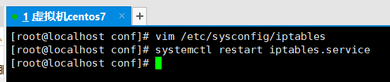

# Nginx学习


## 概念

Nginx（“engine x”）是一个高性能的HTTP和反向代理服务器，特点是占有内存少，并发能力强，事实上nginx的并发能力确实在同类型的网页服务器中表现较好。

Nginx专为性能优化而开发，性能是其最重要的考量，实现上非常注重效率，能经受高负载的考验，有报告表明能支持高达50,000个并发连接数。


### 反向代理

* **正向代理**：正向代理是一个位于客户端和目标服务器之间的代理服务器（中间服务器）。为了从目标服务器取得内容，客户端向代理服务器发送一个请求，并且指定目标服务器，之后代理向目标服务器转发请求，将获得的内容返回给客户端。

  * 正向代理需要主动设置代理服务器ip或者域名进行访问，由设置的服务器ip或者域名去访问内容并返回

  * 正向代理是**代理客户端**，为客户端收发请求，**使真实客户端对服务器不可见。**

    

  * 我们科学上网就是使用正向代理

    

  * **突破访问显示**：通过代理服务器，可以突破自身ip访问限制，访问国外网站等

  * **提高访问速度**：通常代理服务器都设置一个较大的硬盘缓冲区，会将部分请求的响应保存到缓冲区中，当其他用户再访问相同的信息时，则直接由缓冲区中取出信息，传给用户，以提高访问速度

  * **隐藏客户端真实ip**：上网者可以通过正向代理的方法隐藏自己的ip，免受攻击

* 反向代理：反向代理是指以代理服务器来接收客户端的请求，然后将请求转发给内部网络上的服务器，将从服务器上得到的结果返回给客户端，此时代理服务器对外表现为一个反向代理服务器。

  * 对于客户端来说，反向代理就相当于目标服务器，只需要将反向代理当作目标服务器一样发送请求就可以了，并且客户端不需要进行任何设置。

  * 正向代理需要配置代理服务器，而反向代理不需要做任何设置。

  * 反向代理是**代理服务器**，为服务器收发请求，**使真实服务器对客户端不可见**。

    

  * 常见服务器多台负载均衡，而我们在外面访问是只看到一个域名，请求被转发至其中一台上面

    

  * **隐藏服务器真实ip**：使用反向代理，可以对客户端隐藏服务器的ip地址

  * **负载均衡**：反向代理服务器可以做负载均衡，根据所有真实服务器的负载情况，将客户端请求分发到不同的真实服务器上

  * **提高访问速度**：反向代理服务器可以对静态内容及短时间内有大量访问请求的动态内容提供缓存服务，提高访问速度

  * **提供安全保障**：反向代理服务器可以作为应用层防火墙，为网站提供对基于web的攻击行为（例如DoS/DDoS）的防护，更容易排查恶意软件等。还可以为后端服务器统一提供加密和SSL加速（如SSL终端代理），提供HTTP访问认证等。


### 负载均衡

**为了解决单体应用的问题**：

```
系统相对单一，并发请求相对较少的情况下是比较适合的，成本也低。但是随着信息数量的不断增长，访问量和数据量的飞速增长，以及系统业务的复杂度增加，这种架构会造成服务器相应客户端的请求日益缓慢，并发量特别大的时候还容易造成服务器直接奔溃。很明显这是由于服务器性能的瓶颈造成的问题。
```

**这一类问题有两种解决思路**：

* 提升单个服务器硬件
* 增加多个服务器做负载均衡

```
单个服务器解决不了，我们通过增加服务器的数量，然后将请求分别分发到各个服务器上，将原先的请求集中到单个服务器上的情况改为将请求分发到多个服务器上，将负载分发到不同的服务器上，也就是我们所说的负载均衡。
```


### 动静分离

这是在代码的架构上进行的一种优化：我们以前编写的Spring项目中，前后端的代码耦合在一起，其中前端就使用到了很多静态的资源（CSS、JS、HTML、MP4、MP3）文件。这些文件会携带在每一次请求页面上。照成一次页面请求之后携带大量的静态资源服务器请求。占用服务器带宽消耗资源。

动静分离是指在web服务器架构中，将静态页面与动态页面或者静态内容接口和动态内容接口分开不同系统访问的架构设计方法，进而提升整个服务访问性能和可维护性。

nginx 的动静分离，指的是由 nginx 将客户端请求进行分类转发，静态资源请求（如html、css、图片等）由静态资源服务器处理，动态资源请求（如 jsp页面、servlet程序等）由 tomcat 服务器处理。


## 安装

官网：http://nginx.org/


### 在Windows中安装

#### 下载

下载地址：http://nginx.org/en/download.html 选择[ nginx/Windows-1.20.2](http://nginx.org/download/nginx-1.20.2.zip)


#### 启动

在下载完成后解压文件夹


在当前目录打开cmd，执行启动命令

```shell
start nginx
```


会有一个黑框一闪而过，此时就成功启动了。

访问：http://localhost:80


也可以使用命令在cmd中查看是否启动成功

```shell
tasklist /fi "imagename eq nginx.exe" 
```


需要关闭nginx可以在cmd框中执行命令

快速停止

```shell
nginx -s stop
```

完整停止

```shell
nginx -s quit
```


停止之后也就不能正常访问页面了。


### 在Linux中安装


#### 下载

选择Linux系统使用的安装包


#### **依赖环境安装**

安装nginx前还需要安装依赖环境：

```shell
yum -y install gcc gcc-c++ libtool zlib zlib-devel pcre-devel openssl openssl-devel
```

参数解析：

* pcre-8.37.tar.gz

  ```
  pcre库支持正则表达式。如果我们在配置文件nginx.conf中使用了正则表达式，那么在编译nginx时就必须把pcre库编译进nginx，因为nginx的HTTP模块需要靠它来解析正则表达式。
  ```

  下载：wget http://downloads.sourceforge.net/project/pcre/pcre/8.37/pcre-8.37.tar.gz
  解压：tar -xvf pcre-8.37.tar.gz
  检查：进入解压后的目录执行./configure
  编译：make
  安装：make install
  查看版本号：pcre-config --version

* openssl-1.0.1t.tar.gz

  ```
  如果服务器不只是要支持HTTP，还需要在更安全的SSL协议上传输HTTP，那么需要拥有OpenSSL。另外，如果我们想使用MD5、SHA1等散列函数，那么也需要安装它。
  ```

* zlib-1.2.8.tar.gz

  ```
  zlib库用于对HTTP包的内容做gzip格式的压缩，如果我们在nginx.conf中配置了gzip on，并指定对于某些类型（content-type）的HTTP响应使用gzip来进行压缩以减少网络传输量，则在编译时就必须把zlib编译进Nginx。
  ```

* xxx-devel

  ```
  是使用xxx做二次开发时所需要的开发库，包括头文件等，这也是编译nginx所必须使用的
  ```

安装过程：


#### 解压并安装

解压：tar -xvf nginx-1.21.1.tar.gz

检查：进入解压后的目录执行./configure

编译：make

安装：make install

可以用一个命令编译并安装：make&make install

安装完成之后，在/usr/local/nginx/sbin下有一个启动脚本


#### 启动

执行在nginx安装目录下的启动脚本

```shell
./nginx
```

查看目前的启动程序

```shell
ps -ef|grep nginx
```


## 配置文件

Nginx安装目录下，其默认的配置文件都放在这个目录的conf目录下，而主配置文件nginx.conf也在其中，后续对nginx的使用基本上都是对此配置文件进行相应的修改。

在/usr/local/nginx/conf里有一个配置文件


```shell
vim nginx.conf
```


(看出目前默认是可以通过80端口进行访问)

访问地址可以看到效果：（这里访问不了请看常见问题中对防火墙的设置）


配置文件中有很多#，开头的表示注释内容，我们去掉所有以#开头的段落，精简之后的内容如下：


### worker_processes全局块

**worker_processes全局块**：从配置文件开始到events块之间的内容，主要会设置一些影响nginx服务器整体运行的配置指令，主要包括配置运行nginx服务器的**用户（组）**、允许生成的**worker process数**，**进程PID存放路径**、**日志存放路径和类型**以及**配置文件的引入**等。

```
worker_processes  1;
```

这是nginx服务器并发处理服务的关键配置，**worker_processes值越大，可以支持的并发处理量也越多，但是会受到硬件、软件等设备的制约**。


### events块

**events块**：events块涉及的指令主要影响nginx服务器与用户的网络连接，常用的设置包括是否开启**对多work_process下的网络连接进行序列化**，是否允许**同时接收多个网络连接**，选取哪种**事件驱动模型**来处理连接请求，每个work_process可以同时支持的**最大连接数**等。

示每个work_process支持的最大连接数为1024：

```
events {
    worker_connections  1024;
}
```

这部分的配置对nginx的性能影响较大，在实际中应该灵活配置


### http块

这算是nginx服务器配置中最频繁的部分，代理、缓存和日志定义等绝大多数功能和第三方模块的配置都在这里。
需要注意的是：http块也可以包括**http全局块**、**server块**

```
http {
    include       mime.types;
    default_type  application/octet-stream;
    sendfile        on;
    keepalive_timeout  65;
    server {
        listen       80;
        server_name  localhost;
        location / {
            root   html;
            index  index.html index.htm;
        }
        error_page   500 502 503 504  /50x.html;
        location = /50x.html {
            root   html;
        }
    }
}
```


#### http全局块

http全局块配置的指令包括文件引入、MIME-TYPE定义、日志自定义、连接超时时间、单链接请求数上限等。

#### server块

这块和虚拟机有密切关系，虚拟主机从用户角度看，和一台独立的硬件主机是完全一样的，该技术的产生是为了节省互联网服务器硬件成本。

* 每个HTTP块可以包括多个server块，而每个server块就相当于一个虚拟主机。

* 而每个server块也分为全局server块，location块（以及可以同时包含多个）。

##### server全局块

最常见的配置是本虚拟机主机的监听配置和本虚拟主机的名称或IP配置

##### location块

一个server块可以配置多个location块

这块的主要作用是基于nginx服务器接收到的请求字符串（例如server_name/uri-string），对虚拟主机名称（也可以是IP别名）之外的字符串（例如前面的/uri-string）进行匹配，对特定的请求进行处理。地址定向、数据缓存和应答控制等功能，还有许多第三方模块的配置也在这里进行。

**URL匹配语法**

```
location [ = | ~ | ~* | ^~ ] uri {
...
}
```

1、=：用于不含正则表达式的uri前，要求请求字符与uri严格匹配，如果匹配成功，就停止继续向下搜索并立即处理该请求。

2、~：用于表示uri包含正则表达式，并且区分大小写。

3、~*：用于表示uri包含正则表达式，并不区分大小写。

4、^~：用于不含正则表达式的uri前，要求nginx服务器找到标识uri和请求字符串匹配度最高的location后，立即使用此location处理请求，而不再使用location块中的正则uri和请求字符串做匹配。

5、!~：用于表示uri不包含正则表达式，并且区分大小写

6、!~*：用于表示uri不包含正则表达式，并且不区分大小写

注意：如果uri包含正则表达式，则必须要有~或者~*标识。

**例子：只匹配/查询**

```
location = / {
	# 只匹配 / 查询。
}
```

**例子：匹配任意查询**

```
location / {
	# 匹配任何查询，因为所有请求都已 / 开头。但是正则表达式规则和长的块规则将被优先和查询匹配。
}
```

**例子：匹配/p_w_picpaths/开头的任意查询**

```
location ^~ /p_w_picpaths/ {
	# 匹配任何已 /p_w_picpaths/ 开头的任何查询并且停止搜索。任何正则表达式将不会被测试。
}
```

**例子：匹配gif、jpg 或 jpeg结尾的请求**

```
location ~*.(gif|jpg|jpeg)$ {
	# 匹配任何已 gif、jpg 或 jpeg 结尾的请求。
}
```

**例子：防盗链转发**

```
location ~*.(gif|jpg|swf)$ {
    valid_referers none blocked start.igrow.cn sta.igrow.cn;
    if ($invalid_referer) {
        #防盗链
        rewrite ^/ http://$host/logo.png;
    }
}
```


## 常用命令

这是Linux中的Nginx操作。需要进入nginx安装目录的执行程序位置：

```shell
cd /usr/local/nginx/sbin
```


### 查看版本号

```shell
./nginx -v
```


### 启动Nginx

```she
./nginx
```


### 关闭Nginx

```shell
./nginx -s stop
```


### 重新加载Nginx配置

```shell
./nginx -s reload
```


## 反向代理

### 准备Tomcat和Nginx

按照【常见文件/Centos7安装Tomcat】的方式创建3台Tomcat：

使用tar解压一台并重命名为**tomcat10-8080、tomcat10-8081、tomcat10-8082**

更改后面两台服务器启动后的端口：8081、8082


按照【常见文件/Centos7开放防火墙端口80】的方式开放**8080、8081、8082**端口


访问效果：


为3台服务器添加3个访问页面：(不同服务器写不同端口)

```html
<!DOCTYPE html>
<html lang="en">
<head>
    <meta charset="UTF-8">
    <title>测试页面8080</title>
</head>
<body>
    <h1>8080</h1>
</body>
</html>
```


模拟访问Nginx，查看反向代理效果


配置假域名


访问Nginx效果


访问Tomcat效果


### 案例1：Nginx-80代理Tomcat-8080


将HTTP请求到Nginx后转给Tomcat处理请求。


具体参考[虚拟主机server块](####server块)，[端口和ip配置的全局server块](#####server全局块)，请求处理的[location块](#####location块)

Nginx配置更改完成后，重新加载配置

```shell
./nginx -s reload
```


展示效果：80默认携带可以不用写


### 案例2：Nginx不同路径转发不同Tomcat

这里使用location块设置路径

* /a：Tomcat-8080
* /b：Tomcat-8081
* /c：Tomcat-8082

对应的配置

```
server {
	listen       9001;
	server_name  localhost;
	
    location ~ /a/ {
        proxy_pass http://localhost:8080;
    }
    location ~ /b/ {
        proxy_pass http://localhost:8081;
    }
    location ~ /c/ {
        proxy_pass http://localhost:8082;
    }
}
```

上面的配置中，由于目前都只有一台虚拟机，所以省略配置虚拟机为真实IP。正常来说就是虚拟机全局server监听端口和目标机器IP。然后再location中使用127.0.0.1来表示目标机的本地IP


## 负载均衡

将请求按照Nginx的规则，来转发到其中一台服务器上。在实际开发中，两台服务器部署的应用的一样的，通过这种方式来将相同并且大量的请求，分发到两台服务器上来减轻整套服务的压力。


在前面两台服务器8081和8082中创建文件夹并放入新的页面


配置

```
upstream myserver{
    ip_hash;
    server 192.168.14.128:8081 weight=1;
    server 192.168.14.128:8082 weight=1;
}

server {
    listen       9002;
    server_name  localhost;

    location ~ /d/ {
        proxy_pass http://myserver;
        proxy_connect_timeout 10;
    }
}
```


开放9002端口后让Nginx重新读取配置



测试效果


这里会一直显示为8002，不是Tomcat服务器的问题，而是使用了ip_hash的负载策略

#### 负载策略

* nginx 的 upstream默认是以**轮询**的方式实现负载均衡，这种方式中，每个请求按时间顺序逐一分配到不同的后端服务器，如果后端服务器down掉，能自动剔除。
* 另外一种方式是ip_hash：每个请求**按访问ip的hash结果分配**，这样每个访客固定访问一个后端服务器，可以解决session的问题。


前面的案例只要注释ip_hash配置项就能启用轮询


请求效果


随着互联网信息的爆炸性增长，负载均衡（load balance）已经不再是一个很陌生的话题，顾名思义，负载均衡即是将负载分摊到不同服务单元，既保证服务的可用性，又保证相应足够快，给用户很好的体验。快速增长的访问量和数据流量催生了各式各样的负载均衡产品，很多专业的负载均衡硬件提供了很好的功能，但价格却不菲，这使负载均衡软件大受欢迎，nginx就是其中的一个，在Linux下又nginx、LVS、Haproxy等等服务可以提供负载均衡，而且nginx提供了几种分配方式（策略）。


* 轮询策略

  ```
  每个请求按照时间顺序逐一分配到哦不同的后端服务器，如果后端服务器down掉，能自动剔除。
  ```

* weight策略

  ```
  weight代表权重，默认为1。权重越高被分配的客户端越多。
  指定轮询的几率，weight和访问比率成正比，用于后端服务器性能不均的情况。
  ```

* ip_hash策略

  ```
  每个请求按访问ip的hash结果分配，这样每个访客固定访问后一个后端服务器，可以解决session的问题。（现在比较少用，存在一个问题，就是当用户访问的固定服务器down后，将导致一直访问失败）
  ```

* fair第三方策略

  ```
  按后端服务器的响应时间来分配请求，响应时间短的优先分配。
  userstream myserver{
      server ip1;
      server ip2;
      fair;
  }
  ```


## 动静分离

nginx动静分离简单来说就是把动态跟静态请求分开，不能理解成只是单纯的把动态页面和静态页面物理分离。严格意义上说应该是动态请求跟静态请求分开，可以理解成使用nginx处理静态页面，Tomcat处理动态页面。

动静分离从目前实现角度来讲大致分为两种：

* 一种是纯粹把静态文件独立成单独的域名，放在独立的服务器上，也是目前主流推崇的方案。
* 另外一种分发就是动态跟静态文件混合在一起发布，通过nginx来分开。

通过location指定不同的后缀名实现不同的请求转发。通过expires参数设置，可以使浏览器缓存过期时间，减少与服务器之间的请求和流量。(静态资源缓存)


### expires属性

expires定义：是给一个资源设定一个过期时间，也就是说无需去服务器端验证，直接通过浏览器自身确认是否过期即可，所以不会产生额外的流量。此种方法非常适合不经常变动的资源。（如果经常更新的文件，不建议使用expires来缓存）

我这里设置3d，表示在3天之内访问这个URL，发送一个请求，比对服务器该文件最后更新时间没有变化，则不会从服务器抓取，返回状态码304.如果有修改，则直接从服务器上重新下载，返回状态码200。


### 静态文件存储区

现在服务器中建立一个文件夹，存入静态资源。


### 配置动静资源请求转发

在原先的的server中进行配置（因为正常使用中也是为了维护能够不暴露IP，且不单独申请静态资源域名，所以应用域名和静态资源域名都是使用80端口）


根据上面的配置会有两种情况：

1. /file/可以直接访问静态网页文件，但不能直接访问路径

   

   

2. /img/可以直接访问路径，展示路径下的资源。也可直接访问资源

   

   


## 高可用集群

因为Nginx作为全部请求的入口，如果停了那整套服务就不可用。可以对其做集群，实现高可用。


需要增加nginx服务器，nginx服务器有主备(从)关系。当主机宕机时，会自动切换到从机上。而主从机都是具备一样的转发请求到其他服务器的功能。

要实现这个切换功能，需要给每台nginx配置一个keepalived。并且因为切换后，nginx的IP就不同了，为了对外一致，需要配置一个虚拟IP。虚拟IP+keepalived实现IP的路由模式。当检测到当前的nginx主机宕机时，keepalived自动将虚拟IP绑定到nginx从机上，替代成为新的主机。

* 虚拟IP：对外访问都是只有一个地址
* keepalived：主备切换


### 准备

在两台服务器上搭建Nginx服务。


### 安装keepalive

```shell
yum install keepalived -y
# 或者
rpm -q -a keepalived
```

服务器1：


服务器2：


### 配置主备关系

#### 主服务器

```shell
vim /etc/keepalived/keepalived.conf
```

主服务器配置：

```
! Configuration File for keepalived

global_defs {

    notification_email {

        acassen@firewall.loc

        failover@firewall.loc

        sysadmin@firewall.loc
     }

        notification_email_from Alexandre.Cassen@firewall.loc

        smtp_server 192.168.14.128

        smtp_connect_timeout 30

        router_id LVS_DEVEL # 主机名字
}

vrrp_script chk_http_port {
        script "/usr/local/src/nginx_check.sh"
        interval 2 #（检测脚本执行的间隔）
        weight 2 # 权重
   }
        vrrp_instance VI_1 {
        state MASTER # 备份服务器上将 MASTER 改为 BACKUP
        interface ens33 # 网卡
        virtual_router_id 51  # 主、备机的 virtual_router_id 必须相同
        priority 100  # 主、备机取不同的优先级，主机值较大，备份机值较小
        advert_int 1
        authentication {
                auth_type PASS
                auth_pass 1111
        }

        virtual_ipaddress {
             192.168.77.50 # VRRP H 虚拟地址
        }

}
```

配置虚拟IP

```shell
vim /etc/hosts
```

主机名称 和 ip 映射：

127.0.0.1 LVS_DEVEL


#### 从服务器配置

```shell
vim /etc/keepalived/keepalived.conf
```

```
global_defs {

    notification_email {

        acassen@firewall.loc

        failover@firewall.loc

        sysadmin@firewall.loc 

     }

        notification_email_from Alexandre.Cassen@firewall.loc

        smtp_server 192.168.14.128

        smtp_connect_timeout 30

        router_id LVS_DEVEL 
}

vrrp_script chk_http_port {
        script "/usr/local/src/nginx_check.sh"
        interval 2
        weight 2
   }
        vrrp_instance VI_1 {
        state BACKUP # 修改为从机 BACKUP
        interface ens33 # 修改为从机 ip
        virtual_router_id 51
        priority 90 # 优先级比主机低
        advert_int 1
        authentication {
            auth_type PASS
            auth_pass 1111
        }

        virtual_ipaddress {
            192.168.77.50
        }

}
```

配置虚拟IP

```vim
vim /etc/hosts
```

主机名称 和 ip 映射：

127.0.0.1 LVS_DEVEL


### 脚本配置(主机)

在/usr/local/src下创建nginx_check.sh脚本。

脚本在/etc/keepalived/keepalived.conf中配置了调用关系。作用是检测当前的nginx是否存活，如果宕机了就需要切换到下一个nginx；

nginx_check.sh脚本内容如下：

```sh
\#!/bin/bash

A=`ps -C nginx -no-header |wc -l`

if [ $A -eq 0 ];then

  /usr/local/nginx/sbin/nginx

  sleep 2

  if [ `ps -C nginx --no-header |wc -l` -eq 0 ];then

​    killall keepalived

  fi

fi
```


### 启动

启动两台服务器的nginx和keepalive

**启动nginx**

```shell
# 进入路径
cd /usr/local/nginx/sbin/
# 启动
 ./nginx 
```

**启动keepalived**

```shell
systemctl start keepalived.service
```


### 测试虚拟IP访问nginx

由于虚拟机配置导致无法绑定虚拟IP，所以这里直接略过


### keepalive配置项讲解


```
global_defs {

   router_id keeplves_master #hostname

}

vrrp_script chk_nginx {

    script "/usr/local/src/nginx_check.sh" #检测nginx的脚本

    interval 5 #每2秒检测一次

    weight -20 #如果某一个nginx宕机 则权重减20

}

vrrp_instance VI_1 {

    state MASTER #状态 MASTER BACKUP

    interface ens33 #绑定的网卡

    virtual_router_id 51 #虚拟路由的ID号,两个节点设置必须一样

    mcast_src_ip 192.168.14.128 #本机的IP

    priority 90

    advert_int 1

# 设置验证信息，两个节点必须一致

    authentication {

        auth_type PASS

        auth_pass 1111

    }

# 虚拟IP，两个节点设置必须一样。

    virtual_ipaddress {

        192.168.1.138

    }

# nginx存活状态检测脚本

    track_script {

      chk_nginx

    }

}
```


## 原理

Nginx在启动之后是有两个进程的，一个是master（管理员），一个是worker（工人）


Worker可以有多个

（处理任务为争抢机制）


## 集群优势-热加载

./nginx -s reload热部署，利用nginx的空余worker进行热部署

***\*master-workers的机制的好处\****

首先，对于每个worker进程来说，独立的进程，不需要加锁，所以省掉了锁带来的开销，同时在编程以及问题查找时，也会方便很多。其次，采用独立的进程，可以让互相之间不会影响，一个进程退出后，其他进程还在工作，服务不会中断，master进程则很快启动新的worker进程。当然，worker进程的异常退出，肯定是程序有bug了，异常退出，会导致当前worker上所有请求失败，不过不会影响到所有请求，所以降低了风险。

***\*需要设置多少个worker\****

Nginx同redis类似都采用了io多路复用机制(在Windows中安装时没有这个机制)，每个worker都是一个独立的进程，但每个进程里只有一个主线程，通过把异步非阻塞的方式来处理请求，即使是成千上万个请求也不在华夏，每个worker的线程可以把一个cpu的性能发挥到极致。所以worker数和服务器的cpu数相等是最为适宜的。设少了会浪费cpu，设多了会造成cpu频繁切换上下文带来的损耗。

 

\# 设置worker数量

worker_processes 4

\# work绑定cpu(4work4cpu)

worker_cpu_affinity 0001 0010 0100 1000

 

连接数worker_connection

|-发送一个请求，占用了worker的几个连接数

|-2个（client<--->worker）或者4个（client<---->worker<---->Tomcat）

|-解释：

 

|-nginx中有一个master和4个worker，每个worker支持最大连接数1024

|-nginx支持的最大并发数是多少

|-worker最大支持连接数：（4个worker）*（每个worker支持最大连接数1024）

|-最大并发连接数：（最大并发2/4） * （worker最大支持连接数）

 

 

这个值是表示每个worker进程所能建立连接的最大值，所以，一个nginx能建立的最大连接数，应该是worker_connections * worker_processes 当然，这里说的最大连接数，对于HTTP请求本地资源来说，能够支持的最大并发数量是worker_connections * worker_processes，如果是支持HTTP1.1的浏览器欸此访问要占两个连接，所以普通的静态访问最大并发数是：worker_connections * worker_processes/2，而是如果HTTP作为反向代理来说，最大并发数量应该是worker_connections * worker_processes/4。因为作为反向代理服务器，每个并发会建立与客户端的连接和与后端服务的连接，会占两个连接。


## 常见问题

### Centos7开放防火墙端口80

CentOS7虚拟机配置防火墙允许nginx访问

* 启用iptables防火墙（弃用firewall）

  ```shell
  #停止firewall
  systemctl stop firewalld.service
  #禁止firewall开机启动
  systemctl disable firewalld.service
  # 安装iptables防火墙
  yum install iptables-services
  ```

* 修改文件配置允许80端口

  ```shell
  #编辑防火墙配置文件
  vi /etc/sysconfig/iptables
  ```

  按i进入文本编辑 在原文档中找到

  ```
  -A INPUT -m state --state NEW -m tcp -p tcp --dport 22 -j ACCEPT
  ```

  在该行下面添加

  ```
  -A INPUT -m state --state NEW -m tcp -p tcp --dport 80 -j ACCEPT
  ```

  保存退出

  ```
  :wq!
  ```

* 重启防火墙

  ```shell
  #最后重启防火墙使配置生效
  systemctl restart iptables.service
  #设置防火墙开机启动
  systemctl enable iptables.service
  ```


另外的一种方式：firewall防火墙

* 查看防火墙

  ```shell
  # 查看防火墙端口配置
  firewall-cmd --list-all
  # 配置80端口
  firewall-cmd --add-port=80/tcp --permanent
  # 重启防火墙
  firewall-cmd --reload
  ```


最终效果：


### Centos7安装Tomcat

* 下载地址

  地址：https://mirrors.bfsu.edu.cn/apache/tomcat/tomcat-10/v10.0.8/bin/apache-tomcat-10.0.8.tar.gz

  

* 解压

  ```shell
  tar -xvf apache-tomcat-10.0.8.tar.gz
  ```

  

* 启动

  ```shell
  # 进入到目录
  cd /home/apache-tomcat-10.0.8/bin
  # 启动
  ./startup.sh
  ```

  

* 查看状态

  ```shell
  ps -ef|grep java
  ```

* 访问

  


