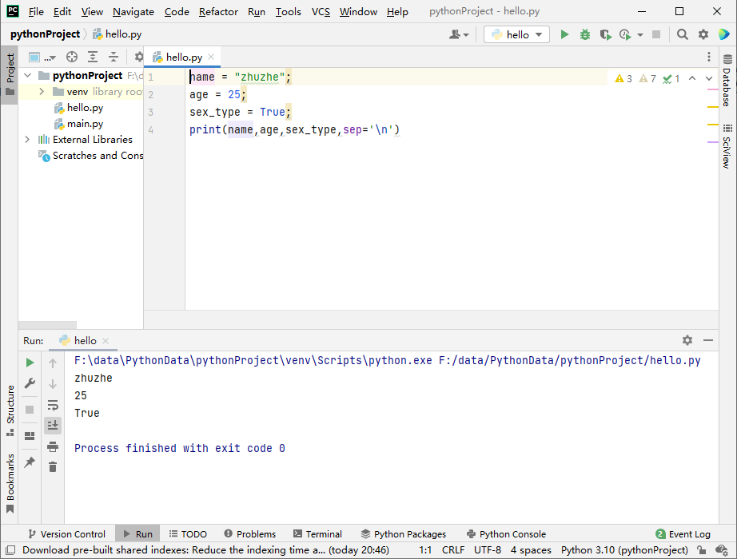
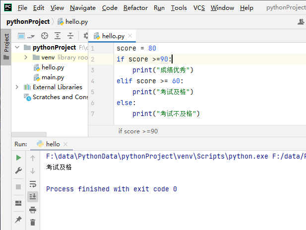
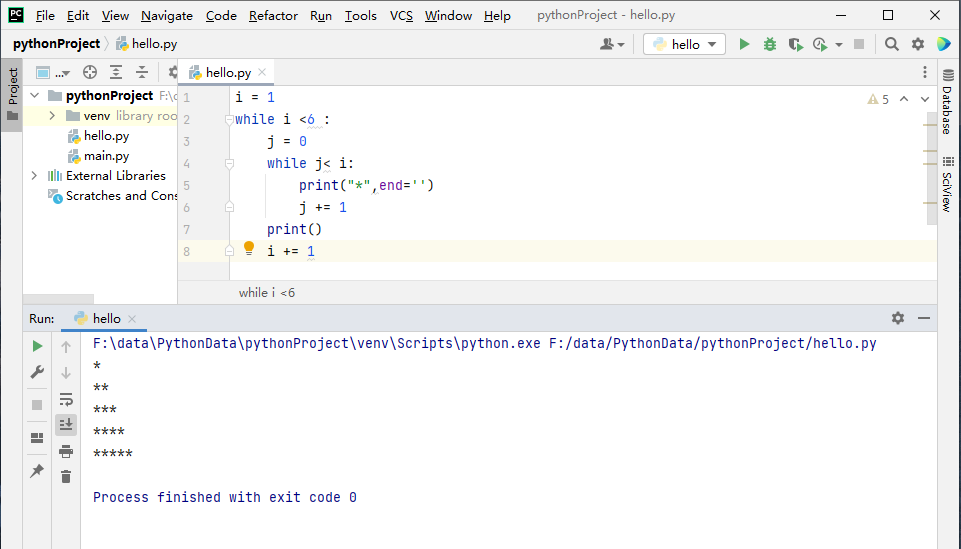
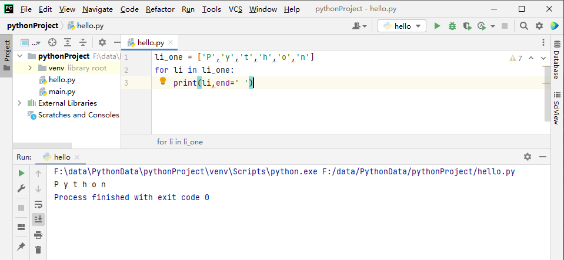
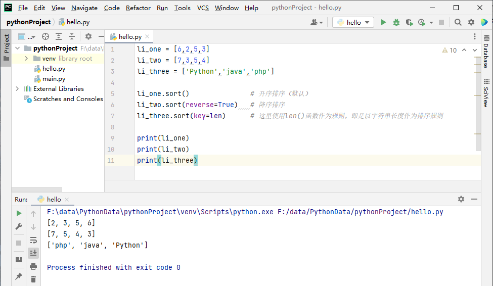
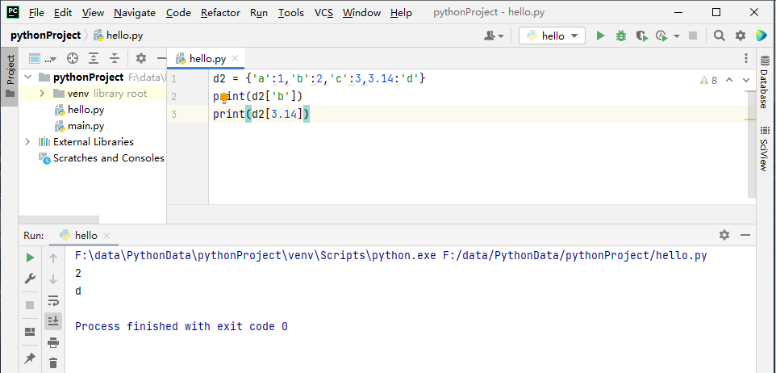
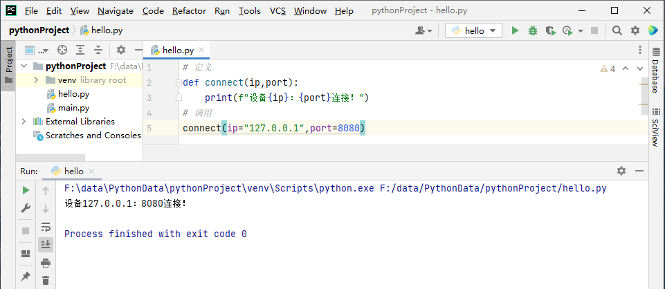
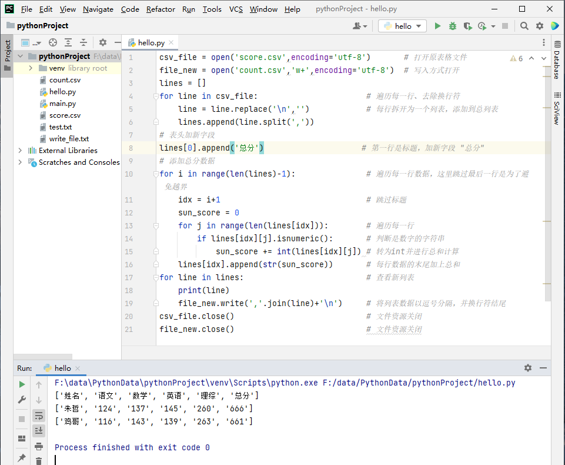
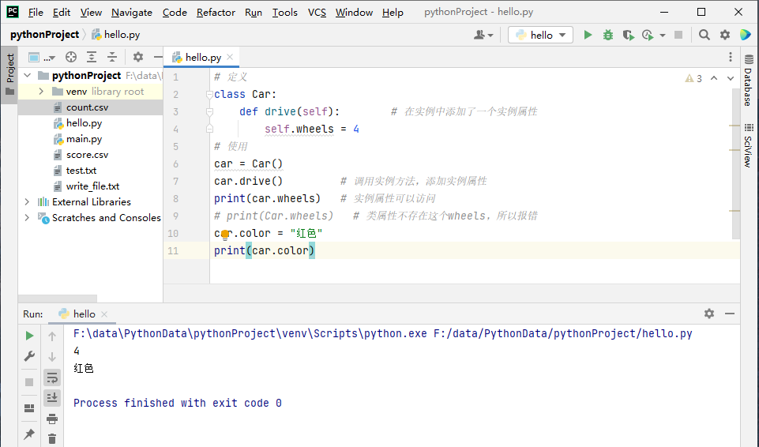
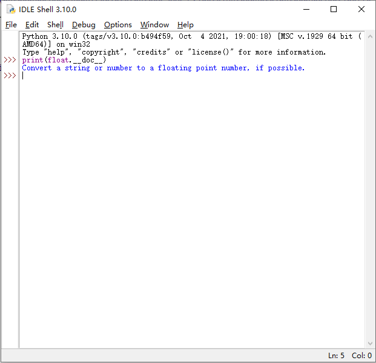

#  Python学习

# 1. 概述

​		是一门面向对象的解释型编程语言。Python的语法很多来自C语言，但又深受ABC语言的影响。自诞生开始，Python已经具备又了类（Class）、函数（function）、异常处理（exception）、包括列表（list）和字典（dict）在内的核心数据类型，以及以模块为基础的扩展系统。

​		Python3.0和Python2.x系列不兼容。

## 1.1 优点

		1. 实现功能的代码简洁
		1. Python是高级语言，通过强制缩进来体现语句间的逻辑关系。保证了代码的风格统一性，可读性。
		1. 易学，Python语法大多来自C语言。但摈弃了C语言中的指针。
		1. 开源，Python是FLOSS（Free/Libre and Open Source Software，自由/开源软件）之一。
		1. 可移植性好，Python作为一款解释性语言，可以在任何安装有Python解释器的平台执行。
		1. 扩展性好，从高层上可以引入`.py`文件，这些文件可以是标准库和自己编写的文件。底层可以通过接口和库函数调用其他高级语言。
		1. 类库丰富，Python本身拥有丰富的内置类和函数库，可以更容易实现一些复杂功能。
		1. 通用灵活，Python是一门通用编程语言，可被用于Web开发、科学计算、数据处理、游戏开发、人工智能、机器学习等各种领域。
		1. 模式多样，Python解释器内部采用面向对象模式实现。在代码层面可以支持面向对象和面向过程编程。
		1. 良好的中文支持，Python3.x解释器采用UTF-8编码。

## 1.2 缺点

1. 执行效率不够高，Python程序没有C++、Java编写的程序高效。
2. Python3.x和Python2.x的兼容性不好


## 1.3 Python程序的运行方式

Python程序有两种运行方式：交互式和文件式。

* 交互式：Python解释器逐行接受Python代码并即时响应。
* 文件式：批量式，先将Python代码reez保存在文件中，在启动Python解释器批量解释代码。

> 交互式
>


>  文件式
>


## 1.4 使用PyCharm创建一个Python项目

在下载启动好pycharm后，会展示这样一个弹框。


点击`New Project`新建一个项目：


项目的界面


新建一个`hello.py`文件：


编写一个代码：


右键运行：


成功运行：


## 1.5 Python模块

> 随着程序复杂度的提高，为了代码易于维护。通常会将一些功能代码放在其他文件中。这种文件就是模块。Python内部也有一些标准模块，可以直接导入使用。


### 1.5.1 模块安装

使用Python自带的pip工具，可以很方便安装各种第三方模块。联网下载。

```python
pip install 模块名
```

例子：

```python
pip install pygame 
```


### 1.5.2 模块的导入和使用

> 导入

上面讲的是将模块下载到python环境中。但要使用，则需要进行导入。

```python
import 模块1,模块2,模块3,...
```

例子：

```python
import pygame
```


> 使用

使用则是通过字符`.`调用模块中的内容。这是为了避免导入多个模块，而存在多个同名函数的调用情况：

```python
模块名.函数
模块名.变量
```

例子：

```python
pygame.init()
```

如果要导入的模块并没有同名函数的情况，则可以直接将这个函数给导入。后续的使用不用加前缀：

```python
from pygame import init
...
init()
```

也可以用`*`一次性导入全部内容：

```python
from pygame import *
```


### 1.5.2 代码的组织方式

> Python代码的组织方式有——模块（module）、包（package）、库（lib）

* 模块：是最基础的代码组织方式，每个包含有组织的代码片段的`.py`文件都是一个模块
* 包：以目录的结构组织的模块文件或子包。例：一个包含`__init__.py`文件的目录就是一个包。包中必有`__init__.py`文件，并可以有多个模块或子包。
* 库是一个抽象的概念，指具有相关功能的模块的集合。


## 2. Python基础

## 2.1 代码格式

> 注释

单行注释

```python
print("Hello World!")		# 这是一个输出语句
```

多行注释/说明文档/说明函数或者类的功能

```python
def print(self,*args,sep='',end='\n',file=None):
"""
这是一个输出语句，传参的意义分别是：
param1: ...
param2: ...
...
"""
```

可以通过`__doc__`属性来获取Python对象的说明文档：

```python
# 获取print对象的说明文档
print(print.__doc__)
```


> 缩进
>

Python代码使用缩进确定代码之间的逻辑关系和层次关系。一般使用4个空格表示一级缩进。Python3不允许使用`Tab+空格`的组合缩进。

例子：

```python
if True:
    print("True")
else:
	print("False")
```

		

同时Python也规定了不能出现无意义或者不规范的缩进：

```python
if True:
    print("True")
else:
	print("False")
    	print("False2")
```


> 语句换行
>

Python官方建议每行代码不超过79个字符，若代码过长则应该换行。Python会将圆括号、中括号和大括号的行进行隐式链接。

例子：

```python
string = ("Python是一种面向对象、解释型的语言。"
         "由Guido van Rossum 于1989年发明。"
         "Python第一个公开发行版本于1991年。")
```


```python
total = ['item_one','item_two','item_three']
```


## 2.2 标识符和关键字


> 标识符

为了明确某处代码使用的到底是哪个数据、代表的是哪一类信息，开发人员可以使用一些符号或名称作为程序中同一类信息的标识。这些符号或名称（如**变量名**、**函数名**、**类名**）就是标识符。

**具体的规则为：**

* 字母、标识符、下划线

  * 合法

    ```python
    fromNo12
    ```

  * 不合法

    ```python
    from#12
    ```

* 区分大小写

* 不能以数字开头

  * 合法

    ```python
    2ndObj
    ```

  * 不合法

    ```python
    if=1
    ```

* 不允许使用关键字

* 见名知义

* 命名规范

  * 常量名使用大写的单个单词或由下划线连接的多个单词

    ```python
    ORDER_LIST_LIMIT
    ```

  * 模块名、函数名使用小写的单个单词或下划线连接的多个单词

    ```python
    low_with_under
    ```

  * 类名使用大写字母开头的单个或多个单词

    ```python
    Cat
    ```

    


> 关键字
>

Python的关键字是已经使用的，不允许开发人员重复定义的标识符。Python中一共定义了`35`个关键字。这些关键字是存储在 `keyword模块` 的 `kwlist变量` 中。

可以使用print进行输出：

```python
import keyword
print(keyword.kwlist)
```


|    False    |   await    |    else    |   import   |     pass     |     None     |
| :---------: | :--------: | :--------: | :--------: | :----------: | :----------: |
|  **break**  | **except** |   **in**   | **reise**  |   **True**   |  **class**   |
| **finally** |   **is**   | **return** |  **and**   | **continue** |   **for**    |
| **lambda**  |  **try**   |   **as**   |  **def**   |   **from**   | **nonlocal** |
|  **while**  | **assert** |  **del**   | **global** |   **not**    |   **with**   |
|  **async**  |  **elif**  |   **if**   |   **or**   |  **yield**   |              |

对于每个关键字的使用，可以使用`help()`命令来查看介绍：

```python
print(help("import"))
```


## 2.3 变量和数据类型

> 变量

在计算机语言中，变量指能存储计算结果或表示值的抽象概念——程序在运行期间用到的数据会被保存在计算机的内存单元中。

为了方便存取内存单元中的数据，Python使用标识符来标识不同的内存单元，从而使标识符与数据建立了联系。


num这种标识内存单元的标识符名称称为**变量名**。通过`=`将内存单元中存储的数值与变量名建立联系。这个过程就是定义变量。

```python
# 变量名 = 值
num = 15
data = 18
```

这个时候就可以通过变量名来访问数据

```python
print(num)
print(data)
```


> 数据类型

根据存储形式的不用，划分为三类：

* 数字类型
* 字符串
* 复杂的组合数据类型

在实际使用时，如果不知道变量的类型。可以使用`type(变量)`来获取到变量的类型。


**数字类型**

| 名称     | 类型（可写） | 取值例子                   | 备注                                 |
| -------- | ------------ | -------------------------- | ------------------------------------ |
| 整型     | int          | 0，101，-239               | 整数                                 |
| 浮点型   | float        | 3.1415，4.2E-10，-2.334E-9 | 小数                                 |
| 复数类型 | complex      | 3.12+1.2.3j，-1.23-93j     | 复数                                 |
| 布尔型   | bool         | True，False                | 是int的子类，只有True和False两种取值 |


**字符串**

| 名称   | 类型 | 取值例子         | 备注       |
| ------ | ---- | ---------------- | ---------- |
| 字符串 | str  | 'Python123Y'     | 单引号包括 |
| 字符串 | str  | "Python123Y"     | 双引号包括 |
| 字符串 | str  | '''Python123Y''' | 三引号包含 |


**列表**

| 名称 | 类型 | 取值例子      | 备注                                                         |
| ---- | ---- | ------------- | ------------------------------------------------------------ |
| 列表 | list | [1,2,'hello'] | 列表是多个元素的集合，它可以保存任意数量、任意类型的元素，**并且可以被修改**。 |


**元组**

| 名称 | 类型  | 取值例子      | 备注                                                         |
| ---- | ----- | ------------- | ------------------------------------------------------------ |
| 元组 | tuple | (1,2,'hello') | 和列表相似。可以保存任意数量、任意类型的元素，**但不能被修改**。 |


**集合**

| 名称 | 类型 | 取值例子    | 备注                                                         |
| ---- | ---- | ----------- | ------------------------------------------------------------ |
| 集合 | set  | {'a','b',3} | 和列表、元组类似。可以保存任意数量、任意类型的元素。集合中的元素无序并且是唯一的。 |


**字典**

| 名称 | 类型 | 取值例子                                                  | 备注                                                         |
| ---- | ---- | --------------------------------------------------------- | ------------------------------------------------------------ |
| 字典 | dict | type({'name':'zhuzhe',"age":25,'''address''':'''南方'''}) | 以`{}`包括，里面的元素是键值对`key:value`。<br />键`key`不能重复。通常键都是str的类型。 |


注：

```python
# Python是动态的语言。可以在声明变量时不显式指定具体类型。在执行时解释器会自动确定数据类型
dict_demo = {"name":"zhuzhe","age":25}
print(type(dict_demo))
```


> 变量的输入与输出

程序要实现从输入设备接收用户输入的数据，也需要向显示设备输出数据。此时可以使用两个函数：

* input()
* print()


**input()函数**

```python
# 用于接收用户键盘输入的数据，返回一个字符串类型的数据
input([prompt])
# 例子
name = input("请输入你的名字:")
print(name)
```


**print()函数**

```python
#用于向控制台输出数据，可以输出任何类型的数据
# 语法格式
print(*objects,sep='',end='\n',file=sys.stdout)
# objects: 输出的对象。有多个对象时需要用分隔符分隔
# sep: 用于设定分隔符，默认使用空格作为
# end: 用于设定输出以什么结尾，默认为换行符\n
# file: 标表示数据输出的文件对象
```




## 2.4 数字类型

### 2.4.1 整数类型

Python3中整型数据的长度没有限制。整型的技术方式有4种。

* 二进制：`0b`和`0B`开头
* 八进制: `0o`和`0O`开头
* 十进制
* 十六进制: `0x`和`0X`开头

Python提供了各种进制的转换函数：

| 函数   | 说明                  |
| ------ | --------------------- |
| bin(x) | 将x转换为二进制数据   |
| oct(x) | 将x转换为八进制数据   |
| int(x) | 将x转换为十进制数据   |
| hex(x) | 将x转换为十六进制数据 |

例子：

```python
decimal = 10
bin_num = 0b1010
print("十进制转二进制："+bin(decimal))
print("十进制转八进制："+oct(decimal))
print("二进制转为十进制："+int(bin_num))
print("十进制转为十六进制："+hex(decimal))
```


### 2.4.2 浮点型

> 实数：整数部分+小数点+小数部分
>
> 在Python中的实数一般是十进制表示
>
> ```
> 例子
> 3.14，2.75
> ```
>
> 对于**较大**或**较小**的实数，使用科学计数法表示。
>
> ```
> # a与10的n次幂相乘的表示方式
> a × 10^n (1<=|a|<10,n∈N)
> ```

在Python中，使用浮点数来表示实数。

```python
1.0,1.2,2.36,3.14
```

科学计数法使用E或e来表示底数10。后面加的数就是对于的幂

```python
-3.14e2
3.14E-3
```

在Python中，浮点型是双精度的。每个浮点型数据占8个字节（64位）。遵守IEEE（电气与电子工程师协会）标准：

```
64位 = 存储尾数（52位） + 存储阶码（11位） + 存储符号（1位）
```

Python的浮点型存储有一个范围：

```
-1.8e308 ~ 1.8e308
```

在超出范围后，将视为无穷。输出inf

```
print(3.14E308)	#正无穷大inf
print(-3.14e308)#负无穷大-inf
```


### 2.4.3 复数类型

> 复数：real+imagj
>
> * real：实部
> * imag：虚部
> * j：虚部单位

```python
# 定义两个复数
complex_one = 1+2j
complex_two = 3j
# 输出复数1的实部
print(complex_one.real)
# 输出复数2的虚部
print(complex_two.imag)
```


### 2.4.4 布尔类型

> 布尔类型是一种特殊的整型。True对应1，False对应0

一些返回位False的布尔值`bool=?`

* None
* False
* 任何数字类型的0：0、0.0、0j
* 任何空序列：""、()、[]
* 空字典：{}

例子：

```python
print(bool(0))
print(bool(''))
print(bool(1))
```


### 2.4.5 类型转换

> Python内置了一系列可**强转**数据类型的函数。可以将上面提到的类型进行转换。具体查看可以使用前面讲到的`print(函数名.__doc__)`

| 函数                                                      | 说明                                                         |
| --------------------------------------------------------- | ------------------------------------------------------------ |
| `int([x]) -> integer`，<br />`int(x, base=10) -> integer` | 将x转换为一个整型数据。如果x是一个浮点型数据，在转换时只保留整数部分 |
| float(x)                                                  | 将x转换为一个浮点型数据                                      |
| complex(x)                                                | 将x转换为复数类型                                            |

例子：

```python
num_one = 2
num_two = 2.2
print(int(num_two))
print(float(num_one))
print(complex(num_one))
```


## 2.5 运算符

> 运算符是用于实现数值之间的运算。
>
> **根据操作数量的不同，可以分类为：**
>
> * 单目运算符
> * 双目运算符
>
> **根据功能的不同，可以分类为：**
>
> * 算术运算符
> * 赋值运算符
> * 比较运算符
> * 逻辑运算符
> * 成员运算符
> * 位运算符

当一个表达式中包含多个运算符时，会根据运算符的优先级确定运行顺序。


### 2.5.1 算术运算符

> 算术运算符是双目运算符

| 运算符 | 说明                                                | 例子     |
| ------ | --------------------------------------------------- | -------- |
| +      | 加：使两个操作数相加，获取操作后的和                | a+b=10   |
| -      | 减：使两个操作数相加，获取操作后的差                | a-b=-2   |
| *      | 乘：使两个操作数相乘，获取操作后的积                | a*b=12   |
| /      | 除：使两个操作数相除，获取操作后的商（除数不能为0） | a/b=0.12 |
| //     | 整除：使两个操作数相除，获取商的整数部分            | a//b=0   |
| %      | 取余：使两个操作数相除，获取余数                    | a%b=2    |
| **     | 幂：使两个操作数进行幂运算，获取a的b次幂            | a**b=256 |

运算符支持相同的数值类型运算。也支持不同数值运算。运算时会对不同的类型做强制转换。转换有一个规则

* 整型与浮点型运算时：将整型转换为浮点型`int + float => float + float`
* 其他类型与复数类型运算时：将其他类型转为复数类型`other + (real+imagj) => (real+imagj) + (real+imagj)`


### 2.5.2 赋值运算符

> 赋值运算符的作用是将一个表达式或对象赋予给一个左值。
>
> * 左值：是指一个能位于赋值运算符左边的表达式，通常是一个变量。

```python
num = 3
```

> 赋值运算符也可以为多个变量赋值

```python
x = y = z = 1
a,b = 1,2
```


### 2.5.3 复合赋值运算符

> 符合赋值运算符 = 算术运算符 + 赋值运算符

| 运算符 | 功能说明                         | 例子                     |
| ------ | -------------------------------- | ------------------------ |
| +=     | 变量增加指定数值，结果赋值原变量 | `num+=2`等价`num=num+2`  |
| -=     | 变量减去指定数值，结果赋值原变量 | `num-=2`等价`num=num-2`  |
| *=     | 变量乘以指定数值，结果赋值原变量 | `num*=2`等价`num=num*2`  |
| /=     | 变量除以指定数值，结果赋值原变量 | `num/=2`等价`num=num/2`  |
| //=    | 变量整除指定数值，结果赋值原变量 | `num//=2`等价`num=num+2` |
| %=     | 变量进行取余，结果赋值给原变量   | `num%=2`等价`num=num+2`  |
| **=    | 变量执行乘方运算，结果赋值原变量 | `num**=2`等价`num=num+2` |

> 海象运算符：该运算符用于在表达式内部为变量赋值

```python
num_one = 1;
result = num_one + (num_two:=2)
print(num_one)
```


### 2.5.4 比较运算符

> 比较运算符（关系运算符）用于比较两个数值，判断它们的关系，Python的比较运算符一般用于布尔测试，结果是True或False

| 运算符 | 功能说明                                           | 例子            |
| ------ | -------------------------------------------------- | --------------- |
| ==     | 比较两个操作数的值是否相等，如果相等就返回True     | x==y，返回False |
| !=     | 比较两个操作数的值是否相等，如果不相等就返回False  | x!=y，返回True  |
| >      | 比较左操作数是否大于右操作数，大于返回True         | x>y，返回False  |
| <      | 比较左操作数是否小于右操作数，小于返回True         | x<y，返回True   |
| >=     | 比较左操作数是否大于等于右操作数，大于等于返回True | x>=y，返回False |
| <=     | 比较左操作数是否小于等于右操作数，小于等于返回True | x<=y，返回False |


### 2.5.5 逻辑运算符

> 逻辑运算符可以把多个条件按照逻辑进行连接。

| 名称 | 运算符 | 类型       | 逻辑表达式 | 说明                                    | 例子             |
| ---- | ------ | ---------- | ---------- | --------------------------------------- | ---------------- |
| 与   | and    | 双目运算符 | x and y    | 若两个操作数的布尔值均为True，则结果为y | x and y结果为20  |
| 或   | or     | 双目运算符 | x or y     | 若两个操作数的布尔值均为True，则结果为x | x or y结果为10   |
| 非   | not    | 单目运算符 | not x      | 若操作数x的布尔值为True，则结果为False  | not x结果为False |


### 2.5.6 成员运算符

> 用于序列[列表、字符串]测试数据是否在里面。

| 名称     | 运算符 | 逻辑表达式 | 说明                                      | 例子                  |
| -------- | ------ | ---------- | ----------------------------------------- | --------------------- |
| 在里面   | in     | x in y     | x元素在y序列中则返回True，否则返回False   | x in y结果为True      |
| 不在里面 | not in | x not in y | x元素不在y序列中则返回True，否则返回False | x not in y结果为False |

```python
x = 'Python'
y = 'y'
print(y in x)
print(y not in x)
```


### 2.5.7 位运算符


> 位运算符用于二进制位进行逻辑运算，操作数必须是整数。

| 运算符 | 说明         | 例子           |
| ------ | ------------ | -------------- |
| <<     | 按位左移     | a<<b，结果为16 |
| >>     | 按位右移     | a>>b，结果为0  |
| &      | 按位与运算   | a&b，结果为2   |
| \|     | 按位或运算   | a\|b，结果为3  |
| ^      | 按位异或运算 | a^b，结果为    |
| ~      | 按位取反     | ~ a，结果为-3  |


> 【>>】左移运算符：等于乘以2的n次方

将数值的二进制形式操作数的**所有位**全部左移n位，高位丢弃，低位补0。

```python
# 9左移4位
9<<4
# 9的二进制
00001001
# 左移4位后
10010000
# 转为10进制
144
```

例子：

```python
a = 9
print(a<<4)
```

运行结果：


> 【<<】右移运算符：等于除以2的n次方

将数值的二进制形式操作数的**所有位**右移n位，低位丢弃，高位补0。

```python
# 8右移2位
8>>2
# 8的二进制
00001000
# 右移2位
00000010
# 转为10进制
2
```

例子：

```python
a = 8
print(a>>2)
```

运行结果：


> 【&】按位与运算符

将参与运算的两个操作数的二进制位进行**与**操作。当对应的两个二进制的位均为1时，结果位就为1。否则就为0。

```python
# 9和3与运算
9&3
# 9和3的二进制位
[9]=00001001
[3]=00000011
# 9与3
[1]=00000001
# 转为10进制
1
```

例子：

```python
a = 9
print(a&3)
```


> 【|】按位或运算符

将参与运算的两个操作数对应的二进制位进行**或**运算。当对应的两个二进制位有一个为1时，结果位就为1，否则就为0。若参与运算的数值为负数，则会以补码的方式出现。

```python
# 8和3的或运算
8|3
# 8和3的二进制位
[8]= 00001000
[3]= 00000011
# 8或3
[11]=00001011
# 转为10进制
11
```

例子：

```python
a = 8
print(a|3)
```


> 【^】按位异或运算符

将参与运算的两个操作数对应的二进制位进行**异或**操作。当对应的两个二进制位中有一个为1，另一个为0时，结果位为1。否则为0。

```python
# 8和4异或运算
8^4
# 8和4的二进制位
[8]= 00001000
[4]= 00000100
# 8异或4
[12]=00001100
# 转为10进制
12
```

例子：

```python
a = 8
print(a^4)
```


> 【~】按位取反运算符

将二进制的每一位进行取反，0取反为1，1取反为0。按位取反会先获取操作数的二进制位的补码。然后对补码进行取反，取反结果转换为原码。

计算机中正数的原码、反码、补码均相同

```python
# 9进行取反运算
~9
# 9的二进制
[9]=00001001
# 9的二进制位补码（这里9是正数，所以原码、反码、补码皆相同）
00001001
# 取反
11110110
# 转为原码（符号位不变、其他位取反、然后+1。第一位是符号位，所以1表示为负数）
[-10]=10001010
# 转为10进制
-10
```

例子：

```python
a = 9
print(~a)
```


### 2.5.8 运算符优先级

> Python支持多个不同运算符连接简单表达式实现相对复杂的功能。为每种运算符都设定了优先级。

| 运算符               | 描述               |
| -------------------- | ------------------ |
| **                   | 幂（最高优先级）   |
| *、/、%、//          | 乘、除、取模、整除 |
| +、-                 | 加法、减法         |
| >>、<<               | 按位右移、按位左移 |
| &                    | 按位与             |
| ^、\|                | 按位异或、按位或   |
| ==、!=、>=、>、<=、< | 比较运算符         |
| in、not in           | 成员运算符         |
| not、and、or         | 逻辑运算符         |
| =                    | 赋值运算符         |

如果运算符优先级相同，则按照从左到右的顺序执行。

例子：

```python
a=20
b=2
c=15

result_01=(a-b)+c	# 同级，先算括号，再算外面
result_02=a/b%c		# 同级，从左到右
result_03=c**b*a	# 不同级，优先计算平方，再计算乘

print(result_01)
print(result_02)
print(result_03)
```

运行结果：


# 3. 流程控制

```
程序中的语句默认自上而下顺序执行，但通过一些特定的语句可以更改语句的执行顺序。可以实现跳跃、回溯。
```


## 3.1 条件语句

```
主要是线性执行时的逻辑判断：if、if-else、if-elif-else、if嵌套
```


### 3.1.1 if语句

```python
if 判断条件:
	代码段
```

例子：

```python
score = 80
if score>60:
    print("大于60")
```


### 3.1.2 if-else语句

```
if 判断条件：
	代码段1
else:
	代码段2
```

例子：

```python
score = 80
if score >= 60:
    print("考试及格")
else:
    print("考试不及格")
```


### 3.1.3 if-elif-else语句

```
if 判断条件1:
	代码段1
elif 判断条件2：
	代码段2
else:
	代码段3
```

例子：

```python
score = 80
if score >=90:
    print("成绩优秀")
elif score >= 60:
    print("考试及格")
else:
    print("考试不及格")
```




### 3.1.4 if嵌套

```
if 判断条件1:
	代码段1
	if 判断条件2:
		代码段2
```

例子：

```python
year = 2022
month = 2
if month in [1,3,5,7,8,10,12]:
    print("%d月有31天 " % month)
elif month in [4,6,9,11]:
    print("%d月有30天 " % month)
elif month == 2:
    if year % 400 == 0 or year % 4 == 0 and year % 100 != 0:
        print("%d年%d月有29天 " % (year,month))
    else:
        print("%d年%d月有28天" % (year,month))
```


## 3.2 循环语句

> 循环语句，也叫做循环条件语句。


### 3.2.1 while语句

> 执行while语句时，若循环条件的值为True，则执行循环中的代码段。执行完代码段后再次判断循环条件，如此往复，直至循环条件的值为False时循环终止。

```
while 循环条件:
	代码段
```

例子：

```python
i = 1
result = 0
while i <= 10:
    result += i
    i+=1
print(result)
```


### 3.2.2 for语句

> 用于实现变量循环。

```
for 临时变量 in 目标对象:
	代码段
```

例子：

```python
for word in "Python":
    print(word)
```


> 整数迭代：range()

例子：

```python
for i in range(5):
    print(i)
```


### 3.2.3 循环嵌套

> 循环之间可以嵌套

> while循环嵌套

```python
while 循环条件:
    代码段1
    while 循环条件2:
        代码段2
```

例子：

```python
i = 1
while i <6 :
    j = 0
    while j< i:
        print("*",end='')
        j += 1
    print()
    i += 1
```




> for嵌套循环

```
for 临时变量 in 目标对象:
	代码段1
	for 临时变量 in 目标对象:
		代码段2
```

例子：

```python
for i in range(1,6):
    for j in range(i):
        print("*",end='')
    print()
```


## 3.3 跳转语句

> 循环有时候并不需要完整执行，需要再特定情况下跳出。


### 3.3.1 break语句

> ​		break语句用于**结束循环**，若循环中使用了break语句，程序执行到break语句时就会结束循环。
>
> ​		若循环嵌套中使用了break语句，程序再执行到break语句时会结束本层循环。break语句通常与if语句配合使用，以便在满足条件时结束循环。

例子：遍历Python这个单词，在遍历到o这个字母时停止遍历

```python
for word in "Python":
    if word == 'o':
        break
    print(word,end=' ')
```


### 3.3.1 continue 语句

> continue语句用于在满足条件的情况下**跳出本次循环**

例子：遍历Python这个单词，在遍历到o这个字母时跳过

```python
for word in "Python":
    if word == 'o':
        continue
    print(word,end=' ')
```


# 4. 字符串

> 字符串是由字母、符号或数字组成的字符序列。单引号用于定义单行字符串、三引号用于定义多行字符串

```python
print('zhuzhe')
print("zhuzhe")
print('''zhu
			zhe''')
```


注意：字符串内容有引号时会产生语法错误

```python
print('zhuzhe:'hi~' ')
```


此时应该切换为双引号或者三引号来定义

```python
print("zhuzhe:'hi~' ")
print('''zhuzhe:'hi~' ''')
```


同样，若字符串中包含双引号，则可以使用单引号或三引号包裹。

若字符串中包含三引号，则可以使用双引号

也可以使用`\`反斜杠来实现。

```python
print('let\'s learn Python')
```


> 转义字符

| 转义字符 | 功能说明          |
| -------- | ----------------- |
| \b       | 退格（Backspace） |
| \n       | 换行              |
| \v       | 纵向制表符        |
| \t       | 横向制表符        |
| \r       | 回车              |


## 4.1 格式化字符串

> 格式化字符串是指将指定的字符串转换为想要的格式。在Python中3种方式
>
> * 使用`%`
> * 使用format()
> * 使用f-string格式化


### 4.1.1 使用%格式化字符串

使用方法：

```python
format % values
```

* format：格式符
* %：进行格式化操作
* values：一个或多个真实数据

> 格式符

| 格式符 | 格式说明                                                |
| ------ | ------------------------------------------------------- |
| %c     | 格式化为字符                                            |
| %s     | 格式化为字符串                                          |
| %d     | 格式化为整数                                            |
| %u     | 格式化为无符号整型                                      |
| %o     | 格式化为无符号八进制数                                  |
| %x     | 格式化为无符号十六进制数                                |
| %f     | 格式化为浮点数，可以指定小数点后的精度（默认保留后6位） |

例子：

```python
# 格式化字符串
value = 10
format = '我今年%d岁'
print(format % value)
```


错误例子：

```python
# 如果替换的数据类型不能转换位格式符中指定的数据类型，会出现类型异常错误
value = '周一'
format = '今天是%d'
print(format % value)
```


例子：多个格式符进行格式化

```python
name = 'zhuzhe'
age = 26
address = '广东省汕头市'
print('------------------')
print('姓名：%s'%name)
print('年龄：%d\n家庭住址：%s'%(age,address))
print('------------------')
```


### 4.1.2 使用format()方法格式化字符串

> 使用format()方法格式化字符串时无需关注替换数据的类型
>
> str表示需要被格式化的字符串，字符串包含单个或多个`为真实数据占位`的符号`{}`
>
> values表示单个或多个待替换的真实数据，多个数据之间以逗号分隔

```python
str.format(values)
```

例子：

```python
name = 'zhuzhe'
string = "姓名：{}"
print(string.format(name))
```


> 可以格式化多个，字符串被格式化时Python解释器默认会按从左到右的顺序将{}逐个替换为真实数据

例子：

```python
name = 'zhuzhe'
age = 26
string = "姓名：{}\n年龄：{}"
print(string.format(name,age))
```


> 格式化多个时，在{}中可以明确指定编号。格式化字符串时解释器会按编号取values中相应位置的值替换{}，values中元素的索引从0开始排序。

例子：

```python
name = 'zhuzhe'
age = 26
string = "姓名：{1}\n年龄：{0}"
print(string.format(age,name))
```


> 格式化多个时，字符串的{}中可以指定名称，字符串在被格式化时Python解释器会按真实数据半丁的名称替换{}中的变量。

例子：

```python
name = 'zhuzhe'
age = 26
weight = 82
string = "姓名：{name}\n年龄：{age}\n体重：{weight}kg"
print(string.format(name=name,weight=weight,age=age))
```


> 可以指定输出的浮点型数据的精度

```python
points = 19
total = 22
print('所占百分比：{:.2%}'.format(points/total))
```


### 

### 4.1.3 使用f-string格式化字符串

> f-string是一种更为简洁的格式化字符串的方式，它在形式上以f或F引领字符串，在字符串中使用"{变量名}"标识被替换的真实数据和其所在的位置。

```python
f('变量名')或F('{变量名}')
```

例子：

```python
age = 20
gender = '男'
print(f'年龄：{age}，性别：{gender}')
```


## 4.2 字符串的常见操作

> Python内置了很多字符串方法，使用这些字符串可以轻松实现字符串的查找、替换、拼接、大小写转换。


### 4.2.1 字符串的查找与替换

#### 4.2.1.1 字符串查找

> find()方法，该方法可以查找字符串中是否包含子串。
>
> * 若包含子串则返回子串首次出现的索引位置
> * 不包含情况返回-1

```python
# 方法的格式
str.find(sub[, start[, end]])
# 参数的介绍
sub：指定要查找的子串
start：开始索引，默认为0
end：结束索引，默认为字符串的长度
```

例子：查找't'是否在'Python'中

```python
word = 't'
string = 'Python'
result = string.find(word)
print(result)
```


#### 4.2.1.2 字符串替换

> replace()方法，将当前字符串中的指定子串替换成新的子串，并返回替换后的新字符串

```python
# 方法的格式
str.replace(old, new[, count])
# 参数的介绍
old：被替换的旧子串
new：替换旧子串的新子串
count：表示替换旧字符串的次数，默认全部替换
```

例子：替换一句话中的一个单词

```python
string = "All things Are difficult before they Are easy"
new_string = string.replace("Are","are")
print(new_string)
```


例子：替换一句话中的单词两次

```python
string = 'He said, "you have to go forward, Then turn left, ' \
	'Then go forawrd, and Then turn right."'
new_string = string.replace("Then","then",2)
print(new_string)
```


### 4.2.2 字符串的分割与拼接

#### 4.2.2.1 字符串分割

> split()方法，按照指定分隔符对字符串进行分割，该方法会返回由分割后的子串组成的列表

```python
# 方法的格式
str.split(sep=None,maxsplit=-1)
# 参数的介绍
sep：分隔符
maxsplit：分割次数，默认值为-1，表示不限制次数
```

例子：分割一个句子

```python
string_example = "The more efforts you make, the more fortune you get."
print(string_example.split())
print(string_example.split('m'))
print(string_example.split('e',2))
```


#### 4.2.2.2 字符串拼接

> join()方法使用指定的**字符**连接**字符串**并生成一个新的字符串。

```python
str.join(iterable)
```

例子：使用 "*" 连接字符串 'Python' 中的各个字符

```python
symbol = '*'
word = 'Python'
print(symbol.join(word))
```


例子：用+连接字符串

```python
start = 'Py'
end = 'thon'
print(start + end)
```


### 4.2.3 删除字符串的指定字符

> Python中的strip()、lstrip()、rstrip()方法可以删除字符串头部或尾部的指定字符
>
> [chars]表示要移除的字符

| 方法     | 语法格式            | 功能说明                       |
| -------- | ------------------- | ------------------------------ |
| strip()  | str.strip([chars])  | 移除字符串头部和尾部的指定字符 |
| lstrip() | str.lstrip([chars]) | 移除字符串头部的指定字符       |
| rstrip() | str.rstrip([chars]) | 移除字符串尾部的指定字符       |

例子：移除一句话前后的空格

```python
old_string = ' Life is short, Use Python! '
strip_str = old_string.strip()
lstrip_str = old_string.lstrip()
rstrip_str = old_string.rstrip()
print(f'strip方法：{strip_str}')
print(f'lstrip方法：{lstrip_str}')
print(f'rstrip方法：{rstrip_str}')
```


### 4.2.4 字符串大小写转换

> Python中支持的大小写转换的方法：upper()、lower()、capitalize()、title()
>

| 方法         | 功能说明                                   |
| ------------ | ------------------------------------------ |
| upper()      | 将字符串中的小写字母全部转换为大写字母     |
| lower()      | 将字符串中的大写字母全部转换为小写字母     |
| capitalize() | 将字符串中第一个字母转换为大写形式         |
| title()      | 将字符串中每一个单词的首字母转换为大写形式 |

例子：对一个字符串的大小写处理

```python
old_string = 'hello woRid';
upper_string = old_string.upper()
lower_string = old_string.lower()
cap_str = old_string.capitalize()
title_str = old_string.title()
print(f'upper方法：{upper_string}')
print(f'lower_string方法：{lower_string}')
print(f'lower_string方法：{lower_string}')
print(f'title_str方法：{title_str}')
```


### 4.2.5 字符串对齐

> Python中提供了center()、ljust()、rjust()这3个方法来深圳字符串的对其方式。使用字符来实现对原串的对其
>
> AAABB
>
> BAAAB
>
> BBAAA

| 方法     | 语法格式                     | 功能说明                                    |
| -------- | ---------------------------- | ------------------------------------------- |
| center() | str.center(width[,fillchar]) | 返回长度为width的字符串，原字符串居中显示   |
| ljust()  | str.ljust(width[,fillchar])  | 返回长度为width的字符串，原字符串左对齐显示 |
| rjust()  | str.rjust(width[,fillchar])  | 返回长度为width的字符串，原字符串右对齐显示 |

```python
sentence = 'hello world'
center_str = sentence.center(13,'-')
ljust_str = sentence.ljust(13,"*")
rjust_str = sentence.rjust(13,'''%''')
print(f"居中对齐：{center_str}")
print(f"左对齐：{ljust_str}")
print(f"右对齐：{rjust_str}")
```


# 5. 组合数据类型

> 组合数据类型可以将**多个相同类型**或**不同类型**的数据组织成一个整体。根据数据组织的方式不同，Python的组合数据类型可以分为3类：
>
> * 序列类型
> * 集合类型
> * 映射类型


## 5.2 组合数据类型划分

> Python中常用的组合数据类型有3种：字符串（str）、列表（list）、元组（tuple）


### 5.2.1 序列类型

> 是数学中的数列，按一定顺序排列的一组数。Python中的序列支持双向索引，正向递增索引和反向递减索引。
>
> 正向递增索引从左向右依次递增，第一个元素的索引为0，第2个元素的索引为1，以此类推
>
> 反向递减索引从右往左依次递减，从右数第1个元素的索引为-1，第2个元素的索引为-2，以此类推


### 5.2.2 集合类型

> Python集合与数学中集合的概念一致。
>
> * 要求放入集合中的元素必须是不可变类型
>   * 浮点型
>   * 整型
>   * 字符串类型
>   * 元组


### 5.2.3 映射类型

> 映射类型以键值对的形式存储元素，键值对中的键与值之间存在映射关系。
>
> 字典（dict）是Python唯一的内置映射类型，字典的键必须遵循以下两个原则
>
> * 每个键只能对应一个值，不允许同一个键在字典中重复出现
> * 字典中的键是不可变类型


## 5.2 列表

> Python利用内存中的一段连续空间存储列表。没有长度限制，可以包含任何元素。也可以对列表做各种操作


### 5.2.1 创建列表

> 使用`[]`创建列表

```python
list_one = []
```

例子：

```python
list_two = ['p','y','t','h','o','n']
list_three = [1,'a','&',2.3]
list_four = [1,'a','&',2.3,list_three]
```


> 使用list函数创建列表：list函数表示一个可迭代类型的数据

```python
li_one = list(1)
li_two = list('Python')
li_three = list([1,'python'])
```


> for...in...语句迭代获取的对象就是可迭代对象。字符串、列表、集合、字典、文件类型
>
> 使用isinstance()函数可以判断目标是否可迭代

```python
from collections.abc import Iterable
ls = [3,4,5]
print(isinstance(ls,Iterable))
```


### 5.2.2 访问列表元素

> 列表中的元素有3种方式访问：
>
> * 索引
> * 切片
> * 循环


#### 5.2.2.1 以索引方式访问列表元素

> 索引就像图书的目录，阅读时可以借助目录快速定位到书籍的指定内容。在使用列表时，可以借助索引快速定位到列表中的元素

```python
# 获取列表第n个元素
list[n]
```

> 在Python中的序列类型支持双向索引。
>
> * 正向索引从0开始 1，2，3
> * 反向索引从-1开始 -1，-2，-3

```python
# 列表索引的使用
list_demo01 = ["Java","C#","Python","PHP"]
print(list_demo01[1])
print(list_demo01[-1])
```


#### 5.2.2.2 以切片方式访问列表元素

> 切片用于截取列表中的部分元素，获取一个新列表。

```python
# 切片的使用方式:按照step步长获取第m~n个元素（不包括n）
list[m:n:step]
# 参数的介绍
m：起始坐标（可省略）
n：结束坐标（可省略）
step：步长
```

例子：

```python
li_one = ['P','y','t','h','o','n']
print(li_one[1:4:2])	# 从1到4，步长为2
print(li_one[2:])		# 从2到结束，步长为1
print(li_one[:3])		# 从开始到3，步长为1
print(li_one[:])		# 从开始到结束，步长为1
```


#### 5.2.2.3 以循环中依次访问列表元素

```python
# 遍历列表
li_one = ['P','y','t','h','o','n']
for li in li_one:
    print(li,end=' ')
```




#### 5.2.2.4 查询列表元素

> Python的成员运算符同样适用列表。用in和not in来判断元素是否在列表中

```python
li = [1,2,3,4]
print(1 in li)
print(5 in li)
print(6 not in li)
```


### 5.2.3 添加列表元素

> Python提供了append()、extend()、insert()方法来向列表添加元素
>

#### 5.2.3.1 append()方法

> append()方法用于在列表的末尾添加元素

```python
list_one = [1,2,3,4]
list_one.append(5)
print(list_one)
```


#### 5.2.3.2 extend()方法

> extend()方法yo能与在列表末尾依次性添加另一个列表中的所有元素

```python
list_str = ['a','b','c']
list_num = [1,2,3]
list_str.extend(list_num)
print(list_num)
print(list_str)
```


#### 5.2.3.3 insert()方法

> insert()方法用于按照索引将新元素插入列表的指定位置

```python
names = ['baby','Lucy','Alise']
names.insert(2,'Peter')
print(names)
```


### 5.2.4 元素排序

> Python中常用的列表元素排序方法有sort()、sorted()、reverse()


#### 5.2.4.1 sort()方法

> sort()方法用于按特定顺序对列表元素排序
>
> sort(key=None,reverse=False)
>
> #### 参数的介绍
>
> key：用于指定排序规则，可以是列表支持的函数，默认值为None
> reverse：用于控制列表元素排序的方式，该参数可以为True或False【True降序排序，False升序排序】
>
> #### 注意
>
> 使用sort()方法对列表元素排序后，有序的元素会覆盖原来的列表元素，不产生新的列表。

```python
li_one = [6,2,5,3]
li_two = [7,3,5,4]
li_three = ['Python','java','php']

li_one.sort() 				# 升序排序（默认）
li_two.sort(reverse=True)	# 降序排序
li_three.sort(key=len)		# 这里使用len()函数作为规则，即是以字符串长度作为排序规则

print(li_one)
print(li_two)
print(li_three)
```




#### 5.2.4.2 sorted()方法

> sorted()方法用于按升序排列列表元素，该方法的返回值是升序后排列的新列表，排序方法不影响原列表
>

```python
li_one = [4,3,2,1]
li_two = sorted(li_one)
print(li_one)			# 原列表
print(li_two)			# 排序方法返回列表
```


#### 5.2.4.3 reverse()方法

> reverse()方法用于逆置列表（反转），即把原列表中的元素从右至左依次排列。

```python
li_one = ['a','b','c','d']
li_one.reverse()
print(names)
```


### 5.2.5 删除列表元素

> Python中提供了remove()、pop()、clear()等方法和del语句。


#### 5.2.5.1 del语句

> del语句用于删除列表中指定位置的元素，下标从0开始

```python
names = ["baby","Lucy","Alise"]
del names[0]	# 删除第一个元素
print(names)
print()
del names		# 删除整个列表
print(names)
```


#### 5.2.5.2 remove()

> remove()方法用于移除列表中的某个元素，若列表有多个匹配，则至移除匹配的第一个

```python
chars = ['h','e','l','l','e']
chars.remove('e')
print(chars)
```


#### 5.2.5.3 pop()方法

> pop()方法用于移除列表中的某个元素，若是没有指定，则移除最后一个元素

```python
numbers = [1,2,3,4,5]
print(numbers.pop())
print(numbers.pop(1))
print(numbers)
```


#### 5.2.5.4 clear()方法

> clear()方法用于清空列表

```python
names = [1,2,3]
names.clear()
print(names)
```


### 5.2.6 列表推导式

> 列表推导式是符合Python语法规则的复合表达式。对已有的列表**构建满足需求的新列表**。列表推导式用于生成列表
>

```python
# 列表推导式：列表推导式exp + 遍历列表for...in...语句
[exp for x in list]
# exp用于在每层循环中做运算
```

例子：将列表元素全部平方

```python
ls = [1,2,3,4,5,6,7,8,9]
ls = [data*data for data in ls]
print(ls)
```


#### 5.2.6.1 列表推导式——if语句

```python
# 遍历列表，若列表中的元素x符合条件cond，按表达式exp对齐进行运算后回填列表
[exp for x in list if cond]
```

例子：只对小于5的元素进行平方操作

```python
ls = [1,2,3,4,5,6,7,8,9]
ls = [data*data for data in ls if data>5]
print(ls)
```


#### 5.2.6.2 列表推导式——嵌套for循环

> 在基本的列表推导式的for语句之后添加一个for语句，实现列表推导式的循环嵌套

```python
# 操作两个列表
[exp for x in list_1 for y in list_2]
```

```python
ls_one = [1,2,3]
ls_two = [3,4,5]
ls_three = [x+y for x in ls_one for y in ls_two]
print(ls_three)

# 等同于
for x in ls_one:
    for y in ls_two:
        print(x+y,end=' ')
```


#### 5.2.6.3 列表推导式——嵌套for循环+if语句

> 结合前面两个

```python
[exp for x in list_1 [if cond]
	 for y in list_2 [if cond]
	 ...
	 for n in list_n [if cond]]
```


## 5.3 元组

> 元组的表现形式为一组包含在圆括号“（）”中。元组中的个数、类型不受限制。

```python
# 普通创建方式
t1 = ()
t2 = (1,)
t3 = (1,2)
t4 = (1,'c',('e',2))
# 使用tuple()
t1 = tuple()			# 创建空元组
t2 = tuple([1,2,3])		# 利用列表创建元组
t3 = tuple('Python')	# 利用字符串创建元组('P','y','t','h','o','n')
t4 = tuple(range(5))	# 利用可迭代对象创建元组(0,1,2,3,4,5)
```

> 同样，Python支持使用索引和切片的方式访问元组元素，也支持在循环中遍历元组
>

```python
print(t2[1])
print(t3[2:5])
for data in t3:
    print(data,end=' ')
```


> 元组是不可变类型，元组中的元素不能修改，不支持添加元素、删除元素、排序操作
>


## 5.4 集合

> Python的集合（set）本身是可变类型，但Python要求放入集合中的元素必须是不可变类型。和元组的区别是：
>
> * 集合中的元素无序但必须唯一


> 创建集合

```python
# 普通
s1 = {1}
s2 = {1,'b',(2,5)}
# 使用set方法，用{}不能创建空字典，用set()函数创建可以
s = set()
s1 = set([1,2,3])
s2 = set((2,3,4))
s3 = set('Python')
s4 = set(range(5))
```


> 集合的常见操作，可以动态增加或删除

| 常见方法      | 说明                                                         |
| ------------- | ------------------------------------------------------------ |
| add(x)        | 向集合中添加元素x，x已存在时不做处理                         |
| remove(x)     | 删除集合中的元素x，若x不存在则抛出KeyError异常               |
| discard(x)    | 删除集合中的元素x，若x不存在不做处理                         |
| pop()         | 随机返回集合中的一个元素，同时删除该元素。若集合为空，抛出KeyError异常 |
| clear()       | 清空集合                                                     |
| copy()        | 复制集合，返回值为集合                                       |
| isdisjoint(T) | 判断集合与集合T是否没有相同的元素，没有返回True，有则返回False |

```python
s1.add('s')
s2.remove(3)
s3.discard('p')
data = s4.pop()
s3.clear()
s5 = s2.copy()
s4.isdisjoint(s2)
```


### 5.4.1 集合推导式

> 集合也可以利用推导式创建，集合推导式的格式与列表推导式相似

```python
# 推导式格式
{exp for x in set if cond}
```

例子：输出集合中的偶数

```python
ls = [1,2,3,4,5,6,7,8,9]
s = [data for data in ls if data%2==0]
print(s)
```


## 5.5 字典

> 它以 "键值对" 的形式组织数据，利用 "键" 快速查找 "值"。这个过程称作映射


### 5.5.1 创建字典

```python
# 创建字典的格式
{键1:值1,键2:值2,...键n:值n}
# 注意
# 值可以是任意类型，键不能是列表或字典类型
# 具备集合的特点
## 元素无序，键是唯一的
```

例子：创建字典

```python
d1 = {}
d2 = {'A':1,'B':1,'C':2,'D':2}
d3 = {'A':1,'A':2,'A':3}
```


例子：用内置函数dict()创建

```python
d4 = dict()
d5 = dict({'A':1,2:'B','''C''':3.14})
```


### 5.5.2 字典的访问

```python
d2 = {'a':1,'b':2,'c':3}
print(d2['b'])
print(d2[1])
```



> 除了直接利用键访问值外，Python还提供了用于访问字典中所有**键、值、元素**的内置方法keys()、values()、items()

```python
dic = {'name':'Jack','age':23,'height':185}
print(dic.keys())
print(dic.values())
print(dic.items())
```


> 内置的方法返回的对象都是可迭代的

```python
dic = {'name':'Jack','age':23,'height':185}
for key in dic.keys:
    print(key)
```


### 5.5.3 字典元素的添加和修改 

> 字典支持通过为指定的键赋值或使用update()方法添加和修改元素

#### 5.5.3.1 字典元素的添加

```python
# 格式
字典变量[键] = 值
```

例子：

```python
add_dict = {'name':'Jack','age':25,'height':185}
add_dict['name'] = 'zhuzhe'
add_dict['sex'] = '男'
print(add_dict)
```


> 也可以使用函数update()

```python
add_dict = {'name':'Jack','age':25,'height':185}
add_dict.update(sco=98)
print(add_dict)
```


#### 5.5.3.2 字典元素的删除

> Python支持通过pop()、popitem()和clear()方法删除字典中的元素

```python
per_info = {'001':'zhuzhe1','002':'zhuzhe2','003':'zhuzhe3','004':'zhuzhe4'}
print(per_info.pop('001'))
print(per_info)
```


> 使用popitem()方法可以随机删除字典中的元素（可以随机删除是来源字典元素本身无序）若删除成功，则返回被删除的元素。

```python
per_info = {'001':'zhuzhe1','002':'zhuzhe2','003':'zhuzhe3','004':'zhuzhe4'}
print(per_info.popitem())
print(per_info)
```


> 使用clear()方法用于清空字典中的元素

```python
per_info = {'001':'zhuzhe1','002':'zhuzhe2','003':'zhuzhe3','004':'zhuzhe4'}
per_info.clear()
print(per_info)
```


### 5.5.4 字典推导式

> 字典推导式的格式和列表推导式类似

```python
{new_key:new_value for key,value in dict.items()}
```

例子：倒置key和value

```python
old_dict = {'name':'zhuzhe','age':26,'addr':'shangtou'}
new_dict = {value:key for key,value in old_dict.items()}
print(new_dict)
```


## 5.6 组合数据类型应用运算符

> +、*、in、not in

### 5.6.1 "+" 运算符

> Python的字符串、列表和元组支持 "+" 运算符。与数字类型不同，组合数据类型相加是数据的拼接，不是累加

```python
str_one = "hello "
str_two = "world"
print(str_one+str_two)
list_one = [1,2,3]
list_two = ['a','b','c']
print(list_one+list_two)
tuple_one = (7,8,9)
tuple_two = (0.23,3.999,0.002)
print(tuple_one + tuple_two)
```


### 5.6.2 "*" 运算符

> "*" 运算符的运行规则与 "+" 类似，字符串、列表和元组可以与整数进行乘法运算，运算之后后产生的结果为与原数据整数倍的拼接。
>

```python
list_one = [1,2,3]
print(list_one * 3)
# 等同于
print(list_one + list_one + list_one)
```


### 5.6.3 "in" "not in" 运算符

> "in" "not in"运算符称为成员运算符，用于判断某个元素是否属于某个变量。Python的字符串、列表、元组、集合和字典都支持成员运算符

```python
list_one = [1,2,3]
print(1 in list_one)
print(4 not in list_one)
```


# 6. 函数

> 函数是组织好的、实现单一功能或相关联功能的代码段。可以将函数视为一段有名字的代码，这类代码可以在需要的地方以 "函数名()" 的形式调用。
>
> 使用函数来编程可使程序模块化，既减少了冗余代码，又让程序结构更为清晰。


## 6.1 函数的定义和调用


### 6.1.1 定义函数

> 前面使用的print()和input()是Python的内置函数。在Python中使用def来定义函数。
>

```python
def 函数名([参数列表]):
    ["""文档字符串"""]
    函数体
    [return 语句]
"""
参数的解释：
def: 函数的开始标识
函数名:函数的唯一标识，遵循标识的命名规则
参数列表：负责接收传入函数中的数据，可以包含一个或多个参数，也可以为空
冒号：函数体的开始标识
文档字符串：由一对三引号包裹的、用于说明函数功能的字符串，可以省略
函数体：实现函数功能的具体代码
return语句：返回函数的处理结果给调用方，是函数的结束标识。若函数没有返回值，可以省略return语句。
"""

```

例子：定义一个计算2个数之和的函数（无参函数）

```python
def add():
    result = 11 + 22
    print(result)
```

例子：定义一个计算2个数之和的函数（有参函数）

```python
def add_modify(a,b):
    result = a + b
    print(result)
```


### 6.1.2. 调用函数

> 函数在定义时不会立即执行，直到被调用时才执行

```python
add()
add_modify(123,456)
```


> 调用函数的时的内部执行
>

* 程序在调用函数的位置暂停执行
* 将数据123、456传递给函数参数
* 执行函数体中的语句
* 程序回到暂停处继续执行

> 在函数内部也可以调用其他函数

```python
def add_modify2(a,b):
    result = a + b
    add()
    print(result)
```


> 函数的嵌套定义

函数在定义时可以在其内部嵌套定义另外一个函数，此时嵌套的函数称为**外层函数**，被嵌套的函数称为**内层函数**。

```python
def add_modify3(a,b):
    result = a + b
    print(result)
    def test():
        print("内层函数")
```

函数外部无法直接调用内层函数，只能在外层函数中调用内层函数。

```python
def add_modify3(a,b):
    result = a + b
    print(result)
    def test():
        print("内层函数")
    test()
```


## 6.2 函数参数的传递

> 函数的参数传递是指将实际参数传给形式参数的过程：
>
> * 在定义函数时的参数称为**形式参数（简称形参）**
>
> *　将调用函数时传入的参数称为**实际参数（简称为实参）**
>
> 参数的传递可以进行分类：
>
> * 位置参数的传递
> * 关键字参数的传递
> * 默认参数的传递
> * 参数的打包
> * 参数的解包
> * 混合传递


### 6.2.1 位置参数的传递

> 函数在被调用时会将实参按照相应的位置依次传递给形参
>

```python
def get_max(a,b):
    if a > b:
        print(a,"是较大的值！")
    else:
        print(b,"是较大的值！")
```


### 6.2.2 关键字参数的传递

> 使用关键字参数的方式传参。关键字参数的传递是通过 "形参=实参" 的格式将实参与形参相关联，将实参按照相应的关键字传递给形参

例子：

```python
def connect(ip,port):
    print(f"设备{ip}：{port}连接！")
```



> 在函数定义中，可以使用符号 "/" 来限定部分形参只接收采用位置参数传递方式。

```python
# "/" 的前面a和b只能用位置参数方式传递，"/" 的后面可以用位置参数或关键字参数两种方式
def func(a,b,/,c):
    print(a,b,c)
```


### 6.2.3 默认参数的传递

> 函数在定义时可以指定形参的默认值，在调用时可以对这种带有默认值的参数选择是否传值。

例子：

```python
def connect(ip,port=8080):
	print(f"设备{ip}：{port}连接！")
```


### 6.2.4 参数的打包与解包


#### 6.2.4.1 打包

> 如果函数在定义时无法确定需要接收多少个数据，那么可以在定义函数时为形参添加 "*" 或 "**" ：
>
> * `*` 可以接收以**元组**形式打包的多个值，建议命名`*args`
> * `**` 可以接收以**字典**形式打包的多个值，建议命名`**kwargs`

例子：

```python
def test1(*args):
    print(args)
def test2(**kwargs):
    print(kwargs)
```


#### 6.2.4.2 解包

> 在传递实参是元组类型时，可以用 "*" 将元组拆分成多个值，每个值对应函数的参数列表形参顺序。
>
> 在传递实参是字典类型是，可以用 "**" 将字典拆分成多个键值对，并每个值按照关键字参数传递的方式赋值给与键名对应的形参。

例子：

```python
def test(a,b,c,d,e):
    print(a,b,c,d,e,end=' ')
```


### 6.2.5 混合传递

> 对于函数的传参，使用的多个方式时，有优先级规则
>
> 1. 按位置参数传递
> 2. 按关键字参数传递
> 3. 按默认参数传递
> 4. 按打包传递

例子：

```python
def test(a,b,c=33,*args,**kwargs):
    print(a,b,c,args,kwargs,end=' ')
```


## 6.3 函数的返回值

> 函数中的return语句会在函数结束时将数据返回给程序，同时让程序回到函数被调用的位置继续执行

例子：将传入的字符串，替换指定的字符

```python
# 定义
def filter_sensitive_words(words):
    if "山寨" in words:
        new_words = words.replace("山寨","*")
        return new_words
# 调用
result = filter_sensitive_words("你的耐克是山寨的吧！")
print(result)
```


例子：一次return返回多个值

```python
# 定义
def move(x,y,step):
    nx = x + step
    ny = y - step
    return nx,ny
# 调用
result = move(1,2,3)
print(result)
```


## 6.4 变量作用域

> 变量并非在程序的任意位置都可以被访问，其访问权限取决于变量定义的位置。变量的有效访问称为该变量的作用域。
>

### 6.4.1 局部变量和全局变量

> 局部变量：在函数内部定义的变量，只能在函数内部使用，函数执行结束之后就会被释放。就无法再访问。

例子：

```python
# 定义
def test_one():
    number = 10
    print(number)
# 调用
test_one()
print(number) # 这里不能访问局部变量
```


例子：在不同函数内定义同名局部变量

```python
# 定义
def test_one():
    number = 10
    print(number)
def test_two():
    number = 20
    print(number)
# 调用
test_one()
test_two()
```


> 全局变量：全局变量可以在整个程序的范围内起作用，它不会受函数访问的影响。

例子：

```python
# 定义
number = 10
def test_one():
    print(number) 
# 调用
test_one()
print(number)
```


在函数内部使用全局变量只能访问，无法直接修改

```python
# 定义
number = 10
def test_one():
    print(number)
    number += 1
# 调用
test_one()
print(number)
"""
这里函数内部报错的原因是：
	函数内部的变量number视为局部变量，而执行过程中number+=1代码时找不到声明的局部变量number。
"""
```


> LEGB是程序中搜索变量时所遵循的原则
>
> 1. **L**ocal：局部作用域（局部变量、形参）
> 2. **E**nclosing：嵌套作用域（嵌套函数中，外层函数声明的变量生效作用域）
> 3. **G**lobal：全局作用域（全局变量生效的区域）
> 4. **B**uilt-in：内置作用域（内置模块声明的变量生效的区域）
>
> 在搜索变量时一次搜索，如果都搜不到就抛异常


### 6.4.1 global和nonlocal关键字

> 函数内部无法直接修改全局变量或嵌套函数外层函数声明的变量。但可以使用global或nonlocal关键字修饰变量以间接修改以上变量


> global：可以将局部变量声明为全局变量

```python
global 变量
```

例子：

```python
# 定义
number = 10
def test_one():
    global number
    number += 1
    print(number)
# 调用
test_one()
print(number)
```


> nonlocal：可以在局部变量作用域中修改嵌套作用域中声明的变量

```python
nonlocal 变量
```

例子：

```python
# 定义
def test():
    number = 10
    def test_in():
        nonlocal number
        number = 20
    test_in()
    print(number)
# 调用
test()
```


## 6.5 特殊形式的函数


### 6.5.1 递归函数

> 函数在定义时可以直接或间接地调用其他函数。若函数内部调用了自身，则这个函数被称为递归函数。递归函数用于解决结构相似的问题。

> 递归分为两个阶段：
>
> * 递推：递归本次的执行都基于上一次的运算结果
> * 回溯：当遇到终止条件时，则沿着递推往回一级一级地把值返回来

定义：

```python
def 函数名([参数条件]):
    if 边界条件:
        return 结果
    else:
        return 递推公式
```

例子：阶乘结果

```python
# 定义
def func(num):
    if num == 1:
        return 1
    else:
        return num * func(num - 1)
# 调用
num = int(input("请输入一个整数: "))
result = func(num)
print(f"{num}!=%d" % result)
```


### 6.5.2 匿名函数

> 匿名函数是一类无需定义标识符的函数，它与普通函数一样可以在程序的任何位置使用。

```python
lambda <形式参数列表> : <表达式>
```

> 和普通函数的区别
>
> * 普通函数在定义时有名称，匿名函数没有
> * 普通函数的函数体包含多条语句，而匿名函数只能是一个表达式
> * 普通函数可以实现比较复杂的功能，而匿名函数可实现的功能比较简单
> * 普通函数能被其他程序使用，而匿名函数不能被其他程序使用
>
> 定义好的匿名函数不能直接使用，最好使用一个变量保存

```python
# 定义匿名函数，并将它返回的函数对象赋值给变量temp
temp = lambda x : pow(x,2)
# 调用
print(temp(10))
```


# 7. 文件与数据格式化

> 程序使用变量保存运行时产生的临时数据，程序结束后，临时数据随着丢失。要将数据持久保存，可以使用文件持久的保存数据。


## 7.1 文件概述

> 计算机中的文件是以硬盘等外部介质为载体，存储在计算机中的数据集合。
>
> * 文本文档、图片、程序、音频等都是文件
>
> 每一个文件都有唯一确定的标识，以便识别和引用文件
>
> F:\data\PythonData\pythonProject\hello.py
>
> * 路径： **`F:\data\PythonData\pythonProject\`**
> * 文件名主干：**`hello`**
> * 扩展名：**`py`**

> 根据数据的逻辑存储结构（非物理存储结构），将计算机中的文件分为文本文件和二进制文件
>
> * 文本文件：专门存储文本字符数据，如果一个文件没有包含除文本字符外的其他数据，就认为它就是一个文本文件。文本文件可以直接用文字处理程序打开
> * 二进制文件：这类文件不能使用文字处理程序，需要使用关联程序才能正确获取文件信息。
>
> 计算机中的数据在物理层面都以二进制形式存储

```python
# Python的sys模块定义了三个标准文件
## stdin 标准输入文件，对应输入设备：键盘
## stdout 标准输出文件，对应输出设备：显示器
## stdrr 标准错误文件，对应输出设备
# 每个终端都有对应标准文件，这些文件在终端启动时打开
# 例子
import sys
file = sys.stdout	# 将标准输出文件赋值给file
file.write("Hello ZhuZhe !") # 使用file的write方法向标准输出文件
```


## 7.2 文件的基础操作


### 7.2.1 文件的打开与关闭

> 将数据写入到文件之前需要打开文件。数据写入完毕之后需要将文件关闭以释放计算机内存。

> 打开文件
>
> 在Python中可以通过内置的函数open()打开文件

```python
open(file,mode='r',encoding=None)
# 参数的介绍
## file: 用于接收文件名或文件路径
## mode: 用于设置文件的打开模式（r:只读、w:只写、a:追加）
### 模式可以单独使用，也可以配合[b:二进制]、[+:更新方式]
## encoding: 用于指定文件的编码格式（ASCII、utf-8）
```

| 打开模式 | 名称             | 描述                                                         |
| -------- | ---------------- | ------------------------------------------------------------ |
| r/rb     | 只读模式         | 以只读方式打开文本文件/二进制文件，若文件不存在，文件打开失败 |
| w/wb     | 只写模式         | 以只写方式打开文本文件/二进制文件，若文件已存在，则重写文件，否则创建新文件 |
| a/ab     | 追加模式         | 以追加方式打开文本文件/二进制文件，值允许在该文件末尾追加数据，若文件不存在，则创建新文件 |
| r+/rb+   | 读取（更新）模式 | 以读/写方式打开文本文件/二进制文件，若文件不存在，文件打开失败 |
| w+/wb+   | 写入（更新）模式 | 以读/写方式打开文本文件/二进制文件，若文件已存在，则重写文件 |
| a+/ab+   | 追加（更新）模式 | 以读/写方式打开文本文件/二进制文件，只允许在文件末尾追加数据，若文件不存在，则创建新文件 |

例子：

```python
# 只读打开
file1 = open('F:\\data\\PythonData\\pythonProject\\testFile1.txt') 
# 只写打开
file2 = open('testFile2.txt','w')
# 读/写方式打开文本文件
file3 = open('testFile2.txt','w+')
# 读/写方式打开二进制文件
file3 = open('testFile2.txt','wb+')
```

只读模式打开不存在的文件会报错


> 关闭文件
>
> 在Python中可以通过close()方法关闭文件，也可以使用with语句实现文件的自动关闭。

* close()

  close()方法是文件对象的内置方法，使用close()方法关闭已打开的文件file。

  ```python
  file.close()
  ```

* with语句（类似Java的catch一个流对象，管控流对象的生命周期）

  当打开与关闭之间的操作较多时，很容易遗漏文件关闭操作。为此Python引入with语句预定义清理操作、实现文件的自动关闭

  ```python
  # f变量接收with语句打开的文件对象
  with open('a.txt') as f:
      pass
  ```

```python
计算机中可打开的文件数量是有限的。打开的文件占用系统资源。降低系统性能。当文件以缓冲方式打开时，磁盘文件与内存空间的读写并非即时的，若程序异常关闭，可能产生数据丢失。因此在编写代码时应在程序中主动关闭不再使用的文件。
```


### 7.2.2. 文件的读写

> Python提供了一系列读写文件的方法：read()、readline()、readlines()、write()、writelines()


> **读取文件**

read()用于从指定文件中读取指定字节的数据

```python
read(n==-1)
# 参数介绍
# n：用于设置读取数据的字节数，默认-1为一次读取全部
```

例子：

```python
with open('file.txt',mode='r') as f:
    print(f.read(2))	# 读前2个字节
    print(f.read())		# 读完剩下的全部
```


readline()可以从指定文件中读取一行数据

```python
readline()
```

例子：

```python
with open('file.txt',mode='r',encoding='utf-8') as f:
    print(f.readline())
    print(f.readline())
```


readlines()方法可以一次性读取文件中的所有数据，若读取成功则返回一个列表，文件中数据的每一行对应一个元素

```python
readlines(hint=-1)
# 参数的介绍
# 参数hint的单位为字节，它用于控制要读取的行数，如果行中数据的总大小超出了hint字节，readlines()不会读取更多的行
```

例子：

```python
with open('file.txt',mode='r',encoding='utf-8') as f:
    print(f.readlines())
```


> **总结：**
> 	参数缺省的read()方法和readlines()方法。可以一次读取文件中的全部数据。
> 但以为计算机的内存是有限的，若文件比较大，read()和readlines()的一次读取便会耗尽系统内存。
> 	**为了保证读取安全，通常多次调用read()方法，每次读取n字节的数据。**


> **写文件**

write()方法可以将指定字符串写入文件，写入成功时会返回本次写入文件的数据的字节数。

```python
write(data)
```

例子：向write_file.txt文件写入数据

```python
string = "Here we are all, by day; by night."
with open('write_file.txt',mode='w',encoding='utf-8') as f: # 只写方式打开文件，这里文件不存在，会创建
    size = f.write(string)	# 用文件的写入方法，将字符串内容写入文件
    print(size)				# 每次写入成功都会返回写入的字节数，这里给输出出来
```

写入成功，返回字节数，还有创建的文件：


文件内容：


writelines()方法用于将行列表写入文件

```python
writelines(lines)
```

例子：

```python
string = "Here we are all, by day;\nnby night we're hurl'd By dreams, "\
"each one into a serveral world."
with open('write_file.txt',mode='w',encoding='utf-8') as f:
    f.writelines(string)
```

成功写入：


文件内容：


### 7.2.3 字符与编码

> 文本文件支持多种编码方式，在不同编码方式下字符与字节的对应关系不同。

| 编码方式 | 语言 | 字符数 | 字节数 |
| -------- | ---- | ------ | ------ |
| ASCII    | 中文 | 1      | 2      |
| ASCII    | 英文 | 1      | 1      |
| UTF-8    | 中文 | 1      | 3      |
| UTF-8    | 英文 | 1      | 1      |
| Unicode  | 中文 | 1      | 2      |
| Unicode  | 英文 | 1      | 2      |
| GBK      | 中文 | 1      | 2      |
| GBK      | 英文 | 1      | 1      |


### 7.2.4 文件的定位读写

> 在之前的read方法使用中。调用两次read()方法，第二次是从第一次读完的位置接着读的。之所以出现上述的情况，是因为在文件的一次打开与关闭之间进行的读写操作是连续的。每个文件都有一个 "文件读写位置" 的属性，该属性会记录当前读写的位置。

文件的默认读写位置为0，即读写位置默认在文件首部。Python提供了一些获取与修改文件读写位置的方法，以实现文件的定位读写。

#### 7.2.4.1 tell()方法

> 获取文件读取的读写位置

```python
with open('file.txt') as f:
    print(f.tell())
    print(f.read(5))
    print(f.tell())
```


#### 7.2.4.2 seek()方法

> 可以控制文件的读写位置，实现文件的随机读写

```python
seek(offset,from)
# 参数的介绍
# offset：表示偏移量，即读写位置需要移动的字节数
# from用于指定文件的读写位置，有0、1、2
## 1：表示文件开头
## 2：表示使用当前读写位置
## 3：表示文件末尾
# seek()方法调用成功后会返回当前的读写位置
```

```python
with open('file.txt') as f:
    print(f.tell())		# 输出文件的读写位置
    loc = f.seek(5,0)	# 从0开始移动5字节
    print(loc)			# 再输出文件的读写位置
```


> 在操作文本文件时，如果用from=1\2时移动读写位置，会报错。因为一个字符有时候占不止一个字节
>

```python
with open('file.txt') as f:
    f.seek(5,0)
    f.seek(3,1)
```


> 要用二进制方式打开，测试内容就都是字节的了
>

```python
with open('file.txt','rb') as f:
    print(f.seek(5,0))
    print(f.seek(3,1))
```


### 7.3 文件与目录管理【os模块】

> 对于用户而言，文件和目录以不同的形式展示，但对计算机而言，目录是文件属性的信息集合，它本质也是一种文件。
>
> os模块中定义了与文件操作相关的函数，利用这些函数可以实现删除文件、文件重命名、创建/删除目录、获取当前目录，更改默认目录与获取目录列表等操作。

### 7.3.1 remove()删除文件

> 该函数要求文本文件存在
>

```python
remove(文件名)
```

例子：删除指定文件

```python
import os
os.remove('file.txt')
```


### 7.3.2 rename()重命名文件

> 该函数要求目标文件存在

```python
rename(原文件名,新文件名)
```

例子：

```python
import os
os.rename('a.txt','test.txt')
```


### 7.3.3 mkdir()/rmdir()创建/删除目录

> 这两个函数的参数都是目录名

1. mkdir() 创建目录，待创建的目录不能与已有目录重名，否则将传创建失败

   ```python
   import os
   os.mkdir('dir')
   ```

   

2. rmdir()删除目录，当前路径下的目录dir将被删除

   ```python
   import os
   os.rmdir('dir')
   ```

   


### 7.3.4 getcwd()获取当前目录

> 当前目录即Python当前的工作路径。os模块中的getcwd()函数用于获取当前目录，调用该函数可获取当前工作目录的绝对路径。

```python
import os
print(os.getcwd())
```


### 7.3.5 chdir()更改默认目录

> 若在对文件或文件夹进行操作时传入的是文件名而非路径名，Python解释器会从默认目录中查找指定文件，或将新建的文件放在默认目录下。**若没有特别设置，当前目录即为默认目录。**

例子：更改当前的默认目录

```python
import os
os.chdir('C:\\')		# 更改为C盘
print(os.getcwd())		# 重新查询
```


### 7.3.6 listdir()获取文件名列表

> 获取指定目录下的所有文件，再对目标文件进行相应操作。

```python
import os
dirs = os.listdir('./')
print(dirs)
```


## 7.4 数据维度与数据格式化

> 从广义上讲，维度是与事物 "有联系" 的概念的数量。
>
> 一维：线为一维事物
>
> 二维：长方形的面积有联系的就是长度和宽度
>
> 三维：长方体体积有联系的为长度、宽度、高度

在计算机中，根据组织数据时与数据 "有联系" 的参数的数量，数据可分为不同维度。


### 7.4.1 基于维度的数据分类

> 根据组织数据与数据有联系的参数的数量。进行分类
>
> * 一维数据
> * 二维数据
> * 三维数据


> 一维数据：是具有对等关系的一组线性数据。
>
> * 一维列表、一维元组、一维集合、


> 二维数据：数据关联参数的数量是2。二维数据的表现形式是表格
>
> * 二维列表、二维元组


> 多维数据：利用键值对等简单的二元关系展示数据间的复杂结构。
>
> * HTML、JSON


### 7.4.2 一维数据和二维数据的存储与读写

> 程序中与数据相关的操作分为：
>
> * 存储
> * 读写

#### 7.4.2.1 数据存储

> 数据通常存储在文件中，为了后续方便读写操作。在存储一维数据时可以使用不同的特殊字符分隔数据元素。但有一个规则：
>
> * 同一文件或同组文件一般使用同一分隔符分隔
> * 分隔数据的分隔符不应出现在数据中
> * 分隔符为英文半角符号，一般不使用中文符号作为分隔符

二维数据可视为多条一维数据的集合，当二维数据只有一个元素时，这个二维数据就是一维数据。国际上通用的一维数据和二维数据存储格式为CSV（Commma-Separared Value，逗号分隔值）。**CSV文件**以纯文本形式存储表格数据，文件的每一行对应表格中的一条数据记录，每条记录由一个或多个字段组成，字段之间使用逗号（英文、半角）分隔。因为字段之间可能使用除逗号外的其他分隔符，所以CSV也称为字符分隔符。

```csv
姓名,语文,数学,英语,理综
朱哲,124,137,145,260
鸡哥,116,143,139,263
```


**cvs广泛应用于不同体系结构下网络应用程序之间表格信息的交换中，它本身并无明确的格式标准**

#### 7.4.2.2 数据读取

> 计算机中采用csv格式存储数据其文件后缀名一般为`.csv`。可以通过办公文件**Excel**或记事本打开


用Python程序读取csv文件中的数据，并以列表形式打印

```python
csv_file = open('score.csv',encoding='utf-8')# 打开文件资源
lines = []							
for line in csv_file:				        # 遍历文件内容
    line = line.replace('\n','')	        # 将每行都去除换行符
    lines.append(line.split(','))	        # 根据逗号分隔为列表，再将其作为元素添加到新列表中
print(lines)						        # 输出总列表
csv_file.close()					        # 关闭文件资源
```


#### 7.4.2.3 数据写入

> 将一维数据、二维数据写入文件中。将之前的csv文件新增新的数据

```python
csv_file = open('score.csv',encoding='utf-8')       # 打开原表格文件
file_new = open('count.csv','w+',encoding='utf-8')  # 写入方式打开
lines = []
for line in csv_file:						# 遍历每一行、去除换行符
    line = line.replace('\n','')			# 每行拆开为一个列表，添加到总列表
    lines.append(line.split(','))
# 表头加新字段
lines[0].append('总分')					   # 第一行是标题，加新字段 "总分"
# 添加总分数据
for i in range(len(lines)-1):				# 遍历每一行数据，这里跳过最后一行是为了避免越界
    idx = i+1								# 跳过标题
    sun_score = 0
    for j in range(len(lines[idx])):		# 遍历每一行
        if lines[idx][j].isnumeric():		# 判断是数字的字符串
            sun_score += int(lines[idx][j])	# 转为int并进行总和计算
    lines[idx].append(str(sun_score))		# 每行数据的末尾加上总和
for line in lines:							# 查看新列表
    print(line)
    file_new.write(','.join(line)+'\n')		# 将列表数据以逗号分隔，并换行符结尾
csv_file.close()							# 文件资源关闭
file_new.close()							# 文件资源关闭
```



查看文件内容：


### 7.4.3 多维数据的格式化

> 二维数据是一维数据的集合，三维数据是二维数据的集合，四维数据是三维数据的集合。为了直观地表示多维数据，也为了方便组织和操作多维数据，三维以上的多维数据统一采用键值对的形式进行格式化。

在网络中常见的高维数据格式——JSON是一种轻量级的数据交换格式。JSON语法是JavaScript语法的子集，JavaScript语言中一切都是对象。

JSON格式的数据遵循以下语法规则：

* 数据存储在键值对中 `key:value`
* 数据的字段由逗号分隔`key1:value1,key2:value2`
* 一个大括号保存一个JSON对象`{key1:value1,...}`
* 一个中括号保存一个数组`[{key1:value1,..},{...},...]`

除JSON外，网络平台也会使用XML（可扩展标记语言）、HTML等格式组织多维数据，XML和HTML格式通过标签组织数据。


# 8. 面向对象

> 面试过程：是早期开发语言中大量使用的编程思想，基于这种思想开发程序时一般会先分析解决问题的步骤，使用函数实现每个步骤的功能，之后按步骤一次调用函数。【只考虑代码逻辑，不考虑函数的归属关系】

> 面向对象：基于面向对象思想开发程序时会先分析问题，从中提炼出多个对象，将不同对象各自的特征和行为进行封装，之后通过控制对象的行为来解决问题。
>

例子：

> 五子棋：
>
> 面向过程：
>
> 1. 开始游戏
> 2. 绘制棋盘画面
> 3. 落黑子
> 4. 绘制棋盘落子画面
> 5. 判断输赢：赢则结束游戏，否则向下执行
> 6. 落白子
> 7. 绘制棋盘落子画面
> 8. 判断输赢：赢则结束游戏，否则返回步骤（2）
>
> 面向对象：
>
> * 玩家：黑白双方，负责决定落子的位置
> * 棋盘：负责绘制当前游戏的画面，向玩家反馈棋盘的状况
> * 棋盘：负责绘制当前游戏的画面，向玩家反馈棋盘的状况
> * 规则系统：负责判断游戏的输赢

## 8.1 类与对象的基础应用

> 类和对象。类是抽象的，对象是具体的。
>
> 类是现实中具有相同特征的一些事物的抽象，对象是类的实例。

### 8.1.1 类的定义

> 使用class定义

```python
class 类名:			# 类名用大驼峰
    属性名 = 属性值	  # 变量
    def 方法名(self):	# 方法参数列表中第一个参数是一个指代对象的默认参数self
        方法体
```

例子：定义一个汽车Car类

```python
class Car:
    wheels = 4
    def drive(self):
        print('行驶')
```


### 8.1.2 对象的创建与使用

```python
对象名 = 类名()
```

例子：前面定义的汽车类实例化

```python
car = Car()
```

对象的使用本质就是对类或对象成员的使用。即访问属性或调用方法。

```python
对象名.属性名
对象名.方法名()
```

例子：

```python
print(car.wheels)
car.drive()
```


## 8.2 类的成员

> 属性和方法

### 8.2.1 属性

> 属性分为类属性和实例属性

#### 8.2.1.1 类属性

> 类属性就是在类内部、方法外部的属性。类属性可以通过类或对象访问，但只能通过类进行修改

```python
# 定义类
class Car:
    wheels = 4
    def drive(self):
        print('行驶')
# 创建对象
car = Car()
# 使用对象
car.wheels = 3		# 这里操作的是实例属性
Car.wheels = 9		# 这里操作的是类属性
print(car.wheels)
print(Car.wheels)
```


#### 8.2.1.2 实例属性

> 实例属性是在方法内部声明的属性，实例属性只能通过对象进行访问

例子：

```python
# 定义
class Car:
    def drive(self):        # 在实例中添加了一个实例属性
        self.wheels = 4
# 使用
car = Car()
car.drive()         # 调用实例方法，添加实例属性
print(car.wheels)   # 实例属性可以访问
print(Car.wheels)   # 类属性不存在这个wheels，所以报错
```


> Python支持在外部动态添加实例属性

```python
car.color = "红色"
print(car.color)
```



### 8.2.2 方法

> Python中的方法可以分为三类：实例方法、类方法和静态方法

#### 8.2.2.1 实例方法

> 实例方法形似函数，但是定义在类的内部。以self为第1个形参。
>
> * self：代表对象本身，会在实例方法被调用时自动接收由系统传递的调用该方法的对象。

例子：

```python
# 定义
class Car:
    def drive(self):
        print("我是实例方法！")
# 创建
car = Car()
# 使用
car.drive()
Car.drive() # 这里类不能调用实例的方法
```


#### 8.2.2.2 类方法

> 类方法是定义在类内部、使用装饰器@classmethod修饰的方法。cls是用于访问和修改类属性

```python
@classmethod
def 类方法名(cls):
    方法体
```

例子：

```python
# 定义类
class Car:
    @classmethod
    def stop(cls):
        print("类方法")
# 使用类方法，不需要实例
Car.stop()
# 创建对象
car = Car()
# 用对象使用类方法
car.stop()
```


例子2：实例调用类方法，操作类属性

```python
# 定义类
class Car:
    wheels = 3
    @classmethod
    def stop(cls):
        print(cls.wheels)
        cls.wheels = 4
        print(cls.wheels)

# 实例化对象
car = Car()
# 对象使用类方法
car.stop()
```


#### 8.2.2.3 静态方法

> 定义在类内部，使用装饰器@staticmethod修饰的方法

```python
@staticmethod
def 静态方法名():
    方法体
```

静态方法没有任何默认参数，适用于与类无关的操作，或者无需使用类成员的操作。

例子：

```python
# 定义类
class Car:
    @staticmethod
    def test():
        print("我是静态方法")

# 实例化对象
car = Car()
# 使用
car.test()  # 对象调用方法
Car.test()  # 类调用方法
```


静态方法内部不能直接访问属性或方法，但可以使用类名访问类属性或调用类方法。

```python
class Car:
    wheels = 3
    @staticmethod
    def test():
        print("我是静态方法")
        print(f"类属性的值为{Car.wheels}")
car = Car()
car.test()
```


### 8.2.3 私有成员

> 类的成员默认是公有成员，可以在类的外部通过类或对象随意访问，这样显然不够安全。为保证类中数据的安全，Python支持将公有成员修改为**私有**。限制类的外部对类的成员的访问

```python
__属性名
__方法名
```

例子：定义一个私有属性和一个私有方法。定义的两个私有成员，**在类的内部自由访问，在类的外部不能访问。**

```python
# 定义类
class Car:
    __wheels = 4
    def __drive(self):
        print("行驶")

# 实例化对象
car = Car()
# 对象使用静态方法
car.__wheels = 5
car.__drive()
```


例子2：在公有方法中使用私有属性

```python
# 定义类
class Car:
    __wheels = 4
    def __drive(self):
        print("行驶")
    def test(self):
        print(f"轿车有{self.__wheels}个车轮")
        self.__drive()
# 实例化对象
car = Car()
# 调用
print(car.__wheels)
car.__drive()
car.test()
```

`print(car.__wheels)`这里在外部调用了类的私有成员，结果显示为找不到。


`car.__drive()`在外部调用了类的私有成员，结果显示找不到


通过实例的方法来调用同在实例中的私有成员。


## 8.3 特殊方法

> 类中有2个特殊方法：构造方法和析构方法。

### 8.3.1 构造方法

> 构造方法 "`__init__()`" 是类中定义的特殊方法，该方法负责在创建对象时对对象进行初始化。
>
> 每一个类都默认有一个 "`__init__()`" 。如果显示定义了，则调用显示的方法，没有则调默认的。
>
>  `__init__()`方法可以分为无参构造方法和有参构造方法
>
> * 当使用无参构造方法创建对象时，所有对象的属性都有相同的初始值
> * 当使用有参构造方法创建对象时，多有对象的属性都可以有不同的初始值

例子：无参构造方法

```python
# 定义类
class Car:
    def __init__(self):
        self.color = "红色"
    def drive(self):
        print(f"车的颜色为：{self.color}")
# 实例化对象1来调用方法
car_one = Car()
car_one.drive()
# 实例化对象2来调用方法
car_two = Car()
car_two.drive()
```


例子：有参构造方法

```python
# 定义类
class Car:
    def __init__(self,color):
        self.color = color
    def drive(self):
        print(f"车的颜色：{self.color}")
# 实例化对象1
car_one = Car("红色")
car_one.drive()
# 实例化对象2
car_two = Car("蓝色")
car_two.drive()
```


# 11. 查询Python文档

## 11.1 通过函数属性查询

> 使用函数的`__doc__`属性

```python
print(int.__doc__)
```


## 11.2 通过API文档查询

> 前面使用`__doc__`属性有时候无法查询出来，则需要到API文档中查询



点击`Help`下的`Python Docs F1`打开API文档


进来之后会自动到索引这个tab，没有的话自己点击


输入刚才查不到的内容。


此时就列出来有关这个查询关键字的内容。并且最相关的内容会排列在前面。可以看到，我们要查的float是在`float(built-in class)`这一项。双击进入。


可以看到要查找的内容进行了标黄色。


此时就可以了解到这一个函数的描述了，如果需要中文，则需要复制到Google翻译中查看


