# JavaEE企业级应用开发教程

Spring框架包：http://repo.spring.io/simple/libs-release-local/org/springframework/spring/4.3.6.RELEASE/

重定位地址：https://repo.spring.io/ui/native/libs-release-local/org/springframework/spring/4.3.6.RELEASE

下载包地址：https://repo.spring.io/artifactory/libs-release-local/org/springframework/spring/4.3.6.RELEASE/spring-framework-4.3.6.RELEASE-dist.zip

第三方依赖包：http://commons.apache.org/proper/commons-logging/download_logging.cgi

下载包地址：https://dlcdn.apache.org//commons/logging/binaries/commons-logging-1.2-bin.zip

Spring面试常问：

```
P241 文件上传下载
P226 拦截器概述
P221 RESTful风格介绍
P191 Spring MVC的数据绑定
P185 Controller 请求转发和请求重定向
P177 Spring MVC的工作流程
P138 MyBatis的关联关系概述
P124 Mybatis的动态SQL元素
P115 Mybatis的映射文件主要元素
P87 Mybatis的工作原理
P74 事务的传播行为
P57 Spring JdbcTemplate的概念
P43 Spring Aop的增强通知
P36 Spring Aop的术语
P28 Spring 装配bean的注解
P24 Spring Ioc Bean的生命周期
P21 Spring Bean的作用域
P12 Spring Ioc 依赖注入的方式
P3 Spring的体系结构
```


## idea创建JavaEE项目（非Maven）

1. **新建一个普通Java项目**

   

   默认勾选Java项目结构（Main类）

   

   填写项目名、项目路径、包路径

   

   成功创建的Java项目

   

2. **给普通项目添加JavaWeb框架支持**

   

   勾选Web Application（Web应用）

   

   点击确定后就可以构建JavaWeb项目（JavaEE）

   

   如果需要传统Eclipse创建时携带的META-INF文件夹，则在项目结构中添加

   

   选中我们的Web项目，点击按钮 Add Application Deployment Descriptor（添加应用程序部署描述符）

   

   

   

   

   

   

   

   

   

3. **给JavaWeb项目添加本地Tomcat**

   点击 Edit Configurations（编辑配置）

   

   添加本地Tomcat

   

   

   点击Configure（配置）来选中当前电脑上的Tomcat服务器

   

   点击+号选择本地服务器

   

   

   

   

   

   底下的警告表示没有部署到该服务器的Web应用包，点击Fix。选择当前JavaWeb应用在编译时默认打的War包

   

   修改JavaWeb应用运行时的访问地址

   

   

   

   

   

   

4. **给JavaWeb项目添加Jar包（Tomcat的包）**

   进入项目结构，选择Modules（模块），按照步骤，添加外部Jar包

   

   选择来源Jar包是Tomcat服务器提供的两个开发JavaEE专用包

   

   

   

   

   

   

   

   

   

5. **编写一个简单Servlet**

   新建一个servlet文件夹，创建一个Java类继承HttpServlet并重写doGet和doPost两个方法

   

   ```java
   /**
    * @Author: zhuzhe
    * @ClassName: TestServlet
    * @Date: 2022/9/16 17:46
    * @Description:
    * @Version: V1.0
    * @Param:
    */
   public class TestServlet extends HttpServlet {
       @Override
       protected void doGet(HttpServletRequest req, HttpServletResponse resp) throws ServletException, IOException {
           //super.doGet(req, resp);
           System.out.println("接收到Get请求！");
       }
   
       @Override
       protected void doPost(HttpServletRequest req, HttpServletResponse resp) throws ServletException, IOException {
           //super.doPost(req, resp);
           System.out.println("接收到post请求！");
       }
   }
   ```

   新建一个测试jsp页面，测试get和post请求，请求路径是前面配置Tomcat时修改的Web应用访问路径，请求接口是test

   

   ```jsp
   <%--
     Created by IntelliJ IDEA.
     User: zhuzhe
     Date: 2022/9/16
     Time: 18:00
     To change this template use File | Settings | File Templates.
   --%>
   <%@ page contentType="text/html;charset=UTF-8" language="java" %>
   <html>
   <head>
       <title>测试Servlet</title>
   </head>
   <body>
       <a href="/zz-javaweb/test">测试get请求</a>    
       <br>
       <form action="/zz-javaweb/test" method="post">
           <input type="submit" value="测试post请求">
       </form>
   </body>
   </html>
   ```

   配置web.xml中，两个servlet的访问入口

   ```xml
   <?xml version="1.0" encoding="UTF-8"?>
   <web-app xmlns="http://xmlns.jcp.org/xml/ns/javaee"
            xmlns:xsi="http://www.w3.org/2001/XMLSchema-instance"
            xsi:schemaLocation="http://xmlns.jcp.org/xml/ns/javaee http://xmlns.jcp.org/xml/ns/javaee/web-app_4_0.xsd"
            version="4.0">
       <servlet>
           <servlet-name>testServlet</servlet-name>
           <servlet-class>com.zhuzhe.servlet.TestServlet</servlet-class>
       </servlet>
   
       <servlet-mapping>
           <servlet-name>testServlet</servlet-name>
           <url-pattern>/test</url-pattern>
       </servlet-mapping>
   </web-app>
   ```

   点击运行，成功启动

   

   此时访问页面可以看到默认的空页面，index.jsp

   

   访问指定路径，打开页面

   

   点击按钮测试get请求有没有被Web应用受理，并传递给对应的Servlet方法

   

   


## idea改造JavaEE项目为Spring入门程序（非Maven）

1. 给项目引用Spring框架依赖包

   Spring核心容器Jar包：

   

   第三方依赖包：

   

   存放到WEB-INF目录下。注意这里放包的位置其实不用固定，注意是通过idea来指定给项目来添加哪些Jar包，具体放在哪里无所谓（看前面编写Servlet时引入的jsp和servlet的包都是引用Tomcat的，包都不放在项目里）

   

   给项目引入Jar包

   

   修改这套Jar包代表名字是spring依赖、作用范围当前项目、作用模块为当前模块

   

   

   

   

   

   

2. **编写一个Java程序来测试Spring包的IOC（控制反转）**

   新建一个ioc包，建一个接口和其实现类

   

   ```java
   /**
    * @Author: zhuzhe
    * @ClassName: UserDao
    * @Date: 2022/9/16 18:33
    * @Description:
    * @Version: V1.0
    * @Param:
    */
   public interface UserDao {
       public void say();
   }
   ```

   ```java
   /**
    * @Author: zhuzhe
    * @ClassName: UserDaoImpl
    * @Date: 2022/9/16 18:34
    * @Description:
    * @Version: V1.0
    * @Param:
    */
   public class UserDaoImpl implements UserDao{
   
       @Override
       public void say() {
           System.out.println("我是UserDao");
       }
   }
   ```

   新建一个配置文件，描述需要由Spring容器实例化的bean信息

   

   信息来源Spring源码中提供的docs文档：

   

   

   

   ```xml
   <?xml version="1.0" encoding="UTF-8"?>
   <beans xmlns="http://www.springframework.org/schema/beans"
          xmlns:xsi="http://www.w3.org/2001/XMLSchema-instance"
          xsi:schemaLocation="http://www.springframework.org/schema/beans
           http://www.springframework.org/schema/beans/spring-beans.xsd">
       <bean id="userDao" class="com.zhuzhe.ioc.UserDaoImpl"/>
   </beans>
   ```

   新建一个测试类，该类使用Spring的Jar包去读取xml配置文件，启动Spring容器并根据配置文件来实例化对象。

   ```java
   import org.springframework.context.ApplicationContext;
   import org.springframework.context.support.ClassPathXmlApplicationContext;
   
   /**
    * @Author: zhuzhe
    * @ClassName: TestIOC
    * @Date: 2022/9/16 18:45
    * @Description:
    * @Version: V1.0
    * @Param:
    */
   public class TestIOC {
       public static void main(String[] args) {
           //初始化Spring容器
           ApplicationContext context = new ClassPathXmlApplicationContext("applicationContext.xml");
           //通过容器获取bean
           UserDao userDao = (UserDao) context.getBean("userDao");
           //调用bean方法
           userDao.say();
       }
   }
   ```

   

   

   

   

   

3. **测试Spring的依赖注入**

   新建一个Service类，并将前面创建的UserDao作为当前Service对象的成员，产生依赖。

   

   ```java
   /**
    * @Author: zhuzhe
    * @ClassName: UserService
    * @Date: 2022/9/16 18:51
    * @Description:
    * @Version: V1.0
    * @Param:
    */
   public interface UserService {
       public void say();
   }
   ```

   ```java
   /**
    * @Author: zhuzhe
    * @ClassName: UserServiceImpl
    * @Date: 2022/9/16 18:52
    * @Description:
    * @Version: V1.0
    * @Param:
    */
   public class UserServiceImpl implements UserService{
   
       private UserDao userDao;
   
       //依赖注入的其中一种方式：setter注入
       public void setUserDao(UserDao userDao) {
           this.userDao = userDao;
       }
   
       @Override
       public void say() {
           System.out.println("我是UserService...调用开始");
           userDao.say();
           System.out.println("我是UserService...调用结束");
       }
   }
   ```

   在applicationContext.xml文件中添加bean的信息

   ```xml
   <?xml version="1.0" encoding="UTF-8"?>
   <beans xmlns="http://www.springframework.org/schema/beans"
          xmlns:xsi="http://www.w3.org/2001/XMLSchema-instance"
          xsi:schemaLocation="http://www.springframework.org/schema/beans
           http://www.springframework.org/schema/beans/spring-beans.xsd">
   
       <bean id="userDao" class="com.zhuzhe.ioc.UserDaoImpl"/>
   
       <bean id="userService" class="com.zhuzhe.ioc.UserServiceImpl">
           <property name="userDao" ref="userDao"/>
       </bean>
   
   </beans>
   ```

   新建一个测试类，在main方法中启动Spring容器获取bean

   ```java
   import org.springframework.context.ApplicationContext;
   import org.springframework.context.support.ClassPathXmlApplicationContext;
   
   /**
    * @Author: zhuzhe
    * @ClassName: TestDI
    * @Date: 2022/9/16 18:57
    * @Description:
    * @Version: V1.0
    * @Param:
    */
   public class TestDI {
       public static void main(String[] args) {
           //初始化Spring容器
           ApplicationContext context = new ClassPathXmlApplicationContext("applicationContext.xml");
           //通过容器获取Service，这里就会启动DI注入Service的属性Dao
           UserService service = (UserService) context.getBean("userService");
           //调用bean方法
           service.say();
       }
   }
   ```

   

   

   

   

4. **测试Spring中bean的静态、实例工厂实例化**

   新建一个普通类和一个静态工厂类

   

   ```java
   /**
    * @Author: zhuzhe
    * @ClassName: Bean1
    * @Date: 2022/9/16 19:04
    * @Description:
    * @Version: V1.0
    * @Param:
    */
   public class Bean1 {
       public void test(){
           System.out.println("我是Bean1");
       }
   }
   ```

   ```java
   /**
    * @Author: zhuzhe
    * @ClassName: Bean1Factory
    * @Date: 2022/9/16 19:05
    * @Description:
    * @Version: V1.0
    * @Param:
    */
   public class Bean1Factory {
       public static Bean1 createBean1(){
           return new Bean1();
       }
   }
   ```

   配置bean

   ```xml
   <?xml version="1.0" encoding="UTF-8"?>
   <beans xmlns="http://www.springframework.org/schema/beans"
          xmlns:xsi="http://www.w3.org/2001/XMLSchema-instance"
          xsi:schemaLocation="http://www.springframework.org/schema/beans
           http://www.springframework.org/schema/beans/spring-beans.xsd">
   
   <!--    <bean id="userDao" class="com.zhuzhe.ioc.UserDaoImpl"/>-->
   
   <!--    <bean id="userService" class="com.zhuzhe.ioc.UserServiceImpl">-->
   <!--        <property name="userDao" ref="userDao"/>-->
   <!--    </bean>-->
   
       <bean id="bean1" class="com.zhuzhe.ioc.static_factory.Bean1Factory" factory-method="createBean1"/>
   </beans>
   ```

   测试

   ```java
   /**
    * @Author: zhuzhe
    * @ClassName: TestStaticFactory
    * @Date: 2022/9/16 19:05
    * @Description:
    * @Version: V1.0
    * @Param:
    */
   public class TestStaticFactory {
       public static void main(String[] args) {
           //初始化Spring容器
           ApplicationContext context = new ClassPathXmlApplicationContext("applicationContext.xml");
           //通过容器获取bean
           Bean1 bean1 = (Bean1) context.getBean("bean1");
           //调用bean方法
           bean1.test();
       }
   }
   ```

   

   

   实例工厂其实就是对工厂添加实例方法和同时applicationContext.xml添加配置

   添加实例方法

   ```java
   /**
    * @Author: zhuzhe
    * @ClassName: Bean1Factory
    * @Date: 2022/9/16 19:05
    * @Description:
    * @Version: V1.0
    * @Param:
    */
   public class Bean1Factory {
   //    public static Bean1 createBean1(){
   //        return new Bean1();
   //    }
   
   
       public Bean1Factory() {
           System.out.println("Bean1Factory实例化");
       }
   
       public Bean1 createBean(){
           return new Bean1();
       }
   }
   ```

   更改配置

   ```xml
   <?xml version="1.0" encoding="UTF-8"?>
   <beans xmlns="http://www.springframework.org/schema/beans"
          xmlns:xsi="http://www.w3.org/2001/XMLSchema-instance"
          xsi:schemaLocation="http://www.springframework.org/schema/beans
           http://www.springframework.org/schema/beans/spring-beans.xsd">
   
   <!--    <bean id="userDao" class="com.zhuzhe.ioc.UserDaoImpl"/>-->
   
   <!--    <bean id="userService" class="com.zhuzhe.ioc.UserServiceImpl">-->
   <!--        <property name="userDao" ref="userDao"/>-->
   <!--    </bean>-->
   
   <!--    <bean id="bean1" class="com.zhuzhe.ioc.static_factory.Bean1Factory" factory-method="createBean1"/>-->
       <bean id="bean1Factory" class="com.zhuzhe.ioc.static_factory.Bean1Factory"/>
       <bean id="bean1" factory-bean="bean1Factory" factory-method="createBean"/>
   </beans>
   ```

   

   

   

5. **测试Springbean的依赖注入列表成员**

   bean类信息：

   ```java
   import java.util.List;
   
   /**
    * @Author: zhuzhe
    * @ClassName: User
    * @Date: 2022/9/17 18:16
    * @Description:
    * @Version: V1.0
    * @Param:
    */
   public class User {
       private String username;
       private Integer password;
       private List<String> list;
   
       public User() {
       }
   
       //支持使用构造器注入
       public User(String username, Integer password, List<String> list) {
           this.username = username;
           this.password = password;
           this.list = list;
       }
   
       //支持setter注入
       public void setUsername(String username) {
           this.username = username;
       }
   
       public void setPassword(Integer password) {
           this.password = password;
       }
   
       public void setList(List<String> list) {
           this.list = list;
       }
   
       @Override
       public String toString() {
           return "User{" +
                   "username='" + username + '\'' +
                   ", password=" + password +
                   ", list=" + list +
                   '}';
       }
   }
   ```

   applicationContext.xml的配置

   ```xml
   <?xml version="1.0" encoding="UTF-8"?>
   <beans xmlns="http://www.springframework.org/schema/beans"
          xmlns:xsi="http://www.w3.org/2001/XMLSchema-instance"
          xsi:schemaLocation="http://www.springframework.org/schema/beans
           http://www.springframework.org/schema/beans/spring-beans.xsd">
   
   <!--    <bean id="userDao" class="com.zhuzhe.ioc.UserDaoImpl"/>-->
   
   <!--    <bean id="userService" class="com.zhuzhe.ioc.UserServiceImpl">-->
   <!--        <property name="userDao" ref="userDao"/>-->
   <!--    </bean>-->
   
   <!--    <bean id="bean1" class="com.zhuzhe.ioc.static_factory.Bean1Factory" factory-method="createBean1"/>-->
   <!--    <bean id="bean1Factory" class="com.zhuzhe.ioc.static_factory.Bean1Factory"/>-->
   <!--    <bean id="bean1" factory-bean="bean1Factory" factory-method="createBean"/>-->
   
       <bean id="constructUser" class="com.zhuzhe.ioc.ioc_list.User">
           <constructor-arg index="0" value="zhuzhe"/>
           <constructor-arg index="1" value="123456"/>
           <constructor-arg index="2">
               <list>
                   <value>"hello world!"</value>
                   <value>"鸡你太美"</value>
               </list>
           </constructor-arg>
       </bean>
   
       <bean id="setterUser" class="com.zhuzhe.ioc.ioc_list.User">
           <property name="username" value="cxr"/>
           <property name="password" value="123"/>
           <property name="list">
               <list>
                   <value>"我测你码"</value>
                   <value>"藏话"</value>
               </list>
           </property>
       </bean>
   </beans>
   ```

   测试类：

   ```java
   /**
    * @Author: zhuzhe
    * @ClassName: TestIOC
    * @Date: 2022/9/16 18:45
    * @Description:
    * @Version: V1.0
    * @Param:
    */
   public class TestIOCList {
       public static void main(String[] args) {
           //初始化Spring容器
           ApplicationContext context = new ClassPathXmlApplicationContext("applicationContext.xml");
           //通过容器获取bean
           User zhuzhe = (User) context.getBean("constructUser");
           User cxr = (User) context.getBean("setterUser");
           //调用bean方法
           System.out.println(zhuzhe);
           System.out.println(cxr);
       }
   }
   ```

   测试效果：

   

   

   

   

6. **使用注解方式来实例化bean**

   因为使用扫描注解，所以这里需要aop的jar包

   

   类使用之前的UserDao、UserService，在其基础上增加注解。

   

   UserDao

   ```java
   public interface UserDao {
       public void say();
   }
   ```

   UserDaoImpl

   ```java
   import org.springframework.stereotype.Repository;
   
   @Repository("userDao")
   public class UserDaoImpl implements UserDao {
   
       @Override
       public void say() {
           System.out.println("我是UserDao");
       }
   }
   ```

   UserService

   ```java
   public interface UserService {
       public void say();
   }
   ```

   UserServiceImpl

   ```java
   import org.springframework.stereotype.Service;
   
   import javax.annotation.Resource;
   
   @Service("userService")
   public class UserServiceImpl implements UserService {
       @Resource(name = "userDao")
       private UserDao userDao;
   
       //依赖注入的其中一种方式：setter注入
       public void setUserDao(UserDao userDao) {
           this.userDao = userDao;
       }
   
       @Override
       public void say() {
           System.out.println("我是UserService...调用开始");
           userDao.say();
           System.out.println("我是UserService...调用结束");
       }
   }
   ```

   UserController

   ```java
   import org.springframework.stereotype.Controller;
   
   import javax.annotation.Resource;
   
   @Controller("userController")
   public class UserController {
   
       @Resource(name = "userService")
       private UserService userService;
   
       public void say(){
           userService.say();
       }
   
   }
   ```

   TestUserAnnotation

   ```java
   public class TestUserAnnotation {
       public static void main(String[] args) {
   
           ApplicationContext context = new ClassPathXmlApplicationContext("com/zhuzhe/chapter02/annotation/annotationBeans.xml");
   
           UserController controller = (UserController) context.getBean("userController");
   
           controller.say();
       }
   }
   ```

   annotationBeans.xml

   ```xml
   <?xml version="1.0" encoding="UTF-8"?>
   <beans xmlns="http://www.springframework.org/schema/beans"
          xmlns:xsi="http://www.w3.org/2001/XMLSchema-instance"
          xmlns:context="http://www.springframework.org/schema/context"
          xsi:schemaLocation="http://www.springframework.org/schema/beans
           http://www.springframework.org/schema/beans/spring-beans.xsd
           http://www.springframework.org/schema/context
           http://www.springframework.org/schema/context/spring-context.xsd">
       <!--开启注解处理器，指定包扫描-->
       <context:component-scan base-package="com.zhuzhe.chapter02.annotation"/>
   
   </beans>
   ```

   

   

   

   增加Spring的配置，因为使用到context命名空间，所以还需要为bean标签添加新概要

   

   开启自动扫描注解来生成默认实例，不再用bean标签

   

   测试类读取配置调用Controller方法

   

   

   

## jdk动态代理（目标类要实现接口）

```
是aop的实现原理，基于反射实现的动态代理——Jdk动态代理
对已经存在的业务流程，横向切入添加功能，并不影响之前的业务代码。
```

目标对象接口：

```java
public interface UserDao {
    public void addUser();
    public void deleteUser();
}
```

目标对象实现类：

```java
public class UserDaoImpl implements UserDao{

    @Override
    public void addUser() {
        System.out.println("添加用户");
    }

    @Override
    public void deleteUser() {
        System.out.println("删除用户");
    }
}
```

切面类：

```java
public class TestAspect {
    public void permission(){
        System.out.println("检测权限...");
    }

    public void log(){
        System.out.println("记录日志...");
    }
}
```

代理类定义切入点和增强处理，并生成代理对象：

```java
import java.lang.reflect.InvocationHandler;
import java.lang.reflect.Method;
import java.lang.reflect.Proxy;

public class JdkProxy implements InvocationHandler {

    private UserDao userDao;

    //代理方法
    public Object createProxy(UserDao userDao){
        this.userDao = userDao;
        ClassLoader classLoader = JdkProxy.class.getClassLoader();//获取类加载器
        Class[] clazz = userDao.getClass().getInterfaces();//获取目标对象的实现接口
        return Proxy.newProxyInstance(classLoader,clazz,this);//创建实现该接口的代理对象
    }

    /**
     * 织入：定义代理对象的代理流程
     * @param proxy 代理对象
     * @param method 代理对象的原来方法信息
     * @param args 执行方法时的参数
     * @return
     * @throws Throwable
     */
    @Override
    public Object invoke(Object proxy, Method method, Object[] args) throws Throwable {
        TestAspect aspect = new TestAspect();//切面
        aspect.permission();//切入点，前增强
        Object obj = method.invoke(userDao, args);//连接点
        aspect.log();//切入点，后增强
        return obj;
    }
}
```

测试类，测试代理效果：

```java
public class TestJdkProxy {
    public static void main(String[] args) {
        JdkProxy proxy = new JdkProxy();//代理类

        UserDao userDao = new UserDaoImpl();//目标对象

        UserDao proxyUserDao = (UserDao) proxy.createProxy(userDao);//代理对象

        //执行aop代理
        proxyUserDao.addUser();
        System.out.println();
        proxyUserDao.deleteUser();
    }
}
```

测试效果：


## CGLIB动态代理（目标类不用实现接口）

```
在Spring的包中有集成了CGLIB功能，所以这里不用引入新Jar包
使用上面一样的代码，不一样的地方就是代理类变了
```

CGLIB代理

```java
import org.springframework.cglib.proxy.Enhancer;
import org.springframework.cglib.proxy.MethodInterceptor;
import org.springframework.cglib.proxy.MethodProxy;

import java.lang.reflect.Method;

/**
 * @Author: zhuzhe
 * @ClassName: CglibProxy
 * @Date: 2022/9/17 19:37
 * @Description: 代理
 * @Version: V1.0
 * @Param:
 */
public class CglibProxy implements MethodInterceptor {

    //代理方法
    public Object createProxy(Object target){
        Enhancer enhancer = new Enhancer();//动态类对象
        enhancer.setSuperclass(target.getClass());//将作为目标对象的子对象
        enhancer.setCallback(this);//添加回调函数
        return enhancer.create();
    }

    /**
     * 织入：定义代理对象的代理流程
     * @param proxy cglib指定父类生成的对象
     * @param method 拦截的方法
     * @param args 拦截方法的参数
     * @param methodProxy 方法的代理对象，用作执行父类方法
     * @return
     * @throws Throwable
     */
    @Override
    public Object intercept(Object proxy, Method method, Object[] args, MethodProxy methodProxy) throws Throwable {

        TestAspect aspect = new TestAspect();//切面
        aspect.permission();//切入点，前增强
        Object obj = methodProxy.invokeSuper(proxy,args);//连接点
        aspect.log();//切入点，后增强
        return obj;
    }
}
```

测试方法

```java
public class TestJdkProxy {
    public static void main(String[] args) {
//        JdkProxy proxy = new JdkProxy();//代理类
        CglibProxy proxy = new CglibProxy();//代理类

        UserDao userDao = new UserDaoImpl();//目标对象

        UserDao proxyUserDao = (UserDao) proxy.createProxy(userDao);//代理对象

        //执行aop代理
        proxyUserDao.addUser();
        System.out.println();
        proxyUserDao.deleteUser();
    }
}
```

代理效果：


## Spring的AOP实现（Jdk代理类）

新jar包：http://mvnrepository.com/artifact/aopalliance/aopalliance/1.0


1. 编写切面（这里的切面要实现代理过程）

   ```java
   import org.aopalliance.intercept.MethodInterceptor;
   import org.aopalliance.intercept.MethodInvocation;
   
   public class TestAspect implements MethodInterceptor {
   
       public void permission(){
           System.out.println("检测权限...");
       }
   
       public void log(){
           System.out.println("记录日志...");
       }
   
       @Override
       public Object invoke(MethodInvocation methodInvocation) throws Throwable {
           permission();
           Object obj = methodInvocation.proceed();
           log();
           return obj;
       }
   }
   ```

2. 编写目标类（和前面一样）

   ```java
   public interface UserDao {
       public void addUser();
       public void deleteUser();
   }
   ```

   ```java
   public class UserDaoImpl implements UserDao {
   
       @Override
       public void addUser() {
           System.out.println("添加用户");
       }
   
       @Override
       public void deleteUser() {
           System.out.println("删除用户");
       }
   }
   ```

3. 编写配置（和jdk动态代理类似，定义代理对象，和切面，目标对象。由spring处理这之间的关系）proxyFactoryBeans.xml

   ```xml
   <?xml version="1.0" encoding="UTF-8"?>
   <beans xmlns="http://www.springframework.org/schema/beans"
          xmlns:xsi="http://www.w3.org/2001/XMLSchema-instance"
          xsi:schemaLocation="http://www.springframework.org/schema/beans
           http://www.springframework.org/schema/beans/spring-beans.xsd">
   
       <!--目标对象-->
       <bean id="userDao" class="com.zhuzhe.chapter03.proxy_factory_bean.UserDaoImpl"/>
       <!--切面-->
       <bean id="testAspect" class="com.zhuzhe.chapter03.proxy_factory_bean.TestAspect"/>
       <!--用代理工厂定义代理对象-->
       <bean id="userDaoProxy" class="org.springframework.aop.framework.ProxyFactoryBean">
           <!--代理对象实现的接口-->
           <property name="proxyInterfaces" value="com.zhuzhe.chapter03.proxy_factory_bean.UserDao"/>
           <!--目标对象-->
           <property name="target" ref="userDao"/>
           <!--切面，环绕通知-->
           <property name="interceptorNames" value="testAspect"/>
           <!--代理方式：true使用CGLIB、false默认jdk动态代理-->
           <property name="proxyTargetClass" value="true"/>
       </bean>
   
   </beans>

4. 编写测试类，测试效果

   ```java
   import org.springframework.context.ApplicationContext;
   import org.springframework.context.support.ClassPathXmlApplicationContext;
   
   /**
    * @Author: zhuzhe
    * @ClassName: TestProxyFactoryBean
    * @Date: 2022/9/17 22:54
    * @Description:
    * @Version: V1.0
    * @Param:
    */
   public class TestProxyFactoryBean {
       public static void main(String[] args) {
           ApplicationContext context = new ClassPathXmlApplicationContext("com/zhuzhe/chapter03/proxy_factory_bean/proxyFactoryBeans.xml");
           UserDao userDao = (UserDao) context.getBean("userDaoProxy");
   
           userDao.addUser();
           System.out.println();
           userDao.deleteUser();
       }
   }
   ```

   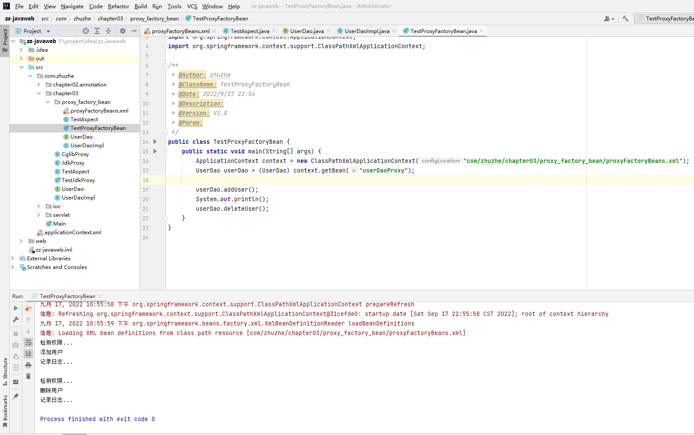


## Spring的AOP实现（AspectJ代理）

新依赖包：spring-aspects-4.3.6.RELEASE.jar

新依赖包：http://mvnrepository.com/artifact/org.aspectj/aspectjweaver/1.8.10


1. 新建一个切面类

   切面和前面ProxyFactoryBean类似，要定义代理方法，也就是增强处理方法

   ```java
   import org.aspectj.lang.JoinPoint;
   import org.aspectj.lang.ProceedingJoinPoint;
   
   /**
    * @Author: zhuzhe
    * @ClassName: TestAspect
    * @Date: 2022/9/17 23:14
    * @Description:
    * @Version: V1.0
    * @Param:
    */
   public class TestAspect {
   
       public void before(JoinPoint joinPoint){
           System.out.println("前置通知["+joinPoint.getTarget()+", "+joinPoint.getSignature().getName()+"]...");
       }
   
       public void after(JoinPoint joinPoint){
           System.out.println("后置通知["+joinPoint.getTarget()+", "+joinPoint.getSignature().getName()+"]...");
       }
   
       public Object around(ProceedingJoinPoint proceedingJoinPoint) throws Throwable {
           System.out.println("环绕开始...");
           Object obj = proceedingJoinPoint.proceed();
           System.out.println("环绕结束...");
           return obj;
       }
   
       public void throwing(JoinPoint joinPoint, Throwable t){
           System.out.println("异常通知["+joinPoint.getTarget()+", "+joinPoint.getSignature().getName()+"]..."+t.getMessage());
       }
   
       public void ultimate(){
           System.out.println("最终通知...");
       }
   }
   ```

   被代理的目标对象和之前一样UserDao和UserDaoImpl

   ```java
   public interface UserDao {
       public void addUser();
       public void deleteUser();
   }
   ```

   ```
   public class UserDaoImpl implements UserDao {
   
       @Override
       public void addUser() {
           System.out.println("添加用户");
       }
   
       @Override
       public void deleteUser() {
           System.out.println("删除用户");
       }
   }
   ```

   

   

   

2. 定义aop代理的配置，这部分配置也是可以在docs中找到

   

   aspectJBeans.xml

   ```xml
   <?xml version="1.0" encoding="UTF-8"?>
   <beans xmlns="http://www.springframework.org/schema/beans"
          xmlns:xsi="http://www.w3.org/2001/XMLSchema-instance"
          xmlns:aop="http://www.springframework.org/schema/aop"
          xsi:schemaLocation="http://www.springframework.org/schema/beans
           http://www.springframework.org/schema/beans/spring-beans.xsd
           http://www.springframework.org/schema/aop
           http://www.springframework.org/schema/aop/spring-aop.xsd">
       <!--目标类-->
       <bean id="userDao" class="com.zhuzhe.chapter03.aspect_j.UserDaoImpl"/>
       <!--切面类-->
       <bean id="testAspect" class="com.zhuzhe.chapter03.aspect_j.TestAspect"/>
       <!--aop-->
       <aop:config>
           <!--织入-->
           <aop:aspect ref="testAspect">
               <!--切点：表达式匹配切点-->
               <aop:pointcut id="testPointCut" expression="execution(* com.zhuzhe.chapter03.aspect_j.*.*(..))"/>
               <!--前置通知-->
               <aop:before method="before" pointcut-ref="testPointCut"/>
               <!--后置通知-->
               <aop:after-returning method="after" pointcut-ref="testPointCut" returning="returnVal"/>
               <!--环绕通知-->
               <aop:around method="around" pointcut-ref="testPointCut"/>
               <!--抛出通知-->
               <aop:after-throwing method="throwing" pointcut-ref="testPointCut" throwing="t"/>
               <!--最终通知-->
               <aop:after method="ultimate" pointcut-ref="testPointCut"/>
           </aop:aspect>
       </aop:config>
   </beans>
   ```

   

3. 定义测试方法进行测试

   ```java
   import org.springframework.context.ApplicationContext;
   import org.springframework.context.support.ClassPathXmlApplicationContext;
   
   /**
    * @Author: zhuzhe
    * @ClassName: TestAspectJ
    * @Date: 2022/9/17 23:37
    * @Description:
    * @Version: V1.0
    * @Param:
    */
   public class TestAspectJ {
       public static void main(String[] args) {
           ApplicationContext context = new ClassPathXmlApplicationContext("com/zhuzhe/chapter03/aspect_j/aspectJBeans.xml");
           UserDao userDao = (UserDao) context.getBean("userDao");
   
           userDao.addUser();
           System.out.println();
           userDao.deleteUser();
       }
   }
   ```

   


## Spring的AOP实现（AspectJ注解）

```
代码的流程级别和前面一样，只是将Spring的xml配置文件的配置，通过注解方式声明在类中。
```

这里docs中有提供编写aop的xml标准模板。

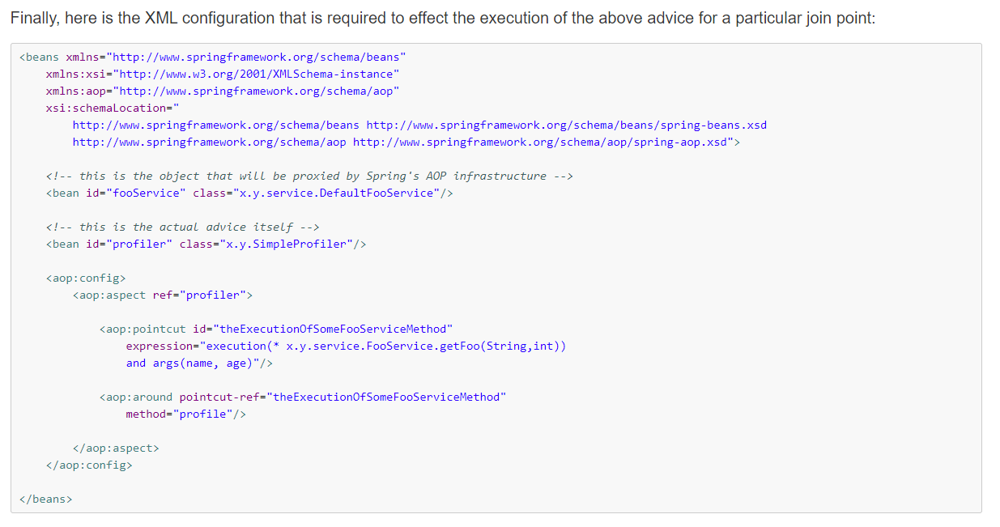

因为这里我们还使用到注解，要加入context的schema。来支持容器自动扫描指定路径下的bean注解。

1. 编写切面类

   切面和前面的TestAspect类似，不过这次要把原来写在xml中的配置给写道TestAspect中。

   ```java
   import org.aspectj.lang.JoinPoint;
   import org.aspectj.lang.ProceedingJoinPoint;
   import org.aspectj.lang.annotation.*;
   import org.springframework.stereotype.Component;
   
   /**
    * @Author: zhuzhe
    * @ClassName: TestAspect
    * @Date: 2022/9/17 23:14
    * @Description: 切面
    * @Version: V1.0
    * @Param:
    */
   @Aspect
   @Component
   public class TestAspect {
   
       //定义切点表达式
       @Pointcut("execution(* com.zhuzhe.chapter03.aspect_j_annotation.*.*(..))")
       private void testPointCut(){};
   
       //前置通知
       @Before("testPointCut()")
       public void before(JoinPoint joinPoint){
           System.out.println("前置通知["+joinPoint.getTarget()+", "+joinPoint.getSignature().getName()+"]...");
       }
   
       //后置通知
       @AfterReturning("testPointCut()")
       public void after(JoinPoint joinPoint){
           System.out.println("后置通知["+joinPoint.getTarget()+", "+joinPoint.getSignature().getName()+"]...");
       }
   
       //环绕通知
       @Around("testPointCut()")
       public Object around(ProceedingJoinPoint proceedingJoinPoint) throws Throwable {
           System.out.println("环绕开始...");
           Object obj = proceedingJoinPoint.proceed();
           System.out.println("环绕结束...");
           return obj;
       }
   
       //异常通知
       @AfterThrowing(value = "testPointCut()", throwing = "t")
       public void throwing(JoinPoint joinPoint, Throwable t){
           System.out.println("异常通知["+joinPoint.getTarget()+", "+joinPoint.getSignature().getName()+"]..."+t.getMessage());
       }
   
       //最终通知
       @After("testPointCut()")
       public void ultimate(){
           System.out.println("最终通知...");
       }
   }
   ```

   

2. 编写目标类

   目标类和前面一样，不用改动

   ```java
   public interface UserDao {
       public void addUser();
       public void deleteUser();
   }
   ```

   ```java
   @Repository("userDao")
   public class UserDaoImpl implements UserDao {
   
       @Override
       public void addUser() {
           System.out.println("添加用户");
       }
   
       @Override
       public void deleteUser() {
           System.out.println("删除用户");
       }
   }
   ```

   

3. 编写配置

   前面有讲到标准模板beans头。还需要添加支持context命名空间的schema。

   ```
   xmlns:context="http://www.springframework.org/schema/context"
   http://www.springframework.org/schema/context http://www.springframework.org/schema/context/spring-context.xsd
   ```

   ```xml
   <?xml version="1.0" encoding="UTF-8"?>
   <beans xmlns="http://www.springframework.org/schema/beans"
          xmlns:xsi="http://www.w3.org/2001/XMLSchema-instance"
          xmlns:aop="http://www.springframework.org/schema/aop"
          xmlns:context="http://www.springframework.org/schema/context"
          xsi:schemaLocation="
           http://www.springframework.org/schema/beans http://www.springframework.org/schema/beans/spring-beans.xsd
           http://www.springframework.org/schema/aop http://www.springframework.org/schema/aop/spring-aop.xsd
           http://www.springframework.org/schema/context http://www.springframework.org/schema/context/spring-context.xsd">
   
       <!--开启注解处理器，指定包扫描-->
       <context:component-scan base-package="com.zhuzhe.chapter03.aspect_j_annotation"/>
       <!--启动支持AspectJ注解-->
       <aop:aspectj-autoproxy/>
   </beans>
   ```

   

4. 编写测试类，并测试效果

   ```java
   import org.springframework.context.ApplicationContext;
   import org.springframework.context.support.ClassPathXmlApplicationContext;
   
   /**
    * @Author: zhuzhe
    * @ClassName: TestAspectJAnnotation
    * @Date: 2022/9/18 16:48
    * @Description:
    * @Version: V1.0
    * @Param:
    */
   public class TestAspectJAnnotation {
       public static void main(String[] args) {
           ApplicationContext context = new ClassPathXmlApplicationContext("com/zhuzhe/chapter03/aspect_j_annotation/aspectJAnnotationBeans.xml");
           UserDao userDao = (UserDao) context.getBean("userDao");
   
           userDao.addUser();
           System.out.println();
           userDao.deleteUser();
       }
   }
   ```

   测试效果：

   


## Spring的JDBC使用

```
创建一个Spring项目，使用JDBC实现基本的业务接口
```

这里的流程和前面最开始介绍的流程一样：Java项目->JavaWeb项目->Spring项目

1. 创建Java项目

   

2. 添加JavaWeb框架支持

   

3. 新建lib文件夹，放入Jdbc编程需要的jar包

   

4. 配置本地Tomcat

   

   

5. 新建实体

   

   ```java
   /**
    * @Author: zhuzhe
    * @ClassName: Account
    * @Date: 2022/9/18 18:08
    * @Description: 账户实体
    * @Version: V1.0
    * @Param:
    */
   public class Account {
       private Integer id;
       private String username;
       private Double balance;
   
       public Integer getId() {
           return id;
       }
   
       public void setId(Integer id) {
           this.id = id;
       }
   
       public String getUsername() {
           return username;
       }
   
       public void setUsername(String username) {
           this.username = username;
       }
   
       public Double getBalance() {
           return balance;
       }
   
       public void setBalance(Double balance) {
           this.balance = balance;
       }
   
       @Override
       public String toString() {
           return "Account{" +
                   "id=" + id +
                   ", username='" + username + '\'' +
                   ", balance=" + balance +
                   '}';
       }
   }
   ```

6. 新建dao

   

   ```java
   import com.zhuzhe.jdbc.entity.Account;
   
   import java.util.List;
   
   /**
    * @Author: zhuzhe
    * @ClassName: AccountDao
    * @Date: 2022/9/18 18:14
    * @Description:
    * @Version: V1.0
    * @Param:
    */
   public interface AccountDao {
       //添加
       int addAccount(Account account);
       //更新
       int updateAccount(Account account);
       //删除
       int deleteAccount(int id);
       //根据id查询
       Account findAccountById(int id);
       //查询所有账户
       List<Account> findAllAccount();
   }
   ```

   ```java
   import com.zhuzhe.jdbc.dao.AccountDao;
   import com.zhuzhe.jdbc.entity.Account;
   import org.springframework.jdbc.core.BeanPropertyRowMapper;
   import org.springframework.jdbc.core.JdbcTemplate;
   import org.springframework.jdbc.core.RowMapper;
   
   import java.util.List;
   
   /**
    * @Author: zhuzhe
    * @ClassName: AccountDaoImpl
    * @Date: 2022/9/18 18:15
    * @Description: 数据访问层
    * @Version: V1.0
    * @Param:
    */
   public class AccountDaoImpl implements AccountDao {
   
       private JdbcTemplate jdbcTemplate;
   
       public void setJdbcTemplate(JdbcTemplate jdbcTemplate) {
           this.jdbcTemplate = jdbcTemplate;
       }
   
       @Override
       public int addAccount(Account account) {
           String sql = "insert into account(username,balance) values(?,?)";
           Object[] params = new Object[]{account.getUsername(),account.getBalance()};
           int num = this.jdbcTemplate.update(sql,params);
           return num;
       }
   
       @Override
       public int updateAccount(Account account) {
           String sql = "update account set username=?,balance=? where id=?";
           Object[] params = new Object[]{account.getUsername(),account.getBalance(),account.getId()};
           int num = this.jdbcTemplate.update(sql,params);
           return num;
       }
   
       @Override
       public int deleteAccount(int id) {
           String sql = "delete from account where id=?";
           int num = this.jdbcTemplate.update(sql,id);
           return num;
       }
   
       @Override
       public Account findAccountById(int id) {
           String sql = "select * from account where id=?";
           RowMapper<Account> rowMapper = new BeanPropertyRowMapper<Account>(Account.class);
           return this.jdbcTemplate.queryForObject(sql,rowMapper,id);
       }
   
       @Override
       public List<Account> findAllAccount() {
           String sql = "select * from account";
           RowMapper<Account> rowMapper = new BeanPropertyRowMapper<Account>(Account.class);
           return this.jdbcTemplate.query(sql,rowMapper);
       }
   }
   ```

   

7. 新建配置文件

   

   applicationContext.xml

   ```java
   <?xml version="1.0" encoding="UTF-8"?>
   <beans xmlns="http://www.springframework.org/schema/beans"
          xmlns:xsi="http://www.w3.org/2001/XMLSchema-instance"
          xsi:schemaLocation="http://www.springframework.org/schema/beans
           http://www.springframework.org/schema/beans/spring-beans.xsd">
   
       <!--配置数据源-->
       <bean id="dataSource" class="org.springframework.jdbc.datasource.DriverManagerDataSource">
           <!--数据库驱动-->
           <property name="driverClassName" value="com.mysql.jdbc.Driver"/>
           <!--连接数据库url-->
           <property name="url" value="jdbc:mysql://127.0.0.1:3306/test-jdbc-db?useUnicode=true&amp;characterEncoding=UTF-8&amp;useSSL=false&amp;serverTimezone=Asia/Shanghai&amp;rewriteBatchedStatements=true"/>
           <!--连接数据库的用户名-->
           <property name="username" value="root"/>
           <!--连接数据库的密码-->
           <property name="password" value="123456"/>
       </bean>
   
       <!--配置JDBC模板-->
       <bean id="jdbcTemplate" class="org.springframework.jdbc.core.JdbcTemplate">
           <!--模板应用数据源-->
           <property name="dataSource" ref="dataSource"/>
       </bean>
   
       <bean id="accountDao" class="com.zhuzhe.jdbc.dao.impl.AccountDaoImpl">
           <property name="jdbcTemplate" ref="jdbcTemplate"/>
       </bean>
   </beans>
   ```

   

8. 新建JUnit测试

   

   

```java
import com.zhuzhe.jdbc.dao.AccountDao;
import com.zhuzhe.jdbc.entity.Account;
import org.junit.Test;
import org.springframework.context.ApplicationContext;
import org.springframework.context.support.ClassPathXmlApplicationContext;
import org.springframework.jdbc.core.JdbcTemplate;

import java.util.List;

/**
 * @Author: zhuzhe
 * @ClassName: JdbcTest
 * @Date: 2022/9/18 17:43
 * @Description: JUnit测试类
 * @Version: V1.0
 * @Param:
 */
public class JdbcTest {
    @Test
    public void test01() {
        System.out.println("hello world!");
    }

    @Test
    public void test02() {
        ApplicationContext context = new ClassPathXmlApplicationContext("applicationContext.xml");
        JdbcTemplate template = (JdbcTemplate) context.getBean("jdbcTemplate");
        template.execute("create table account(`id` int primary key auto_increment, `username` varchar(50), `balance` double )");
        System.out.println("成功创建账户表！");
    }

    @Test
    public void test03() {
        ApplicationContext context = new ClassPathXmlApplicationContext("applicationContext.xml");
        AccountDao accountDao = (AccountDao) context.getBean("accountDao");

        Account account = new Account();
        account.setUsername("zhuzhe1");
        account.setBalance(1001.00);

        int num1 = accountDao.addAccount(account);
        System.out.println("成功添加" + num1 + "个账户。");

        account.setUsername("zhuzhe2");
        account.setBalance(1002.00);
        int num2 = accountDao.addAccount(account);
        System.out.println("成功添加" + num2 + "个账户。");

        account.setUsername("zhuzhe3");
        account.setBalance(1003.00);
        int num3 = accountDao.addAccount(account);
        System.out.println("成功添加" + num3 + "个账户。");

        account.setUsername("zhuzhe4");
        account.setBalance(1004.00);
        int num4 = accountDao.addAccount(account);
        System.out.println("成功添加" + num4 + "个账户。");
    }

    @Test
    public void test04() {
        ApplicationContext context = new ClassPathXmlApplicationContext("applicationContext.xml");
        AccountDao accountDao = (AccountDao) context.getBean("accountDao");

        Account account = new Account();
        account.setId(1);
        account.setUsername("zhuzhe");
        account.setBalance(1020.00);

        int num = accountDao.updateAccount(account);
        System.out.println("成功更新" + num + "个账户。");
    }

    @Test
    public void test05() {
        ApplicationContext context = new ClassPathXmlApplicationContext("applicationContext.xml");
        AccountDao accountDao = (AccountDao) context.getBean("accountDao");

        Account account = accountDao.findAccountById(1);
        System.out.println("查询用户数据：" + account);
    }

    @Test
    public void test06() {
        ApplicationContext context = new ClassPathXmlApplicationContext("applicationContext.xml");
        AccountDao accountDao = (AccountDao) context.getBean("accountDao");

        int num = accountDao.deleteAccount(1);
        System.out.println("成功删除" + num + "条数据。");
    }

    @Test
    public void test07() {
        ApplicationContext context = new ClassPathXmlApplicationContext("applicationContext.xml");
        AccountDao accountDao = (AccountDao) context.getBean("accountDao");

        List<Account> list = accountDao.findAllAccount();
        System.out.println("查询全部用户数据：" + list);
    }

    @Test
    public void test08(){
        ApplicationContext context = new ClassPathXmlApplicationContext("applicationContext.xml");
        JdbcTemplate template = (JdbcTemplate) context.getBean("jdbcTemplate");
        template.execute("drop table if exists account");
        System.out.println("成功删除账户表！");
    }
}
```

测试效果：


 ```
 hello world!
 
 成功创建账户表！
 
 成功添加1个账户。
 成功添加1个账户。
 成功添加1个账户。
 成功添加1个账户。
 
 成功更新1个账户。
 
 查询用户数据：Account{id=1, username='zhuzhe', balance=1020.0}
 
 成功删除1条数据。
 
 查询全部用户数据：[Account{id=2, username='zhuzhe2', balance=1002.0}, Account{id=3, username='zhuzhe3', balance=1003.0}, Account{id=4, username='zhuzhe4', balance=1004.0}]
 
 成功删除账户表！
 
 Process finished with exit code 0
 ```


## Spring的事务管理（基于xml）

```
使用aop的通知来增强事务对一个方法的作用范围。增强的地方就是让事务具备特定传播行为。

定义：定义事务->事务绑定切面->切面定义传播行为->切点织入切面
使用：方法执行->根据不同传播行为进入事务管理->方法异常->事务回滚
```


使用前面创建的Dao。新增一个事务管理的方法。

```java
public interface AccountDao {
    //...
    //转账（测试事务，outUser转出，inUser转入，money金额）
    void transfer(String outUser, String inUser, Double money);
}
```

```java
import com.zhuzhe.jdbc.dao.AccountDao;
import com.zhuzhe.jdbc.entity.Account;
import org.springframework.jdbc.core.JdbcTemplate;


/**
 * @Author: zhuzhe
 * @ClassName: AccountDaoImpl
 * @Date: 2022/9/18 18:15
 * @Description: 数据访问层
 * @Version: V1.0
 * @Param:
 */
public class AccountDaoImpl implements AccountDao {

    private JdbcTemplate jdbcTemplate;

    public void setJdbcTemplate(JdbcTemplate jdbcTemplate) {
        this.jdbcTemplate = jdbcTemplate;
    }
    
    //...

    @Override
    public void transfer(String outUser, String inUser, Double money) {
        //收款
        this.jdbcTemplate.update("update account set balance = balance + ? where username = ?",money,inUser);
        //异常
        int i = 1/0;
        //汇款
        this.jdbcTemplate.update("update account set balance = balance-? where username = ?",money,outUser);
    }
}
```

编写一个配置文件，在前面原有的数据库连接基础上，增加事务管理，并绑定切面。切面织入到切点。

```xml
<?xml version="1.0" encoding="UTF-8"?>
<beans xmlns="http://www.springframework.org/schema/beans"
       xmlns:xsi="http://www.w3.org/2001/XMLSchema-instance"
       xmlns:aop="http://www.springframework.org/schema/aop"
       xmlns:tx="http://www.springframework.org/schema/tx"
       xmlns:context="http://www.springframework.org/schema/context"
       xsi:schemaLocation="
        http://www.springframework.org/schema/beans
        http://www.springframework.org/schema/beans/spring-beans.xsd
        http://www.springframework.org/schema/tx
        http://www.springframework.org/schema/tx/spring-tx.xsd
        http://www.springframework.org/schema/context
        http://www.springframework.org/schema/context/spring-context.xsd
        http://www.springframework.org/schema/aop
        http://www.springframework.org/schema/aop/spring-aop.xsd">

    <!--配置数据源-->
    <bean id="dataSource" class="org.springframework.jdbc.datasource.DriverManagerDataSource">
        <!--数据库驱动-->
        <property name="driverClassName" value="com.mysql.jdbc.Driver"/>
        <!--连接数据库url-->
        <property name="url" value="jdbc:mysql://127.0.0.1:3306/test-jdbc-db?useUnicode=true&amp;characterEncoding=UTF-8&amp;useSSL=false&amp;serverTimezone=Asia/Shanghai&amp;rewriteBatchedStatements=true"/>
        <!--连接数据库的用户名-->
        <property name="username" value="root"/>
        <!--连接数据库的密码-->
        <property name="password" value="123456"/>
    </bean>

    <!--配置JDBC模板-->
    <bean id="jdbcTemplate" class="org.springframework.jdbc.core.JdbcTemplate">
        <!--模板应用数据源-->
        <property name="dataSource" ref="dataSource"/>
    </bean>

    <bean id="accountDao" class="com.zhuzhe.jdbc.dao.impl.AccountDaoImpl">
        <property name="jdbcTemplate" ref="jdbcTemplate"/>
    </bean>

    <!--事务管理器，依赖数据源-->
    <bean id="transactionManager" class="org.springframework.jdbc.datasource.DataSourceTransactionManager">
        <property name="dataSource" ref="dataSource"/>
    </bean>

    <!--通知，对事务操作进行增强-->
    <tx:advice id="testAdvice" transaction-manager="transactionManager">
        <tx:attributes>
            <tx:method name="*" propagation="REQUIRED" isolation="DEFAULT" read-only="false"/>
        </tx:attributes>
    </tx:advice>

    <!--切面：切点处使用通知整合（任意方法被事务管理器响应后会使用通知）-->
    <aop:config>
        <aop:pointcut id="testPointCut" expression="execution(* com.zhuzhe.jdbc.dao.impl.*.*(..))"/>
        <aop:advisor advice-ref="testAdvice" pointcut-ref="testPointCut"/>
    </aop:config>
</beans>
```

测试用例代码

```java
import com.zhuzhe.jdbc.dao.AccountDao;
import com.zhuzhe.jdbc.entity.Account;
import org.junit.Test;
import org.springframework.context.ApplicationContext;
import org.springframework.context.support.ClassPathXmlApplicationContext;
import org.springframework.jdbc.core.JdbcTemplate;


/**
 * @Author: zhuzhe
 * @ClassName: JdbcTest
 * @Date: 2022/9/18 17:43
 * @Description: JUnit测试类
 * @Version: V1.0
 * @Param:
 */
public class JdbcTest {
    //...

    @Test
    public void test09(){

        ApplicationContext context = new ClassPathXmlApplicationContext("com/zhuzhe/jdbc/transfer/applicationContext.xml");
        
        //创建表
        JdbcTemplate template = (JdbcTemplate) context.getBean("jdbcTemplate");
        template.execute("create table account(`id` int primary key auto_increment, `username` varchar(50), `balance` double )");
        System.out.println("成功创建账户表！");

        AccountDao accountDao = (AccountDao) context.getBean("accountDao");
        
        //新增两个账户
        Account account = new Account();
        account.setUsername("cxr");
        account.setBalance(1001.00);
        int num1 = accountDao.addAccount(account);
        System.out.println("成功添加" + num1 + "个账户。");
        account.setUsername("cxk");
        account.setBalance(1002.00);
        int num2 = accountDao.addAccount(account);
        System.out.println("成功添加" + num2 + "个账户。");

        //转账操作
        accountDao.transfer("cxr","cxk",100.0);
        System.out.println("转账成功！");
    }
}
```

正常转账的测试结果：


在方法遇到异常后，通知advice就会触发，然后触发事务执行回滚。


## Spring的事务管理（基于注解）

```
和上面讲的类似，给方法织入切面，切面关联事务，事务在切面中定义传播行为。
使用注解方式将切面、事务合并到一个注解中，在哪个方法进行注解，就表明使用事务并指定传播行为。
```

和上面的操作类似，给原有的接口新增一个事务方法。

```java
import com.zhuzhe.jdbc.entity.Account;

public interface AccountDao {
	//...
    //转账（测试事务，注解）
    void annotationTransfer(String outUser, String inUser, Double money);
}
```

```java
import com.zhuzhe.jdbc.dao.AccountDao;
import com.zhuzhe.jdbc.entity.Account;
import org.springframework.jdbc.core.JdbcTemplate;
import org.springframework.transaction.annotation.Isolation;
import org.springframework.transaction.annotation.Propagation;
import org.springframework.transaction.annotation.Transactional;

import java.util.List;

/**
 * @Author: zhuzhe
 * @ClassName: AccountDaoImpl
 * @Date: 2022/9/18 18:15
 * @Description: 数据访问层
 * @Version: V1.0
 * @Param:
 */
public class AccountDaoImpl implements AccountDao {
    
    //...
    
	//(事务+切面(环绕通知+传播行为))织入到当前方法里
    @Transactional(propagation = Propagation.REQUIRED,isolation = Isolation.DEFAULT, readOnly = false)
    @Override
    public void annotationTransfer(String outUser, String inUser, Double money) {
        //收款
        this.jdbcTemplate.update("update account set balance = balance + ? where username = ?",money,inUser);
        //异常
        int i = 1/0;
        //汇款
        this.jdbcTemplate.update("update account set balance = balance-? where username = ?",money,outUser);
    }
}
```

新增一个配置文件（这里是为了区分开注解和非注解的两种写法）


```xml
<?xml version="1.0" encoding="UTF-8"?>
<beans xmlns="http://www.springframework.org/schema/beans"
       xmlns:xsi="http://www.w3.org/2001/XMLSchema-instance"
       xmlns:aop="http://www.springframework.org/schema/aop"
       xmlns:tx="http://www.springframework.org/schema/tx"
       xmlns:context="http://www.springframework.org/schema/context"
       xsi:schemaLocation="
        http://www.springframework.org/schema/beans
        http://www.springframework.org/schema/beans/spring-beans.xsd
        http://www.springframework.org/schema/tx
        http://www.springframework.org/schema/tx/spring-tx.xsd
        http://www.springframework.org/schema/context
        http://www.springframework.org/schema/context/spring-context.xsd
        http://www.springframework.org/schema/aop
        http://www.springframework.org/schema/aop/spring-aop.xsd">

    <!--配置数据源-->
    <bean id="dataSource" class="org.springframework.jdbc.datasource.DriverManagerDataSource">
        <!--数据库驱动-->
        <property name="driverClassName" value="com.mysql.jdbc.Driver"/>
        <!--连接数据库url-->
        <property name="url" value="jdbc:mysql://127.0.0.1:3306/test-jdbc-db?useUnicode=true&amp;characterEncoding=UTF-8&amp;useSSL=false&amp;serverTimezone=Asia/Shanghai&amp;rewriteBatchedStatements=true"/>
        <!--连接数据库的用户名-->
        <property name="username" value="root"/>
        <!--连接数据库的密码-->
        <property name="password" value="123456"/>
    </bean>

    <!--配置JDBC模板-->
    <bean id="jdbcTemplate" class="org.springframework.jdbc.core.JdbcTemplate">
        <!--模板应用数据源-->
        <property name="dataSource" ref="dataSource"/>
    </bean>

    <bean id="accountDao" class="com.zhuzhe.jdbc.dao.impl.AccountDaoImpl">
        <property name="jdbcTemplate" ref="jdbcTemplate"/>
    </bean>

    <!--事务管理器，依赖数据源-->
    <bean id="transactionManager" class="org.springframework.jdbc.datasource.DataSourceTransactionManager">
        <property name="dataSource" ref="dataSource"/>
    </bean>

    <!--注册事务管理器（启用注解功能）-->
    <tx:annotation-driven transaction-manager="transactionManager"/>

</beans>
```

测试用例：

```java
import com.zhuzhe.jdbc.dao.AccountDao;
import com.zhuzhe.jdbc.entity.Account;
import org.junit.Test;
import org.springframework.context.ApplicationContext;
import org.springframework.context.support.ClassPathXmlApplicationContext;
import org.springframework.jdbc.core.JdbcTemplate;


public class JdbcTest {
	@Test
    public void test10(){

        ApplicationContext context = new ClassPathXmlApplicationContext("com/zhuzhe/jdbc/transfer_annotation/applicationContext.xml");

        //创建表
        JdbcTemplate template = (JdbcTemplate) context.getBean("jdbcTemplate");
        template.execute("create table account(`id` int primary key auto_increment, `username` varchar(50), `balance` double )");
        System.out.println("成功创建账户表！");

        AccountDao accountDao = (AccountDao) context.getBean("accountDao");

        //新增两个账户
        Account account = new Account();
        account.setUsername("cxr");
        account.setBalance(1001.00);
        int num1 = accountDao.addAccount(account);
        System.out.println("成功添加" + num1 + "个账户。");
        account.setUsername("cxk");
        account.setBalance(1002.00);
        int num2 = accountDao.addAccount(account);
        System.out.println("成功添加" + num2 + "个账户。");

        //转账操作
        accountDao.annotationTransfer("cxr","cxk",100.0);
        System.out.println("转账成功！");
    }
}
```

测试效果：


## idea创建MyBatis项目（Maven）


```
1. 创建Maven管理的Java项目
2. 给Java项目添加JavaWeb框架支持，变为JavaEE项目
3. 给JavaEE项目添加Spring框架依赖，变为Spring项目
4. 给Spring框架集成MyBatis框架，变为Spring+MyBatis项目
```

### idea创建Spring MVC项目

1. 新建一个Maven管理的Java项目

   

   填写项目信息、组信息、包信息

   

   生成的Maven空项目，是一个普通Java项目

   

   

2. 将Java项目转为JavaWeb项目（添加JavaWeb框架的支持）

   

   只选择Web Application框架就行

   

   这是构建完成的JavaEE项目（这一个项目在导入Tomcat的包后就可以进行Servlet开发了）

   

3. 将JavaWeb项目转为Spring项目（Spring MVC框架）

   

   ```xml
   <?xml version="1.0" encoding="UTF-8"?>
   <project xmlns="http://maven.apache.org/POM/4.0.0"
            xmlns:xsi="http://www.w3.org/2001/XMLSchema-instance"
            xsi:schemaLocation="http://maven.apache.org/POM/4.0.0 http://maven.apache.org/xsd/maven-4.0.0.xsd">
       <modelVersion>4.0.0</modelVersion>
   
       <groupId>com.zhuzhe</groupId>
       <artifactId>mybatis-demo</artifactId>
       <version>1.0-SNAPSHOT</version>
   
       <properties>
           <maven.compiler.source>8</maven.compiler.source>
           <maven.compiler.target>8</maven.compiler.target>
       </properties>
   
       <dependencies>
           <dependency>
               <groupId>org.springframework</groupId>
               <artifactId>spring-webmvc</artifactId>
               <version>5.3.12</version>
           </dependency>
           <dependency>
               <groupId>javax.servlet</groupId>
               <artifactId>javax.servlet-api</artifactId>
               <version>4.0.1</version>
               <scope>provided</scope>
           </dependency>
       </dependencies>
   </project>
   ```

   新建一个Controller

   

   定义为返回Json数据的接口（@RestController = @ResponseBody + @Controller）

   

   ```java
   import org.springframework.web.bind.annotation.GetMapping;
   import org.springframework.web.bind.annotation.RestController;
   
   /**
    * @Author: zhuzhe
    * @ClassName: TestController
    * @Date: 2022/9/20 15:07
    * @Description:
    * @Version: V1.0
    * @Param:
    */
   @RestController
   public class TestController {
       @GetMapping("hello")
       public String hello(){
           return "Hello Spring!";
       }
   }
   ```

   新建一个Spring容器配置。

   

   内容是：启动Spring容器后，以context命名空间来开启Spring注解扫描。

   

   ```xml
   <?xml version="1.0" encoding="UTF-8"?>
   <beans xmlns="http://www.springframework.org/schema/beans"
          xmlns:xsi="http://www.w3.org/2001/XMLSchema-instance"
          xmlns:context="http://www.springframework.org/schema/context"
          xsi:schemaLocation="http://www.springframework.org/schema/beans
           http://www.springframework.org/schema/beans/spring-beans.xsd
           http://www.springframework.org/schema/context
           http://www.springframework.org/schema/context/spring-context.xsd">
   
       <context:component-scan base-package="com.zhuzhe.controller"/>
   
   </beans>
   ```

   在web.xml中配置Spring MVC框架的启动。让请求进入DispatcherServlet

   

   ```xml
   <?xml version="1.0" encoding="UTF-8"?>
   <web-app xmlns="http://xmlns.jcp.org/xml/ns/javaee"
            xmlns:xsi="http://www.w3.org/2001/XMLSchema-instance"
            xsi:schemaLocation="http://xmlns.jcp.org/xml/ns/javaee http://xmlns.jcp.org/xml/ns/javaee/web-app_4_0.xsd"
            version="4.0">
       <servlet>
           <servlet-name>springmvc</servlet-name>
           <servlet-class>org.springframework.web.servlet.DispatcherServlet</servlet-class>
           <init-param>
               <param-name>contextConfigLocation</param-name>
               <param-value>classpath:applicationContext.xml</param-value>
           </init-param>
       </servlet>
       <servlet-mapping>
           <servlet-name>springmvc</servlet-name>
           <url-pattern>/</url-pattern>
       </servlet-mapping>
   </web-app>
   ```

   确保配置：这里项目是用Java8语言开发的。

   

   确保配置：项目Spring框架的配置

   

   确保配置：项目的JavaWeb开发web.xml的配置

   

   确保配置：在pom.xml中成功引用的Jar包依赖

   

   新增一个wab包配置（Web Application:Exploded是以文件夹形式部署，Web Application:Archive是以War包的方式部署）这个war包的内容来自Exploded

   

   这里要新建lib来保存pom.xml的依赖包，没包的话项目部署到Tomcat上找不到包（除非你还把Jar包给copy到Tomcat上）

   

   

   这里全选Jar包（这些包就是你前面pom.xml中编写的依赖所下载的包）

   

   

   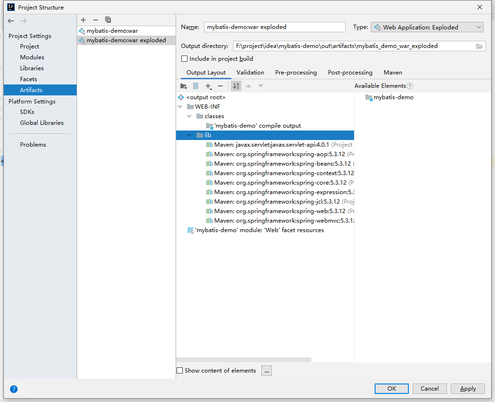

   新增一个Tomcat的配置

   

   选择本地Tomcat服务器

   

   这里建议使用Tomcat9，用Tomcat10的话可能会有兼容问题

   

   选择前面创建的war包来部署到Tomcat上面

   

   

   更改合适的Web应用名称

   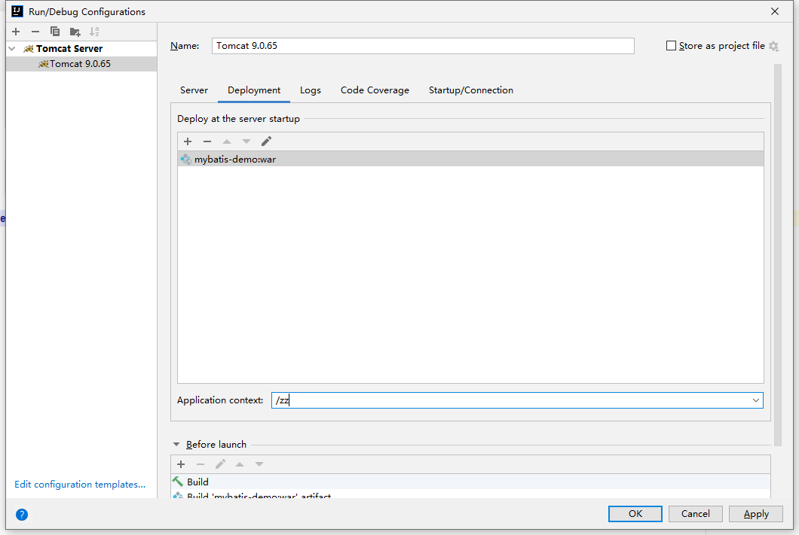

   这里要添加Tomcat在虚拟机以这种字符集的方式来展示日志信息（以其他方式来展示可能乱码）

   

   完成配置后的展示效果

   

   运行成功后的展示效果

   

   成功部署后，会自动打开默认浏览器，访问Web容器

   

   这里我们输入Controller接口的名称，请求会在web.xml配置中被SpringMVC框架接收，然后通过Handler来找到对应的Controller，由这个Controller的接口处理方法并返回。

   


### idea创建SSM项目

```
1. 将SpringMVC项目引入Spring框架、Mybatis框架就成为常见的SSM项目（Spring + Spring MVC + Mybatis）
2. 建立测试库表，编辑基本的Web三层架构代码（表示层：前端页面、业务逻辑层：service、 数据访问层：dao）和实体entity
3. 启动SSM项目，测试代码
```

1. 导入依赖（Spring核心依赖、SpringMVC依赖、MyBatis依赖、其他依赖）

   ```xml
   <?xml version="1.0" encoding="UTF-8"?>
   <project xmlns="http://maven.apache.org/POM/4.0.0"
            xmlns:xsi="http://www.w3.org/2001/XMLSchema-instance"
            xsi:schemaLocation="http://maven.apache.org/POM/4.0.0 http://maven.apache.org/xsd/maven-4.0.0.xsd">
       <modelVersion>4.0.0</modelVersion>
   
       <groupId>com.zhuzhe</groupId>
       <artifactId>mybatis-demo</artifactId>
       <version>1.0-SNAPSHOT</version>
   
       <properties>
           <maven.compiler.source>8</maven.compiler.source>
           <maven.compiler.target>8</maven.compiler.target>
           <spring.version>5.0.2.RELEASE</spring.version>
       </properties>
   
       <dependencies>
            <!--Spring MVC依赖-->
           <dependency>
               <groupId>org.springframework</groupId>
               <artifactId>spring-webmvc</artifactId>
               <version>${spring.version}</version>
           </dependency>
           <!--Spring Aop依赖-->
           <dependency>
               <groupId>org.aspectj</groupId>
               <artifactId>aspectjweaver</artifactId>
               <version>1.6.8</version>
           </dependency>
           <dependency>
               <groupId>org.springframework</groupId>
               <artifactId>spring-aop</artifactId>
               <version>${spring.version}</version>
           </dependency>
           <!--Spring Context依赖-->
           <dependency>
               <groupId>org.springframework</groupId>
               <artifactId>spring-context</artifactId>
               <version>${spring.version}</version>
           </dependency>
           <!--Spring Web依赖-->
           <dependency>
               <groupId>org.springframework</groupId>
               <artifactId>spring-web</artifactId>
               <version>${spring.version}</version>
           </dependency>
           <!--Spring Test依赖-->
           <dependency>
               <groupId>org.springframework</groupId>
               <artifactId>spring-test</artifactId>
               <version>${spring.version}</version>
           </dependency>
           <!--Spring Tx依赖-->
           <dependency>
               <groupId>org.springframework</groupId>
               <artifactId>spring-tx</artifactId>
               <version>${spring.version}</version>
           </dependency>
           <!--Spring Jdbc依赖-->
           <dependency>
               <groupId>org.springframework</groupId>
               <artifactId>spring-jdbc</artifactId>
               <version>${spring.version}</version>
           </dependency>
   
           <!--Servlet依赖-->
           <dependency>
               <groupId>javax.servlet</groupId>
               <artifactId>servlet-api</artifactId>
               <version>2.5</version>
               <scope>provided</scope>
           </dependency>
           <!--JUnit依赖-->
           <dependency>
               <groupId>junit</groupId>
               <artifactId>junit</artifactId>
               <version>4.12</version>
               <scope>test</scope>
           </dependency>
           <!--mysql驱动依赖-->
           <dependency>
               <groupId>mysql</groupId>
               <artifactId>mysql-connector-java</artifactId>
               <version>8.0.15</version>
           </dependency>
           <!--log4j依赖-->
           <dependency>
               <groupId>log4j</groupId>
               <artifactId>log4j</artifactId>
               <version>1.2.12</version>
           </dependency>
           <dependency>
               <groupId>org.slf4j</groupId>
               <artifactId>slf4j-api</artifactId>
               <version>1.6.6</version>
           </dependency>
           <dependency>
               <groupId>org.slf4j</groupId>
               <artifactId>slf4j-log4j12</artifactId>
               <version>1.6.6</version>
           </dependency>
           <!--MyBatis依赖-->
           <dependency>
               <groupId>org.mybatis</groupId>
               <artifactId>mybatis</artifactId>
               <version>3.4.5</version>
           </dependency>
           <dependency>
               <groupId>org.mybatis</groupId>
               <artifactId>mybatis-spring</artifactId>
               <version>1.3.0</version>
           </dependency>
   
           <!--Jackson依赖-->
           <dependency>
               <groupId>com.fasterxml.jackson.core</groupId>
               <artifactId>jackson-core</artifactId>
               <version>2.12.5</version>
           </dependency>
           <dependency>
               <groupId>com.fasterxml.jackson.core</groupId>
               <artifactId>jackson-databind</artifactId>
               <version>2.12.5</version>
           </dependency>
           <dependency>
               <groupId>com.fasterxml.jackson.core</groupId>
               <artifactId>jackson-annotations</artifactId>
               <version>2.12.5</version>
           </dependency>
   
       </dependencies>
   </project>
   ```

   

2. 将依赖包拉到项目中（因为是传统JavaWeb项目，所以最后打包是要把依赖Jar包打到war包中）

   

3. 编写一个spring-mvc.xml文件。（拆分之前的applicationContext.xml文件，这里spring-mvc就只负责MVC的框架配置）更改扫描直接扫整个大文件夹

   ```xml
   <?xml version="1.0" encoding="UTF-8"?>
   <beans xmlns="http://www.springframework.org/schema/beans"
          xmlns:mvc="http://www.springframework.org/schema/mvc"
          xmlns:xsi="http://www.w3.org/2001/XMLSchema-instance"
          xmlns:context="http://www.springframework.org/schema/context"
          xmlns:aop="http://www.springframework.org/schema/aop"
          xmlns:tx="http://www.springframework.org/schema/tx"
          xsi:schemaLocation="http://www.springframework.org/schema/beans
          http://www.springframework.org/schema/beans/spring-beans.xsd
          http://www.springframework.org/schema/context
          http://www.springframework.org/schema/context/spring-context.xsd
          http://www.springframework.org/schema/aop
          http://www.springframework.org/schema/aop/spring-aop.xsd
          http://www.springframework.org/schema/tx
          http://www.springframework.org/schema/tx/spring-tx.xsd
          http://www.springframework.org/schema/mvc
          http://www.springframework.org/schema/mvc/spring-mvc.xsd">
       <!--开启注解扫描，要扫描整个项目代码-->
       <context:component-scan base-package="com.zhuzhe"/>
   
       <!--处理映射器-->
       <bean class="org.springframework.web.servlet.handler.BeanNameUrlHandlerMapping"/>
       <!--处理设配器-->
       <bean class="org.springframework.web.servlet.mvc.SimpleControllerHandlerAdapter"/>
   
       <!--配置Spring开启MVC的注解支持-->
       <mvc:annotation-driven/>
   
       <!--Jackson处理控制器返回对象转为Json字符串-->
       <mvc:annotation-driven>
           <mvc:message-converters>
               <bean class="org.springframework.http.converter.StringHttpMessageConverter">
                   <constructor-arg value="UTF-8"/>
               </bean>
               <bean class="org.springframework.http.converter.json.MappingJackson2HttpMessageConverter">
                   <property name="objectMapper">
                       <bean class="org.springframework.http.converter.json.Jackson2ObjectMapperFactoryBean">
                           <property name="failOnEmptyBeans" value="false"/>
                       </bean>
                   </property>
               </bean>
           </mvc:message-converters>
       </mvc:annotation-driven>
   </beans>
   ```

4. 编写spring.xml配置（负责加载Spring容器还有启动相关的bean：jdbc、mybatis、transaction）

   ```xml
   <?xml version="1.0" encoding="UTF-8"?>
   <beans xmlns="http://www.springframework.org/schema/beans"
          xmlns:xsi="http://www.w3.org/2001/XMLSchema-instance"
          xmlns:context="http://www.springframework.org/schema/context"
          xmlns:aop="http://www.springframework.org/schema/aop"
          xmlns:tx="http://www.springframework.org/schema/tx"
          xsi:schemaLocation="http://www.springframework.org/schema/beans
          http://www.springframework.org/schema/beans/spring-beans.xsd
          http://www.springframework.org/schema/context
          http://www.springframework.org/schema/context/spring-context.xsd
          http://www.springframework.org/schema/aop
          http://www.springframework.org/schema/aop/spring-aop.xsd
          http://www.springframework.org/schema/tx
          http://www.springframework.org/schema/tx/spring-tx.xsd">
       <!--开启注解扫描，要扫描整个项目代码-->
       <context:component-scan base-package="com.zhuzhe"/>
   
       <!--引入配置文件-->
       <bean id="propertyPlaceholderConfigurer" class="org.springframework.beans.factory.config.PropertyPlaceholderConfigurer">
           <property name="location" value="classpath:jdbc.properties"/>
       </bean>
   
       <bean id="dataSource" class="org.springframework.jdbc.datasource.DriverManagerDataSource">
           <!--数据库驱动-->
           <property name="driverClassName" value="com.mysql.jdbc.Driver"/>
           <!--连接数据库url-->
           <property name="url" value="jdbc:mysql://127.0.0.1:3306/mybatis?useUnicode=true&amp;characterEncoding=UTF-8&amp;useSSL=false&amp;serverTimezone=Asia/Shanghai&amp;rewriteBatchedStatements=true"/>
           <!--连接数据库的用户名-->
           <property name="username" value="root"/>
           <!--连接数据库的密码-->
           <property name="password" value="123456"/>
       </bean>
   
       <!--MyBatis连接数据源-->
       <bean id="sqlSessionFactory" class="org.mybatis.spring.SqlSessionFactoryBean">
           <property name="dataSource" ref="dataSource"/>
           <property name="mapperLocations" value="classpath:mapping/*.xml"/>
       </bean>
       <!--Mybatis配置扫描持久层方法-->
       <bean class="org.mybatis.spring.mapper.MapperScannerConfigurer">
           <property name="basePackage" value="com.zhuzhe.dao"/>
           <property name="sqlSessionFactoryBeanName" value="sqlSessionFactory"/>
       </bean>
       <!--事务管理数据源-->
       <bean class="org.springframework.jdbc.datasource.DataSourceTransactionManager">
           <property name="dataSource" ref="dataSource"/>
       </bean>
   
   </beans>
   ```

5. 在web.xml中配置加载Spring框架和SpringMVC框架的配置文件spring.xml、spring-mvc.xml

   ```xml
   <?xml version="1.0" encoding="UTF-8"?>
   <web-app xmlns="http://xmlns.jcp.org/xml/ns/javaee"
            xmlns:xsi="http://www.w3.org/2001/XMLSchema-instance"
            xsi:schemaLocation="http://xmlns.jcp.org/xml/ns/javaee http://xmlns.jcp.org/xml/ns/javaee/web-app_4_0.xsd"
            version="4.0">
   
       <!--Spring 容器配置-->
       <!--配置Spring的监听器-->
       <display-name>Archetype Created Web Application</display-name>
       <listener>
           <listener-class>org.springframework.web.context.ContextLoaderListener</listener-class>
       </listener>
       <!--配置加载类路径的配置文件-->
       <context-param>
           <param-name>contextConfigLocation</param-name>
           <param-value>classpath:spring.xml</param-value>
       </context-param>
   
       <!--Spring MVC应用前端控制器-->
       <servlet>
           <servlet-name>springmvc</servlet-name>
           <servlet-class>org.springframework.web.servlet.DispatcherServlet</servlet-class>
           <init-param>
               <param-name>contextConfigLocation</param-name>
               <param-value>classpath:spring-mvc.xml</param-value>
           </init-param>
       </servlet>
       <servlet-mapping>
           <servlet-name>springmvc</servlet-name>
           <url-pattern>/</url-pattern>
       </servlet-mapping>
   
   <!--    &lt;!&ndash;配置Spring过滤器&ndash;&gt;-->
   <!--    <filter>-->
   <!--        <filter-name>encodingFilter</filter-name>-->
   <!--        <filter-class>org.springframework.web.filter.CharacterEncodingFilter</filter-class>-->
   <!--        <async-supported>true</async-supported>-->
   <!--        <init-param>-->
   <!--            <param-name>encoding</param-name>-->
   <!--            <param-value>UTF-8</param-value>-->
   <!--        </init-param>-->
   <!--    </filter>-->
   <!--    <filter-mapping>-->
   <!--        <filter-name>encodingFilter</filter-name>-->
   <!--        <url-pattern>/*</url-pattern>-->
   <!--    </filter-mapping>-->
   
   
   </web-app>
   ```

6. 创建一个完成Web三层架构下的文件夹（entity业务持久层，模型、service业务逻辑层、dao数据访问层、mapper映射文件）

   

7. 建表，这里是为了方便后面测试流程

   ```sql
   CREATE TABLE `t_account` (
     `id` int(32) NOT NULL AUTO_INCREMENT,
     `username` varchar(50) DEFAULT NULL,
     `jobs` varchar(50) DEFAULT NULL,
     `phone` varchar(16) DEFAULT NULL,
     PRIMARY KEY (`id`)
   ) ENGINE=InnoDB AUTO_INCREMENT=4 DEFAULT CHARSET=utf8
   
   insert into t_account(1,'zhuzhe','engineer','132xxxx2275');
   insert into t_account(2,'cxr','testers','158xxxx6627');
   insert into t_account(3,'cxk','dancer','188xxxx3341');
   ```

   

8. 对应表建立对应的实体

   ```java
   package com.zhuzhe.entity;
   
   /**
    * @Author: zhuzhe
    * @ClassName: Account
    * @Date: 2022/9/21 18:19
    * @Description:
    * @Version: V1.0
    * @Param:
    */
   public class Account {
       private Integer id;
       private String username;
       private String jobs;
       private String phone;
   
       public Integer getId() {
           return id;
       }
   
       public void setId(Integer id) {
           this.id = id;
       }
   
       public String getUsername() {
           return username;
       }
   
       public void setUsername(String username) {
           this.username = username;
       }
   
       public String getJobs() {
           return jobs;
       }
   
       public void setJobs(String jobs) {
           this.jobs = jobs;
       }
   
       public String getPhone() {
           return phone;
       }
   
       public void setPhone(String phone) {
           this.phone = phone;
       }
   
       @Override
       public String toString() {
           return "Account{" +
                   "id=" + id +
                   ", username='" + username + '\'' +
                   ", jobs='" + jobs + '\'' +
                   ", phone='" + phone + '\'' +
                   '}';
       }
   }
   ```

   

9. 新建一个dao，该dao提供了查询全部用户的方法

   ```java
   import com.zhuzhe.entity.Account;
   
   import java.util.List;
   
   /**
    * @Author: zhuzhe
    * @ClassName: AccountDao
    * @Date: 2022/9/21 18:59
    * @Description:
    * @Version: V1.0
    * @Param:
    */
   public interface AccountDao {
       public List<Account> findAll();
   }
   ```

   

   

10. 同时建立一样名称的mapper，主要是默认mybatis去找到这个mapper文件，将dao的调用方法去查询对应mapper执行SQL 

    ```xml
    <?xml version="1.0" encoding="UTF-8"?>
    <!DOCTYPE mapper
            PUBLIC "-//mybatis.org//DTD Mapper 3.0//EN"
            "http://mybatis.org/dtd/mybatis-3-mapper.dtd">
    <mapper namespace="com.zhuzhe.dao.AccountDao">
        <select id="findAll" resultType="com.zhuzhe.entity.Account">
            select * from t_account;
        </select>
    </mapper>
    ```

    

11. 新建一个service，来调用dao（前面的spring.xml配置了注解扫描，所以这里用依赖注入的方式来使用dao对象）

    ```java
    import com.zhuzhe.entity.Account;
    
    import java.util.List;
    
    /**
     * @Author: zhuzhe
     * @ClassName: AccountService
     * @Date: 2022/9/21 18:20
     * @Description:
     * @Version: V1.0
     * @Param:
     */
    public interface AccountService {
        public List<Account> findAll();
    }
    ```

    ```java
    import com.zhuzhe.dao.AccountDao;
    import com.zhuzhe.entity.Account;
    import com.zhuzhe.service.AccountService;
    import org.springframework.beans.factory.annotation.Autowired;
    import org.springframework.stereotype.Service;
    
    import java.util.List;
    
    /**
     * @Author: zhuzhe
     * @ClassName: AccountServiceImpl
     * @Date: 2022/9/21 18:21
     * @Description:
     * @Version: V1.0
     * @Param:
     */
    @Service
    public class AccountServiceImpl implements AccountService {
        @Autowired
        public AccountDao accountDao;
    
        @Override
        public List<Account> findAll() {
            System.out.println("service层:findAll-查询全部用户");
            return accountDao.findAll();
        }
    }
    ```

    

12. 在原有的controller中新建一个方法，也是使用依赖注入的方式来调用service

    ```java
    import com.zhuzhe.entity.Account;
    import com.zhuzhe.service.AccountService;
    import org.springframework.beans.factory.annotation.Autowired;
    import org.springframework.web.bind.annotation.GetMapping;
    import org.springframework.web.bind.annotation.RestController;
    
    import java.util.List;
    
    /**
     * @Author: zhuzhe
     * @ClassName: TestController
     * @Date: 2022/9/20 15:07
     * @Description:
     * @Version: V1.0
     * @Param:
     */
    @RestController
    public class TestController {
        @Autowired
        private AccountService accountService;
    
        @GetMapping("test01")
        public String test01(){
            return "Hello Spring!";
        }
    
        @GetMapping("test02")
        public List<Account> test02(){
            List<Account> list = accountService.findAll();
            System.out.println("查询到的全部用户："+list);
            return list;
        }
    }
    ```

    

13. 项目启动测试

    

    访问接口

    

14. 项目整体结构

    


### SSM项目基本业务接口

1. **findById:根据id查询数据列表**

   修改顺序从底到高，mapper->dao->service->controller

   mapper

   ```xml
   <?xml version="1.0" encoding="UTF-8"?>
   <!DOCTYPE mapper
           PUBLIC "-//mybatis.org//DTD Mapper 3.0//EN"
           "http://mybatis.org/dtd/mybatis-3-mapper.dtd">
   <mapper namespace="com.zhuzhe.dao.AccountDao">
       <select id="findAll" resultType="com.zhuzhe.entity.Account">
           select * from t_account;
       </select>
   
       <select id="findAccountById" parameterType="Integer" resultType="com.zhuzhe.entity.Account">
           select * from t_account where id = #{id}
       </select>
   </mapper>
   ```

   dao

   ```java
   import com.zhuzhe.entity.Account;
   
   import java.util.List;
   
   /**
    * @Author: zhuzhe
    * @ClassName: AccountDao
    * @Date: 2022/9/21 18:59
    * @Description:
    * @Version: V1.0
    * @Param:
    */
   public interface AccountDao {
       /*查询全部用户*/
       public List<Account> findAll();
       /*根据id查询用户*/
       public Account findAccountById(Integer id);
   }
   ```

   service

   ```java
   import com.zhuzhe.entity.Account;
   
   import java.util.List;
   
   /**
    * @Author: zhuzhe
    * @ClassName: AccountService
    * @Date: 2022/9/21 18:20
    * @Description:
    * @Version: V1.0
    * @Param:
    */
   public interface AccountService {
       public List<Account> findAll();
       public Account findAccountById(Integer id);
   }
   ```

   ```java
   import com.zhuzhe.dao.AccountDao;
   import com.zhuzhe.entity.Account;
   import com.zhuzhe.service.AccountService;
   import org.springframework.beans.factory.annotation.Autowired;
   import org.springframework.stereotype.Service;
   
   import java.util.List;
   
   /**
    * @Author: zhuzhe
    * @ClassName: AccountServiceImpl
    * @Date: 2022/9/21 18:21
    * @Description:
    * @Version: V1.0
    * @Param:
    */
   @Service
   public class AccountServiceImpl implements AccountService {
       @Autowired
       public AccountDao accountDao;
   
       @Override
       public List<Account> findAll() {
           System.out.println("service层:findAll-查询全部用户");
           return accountDao.findAll();
       }
   
       @Override
       public Account findAccountById(Integer id) {
           return accountDao.findAccountById(id);
       }
   }
   ```

   controller

   ```java
   import com.zhuzhe.entity.Account;
   import com.zhuzhe.service.AccountService;
   import org.springframework.beans.factory.annotation.Autowired;
   import org.springframework.web.bind.annotation.GetMapping;
   import org.springframework.web.bind.annotation.RequestParam;
   import org.springframework.web.bind.annotation.RestController;
   
   import java.util.List;
   
   /**
    * @Author: zhuzhe
    * @ClassName: TestController
    * @Date: 2022/9/20 15:07
    * @Description:
    * @Version: V1.0
    * @Param:
    */
   @RestController
   public class TestController {
       @Autowired
       private AccountService accountService;
   
       @GetMapping("test01")
       public String test01(){
           return "Hello Spring!";
       }
   
       @GetMapping("test02")
       public List<Account> test02(){
           List<Account> list = accountService.findAll();
           System.out.println("查询到的全部用户："+list);
           return list;
       }
       
       @GetMapping("findById")
       public Account findById(@RequestParam Integer id){
           return accountService.findAccountById(id);
       }
   }
   ```

   测试效果

   

   

   

   

   

   

   

2. **findByName:根据keyword模糊搜索数据列表**

   mapper

   ```xml
   <?xml version="1.0" encoding="UTF-8"?>
   <!DOCTYPE mapper
           PUBLIC "-//mybatis.org//DTD Mapper 3.0//EN"
           "http://mybatis.org/dtd/mybatis-3-mapper.dtd">
   <mapper namespace="com.zhuzhe.dao.AccountDao">
       <select id="findAll" resultType="com.zhuzhe.entity.Account">
           select * from t_account;
       </select>
   
       <select id="findAccountById" parameterType="Integer" resultType="com.zhuzhe.entity.Account">
           select * from t_account where id = #{id}
       </select>
   
       <select id="findAccountByName" parameterType="String" resultType="com.zhuzhe.entity.Account">
           select * from t_account where username like concat('%',#{name},'%')
       </select>
   </mapper>
   ```

   dao

   ```java
   import java.util.List;
   
   /**
    * @Author: zhuzhe
    * @ClassName: AccountDao
    * @Date: 2022/9/21 18:59
    * @Description:
    * @Version: V1.0
    * @Param:
    */
   public interface AccountDao {
       /*查询全部用户*/
       public List<Account> findAll();
       /*根据id查询用户*/
       public Account findAccountById(Integer id);
       /*根据名称查询用户*/
       public List<Account> findAccountByName(String name);
   }
   ```

   service

   ```java
   import com.zhuzhe.entity.Account;
   
   import java.util.List;
   
   /**
    * @Author: zhuzhe
    * @ClassName: AccountService
    * @Date: 2022/9/21 18:20
    * @Description:
    * @Version: V1.0
    * @Param:
    */
   public interface AccountService {
       public List<Account> findAll();
       public Account findAccountById(Integer id);
       public List<Account> findAccountByName(String name);
   }
   ```

   ```java
   import com.zhuzhe.dao.AccountDao;
   import com.zhuzhe.entity.Account;
   import com.zhuzhe.service.AccountService;
   import org.springframework.beans.factory.annotation.Autowired;
   import org.springframework.stereotype.Service;
   
   import java.util.List;
   
   /**
    * @Author: zhuzhe
    * @ClassName: AccountServiceImpl
    * @Date: 2022/9/21 18:21
    * @Description:
    * @Version: V1.0
    * @Param:
    */
   @Service
   public class AccountServiceImpl implements AccountService {
       @Autowired
       public AccountDao accountDao;
   
       @Override
       public List<Account> findAll() {
           System.out.println("service层:findAll-查询全部用户");
           return accountDao.findAll();
       }
   
       @Override
       public Account findAccountById(Integer id) {
           return accountDao.findAccountById(id);
       }
   
       @Override
       public List<Account> findAccountByName(String name) {
           return accountDao.findAccountByName(name);
       }
   }
   ```

   controller

   ```java
   import com.zhuzhe.entity.Account;
   import com.zhuzhe.service.AccountService;
   import org.springframework.beans.factory.annotation.Autowired;
   import org.springframework.web.bind.annotation.GetMapping;
   import org.springframework.web.bind.annotation.RequestParam;
   import org.springframework.web.bind.annotation.RestController;
   
   import java.util.List;
   
   /**
    * @Author: zhuzhe
    * @ClassName: TestController
    * @Date: 2022/9/20 15:07
    * @Description:
    * @Version: V1.0
    * @Param:
    */
   @RestController
   public class TestController {
       @Autowired
       private AccountService accountService;
   
       @GetMapping("test01")
       public String test01(){
           return "Hello Spring!";
       }
   
       @GetMapping("test02")
       public List<Account> test02(){
           List<Account> list = accountService.findAll();
           System.out.println("查询到的全部用户："+list);
           return list;
       }
   
       @GetMapping("findById")
       public Account findById(@RequestParam Integer id){
           return accountService.findAccountById(id);
       }
   
       @GetMapping("findByName")
       public List<Account> findByName(@RequestParam String name){
           return accountService.findAccountByName(name);
       }
   }
   ```

   测试效果：

   

   

   

   

   

   

   

   

   

3. **addAccount:新增一条数据**

   mapper

   ```xml
   <?xml version="1.0" encoding="UTF-8"?>
   <!DOCTYPE mapper
           PUBLIC "-//mybatis.org//DTD Mapper 3.0//EN"
           "http://mybatis.org/dtd/mybatis-3-mapper.dtd">
   <mapper namespace="com.zhuzhe.dao.AccountDao">
       <select id="findAll" resultType="com.zhuzhe.entity.Account">
           select * from t_account;
       </select>
   
       <select id="findAccountById" parameterType="Integer" resultType="com.zhuzhe.entity.Account">
           select * from t_account where id = #{id}
       </select>
   
       <select id="findAccountByName" parameterType="String" resultType="com.zhuzhe.entity.Account">
           select * from t_account where username like concat('%',#{name},'%')
       </select>
   
       <insert id="addAccount" parameterType="com.zhuzhe.entity.Account">
           insert into t_account(username,jobs,phone) values (#{username},#{jobs},#{phone})
       </insert>
   </mapper>
   ```

   dao

   ```java
   import com.zhuzhe.entity.Account;
   
   import java.util.List;
   
   /**
    * @Author: zhuzhe
    * @ClassName: AccountDao
    * @Date: 2022/9/21 18:59
    * @Description:
    * @Version: V1.0
    * @Param:
    */
   public interface AccountDao {
       /*查询全部用户*/
       public List<Account> findAll();
       /*根据id查询用户*/
       public Account findAccountById(Integer id);
       /*根据名称查询用户*/
       public List<Account> findAccountByName(String name);
       /*新增用户*/
       public Integer addAccount(Account account);
   }
   ```

   service

   ```java
   import com.zhuzhe.entity.Account;
   
   import java.util.List;
   
   /**
    * @Author: zhuzhe
    * @ClassName: AccountService
    * @Date: 2022/9/21 18:20
    * @Description:
    * @Version: V1.0
    * @Param:
    */
   public interface AccountService {
       public List<Account> findAll();
       public Account findAccountById(Integer id);
       public List<Account> findAccountByName(String name);
       public Integer addAccount(Account account);
   }
   ```

   ```java
   import com.zhuzhe.dao.AccountDao;
   import com.zhuzhe.entity.Account;
   import com.zhuzhe.service.AccountService;
   import org.springframework.beans.factory.annotation.Autowired;
   import org.springframework.stereotype.Service;
   
   import java.util.List;
   
   /**
    * @Author: zhuzhe
    * @ClassName: AccountServiceImpl
    * @Date: 2022/9/21 18:21
    * @Description:
    * @Version: V1.0
    * @Param:
    */
   @Service
   public class AccountServiceImpl implements AccountService {
       @Autowired
       public AccountDao accountDao;
   
       @Override
       public List<Account> findAll() {
           System.out.println("service层:findAll-查询全部用户");
           return accountDao.findAll();
       }
   
       @Override
       public Account findAccountById(Integer id) {
           return accountDao.findAccountById(id);
       }
   
       @Override
       public List<Account> findAccountByName(String name) {
           return accountDao.findAccountByName(name);
       }
   
       @Override
       public Integer addAccount(Account account) {
           return accountDao.addAccount(account);
       }
   }
   ```

   这里为了展示效果方便，新增一个网页

   account.html

   ```html
   <!DOCTYPE html>
   <html lang="en">
   <head>
       <meta charset="UTF-8">
       <title>Account</title>
   </head>
   <!--<script type="text/javascript">-->
   <!--    //发送HTTP请求-->
   <!--    var httpRequest = new XMLHttpRequest();-->
   <!--    httpRequest.open('GET','/zz/findAll',true);-->
   <!--    httpRequest.send();-->
   
   <!--    httpRequest.onreadystatechange = function (){-->
   <!--        if (httpRequest.readyState == 4 & httpRequest.status == 200){-->
   <!--            var json = httpRequest.responseText;-->
   <!--            var span = document.getElementById('all_account');-->
   <!--            span.innerText = json;-->
   <!--        }-->
   <!--    }-->
   <!--</script>-->
   <body>
       All Account:
       <iframe id="data_iframe" name="dataIframe" style="" src="/zz/findAll" frameborder="0" width="100%" height="100%"></iframe>
       <form action="/zz/mybatis/addAccount" method="post" target="dataIframe">
           <input hidden name="id">
           用户名：<input type="text" name="username"><br/>
           工作：<input type="text" name="jobs"><br/>
           电话号码：<input type="text" name="phone"><br/>
           <input type="submit" value="新增用户">
       </form>
   </body>
   </html>
   ```

   

   编写一个新的控制器来访问页面MainController.java

   

   ```java
   import com.zhuzhe.entity.Account;
   import com.zhuzhe.service.AccountService;
   import org.springframework.beans.factory.annotation.Autowired;
   import org.springframework.stereotype.Controller;
   import org.springframework.web.bind.annotation.*;
   
   import java.util.List;
   
   /**
    * @Author: zhuzhe
    * @ClassName: MainController
    * @Date: 2022/9/21 23:20
    * @Description:
    * @Version: V1.0
    * @Param:
    */
   @Controller
   @RequestMapping("mybatis")
   public class MainController {
       @Autowired
       TestController testController;
       @Autowired
       private AccountService accountService;
       
       /*返回account.html页面*/
       @GetMapping("account")
       public String searchHtml() {
           System.out.println("search html");
           return "account";
       }
   
       @PostMapping("addAccount")
       @ResponseBody
       public List<Account> addAccount(Account account){
           System.out.println("account = " + account);
           int num = accountService.addAccount(account);
           System.out.println("成功新增" + num +"个用户！");
           return testController.findAll();
       }
   }
   ```

   在spring-mvc.xml中新增视图解析器，为返回视图的controller找到对应的网页

   ```xml
   <?xml version="1.0" encoding="UTF-8"?>
   <beans xmlns="http://www.springframework.org/schema/beans"
          xmlns:mvc="http://www.springframework.org/schema/mvc"
          xmlns:xsi="http://www.w3.org/2001/XMLSchema-instance"
          xmlns:context="http://www.springframework.org/schema/context"
          xmlns:aop="http://www.springframework.org/schema/aop"
          xmlns:tx="http://www.springframework.org/schema/tx"
          xsi:schemaLocation="http://www.springframework.org/schema/beans
          http://www.springframework.org/schema/beans/spring-beans.xsd
          http://www.springframework.org/schema/context
          http://www.springframework.org/schema/context/spring-context.xsd
          http://www.springframework.org/schema/aop
          http://www.springframework.org/schema/aop/spring-aop.xsd
          http://www.springframework.org/schema/tx
          http://www.springframework.org/schema/tx/spring-tx.xsd
          http://www.springframework.org/schema/mvc
          http://www.springframework.org/schema/mvc/spring-mvc.xsd">
       <!--开启注解扫描，要扫描整个项目代码-->
       <context:component-scan base-package="com.zhuzhe"/>
   
       <!--处理映射器-->
       <bean class="org.springframework.web.servlet.handler.BeanNameUrlHandlerMapping"/>
       <!--处理设配器-->
       <bean class="org.springframework.web.servlet.mvc.SimpleControllerHandlerAdapter"/>
   
       <!--配置Spring开启MVC的注解支持-->
       <mvc:annotation-driven/>
   
       <!--Jackson处理控制器返回对象转为Json字符串-->
       <mvc:annotation-driven>
           <mvc:message-converters>
               <bean class="org.springframework.http.converter.StringHttpMessageConverter">
                   <constructor-arg value="UTF-8"/>
               </bean>
               <bean class="org.springframework.http.converter.json.MappingJackson2HttpMessageConverter">
                   <property name="objectMapper">
                       <bean class="org.springframework.http.converter.json.Jackson2ObjectMapperFactoryBean">
                           <property name="failOnEmptyBeans" value="false"/>
                       </bean>
                   </property>
               </bean>
           </mvc:message-converters>
       </mvc:annotation-driven>
   
       <!-- 配置视图解析器 -->
       <bean id="viewResolver" class="org.springframework.web.servlet.view.InternalResourceViewResolver">
           <property name="prefix" value="/"/>
           <property name="suffix" value=".html"/>
       </bean>
   </beans>
   ```

   在web.xml中配置对页面资源访问的通过

   ```xml
   <?xml version="1.0" encoding="UTF-8"?>
   <web-app xmlns="http://xmlns.jcp.org/xml/ns/javaee"
            xmlns:xsi="http://www.w3.org/2001/XMLSchema-instance"
            xsi:schemaLocation="http://xmlns.jcp.org/xml/ns/javaee http://xmlns.jcp.org/xml/ns/javaee/web-app_4_0.xsd"
            version="4.0">
   
       <!--Spring 容器配置-->
       <!--配置Spring的监听器-->
       <display-name>Archetype Created Web Application</display-name>
       <listener>
           <listener-class>org.springframework.web.context.ContextLoaderListener</listener-class>
       </listener>
       <!--配置加载类路径的配置文件-->
       <context-param>
           <param-name>contextConfigLocation</param-name>
           <param-value>classpath:spring.xml</param-value>
       </context-param>
   
       <!--Spring MVC应用前端控制器-->
       <servlet>
           <servlet-name>springmvc</servlet-name>
           <servlet-class>org.springframework.web.servlet.DispatcherServlet</servlet-class>
           <init-param>
               <param-name>contextConfigLocation</param-name>
               <param-value>classpath:spring-mvc.xml</param-value>
           </init-param>
       </servlet>
       <servlet-mapping>
           <servlet-name>springmvc</servlet-name>
           <url-pattern>/</url-pattern>
       </servlet-mapping>
   
       <!--配置Spring过滤器-->
       <filter>
           <filter-name>encodingFilter</filter-name>
           <filter-class>org.springframework.web.filter.CharacterEncodingFilter</filter-class>
           <async-supported>true</async-supported>
           <init-param>
               <param-name>encoding</param-name>
               <param-value>UTF-8</param-value>
           </init-param>
       </filter>
       <filter-mapping>
           <filter-name>encodingFilter</filter-name>
           <url-pattern>/*</url-pattern>
       </filter-mapping>
   
       <servlet-mapping>
           <servlet-name>default</servlet-name>
           <url-pattern>*.js</url-pattern>
           <url-pattern>*.html</url-pattern>
           <url-pattern>*.css</url-pattern>
           <url-pattern>*.mp3</url-pattern>
           <url-pattern>*.png</url-pattern>
           <url-pattern>*.jpg</url-pattern>
       </servlet-mapping>
   
   </web-app>
   ```

   这里顺便改了TestController中的接口名，方便调用

   ```java
   import com.zhuzhe.entity.Account;
   import com.zhuzhe.service.AccountService;
   import org.springframework.beans.factory.annotation.Autowired;
   import org.springframework.web.bind.annotation.GetMapping;
   import org.springframework.web.bind.annotation.RequestParam;
   import org.springframework.web.bind.annotation.RestController;
   
   import java.util.List;
   
   /**
    * @Author: zhuzhe
    * @ClassName: TestController
    * @Date: 2022/9/20 15:07
    * @Description:
    * @Version: V1.0
    * @Param:
    */
   @RestController
   public class TestController {
       @Autowired
       private AccountService accountService;
   
       @GetMapping("test01")
       public String test01(){
           return "Hello Spring!";
       }
   
       @GetMapping("findAll")
       public List<Account> findAll(){
           List<Account> list = accountService.findAll();
           System.out.println("查询到的全部用户："+list);
           return list;
       }
   
       @GetMapping("findById")
       public Account findById(@RequestParam Integer id){
           return accountService.findAccountById(id);
       }
   
       @GetMapping("findByName")
       public List<Account> findByName(@RequestParam String name){
           return accountService.findAccountByName(name);
       }
   }
   ```

   启动Tomcat打包部署，

   展示效果：

   

   使用iframe嵌套页面，表单内容提交后会刷新iframe，达到提交就能看到刷新效果

   

   

   

   

   

4. **updateAccountFormId：根据id更新用户**

   mapper

   ```xml
   <?xml version="1.0" encoding="UTF-8"?>
   <!DOCTYPE mapper
           PUBLIC "-//mybatis.org//DTD Mapper 3.0//EN"
           "http://mybatis.org/dtd/mybatis-3-mapper.dtd">
   <mapper namespace="com.zhuzhe.dao.AccountDao">
       <select id="findAll" resultType="com.zhuzhe.entity.Account">
           select * from t_account;
       </select>
   
       <select id="findAccountById" parameterType="Integer" resultType="com.zhuzhe.entity.Account">
           select * from t_account where id = #{id}
       </select>
   
       <select id="findAccountByName" parameterType="String" resultType="com.zhuzhe.entity.Account">
           select * from t_account where username like concat('%',#{name},'%')
       </select>
   
       <insert id="addAccount" parameterType="com.zhuzhe.entity.Account">
           insert into t_account(username,jobs,phone) values (#{username},#{jobs},#{phone})
       </insert>
   
       <update id="updateAccountById" parameterType="com.zhuzhe.entity.Account">
           update t_account set username = #{username} , jobs = #{jobs} , phone = #{phone} where id = #{id}
       </update>
   </mapper>
   ```

   dao

   ```java
   import com.zhuzhe.entity.Account;
   
   import java.util.List;
   
   /**
    * @Author: zhuzhe
    * @ClassName: AccountDao
    * @Date: 2022/9/21 18:59
    * @Description:
    * @Version: V1.0
    * @Param:
    */
   public interface AccountDao {
       /*查询全部用户*/
       public List<Account> findAll();
       /*根据id查询用户*/
       public Account findAccountById(Integer id);
       /*根据名称查询用户*/
       public List<Account> findAccountByName(String name);
       /*新增用户*/
       public Integer addAccount(Account account);
       /*根据id更新用户*/
       public Integer updateAccountById(Account account);
   }
   ```

   service

   ```java
   import com.zhuzhe.entity.Account;
   
   import java.util.List;
   
   /**
    * @Author: zhuzhe
    * @ClassName: AccountService
    * @Date: 2022/9/21 18:20
    * @Description:
    * @Version: V1.0
    * @Param:
    */
   public interface AccountService {
       public List<Account> findAll();
       public Account findAccountById(Integer id);
       public List<Account> findAccountByName(String name);
       public Integer addAccount(Account account);
       public Integer updateAccountById(Account account);
   }
   ```

   ```java
   import com.zhuzhe.dao.AccountDao;
   import com.zhuzhe.entity.Account;
   import com.zhuzhe.service.AccountService;
   import org.springframework.beans.factory.annotation.Autowired;
   import org.springframework.stereotype.Service;
   
   import java.util.List;
   
   /**
    * @Author: zhuzhe
    * @ClassName: AccountServiceImpl
    * @Date: 2022/9/21 18:21
    * @Description:
    * @Version: V1.0
    * @Param:
    */
   @Service
   public class AccountServiceImpl implements AccountService {
       @Autowired
       public AccountDao accountDao;
   
       @Override
       public List<Account> findAll() {
           System.out.println("service层:findAll-查询全部用户");
           return accountDao.findAll();
       }
   
       @Override
       public Account findAccountById(Integer id) {
           return accountDao.findAccountById(id);
       }
   
       @Override
       public List<Account> findAccountByName(String name) {
           return accountDao.findAccountByName(name);
       }
   
       @Override
       public Integer addAccount(Account account) {
           return accountDao.addAccount(account);
       }
   
       @Override
       public Integer updateAccountById(Account account) {
           return accountDao.updateAccountById(account);
       }
   }
   ```

   MainController.java

   ```java
   import com.zhuzhe.entity.Account;
   import com.zhuzhe.service.AccountService;
   import org.springframework.beans.factory.annotation.Autowired;
   import org.springframework.stereotype.Controller;
   import org.springframework.web.bind.annotation.*;
   
   /**
    * @Author: zhuzhe
    * @ClassName: MainController
    * @Date: 2022/9/21 23:20
    * @Description:
    * @Version: V1.0
    * @Param:
    */
   @Controller
   @RequestMapping("mybatis")
   public class MainController {
       @Autowired
       private AccountService accountService;
   
       /*返回account.html页面*/
       @GetMapping("account")
       public String searchHtml() {
           System.out.println("search html");
           return "account";
       }
   
       @PostMapping("addAccount")
       @ResponseBody
       public Integer addAccount(Account account){
           System.out.println("account = " + account);
           int num = accountService.addAccount(account);
           System.out.println("成功新增" + num +"个用户！");
           return num;
       }
   
       @PostMapping("updateAccountById")
       @ResponseBody
       public Integer updateAccountById(Account account){
           System.out.println("account = " + account);
           int num = accountService.updateAccountById(account);
           System.out.println("成功更新" + num +"个用户！");
           return num;
       }
   }
   ```

   更改之前的展示网页，顶部展示数据使用单选框，底部为数据操作，刷新按钮查看操作完后的效果

   ```html
   <!DOCTYPE html>
   <html lang="en">
   <head>
       <meta charset="UTF-8">
       <title>Account</title>
   </head>
   <script type="text/javascript">
       //发送HTTP请求，将数据解析到html标签中
       var httpRequest = new XMLHttpRequest();
       httpRequest.open('GET','/zz/findAll',true);
       httpRequest.send();
   
       httpRequest.onreadystatechange = function (){
           if (httpRequest.readyState == 4 & httpRequest.status == 200){
               var json = httpRequest.responseText;
               var array = JSON.parse(json);
               var innerStr = "";
               for (let i = 0; i < array.length; i++) {
                   console.log(array[i]);
                   innerStr+="<label><input type='radio' value='"+array[i].id+"' name='id' onclick='javascript:radioClick(this)'><sub>"+JSON.stringify(array[i])+"</sub></label><br/>";
               }
               var allCount = document.getElementById('all_account');
               allCount.innerHTML = innerStr;
           }
       }
   
       function radioClick(obj) {
           var httpRequest = new XMLHttpRequest();
           httpRequest.open('GET','/zz/findById?id='+obj.value,true);
           httpRequest.send();
           httpRequest.onreadystatechange = function (){
               if (httpRequest.readyState == 4 & httpRequest.status == 200){
                   var json = httpRequest.responseText;
                   var account = JSON.parse(json);
                   document.forms['updateForm']['id'].value = account.id;
                   document.forms['updateForm']['username'].value = account.username;
                   document.forms['updateForm']['jobs'].value = account.jobs;
                   document.forms['updateForm']['phone'].value = account.phone;
               }
           }
       }
   </script>
   <body>
       All Account:
       <div id="all_account" style="overflow: scroll; width: auto;height: 200px"></div>
   
       <button onclick="javascript:window.location.reload()">刷新</button><br>
   
       新增用户：<br/>
       <form id="addForm" action="/zz/mybatis/addAccount" method="post" target="dataIframe" name="addForm">
           <input hidden name="id">
           用户名：<input type="text" name="username"><br/>
           工作：<input type="text" name="jobs"><br/>
           电话号码：<input type="text" name="phone"><br/>
           <input type="submit" value="新增用户">
       </form>
   
       修改用户：<br/>
       <form id="updateForm" action="/zz/mybatis/updateAccountById" method="post" target="dataIframe" name="updateForm">
           <input hidden name="id">
           用户名：<input type="text" name="username"><br/>
           工作：<input type="text" name="jobs"><br/>
           电话号码：<input type="text" name="phone"><br/>
           <input type="submit" value="修改用户">
       </form>
       <iframe name="dataIframe" style="" src="" frameborder="0" width="100%" height="200px" hidden></iframe>
   </body>
   </html>
   ```

   打包部署查看效果：

   

   点击上面的一条数据，可以看到修改栏那里出现了改字段的内容

   

   在输入框中修改数据内容，点击修改用户提交请求

   

   修改后点击刷新查看效果

   

   刷新后看到刚才选中修改的数据已经成功应用。此时查看数据库也可以看到是成功更改。

   

   

5. **deleteAccountById：根据id删除用户**

   mapper

   ```xml
   <?xml version="1.0" encoding="UTF-8"?>
   <!DOCTYPE mapper
           PUBLIC "-//mybatis.org//DTD Mapper 3.0//EN"
           "http://mybatis.org/dtd/mybatis-3-mapper.dtd">
   <mapper namespace="com.zhuzhe.dao.AccountDao">
       <select id="findAll" resultType="com.zhuzhe.entity.Account">
           select * from t_account;
       </select>
   
       <select id="findAccountById" parameterType="Integer" resultType="com.zhuzhe.entity.Account">
           select * from t_account where id = #{id}
       </select>
   
       <select id="findAccountByName" parameterType="String" resultType="com.zhuzhe.entity.Account">
           select * from t_account where username like concat('%',#{name},'%')
       </select>
   
       <insert id="addAccount" parameterType="com.zhuzhe.entity.Account">
           insert into t_account(username,jobs,phone) values (#{username},#{jobs},#{phone})
       </insert>
   
       <update id="updateAccountById" parameterType="com.zhuzhe.entity.Account">
           update t_account set username = #{username} , jobs = #{jobs} , phone = #{phone} where id = #{id}
       </update>
   
       <delete id="deleteAccountById" parameterType="Integer">
           delete from t_account where id = #{id}
       </delete>
   </mapper>
   ```

   dao

   ```java
   import com.zhuzhe.entity.Account;
   
   import java.util.List;
   
   /**
    * @Author: zhuzhe
    * @ClassName: AccountDao
    * @Date: 2022/9/21 18:59
    * @Description:
    * @Version: V1.0
    * @Param:
    */
   public interface AccountDao {
       /*查询全部用户*/
       public List<Account> findAll();
       /*根据id查询用户*/
       public Account findAccountById(Integer id);
       /*根据名称查询用户*/
       public List<Account> findAccountByName(String name);
       /*新增用户*/
       public Integer addAccount(Account account);
       /*根据id更新用户*/
       public Integer updateAccountById(Account account);
       /*根据id删除指定用户*/
       public Integer deleteAccountById(Integer id);
   }
   ```

   service

   ```java
   import com.zhuzhe.entity.Account;
   
   import java.util.List;
   
   /**
    * @Author: zhuzhe
    * @ClassName: AccountService
    * @Date: 2022/9/21 18:20
    * @Description:
    * @Version: V1.0
    * @Param:
    */
   public interface AccountService {
       public List<Account> findAll();
       public Account findAccountById(Integer id);
       public List<Account> findAccountByName(String name);
       public Integer addAccount(Account account);
       public Integer updateAccountById(Account account);
       public Integer deleteAccountById(Integer id);
   }
   ```

   ```java
   import com.zhuzhe.dao.AccountDao;
   import com.zhuzhe.entity.Account;
   import com.zhuzhe.service.AccountService;
   import org.springframework.beans.factory.annotation.Autowired;
   import org.springframework.stereotype.Service;
   
   import java.util.List;
   
   /**
    * @Author: zhuzhe
    * @ClassName: AccountServiceImpl
    * @Date: 2022/9/21 18:21
    * @Description:
    * @Version: V1.0
    * @Param:
    */
   @Service
   public class AccountServiceImpl implements AccountService {
       @Autowired
       public AccountDao accountDao;
   
       @Override
       public List<Account> findAll() {
           System.out.println("service层:findAll-查询全部用户");
           return accountDao.findAll();
       }
   
       @Override
       public Account findAccountById(Integer id) {
           return accountDao.findAccountById(id);
       }
   
       @Override
       public List<Account> findAccountByName(String name) {
           return accountDao.findAccountByName(name);
       }
   
       @Override
       public Integer addAccount(Account account) {
           return accountDao.addAccount(account);
       }
   
       @Override
       public Integer updateAccountById(Account account) {
           return accountDao.updateAccountById(account);
       }
   
       @Override
       public Integer deleteAccountById(Integer id) {
           return accountDao.deleteAccountById(id);
       }
   }
   ```

   controller

   ```java
   import com.zhuzhe.entity.Account;
   import com.zhuzhe.service.AccountService;
   import org.springframework.beans.factory.annotation.Autowired;
   import org.springframework.stereotype.Controller;
   import org.springframework.web.bind.annotation.*;
   
   /**
    * @Author: zhuzhe
    * @ClassName: MainController
    * @Date: 2022/9/21 23:20
    * @Description:
    * @Version: V1.0
    * @Param:
    */
   @Controller
   @RequestMapping("mybatis")
   public class MainController {
       @Autowired
       private AccountService accountService;
   
       /*返回account.html页面*/
       @GetMapping("account")
       public String searchHtml() {
           System.out.println("search html");
           return "account";
       }
   
       @PostMapping("addAccount")
       @ResponseBody
       public Integer addAccount(Account account){
           System.out.println("account = " + account);
           int num = accountService.addAccount(account);
           System.out.println("成功新增" + num +"个用户！");
           return num;
       }
   
       @PostMapping("updateAccountById")
       @ResponseBody
       public Integer updateAccountById(Account account){
           System.out.println("account = " + account);
           int num = accountService.updateAccountById(account);
           System.out.println("成功更新" + num +"个用户！");
           return num;
       }
   
       @DeleteMapping("deleteAccountById")
       @ResponseBody
       public Integer deleteAccountById(Integer id){
           return accountService.deleteAccountById(id);
       }
   }
   ```

   同样，这里使用delete请求来实现删除，需要更改前端一些代码

   ```html
   <!DOCTYPE html>
   <html lang="en">
   <head>
       <meta charset="UTF-8">
       <title>Account</title>
   </head>
   <script type="text/javascript">
       //发送HTTP请求，将数据解析到html标签中
       var httpRequest = new XMLHttpRequest();
       httpRequest.open('GET','/zz/findAll',true);
       httpRequest.send();
   
       httpRequest.onreadystatechange = function (){
           if (httpRequest.readyState == 4 & httpRequest.status == 200){
               var json = httpRequest.responseText;
               var array = JSON.parse(json);
               var innerStr = "";
               for (let i = 0; i < array.length; i++) {
                   console.log(array[i]);
                   innerStr+="<label><input type='radio' value='"+array[i].id+"' name='id' onclick='javascript:radioClick(this)'><sub>"+JSON.stringify(array[i])+"<button class='delBtn' value='"+array[i].id+"' onclick='deleteAccount(this)'>删除</button></sub></label><br/>";
               }
               var allCount = document.getElementById('all_account');
               allCount.innerHTML = innerStr;
           }
       }
   
       function radioClick(obj) {
           var httpRequest = new XMLHttpRequest();
           httpRequest.open('GET','/zz/findById?id='+obj.value,true);
           httpRequest.send();
           httpRequest.onreadystatechange = function (){
               if (httpRequest.readyState == 4 & httpRequest.status == 200){
                   var json = httpRequest.responseText;
                   var account = JSON.parse(json);
                   document.forms['updateForm']['id'].value = account.id;
                   document.forms['updateForm']['username'].value = account.username;
                   document.forms['updateForm']['jobs'].value = account.jobs;
                   document.forms['updateForm']['phone'].value = account.phone;
               }
           }
       }
   
       function deleteAccount(obj) {
           //以当前标签位置获取对应单选框的值
           var id = obj.parentNode.parentNode.childNodes[0].value;
           //发送delete请求
           var url = "/zz/mybatis/deleteAccountById";
           var xhr = new XMLHttpRequest();
   
           xhr.open("DELETE", url+'?id='+id, true);
           xhr.onload = function () {
               var json = xhr.responseText
               if (xhr.readyState == 4 && xhr.status == "200") {
                   alert("成功删除"+json+"个用户！")
                   window.location.reload();
               } else {
                   alert("删除失败！")
               }
           }
           xhr.send(null);
       }
   </script>
   <body>
       All Account:
       <div id="all_account" style="overflow: scroll; width: auto;height: 200px"></div>
   
       <button onclick="javascript:window.location.reload()">刷新</button><br>
   
       新增用户：<br/>
       <form id="addForm" action="/zz/mybatis/addAccount" method="post" target="dataIframe" name="addForm">
           <input hidden name="id">
           用户名：<input type="text" name="username"><br/>
           工作：<input type="text" name="jobs"><br/>
           电话号码：<input type="text" name="phone"><br/>
           <input type="submit" value="新增用户">
       </form>
   
       修改用户：<br/>
       <form id="updateForm" action="/zz/mybatis/updateAccountById" method="post" target="dataIframe" name="updateForm">
           <input hidden name="id">
           用户名：<input type="text" name="username"><br/>
           工作：<input type="text" name="jobs"><br/>
           电话号码：<input type="text" name="phone"><br/>
           <input type="submit" value="修改用户">
       </form>
       <iframe name="dataIframe" style="" src="" frameborder="0" width="100%" height="200px" hidden></iframe>
   </body>
   </html>
   ```

   测试效果：

   

   点击按钮后，会以按钮元素的父级的父级的第一个子级元素，即单选框。获取其value元素用来执行删除操作。

   

   

   对照数据库，可以看到数据确实删除了。

   


### ssm项目mybatis复杂写法

1. **将mapper中的相同部分sql进行提取**

   将查询sql提取

   

   

   ```xml
   <?xml version="1.0" encoding="UTF-8"?>
   <!DOCTYPE mapper
           PUBLIC "-//mybatis.org//DTD Mapper 3.0//EN"
           "http://mybatis.org/dtd/mybatis-3-mapper.dtd">
   <mapper namespace="com.zhuzhe.dao.AccountDao">
       <sql id="accountColumns">id,username,jobs,phone</sql>
   
       <select id="findAll" resultType="com.zhuzhe.entity.Account">
           select <include refid="accountColumns"/> from t_account;
       </select>
   
       <select id="findAccountById" parameterType="Integer" resultType="com.zhuzhe.entity.Account">
           select <include refid="accountColumns"/> from t_account where id = #{id}
       </select>
   
       <select id="findAccountByName" parameterType="String" resultType="com.zhuzhe.entity.Account">
           select <include refid="accountColumns"/> from t_account where username like concat('%',#{name},'%')
       </select>
   
       <insert id="addAccount" parameterType="com.zhuzhe.entity.Account">
           insert into t_account(username,jobs,phone) values (#{username},#{jobs},#{phone})
       </insert>
   
       <update id="updateAccountById" parameterType="com.zhuzhe.entity.Account">
           update t_account set username = #{username} , jobs = #{jobs} , phone = #{phone} where id = #{id}
       </update>
   
       <delete id="deleteAccountById" parameterType="Integer">
           delete from t_account where id = #{id}
       </delete>
   </mapper>
   ```

   将查询表进行提取

   

   ```xml
   <?xml version="1.0" encoding="UTF-8"?>
   <!DOCTYPE mapper
           PUBLIC "-//mybatis.org//DTD Mapper 3.0//EN"
           "http://mybatis.org/dtd/mybatis-3-mapper.dtd">
   <mapper namespace="com.zhuzhe.dao.AccountDao">
       <!--动态sql：根据传入不同前缀构建不同表-->
       <sql id="tablename">${prefix}account</sql>
       <!--动态sql：列名-->
       <sql id="accountColumns">id,username,jobs,phone</sql>
       <!--动态sql：根据传入不同值，提供form xxx表的sql代码-->
       <sql id="fromTable">from <include refid="${table}"/></sql>
   
       <select id="findAll" resultType="com.zhuzhe.entity.Account">
           select <include refid="accountColumns"/> from t_account;
       </select>
   
       <select id="findAccountById" parameterType="Integer" resultType="com.zhuzhe.entity.Account">
           select
           <include refid="accountColumns"/><!--传入要查询的字段-->
           <include refid="fromTable"><!--传入要查询的表-->
               <property name="prefix" value="t_"/><!--传入前缀构建好完整表名-->
               <property name="table" value="tablename"/><!--使用表明构建完整查询表sql-->
           </include>
           where id = #{id}
       </select>
   
       <select id="findAccountByName" parameterType="String" resultType="com.zhuzhe.entity.Account">
           select <include refid="accountColumns"/> from t_account where username like concat('%',#{name},'%')
       </select>
   
       <insert id="addAccount" parameterType="com.zhuzhe.entity.Account">
           insert into t_account(username,jobs,phone) values (#{username},#{jobs},#{phone})
       </insert>
   
       <update id="updateAccountById" parameterType="com.zhuzhe.entity.Account">
           update t_account set username = #{username} , jobs = #{jobs} , phone = #{phone} where id = #{id}
       </update>
   
       <delete id="deleteAccountById" parameterType="Integer">
           delete from t_account where id = #{id}
       </delete>
   
   
   </mapper>
   ```

   

   

   

   

   

2. **resultMap手动映射查询结果到指定对象的字段上**

   下面是建一个新的接口来体现这个sql的操作

   新表sql

   ```sql
   use mybatis;
   create table t_user(
   	t_id int primary key auto_increment,
       t_name varchar(50),
       t_age int
   );
   insert into t_user(t_name,t_age) values('zhuzhe',26);
   insert into t_user(t_name,t_age) values('cxr',26);
   insert into t_user(t_name,t_age) values('cxk',24);
   ```

   

   新建实体：User

   

   ```java
   /**
    * @Author: zhuzhe
    * @ClassName: User
    * @Date: 2022/9/23 16:35
    * @Description:
    * @Version: V1.0
    * @Param:
    */
   public class User {
       private Integer id;
       private String name;
       private Integer age;
   
       public Integer getId() {
           return id;
       }
   
       public void setId(Integer id) {
           this.id = id;
       }
   
       public String getName() {
           return name;
       }
   
       public void setName(String name) {
           this.name = name;
       }
   
       public Integer getAge() {
           return age;
       }
   
       public void setAge(Integer age) {
           this.age = age;
       }
   
       @Override
       public String toString() {
           return "User{" +
                   "id=" + id +
                   ", name='" + name + '\'' +
                   ", age=" + age +
                   '}';
       }
   }
   ```

   新建对应的dao

   

   ```java
   import com.zhuzhe.entity.User;
   
   import java.util.List;
   
   /**
    * @Author: zhuzhe
    * @ClassName: UserDao
    * @Date: 2022/9/23 16:37
    * @Description:
    * @Version: V1.0
    * @Param:
    */
   public interface UserDao {
       /*查询全部用户*/
       public List<User> findAllUser();
   }
   ```

   根据dao编写对应的mapper

   

   ```xml
   <?xml version="1.0" encoding="UTF-8"?>
   <!DOCTYPE mapper
           PUBLIC "-//mybatis.org//DTD Mapper 3.0//EN"
           "http://mybatis.org/dtd/mybatis-3-mapper.dtd">
   <mapper namespace="com.zhuzhe.dao.UserDao">
   
       <resultMap id="resultMap" type="com.zhuzhe.entity.User">
           <id property="id" column="t_id"/>
           <id property="name" column="t_name"/>
           <id property="age" column="t_age"/>
       </resultMap>
   
       <select id="findAllUser" resultMap="resultMap">
           select * from t_user
       </select>
   
   </mapper>
   ```

   新建对应的service和Impl

   

   ```java
   import com.zhuzhe.entity.User;
   
   import java.util.List;
   
   /**
    * @Author: zhuzhe
    * @ClassName: UserService
    * @Date: 2022/9/23 16:43
    * @Description:
    * @Version: V1.0
    * @Param:
    */
   public interface UserService {
       public List<User> findAllUser();
   }
   ```

   ```java
   import com.zhuzhe.dao.UserDao;
   import com.zhuzhe.entity.User;
   import com.zhuzhe.service.UserService;
   import org.springframework.beans.factory.annotation.Autowired;
   import org.springframework.stereotype.Service;
   
   import java.util.List;
   
   /**
    * @Author: zhuzhe
    * @ClassName: UserServiceImpl
    * @Date: 2022/9/23 16:43
    * @Description:
    * @Version: V1.0
    * @Param:
    */
   @Service
   public class UserServiceImpl implements UserService {
   
       @Autowired
       private UserDao userDao;
   
       @Override
       public List<User> findAllUser() {
           return userDao.findAllUser();
       }
   }
   ```

   编写对应的controller，提供外部访问

   

   ```java
   import com.zhuzhe.entity.User;
   import com.zhuzhe.service.UserService;
   import org.springframework.beans.factory.annotation.Autowired;
   import org.springframework.web.bind.annotation.GetMapping;
   import org.springframework.web.bind.annotation.RequestMapping;
   import org.springframework.web.bind.annotation.RestController;
   
   import java.util.List;
   
   /**
    * @Author: zhuzhe
    * @ClassName: UserController
    * @Date: 2022/9/23 16:46
    * @Description:
    * @Version: V1.0
    * @Param:
    */
   @RestController
   @RequestMapping("user")
   public class UserController {
   
       @Autowired
       private UserService userService;
   
       @GetMapping("findAll")
       public List<User> findAllUser() {
           return userService.findAllUser();
       }
   }
   ```

   部署项目，测试效果

   


### Mybatis开启日志记录

1. 在前面的pom.xml中已经引入相关的jar依赖

   ```xml
   <?xml version="1.0" encoding="UTF-8"?>
   <project xmlns="http://maven.apache.org/POM/4.0.0"
            xmlns:xsi="http://www.w3.org/2001/XMLSchema-instance"
            xsi:schemaLocation="http://maven.apache.org/POM/4.0.0 http://maven.apache.org/xsd/maven-4.0.0.xsd">
       <modelVersion>4.0.0</modelVersion>
   
       <groupId>com.zhuzhe</groupId>
       <artifactId>mybatis-demo</artifactId>
       <version>1.0-SNAPSHOT</version>
   
       <properties>
           <maven.compiler.source>8</maven.compiler.source>
           <maven.compiler.target>8</maven.compiler.target>
           <spring.version>5.0.2.RELEASE</spring.version>
       </properties>
   
       <dependencies>
           
   		.......
           
           <!--log4j依赖-->
           <dependency>
               <groupId>log4j</groupId>
               <artifactId>log4j</artifactId>
               <version>1.2.12</version>
           </dependency>
           <dependency>
               <groupId>org.slf4j</groupId>
               <artifactId>slf4j-api</artifactId>
               <version>1.6.6</version>
           </dependency>
           <dependency>
               <groupId>org.slf4j</groupId>
               <artifactId>slf4j-log4j12</artifactId>
               <version>1.6.6</version>
           </dependency>
       </dependencies>
   </project>
   ```

   新增log4j的配置文件

   ```properties
   ######################## 将等级为DEBUG的日志信息输出到consoleh和file两个目的地, console和file的定义在下面的代码
   log4j.rootLogger=DEBUG,console,file
   
   ########################控制台输出的相关设置
   log4j.appender.console = org.apache.log4j.ConsoleAppender
   #在控制台输出
   log4j.appender.console.Target = System.out
   #在DEBUG级别输出
   log4j.appender.console.Threshold = DEBUG
   log4j.appender.console.layout = org.apache.log4j.PatternLayout
   #日志格式
   log4j.appender.console.layout.ConversionPattern=[%c]-%m%n
   
   ######################日志输出级别
   log4j.logger.org.mybatis=DEBUG
   log4j.logger.java.sql=DEBUG
   log4j.logger.java.sql.Statement=DEBUG
   log4j.logger.java.sql.ResultSet=DEBUG
   log4j.logger.java.sql.PreparedStatement=DEBUG
   ```

   在spring.xml中，实例化mybatis的bean时，读取指定的mybatis-config.xml配置。而配置去指定使用Log4J来输出执行到数据库的最终SQL

   ```xml
   <?xml version="1.0" encoding="UTF-8"?>
   <beans xmlns="http://www.springframework.org/schema/beans"
          xmlns:xsi="http://www.w3.org/2001/XMLSchema-instance"
          xmlns:context="http://www.springframework.org/schema/context"
          xmlns:aop="http://www.springframework.org/schema/aop"
          xmlns:tx="http://www.springframework.org/schema/tx"
          xsi:schemaLocation="http://www.springframework.org/schema/beans
          http://www.springframework.org/schema/beans/spring-beans.xsd
          http://www.springframework.org/schema/context
          http://www.springframework.org/schema/context/spring-context.xsd
          http://www.springframework.org/schema/aop
          http://www.springframework.org/schema/aop/spring-aop.xsd
          http://www.springframework.org/schema/tx
          http://www.springframework.org/schema/tx/spring-tx.xsd">
       <!--开启注解扫描，要扫描整个项目代码-->
       <context:component-scan base-package="com.zhuzhe"/>
   
       <!--引入配置文件-->
       <bean id="propertyPlaceholderConfigurer" class="org.springframework.beans.factory.config.PropertyPlaceholderConfigurer">
           <property name="location" value="classpath:jdbc.properties"/>
       </bean>
   
       <bean id="dataSource" class="org.springframework.jdbc.datasource.DriverManagerDataSource">
           <!--数据库驱动-->
           <property name="driverClassName" value="com.mysql.jdbc.Driver"/>
           <!--连接数据库url-->
           <property name="url" value="jdbc:mysql://127.0.0.1:3306/mybatis?useUnicode=true&amp;characterEncoding=UTF-8&amp;useSSL=false&amp;serverTimezone=Asia/Shanghai&amp;rewriteBatchedStatements=true"/>
           <!--连接数据库的用户名-->
           <property name="username" value="root"/>
           <!--连接数据库的密码-->
           <property name="password" value="123456"/>
       </bean>
   
   <!--    <bean id="dataSource" class="com.alibaba.druid.pool.DruidDataSource">-->
   <!--        <property name="driverClassName" value="${driver}"/>-->
   <!--        <property name="url" value="${url}"/>-->
   <!--        <property name="username" value="${username}"/>-->
   <!--        <property name="password" value="${password}"/>-->
   <!--        <property name="initialSize" value="${initialSize}"/>-->
   <!--        <property name="maxActive" value="${maxActive}"/>-->
   <!--        <property name="maxIdle" value="${maxIdle}"/>-->
   <!--        <property name="minIdle" value="${minIdle}"/>-->
   <!--        <property name="maxWait" value="${maxWait}"/>-->
   <!--    </bean>-->
   
       <!--MyBatis连接数据源-->
       <bean id="sqlSessionFactory" class="org.mybatis.spring.SqlSessionFactoryBean">
           <property name="dataSource" ref="dataSource"/>
           <property name="mapperLocations" value="classpath:mapping/*.xml"/>
           <property name="configLocation" value="classpath:mybatis-config.xml"/>
       </bean>
       <!--Mybatis配置扫描持久层方法-->
       <bean class="org.mybatis.spring.mapper.MapperScannerConfigurer">
           <property name="basePackage" value="com.zhuzhe.dao"/>
           <property name="sqlSessionFactoryBeanName" value="sqlSessionFactory"/>
       </bean>
   
       <!--事务管理数据源-->
       <bean class="org.springframework.jdbc.datasource.DataSourceTransactionManager">
           <property name="dataSource" ref="dataSource"/>
       </bean>
   
   </beans>
   
   
   ```

   mybatis-config.xml

   ```xml
   <?xml version="1.0" encoding="UTF-8" ?>
   <!DOCTYPE configuration
           PUBLIC "-//mybatis.org//DTD Config 3.0//EN"
           "http://mybatis.org/dtd/mybatis-3-config.dtd">
   <configuration>
       <settings>
           <setting name="logImpl" value="LOG4J"/>
       </settings>
   </configuration>
   ```

   这样就能在日志中看到执行的SQL语句了

   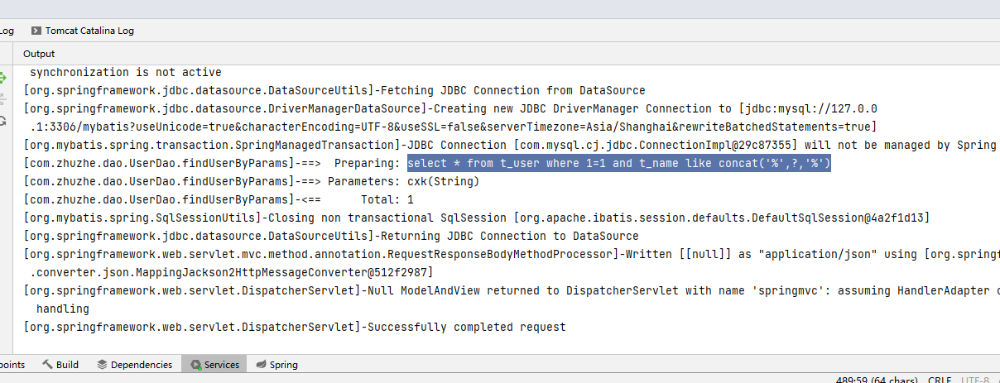

2. 


### Mybatis动态SQL

1. **if标签实现组合条件查询**

   通过实现一个条件查询网页，来体现该功能

   mapper

   ```java
   <?xml version="1.0" encoding="UTF-8"?>
   <!DOCTYPE mapper
           PUBLIC "-//mybatis.org//DTD Mapper 3.0//EN"
           "http://mybatis.org/dtd/mybatis-3-mapper.dtd">
   <mapper namespace="com.zhuzhe.dao.UserDao">
   
       <resultMap id="resultMap" type="com.zhuzhe.entity.User">
           <id property="id" column="t_id"/>
           <id property="name" column="t_name"/>
           <id property="age" column="t_age"/>
       </resultMap>
   
       <select id="findAllUser" resultMap="resultMap">
           select * from t_user
       </select>
   
       <select id="findUserByParams" parameterType="com.zhuzhe.entity.User" resultMap="resultMap">
           select * from t_user where 1=1
           <if test="name!=null and name!=''">
               and t_name like concat('%',#{name},'%')
           </if>
           <if test="age!=null and age!=''">
               and t_age = #{age}
           </if>
       </select>
   </mapper>
   ```

   entity

   ```java
   
   /**
    * @Author: zhuzhe
    * @ClassName: User
    * @Date: 2022/9/23 16:35
    * @Description:
    * @Version: V1.0
    * @Param:
    */
   public class User {
       private Integer id;
       private String name;
       private Integer age;
   
       public Integer getId() {
           return id;
       }
   
       public void setId(Integer id) {
           this.id = id;
       }
   
       public String getName() {
           return name;
       }
   
       public void setName(String name) {
           if (name == null)
               name = "";
           this.name = name;
       }
   
       public Integer getAge() {
           return age;
       }
   
       public void setAge(Integer age) {
           if (age == null)
               age = 0;
           this.age = age;
       }
   
       @Override
       public String toString() {
           return "User{" +
                   "id=" + id +
                   ", name='" + name + '\'' +
                   ", age=" + age +
                   '}';
       }
   }
   ```

   dao

   ```java
   import com.zhuzhe.entity.User;
   
   import java.util.List;
   
   /**
    * @Author: zhuzhe
    * @ClassName: UserDao
    * @Date: 2022/9/23 16:37
    * @Description:
    * @Version: V1.0
    * @Param:
    */
   public interface UserDao {
       /*查询全部用户*/
       public List<User> findAllUser();
       /*根据条件查询用户*/
       public List<User> findUserByParams(User user);
   }
   ```

   service

   ```java
   import com.zhuzhe.entity.User;
   
   import java.util.List;
   
   /**
    * @Author: zhuzhe
    * @ClassName: UserService
    * @Date: 2022/9/23 16:43
    * @Description:
    * @Version: V1.0
    * @Param:
    */
   public interface UserService {
       public List<User> findAllUser();
       public List<User> findUserByParams(User user);
   }
   ```

   ```java
   import com.zhuzhe.dao.UserDao;
   import com.zhuzhe.entity.User;
   import com.zhuzhe.service.UserService;
   import org.springframework.beans.factory.annotation.Autowired;
   import org.springframework.stereotype.Service;
   
   import java.util.List;
   
   /**
    * @Author: zhuzhe
    * @ClassName: UserServiceImpl
    * @Date: 2022/9/23 16:43
    * @Description:
    * @Version: V1.0
    * @Param:
    */
   @Service
   public class UserServiceImpl implements UserService {
   
       @Autowired
       private UserDao userDao;
   
       @Override
       public List<User> findAllUser() {
           return userDao.findAllUser();
       }
   
       @Override
       public List<User> findUserByParams(User user) {
           return userDao.findUserByParams(user);
       }
   }
   ```

   controller

   ```java
   import com.zhuzhe.entity.User;
   import com.zhuzhe.service.UserService;
   import org.springframework.beans.factory.annotation.Autowired;
   import org.springframework.stereotype.Controller;
   import org.springframework.web.bind.annotation.GetMapping;
   import org.springframework.web.bind.annotation.RequestMapping;
   import org.springframework.web.bind.annotation.ResponseBody;
   
   import java.util.List;
   
   /**
    * @Author: zhuzhe
    * @ClassName: UserController
    * @Date: 2022/9/23 16:46
    * @Description:
    * @Version: V1.0
    * @Param:
    */
   @Controller
   @RequestMapping("user")
   public class UserController {
   
       @Autowired
       private UserService userService;
   
       @GetMapping
       public String main(){
           return "user";
       }
   
       @GetMapping("findAll")
       @ResponseBody
       public List<User> findAllUser() {
           return userService.findAllUser();
       }
   
       @GetMapping("findUserByParams")
       @ResponseBody
       public List<User> findUserByParams(String name,Integer age){
           User user = new User();
           user.setName(name);
           user.setAge(age);
           System.out.println("user = " + user);
           List<User> list = userService.findUserByParams(user);
           System.out.println("list = " + list);
           return list;
       }
   }
   ```

   前端页面user.html

   ```html
   <!DOCTYPE html>
   <html lang="en">
   <head>
       <meta charset="UTF-8">
       <title>User</title>
   </head>
   
   <body>
       根据条件查询用户:<br>
       <form action="/zz/user/findUserByParams" method="get">
           名称：<input type="text" name="name" id="name"><br>
           年龄：<input type="number" name="age" id="age"><br>
           <input type="button" value="查询" onclick="findUserByParams()">
       </form>
       查询结果:
       <div id="dataList"></div>
   </body>
   
   <script type="text/javascript">
      	
       findUserByParams();
       
       function findUserByParams() {
           var name = document.getElementById('name').value;
           var age  = document.getElementById('age').value;
   
           var url = "/zz/user/findUserByParams?name="+(name==null?'':name)+"&age="+(age==null?0:age);
           var xhr = new XMLHttpRequest();
   
           xhr.open("GET", url, true);
           xhr.onload = function () {
               var json = xhr.responseText
               if (xhr.readyState == 4 && xhr.status == "200") {
                   var array = JSON.parse(json);
                   var innerStr = "";
                   for (let i = 0; i < array.length; i++) {
                       innerStr+="<label><sub>"+JSON.stringify(array[i])+"</sub></label><br/>";
                   }
                   var dataList = document.getElementById('dataList');
                   dataList.innerHTML = innerStr;
               } else {
                   alert("服务器异常！")
               }
           }
           xhr.send();
       }
   </script>
   </html>
   ```

   解释：在前端网页中，第一次进入时会去加载dom，加载完毕到下面加载script。script脚本中写了一个使用当前表单数据来查询。因为一开始是没条件的，所以展示的是全部的数据。后面可以自己通过键入条件，执行查询来获得查询的效果。

   

   使用关键字cx来查到两条数据

   

   可以配合再加一个条件来筛选出一条数据

   

   同时如果是不存在的数据，则是查不到的

   

   

   

   

   

   

   

   

2. **使用choose、when、otherwise来实现比if两元性多一种选择（如果前面两个都为空，则这一个不能为空）**

   给user表新增一个字段，并填入默认值

   ```sql
   alter table t_user add phone varchar(50);
   update t_user set phone = '132xxxxx275' where t_id = 1;
   update t_user set phone = '158xxxxx323' where t_id = 2;
   ```

   

   修改entity，新增这个字段

   

   ```java
   package com.zhuzhe.entity;
   
   /**
    * @Author: zhuzhe
    * @ClassName: User
    * @Date: 2022/9/23 16:35
    * @Description:
    * @Version: V1.0
    * @Param:
    */
   public class User {
       private Integer id;
       private String name;
       private Integer age;
       private String phone;
   
       public Integer getId() {
           return id;
       }
   
       public void setId(Integer id) {
           this.id = id;
       }
   
       public String getName() {
           return name;
       }
   
       public void setName(String name) {
           if (name == null)
               name = "";
           this.name = name;
       }
   
       public Integer getAge() {
           return age;
       }
   
       public void setAge(Integer age) {
           if (age == null)
               age = 0;
           this.age = age;
       }
   
       public String getPhone() {
           return phone;
       }
   
       public void setPhone(String phone) {
           this.phone = phone;
       }
   
       @Override
       public String toString() {
           return "User{" +
                   "id=" + id +
                   ", name='" + name + '\'' +
                   ", age=" + age +
                   ", phone='" + phone + '\'' +
                   '}';
       }
   }
   
   ```

   修改mapper

   ```xml
   <?xml version="1.0" encoding="UTF-8"?>
   <!DOCTYPE mapper
           PUBLIC "-//mybatis.org//DTD Mapper 3.0//EN"
           "http://mybatis.org/dtd/mybatis-3-mapper.dtd">
   <mapper namespace="com.zhuzhe.dao.UserDao">
   
       <resultMap id="resultMap" type="com.zhuzhe.entity.User">
           <id property="id" column="t_id"/>
           <id property="name" column="t_name"/>
           <id property="age" column="t_age"/>
           <id property="phone" column="phone"/>
       </resultMap>
   
       <select id="findAllUser" resultMap="resultMap">
           select * from t_user
       </select>
   
   <!--    <select id="findUserByParams" parameterType="com.zhuzhe.entity.User" resultMap="resultMap">-->
   <!--        select * from t_user where 1=1-->
   <!--        <if test="name!=null and name!=''">-->
   <!--            and t_name like concat('%',#{name},'%')-->
   <!--        </if>-->
   <!--        <if test="age!=null and age!=''">-->
   <!--            and t_age = #{age}-->
   <!--        </if>-->
   <!--    </select>-->
       <select id="findUserByParams" parameterType="com.zhuzhe.entity.User" resultMap="resultMap">
           select * from t_user where 1=1
           <choose>
               <when test="name!=null and name!=''">
                   and t_name like concat('%',#{name},'%')
               </when>
               <when test="age!=null and age!=''">
                   and t_age = #{age}
               </when>
               <otherwise>
                   and phone is not null
               </otherwise>
           </choose>
       </select>
   
   </mapper>
   ```

   

   部署测试：这里的代码意思是，如果前面两个判断都失效了，那这里的判断就会起效。

   像是一开始进入就是没有条件的，此时就触发otherwise。

   

   但输入条件后就只触发when

   

   

   

   

   

   

   

   

3. **使用where标签来替代 where 1=1的操作，where标签后面如果有多余的and或or将自动识别并删除**

   ```xml
   <?xml version="1.0" encoding="UTF-8"?>
   <!DOCTYPE mapper
           PUBLIC "-//mybatis.org//DTD Mapper 3.0//EN"
           "http://mybatis.org/dtd/mybatis-3-mapper.dtd">
   <mapper namespace="com.zhuzhe.dao.UserDao">
   
       <resultMap id="resultMap" type="com.zhuzhe.entity.User">
           <id property="id" column="t_id"/>
           <id property="name" column="t_name"/>
           <id property="age" column="t_age"/>
           <id property="phone" column="phone"/>
       </resultMap>
   
       <select id="findAllUser" resultMap="resultMap">
           select * from t_user
       </select>
   
   <!--    <select id="findUserByParams" parameterType="com.zhuzhe.entity.User" resultMap="resultMap">-->
   <!--        select * from t_user where 1=1-->
   <!--        <if test="name!=null and name!=''">-->
   <!--            and t_name like concat('%',#{name},'%')-->
   <!--        </if>-->
   <!--        <if test="age!=null and age!=''">-->
   <!--            and t_age = #{age}-->
   <!--        </if>-->
   <!--    </select>-->
       
   <!--    <select id="findUserByParams" parameterType="com.zhuzhe.entity.User" resultMap="resultMap">-->
   <!--        select * from t_user where 1=1-->
   <!--        <choose>-->
   <!--            <when test="name!=null and name!=''">-->
   <!--                and t_name like concat('%',#{name},'%')-->
   <!--            </when>-->
   <!--            <when test="age!=null and age!=''">-->
   <!--                and t_age = #{age}-->
   <!--            </when>-->
   <!--            <otherwise>-->
   <!--                and phone is not null-->
   <!--            </otherwise>-->
   <!--        </choose>-->
   <!--    </select>-->
   
   
           <select id="findUserByParams" parameterType="com.zhuzhe.entity.User" resultMap="resultMap">
               select * from t_user 
               
               <where>
                   <if test="name!=null and name!=''">
                       and t_name like concat('%',#{name},'%')
                   </if>
                   <if test="age!=null and age!=''">
                       and t_age = #{age}
                   </if>
               </where>
               
           </select>
   </mapper>
   ```

   

   测试效果一致

   

   

   

   

   

   

   

   

4. **使用trim标签来实现（定义一个前缀，并且这个前缀的出现将是覆盖指定的字符）**

   定义一个where字符，这个字符将会以替代后面出现的第一个and字符

   ```xml
   <?xml version="1.0" encoding="UTF-8"?>
   <!DOCTYPE mapper
           PUBLIC "-//mybatis.org//DTD Mapper 3.0//EN"
           "http://mybatis.org/dtd/mybatis-3-mapper.dtd">
   <mapper namespace="com.zhuzhe.dao.UserDao">
   
       <resultMap id="resultMap" type="com.zhuzhe.entity.User">
           <id property="id" column="t_id"/>
           <id property="name" column="t_name"/>
           <id property="age" column="t_age"/>
           <id property="phone" column="phone"/>
       </resultMap>
   
       <select id="findAllUser" resultMap="resultMap">
           select * from t_user
       </select>
   
   <!--    <select id="findUserByParams" parameterType="com.zhuzhe.entity.User" resultMap="resultMap">-->
   <!--        select * from t_user where 1=1-->
   <!--        <if test="name!=null and name!=''">-->
   <!--            and t_name like concat('%',#{name},'%')-->
   <!--        </if>-->
   <!--        <if test="age!=null and age!=''">-->
   <!--            and t_age = #{age}-->
   <!--        </if>-->
   <!--    </select>-->
       
   <!--    <select id="findUserByParams" parameterType="com.zhuzhe.entity.User" resultMap="resultMap">-->
   <!--        select * from t_user where 1=1-->
   <!--        <choose>-->
   <!--            <when test="name!=null and name!=''">-->
   <!--                and t_name like concat('%',#{name},'%')-->
   <!--            </when>-->
   <!--            <when test="age!=null and age!=''">-->
   <!--                and t_age = #{age}-->
   <!--            </when>-->
   <!--            <otherwise>-->
   <!--                and phone is not null-->
   <!--            </otherwise>-->
   <!--        </choose>-->
   <!--    </select>-->
   
   
   <!--        <select id="findUserByParams" parameterType="com.zhuzhe.entity.User" resultMap="resultMap">-->
   <!--            select * from t_user -->
   <!--            -->
   <!--            <where>-->
   <!--                <if test="name!=null and name!=''">-->
   <!--                    and t_name like concat('%',#{name},'%')-->
   <!--                </if>-->
   <!--                <if test="age!=null and age!=''">-->
   <!--                    and t_age = #{age}-->
   <!--                </if>-->
   <!--            </where>-->
   <!--            -->
   <!--        </select>-->
   
       <select id="findUserByParams" parameterType="com.zhuzhe.entity.User" resultMap="resultMap">
           select * from t_user
   
           <trim prefix="where" prefixOverrides="and">
               <if test="name!=null and name!=''">
                   and t_name like concat('%',#{name},'%')
               </if>
               <if test="age!=null and age!=''">
                   and t_age = #{age}
               </if>
           </trim>
   
       </select>
   </mapper>
   ```

   

   测试效果

   

   

   

   

   

   

   

5. **使用set来实现更新指定字段**

   这里通过实现一个双击输入框修改数据，单击外部实现更新的功能来体现set标签的只更新改动的字段的功能。（不用每次更新都涉及到整个对象）

   mapper[updateUserById]

   ```xml
   <?xml version="1.0" encoding="UTF-8"?>
   <!DOCTYPE mapper
           PUBLIC "-//mybatis.org//DTD Mapper 3.0//EN"
           "http://mybatis.org/dtd/mybatis-3-mapper.dtd">
   <mapper namespace="com.zhuzhe.dao.UserDao">
   
       <resultMap id="resultMap" type="com.zhuzhe.entity.User">
           <id property="id" column="t_id"/>
           <id property="name" column="t_name"/>
           <id property="age" column="t_age"/>
           <id property="phone" column="phone"/>
       </resultMap>
   
       <select id="findAllUser" resultMap="resultMap">
           select * from t_user
       </select>
   
   <!--    <select id="findUserByParams" parameterType="com.zhuzhe.entity.User" resultMap="resultMap">-->
   <!--        select * from t_user where 1=1-->
   <!--        <if test="name!=null and name!=''">-->
   <!--            and t_name like concat('%',#{name},'%')-->
   <!--        </if>-->
   <!--        <if test="age!=null and age!=''">-->
   <!--            and t_age = #{age}-->
   <!--        </if>-->
   <!--    </select>-->
   
   <!--    <select id="findUserByParams" parameterType="com.zhuzhe.entity.User" resultMap="resultMap">-->
   <!--        select * from t_user where 1=1-->
   <!--        <choose>-->
   <!--            <when test="name!=null and name!=''">-->
   <!--                and t_name like concat('%',#{name},'%')-->
   <!--            </when>-->
   <!--            <when test="age!=null and age!=''">-->
   <!--                and t_age = #{age}-->
   <!--            </when>-->
   <!--            <otherwise>-->
   <!--                and phone is not null-->
   <!--            </otherwise>-->
   <!--        </choose>-->
   <!--    </select>-->
   
   
   <!--        <select id="findUserByParams" parameterType="com.zhuzhe.entity.User" resultMap="resultMap">-->
   <!--            select * from t_user -->
   <!--            -->
   <!--            <where>-->
   <!--                <if test="name!=null and name!=''">-->
   <!--                    and t_name like concat('%',#{name},'%')-->
   <!--                </if>-->
   <!--                <if test="age!=null and age!=''">-->
   <!--                    and t_age = #{age}-->
   <!--                </if>-->
   <!--            </where>-->
   <!--            -->
   <!--        </select>-->
   
       <select id="findUserByParams" parameterType="com.zhuzhe.entity.User" resultMap="resultMap">
           select * from t_user
   
           <trim prefix="where" prefixOverrides="and">
               <if test="name!=null and name!=''">
                   and t_name like concat('%',#{name},'%')
               </if>
               <if test="age!=null and age!=''">
                   and t_age = #{age}
               </if>
           </trim>
   
       </select>
   
       <!--编写根据条件更新指定字段-->
       <update id="updateUserById" parameterType="com.zhuzhe.entity.User">
           update t_user
           <set>
               <if test="name != null and name != ''">
                   t_name = #{name},
               </if>
               <if test="age != null">
                   t_age = #{age},
               </if>
               <if test="phone !=null and phone != ''">
                   phone = #{phone},
               </if>
           </set>
           where t_id = #{id}
       </update>
   </mapper>
   ```

   dao

   ```java
   import com.zhuzhe.entity.User;
   
   import java.util.List;
   
   /**
    * @Author: zhuzhe
    * @ClassName: UserDao
    * @Date: 2022/9/23 16:37
    * @Description:
    * @Version: V1.0
    * @Param:
    */
   public interface UserDao {
       /*查询全部用户*/
       public List<User> findAllUser();
       /*根据条件查询用户*/
       public List<User> findUserByParams(User user);
       /*根据id更新用户*/
       public Integer updateUserById(User user);
   }
   ```

   service

   ```java
   import com.zhuzhe.entity.User;
   
   import java.util.List;
   
   /**
    * @Author: zhuzhe
    * @ClassName: UserService
    * @Date: 2022/9/23 16:43
    * @Description:
    * @Version: V1.0
    * @Param:
    */
   public interface UserService {
       public List<User> findAllUser();
       public List<User> findUserByParams(User user);
       public Integer updateUserById(User user);
   }
   ```

   ```java
   import com.zhuzhe.dao.UserDao;
   import com.zhuzhe.entity.User;
   import com.zhuzhe.service.UserService;
   import org.springframework.beans.factory.annotation.Autowired;
   import org.springframework.stereotype.Service;
   
   import java.util.List;
   
   /**
    * @Author: zhuzhe
    * @ClassName: UserServiceImpl
    * @Date: 2022/9/23 16:43
    * @Description:
    * @Version: V1.0
    * @Param:
    */
   @Service
   public class UserServiceImpl implements UserService {
   
       @Autowired
       private UserDao userDao;
   
       @Override
       public List<User> findAllUser() {
           return userDao.findAllUser();
       }
   
       @Override
       public List<User> findUserByParams(User user) {
           return userDao.findUserByParams(user);
       }
   
       @Override
       public Integer updateUserById(User user) {
           return userDao.updateUserById(user);
       }
   }
   ```

   entity(新增的构造器方法，为了能在controller用来接收get请求参数)

   ```java
   /**
    * @Author: zhuzhe
    * @ClassName: User
    * @Date: 2022/9/23 16:35
    * @Description:
    * @Version: V1.0
    * @Param:
    */
   public class User {
       private Integer id;
       private String name;
       private Integer age;
       private String phone;
   
       public User() {
       }
   
       public User(Integer id, String name, Integer age, String phone) {
           this.id = id;
           this.name = name;
           this.age = age;
           this.phone = phone;
       }
   
       public Integer getId() {
           return id;
       }
   
       public void setId(Integer id) {
           this.id = id;
       }
   
       public String getName() {
           return name;
       }
   
       public void setName(String name) {
           if (name == null)
               name = "";
           this.name = name;
       }
   
       public Integer getAge() {
           return age;
       }
   
       public void setAge(Integer age) {
           if (age == null)
               age = 0;
           this.age = age;
       }
   
       public String getPhone() {
           return phone;
       }
   
       public void setPhone(String phone) {
           this.phone = phone;
       }
   
       @Override
       public String toString() {
           return "User{" +
                   "id=" + id +
                   ", name='" + name + '\'' +
                   ", age=" + age +
                   ", phone='" + phone + '\'' +
                   '}';
       }
   }
   ```

   controller

   ```java
   import com.zhuzhe.entity.User;
   import com.zhuzhe.service.UserService;
   import org.springframework.beans.factory.annotation.Autowired;
   import org.springframework.stereotype.Controller;
   import org.springframework.web.bind.annotation.*;
   
   import java.util.List;
   
   /**
    * @Author: zhuzhe
    * @ClassName: UserController
    * @Date: 2022/9/23 16:46
    * @Description:
    * @Version: V1.0
    * @Param:
    */
   @Controller
   @RequestMapping("user")
   public class UserController {
   
       @Autowired
       private UserService userService;
   
       @GetMapping
       public String main(){
           return "user";
       }
   
       @GetMapping("findAll")
       @ResponseBody
       public List<User> findAllUser() {
           return userService.findAllUser();
       }
   
       @GetMapping("findUserByParams")
       @ResponseBody
       public List<User> findUserByParams(String name,Integer age){
           User user = new User();
           user.setName(name);
           user.setAge(age);
           System.out.println("user = " + user);
           List<User> list = userService.findUserByParams(user);
           System.out.println("list = " + list);
           return list;
       }
   
       @PutMapping("updateById")
       @ResponseBody
       public Integer updateUserById(User user) {
           return userService.updateUserById(user);
       }
   }
   ```

   user.html。更改之前的字符串，显示为一个input，并设置默认只读，双击下读写。单击外部则检测是否有更改，有则触发方法请求后台执行更新。

   ```html
   <!DOCTYPE html>
   <html lang="en">
   <head>
       <meta charset="UTF-8">
       <title>User</title>
   </head>
   
   <body>
       根据条件查询用户:<br>
       <form action="/zz/user/findUserByParams" method="get">
           名称：<input type="text" name="name" id="name"><br>
           年龄：<input type="number" name="age" id="age"><br>
           <input type="button" value="查询" onclick="findUserByParams()">
       </form>
       查询结果:
       <div id="dataList"></div>
   
   <!--    <input readonly ondblclick="this.readOnly=false;" onchange="javascript:inputOnchange(this)">-->
   </body>
   
   <script type="text/javascript">
   
       findUserByParams();
   
       function findUserByParams() {
           var name = document.getElementById('name').value;
           var age  = document.getElementById('age').value;
   
           var url = "/zz/user/findUserByParams?name="+(name==null?'':name)+"&age="+(age==null?0:age);
           var xhr = new XMLHttpRequest();
   
           xhr.open("GET", url, true);
           xhr.onload = function () {
               var json = xhr.responseText
               if (xhr.readyState == 4 && xhr.status == "200") {
                   var array = JSON.parse(json);
                   var innerStr = "";
                   for (let i = 0; i < array.length; i++) {
                       // innerStr+="<label><sub>"+JSON.stringify(array[i])+"</sub></label><br/>";
   
                       innerStr+="<label><input hidden type='text' name='id' value='"+array[i].id+"'>名称：<input type='text' name='name' readonly ondblclick='this.readOnly=false' onchange='javascript:inputOnchange(this)' value='"+array[i].name+"'> , 年龄：<input type='number' name='age' readonly ondblclick='this.readOnly=false' onchange='javascript:inputOnchange(this)' value='"+array[i].age+"'> , 手机号：<input type='text' name='phone' readonly ondblclick='this.readOnly=false' onchange='javascript:inputOnchange(this)' value='"+array[i].phone+"'></label><br>";
                   }
                   var dataList = document.getElementById('dataList');
                   dataList.innerHTML = innerStr;
   
                   /*<input readonly ondblclick="this.readOnly=false;" onchange="javascript:inputOnchange(this)">*/
               } else {
                   alert("服务器异常！")
               }
           }
           xhr.send();
       }
   
       /*input失去焦点并且当前内容被更改过触发*/
       function inputOnchange(obj) {
           // alert("更改事件")
           obj.readOnly=true;
           /*发送当前更改的字段还有数据的id到后台执行更新*/
           var alterId = obj.parentNode.firstChild.value;
           //alert(alterId)
           var alterName = obj.name;
           var alterVal = obj.value;
           //alert("修改的id="+alterId+",修改的值："+alterVal);
   
           var url = "/zz/user/updateById?id="+alterId+"&"+alterName+"="+alterVal;
           var xhr = new XMLHttpRequest();
   
           xhr.open("PUT", url, true);
           xhr.onload = function () {
               var json = xhr.responseText
               if (xhr.readyState == 4 && xhr.status == "200") {
                   window.location.reload();
               } else {
                   alert("更新失败！")
               }
           }
           xhr.send();
   
   
       }
   </script>
   </html>
   ```

   测试效果

   

   修改第一条数据的名称和手机号

   

   

   通过查看mybatis的执行日志可以看到，执行的sql是根据当前有效数据而执行的。

   

   

   

   

   

   

6. **使用foreach实现批量插入**

   同样用一个批量插入的网页来展示这一个批量插入的效果

   

   ```xml
   <?xml version="1.0" encoding="UTF-8"?>
   <!DOCTYPE mapper
           PUBLIC "-//mybatis.org//DTD Mapper 3.0//EN"
           "http://mybatis.org/dtd/mybatis-3-mapper.dtd">
   <mapper namespace="com.zhuzhe.dao.UserDao">
   
       <resultMap id="resultMap" type="com.zhuzhe.entity.User">
           <id property="id" column="t_id"/>
           <id property="name" column="t_name"/>
           <id property="age" column="t_age"/>
           <id property="phone" column="phone"/>
       </resultMap>
   
       <select id="findAllUser" resultMap="resultMap">
           select * from t_user
       </select>
   
   <!--    <select id="findUserByParams" parameterType="com.zhuzhe.entity.User" resultMap="resultMap">-->
   <!--        select * from t_user where 1=1-->
   <!--        <if test="name!=null and name!=''">-->
   <!--            and t_name like concat('%',#{name},'%')-->
   <!--        </if>-->
   <!--        <if test="age!=null and age!=''">-->
   <!--            and t_age = #{age}-->
   <!--        </if>-->
   <!--    </select>-->
   
   <!--    <select id="findUserByParams" parameterType="com.zhuzhe.entity.User" resultMap="resultMap">-->
   <!--        select * from t_user where 1=1-->
   <!--        <choose>-->
   <!--            <when test="name!=null and name!=''">-->
   <!--                and t_name like concat('%',#{name},'%')-->
   <!--            </when>-->
   <!--            <when test="age!=null and age!=''">-->
   <!--                and t_age = #{age}-->
   <!--            </when>-->
   <!--            <otherwise>-->
   <!--                and phone is not null-->
   <!--            </otherwise>-->
   <!--        </choose>-->
   <!--    </select>-->
   
   
   <!--        <select id="findUserByParams" parameterType="com.zhuzhe.entity.User" resultMap="resultMap">-->
   <!--            select * from t_user -->
   <!--            -->
   <!--            <where>-->
   <!--                <if test="name!=null and name!=''">-->
   <!--                    and t_name like concat('%',#{name},'%')-->
   <!--                </if>-->
   <!--                <if test="age!=null and age!=''">-->
   <!--                    and t_age = #{age}-->
   <!--                </if>-->
   <!--            </where>-->
   <!--            -->
   <!--        </select>-->
   
       <select id="findUserByParams" parameterType="com.zhuzhe.entity.User" resultMap="resultMap">
           select * from t_user
   
           <trim prefix="where" prefixOverrides="and">
               <if test="name!=null and name!=''">
                   and t_name like concat('%',#{name},'%')
               </if>
               <if test="age!=null and age!=''">
                   and t_age = #{age}
               </if>
           </trim>
   
       </select>
   
       <!--编写根据条件更新指定字段-->
       <update id="updateUserById" parameterType="com.zhuzhe.entity.User">
           update t_user
           <set>
               <if test="name != null and name != ''">
                   t_name = #{name},
               </if>
               <if test="age != null">
                   t_age = #{age}, 
               </if>
               <if test="phone !=null and phone != ''">
                   phone = #{phone},
               </if>
           </set>
           where t_id = #{id}
       </update>
       
       <insert id="insertBatchUser" useGeneratedKeys="true" parameterType="java.util.List">
           insert into t_user(t_name,t_age,phone) values
           <foreach collection="userList" item="user" separator=",">
               (#{user.name},#{user.age},#{user.phone})
           </foreach>
       </insert>
   </mapper>
   ```

   dao（编写一个插入方法，这里需要用注解指明参数在Mybatis中的命名，不然默认命名为list）

   ```java
   import com.zhuzhe.entity.User;
   import org.apache.ibatis.annotations.Param;
   
   import java.util.List;
   
   /**
    * @Author: zhuzhe
    * @ClassName: UserDao
    * @Date: 2022/9/23 16:37
    * @Description:
    * @Version: V1.0
    * @Param:
    */
   public interface UserDao {
       /*查询全部用户*/
       public List<User> findAllUser();
       /*根据条件查询用户*/
       public List<User> findUserByParams(User user);
       /*根据id更新用户*/
       public Integer updateUserById(User user);
       /*批量插入用户*/
       public Integer insertBatchUser(@Param("userList") List<User> userList);
   }
   ```

   service

   ```java
   import com.zhuzhe.entity.User;
   
   import java.util.List;
   
   /**
    * @Author: zhuzhe
    * @ClassName: UserService
    * @Date: 2022/9/23 16:43
    * @Description:
    * @Version: V1.0
    * @Param:
    */
   public interface UserService {
       public List<User> findAllUser();
       public List<User> findUserByParams(User user);
       public Integer updateUserById(User user);
       public Integer insertBatchUser(List<User> userList);
   }
   ```

   ```java
   import com.zhuzhe.dao.UserDao;
   import com.zhuzhe.entity.User;
   import com.zhuzhe.service.UserService;
   import org.springframework.beans.factory.annotation.Autowired;
   import org.springframework.stereotype.Service;
   
   import java.util.List;
   
   /**
    * @Author: zhuzhe
    * @ClassName: UserServiceImpl
    * @Date: 2022/9/23 16:43
    * @Description:
    * @Version: V1.0
    * @Param:
    */
   @Service
   public class UserServiceImpl implements UserService {
   
       @Autowired
       private UserDao userDao;
   
       @Override
       public List<User> findAllUser() {
           return userDao.findAllUser();
       }
   
       @Override
       public List<User> findUserByParams(User user) {
           return userDao.findUserByParams(user);
       }
   
       @Override
       public Integer updateUserById(User user) {
           return userDao.updateUserById(user);
       }
   
       @Override
       public Integer insertBatchUser(List<User> userList) {
           return userDao.insertBatchUser(userList);
       }
   }
   ```

   controller

   ```java
   import com.zhuzhe.entity.User;
   import com.zhuzhe.service.UserService;
   import org.apache.log4j.Logger;
   import org.springframework.beans.factory.annotation.Autowired;
   import org.springframework.stereotype.Controller;
   import org.springframework.web.bind.annotation.*;
   
   import java.util.ArrayList;
   import java.util.List;
   
   /**
    * @Author: zhuzhe
    * @ClassName: UserController
    * @Date: 2022/9/23 16:46
    * @Description:
    * @Version: V1.0
    * @Param:
    */
   @Controller
   @RequestMapping("user")
   public class UserController {
       private static Logger logger = Logger.getLogger(UserController.class);
   
       @Autowired
       private UserService userService;
   
       @GetMapping
       public String main(){
           return "user";
       }
   
       @GetMapping("findAll")
       @ResponseBody
       public List<User> findAllUser() {
           return userService.findAllUser();
       }
   
       @GetMapping("findUserByParams")
       @ResponseBody
       public List<User> findUserByParams(String name,Integer age){
           User user = new User();
           user.setName(name);
           user.setAge(age);
           System.out.println("user = " + user);
           List<User> list = userService.findUserByParams(user);
           System.out.println("list = " + list);
           return list;
       }
   
       @PutMapping("updateById")
       @ResponseBody
       public Integer updateUserById(User user) {
           return userService.updateUserById(user);
       }
   
       @PutMapping("insertBatch")
       @ResponseBody
       public Integer insertBatchUser(String[] name, Integer[] age, String[] phone){
           List<User> list = new ArrayList<>();
           for (int i = 0; i < name.length; i++) {
               list.add(new User(null,name[i],age[i],phone[i]));
           }
           logger.info("userList="+list);
           return userService.insertBatchUser(list);
       }
   }
   ```

   这里用到了Put请求，而Tomcat由于配置原因导致无法解析put请求参数，所以需要在web.xml中配置Spring拦截器

   ```xml
   <?xml version="1.0" encoding="UTF-8"?>
   <web-app xmlns="http://xmlns.jcp.org/xml/ns/javaee"
            xmlns:xsi="http://www.w3.org/2001/XMLSchema-instance"
            xsi:schemaLocation="http://xmlns.jcp.org/xml/ns/javaee http://xmlns.jcp.org/xml/ns/javaee/web-app_4_0.xsd"
            version="4.0">
   
       <!--Spring 容器配置-->
       <!--配置Spring的监听器-->
       <display-name>Archetype Created Web Application</display-name>
       <listener>
           <listener-class>org.springframework.web.context.ContextLoaderListener</listener-class>
       </listener>
       <!--配置加载类路径的配置文件-->
       <context-param>
           <param-name>contextConfigLocation</param-name>
           <param-value>classpath:spring.xml</param-value>
       </context-param>
   
       <!--Spring MVC应用前端控制器-->
       <servlet>
           <servlet-name>springmvc</servlet-name>
           <servlet-class>org.springframework.web.servlet.DispatcherServlet</servlet-class>
           <init-param>
               <param-name>contextConfigLocation</param-name>
               <param-value>classpath:spring-mvc.xml</param-value>
           </init-param>
       </servlet>
       <servlet-mapping>
           <servlet-name>springmvc</servlet-name>
           <url-pattern>/</url-pattern>
       </servlet-mapping>
   
       <!--配置Spring过滤器-->
       <filter>
           <filter-name>encodingFilter</filter-name>
           <filter-class>org.springframework.web.filter.CharacterEncodingFilter</filter-class>
           <async-supported>true</async-supported>
           <init-param>
               <param-name>encoding</param-name>
               <param-value>UTF-8</param-value>
           </init-param>
       </filter>
       <filter-mapping>
           <filter-name>encodingFilter</filter-name>
           <url-pattern>/*</url-pattern>
       </filter-mapping>
   
       <!--开启Put请求支持-->
       <filter>
           <filter-name>httpPutFormContentFilter</filter-name>
           <filter-class>org.springframework.web.filter.HttpPutFormContentFilter</filter-class>
       </filter>
       <filter-mapping>
           <filter-name>httpPutFormContentFilter</filter-name>
           <url-pattern>/*</url-pattern>
       </filter-mapping>
   
       <servlet-mapping>
           <servlet-name>default</servlet-name>
           <url-pattern>*.js</url-pattern>
           <url-pattern>*.html</url-pattern>
           <url-pattern>*.css</url-pattern>
           <url-pattern>*.mp3</url-pattern>
           <url-pattern>*.png</url-pattern>
           <url-pattern>*.jpg</url-pattern>
       </servlet-mapping>
   
   </web-app>
   ```

   前端网页user.html新增了一个按钮，点击可以出现多个输入框，填写多份数据再批量提交到后台。

   ```html
   <!DOCTYPE html>
   <html lang="en">
   <head>
       <meta charset="UTF-8">
       <title>User</title>
   </head>
   
   <body>
       根据条件查询用户:<br>
       <form action="/zz/user/findUserByParams" method="get">
           名称：<input type="text" name="name" id="name"><br>
           年龄：<input type="number" name="age" id="age"><br>
           <input type="button" value="查询" onclick="findUserByParams()">
       </form>
       批量插入：<button id="addInput" onclick="addBatchInput()">新增输入框</button>
       <form id="addBatchForm" action="/zz/mybatis/addAccount">
           <table id="addBatchTable">
   
           </table>
           <input type="button" onclick="addBatchUser()" value="批量提交">
       </form>
       查询结果:
       <div id="dataList"></div>
   
   </body>
   <script type="text/javascript" src="http://lib.sinaapp.com/js/jquery/1.9.1/jquery-1.9.1.min.js"></script>
   <script type="text/javascript">
   
       findUserByParams();
   
       function findUserByParams() {
           var name = document.getElementById('name').value;
           var age  = document.getElementById('age').value;
   
           var url = "/zz/user/findUserByParams?name="+(name==null?'':name)+"&age="+(age==null?0:age);
           var xhr = new XMLHttpRequest();
   
           xhr.open("GET", url, true);
           xhr.onload = function () {
               var json = xhr.responseText
               if (xhr.readyState == 4 && xhr.status == "200") {
                   var array = JSON.parse(json);
                   var innerStr = "";
                   for (let i = 0; i < array.length; i++) {
                       // innerStr+="<label><sub>"+JSON.stringify(array[i])+"</sub></label><br/>";
   
                       innerStr+="<label><input hidden type='text' name='id' value='"+array[i].id+"'>名称：<input type='text' name='name' readonly ondblclick='this.readOnly=false' onchange='javascript:inputOnchange(this)' value='"+array[i].name+"'> , 年龄：<input type='number' name='age' readonly ondblclick='this.readOnly=false' onchange='javascript:inputOnchange(this)' value='"+array[i].age+"'> , 手机号：<input type='text' name='phone' readonly ondblclick='this.readOnly=false' onchange='javascript:inputOnchange(this)' value='"+array[i].phone+"'></label><br>";
                   }
                   var dataList = document.getElementById('dataList');
                   dataList.innerHTML = innerStr;
   
                   /*<input readonly ondblclick="this.readOnly=false;" onchange="javascript:inputOnchange(this)">*/
               } else {
                   alert("服务器异常！")
               }
           }
           xhr.send();
       }
   
       /*input失去焦点并且当前内容被更改过触发*/
       function inputOnchange(obj) {
           // alert("更改事件")
           obj.readOnly=true;
           /*发送当前更改的字段还有数据的id到后台执行更新*/
           var alterId = obj.parentNode.firstChild.value;
           //alert(alterId)
           var alterName = obj.name;
           var alterVal = obj.value;
           //alert("修改的id="+alterId+",修改的值："+alterVal);
   
           var url = "/zz/user/updateById?id="+alterId+"&"+alterName+"="+alterVal;
           var xhr = new XMLHttpRequest();
   
           xhr.open("PUT", url, true);
           xhr.onload = function () {
               var json = xhr.responseText
               if (xhr.readyState == 4 && xhr.status == "200") {
                   window.location.reload();
               } else {
                   alert("更新失败！")
               }
           }
           xhr.send();
       }
   </script>
   <script type="text/javascript">
       function addBatchInput() {
           $('#addBatchTable').append("<tr><td>姓名：<input type='text' name='name'>年龄：<input type='number' name='age'>手机号：<input type='text' name='phone'><button onclick='delInput(this)'>删除</button></td></tr>");
       }
   
       function delInput(btn) {
           $(btn).parent().remove();
       }
   
       function addBatchUser() {
           var data = $("#addBatchForm").serialize();
           $.ajax({
               url:"user/insertBatch",
               data:data,
               type:"put",
               dataType:"json",
               success:function (result) {
                   if (result>0){
                       alert("新增成功！");
                       window.location.reload();
                   }else {
                       alert("新增失败！");
                   }
               }
           })
       }
   </script>
   </html>
   ```

   

   默认效果：

   

   新增三个输入框

   

   填入数据后提交

   

   确定之后会自动刷新页面，可以看到成功批量插入

   

   可以看到数据库中有成功更改

   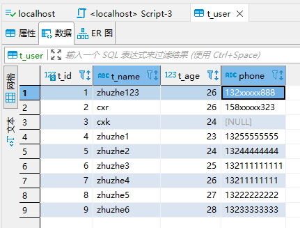

   

   ​      

   

7. 使用bind标签实现模糊查询（防止SQL注入，并且支持MySQL和Oracle）

   使用简单的${}会有SQL注入的风险，使用字符串拼接的concat函数只支持MySQL

   

   使用bind标签来拼接

   

   ```xml
   <?xml version="1.0" encoding="UTF-8"?>
   <!DOCTYPE mapper
           PUBLIC "-//mybatis.org//DTD Mapper 3.0//EN"
           "http://mybatis.org/dtd/mybatis-3-mapper.dtd">
   <mapper namespace="com.zhuzhe.dao.UserDao">
   
       <resultMap id="resultMap" type="com.zhuzhe.entity.User">
           <id property="id" column="t_id"/>
           <id property="name" column="t_name"/>
           <id property="age" column="t_age"/>
           <id property="phone" column="phone"/>
       </resultMap>
   
       <select id="findAllUser" resultMap="resultMap">
           select * from t_user
       </select>
   
   <!--    <select id="findUserByParams" parameterType="com.zhuzhe.entity.User" resultMap="resultMap">-->
   <!--        select * from t_user where 1=1-->
   <!--        <if test="name!=null and name!=''">-->
   <!--            and t_name like concat('%',#{name},'%')-->
   <!--        </if>-->
   <!--        <if test="age!=null and age!=''">-->
   <!--            and t_age = #{age}-->
   <!--        </if>-->
   <!--    </select>-->
   
   <!--    <select id="findUserByParams" parameterType="com.zhuzhe.entity.User" resultMap="resultMap">-->
   <!--        select * from t_user where 1=1-->
   <!--        <choose>-->
   <!--            <when test="name!=null and name!=''">-->
   <!--                and t_name like concat('%',#{name},'%')-->
   <!--            </when>-->
   <!--            <when test="age!=null and age!=''">-->
   <!--                and t_age = #{age}-->
   <!--            </when>-->
   <!--            <otherwise>-->
   <!--                and phone is not null-->
   <!--            </otherwise>-->
   <!--        </choose>-->
   <!--    </select>-->
   
   
   <!--        <select id="findUserByParams" parameterType="com.zhuzhe.entity.User" resultMap="resultMap">-->
   <!--            select * from t_user -->
   <!--            -->
   <!--            <where>-->
   <!--                <if test="name!=null and name!=''">-->
   <!--                    and t_name like concat('%',#{name},'%')-->
   <!--                </if>-->
   <!--                <if test="age!=null and age!=''">-->
   <!--                    and t_age = #{age}-->
   <!--                </if>-->
   <!--            </where>-->
   <!--            -->
   <!--        </select>-->
   
       <select id="findUserByParams" parameterType="com.zhuzhe.entity.User" resultMap="resultMap">
           <bind name="pattern_name" value="'%'+_parameter.getName()+'%'"/>
           select * from t_user
           <trim prefix="where" prefixOverrides="and">
               <if test="name!=null and name!=''">
                   and t_name like #{pattern_name}
               </if>
               <if test="age!=null and age!=''">
                   and t_age = #{age}
               </if>
           </trim>
       </select>
   
   
       <!--编写根据条件更新指定字段-->
       <update id="updateUserById" parameterType="com.zhuzhe.entity.User">
           update t_user
           <set>
               <if test="name != null and name != ''">
                   t_name = #{name},
               </if>
               <if test="age != null">
                   t_age = #{age}, 
               </if>
               <if test="phone !=null and phone != ''">
                   phone = #{phone},
               </if>
           </set>
           where t_id = #{id}
       </update>
       
       <insert id="insertBatchUser" useGeneratedKeys="true" parameterType="java.util.List">
           insert into t_user(t_name,t_age,phone) values
           <foreach collection="userList" item="user" separator=",">
               (#{user.name},#{user.age},#{user.phone})
           </foreach>
       </insert>
   </mapper>
   ```

   可以看到实现的效果一样，不过执行的sql不一样了

   

   后台的执行sql可以看到传入的参数会被自动加上%

   

   

   

### MySQL处理对象关系

查询的对象不总是纯粹的，有的查询结果对象关联到另一个对象：一对一、一对多、多对多

```sql
use mybatis;

create table idcard(id int primary key auto_increment,code varchar(18));
insert into idcard(code) values('123xxxxxxxxx112');
insert into idcard(code) values('333xxxxxxxxx221');

create table person(
	id int primary key auto_increment,
    name varchar(32),
    age int,
    sex varchar(8),
    card_id int unique,
    foreign key(card_id) references idcard(id)
);
insert into person(name,age,sex,card_id) values('zhuzhe',24,'女',1);
insert into person(name,age,sex,card_id) values('cxr',25,'男',2);
```

1. **association 的一对一关联（嵌套查询）：先查一个对象，在用外键去查关联的另外一个对象（两步走）**

   

   对应前面的建的表，建立对应的实体entity

   

   身份证实体：Idcard

   ```java
   public class Idcard {
       private Integer id;
       private String code;
   
       public Integer getId() {
           return id;
       }
   
       public void setId(Integer id) {
           this.id = id;
       }
   
       public String getCode() {
           return code;
       }
   
       public void setCode(String code) {
           this.code = code;
       }
   
       @Override
       public String toString() {
           return "Idcard{" +
                   "id=" + id +
                   ", code='" + code + '\'' +
                   '}';
       }
   }
   ```

   用户实体：Person

   ```java
   public class Person {
       private Integer id;
       private String name;
       private Integer age;
       private String sex;
       private Idcard card;
   
       public Integer getId() {
           return id;
       }
   
       public void setId(Integer id) {
           this.id = id;
       }
   
       public String getName() {
           return name;
       }
   
       public void setName(String name) {
           this.name = name;
       }
   
       public Integer getAge() {
           return age;
       }
   
       public void setAge(Integer age) {
           this.age = age;
       }
   
       public String getSex() {
           return sex;
       }
   
       public void setSex(String sex) {
           this.sex = sex;
       }
   
       public Idcard getCard() {
           return card;
       }
   
       public void setCard(Idcard card) {
           this.card = card;
       }
   
       @Override
       public String toString() {
           return "Person{" +
                   "id=" + id +
                   ", name='" + name + '\'' +
                   ", age=" + age +
                   ", sex='" + sex + '\'' +
                   ", card=" + card +
                   '}';
       }
   }
   ```

   可以看到，在用户实体Person中一对一关联了身份证实体Idcard

   创建对应的dao。

   

   IdCardDao身份证dao提供根据id查询卡号

   ```xml
   import com.zhuzhe.entity.Idcard;
   
   public interface IdCardDao {
       /*根据id查询身份证*/
       public Idcard findCodeById(Integer id);
   }
   ```

   PersonDao用户dao提供根据id查询用户

   ```java
   import com.zhuzhe.entity.Person;
   
   public interface PersonDao {
       public Person findPersonById(Integer id);
   }
   ```

   根据dao创建对应的mapper

   

   IdCardDao.xml

   ```xml
   <?xml version="1.0" encoding="UTF-8"?>
   <!DOCTYPE mapper
           PUBLIC "-//mybatis.org//DTD Mapper 3.0//EN"
           "http://mybatis.org/dtd/mybatis-3-mapper.dtd">
   <mapper namespace="com.zhuzhe.dao.IdCardDao">
       <select id="findCodeById" parameterType="Integer" resultType="com.zhuzhe.entity.Idcard">
           select * from idcard where id = #{id}
       </select>
   
   </mapper>
   ```

   PersonDao.xml 可以看到，先查person用户，再将查出来的card_id调用IdCardDao去查IdCard信息，最后合并返回。

   ```xml
   <?xml version="1.0" encoding="UTF-8"?>
   <!DOCTYPE mapper
           PUBLIC "-//mybatis.org//DTD Mapper 3.0//EN"
           "http://mybatis.org/dtd/mybatis-3-mapper.dtd">
   <mapper namespace="com.zhuzhe.dao.PersonDao">
   
       <resultMap id="idCardPersonResultMap" type="com.zhuzhe.entity.Person">
           <id property="id" column="id"/>
           <result property="name" column="name"/>
           <result property="age" column="age"/>
           <result property="sex" column="sex"/>
           <!--对象关系：一对一-->
           <association property="card" column="card_id" javaType="com.zhuzhe.entity.Idcard" select="com.zhuzhe.dao.IdCardDao.findCodeById"/>
       </resultMap>
   
       <select id="findPersonById" parameterType="Integer" resultMap="idCardPersonResultMap">
           select * from person where id = #{id}
       </select>
   
   </mapper>
   ```

   因为只需要测试PersonDao，所以创建一个PersonService

   

   ```java
   import com.zhuzhe.entity.Person;
   
   public interface PersonService {
       public Person findPersonById(Integer id);
   }
   ```

   ```java
   import com.zhuzhe.dao.PersonDao;
   import com.zhuzhe.entity.Person;
   import com.zhuzhe.service.PersonService;
   import org.springframework.beans.factory.annotation.Autowired;
   import org.springframework.stereotype.Service;
   
   @Service
   public class PersonServiceImpl implements PersonService {
   
       @Autowired
       private PersonDao personDao;
   
       @Override
       public Person findPersonById(Integer id) {
           return personDao.findPersonById(id);
       }
   }
   ```

   同样，创建PersonController

   ```java
   import com.zhuzhe.entity.Person;
   import com.zhuzhe.service.PersonService;
   import org.springframework.beans.factory.annotation.Autowired;
   import org.springframework.stereotype.Controller;
   import org.springframework.web.bind.annotation.GetMapping;
   import org.springframework.web.bind.annotation.RequestMapping;
   import org.springframework.web.bind.annotation.ResponseBody;
   
   @Controller
   @RequestMapping("person")
   public class PersonController {
   
       @Autowired
       private PersonService personService;
   
       @GetMapping("findById")
       @ResponseBody
       public Person findPersonById(Integer id){
           return  personService.findPersonById(id);
       }
   
   }
   ```

   测试效果：

   

   在MyBatis的执行日志中可以看到，创建数据库连接后执行了两条SQL。

   

   

   

   

2. **association 的一对一关联（嵌套结果）：联合查询出一个结果，再将对应的内容填充到对应的关联对象上（一步完成）**

   接口和设计和上面一样，只是在mapper的设计上有所不同

   PersonDao.xml

   ```xml
   <?xml version="1.0" encoding="UTF-8"?>
   <!DOCTYPE mapper
           PUBLIC "-//mybatis.org//DTD Mapper 3.0//EN"
           "http://mybatis.org/dtd/mybatis-3-mapper.dtd">
   <mapper namespace="com.zhuzhe.dao.PersonDao">
   
   <!--    <resultMap id="idCardPersonResultMap" type="com.zhuzhe.entity.Person">-->
   <!--        <id property="id" column="id"/>-->
   <!--        <result property="name" column="name"/>-->
   <!--        <result property="age" column="age"/>-->
   <!--        <result property="sex" column="sex"/>-->
   <!--        &lt;!&ndash;对象关系：一对一&ndash;&gt;-->
   <!--        <association property="card" column="card_id" javaType="com.zhuzhe.entity.Idcard" select="com.zhuzhe.dao.IdCardDao.findCodeById"/>-->
   <!--    </resultMap>-->
   
   <!--    <select id="findPersonById" parameterType="Integer" resultMap="idCardPersonResultMap">-->
   <!--        select * from person where id = #{id}-->
   <!--    </select>-->
   
       <resultMap id="idCardPersonResultMap" type="com.zhuzhe.entity.Person">
           <id property="id" column="id"/>
           <result property="name" column="name"/>
           <result property="age" column="age"/>
           <result property="sex" column="sex"/>
           <!--对象关系：一对一-->
           <association property="card" javaType="com.zhuzhe.entity.Idcard" >
               <result property="id" column="cid"/>
               <result property="code" column="code"/>
           </association>
       </resultMap>
   
       <select id="findPersonById" parameterType="Integer" resultMap="idCardPersonResultMap">
           select t1.*, t2.id as cid, t2.code as code from person t1, idcard t2 where t1.card_id = t2.id and t1.id = #{id}
       </select>
   </mapper>
   ```

   测试效果和之前一致，在执行SQL上有所区别

   

   

   

   

   

   

3. collection（嵌套结果）：联表查询出来结果，将结果映射到一个一对多的关联实体中

   新建两个表，用来展示一个用户有多个订单

   ```sql
   # 购物用户
   create table buyer(
   	id int(32) primary key auto_increment,
       username varchar(32),
       address varchar(256)
   );
   insert into buyer values('1','buyer1','addr1');
   # 一个购物用户下单后有多个订单
   create table orders(
   	id int(32) primary key auto_increment,
       number varchar(32) not null,
       buyer_id int(32) not null,
       foreign key(buyer_id) references buyer(id)
   );
   insert into orders values('1','1000011','1');
   insert into orders values('2','1000012','1');
   insert into orders values('3','1000013','1');
   ```

   

   根据表定义对应的实体entity

   

   Buyer，可以看到一个buyer购物者是有多个order订单的。

   ```java
   import java.util.List;
   
   /**
    * @Author: zhuzhe
    * @ClassName: Buyer
    * @Date: 2022/9/27 22:44
    * @Description:
    * @Version: V1.0
    * @Param:
    */
   public class Buyer {
       private Integer id;
       private String username;
       private String address;
       private List<Orders> ordersList;
   
       public Integer getId() {
           return id;
       }
   
       public void setId(Integer id) {
           this.id = id;
       }
   
       public String getUsername() {
           return username;
       }
   
       public void setUsername(String username) {
           this.username = username;
       }
   
       public String getAddress() {
           return address;
       }
   
       public void setAddress(String address) {
           this.address = address;
       }
   
       public List<Orders> getOrdersList() {
           return ordersList;
       }
   
       public void setOrdersList(List<Orders> ordersList) {
           this.ordersList = ordersList;
       }
   
       @Override
       public String toString() {
           return "Buyer{" +
                   "id=" + id +
                   ", username='" + username + '\'' +
                   ", address='" + address + '\'' +
                   ", ordersList=" + ordersList +
                   '}';
       }
   }
   ```

   Orders

   ```java
   public class Orders {
       private Integer id;
       private String number;
       private Integer buyerId;
   
       public Integer getId() {
           return id;
       }
   
       public void setId(Integer id) {
           this.id = id;
       }
   
       public String getNumber() {
           return number;
       }
   
       public void setNumber(String number) {
           this.number = number;
       }
   
       public Integer getBuyerId() {
           return buyerId;
       }
   
       public void setBuyerId(Integer buyerId) {
           this.buyerId = buyerId;
       }
   
       @Override
       public String toString() {
           return "Orders{" +
                   "id=" + id +
                   ", number='" + number + '\'' +
                   ", buyerId=" + buyerId +
                   '}';
       }
   }
   ```

   编写一个查询购物者的全部信息dao

   BuyerDao

   

   ```java
   import com.zhuzhe.entity.Buyer;
   
   public interface BuyerDao {
       public Buyer findBuyerWithOrders(Integer id);
   }
   ```

   根据dao来编写对应的mapper

   

   ```xml
   <?xml version="1.0" encoding="UTF-8"?>
   <!DOCTYPE mapper
           PUBLIC "-//mybatis.org//DTD Mapper 3.0//EN"
           "http://mybatis.org/dtd/mybatis-3-mapper.dtd">
   <mapper namespace="com.zhuzhe.dao.BuyerDao">
       <resultMap id="BuyerWithOrdersResultMap" type="com.zhuzhe.entity.Buyer">
           <id property="id" column="id"/>
           <result property="username" column="username"/>
           <result property="address" column="address"/>
           <!--将连表查询的订单数据作为列表-->
           <collection property="ordersList" ofType="com.zhuzhe.entity.Orders">
               <id property="id" column="orders_id"/>
               <result property="number" column="number"/>
           </collection>
       </resultMap>
   
       <select id="findBuyerWithOrders" parameterType="Integer" resultMap="BuyerWithOrdersResultMap">
           select t1.*,t2.id as orders_id,t2.number from buyer t1, orders t2 where t1.id = t2.buyer_id and t1.id = #{id}
       </select>
   
   </mapper>
   ```

   为了测试dao，所以编写完整的调用service和controller

   service

   

   ```java
   import com.zhuzhe.entity.Buyer;
   
   public interface BuyerService {
       public Buyer findBuyerWithOrders(Integer id);
   }
   ```

   ```java
   import com.zhuzhe.dao.BuyerDao;
   import com.zhuzhe.entity.Buyer;
   import com.zhuzhe.service.BuyerService;
   import org.springframework.beans.factory.annotation.Autowired;
   import org.springframework.stereotype.Service;
   
   @Service
   public class BuyerServiceImpl implements BuyerService {
   
       @Autowired
       private BuyerDao buyerDao;
   
       @Override
       public Buyer findBuyerWithOrders(Integer id) {
           return buyerDao.findBuyerWithOrders(id);
       }
   }
   ```

   controller

   ```java
   import com.zhuzhe.entity.Buyer;
   import com.zhuzhe.service.BuyerService;
   import org.springframework.beans.factory.annotation.Autowired;
   import org.springframework.stereotype.Controller;
   import org.springframework.web.bind.annotation.GetMapping;
   import org.springframework.web.bind.annotation.RequestMapping;
   import org.springframework.web.bind.annotation.ResponseBody;
   
   @Controller
   @RequestMapping("buyer")
   public class BuyerController {
   
       @Autowired
       private BuyerService buyerService;
   
       @GetMapping("findBuyer")
       @ResponseBody
       public Buyer findBuyerWithOrders(Integer id){
           return buyerService.findBuyerWithOrders(id);
       }
   }
   ```

   测试效果：

   

4. collection（嵌套查询）：实现多对多结果查询

   商品和订单之间的关系是多对多，出来多对多的表需要建立中间表来维护。

   ```sql
   # 产品表
   create table product(
   	id int(32) primary key auto_increment,
       name varchar(32),
       price double
   );
   insert into product values('1','product1','11.5');
   insert into product values('2','product2','22.5');
   insert into product values('3','product3','33.5');
   # 中间表
   create table ordersitem(
   	id int(32) primary key auto_increment,
       orders_id int(32),
       product_id int(32),
       foreign key(orders_id) references orders(id),
       foreign key(product_id) references product(id)
   );
   insert into ordersitem values('1','1','1');
   insert into ordersitem values('2','1','3');
   insert into ordersitem values('3','3','3');
   ```

   

   对应表建立实体entity

   

   产品实体中关联一个订单列表，因为一个产品有多个订单。

   Product.java

   ```java
   import java.util.List;
   
   public class Product {
       private Integer id;
       private String name;
       private Double price;
       private List<Orders> ordersList;
   
       public Integer getId() {
           return id;
       }
   
       public void setId(Integer id) {
           this.id = id;
       }
   
       public String getName() {
           return name;
       }
   
       public void setName(String name) {
           this.name = name;
       }
   
       public Double getPrice() {
           return price;
       }
   
       public void setPrice(Double price) {
           this.price = price;
       }
   
       public List<Orders> getOrdersList() {
           return ordersList;
       }
   
       public void setOrdersList(List<Orders> ordersList) {
           this.ordersList = ordersList;
       }
   
       @Override
       public String toString() {
           return "Product{" +
                   "id=" + id +
                   ", name='" + name + '\'' +
                   ", price=" + price +
                   ", ordersList=" + ordersList +
                   '}';
       }
   }
   ```

   同理，一个订单也有可能关联多个产品，所以给之前的订单实体添加一个产品列表

   Orders.java

   ```java
   import java.util.List;
   
   public class Orders {
       private Integer id;
       private String number;
       private Integer buyerId;
       private List<Product> productList;
   
       public Integer getId() {
           return id;
       }
   
       public void setId(Integer id) {
           this.id = id;
       }
   
       public String getNumber() {
           return number;
       }
   
       public void setNumber(String number) {
           this.number = number;
       }
   
       public Integer getBuyerId() {
           return buyerId;
       }
   
       public void setBuyerId(Integer buyerId) {
           this.buyerId = buyerId;
       }
   
       public List<Product> getProductList() {
           return productList;
       }
   
       public void setProductList(List<Product> productList) {
           this.productList = productList;
       }
   
       @Override
       public String toString() {
           return "Orders{" +
                   "id=" + id +
                   ", number='" + number + '\'' +
                   ", buyerId=" + buyerId +
                   ", productList=" + productList +
                   '}';
       }
   }
   ```

   这里要先理清一个思路，这次是测试两个对象之间的关系是多对多关系。所以要体现出查询一个产品可以看到关联多个订单，查询一个订单可以看到关联多个产品。

   使用嵌套查询的方式：查询当前实体的数据+将查到的id再去从中间表获取到关联的另一个实体列表

   先根据业务创建dao

   

   产品dao：有两个方法，第一个是被调用，第二个是自己调用

   ```java
   import com.zhuzhe.entity.Product;
   import java.util.List;
   
   public interface ProductDao {
       /*根据ordersId查询Product列表*/
       public List<Product> findProductByOrdersId(Integer ordersId);
   
       /*根据id查询Product，关联Orders列表*/
       public Product findProductWithOrders(Integer id);
   }
   ```

   订单dao：同理两个方法，一个被调用，一个自己调用

   ```java
   import com.zhuzhe.entity.Orders;
   import java.util.List;
   
   public interface OrdersDao {
       /*根据productId查询Orders列表*/
       public List<Orders> findOrdersByProductId(Integer productId);
   
       /*根据id查询Order信息，关联Product列表*/
       public Orders findOrdersWithProduct(Integer id);
   }
   ```

   根据dao编写对应的mapper文件

   

   产品mapper：ProductDao.xml

   ```xml
   <?xml version="1.0" encoding="UTF-8"?>
   <!DOCTYPE mapper
           PUBLIC "-//mybatis.org//DTD Mapper 3.0//EN"
           "http://mybatis.org/dtd/mybatis-3-mapper.dtd">
   <mapper namespace="com.zhuzhe.dao.ProductDao">
   
       <select id="findProductByOrdersId" parameterType="Integer" resultType="com.zhuzhe.entity.Product">
           select *
           from product
           where id in (
               select product_id
               from ordersitem
               where orders_id = #{ordersId}
               )
       </select>
   
       <resultMap id="ProductWithOrdersResultMap" type="com.zhuzhe.entity.Product">
           <id property="id" column="id"/>
           <result property="name" column="name"/>
           <result property="price" column="price"/>
           <collection property="ordersList" column="id" ofType="com.zhuzhe.entity.Orders" select="com.zhuzhe.dao.OrdersDao.findOrdersByProductId"/>
       </resultMap>
   
       <select id="findProductWithOrders" parameterType="Integer" resultMap="ProductWithOrdersResultMap">
           select * from product where id = #{id}
       </select>
   
   
   </mapper>
   ```

   订单mapper：OrdersDao.xml

   ```xml
   <?xml version="1.0" encoding="UTF-8"?>
   <!DOCTYPE mapper
           PUBLIC "-//mybatis.org//DTD Mapper 3.0//EN"
           "http://mybatis.org/dtd/mybatis-3-mapper.dtd">
   <mapper namespace="com.zhuzhe.dao.OrdersDao">
   
       <select id="findOrdersByProductId" parameterType="Integer" resultType="com.zhuzhe.entity.Orders">
           select *
           from orders
           where id in (
               select orders_id
               from ordersitem
               where product_id = #{productId}
           )
       </select>
   
       <resultMap id="OrdersWithProductResultMap" type="com.zhuzhe.entity.Orders">
           <id property="id" column="id"/>
           <result property="number" column="number"/>
           <collection property="productList" column="id" ofType="com.zhuzhe.entity.Product" select="com.zhuzhe.dao.ProductDao.findProductByOrdersId"/>
       </resultMap>
   
       <select id="findOrdersWithProduct" parameterType="Integer" resultMap="OrdersWithProductResultMap">
           select * from orders where id = #{id}
       </select>
   
   
   </mapper>
   ```

   可以看到，一个SQL是被调用后做中间表的连表查询返回列表。另外一个就是当前查询自己的对象，但还需要另外一个对象的列表，那就调另外一个dao的接口。

   编写Service

   

   因为只用查询当前对象的接口，被调用查询列表的接口是给其他接口调用的，不对外暴露

   ProductService.java

   ```java
   import com.zhuzhe.entity.Product;
   
   public interface ProductService {
       public Product findProductWithOrders(Integer id);
   }
   ```

   ProductServiceImpl.java

   ```java
   import com.zhuzhe.dao.ProductDao;
   import com.zhuzhe.entity.Product;
   import com.zhuzhe.service.ProductService;
   import org.springframework.beans.factory.annotation.Autowired;
   import org.springframework.stereotype.Service;
   
   @Service
   public class ProductServiceImpl implements ProductService {
   
       @Autowired
       private ProductDao productDao;
   
       @Override
       public Product findProductWithOrders(Integer id) {
           return productDao.findProductWithOrders(id);
       }
   }
   ```

   OrdersService.java

   ```java
   import com.zhuzhe.entity.Orders;
   
   public interface OrdersService {
       public Orders findOrdersWithProduct(Integer id);
   }
   ```

   OrderServiceImpl.java

   ```java
   import com.zhuzhe.dao.OrdersDao;
   import com.zhuzhe.entity.Orders;
   import com.zhuzhe.service.OrdersService;
   import org.springframework.beans.factory.annotation.Autowired;
   import org.springframework.stereotype.Service;
   
   @Service
   public class OrdersServiceImpl implements OrdersService {
   
       @Autowired
       private OrdersDao ordersDao;
   
       @Override
       public Orders findOrdersWithProduct(Integer id) {
           return ordersDao.findOrdersWithProduct(id);
       }
   }
   ```

   对应的调用Service是由Controller调用。编写对应的Controller

   ProductController.java

   ```java
   import com.zhuzhe.entity.Product;
   import com.zhuzhe.service.ProductService;
   import org.springframework.beans.factory.annotation.Autowired;
   import org.springframework.stereotype.Controller;
   import org.springframework.web.bind.annotation.GetMapping;
   import org.springframework.web.bind.annotation.RequestMapping;
   import org.springframework.web.bind.annotation.ResponseBody;
   
   @Controller
   @RequestMapping("product")
   public class ProductController {
   
       @Autowired
       private ProductService productService;
   
       @GetMapping("findProduct")
       @ResponseBody
       public Product findProductWithOrders(Integer id){
           return productService.findProductWithOrders(id);
       }
   }
   ```

   OrdersController.java

   ```java
   import com.zhuzhe.entity.Orders;
   import com.zhuzhe.service.OrdersService;
   import org.springframework.beans.factory.annotation.Autowired;
   import org.springframework.stereotype.Controller;
   import org.springframework.web.bind.annotation.GetMapping;
   import org.springframework.web.bind.annotation.RequestMapping;
   import org.springframework.web.bind.annotation.ResponseBody;
   
   @Controller
   @RequestMapping("orders")
   public class OrdersController {
   
       @Autowired
       private OrdersService ordersService;
   
       @GetMapping("findOrders")
       @ResponseBody
       public Orders findOrdersWithProduct(Integer id){
           return ordersService.findOrdersWithProduct(id);
       }
   }
   ```

   先从中间表中看出产品和订单的关系：

   

   订单号1有两个产品，产品号3有两个订单

   所以使用产品号3查询产品信息和关联的订单信息：

   

   使用订单号1查询订单信息和关联的产品信息：

   

5. 


## SSM项目自定义数据绑定

> 对于一些特殊的请求参数，处理请求时能先进行处理（字符串日期转换为Date对象）

由于数据绑定是：DataBinder->ConversionService做数据绑定和类型转换，所以可以从这里入手去写一个自定义Converter，接收请求做转换

1. 使用Converter实现自定义日期转换

   新建converter文件夹和对应的文件

   

   ```java
   import org.springframework.core.convert.converter.Converter;
   import java.text.SimpleDateFormat;
   import java.util.Date;
   
   public class DateConverter implements Converter<String, Date> {
       private static Logger logger = Logger.getLogger(DateConverter.class);
       private String datePattern = "yyyy-MM-dd HH:mm:ss";
   
       @Override
       public Date convert(String source) {
           logger.info("source="+source);
           Date date = null;
           SimpleDateFormat sdf = new SimpleDateFormat(datePattern);
           try {
               date = sdf.parse(source);
           } catch (Exception e) {
               logger.info("转换异常！",e);
               e.printStackTrace();
           }
           return date;
       }
   }
   ```

   在spring-mvc.xml中配置对象，

   

   ```xml
   <?xml version="1.0" encoding="UTF-8"?>
   <beans xmlns="http://www.springframework.org/schema/beans"
          xmlns:mvc="http://www.springframework.org/schema/mvc"
          xmlns:xsi="http://www.w3.org/2001/XMLSchema-instance"
          xmlns:context="http://www.springframework.org/schema/context"
          xmlns:aop="http://www.springframework.org/schema/aop"
          xmlns:tx="http://www.springframework.org/schema/tx"
          xsi:schemaLocation="http://www.springframework.org/schema/beans
          http://www.springframework.org/schema/beans/spring-beans.xsd
          http://www.springframework.org/schema/context
          http://www.springframework.org/schema/context/spring-context.xsd
          http://www.springframework.org/schema/aop
          http://www.springframework.org/schema/aop/spring-aop.xsd
          http://www.springframework.org/schema/tx
          http://www.springframework.org/schema/tx/spring-tx.xsd
          http://www.springframework.org/schema/mvc
          http://www.springframework.org/schema/mvc/spring-mvc.xsd">
       <!--开启注解扫描，要扫描整个项目代码-->
       <context:component-scan base-package="com.zhuzhe"/>
   
       <!--处理映射器，将处理器的handler的name作为url进行查找-->
       <bean class="org.springframework.web.servlet.handler.BeanNameUrlHandlerMapping"/>
       <!--处理设配器，配置对处理器中handleRequest()方法的调用-->
       <bean class="org.springframework.web.servlet.mvc.SimpleControllerHandlerAdapter"/>
   
       <!--配置Spring开启MVC的注解支持-->
       <mvc:annotation-driven/>
   
       <!--Jackson处理控制器返回对象转为Json字符串-->
       <mvc:annotation-driven>
           <mvc:message-converters>
               <bean class="org.springframework.http.converter.StringHttpMessageConverter">
                   <constructor-arg value="UTF-8"/>
               </bean>
               <bean class="org.springframework.http.converter.json.MappingJackson2HttpMessageConverter">
                   <property name="objectMapper">
                       <bean class="org.springframework.http.converter.json.Jackson2ObjectMapperFactoryBean">
                           <property name="failOnEmptyBeans" value="false"/>
                       </bean>
                   </property>
               </bean>
           </mvc:message-converters>
       </mvc:annotation-driven>
   
       <!-- 配置视图解析器 -->
       <bean id="viewResolver" class="org.springframework.web.servlet.view.InternalResourceViewResolver">
           <property name="prefix" value="/"/>
           <property name="suffix" value=".html"/>
       </bean>
   
       <!--对String转Date的操作由自定义Converter处理-->
       <mvc:annotation-driven conversion-service="conversionService"/>
       <bean id="conversionService" class="org.springframework.context.support.ConversionServiceFactoryBean">
           <property name="converters">
               <set>
                   <bean class="com.zhuzhe.converter.DateConverter"/>
               </set>
           </property>
       </bean>
   
   </beans>
   ```

   编写一个测试结果，当接口DateBinder调用ConversionService处理String转换Date的请求参数时，就会调用自定义的转换器DateConverter

   

   ```java
   import com.zhuzhe.entity.Account;
   import com.zhuzhe.service.AccountService;
   import org.apache.log4j.Logger;
   import org.springframework.beans.factory.annotation.Autowired;
   import org.springframework.web.bind.annotation.GetMapping;
   import org.springframework.web.bind.annotation.RequestMapping;
   import org.springframework.web.bind.annotation.RequestParam;
   import org.springframework.web.bind.annotation.RestController;
   
   import java.util.Date;
   import java.util.List;
   
   /**
    * @Author: zhuzhe
    * @ClassName: TestController
    * @Date: 2022/9/20 15:07
    * @Description:
    * @Version: V1.0
    * @Param:
    */
   @RestController
   public class TestController {
   
       private static Logger logger = Logger.getLogger(TestController.class);
   
       @Autowired
       private AccountService accountService;
   
       @GetMapping("test01")
       public String test01(){
           return "Hello Spring!";
       }
   
       @GetMapping("findAll")
       public List<Account> findAll(){
           List<Account> list = accountService.findAll();
           System.out.println("查询到的全部用户："+list);
           return list;
       }
   
       @GetMapping("findById")
       public Account findById(@RequestParam Integer id){
           return accountService.findAccountById(id);
       }
   
       @GetMapping("findByName")
       public List<Account> findByName(@RequestParam String name){
           return accountService.findAccountByName(name);
       }
   
       @RequestMapping("conversionDate")
       public String conversionDate(Date date){
           logger.info("date="+date);
           return "success";
       }
   }
   ```

   测试效果：

   http://localhost:8080/zz/conversionDate?date=2022-09-29%2012:28:33 这里%20是表示空格

   

   可以看到日志中已经显示成功转换了类型。

   而且测试其他接口并不受影响，说明这个转换器只对String->Date起效

   

   

2. 使用Formatter实现字符串转换为日期对象Date

   基本和上面一样的使用方法：实现接口重写方法，在配置文件中配置

   Formatter的缺点是只能由字符串转换为其他类型。

   

   DateFormatter.java

   ```java
   import org.apache.log4j.Logger;
   import org.springframework.format.Formatter;
   
   import java.text.ParseException;
   import java.text.SimpleDateFormat;
   import java.util.Date;
   import java.util.Locale;
   
   /**
    * @Author: zhuzhe
    * @ClassName: DateFormatter
    * @Date: 2022/9/29 12:55
    * @Description:
    * @Version: V1.0
    * @Param:
    */
   public class DateFormatter implements Formatter<Date> {
   
       private static Logger logger = Logger.getLogger(DateFormatter.class);
       private String datePattern = "yyyy-MM-dd HH:mm:ss";
       private SimpleDateFormat sdf;
   
       @Override
       public Date parse(String source, Locale locale) throws ParseException {
           sdf = new SimpleDateFormat(datePattern);
           return sdf.parse(source);
       }
   
       @Override
       public String print(Date date, Locale locale) {
           return new SimpleDateFormat().format(date);
       }
   }
   ```

   spring-mvc.xml配置

   

   ```xml
   <?xml version="1.0" encoding="UTF-8"?>
   <beans xmlns="http://www.springframework.org/schema/beans"
          xmlns:mvc="http://www.springframework.org/schema/mvc"
          xmlns:xsi="http://www.w3.org/2001/XMLSchema-instance"
          xmlns:context="http://www.springframework.org/schema/context"
          xmlns:aop="http://www.springframework.org/schema/aop"
          xmlns:tx="http://www.springframework.org/schema/tx"
          xsi:schemaLocation="http://www.springframework.org/schema/beans
          http://www.springframework.org/schema/beans/spring-beans.xsd
          http://www.springframework.org/schema/context
          http://www.springframework.org/schema/context/spring-context.xsd
          http://www.springframework.org/schema/aop
          http://www.springframework.org/schema/aop/spring-aop.xsd
          http://www.springframework.org/schema/tx
          http://www.springframework.org/schema/tx/spring-tx.xsd
          http://www.springframework.org/schema/mvc
          http://www.springframework.org/schema/mvc/spring-mvc.xsd">
       <!--开启注解扫描，要扫描整个项目代码-->
       <context:component-scan base-package="com.zhuzhe"/>
   
       <!--处理映射器，将处理器的handler的name作为url进行查找-->
       <bean class="org.springframework.web.servlet.handler.BeanNameUrlHandlerMapping"/>
       <!--处理设配器，配置对处理器中handleRequest()方法的调用-->
       <bean class="org.springframework.web.servlet.mvc.SimpleControllerHandlerAdapter"/>
   
       <!--配置Spring开启MVC的注解支持-->
       <mvc:annotation-driven/>
   
       <!--Jackson处理控制器返回对象转为Json字符串-->
       <mvc:annotation-driven>
           <mvc:message-converters>
               <bean class="org.springframework.http.converter.StringHttpMessageConverter">
                   <constructor-arg value="UTF-8"/>
               </bean>
               <bean class="org.springframework.http.converter.json.MappingJackson2HttpMessageConverter">
                   <property name="objectMapper">
                       <bean class="org.springframework.http.converter.json.Jackson2ObjectMapperFactoryBean">
                           <property name="failOnEmptyBeans" value="false"/>
                       </bean>
                   </property>
               </bean>
           </mvc:message-converters>
       </mvc:annotation-driven>
   
       <!-- 配置视图解析器 -->
       <bean id="viewResolver" class="org.springframework.web.servlet.view.InternalResourceViewResolver">
           <property name="prefix" value="/"/>
           <property name="suffix" value=".html"/>
       </bean>
   
       <!--对String转Date的操作由自定义Converter处理-->
       <mvc:annotation-driven conversion-service="conversionService"/>
   <!--    <bean id="conversionService" class="org.springframework.context.support.ConversionServiceFactoryBean">-->
   <!--        <property name="converters">-->
   <!--            <set>-->
   <!--                <bean class="com.zhuzhe.converter.DateConverter"/>-->
   <!--            </set>-->
   <!--        </property>-->
   <!--    </bean>-->
   
       <!--使用Formatter来处理字符串转换为Date-->
       <bean id="conversionService" class="org.springframework.format.support.FormattingConversionServiceFactoryBean">
           <property name="formatters">
               <set>
                   <bean class="com.zhuzhe.formatter.DateFormatter"/>
               </set>
           </property>
       </bean>
   </beans>
   ```

   用的是前面的测试接口，测试结果一致

   


## SSM项目应用RESTful风格开发

1. 查询接口

   controller

   

   ```java
   package com.zhuzhe.controller;
   
   import com.zhuzhe.entity.Account;
   import com.zhuzhe.service.AccountService;
   import org.apache.log4j.Logger;
   import org.springframework.beans.factory.annotation.Autowired;
   import org.springframework.web.bind.annotation.*;
   
   import java.util.Date;
   import java.util.List;
   
   /**
    * @Author: zhuzhe
    * @ClassName: TestController
    * @Date: 2022/9/20 15:07
    * @Description:
    * @Version: V1.0
    * @Param:
    */
   @RestController
   public class TestController {
   
       private static Logger logger = Logger.getLogger(TestController.class);
   
       @Autowired
       private AccountService accountService;
   
       @GetMapping("test01")
       public String test01(){
           return "Hello Spring!";
       }
   
       @GetMapping("findAll")
       public List<Account> findAll(){
           List<Account> list = accountService.findAll();
           System.out.println("查询到的全部用户："+list);
           return list;
       }
   
       @GetMapping("findById")
       public Account findById(@RequestParam Integer id){
           return accountService.findAccountById(id);
       }
   
       @GetMapping("account/{id}")
       public Account findById2(@PathVariable("id") Integer id){
           return accountService.findAccountById(id);
       }
   
       @GetMapping("findByName")
       public List<Account> findByName(@RequestParam String name){
           return accountService.findAccountByName(name);
       }
   
       @RequestMapping("conversionDate")
       public String conversionDate(Date date){
           logger.info("date="+date);
           return "success";
       }
   }
   ```

   更改了接口的请求风格

   测试效果：

   

## SSM项目使用拦截器实现用户登录状态

> 拦截器的作用范围比过滤器小，作用效果一致


设计2个简单的页面，来实现一个登录验证的效果。

* 如果当前用户未登录，访问main主页时会引导转发到登录页面
* 如果当前用户已登录，则可以访问main页面


新建两个页面：

main.html：只提供已登录用户才能访问，并且可以在此进行退登操作。如果用户未登录则强制转发到登录页面

```html
<!DOCTYPE html>
<html lang="en">
<head>
    <meta charset="UTF-8">
    <title>首页</title>
</head>
<body>
    登录成功
<a href="/zz/user/logout">注销</a>
</body>
</html>
```

login.html：用户登录页面，输入固定的密码admin/123456就可以登录

```html
<!DOCTYPE html>
<html lang="en">
<head>
  <meta charset="UTF-8">
  <title>用户登录</title>
</head>

<script>
  function s() {
    var username = document.getElementById("username");
    var password = document.getElementById("password");
    if (username.value==='') {
      alert("用户名不能为空");
      return false;
    } else if (password.value==='') {
      alert("密码不能为空");
      return false;
    } else return true;
  }
</script>

<body>

<span style="color: red;"></span>
<form action="/zz/user/login" method="post" onsubmit="return s()">
  用户名：<input type="text" name="username" id="username" /><br/>
  密码：<input type="password" name="password" id="password" /><br/>
  <input type="submit" value="登录">
</form>

</body>
</html>
```

controller：设计两个页面的访问接口，设计登录行为和退登行为的操作（是简单的验证，使用session的添加和清空功能）

```java
@Controller
@RequestMapping("user")
public class UserController {
    private static Logger logger = Logger.getLogger(UserController.class);

    @Autowired
    private UserService userService;

    @GetMapping
    public String main(){
        return "user";
    }

    @GetMapping("findAll")
    @ResponseBody
    public List<User> findAllUser() {
        return userService.findAllUser();
    }

    @GetMapping("findUserByParams")
    @ResponseBody
    public List<User> findUserByParams(String name,Integer age){
        User user = new User();
        user.setName(name);
        user.setAge(age);
        System.out.println("user = " + user);
        List<User> list = userService.findUserByParams(user);
        System.out.println("list = " + list);
        return list;
    }

    @PutMapping("updateById")
    @ResponseBody
    public Integer updateUserById(User user) {
        return userService.updateUserById(user);
    }

    @PutMapping("insertBatch")
    @ResponseBody
    public Integer insertBatchUser(String[] name, Integer[] age, String[] phone){
        List<User> list = new ArrayList<>();
        for (int i = 0; i < name.length; i++) {
            list.add(new User(null,name[i],age[i],phone[i]));
        }
        logger.info("userList="+list);
        return userService.insertBatchUser(list);
    }

    /*用户主页*/
    @GetMapping("main")
    public String main2(){
        return "main";
    }
    /*用户登录页*/
    @GetMapping("goLogin")
    public String goLogin(){
        return "login";
    }
    /*用户登录行为*/
    @PostMapping("login")
    public String login(HttpSession session, String username, String password){
        if (username.equals("admin")&&password.equals("123456")) {
            session.setAttribute("user",username);
            session.setAttribute("username",username);
            session.setAttribute("password",password);
            return "main";
        }
        return "login";
    }
    /*用户退登行为*/
    @GetMapping("logout")
    public String goOUt(HttpSession session) {
        logger.info("执行注销");
        session.invalidate();
        return "login";
    }
}
```

添加拦截器，对普通的访问页面请求放行，对主页访问进行判断拦截：已登录放行，未登录则跳转到登录页面

```java
import org.apache.log4j.Logger;
import org.springframework.web.servlet.HandlerInterceptor;

import javax.servlet.http.HttpServletRequest;
import javax.servlet.http.HttpServletResponse;
import javax.servlet.http.HttpSession;

/**
 * @Author: zhuzhe
 * @ClassName: LoginInterceptor
 * @Date: 2022/9/29 13:48
 * @Description:
 * @Version: V1.0
 * @Param:
 */
public class LoginInterceptor implements HandlerInterceptor {

    private static Logger logger = Logger.getLogger(LoginInterceptor.class);

    @Override
    public boolean preHandle(HttpServletRequest request, HttpServletResponse response, Object handler) throws Exception {
        logger.info("进入到拦截器...  ");

        /*获取到session*/
        HttpSession session = request.getSession();
        logger.info("uri="+request.getRequestURI());

        //对去登录页的放行
        if (request.getRequestURI().contains("goLogin")) {
            return true;
        }
        //对登录行为放行
        if (request.getRequestURI().contains("login")) {
            return true;
        }
        //如果是其他行为就要检验用户的登录状态
        if (session.getAttribute("user")!=null) {
            logger.info("当前用户已经登录，可以访问！");
            return true;//如果当前session中有用户信息则放行
        } else {
            request.getRequestDispatcher("/user/goLogin").forward(request,response);//当前session中没有用户信息，转发去登录页
            return false;
        }
    }
}
```

在spring-mvc中配置拦截器（这里的单拦截器）

```xml
<?xml version="1.0" encoding="UTF-8"?>
<beans xmlns="http://www.springframework.org/schema/beans"
       xmlns:mvc="http://www.springframework.org/schema/mvc"
       xmlns:xsi="http://www.w3.org/2001/XMLSchema-instance"
       xmlns:context="http://www.springframework.org/schema/context"
       xmlns:aop="http://www.springframework.org/schema/aop"
       xmlns:tx="http://www.springframework.org/schema/tx"
       xsi:schemaLocation="http://www.springframework.org/schema/beans
       http://www.springframework.org/schema/beans/spring-beans.xsd
       http://www.springframework.org/schema/context
       http://www.springframework.org/schema/context/spring-context.xsd
       http://www.springframework.org/schema/aop
       http://www.springframework.org/schema/aop/spring-aop.xsd
       http://www.springframework.org/schema/tx
       http://www.springframework.org/schema/tx/spring-tx.xsd
       http://www.springframework.org/schema/mvc
       http://www.springframework.org/schema/mvc/spring-mvc.xsd">
    <!--开启注解扫描，要扫描整个项目代码-->
    <context:component-scan base-package="com.zhuzhe"/>

    <!--处理映射器，将处理器的handler的name作为url进行查找-->
    <bean class="org.springframework.web.servlet.handler.BeanNameUrlHandlerMapping"/>
    <!--处理设配器，配置对处理器中handleRequest()方法的调用-->
    <bean class="org.springframework.web.servlet.mvc.SimpleControllerHandlerAdapter"/>

    <!--配置Spring开启MVC的注解支持-->
    <mvc:annotation-driven/>

    <!--Jackson处理控制器返回对象转为Json字符串-->
    <mvc:annotation-driven>
        <mvc:message-converters>
            <bean class="org.springframework.http.converter.StringHttpMessageConverter">
                <constructor-arg value="UTF-8"/>
            </bean>
            <bean class="org.springframework.http.converter.json.MappingJackson2HttpMessageConverter">
                <property name="objectMapper">
                    <bean class="org.springframework.http.converter.json.Jackson2ObjectMapperFactoryBean">
                        <property name="failOnEmptyBeans" value="false"/>
                    </bean>
                </property>
            </bean>
        </mvc:message-converters>
    </mvc:annotation-driven>

    <!-- 配置视图解析器 -->
    <bean id="viewResolver" class="org.springframework.web.servlet.view.InternalResourceViewResolver">
        <property name="prefix" value="/"/>
        <property name="suffix" value=".html"/>
    </bean>

    <!--对String转Date的操作由自定义Converter处理-->
    <mvc:annotation-driven conversion-service="conversionService"/>
<!--    <bean id="conversionService" class="org.springframework.context.support.ConversionServiceFactoryBean">-->
<!--        <property name="converters">-->
<!--            <set>-->
<!--                <bean class="com.zhuzhe.converter.DateConverter"/>-->
<!--            </set>-->
<!--        </property>-->
<!--    </bean>-->

    <!--使用Formatter来处理字符串转换为Date-->
    <bean id="conversionService" class="org.springframework.format.support.FormattingConversionServiceFactoryBean">
        <property name="formatters">
            <set>
                <bean class="com.zhuzhe.formatter.DateFormatter"/>
            </set>
        </property>
    </bean>

    <!--配置用户登录拦截器-->
    <mvc:interceptors>
        <mvc:interceptor>
            <mvc:mapping path="/user/**"/><!--要拦截的路径-->
            <mvc:exclude-mapping path="/user"/><!--放行的路径，表示不拦截 表示放行user请求-->
            <bean class="com.zhuzhe.interceptor.LoginInterceptor"/><!--注册拦截器的bean-->
        </mvc:interceptor>
    </mvc:interceptors>
</beans>
```

可以看到，为了避免之前写的业务接口被影响到，设置对特定路径下的请求进行拦截，并且当前路径的请求不做拦截

部署项目到Tomcat，测试效果：

访问普通页面是没有被拦截的。


在没登录的情况下。访问主页是直接转发到登录页面


输入账号密码进行登录。可以看到登录成功跳转到主页。并且此时主页就不会拦截了。


点击注销的话，则不能访问了。


## SSM实现文件上传下载

> SpringMVC为文件上传提供了直接的支持，内部依赖Apache Commons FileUpload技术实现


**实现文件上传。**

新增依赖：commons-io、commons-fileupload 。 修改依赖：javax.servlet-api

```xml
<?xml version="1.0" encoding="UTF-8"?>
<project xmlns="http://maven.apache.org/POM/4.0.0"
         xmlns:xsi="http://www.w3.org/2001/XMLSchema-instance"
         xsi:schemaLocation="http://maven.apache.org/POM/4.0.0 http://maven.apache.org/xsd/maven-4.0.0.xsd">
    <modelVersion>4.0.0</modelVersion>

    <groupId>com.zhuzhe</groupId>
    <artifactId>mybatis-demo</artifactId>
    <version>1.0-SNAPSHOT</version>

    <properties>
        <maven.compiler.source>8</maven.compiler.source>
        <maven.compiler.target>8</maven.compiler.target>
        <spring.version>5.0.2.RELEASE</spring.version>
    </properties>

    <dependencies>
         <!--Spring MVC依赖-->
        <dependency>
            <groupId>org.springframework</groupId>
            <artifactId>spring-webmvc</artifactId>
            <version>${spring.version}</version>
        </dependency>
        <!--Spring Aop依赖-->
        <dependency>
            <groupId>org.aspectj</groupId>
            <artifactId>aspectjweaver</artifactId>
            <version>1.6.8</version>
        </dependency>
        <dependency>
            <groupId>org.springframework</groupId>
            <artifactId>spring-aop</artifactId>
            <version>${spring.version}</version>
        </dependency>
        <!--Spring Context依赖-->
        <dependency>
            <groupId>org.springframework</groupId>
            <artifactId>spring-context</artifactId>
            <version>${spring.version}</version>
        </dependency>
        <!--Spring Web依赖-->
        <dependency>
            <groupId>org.springframework</groupId>
            <artifactId>spring-web</artifactId>
            <version>${spring.version}</version>
        </dependency>
        <!--Spring Test依赖-->
        <dependency>
            <groupId>org.springframework</groupId>
            <artifactId>spring-test</artifactId>
            <version>${spring.version}</version>
        </dependency>
        <!--Spring Tx依赖-->
        <dependency>
            <groupId>org.springframework</groupId>
            <artifactId>spring-tx</artifactId>
            <version>${spring.version}</version>
        </dependency>
        <!--Spring Jdbc依赖-->
        <dependency>
            <groupId>org.springframework</groupId>
            <artifactId>spring-jdbc</artifactId>
            <version>${spring.version}</version>
        </dependency>

        <!--Servlet依赖-->
<!--        <dependency>-->
<!--            <groupId>javax.servlet</groupId>-->
<!--            <artifactId>servlet-api</artifactId>-->
<!--            <version>2.5</version>-->
<!--            <scope>provided</scope>-->
<!--        </dependency>-->
        <dependency>
            <groupId>javax.servlet</groupId>
            <artifactId>javax.servlet-api</artifactId>
            <version>4.0.1</version>
            <scope>provided</scope>
        </dependency>
        <!--JUnit依赖-->
        <dependency>
            <groupId>junit</groupId>
            <artifactId>junit</artifactId>
            <version>4.12</version>
            <scope>test</scope>
        </dependency>
        <!--mysql驱动依赖-->
        <dependency>
            <groupId>mysql</groupId>
            <artifactId>mysql-connector-java</artifactId>
            <version>8.0.15</version>
        </dependency>
        <!--log4j依赖-->
        <dependency>
            <groupId>log4j</groupId>
            <artifactId>log4j</artifactId>
            <version>1.2.12</version>
        </dependency>
        <dependency>
            <groupId>org.slf4j</groupId>
            <artifactId>slf4j-api</artifactId>
            <version>1.6.6</version>
        </dependency>
        <dependency>
            <groupId>org.slf4j</groupId>
            <artifactId>slf4j-log4j12</artifactId>
            <version>1.6.6</version>
        </dependency>
        <!--MyBatis依赖-->
        <dependency>
            <groupId>org.mybatis</groupId>
            <artifactId>mybatis</artifactId>
            <version>3.4.5</version>
        </dependency>
        <dependency>
            <groupId>org.mybatis</groupId>
            <artifactId>mybatis-spring</artifactId>
            <version>1.3.0</version>
        </dependency>

        <!--Jackson依赖-->
        <dependency>
            <groupId>com.fasterxml.jackson.core</groupId>
            <artifactId>jackson-core</artifactId>
            <version>2.12.5</version>
        </dependency>
        <dependency>
            <groupId>com.fasterxml.jackson.core</groupId>
            <artifactId>jackson-databind</artifactId>
            <version>2.12.5</version>
        </dependency>
        <dependency>
            <groupId>com.fasterxml.jackson.core</groupId>
            <artifactId>jackson-annotations</artifactId>
            <version>2.12.5</version>
        </dependency>

        <!--文件上传下载依赖-->
        <dependency>
            <groupId>commons-io</groupId>
            <artifactId>commons-io</artifactId>
            <version>2.6</version>
        </dependency>
        <dependency>
            <groupId>commons-fileupload</groupId>
            <artifactId>commons-fileupload</artifactId>
            <version>1.4</version>
        </dependency>
    </dependencies>
</project>
```

在上面添加完新依赖后，需要将对应的jar包添加到spring项目中，后面打包部署时才会打进去。

在spring-mvc.xml中开启文件上传解析器（最下面）

```xml
<?xml version="1.0" encoding="UTF-8"?>
<beans xmlns="http://www.springframework.org/schema/beans"
       xmlns:mvc="http://www.springframework.org/schema/mvc"
       xmlns:xsi="http://www.w3.org/2001/XMLSchema-instance"
       xmlns:context="http://www.springframework.org/schema/context"
       xmlns:aop="http://www.springframework.org/schema/aop"
       xmlns:tx="http://www.springframework.org/schema/tx"
       xsi:schemaLocation="http://www.springframework.org/schema/beans
       http://www.springframework.org/schema/beans/spring-beans.xsd
       http://www.springframework.org/schema/context
       http://www.springframework.org/schema/context/spring-context.xsd
       http://www.springframework.org/schema/aop
       http://www.springframework.org/schema/aop/spring-aop.xsd
       http://www.springframework.org/schema/tx
       http://www.springframework.org/schema/tx/spring-tx.xsd
       http://www.springframework.org/schema/mvc
       http://www.springframework.org/schema/mvc/spring-mvc.xsd">
    <!--开启注解扫描，要扫描整个项目代码-->
    <context:component-scan base-package="com.zhuzhe"/>

    <!--处理映射器，将处理器的handler的name作为url进行查找-->
    <bean class="org.springframework.web.servlet.handler.BeanNameUrlHandlerMapping"/>
    <!--处理设配器，配置对处理器中handleRequest()方法的调用-->
    <bean class="org.springframework.web.servlet.mvc.SimpleControllerHandlerAdapter"/>

    <!--配置Spring开启MVC的注解支持-->
    <mvc:annotation-driven/>

    <!--Jackson处理控制器返回对象转为Json字符串-->
    <mvc:annotation-driven>
        <mvc:message-converters>
            <bean class="org.springframework.http.converter.StringHttpMessageConverter">
                <constructor-arg value="UTF-8"/>
            </bean>
            <bean class="org.springframework.http.converter.json.MappingJackson2HttpMessageConverter">
                <property name="objectMapper">
                    <bean class="org.springframework.http.converter.json.Jackson2ObjectMapperFactoryBean">
                        <property name="failOnEmptyBeans" value="false"/>
                    </bean>
                </property>
            </bean>
        </mvc:message-converters>
    </mvc:annotation-driven>

    <!-- 配置视图解析器 -->
    <bean id="viewResolver" class="org.springframework.web.servlet.view.InternalResourceViewResolver">
        <property name="prefix" value="/"/>
        <property name="suffix" value=".html"/>
    </bean>

    <!--对String转Date的操作由自定义Converter处理-->
    <mvc:annotation-driven conversion-service="conversionService"/>
<!--    <bean id="conversionService" class="org.springframework.context.support.ConversionServiceFactoryBean">-->
<!--        <property name="converters">-->
<!--            <set>-->
<!--                <bean class="com.zhuzhe.converter.DateConverter"/>-->
<!--            </set>-->
<!--        </property>-->
<!--    </bean>-->

    <!--使用Formatter来处理字符串转换为Date-->
    <bean id="conversionService" class="org.springframework.format.support.FormattingConversionServiceFactoryBean">
        <property name="formatters">
            <set>
                <bean class="com.zhuzhe.formatter.DateFormatter"/>
            </set>
        </property>
    </bean>

    <!--配置用户登录拦截器-->
    <mvc:interceptors>
        <mvc:interceptor>
            <mvc:mapping path="/user/**"/><!--要拦截的路径-->
            <mvc:exclude-mapping path="/user"/><!--放行的路径，表示不拦截 表示放行user请求。但这里会导致user页面的其他请求失效，需要做详细配置-->
            <bean class="com.zhuzhe.interceptor.LoginInterceptor"/><!--注册拦截器的bean-->
        </mvc:interceptor>
    </mvc:interceptors>

    <!--配置文件上传解析器MultipartResolver-->
    <bean id="multipartResolver" class="org.springframework.web.multipart.commons.CommonsMultipartResolver">
        <!--设置请求的编码格式-->
        <property name="defaultEncoding" value="UTF-8"/>
    </bean>
</beans>
```

编写文件上传页面：fileUpload.html

```html
<!DOCTYPE html>
<html lang="en">
<head>
    <meta charset="UTF-8">
    <title>文件上传</title>
</head>
<script type="text/javascript">
    function check() {
        var name = document.getElementById('name').value;
        var file = document.getElementById('file').value;
        if (name==''){
            alert("请输入上传人姓名！")
            return false;
        }
        if (file.length==0||file==''){
            alert("请选择上传文件！")
            return false;
        }
        return true;
    }
</script>
<body>
    <form action="/zz/upload/fileUpload" method="post" enctype="multipart/form-data" onsubmit="return check()">
        上传人：<input id="name" type="text" name="name"><br>
        请选择文件：<input id="file" type="file" name="uploadfile" multiple="multiple"><br>
        <input type="submit" value="上传">
    </form>
</body>
</html>
```

提供一个新的控制器还有对应的方法：访问文件上传页面、执行文件上传行为

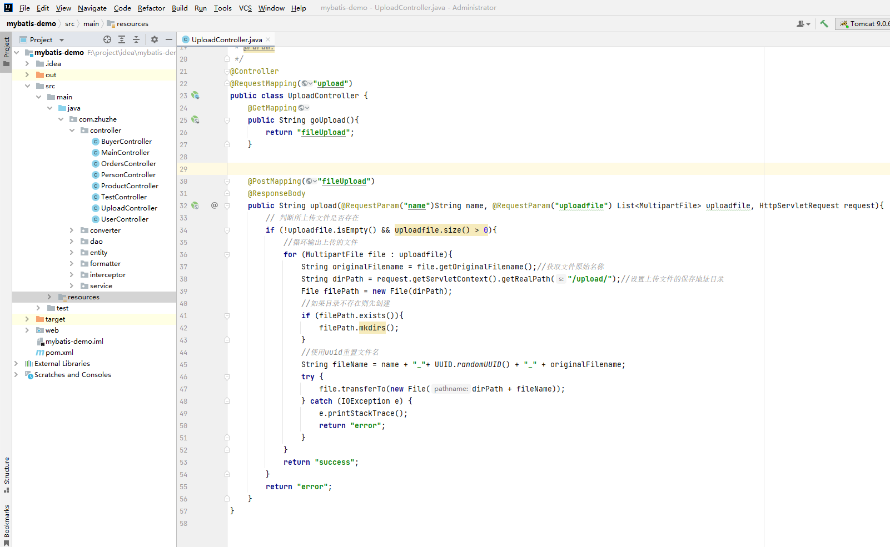

```java
package com.zhuzhe.controller;

import org.springframework.stereotype.Controller;
import org.springframework.web.bind.annotation.*;
import org.springframework.web.multipart.MultipartFile;

import javax.servlet.http.HttpServletRequest;
import java.io.File;
import java.io.IOException;
import java.util.List;
import java.util.UUID;

/**
 * @Author: zhuzhe
 * @ClassName: UploadController
 * @Date: 2022/9/29 16:55
 * @Description:
 * @Version: V1.0
 * @Param:
 */
@Controller
@RequestMapping("upload")
public class UploadController {
    @GetMapping
    public String goUpload(){
        return "fileUpload";
    }


    @PostMapping("fileUpload")
    @ResponseBody
    public String upload(@RequestParam("name")String name, @RequestParam("uploadfile") List<MultipartFile> uploadfile, HttpServletRequest request){
        // 判断所上传文件是否存在
        if (!uploadfile.isEmpty() && uploadfile.size() > 0){
            //循环输出上传的文件
            for (MultipartFile file : uploadfile){
                String originalFilename = file.getOriginalFilename();//获取文件原始名称
                String dirPath = request.getServletContext().getRealPath("/upload/");//设置上传文件的保存地址目录
                File filePath = new File(dirPath);
                //如果目录不存在则先创建
                if (filePath.exists()){
                    filePath.mkdirs();
                }
                //使用uuid重置文件名
                String fileName = name + "_"+ UUID.randomUUID() + "_" + originalFilename;
                try {
                    file.transferTo(new File(dirPath + fileName));
                } catch (IOException e) {
                    e.printStackTrace();
                    return "error";
                }
            }
            return "success";
        }
        return "error";
    }
}
```

打包部署测试。


这里选择上传一个jar包文件，点击上传后成功上传到服务器的指定文件夹


**实现文件下载。**

```
这里为了体现上传下载的联系，更改了上面的部分代码。
```

1. 前端网页：提供文件上传功能，上传成功之后会在上面显示出一个文件列表，点击下载即可下载文件

   

   ```html
   <!DOCTYPE html>
   <html lang="en">
   <head>
       <meta charset="UTF-8">
       <title>文件上传</title>
   </head>
   
   <script type="text/javascript" src="//apps.bdimg.com/libs/jquery/1.11.3/jquery.min.js"></script>
   
   <body>
       <div id="dataList"></div>
       <form id="fileForm" action="/zz/upload/fileUpload" method="post" enctype="multipart/form-data" onsubmit="return check()">
           上传人：<input id="name" type="text" name="name"><br>
           请选择文件：<input id="file" type="file" name="uploadfile" multiple="multiple"><br>
           <input type="submit" value="上传">
       </form>
   </body>
   <!--/zz/upload/list-->
   <script type="text/javascript">
       $(function(){
           $.get(
               "/zz/upload/list",//url地址
               {},//请求参数
               function(data){ //回传函数
                   var array = $.parseJSON(data);
                   for (let i = 0; i < array.length; i++) {
                       $("#dataList").append("<label><sub>"+array[i]+"</sub><a href='/zz/upload/download?filename="+encodeURI(array[i])+"'>下载</a> </label><br/>");
                   }
               },
               "text")
       });
   
   
   
       function check() {
           var name = document.getElementById('name').value;
           var file = document.getElementById('file').value;
           if (name==''){
               alert("请输入上传人姓名！")
               return false;
           }
           if (file.length==0||file==''){
               alert("请选择上传文件！")
               return false;
           }
           //var data = $("#fileForm").serialize();
           // $.ajax({
           //     url:"upload/fileUpload",
           //     data:data,
           //     cache: false,
           //     contentType: 'multipart/form-data',
           //     processData: false,
           //     type: 'POST',
           //     success: function(data){
           //         if (result>0){
           //             alert("上传成功！");
           //             window.location.reload();
           //         }else {
           //             alert("上传失败！");
           //         }
           //     }
           // })
           return true;
       }
   </script>
   </html>
   ```

   因为这里暂时使用不了jQuery实现文件上传功能，所以只能由表单提交后台接口后，后台接口重定向回原理的上传页面

2. 编写支持文件上传下载的代码：提供了上传和下载的功能，下载功能还单独写了一个编码类，为在前端展示内容不乱码。

   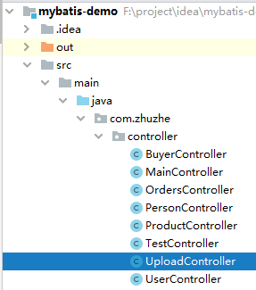

   ```java
   package com.zhuzhe.controller;
   
   import org.apache.commons.io.FileUtils;
   import org.apache.log4j.Logger;
   import org.springframework.http.HttpHeaders;
   import org.springframework.http.HttpStatus;
   import org.springframework.http.MediaType;
   import org.springframework.http.ResponseEntity;
   import org.springframework.stereotype.Controller;
   import org.springframework.web.bind.annotation.*;
   import org.springframework.web.multipart.MultipartFile;
   
   import javax.servlet.http.HttpServletRequest;
   import java.io.File;
   import java.io.IOException;
   import java.net.URLEncoder;
   import java.util.List;
   import java.util.UUID;
   
   /**
    * @Author: zhuzhe
    * @ClassName: UploadController
    * @Date: 2022/9/29 16:55
    * @Description:
    * @Version: V1.0
    * @Param:
    */
   @Controller
   @RequestMapping("upload")
   public class UploadController {
   
       private static Logger logger = Logger.getLogger(UploadController.class);
   
       @GetMapping
       public String goUpload(){
           return "fileUpload";
       }
   
   
       @PostMapping("fileUpload")
       public String upload(@RequestParam("name")String name, @RequestParam("uploadfile") List<MultipartFile> uploadfile, HttpServletRequest request){
           // 判断所上传文件是否存在
           if (!uploadfile.isEmpty() && uploadfile.size() > 0){
               //循环输出上传的文件
               for (MultipartFile file : uploadfile){
                   String originalFilename = file.getOriginalFilename();//获取文件原始名称
                   String dirPath = request.getServletContext().getRealPath("/upload/");//设置上传文件的保存地址目录
                   File filePath = new File(dirPath);
                   //如果目录不存在则先创建
                   if (!filePath.exists()){
                       filePath.mkdirs();
                   }
                   //使用uuid重置文件名
                   String fileName = name + "_"+ UUID.randomUUID() + "_" + originalFilename;
                   try {
                       file.transferTo(new File(dirPath + fileName));
                   } catch (IOException e) {
                       e.printStackTrace();
                       return "error";
                   }
               }
               return "redirect:/upload";
           }
           return "error";
       }
   
       @GetMapping("list")
       @ResponseBody
       public String[] list(HttpServletRequest request){
           String[] list = null;
           String dirPath = request.getServletContext().getRealPath("/upload/");//设置上传文件的保存地址目录
           File filePath = new File(dirPath);
           if (filePath.exists()){
               list = filePath.list();
           }
           return list;
       }
   
       @GetMapping("download")
       public ResponseEntity<byte[]> fileDownload(HttpServletRequest request,String filename) throws Exception{
   
           logger.info("filename="+filename);
   
   
           //指定要下载的文件所在路径
           String path = request.getServletContext().getRealPath("/upload/");
           //创建该文件对象
           File file = new File(path+File.separator+filename);
           //对文件名编码，防止中文乱码
           filename = this.getFilename(request,filename);
           //设置响应头
           HttpHeaders headers = new HttpHeaders();
           //通知浏览器以下载的方式打开文件
           headers.setContentDispositionFormData("attachment",filename);
           //定义以流形式下载返回文件数据
           headers.setContentType(MediaType.APPLICATION_OCTET_STREAM);
           //使用String MVC 框架的ResponseEntity对象封装返回下载数据
           return new ResponseEntity<byte[]>(FileUtils.readFileToByteArray(file),headers, HttpStatus.OK);
       }
   
       public String getFilename(HttpServletRequest request, String filename) throws Exception{
           //IE 不同版本User-Agent中出现的关键词
           String[] IEBrowserKeyWords = {"MSIE","Trident","Edge"};
           //获取请求头代理信息
           String userAgent = request.getHeader("User-Agent");
           for (String keyWord:IEBrowserKeyWords) {
               if (userAgent.contains(keyWord)){
                   //IE 内核浏览器，统一为UTF-8编码显示
                   return URLEncoder.encode(filename,"UTF-8");
               }
           }
           //火狐等其他浏览器统一为ISO-8859-1编码显示
           return new String(filename.getBytes("UTF-8"),"ISO-8859-1");
       }
   }
   ```

   这里的依赖web.xml和配置spring-mvc.xml和之前一样，没有做过更改

   web.xml

   ```xml
   <?xml version="1.0" encoding="UTF-8"?>
   <project xmlns="http://maven.apache.org/POM/4.0.0"
            xmlns:xsi="http://www.w3.org/2001/XMLSchema-instance"
            xsi:schemaLocation="http://maven.apache.org/POM/4.0.0 http://maven.apache.org/xsd/maven-4.0.0.xsd">
       <modelVersion>4.0.0</modelVersion>
   
       <groupId>com.zhuzhe</groupId>
       <artifactId>mybatis-demo</artifactId>
       <version>1.0-SNAPSHOT</version>
   
       <properties>
           <maven.compiler.source>8</maven.compiler.source>
           <maven.compiler.target>8</maven.compiler.target>
           <spring.version>5.0.2.RELEASE</spring.version>
       </properties>
   
       <dependencies>
            <!--Spring MVC依赖-->
           <dependency>
               <groupId>org.springframework</groupId>
               <artifactId>spring-webmvc</artifactId>
               <version>${spring.version}</version>
           </dependency>
           <!--Spring Aop依赖-->
           <dependency>
               <groupId>org.aspectj</groupId>
               <artifactId>aspectjweaver</artifactId>
               <version>1.6.8</version>
           </dependency>
           <dependency>
               <groupId>org.springframework</groupId>
               <artifactId>spring-aop</artifactId>
               <version>${spring.version}</version>
           </dependency>
           <!--Spring Context依赖-->
           <dependency>
               <groupId>org.springframework</groupId>
               <artifactId>spring-context</artifactId>
               <version>${spring.version}</version>
           </dependency>
           <!--Spring Web依赖-->
           <dependency>
               <groupId>org.springframework</groupId>
               <artifactId>spring-web</artifactId>
               <version>${spring.version}</version>
           </dependency>
           <!--Spring Test依赖-->
           <dependency>
               <groupId>org.springframework</groupId>
               <artifactId>spring-test</artifactId>
               <version>${spring.version}</version>
           </dependency>
           <!--Spring Tx依赖-->
           <dependency>
               <groupId>org.springframework</groupId>
               <artifactId>spring-tx</artifactId>
               <version>${spring.version}</version>
           </dependency>
           <!--Spring Jdbc依赖-->
           <dependency>
               <groupId>org.springframework</groupId>
               <artifactId>spring-jdbc</artifactId>
               <version>${spring.version}</version>
           </dependency>
   
           <!--Servlet依赖-->
   <!--        <dependency>-->
   <!--            <groupId>javax.servlet</groupId>-->
   <!--            <artifactId>servlet-api</artifactId>-->
   <!--            <version>2.5</version>-->
   <!--            <scope>provided</scope>-->
   <!--        </dependency>-->
           <dependency>
               <groupId>javax.servlet</groupId>
               <artifactId>javax.servlet-api</artifactId>
               <version>4.0.1</version>
               <scope>provided</scope>
           </dependency>
           <!--JUnit依赖-->
           <dependency>
               <groupId>junit</groupId>
               <artifactId>junit</artifactId>
               <version>4.12</version>
               <scope>test</scope>
           </dependency>
           <!--mysql驱动依赖-->
           <dependency>
               <groupId>mysql</groupId>
               <artifactId>mysql-connector-java</artifactId>
               <version>8.0.15</version>
           </dependency>
           <!--log4j依赖-->
           <dependency>
               <groupId>log4j</groupId>
               <artifactId>log4j</artifactId>
               <version>1.2.12</version>
           </dependency>
           <dependency>
               <groupId>org.slf4j</groupId>
               <artifactId>slf4j-api</artifactId>
               <version>1.6.6</version>
           </dependency>
           <dependency>
               <groupId>org.slf4j</groupId>
               <artifactId>slf4j-log4j12</artifactId>
               <version>1.6.6</version>
           </dependency>
           <!--MyBatis依赖-->
           <dependency>
               <groupId>org.mybatis</groupId>
               <artifactId>mybatis</artifactId>
               <version>3.4.5</version>
           </dependency>
           <dependency>
               <groupId>org.mybatis</groupId>
               <artifactId>mybatis-spring</artifactId>
               <version>1.3.0</version>
           </dependency>
   
           <!--Jackson依赖-->
           <dependency>
               <groupId>com.fasterxml.jackson.core</groupId>
               <artifactId>jackson-core</artifactId>
               <version>2.12.5</version>
           </dependency>
           <dependency>
               <groupId>com.fasterxml.jackson.core</groupId>
               <artifactId>jackson-databind</artifactId>
               <version>2.12.5</version>
           </dependency>
           <dependency>
               <groupId>com.fasterxml.jackson.core</groupId>
               <artifactId>jackson-annotations</artifactId>
               <version>2.12.5</version>
           </dependency>
   
           <!--文件上传下载依赖-->
           <dependency>
               <groupId>commons-io</groupId>
               <artifactId>commons-io</artifactId>
               <version>2.6</version>
           </dependency>
           <dependency>
               <groupId>commons-fileupload</groupId>
               <artifactId>commons-fileupload</artifactId>
               <version>1.4</version>
           </dependency>
       </dependencies>
   </project>
   ```

   记得加了新包之后，需要在打包文件夹中把对应的jar包添加到lib文件夹下

   

   spring-mvc.xml配置和上面的一样，只添加了一个支持文件上传的解析器

   ```xml
   <?xml version="1.0" encoding="UTF-8"?>
   <beans xmlns="http://www.springframework.org/schema/beans"
          xmlns:mvc="http://www.springframework.org/schema/mvc"
          xmlns:xsi="http://www.w3.org/2001/XMLSchema-instance"
          xmlns:context="http://www.springframework.org/schema/context"
          xmlns:aop="http://www.springframework.org/schema/aop"
          xmlns:tx="http://www.springframework.org/schema/tx"
          xsi:schemaLocation="http://www.springframework.org/schema/beans
          http://www.springframework.org/schema/beans/spring-beans.xsd
          http://www.springframework.org/schema/context
          http://www.springframework.org/schema/context/spring-context.xsd
          http://www.springframework.org/schema/aop
          http://www.springframework.org/schema/aop/spring-aop.xsd
          http://www.springframework.org/schema/tx
          http://www.springframework.org/schema/tx/spring-tx.xsd
          http://www.springframework.org/schema/mvc
          http://www.springframework.org/schema/mvc/spring-mvc.xsd">
       <!--开启注解扫描，要扫描整个项目代码-->
       <context:component-scan base-package="com.zhuzhe"/>
   
       <!--处理映射器，将处理器的handler的name作为url进行查找-->
       <bean class="org.springframework.web.servlet.handler.BeanNameUrlHandlerMapping"/>
       <!--处理设配器，配置对处理器中handleRequest()方法的调用-->
       <bean class="org.springframework.web.servlet.mvc.SimpleControllerHandlerAdapter"/>
   
       <!--配置Spring开启MVC的注解支持-->
       <mvc:annotation-driven/>
   
       <!--Jackson处理控制器返回对象转为Json字符串-->
       <mvc:annotation-driven>
           <mvc:message-converters>
               <bean class="org.springframework.http.converter.StringHttpMessageConverter">
                   <constructor-arg value="UTF-8"/>
               </bean>
               <bean class="org.springframework.http.converter.json.MappingJackson2HttpMessageConverter">
                   <property name="objectMapper">
                       <bean class="org.springframework.http.converter.json.Jackson2ObjectMapperFactoryBean">
                           <property name="failOnEmptyBeans" value="false"/>
                       </bean>
                   </property>
               </bean>
           </mvc:message-converters>
       </mvc:annotation-driven>
   
       <!-- 配置视图解析器 -->
       <bean id="viewResolver" class="org.springframework.web.servlet.view.InternalResourceViewResolver">
           <property name="prefix" value="/"/>
           <property name="suffix" value=".html"/>
       </bean>
   
       <!--对String转Date的操作由自定义Converter处理-->
       <mvc:annotation-driven conversion-service="conversionService"/>
   <!--    <bean id="conversionService" class="org.springframework.context.support.ConversionServiceFactoryBean">-->
   <!--        <property name="converters">-->
   <!--            <set>-->
   <!--                <bean class="com.zhuzhe.converter.DateConverter"/>-->
   <!--            </set>-->
   <!--        </property>-->
   <!--    </bean>-->
   
       <!--使用Formatter来处理字符串转换为Date-->
       <bean id="conversionService" class="org.springframework.format.support.FormattingConversionServiceFactoryBean">
           <property name="formatters">
               <set>
                   <bean class="com.zhuzhe.formatter.DateFormatter"/>
               </set>
           </property>
       </bean>
   
       <!--配置用户登录拦截器-->
       <mvc:interceptors>
           <mvc:interceptor>
               <mvc:mapping path="/user/**"/><!--要拦截的路径-->
               <mvc:exclude-mapping path="/user"/><!--放行的路径，表示不拦截 表示放行user请求。但这里会导致user页面的其他请求失效，需要做详细配置-->
               <bean class="com.zhuzhe.interceptor.LoginInterceptor"/><!--注册拦截器的bean-->
           </mvc:interceptor>
       </mvc:interceptors>
   
       <!--配置文件上传解析器MultipartResolver-->
       <bean id="multipartResolver" class="org.springframework.web.multipart.commons.CommonsMultipartResolver">
           <!--设置请求的编码格式-->
           <property name="defaultEncoding" value="UTF-8"/>
       </bean>
   </beans>
   ```

3. 项目部署测试

   在一开进去是没有文件的，所以显示为空

   

   在输入上传人还有添加文件后，点击上传。上传成功则回刷新当前页面，并且显示出已经上传的文件

   

   

   点击下载则可以成功下载该文件，并且由于对中文编码进行处理过，所以下载的文件名称是和当前显示的名称一致。

   

   

   因为是服务器存储，所以需要加上别名来避免文件名冲突，而在实际的开发中，如果用户想实现上传和下载文件是之前的名字。可以通过维护原名新名表来实现，或是使用用户文件夹来实现。


# Spring Boot 企业级开发教程


Spring Boot官方文档：https://spring.io/projects/spring-boot


```
P204 定时任务
P178 RabbitMQ
P140 Spring Security
P111 Spring Boot打Jar包
P75 Thymeleaf语法
P50 Spring Data
P46 Spring Boot配置文件中随机值和引用值
P42 Profile多环境配置
P38 Spring Boot自定义配置
P32 yaml配置文件
P22 Spring Boot 执行流程
P16 Spring Boot 注解分析
```


## idea创建Spring Boot项目

1. 新建项目New Project

   

2. 选择快速构建Spring应用Spring Initializr

   ```
   1. Name：项目名
   2. Location：项目地址
   3. Language：使用的Jvm语言
   4. Type：使用的Jar包管理方式
   5. Group：所属组织名
   6. Artifact：项目唯一标识符
   7. Package Name：项目包名
   8. Java：使用的Java版本
   9. Packaging：使用的打包方式
   ```

   

   

3. 选择web依赖

   

4. 默认Spring Boot版本，点击Finish开始快速构建

   

   

   

5. 启动项目

   

   

6. 访问项目

   

7. 调试测试用例

   

   编写一个Controler

   

   ```java
   package com.zhuzhe.controller;
   
   import org.springframework.stereotype.Controller;
   import org.springframework.web.bind.annotation.RequestMapping;
   import org.springframework.web.bind.annotation.RequestMethod;
   import org.springframework.web.bind.annotation.ResponseBody;
   
   /**
    * @Author: zhuzhe
    * @ClassName: TestController
    * @Date: 2022/10/2 18:35
    * @Description:
    * @Version: V1.0
    * @Param:
    */
   @Controller
   @RequestMapping("test")
   public class TestController {
   
       @RequestMapping(value = "hello",method = RequestMethod.GET)
       @ResponseBody
       public String hello(){
           return "hello world!";
       }
   }
   ```

   

   在测试用例中执行该Controler接口的功能

   

   ```java
   package com.zhuzhe;
   
   import com.zhuzhe.controller.TestController;
   import org.junit.jupiter.api.Test;
   import org.springframework.beans.factory.annotation.Autowired;
   import org.springframework.boot.test.context.SpringBootTest;
   
   import java.util.logging.Logger;
   
   @SpringBootTest//标记单元测试类，加载项目的上下文ApplicationContext
   class SpringBootDemoApplicationTests {
       private static Logger logger = Logger.getLogger(SpringBootDemoApplicationTests.class.getSimpleName());
   
   
       @Autowired
       private TestController testController;
   
       @Test//测试用例
       void contextLoads() {
           System.out.println("测试用例执行...");
       }
   
       @Test
       void controllerTest(){
           logger.info(testController.hello());
       }
   }
   ```

   用例执行结果：

   


## Spring Boot项目实现自定义配置

1. 自定义properties文件，实现自定义配置对象

   ```
   Spring Boot项目在启动时就默认读取application.properties文件，如果需要新增properties文件则需要加配置来将其读取到Spring容器中
   
   使用的场景：类似需要一个配置对象，但不想全定义在之前的application.properties文件中。
   ```

   > 新建一个配置文件：test.properties

   

   ```properties
   test.id=213
   test.name=zhuzhe
   ```

   > 新建一个实体bean来接收该配置文件的内容

   

   ```java
   package com.zhuzhe.domain;
   
   import org.springframework.boot.context.properties.ConfigurationProperties;
   import org.springframework.boot.context.properties.EnableConfigurationProperties;
   import org.springframework.context.annotation.Configuration;
   import org.springframework.context.annotation.PropertySource;
   
   /**
    * @Author: zhuzhe
    * @ClassName: TestProperties
    * @Date: 2022/10/4 21:27
    * @Description: 测试bean，加载自定义的properties内容
    * @Version: V1.0
    * @Param:
    */
   @Configuration//自定义配置类（标识bean组件，让spring容器执行ioc）
   @PropertySource("classpath:test.properties")//指定自定义配置文件位置和名称
   @EnableConfigurationProperties(TestProperties.class)//开启对应配置类的属性注入功能（配合下面注解）
   @ConfigurationProperties(prefix = "test")//指定配置文件注入属性前缀（以test开头的属性值进行注入）
   public class TestProperties {
       private int id;
       private String name;
   
       public int getId() {
           return id;
       }
   
       public void setId(int id) {
           this.id = id;
       }
   
       public String getName() {
           return name;
       }
   
       public void setName(String name) {
           this.name = name;
       }
   
       @Override
       public String toString() {
           return "TestProperties{" +
                   "id=" + id +
                   ", name='" + name + '\'' +
                   '}';
       }
   }
   ```

   > 新建一个测试用例，查看该配置对象的内容

   

   ```java
   package com.zhuzhe;
   
   import com.zhuzhe.controller.TestController;
   import com.zhuzhe.domain.TestProperties;
   import org.junit.jupiter.api.Test;
   import org.springframework.beans.factory.annotation.Autowired;
   import org.springframework.boot.test.context.SpringBootTest;
   
   import java.util.logging.Logger;
   
   @SpringBootTest//标记单元测试类，加载项目的上下文ApplicationContext
   class SpringBootDemoApplicationTests {
       private static Logger logger = Logger.getLogger(SpringBootDemoApplicationTests.class.getSimpleName());
   
   
       @Autowired
       private TestController testController;
       @Autowired
       private TestProperties testProperties;
   
       @Test//测试用例
       void contextLoads() {
           System.out.println("测试用例执行...");
       }
   
       @Test
       void controllerTest(){
           logger.info(testController.hello());
       }
   
       @Test
       void diyPropertiesTest(){
           logger.info(testProperties.toString());
       }
   }
   ```

   测试效果：

   

   

   

   

2. 使用原版Spring框架中的XML配置文件

   ```
   以前的Spring框架，使用的是applicationContext.xml配置文件，里面定义了ioc、aop、mvc、transaction等等配置，在Spring Boot中都省略了。默认不再使用XML文件配置项目。
   
   如果希望继续使用XML文件应用Spring容器，则需要下面的步骤
   ```

   > 新建一个测试的bean

   

   ```java
   package com.zhuzhe.domain;
   
   /**
    * @Author: zhuzhe
    * @ClassName: TestBean
    * @Date: 2022/10/4 21:58
    * @Description: 原版Spring中的自定义Bean
    * @Version: V1.0
    * @Param:
    */
   public class TestBean {
       private int id;
       private String name;
   
       public int getId() {
           return id;
       }
   
       public void setId(int id) {
           this.id = id;
       }
   
       public String getName() {
           return name;
       }
   
       public void setName(String name) {
           this.name = name;
       }
   
       @Override
       public String toString() {
           return "TestBean{" +
                   "id=" + id +
                   ", name='" + name + '\'' +
                   '}';
       }
   }
   ```

   > 和之前开发Spring项目一样，新建一个beans.xml配置文件

   

   > 在启动类里添加注解，在允许Spring容器时，除了Spring Boot的操作外附加读取beans.xml配置文件

   

   ```java
   package com.zhuzhe;
   
   import org.springframework.boot.SpringApplication;
   import org.springframework.boot.autoconfigure.SpringBootApplication;
   import org.springframework.context.annotation.ImportResource;
   
   @ImportResource("classpath:beans.xml")
   @SpringBootApplication
   public class SpringBootDemoApplication {
   
       public static void main(String[] args) {
           SpringApplication.run(SpringBootDemoApplication.class, args);
       }
   
   }
   ```

   > 新增一个测试用例，测试在启动Spring Boot后，是否成功实例化bean

   

   ```java
   package com.zhuzhe;
   
   import com.zhuzhe.controller.TestController;
   import com.zhuzhe.domain.TestBean;
   import com.zhuzhe.domain.TestProperties;
   import org.junit.jupiter.api.Test;
   import org.springframework.beans.factory.annotation.Autowired;
   import org.springframework.boot.test.context.SpringBootTest;
   
   import java.util.logging.Logger;
   
   @SpringBootTest//标记单元测试类，加载项目的上下文ApplicationContext
   class SpringBootDemoApplicationTests {
       private static Logger logger = Logger.getLogger(SpringBootDemoApplicationTests.class.getSimpleName());
   
   
       @Autowired
       private TestController testController;
       @Autowired
       private TestProperties testProperties;
       @Autowired
       private TestBean testBean;
   
       @Test//测试用例
       void contextLoads() {
           System.out.println("测试用例执行...");
       }
   
       @Test
       void controllerTest(){
           logger.info(testController.hello());
       }
   
       @Test
       void diyPropertiesTest(){
           logger.info(testProperties.toString());
       }
   
       @Test
       void diyXmlTest(){
           logger.info(testBean.toString());
       }
   }
   ```

   测试效果：

   

   

   

   

   

3. 使用配置类的方式替代前面建XML的配置

   ```
   遵循Spring Boot的约定大于配置的原则，提供了配置类来自定义类似XML的功能
   ```

   > 和前面第二部的内容一样，只不过不用加载beans.xml配置文件了，这里通过配置类的方式来实现同样的效果

   注释掉读取配置文件的注解

   

   > 新增一个配置类，TestBeanConfiguration.java

   

   > 执行之前的测试方法，测试bean的注入结果

   

   测试结果：

   

   

   


## Spring Boot项目实现多环境切换

```
通过提供多个配置文件，来做到项目部署到不同环境下

使用场景：测试环境连测试数据库、测试环境用测试域名

使用方法：
1. 根据环境创建不同的配置文件。application-{profile}.properties
2. 在项目运行时，指定激活环境。java -jar xxx.jar --spring.profiles.active=dev
```

1. 新建三个环境的配置文件，区别在项目的访问端口

   

   

   将当前项目打成jar包。

   

   

   使用命令的方式来运行当前jar包，并用参数spring.profiles.active=test 来激活测试环境配置

   

   

2. 测试接口通过新端口方式

   

3. 也可以通过在全局配置文件中激活指定配置

   

   


## Spring Boot根据不同环境起效不同代码

```
前面讲的是根据不同的环境，项目做对应不同的配置。这里类似的是做了多套不同环境的代码，根据当前环境来起效其中一套。
```

1. 编写一个配置接口对外暴露统一类型，在该接口下实现多个环境的代码

   

   ```java
   package com.zhuzhe.config;
   
   /**
    * @Author: zhuzhe
    * @ClassName: DBConnector
    * @Date: 2022/10/5 18:06
    * @Description: 模拟数据库连接对象
    * @Version: V1.0
    * @Param:
    */
   public interface DBConnector {
       void configure();
   }
   ```

   ```java
   package com.zhuzhe.config;
   
   import org.springframework.context.annotation.Configuration;
   import org.springframework.context.annotation.Profile;
   
   import java.util.logging.Logger;
   
   /**
    * @Author: zhuzhe
    * @ClassName: DevDBConnector
    * @Date: 2022/10/5 18:07
    * @Description:
    * @Version: V1.0
    * @Param:
    */
   @Configuration
   @Profile("dev")
   public class DevDBConnector implements DBConnector{
       private static Logger logger = Logger.getLogger(DevDBConnector.class.getSimpleName());
   
       @Override
       public void configure() {
           logger.info("配置开发数据库环境...");
       }
   }
   ```

   ```java
   package com.zhuzhe.config;
   
   import org.springframework.context.annotation.Configuration;
   import org.springframework.context.annotation.Profile;
   
   import java.util.logging.Logger;
   
   /**
    * @Author: zhuzhe
    * @ClassName: DevDBConnector
    * @Date: 2022/10/5 18:07
    * @Description:
    * @Version: V1.0
    * @Param:
    */
   @Configuration
   @Profile("prod")
   public class ProdDBConnector implements DBConnector{
       private static Logger logger = Logger.getLogger(ProdDBConnector.class.getSimpleName());
   
       @Override
       public void configure() {
           logger.info("配置生产数据库环境...");
       }
   }
   ```

   ```java
   package com.zhuzhe.config;
   
   import org.springframework.context.annotation.Configuration;
   import org.springframework.context.annotation.Profile;
   
   import java.util.logging.Logger;
   
   /**
    * @Author: zhuzhe
    * @ClassName: DevDBConnector
    * @Date: 2022/10/5 18:07
    * @Description:
    * @Version: V1.0
    * @Param:
    */
   @Configuration
   @Profile("test")
   public class TestDBConnector implements DBConnector{
       private static Logger logger = Logger.getLogger(TestDBConnector.class.getSimpleName());
   
       @Override
       public void configure() {
           logger.info("配置测试数据库环境...");
       }
   }
   ```

2. idea启动spring boot项目。在之前的配置中是启动了dev开发环境

   


## Spring Boot项目整合MyBatis

```
Spring本身有提供了jdbc的功能，在Spring Boot中更是引入了Spring Data的框架来支持对多种数据库的访问支持。但Spring Boot并没有提供MyBatis场景的依赖。Mybatis团队自己适配了Spring Boot 提供了mybatis-spring-boot-starter依赖

1. 可以在Spring Initializr快速构建时勾选Mybatis的依赖
2. 在pom.xml中引入依赖
```

1. 新建数据库

   ```sql
   -- 创建数据库
   create database springbootdata;
   use springbootdata;
   -- 文章表
   drop table if exists t_article;
   create table t_article(
   	id int(20) primary key auto_increment comment '文章id',
   	title varchar(200) default null comment '文章标题',
   	content longtext comment '文章内容'
   )engine=InnoDB auto_increment=2 default charset=utf8;
   -- 文章数据
   insert into t_article values('1','测试文章标题01','测试文章内容01');
   insert into t_article values('2','测试文章标题02','测试文章内容02');
   -- 评论表
   drop table if exists t_comment;
   create table t_comment(
   	id int(20) not null auto_increment comment '评论id',
   	content longtext default null comment '评论内容',
   	author varchar(200) default null comment '评论作者',
   	a_id int(20) default null comment '关联文章id',
   	primary key(id)
   )engine=InnoDB auto_increment=3 default charset=utf8;
   -- 评论数据
   insert into t_comment values('1','评论内容01','评论人01','1');
   insert into t_comment values('2','评论内容02','评论人02','1');
   insert into t_comment values('3','评论内容03','评论人03','1');
   insert into t_comment values('4','评论内容04','评论人04','1');
   insert into t_comment values('5','评论内容05','评论人05','2');
   ```

   

   

2. 在项目pom文件中添加MySQL、Mybatis、Druid依赖

   ```xml
   <?xml version="1.0" encoding="UTF-8"?>
   <project xmlns="http://maven.apache.org/POM/4.0.0" xmlns:xsi="http://www.w3.org/2001/XMLSchema-instance"
            xsi:schemaLocation="http://maven.apache.org/POM/4.0.0 https://maven.apache.org/xsd/maven-4.0.0.xsd">
       <modelVersion>4.0.0</modelVersion>
       <parent>
           <groupId>org.springframework.boot</groupId>
           <artifactId>spring-boot-starter-parent</artifactId>
           <version>2.7.4</version>
           <relativePath/> <!-- lookup parent from repository -->
       </parent>
       <groupId>com.zhuzhe</groupId>
       <artifactId>spring-boot-demo</artifactId>
       <version>0.0.1-SNAPSHOT</version>
       <name>spring-boot-demo</name>
       <description>spring-boot-demo</description>
       <properties>
           <java.version>1.8</java.version>
       </properties>
       <dependencies>
           <dependency>
               <groupId>org.springframework.boot</groupId>
               <artifactId>spring-boot-starter-web</artifactId>
           </dependency>
   
           <dependency>
               <groupId>org.springframework.boot</groupId>
               <artifactId>spring-boot-starter-test</artifactId>
               <scope>test</scope>
           </dependency>
   
           <dependency>
               <groupId>com.alibaba</groupId>
               <artifactId>druid-spring-boot-starter</artifactId>
               <version>1.1.10</version>
           </dependency>
   
           <dependency>
               <groupId>org.mybatis.spring.boot</groupId>
               <artifactId>mybatis-spring-boot-starter</artifactId>
               <version>2.0.0</version>
           </dependency>
   
           <dependency>
               <groupId>mysql</groupId>
               <artifactId>mysql-connector-java</artifactId>
               <scope>runtime</scope>
           </dependency>
       </dependencies>
   
       <build>
           <plugins>
               <plugin>
                   <groupId>org.springframework.boot</groupId>
                   <artifactId>spring-boot-maven-plugin</artifactId>
               </plugin>
           </plugins>
       </build>
   </project>
   ```

   

3. 在配置文件中描述数据库连接、mybatis配置、druid连接池配置

   ```properties
   # 激活开发环境配置文件
   spring.profiles.active=dev
   # MySQL连接配置
   spring.datasource.url=jdbc:mysql://127.0.0.1:3306/springbootdata?useUnicode=true&characterEncoding=utf8&serverTimezoneGMT%2B8&useSSL=false
   spring.datasource.username=root
   spring.datasource.password=123456
   # Druid的连接池配置
   spring.datasource.type=com.alibaba.druid.pool.DruidDataSource
   spring.datasource.initialSize=20
   spring.datasource.minIdle=10
   spring.datasource.maxActive=100
   # 开启驼峰命名支持（数据库下划线风格转驼峰命名风格，适配Java实体映射）
   mybatis.configuration.map-underscore-to-camel-case=true
   ```

   

4. 对照数据库新建实体

   

   Article.java

   ```java
   package com.zhuzhe.domain;
   
   import java.util.List;
   
   /**
    * @Author: zhuzhe
    * @ClassName: Article
    * @Date: 2022/10/6 0:01
    * @Description: 文章实体
    * @Version: V1.0
    * @Param:
    */
   public class Article {
       private Integer id;
       private String title;
       private String content;
       private List<Comment> commentList;
   
       public Integer getId() {
           return id;
       }
   
       public void setId(Integer id) {
           this.id = id;
       }
   
       public String getTitle() {
           return title;
       }
   
       public void setTitle(String title) {
           this.title = title;
       }
   
       public String getContent() {
           return content;
       }
   
       public void setContent(String content) {
           this.content = content;
       }
   
       public List<Comment> getCommentList() {
           return commentList;
       }
   
       public void setCommentList(List<Comment> commentList) {
           this.commentList = commentList;
       }
   
       @Override
       public String toString() {
           return "Article{" +
                   "id=" + id +
                   ", title='" + title + '\'' +
                   ", content='" + content + '\'' +
                   ", commentList=" + commentList +
                   '}';
       }
   }
   ```

   Comment.java

   ```java
   package com.zhuzhe.domain;
   
   /**
    * @Author: zhuzhe
    * @ClassName: Comment
    * @Date: 2022/10/6 0:00
    * @Description: 评论实体
    * @Version: V1.0
    * @Param:
    */
   public class Comment {
       private Integer id;
       private String content;
       private String author;
       private Integer aId;
   
       public Integer getId() {
           return id;
       }
   
       public void setId(Integer id) {
           this.id = id;
       }
   
       public String getContent() {
           return content;
       }
   
       public void setContent(String content) {
           this.content = content;
       }
   
       public String getAuthor() {
           return author;
       }
   
       public void setAuthor(String author) {
           this.author = author;
       }
   
       public Integer getaId() {
           return aId;
       }
   
       public void setaId(Integer aId) {
           this.aId = aId;
       }
   
       @Override
       public String toString() {
           return "Comment{" +
                   "id=" + id +
                   ", content='" + content + '\'' +
                   ", author='" + author + '\'' +
                   ", aId=" + aId +
                   '}';
       }
   }
   ```

   

5. 新建简单mapper接口（这里用评论这个表来实现无mapper.xml文件的简单功能）

   

   CommentMapper.java

   ```java
   package com.zhuzhe.mapper;
   
   import com.zhuzhe.domain.Comment;
   import org.apache.ibatis.annotations.*;
   
   import java.util.List;
   
   /**
    * @Author: zhuzhe
    * @ClassName: CommentMapper
    * @Date: 2022/10/6 0:26
    * @Description:
    * @Version: V1.0
    * @Param:
    */
   @Mapper
   public interface CommentMapper {
       /*查*/
       @Select("select * from t_comment where id=#{id}")
       public Comment findById(Integer id);
   
       @Select("select * from t_comment")
       public List<Comment> findAll();
   
       /*增*/
       @Insert("insert into t_comment(content,author,a_id) values(#{content},#{author},#{aId})")
       public int insertComment(Comment comment);
   
       /*改*/
       @Update("update t_comment set content=#{content} where id=#{id}")
       public int updateComment(Comment comment);
   
       /*删*/
       @Delete("delete from t_comment where id=#{id}")
       public int deleteComment(Integer id);
   }
   ```

6. 测试接口

   

   ```java
   package com.zhuzhe;
   
   import com.zhuzhe.controller.TestController;
   import com.zhuzhe.domain.Comment;
   import com.zhuzhe.domain.TestBean;
   import com.zhuzhe.domain.TestProperties;
   import com.zhuzhe.mapper.CommentMapper;
   import org.junit.jupiter.api.Test;
   import org.springframework.beans.factory.annotation.Autowired;
   import org.springframework.boot.test.context.SpringBootTest;
   
   import java.util.List;
   import java.util.logging.Logger;
   
   @SpringBootTest//标记单元测试类，加载项目的上下文ApplicationContext
   class SpringBootDemoApplicationTests {
       private static Logger logger = Logger.getLogger(SpringBootDemoApplicationTests.class.getSimpleName());
   
   
       @Autowired
       private TestController testController;
       @Autowired
       private TestProperties testProperties;
       @Autowired
       private TestBean testBean;
       @Autowired
       private CommentMapper commentMapper;
   
       @Test//测试用例
       void contextLoads() {
           System.out.println("测试用例执行...");
       }
   
       @Test
       void controllerTest(){
           logger.info(testController.hello());
       }
   
       @Test
       void diyPropertiesTest(){
           logger.info(testProperties.toString());
       }
   
       @Test
       void diyXmlTest(){
           logger.info(testBean.toString());
       }
   
       @Test
       void findByIdTest(){
   
           /*查：查询单条信息*/
           Comment comment = commentMapper.findById(1);
           logger.info(comment.toString());
   
           /*改：修改上面查到的信息*/
           comment.setContent("测试评论"+Math.random()*100);
           int updateNum = commentMapper.updateComment(comment);
           logger.info("成功修改"+updateNum+"条数据!");
   
           /*增：新增一条数据*/
           comment = new Comment();
           comment.setAuthor("新增测试评论人");
           comment.setContent("新增测试评论");
           comment.setaId(2);
           int insertNum = commentMapper.insertComment(comment);
           logger.info("成功新增"+insertNum+"条数据!");
   
           /*查：查询全部数据*/
           List<Comment> list = commentMapper.findAll();
           logger.info(list.toString());
   
           /*删：删除前面新增的那条数据*/
           int delId = -1;
           for (Comment c:list) {
               if (c.getAuthor().equals("新增测试评论人")){
                   delId = c.getId();
               }
           }
           int deleteNum = commentMapper.deleteComment(delId);
           logger.info("成功删除"+deleteNum+"条数据!");
   
           /*查：查询全部数据*/
           list = commentMapper.findAll();
           logger.info(list.toString());
       }
   }
   ```

   测试结果：

   

7. 新建带有xml文件的mapper接口（使用Article文章表来体现在复杂业务下，还是得选用传统Mybatis开发）

   

   

8. 创建对应的mapper.xml文件

   

   ```xml
   <?xml version="1.0" encoding="UTF-8"?>
   <!DOCTYPE mapper
           PUBLIC "-//mybatis.org//DTD Mapper 3.0//EN"
           "http://mybatis.org/dtd/mybatis-3-mapper.dtd">
   <mapper namespace="com.zhuzhe.mapper.ArticleMapper">
   
       <!--定义结果集：一对多-->
       <resultMap id="articleWithCommentResultMap" type="Article">
           <id property="id" column="id"/>
           <result property="title" column="title"/>
           <result property="content" column="content"/>
           <collection property="commentList" ofType="Comment">
               <id property="id" column="c_id"/>
               <result property="content" column="c_content"/>
               <result property="author" column="c_author"/>
           </collection>
       </resultMap>
   
       <!--查询文章内容（一对多）-->
       <select id="findById" resultMap="articleWithCommentResultMap">
           select ta.*,tc.id c_id,tc.content c_content, tc.author c_author from t_article ta, t_comment tc where ta.id = tc.a_id and ta.id  = #{id};
       </select>
   
       <!--根据文章id更新文章信息-->
       <update id="updateArticle" parameterType="Article">
           update t_article
           <set>
               <if test="title !=null and title !=''">
                   title = #{title},
               </if>
               <if test="content !=null and content !=''">
                   content = #{content}
               </if>
           </set>
           where id = #{id}
       </update>
   </mapper>
   ```

   

9. 在全局配置文件中新增配置，支持对mapper.xml文件的扫描，还有对映射实体类的路径

   

   ```properties
   # 激活开发环境配置文件
   spring.profiles.active=dev
   # MySQL连接配置
   spring.datasource.url=jdbc:mysql://127.0.0.1:3306/springbootdata?useUnicode=true&characterEncoding=utf8&serverTimezoneGMT%2B8&useSSL=false
   spring.datasource.username=root
   spring.datasource.password=123456
   # Druid的连接池配置
   spring.datasource.type=com.alibaba.druid.pool.DruidDataSource
   spring.datasource.initialSize=20
   spring.datasource.minIdle=10
   spring.datasource.maxActive=100
   # 开启驼峰命名支持
   mybatis.configuration.map-underscore-to-camel-case=true
   # 配置Mybatis的XML配置文件路径
   mybatis.mapper-locations=classpath:mapper/*.xml
   # 配置XML映射文件中指定的实体类所在包路径
   mybatis.type-aliases-package=com.zhuzhe.domain
   ```

   

10. 编写测试类，测试效果

    

    ```java
    package com.zhuzhe;
    
    import com.zhuzhe.controller.TestController;
    import com.zhuzhe.domain.Article;
    import com.zhuzhe.domain.Comment;
    import com.zhuzhe.domain.TestBean;
    import com.zhuzhe.domain.TestProperties;
    import com.zhuzhe.mapper.ArticleMapper;
    import com.zhuzhe.mapper.CommentMapper;
    import org.junit.jupiter.api.Test;
    import org.springframework.beans.factory.annotation.Autowired;
    import org.springframework.boot.test.context.SpringBootTest;
    
    import java.util.List;
    import java.util.logging.Logger;
    
    @SpringBootTest//标记单元测试类，加载项目的上下文ApplicationContext
    class SpringBootDemoApplicationTests {
        private static Logger logger = Logger.getLogger(SpringBootDemoApplicationTests.class.getSimpleName());
    
    
        @Autowired
        private TestController testController;
        @Autowired
        private TestProperties testProperties;
        @Autowired
        private TestBean testBean;
        @Autowired
        private CommentMapper commentMapper;
        @Autowired
        private ArticleMapper articleMapper;
    
    
        @Test//测试用例
        void contextLoads() {
            System.out.println("测试用例执行...");
        }
    
        @Test
        void controllerTest(){
            logger.info(testController.hello());
        }
    
        @Test
        void diyPropertiesTest(){
            logger.info(testProperties.toString());
        }
    
        @Test
        void diyXmlTest(){
            logger.info(testBean.toString());
        }
    
        @Test
        void mybatisSimpleTest(){
    
            /*查：查询单条信息*/
            Comment comment = commentMapper.findById(1);
            logger.info(comment.toString());
    
            /*改：修改上面查到的信息*/
            comment.setContent("测试评论"+Math.random()*100);
            int updateNum = commentMapper.updateComment(comment);
            logger.info("成功修改"+updateNum+"条数据!");
    
            /*增：新增一条数据*/
            comment = new Comment();
            comment.setAuthor("新增测试评论人");
            comment.setContent("新增测试评论");
            comment.setaId(2);
            int insertNum = commentMapper.insertComment(comment);
            logger.info("成功新增"+insertNum+"条数据!");
    
            /*查：查询全部数据*/
            List<Comment> list = commentMapper.findAll();
            logger.info(list.toString());
    
            /*删：删除前面新增的那条数据*/
            int delId = -1;
            for (Comment c:list) {
                if (c.getAuthor().equals("新增测试评论人")){
                    delId = c.getId();
                }
            }
            int deleteNum = commentMapper.deleteComment(delId);
            logger.info("成功删除"+deleteNum+"条数据!");
    
            /*查：查询全部数据*/
            list = commentMapper.findAll();
            logger.info(list.toString());
        }
    
        @Test
        void mybatisTest(){
            Article article = articleMapper.findById(1);
            logger.info("查询到的文章详情：" + article);
    
            article.setContent("测试文章内容"+(int)(Math.random()*100));
            int updateNum = articleMapper.updateArticle(article);
            logger.info("成功更新" + updateNum + "条数据！");
        }
    }
    ```

    

11. 测试效果

    


## Spring Boot项目处理配置文件中文乱码

```
Spring在读取配置文件的时候，会按照默认编码ISO-8859-1来进行读取，而默认编码是不支持中文，这导致我们在输入中文时临时显示编码为UTF-8。但重新打开发现是默认编码而显示乱码。
```


1. 在【setting】->【Editor】->【File Encoding】中勾选指定字符集读取文件

   

   

2. 关闭idea，重新打开可以看到，读取配置文件是按照设定的UTF-8字符集

   


## Spring Boot项目整合Spring Data JPA

```
Spring Data系列对MySQL操作的ORM框架。通过注解方式，对数据访问层Repository的类接口绑定对应的SQL执行语句。使得用简单的api就可以实现基本的数据操作。和MyBatis-Plus的风格类似。
```

1. 引入Spring Data JPA依赖

   ```xml
   <?xml version="1.0" encoding="UTF-8"?>
   <project xmlns="http://maven.apache.org/POM/4.0.0" xmlns:xsi="http://www.w3.org/2001/XMLSchema-instance"
            xsi:schemaLocation="http://maven.apache.org/POM/4.0.0 https://maven.apache.org/xsd/maven-4.0.0.xsd">
       <modelVersion>4.0.0</modelVersion>
       <parent>
           <groupId>org.springframework.boot</groupId>
           <artifactId>spring-boot-starter-parent</artifactId>
           <version>2.7.4</version>
           <relativePath/> <!-- lookup parent from repository -->
       </parent>
       <groupId>com.zhuzhe</groupId>
       <artifactId>spring-boot-demo</artifactId>
       <version>0.0.1-SNAPSHOT</version>
       <name>spring-boot-demo</name>
       <description>spring-boot-demo</description>
       <properties>
           <java.version>1.8</java.version>
       </properties>
       <dependencies>
           <dependency>
               <groupId>org.springframework.boot</groupId>
               <artifactId>spring-boot-starter-web</artifactId>
           </dependency>
   
           <dependency>
               <groupId>org.springframework.boot</groupId>
               <artifactId>spring-boot-starter-test</artifactId>
               <scope>test</scope>
           </dependency>
   
           <dependency>
               <groupId>com.alibaba</groupId>
               <artifactId>druid-spring-boot-starter</artifactId>
               <version>1.1.10</version>
           </dependency>
   
           <dependency>
               <groupId>org.mybatis.spring.boot</groupId>
               <artifactId>mybatis-spring-boot-starter</artifactId>
               <version>2.0.0</version>
           </dependency>
   
           <dependency>
               <groupId>mysql</groupId>
               <artifactId>mysql-connector-java</artifactId>
               <scope>runtime</scope>
           </dependency>
   
           <dependency>
               <groupId>org.springframework.boot</groupId>
               <artifactId>spring-boot-starter-data-jpa</artifactId>
           </dependency>
       </dependencies>
   
       <build>
           <plugins>
               <plugin>
                   <groupId>org.springframework.boot</groupId>
                   <artifactId>spring-boot-maven-plugin</artifactId>
               </plugin>
           </plugins>
       </build>
   </project>
   ```

   

2. 编写一个实体，直接在实体属性上绑定对应的表字段

   

   ```java
   package com.zhuzhe.domain;
   
   import javax.persistence.*;
   
   /**
    * @Author: zhuzhe
    * @ClassName: Discuss
    * @Date: 2022/10/6 18:18
    * @Description:
    * @Version: V1.0
    * @Param:
    */
   @Entity(name = "t_comment")
   public class Discuss {
       @Id//表明映射主键
       @GeneratedValue(strategy = GenerationType.IDENTITY)//设置自增策略
       private Integer id;
       private String content;
       private String author;
       @Column(name = "a_id")//指定映射字段
       private Integer aId;
   
       public Integer getId() {
           return id;
       }
   
       public void setId(Integer id) {
           this.id = id;
       }
   
       public String getContent() {
           return content;
       }
   
       public void setContent(String content) {
           this.content = content;
       }
   
       public String getAuthor() {
           return author;
       }
   
       public void setAuthor(String author) {
           this.author = author;
       }
   
       public Integer getaId() {
           return aId;
       }
   
       public void setaId(Integer aId) {
           this.aId = aId;
       }
   
       @Override
       public String toString() {
           return "Discuss{" +
                   "id=" + id +
                   ", content='" + content + '\'' +
                   ", author='" + author + '\'' +
                   ", aId=" + aId +
                   '}';
       }
   }
   ```

   

3. 编写一个Repository来写JPA代码（这里的Repository和DAO、Mapper一样的信息，数据访问层）

   

   ```java
   package com.zhuzhe.repository;
   
   import com.zhuzhe.domain.Discuss;
   import org.springframework.data.domain.Pageable;
   import org.springframework.data.jpa.repository.JpaRepository;
   import org.springframework.data.jpa.repository.Modifying;
   import org.springframework.data.jpa.repository.Query;
   import org.springframework.transaction.annotation.Transactional;
   
   import java.util.List;
   
   /**
    * @Author: zhuzhe
    * @ClassName: DiscusRepository
    * @Date: 2022/10/6 18:22
    * @Description: Discus实体的数据访问层代码
    * @Version: V1.0
    * @Param:
    */
   public interface DiscusRepository extends JpaRepository<Discuss,Integer> {
   
       //1. 查询author非空的Discuss集合
       public List<Discuss> findByAuthorNotNull();
   
       //2. 根据id分页查询
       @Query("select c from t_comment c where c.aId = ?1")
       public List<Discuss> getDiscussPaged(Integer aid, Pageable pageable);
   
       //3. 根据id分页查询（原始SQL）
       @Query(value = "select * from t_comment where a_id = ?1",nativeQuery = true)
       public List<Discuss> getDiscussByPaged2(Integer aid, Pageable pageable);
   
       //4. 根据评论id修改评论作者
       @Transactional
       @Modifying
       @Query("update t_comment c set c.author = ?1 where c.id = ?2")
       public int updateDiscuss(String author, Integer id);
   
       @Transactional
       @Modifying
       @Query("delete from t_comment c where c.id = ?1")
       public int deleteDiscuss(Integer id);
   }
   ```

   

4. 编写测试类，测试效果

   

   ```java
   package com.zhuzhe;
   
   import com.zhuzhe.controller.TestController;
   import com.zhuzhe.domain.*;
   import com.zhuzhe.mapper.ArticleMapper;
   import com.zhuzhe.mapper.CommentMapper;
   import com.zhuzhe.repository.DiscusRepository;
   import org.junit.jupiter.api.Test;
   import org.springframework.beans.factory.annotation.Autowired;
   import org.springframework.boot.test.context.SpringBootTest;
   import org.springframework.data.domain.Example;
   import org.springframework.data.domain.ExampleMatcher;
   import org.springframework.data.domain.PageRequest;
   import org.springframework.data.domain.Pageable;
   
   import java.util.List;
   import java.util.Optional;
   import java.util.logging.Logger;
   
   @SpringBootTest//标记单元测试类，加载项目的上下文ApplicationContext
   class SpringBootDemoApplicationTests {
       private static Logger logger = Logger.getLogger(SpringBootDemoApplicationTests.class.getSimpleName());
   
   
       @Autowired
       private TestController testController;
       @Autowired
       private TestProperties testProperties;
       @Autowired
       private TestBean testBean;
       @Autowired
       private CommentMapper commentMapper;
       @Autowired
       private ArticleMapper articleMapper;
       @Autowired
       private DiscusRepository discusRepository;
   
   
       @Test//测试用例
       void contextLoads() {
           System.out.println("测试用例执行...");
       }
   
       @Test
       void controllerTest(){
           logger.info(testController.hello());
       }
   
       @Test
       void diyPropertiesTest(){
           logger.info(testProperties.toString());
       }
   
       @Test
       void diyXmlTest(){
           logger.info(testBean.toString());
       }
   
       @Test
       void mybatisSimpleTest(){
   
           /*查：查询单条信息*/
           Comment comment = commentMapper.findById(1);
           logger.info(comment.toString());
   
           /*改：修改上面查到的信息*/
           comment.setContent("测试评论"+Math.random()*100);
           int updateNum = commentMapper.updateComment(comment);
           logger.info("成功修改"+updateNum+"条数据!");
   
           /*增：新增一条数据*/
           comment = new Comment();
           comment.setAuthor("新增测试评论人");
           comment.setContent("新增测试评论");
           comment.setaId(2);
           int insertNum = commentMapper.insertComment(comment);
           logger.info("成功新增"+insertNum+"条数据!");
   
           /*查：查询全部数据*/
           List<Comment> list = commentMapper.findAll();
           logger.info(list.toString());
   
           /*删：删除前面新增的那条数据*/
           int delId = -1;
           for (Comment c:list) {
               if (c.getAuthor().equals("新增测试评论人")){
                   delId = c.getId();
               }
           }
           int deleteNum = commentMapper.deleteComment(delId);
           logger.info("成功删除"+deleteNum+"条数据!");
   
           /*查：查询全部数据*/
           list = commentMapper.findAll();
           logger.info(list.toString());
       }
   
       @Test
       void mybatisTest(){
           Article article = articleMapper.findById(1);
           logger.info("查询到的文章详情：" + article);
   
           article.setContent("测试文章内容"+(int)(Math.random()*100));
           int updateNum = articleMapper.updateArticle(article);
           logger.info("成功更新" + updateNum + "条数据！");
       }
   
       @Test
       void jpaTest(){
           /*JPA:原生AP，查询id为1的数据I*/
           Optional<Discuss> optional = discusRepository.findById(1);
           if (optional.isPresent()){
               logger.info("findById："+optional.get());
           }
   
           /*JPA:用关键字定义，JPA自动根据方法名解析（按照JPA的识别规则）要执行的SQL，查询author字段非空的数据*/
           List<Discuss> noNulllist = discusRepository.findByAuthorNotNull();
           logger.info("findByAuthorNotNull：" + noNulllist);
   
           /*JPA:自定义方法，@Query表示用JPA的SQL语法描述当前方法要执行的行为，查询id为1的分页数据*/
           Pageable pageable = PageRequest.of(0,3);
           List<Discuss> pagedList = discusRepository.getDiscussPaged(1, pageable);
           logger.info("getDiscussPaged："+pagedList);
   
           /*JPA:原生API，example是用来做查询参数，表示查询author='评论人02'的数据*/
           Discuss discuss = new Discuss();
           discuss.setAuthor("评论人02");
           Example<Discuss> example = Example.of(discuss);
           List<Discuss> exampleList = discusRepository.findAll(example);
           logger.info("List[条件查询]："+exampleList);
   
           /*JPA:原生API，这里为了不编写SQL而实现SQL中like的功能，表示查询authot like '评论人0%'的数据*/
           Discuss discuss1 = new Discuss();
           discuss1.setAuthor("评论人0");
           ExampleMatcher matcher = ExampleMatcher.matching().withMatcher("author", ExampleMatcher.GenericPropertyMatchers.startsWith());
           Example<Discuss> example1 = Example.of(discuss1, matcher);
           List<Discuss> exampleList1 = discusRepository.findAll(example1);
           logger.info("List[模糊查询]："+exampleList1);
       }
   }
   ```

5. 测试效果

   


## Spring Boot项目整合Spring Data Redis

```
使用的是Spring Data系列的依赖，来操作Redis数据库。（Redis支持的还有Jedis）。

注意：这里的Redis是当成和MySQL数据库一样的存储层，不是缓存。
```

1. 启动Redis服务

   这里Redis可以选择本地电脑安装使用，实际开发应该是在服务器上部署。有关Redis的使用参考官方文档介绍：https://www.redis.net.cn/tutorial/3501.html

   启动本地服务：

   

   

   

   

2. 引入Redis依赖

   

   ```xml
   <?xml version="1.0" encoding="UTF-8"?>
   <project xmlns="http://maven.apache.org/POM/4.0.0" xmlns:xsi="http://www.w3.org/2001/XMLSchema-instance"
            xsi:schemaLocation="http://maven.apache.org/POM/4.0.0 https://maven.apache.org/xsd/maven-4.0.0.xsd">
       <modelVersion>4.0.0</modelVersion>
       <parent>
           <groupId>org.springframework.boot</groupId>
           <artifactId>spring-boot-starter-parent</artifactId>
           <version>2.7.4</version>
           <relativePath/> <!-- lookup parent from repository -->
       </parent>
       <groupId>com.zhuzhe</groupId>
       <artifactId>spring-boot-demo</artifactId>
       <version>0.0.1-SNAPSHOT</version>
       <name>spring-boot-demo</name>
       <description>spring-boot-demo</description>
       <properties>
           <java.version>1.8</java.version>
       </properties>
       <dependencies>
           <dependency>
               <groupId>org.springframework.boot</groupId>
               <artifactId>spring-boot-starter-web</artifactId>
           </dependency>
   
           <dependency>
               <groupId>org.springframework.boot</groupId>
               <artifactId>spring-boot-starter-test</artifactId>
               <scope>test</scope>
           </dependency>
   
           <dependency>
               <groupId>com.alibaba</groupId>
               <artifactId>druid-spring-boot-starter</artifactId>
               <version>1.1.10</version>
           </dependency>
   
           <dependency>
               <groupId>org.mybatis.spring.boot</groupId>
               <artifactId>mybatis-spring-boot-starter</artifactId>
               <version>2.0.0</version>
           </dependency>
   
           <dependency>
               <groupId>mysql</groupId>
               <artifactId>mysql-connector-java</artifactId>
               <scope>runtime</scope>
           </dependency>
   
           <dependency>
               <groupId>org.springframework.boot</groupId>
               <artifactId>spring-boot-starter-data-jpa</artifactId>
           </dependency>
   
           <dependency>
               <groupId>org.springframework.boot</groupId>
               <artifactId>spring-boot-starter-data-redis</artifactId>
           </dependency>
       </dependencies>
   
       <build>
           <plugins>
               <plugin>
                   <groupId>org.springframework.boot</groupId>
                   <artifactId>spring-boot-maven-plugin</artifactId>
               </plugin>
           </plugins>
       </build>
   
   </project>
   ```

   

3. 编写实体domain

   ```
   redis常用的缓存功能是将Java对象转为Json格式的字符串，就可以存入string这一个类型里面
   ```

   Person（人）关联Family（家庭）关联Address（地址）

   Person.java

   ```java
   package com.zhuzhe.domain;
   
   import org.springframework.data.annotation.Id;
   import org.springframework.data.redis.core.RedisHash;
   import org.springframework.data.redis.core.index.Indexed;
   
   import java.util.List;
   
   /**
    * @Author: zhuzhe
    * @ClassName: Person
    * @Date: 2022/10/7 17:49
    * @Description: Redis操作对象
    * @Version: V1.0
    * @Param:
    */
   @RedisHash("person")//指定存储空间
   public class Person {
       @Id//指定实体类主键，默认生成
       private String id;
       @Indexed//对应属性在数据库中生成二级索引
       private String firstname;
       @Indexed
       private String lastname;
       private Address address;
       private List<Family> familyList;
   
       public Person() {
       }
   
       public Person(String id, String firstname, String lastname, Address address, List<Family> familyList) {
           this.id = id;
           this.firstname = firstname;
           this.lastname = lastname;
           this.address = address;
           this.familyList = familyList;
       }
   
       public String getId() {
           return id;
       }
   
       public void setId(String id) {
           this.id = id;
       }
   
       public String getFirstname() {
           return firstname;
       }
   
       public void setFirstname(String firstname) {
           this.firstname = firstname;
       }
   
       public String getLastname() {
           return lastname;
       }
   
       public void setLastname(String lastname) {
           this.lastname = lastname;
       }
   
       public Address getAddress() {
           return address;
       }
   
       public void setAddress(Address address) {
           this.address = address;
       }
   
       public List<Family> getFamilyList() {
           return familyList;
       }
   
       public void setFamilyList(List<Family> familyList) {
           this.familyList = familyList;
       }
   
       @Override
       public String toString() {
           return "Person{" +
                   "id='" + id + '\'' +
                   ", firstname='" + firstname + '\'' +
                   ", lastname='" + lastname + '\'' +
                   ", address=" + address +
                   ", familyList=" + familyList +
                   '}';
       }
   }
   ```

   Address.java

   ```java
   package com.zhuzhe.domain;
   
   import org.springframework.data.redis.core.index.Indexed;
   
   /**
    * @Author: zhuzhe
    * @ClassName: Address
    * @Date: 2022/10/7 17:53
    * @Description:
    * @Version: V1.0
    * @Param:
    */
   public class Address {
       @Indexed
       private String city;
       @Indexed
       private String country;
   
       public Address() {
       }
   
       public Address(String city, String country) {
           this.city = city;
           this.country = country;
       }
   
       public String getCity() {
           return city;
       }
   
       public void setCity(String city) {
           this.city = city;
       }
   
       public String getCountry() {
           return country;
       }
   
       public void setCountry(String country) {
           this.country = country;
       }
   
       @Override
       public String toString() {
           return "Address{" +
                   "city='" + city + '\'' +
                   ", country='" + country + '\'' +
                   '}';
       }
   }
   ```

   Family.java

   ```java
   package com.zhuzhe.domain;
   
   import org.springframework.data.redis.core.index.Indexed;
   
   /**
    * @Author: zhuzhe
    * @ClassName: Family
    * @Date: 2022/10/7 17:55
    * @Description:
    * @Version: V1.0
    * @Param:
    */
   public class Family {
       @Indexed
       private String type;
       @Indexed
       private String username;
   
       public Family(String type, String username) {
           this.type = type;
           this.username = username;
       }
   
       public Family() {
       }
   
       public String getType() {
           return type;
       }
   
       public void setType(String type) {
           this.type = type;
       }
   
       public String getUsername() {
           return username;
       }
   
       public void setUsername(String username) {
           this.username = username;
       }
   
       @Override
       public String toString() {
           return "Family{" +
                   "type='" + type + '\'' +
                   ", username='" + username + '\'' +
                   '}';
       }
   }
   ```

   

4. 编写数据访问层repository

   ```
   这一套操作和前面的JPA类似，所以可以说Spring Data对外统一封装了这一套数据库操作的基本API.
   ```

   PersonRepository.java

   ```java
   package com.zhuzhe.repository;
   
   import com.zhuzhe.domain.Person;
   import org.springframework.data.domain.Page;
   import org.springframework.data.domain.Pageable;
   import org.springframework.data.repository.CrudRepository;
   
   import java.util.List;
   
   /**
    * @Author: zhuzhe
    * @ClassName: PersonRepository
    * @Date: 2022/10/7 17:59
    * @Description: Redis实体Person的数据访问层代码
    * @Version: V1.0
    * @Param:
    */
   
   public interface PersonRepository extends CrudRepository<Person,String> {
       /*根据lastname找到对应的数据列表*/
       List<Person> findByLastname(String lastname);
       /*根据lastname找到对应的分页数据列表*/
       Page<Person> findPersonByLastname(String lastname, Pageable pageable);
       /*根据lastname和firstname找到对应的数据列表*/
       List<Person> findByFirstnameAndLastname(String firstname,String lastname);
       /*查询Address包含指定city内容的数据列表*/
       List<Person> findByAddress_City(String city);
       /*查询Family包含指定username内容的数据列表*/
       List<Person> findByFamilyList_Username(String username);
   }
   ```

   

5. 编写redis连接配置properties

   ```
   这里的配置实际是默认好的了，如果没有配置也是按照这个默认的来连接
   ```

   application.perperties

   ```properties
   # 激活开发环境配置文件
   spring.profiles.active=dev
   # MySQL连接配置
   spring.datasource.url=jdbc:mysql://127.0.0.1:3306/springbootdata?useUnicode=true&characterEncoding=utf8&serverTimezoneGMT%2B8&useSSL=false
   spring.datasource.username=root
   spring.datasource.password=123456
   # Druid的连接池配置
   spring.datasource.type=com.alibaba.druid.pool.DruidDataSource
   spring.datasource.initialSize=20
   spring.datasource.minIdle=10
   spring.datasource.maxActive=100
   # 开启驼峰命名支持
   mybatis.configuration.map-underscore-to-camel-case=true
   # 配置Mybatis的XML配置文件路径
   mybatis.mapper-locations=classpath:mapper/*.xml
   # 配置XML映射文件中指定的实体类所在包路径
   mybatis.type-aliases-package=com.zhuzhe.domain
   # Redis服务器地址
   spring.redis.host=127.0.0.1
   # Redis服务器连接端口
   spring.redis.port=6379
   # Redis服务器连接密码
   spring.redis.password=
   ```

   

6. 编写测试类Test

   ```
   和前面JPA的操作类似，因为已经封装好了。所以可以使用默认的很多基本API，也可以使用自己定义的API。
   ```

   ```java
   package com.zhuzhe;
   
   import com.zhuzhe.controller.TestController;
   import com.zhuzhe.domain.*;
   import com.zhuzhe.mapper.ArticleMapper;
   import com.zhuzhe.mapper.CommentMapper;
   import com.zhuzhe.repository.DiscusRepository;
   import com.zhuzhe.repository.PersonRepository;
   import org.junit.jupiter.api.Test;
   import org.springframework.beans.factory.annotation.Autowired;
   import org.springframework.boot.test.context.SpringBootTest;
   import org.springframework.data.domain.Example;
   import org.springframework.data.domain.ExampleMatcher;
   import org.springframework.data.domain.PageRequest;
   import org.springframework.data.domain.Pageable;
   
   import java.util.ArrayList;
   import java.util.List;
   import java.util.Optional;
   import java.util.logging.Logger;
   
   @SpringBootTest//标记单元测试类，加载项目的上下文ApplicationContext
   class SpringBootDemoApplicationTests {
       private static Logger logger = Logger.getLogger(SpringBootDemoApplicationTests.class.getSimpleName());
   
   
       @Autowired
       private TestController testController;
       @Autowired
       private TestProperties testProperties;
       @Autowired
       private TestBean testBean;
       @Autowired
       private CommentMapper commentMapper;
       @Autowired
       private ArticleMapper articleMapper;
       @Autowired
       private DiscusRepository discusRepository;
       @Autowired
       private PersonRepository personRepository;
   
   
       @Test
   //测试用例
       void contextLoads() {
           System.out.println("测试用例执行...");
       }
   
       @Test
       void controllerTest() {
           logger.info(testController.hello());
       }
   
       @Test
       void diyPropertiesTest() {
           logger.info(testProperties.toString());
       }
   
       @Test
       void diyXmlTest() {
           logger.info(testBean.toString());
       }
   
       @Test
       void mybatisSimpleTest() {
   
           /*查：查询单条信息*/
           Comment comment = commentMapper.findById(1);
           logger.info(comment.toString());
   
           /*改：修改上面查到的信息*/
           comment.setContent("测试评论" + Math.random() * 100);
           int updateNum = commentMapper.updateComment(comment);
           logger.info("成功修改" + updateNum + "条数据!");
   
           /*增：新增一条数据*/
           comment = new Comment();
           comment.setAuthor("新增测试评论人");
           comment.setContent("新增测试评论");
           comment.setaId(2);
           int insertNum = commentMapper.insertComment(comment);
           logger.info("成功新增" + insertNum + "条数据!");
   
           /*查：查询全部数据*/
           List<Comment> list = commentMapper.findAll();
           logger.info(list.toString());
   
           /*删：删除前面新增的那条数据*/
           int delId = -1;
           for (Comment c : list) {
               if (c.getAuthor().equals("新增测试评论人")) {
                   delId = c.getId();
               }
           }
           int deleteNum = commentMapper.deleteComment(delId);
           logger.info("成功删除" + deleteNum + "条数据!");
   
           /*查：查询全部数据*/
           list = commentMapper.findAll();
           logger.info(list.toString());
       }
   
       @Test
       void mybatisTest() {
           Article article = articleMapper.findById(1);
           logger.info("查询到的文章详情：" + article);
   
           article.setContent("测试文章内容" + (int) (Math.random() * 100));
           int updateNum = articleMapper.updateArticle(article);
           logger.info("成功更新" + updateNum + "条数据！");
       }
   
       @Test
       void jpaTest() {
           /*JPA:原生AP，查询id为1的数据I*/
           Optional<Discuss> optional = discusRepository.findById(1);
           if (optional.isPresent()) {
               logger.info("findById：" + optional.get());
           }
   
           /*JPA:用关键字定义，JPA自动根据方法名解析（按照JPA的识别规则）要执行的SQL，查询author字段非空的数据*/
           List<Discuss> noNulllist = discusRepository.findByAuthorNotNull();
           logger.info("findByAuthorNotNull：" + noNulllist);
   
           /*JPA:自定义方法，@Query表示用JPA的SQL语法描述当前方法要执行的行为，查询id为1的分页数据*/
           Pageable pageable = PageRequest.of(0, 3);
           List<Discuss> pagedList = discusRepository.getDiscussPaged(1, pageable);
           logger.info("getDiscussPaged：" + pagedList);
   
           /*JPA:原生API，example是用来做查询参数，表示查询author='评论人02'的数据*/
           Discuss discuss = new Discuss();
           discuss.setAuthor("评论人02");
           Example<Discuss> example = Example.of(discuss);
           List<Discuss> exampleList = discusRepository.findAll(example);
           logger.info("List[条件查询]：" + exampleList);
   
           /*JPA:原生API，这里为了不编写SQL而实现SQL中like的功能，表示查询authot like '评论人0%'的数据*/
           Discuss discuss1 = new Discuss();
           discuss1.setAuthor("评论人0");
           ExampleMatcher matcher = ExampleMatcher.matching().withMatcher("author", ExampleMatcher.GenericPropertyMatchers.startsWith());
           Example<Discuss> example1 = Example.of(discuss1, matcher);
           List<Discuss> exampleList1 = discusRepository.findAll(example1);
           logger.info("List[模糊查询]：" + exampleList1);
       }
   
       @Test
       void redisTest() {
           /*构建测试数据*/
           Person person1 = new Person();
           person1.setFirstname("zhu");
           person1.setLastname("zhe");
   
           Person person2 = new Person();
           person2.setFirstname("cai");
           person2.setLastname("xukun");
   
           Address address = new Address("汕头", "China");
           person1.setAddress(address);
   
           List<Family> list = new ArrayList<>();
           Family dad = new Family("父亲", "朱某");
           Family mom = new Family("母亲", "周某某");
           list.add(dad);
           list.add(mom);
           person1.setFamilyList(list);
   
           /*调用原生API，让数据插入*/
           Person save1 = personRepository.save(person1);
           Person save2 = personRepository.save(person2);
           logger.info("save1=" + save1);
           logger.info("save2=" + save2);
   
           /*调用自定义方法*/
           List<Person> cityList = personRepository.findByAddress_City("汕头");
           logger.info("list=" + cityList);
   
           Person updatePerson = personRepository.findByFirstnameAndLastname("zhu", "zhe").get(0);
           updatePerson.setLastname("ze");
           Person save3 = personRepository.save(updatePerson);
           logger.info("save3=" + save3);
   
           List<Person> selectPerson = personRepository.findByFirstnameAndLastname("zhu", "ze");
           logger.info("selectPerson=" + selectPerson);
       }
   }
   ```

   

7. 测试结果

   ```
   可以看到，用户是无感这个是关系型数据库还是非关系型数据库，在操作方式上都是统一风格。数据的存储还有格式转换内部都做好了。
   ```

   

8. 对象的存储

   在前面创建实体时可以看到，使用了注解@RedisHash 这一个注解是将当前对象存储为一个hash结构。但如果有多个对象时应该是存储为一个set结构。set结构里面存对应hash结构对象的key，这个key对应可以查到对象的hash结构属性。

   查询当前所有key

   

   可以看到有一个key名为person的set集合

   查看这个set集合的所有key

   

   这里每个key对应一个hash结构，使用这个key查询hash结构的所有key

   

   对应的也可以看这个key的hash结构所有值（这里中文存储为utf-8格式）

   

   同样可以get出来

   


## Spring Boot项目扩展Spring MVC功能

```
Spring Boot 中大量使用了依赖，所以再一开始引入starter-web依赖时就会在启动时默认加载MVC框架的相关配置。SpringBoot提供了WebMvcConfigurer类来扩展MVC的自定义功能。
```


> 实现请求控制跳转页面功能

1. 新建测试页面（页面放在static目录下可以访问，放在templates目录下无法直接访问）

   login.html

   

   ```html
   <!DOCTYPE html>
   <html lang="en">
   <head>
       <meta charset="UTF-8">
       <title>MVC跳转测试</title>
   </head>
   <body>
       MVC跳转测试！
   </body>
   </html>
   ```

   

2. 全局配置文件properties配置mvc访问前后缀

   ```
   默认的mvc是没有前后缀访问功能，这个在原版Spring中也是如此。通过新增配置来实现
   ```

   ```properties
   # 激活开发环境配置文件
   spring.profiles.active=dev
   # MySQL连接配置
   spring.datasource.url=jdbc:mysql://127.0.0.1:3306/springbootdata?useUnicode=true&characterEncoding=utf8&serverTimezoneGMT%2B8&useSSL=false
   spring.datasource.username=root
   spring.datasource.password=123456
   # Druid的连接池配置
   spring.datasource.type=com.alibaba.druid.pool.DruidDataSource
   spring.datasource.initialSize=20
   spring.datasource.minIdle=10
   spring.datasource.maxActive=100
   # 开启驼峰命名支持
   mybatis.configuration.map-underscore-to-camel-case=true
   # 配置Mybatis的XML配置文件路径
   mybatis.mapper-locations=classpath:mapper/*.xml
   # 配置XML映射文件中指定的实体类所在包路径
   mybatis.type-aliases-package=com.zhuzhe.domain
   # Redis服务器地址
   spring.redis.host=127.0.0.1
   # Redis服务器连接端口
   spring.redis.port=6379
   # Redis服务器连接密码
   spring.redis.password=
   # 配置视图前后缀
   spring.mvc.view.prefix=/static/
   spring.mvc.view.suffix=.html
   spring.mvc.static-path-pattern=/static/**
   ```

   

3. 新建配置类，扩展MVC的处理，对特定请求做拦截

   这一个是自定义配置，所以在配置类中定义更为方便

   

   ```java
   package com.zhuzhe.config;
   
   import org.springframework.context.annotation.Configuration;
   import org.springframework.web.servlet.config.annotation.ViewControllerRegistry;
   import org.springframework.web.servlet.config.annotation.WebMvcConfigurer;
   
   /**
    * @Author: zhuzhe
    * @ClassName: MvcConfig
    * @Date: 2022/10/7 23:53
    * @Description: 扩展MVC功能
    * @Version: V1.0
    * @Param:
    */
   @Configuration
   public class MvcConfig implements WebMvcConfigurer {
   
       //添加视图管理器
       @Override
       public void addViewControllers(ViewControllerRegistry registry) {
           //WebMvcConfigurer.super.addViewControllers(registry);
           registry.addViewController("/toLoginPage").setViewName("html/login");
           registry.addViewController("/login.html").setViewName("html/login");
       }
   }
   
   ```

   

4. 项目部署启动，测试效果

   直接按照地址进行访问（只适用于无参GET请求，有参还是得使用传统接口编写）

   


> 实现请求拦截功能

```
按照之前的请求处理流程DispatchServlet->HandlerMapping->Handler(Controller)->HandlerAdapter[->Interceptor->Controller]
所以需要现有一个接口，在请求到达Controller接口方法之前，先进入拦截器做处理
```


1. 定义Controller接口

   

   ```java
   package com.zhuzhe.controller;
   
   import com.zhuzhe.config.DBConnector;
   import org.springframework.beans.factory.annotation.Autowired;
   import org.springframework.stereotype.Controller;
   import org.springframework.web.bind.annotation.GetMapping;
   import org.springframework.web.bind.annotation.RequestMapping;
   import org.springframework.web.bind.annotation.RequestMethod;
   import org.springframework.web.bind.annotation.ResponseBody;
   
   import java.util.logging.Logger;
   
   /**
    * @Author: zhuzhe
    * @ClassName: TestController
    * @Date: 2022/10/2 18:35
    * @Description:
    * @Version: V1.0
    * @Param:
    */
   @Controller
   @RequestMapping("test")
   public class TestController {
       private static Logger logger = Logger.getLogger(TestController.class.getSimpleName());
   
       @Autowired
       private DBConnector dbConnector;
   
       @RequestMapping(value = "hello",method = RequestMethod.GET)
       @ResponseBody
       public String hello(){
           return "hello world!";
       }
   
       @RequestMapping(value = "profile",method = RequestMethod.GET)
       @ResponseBody
       public String profile(){
           dbConnector.configure();
           return "成功配置数据库！";
       }
   
       @GetMapping("admin")
       public String admin(){
           logger.info("进来了接口controller");
           return "";
       }
   }
   
   ```

   

2. 给接口定义拦截器

   ```java
   package com.zhuzhe.config;
   
   import org.springframework.stereotype.Component;
   import org.springframework.web.servlet.HandlerInterceptor;
   import org.springframework.web.servlet.ModelAndView;
   
   import javax.servlet.http.HttpServletRequest;
   import javax.servlet.http.HttpServletResponse;
   import java.util.Calendar;
   import java.util.logging.Logger;
   
   /**
    * @Author: zhuzhe
    * @ClassName: TestInterceptor
    * @Date: 2022/10/8 21:30
    * @Description:
    * @Version: V1.0
    * @Param:
    */
   @Component
   public class TestInterceptor implements HandlerInterceptor {
       private static Logger logger = Logger.getLogger(TestInterceptor.class.getSimpleName());
   
   
       @Override//该方法会在控制器方法前执行，其返回值表示是否中断后续操作
       public boolean preHandle(HttpServletRequest request, HttpServletResponse response, Object handler) throws Exception {
           //return HandlerInterceptor.super.preHandle(request, response, handler);
           //用户请求admin时判断是否已登录(Session)
           logger.info("进来了拦截器...");
           String uri = request.getRequestURI();
           logger.info("uri="+uri);
           Object loginUser = request.getSession().getAttribute("loginUser");
           if (uri.startsWith("/test/admin") && loginUser == null){
               logger.info("拦截器进行重定向...");
               response.sendRedirect("/toLoginPage");//重定向
               return false;
           }
           logger.info("非目标请求，不做拦截...");
           return true;
       }
   
       @Override//该方法会在控制器方法调用之后，且解析视图之前执行
       public void postHandle(HttpServletRequest request, HttpServletResponse response, Object handler, ModelAndView modelAndView) throws Exception {
           //HandlerInterceptor.super.postHandle(request, response, handler, modelAndView);
           //向request域中存放当前年份用于页面动态展示
           logger.info("进入处理方法...");
           request.setAttribute("currentYear", Calendar.getInstance().get(Calendar.YEAR));
       }
   
       @Override//该方法会在整个请求完成，即视图渲染结束之后执行
       public void afterCompletion(HttpServletRequest request, HttpServletResponse response, Object handler, Exception ex) throws Exception {
           //HandlerInterceptor.super.afterCompletion(request, response, handler, ex);
       }
   }
   ```

   

3. 在MVC配置类中增加拦截器的配置

   

   ```java
   package com.zhuzhe.config;
   
   import org.springframework.beans.factory.annotation.Autowired;
   import org.springframework.context.annotation.Configuration;
   import org.springframework.web.servlet.config.annotation.InterceptorRegistry;
   import org.springframework.web.servlet.config.annotation.ViewControllerRegistry;
   import org.springframework.web.servlet.config.annotation.WebMvcConfigurer;
   
   /**
    * @Author: zhuzhe
    * @ClassName: MvcConfig
    * @Date: 2022/10/7 23:53
    * @Description: 扩展MVC功能
    * @Version: V1.0
    * @Param:
    */
   @Configuration
   public class MvcConfig implements WebMvcConfigurer {
       @Autowired
       private TestInterceptor testInterceptor;
   
   
       //添加视图管理器
       @Override
       public void addViewControllers(ViewControllerRegistry registry) {
           //WebMvcConfigurer.super.addViewControllers(registry);
           registry.addViewController("/toLoginPage").setViewName("html/login");
           registry.addViewController("/login.html").setViewName("html/login");
       }
   
       //添加拦截器
       @Override
       public void addInterceptors(InterceptorRegistry registry) {
           //WebMvcConfigurer.super.addInterceptors(registry);
           registry.addInterceptor(testInterceptor).addPathPatterns("/test/**").excludePathPatterns("/login.html");
       }
   }
   ```

   

4. 测试效果

   

   

   控制台日志

   


## Spring Boot项目整合Servlet三大组件

```
JavaEE开发中三大组件：
Servlet、Filter、Listener

SpringBoot中通过继承类、实现接口来实现组件
HttpServlet、Filter、ServletContextListener

SpringBoot中通过XXRegistrationBean来注册到容器
ServletRegistrationBean、FilterRegistrationBean、ServletListenerRegistrationBean
```


> 在Spring Boot项目中使用Servlet组件

1. 新建Servlet组件

   ```
   通过继承HttpServlet来实现一个Servlet
   ```

   

   ```java
   package com.zhuzhe.config;
   
   import org.springframework.stereotype.Component;
   
   import javax.servlet.ServletException;
   import javax.servlet.http.HttpServlet;
   import javax.servlet.http.HttpServletRequest;
   import javax.servlet.http.HttpServletResponse;
   import java.io.IOException;
   import java.util.logging.Logger;
   
   /**
    * @Author: zhuzhe
    * @ClassName: TestServlet
    * @Date: 2022/10/8 23:19
    * @Description:
    * @Version: V1.0
    * @Param:
    */
   @Component
   public class TestServlet extends HttpServlet {
       private static Logger logger = Logger.getLogger(TestServlet.class.getSimpleName());
   
       @Override
       protected void doGet(HttpServletRequest req, HttpServletResponse resp) throws ServletException, IOException {
           //super.doGet(req, resp);
           this.doPost(req,resp);//将get请求转给post方法
       }
   
       @Override
       protected void doPost(HttpServletRequest req, HttpServletResponse resp) throws ServletException, IOException {
           //super.doPost(req, resp);
           logger.info("servlet组件收到请求...");
           resp.getWriter().write("hello TestServlet");//获取返回体的输出流，输出字符到页面
       }
   }
   ```

   

2. 在配置类中将Servlet组件包装并注册进Spring容器

   

   ```java
   package com.zhuzhe.config;
   
   import org.springframework.boot.web.servlet.ServletRegistrationBean;
   import org.springframework.context.annotation.Bean;
   import org.springframework.context.annotation.Configuration;
   
   /**
    * @Author: zhuzhe
    * @ClassName: ServletConfig
    * @Date: 2022/10/8 23:20
    * @Description:
    * @Version: V1.0
    * @Param:
    */
   @Configuration
   public class ServletConfig {
   
       @Bean//注册一个bean，这个bean依赖TestServlet，最终构建ServletRegistrationBean，放到容器内接收请求
       public ServletRegistrationBean getServlet(TestServlet testServlet){
           ServletRegistrationBean registrationBean = new ServletRegistrationBean(testServlet, "/testServlet");
           return registrationBean;
       }
   }
   ```

   

3. 启动项目测试Servlet

   

> 在Spring Boot项目中使用Filter组件

1. 实现接口Filter，创建Filter组件

   

   ```java
   package com.zhuzhe.config;
   
   import org.springframework.stereotype.Component;
   
   import javax.servlet.*;
   import java.io.IOException;
   import java.util.logging.Logger;
   
   /**
    * @Author: zhuzhe
    * @ClassName: TestFilter
    * @Date: 2022/10/9 15:34
    * @Description:
    * @Version: V1.0
    * @Param:
    */
   @Component
   public class TestFilter implements Filter {
       private static Logger logger = Logger.getLogger(TestFilter.class.getSimpleName());
   
       /**
        * 过滤器的初始化方法，在Web应用启动时：创建FilterConfig->创建Filter->调用init()
        * @param filterConfig 用来读取web.xml文件中为过滤器配置的初始化参数
        * @throws ServletException
        */
       @Override
       public void init(FilterConfig filterConfig) throws ServletException {
           //Filter.super.init(filterConfig);
       }
   
       /**
        * 完成实际的过滤操作，当客户端请求URL和过滤器映射URL匹配时，Servlet容器将先调用过滤器的doFilter()
        * @param servletRequest
        * @param servletResponse
        * @param filterChain 用于访问后续过滤器或者Web组件
        * @throws IOException
        * @throws ServletException
        */
       @Override
       public void doFilter(ServletRequest servletRequest, ServletResponse servletResponse, FilterChain filterChain) throws IOException, ServletException {
           logger.info("hello TestFilter");
           filterChain.doFilter(servletRequest, servletResponse);
       }
   
       /**
        * Servlet容器在销毁过滤器对象前调用该方法，在这里可以释放过滤器占用的资源
        */
       @Override
       public void destroy() {
           Filter.super.destroy();
       }
   }
   ```

   

2. 在配置类中将Filter注册进Spring容器

   

   ```java
   package com.zhuzhe.config;
   
   import org.springframework.boot.web.servlet.FilterRegistrationBean;
   import org.springframework.boot.web.servlet.ServletRegistrationBean;
   import org.springframework.context.annotation.Bean;
   import org.springframework.context.annotation.Configuration;
   
   import java.util.Arrays;
   
   /**
    * @Author: zhuzhe
    * @ClassName: ServletConfig
    * @Date: 2022/10/8 23:20
    * @Description:
    * @Version: V1.0
    * @Param:
    */
   @Configuration
   public class ServletConfig {
   
       @Bean//注册一个bean，这个bean依赖TestServlet，最终构建ServletRegistrationBean，放到容器内接收请求
       public ServletRegistrationBean getServlet(TestServlet testServlet){
           ServletRegistrationBean registrationBean = new ServletRegistrationBean(testServlet, "/testServlet");
           return registrationBean;
       }
       
       @Bean
       public FilterRegistrationBean getFilter(TestFilter testFilter){
           FilterRegistrationBean registrationBean = new FilterRegistrationBean(testFilter);
           registrationBean.setUrlPatterns(Arrays.asList("/toLoginPage","/testFilter"));
           return registrationBean;
       }
   }
   ```

   

3. 启动项目进行测试

   

> 在Spring Boot项目中使用Listener组件

```
servlet监听器也叫web监听器。是servlet中一种特殊类。能够帮助开发者监听web应用中的特定事件。比如ServletContext，ServletSession，ServletRequest的创建和销毁。
```

1. 实现ServletContextListener接口，创建Listener组件

   

   ```java
   package com.zhuzhe.config;
   
   import org.springframework.stereotype.Component;
   
   import javax.servlet.ServletContextEvent;
   import javax.servlet.ServletContextListener;
   import java.util.logging.Logger;
   
   /**
    * @Author: zhuzhe
    * @ClassName: TestListener
    * @Date: 2022/10/9 15:50
    * @Description:
    * @Version: V1.0
    * @Param:
    */
   @Component
   public class TestListener implements ServletContextListener {
   
       private static Logger logger = Logger.getLogger(TestListener.class.getSimpleName());
   
       @Override
       public void contextInitialized(ServletContextEvent sce) {
           //ServletContextListener.super.contextInitialized(sce);
           logger.info("ServletContext Init...");
       }
   
       @Override
       public void contextDestroyed(ServletContextEvent sce) {
           //ServletContextListener.super.contextDestroyed(sce);
           logger.info("ServletContext Destroy...");
       }
   }
   ```

   

2. 将Listener组件在配置类中注册进Spring容器

   ```java
   package com.zhuzhe.config;
   
   import org.springframework.boot.web.servlet.FilterRegistrationBean;
   import org.springframework.boot.web.servlet.ServletListenerRegistrationBean;
   import org.springframework.boot.web.servlet.ServletRegistrationBean;
   import org.springframework.context.annotation.Bean;
   import org.springframework.context.annotation.Configuration;
   
   import java.util.Arrays;
   
   /**
    * @Author: zhuzhe
    * @ClassName: ServletConfig
    * @Date: 2022/10/8 23:20
    * @Description:
    * @Version: V1.0
    * @Param:
    */
   @Configuration
   public class ServletConfig {
   
       @Bean//注册一个bean，这个bean依赖TestServlet，最终构建ServletRegistrationBean，放到容器内接收请求
       public ServletRegistrationBean getServlet(TestServlet testServlet){
           ServletRegistrationBean registrationBean = new ServletRegistrationBean(testServlet, "/testServlet");
           return registrationBean;
       }
   
       @Bean//注册Filter组件
       public FilterRegistrationBean getFilter(TestFilter testFilter){
           FilterRegistrationBean registrationBean = new FilterRegistrationBean(testFilter);
           registrationBean.setUrlPatterns(Arrays.asList("/toLoginPage","/testFilter"));
           return registrationBean;
       }
   
       @Bean//组件Listener组件
       public ServletListenerRegistrationBean getServletListener(TestListener testListener){
           ServletListenerRegistrationBean registrationBean = new ServletListenerRegistrationBean(testListener);
           return registrationBean;
       }
   }
   ```

3. 启动项目，测试Listener组件

   

   关闭项目时

   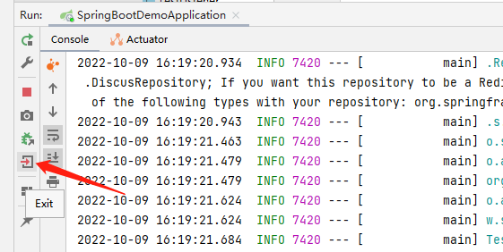

   


> Spring Boot项目中使用注解实现三大组件

```
前面都是先建组件，在通过XXRegistrationBean注册到Spring容器。使用注解的话不需要这个注册步骤，直接用注解。
```

1. 先将配置类给注释掉

   

2. 给Servlet组件使用注解进行注册

   ```java
   package com.zhuzhe.config;
   
   import org.springframework.stereotype.Component;
   
   import javax.servlet.ServletException;
   import javax.servlet.annotation.WebServlet;
   import javax.servlet.http.HttpServlet;
   import javax.servlet.http.HttpServletRequest;
   import javax.servlet.http.HttpServletResponse;
   import java.io.IOException;
   import java.util.logging.Logger;
   
   /**
    * @Author: zhuzhe
    * @ClassName: TestServlet
    * @Date: 2022/10/8 23:19
    * @Description:
    * @Version: V1.0
    * @Param:
    */
   @WebServlet("/testServlet")
   //@Component
   public class TestServlet extends HttpServlet {
       private static Logger logger = Logger.getLogger(TestServlet.class.getSimpleName());
   
       @Override
       protected void doGet(HttpServletRequest req, HttpServletResponse resp) throws ServletException, IOException {
           //super.doGet(req, resp);
           this.doPost(req,resp);//将get请求转给post方法
       }
   
       @Override
       protected void doPost(HttpServletRequest req, HttpServletResponse resp) throws ServletException, IOException {
           //super.doPost(req, resp);
           logger.info("servlet组件收到请求...");
           resp.getWriter().write("hello TestServlet");//获取返回体的输出流，输出字符到页面
       }
   }
   
   ```

   

3. 给Filter组件使用注解进行注册

   ```java
   package com.zhuzhe.config;
   
   import org.springframework.stereotype.Component;
   
   import javax.servlet.*;
   import javax.servlet.annotation.WebFilter;
   import java.io.IOException;
   import java.util.logging.Logger;
   
   /**
    * @Author: zhuzhe
    * @ClassName: TestFilter
    * @Date: 2022/10/9 15:34
    * @Description:
    * @Version: V1.0
    * @Param:
    */
   @WebFilter(value = {"/toLoginPage","/testFilter"})
   //@Component
   public class TestFilter implements Filter {
       private static Logger logger = Logger.getLogger(TestFilter.class.getSimpleName());
   
       /**
        * 过滤器的初始化方法，在Web应用启动时：创建FilterConfig->创建Filter->调用init()
        * @param filterConfig 用来读取web.xml文件中为过滤器配置的初始化参数
        * @throws ServletException
        */
       @Override
       public void init(FilterConfig filterConfig) throws ServletException {
           //Filter.super.init(filterConfig);
       }
   
       /**
        * 完成实际的过滤操作，当客户端请求URL和过滤器映射URL匹配时，Servlet容器将先调用过滤器的doFilter()
        * @param servletRequest
        * @param servletResponse
        * @param filterChain 用于访问后续过滤器或者Web组件
        * @throws IOException
        * @throws ServletException
        */
       @Override
       public void doFilter(ServletRequest servletRequest, ServletResponse servletResponse, FilterChain filterChain) throws IOException, ServletException {
           logger.info("hello TestFilter");
           filterChain.doFilter(servletRequest, servletResponse);
       }
   
       /**
        * Servlet容器在销毁过滤器对象前调用该方法，在这里可以释放过滤器占用的资源
        */
       @Override
       public void destroy() {
           Filter.super.destroy();
       }
   }
   ```

4. 给Listener组件使用注解进行注册

   ```java
   package com.zhuzhe.config;
   
   import org.springframework.stereotype.Component;
   
   import javax.servlet.ServletContextEvent;
   import javax.servlet.ServletContextListener;
   import javax.servlet.annotation.WebListener;
   import java.util.logging.Logger;
   
   /**
    * @Author: zhuzhe
    * @ClassName: TestListener
    * @Date: 2022/10/9 15:50
    * @Description:
    * @Version: V1.0
    * @Param:
    */
   @WebListener
   //@Component
   public class TestListener implements ServletContextListener {
   
       private static Logger logger = Logger.getLogger(TestListener.class.getSimpleName());
   
       @Override
       public void contextInitialized(ServletContextEvent sce) {
           //ServletContextListener.super.contextInitialized(sce);
           System.out.println("ServletContext Init...");
       }
   
       @Override
       public void contextDestroyed(ServletContextEvent sce) {
           //ServletContextListener.super.contextDestroyed(sce);
           System.out.println("ServletContext Destroy...");
       }
   }
   ```

   

5. 测试效果

   Servlet：

   

   Filter:

   

   Listener:

   


## Spring Boot项目实现文件上传下载

实现方式和SSM一样。只需添加commons-io依赖来提供文件下载功能即可。

application.properties

```properties
# 单个上传文件大小限制（默认为1MB）
spring.servlet.multipart.max-file-size=10MB
# 总上传文件大小限制（默认为10MB）
spring.servlet.multipart.max-request-size=50MB
```

不用新增任何配置文件，只需写上传页面Html和对应接口Controller即可

> 只是只有上传功能的页面，其实全部都可以看出来和前面SSM的文件上传下载无差别

upload.html

```html
<!DOCTYPE html>
<html lang="en">
<head>
    <meta charset="UTF-8">
    <title>动态添加文件上传列表</title>
</head>
<script type="text/javascript" src="//apps.bdimg.com/libs/jquery/1.11.3/jquery.min.js"></script>
<body>
    <div id="dataList"></div>
    <form action="/uploadFile" method="post" enctype="multipart/form-data">
        上传文件：<input type="button" value="添加文件" onclick="add()"/>
        <div id="file" style="margin-top: 10px" value="文件上传区域">

        </div>
        <input id="submit" type="submit" value="上传" style="display: none;margin-top: 10px"/>
    </form>
    <script type="text/javascript">
        //初始化加载上传列表信息
        $(function(){
            $.get(
                "/uploadList",//url地址
                {},//请求参数
                function(data){ //回传函数
                    var array = $.parseJSON(data);
                    for (let i = 0; i < array.length; i++) {
                        $("#dataList").append("<label><sub>"+array[i]+"</sub></label><br/>");
                    }
                }, "text")
        });
        //新增当前行
        function add() {
            var innerdiv = "<div>";
            innerdiv += "<input type='file' name='fileUpload' required/>"+
                "<input type='button' value='删除' onclick='remove(this)'/>";
            innerdiv += "</div>";
            $("#file").append(innerdiv);
            $("#submit").css("display","block");//显示上传按钮
        }
        //删除当前行
        function remove(obj) {
            $(obj).parent().remove();
            if ($("#file div").length == 0){
                $("#submit").css("display","none");//隐藏上传按钮
            }
        }
    </script>
</body>
</html>
```

MainController.java

```java
package com.zhuzhe.controller;

import org.springframework.stereotype.Controller;
import org.springframework.ui.Model;
import org.springframework.web.bind.annotation.GetMapping;
import org.springframework.web.bind.annotation.PostMapping;
import org.springframework.web.bind.annotation.ResponseBody;
import org.springframework.web.multipart.MultipartFile;

import javax.servlet.http.HttpServletRequest;
import java.io.File;
import java.io.IOException;
import java.util.UUID;
import java.util.logging.Logger;

/**
 * @Author: zhuzhe
 * @ClassName: MainController
 * @Date: 2022/10/9 23:15
 * @Description:
 * @Version: V1.0
 * @Param:
 */
@Controller
public class MainController {

    private static Logger logger = Logger.getLogger(MainController.class.getSimpleName());

    //文件上传页面
    @GetMapping("/toUpload")
    public String toUpload(){
        return "html/upload";
    }

    //文件上传功能
    @PostMapping("/uploadFile")
    public String uploadFile(MultipartFile[] fileUpload, HttpServletRequest request){
        for (MultipartFile file: fileUpload){
            //获取文件名、后缀名
            String filename = file.getOriginalFilename();
            //重新生成文件名（根据具体情况生成对应文件名）
            filename = UUID.randomUUID()+"_"+filename;
            //指定上传文件本地存储目录，不存在则需要提前创建
            //String dirPath = "F:/file/";
            String dirPath = request.getServletContext().getRealPath("/upload/");//设置上传文件的保存地址目录
            logger.info("上传服务器地址："+dirPath);
            File filePath = new File(dirPath);
            if (!filePath.exists()){
                filePath.mkdirs();
            }
            try {
                file.transferTo(new File(dirPath+filename));
            } catch (IOException e) {
                e.printStackTrace();
                //上传失败
                logger.info("文件上传失败："+e.getMessage());
            }
        }
        return "redirect:/toUpload";
    }

    //获取当前上传文件列表
    @GetMapping("uploadList")
    @ResponseBody
    public String[] list(HttpServletRequest request){
        String[] list = null;
        String dirPath = request.getServletContext().getRealPath("/upload/");//设置上传文件的保存地址目录
        File filePath = new File(dirPath);
        if (filePath.exists()){
            list = filePath.list();
        }
        return list;
    }
}
.
```


## Spring Boot缓存（Redis）

```
Spring 框架提供的缓存功能，应用于操作数据的方法中。
主要目的是为了减少数据库的访问压力。
```

> 默认缓存机制

1. 使用之前的JPA接口

   

2. 新建调用JPA Repository 的Service类

   DiscussService.java

   ```java
   package com.zhuzhe.service;
   
   import com.zhuzhe.domain.Discuss;
   
   /**
    * @Author: zhuzhe
    * @ClassName: DiscusService
    * @Date: 2022/10/10 11:08
    * @Description:
    * @Version: V1.0
    * @Param:
    */
   public interface DiscussService {
       public Discuss findById(int id);
       public int updateDiscuss(Discuss discuss);
       public void deleteDiscuss(int id);
   }
   ```

   DiscussServiceImpl.java Service操作加上对应的缓存注解

   ```java
   package com.zhuzhe.service.impl;
   
   import com.zhuzhe.domain.Discuss;
   import com.zhuzhe.repository.DiscussRepository;
   import com.zhuzhe.service.DiscussService;
   import org.springframework.beans.factory.annotation.Autowired;
   import org.springframework.stereotype.Service;
   
   import java.util.Optional;
   
   /**
    * @Author: zhuzhe
    * @ClassName: DiscusServiceImpl
    * @Date: 2022/10/10 11:11
    * @Description:
    * @Version: V1.0
    * @Param:
    */
   @Service
   public class DiscussServiceImpl implements DiscussService {
   
       @Autowired
       private DiscussRepository discussRepository;
   
       @Override
       public Discuss findById(int id) {
           Optional<Discuss> optional = discussRepository.findById(id);
           if (optional.isPresent()){
               return optional.get();
           }
           return null;
       }
   
       @Override
       public int updateDiscuss(Discuss discuss) {
           int updateResult = discussRepository.updateDiscuss(discuss.getAuthor(),discuss.getaId());
           return updateResult;
       }
   
       @Override
       public void deleteDiscuss(int id) {
           discussRepository.deleteById(id);
       }
   }
   ```

   

3. 新建调用Service的Controler类

   ```java
   package com.zhuzhe.controller;
   
   import com.zhuzhe.domain.Discuss;
   import com.zhuzhe.service.DiscussService;
   import org.springframework.beans.factory.annotation.Autowired;
   import org.springframework.web.bind.annotation.GetMapping;
   import org.springframework.web.bind.annotation.PathVariable;
   import org.springframework.web.bind.annotation.RequestMapping;
   import org.springframework.web.bind.annotation.RestController;
   
   /**
    * @Author: zhuzhe
    * @ClassName: DiscussController
    * @Date: 2022/10/10 11:24
    * @Description:
    * @Version: V1.0
    * @Param:
    */
   @RestController
   @RequestMapping("discuss")
   public class DiscussController {
   
       @Autowired
       private DiscussService discussService;
   
       @GetMapping("/get/{id}")
       public Discuss findById(@PathVariable("id") int id){
           return discussService.findById(id);
       }
   
       @GetMapping("/update/{id}/{author}")
       public int updateComment(@PathVariable("id") int id, @PathVariable("author")String author){
           Discuss discuss = discussService.findById(id);
           discuss.setAuthor(author);
           int updateResult = discussService.updateDiscuss(discuss);
           return updateResult;
       }
   
       @GetMapping("/delete/{id}")
       public void deleteDiscuss(@PathVariable("id")int id){
           discussService.deleteDiscuss(id);
       }
   }
   ```

   

4. 测试Controler功能

   

5. 在启动类开启默认缓存

   ```java
   package com.zhuzhe;
   
   import org.springframework.boot.SpringApplication;
   import org.springframework.boot.autoconfigure.SpringBootApplication;
   import org.springframework.boot.web.servlet.ServletComponentScan;
   import org.springframework.cache.annotation.EnableCaching;
   import org.springframework.context.annotation.ImportResource;
   
   //@ImportResource("classpath:beans.xml")
   @SpringBootApplication
   @ServletComponentScan//开启基于注解方式的Servlet组件扫描支持
   @EnableCaching//开启注解缓存支持
   public class SpringBootDemoApplication {
   
       public static void main(String[] args) {
           SpringApplication.run(SpringBootDemoApplication.class, args);
       }
   
   }
   ```

   

   

6. 在Service类加上缓存注解

   

   ```java
   package com.zhuzhe.service.impl;
   
   import com.zhuzhe.domain.Discuss;
   import com.zhuzhe.repository.DiscussRepository;
   import com.zhuzhe.service.DiscussService;
   import org.springframework.beans.factory.annotation.Autowired;
   import org.springframework.stereotype.Service;
   
   import java.util.Optional;
   
   /**
    * @Author: zhuzhe
    * @ClassName: DiscusServiceImpl
    * @Date: 2022/10/10 11:11
    * @Description:
    * @Version: V1.0
    * @Param:
    */
   @Service
   public class DiscussServiceImpl implements DiscussService {
   
       @Autowired
       private DiscussRepository discussRepository;
   	
       @Cacheable(cacheNames = "discuss", unless = "#result==null")
       @Override
       public Discuss findById(int id) {
           Optional<Discuss> optional = discussRepository.findById(id);
           if (optional.isPresent()){
               return optional.get();
           }
           return null;
       }
   	
       @CachePut(cacheNames = "discuss", key = "#result.id")
       @Override
       public int updateDiscuss(Discuss discuss) {
           int updateResult = discussRepository.updateDiscuss(discuss.getAuthor(),discuss.getaId());
           return updateResult;
       }
   	
       @CacheEvict(cacheNames = "discuss")
       @Override
       public void deleteDiscuss(int id) {
           discussRepository.deleteById(id);
       }
   }
   ```

   

7. 测试效果

   

   可以看到这个缓存是基于Redis实现的。

   

   启动项目前需要开启redis服务

   

8. 缓存的对象加上序列化接口，这样才能将对象给序列化后存储到Redis。

   ```java
   package com.zhuzhe.domain;
   
   import javax.persistence.*;
   import java.io.Serializable;
   
   /**
    * @Author: zhuzhe
    * @ClassName: Discuss
    * @Date: 2022/10/6 18:18
    * @Description:
    * @Version: V1.0
    * @Param:
    */
   @Entity(name = "t_comment")
   public class Discuss implements Serializable {
       @Id//表明映射主键
       @GeneratedValue(strategy = GenerationType.IDENTITY)//设置自增策略
       private Integer id;
       private String content;
       private String author;
       @Column(name = "a_id")//指定映射字段
       private Integer aId;
   
       public Integer getId() {
           return id;
       }
   
       public void setId(Integer id) {
           this.id = id;
       }
   
       public String getContent() {
           return content;
       }
   
       public void setContent(String content) {
           this.content = content;
       }
   
       public String getAuthor() {
           return author;
       }
   
       public void setAuthor(String author) {
           this.author = author;
       }
   
       public Integer getaId() {
           return aId;
       }
   
       public void setaId(Integer aId) {
           this.aId = aId;
       }
   
       @Override
       public String toString() {
           return "Discuss{" +
                   "id=" + id +
                   ", content='" + content + '\'' +
                   ", author='" + author + '\'' +
                   ", aId=" + aId +
                   '}';
       }
   }
   ```

9. 重新测试效果

   首次查询是到数据库

   

   在此查询发现没有执行SQL，是因为读到缓存直接返回了。

   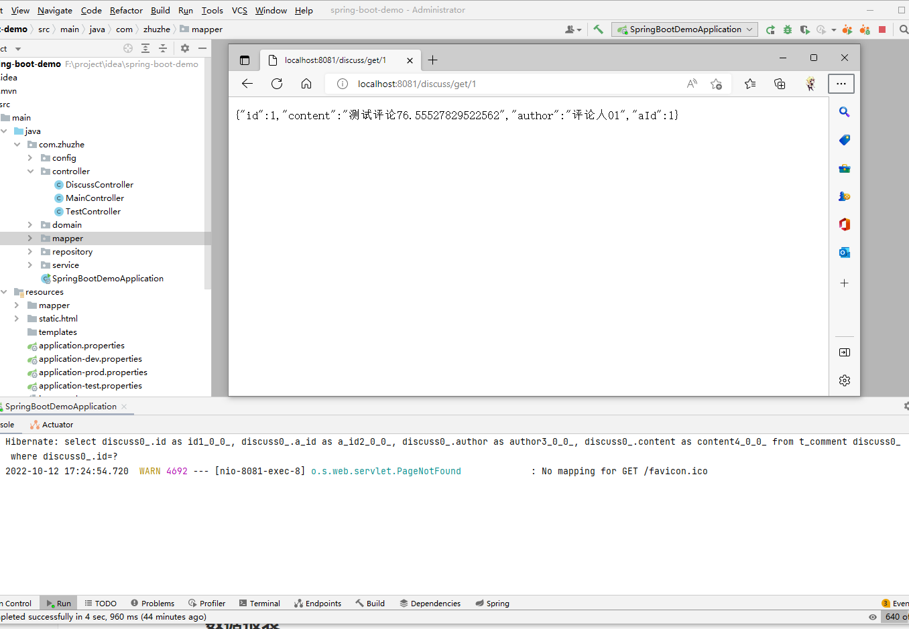


> 还有一种使用方式是通过Spring Data 系列的统一Api **XXXTemplate**

1. 引入依赖

   依赖就是前面引入的Spring-Boot-Starter-Data-Redis

   ```xml
   <dependencies>
       ....
       <dependency>
           <groupId>org.springframework.boot</groupId>
           <artifactId>spring-boot-starter-data-redis</artifactId>
       </dependency>
   </dependencies>
   ```

   

2. 使用RedisTemplate

   starter系列都是会在Spring Boot启动时根据默认配置进行初始化，所以可以直接在代码中使用RedisTemplate

   ```java
   package com.zhuzhe.service.impl;
   
   import com.zhuzhe.domain.Discuss;
   import com.zhuzhe.repository.DiscussRepository;
   import com.zhuzhe.service.DiscussService;
   import org.springframework.beans.factory.annotation.Autowired;
   import org.springframework.cache.annotation.CacheEvict;
   import org.springframework.cache.annotation.CachePut;
   import org.springframework.cache.annotation.Cacheable;
   import org.springframework.data.redis.core.RedisTemplate;
   import org.springframework.stereotype.Service;
   
   import javax.annotation.Resource;
   import java.util.Optional;
   import java.util.concurrent.TimeUnit;
   
   /**
    * @Author: zhuzhe
    * @ClassName: DiscusServiceImpl
    * @Date: 2022/10/10 11:11
    * @Description:
    * @Version: V1.0
    * @Param:
    */
   @Service
   public class DiscussServiceImpl implements DiscussService {
   
       @Autowired
       private DiscussRepository discussRepository;
       @Resource
       private RedisTemplate redisTemplate;
   
       //@Cacheable(cacheNames = "discuss", unless = "#result==null")
       @Override
       public Discuss findById(int id) {
           //先从Redis中查，如果有则返回，无则到mysql查
           Object obj = redisTemplate.opsForValue().get("discuss_" + id);
           if (obj != null) {
               return (Discuss) obj;
           }
           Optional<Discuss> optional = discussRepository.findById(id);
           if (optional.isPresent()) {
               Discuss discuss = optional.get();
               redisTemplate.opsForValue().set("discuss_"+id,discuss,1, TimeUnit.DAYS);//缓存一天
               return discuss;
           }
           return null;
       }
   
       //@CachePut(cacheNames = "discuss", key = "#result.id")
       @Override
       public int updateDiscuss(Discuss discuss) {
           int updateResult = discussRepository.updateDiscuss(discuss.getAuthor(), discuss.getaId());
           //更新的话要对应清除缓存
           redisTemplate.opsForValue().set("discuss_"+discuss.getId(),discuss);
           return updateResult;
       }
   
       //@CacheEvict(cacheNames = "discuss")
       @Override
       public void deleteDiscuss(int id) {
           discussRepository.deleteById(id);
           //删除也要对应删除缓存
           redisTemplate.delete("discuss_"+id);
       }
   }
   ```

   

3. 测试效果

   

   第一次访问会查数据库并设置缓存，第二次查就直接查缓存，并且这一个缓存和前面默认的缓存不一样，他是opsForValue()的get、set方法都是将对象序列化成字符串存储到Redis的string类型中。

   


## Spring Boot自定义Redis序列化机制

```
Spring Data Redis是在启动时会加载一些默认的配置，其中就指定RedisTemplate使用Jdk的序列化。
```

> 自定义一个redisTemplate的初始化流程，使用Jackson来做对象序列化操作。

1. 新建RedisConfig

   ```java
   package com.zhuzhe.config;
   
   import com.fasterxml.jackson.annotation.JsonAutoDetect;
   import com.fasterxml.jackson.annotation.PropertyAccessor;
   import com.fasterxml.jackson.databind.ObjectMapper;
   import org.springframework.beans.factory.annotation.Autowired;
   import org.springframework.context.annotation.Bean;
   import org.springframework.context.annotation.Configuration;
   import org.springframework.data.redis.cache.RedisCacheConfiguration;
   import org.springframework.data.redis.cache.RedisCacheManager;
   import org.springframework.data.redis.connection.RedisConnectionFactory;
   import org.springframework.data.redis.core.RedisTemplate;
   import org.springframework.data.redis.serializer.*;
   
   import javax.annotation.Resource;
   import java.time.Duration;
   
   /**
    * @Author: zhuzhe
    * @ClassName: RedisConfig
    * @Date: 2022/10/13 23:05
    * @Description:
    * @Version: V1.0
    * @Param:
    */
   @Configuration
   public class RedisConfig {
   
       //作为方法的参数时会默认未@Autowrite方式注入，新版spring-boot-2.7.3已经不支持这种注入
       @Resource
       RedisConnectionFactory redisConnectionFactory;
   
       //自定义redisTemplate Api的序列化规则
       @Bean
       public RedisTemplate<Object,Object> redisTemplate(){
           RedisTemplate<Object,Object> template = new RedisTemplate();
           template.setConnectionFactory(redisConnectionFactory);
           //使用JSON格式序列化对象，对缓存数据key和value进行转换
           Jackson2JsonRedisSerializer jacksonSeial = new Jackson2JsonRedisSerializer(Object.class);
           //解决查询缓存转换异常的问题
           ObjectMapper om = new ObjectMapper();
           om.setVisibility(PropertyAccessor.ALL, JsonAutoDetect.Visibility.ANY);
           om.enableDefaultTyping(ObjectMapper.DefaultTyping.NON_FINAL);
           jacksonSeial.setObjectMapper(om);
           //设置RedisTemplate模板API的序列化方式为JSON
           template.setDefaultSerializer(jacksonSeial);
           return template;
       }
   }
   
   ```

   

2. 测试效果

   


> 自定义Redis注解的序列化机制

1. 编写Redis配置

   ```java
   package com.zhuzhe.config;
   
   import com.fasterxml.jackson.annotation.JsonAutoDetect;
   import com.fasterxml.jackson.annotation.PropertyAccessor;
   import com.fasterxml.jackson.databind.ObjectMapper;
   import org.springframework.beans.factory.annotation.Autowired;
   import org.springframework.context.annotation.Bean;
   import org.springframework.context.annotation.Configuration;
   import org.springframework.data.redis.cache.RedisCacheConfiguration;
   import org.springframework.data.redis.cache.RedisCacheManager;
   import org.springframework.data.redis.connection.RedisConnectionFactory;
   import org.springframework.data.redis.core.RedisTemplate;
   import org.springframework.data.redis.serializer.*;
   
   import javax.annotation.Resource;
   import java.time.Duration;
   
   /**
    * @Author: zhuzhe
    * @ClassName: RedisConfig
    * @Date: 2022/10/13 23:05
    * @Description:
    * @Version: V1.0
    * @Param:
    */
   @Configuration
   public class RedisConfig {
   
       //作为方法的参数时会默认未@Autowrite方式注入，新版spring-boot-2.7.3已经不支持这种注入
       @Resource
       RedisConnectionFactory redisConnectionFactory;
   
       //自定义redisTemplate Api的序列化规则
       @Bean
       public RedisTemplate<Object,Object> redisTemplate(){
           RedisTemplate<Object,Object> template = new RedisTemplate();
           template.setConnectionFactory(redisConnectionFactory);
           //使用JSON格式序列化对象，对缓存数据key和value进行转换
           Jackson2JsonRedisSerializer jacksonSeial = new Jackson2JsonRedisSerializer(Object.class);
           //解决查询缓存转换异常的问题
           ObjectMapper om = new ObjectMapper();
           om.setVisibility(PropertyAccessor.ALL, JsonAutoDetect.Visibility.ANY);
           om.enableDefaultTyping(ObjectMapper.DefaultTyping.NON_FINAL);
           jacksonSeial.setObjectMapper(om);
           //设置RedisTemplate模板API的序列化方式为JSON
           template.setDefaultSerializer(jacksonSeial);
           return template;
       }
   
       //自定义注解
       @Bean
       public RedisCacheManager cacheManager() {
           //分别创建String和JSON格式序列化对象，对缓存数据key和value进行转换
           RedisSerializer<String> strSerializer = new StringRedisSerializer();
           Jackson2JsonRedisSerializer jacksonSerial = new Jackson2JsonRedisSerializer(Object.class);
           //解决查询缓存转换异常的问题
           ObjectMapper om = new ObjectMapper();
           om.setVisibility(PropertyAccessor.ALL, JsonAutoDetect.Visibility.ANY);
           om.enableDefaultTyping(ObjectMapper.DefaultTyping.NON_FINAL);
           jacksonSerial.setObjectMapper(om);
           //定制缓存数据序列化方式及时效
           RedisCacheConfiguration config = RedisCacheConfiguration.defaultCacheConfig()
                   .entryTtl(Duration.ofDays(1))
                   .serializeKeysWith(RedisSerializationContext.SerializationPair.fromSerializer(strSerializer))
                   .serializeValuesWith(RedisSerializationContext.SerializationPair.fromSerializer(jacksonSerial))
                   .disableCachingNullValues();
           RedisCacheManager cacheManager = RedisCacheManager.builder(redisConnectionFactory).cacheDefaults(config).build();
           return cacheManager;
       }
   
   }
   ```

2. 测试效果

   

   


## Spring Boot项目整合Spring Security基本功能

```
Spring Security 是Spring Boot整合Spring MVC搭建Web应用的安全管理框架
```

* 认证
* 授权


> Spring Security实现简单验证

未登录系统情况下无法访问主页

1. 新建主页和详情页

   

   index.html

   ```html
   <!DOCTYPE html>
   <html lang="en">
   <head>
       <meta http-equiv="Content-Type" content="text/html;charset=UTF-8">
       <title>影视直播厅</title>
   </head>
   <body>
       <h1 align="center">欢迎进入电影网站首页</h1>
       <hr>
       <h3>普通电影</h3>
       <ul>
           <li><a href="/movie/detail/common/1">飞驰人生</a></li>
           <li><a href="/movie/detail/common/2">夏洛特烦恼</a></li>
       </ul>
       <h3>VIP 专享</h3>
       <ul>
           <li><a href="/movie/detail/vip/1">速度与激情</a></li>
           <li><a href="/movie/detail/vip/2">猩球崛起</a></li>
       </ul>
   </body>
   </html>
   ```

   common/1.html

   ```html
   <!DOCTYPE html>
   <html lang="en">
   <head>
       <meta http-equiv="Content-Type" content="text/html;charset=UTF-8">
       <title>影片详情</title>
   </head>
   <body>
       <a href="/movie">返回</a>
       <h1>飞驰人生</h1>
       <p style="width: 550px">简介：《飞驰人生》是上海亭东影业有限公司出品的励志喜剧片，由韩寒执导兼编剧，沈腾、黄景瑜、
           尹正、尹昉等主演。该片讲述了一个曾经叱咤赛车界的炒饭摊老板，试图重返车坛，却频频遭现实打脸的故事。2019年2月5日，
           该片在中国内地上映。2019年9月，该片获得第十七届平壤国际电影节最佳摄影奖。</p>
   </body>
   </html>
   ```

   common/2.html

   ```html
   <!DOCTYPE html>
   <html lang="en" xmlns:th="http://www.thymeleaf.org">
   <head>
       <meta http-equiv="Content-Type" content="text/html;charset=UTF-8">
       <title>影片详情</title>
   </head>
   <body>
   <a href="/movie">返回</a>
   <h1>夏洛特烦恼</h1>
   <p style="width: 550px">简介：《夏洛特烦恼》是开心麻花2012年首度推出的话剧，由闫非和彭大魔联合编剧、执导。
       2013、2014、2015年仍在上演。该作讲述了一个普通人在穿越重回到高中校园并实现了种种梦想的不可思议的经历。</p>
   </body>
   </html>
   ```

   vip/1.html

   ```html
   <!DOCTYPE html>
   <html lang="en">
   <head>
       <meta http-equiv="Content-Type" content="text/html;charset=UTF-8">
       <title>影片详情</title>
   </head>
   <body>
   <a href="/movie">返回</a>
   <h1>夏洛特烦恼</h1>
   <p style="width: 550px">简介：《速度与激情》是罗伯·科恩等执导，于2001年至2017年范·迪塞尔、保罗·沃克、米歇尔·罗德里格兹、
       乔丹娜·布鲁斯特、泰瑞斯·吉布森、卢达·克里斯等主演的赛车题材的动作犯罪类电影，截至2018年，一共拍了八部。之后两部续集正式定档，
       《速度与激情9》和《速度与激情10》分别于2020年4月10日和2021年4月2日上映 [1-2]  。
       据悉，最新一部《速度与激情》衍生片预计将于2018年9月初开拍，巨石强森和杰森·斯坦森主演，于2019年8月23日上映 [1]  。
   </p>
   </body>
   </html>
   ```

   vip/2.html

   ```html
   <!DOCTYPE html>
   <html lang="en">
   <head>
       <meta http-equiv="Content-Type" content="text/html;charset=UTF-8">
       <title>影片详情</title>
   </head>
   <body>
   <a href="/movie">返回</a>
   <h1>夏洛特烦恼</h1>
   <p style="width: 550px">简介：《猩球崛起》是科幻片《人猿星球》的前传，由鲁伯特·瓦耶特执导，詹姆斯·弗兰科，汤姆·费尔顿，
       芙蕾达·平托，布莱恩·考克斯等主演。剧情主要讲述人猿进化为高级智慧生物、进而攻占地球之前的种种际遇，主题是带有警世性质的
       ——人类疯狂的野心所产生的恶果。
   </p>
   </body>
   </html>
   ```

   

2. 建业务接口

   ```
   简单建访问主页还有跳转到其他页面的视图接口
   ```

   MovieController.java

   ```java
   package com.zhuzhe.controller;
   
   import org.springframework.stereotype.Controller;
   import org.springframework.web.bind.annotation.GetMapping;
   import org.springframework.web.bind.annotation.PathVariable;
   import org.springframework.web.bind.annotation.RequestMapping;
   
   /**
    * @Author: zhuzhe
    * @ClassName: MovieController
    * @Date: 2022/10/15 15:10
    * @Description:
    * @Version: V1.0
    * @Param:
    */
   @Controller
   @RequestMapping("movie")
   public class MovieController {
   
       @GetMapping
       public String index(){
           return "html/index";
       }
   
       @GetMapping("/detail/{type}/{path}")
       public String toDetail(@PathVariable("type") String type, @PathVariable("path") String path){
           return "html/"+type+"/"+path;
       }
   }
   
   ```

   到这里页面就可以正常访问还有跳转了。

3. 引入Security依赖

   ```
   只需要引入依赖，则在加载SpringBoot启动时，会启动有关Security的Stater（SecurityAutoConfiguration、UserDetailsServiceAutoConfiguration），会设置默认的访问登录页面。提供默认的登录密码。默认只要未登录则拦截所有请求跳转到默认的登录页面。
   ```

   ```xml
   <dependencies>
       ...
       <dependency>
           <groupId>org.springframework.boot</groupId>
           <artifactId>spring-boot-starter-security</artifactId>
       </dependency>
   </dependencies>
   ```

   

4. 测试访问效果

   项目启动后首次访问检测到没有登录用户，则提示要登录用户。（用户名：user，密码：每次项目启动随机生成）

   

   成功登录后，则可以正常访问

   


> 通过自定义Bean实现Security的规则

* 自定义WebSecurityConfigurerADapter：关闭Security提供Web应用安全默认配置。覆盖默认访问规则。
  * configure(AuthenticationManagerBuilder auth)：用户认证
  * configure(HTTPSecurity http)：访问控制
* 自定义UserDetailsService（用户详情服务）、AuthenticationProvider（身份验证提供者）、AuthenticationManager（身份验证管理器）：关闭默认用户信息配置


> 自定义WebSecurityConfigurerAdapter实现自定义用户认证

```
重写configure(AuthenticationManagerBuilder auth) 方法。
Spring　Security提供了多种自定义认证方式。

内存认证：In-Memory Authentication
JDBC认证：JDBC Authentication
LDAP认证：LDAP Authentication
身份认证提供商：Authentication Provider
身份详情服务：UserDetailsService
```


> 内存认证 **In-Memory Authentication**

1. 新建配置类

   ```
   这里SpringBoot2.7开始出现过时的配置，暂时没找到替代方案，后续再处理。
   ```

   SecurityConfig.java

   ```java
   package com.zhuzhe.config;
   
   import org.springframework.security.config.annotation.authentication.builders.AuthenticationManagerBuilder;
   import org.springframework.security.config.annotation.web.configuration.EnableWebSecurity;
   import org.springframework.security.config.annotation.web.configuration.WebSecurityConfigurerAdapter;
   import org.springframework.security.crypto.bcrypt.BCryptPasswordEncoder;
   
   /**
    * @Author: zhuzhe
    * @ClassName: SecurityConfig
    * @Date: 2022/10/15 15:48
    * @Description:
    * @Version: V1.0
    * @Param:
    */
   @EnableWebSecurity
   public class SecurityConfig extends WebSecurityConfigurerAdapter {
   
       @Override
       protected void configure(AuthenticationManagerBuilder auth) throws Exception {
           //super.configure(auth);
           //设置密码编码器
           BCryptPasswordEncoder encoder = new BCryptPasswordEncoder();
           //使用内存用户信息 zhuzhe用户给common权限，cxr用户给vip权限
           auth.inMemoryAuthentication().passwordEncoder(encoder)
                   .withUser("zhuzhe").password(encoder.encode("123456")).roles("common")
                   .and()
                   .withUser("cxr").password(encoder.encode("123456")).roles("vip");
       }
   }
   ```

   

2. 测试效果

   可以使用前面定义的账号密码登录

   

   


> JDBC身份认证 **JDBC Authentication**

1. 新建表并存入数据

   ```sql
   -- 选择使用数据库
   use springbootdata;
   -- 创建表t_customer并插入相关数据
   drop table if exists r_customer;
   create table `t_customer`(
       `id` int(20) primary key auto_increment comment '用户id',
       `username` varchar(200) default null comment '用户名(唯一)',
       `password` varchar(200) default null comment '密码(编码器编码后密码)',
       `valid` tinyint(1) not null default '1' comment '用户身份是否合法(默认合法)'
   )engine=InnoDB auto_increment=1 default charset=utf8 comment '用户表';
   -- 插入数据
   insert into t_customer(username,password) values('zhuzhe','$2a$10$CqJk5.bjUIoNarPhxroBse.kPWI.B2D038y00tb3mJVUHjotlExT6');
   insert into t_customer(username,password) values('李四','$2a$10$CqJk5.bjUIoNarPhxroBse.kPWI.B2D038y00tb3mJVUHjotlExT6');
   
   
   -- 创建表t_authority并插入相关数据
   drop table if exists t_authority;
   create table `t_authority`(
       `id` int(20) primary key auto_increment comment '权限id',
       `authority` varchar(20) default null comment '自定义权限ROLE_xxx'
   )engine=InnoDB auto_increment=1 default charset=utf8 comment '权限表';
   -- 插入数据
   insert into t_authority(authority) values('ROLE_common');
   insert into t_authority(authority) values('ROLE_vip');
   
   
   -- 创建表t_customer_authority;
   drop table if exists t_customer_authority;
   create table `t_customer_authority`(
       `id` int(20) primary key auto_increment comment '序列id',
       `customer_id` int(20) default null comment '用户id',
       `authority_id` int(20) default null comment '权限id'
   )engine=InnoDB auto_increment=1 default charset=utf8 comment '用户权限关系表';
   -- 插入数据
   insert into t_customer_authority(customer_id,authority_id) values(1,1);
   insert into t_customer_authority(customer_id,authority_id) values (2,2);
   ```

   

2. 添加jdbc依赖

   jdbc依赖和connector依赖。

   ```xml
   <?xml version="1.0" encoding="UTF-8"?>
   <project xmlns="http://maven.apache.org/POM/4.0.0" xmlns:xsi="http://www.w3.org/2001/XMLSchema-instance"
            xsi:schemaLocation="http://maven.apache.org/POM/4.0.0 https://maven.apache.org/xsd/maven-4.0.0.xsd">
       <modelVersion>4.0.0</modelVersion>
       <parent>
           <groupId>org.springframework.boot</groupId>
           <artifactId>spring-boot-starter-parent</artifactId>
           <version>2.7.4</version>
           <relativePath/> <!-- lookup parent from repository -->
       </parent>
       <groupId>com.zhuzhe</groupId>
       <artifactId>spring-boot-demo</artifactId>
       <version>0.0.1-SNAPSHOT</version>
       <name>spring-boot-demo</name>
       <description>spring-boot-demo</description>
       <properties>
           <project.build.sourceEncoding>UTF-8</project.build.sourceEncoding>
           <project.reporting.outputEncoding>UTF-8</project.reporting.outputEncoding>
           <java.version>1.8</java.version>
           <skipTests>true</skipTests>
       </properties>
       <dependencies>
           <dependency>
               <groupId>org.springframework.boot</groupId>
               <artifactId>spring-boot-starter-web</artifactId>
           </dependency>
   
           <dependency>
               <groupId>org.springframework.boot</groupId>
               <artifactId>spring-boot-starter-test</artifactId>
               <scope>test</scope>
           </dependency>
   
           <dependency>
               <groupId>com.alibaba</groupId>
               <artifactId>druid-spring-boot-starter</artifactId>
               <version>1.1.10</version>
           </dependency>
   
           <dependency>
               <groupId>org.mybatis.spring.boot</groupId>
               <artifactId>mybatis-spring-boot-starter</artifactId>
               <version>2.0.0</version>
           </dependency>
   
           <dependency>
               <groupId>org.springframework.boot</groupId>
               <artifactId>spring-boot-starter-jdbc</artifactId>
           </dependency>
   
           <dependency>
               <groupId>mysql</groupId>
               <artifactId>mysql-connector-java</artifactId>
               <scope>runtime</scope>
           </dependency>
   
           <dependency>
               <groupId>org.springframework.boot</groupId>
               <artifactId>spring-boot-starter-data-jpa</artifactId>
           </dependency>
   
           <dependency>
               <groupId>org.springframework.boot</groupId>
               <artifactId>spring-boot-starter-data-redis</artifactId>
           </dependency>
   
           <dependency>
               <groupId>org.springframework.boot</groupId>
               <artifactId>spring-boot-starter-security</artifactId>
           </dependency>
       </dependencies>
   
       <build>
           <plugins>
               <plugin>
                   <groupId>org.springframework.boot</groupId>
                   <artifactId>spring-boot-maven-plugin</artifactId>
               </plugin>
           </plugins>
       </build>
   
   </project>
   ```

   

3. 配置数据库连接

   连接地址、账号、密码

   ```properties
   # 激活开发环境配置文件
   spring.profiles.active=dev
   # MySQL连接配置
   spring.datasource.url=jdbc:mysql://127.0.0.1:3306/springbootdata?useUnicode=true&characterEncoding=utf8&serverTimezoneGMT%2B8&useSSL=false
   spring.datasource.username=root
   spring.datasource.password=123456
   # Druid的连接池配置
   spring.datasource.type=com.alibaba.druid.pool.DruidDataSource
   spring.datasource.initialSize=20
   spring.datasource.minIdle=10
   spring.datasource.maxActive=100
   # 开启驼峰命名支持
   mybatis.configuration.map-underscore-to-camel-case=true
   # 配置Mybatis的XML配置文件路径
   mybatis.mapper-locations=classpath:mapper/*.xml
   # 配置XML映射文件中指定的实体类所在包路径
   mybatis.type-aliases-package=com.zhuzhe.domain
   # Redis服务器地址
   spring.redis.host=127.0.0.1
   # Redis服务器连接端口
   spring.redis.port=6379
   # Redis服务器连接密码
   spring.redis.password=
   # 配置视图前后缀
   spring.mvc.view.prefix=/static/
   spring.mvc.view.suffix=.html
   spring.mvc.static-path-pattern=/static/**
   # 单个上传文件大小限制（默认为1MB）
   spring.servlet.multipart.max-file-size=10MB
   # 总上传文件大小限制（默认为10MB）
   spring.servlet.multipart.max-request-size=50MB
   # 显示使用JPA进行数据库查询的SQL语句
   spring.jpa.show-sql=true
   ```

   

4. 在配置中将用户认证改为查询数据库

   ```
   前面的AuthenticationManagerBuilder是设置一个默认的账号密码，这次将用户的认证通过jdbc的查询，接入到MySQL数据库中。
   ```

   ```java
   package com.zhuzhe.config;
   
   import org.springframework.beans.factory.annotation.Autowired;
   import org.springframework.security.config.annotation.authentication.builders.AuthenticationManagerBuilder;
   import org.springframework.security.config.annotation.web.configuration.EnableWebSecurity;
   import org.springframework.security.config.annotation.web.configuration.WebSecurityConfigurerAdapter;
   import org.springframework.security.crypto.bcrypt.BCryptPasswordEncoder;
   
   import javax.sql.DataSource;
   
   /**
    * @Author: zhuzhe
    * @ClassName: SecurityConfig
    * @Date: 2022/10/15 15:48
    * @Description:
    * @Version: V1.0
    * @Param:
    */
   @EnableWebSecurity
   public class SecurityConfig extends WebSecurityConfigurerAdapter {
   
       @Autowired
       private DataSource dataSource;
   
       @Override
       protected void configure(AuthenticationManagerBuilder auth) throws Exception {
           //super.configure(auth);
           //设置密码编码器
           BCryptPasswordEncoder encoder = new BCryptPasswordEncoder();
           //使用内存用户信息 zhuzhe用户给common权限，cxr用户给vip权限
           //auth.inMemoryAuthentication().passwordEncoder(encoder)
           //        .withUser("zhuzhe").password(encoder.encode("123456")).roles("common")
           //        .and()
           //        .withUser("cxr").password(encoder.encode("123456")).roles("vip");
   
           //试用jdbc查询进行身份认证
           String userSQL = "select username, password, valid from t_customer where username = ?";//根据用户名查密码
           String authoritySQL = "select c.username, a.authority from t_customer c, t_authority a, t_customer_authority ca where ca.customer_id = c.id and ca.authority_id = a.id and c.username = ?";//根据用户名，查权限
   
           auth.jdbcAuthentication().passwordEncoder(encoder)
                   .dataSource(dataSource)
                   .usersByUsernameQuery(userSQL)
                   .authoritiesByUsernameQuery(authoritySQL);
       }
   }
   
   ```

   

5. 测试效果

   


> 用户详情服务认证 **UserDetailsService**

```
使用传统jdbc的方式会有重复连接的问题，并且实际用户信息在其他业务场景中常用，使用UserDetailsService可以利用自己定义的用户接口，解耦用户信息的使用场景。
```

1. 新建用户服务，模拟已有的用户业务接口

   新建对应sql中表的实体

   ```java
   public class Customer implements Serializable {
       private Integer id;
       private String username;
       private String password;
       private Integer valid;
   
       public Integer getId() {
           return id;
       }
   
       public void setId(Integer id) {
           this.id = id;
       }
   
       public String getUsername() {
           return username;
       }
   
       public void setUsername(String username) {
           this.username = username;
       }
   
       public String getPassword() {
           return password;
       }
   
       public void setPassword(String password) {
           this.password = password;
       }
   
       public Integer getValid() {
           return valid;
       }
   
       public void setValid(Integer valid) {
           this.valid = valid;
       }
   
       @Override
       public String toString() {
           return "Customer{" +
                   "id=" + id +
                   ", username='" + username + '\'' +
                   ", password='" + password + '\'' +
                   ", valid=" + valid +
                   '}';
       }
   }
   ```

   ```java
   package com.zhuzhe.domain;
   
   import java.io.Serializable;
   
   public class Authority implements Serializable {
       
       private Integer id;
       private String authority;
   
       public Integer getId() {
           return id;
       }
   
       public void setId(Integer id) {
           this.id = id;
       }
   
       public String getAuthority() {
           return authority;
       }
   
       public void setAuthority(String authority) {
           this.authority = authority;
       }
   
       @Override
       public String toString() {
           return "Authority{" +
                   "id=" + id +
                   ", authority='" + authority + '\'' +
                   '}';
       }
   }
   ```

   建查询数据的mapper（Mybatis）

   

   AuthorityMapper.java

   ```java
   package com.zhuzhe.mapper;
   
   import com.zhuzhe.domain.Authority;
   import org.apache.ibatis.annotations.Mapper;
   
   import java.util.List;
   
   /**
    * @Author: zhuzhe
    * @ClassName: AuthorityMapper
    * @Date: 2022/10/16 22:03
    * @Description: 权限接口
    * @Version: V1.0
    * @Param:
    */
   @Mapper
   public interface AuthorityMapper {
       //根据用户名查询当前用户的权限名
       public List<Authority> findAuthoritiesByUsername(String username);
   }
   ```

   AuthorityMapper.xml

   ```xml
   <?xml version="1.0" encoding="UTF-8"?>
   <!DOCTYPE mapper
           PUBLIC "-//mybatis.org//DTD Mapper 3.0//EN"
           "http://mybatis.org/dtd/mybatis-3-mapper.dtd">
   <mapper namespace="com.zhuzhe.mapper.AuthorityMapper">
       <select id="findAuthoritiesByUsername" parameterType="String" resultType="Authority">
           select a.*
           from t_customer c,
                t_authority a,
                t_customer_authority ca
           where c.id = ca.customer_id
             and a.id = ca.authority_id
             and c.username = #{username}
       </select>
   </mapper>
   ```

   CustomerMapper.java

   ```java
   package com.zhuzhe.mapper;
   
   import com.zhuzhe.domain.Customer;
   import org.apache.ibatis.annotations.Mapper;
   
   /**
    * @Author: zhuzhe
    * @ClassName: CustomerMapper
    * @Date: 2022/10/16 20:46
    * @Description: 用户接口
    * @Version: V1.0
    * @Param:
    */
   @Mapper
   public interface CustomerMapper {
       //方法名关键字方式，查找username匹配的数据
       public Customer findByUsername(String username);
   }
   ```

   CustomerMapper.xml

   ```xml
   <?xml version="1.0" encoding="UTF-8"?>
   <!DOCTYPE mapper
           PUBLIC "-//mybatis.org//DTD Mapper 3.0//EN"
           "http://mybatis.org/dtd/mybatis-3-mapper.dtd">
   <mapper namespace="com.zhuzhe.mapper.CustomerMapper">
       <select id="findByUsername" parameterType="String" resultType="Customer">
           select tc.id, tc.username, tc.password, tc.valid from t_customer tc where tc.username = #{username}
       </select>
   </mapper>
   ```

   创建对应的Service（正常业务的接口都是有service，并且有缓存）

   

   AuthorityService.java

   ```java
   package com.zhuzhe.service;
   
   import com.zhuzhe.domain.Authority;
   import org.apache.ibatis.annotations.Mapper;
   
   import java.util.List;
   
   /**
    * @Author: zhuzhe
    * @ClassName: AuthorityService
    * @Date: 2022/10/16 22:03
    * @Description: 权限接口
    * @Version: V1.0
    * @Param:
    */
   public interface AuthorityService {
       public List<Authority> getCustomerAuthority(String username);
   }
   ```

   AuthorityServiceImpl.java（使用了Redis的缓存）

   ```java
   package com.zhuzhe.service.impl;
   
   import com.zhuzhe.domain.Authority;
   import com.zhuzhe.mapper.AuthorityMapper;
   import com.zhuzhe.service.AuthorityService;
   import org.springframework.beans.factory.annotation.Autowired;
   import org.springframework.data.redis.core.RedisTemplate;
   import org.springframework.stereotype.Service;
   
   import java.util.List;
   
   /**
    * @Author: zhuzhe
    * @ClassName: AuthorityServiceImpl
    * @Date: 2022/10/16 22:18
    * @Description:
    * @Version: V1.0
    * @Param:
    */
   @Service
   public class AuthorityServiceImpl implements AuthorityService {
   
       @Autowired
       private AuthorityMapper authorityMapper;
       @Autowired
       private RedisTemplate redisTemplate;
   
       @Override
       public List<Authority> getCustomerAuthority(String username) {
           List<Authority> authorities = null;
           Object o = redisTemplate.opsForValue().get("authorities_"+username);
           if (o!=null){
               authorities = (List<Authority>) o;
           }else {
               authorities = authorityMapper.findAuthoritiesByUsername(username);
               if (authorities.size()>0){
                   redisTemplate.opsForValue().set("authorities_"+username,authorities);
               }
           }
           return authorities;
       }
   }
   ```

   CustomerService.java

   ```java
   package com.zhuzhe.service;
   
   import com.zhuzhe.domain.Customer;
   
   /**
    * @Author: zhuzhe
    * @ClassName: CustomerService
    * @Date: 2022/10/16 20:42
    * @Description:
    * @Version: V1.0
    * @Param:
    */
   public interface CustomerService {
       public Customer getCustomer(String username);
   }
   ```

   CustomerServiceImpl.java（使用了Redis的缓存）

   ```java
   package com.zhuzhe.service.impl;
   
   import com.zhuzhe.domain.Customer;
   import com.zhuzhe.mapper.CustomerMapper;
   import com.zhuzhe.service.CustomerService;
   import org.springframework.beans.factory.annotation.Autowired;
   import org.springframework.data.redis.core.RedisTemplate;
   import org.springframework.stereotype.Service;
   
   /**
    * @Author: zhuzhe
    * @ClassName: CustomerServiceImpl
    * @Date: 2022/10/16 22:17
    * @Description:
    * @Version: V1.0
    * @Param:
    */
   @Service
   public class CustomerServiceImpl implements CustomerService {
   
       @Autowired
       private CustomerMapper customerMapper;
       @Autowired
       private RedisTemplate redisTemplate;
   
       @Override
       public Customer getCustomer(String username) {
           Customer customer = null;
           Object o = redisTemplate.opsForValue().get("customer_"+username);
           if (o!=null){
               customer = (Customer) o;
           }else {
               customer = customerMapper.findByUsername(username);
               if (customer!=null){
                   redisTemplate.opsForValue().set("customer_"+username, customer);
               }
           }
           return customer;
       }
   }
   ```

   

2. 定义UserDetailsService对象

   ```
   在Configuration中验证用户是用UserDetailsService对象。所以要自定义这个bean。
   ```

   ```java
   package com.zhuzhe.service.impl;
   
   import com.zhuzhe.domain.Authority;
   import com.zhuzhe.domain.Customer;
   import com.zhuzhe.service.AuthorityService;
   import com.zhuzhe.service.CustomerService;
   import org.springframework.beans.factory.annotation.Autowired;
   import org.springframework.security.core.authority.SimpleGrantedAuthority;
   import org.springframework.security.core.userdetails.User;
   import org.springframework.security.core.userdetails.UserDetails;
   import org.springframework.security.core.userdetails.UserDetailsService;
   import org.springframework.security.core.userdetails.UsernameNotFoundException;
   import org.springframework.stereotype.Service;
   
   import java.util.List;
   import java.util.stream.Collectors;
   
   /**
    * @Author: zhuzhe
    * @ClassName: UserDetailsServiceImpl
    * @Date: 2022/10/16 22:53
    * @Description: Security 用户信息验证
    * @Version: V1.0
    * @Param:
    */
   @Service
   public class UserDetailsServiceImpl implements UserDetailsService {
   
       @Autowired
       private CustomerService customerService;
       @Autowired
       private AuthorityService authorityService;
   
       @Override
       public UserDetails loadUserByUsername(String username) throws UsernameNotFoundException {
           //通过业务方法获取用户及权限信息
           Customer customer = customerService.getCustomer(username);
           List<Authority> authorities = authorityService.getCustomerAuthority(username);
           //封装用户权限
           List<SimpleGrantedAuthority> list = authorities.stream()
                   .map(authority -> new SimpleGrantedAuthority(authority.getAuthority()))
                   .collect(Collectors.toList());
           //返回封装的UserDetails用户详情类[用户名、密码、权限表]
           if (customer!=null){
               UserDetails userDetails = new User(customer.getUsername(), customer.getPassword(), list);
               return userDetails;
           }else {
               //查询不到用户就直接抛异常
               throw new UsernameNotFoundException("当前用户不存在！");
           }
       }
   }
   ```

   

3. 在配置类中引入UserDetailsService来做用户验证

   ```
   在前面定义了UserDatilsService的查询方式，将其引入到SecurityConfig的用户验证中。
   ```

   ```java
   package com.zhuzhe.config;
   
   import org.springframework.beans.factory.annotation.Autowired;
   import org.springframework.security.config.annotation.authentication.builders.AuthenticationManagerBuilder;
   import org.springframework.security.config.annotation.web.configuration.EnableWebSecurity;
   import org.springframework.security.config.annotation.web.configuration.WebSecurityConfigurerAdapter;
   import org.springframework.security.core.userdetails.UserDetailsService;
   import org.springframework.security.crypto.bcrypt.BCryptPasswordEncoder;
   
   import javax.sql.DataSource;
   
   /**
    * @Author: zhuzhe
    * @ClassName: SecurityConfig
    * @Date: 2022/10/15 15:48
    * @Description:
    * @Version: V1.0
    * @Param:
    */
   @EnableWebSecurity
   public class SecurityConfig extends WebSecurityConfigurerAdapter {
   
       //@Autowired
       //private DataSource dataSource;
   
       @Autowired
       private UserDetailsService userDetailsService;
   
       @Override
       protected void configure(AuthenticationManagerBuilder auth) throws Exception {
           //super.configure(auth);
           //设置密码编码器
           BCryptPasswordEncoder encoder = new BCryptPasswordEncoder();
           //使用内存用户信息 zhuzhe用户给common权限，cxr用户给vip权限
           //auth.inMemoryAuthentication().passwordEncoder(encoder)
           //        .withUser("zhuzhe").password(encoder.encode("123456")).roles("common")
           //        .and()
           //        .withUser("cxr").password(encoder.encode("123456")).roles("vip");
   
           //试用jdbc查询进行身份认证
           //String userSQL = "select username, password, valid from t_customer where username = ?";//根据用户名查密码
           //String authoritySQL = "select c.username, a.authority from t_customer c, t_authority a, t_customer_authority ca where ca.customer_id = c.id and ca.authority_id = a.id and c.username = ?";//根据用户名，查权限
   
           //auth.jdbcAuthentication().passwordEncoder(encoder)
           //        .dataSource(dataSource)
           //        .usersByUsernameQuery(userSQL)
           //        .authoritiesByUsernameQuery(authoritySQL);
   
           //使用UserDetailsService进行身份认证(用户输入账号密码，就会先查到用户信息，再比较密码，再显示权限表)
           auth.userDetailsService(userDetailsService).passwordEncoder(encoder);
       }
   }
   ```

4. 测试效果

   输入账号密码，验证UserDetails走MyBatis方法，查询。

   

   开启mybatis的执行日志后，就可以看到这个验证的过程。

   


## Spring Boot项目整合Spring Security处理过时api

```
Spring Boot2.7后续将不再推荐使用extends WebSecurityConfigurerAdapter 来自定义Security的用户验证和访问权限。推出了一套新的替代方案。
```

Spring Boot官方文档：https://spring.io/blog/2022/02/21/spring-security-without-the-websecurityconfigureradapter

文档中介绍了常见的几种使用方式的替换。（这里基于内存验证的User.withDefaultPasswordEncoder()还是显示过时）

> 在新版Spring Security中使用UserDetailsService
>

1. 更改配置类

   新版中不用继承WebSecurityConfigurerAdapter，以定义Bean注入方式来使配置生效。

   旧版：

   ```java
   @EnableWebSecurity
   public class SecurityConfig extends WebSecurityConfigurerAdapter {
   
       @Autowired
       private UserDetailsService userDetailsService;
   
       @Override
       protected void configure(AuthenticationManagerBuilder auth) throws Exception {
           //设置密码编码器
           BCryptPasswordEncoder encoder = new BCryptPasswordEncoder();
           //使用UserDetailsService进行身份认证
           auth.userDetailsService(userDetailsService).passwordEncoder(encoder);
       }
   }
   ```

   新版（这里AuthenticationManager会在用户校验时自动调用Spring容器中的UserDetailsService）

   ```java
   @EnableWebSecurity
   public class SecurityConfig {
   
       //密码编码器
       @Bean
       public PasswordEncoder passwordEncoder(){
           return new BCryptPasswordEncoder();
       }
   
       //认证管理器
       @Bean
       public AuthenticationManager authenticationManager(AuthenticationConfiguration authenticationConfiguration) throws Exception {
           AuthenticationManager manager = authenticationConfiguration.getAuthenticationManager();
           return manager;
       }
   }
   ```

   

2. 测试效果

   

   

   

## Spring Boot项目整合Spring Security访问控制

```
前面讲的是对用户的所有访问进行拦截，要求登录，并可以指定自己的业务接口来查询实现登录。

这里是对路径的访问控制，可以指定路径进行放行、指定路径访问要指定权限（当前用户的权限集）

同样也是在新版的Spring Security中进行配置。
```

1. 新建访问控制

   ```
   对主路径movie进行放行
   对common的路径访问只能有common权限的用户（ROLE_common）
   对vip的路径访问只能有vip权限的用户（ROLE_vip）
   其他路径访问都要登录，不限权限
   ```

   ```java
   @EnableWebSecurity
   public class SecurityConfig {
   
       //密码编码器
       @Bean
       public PasswordEncoder passwordEncoder(){
           return new BCryptPasswordEncoder();
       }
   
       //认证管理器
       @Bean
       public AuthenticationManager authenticationManager(AuthenticationConfiguration authenticationConfiguration) throws Exception {
           AuthenticationManager manager = authenticationConfiguration.getAuthenticationManager();
           return manager;
       }
   
       //访问路径控制
       @Bean
       public SecurityFilterChain filterChain(HttpSecurity http) throws Exception {
           return http.authorizeRequests(authorize -> authorize
                       .antMatchers("/movie").permitAll()
                       .antMatchers("/movie/detail/common/**").hasRole("common")
                       .antMatchers("/movie/detail/vip/**").hasRole("vip")
                       .anyRequest().authenticated()
                   ).formLogin()
                   .and()
                   .build();
       }
   }
   ```

   

2. 测试效果

   访问主页面正常。

   

   访问common资源需要登录

   

   登录zhuzhe用户（ROLE_common）

   

   

   能访问common资源，不能访问vip资源

   

   


## Spring Boot项目整合Spring Security自定义登录注销

> 在Spring Seurity中，默认的登录页面和登录接口，都是`/login`，只不过一个是`get`请求（跳转登录页面），一个是`post`请求（执行登录行为）

> Security提供了HttpSecurity对象来自定义访问权限，也可以用来自定义登录页面和登录行为。


1. 编写登录页面

   ```
   在Security控制中，只有在访问需要权限的页面，并且当前未登录用户时会跳转到默认登录页面，所以只需要实现一个和默认登录页面逻辑一样的界面，就可以在跳转时跳转到我们自定义的页面，自定义页面提交的数据也会走Security的验证。
   ```

   login.html

   ```html
   <!DOCTYPE html>
   <html lang="en">
   <head>
       <meta charset="UTF-8" http-equiv="Content-Type" content="text/html">
       <meta name="viewport" content="width=device-width,initial-scale=1,shrink-to-fit=no">
       <title>文件下载</title>
       <link href="/static/css/bootstrap.min.css" rel="stylesheet">
   </head>
   <body class="text-center">
       <form class="form-horizontal col-md-2 col-md-offset-5" role="form" style="padding-top: 20px" action="/movie/doLogin" method="post">
           <div class="form-group">
               <div class="col-md-10 col-sm-offset-1">
                   <h1 class="h3 mb-3 font-weight-normal">请登录</h1>
               </div>
           </div>
           <div class="form-group">
               <input id="username" type="text" name="name" class="form-control" placeholder="用户名" required="" autofocus="">
           </div>
           <div class="form-group">
               <input id="password" type="password" name="pwd" class="form-control" placeholder="密码" required="">
           </div>
           <div class="form-group">
               <div class="col-md-6" style="padding-left: 0px;text-align: left">
                   <div class="checkbox">
                       <label>
                           <input type="checkbox" name="rememberme">请记住我
                       </label>
                   </div>
               </div>
           </div>
           <div class="form-group">
               <button class="btn btn-lg btn-primary btn-block" type="submit">登录</button>
           </div>
           <div class="form-group">
               <p class="text-muted">Copyright© 2021-2022</p>
           </div>
       </form>
   </body>
   </html>
   ```

   访问效果：

   

2. 修改主页，提供注销接口

   ```
   主页是前面讲到的一个Spring Security例子，这里要提供一个按钮，调用Sedurity的注销。
   ```

   ```html
   <!DOCTYPE html>
   <html lang="en">
   <head>
       <meta http-equiv="Content-Type" content="text/html;charset=UTF-8">
       <title>影视直播厅</title>
   </head>
   <body>
       <h1 align="center">欢迎进入电影网站首页</h1>
       <form action="/movie/userLogout" method="post">
           <input type="submit" value="注销">
       </form>
       <hr>
       <h3>普通电影</h3>
       <ul>
           <li><a href="/movie/detail/common/1">飞驰人生</a></li>
           <li><a href="/movie/detail/common/2">夏洛特烦恼</a></li>
       </ul>
       <h3>VIP 专享</h3>
       <ul>
           <li><a href="/movie/detail/vip/1">速度与激情</a></li>
           <li><a href="/movie/detail/vip/2">猩球崛起</a></li>
       </ul>
   </body>
   </html>
   ```

   

3. 定义跳转登录页面的Controller

   ```
   Security会在遇到权限时，调用跳转登录页面的接口。这里是toLogin接口
   ```

   ```java
   package com.zhuzhe.controller;
   
   import org.springframework.stereotype.Controller;
   import org.springframework.web.bind.annotation.GetMapping;
   import org.springframework.web.bind.annotation.PathVariable;
   import org.springframework.web.bind.annotation.RequestMapping;
   
   import java.util.logging.Logger;
   
   /**
    * @Author: zhuzhe
    * @ClassName: MovieController
    * @Date: 2022/10/15 15:10
    * @Description:
    * @Version: V1.0
    * @Param:
    */
   @Controller
   @RequestMapping("movie")
   public class MovieController {
   
       private static Logger logger = Logger.getLogger(MovieController.class.getSimpleName());
   
       @GetMapping
       public String index(){
           return "html/index";
       }
   
       @GetMapping("toLogin")
       public String goLogin(){
           logger.info("跳转登录页面！");
           return "html/login/login";
       }
   
       @GetMapping("/detail/{type}/{path}")
       public String toDetail(@PathVariable("type") String type, @PathVariable("path") String path){
           return "html/"+type+"/"+path;
       }
   }
   ```

   

4. 定义用户登录&注销行为

   ```
   注意：
   1. 之前的Security是用同一个login接口实现页面跳转和登录操作，这里用loginProcessingUrl单独定义了登录操作，用loginPage定义了跳转登录页面。
   2. “登录成功默认跳转地址” 是为了处理直接访问登录页面时，登录成功的后续操作。
   3. 用户登录操作和注销操作都不用定义Controller接口，都被Security拦截了。
   4. usernameParameter和passwordParameter得保证前后端一致
   5. 需要关闭CSRF的功能，因为开启时会导致成功登录但无法跳转页面报403
   6. Security是控制了整个Web应用的HTTP访问，包括了静态资源，可以定义方法进行放行。
   ```

   SecurityConfig.java（这里这一套也是使用最新Spring Security 5.4.X的写法）

   ```java
   @Configuration
   @EnableWebSecurity
   public class SecurityConfig {
   
       //密码编码器
       @Bean
       public PasswordEncoder passwordEncoder(){
           return new BCryptPasswordEncoder();
       }
   
       //认证管理器
       @Bean
       public AuthenticationManager authenticationManager(AuthenticationConfiguration authenticationConfiguration) throws Exception {
           AuthenticationManager manager = authenticationConfiguration.getAuthenticationManager();
           return manager;
       }
   
       //访问路径控制
       @Bean
       public SecurityFilterChain filterChain(HttpSecurity http) throws Exception {
   
           //自定义用户登录
           http.formLogin()
                   .loginProcessingUrl("/movie/doLogin")//用户登录操作请求地址（前端post请求）
                   .loginPage("/movie/toLogin").permitAll()//用户登录页面地址
                   .usernameParameter("name")//登录操作时携带用户名
                   .passwordParameter("pwd")//登录操作时携带密码
                   .defaultSuccessUrl("/movie")//登录成功默认地址（直接访问登录页面而不是拦截跳转情况）
                   .failureUrl("/movie/toLogin?tag=failure");//登录失败时跳转地址
   
           //自定义页面拦截
           http.authorizeRequests((authz) -> authz
                   .antMatchers("/movie").permitAll()//主页面放行
                   .antMatchers("/movie/detail/common/**").hasRole("common")//common路径需要common权限
                   .antMatchers("/movie/detail/vip/**").hasRole("vip")//vip路径需要vip权限
                   .anyRequest().authenticated()//其他的请求都需要认证
           );
   
           //自定义用户注销
           http.logout()
                   .logoutUrl("/movie/userLogout")//用户注销操作请求地址
                   .logoutSuccessUrl("/movie");//用户注销成功默认地址
   
           //禁止跨域拦截 默认开启会导致自定义页面无法执行登录操作
           http.csrf().disable();
   
           return http.build();
       }
   
       //忽略请求
       @Bean
       public WebSecurityCustomizer webSecurityCustomizer(){
           return (web) -> web.ignoring().antMatchers("/static/**");//和上面的放行一样，这里放行静态资源的访问
       }
   }
   ```

   

5. 测试效果

   ```
   这里的UserDetailsService查询时还使用到了缓存，所以需要开启Redis缓存。
   ```

   首页可以正常访问

   

   如果访问有权限的资源时，会被Security拦截，并弹出自定义登录页面。

   

   输入账号密码后，就会跳转之前访问的带权限连接（此时根据当前用户权限，页面会有不同反馈）

   

   

   此时只要不退出浏览器，则可以访问任何页面而不用重复验证。


## Spring Boot项目整合Spring Security Token验证

> Spring Security Session

用户登录成功后，会已Cookie方式存储用户session id 【JSESSIONID】


在每次请求时，会在请求头携带session id到后台。后台根据session id查询到登录信息，就判定该用户处于登录状态。


可以通过编写一个接口来查询session中的数据，此时session中应该就只有一个用户信息对象。

```java
package com.zhuzhe.controller;

import org.springframework.security.core.Authentication;
import org.springframework.security.core.context.SecurityContext;
import org.springframework.security.core.context.SecurityContextHolder;
import org.springframework.security.core.context.SecurityContextImpl;
import org.springframework.security.core.userdetails.UserDetails;
import org.springframework.stereotype.Controller;
import org.springframework.web.bind.annotation.GetMapping;
import org.springframework.web.bind.annotation.RequestMapping;
import org.springframework.web.bind.annotation.ResponseBody;

import javax.servlet.http.HttpSession;
import java.util.Enumeration;
import java.util.logging.Logger;

/**
 * @Author: zhuzhe
 * @ClassName: CustomerController
 * @Date: 2022/10/19 21:40
 * @Description: 用户控制器
 * @Version: V1.0
 * @Param:
 */
@Controller
@RequestMapping("customer")
public class CustomerController {

    private static Logger logger = Logger.getLogger(CustomerController.class.getSimpleName());

    //获取当前登录用户信息：一般security在认证后，会把一个SecurityContextImpl对象存储到session中，这个对象有用户的各种资料
    @GetMapping("getBySession")
    @ResponseBody
    public void getBySession(HttpSession session){
        Enumeration<String> names = session.getAttributeNames();
        while (names.hasMoreElements()){
            String element = names.nextElement();
            SecurityContextImpl attribute = (SecurityContextImpl) session.getAttribute(element);
            logger.info("element:"+element+", attribute:"+attribute);
            Authentication authentication = attribute.getAuthentication();
            UserDetails principal = (UserDetails) authentication.getPrincipal();
            logger.info(principal+"");
            logger.info("username:"+principal.getUsername());
        }
    }
}
```

在用户登录情况下访问接口。


同时这一个对象也会在SecurityContext对象中。一样可以查询。

```java
package com.zhuzhe.controller;

import org.springframework.security.core.Authentication;
import org.springframework.security.core.context.SecurityContext;
import org.springframework.security.core.context.SecurityContextHolder;
import org.springframework.security.core.context.SecurityContextImpl;
import org.springframework.security.core.userdetails.UserDetails;
import org.springframework.stereotype.Controller;
import org.springframework.web.bind.annotation.GetMapping;
import org.springframework.web.bind.annotation.RequestMapping;
import org.springframework.web.bind.annotation.ResponseBody;

import javax.servlet.http.HttpSession;
import java.util.Enumeration;
import java.util.logging.Logger;

/**
 * @Author: zhuzhe
 * @ClassName: CustomerController
 * @Date: 2022/10/19 21:40
 * @Description: 用户控制器
 * @Version: V1.0
 * @Param:
 */
@Controller
@RequestMapping("customer")
public class CustomerController {

    private static Logger logger = Logger.getLogger(CustomerController.class.getSimpleName());

    //获取当前登录用户信息：一般security在认证后，会把一个SecurityContextImpl对象存储到session中，这个对象有用户的各种资料
    @GetMapping("getBySession")
    @ResponseBody
    public void getBySession(HttpSession session){
        Enumeration<String> names = session.getAttributeNames();
        while (names.hasMoreElements()){
            String element = names.nextElement();
            SecurityContextImpl attribute = (SecurityContextImpl) session.getAttribute(element);
            logger.info("element:"+element+", attribute:"+attribute);
            Authentication authentication = attribute.getAuthentication();
            UserDetails principal = (UserDetails) authentication.getPrincipal();
            logger.info(principal+"");
            logger.info("username:"+principal.getUsername());
        }
    }

    @GetMapping("getByContext")
    @ResponseBody
    public void getByContext(){
        //获取Security的应用上下文
        SecurityContext context = SecurityContextHolder.getContext();
        logger.info("context:"+context);
        Authentication authentication = context.getAuthentication();
        UserDetails principal = (UserDetails) authentication.getPrincipal();
        logger.info("principal:"+principal);
        logger.info("username:"+principal.getUsername());
    }
}
```


```
可以看到使用session会有一个问题，客户端只需要保存自己的session id，而服务端要保存全部客户的session id。

为了减轻服务器压力，使用了Web开发中的token验证机制，给客户端制作token，客户端只需要访问时携带token给服务端验证，验证通过就证明该用户是已登录。
```

token：

一般app项目都会基于一个token做鉴权。因为此时客户端不是浏览器，就没有cookie这一说了。当用户登录app时，服务器会响应回来一个token信息（一般都是返回的一串唯一的标识符，比如说uuid或其他）。服务器端会将登录用户跟token保存一个映射关系，一般保存在redis或者表里面，服务器端响应回来的token会缓存在手机的本地缓存里，后面手机去访问app的其他页面，就会带着这个token去服务器做验证，如果通过这个token能够从redis找到登录用户信息那么就认为你是已经登录了的用户。


token失效：

一段时间后，服务器端的token失效了，那么就会把此token跟用户的映射关系从redis里删掉，那么后面再来访问的时候，根据你手机请求带来的token就匹配不上登录用户了，服务器就告诉客户端，需要去做重新登录了。


> Spring Security 简单加密Token

```
1. 使用cookie方式保存Token到浏览器
2. Cookie组成：username（用户名） + expirationTime（过期时间） + token字符串
3. token字符串组成：（username + expirationTime + password + key（Token标识、密钥））加密
4. 在Token有效期内，用户会自动登录，但用户Token被盗用时，服务器无法识别。
```

1. 对原有的登录页面新增记住我的功能

   ```html
   <!DOCTYPE html>
   <html lang="en">
   <head>
       <meta charset="UTF-8" http-equiv="Content-Type" content="text/html">
       <meta name="viewport" content="width=device-width,initial-scale=1,shrink-to-fit=no">
       <title>文件下载</title>
       <link href="/static/css/bootstrap.min.css" rel="stylesheet">
   </head>
   <body class="text-center">
       <form class="form-horizontal col-md-2 col-md-offset-5" role="form" style="padding-top: 20px" action="/movie/doLogin" method="post">
           <div class="form-group">
               <div class="col-md-10 col-sm-offset-1">
                   <h1 class="h3 mb-3 font-weight-normal">请登录</h1>
               </div>
           </div>
           <div class="form-group">
               <input id="username" type="text" name="name" class="form-control" placeholder="用户名" required="" autofocus="">
           </div>
           <div class="form-group">
               <input id="password" type="password" name="pwd" class="form-control" placeholder="密码" required="">
           </div>
           <div class="form-group">
               <div class="col-md-6" style="padding-left: 0px;text-align: left">
                   <div class="checkbox">
                       <label>
                           <input type="checkbox" name="rememberme">请记住我
                       </label>
                   </div>
               </div>
           </div>
           <div class="form-group">
               <button class="btn btn-lg btn-primary btn-block" type="submit">登录</button>
           </div>
           <div class="form-group">
               <p class="text-muted">Copyright© 2021-2022</p>
           </div>
       </form>
   </body>
   </html>
   ```

2. 后台对指定表单字段进行识别，确认当前用户要使用记住我的功能，并设置该用户的token有效期。（禁用session是为了测试效果）

   ```java
   package com.zhuzhe.config;
   
   import org.springframework.beans.factory.annotation.Autowired;
   import org.springframework.context.annotation.Bean;
   import org.springframework.context.annotation.Configuration;
   import org.springframework.security.authentication.AuthenticationManager;
   import org.springframework.security.config.annotation.authentication.builders.AuthenticationManagerBuilder;
   import org.springframework.security.config.annotation.authentication.configuration.AuthenticationConfiguration;
   import org.springframework.security.config.annotation.web.builders.HttpSecurity;
   import org.springframework.security.config.annotation.web.builders.WebSecurity;
   import org.springframework.security.config.annotation.web.configuration.EnableWebSecurity;
   import org.springframework.security.config.annotation.web.configuration.WebSecurityConfigurerAdapter;
   import org.springframework.security.config.annotation.web.configuration.WebSecurityCustomizer;
   import org.springframework.security.config.http.SessionCreationPolicy;
   import org.springframework.security.core.userdetails.User;
   import org.springframework.security.core.userdetails.UserDetails;
   import org.springframework.security.core.userdetails.UserDetailsService;
   import org.springframework.security.crypto.bcrypt.BCryptPasswordEncoder;
   import org.springframework.security.crypto.password.PasswordEncoder;
   import org.springframework.security.provisioning.InMemoryUserDetailsManager;
   import org.springframework.security.provisioning.UserDetailsManager;
   import org.springframework.security.web.SecurityFilterChain;
   
   import javax.sql.DataSource;
   import java.util.logging.Logger;
   
   /**
    * @Author: zhuzhe
    * @ClassName: SecurityConfig
    * @Date: 2022/10/15 15:48
    * @Description:
    * @Version: V1.0
    * @Param:
    */
   //@EnableWebSecurity
   //public class SecurityConfig extends WebSecurityConfigurerAdapter {
   //
   //    @Autowired
   //    private UserDetailsService userDetailsService;
   //
   //    @Override
   //    protected void configure(AuthenticationManagerBuilder auth) throws Exception {
   //        //设置密码编码器
   //        BCryptPasswordEncoder encoder = new BCryptPasswordEncoder();
   //        //使用UserDetailsService进行身份认证
   //        auth.userDetailsService(userDetailsService).passwordEncoder(encoder);
   //    }
   //}
   @Configuration
   @EnableWebSecurity
   public class SecurityConfig {
   
       //密码编码器
       @Bean
       public PasswordEncoder passwordEncoder(){
           return new BCryptPasswordEncoder();
       }
   
       //认证管理器
       @Bean
       public AuthenticationManager authenticationManager(AuthenticationConfiguration authenticationConfiguration) throws Exception {
           AuthenticationManager manager = authenticationConfiguration.getAuthenticationManager();
           return manager;
       }
   
       //访问路径控制
       @Bean
       public SecurityFilterChain filterChain(HttpSecurity http) throws Exception {
   
           //自定义用户登录
           http.formLogin()
                   .loginProcessingUrl("/movie/doLogin")//用户登录操作请求地址（前端post请求）
                   .loginPage("/movie/toLogin").permitAll()//用户登录页面地址
                   .usernameParameter("name")//登录操作时携带用户名
                   .passwordParameter("pwd")//登录操作时携带密码
                   .defaultSuccessUrl("/movie")//登录成功默认地址（直接访问登录页面而不是拦截跳转情况）
                   .failureUrl("/movie/toLogin?tag=failure");//登录失败时跳转地址
   
           //自定义页面拦截
           http.authorizeRequests((authz) -> authz
                   .antMatchers("/movie").permitAll()//主页面放行
                   .antMatchers("/movie/detail/common/**").hasRole("common")//common路径需要common权限
                   .antMatchers("/movie/detail/vip/**").hasRole("vip")//vip路径需要vip权限
                   .anyRequest().authenticated()//其他的请求都需要认证
           );
   
           //自定义用户注销
           http.logout()
                   .logoutUrl("/movie/userLogout")//用户注销操作请求地址
                   .logoutSuccessUrl("/movie");//用户注销成功默认地址
   
           //自定义记住我的功能token
           http.rememberMe()
                   .rememberMeParameter("rememberme")
                   .tokenValiditySeconds(200);
   
           //禁用session
           http.sessionManagement().sessionCreationPolicy(SessionCreationPolicy.STATELESS);
   
           //禁止跨域拦截 默认开启会导致自定义页面无法执行登录操作
           http.csrf().disable();
   
           return http.build();
       }
   
       //忽略请求
   
       @Bean
       public WebSecurityCustomizer webSecurityCustomizer(){
           return (web) -> web.ignoring().antMatchers("/static/**", "/error");//和上面的放行一样，这里放行静态资源的访问
       }
   }
   ```

   

3. 测试效果

   登录时勾选**记住我**，保存来浏览器的cookie是remember-me，不再是JSESSIONID了。

   

4. 有时会出现ie浏览器能够正常跳转，但chrome，Edge出现跳转失败。这里需要在对`/error`连接的放行，不如会导致出现下面的问题。

   

   

5. token的验证机制

   在每次请求时，都会在请求头中携带Cookie中的token信息给服务器。

   

   这里可以看到Cookie是 `remember-me=emh1emhlOjE2NjYzMzgwMzE1OTM6NDEzMGZlMDhjMGY5Y2YzODNjYzNkMDZlMGYwYjI0Y2Q`

   在前面讲到，token标识是经过服务端随机密钥加密而来的，所以在用户登录之后，每次访问都会携带cookie信息，里面的结构是：

   ```
   base64(username + ":" + expirationTime + ":" + md5Hex(username + ":" + expirationTime + ":" + password + ":" + key))
   ```

   所以上面的Cookie在到达后台后，会先进行base64解密，得到：

   ```
   zhuzhe:1666338031593:4130fe08c0f9cf383cc3d06e0f0b24cd
   ```

   用户名后台就拿去查询是否该用户有效，有效再查数据库得到密码，再使用前面后台定义的加密方式得到token标识，比较前后端两个标识，一致的话就证明当前用户是已登录的。


## Spring Boot项目整合Spring Security Token 持久化（刷新策略）

```
在上面的Token验证流程中，可以看到。假设这个用户登录后，Token被盗用，那么在后台定义的这一段Token有效期内，被盗用的Token访问服务器，服务器是不可知的。这是一个漏洞，会导致前后端不安全。
```

> 模拟用户Token被盗用

正常一个用户未登录是不能访问特定权限资源。


但这个用户使用某种方式盗取了其他已登录用户的Cookie。模拟在其他端使用该Token去访问服务器。


> Spring Security Token 刷新策略

```
Spring Security 提供了一种解决方案：在登录用户每次请求服务器时，完成请求后会更新Token标识。而请求时判断当前Token标识是否有效，是依靠维护一张后台用户登录Token表，只要这个Token出现两个人在使用，则肯定先请求的一方会获得新Token，后请求的一方Token验证不通过，只要验证不通过，就只能重新登录。而正常用户是知道密码可以去登录的，黑客不知道密码，这样盗用Token方式就不起效了。
```

1. 新建用户登录token表

   ```sql
   drop table if exists persistent_logins;
   create table persistent_logins(
       username varchar(64) not null comment '用户名',
       series varchar(64) primary key comment '随机序列号',
       token varchar(64) not null comment '每次因访问而更新的token',
       last_used timestamp not null comment '最近登录日期'
   )engine=InnoDB default charset=utf8 comment '用户登录Token表';
   ```

2. 配置Token持久化

   ```java
   package com.zhuzhe.config;
   
   import org.springframework.beans.factory.annotation.Autowired;
   import org.springframework.context.annotation.Bean;
   import org.springframework.context.annotation.Configuration;
   import org.springframework.security.authentication.AuthenticationManager;
   import org.springframework.security.config.annotation.authentication.builders.AuthenticationManagerBuilder;
   import org.springframework.security.config.annotation.authentication.configuration.AuthenticationConfiguration;
   import org.springframework.security.config.annotation.web.builders.HttpSecurity;
   import org.springframework.security.config.annotation.web.builders.WebSecurity;
   import org.springframework.security.config.annotation.web.configuration.EnableWebSecurity;
   import org.springframework.security.config.annotation.web.configuration.WebSecurityConfigurerAdapter;
   import org.springframework.security.config.annotation.web.configuration.WebSecurityCustomizer;
   import org.springframework.security.config.http.SessionCreationPolicy;
   import org.springframework.security.core.userdetails.User;
   import org.springframework.security.core.userdetails.UserDetails;
   import org.springframework.security.core.userdetails.UserDetailsService;
   import org.springframework.security.crypto.bcrypt.BCryptPasswordEncoder;
   import org.springframework.security.crypto.password.PasswordEncoder;
   import org.springframework.security.provisioning.InMemoryUserDetailsManager;
   import org.springframework.security.provisioning.UserDetailsManager;
   import org.springframework.security.web.SecurityFilterChain;
   import org.springframework.security.web.authentication.rememberme.JdbcTokenRepositoryImpl;
   import org.springframework.security.web.authentication.rememberme.PersistentTokenRepository;
   
   import javax.sql.DataSource;
   import java.util.logging.Logger;
   
   /**
    * @Author: zhuzhe
    * @ClassName: SecurityConfig
    * @Date: 2022/10/15 15:48
    * @Description:
    * @Version: V1.0
    * @Param:
    */
   //@EnableWebSecurity
   //public class SecurityConfig extends WebSecurityConfigurerAdapter {
   //
   //    @Autowired
   //    private UserDetailsService userDetailsService;
   //
   //    @Override
   //    protected void configure(AuthenticationManagerBuilder auth) throws Exception {
   //        //设置密码编码器
   //        BCryptPasswordEncoder encoder = new BCryptPasswordEncoder();
   //        //使用UserDetailsService进行身份认证
   //        auth.userDetailsService(userDetailsService).passwordEncoder(encoder);
   //    }
   //}
   @Configuration
   @EnableWebSecurity
   public class SecurityConfig {
   
       @Autowired
       private DataSource dataSource;
   
       //密码编码器
       @Bean
       public PasswordEncoder passwordEncoder(){
           return new BCryptPasswordEncoder();
       }
   
       //认证管理器
       @Bean
       public AuthenticationManager authenticationManager(AuthenticationConfiguration authenticationConfiguration) throws Exception {
           AuthenticationManager manager = authenticationConfiguration.getAuthenticationManager();
           return manager;
       }
   
       //访问路径控制
       @Bean
       public SecurityFilterChain filterChain(HttpSecurity http) throws Exception {
   
           //自定义用户登录
           http.formLogin()
                   .loginProcessingUrl("/movie/doLogin")//用户登录操作请求地址（前端post请求）
                   .loginPage("/movie/toLogin").permitAll()//用户登录页面地址
                   .usernameParameter("name")//登录操作时携带用户名
                   .passwordParameter("pwd")//登录操作时携带密码
                   .defaultSuccessUrl("/movie")//登录成功默认地址（直接访问登录页面而不是拦截跳转情况）
                   .failureUrl("/movie/toLogin?tag=failure");//登录失败时跳转地址
   
           //自定义页面拦截
           http.authorizeRequests((authz) -> authz
                   .antMatchers("/movie").permitAll()//主页面放行
                   .antMatchers("/movie/detail/common/**").hasRole("common")//common路径需要common权限
                   .antMatchers("/movie/detail/vip/**").hasRole("vip")//vip路径需要vip权限
                   .anyRequest().authenticated()//其他的请求都需要认证
           );
   
           //自定义用户注销
           http.logout()
                   .logoutUrl("/movie/userLogout")//用户注销操作请求地址
                   .logoutSuccessUrl("/movie");//用户注销成功默认地址
   
           //自定义记住我的功能token
           http.rememberMe()
                   .rememberMeParameter("rememberme")
                   .tokenValiditySeconds(200)
                   .tokenRepository(persistentTokenRepository());//Token持久化策略
   
           //禁用session
           http.sessionManagement().sessionCreationPolicy(SessionCreationPolicy.STATELESS);
   
   
           //禁止跨域拦截 默认开启会导致自定义页面无法执行登录操作
           http.csrf().disable();
   
           return http.build();
       }
   
       //忽略请求
       @Bean
       public WebSecurityCustomizer webSecurityCustomizer(){
           return (web) -> web.ignoring().antMatchers("/static/**", "/error");//和上面的放行一样，这里放行静态资源的访问
       }
   
       //Token刷新策略
       @Bean
       public PersistentTokenRepository persistentTokenRepository(){
           JdbcTokenRepositoryImpl jdbcTokenRepository = new JdbcTokenRepositoryImpl();
           jdbcTokenRepository.setDataSource(dataSource);
           return jdbcTokenRepository;
       }
   }
   ```

   

3. 测试效果

   在成功登录之后，会在后台记录一条Token信息

   

   刷新页面在此访问时，用户Cookie中的Token会刷新，表中的Token标识也是刷新。

   

   

   

如果有人盗用Token去访问。第一次访问是正常，会发送新Token。


但之前正常用户会被顶掉，需要重新登录


刷新后就回到首页，且访问需要登录。


并且此时后台也发现了Token盗取情况，将用户的登录状态清除


此时就算盗用者拿到前面请求返回的新Token，也是不能再使用了。


## Spring Boot项目实现CSRF防护功能

> CSRF : Cross-site request forgery 跨站请求伪造。主要目的是在服务器端直接改变数据的值，而非窃取服务器中的数据。
>

所以在开发Web应用中，对于敏感操作。比如转账这种改变数据的操作，需要开启防跨域攻击保护。


目前在业界有3中策略：

1. 验证HTTP Referer 字段
2. 在请求地址中加Token并验证
3. 在HTTP头中自定义属性并验证


> Spring Security的处理

Spring Security中默认开启了CSRF防护（这也是为什么前面操作时要先关闭，因为我们登录操作是发送POST请求）。会对数据修改请求（PATCH、POST、PUT、DELETE）进行拦截，如果没有经过配置安全认证，则无法访问服务器。


```
前端敏感请求都需要携带csrf token 。这个token有很多种获取方式。token在服务器的验证方式是借助session，注意这里开了csrf就不能关session。因为这个原因，通常在前后端分离项目中会禁用csrf，改用其他安全验证方式。

* token可以放在表单中一并提交，或在cookie中获取后以ajax方式携带在请求投header中一并发送。
* 使用JSP或Thymeleaf可以直接在request中获取信息
* 使用传统网页则需要开启csrf的本地Cookie功能。
```

这次改动顺便完善整个流程。

全部代码：

1. SecurityConfig 安全框架配置文件

   ```
   更新内容：
   
   * 开启无权限访问时处理
   * 开启登录成功时处理
   * 开启登录失败时处理
   * 开启csrf功能，并将token存放在Cookie中
   * 开启session功能，因为csrf需要
   ```

   

   ```java
   package com.zhuzhe.config;
   
   import com.fasterxml.jackson.databind.ObjectMapper;
   import org.springframework.beans.factory.annotation.Autowired;
   import org.springframework.context.annotation.Bean;
   import org.springframework.context.annotation.Configuration;
   import org.springframework.http.MediaType;
   import org.springframework.security.access.AccessDeniedException;
   import org.springframework.security.authentication.AuthenticationManager;
   import org.springframework.security.config.annotation.authentication.configuration.AuthenticationConfiguration;
   import org.springframework.security.config.annotation.web.builders.HttpSecurity;
   import org.springframework.security.config.annotation.web.configuration.EnableWebSecurity;
   import org.springframework.security.config.annotation.web.configuration.WebSecurityCustomizer;
   import org.springframework.security.core.Authentication;
   import org.springframework.security.core.AuthenticationException;
   import org.springframework.security.crypto.bcrypt.BCryptPasswordEncoder;
   import org.springframework.security.crypto.password.PasswordEncoder;
   import org.springframework.security.web.SecurityFilterChain;
   import org.springframework.security.web.access.AccessDeniedHandler;
   import org.springframework.security.web.authentication.AuthenticationFailureHandler;
   import org.springframework.security.web.authentication.AuthenticationSuccessHandler;
   import org.springframework.security.web.authentication.rememberme.JdbcTokenRepositoryImpl;
   import org.springframework.security.web.authentication.rememberme.PersistentTokenRepository;
   import org.springframework.security.web.csrf.CookieCsrfTokenRepository;
   import org.springframework.security.web.savedrequest.HttpSessionRequestCache;
   import org.springframework.security.web.savedrequest.RequestCache;
   import org.springframework.security.web.savedrequest.SavedRequest;
   
   import javax.servlet.ServletException;
   import javax.servlet.ServletOutputStream;
   import javax.servlet.http.HttpServletRequest;
   import javax.servlet.http.HttpServletResponse;
   import javax.sql.DataSource;
   import java.io.IOException;
   import java.util.HashMap;
   import java.util.Map;
   
   /**
    * @Author: zhuzhe
    * @ClassName: SecurityConfig
    * @Date: 2022/10/15 15:48
    * @Description:
    * @Version: V1.0
    * @Param:
    */
   @Configuration
   @EnableWebSecurity
   public class SecurityConfig {
   
       //jdbc数据源
       @Autowired
       private DataSource dataSource;
   
       //密码编码器
       @Bean
       public PasswordEncoder passwordEncoder(){
           return new BCryptPasswordEncoder();
       }
   
       //认证管理器
       @Bean
       public AuthenticationManager authenticationManager(AuthenticationConfiguration authenticationConfiguration) throws Exception {
           AuthenticationManager manager = authenticationConfiguration.getAuthenticationManager();
           return manager;
       }
   
       //访问路径控制
       @Bean
       public SecurityFilterChain filterChain(HttpSecurity http) throws Exception {
   
           //自定义页面拦截
           http.authorizeRequests((authz) -> authz
                   .antMatchers("/movie").permitAll()//主页面放行
                   .antMatchers("/movie/detail/common/**").hasRole("common")//common路径需要common权限
                   .antMatchers("/movie/detail/vip/**").hasRole("vip")//vip路径需要vip权限
                   .anyRequest().authenticated()//其他的请求都需要认证
           ).exceptionHandling()
                   .accessDeniedHandler(new AccessDeniedHandler() {
                       @Override
                       public void handle(HttpServletRequest request, HttpServletResponse response, AccessDeniedException accessDeniedException) throws IOException, ServletException {
                           //设置返回体
                           Map<String,Object> rs = new HashMap<>();
                           rs.put("code",401);
                           rs.put("message","没有权限!");
                           ObjectMapper objectMapper = new ObjectMapper();
                           String json = objectMapper.writeValueAsString(rs);
                           //设置返回信息
                           response.setStatus(200);
                           response.setContentType(MediaType.APPLICATION_JSON_UTF8_VALUE);
                           response.getWriter().println(json);
                       }
                   });
   
           //自定义用户登录
           http.formLogin()
                   .loginPage("/movie/toLogin").permitAll()//登录页面地址
                   .loginProcessingUrl("/movie/doLogin")//登录操作请求地址
                   .usernameParameter("name")//登录操作时用户名
                   .passwordParameter("pwd")//登录操作时密码
                   .successHandler(new AuthenticationSuccessHandler() {//登录成功时的处理
                       @Override
                       public void onAuthenticationSuccess(HttpServletRequest request, HttpServletResponse response, Authentication authentication) throws IOException, ServletException {
                           //获取缓存
                           RequestCache cache = new HttpSessionRequestCache();
                           SavedRequest savedRequest = cache.getRequest(request, response);
                           //设置返回体
                           String redirectUrl = savedRequest.getRedirectUrl();
                           Map<String,Object> map = new HashMap<>();
                           map.put("code",0);
                           map.put("message","登录成功");
                           map.put("url",redirectUrl);
                           ObjectMapper objectMapper = new ObjectMapper();
                           String json = objectMapper.writeValueAsString(map);
                           //设置返回信息
                           response.setStatus(200);
                           response.setContentType(MediaType.APPLICATION_JSON_UTF8_VALUE);
                           response.getWriter().write(json);
                       }
                   })
                   .failureHandler(new AuthenticationFailureHandler() {//登录失败时的处理
                       @Override
                       public void onAuthenticationFailure(HttpServletRequest request, HttpServletResponse response, AuthenticationException exception) throws IOException, ServletException {
                           //设置返回体
                           Map<String,Object> map = new HashMap<>();
                           map.put("code",1);
                           map.put("message","登录失败");
                           ObjectMapper objectMapper = new ObjectMapper();
                           String json = objectMapper.writeValueAsString(map);
                           //设置返回信息
                           response.setStatus(200);
                           response.setContentType(MediaType.APPLICATION_JSON_UTF8_VALUE);
                           response.getWriter().write(json);
                       }
                   });
   
           //自定义用户注销
           http.logout()
                   .logoutUrl("/movie/userLogout")//注销操作请求地址
                   .logoutSuccessUrl("/movie");//注销成功时重定向地址
   
           //自定义记住我的功能token
           http.rememberMe()
                   .rememberMeParameter("rememberme")
                   .tokenValiditySeconds(200)
                   .tokenRepository(persistentTokenRepository());//Token持久化策略
   
           //禁止跨域拦截 默认开启会导致自定义页面无法执行登录操作, 注意不能禁用session，因为csrf将token放在session中了
           http.csrf().csrfTokenRepository(CookieCsrfTokenRepository.withHttpOnlyFalse());//将csrf token放到cookie里
   
           return http.build();
       }
   
       //忽略请求
       @Bean
       public WebSecurityCustomizer webSecurityCustomizer(){
           return (web) -> web.ignoring().antMatchers("/static/**", "/error");
       }
   
       //Token刷新策略，连接到jdbc
       @Bean
       public PersistentTokenRepository persistentTokenRepository(){
           JdbcTokenRepositoryImpl jdbcTokenRepository = new JdbcTokenRepositoryImpl();
           jdbcTokenRepository.setDataSource(dataSource);
           return jdbcTokenRepository;
       }
   }
   ```

   

2. CustomerController用户信息控制器&MovieController功能页面控制器

   ```
   更新内容:
   
   * MovieController新增对已经登录用户，再次访问登录页面时，重定向到首页
   ```

   

   CustomerController

   ```java
   package com.zhuzhe.controller;
   
   import org.springframework.security.core.Authentication;
   import org.springframework.security.core.context.SecurityContext;
   import org.springframework.security.core.context.SecurityContextHolder;
   import org.springframework.security.core.context.SecurityContextImpl;
   import org.springframework.security.core.userdetails.UserDetails;
   import org.springframework.stereotype.Controller;
   import org.springframework.web.bind.annotation.GetMapping;
   import org.springframework.web.bind.annotation.RequestMapping;
   import org.springframework.web.bind.annotation.ResponseBody;
   
   import javax.servlet.http.HttpSession;
   import java.util.Enumeration;
   import java.util.logging.Logger;
   
   /**
    * @Author: zhuzhe
    * @ClassName: CustomerController
    * @Date: 2022/10/19 21:40
    * @Description: 用户控制器
    * @Version: V1.0
    * @Param:
    */
   @Controller
   @RequestMapping("customer")
   public class CustomerController {
   
       private static Logger logger = Logger.getLogger(CustomerController.class.getSimpleName());
   
       //获取当前登录用户信息：一般security在认证后，会把一个SecurityContextImpl对象存储到session中，这个对象有用户的各种资料
       @GetMapping("getBySession")
       @ResponseBody
       public void getBySession(HttpSession session){
           Enumeration<String> names = session.getAttributeNames();
           while (names.hasMoreElements()){
               String element = names.nextElement();
               SecurityContextImpl attribute = (SecurityContextImpl) session.getAttribute(element);
               logger.info("element:"+element+", attribute:"+attribute);
               Authentication authentication = attribute.getAuthentication();
               UserDetails principal = (UserDetails) authentication.getPrincipal();
               logger.info(principal+"");
               logger.info("username:"+principal.getUsername());
           }
       }
   
       @GetMapping("getByContext")
       @ResponseBody
       public void getByContext(){
           //获取Security的应用上下文
           SecurityContext context = SecurityContextHolder.getContext();
           logger.info("context:"+context);
           Authentication authentication = context.getAuthentication();
           UserDetails principal = (UserDetails) authentication.getPrincipal();
           logger.info("principal:"+principal);
           logger.info("username:"+principal.getUsername());
       }
   }
   ```

   MovieController

   ```java
   package com.zhuzhe.controller;
   
   import org.springframework.security.authentication.AnonymousAuthenticationToken;
   import org.springframework.security.core.Authentication;
   import org.springframework.security.core.context.SecurityContextHolder;
   import org.springframework.stereotype.Controller;
   import org.springframework.web.bind.annotation.GetMapping;
   import org.springframework.web.bind.annotation.PathVariable;
   import org.springframework.web.bind.annotation.RequestMapping;
   
   import java.util.logging.Logger;
   
   /**
    * @Author: zhuzhe
    * @ClassName: MovieController
    * @Date: 2022/10/15 15:10
    * @Description:
    * @Version: V1.0
    * @Param:
    */
   @Controller
   @RequestMapping("movie")
   public class MovieController {
   
       private static Logger logger = Logger.getLogger(MovieController.class.getSimpleName());
   
       @GetMapping
       public String index(){
           return "html/index";
       }
   
       @GetMapping("toLogin")
       public String goLogin(){
           logger.info("跳转登录页面！");
           //如果已经登录了，则重定向到主页
           Authentication auth = SecurityContextHolder.getContext().getAuthentication();
           if (!(auth instanceof AnonymousAuthenticationToken)) {
               logger.info("已登录用户，重定向到首页");
               return "redirect:/movie";
           }
           return "html/login/login";
       }
   
       @GetMapping("/detail/{type}/{path}")
       public String toDetail(@PathVariable("type") String type, @PathVariable("path") String path){
           return "html/"+type+"/"+path;
       }
   }
   ```

   

   

3. Authority权限集实体类&Customer用户实体类

   ```
   无更新
   ```

   

   Authority

   ```java
   package com.zhuzhe.domain;
   
   import java.io.Serializable;
   
   public class Authority implements Serializable {
   
       private Integer id;
       private String authority;
   
       public Integer getId() {
           return id;
       }
   
       public void setId(Integer id) {
           this.id = id;
       }
   
       public String getAuthority() {
           return authority;
       }
   
       public void setAuthority(String authority) {
           this.authority = authority;
       }
   
       @Override
       public String toString() {
           return "Authority{" +
                   "id=" + id +
                   ", authority='" + authority + '\'' +
                   '}';
       }
   }
   ```

   Customer

   ```java
   package com.zhuzhe.domain;
   
   import java.io.Serializable;
   
   
   public class Customer implements Serializable {
       private Integer id;
       private String username;
       private String password;
       private Integer valid;
   
       public Integer getId() {
           return id;
       }
   
       public void setId(Integer id) {
           this.id = id;
       }
   
       public String getUsername() {
           return username;
       }
   
       public void setUsername(String username) {
           this.username = username;
       }
   
       public String getPassword() {
           return password;
       }
   
       public void setPassword(String password) {
           this.password = password;
       }
   
       public Integer getValid() {
           return valid;
       }
   
       public void setValid(Integer valid) {
           this.valid = valid;
       }
   
       @Override
       public String toString() {
           return "Customer{" +
                   "id=" + id +
                   ", username='" + username + '\'' +
                   ", password='" + password + '\'' +
                   ", valid=" + valid +
                   '}';
       }
   }
   ```

   

4. AuthorityMapper权限业务持久类&CustomerMapper用户业务持久类

   ```
   无更新
   ```

   

   AuthorityMapper

   ```java
   package com.zhuzhe.mapper;
   
   import com.zhuzhe.domain.Authority;
   import org.apache.ibatis.annotations.Mapper;
   
   import java.util.List;
   
   /**
    * @Author: zhuzhe
    * @ClassName: AuthorityMapper
    * @Date: 2022/10/16 22:03
    * @Description: 权限接口
    * @Version: V1.0
    * @Param:
    */
   @Mapper
   public interface AuthorityMapper {
       //根据用户名查询当前用户的权限名
       public List<Authority> findAuthoritiesByUsername(String username);
   }
   ```

   CustomerMapper

   ```java
   package com.zhuzhe.mapper;
   
   import com.zhuzhe.domain.Customer;
   import org.apache.ibatis.annotations.Mapper;
   
   /**
    * @Author: zhuzhe
    * @ClassName: CustomerMapper
    * @Date: 2022/10/16 20:46
    * @Description: 用户接口
    * @Version: V1.0
    * @Param:
    */
   @Mapper
   public interface CustomerMapper {
       //方法名关键字方式，查找username匹配的数据
       public Customer findByUsername(String username);
   }
   ```

   

5. AuthorityServiceImpl权限业务逻辑类&CustomerServiceImpl用户业务逻辑类&UserDetailsServiceImpl安全框架用户业务逻辑类

   ```
   无更新
   ```

   

   AuthorityService & AuthorityServiceImpl

   ```java
   package com.zhuzhe.service;
   
   import com.zhuzhe.domain.Authority;
   import org.apache.ibatis.annotations.Mapper;
   
   import java.util.List;
   
   /**
    * @Author: zhuzhe
    * @ClassName: AuthorityService
    * @Date: 2022/10/16 22:03
    * @Description: 权限接口
    * @Version: V1.0
    * @Param:
    */
   public interface AuthorityService {
       public List<Authority> getCustomerAuthority(String username);
   }
   ```

   ```java
   package com.zhuzhe.service.impl;
   
   import com.zhuzhe.domain.Authority;
   import com.zhuzhe.mapper.AuthorityMapper;
   import com.zhuzhe.service.AuthorityService;
   import org.springframework.beans.factory.annotation.Autowired;
   import org.springframework.data.redis.core.RedisTemplate;
   import org.springframework.stereotype.Service;
   
   import java.util.List;
   
   /**
    * @Author: zhuzhe
    * @ClassName: AuthorityServiceImpl
    * @Date: 2022/10/16 22:18
    * @Description:
    * @Version: V1.0
    * @Param:
    */
   @Service
   public class AuthorityServiceImpl implements AuthorityService {
   
       @Autowired
       private AuthorityMapper authorityMapper;
       @Autowired
       private RedisTemplate redisTemplate;
   
       @Override
       public List<Authority> getCustomerAuthority(String username) {
           List<Authority> authorities = null;
           Object o = redisTemplate.opsForValue().get("authorities_"+username);
           if (o!=null){
               authorities = (List<Authority>) o;
           }else {
               authorities = authorityMapper.findAuthoritiesByUsername(username);
               if (authorities.size()>0){
                   redisTemplate.opsForValue().set("authorities_"+username,authorities);
               }
           }
           return authorities;
       }
   }
   ```

   CustomerService & CustomerServiceImpl

   ```java
   package com.zhuzhe.service;
   
   import com.zhuzhe.domain.Customer;
   
   /**
    * @Author: zhuzhe
    * @ClassName: CustomerService
    * @Date: 2022/10/16 20:42
    * @Description:
    * @Version: V1.0
    * @Param:
    */
   public interface CustomerService {
       public Customer getCustomer(String username);
   }
   ```

   ```java
   package com.zhuzhe.service.impl;
   
   import com.zhuzhe.domain.Customer;
   import com.zhuzhe.mapper.CustomerMapper;
   import com.zhuzhe.service.CustomerService;
   import org.springframework.beans.factory.annotation.Autowired;
   import org.springframework.data.redis.core.RedisTemplate;
   import org.springframework.stereotype.Service;
   
   /**
    * @Author: zhuzhe
    * @ClassName: CustomerServiceImpl
    * @Date: 2022/10/16 22:17
    * @Description:
    * @Version: V1.0
    * @Param:
    */
   @Service
   public class CustomerServiceImpl implements CustomerService {
   
       @Autowired
       private CustomerMapper customerMapper;
       @Autowired
       private RedisTemplate redisTemplate;
   
       @Override
       public Customer getCustomer(String username) {
           Customer customer = null;
           Object o = redisTemplate.opsForValue().get("customer_"+username);
           if (o!=null){
               customer = (Customer) o;
           }else {
               customer = customerMapper.findByUsername(username);
               if (customer!=null){
                   redisTemplate.opsForValue().set("customer_"+username, customer);
               }
           }
           return customer;
       }
   }
   ```

   UserDetailsServiceImpl

   ```java
   package com.zhuzhe.service.impl;
   
   import com.zhuzhe.domain.Authority;
   import com.zhuzhe.domain.Customer;
   import com.zhuzhe.service.AuthorityService;
   import com.zhuzhe.service.CustomerService;
   import org.springframework.beans.factory.annotation.Autowired;
   import org.springframework.security.core.authority.SimpleGrantedAuthority;
   import org.springframework.security.core.userdetails.User;
   import org.springframework.security.core.userdetails.UserDetails;
   import org.springframework.security.core.userdetails.UserDetailsService;
   import org.springframework.security.core.userdetails.UsernameNotFoundException;
   import org.springframework.stereotype.Service;
   
   import java.util.List;
   import java.util.logging.Logger;
   import java.util.stream.Collectors;
   
   /**
    * @Author: zhuzhe
    * @ClassName: UserDetailsServiceImpl
    * @Date: 2022/10/16 22:53
    * @Description: Security 用户信息验证
    * @Version: V1.0
    * @Param:
    */
   @Service
   public class UserDetailsServiceImpl implements UserDetailsService {
   
       private static Logger logger = Logger.getLogger(UserDetailsServiceImpl.class.getSimpleName());
   
       @Autowired
       private CustomerService customerService;
       @Autowired
       private AuthorityService authorityService;
   
       /**
        * 通过用户名来加载用户，查询用户信息UserDetails加载到Spring Security中
        * @param username 用户名
        * @return 用户信息：唯一用户名、加密密码、权限集、账户是否过期、账户是否锁定、凭证是否过期、用户是否可用
        * @throws UsernameNotFoundException
        */
       @Override
       public UserDetails loadUserByUsername(String username) throws UsernameNotFoundException {
           logger.info("Security开始验证用户...loadUserByUsername()");
           //通过业务方法获取用户及权限信息
           Customer customer = customerService.getCustomer(username);
           List<Authority> authorities = authorityService.getCustomerAuthority(username);
           //封装用户权限
           List<SimpleGrantedAuthority> list = authorities.stream()
                   .map(authority -> new SimpleGrantedAuthority(authority.getAuthority()))
                   .collect(Collectors.toList());
           //返回封装的UserDetails用户详情类
           if (customer!=null){
               UserDetails userDetails = new User(customer.getUsername(), customer.getPassword(), list);
               return userDetails;
           }else {
               //查询不到用户就直接抛异常
               throw new UsernameNotFoundException("当前用户不存在！");
           }
       }
   }
   ```

   

6. AuthorityMapper权限业务sql映射文件&CustomerMapper用户业务sql映射文件

   ```
   无更新
   ```

   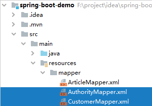

   AuthorityMapper

   ```xml
   <?xml version="1.0" encoding="UTF-8"?>
   <!DOCTYPE mapper
           PUBLIC "-//mybatis.org//DTD Mapper 3.0//EN"
           "http://mybatis.org/dtd/mybatis-3-mapper.dtd">
   <mapper namespace="com.zhuzhe.mapper.AuthorityMapper">
       <select id="findAuthoritiesByUsername" parameterType="String" resultType="Authority">
           select a.*
           from t_customer c,
                t_authority a,
                t_customer_authority ca
           where c.id = ca.customer_id
             and a.id = ca.authority_id
             and c.username = #{username}
       </select>
   </mapper>
   ```

   CustomerMapper

   ```xml
   <?xml version="1.0" encoding="UTF-8"?>
   <!DOCTYPE mapper
           PUBLIC "-//mybatis.org//DTD Mapper 3.0//EN"
           "http://mybatis.org/dtd/mybatis-3-mapper.dtd">
   <mapper namespace="com.zhuzhe.mapper.CustomerMapper">
       <select id="findByUsername" parameterType="String" resultType="Customer">
           select tc.id, tc.username, tc.password, tc.valid from t_customer tc where tc.username = #{username}
       </select>
   </mapper>
   ```

   

7. 前端文件

   ```
   更新内容:
   
   * bootstrap.min.css : bootstrap前端样式
   * common/1.html&2.html : common权限用户页面
   * vip/1.html&2.html : vip权限用户页面
   * login/login.html : 登录页面 【改为使用ajax来发送登录请求】
   * 403.html : 无权限页面【没用】
   * index.html : 首页【改注销时，携带token字段在表单提交】
   ```

   

   html/common/1.html & 2.html

   ```html
   <!DOCTYPE html>
   <html lang="en">
   <head>
       <meta http-equiv="Content-Type" content="text/html;charset=UTF-8">
       <title>影片详情</title>
   </head>
   <body>
       <a href="/movie">返回</a>
       <h1>飞驰人生</h1>
       <p style="width: 550px">简介：《飞驰人生》是上海亭东影业有限公司出品的励志喜剧片，由韩寒执导兼编剧，沈腾、黄景瑜、
           尹正、尹昉等主演。该片讲述了一个曾经叱咤赛车界的炒饭摊老板，试图重返车坛，却频频遭现实打脸的故事。2019年2月5日，
           该片在中国内地上映。2019年9月，该片获得第十七届平壤国际电影节最佳摄影奖。</p>
   </body>
   </html>
   ```

   ```html
   <!DOCTYPE html>
   <html lang="en" xmlns:th="http://www.thymeleaf.org">
   <head>
       <meta http-equiv="Content-Type" content="text/html;charset=UTF-8">
       <title>影片详情</title>
   </head>
   <body>
   <a href="/movie">返回</a>
   <h1>夏洛特烦恼</h1>
   <p style="width: 550px">简介：《夏洛特烦恼》是开心麻花2012年首度推出的话剧，由闫非和彭大魔联合编剧、执导。
       2013、2014、2015年仍在上演。该作讲述了一个普通人在穿越重回到高中校园并实现了种种梦想的不可思议的经历。</p>
   </body>
   </html>
   ```

   html/vip/1.html & 2.html

   ```html
   <!DOCTYPE html>
   <html lang="en">
   <head>
       <meta http-equiv="Content-Type" content="text/html;charset=UTF-8">
       <title>影片详情</title>
   </head>
   <body>
   <a href="/movie">返回</a>
   <h1>夏洛特烦恼</h1>
   <p style="width: 550px">简介：《速度与激情》是罗伯·科恩等执导，于2001年至2017年范·迪塞尔、保罗·沃克、米歇尔·罗德里格兹、
       乔丹娜·布鲁斯特、泰瑞斯·吉布森、卢达·克里斯等主演的赛车题材的动作犯罪类电影，截至2018年，一共拍了八部。之后两部续集正式定档，
       《速度与激情9》和《速度与激情10》分别于2020年4月10日和2021年4月2日上映 [1-2]  。
       据悉，最新一部《速度与激情》衍生片预计将于2018年9月初开拍，巨石强森和杰森·斯坦森主演，于2019年8月23日上映 [1]  。
   </p>
   </body>
   </html>
   ```

   ```html
   <!DOCTYPE html>
   <html lang="en">
   <head>
       <meta http-equiv="Content-Type" content="text/html;charset=UTF-8">
       <title>影片详情</title>
   </head>
   <body>
   <a href="/movie">返回</a>
   <h1>夏洛特烦恼</h1>
   <p style="width: 550px">简介：《猩球崛起》是科幻片《人猿星球》的前传，由鲁伯特·瓦耶特执导，詹姆斯·弗兰科，汤姆·费尔顿，
       芙蕾达·平托，布莱恩·考克斯等主演。剧情主要讲述人猿进化为高级智慧生物、进而攻占地球之前的种种际遇，主题是带有警世性质的
       ——人类疯狂的野心所产生的恶果。
   </p>
   </body>
   </html>
   ```

   html/login/login.html

   ```html
   <!DOCTYPE html>
   <html lang="en">
   <head>
       <meta charset="UTF-8" http-equiv="Content-Type" content="text/html">
       <meta name="viewport" content="width=device-width,initial-scale=1,shrink-to-fit=no">
       <title>文件下载</title>
       <link href="/static/css/bootstrap.min.css" rel="stylesheet">
       <script src="/static/js/jquery-1.11.3.min.js" type="text/javascript"></script>
       <script type="text/javascript">
           //设置ajax请求头
           $(function () {
               var match = window.document.cookie.match(/(?:^|\s|;)XSRF-TOKEN\s*=\s*([^;]+)(?:;|$)/);//从Cookie中获取
               $(document).ajaxSend(function (e, xhr, options) {
                   xhr.setRequestHeader("X-XSRF-TOKEN", (match && match[1]));
               });
           });
       </script>
   </head>
   <body class="text-center">
       <form id="loginForm" class="form-horizontal col-md-2 col-md-offset-5" role="form" style="padding-top: 20px" action="/movie/doLogin" method="post">
           <div class="form-group">
               <div class="col-md-10 col-sm-offset-1">
                   <h1 class="h3 mb-3 font-weight-normal">请登录</h1>
               </div>
           </div>
           <div class="form-group">
               <input id="username" type="text" name="name" class="form-control" placeholder="用户名" required="" autofocus="">
           </div>
           <div class="form-group">
               <input id="password" type="password" name="pwd" class="form-control" placeholder="密码" required="">
           </div>
           <div class="form-group">
               <div class="col-md-6" style="padding-left: 0px;text-align: left">
                   <div class="checkbox">
                       <label>
                           <input type="checkbox" name="rememberme">请记住我
                       </label>
                   </div>
               </div>
           </div>
           <div class="form-group">
               <button class="btn btn-lg btn-primary btn-block" id="submit_btn" type="button">登录</button>
           </div>
           <div class="form-group">
               <p class="text-muted">Copyright© 2021-2022</p>
           </div>
       </form>
   </body>
   <script type="text/javascript">
   
       //表单提交改为ajax提交
       $("#submit_btn").click(function (){
           var data = $("#loginForm").serialize();
           $.ajax({
               type: "POST",
               url: "/movie/doLogin",
               data:data,
               traditional:true,
               dataType: "json",
               success:function(map){
                   console.info("成功返回消息："+JSON.stringify(map))
                   if (map.code==0){
                       console.info("成功登录，开始跳转！"+map)
                       window.location.href=map.url;
                   }else{
                       alert(map.message)
                   }
               },error:function(map){
                   alert("登录失败,服务器异常!"+map);
               }
           });
       });
   </script>
   </html>
   ```

   html/index.html

   ```html
   <!DOCTYPE html>
   <html lang="en">
   <head>
       <meta http-equiv="Content-Type" content="text/html;charset=UTF-8">
       <title>影视直播厅</title>
       <script src="/static/js/jquery-1.11.3.min.js" type="text/javascript"></script>
       <script type="text/javascript">
           //设置ajax请求头
           $(function () {
               var match = window.document.cookie.match(/(?:^|\s|;)XSRF-TOKEN\s*=\s*([^;]+)(?:;|$)/);//从Cookie中获取
               $("input[name='_csrf']").val((match && match[1]));//设置到表单中
           });
       </script>
   </head>
   <body>
       <h1 align="center">欢迎进入电影网站首页</h1>
       <form action="/movie/userLogout" method="post">
           <input type="hidden" name="_csrf">
           <input type="submit" value="注销">
       </form>
       <hr>
       <h3>普通电影</h3>
       <ul>
           <li><a href="/movie/detail/common/1">飞驰人生</a></li>
           <li><a href="/movie/detail/common/2">夏洛特烦恼</a></li>
       </ul>
       <h3>VIP 专享</h3>
       <ul>
           <li><a href="/movie/detail/vip/1">速度与激情</a></li>
           <li><a href="/movie/detail/vip/2">猩球崛起</a></li>
       </ul>
   </body>
   </html>
   ```

   

8. application.properties应用SpringBoot全局配置文件

   ```
   无更新
   ```

   

   application.properties

   ```properties
   # 激活开发环境配置文件
   spring.profiles.active=dev
   # MySQL连接配置
   spring.datasource.url=jdbc:mysql://127.0.0.1:3306/springbootdata?useUnicode=true&characterEncoding=utf8&serverTimezoneGMT%2B8&useSSL=false
   spring.datasource.username=root
   spring.datasource.password=123456
   # Druid的连接池配置
   spring.datasource.type=com.alibaba.druid.pool.DruidDataSource
   spring.datasource.initialSize=20
   spring.datasource.minIdle=10
   spring.datasource.maxActive=100
   # 开启驼峰命名支持
   mybatis.configuration.map-underscore-to-camel-case=true
   # 配置Mybatis的XML配置文件路径
   mybatis.mapper-locations=classpath:mapper/*.xml
   # 配置XML映射文件中指定的实体类所在包路径
   mybatis.type-aliases-package=com.zhuzhe.domain
   # 开启执行日志
   mybatis.configuration.log-impl=org.apache.ibatis.logging.stdout.StdOutImpl
   # Redis服务器地址
   spring.redis.host=127.0.0.1
   # Redis服务器连接端口
   spring.redis.port=6379
   # Redis服务器连接密码
   spring.redis.password=
   # 配置视图前后缀
   spring.mvc.view.prefix=/static/
   spring.mvc.view.suffix=.html
   spring.mvc.static-path-pattern=/static/**
   # 单个上传文件大小限制（默认为1MB）
   spring.servlet.multipart.max-file-size=10MB
   # 总上传文件大小限制（默认为10MB）
   spring.servlet.multipart.max-request-size=50MB
   # 显示使用JPA进行数据库查询的SQL语句
   spring.jpa.show-sql=true
   ```

   

9. 测试效果

   开启csrf后，所有未携带csrf token的post请求都被拦截，无法到达服务器。

   首页放行，可以正常访问

   

   访问资源需要权限，拦截后转发到登录页面

   

   输入错误密码会有弹框提示

   

   输入正确密码会跳转到之前访问的页面

   

   后台做了处理，如果已经登录后再次访问登录页面会重定向到首页

   

   访问非当前用户的权限页面，会提示无权限

   

   点击首页注销后，能正常注销用户

   


## Spring Boot项目整合RabbitMQ

```
大流量访问情景下，使用消息队列可以很好保证消息有效消费，保证服务器性能。

* 异步：两个无前后关系的耗时功能，由消息队列让两个程序异步处理，节约一半时间。（一个注册要后台做发送邮件+发送短信 => 异步同时做）
* 解耦：单个耗时操作，消息队列来发送/监听操作，前端则快速反馈。（用户订单支付要扣库存 => 快速返回给前端已提交，后面用户自己异步刷新时就可以看到结果）
* 削峰：承载类似秒杀时的高峰流量，请求写入消息队列，设定队列阈值，到达阈值的请求直接返回秒杀失败。
* 分布式事务：分布式环境下的事务一致性，消息队列二次提交、基于队列数据进行回滚（订单支付成功调用库存服务扣库存，订单服务做消息表，将消息发送给库存服务，库存服务消费，完成后回传消息处理结果，订单服务收到结果更新消息表，如果遇到库存服务异常，会基于消息队列重复扫描消息表，继续发送扣库存消息）
```

工作模式：

* 工作队列模式：一个生产者多个消费者，消息只能被消费一次，且没消费完不能继续接收，用于业务拆分
* 发布订阅模式：一个生产者多个消费者，消息会路由到每个消费者，一个消息多个共同消费，用于异步解耦操作【Fanout Exchange交换器】
* 路由模式：一个生产者多个消费者，消息根据路由键路由到匹配消费者，具备相同路由键的队列可以共同消费同一消息，让消息队列对消息做分配，用于日志收集【Direct Exchange交换器】
* 通配符模式：一个生产者多个消费者，消息部分存在重复消费，带有通配符的路由键，让符合通配符匹配的消费者消费对于消息，可能有的消费者匹配到一条，有的匹配到多条，用于客户订阅文章类型推送信息，这种动态的场景。【Topic Exchange交换器】
* RPC模式：两个消息队列构成回环，用于前面的分布式事务场景
* Headers模式：类似路由模式【Headers Exchanges交换器】


> Rabbit MQ 环境搭建

```
注意：安装Erlang环境和RabbitMQ需要版本匹配，避免出现RabbitMQ安装失败的情况。
这次我安装的是：otp_win64_24.1.exe 、 rabbitmq-server-3.9.8.exe
```

这个是在Windows10环境下的安装，Linux可以参考。

1. 安装Erlang环境

   官网：http://www.erlang.org/

    

   点击Download Erlang/OTP进入下载页面

    

    

   点击OTP 24.1 Windows 64-bit Binary File (248) 进行下载

   这一步因为官网下载很慢，所以建议复制下载链接到迅雷下载。

    

    

   1.4. 安装Erlang程序

    

    

    

    

    

    

    

2. 下载RabbitMQ

   官网https://www.rabbitmq.com/

   

   

   

   

   **找到Download + Installation点击跳转到下载页面**

   

   

   

   

   **找到Download on Github点击下面的Windows installer进行下载**

   

   

   同样这种官网下载的方式很慢，这里建议复制下载链接到迅雷

   

   开始安装RibbitMQ

   

   

   

   

   在安装结束之后，点击Finish会默认启动RabbitMQ程序。也可以按照下面进行手动启动。

3. 启动Rabbit MQ

   使用cmd进入到刚刚指定的安装路径，并只需运行命令rabbitmq-plugins enable rabbitmq_management

   

4. 访问Rabbit MQ

   使用地址进行访问RibbitMQ的平台http://localhost:15672/

   

5. 登录RabbitMQ

   用默认的用户名密码进行登录guest/guest

   

6. 添加新用户

   admin

   

   设置密码和权限

   

   添加用户后会出现在上面的用户列表中

   

   给用户分配虚拟主机

   

   点击这里进入分配界面

   

   分配界面下滑到这一栏选择我们新建的用户来赋予权限

   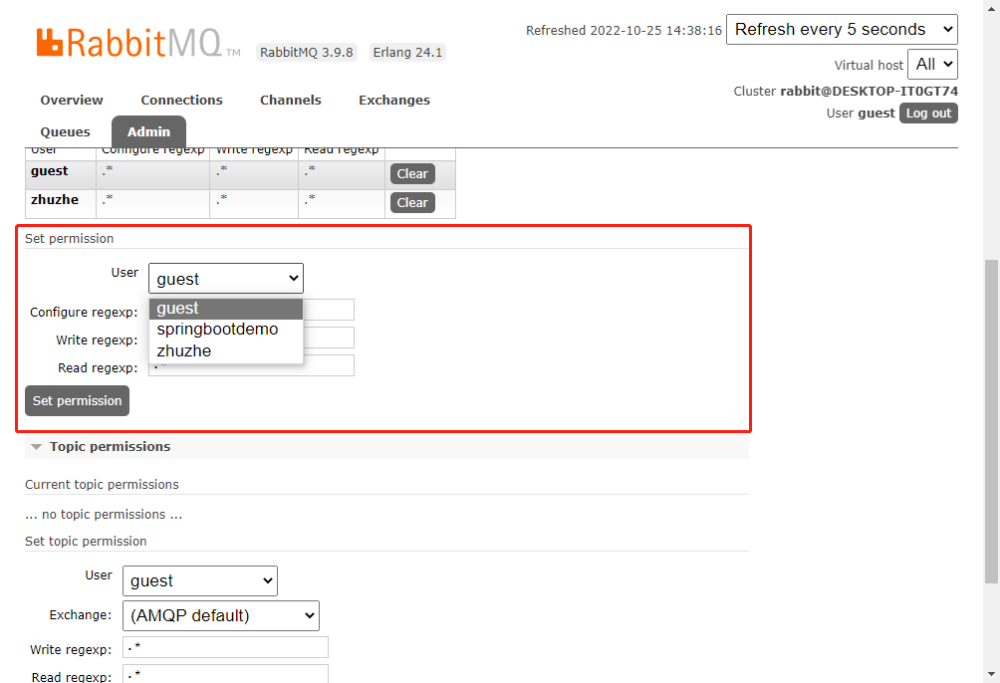

   读写等权限默认通配符全部操作允许

   

   添加成功会在上面展示出来

   

   返回到用户界面就可以看到完成一个用户的创建

   


> RabbitMQ 发布订阅模式


```
前面的操作成功启动RabbitMQ，并配置了一个测试用户。这里是将SpringBoot项目的操作，接入到RabbitMQ中。

* 定制中间件
* 消息发送者发送消息
* 消息消费者接收消息
```

下面是一个发布订阅消息队列的实现。


1. 全局配置文件配置RabbitMQ的连接信息

   springboot有自带一个rabbitmq中间件，但不推荐使用。

   applicationContext.properties

   ```properties
   # 激活开发环境配置文件
   spring.profiles.active=dev
   # MySQL连接配置
   spring.datasource.url=jdbc:mysql://127.0.0.1:3306/springbootdata?useUnicode=true&characterEncoding=utf8&serverTimezoneGMT%2B8&useSSL=false
   spring.datasource.username=root
   spring.datasource.password=123456
   # Druid的连接池配置
   spring.datasource.type=com.alibaba.druid.pool.DruidDataSource
   spring.datasource.initialSize=20
   spring.datasource.minIdle=10
   spring.datasource.maxActive=100
   # 开启驼峰命名支持
   mybatis.configuration.map-underscore-to-camel-case=true
   # 配置Mybatis的XML配置文件路径
   mybatis.mapper-locations=classpath:mapper/*.xml
   # 配置XML映射文件中指定的实体类所在包路径
   mybatis.type-aliases-package=com.zhuzhe.domain
   # 开启执行日志
   mybatis.configuration.log-impl=org.apache.ibatis.logging.stdout.StdOutImpl
   # Redis服务器地址
   spring.redis.host=127.0.0.1
   # Redis服务器连接端口
   spring.redis.port=6379
   # Redis服务器连接密码
   spring.redis.password=
   # 配置视图前后缀
   spring.mvc.view.prefix=/static/
   spring.mvc.view.suffix=.html
   spring.mvc.static-path-pattern=/static/**
   # 单个上传文件大小限制（默认为1MB）
   spring.servlet.multipart.max-file-size=10MB
   # 总上传文件大小限制（默认为10MB）
   spring.servlet.multipart.max-request-size=50MB
   # 显示使用JPA进行数据库查询的SQL语句
   spring.jpa.show-sql=true
   # rabbit-mq配置
   spring.rabbitmq.host=localhost
   spring.rabbitmq.port=5672
   spring.rabbitmq.username=springbootdemo
   spring.rabbitmq.password=123456
   spring.rabbitmq.virtual-host=/
   ```

   

2. 发布订阅模式测试-api方式

   ```
   模拟用户注册成功后，需要异步操作发送短信、发送邮件。
   ```

   通过api在RabbitMQ平台上定制发布订阅消息中间件

   ```java
   package com.zhuzhe;
   
   import org.junit.jupiter.api.Test;
   import org.springframework.amqp.core.AmqpAdmin;
   import org.springframework.amqp.core.Binding;
   import org.springframework.amqp.core.FanoutExchange;
   import org.springframework.amqp.core.Queue;
   import org.springframework.boot.test.context.SpringBootTest;
   
   import javax.annotation.Resource;
   
   /**
    * @Author: zhuzhe
    * @ClassName: RabbitMQTest
    * @Date: 2022/10/25 15:00
    * @Description:
    * @Version: V1.0
    * @Param:
    */
   @SpringBootTest
   public class RabbitMQTest {
   
       @Resource
       private AmqpAdmin amqpAdmin;
   
       @Test//定义发布订阅消息中间键
       void publishSubscribe(){
           //定义交换器
           amqpAdmin.declareExchange(new FanoutExchange("fanout_exchange_login"));
           //定义队列
           amqpAdmin.declareQueue(new Queue("fanout_queue_email"));
           amqpAdmin.declareQueue(new Queue("fanout_queue_sms"));
           //队列和交换器绑定
           amqpAdmin.declareBinding(new Binding("fanout_queue_email",Binding.DestinationType.QUEUE,"fanout_exchange_login","",null));
           amqpAdmin.declareBinding(new Binding("fanout_queue_sms",Binding.DestinationType.QUEUE,"fanout_exchange_login","",null));
       }
   }
   ```

   运行成功结果

   

   可以在RabbitMQ平台中Exchange交换器界面看到新建的交换器

   

   这一个交换器点击后，可以看到与其绑定的两个队列。

   

   也可以在队列界面查看到我们创建的队列

   

   点击对立名即可查看到绑定的交换器，这里可以看到交换器还有队列，如果之前已经创建过，则不会重复创建，有新绑定则会更新进去。

   

   这样就是创建好一个发布订阅中间件了。

   然后创建一个消息对象。这一个对象就是我们在业务操作中常见的对象，比如这里是新注册/登录一个用户，后台肯定是有保存这个User对象，将这个对象作为消息发送，也是为了方便消费者拿到后可以直接使用，避免再次查库。

   User.java

   ```java
   package com.zhuzhe.domain;
   
   /**
    * @Author: zhuzhe
    * @ClassName: User
    * @Date: 2022/10/25 17:21
    * @Description: 消息队列测试用户
    * @Version: V1.0
    * @Param:
    */
   public class User implements Serializable {
       private Integer id;
       private String username;
   
       public Integer getId() {
           return id;
       }
   
       public void setId(Integer id) {
           this.id = id;
       }
   
       public String getUsername() {
           return username;
       }
   
       public void setUsername(String username) {
           this.username = username;
       }
   
       @Override
       public String toString() {
           return "User{" +
                   "id=" + id +
                   ", username='" + username + '\'' +
                   '}';
       }
   }
   ```

   编写一个方法，假设在完成用户注册/登录之后，后端将这个对象发送到队列里，让邮件服务、短信服务去消费就行，注册/登录服务只要回复用户操作成功即可。因为在这种场景下，用户不需要知道有短信还有邮件提醒，就算有，这步也只需要让用户自己去异步等待就行了，告知已发送。

   ```java
   package com.zhuzhe;
   
   import com.zhuzhe.domain.User;
   import org.junit.jupiter.api.Test;
   import org.springframework.amqp.core.AmqpAdmin;
   import org.springframework.amqp.core.Binding;
   import org.springframework.amqp.core.FanoutExchange;
   import org.springframework.amqp.core.Queue;
   import org.springframework.amqp.rabbit.core.RabbitTemplate;
   import org.springframework.beans.factory.annotation.Autowired;
   import org.springframework.boot.test.context.SpringBootTest;
   
   import javax.annotation.Resource;
   
   /**
    * @Author: zhuzhe
    * @ClassName: RabbitMQTest
    * @Date: 2022/10/25 15:00
    * @Description:
    * @Version: V1.0
    * @Param:
    */
   @SpringBootTest
   public class RabbitMQTest {
   
       @Resource
       private AmqpAdmin amqpAdmin;
       @Resource
       private RabbitTemplate rabbitTemplate;
   
       @Test//定义发布订阅消息中间键
       void publishSubscribe(){
           //定义交换器
           amqpAdmin.declareExchange(new FanoutExchange("fanout_exchange_login"));
           //定义队列
           amqpAdmin.declareQueue(new Queue("fanout_queue_email"));
           amqpAdmin.declareQueue(new Queue("fanout_queue_sms"));
           //队列和交换器绑定
           amqpAdmin.declareBinding(new Binding("fanout_queue_email",Binding.DestinationType.QUEUE,"fanout_exchange_login","",null));//交换机、绑定类型、绑定队列名、路由键、过期时间
           amqpAdmin.declareBinding(new Binding("fanout_queue_sms",Binding.DestinationType.QUEUE,"fanout_exchange_login","",null));
       }
   
       @Test//发送消息
       void sendMessage(){
           //模拟业务完成的最后，产生的用户对象
           User user = new User();
           user.setId(1);
           user.setUsername("zhuzhe");
           rabbitTemplate.convertAndSend("fanout_exchange_login","",user);//交换机、路由键、消息
       }
   }
   ```

   运行成功结果

   

   此时因为没有消费者，所以消息滞留在平台上，可以在队列中看到。

   

   点击队列名可以看到具体在队列中的消息内容。

   、

   

   **RabbitMQ 抽象出一个 MessageConvert 接口处理消息的序列化，当调用了 convertAndSend 方法时会使用 MessageConvert 进行消息的序列化。如果是 String 则转成字节数组,如果是 Java 对象，则使用 jdk 序列化将消息转成字节数组**

   取消掉对象的序列化接口，在配置类中注册messageConverter，使用Jackson来处理。

   ```java
   package com.zhuzhe.config;
   
   import org.springframework.amqp.support.converter.Jackson2JsonMessageConverter;
   import org.springframework.amqp.support.converter.MessageConverter;
   import org.springframework.context.annotation.Bean;
   import org.springframework.context.annotation.Configuration;
   
   /**
    * @Author: zhuzhe
    * @ClassName: RabbitMQConfig
    * @Date: 2022/10/25 21:59
    * @Description:
    * @Version: V1.0
    * @Param:
    */
   @Configuration
   public class RabbitMQConfig {
   
       @Bean
       public MessageConverter messageConverter(){
           return new Jackson2JsonMessageConverter();
       }
   }
   ```

   可以看到重新发送的消息，是可以在RabbitMQ平台中直接查看

   

   上面这个发布消息的代码，可以写在注册\登录是service中，同样我们创建在业务中场景的两个服务来消费。

   邮箱服务

   ```java
   package com.zhuzhe.service.impl;
   
   import org.springframework.amqp.core.Message;
   import org.springframework.amqp.rabbit.annotation.RabbitListener;
   import org.springframework.stereotype.Service;
   
   import java.util.logging.Logger;
   
   /**
    * @Author: zhuzhe
    * @ClassName: EmailServiceImpl
    * @Date: 2022/10/25 22:12
    * @Description:
    * @Version: V1.0
    * @Param:
    */
   @Service
   public class EmailServiceImpl {
   
       private static Logger logger = Logger.getLogger(EmailServiceImpl.class.getSimpleName());
   
       @RabbitListener(queues = "fanout_queue_email")//邮箱服务监听邮箱队列
       public void publishEmail(Message message){
           byte[] body = message.getBody();
           String s = new String(body);
           logger.info("邮箱服务收到消息队列消息，Message="+s);
           logger.info("开始给用户发送邮箱邮件...");
       }
   }
   ```

   短信服务

   ```java
   package com.zhuzhe.service.impl;
   
   import org.springframework.amqp.core.Message;
   import org.springframework.amqp.rabbit.annotation.RabbitListener;
   import org.springframework.stereotype.Service;
   
   import java.util.logging.Logger;
   
   /**
    * @Author: zhuzhe
    * @ClassName: SmsServiceImpl
    * @Date: 2022/10/25 22:12
    * @Description:
    * @Version: V1.0
    * @Param:
    */
   @Service
   public class SmsServiceImpl {
   
       private static Logger logger = Logger.getLogger(SmsServiceImpl.class.getSimpleName());
   
       @RabbitListener(queues = "fanout_queue_sms")//短信服务监听短信消息队列
       public void publishEmail(Message message){
           byte[] body = message.getBody();
           String s = new String(body);
           logger.info("短信服务收到消息队列消息，Message="+s);
           logger.info("开始给用户下发短信...");
       }
   }
   ```

   @Service注解让两个服务Bean存在Spring容器中，@RabbitListener让服务方法监听对于消息队列的状态。

   启动Spring容器，让两个服务存活。

   执行测试用例，发送消息到消息队列。

   

   此时在启动的应用中，两个服务的方法就可以监听到，并展示异步处理结果。

   

   

   

   

3. 发布订阅模式测试-配置类方式

   目的和上面的一样，只是写法不同

   ```java
   package com.zhuzhe.config;
   
   import org.springframework.amqp.core.*;
   import org.springframework.amqp.support.converter.Jackson2JsonMessageConverter;
   import org.springframework.amqp.support.converter.MessageConverter;
   import org.springframework.context.annotation.Bean;
   import org.springframework.context.annotation.Configuration;
   
   /**
    * @Author: zhuzhe
    * @ClassName: RabbitMQConfig
    * @Date: 2022/10/25 21:59
    * @Description:
    * @Version: V1.0
    * @Param:
    */
   @Configuration
   public class RabbitMQConfig {
   
       @Bean
       public MessageConverter messageConverter(){
           return new Jackson2JsonMessageConverter();
       }
       
       //定义交换器
       @Bean
       public Exchange fanout_exchange(){
           return ExchangeBuilder.fanoutExchange("fanout_exchange_configuration_login").build();
       }
       
       //定义消息队列
       @Bean
       public Queue fanout_queue_email(){
           return new Queue("fanout_queue_configuration_email");
       }
       @Bean
       public Queue fanout_queue_sms(){
           return new Queue("fanout_queue_configuration_sms");
       }
       
       //消息队列绑定交换器
       @Bean
       public Binding bindingEmailQueue(){
           return BindingBuilder.bind(fanout_queue_email()).to(fanout_exchange()).with("").noargs();
       }
       @Bean
       public Binding bindingSmsQueue(){
           return BindingBuilder.bind(fanout_queue_sms()).to(fanout_exchange()).with("").noargs();
       }
   }
   ```

   一样可以创建队列，可以发送消息，消费消息

   

4. 发布订阅模式测试-注解方式

   ```
   在消费者端定义接收消息的配置。@RabbitListener的bindings属性提供了创建交换器还有队列的功能。
   ```

   email消费者

   ```java
   package com.zhuzhe.service.impl;
   
   import org.springframework.amqp.core.Message;
   import org.springframework.amqp.rabbit.annotation.Exchange;
   import org.springframework.amqp.rabbit.annotation.Queue;
   import org.springframework.amqp.rabbit.annotation.QueueBinding;
   import org.springframework.amqp.rabbit.annotation.RabbitListener;
   import org.springframework.stereotype.Service;
   
   import java.util.logging.Logger;
   
   /**
    * @Author: zhuzhe
    * @ClassName: EmailServiceImpl
    * @Date: 2022/10/25 22:12
    * @Description:
    * @Version: V1.0
    * @Param:
    */
   @Service
   public class EmailServiceImpl {
   
       private static Logger logger = Logger.getLogger(EmailServiceImpl.class.getSimpleName());
   
       @RabbitListener(queues = "fanout_queue_email")//邮箱服务监听邮箱队列
       public void publishEmail(Message message){
           byte[] body = message.getBody();
           String s = new String(body);
           logger.info("邮箱服务收到消息队列消息，Message="+s);
           logger.info("开始给用户发送邮箱邮件...");
       }
       
       //定义队列绑定：创建队列绑定创建的交换机
       @RabbitListener(bindings = @QueueBinding(value = @Queue("fanout_queue_annotation_email"), exchange = @Exchange(value = "fanout_exchange_annotation", type = "fanout")))
       public void publishEmail2(Message message){
           byte[] body = message.getBody();
           String s = new String(body);
           logger.info("邮箱服务2收到消息队列消息，Message="+s);
           logger.info("开始给用户发送邮箱邮件...");
       }
   }
   ```

   sms消费者

   ```java
   package com.zhuzhe.service.impl;
   
   import org.springframework.amqp.core.Message;
   import org.springframework.amqp.rabbit.annotation.Exchange;
   import org.springframework.amqp.rabbit.annotation.Queue;
   import org.springframework.amqp.rabbit.annotation.QueueBinding;
   import org.springframework.amqp.rabbit.annotation.RabbitListener;
   import org.springframework.stereotype.Service;
   
   import java.util.logging.Logger;
   
   /**
    * @Author: zhuzhe
    * @ClassName: SmsServiceImpl
    * @Date: 2022/10/25 22:12
    * @Description:
    * @Version: V1.0
    * @Param:
    */
   @Service
   public class SmsServiceImpl {
   
       private static Logger logger = Logger.getLogger(SmsServiceImpl.class.getSimpleName());
   
       @RabbitListener(queues = "fanout_queue_sms")//短信服务监听短信消息队列
       public void publishEmail(Message message){
           byte[] body = message.getBody();
           String s = new String(body);
           logger.info("短信服务收到消息队列消息，Message="+s);
           logger.info("开始给用户下发短信...");
       }
   
       @RabbitListener(bindings = @QueueBinding(value = @Queue("fanout_queue_annotation_sms"), exchange = @Exchange(value = "fanout_exchange_annotation", type = "fanout")))
       public void publishEmail2(Message message){
           byte[] body = message.getBody();
           String s = new String(body);
           logger.info("短信服务2收到消息队列消息，Message="+s);
           logger.info("开始给用户下发短信...");
       }
   }
   ```

   在启动容器后，也可以看到对应的交换器还有队列都在RabbitMQ平台上创建好了

   

   


> RabbitMQ 路由模式


```
路由模式特点：

* 一个交换机和一个队列之间，绑定多个key，那么发送消息的时候，通过任何一个key都可以发送到这个队列中
* 一个交换机，通过一个key，绑定多个队列，那么该key绑定了几个Queue，那么该条消息就同时发送到几个队列中。

使用场景：通过消息队列来写日志

* Info debug error warn ：记录下来
* error: 除了记录下来，还需要特殊处理，可能需要发送一个信息，发送一个邮件；
```

使用注解方式创建消息队列。

1. 创建交换器、队列、消费者

   ```java
   package com.zhuzhe.service.impl;
   
   import org.springframework.amqp.rabbit.annotation.Exchange;
   import org.springframework.amqp.rabbit.annotation.Queue;
   import org.springframework.amqp.rabbit.annotation.QueueBinding;
   import org.springframework.amqp.rabbit.annotation.RabbitListener;
   import org.springframework.stereotype.Service;
   
   import java.util.logging.Logger;
   
   /**
    * @Author: zhuzhe
    * @ClassName: LogService
    * @Date: 2022/10/25 23:53
    * @Description:
    * @Version: V1.0
    * @Param:
    */
   @Service
   public class LogServiceImpl {
   
       private static Logger logger = Logger.getLogger(LogServiceImpl.class.getSimpleName());
   
       @RabbitListener(bindings = @QueueBinding(value = @Queue("routing_queue_error"), exchange = @Exchange(value = "routing_exchange", type = "direct"), key = "error_routing_key"))
       public void routingError(String message) {
           logger.info("接收到error级别的日志，需要对此做特殊处理..." + message);
           logger.info("异常信息已提交到测试平台");
       }
   
       @RabbitListener(bindings = @QueueBinding(value = @Queue("routing_queue_all"), exchange = @Exchange(value = "routing_exchange", type = "direct"), key = {"info_routing_key", "error_routing_key", "warning_routing_key"}))
       public void routingAll(String message) {
           logger.info("接收到info、error、warning级别日志，做日常记录..." + message);
       }
   }
   
   ```

   项目启动后，可以看到队列成功创建。

   

   在平台上可以看到，交换器关联多个路由键，绑定两个队列。消息发送经过路由键路由到指定队列，可重复消费。

   

2. 创建消息发布者

   队列创建好后，就可以发送消息了

   ```java
   package com.zhuzhe;
   
   import com.zhuzhe.domain.User;
   import org.junit.jupiter.api.Test;
   import org.springframework.amqp.core.AmqpAdmin;
   import org.springframework.amqp.core.Binding;
   import org.springframework.amqp.core.FanoutExchange;
   import org.springframework.amqp.core.Queue;
   import org.springframework.amqp.rabbit.core.RabbitTemplate;
   import org.springframework.beans.factory.annotation.Autowired;
   import org.springframework.boot.test.context.SpringBootTest;
   
   import javax.annotation.Resource;
   import java.util.logging.Logger;
   
   /**
    * @Author: zhuzhe
    * @ClassName: RabbitMQTest
    * @Date: 2022/10/25 15:00
    * @Description:
    * @Version: V1.0
    * @Param:
    */
   @SpringBootTest
   public class RabbitMQTest {
   
       private static Logger logger = Logger.getLogger(RabbitMQTest.class.getSimpleName());
   
       @Resource
       private AmqpAdmin amqpAdmin;
       @Resource
       private RabbitTemplate rabbitTemplate;
   
       @Test//定义发布订阅消息中间键
       void publishSubscribe(){
           //定义交换器
           amqpAdmin.declareExchange(new FanoutExchange("fanout_exchange_login"));
           //定义队列
           amqpAdmin.declareQueue(new Queue("fanout_queue_email"));
           amqpAdmin.declareQueue(new Queue("fanout_queue_sms"));
           //队列和交换器绑定
           amqpAdmin.declareBinding(new Binding("fanout_queue_email",Binding.DestinationType.QUEUE,"fanout_exchange_login","",null));//交换机、绑定类型、绑定队列名、路由键、过期时间
           amqpAdmin.declareBinding(new Binding("fanout_queue_sms",Binding.DestinationType.QUEUE,"fanout_exchange_login","",null));
       }
   
       @Test//发送消息
       void sendMessage(){
           //模拟业务完成的最后，产生的用户对象
           User user = new User();
           user.setId(1);
           user.setUsername("zhuzhe");
           rabbitTemplate.convertAndSend("fanout_exchange_login","",user);//交换机、路由键、消息
           logger.info("成功发送消息，等待消费者消费>>>");
       }
   
       @Test
       void sendMessageRouting(){
           rabbitTemplate.convertAndSend("routing_exchange", "error_routing_key","routing send error message");//向路由交换器下的error路由键发送消息
       }
   }
   ```

3. 测试效果

   启动SpringBoot项目（构建交换器、路由键、消息队列）。执行测试用例

   

   如果发送info级别日志，则会只有一个队列消费

   ```java
   @SpringBootTest
   public class RabbitMQTest {
       @Test
       void sendMessageRouting(){
           rabbitTemplate.convertAndSend("routing_exchange", "info_routing_key","routing send info message");//向路由交换器下的error路由键发送消息
       }
   }
   ```

   


> RabbitMQ 通配符模式

```
基本思想和路由模式是一样的，只不过路由键支持模糊匹配，符号“#”匹配一个或多个词。

队列儒要绑定要一个模式上：
* 符号"#"匹配一个或多个词【"audit.#"能够匹配到 "audit.irs.corporate"】
* 符号"*"匹配一个词【“audit.*”只会匹配到"audit.irs"】
```

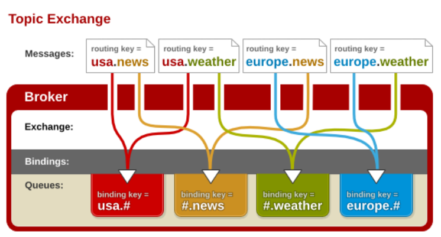

1. 创建通配符模式下的中间件

   ```
   使用注解方式
   ```

   ```java
   package com.zhuzhe.service.impl;
   
   import org.springframework.amqp.rabbit.annotation.Exchange;
   import org.springframework.amqp.rabbit.annotation.Queue;
   import org.springframework.amqp.rabbit.annotation.QueueBinding;
   import org.springframework.amqp.rabbit.annotation.RabbitListener;
   import org.springframework.stereotype.Service;
   
   import java.util.logging.Logger;
   
   /**
    * @Author: zhuzhe
    * @ClassName: PushServiceImpl
    * @Date: 2022/10/26 17:19
    * @Description: 推送消息服务，把消息推送给客户
    * @Version: V1.0
    * @Param:
    */
   @Service
   public class PushServiceImpl {
   
       private static Logger logger = Logger.getLogger(PushServiceImpl.class.getSimpleName());
       
       @RabbitListener(bindings = @QueueBinding(value = @Queue("topic_queue_email"), exchange = @Exchange(value = "topic_queue", type = "topic"), key = "info.#.email.#"))
       public void topicEmail(String message){
           logger.info("接收到邮件订阅的推送消息："+message);
       }
   
       @RabbitListener(bindings = @QueueBinding(value = @Queue("topic_queue_sms"), exchange = @Exchange(value = "topic_queue", type = "topic"), key = "info.#.sms.#"))
       public void topicSms(String message){
           logger.info("接收到短信订阅的推送消息："+message);
       }
   }
   ```

   

   

2. 发送消息

   ```java
   package com.zhuzhe;
   
   import com.zhuzhe.domain.User;
   import org.junit.jupiter.api.Test;
   import org.springframework.amqp.core.AmqpAdmin;
   import org.springframework.amqp.core.Binding;
   import org.springframework.amqp.core.FanoutExchange;
   import org.springframework.amqp.core.Queue;
   import org.springframework.amqp.rabbit.core.RabbitTemplate;
   import org.springframework.beans.factory.annotation.Autowired;
   import org.springframework.boot.test.context.SpringBootTest;
   
   import javax.annotation.Resource;
   import java.util.logging.Logger;
   
   /**
    * @Author: zhuzhe
    * @ClassName: RabbitMQTest
    * @Date: 2022/10/25 15:00
    * @Description:
    * @Version: V1.0
    * @Param:
    */
   @SpringBootTest
   public class RabbitMQTest {
   
       private static Logger logger = Logger.getLogger(RabbitMQTest.class.getSimpleName());
   
       @Resource
       private AmqpAdmin amqpAdmin;
       @Resource
       private RabbitTemplate rabbitTemplate;
   
       @Test//发送通配符消息
       void sendMessageTopic(){
           //只发送给订阅了邮箱的用户
           rabbitTemplate.convertAndSend("topic_exchange","info.email","topics send email message");
           //只发送给订阅了短信的用户
           rabbitTemplate.convertAndSend("topic_exchange","info.sms","topics send sms message");
           //发送给全部用户
           rabbitTemplate.convertAndSend("topic_exchange","info.email.sms","topics send email and sms message");
       }
   }
   
   ```

   

3. 测试效果

   

   


## Spring Boot 项目的任务管理

```
异步任务、定时任务、邮件任务
```


> SpringBoot异步任务

* 有返回值异步任务：注册过程发送短信验证码
  1. SpringBoot开启异步任务支持
  
     
  
  2. 创建一个模拟发送短信验证码程序
  
     在之前的Service中添加就行
  
     ```java
     package com.zhuzhe.service.impl;
     
     import org.springframework.scheduling.annotation.Async;
     import org.springframework.stereotype.Service;
     
     import java.util.logging.Logger;
     
     /**
      * @Author: zhuzhe
      * @ClassName: SmsServiceImpl
      * @Date: 2022/10/25 22:12
      * @Description:
      * @Version: V1.0
      * @Param:
      */
     @Service
     public class SmsServiceImpl {
     
         private static Logger logger = Logger.getLogger(SmsServiceImpl.class.getSimpleName());
     	
         //...
         
         @Async//异步方法
         public void asyncSendSms() throws Exception{
             logger.info("用户完成注册，开始异步发送短信...");
             //下面是耗时操作，模拟下发短信调用api等待回复，但因为加上异步注解，所以这个方法将以多线程异步运行
             Long startTime = System.currentTimeMillis();
             Thread.sleep(5000);
             Long endTime = System.currentTimeMillis();
             logger.info("完成短信下发！耗时："+(endTime-startTime)+"ms.");
         }
     }
     ```
  
     添加一个外部访问接口 
  
     ```java
     package com.zhuzhe.controller;
     
     import com.zhuzhe.service.impl.SmsServiceImpl;
     import org.springframework.beans.factory.annotation.Autowired;
     import org.springframework.stereotype.Controller;
     import org.springframework.web.bind.annotation.GetMapping;
     import org.springframework.web.bind.annotation.RequestMapping;
     import org.springframework.web.bind.annotation.ResponseBody;
     
     import javax.servlet.http.HttpSession;
     import java.util.Enumeration;
     import java.util.logging.Logger;
     
     /**
      * @Author: zhuzhe
      * @ClassName: CustomerController
      * @Date: 2022/10/19 21:40
      * @Description: 用户控制器
      * @Version: V1.0
      * @Param:
      */
     @Controller
     @RequestMapping("customer")
     public class CustomerController {
     
         private static Logger logger = Logger.getLogger(CustomerController.class.getSimpleName());
     
         @Autowired
         private SmsServiceImpl smsService;
         
         //...
     
         @GetMapping("sendSms")
         @ResponseBody
         public String testSendSms() throws Exception{
             Long startTime = System.currentTimeMillis();
             smsService.asyncSendSms();
             Long endTime = System.currentTimeMillis();
             logger.info("控制器调用服务耗时："+(endTime-startTime)+"ms.");
             return "success";
         }
     }
     ```
  
     
  
  3. 测试效果
  
     启动项目后调用接口，可以看到，调用立即返回结果，具体业务是异步执行，等待一段实际后就执行完毕。前端无感知，只是觉得很快发送了验证码。
  
     
  
     
  
* 无返回值异步任务：让两个无关联方法异步同时执行，减免同步等待执行的耗时，耗时减一半

  1. 新建异步方法，该异步方法有返回值

     ```java
     package com.zhuzhe.service.impl;
     
     import org.springframework.amqp.core.Message;
     import org.springframework.amqp.rabbit.annotation.Exchange;
     import org.springframework.amqp.rabbit.annotation.Queue;
     import org.springframework.amqp.rabbit.annotation.QueueBinding;
     import org.springframework.amqp.rabbit.annotation.RabbitListener;
     import org.springframework.scheduling.annotation.Async;
     import org.springframework.scheduling.annotation.AsyncResult;
     import org.springframework.stereotype.Service;
     
     import java.util.concurrent.Future;
     import java.util.logging.Logger;
     
     /**
      * @Author: zhuzhe
      * @ClassName: SmsServiceImpl
      * @Date: 2022/10/25 22:12
      * @Description:
      * @Version: V1.0
      * @Param:
      */
     @Service
     public class SmsServiceImpl {
     
         private static Logger logger = Logger.getLogger(SmsServiceImpl.class.getSimpleName());
     
     	//...
     
         //异步方法：两个无前后关系的方法同时执行，可以进行异步并发执行
         @Async
         public Future<Integer> processA() throws Exception{
             logger.info("业务A开始执行...");
             Long startTime = System.currentTimeMillis();
             Thread.sleep(4000);
             int count = 123456;
             Long endTime = System.currentTimeMillis();
             logger.info("业务A执行结束，耗时："+(endTime-startTime)+"ms.");
             return new AsyncResult<Integer>(count);
         }
     
         //异步方法：两个无前后关系的方法同时执行，可以进行异步并发执行
         @Async
         public Future<Integer> processB() throws Exception{
             logger.info("业务B开始执行...");
             Long startTime = System.currentTimeMillis();
             Thread.sleep(5000);
             int count = 654321;
             Long endTime = System.currentTimeMillis();
             logger.info("业务B执行结束，耗时："+(endTime-startTime)+"ms.");
             return new AsyncResult<Integer>(count);
         }
     }
     
     ```

     

  2. 创建接口调用异步方法获取两个方法的返回值

     ```java
     package com.zhuzhe.controller;
     
     import com.zhuzhe.service.impl.SmsServiceImpl;
     import org.springframework.beans.factory.annotation.Autowired;
     import org.springframework.security.core.Authentication;
     import org.springframework.security.core.context.SecurityContext;
     import org.springframework.security.core.context.SecurityContextHolder;
     import org.springframework.security.core.context.SecurityContextImpl;
     import org.springframework.security.core.userdetails.UserDetails;
     import org.springframework.stereotype.Controller;
     import org.springframework.web.bind.annotation.GetMapping;
     import org.springframework.web.bind.annotation.RequestMapping;
     import org.springframework.web.bind.annotation.ResponseBody;
     
     import javax.servlet.http.HttpSession;
     import java.util.Enumeration;
     import java.util.concurrent.Future;
     import java.util.logging.Logger;
     
     /**
      * @Author: zhuzhe
      * @ClassName: CustomerController
      * @Date: 2022/10/19 21:40
      * @Description: 用户控制器
      * @Version: V1.0
      * @Param:
      */
     @Controller
     @RequestMapping("customer")
     public class CustomerController {
     
         private static Logger logger = Logger.getLogger(CustomerController.class.getSimpleName());
     
         @Autowired
         private SmsServiceImpl smsService;
     	
         //...
     
         @GetMapping("statistics")
         @ResponseBody
         public String statistics() throws Exception{
             Long startTime = System.currentTimeMillis();
             Future<Integer> futureA = smsService.processA();
             Future<Integer> futureB = smsService.processB();
             int total = futureA.get() + futureB.get();//这一个取值调用就会等待
             logger.info("完成异步任务调用：total="+total);
             Long endTime = System.currentTimeMillis();
             logger.info("执行异步任务耗时："+(endTime-startTime)+"ms.");
             return "success";
         }
     }
     
     ```

     

  3. 测试效果

     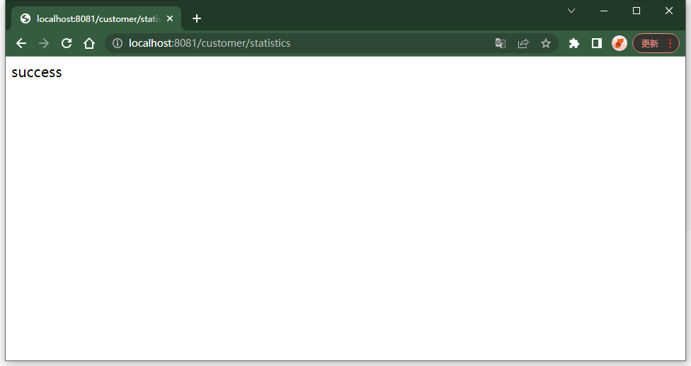

     

     

  

> SpringBoot定时任务

```
场景的开发场景、定时备份、定时归档、定时清理
```


启动类开启定时任务支持


**启动后执行，间隔6秒执行一次。**

```java
package com.zhuzhe.service.impl;

import org.springframework.scheduling.annotation.Scheduled;
import org.springframework.stereotype.Service;

import java.text.SimpleDateFormat;
import java.util.Date;
import java.util.logging.Logger;

/**
 * @Author: zhuzhe
 * @ClassName: ScheduledTaskService
 * @Date: 2022/10/27 17:23
 * @Description: 定时任务服务
 * @Version: V1.0
 * @Param:
 */
@Service
public class ScheduledTaskService {

    private static Logger logger = Logger.getLogger(ScheduledTaskService.class.getSimpleName());
    public static final SimpleDateFormat dateFormat = new SimpleDateFormat("yyyy-MM-dd HH:mm:ss");
    private Integer count1 = 1;
    private Integer count2 = 1;


    @Scheduled(fixedDelay = 6000)
    public void scheduledTaskImmediately(){
        logger.info("定时任务[fixedDelay]第"+(count1++)+"次执行，当前时间："+dateFormat.format(new Date()));
    }

    @Scheduled(cron = "0/6 * * * * *")
    public void scheduledTaskCron(){
        logger.info("定时任务[cron]第"+(count2++)+"次执行，当前时间："+dateFormat.format(new Date()));
    }
}
```


> 指定在每分钟的第6秒这个刻度执行

```java
package com.zhuzhe.service.impl;

import org.springframework.scheduling.annotation.Scheduled;
import org.springframework.stereotype.Service;

import java.text.SimpleDateFormat;
import java.util.Date;
import java.util.logging.Logger;

/**
 * @Author: zhuzhe
 * @ClassName: ScheduledTaskService
 * @Date: 2022/10/27 17:23
 * @Description: 定时任务服务
 * @Version: V1.0
 * @Param:
 */
@Service
public class ScheduledTaskService {

    private static Logger logger = Logger.getLogger(ScheduledTaskService.class.getSimpleName());
    public static final SimpleDateFormat dateFormat = new SimpleDateFormat("yyyy-MM-dd HH:mm:ss");
    private Integer count1 = 1;
    private Integer count2 = 1;

//    @Scheduled(fixedDelay = 6000)
//    public void scheduledTaskImmediately(){
//        logger.info("定时任务[fixedDelay]第"+(count1++)+"次执行，当前时间："+dateFormat.format(new Date()));
//    }
//
//    @Scheduled(cron = "0/6 * * * * *")
//    public void scheduledTaskCron(){
//        logger.info("定时任务[cron]第"+(count2++)+"次执行，当前时间："+dateFormat.format(new Date()));
//    }

    @Scheduled(cron = "6 * * * * *")
    public void scheduledTaskCron(){
        logger.info("定时任务[cron]第"+(count2++)+"次执行，当前时间："+dateFormat.format(new Date()));
    }
}

```


## Spring Boot项目使用JavaMailSender

```
使用Java的api来发送邮件。
```

引入依赖：

```xml
<dependencies>
    ...
    <dependency>
        <groupId>org.springframework.boot</groupId>
        <artifactId>spring-boot-starter-mail</artifactId>
    </dependency>
</dependencies>
```

配置环境

```properties
# 发件人邮箱服务器相关配置
spring.mail.host=smtp.163.com
#spring.mail.port=587
# 配置个人QQ账户和密码（密码是加密后的授权码）
spring.mail.username=zhuzhe_96@163.com
spring.mail.password=PJIJMRVSBWHMLNPK
spring.mail.default-encoding=UTF-8
# 邮件服务超时时间配置
spring.mail.properties.mail.smtp.connectiontimeout=5000
spring.mail.properties.mail.smtp.timeout=3000
spring.mail.properties.mail.smtp.writetimeout=5000
```

各种发邮件的方式

```java
package com.zhuzhe.service.impl;

import org.springframework.beans.factory.annotation.Value;
import org.springframework.core.io.FileSystemResource;
import org.springframework.mail.MailException;
import org.springframework.mail.SimpleMailMessage;
import org.springframework.mail.javamail.JavaMailSenderImpl;
import org.springframework.mail.javamail.MimeMessageHelper;
import org.springframework.stereotype.Service;

import javax.annotation.Resource;
import javax.mail.internet.MimeMessage;
import java.io.File;

@Service
public class SendEmailService {
    @Resource
    private JavaMailSenderImpl mailSender;

    @Value("${spring.mail.username}")
    private String from;

    /**
     * 邮件发送服务
     * @param to 发送目标用户
     * @param subject 邮件主题
     * @param text 邮件内容
     */
    public void sendSimpleEmail(String to,String subject,String text){
        //定制纯文本邮件信息SimpleMailMessage
        SimpleMailMessage message = new SimpleMailMessage();
        message.setFrom(from);
        message.setTo(to);
        message.setSubject(subject);
        message.setText(text);
        try {
            //发送邮件
            mailSender.send(message);
            System.out.println("纯文本邮件发送成功！");
        } catch (MailException e) {
            System.out.println("纯文本邮件发送失败！");
            e.printStackTrace();
        }
    }

    /**
     * 发送复杂邮件
     * @param to        收件人地址
     * @param subject   邮件标题
     * @param text      邮件内容
     * @param filePath  附件地址
     * @param rscId     静态资源唯一标识
     * @param rscPath   静态资源地址
     */
    public void sendComplexEmail(String to,String subject,String text,String filePath,String rscId,String rscPath){
        //定制复杂邮件信息MimeMessage
        MimeMessage message = mailSender.createMimeMessage();
        try {
            // 使用MimeMessageHelper帮助类，并设置multiparty多部件使用为true
            MimeMessageHelper helper = new MimeMessageHelper(message, true);
            helper.setFrom(from);
            helper.setTo(to);
            helper.setSubject(subject);
            helper.setText(text,true);
            // 设置邮件静态资源
            FileSystemResource res = new FileSystemResource(new File(rscPath));
            helper.addInline(rscId,res);
            //设置邮件附件
            FileSystemResource file = new FileSystemResource(new File(filePath));
            String fileName = filePath.substring(filePath.lastIndexOf(File.separator));
            helper.addAttachment(fileName,file);
            //发送邮件
            mailSender.send(message);
            System.out.println("复杂邮件发送成功！");
        } catch (Exception e) {
            System.out.println("复杂邮件发送失败！");
            e.printStackTrace();
        }
    }

    /**
     * 发送模板邮件
     * @param to 接收地址
     * @param subject 主题
     * @param content 内容(包含模板网页代码)
     */
    public void sendTemplateEmail(String to,String subject,String content){
        MimeMessage message = mailSender.createMimeMessage();
        try {
            //使用MimeMessageHelper帮助类，并设置multiparty多部件使用为true
            MimeMessageHelper helper = new MimeMessageHelper(message, true);
            helper.setFrom(from);
            helper.setTo(to);
            helper.setSubject(subject);
            helper.setText(content,true);
            //发送邮件
            mailSender.send(message);
            System.out.println("模板邮件发送成功！");
        } catch (Exception e) {
            System.out.println("模板邮件发送失败！");
            e.printStackTrace();
        }
    }
}
```

测试效果

```java
package com.zhuzhe;

import com.zhuzhe.service.impl.SendEmailService;
import org.junit.jupiter.api.Test;
import org.springframework.beans.factory.annotation.Autowired;
import org.springframework.boot.test.context.SpringBootTest;

/**
 * @Author: zhuzhe
 * @ClassName: JavaMailSenderTest
 * @Date: 2022/10/27 17:54
 * @Description:
 * @Version: V1.0
 * @Param:
 */
@SpringBootTest
public class JavaMailSenderTest {
    @Autowired
    private SendEmailService sendEmailService;

    @Test
    void sendSimpleMailTest() {
        String to = "2832143715@qq.com";//发送目标
        String subjecr="【纯文本邮件】标题";//邮件标题
        String text = "Spring Boot 纯文本邮件发送内容测试...";//邮件内容
        //发送纯文本邮件
        sendEmailService.sendSimpleEmail(to,subjecr,text);
    }

    @Test
    void sendComplexEmailTest(){
        String to = "2832143715@qq.com";
        String subject = "【复杂邮件】标题";
        //定义邮件内容
        StringBuilder text = new StringBuilder();
        text.append("<html><head></head>");
        text.append("<body><h1>网页标题</h1>");
        //cid 为固定写法，rscId自定义的资源唯一标识
        String rscId = "img001";
        text.append("</body>");
        text.append("</html>");
        //指定静态资源文件和附件路径
        String rscPath = "F:\\project\\idea\\spring-boot-demo\\src\\main\\resources\\static\\img\\login.jpg";
        String filePath = "F:\\project\\idea\\spring-boot-demo\\src\\main\\resources\\static\\txt\\附件.txt";
        //发送复杂邮件
        sendEmailService.sendComplexEmail(to,subject,text.toString(),filePath,rscId,rscPath);
    }
}
```

发送效果


# 待实现的功能

## 多数据源

## 数据报表

## IM即时通讯

## 大文件上传

## WebService

## WebSocket

#### SpringBoot+web Socket实现即时通讯和消息推送

https://www.yisu.com/zixun/695149.html

## WebFlux

## MyBatis的深度应用（三级缓存，自动化代码生成）

## ElasticSearch的深度应用（ELK）

## 前端vue技术

## 搭建SOA架构

## 搭建Netty架构

## Spring Boot Quartz 定时任务

## 学习Git

## 重写学习并使用docker部署分布式项目

## 学习shell

## 学习计算机导论

## 学习计算机组成原理

## 学习计算机操作系统

## 学习计算机网络  

## 秒杀系统

https://www.bilibili.com/video/BV1sf4y1L7KE/?vd_source=7755fb8fe5e851a04b4e686df5f7e888


### 项目创建

使用SpringBoot快速构建


成功构建后的展示


删除无用文件


添加依赖

```xml
<dependencies>
    <dependency>
        <groupId>org.springframework.boot</groupId>
        <artifactId>spring-boot-starter-thymeleaf</artifactId>
    </dependency>
    <dependency>
        <groupId>org.springframework.boot</groupId>
        <artifactId>spring-boot-starter-web</artifactId>
    </dependency>

    <dependency>
        <groupId>com.mysql</groupId>
        <artifactId>mysql-connector-j</artifactId>
        <scope>runtime</scope>
    </dependency>
    <dependency>
        <groupId>org.projectlombok</groupId>
        <artifactId>lombok</artifactId>
        <optional>true</optional>
    </dependency>
    <dependency>
        <groupId>org.springframework.boot</groupId>
        <artifactId>spring-boot-starter-test</artifactId>
        <scope>test</scope>
    </dependency>

    <dependency>
        <groupId>com.baomidou</groupId>
        <artifactId>mybatis-plus-boot-starter</artifactId>
        <version>3.2.0</version>
    </dependency>
</dependencies>
```

 编写配置文件

```properties
spring:
  # thymeleaf 配置
  thymeleaf:
    cache: false
    # 数据源配置
  datasource:
    driver-class-name: com.mysql.jdbc.Driver
    url: jdbc:mysql://127.0.0.1:3306/seckill?useUnicode=true&characterEncoding=utf8&serverTimezoneGMT%2B8&useSSL=false
    username: root
    password: 123456
    hikari:
      # 连接池名
      pool-name: DateHikariCP
      # 最小空闲连接数
      minimum-idle: 5
      # 空闲连接存活最大时间，默认600000（10分钟）
      idle-timeout: 180000
      # 最大连接数，默认10
      maximum-pool-size: 10
      # 从连接池返回的链接自动提交
      auto-commit: true
      # 连接最大存活时间，0表示永久存活，默认1800000（30分钟）
      max-lifetime: 180000
      # 连接超时时间，默认30000（30秒）
      connection-timeout: 30000
      # 连接测试是否可用的查询语句
      connection-test-query: SELECT 1

# mybatis-plus
mybatis-plus:
  # 配置Mapper.xml映射文件
  mapper-locations: classpath:/mapper/*Mapper.xml
  # 配置mybatis数据返回类型别名（默认是类名）
  type-aliases-package: com.zhuzhe.seckilldemo.pojo # ??MP???????????????

# mybatis SQL打印（方法接口所在的包）
logging:
  level:
    com.zhuzhe.seckilldemo.mapper: debug
```

创建对应的包路径


创建测试接口

```java
package com.zhuzhe.seckilldemo.controller;

import org.springframework.stereotype.Controller;
import org.springframework.ui.Model;
import org.springframework.web.bind.annotation.RequestMapping;

/**
 * @Author: zhuzhe
 * @ClassName: DemoController
 * @Date: 2022/10/28 18:54
 * @Description:
 * @Version: V1.0
 * @Param:
 */
@Controller
@RequestMapping("demo")
public class DemoController {

    //测试页面跳转
    @RequestMapping("hello")
    public String hello(Model model){
        model.addAttribute("name","zhuzhe");
        return "hello";
    }
}
```

创建测试thymeleaf模板页面

```html
<!DOCTYPE html>
<html lang="zh" xmlns:th="http://www.thymeleaf.org">
<head>
    <meta charset="UTF-8">
    <title>测试</title>
</head>
<body>
    <p th:text="'hello'+${name}"></p>
</body>
</html>
```

启动项目测试访问


### 登录功能

用户表建表语句

```sql
create table t_user(
	`id` bigint(20) not null comment '用户id，手机号码',
	`nickname` varchar(255) not null,
	`password` varchar(32) default null comment 'MD5(MD5(password+固定salt)+salt)',
	`slat` varchar(10) default null,
	`head` varchar(128) default null comment '头像',
	`register_date` datetime default null comment '注册时间',
	`last_login_date` datetime default null comment '最后登录时间',
	`login_count` int(11) default '0' comment '登录次数',
	primary key(`id`)
);
```

引入md5加密依赖

```xml
<dependencies>
    ...
    <dependency>
        <groupId>commons-codec</groupId>
        <artifactId>commons-codec</artifactId>
    </dependency>

    <dependency>
        <groupId>org.apache.commons</groupId>
        <artifactId>commons-lang3</artifactId>
    </dependency>
</dependencies>
```

编辑密码加密类

```java
package com.zhuzhe.seckilldemo.utis;

import org.apache.commons.codec.digest.DigestUtils;
import org.springframework.stereotype.Component;

/**
 * @Author: zhuzhe
 * @ClassName: MD5Utils
 * @Date: 2022/10/30 16:49
 * @Description: md5工具类
 * @Version: V1.0
 * @Param:
 */
@Component
public class MD5Utils {
    //盐值
    private static final String salt = "1a2b3c4d";

    //md5加密
    public static String md5(String src){
        return DigestUtils.md5Hex(src);
    }

    //第一次加盐加密
    public static String inputPassToFromPass(String inputPass){
        String str = salt.charAt(0)+salt.charAt(2)+inputPass+salt.charAt(5)+salt.charAt(4);
        return md5(str);
    }

    //第二次加盐加密
    public static String formPassToDBPass(String formPass, String salt){
        String str = salt.charAt(0)+salt.charAt(2)+formPass+salt.charAt(5)+salt.charAt(4);
        return md5(str);
    }

    public static String inputPassToDBPass(String inputPass, String salt){
        String formPass = inputPassToFromPass(inputPass);
        String dbPaass = formPassToDBPass(formPass,salt);
        return dbPaass;
    }

    public static void main(String[] args) {
        //ce21b747de5af71ab5c2e20ff0a60eea
        System.out.println(inputPassToFromPass("123456"));
        System.out.println(formPassToDBPass("ce21b747de5af71ab5c2e20ff0a60eea", "1a2b3c4d"));
        System.out.println(inputPassToDBPass("123456","1a2b3c4d"));
    }
}
```

引入mybatis-plus自动化工具依赖

```xml
<dependencies>
	...
    <!--mybatis-plus代码自动生成-->
    <dependency>
        <groupId>com.baomidou</groupId>
        <artifactId>mybatis-plus-generator</artifactId>
        <version>3.2.0</version>
    </dependency>
    <dependency>
        <groupId>org.freemarker</groupId>
        <artifactId>freemarker</artifactId>
    </dependency>

</dependencies>
```

编写自动化代码

```java
package com.zhuzhe.seckilldemo;

import com.baomidou.mybatisplus.core.exceptions.MybatisPlusException;
import com.baomidou.mybatisplus.generator.AutoGenerator;
import com.baomidou.mybatisplus.generator.config.*;
import com.baomidou.mybatisplus.generator.config.rules.NamingStrategy;
import com.baomidou.mybatisplus.generator.engine.FreemarkerTemplateEngine;
import org.apache.commons.lang3.StringUtils;
import org.junit.jupiter.api.Test;
import org.springframework.boot.test.context.SpringBootTest;

import java.util.Scanner;

@SpringBootTest
class SeckillDemoApplicationTests {

    @Test
    void contextLoads() {

    }

    public static String scanner(String tip) {
        Scanner scanner = new Scanner(System.in);
        StringBuilder builder = new StringBuilder();
        builder.append("请输入" + tip + ":");
        System.out.print(builder);
        if (scanner.hasNext()) {
            String str = scanner.next();
            if (StringUtils.isNotEmpty(str)) {
                return str;
            }
        }
        throw new MybatisPlusException("请输入正确的" + tip + "");
    }

    public static void main(String[] args) {
        AutoGenerator generator = new AutoGenerator();

        //1. 全局配置
        GlobalConfig gConfig = new GlobalConfig();
        String path = System.getProperty("user.dir");
        gConfig.setOutputDir(path + "/src/main/java");//todo 要改
        gConfig.setAuthor("zhuzhe");
        gConfig.setOpen(false);
        gConfig.setSwagger2(false);
        generator.setGlobalConfig(gConfig);

        //2. 数据源配置
        DataSourceConfig dsConfig = new DataSourceConfig();
        dsConfig.setUrl("jdbc:mysql://127.0.0.1:3306/seckill?useUnicode=true&characterEncoding=UTF-8&useSSL=false&serverTimezone=Asia/Shanghai&rewriteBatchedStatements=true");//todo 要改
        dsConfig.setDriverName("com.mysql.cj.jdbc.Driver");
        dsConfig.setUsername("root");
        dsConfig.setPassword("123456");
        generator.setDataSource(dsConfig);

        //3. 生成包位置
        PackageConfig pConfig = new PackageConfig();
        pConfig.setParent("com.zhuzhe.seckilldemo");//todo 要改
        pConfig.setEntity("pojo");
        pConfig.setMapper("mapper");
        pConfig.setService("service");
        pConfig.setServiceImpl("service.impl");
        generator.setPackageInfo(pConfig);

        //4. 模板配置
        TemplateConfig tConfig = new TemplateConfig();
        tConfig.setXml(null);
        generator.setTemplate(tConfig);

        //5. 生成策略
        StrategyConfig sConfig = new StrategyConfig();
        sConfig.setNaming(NamingStrategy.underline_to_camel);
        sConfig.setColumnNaming(NamingStrategy.underline_to_camel);
        sConfig.setInclude(scanner("表名，有多个表时用英文逗号分隔").split(","));
        sConfig.setControllerMappingHyphenStyle(true);
        sConfig.setTablePrefix("t_");//去掉表前缀
        generator.setStrategy(sConfig);

        //6. 使用模板引擎
        generator.setTemplateEngine(new FreemarkerTemplateEngine());
        generator.execute();
    }
}
```


## 会员系统

## 消息推送系统

## 支付系统

## 工作流系统

## docker+jenkins+springcloud+pytest

## AIO开发

## NIO开发

## 消息总线

## 电商后续（订单周期、库存管理、秒杀、支付渠道对接）

51CTO生鲜商城地址：

BiliBili谷粒商城地址：

## Java并发编程

Bilibili：https://www.bilibili.com/video/BV16J411h7Rd

## SSO单点登录深入（分布式）

## 消息队列深入（消息幂等性）

## CAS实现SSO单点登录

## Oauth2+SpringBoot实现安全管理

## SpringSecurity集成JWT

https://blog.csdn.net/duomu_DAT/article/details/127267813

## RBAC的权限配置

https://blog.51cto.com/u_14637492/5739464

## 用户钱包模块

## 分布式任务调度

## 微信小程序


# 面试常问

## Spring解决循环依赖

```
Spring只会解决setter方法注入的循环依赖，构造器注入的循环依赖会抛BeanCurrentlyInCreationException异常。
Spring不会解决prototype作用域的bean，因为Spring容器不进行缓存"prototype"作用域的bean，因此无法提前暴露一个创建中的bean。如果有循环依赖会抛BeanCurrentlyInCreationException异常。
```


> 什么是循环依赖

对象之间存在循环引用。


> 为什么有循环依赖

* 在一些业务中需要beanA依赖beanB，beanB依赖beanA。这是正常的情况，开发者在编程时可以避开循环依赖。但如果遇到某个业务而无法避开也没关系，Spring本身可以自动解决一部分循环依赖，即使有循环依赖也可以正常使用。

* 也有些循环依赖Spring无法解决。


> 怎么检测循环依赖


> Spring怎么解决循环依赖

Spring的单例对象初始化主要分为三步：

1. 实例化：调用对象构造方法
2. 注入：对bean的依赖进行注入
3. 初始化：属性注入后，执行自定义方法


循环依赖主要发生在第①和第②步。（A对象初始化注入B对象，B对象初始化时需要注入A对象）

解决循环依赖要在第①步时着手。Spring使用了三级缓存。

三级缓存的源码在spring-beans-4.3.6.RELEASE.jar\org\springframework\beans\factory\support\DefaultSingletonBeanRegistry.java


三级缓存主要指：


* singletonObjects ：单例对象缓存，用于存放完全初始化好的bean。【一级缓存】
* earlySingletonObjects ：提前曝光单例对象缓存，存放bean工厂对象，用于解决循环依赖。【二级缓存】
* singletonFactories ：单例对象工厂缓存，存放原始的 bean 对象(尚未填充属性)，用于解决循环依赖。【三级缓存】


1. 在创建单例bean时，会首先去缓存拿。这个缓存就是一级缓存【singletonObjects】

   ```java
   @Nullable
   protected Object getSingleton(String beanName, boolean allowEarlyReference // 是否允许从【singletonFactories】中通过getObject获取对象) {
       Object singletonObject = this.singletonObjects.get(beanName);
       if (singletonObject == null && this.isSingletonCurrentlyInCreation(beanName)// 判断当前bean是否处于【正在创建中】) {
           singletonObject = this.earlySingletonObjects.get(beanName);
           if (singletonObject == null && allowEarlyReference) {
               synchronized(this.singletonObjects) {
                   singletonObject = this.singletonObjects.get(beanName);
                   if (singletonObject == null) {
                       singletonObject = this.earlySingletonObjects.get(beanName);
                       if (singletonObject == null) {
                           ObjectFactory<?> singletonFactory = (ObjectFactory)this.singletonFactories.get(beanName);
                           if (singletonFactory != null) {
                               singletonObject = singletonFactory.getObject();
                               this.earlySingletonObjects.put(beanName, singletonObject);
                               this.singletonFactories.remove(beanName);
                           }
                       }
                   }
               }
           }
       }
   
       return singletonObject;
   }
   ```

   【正在创建中】：没有完全初始化，A的构造器依赖了B。就先得去创建B对象，此时A的状态。

2. 如果获取不到，并且此时当前bean处于【创建中】。就从二级缓存【earlySingletonObjects】中获取。

3. 如果获取不到，并且此时允许【singletonFactories 】通过getObject()，则从三级缓存【singletonFactories 】获取（singletonFactories.getObject()）。

4. 三级缓存获取到，则将对象从三级缓存移动到二级缓存【singletonFactories 】->【earlySingletonObjects】。

```
解决循环依赖的关键在三级缓存【singletonFactories】
```

Spring Bean初始化流程细节：

1. 调用createBeanInstance初始化后，如果bean是单例，允许【singletonFactories 】中获取，当前bean处于【创建中】，则可以吧beanName放入三级缓存【singletonFactories 】中。（此时bean被创建，但未完全初始化，存在依赖还在创建中。当前bean存储在三级缓存。）
2. 此时bean未完整，但可以被引用。Spring将其提前曝光。
3. 提前曝光就可以实现（初始化A->A依赖B->B初始化（A创建中）->B依赖A->B引用创建中的A->B完成初始化->A完成初始化）


```
对于一对一的循环依赖A<->B。上面二级缓存earlySingletonObjects体现不出。对于一对多的循环依赖，才较深使用到。

A<->B , A<->C 一对多的循环依赖。
```

A依赖B和C，按照前面的是注入B时，B初始化发现依赖A，则从三级获取并完成初始化，此时A从三级移动到二级。如果没有二级，则A为完成初始化只能留在三级，在注入C时，C初始化发现依赖A，从三级缓存获取并完成初始化。**此时三级缓存保存的不是真正的对象，是ObjectFactory对象。两次从三级缓存获取都是ObjectFactory对象，而通过它创建的实例对象每次可能不一样**


Spring引入二级缓存，在注入B完成后，A的对象从三级缓存移动到二级缓存。注入C时，从二级缓存中获取。


```
无法处理的构造器循环依赖，因为只发生在第1步。（Spring初始化时）
@Service
public class ServiceA {

	public ServiceA(ServiceB serviceB) {
	}
}

@Service
public class ServiceB {

	public ServiceB(ServiceA serviceA) {
	}
}
```


构造器注入没能添加到三级缓存，也没有使用缓存，所以也无法解决循环依赖问题。


## 在Linux操作系统中找到占用内存高的Java代码

> 从系统告警道找到代码
>

1. 使用`dstat`和`top`命令查看内存使用最高的应用

   

   

   可以得知进程pid=16494

2. 查看占用内存高的进程中的线程

   ps p 16494 -L -o pcpu,pmem,pid,tid,time,tname,cmd

   

   可以得知正在运行的线程信息，找占用进程内存高的线程tid=17417

3. 将线程id转为16进制

   printf "%x" tid

   

   得到在jvm环境中的线程id=4409

4. 使用jvm分析工具将应用打印到日志中

   jstack -l 16494 > jstack.log

5. 从日志中找到线程id的代码

   vim jstack.log

   

   可以看到这个线程状态为WAITING

   通过查看日志发现有大量的 waiting on condition

   parking to wait for <0x0000000085dce510>

   存在大量线程等待被唤醒，占用大量内存


使用第二种方式分析

1. 使用top命令查看到占用内存高的进程id

2. 使用top -Hp PID查看到这个进程下的所有线程id

   

3. 通过输出大写的P查看线程占用cpu最高的或者通过大写M查看内存占用最高的tid

4. 通过printf “%x” 109391转换为16进制

5. 使用命令jstack PID|grep 1ab4f 【备注PID是进程的id，1ab4f是这个进程下的一个线程占用最高的cpu十六进制码】

6. 通过上面的输出发现占用内存高的代码


