# 数据结构

内容来自尚硅谷：https://www.bilibili.com/video/BV1E4411H73v

## 稀疏数组和队列

### 稀疏数组

将二维数组压缩为一维数组

> 压缩矩阵

解决问题：类似棋盘场景的压缩空间。

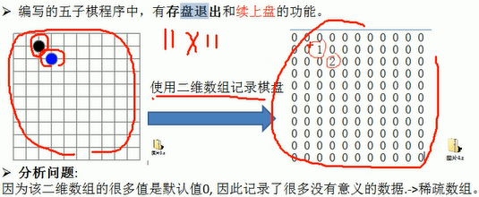

**稀疏数组概念：**

* 记录数组一共有几行几列，有多少个不同的值。
* 把具有不同值的元素的行列及值记录在一个小规模的数组中，从而缩小程序的规模。


**普通二维数组**

```java
public class Main1 {
    public static void main(String[] args) {
        int arr[][] = new int[11][11];
        arr[1][2] = 1;
        arr[2][4] = 2;
        for (int[] row:arr){
            System.out.println(Arrays.toString(row));
        }
    }
}
```


**稀疏数组**

> 第一行记录的是原始数组有多少行、多少列、有效值多少个

```java
public class Main1 {
    public static void main(String[] args) {
        
        //定义一个普通二维数组
        int arr[][] = new int[11][11];
        arr[1][2] = 1;
        arr[2][4] = 2;
        for (int[] row:arr){
            System.out.println(Arrays.toString(row));
        }
        
        //构建稀疏矩阵，压缩二维数组
        //1. 计算有效值
        int sum = 0;
        for (int[] row:arr){
            for (int element:row){
                if (element!=0)
                    sum++;
            }
        }
        
        //2. 构建稀疏矩阵
        int new_arr_index = 0;
        int new_arr[][] = new int[sum+1][3];
        
        //3. 第一行为原二维数组描述
        new_arr[new_arr_index][0] = 11;
        new_arr[new_arr_index][1] = 11;
        new_arr[new_arr_index][2] = sum;
        new_arr_index++;
        
        //4. 后几行为原来二维数组的有效值信息
        for (int i = 0; i < arr.length; i++) {
            for (int j = 0; j < arr[0].length; j++) {
                if(arr[i][j]!=0){
                    new_arr[new_arr_index][0] = i;//在第i行
                    new_arr[new_arr_index][1] = j;//在第j列
                    new_arr[new_arr_index][2] = arr[i][j];//有一个有效值arr[i][j]
                    new_arr_index++;
                }
            }
        }
        
        //5. 稀疏数组输出
        System.out.println("------------------------");
        for (int[] row : new_arr) {
            System.out.println(Arrays.toString(row));
        }
    }
}
```


**稀疏数组恢复为原数组**

```java
public class Main1 {
    public static void main(String[] args) {
        //定义一个普通二维数组
        int arr[][] = new int[11][11];
        arr[1][2] = 1;
        arr[2][4] = 2;
        for (int[] row:arr){
            System.out.println(Arrays.toString(row));
        }
        
        //构建稀疏矩阵，压缩二维数组
        //1. 计算有效值
        int sum = 0;
        for (int[] row:arr){
            for (int element:row){
                if (element!=0)
                    sum++;
            }
        }
        
        //2. 构建稀疏矩阵
        int new_arr_index = 0;
        int new_arr[][] = new int[sum+1][3];
        
        //3. 第一行为原二维数组描述
        new_arr[new_arr_index][0] = 11;
        new_arr[new_arr_index][1] = 11;
        new_arr[new_arr_index][2] = sum;
        new_arr_index++;
        
        //4. 后几行为原来二维数组的有效值信息
        for (int i = 0; i < arr.length; i++) {
            for (int j = 0; j < arr[0].length; j++) {
                if(arr[i][j]!=0){
                    new_arr[new_arr_index][0] = i;//在第i行
                    new_arr[new_arr_index][1] = j;//在第j列
                    new_arr[new_arr_index][2] = arr[i][j];//有一个有效值arr[i][j]
                    new_arr_index++;
                }
            }
        }
        
        //5. 稀疏数组输出
        System.out.println("------------------------");
        for (int[] row : new_arr) {
            System.out.println(Arrays.toString(row));
        }
        
        
        //稀疏数组恢复原始数组
        //1. 构建原始数组
        int former_arr[][] = new int[sparse_arr[0][0]][sparse_arr[0][1]];
        //2. 遍历值回填
        for (int i = 1; i < sparse_arr.length; i++) {
            former_arr[sparse_arr[i][0]][sparse_arr[i][1]] = sparse_arr[i][2];
        }
        //3. 原始数组输出
        System.out.println("------------------------");
        for (int[] row:former_arr) {
            System.out.println(Arrays.toString(row));
        }
    }
}
```


### 队列

具有后继节点的链式数据结构

> 先进先出


#### 数组实现队列


使用两个指针：

* 头指针：初始为-1，数据入队时不变，数据出队时先移动，后返回数据。
* 尾指针：初始为-1，数据入队时先移动，后加入数据，数据出队时不变。

```java
public class Main2 {
    public static void main(String[] args) {
        ArrayQueue queue = new ArrayQueue(3);
        queue.addQueue(4);
        queue.addQueue(5);
        queue.addQueue(6);
        System.out.println("队列是否已满:"+queue.isFull());
        System.out.println("队列是否为空:"+queue.isEmpty());
        queue.showQueue();
        System.out.println("队列的头一个元素："+queue.headQueue());
        System.out.println("从队列取一个元素："+queue.getQueue());
        System.out.println("队列的头一个元素："+queue.getQueue());
    }
}

//队列
class ArrayQueue {
    private int maxSize; //数组容量
    private int front; //队列头
    private int rear; //队列尾
    private int[] arr; //队列

    //初始化队列
    public ArrayQueue(int maxSize) {
        this.maxSize = maxSize;
        arr = new int[maxSize];
        front = -1;//指向队列头部，是队列元素的前一个位置
        rear = -1;//指向队列尾部，是队列元素的后一个位置
    }

    //判断队列是否满
    public boolean isFull() {
        return rear == maxSize - 1;
    }

    //判断队列是否为空
    public boolean isEmpty() {
        return rear == front;
    }

    //添加输入到队列
    public void addQueue(int n) {
        if (isFull()) {
            System.out.println("队列已满！");
            return;
        }
        rear++;//移动尾指针
        arr[rear] = n;
    }

    //出队列
    public int getQueue() {
        if (isEmpty()) {
            System.out.println("队列为空！");
            throw new RuntimeException("队列为空！");
        }
        front++;//移动头指针
        return arr[front];
    }

    //显示队列所有数据
    public void showQueue() {
        if (isEmpty()) {
            System.out.println("队列为空！");
            return;
        }
        for (int i = 0; i < arr.length; i++) {
            System.out.printf("arr[%d]=%d\n", i, arr[i]);
        }
    }

    //显示队列的头数据
    public int headQueue() {
        if (isEmpty()){
            System.out.println("队列为空！");
            throw new RuntimeException("队列为空！");
        }
        return arr[front+1];
    }
}
```


**数组实现环形队列**

数组的头指针可以在任意的位置，同时因为是环形，所以可以允许尾指针出现在头指针的前面。

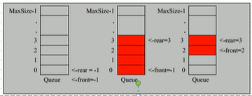


使用`%`符号使得数组角标可以循环。

```java
public class Main3 {
    public static void main(String[] args) {
        CircleQueue queue = new CircleQueue(4);
        queue.addQueue(1);
        queue.addQueue(2);
        queue.addQueue(3);
        queue.showQueue();
        System.out.println("获取队列的第一个元素"+queue.getQueue());
        queue.addQueue(4);
        System.out.println("显示队列的第一个元素"+queue.headQueue());
        queue.showQueue();
    }
}

//环形队列
class CircleQueue{
    private int maxSize;
    private int front;//指向队列的第一个元素
    private int rear;//指向队列的最后一个元素的后一个位置（空的位置是为了判断队列是否为空使用）
    private int[] arr;

    //初始化环形队列
    public CircleQueue(int maxSize){
        this.maxSize = maxSize;
        arr = new int[maxSize];
    }

    //是否已满
    public boolean isFull(){
        return (rear+1)%maxSize==front;
    }

    //是否为空
    public boolean isEmpty(){
        return rear == front;
    }

    //取出数据
    public void addQueue(int n){
        if (isFull()) {
            System.out.println("队列已满！");
            return;
        }
        arr[rear] = n;
        rear = (rear+1) % maxSize;
    }

    //存入数据
    public int getQueue(){
        if (isEmpty()) {
            System.out.println("队列为空！");
            throw new RuntimeException("队列为空！");
        }
        int value = arr[front];
        front = (front+1)%maxSize;
        return value;
    }

    //显示队列的所有数据
    public void showQueue(){
        if (isEmpty()) {
            System.out.println("队列为空！");
            throw new RuntimeException("队列为空！");
        }
        for (int i = front; i< front+size();i++){
            System.out.printf("arr[%d]=%d\n",i%maxSize,arr[i%maxSize]);
        }
    }

    //当前队列重点有效数组
    public int size(){
        return (rear+maxSize-front)%maxSize;
    }

    public int headQueue(){
        if (isEmpty()) {
            System.out.println("队列为空！");
            throw new RuntimeException("队列为空！");
        }
        return arr[front];
    }
}
```


### ArrayList扩容机制


## 链表

元素拥有一个指向下一个元素的指针


#### 单链表


```java
public class Main4 {
    public static void main(String[] args) {
        Node node1 = new Node("1");
        Node node2 = new Node("2");
        Node node3 = new Node("3");
        Node node4 = new Node("4");

        SingleLinkedList singleLinkedList = new SingleLinkedList();
        singleLinkedList.add(node1);
        singleLinkedList.add(node2);
        singleLinkedList.add(node3);
        singleLinkedList.add(node4);
        singleLinkedList.list();

        singleLinkedList.insert(new Node("4"));
        singleLinkedList.insert(new Node("9"));
        singleLinkedList.insert(new Node("7"));
        singleLinkedList.list();

        singleLinkedList.delete("7");
        singleLinkedList.delete("8");
        singleLinkedList.list();
    }
}

class SingleLinkedList {
    private Node head = new Node("");

    //添加元素到链表
    public void add(Node node) {
        Node temp = head;
        while (true) {
            if (temp.next == null) {
                break;
            }
            temp = temp.next;
        }
        temp.next = node;
    }

    //显示链表
    public void list() {
        if (head.next==null){
            System.out.println("链表为空！");
        }
        Node temp = head.next;
        while (true){
            if (temp==null){
                break;
            }
            System.out.println(temp);
            temp = temp.next;
        }
    }

    //将元素插入到链表的指定位置
    public void insert(Node node){
        Node temp = head;
        boolean flag = false;
        while (true){
            if (temp.next == null){
                break;
            }
            if (Integer.parseInt(temp.next.val)>Integer.parseInt(node.val)){
                break;
            }else if (Integer.parseInt(temp.next.val) == Integer.parseInt(node.val)){
                flag = true;
                break;
            }
            temp = temp.next;
        }
        if (flag){
            System.out.println("元素"+node.val+"已存在");
        }else {
            node.next = temp.next;
            temp.next = node;
        }
    }

    public void delete(String val){
        Node temp = head;
        boolean flag = false;
        while (true){
            if (temp.next==null){
                break;
            }
            if (temp.next.val.equals(val)){
                flag = true;
                break;
            }
            temp = temp.next;
        }
        if (flag){
            temp.next = temp.next.next;
        }else {
            System.out.println("找不到要删除的节点！");
        }
    }
}

class Node {
    public String val;
    public Node next;

    public Node(String val) {
        this.val = val;
    }

    @Override
    public String toString() {
        return "Node[val=" + val + "]";
    }
}
```


##### 获取单链表的节点个数

计算链表中的节点个数，不包含头节点。

```java
public class Main4 {
    public static void main(String[] args) {
        Node node1 = new Node("1");
        Node node2 = new Node("2");
        Node node3 = new Node("3");
        Node node4 = new Node("4");

        SingleLinkedList singleLinkedList = new SingleLinkedList();
        singleLinkedList.add(node1);
        singleLinkedList.add(node2);
        singleLinkedList.add(node3);
        singleLinkedList.add(node4);
        singleLinkedList.list();

        singleLinkedList.insert(new Node("4"));
        singleLinkedList.insert(new Node("9"));
        singleLinkedList.insert(new Node("7"));
        singleLinkedList.list();

        singleLinkedList.delete("7");
        singleLinkedList.delete("8");
        singleLinkedList.list();

        System.out.println("链表的长度"+getLength(singleLinkedList.getHead()));
    }

    /**
     * 获取链表的长度
     * @param head
     * @return
     */
    public static int getLength(Node head) {
        if (head.next == null) {
            return 0;
        }
        int length = 0;
        Node cur = head.next;
        while (cur!=null){
            length++;
            cur = cur.next;
        }
        return length;
    }
}

class SingleLinkedList {
    private Node head = new Node("");

    public Node getHead() {
        return head;
    }

    //添加元素到链表
    public void add(Node node) {
        Node temp = head;
        while (true) {
            if (temp.next == null) {
                break;
            }
            temp = temp.next;
        }
        temp.next = node;
    }

    //显示链表
    public void list() {
        if (head.next == null) {
            System.out.println("链表为空！");
        }
        Node temp = head.next;
        while (true) {
            if (temp == null) {
                break;
            }
            System.out.println(temp);
            temp = temp.next;
        }
    }

    //将元素插入到链表的指定位置
    public void insert(Node node) {
        Node temp = head;
        boolean flag = false;
        while (true) {
            if (temp.next == null) {
                break;
            }
            if (Integer.parseInt(temp.next.val) > Integer.parseInt(node.val)) {
                break;
            } else if (Integer.parseInt(temp.next.val) == Integer.parseInt(node.val)) {
                flag = true;
                break;
            }
            temp = temp.next;
        }
        if (flag) {
            System.out.println("元素" + node.val + "已存在");
        } else {
            node.next = temp.next;
            temp.next = node;
        }
    }

    public void delete(String val) {
        Node temp = head;
        boolean flag = false;
        while (true) {
            if (temp.next == null) {
                break;
            }
            if (temp.next.val.equals(val)) {
                flag = true;
                break;
            }
            temp = temp.next;
        }
        if (flag) {
            temp.next = temp.next.next;
        } else {
            System.out.println("找不到要删除的节点！");
        }
    }
}

class Node {
    public String val;
    public Node next;

    public Node(String val) {
        this.val = val;
    }

    @Override
    public String toString() {
        return "Node[val=" + val + "]";
    }
}
```


##### 获取单链表中倒数第五个节点

将长度减去倒数值得到正序下的元素位置，然后从头节点可以遍历找到。

```java
public class Main4 {
    public static void main(String[] args) {
        Node node1 = new Node("1");
        Node node2 = new Node("2");
        Node node3 = new Node("3");
        Node node4 = new Node("4");

        SingleLinkedList singleLinkedList = new SingleLinkedList();
        singleLinkedList.add(node1);
        singleLinkedList.add(node2);
        singleLinkedList.add(node3);
        singleLinkedList.add(node4);
        singleLinkedList.list();

        singleLinkedList.insert(new Node("4"));
        singleLinkedList.insert(new Node("9"));
        singleLinkedList.insert(new Node("7"));
        singleLinkedList.list();

        singleLinkedList.delete("7");
        singleLinkedList.delete("8");
        singleLinkedList.list();

        System.out.println("链表的长度"+getLength(singleLinkedList.getHead()));
        System.out.println("链表中倒数第2个元素："+findLastIndexNode(singleLinkedList.getHead(), 2));
    }

    /**
     * 获取链表的长度
     * @param head
     * @return
     */
    public static int getLength(Node head) {
        if (head.next == null) {
            return 0;
        }
        int length = 0;
        Node cur = head.next;
        while (cur!=null){
            length++;
            cur = cur.next;
        }
        return length;
    }

    /**
     * 获取链表倒数第index个元素
     * @param head
     * @param index
     * @return
     */
    public static Node findLastIndexNode(Node head, int index){
        if (head.next==null){
            return null;
        }
        int size = getLength(head);
        if (index<=0||index>size){
            return null;
        }
        Node temp = head.next;
        for (int i = 0; i < size-index; i++) {
            temp = temp.next;
        }
        return temp;
    }
}

class SingleLinkedList {
    private Node head = new Node("");

    public Node getHead() {
        return head;
    }

    //添加元素到链表
    public void add(Node node) {
        Node temp = head;
        while (true) {
            if (temp.next == null) {
                break;
            }
            temp = temp.next;
        }
        temp.next = node;
    }

    //显示链表
    public void list() {
        if (head.next == null) {
            System.out.println("链表为空！");
        }
        Node temp = head.next;
        while (true) {
            if (temp == null) {
                break;
            }
            System.out.println(temp);
            temp = temp.next;
        }
    }

    //将元素插入到链表的指定位置
    public void insert(Node node) {
        Node temp = head;
        boolean flag = false;
        while (true) {
            if (temp.next == null) {
                break;
            }
            if (Integer.parseInt(temp.next.val) > Integer.parseInt(node.val)) {
                break;
            } else if (Integer.parseInt(temp.next.val) == Integer.parseInt(node.val)) {
                flag = true;
                break;
            }
            temp = temp.next;
        }
        if (flag) {
            System.out.println("元素" + node.val + "已存在");
        } else {
            node.next = temp.next;
            temp.next = node;
        }
    }

    public void delete(String val) {
        Node temp = head;
        boolean flag = false;
        while (true) {
            if (temp.next == null) {
                break;
            }
            if (temp.next.val.equals(val)) {
                flag = true;
                break;
            }
            temp = temp.next;
        }
        if (flag) {
            temp.next = temp.next.next;
        } else {
            System.out.println("找不到要删除的节点！");
        }
    }
}

class Node {
    public String val;
    public Node next;

    public Node(String val) {
        this.val = val;
    }

    @Override
    public String toString() {
        return "Node[val=" + val + "]";
    }
}
```


##### 单链表的反转

遍历链表，将取到的每一个元素都作为新链表的头部。叠加到最后就是一个反转过来的链表。

```java
public class Main4 {
    public static void main(String[] args) {
        Node node1 = new Node("1");
        Node node2 = new Node("2");
        Node node3 = new Node("3");
        Node node4 = new Node("4");

        SingleLinkedList singleLinkedList = new SingleLinkedList();
        singleLinkedList.add(node1);
        singleLinkedList.add(node2);
        singleLinkedList.add(node3);
        singleLinkedList.add(node4);
        singleLinkedList.list();

        singleLinkedList.insert(new Node("4"));
        singleLinkedList.insert(new Node("9"));
        singleLinkedList.insert(new Node("7"));
        singleLinkedList.list();

        singleLinkedList.delete("7");
        singleLinkedList.delete("8");
        singleLinkedList.list();

        System.out.println("链表的长度"+getLength(singleLinkedList.getHead()));
        System.out.println("链表中倒数第2个元素："+findLastIndexNode(singleLinkedList.getHead(), 2));
        reverseList(singleLinkedList.getHead());
        singleLinkedList.list();
    }

    /**
     * 获取链表的长度
     * @param head
     * @return
     */
    public static int getLength(Node head) {
        if (head.next == null) {
            return 0;
        }
        int length = 0;
        Node cur = head.next;
        while (cur!=null){
            length++;
            cur = cur.next;
        }
        return length;
    }

    /**
     * 获取链表倒数第index个元素
     * @param head
     * @param index
     * @return
     */
    public static Node findLastIndexNode(Node head, int index){
        if (head.next==null){
            return null;
        }
        int size = getLength(head);
        if (index<=0||index>size){
            return null;
        }
        Node temp = head.next;
        for (int i = 0; i < size-index; i++) {
            temp = temp.next;
        }
        return temp;
    }

    /**
     * 反转链表
     * @param head
     */
    public static void reverseList(Node head){
        if (head.next==null||head.next.next==null){
            return;
        }
        Node temp = head.next;
        Node next = null;
        Node reverseHead = new Node("");
        while (temp!=null){
            next = temp.next;
            temp.next = reverseHead.next;
            reverseHead.next = temp;
            temp = next;
        }
        head.next = reverseHead.next;
    }
}

class SingleLinkedList {
    private Node head = new Node("");

    public Node getHead() {
        return head;
    }

    //添加元素到链表
    public void add(Node node) {
        Node temp = head;
        while (true) {
            if (temp.next == null) {
                break;
            }
            temp = temp.next;
        }
        temp.next = node;
    }

    //显示链表
    public void list() {
        if (head.next == null) {
            System.out.println("链表为空！");
        }
        Node temp = head.next;
        while (true) {
            if (temp == null) {
                break;
            }
            System.out.println(temp);
            temp = temp.next;
        }
    }

    //将元素插入到链表的指定位置
    public void insert(Node node) {
        Node temp = head;
        boolean flag = false;
        while (true) {
            if (temp.next == null) {
                break;
            }
            if (Integer.parseInt(temp.next.val) > Integer.parseInt(node.val)) {
                break;
            } else if (Integer.parseInt(temp.next.val) == Integer.parseInt(node.val)) {
                flag = true;
                break;
            }
            temp = temp.next;
        }
        if (flag) {
            System.out.println("元素" + node.val + "已存在");
        } else {
            node.next = temp.next;
            temp.next = node;
        }
    }

    public void delete(String val) {
        Node temp = head;
        boolean flag = false;
        while (true) {
            if (temp.next == null) {
                break;
            }
            if (temp.next.val.equals(val)) {
                flag = true;
                break;
            }
            temp = temp.next;
        }
        if (flag) {
            temp.next = temp.next.next;
        } else {
            System.out.println("找不到要删除的节点！");
        }
    }
}

class Node {
    public String val;
    public Node next;

    public Node(String val) {
        this.val = val;
    }

    @Override
    public String toString() {
        return "Node[val=" + val + "]";
    }
}
```


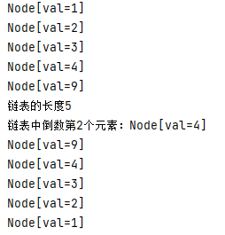

##### 反向打印链表

使用反转会破坏原来的链表结构，所以借用Java的栈API的先进后出特性来实现。

```java
public class Main4 {
    public static void main(String[] args) {
        Node node1 = new Node("1");
        Node node2 = new Node("2");
        Node node3 = new Node("3");
        Node node4 = new Node("4");

        SingleLinkedList singleLinkedList = new SingleLinkedList();
        singleLinkedList.add(node1);
        singleLinkedList.add(node2);
        singleLinkedList.add(node3);
        singleLinkedList.add(node4);
        singleLinkedList.list();

        singleLinkedList.insert(new Node("4"));
        singleLinkedList.insert(new Node("9"));
        singleLinkedList.insert(new Node("7"));
        singleLinkedList.list();

        singleLinkedList.delete("7");
        singleLinkedList.delete("8");
        singleLinkedList.list();

        System.out.println("链表的长度"+getLength(singleLinkedList.getHead()));
        System.out.println("链表中倒数第2个元素："+findLastIndexNode(singleLinkedList.getHead(), 2));
//        reverseList(singleLinkedList.getHead());
        singleLinkedList.list();
        System.out.println("反序打印");
        reversePrint(singleLinkedList.getHead());
        System.out.println("查看原链表");
        singleLinkedList.list();
    }

    /**
     * 获取链表的长度
     * @param head
     * @return
     */
    public static int getLength(Node head) {
        if (head.next == null) {
            return 0;
        }
        int length = 0;
        Node cur = head.next;
        while (cur!=null){
            length++;
            cur = cur.next;
        }
        return length;
    }

    /**
     * 获取链表倒数第index个元素
     * @param head
     * @param index
     * @return
     */
    public static Node findLastIndexNode(Node head, int index){
        if (head.next==null){
            return null;
        }
        int size = getLength(head);
        if (index<=0||index>size){
            return null;
        }
        Node temp = head.next;
        for (int i = 0; i < size-index; i++) {
            temp = temp.next;
        }
        return temp;
    }

    /**
     * 反转链表
     * @param head
     */
    public static void reverseList(Node head){
        if (head.next==null||head.next.next==null){
            return;
        }
        Node temp = head.next;
        Node next = null;
        Node reverseHead = new Node("");
        while (temp!=null){
            next = temp.next;
            temp.next = reverseHead.next;
            reverseHead.next = temp;
            temp = next;
        }
        head.next = reverseHead.next;
    }

    /**
     * 反向打印链表
     * @param head
     */
    public static void reversePrint(Node head){
        if (head.next==null){
            return;
        }
        Stack<Node> stack = new Stack<>();
        Node temp = head.next;
        while (temp!=null){
            stack.push(temp);
            temp = temp.next;
        }
        while (stack.size()>0){
            System.out.println(stack.pop());
        }
    }
}

class SingleLinkedList {
    private Node head = new Node("");

    public Node getHead() {
        return head;
    }

    //添加元素到链表
    public void add(Node node) {
        Node temp = head;
        while (true) {
            if (temp.next == null) {
                break;
            }
            temp = temp.next;
        }
        temp.next = node;
    }

    //显示链表
    public void list() {
        if (head.next == null) {
            System.out.println("链表为空！");
        }
        Node temp = head.next;
        while (true) {
            if (temp == null) {
                break;
            }
            System.out.println(temp);
            temp = temp.next;
        }
    }

    //将元素插入到链表的指定位置
    public void insert(Node node) {
        Node temp = head;
        boolean flag = false;
        while (true) {
            if (temp.next == null) {
                break;
            }
            if (Integer.parseInt(temp.next.val) > Integer.parseInt(node.val)) {
                break;
            } else if (Integer.parseInt(temp.next.val) == Integer.parseInt(node.val)) {
                flag = true;
                break;
            }
            temp = temp.next;
        }
        if (flag) {
            System.out.println("元素" + node.val + "已存在");
        } else {
            node.next = temp.next;
            temp.next = node;
        }
    }

    public void delete(String val) {
        Node temp = head;
        boolean flag = false;
        while (true) {
            if (temp.next == null) {
                break;
            }
            if (temp.next.val.equals(val)) {
                flag = true;
                break;
            }
            temp = temp.next;
        }
        if (flag) {
            temp.next = temp.next.next;
        } else {
            System.out.println("找不到要删除的节点！");
        }
    }
}

class Node {
    public String val;
    public Node next;

    public Node(String val) {
        this.val = val;
    }

    @Override
    public String toString() {
        return "Node[val=" + val + "]";
    }
}
```


##### 判断链表是否形成环


> 使用快慢指针来实现

* 快指针：一次走两步
* 慢指针：一次走一步

```
（假设有两个运动员在操场上跑步，一个速度慢，一个速度快。那在不限定圈次情况下，速度快的会在某一个特点时间点超过速度慢的运动员）
因为两个指针的步伐不一样：
1. 如果链表存在环，则快慢两个指针最终会相遇
2. 如果链表不存在环，则快指针会先一步到达null
```

###### 因为这种通常考察双指针使用，如果你使用hash表也可以实现，但会在效率方面体现非常低

```java
public class Solution {
    public boolean hasCycle(ListNode head) {
        ListNode fast = head;//快指针
        ListNode slow = head;//慢指针
        while(fast!=null && fast.next!=null){
            fast = fast.next.next;//快指针一次走两步
            slow = slow.next;//慢指针一次走一步
            if(fast==slow){//能相遇表示存在环
                return true;
            }
        }
        return false;//最终fast遍历到null则表示没有环
    }
}
```


##### 判断带环链表的环入口

> 也是利用前面讲的检测链表带环的拓展：如果链表带环，则使用快慢指针最终两个指针会相遇。

```
快指针一次走两步，慢指针一次走一步。则可以看作当慢指针走一圈时，快指针已经走了两圈。

使用快慢指针，可以判断链表是否有环，当确定是有环时，再起一个指针，从起点出发，步长与慢指针一致，当该指针与慢指针指向同一个节点的时候，该节点就是环的入口节点。
```

```java
public class Solution {

    public ListNode EntryNodeOfLoop(ListNode pHead) {
        ListNode fast = pHead;
        ListNode slow = pHead;
        
        //第一次循环找到快慢指针汇合点
        while(fast!=null && fast.next!=null){
            fast = fast.next.next;
            slow = slow.next;
            if(fast==slow)
                break;
        }
        //如果链表不构成环则返回null
        if(fast==null||fast.next==null)
            return null;
        
        //构成环的情况下，起一个从头节点开始的慢指针，和现在位置的慢指针一并循环，如果能相遇，则相遇的位置就是环的入口
        fast = pHead;
        while(fast!=slow){
            fast = fast.next;
            slow = slow.next;
        }
        return fast;
    }
}
```


### 双向链表

链表元素除了拥有之前的指向后面元素的指针，还增加了指向前面元素的指针。


```java
public class Main5 {
    public static void main(String[] args) {
        DoubleLinkedList doubleLinkedList = new DoubleLinkedList();
        DoubleNode node1 = new DoubleNode("1");
        DoubleNode node2 = new DoubleNode("2");
        DoubleNode node3 = new DoubleNode("3");
        DoubleNode node4 = new DoubleNode("4");
        System.out.println("输出链表：");
        doubleLinkedList.addLast(node1);
        doubleLinkedList.addLast(node2);
        doubleLinkedList.addLast(node3);
        doubleLinkedList.addLast(node4);
        doubleLinkedList.list();
        System.out.println("删除链表中的一个元素：");
        doubleLinkedList.delete("3");
        doubleLinkedList.list();
    }
}
class DoubleLinkedList{
    private DoubleNode head = new DoubleNode("");

    public DoubleNode getHead() {
        return head;
    }

    //显示链表
    public void list() {
        if (head.next == null) {
            System.out.println("链表为空！");
        }
        DoubleNode temp = head.next;
        while (true) {
            if (temp == null) {
                break;
            }
            System.out.println(temp);
            temp = temp.next;
        }
    }

    //添加元素到链表尾部
    public void addLast(DoubleNode node) {
        DoubleNode temp = head;
        while (true) {
            if (temp.next == null) {
                break;
            }
            temp = temp.next;
        }
        temp.next = node;
        node.prev = temp;
    }

    //删除节点
    public void delete(String val) {
        if (head.next==null){
            System.out.println("链表为空！");
        }
        DoubleNode temp = head.next;
        boolean flag = false;
        while (true) {
            if (temp == null) {
                break;
            }
            if (temp.val.equals(val)) {
                flag = true;
                break;
            }
            temp = temp.next;
        }
        if (flag) {
            if (temp.prev!=null)
                temp.prev.next = temp.next;
            if (temp.next!=null)
                temp.next.prev = temp.prev;
        } else {
            System.out.println("找不到要删除的节点！");
        }
    }
}
class DoubleNode{
    public String val;
    public DoubleNode next;
    public DoubleNode prev;


    public DoubleNode(String val) {
        this.val = val;
    }

    @Override
    public String toString() {
        return "DoubleNode{" +
                "val='" + val + '\'' +
                '}';
    }
}
```


### 单向环形链表

单链表的环形结构，可以解决约瑟夫问题。

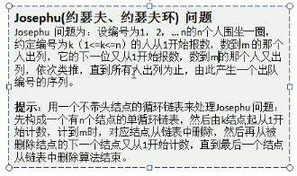


删除一个之后，是从被删除的下一个元素开始继续进行数。


#### 约瑟夫问题

```java
public class Main6 {
    public static void main(String[] args) {
        CircleSingleLinkedList circleSingleLinkedList = new CircleSingleLinkedList(125);
        circleSingleLinkedList.showCircle();
        circleSingleLinkedList.countNode(10, 20, 125);
    }
}

class CircleSingleLinkedList {
    private JosephNode first = null;

    public CircleSingleLinkedList(int nums) {
        if (nums < 1) {
            System.out.println("数字无效！");
        }
        JosephNode temp = null;
        for (int i = 1; i <= nums; i++) {
            JosephNode josephNode = new JosephNode("" + i);
            if (i == 1) {//自成环
                first = josephNode;
                first.setNext(first);
                temp = first;
            } else {//和新节点成环，temp最后指向新节点，保证有序
                temp.setNext(josephNode);
                josephNode.setNext(first);
                temp = josephNode;
            }
        }
    }

    public void showCircle() {
        if (first.getNext() == null) {
            System.out.println("环链表为空！");
            return;
        }
        JosephNode temp = first;
        while (true) {
            System.out.println(temp);
            if (temp.getNext() == first) {
                break;
            }
            temp = temp.getNext();
        }
    }

    /**
     * 约瑟夫出列问题
     * @param startNo 开始节点位置
     * @param countNum 数数次数
     * @param nums 总共节点的个数
     */
    public void countNode(int startNo, int countNum, int nums) {
        if (first == null || startNo < 1 || startNo > nums) {
            System.out.println("参数有误！");
            return;
        }
        JosephNode temp = first;
        //先将指针移动到first的前一位
        while (true) {
            if (temp.getNext() == first) {
                break;
            }
            temp = temp.getNext();
        }
        //first移动到要开始的位置，temp则是在其前一位（第1位移动到第8位则需要移动7位）
        for (int i = 0; i < startNo - 1; i++) {
            first = first.getNext();
            temp = temp.getNext();
        }
        //开始出列
        while (true){
            if (temp == first)//此时指针重合，则只剩下一个节点
                break;
            for (int i = 0; i < countNum - 1; i++) {
                first = first.getNext();
                temp = temp.getNext();
            }
            //移动好后，first的位置就是要出列的元素(first先走到下一个，然后temp给连上)
            System.out.println("出列元素："+first);
            first = first.getNext();
            temp.setNext(first);
        }
        System.out.println("最后剩余的一个节点："+temp);
    }
}

class JosephNode {
    private String val;
    private JosephNode next;

    public JosephNode(String val) {
        this.val = val;
    }

    public String getVal() {
        return val;
    }

    public void setVal(String val) {
        this.val = val;
    }

    public JosephNode getNext() {
        return next;
    }

    public void setNext(JosephNode next) {
        this.next = next;
    }

    @Override
    public String toString() {
        return "JosephNode{" +
                "val='" + val + '\'' +
                '}';
    }
}
```


## 栈

先进后出，处理表达式（逆波兰表达式）。


```java
public class Main7 {
    public static void main(String[] args) {
        ArrayStack stack = new ArrayStack(10);
        stack.push(1);
        stack.push(2);
        stack.push(3);
        stack.push(4);
        stack.push(5);
        stack.push(6);
        stack.push(7);
        stack.push(8);
        stack.list();
        System.out.println("弹出栈顶元素："+stack.pop());
        stack.list();
    }
}

class ArrayStack{
    private int maxSize;    //栈大小
    private int[] stack;    //模拟栈
    private int top = -1;   //栈顶

    //初始化栈
    public ArrayStack(int maxSize) {
        this.maxSize = maxSize;
        stack = new int[maxSize];
    }

    //判断栈是否已满
    public boolean isFull(){
        return top == maxSize -1;
    }

    //判断栈是否为空
    public boolean isEmpty(){
        return top == -1;
    }

    //将数据压入栈
    public void push(int val){
        if (isFull()){
            System.out.println("栈已满！");
            return;
        }
        top++;
        stack[top] = val;
    }

    //将数据弹出栈
    public int pop(){
        if (isEmpty()){
            System.out.println("栈为空！");
            throw new RuntimeException("栈为空！");
        }
        int val = stack[top];
        top--;
        return val;
    }

    //遍历栈，从栈顶到栈底
    public void list(){
        if (isEmpty()){
            System.out.println("栈为空！");
            return;
        }
        for (int i = top; i >=0 ; i--) {
            System.out.printf("stack[%d]=%d\n",i,stack[i]);
        }
    }
}
```


### 中缀表达式

利用两个栈一个存数字一个存符号，来进行判断。


先算乘除后算加减，所以`×`=`÷`>`+`=`-`。

```java
public class Main8 {
    public static void main(String[] args) {
        String expression = "30+2*6-2";
        CountStack numStack = new CountStack(10);
        CountStack operStack = new CountStack(10);
        //将字符数组的内容按照数值和运算符号分别入栈
        char[] chars = expression.toCharArray();
        int num1 = 0; //临时运算值1
        int num2 = 0; //临时运算值2
        int oper = 0; //运算符
        int res = 0;  //运算结果
        String keepNum = "";//拼接多位数
        for (int i = 0; i < chars.length; i++) {
            char c = chars[i];
            //符号栈处理
            if (operStack.isOper(c)) {
                if (!operStack.isEmpty()) {//如果当前符号小于栈顶符号时，就先旧值弹出计算，算完再全部入栈
                    if (operStack.priority(c) <= operStack.priority(operStack.peek())) {
                        num1 = numStack.pop();
                        num2 = numStack.pop();
                        oper = operStack.pop();
                        res = numStack.cal(num1, num2, oper);
                        numStack.push(res);
                        operStack.push(c);
                    } else {//当前符号优先级大于栈顶，则直接入栈
                        operStack.push(c);
                    }
                } else {//符号栈为空也是直接入栈
                    operStack.push(c);
                }
            } else {//数字则如数字栈，字符转数值-48
                //numStack.push(Integer.valueOf(""+c));
                //这里写这门多是为了实现多位数的运算准确
                keepNum+=c;
                if (i==chars.length-1){
                    numStack.push(Integer.valueOf(keepNum));
                }else {
                    if (numStack.isOper(chars[i+1])){
                        numStack.push(Integer.valueOf(keepNum));
                        keepNum="";
                    }
                }


            }
        }
        //计算两个栈中的数据
        while (true) {
            if (operStack.isEmpty())
                break;
            num1 = numStack.pop();
            num2 = numStack.pop();
            oper = operStack.pop();
            res = numStack.cal(num1, num2, oper);
            numStack.push(res);
        }
        System.out.println("[" + expression + "]计算的结果：" + numStack.pop());
    }
}

class CountStack {
    private int maxSize;    //栈大小
    private int[] stack;    //模拟栈
    private int top = -1;   //栈顶

    //初始化栈
    public CountStack(int maxSize) {
        this.maxSize = maxSize;
        stack = new int[maxSize];
    }

    //判断栈是否已满
    public boolean isFull() {
        return top == maxSize - 1;
    }

    //判断栈是否为空
    public boolean isEmpty() {
        return top == -1;
    }

    //将数据压入栈
    public void push(int val) {
        if (isFull()) {
            System.out.println("栈已满！");
            return;
        }
        top++;
        stack[top] = val;
    }

    //将数据弹出栈
    public int pop() {
        if (isEmpty()) {
            System.out.println("栈为空！");
            throw new RuntimeException("栈为空！");
        }
        int val = stack[top];
        top--;
        return val;
    }

    //显示栈顶元素
    public int peek() {
        return stack[top];
    }

    //遍历栈，从栈顶到栈底
    public void list() {
        if (isEmpty()) {
            System.out.println("栈为空！");
            return;
        }
        for (int i = top; i >= 0; i--) {
            System.out.printf("stack[%d]=%d\n", i, stack[i]);
        }
    }

    //判断运算符的优先级
    public int priority(int oper) {
        if (oper == '*' || oper == '/') {
            return 1;
        } else if (oper == '+' || oper == '-') {
            return 0;
        } else {
            return -1;
        }
    }

    //判断字符是否为运算符
    public boolean isOper(char val) {
        return val == '+' || val == '-' || val == '*' || val == '/';
    }

    public int cal(int num1, int num2, int oper) {
        int res = 0;//res用于存放计算的结构
        switch (oper) {
            case '+':
                res = num1 + num2;
                break;
            case '-':
                res = num2 - num1;
                break;
            case '*':
                res = num1 * num2;
                break;
            case '/':
                res = num2 / num1;
                break;
        }
        return res;
    }
}
```


### 前缀表达式（波兰表达式）


### 后缀表达式（逆波兰）


#### 逆波兰表达式计算

```java
public class Main9 {
    public static void main(String[] args) {
        String suffixExpression = "3 4 + 5 * 6 -";
        List<String> list = getListString(suffixExpression);
        System.out.println(list);
        System.out.println("[" + suffixExpression + "]的计算结果：" + calculate(list));
    }

    public static List<String> getListString(String suffixExpression) {
        String[] split = suffixExpression.split(" ");
        List<String> list = new ArrayList<>();
        for (String element : split) {
            list.add(element);
        }
        return list;
    }

    /**
     * 逆波兰表达式计算
     *
     * @return
     */
    public static int calculate(List<String> list) {
        Stack<String> stack = new Stack<>();
        for (String element : list) {
            if (element.matches("\\d+")) {
                stack.push(element);
            } else {
                int res = 0;
                int num2 = Integer.valueOf(stack.pop());//先弹出num2
                int num1 = Integer.valueOf(stack.pop());//再弹出num1
                if (element.equals("+")) {
                    res = num1 + num2;
                } else if (element.equals("-")) {
                    res = num1 - num2;
                } else if (element.equals("*")) {
                    res = num1 * num2;
                } else if (element.equals("/")) {
                    res = num1 / num2;
                } else {
                    throw new RuntimeException("符号错误！");
                }
                stack.push("" + res);
            }
        }
        return Integer.valueOf(stack.pop());
    }
}
```


#### 中缀转后缀


（正常地将数字放在左边，符号放在右边，如果遇到相同优先级的运算符，则弹出来放到左边。如果遇到是右括号，则需要连续弹到消除左括号）

```java
public class Main9 {
    public static void main(String[] args) {
        String suffixExpression = "3 4 + 5 * 6 -";
        List<String> list = getListString(suffixExpression);
        System.out.println(list);
        System.out.println("[" + suffixExpression + "]的计算结果：" + calculate(list));

        String expression = "100+((2+3)*4)-5";
        List<String> list2 = toInfixExpressionList(expression);
        System.out.println("中缀表达式：" + list2);
        System.out.println("后缀表达式：" + parseSuffixExpressionList(list2));
    }

    public static List<String> getListString(String suffixExpression) {
        String[] split = suffixExpression.split(" ");
        List<String> list = new ArrayList<>();
        for (String element : split) {
            list.add(element);
        }
        return list;
    }

    /**
     * 逆波兰表达式计算
     *
     * @return
     */
    public static int calculate(List<String> list) {
        Stack<String> stack = new Stack<>();
        for (String element : list) {
            if (element.matches("\\d+")) {
                stack.push(element);
            } else {
                int res = 0;
                int num2 = Integer.valueOf(stack.pop());//先弹出num2
                int num1 = Integer.valueOf(stack.pop());//再弹出num1
                if (element.equals("+")) {
                    res = num1 + num2;
                } else if (element.equals("-")) {
                    res = num1 - num2;
                } else if (element.equals("*")) {
                    res = num1 * num2;
                } else if (element.equals("/")) {
                    res = num1 / num2;
                } else {
                    throw new RuntimeException("符号错误！");
                }
                stack.push("" + res);
            }
        }
        return Integer.valueOf(stack.pop());
    }

    /**
     * 中缀转列表
     */
    public static List<String> toInfixExpressionList(String s) {
        List<String> list = new ArrayList<>();
        char[] chars = s.toCharArray();
        String temp = "";
        for (char c : chars) {
            if (c < '0' || c > '9') {//非数字
                if (!temp.isEmpty()) {
                    list.add(temp);
                    temp = "";
                }
                list.add("" + c);
            } else {//数字
                temp += c;
            }
        }
        if (!temp.isEmpty())
            list.add(temp);
        return list;
    }

    /**
     * 中缀表达式转后缀表达式
     *
     * @return
     */
    public static List<String> parseSuffixExpressionList(List<String> ls) {
        Stack<String> stack = new Stack<>();
        List<String> temp = new ArrayList<>();
        for (String item : ls) {
            if (item.matches("\\d+")) {
                temp.add(item);
            } else if (item.equals("(")) {
                stack.push(item);
            } else if (item.equals(")")) {
                while (!stack.peek().equals("(")) {//如果不是做括号，则前面的符号要一直弹出给左边
                    temp.add(stack.pop());
                }
                //弹完后，要消除掉左边的括号，这里就是成功去掉一对括号
                stack.pop();
            } else {//运算符
                while (stack.size() != 0 && Operation.getValue(stack.peek()) >= Operation.getValue(item)) {
                    temp.add(stack.pop());
                }
                stack.push(item);
            }
        }
        //将剩余的符号位全部加到列表的尾部
        while (!stack.isEmpty()) {
            temp.add(stack.pop());
        }
        return temp;
    }
}

class Operation {
    public static final int ADD = 1;
    public static final int SUB = 1;
    public static final int MUL = 2;
    public static final int DIV = 2;

    public static int getValue(String operation) {
        int result = 0;
        switch (operation) {
            case "+":
                result = ADD;
                break;
            case "-":
                result = SUB;
                break;
            case "*":
                result = MUL;
                break;
            case "/":
                result = DIV;
                break;
            default:
                System.out.println("符号错误！");
                break;
        }
        return result;
    }

}
```


## 哈希表

键值对结构，处理类似数据库表结构的场景。


数组+链表


```java
public class Main24 {
    public static void main(String[] args) {
        HashTab hashTab = new HashTab(7);
        Emp emp1 = new Emp(11,"zhuzhe1");
        Emp emp2 = new Emp(12,"zhuzhe2");
        Emp emp3 = new Emp(13,"zhuzhe3");
        Emp emp4 = new Emp(14,"zhuzhe4");
        Emp emp5 = new Emp(11,"zhuzhe5");//相同的id在散列后的值一样
        Emp emp6 = new Emp(12,"zhuzhe6");//相同的id在散列后的值一样
        Emp emp7 = new Emp( 4,"zhuzhe7");//11和4在散列后都是4
        hashTab.add(emp1);
        hashTab.add(emp2);
        hashTab.add(emp3);
        hashTab.add(emp4);
        hashTab.add(emp5);
        hashTab.add(emp6);
        hashTab.add(emp7);
        hashTab.list();
        System.out.println("id为13的员工信息是："+hashTab.findEmpById(22));
    }
}
//员工表
class HashTab{
    private EmpLinkedList[] empLinkedLists;
    private int size;//表示有多少个链表

    public HashTab(int size) {
        this.size = size;
        empLinkedLists = new EmpLinkedList[size];
        for (int i = 0; i < size; i++) {
            empLinkedLists[i] = new EmpLinkedList();
        }
    }

    //添加员工到表中的指定位置（找到需要添加的链表，将其添加到尾部）
    public void add(Emp emp){
        int empLinkedListNo = hashFun(emp.id);
        empLinkedLists[empLinkedListNo].add(emp);
    }

    //散列函数(使用的原因是为了保持这个key的唯一)
    public int hashFun(int id){
        return id % size;
    }

    //遍历所有的链表
    public void list(){
        for (int i = 0; i < size; i++) {
            System.out.print("i="+i);
            empLinkedLists[i].list();
        }
    }

    public Emp findEmpById(int id){
        Emp emp = empLinkedLists[hashFun(id)].findEmpById(id);
        if (emp==null){
            System.out.println("查找不到id="+id+"的员工信息！");

        }
        return emp;
    }
}

//员工链表
class EmpLinkedList{
    private Emp head;

    //将节点加入到链表尾部
    public void add(Emp emp){
        if (head==null){
            head = emp;
            return;
        }
        Emp curEmp = head;
        while (true){
            if (curEmp.next==null)
                break;
            curEmp = curEmp.next;
        }
        curEmp.next = emp;
    }

    //遍历链表元素
    public void list(){
        if (head == null){
            System.out.println("链表为空！");
            return;
        }
        System.out.print("当前链表信息为：");
        Emp curEmp = head;
        while (true){
            System.out.print(curEmp);
            if (curEmp.next==null)
                break;
            curEmp = curEmp.next;
        }
        System.out.println();
    }

    public Emp findEmpById(int id){
        if (head == null){
            System.out.println("链表为空！");
            return null;
        }
        Emp temp = head;
        while (true){
            if (temp.id==id)
                break;
            temp = temp.next;
        }
        return temp;
    }
}
//员工对象
class Emp{
    public int id;
    public String name;
    public Emp next;

    public Emp(int id, String name) {
        this.id = id;
        this.name = name;
    }

    @Override
    public String toString() {
        return "Emp{" +
                "id=" + id +
                ", name='" + name + '\'' +
                '}';
    }
}
```


## 树


节点的度：一个节点下面有几个子树。

树的度：所有节点里面，最大的度。

### 二叉树


#### 二叉树遍历


* 前序遍历：根左右
* 中序遍历：左根右
* 后序遍历：左右根

```java
public class Main25 {
    public static void main(String[] args) {
        BinaryTree binaryTree = new BinaryTree();
        Node root = new Node(1, "A");
        Node node2 = new Node(2, "B");
        Node node3 = new Node(3, "C");
        Node node4 = new Node(4, "D");
        Node node5 = new Node(5, "E");
        //先手动创建二叉树，后面再以递归方式创建二叉树
        root.setLeft(node2);
        root.setRight(node3);
        node2.setLeft(node4);
        node2.setRight(node5);
        binaryTree.setRoot(root);
        //测试
        System.out.println("前序遍历");
        binaryTree.preOrder();
        System.out.println("中序遍历");
        binaryTree.infixOrder();
        System.out.println("后续遍历");
        binaryTree.postOrder();
    }
}
class BinaryTree{
    private Node root;

    public Node getRoot() {
        return root;
    }

    public void setRoot(Node root) {
        this.root = root;
    }

    //树前序遍历
    public void preOrder() {
        if (this.root != null)
            this.root.preOrder();
        else
            System.out.println("二叉树为空！无法遍历！");
    }

    //树中序遍历
    public void infixOrder() {
        if (this.root != null)
            this.root.infixOrder();
        else
            System.out.println("二叉树为空！无法遍历！");
    }

    //树后续遍历
    public void postOrder() {
        if (this.root != null)
            this.root.postOrder();
        else
            System.out.println("二叉树为空！无法遍历！");
    }
}

class Node{
    private int no;
    private String name;
    private Node left;
    private Node right;

    public Node(int no, String name) {
        this.no = no;
        this.name = name;
    }

    public int getNo() {
        return no;
    }

    public void setNo(int no) {
        this.no = no;
    }

    public String getName() {
        return name;
    }

    public void setName(String name) {
        this.name = name;
    }

    public Node getLeft() {
        return left;
    }

    public void setLeft(Node left) {
        this.left = left;
    }

    public Node getRight() {
        return right;
    }

    public void setRight(Node right) {
        this.right = right;
    }

    @Override
    public String toString() {
        return "Node{" +
                "no=" + no +
                ", name='" + name + '\'' +
                '}';
    }

    //前序遍历
    public void preOrder() {
        System.out.println(this);//输出当前节点（根）
        if (this.left != null)//左递归
            this.left.preOrder();
        if (this.right != null)//右递归
            this.right.preOrder();
    }

    //中序遍历
    public void infixOrder() {
        if (this.left != null)//左递归
            this.left.infixOrder();
        System.out.println(this);//输出当前节点
        if (this.right != null)//右递归
            this.right.infixOrder();
    }

    //后序遍历
    public void postOrder() {
        if (this.left != null)//左递归
            this.left.postOrder();
        if (this.right != null)//右递归
            this.right.postOrder();
        System.out.println(this);//输出当前节点
    }
}
```

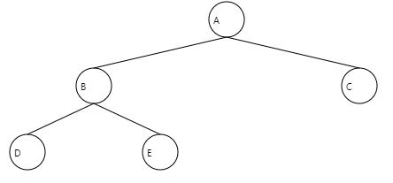


#### 二叉树查找

查找的方式和遍历一样，只是在输出节点上换位了判断节点值。


```java
public class Main25 {

    public static void main(String[] args) {
        BinaryTree binaryTree = new BinaryTree();
        Node root = new Node(1, "A");
        Node node2 = new Node(2, "B");
        Node node3 = new Node(3, "C");
        Node node4 = new Node(4, "D");
        Node node5 = new Node(5, "E");
        //先手动创建二叉树，后面再以递归方式创建二叉树
        root.setLeft(node2);
        root.setRight(node3);
        node2.setLeft(node4);
        node2.setRight(node5);
        binaryTree.setRoot(root);
        //前中后序遍历测试
        //System.out.println("前序遍历");
        //binaryTree.preOrder();
        //System.out.println("中序遍历");
        //binaryTree.infixOrder();
        //System.out.println("后续遍历");
        //binaryTree.postOrder();
        System.out.println("前序遍历查找："+binaryTree.preOrderSearch(3));
        System.out.println("中序遍历查找："+binaryTree.infixOrderSearch(3));
        System.out.println("后序遍历查找："+binaryTree.postOrderSearch(3));
    }
}
class BinaryTree{
    private Node root;

    public Node getRoot() {
        return root;
    }

    public void setRoot(Node root) {
        this.root = root;
    }

    //树前序遍历
    public void preOrder() {
        if (this.root != null)
            this.root.preOrder();
        else
            System.out.println("二叉树为空！无法遍历！");
    }

    //树中序遍历
    public void infixOrder() {
        if (this.root != null)
            this.root.infixOrder();
        else
            System.out.println("二叉树为空！无法遍历！");
    }

    //树后续遍历
    public void postOrder() {
        if (this.root != null)
            this.root.postOrder();
        else
            System.out.println("二叉树为空！无法遍历！");
    }

    //树前序遍历查找
    public Node preOrderSearch(int no) {
        if (root != null)
            return root.preOrderSearch(no);
        else
            return null;
    }

    //树中序遍历查找
    public Node infixOrderSearch(int no) {
        if (root != null)
            return root.infixOrderSearch(no);
        else
            return null;
    }

    //树后序遍历查找
    public Node postOrderSearch(int no) {
        if (root != null)
            return root.postOrderSearch(no);
        else
            return null;
    }

}

class Node{
    private int no;
    private String name;
    private Node left;
    private Node right;

    public Node(int no, String name) {
        this.no = no;
        this.name = name;
    }

    public int getNo() {
        return no;
    }

    public void setNo(int no) {
        this.no = no;
    }

    public String getName() {
        return name;
    }

    public void setName(String name) {
        this.name = name;
    }

    public Node getLeft() {
        return left;
    }

    public void setLeft(Node left) {
        this.left = left;
    }

    public Node getRight() {
        return right;
    }

    public void setRight(Node right) {
        this.right = right;
    }

    @Override
    public String toString() {
        return "Node{" +
                "no=" + no +
                ", name='" + name + '\'' +
                '}';
    }

    //前序遍历
    public void preOrder() {
        System.out.println(this);//输出当前节点（根）
        if (this.left != null)//左递归
            this.left.preOrder();
        if (this.right != null)//右递归
            this.right.preOrder();
    }

    //中序遍历
    public void infixOrder() {
        if (this.left != null)//左递归
            this.left.infixOrder();
        System.out.println(this);//输出当前节点
        if (this.right != null)//右递归
            this.right.infixOrder();
    }

    //后序遍历
    public void postOrder() {
        if (this.left != null)//左递归
            this.left.postOrder();
        if (this.right != null)//右递归
            this.right.postOrder();
        System.out.println(this);//输出当前节点
    }

    //前序遍历查找
    public Node preOrderSearch(int no) {
        Node resNode = null;

        if (this.no == no)//判断是否要找的元素
            return this;

        if (this.left != null)//左递归查找
            resNode = this.left.preOrderSearch(no);
        if (resNode != null)//说明在左子树上找到了
            return resNode;

        if (this.right != null)//右递归查找
            resNode = this.right.preOrderSearch(no);
        if (resNode != null)//说明在右子树找到了
            return resNode;

        return resNode;
    }

    //中序遍历查找
    public Node infixOrderSearch(int no) {
        Node resNode = null;

        if (this.left != null)//左递归查找
            resNode = this.left.infixOrderSearch(no);
        if (resNode != null)//说明在左子树上找到了
            return resNode;

        if (this.no == no)//判断是否要找的元素
            return this;

        if (this.right != null)//右递归查找
            resNode = this.right.infixOrderSearch(no);
        if (resNode != null)//说明在右子树找到了
            return resNode;

        return resNode;
    }

    //后序遍历查找
    public Node postOrderSearch(int no) {
        Node resNode = null;

        if (this.left != null)//左递归查找
            resNode = this.left.postOrderSearch(no);
        if (resNode != null)//说明在左子树上找到了
            return resNode;

        if (this.right != null)//右递归查找
            resNode = this.right.postOrderSearch(no);
        if (resNode != null)//说明在右子树找到了
            return resNode;

        if (this.no == no)//判断是否要找的元素
            return this;

        return resNode;
    }
}
```

resNode作为递归过程的局部遍变量，可以控制在一个方向的递归找到的时候，直接返回。而不是继续走另外一条递归路线。


#### 二叉树删除


```java
public class Main25 {

    public static void main(String[] args) {
        BinaryTree binaryTree = new BinaryTree();
        Node root = new Node(1, "A");
        Node node2 = new Node(2, "B");
        Node node3 = new Node(3, "C");
        Node node4 = new Node(4, "D");
        Node node5 = new Node(5, "E");
        //先手动创建二叉树，后面再以递归方式创建二叉树
        root.setLeft(node2);
        root.setRight(node3);
        node2.setLeft(node4);
        node2.setRight(node5);
        binaryTree.setRoot(root);
        //前中后序遍历测试
        System.out.print("前序遍历：");
        binaryTree.preOrder();
        System.out.print("中序遍历：");
        binaryTree.infixOrder();
        System.out.print("后续遍历：");
        binaryTree.postOrder();
        //System.out.println("前序遍历查找："+binaryTree.preOrderSearch(3));
        //System.out.println("中序遍历查找："+binaryTree.infixOrderSearch(3));
        //System.out.println("后序遍历查找："+binaryTree.postOrderSearch(3));
        System.out.println("删除节点E");
        binaryTree.delNode(5);
        //前中后序遍历测试
        System.out.print("前序遍历：");
        binaryTree.preOrder();
        System.out.print("中序遍历：");
        binaryTree.infixOrder();
        System.out.print("后续遍历：");
        binaryTree.postOrder();
    }
}
class BinaryTree{
    private Node root;

    public Node getRoot() {
        return root;
    }

    public void setRoot(Node root) {
        this.root = root;
    }

    //树前序遍历
    public void preOrder() {
        if (this.root != null)
            this.root.preOrder();
        else
            System.out.println("二叉树为空！无法遍历！");
        System.out.println();
    }

    //树中序遍历
    public void infixOrder() {
        if (this.root != null)
            this.root.infixOrder();
        else
            System.out.println("二叉树为空！无法遍历！");
        System.out.println();
    }

    //树后续遍历
    public void postOrder() {
        if (this.root != null)
            this.root.postOrder();
        else
            System.out.println("二叉树为空！无法遍历！");
        System.out.println();
    }

    //树前序遍历查找
    public Node preOrderSearch(int no) {
        if (root != null)
            return root.preOrderSearch(no);
        else
            return null;
    }

    //树中序遍历查找
    public Node infixOrderSearch(int no) {
        if (root != null)
            return root.infixOrderSearch(no);
        else
            return null;
    }

    //树后序遍历查找
    public Node postOrderSearch(int no) {
        if (root != null)
            return root.postOrderSearch(no);
        else
            return null;
    }

    //树删除节点
    public void delNode(int no){
        if (root != null){
            if (root.getNo() == no)
                root = null;
            else
                root.delNode(no);
        }else
            System.out.println("空树，不能删除！");
    }
}

class Node{
    private int no;
    private String name;
    private Node left;
    private Node right;

    public Node(int no, String name) {
        this.no = no;
        this.name = name;
    }

    public int getNo() {
        return no;
    }

    public void setNo(int no) {
        this.no = no;
    }

    public String getName() {
        return name;
    }

    public void setName(String name) {
        this.name = name;
    }

    public Node getLeft() {
        return left;
    }

    public void setLeft(Node left) {
        this.left = left;
    }

    public Node getRight() {
        return right;
    }

    public void setRight(Node right) {
        this.right = right;
    }

    @Override
    public String toString() {
        return name+"->";
    }

    //前序遍历
    public void preOrder() {
        System.out.print(this);//输出当前节点（根）
        if (this.left != null)//左递归
            this.left.preOrder();
        if (this.right != null)//右递归
            this.right.preOrder();
    }

    //中序遍历
    public void infixOrder() {
        if (this.left != null)//左递归
            this.left.infixOrder();
        System.out.print(this);//输出当前节点
        if (this.right != null)//右递归
            this.right.infixOrder();
    }

    //后序遍历
    public void postOrder() {
        if (this.left != null)//左递归
            this.left.postOrder();
        if (this.right != null)//右递归
            this.right.postOrder();
        System.out.print(this);//输出当前节点
    }

    //前序遍历查找
    public Node preOrderSearch(int no) {
        Node resNode = null;

        if (this.no == no)//判断是否要找的元素
            return this;

        if (this.left != null)//左递归查找
            resNode = this.left.preOrderSearch(no);
        if (resNode != null)//说明在左子树上找到了
            return resNode;

        if (this.right != null)//右递归查找
            resNode = this.right.preOrderSearch(no);
        if (resNode != null)//说明在右子树找到了
            return resNode;

        return resNode;
    }

    //中序遍历查找
    public Node infixOrderSearch(int no) {
        Node resNode = null;

        if (this.left != null)//左递归查找
            resNode = this.left.infixOrderSearch(no);
        if (resNode != null)//说明在左子树上找到了
            return resNode;

        if (this.no == no)//判断是否要找的元素
            return this;

        if (this.right != null)//右递归查找
            resNode = this.right.infixOrderSearch(no);
        if (resNode != null)//说明在右子树找到了
            return resNode;

        return resNode;
    }

    //后序遍历查找
    public Node postOrderSearch(int no) {
        Node resNode = null;

        if (this.left != null)//左递归查找
            resNode = this.left.postOrderSearch(no);
        if (resNode != null)//说明在左子树上找到了
            return resNode;

        if (this.right != null)//右递归查找
            resNode = this.right.postOrderSearch(no);
        if (resNode != null)//说明在右子树找到了
            return resNode;

        if (this.no == no)//判断是否要找的元素
            return this;

        return resNode;
    }

    //删除节点
    public void delNode(int no){
        //判断左子节点是否符合，符合置空
        if (this.left != null && this.left.no == no){
            this.left = null;
            return;
        }
        //判断右子节点是否符合，符合置空
        if (this.right != null && this.right.no == no){
            this.right = null;
            return;
        }
        //当前节点找不到，则左子树递归
        if (this.left != null)
            this.left.delNode(no);
        //当前节点找不到，则右子树递归
        if (this.right != null)
            this.right.delNode(no);
    }
}
```


### 顺序存储二叉树

遍历每一层，将树转为数组。


元素3是第arr[2]个节点，它的左子节点在arr[2*2+1]=arr[5]=节点6。

元素3是第arr[2]个节点，它的右子节点在arr[2*2+2]=arr[6]=节点7。

元素3是第arr[2]个节点，它的父节点在arr[(2-1)/2]=arr[0]=节点1。

所以可以对一个数组进行前中后序遍历。


```java
public class Main {
    public static void main(String[] args) {
        char[] arr = {'A','B','C','D','E'};
        ArrayBinaryTree arrayBinaryTree = new ArrayBinaryTree(arr);
        System.out.print("前序遍历：");
        arrayBinaryTree.preOrder(0);
        System.out.print("\n中序遍历：");
        arrayBinaryTree.infixOrder(0);
        System.out.print("\n后序遍历：");
        arrayBinaryTree.postOrder(0);
        System.out.println();
    }
}

//编写一个ArrayBinaryTree，实现顺序存储二叉树遍历
class ArrayBinaryTree{
    private char[] arr;

    public ArrayBinaryTree(char[] arr) {
        this.arr = arr;
    }

    //树前序遍历
    public void preOrder(int index){
        if (arr == null || arr.length==0){
            System.out.println("数组为空！");
        }

        //输出当前元素
        System.out.print(arr[index]+"->");

        //向左递归
        if ((index * 2 +1)< arr.length)
            preOrder(2*index+1);

        //向右递归
        if ((index*2+2)<arr.length)
            preOrder(2*index+2);
    }

    //中序遍历
    public void infixOrder(int index) {
        if (arr == null || arr.length==0){
            System.out.println("数组为空！");
        }

        //向左递归
        if ((index * 2 +1)< arr.length)
            infixOrder(2*index+1);

        //输出当前元素
        System.out.print(arr[index]+"->");

        //向右递归
        if ((index*2+2)<arr.length)
            infixOrder(2*index+2);
    }

    //后序遍历
    public void postOrder(int index) {
        if (arr == null || arr.length==0){
            System.out.println("数组为空！");
        }

        //向左递归
        if ((index * 2 +1)< arr.length)
            postOrder(2*index+1);

        //向右递归
        if ((index*2+2)<arr.length)
            postOrder(2*index+2);

        //输出当前元素
        System.out.print(arr[index]+"->");
    }

}
```


### 线索化二叉树

让整个树中的所有节点都有指向，而不是叶子节点只是指向null。


> 


> 


在前序线索中，数组中元素8是有两个空指针域。所以左指针指向前驱3，右指针指向后继10。

同样的元素8，在中序线索中，没有前驱元素，但有后继元素3。

同样的元素8，在后序线索中，没有前驱元素，但有后继元素10。

#### 中序线索化二叉树


利用递归回溯，让pre停留在当前位置，自己则回溯到后继节点。以此来为前面的节点设置后继节点。


这里以之前的二叉树ABCDE来实现中序线索化：


```java
public class Main26 {
    public static void main(String[] args) {
        ThreadedBinaryTree threadedBinaryTree = new ThreadedBinaryTree();
        Node root = new Node(1, "A");
        Node node2 = new Node(2, "B");
        Node node3 = new Node(3, "C");
        Node node4 = new Node(4, "D");
        Node node5 = new Node(5, "E");
        root.setLeft(node2);
        root.setRight(node3);
        node2.setLeft(node4);
        node2.setRight(node5);
        threadedBinaryTree.setRoot(root);
        threadedBinaryTree.threadedNodes(root);
        //以叶子节点做测试
        System.out.println((node4.getLeft()!=null?node4.getLeft().getName():null)+"<--"+node4.getName()+"-->"+(node4.getRight()!=null?node4.getRight().getName():null));
        System.out.println((node5.getLeft()!=null?node5.getLeft().getName():null)+"<--"+node5.getName()+"-->"+(node5.getRight()!=null?node5.getRight().getName():null));
        System.out.println((node3.getLeft()!=null?node3.getLeft().getName():null)+"<--"+node3.getName()+"-->"+(node3.getRight()!=null?node3.getRight().getName():null));


    }
}

class ThreadedBinaryTree {
    private Node root;
    private Node prev;//前驱节点

    public Node getRoot() {
        return root;
    }

    public void setRoot(Node root) {
        this.root = root;
    }

    //二叉树中序线索化
    public void threadedNodes(Node node) {
        if (node == null)
            return;
        //递归左子树
        threadedNodes(node.getLeft());
        //线索化节点
        //处理左指针（前驱）
        if (node.getLeft() == null) {
            node.setLeft(prev);
            node.setLeftType(1);
        }
        //①处理右指针（后继）此时prev代表的是之前的节点，而node已经回溯到父节点，这是为前面的节点设置后继
        if (prev != null && prev.getRight() == null) {
            prev.setRight(node);
            prev.setRightType(1);
        }

        prev = node;//为后面回溯做准备，即上面代码①可以执行成功，是因为在上一次递归时已经执行了当前这句话。
        //递归右子树
        threadedNodes(node.getRight());
    }

    //树前序遍历
    public void preOrder() {
        if (this.root != null)
            this.root.preOrder();
        else
            System.out.println("二叉树为空！无法遍历！");
        System.out.println();
    }

    //树中序遍历
    public void infixOrder() {
        if (this.root != null)
            this.root.infixOrder();
        else
            System.out.println("二叉树为空！无法遍历！");
        System.out.println();
    }

    //树后续遍历
    public void postOrder() {
        if (this.root != null)
            this.root.postOrder();
        else
            System.out.println("二叉树为空！无法遍历！");
        System.out.println();
    }

    //树前序遍历查找
    public Node preOrderSearch(int no) {
        if (root != null)
            return root.preOrderSearch(no);
        else
            return null;
    }

    //树中序遍历查找
    public Node infixOrderSearch(int no) {
        if (root != null)
            return root.infixOrderSearch(no);
        else
            return null;
    }

    //树后序遍历查找
    public Node postOrderSearch(int no) {
        if (root != null)
            return root.postOrderSearch(no);
        else
            return null;
    }

    //树删除节点
    public void delNode(int no) {
        if (root != null) {
            if (root.getNo() == no)
                root = null;
            else
                root.delNode(no);
        } else
            System.out.println("空树，不能删除！");
    }
}

class Node {
    private int no;
    private String name;
    private Node left;
    private Node right;

    private int leftType;//leftType:0-左子树，1-前驱节点
    private int rightType;//rightType:0-右子树,1-后继节点

    public Node(int no, String name) {
        this.no = no;
        this.name = name;
    }

    public int getNo() {
        return no;
    }

    public void setNo(int no) {
        this.no = no;
    }

    public String getName() {
        return name;
    }

    public void setName(String name) {
        this.name = name;
    }

    public Node getLeft() {
        return left;
    }

    public void setLeft(Node left) {
        this.left = left;
    }

    public Node getRight() {
        return right;
    }

    public void setRight(Node right) {
        this.right = right;
    }

    public int getLeftType() {
        return leftType;
    }

    public void setLeftType(int leftType) {
        this.leftType = leftType;
    }

    public int getRightType() {
        return rightType;
    }

    public void setRightType(int rightType) {
        this.rightType = rightType;
    }

    @Override
    public String toString() {
        return name + "->";
    }

    //前序遍历
    public void preOrder() {
        System.out.print(this);//输出当前节点（根）
        if (this.left != null)//左递归
            this.left.preOrder();
        if (this.right != null)//右递归
            this.right.preOrder();
    }

    //中序遍历
    public void infixOrder() {
        if (this.left != null)//左递归
            this.left.infixOrder();
        System.out.print(this);//输出当前节点
        if (this.right != null)//右递归
            this.right.infixOrder();
    }

    //后序遍历
    public void postOrder() {
        if (this.left != null)//左递归
            this.left.postOrder();
        if (this.right != null)//右递归
            this.right.postOrder();
        System.out.print(this);//输出当前节点
    }

    //前序遍历查找
    public Node preOrderSearch(int no) {
        Node resNode = null;

        if (this.no == no)//判断是否要找的元素
            return this;

        if (this.left != null)//左递归查找
            resNode = this.left.preOrderSearch(no);
        if (resNode != null)//说明在左子树上找到了
            return resNode;

        if (this.right != null)//右递归查找
            resNode = this.right.preOrderSearch(no);
        if (resNode != null)//说明在右子树找到了
            return resNode;

        return resNode;
    }

    //中序遍历查找
    public Node infixOrderSearch(int no) {
        Node resNode = null;

        if (this.left != null)//左递归查找
            resNode = this.left.infixOrderSearch(no);
        if (resNode != null)//说明在左子树上找到了
            return resNode;

        if (this.no == no)//判断是否要找的元素
            return this;

        if (this.right != null)//右递归查找
            resNode = this.right.infixOrderSearch(no);
        if (resNode != null)//说明在右子树找到了
            return resNode;

        return resNode;
    }

    //后序遍历查找
    public Node postOrderSearch(int no) {
        Node resNode = null;

        if (this.left != null)//左递归查找
            resNode = this.left.postOrderSearch(no);
        if (resNode != null)//说明在左子树上找到了
            return resNode;

        if (this.right != null)//右递归查找
            resNode = this.right.postOrderSearch(no);
        if (resNode != null)//说明在右子树找到了
            return resNode;

        if (this.no == no)//判断是否要找的元素
            return this;

        return resNode;
    }

    //删除节点
    public void delNode(int no) {
        //判断左子节点是否符合，符合置空
        if (this.left != null && this.left.no == no) {
            this.left = null;
            return;
        }
        //判断右子节点是否符合，符合置空
        if (this.right != null && this.right.no == no) {
            this.right = null;
            return;
        }
        //当前节点找不到，则左子树递归
        if (this.left != null)
            this.left.delNode(no);
        //当前节点找不到，则右子树递归
        if (this.right != null)
            this.right.delNode(no);
    }
}
```


#### 遍历线索化二叉树

线索化后不能使用原先的遍历方法，会出现无限递归的情况。需要使用新方法遍历。

利用之前实现线索化的状态字段leftType和rightType来实现遍历。

```java
public class Main26 {
    public static void main(String[] args) {
        ThreadedBinaryTree threadedBinaryTree = new ThreadedBinaryTree();
        Node root = new Node(1, "A");
        Node node2 = new Node(2, "B");
        Node node3 = new Node(3, "C");
        Node node4 = new Node(4, "D");
        Node node5 = new Node(5, "E");
        root.setLeft(node2);
        root.setRight(node3);
        node2.setLeft(node4);
        node2.setRight(node5);
        threadedBinaryTree.setRoot(root);
        threadedBinaryTree.threadedNodes(root);
        //以叶子节点做测试
        //System.out.println((node4.getLeft()!=null?node4.getLeft().getName():null)+"<--"+node4.getName()+"-->"+(node4.getRight()!=null?node4.getRight().getName():null));
        //System.out.println((node5.getLeft()!=null?node5.getLeft().getName():null)+"<--"+node5.getName()+"-->"+(node5.getRight()!=null?node5.getRight().getName():null));
        //System.out.println((node3.getLeft()!=null?node3.getLeft().getName():null)+"<--"+node3.getName()+"-->"+(node3.getRight()!=null?node3.getRight().getName():null));
        threadedBinaryTree.threadedList();

    }
}

class ThreadedBinaryTree {
    private Node root;
    private Node prev;//前驱节点

    public Node getRoot() {
        return root;
    }

    public void setRoot(Node root) {
        this.root = root;
    }

    //二叉树中序线索化
    public void threadedNodes(Node node) {
        if (node == null)
            return;
        //递归左子树
        threadedNodes(node.getLeft());
        //线索化节点
        //处理左指针（前驱）
        if (node.getLeft() == null) {
            node.setLeft(prev);
            node.setLeftType(1);
        }
        //①处理右指针（后继）此时prev代表的是之前的节点，而node已经回溯到父节点，这是为前面的节点设置后继
        if (prev != null && prev.getRight() == null) {
            prev.setRight(node);
            prev.setRightType(1);
        }

        prev = node;//为后面回溯做准备，即上面代码①可以执行成功，是因为在上一次递归时已经执行了当前这句话。
        //递归右子树
        threadedNodes(node.getRight());
    }

    //中序线索化二叉树遍历
    public void threadedList(){
        Node node = root;
        while (node!=null){
            while (node.getLeftType()  == 0){//遍历到最左边
                node = node.getLeft();
            }
            System.out.print(node.getName()+"->");//输出线索头
            while (node.getRightType() == 1){//因为线索化后，在数组中是依靠后继right连接全部元素的，所以只要一直getright就行（穿针引线）
                node = node.getRight();
                System.out.print(node+"->");
            }
            //替换遍历的节点，进入下一层
            node = node.getRight();
        }
    }

    //树前序遍历
    public void preOrder() {
        if (this.root != null)
            this.root.preOrder();
        else
            System.out.println("二叉树为空！无法遍历！");
        System.out.println();
    }

    //树中序遍历
    public void infixOrder() {
        if (this.root != null)
            this.root.infixOrder();
        else
            System.out.println("二叉树为空！无法遍历！");
        System.out.println();
    }

    //树后续遍历
    public void postOrder() {
        if (this.root != null)
            this.root.postOrder();
        else
            System.out.println("二叉树为空！无法遍历！");
        System.out.println();
    }

    //树前序遍历查找
    public Node preOrderSearch(int no) {
        if (root != null)
            return root.preOrderSearch(no);
        else
            return null;
    }

    //树中序遍历查找
    public Node infixOrderSearch(int no) {
        if (root != null)
            return root.infixOrderSearch(no);
        else
            return null;
    }

    //树后序遍历查找
    public Node postOrderSearch(int no) {
        if (root != null)
            return root.postOrderSearch(no);
        else
            return null;
    }

    //树删除节点
    public void delNode(int no) {
        if (root != null) {
            if (root.getNo() == no)
                root = null;
            else
                root.delNode(no);
        } else
            System.out.println("空树，不能删除！");
    }
}

class Node {
    private int no;
    private String name;
    private Node left;
    private Node right;

    private int leftType;//leftType:0-左子树，1-前驱节点
    private int rightType;//rightType:0-右子树,1-后继节点

    public Node(int no, String name) {
        this.no = no;
        this.name = name;
    }

    public int getNo() {
        return no;
    }

    public void setNo(int no) {
        this.no = no;
    }

    public String getName() {
        return name;
    }

    public void setName(String name) {
        this.name = name;
    }

    public Node getLeft() {
        return left;
    }

    public void setLeft(Node left) {
        this.left = left;
    }

    public Node getRight() {
        return right;
    }

    public void setRight(Node right) {
        this.right = right;
    }

    public int getLeftType() {
        return leftType;
    }

    public void setLeftType(int leftType) {
        this.leftType = leftType;
    }

    public int getRightType() {
        return rightType;
    }

    public void setRightType(int rightType) {
        this.rightType = rightType;
    }

    @Override
    public String toString() {
        return name + "->";
    }

    //前序遍历
    public void preOrder() {
        System.out.print(this);//输出当前节点（根）
        if (this.left != null)//左递归
            this.left.preOrder();
        if (this.right != null)//右递归
            this.right.preOrder();
    }

    //中序遍历
    public void infixOrder() {
        if (this.left != null)//左递归
            this.left.infixOrder();
        System.out.print(this);//输出当前节点
        if (this.right != null)//右递归
            this.right.infixOrder();
    }

    //后序遍历
    public void postOrder() {
        if (this.left != null)//左递归
            this.left.postOrder();
        if (this.right != null)//右递归
            this.right.postOrder();
        System.out.print(this);//输出当前节点
    }

    //前序遍历查找
    public Node preOrderSearch(int no) {
        Node resNode = null;

        if (this.no == no)//判断是否要找的元素
            return this;

        if (this.left != null)//左递归查找
            resNode = this.left.preOrderSearch(no);
        if (resNode != null)//说明在左子树上找到了
            return resNode;

        if (this.right != null)//右递归查找
            resNode = this.right.preOrderSearch(no);
        if (resNode != null)//说明在右子树找到了
            return resNode;

        return resNode;
    }

    //中序遍历查找
    public Node infixOrderSearch(int no) {
        Node resNode = null;

        if (this.left != null)//左递归查找
            resNode = this.left.infixOrderSearch(no);
        if (resNode != null)//说明在左子树上找到了
            return resNode;

        if (this.no == no)//判断是否要找的元素
            return this;

        if (this.right != null)//右递归查找
            resNode = this.right.infixOrderSearch(no);
        if (resNode != null)//说明在右子树找到了
            return resNode;

        return resNode;
    }

    //后序遍历查找
    public Node postOrderSearch(int no) {
        Node resNode = null;

        if (this.left != null)//左递归查找
            resNode = this.left.postOrderSearch(no);
        if (resNode != null)//说明在左子树上找到了
            return resNode;

        if (this.right != null)//右递归查找
            resNode = this.right.postOrderSearch(no);
        if (resNode != null)//说明在右子树找到了
            return resNode;

        if (this.no == no)//判断是否要找的元素
            return this;

        return resNode;
    }

    //删除节点
    public void delNode(int no) {
        //判断左子节点是否符合，符合置空
        if (this.left != null && this.left.no == no) {
            this.left = null;
            return;
        }
        //判断右子节点是否符合，符合置空
        if (this.right != null && this.right.no == no) {
            this.right = null;
            return;
        }
        //当前节点找不到，则左子树递归
        if (this.left != null)
            this.left.delNode(no);
        //当前节点找不到，则右子树递归
        if (this.right != null)
            this.right.delNode(no);
    }
}
```


### 霍夫曼树


* 路径长度：节点所在层数-1
* 带权路径长度：路径长度 * 当前节点权值


* 树的带权路径长度：所有节点带权路径长度
* 树最小带权路径长度：大的值在上面，小的值在下面。


* 将数据排序
* 取两个最小点作为节点，合成树，父节点是两个节点的总和
* 将总和进数组进行排序
* 再次取两个最小点作为节点，合成树，父节点是两个节点的总和。
* 将总和进数组进行排序
* ....重复这个过程，直到合成最后两个节点，得到哈夫曼树。


```java
public class Main {
    public static void main(String[] args) {
        int[] arr = {13,7,8,3,29,6,1};
        Node root = createHuffmanTree(arr);
        preOrder(root);
    }

    public static Node createHuffmanTree(int[] arr){
        List<Node> nodes = new ArrayList<>();
        for (int val:arr) {
            nodes.add(new Node(val));
        }
        while (nodes.size()>1){//合成到最后就剩下一个根节点了
            //数组元素转List（正序）
            Collections.sort(nodes);
            //取最小两个节点合成树（因为每次进来都是排好序的）
            Node left = nodes.get(0);
            Node right = nodes.get(1);
            Node parent = new Node(left.val + right.val);
            parent.left = left;
            parent.right = right;
            nodes.remove(left);
            nodes.remove(right);
            nodes.add(parent);
        }
        return nodes.get(0);
    }

    //树前序遍历
    public static void preOrder(Node root) {
        if (root != null)
            root.preOrder();
        else
            System.out.println("二叉树为空！无法遍历！");
        System.out.println();
    }
}
class Node implements Comparable<Node>{
    int val;
    Node left;
    Node right;

    public Node(int val) {
        this.val = val;
    }

    @Override
    public String toString() {
        return val+"->";
    }

    @Override
    public int compareTo(Node o) {
        return val - o.val;//正序
    }

    //前序遍历
    public void preOrder() {
        System.out.print(this);//输出当前节点（根）
        if (this.left != null)//左递归
            this.left.preOrder();
        if (this.right != null)//右递归
            this.right.preOrder();
    }
}
```

前序遍历结果对照图片


### 	霍夫曼编码


* 普通编码


* 霍夫曼编码


* 用新的二进制来表示编码

先获取字符出现的次数，然后从大到小排列。

使用二进制方式将字符逐个替代

规定左路径为0，右路径为1。则可以构建出一颗霍夫曼树，其中出现最多次的元素会排列在顶部，出现最少次的元素排列在最底部。

此时新字符编码是比原字符编码小很多。同时根据霍夫曼树的遍历就可以很快还原出原来的内容。


在构建霍夫曼树时，需要有一个节点的判断大小，所以需要更改这个Node对象。


```java
public class Main {
    public static void main(String[] args) {
        String content = "i like like like java do you like a java";
        System.out.println("原文："+content+"\n");

        byte[] contentBytes = content.getBytes();
        System.out.println("原文->原文字节数组："+Arrays.toString(contentBytes)+"\n");

        /**
         * 构建霍夫曼编码表
         */

        List<Node> nodes = getNodes(contentBytes);
        System.out.println("原文字节数组->原文节点列表："+nodes+"\n");

        Node root = createHuffmanTree(nodes);
        System.out.print("原文节点列表--提取-->霍夫曼树：");
        preOrder(root);
        System.out.println("\n");

        System.out.print("霍夫曼树--遍历-->霍夫曼编码表：");
        Map<Byte, String> huffmanCodeMap = getCodes(root);
        System.out.println(huffmanCodeMap+"\n");

        /**
         * 压缩数据
         */

        byte[] huffmanContentBytes = zip(contentBytes, huffmanCodeMap);//这里每个字节转为8位，合并后就是这个字符串的霍夫曼编码
        System.out.println("原文字节数组--霍夫曼编码表-->霍夫曼编码字节数组"+Arrays.toString(huffmanContentBytes)+"\n");

        /**
         * 解压数据
         */
        byte[] unzipBytes = unzip(huffmanCodeMap, huffmanContentBytes);
        System.out.println("\n霍夫曼编码字节数组--反霍夫曼表-->原文字节数组："+Arrays.toString(unzipBytes));

        System.out.println("\n原文字节数组-->原文："+new String(unzipBytes));

    }

    //构建数据和次数关系链表
    private static List<Node> getNodes(byte[] bytes){
        List<Node> nodes = new ArrayList<>();
        //构建字节和出现次数关系表
        Map<Byte,Integer> counts = new HashMap<>();
        for (byte b:bytes) {
            Integer count = counts.get(b);
            if (count==null) {
                counts.put(b,1);
            } else {
                counts.put(b,count+1);
            }
        }
        //构建Node列表
        for (Map.Entry<Byte,Integer> entry:counts.entrySet()) {
            nodes.add(new Node(entry.getKey(),entry.getValue()));
        }
        return nodes;
    }

    //构建霍夫曼树
    public static Node createHuffmanTree(List<Node> nodes){

        while (nodes.size()>1){//合成到最后就剩下一个根节点了
            //数组元素转List（正序）
            Collections.sort(nodes);
            //取最小两个节点合成树（因为每次进来都是排好序的）
            Node left = nodes.get(0);
            Node right = nodes.get(1);
            Node parent = new Node(null,left.weight + right.weight);
            parent.left = left;
            parent.right = right;
            nodes.remove(left);
            nodes.remove(right);
            nodes.add(parent);
        }
        return nodes.get(0);
    }

    //树前序遍历
    public static void preOrder(Node root) {
        if (root != null)
            root.preOrder();
        else
            System.out.println("二叉树为空！无法遍历！");
    }

    static Map<Byte,String> huffmanCodes = new HashMap<>();//霍夫曼编码表
    static StringBuilder allBuilder = new StringBuilder();//节点路径（霍夫曼编码）

    //创建霍夫曼编码表（从根节点开始遍历）
    private static Map<Byte,String> getCodes(Node root){
        if (root == null){
            return null;
        }
        getCodes(root.left,"0",allBuilder);
        getCodes(root.right,"1",allBuilder);
        return huffmanCodes;
    }

    //生成霍夫曼编码（即是记录路径，规定左路径为0，右路径为1）
    private static void getCodes(Node node, String code, StringBuilder builder){
        StringBuilder tempBuilder = new StringBuilder(builder);//记录读取的霍夫曼编码
        tempBuilder.append(code);
        if (node!=null){
            if (node.data==null){//像前序遍历一样，先判断读取节点，再去左右递归
                getCodes(node.left,"0",tempBuilder);//开始左右递归找值，创建编码
                getCodes(node.right,"1",tempBuilder);
            }else {//找到每一个节点的路径，并将其存入表中
                huffmanCodes.put(node.data,tempBuilder.toString());
            }
        }
    }

    //将字符串转为霍夫曼编码
    private static byte[] zip(byte[] bytes, Map<Byte,String> huffmanCodes){
        //根据霍夫曼表获得字符串霍夫曼编码
        StringBuilder builder = new StringBuilder();
        for (byte b:bytes){
            builder.append(huffmanCodes.get(b));
        }
        System.out.println("转为霍夫曼二进制后的字符串："+builder);
        //将字符串转为字节数组（8位一字节）
        //先确定字节数组的容量 int len = (builder.length()+7)/8 # 因为如果可以整除8，就算+7也是一样结果，如果不能整除8，则+7可以获得这一个位的容量
        int len;
        if (builder.length()%8==0){
            len = builder.length() / 8;
        }else {
            len = builder.length() / 8 + 1;
        }
        byte[] huffmanByte = new byte[len];
        for (int i =0,index = 0;i<builder.length();i+=8,index++){//每8位一字节存入数组
            //切割8位字符串
            String strByte;
            if (i+8>builder.length()){//最后不足8位时避免越界
                strByte = builder.substring(i);
            }else {
                strByte = builder.substring(i,i+8);
            }
            huffmanByte[index] = (byte) Integer.parseInt(strByte,2);
        }
        return huffmanByte;
    }

    private static byte[] huffmanZip(byte[] bytes){
        List<Node> nodes = getNodes(bytes);
        Node root = createHuffmanTree(nodes);
        Map<Byte, String> huffmanCodes = getCodes(root);
        byte[] huffmanCodeBytes = zip(bytes, huffmanCodes);
        return huffmanCodeBytes;
    }

    //字节转位数（flaga判断是否为正数）
    private static String byteToBit(boolean flag,byte b){
        //如果是正数，需要补高位
        int temp = b;
        if (flag)
            temp |= 256;//256: 1 0000 0000 1: 0000 0001 => 1 0000 0001在转int需要重新恢复前面的0，不然后面切割会越界
        String str = Integer.toBinaryString(temp);//返回temp对应的二进制的补码
        if (flag){
            return str.substring(str.length()-8);
        }else {
            return str;
        }
    }

    //霍夫曼字节数组转霍夫曼二进制数组
    private static byte[] unzip(Map<Byte,String> huffmanTable, byte[] huffmanArray){
        StringBuilder builder = new StringBuilder();
        for (int i = 0;i< huffmanArray.length;i++){
            boolean flag = (i == huffmanArray.length -1);//如果到了加密字符串的最后一个字节，则需要补高位
            builder.append(byteToBit(!flag,huffmanArray[i]));
        }
        System.out.println("将霍夫曼字节数组转为8位二进制:"+builder);

        //根据霍夫曼表进行解码
        //反转霍夫曼编码表
        Map<String, Byte> reverseMap = new HashMap<>();
        for (Map.Entry<Byte,String> entry:huffmanTable.entrySet()){
            reverseMap.put(entry.getValue(),entry.getKey());
        }
        System.out.println("反转霍夫曼编码表："+reverseMap);

        //扫描二进制字符串，将读到的二进制转为字节存入列表
        List<Byte> list = new ArrayList<>();
        for (int i = 0; i < builder.length();) {
            int count = 1;
            boolean flag = true;
            Byte b = null;
            while (flag){
                String key = builder.substring(i,i+count);//两个指针，count是移动的，每移动一次，就去反霍夫曼表中查找有没有
                b = reverseMap.get(key);
                if (b == null){
                    count++;
                }else {
                    flag = false;
                }
            }
            list.add(b);//循环结束后，是肯定能找到一个值
            i+=count;//i在接下来的位置进行搜寻
        }
        System.out.println("二进制转回字符："+list);
        //list转为数组
        byte[] sourceBytes = new byte[list.size()];
        for (int i = 0; i < list.size(); i++) {
            sourceBytes[i] = list.get(i);
        }
        return sourceBytes;
    }
}
class Node implements Comparable<Node>{
    Byte data; //数据对象
    int weight;//权值
    Node left; //左子节点
    Node right;//右子节点

    public Node(Byte data, int weight) {
        this.data = data;
        this.weight = weight;
    }

    @Override
    public int compareTo(Node o) {
        return weight - o.weight;//正序
    }

    @Override
    public String toString() {
        return "Node{" +
                "data=" + data +
                ", weight=" + weight +
                '}';
    }

    public void preOrder(){
        System.out.print(this+",");
        if (this.left !=null){
            this.left.preOrder();
        }
        if (this.right!=null){
            this.right.preOrder();
        }
    }
}
```

* 压缩
  * 获得霍夫曼编码表
    * 原文转字节数组
    * 字节数组转节点列表
      * 遍历字节数组，合并重复数据，生成节点{字节值，出现次数}
    * 节点列表构建霍夫曼树
      * 排序列表，将最小两个值合成树，填会列表，直到剩下霍夫曼根节点
    * 霍夫曼树遍历得到霍夫曼编码表
      * 从根节点递归，得到所有节点的对应路径，这个路径以左边为0右边为1，是霍夫曼编码，节点和路径的映射关系形成了霍夫曼表。(在这里之后的操作都是和出现次数无关的，主要是生成了一张最佳压缩的表，将字节对照表进行压缩就行)
  * 使用霍夫曼编码表**压缩**原文字节数组，得到霍夫曼编码字节数组
    * 将原文字节数组转为对应的霍夫曼编码字符串（一串二进制）
    * 切割8位转换为字节，得到经过霍夫曼编码的字节数组
* 解压缩
  * 将霍夫曼编码字节数组还原为霍夫曼二进制字符串
    * 将每个字节还原为8位二进制，拼接在一起，最后的字节可能还原不足8位，进行补位。
  * 反转霍夫曼表
    * 将原先的霍夫曼编码表的key和value进行调换，方便后续查询使用
  * 读取二进制字符串的内容，将找到的内容匹配反霍夫曼表，得到字节列表
    * 使用双指针（活动窗口）的方式，检查一段二进制是否可以查询霍夫曼编码表对应的原文字节。（因为是字节压缩的，所以在解压时也是肯定能查出来的）
    * 将原文字节记录到列表中（保证有序）
  * 将字节列表转为字节数组
  * 字节数组还原原文
    * new String(byte[]);


##### 文件压缩


```java
public class Main {
    public static void main(String[] args) {
        String srcFile = "F:\\project\\idea\\TestJava\\src\\shujujiegou\\Main29\\20331543058朱哲 答辩记录.doc";
        String dstFile = "F:\\project\\idea\\TestJava\\src\\shujujiegou\\Main29\\"+System.currentTimeMillis()+".zip";
        zipFile(srcFile,dstFile);
    }

    public static void main2(String[] args) {
        String content = "i like like like java do you like a java";
        System.out.println("[1] 原文："+content+"\n");

        byte[] contentBytes = content.getBytes();
        System.out.println("[2] 原文->原文字节数组："+Arrays.toString(contentBytes)+"\n");

        /**
         * 构建霍夫曼编码表
         */

        List<Node> nodes = getNodes(contentBytes);
        System.out.println("[3] 原文字节数组->原文节点列表："+nodes+"\n");

        Node root = createHuffmanTree(nodes);
        System.out.print("[4] 原文节点列表--提取-->霍夫曼树：");
        preOrder(root);
        System.out.println("\n");

        System.out.print("[5] 霍夫曼树--遍历-->霍夫曼编码表：");
        Map<Byte, String> huffmanCodeMap = getCodes(root);
        System.out.println(huffmanCodeMap+"\n");

        /**
         * 压缩数据
         */

        byte[] huffmanContentBytes = zip(contentBytes, huffmanCodeMap);//这里每个字节转为8位，合并后就是这个字符串的霍夫曼编码
        System.out.println("[6] 原文字节数组--霍夫曼编码表-->霍夫曼编码字节数组"+Arrays.toString(huffmanContentBytes)+"\n");

        /**
         * 解压数据
         */
        byte[] unzipBytes = unzip(huffmanCodeMap, huffmanContentBytes);
        System.out.println("\n[7] 霍夫曼编码字节数组--反霍夫曼表-->原文字节数组："+Arrays.toString(unzipBytes));

        System.out.println("\n[8] 原文字节数组-->原文："+new String(unzipBytes));

    }

    //构建数据和次数关系链表
    private static List<Node> getNodes(byte[] bytes){
        List<Node> nodes = new ArrayList<>();
        //构建字节和出现次数关系表
        Map<Byte,Integer> counts = new HashMap<>();
        for (byte b:bytes) {
            Integer count = counts.get(b);
            if (count==null) {
                counts.put(b,1);
            } else {
                counts.put(b,count+1);
            }
        }
        //构建Node列表
        for (Map.Entry<Byte,Integer> entry:counts.entrySet()) {
            nodes.add(new Node(entry.getKey(),entry.getValue()));
        }
        return nodes;
    }

    //构建霍夫曼树
    public static Node createHuffmanTree(List<Node> nodes){

        while (nodes.size()>1){//合成到最后就剩下一个根节点了
            //数组元素转List（正序）
            Collections.sort(nodes);
            //取最小两个节点合成树（因为每次进来都是排好序的）
            Node left = nodes.get(0);
            Node right = nodes.get(1);
            Node parent = new Node(null,left.weight + right.weight);
            parent.left = left;
            parent.right = right;
            nodes.remove(left);
            nodes.remove(right);
            nodes.add(parent);
        }
        return nodes.get(0);
    }

    //树前序遍历
    public static void preOrder(Node root) {
        if (root != null)
            root.preOrder();
        else
            System.out.println("二叉树为空！无法遍历！");
    }

    static Map<Byte,String> huffmanCodes = new HashMap<>();//霍夫曼编码表
    static StringBuilder allBuilder = new StringBuilder();//节点路径（霍夫曼编码）

    //创建霍夫曼编码表（从根节点开始遍历）
    private static Map<Byte,String> getCodes(Node root){
        if (root == null){
            return null;
        }
        getCodes(root.left,"0",allBuilder);
        getCodes(root.right,"1",allBuilder);
        return huffmanCodes;
    }

    //生成霍夫曼编码（即是记录路径，规定左路径为0，右路径为1）
    private static void getCodes(Node node, String code, StringBuilder builder){
        StringBuilder tempBuilder = new StringBuilder(builder);//记录读取的霍夫曼编码
        tempBuilder.append(code);
        if (node!=null){
            if (node.data==null){//像前序遍历一样，先判断读取节点，再去左右递归
                getCodes(node.left,"0",tempBuilder);//开始左右递归找值，创建编码
                getCodes(node.right,"1",tempBuilder);
            }else {//找到每一个节点的路径，并将其存入表中
                huffmanCodes.put(node.data,tempBuilder.toString());
            }
        }
    }

    //将字符串转为霍夫曼编码
    private static byte[] zip(byte[] bytes, Map<Byte,String> huffmanCodes){
        //根据霍夫曼表获得字符串霍夫曼编码
        StringBuilder builder = new StringBuilder();
        for (byte b:bytes){
            builder.append(huffmanCodes.get(b));
        }
        System.out.println("转为霍夫曼二进制后的字符串："+builder);
        //将字符串转为字节数组（8位一字节）
        //先确定字节数组的容量 int len = (builder.length()+7)/8 # 因为如果可以整除8，就算+7也是一样结果，如果不能整除8，则+7可以获得这一个位的容量
        int len;
        if (builder.length()%8==0){
            len = builder.length() / 8;
        }else {
            len = builder.length() / 8 + 1;
        }
        byte[] huffmanByte = new byte[len];
        for (int i =0,index = 0;i<builder.length();i+=8,index++){//每8位一字节存入数组
            //切割8位字符串
            String strByte;
            if (i+8>builder.length()){//最后不足8位时避免越界
                strByte = builder.substring(i);
            }else {
                strByte = builder.substring(i,i+8);
            }
            huffmanByte[index] = (byte) Integer.parseInt(strByte,2);
        }
        return huffmanByte;
    }

    /**
     * 原文字节数组->霍夫曼编码字节数组
     * @param bytes
     * @return
     */
    private static byte[] huffmanZip(byte[] bytes){
        List<Node> nodes = getNodes(bytes);
        Node root = createHuffmanTree(nodes);
        Map<Byte, String> huffmanCodes = getCodes(root);
        byte[] huffmanCodeBytes = zip(bytes, huffmanCodes);
        return huffmanCodeBytes;
    }

    //字节转位数（flaga判断是否为正数）
    private static String byteToBit(boolean flag,byte b){
        //如果是正数，需要补高位
        int temp = b;
        if (flag)
            temp |= 256;//256: 1 0000 0000 1: 0000 0001 => 1 0000 0001在转int需要重新恢复前面的0，不然后面切割会越界
        String str = Integer.toBinaryString(temp);//返回temp对应的二进制的补码
        if (flag){
            return str.substring(str.length()-8);
        }else {
            return str;
        }
    }

    //霍夫曼字节数组转霍夫曼二进制数组
    private static byte[] unzip(Map<Byte,String> huffmanTable, byte[] huffmanArray){
        StringBuilder builder = new StringBuilder();
        for (int i = 0;i< huffmanArray.length;i++){
            boolean flag = (i == huffmanArray.length -1);//如果到了加密字符串的最后一个字节，则需要补高位
            builder.append(byteToBit(!flag,huffmanArray[i]));
        }
        System.out.println("将霍夫曼字节数组转为8位二进制:"+builder);

        //根据霍夫曼表进行解码
        //反转霍夫曼编码表
        Map<String, Byte> reverseMap = new HashMap<>();
        for (Map.Entry<Byte,String> entry:huffmanTable.entrySet()){
            reverseMap.put(entry.getValue(),entry.getKey());
        }
        System.out.println("反转霍夫曼编码表："+reverseMap);

        //扫描二进制字符串，将读到的二进制转为字节存入列表
        List<Byte> list = new ArrayList<>();
        for (int i = 0; i < builder.length();) {
            int count = 1;
            boolean flag = true;
            Byte b = null;
            while (flag){
                String key = builder.substring(i,i+count);//两个指针，count是移动的，每移动一次，就去反霍夫曼表中查找有没有
                b = reverseMap.get(key);
                if (b == null){
                    count++;
                }else {
                    flag = false;
                }
            }
            list.add(b);//循环结束后，是肯定能找到一个值
            i+=count;//i在接下来的位置进行搜寻
        }
        System.out.println("二进制转回字符："+list);
        //list转为数组
        byte[] sourceBytes = new byte[list.size()];
        for (int i = 0; i < list.size(); i++) {
            sourceBytes[i] = list.get(i);
        }
        return sourceBytes;
    }


    /**
     * 将一个文件进行压缩
     * @param srcFile 文件完整路径
     * @param dstFile 压缩文件路径
     */
    public static void zipFile(String srcFile, String dstFile){
        OutputStream os = null;
        FileInputStream is = null;
        ObjectOutputStream oos;
        try {
            //读取输入文件流到数组
            is = new FileInputStream(srcFile);
            byte[] b = new byte[is.available()];
            is.read(b);
            //将字节数组压缩为霍夫曼编码字节数组
            byte[] huffmanBytes = huffmanZip(b);
            //创建输出流
            os = new FileOutputStream(dstFile);
            oos = new ObjectOutputStream(os);
            oos.writeObject(huffmanBytes);//用对象流方式将霍夫曼编码字节数组写入到文件，方便后续读取
            oos.writeObject(huffmanCodes);//用对象流方式将霍夫曼表写入到文件
        } catch (Exception e) {
            e.printStackTrace();
        }finally {
            try {
                is.close();
            } catch (IOException e) {
                System.out.println(e.getMessage());
            }
        }
    }

    
}
class Node implements Comparable<Node>{
    Byte data; //数据对象
    int weight;//权值
    Node left; //左子节点
    Node right;//右子节点

    public Node(Byte data, int weight) {
        this.data = data;
        this.weight = weight;
    }

    @Override
    public int compareTo(Node o) {
        return weight - o.weight;//正序
    }

    @Override
    public String toString() {
        return "Node{" +
                "data=" + data +
                ", weight=" + weight +
                '}';
    }

    public void preOrder(){
        System.out.print(this+",");
        if (this.left !=null){
            this.left.preOrder();
        }
        if (this.right!=null){
            this.right.preOrder();
        }
    }
}
```


##### 文件解压


```java
public class Main {
    public static void main(String[] args) {
        String srcFile1 = "F:\\project\\idea\\TestJava\\src\\shujujiegou\\Main29\\test.bmp";
        String srcFile2 = "F:\\project\\idea\\TestJava\\src\\shujujiegou\\Main29\\test2.bmp";
        String dstFile = "F:\\project\\idea\\TestJava\\src\\shujujiegou\\Main29\\huffmanZip.zip";
        zipFile(srcFile1,dstFile);
        unzipFile(dstFile,srcFile2);
    }

    public static void main2(String[] args) {
        String content = "i like like like java do you like a java";
        System.out.println("[1] 原文："+content+"\n");

        byte[] contentBytes = content.getBytes();
        System.out.println("[2] 原文->原文字节数组："+Arrays.toString(contentBytes)+"\n");

        /**
         * 构建霍夫曼编码表
         */

        List<Node> nodes = getNodes(contentBytes);
        System.out.println("[3] 原文字节数组->原文节点列表："+nodes+"\n");

        Node root = createHuffmanTree(nodes);
        System.out.print("[4] 原文节点列表--提取-->霍夫曼树：");
        preOrder(root);
        System.out.println("\n");

        System.out.print("[5] 霍夫曼树--遍历-->霍夫曼编码表：");
        Map<Byte, String> huffmanCodeMap = getCodes(root);
        System.out.println(huffmanCodeMap+"\n");

        /**
         * 压缩数据
         */

        byte[] huffmanContentBytes = zip(contentBytes, huffmanCodeMap);//这里每个字节转为8位，合并后就是这个字符串的霍夫曼编码
        System.out.println("[6] 原文字节数组--霍夫曼编码表-->霍夫曼编码字节数组"+Arrays.toString(huffmanContentBytes)+"\n");

        /**
         * 解压数据
         */
        byte[] unzipBytes = unzip(huffmanCodeMap, huffmanContentBytes);
        System.out.println("\n[7] 霍夫曼编码字节数组--反霍夫曼表-->原文字节数组："+Arrays.toString(unzipBytes));

        System.out.println("\n[8] 原文字节数组-->原文："+new String(unzipBytes));

    }

    //构建数据和次数关系链表
    private static List<Node> getNodes(byte[] bytes){
        List<Node> nodes = new ArrayList<>();
        //构建字节和出现次数关系表
        Map<Byte,Integer> counts = new HashMap<>();
        for (byte b:bytes) {
            Integer count = counts.get(b);
            if (count==null) {
                counts.put(b,1);
            } else {
                counts.put(b,count+1);
            }
        }
        //构建Node列表
        for (Map.Entry<Byte,Integer> entry:counts.entrySet()) {
            nodes.add(new Node(entry.getKey(),entry.getValue()));
        }
        return nodes;
    }

    //构建霍夫曼树
    public static Node createHuffmanTree(List<Node> nodes){

        while (nodes.size()>1){//合成到最后就剩下一个根节点了
            //数组元素转List（正序）
            Collections.sort(nodes);
            //取最小两个节点合成树（因为每次进来都是排好序的）
            Node left = nodes.get(0);
            Node right = nodes.get(1);
            Node parent = new Node(null,left.weight + right.weight);
            parent.left = left;
            parent.right = right;
            nodes.remove(left);
            nodes.remove(right);
            nodes.add(parent);
        }
        return nodes.get(0);
    }

    //树前序遍历
    public static void preOrder(Node root) {
        if (root != null)
            root.preOrder();
        else
            System.out.println("二叉树为空！无法遍历！");
    }

    static Map<Byte,String> huffmanCodes = new HashMap<>();//霍夫曼编码表
    static StringBuilder allBuilder = new StringBuilder();//节点路径（霍夫曼编码）

    //创建霍夫曼编码表（从根节点开始遍历）
    private static Map<Byte,String> getCodes(Node root){
        if (root == null){
            return null;
        }
        getCodes(root.left,"0",allBuilder);
        getCodes(root.right,"1",allBuilder);
        return huffmanCodes;
    }

    //生成霍夫曼编码（即是记录路径，规定左路径为0，右路径为1）
    private static void getCodes(Node node, String code, StringBuilder builder){
        StringBuilder tempBuilder = new StringBuilder(builder);//记录读取的霍夫曼编码
        tempBuilder.append(code);
        if (node!=null){
            if (node.data==null){//像前序遍历一样，先判断读取节点，再去左右递归
                getCodes(node.left,"0",tempBuilder);//开始左右递归找值，创建编码
                getCodes(node.right,"1",tempBuilder);
            }else {//找到每一个节点的路径，并将其存入表中
                huffmanCodes.put(node.data,tempBuilder.toString());
            }
        }
    }

    //将字符串转为霍夫曼编码
    private static byte[] zip(byte[] bytes, Map<Byte,String> huffmanCodes){
        //根据霍夫曼表获得字符串霍夫曼编码
        StringBuilder builder = new StringBuilder();
        for (byte b:bytes){
            builder.append(huffmanCodes.get(b));
        }
        System.out.println("转为霍夫曼二进制后的字符串："+builder);
        //将字符串转为字节数组（8位一字节）
        //先确定字节数组的容量 int len = (builder.length()+7)/8 # 因为如果可以整除8，就算+7也是一样结果，如果不能整除8，则+7可以获得这一个位的容量
        int len;
        if (builder.length()%8==0){
            len = builder.length() / 8;
        }else {
            len = builder.length() / 8 + 1;
        }
        byte[] huffmanByte = new byte[len];
        for (int i =0,index = 0;i<builder.length();i+=8,index++){//每8位一字节存入数组
            //切割8位字符串
            String strByte;
            if (i+8>builder.length()){//最后不足8位时避免越界
                strByte = builder.substring(i);
            }else {
                strByte = builder.substring(i,i+8);
            }
            huffmanByte[index] = (byte) Integer.parseInt(strByte,2);
        }
        return huffmanByte;
    }

    /**
     * 原文字节数组->霍夫曼编码字节数组
     * @param bytes
     * @return
     */
    private static byte[] huffmanZip(byte[] bytes){
        List<Node> nodes = getNodes(bytes);
        Node root = createHuffmanTree(nodes);
        Map<Byte, String> huffmanCodes = getCodes(root);
        byte[] huffmanCodeBytes = zip(bytes, huffmanCodes);
        return huffmanCodeBytes;
    }

    //字节转位数（flaga判断是否为正数）
    private static String byteToBit(boolean flag,byte b){
        //如果是正数，需要补高位
        int temp = b;
        if (flag)
            temp |= 256;//256: 1 0000 0000 1: 0000 0001 => 1 0000 0001在转int需要重新恢复前面的0，不然后面切割会越界
        String str = Integer.toBinaryString(temp);//返回temp对应的二进制的补码
        if (flag){
            return str.substring(str.length()-8);
        }else {
            return str;
        }
    }

    //霍夫曼字节数组转霍夫曼二进制数组
    private static byte[] unzip(Map<Byte,String> huffmanTable, byte[] huffmanArray){
        StringBuilder builder = new StringBuilder();
        for (int i = 0;i< huffmanArray.length;i++){
            boolean flag = (i == huffmanArray.length -1);//如果到了加密字符串的最后一个字节，则需要补高位
            builder.append(byteToBit(!flag,huffmanArray[i]));
        }
        System.out.println("将霍夫曼字节数组转为8位二进制:"+builder);

        //根据霍夫曼表进行解码
        //反转霍夫曼编码表
        Map<String, Byte> reverseMap = new HashMap<>();
        for (Map.Entry<Byte,String> entry:huffmanTable.entrySet()){
            reverseMap.put(entry.getValue(),entry.getKey());
        }
        System.out.println("反转霍夫曼编码表："+reverseMap);

        //扫描二进制字符串，将读到的二进制转为字节存入列表
        List<Byte> list = new ArrayList<>();
        for (int i = 0; i < builder.length();) {
            int count = 1;
            boolean flag = true;
            Byte b = null;
            while (flag){
                String key = builder.substring(i,i+count);//两个指针，count是移动的，每移动一次，就去反霍夫曼表中查找有没有
                b = reverseMap.get(key);
                if (b == null){
                    count++;
                }else {
                    flag = false;
                }
            }
            list.add(b);//循环结束后，是肯定能找到一个值
            i+=count;//i在接下来的位置进行搜寻
        }
        System.out.println("二进制转回字符："+list);
        //list转为数组
        byte[] sourceBytes = new byte[list.size()];
        for (int i = 0; i < list.size(); i++) {
            sourceBytes[i] = list.get(i);
        }
        return sourceBytes;
    }


    /**
     * 将一个文件进行压缩
     * @param srcFile 文件完整路径
     * @param dstFile 压缩文件路径
     */
    public static void zipFile(String srcFile, String dstFile){
        OutputStream os = null;
        FileInputStream is = null;
        ObjectOutputStream oos = null;
        try {
            //读取输入文件流到数组
            is = new FileInputStream(srcFile);
            byte[] b = new byte[is.available()];
            is.read(b);
            //将字节数组压缩为霍夫曼编码字节数组
            byte[] huffmanBytes = huffmanZip(b);
            //创建输出流
            os = new FileOutputStream(dstFile);
            oos = new ObjectOutputStream(os);
            oos.writeObject(huffmanBytes);//用对象流方式将霍夫曼编码字节数组写入到文件，方便后续读取
            oos.writeObject(huffmanCodes);//用对象流方式将霍夫曼表写入到文件
        } catch (Exception e) {
            e.printStackTrace();
        }finally {
            try {
                os.close();
                is.close();
                oos.close();
            } catch (IOException e) {
                System.out.println(e.getMessage());
            }
        }
    }

    //解压文件
    public static void unzipFile(String dstFile, String srcFile){
        InputStream is = null;
        ObjectInputStream ois = null;
        OutputStream os = null;
        try {
            //读取霍夫曼编码文件
            is = new FileInputStream(dstFile);
            ois = new ObjectInputStream(is);//包装类
            //因为的使用Object方式写入，读的时候也是这样就可以取回数据
            byte[] huffmanBytes = (byte[]) ois.readObject();//读取霍夫曼编码字节数组
            Map<Byte,String> huffmanTable = (Map<Byte, String>) ois.readObject();//读取霍夫曼编码表
            //解压文件
            byte[] bytes = unzip(huffmanTable,huffmanBytes);
            os = new FileOutputStream(srcFile);
            os.write(bytes);
        }catch (Exception e){
            e.printStackTrace();
        }finally {
            try {
                is.close();
                ois.close();
                os.close();
            } catch (IOException e) {
                System.out.println(e.getMessage());
            }
        }
    }
}
class Node implements Comparable<Node>{
    Byte data; //数据对象
    int weight;//权值
    Node left; //左子节点
    Node right;//右子节点

    public Node(Byte data, int weight) {
        this.data = data;
        this.weight = weight;
    }

    @Override
    public int compareTo(Node o) {
        return weight - o.weight;//正序
    }

    @Override
    public String toString() {
        return "Node{" +
                "data=" + data +
                ", weight=" + weight +
                '}';
    }

    public void preOrder(){
        System.out.print(this+",");
        if (this.left !=null){
            this.left.preOrder();
        }
        if (this.right!=null){
            this.right.preOrder();
        }
    }
}
```


##### 注意事项


### 二叉排序树

方便查询的一棵树，左节点比当前小，右节点比当前大。


以根节点7开始，判断每个值的大小，大的放左边，小的放右边。

#### 创建和遍历


```java
public class Main {
    public static void main(String[] args) {
        int[] arr = {7,3,10,12,5,1,9};
        BinarySortTree binarySortTree = new BinarySortTree();
        for (int i = 0; i < arr.length; i++) {
            binarySortTree.add(new Node(arr[i]));
        }
        binarySortTree.infixOrder();
    }
}

//二叉排序树
class BinarySortTree{
    private Node root;

    //二叉排序树添加元素方法
    public void add(Node node){
        if (root==null){
            root = node;
        }else {
            root.add(node);
        }
    }

    public void infixOrder(){
        if (root==null)
            System.out.println("树为空！");
        else
            root.infixOrder();
    }
}

class Node {
    int val;
    Node left;
    Node right;

    public Node(int val) {
        this.val = val;
    }

    //二叉排序树的构建
    public void add(Node node){
        if (node == null){
            return;
        }
        if (node.val < this.val){//小于当前加到左子节点
            if (this.left == null){
                this.left = node;
            }else {
                this.left.add(node);//如果左子节点有值，则递归给左子节点判断
            }
        }else {//大于当前加到右子节点
            if (this.right == null){
                this.right = node;
            }else {
                this.right.add(node);//如果右子节点有值，则递归给右子节点判断
            }
        }
    }

    //中序遍历
    public void infixOrder(){
        if (this.left!=null){
            this.left.infixOrder();
        }
        System.out.print(this.val+"->");
        if (this.right!=null){
            this.right.infixOrder();
        }
    }
}
```

正因为左子节点小于当前节点，右子节点大于当前节点的特性。在进行中序遍历（左根右）的结果是一个正序的数列。


#### 删除


 删除节点会有三种情况：

直接删除


删除后链接一颗树（因为是二叉排序树，所有当前节点的左子树往下都是比自己小的，右子树往下都是比自己大的）

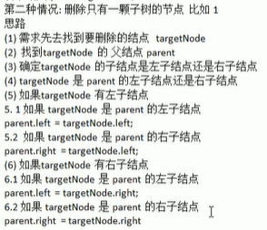

删除后链接两颗树（找到右子树的最小节点，替换当前的节点）


```java
public class Main {
    public static void main(String[] args) {
        int[] arr = {7, 3, 10, 12, 5, 1, 9,2};
        BinarySortTree binarySortTree = new BinarySortTree();
        for (int i = 0; i < arr.length; i++) {
            binarySortTree.add(new Node(arr[i]));
        }
        System.out.println("删除节点前的树：");
        binarySortTree.infixOrder();
//        System.out.println("\n删除叶子节点2");
//        binarySortTree.delNode(2);
//        System.out.println("删除叶子节点1");
//        binarySortTree.delNode(1);
//        System.out.println("删除叶子节点5");
//        binarySortTree.delNode(5);
//        System.out.println("删除叶子节点9");
//        binarySortTree.delNode(9);

//        System.out.println("\n删除叶子节点1");
//        binarySortTree.delNode(1);

//        System.out.println("\n删除子树7：");
//        binarySortTree.delNode(7);

        binarySortTree.delNode(2);
        binarySortTree.delNode(5);
        binarySortTree.delNode(9);
        binarySortTree.delNode(12);
        binarySortTree.delNode(7);
        binarySortTree.delNode(3);
        binarySortTree.delNode(10);
        binarySortTree.delNode(1);
        System.out.println("\n删除节点后的树：");
        binarySortTree.infixOrder();
    }
}

//二叉排序树
class BinarySortTree {
    private Node root;

    //二叉排序树添加元素方法
    public void add(Node node) {
        if (root == null) {
            root = node;
        } else {
            root.add(node);
        }
    }

    public void infixOrder() {
        if (root == null)
            System.out.println("树为空！");
        else
            root.infixOrder();
    }

    //查找要删除的节点
    public Node search(int val) {
        if (root == null) {
            return null;
        } else {
            return root.search(val);
        }
    }

    //查找当前节点的父节点
    public Node searchParent(int val) {
        if (root == null) {
            return null;
        } else {
            return root.searchParent(val);
        }
    }

    //找到这个node子树下的最小节点值
    public Node delRightTreeMin(Node node){
        Node targetNode = node;
        while (targetNode.left!=null)//一直往左，到叶子位置就是node这棵树的最小节点
            targetNode = targetNode.left;
        delNode(targetNode.val);//要拿走这个节点，就得删掉之前的位置
        return targetNode;
    }

    //删除节点
    public void delNode(int val) {
        if (root == null) {
            return;
        } else {
            //找到当前要删除的节点
            Node targetNode = search(val);
            if (targetNode == null)
                return;
            //如果是只有一个根节点就直接删除
            if (root.val == val && root.left == null && root.right == null) {
                root = null;
                return;
            }
            //找到当前节点的父节点
            Node parent = searchParent(val);
            //根据target的情况做不同删除
            if (targetNode.left == null && targetNode.right == null){//如果是叶子节点
                if (parent.left!=null && parent.left==targetNode){
                    parent.left = null;
                }else if (parent.right!=null && parent.right.val == val){
                    parent.right = null;
                }
            }else if (targetNode.left!=null && targetNode.right!=null){//如果是有两颗子树
                Node minNode = delRightTreeMin(targetNode.right);//右子树的最小节点，也是最适合当前位置的节点
                targetNode.val = minNode.val;//这样就直接让target变为了minNode了                    
            }else {//如果是只有一颗子树，删除targetNode，parent连接targetNode的子树
                if (targetNode.left!=null){//targetNode有左子树
                    if (parent!=null){
                        if (parent.left.val==targetNode.val){//如果targetNode是parent的左子树，则targetNode子树的一切都比parent小
                            parent.left = targetNode.left;
                        }else {//如果targetNode是parent的右子树，则targetNode子树的一切都比parent大
                            parent.right = targetNode.left;
                        }
                    }else {//删除根节点时的处理
                        root = targetNode.left;
                    }
                }else {//targetNode有右子树
                    if (parent!=null){
                        if (parent.left.val==targetNode.val){//如果targetNode是parent的左子树，则targetNode子树的一切都比parent小
                            parent.left = targetNode.right;
                        }else {//如果targetNode是parent的右子树，则targetNode子树的一切都比parent大
                            parent.right = targetNode.right;
                        }
                    }else {
                        root = targetNode.right;
                    }
                }
            }
        }
    }
}

class Node {
    int val;
    Node left;
    Node right;

    public Node(int val) {
        this.val = val;
    }

    //二叉排序树的构建
    public void add(Node node) {
        if (node == null) {
            return;
        }
        if (node.val < this.val) {//小于当前加到左子节点
            if (this.left == null) {
                this.left = node;
            } else {
                this.left.add(node);//如果左子节点有值，则递归给左子节点判断
            }
        } else {//大于当前加到右子节点
            if (this.right == null) {
                this.right = node;
            } else {
                this.right.add(node);//如果右子节点有值，则递归给右子节点判断
            }
        }
    }

    //中序遍历
    public void infixOrder() {
        if (this.left != null) {
            this.left.infixOrder();
        }
        System.out.print(this.val + "->");
        if (this.right != null) {
            this.right.infixOrder();
        }
    }

    //查找要删除的节点
    public Node search(int val) {
        if (val == this.val) {
            return this;
        } else if (val < this.val) {//查的值小于当前节点，往左边搜索
            if (this.left == null)
                return null;
            return this.left.search(val);
        } else {//查找的值大于当前节点，往右递归
            if (this.right == null)
                return null;
            return this.right.search(val);
        }
    }

    //查找要删除节点的父节点
    public Node searchParent(int val) {
        if ((this.left != null && this.left.val == val) || (this.right != null && this.right.val == val)) {//找到子节点是符合的值
            return this;
        } else {//当前节点的子节点不符合
            if (val < this.val && this.left != null) {//如果是小于当前节点的。则左递归去继续找
                return this.left.searchParent(val);
            } else if (val >= this.val && this.right != null) {
                return this.right.searchParent(val);
            } else {
                return null;
            }
        }
    }
}
```

* 删除的节点是叶子节点时：找到父节点，将对应的子节点直接置空。
* 删除的节点是有一颗子树时：感觉父节点的左边都是小于它，右边都是大于它的特点。重新连接删除节点的子树。
* 删除的节点是有两颗子树时：找到删除节点的右子树中最小的一个值，这个值就适合来替换当前节点，以此来删除。


(这里删除7就是找到9来替换7，所以重新中序遍历时显示9的位置在中间)


（在增加判断父节点后，可以实现将整棵树全部删除）


### 平衡二叉树

处理二叉排序树存在的问题。如果数组本身有序，则按照传统二叉排序树的开始是将首个元素作为根节点，这会导致后续所有的值都是建立在右子节点不断延申。此时的树更像一个链表，也就具有链表的一个问题，查询的速度变慢。特别是要查一个最大的值，是要遍历完这棵树。


#### 左旋转


左旋步骤：

* 创新的点


* 新点连左


*  新连右左


* 旧换右值，旧连右右

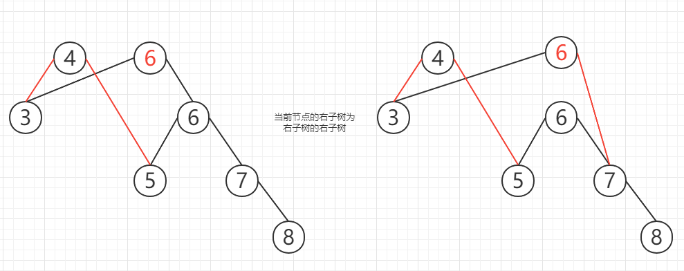

* 旧左连新


* 旧去旧右


修改之前的平衡二叉树插入节点方法，在每次插入后检查是否右子树高度-左子树高度>1。是的话将这个节点对应的树进行一个左旋。

```java
public class Main {
    public static void main(String[] args) {
        int[] arr = {4,3,6,5,7,8};
        AVLTree avlTree = new AVLTree();
        for (int element:arr) {
            avlTree.add(new Node(element));
        }
        System.out.println("AVL树原始中序遍历(没旋转，是原始二叉排序树)：");
        avlTree.infixOrder();
        System.out.println("\n当前根节点是："+avlTree.getRoot().val);
        System.out.println("根节点的高度为："+avlTree.getRoot().height());
        System.out.println("根节点左子树高度为："+avlTree.getRoot().leftHeight());
        System.out.println("根节点右子树高度为："+avlTree.getRoot().rightHeight());
    }
}

class AVLTree{
    private Node root;

    public Node getRoot() {
        return root;
    }

    public void setRoot(Node root) {
        this.root = root;
    }

    //二叉排序树添加元素方法
    public void add(Node node) {
        if (root == null) {
            root = node;
        } else {
            root.add(node);
        }
    }

    public void infixOrder() {
        if (root == null)
            System.out.println("树为空！");
        else
            root.infixOrder();
    }

    //查找要删除的节点
    public Node search(int val) {
        if (root == null) {
            return null;
        } else {
            return root.search(val);
        }
    }

    //查找当前节点的父节点
    public Node searchParent(int val) {
        if (root == null) {
            return null;
        } else {
            return root.searchParent(val);
        }
    }

    //找到这个node子树下的最小节点值
    public Node delRightTreeMin(Node node){
        Node targetNode = node;
        while (targetNode.left!=null)//一直往左，到叶子位置就是node这棵树的最小节点
            targetNode = targetNode.left;
        delNode(targetNode.val);//要拿走这个节点，就得删掉之前的位置
        return targetNode;
    }

    //删除节点
    public void delNode(int val) {
        if (root == null) {
            return;
        } else {
            //找到当前要删除的节点
            Node targetNode = search(val);
            if (targetNode == null)
                return;
            //如果是只有一个根节点就直接删除
            if (root.val == val && root.left == null && root.right == null) {
                root = null;
                return;
            }
            //找到当前节点的父节点
            Node parent = searchParent(val);
            //根据target的情况做不同删除
            if (targetNode.left == null && targetNode.right == null){//如果是叶子节点
                if (parent.left!=null && parent.left==targetNode){
                    parent.left = null;
                }else if (parent.right!=null && parent.right.val == val){
                    parent.right = null;
                }
            }else if (targetNode.left!=null && targetNode.right!=null){//如果是有两颗子树
                Node minNode = delRightTreeMin(targetNode.right);//右子树的最小节点，也是最适合当前位置的节点
                targetNode.val = minNode.val;//这样就直接让target变为了minNode了                    
            }else {//如果是只有一颗子树，删除targetNode，parent连接targetNode的子树
                if (targetNode.left!=null){//targetNode有左子树
                    if (parent!=null){
                        if (parent.left.val==targetNode.val){//如果targetNode是parent的左子树，则targetNode子树的一切都比parent小
                            parent.left = targetNode.left;
                        }else {//如果targetNode是parent的右子树，则targetNode子树的一切都比parent大
                            parent.right = targetNode.left;
                        }
                    }else {//删除根节点时的处理
                        root = targetNode.left;
                    }
                }else {//targetNode有右子树
                    if (parent!=null){
                        if (parent.left.val==targetNode.val){//如果targetNode是parent的左子树，则targetNode子树的一切都比parent小
                            parent.left = targetNode.right;
                        }else {//如果targetNode是parent的右子树，则targetNode子树的一切都比parent大
                            parent.right = targetNode.right;
                        }
                    }else {
                        root = targetNode.right;
                    }
                }
            }
        }
    }
}

class Node{
    int val;
    Node left;
    Node right;

    public Node(int val) {
        this.val = val;
    }

    //计算当前节点的高度
    public int height(){
        return Math.max(left==null?0:left.height(),right==null?0: right.height())+1;
    }

    //计算当前左子树的高度
    public int leftHeight(){
        if (left==null)
            return 0;
        return left.height();
    }

    //计算当前右子树的高度
    public int rightHeight(){
        if (right==null)
            return 0;
        return right.height();
    }

    //左旋转
    private void leftRotate(){
        //1. 创建新节点，值是当前节点值
        Node newNode = new Node(val);
        //2. 新节点左子树为当前节点左子树。
        newNode.left = left;
        //3. 新节点右子树为当前节点右子树的左子树
        newNode.right = right.left;
        //4. 当前节点值换为右子节点值
        val = right.val;
        //5. 当前节点的右子树是右子节点的右子树
        right = right.right;
        //6. 当前节点的左子树为新节点
        left = newNode;
    }

    //二叉排序树的构建
    public void add(Node node) {
        if (node == null) {
            return;
        }
        if (node.val < this.val) {//小于当前加到左子节点
            if (this.left == null) {
                this.left = node;
            } else {
                this.left.add(node);//如果左子节点有值，则递归给左子节点判断
            }
        } else {//大于当前加到右子节点
            if (this.right == null) {
                this.right = node;
            } else {
                this.right.add(node);//如果右子节点有值，则递归给右子节点判断
            }
        }
        //添加完一个节点，右子树高度-左子树高度>1。进行左旋转
        if (rightHeight()-leftHeight()>1){
            leftRotate();
        }
    }

    //中序遍历
    public void infixOrder() {
        if (this.left != null) {
            this.left.infixOrder();
        }
        System.out.print(this.val + "->");
        if (this.right != null) {
            this.right.infixOrder();
        }
    }

    //查找要删除的节点
    public Node search(int val) {
        if (val == this.val) {
            return this;
        } else if (val < this.val) {//查的值小于当前节点，往左边搜索
            if (this.left == null)
                return null;
            return this.left.search(val);
        } else {//查找的值大于当前节点，往右递归
            if (this.right == null)
                return null;
            return this.right.search(val);
        }
    }

    //查找要删除节点的父节点
    public Node searchParent(int val) {
        if ((this.left != null && this.left.val == val) || (this.right != null && this.right.val == val)) {//找到子节点是符合的值
            return this;
        } else {//当前节点的子节点不符合
            if (val < this.val && this.left != null) {//如果是小于当前节点的。则左递归去继续找
                return this.left.searchParent(val);
            } else if (val >= this.val && this.right != null) {
                return this.right.searchParent(val);
            } else {
                return null;
            }
        }
    }
}
```

左旋前：


左旋后：


#### 右旋转

同右子树高度差大时进行左旋转一样。在左子树高度差大时也需要进行右旋转。


和左旋转一样的操作，不过是对称相反。


```java
public class Main {
    public static void main(String[] args) {
        //int[] arr = {4,3,6,5,7,8};
        //AVLTree avlTree = new AVLTree();
        //for (int element:arr) {
        //    avlTree.add(new Node(element));
        //}
        //System.out.println("AVL树原始中序遍历(没旋转，是原始二叉排序树)：");
        //avlTree.infixOrder();
        //System.out.println("\n当前根节点是："+avlTree.getRoot().val);
        //System.out.println("根节点的高度为："+avlTree.getRoot().height());
        //System.out.println("根节点左子树高度为："+avlTree.getRoot().leftHeight());
        //System.out.println("根节点右子树高度为："+avlTree.getRoot().rightHeight());
        int[] arr = {10,12,8,9,7,6};
        AVLTree avlTree = new AVLTree();
        for (int element:arr) {
            avlTree.add(new Node(element));
        }
        System.out.println("AVL树原始中序遍历(没旋转，是原始二叉排序树)：");
        avlTree.infixOrder();
        System.out.println("\n当前根节点是："+avlTree.getRoot().val);
        System.out.println("根节点的高度为："+avlTree.getRoot().height());
        System.out.println("根节点左子树高度为："+avlTree.getRoot().leftHeight());
        System.out.println("根节点右子树高度为："+avlTree.getRoot().rightHeight());
    }
}

class AVLTree{
    private Node root;

    public Node getRoot() {
        return root;
    }

    public void setRoot(Node root) {
        this.root = root;
    }

    //二叉排序树添加元素方法
    public void add(Node node) {
        if (root == null) {
            root = node;
        } else {
            root.add(node);
        }
    }

    public void infixOrder() {
        if (root == null)
            System.out.println("树为空！");
        else
            root.infixOrder();
    }

    //查找要删除的节点
    public Node search(int val) {
        if (root == null) {
            return null;
        } else {
            return root.search(val);
        }
    }

    //查找当前节点的父节点
    public Node searchParent(int val) {
        if (root == null) {
            return null;
        } else {
            return root.searchParent(val);
        }
    }

    //找到这个node子树下的最小节点值
    public Node delRightTreeMin(Node node){
        Node targetNode = node;
        while (targetNode.left!=null)//一直往左，到叶子位置就是node这棵树的最小节点
            targetNode = targetNode.left;
        delNode(targetNode.val);//要拿走这个节点，就得删掉之前的位置
        return targetNode;
    }

    //删除节点
    public void delNode(int val) {
        if (root == null) {
            return;
        } else {
            //找到当前要删除的节点
            Node targetNode = search(val);
            if (targetNode == null)
                return;
            //如果是只有一个根节点就直接删除
            if (root.val == val && root.left == null && root.right == null) {
                root = null;
                return;
            }
            //找到当前节点的父节点
            Node parent = searchParent(val);
            //根据target的情况做不同删除
            if (targetNode.left == null && targetNode.right == null){//如果是叶子节点
                if (parent.left!=null && parent.left==targetNode){
                    parent.left = null;
                }else if (parent.right!=null && parent.right.val == val){
                    parent.right = null;
                }
            }else if (targetNode.left!=null && targetNode.right!=null){//如果是有两颗子树
                Node minNode = delRightTreeMin(targetNode.right);//右子树的最小节点，也是最适合当前位置的节点
                targetNode.val = minNode.val;//这样就直接让target变为了minNode了                    
            }else {//如果是只有一颗子树，删除targetNode，parent连接targetNode的子树
                if (targetNode.left!=null){//targetNode有左子树
                    if (parent!=null){
                        if (parent.left.val==targetNode.val){//如果targetNode是parent的左子树，则targetNode子树的一切都比parent小
                            parent.left = targetNode.left;
                        }else {//如果targetNode是parent的右子树，则targetNode子树的一切都比parent大
                            parent.right = targetNode.left;
                        }
                    }else {//删除根节点时的处理
                        root = targetNode.left;
                    }
                }else {//targetNode有右子树
                    if (parent!=null){
                        if (parent.left.val==targetNode.val){//如果targetNode是parent的左子树，则targetNode子树的一切都比parent小
                            parent.left = targetNode.right;
                        }else {//如果targetNode是parent的右子树，则targetNode子树的一切都比parent大
                            parent.right = targetNode.right;
                        }
                    }else {
                        root = targetNode.right;
                    }
                }
            }
        }
    }
}

class Node{
    int val;
    Node left;
    Node right;

    public Node(int val) {
        this.val = val;
    }

    //计算当前节点的高度
    public int height(){
        return Math.max(left==null?0:left.height(),right==null?0: right.height())+1;
    }

    //计算当前左子树的高度
    public int leftHeight(){
        if (left==null)
            return 0;
        return left.height();
    }

    //计算当前右子树的高度
    public int rightHeight(){
        if (right==null)
            return 0;
        return right.height();
    }

    //左旋转
    private void leftRotate(){
        //1. 创建新节点，值是当前节点值
        Node newNode = new Node(val);
        //2. 新节点左子树为当前节点左子树。
        newNode.left = left;
        //3. 新节点右子树为当前节点右子树的左子树
        newNode.right = right.left;
        //4. 当前节点值换为右子节点值
        val = right.val;
        //5. 当前节点的右子树是右子节点的右子树
        right = right.right;
        //6. 当前节点的左子树为新节点
        left = newNode;
    }

    private void rightRotate(){
        //1. 创建新节点，值是当前节点值
        Node newNode = new Node(val);
        //2. 新节点右子树为当前节点右子树
        newNode.right = right;
        //3. 新节点左子树作为当前节点左子树的右子树
        newNode.left = left.right;
        //4. 当前节点值换为左子节点值
        val = left.val;
        //5. 当前节点的左子树是左子节点的左子树
        left = left.left;
        //6. 当前节点的右子树为新节点
        right = newNode;
    }

    //二叉排序树的构建
    public void add(Node node) {
        if (node == null) {
            return;
        }
        if (node.val < this.val) {//小于当前加到左子节点
            if (this.left == null) {
                this.left = node;
            } else {
                this.left.add(node);//如果左子节点有值，则递归给左子节点判断
            }
        } else {//大于当前加到右子节点
            if (this.right == null) {
                this.right = node;
            } else {
                this.right.add(node);//如果右子节点有值，则递归给右子节点判断
            }
        }
        //添加完一个节点，右子树高度-左子树高度>1。进行左旋转
        if (rightHeight()-leftHeight()>1){
            leftRotate();
        }
        if (leftHeight()-rightHeight()>1){
            rightRotate();
        }
    }

    //中序遍历
    public void infixOrder() {
        if (this.left != null) {
            this.left.infixOrder();
        }
        System.out.print(this.val + "->");
        if (this.right != null) {
            this.right.infixOrder();
        }
    }

    //查找要删除的节点
    public Node search(int val) {
        if (val == this.val) {
            return this;
        } else if (val < this.val) {//查的值小于当前节点，往左边搜索
            if (this.left == null)
                return null;
            return this.left.search(val);
        } else {//查找的值大于当前节点，往右递归
            if (this.right == null)
                return null;
            return this.right.search(val);
        }
    }

    //查找要删除节点的父节点
    public Node searchParent(int val) {
        if ((this.left != null && this.left.val == val) || (this.right != null && this.right.val == val)) {//找到子节点是符合的值
            return this;
        } else {//当前节点的子节点不符合
            if (val < this.val && this.left != null) {//如果是小于当前节点的。则左递归去继续找
                return this.left.searchParent(val);
            } else if (val >= this.val && this.right != null) {
                return this.right.searchParent(val);
            } else {
                return null;
            }
        }
    }
}
```

旋转前：


旋转后：


#### 双旋转

一些特殊的树，在进行单独左旋和右旋之后，并不能调整好树的高度。需要通过双旋来处理。


问题分析：

【**LR**】

1. 当符合右旋转时。

2. 当前节点的【左子树的右子树高度】>【左子树的左子树高度】。

   

3. 先对当前节点的左子树进行左旋转

4. 再对当前节点进行右旋转


【**RL**】

同【**LR**】一样的镜像情况，做相反的处理。

```java
public class Main {
    public static void main(String[] args) {
        //左旋测试
        //int[] arr = {4,3,6,5,7,8};
        //AVLTree avlTree = new AVLTree();
        //for (int element:arr) {
        //    avlTree.add(new Node(element));
        //}
        //System.out.println("AVL树原始中序遍历(没旋转，是原始二叉排序树)：");
        //avlTree.infixOrder();
        //System.out.println("\n当前根节点是："+avlTree.getRoot().val);
        //System.out.println("根节点的高度为："+avlTree.getRoot().height());
        //System.out.println("根节点左子树高度为："+avlTree.getRoot().leftHeight());
        //System.out.println("根节点右子树高度为："+avlTree.getRoot().rightHeight());
        //右旋测试
        //int[] arr = {10,12,8,9,7,6};
        //AVLTree avlTree = new AVLTree();
        //for (int element:arr) {
        //    avlTree.add(new Node(element));
        //}
        //System.out.println("AVL树原始中序遍历(没旋转，是原始二叉排序树)：");
        //avlTree.infixOrder();
        //System.out.println("\n当前根节点是："+avlTree.getRoot().val);
        //System.out.println("根节点的高度为："+avlTree.getRoot().height());
        //System.out.println("根节点左子树高度为："+avlTree.getRoot().leftHeight());
        //System.out.println("根节点右子树高度为："+avlTree.getRoot().rightHeight());
        //双旋转测试
        int[] arr = {10,11,7,6,8,9};
        AVLTree avlTree = new AVLTree();
        for (int element:arr) {
            avlTree.add(new Node(element));
        }
        System.out.println("AVL树原始中序遍历(没旋转，是原始二叉排序树)：");
        avlTree.infixOrder();
        System.out.println("\n当前根节点是："+avlTree.getRoot().val);
        System.out.println("根节点的高度为："+avlTree.getRoot().height());
        System.out.println("根节点左子树"+avlTree.getRoot().left.val+"高度为："+avlTree.getRoot().leftHeight());
        System.out.println("根节点右子树"+avlTree.getRoot().right.val+"高度为："+avlTree.getRoot().rightHeight());
    }
}

class AVLTree{
    private Node root;

    public Node getRoot() {
        return root;
    }

    public void setRoot(Node root) {
        this.root = root;
    }

    //二叉排序树添加元素方法
    public void add(Node node) {
        if (root == null) {
            root = node;
        } else {
            root.add(node);
        }
    }

    public void infixOrder() {
        if (root == null)
            System.out.println("树为空！");
        else
            root.infixOrder();
    }

    //查找要删除的节点
    public Node search(int val) {
        if (root == null) {
            return null;
        } else {
            return root.search(val);
        }
    }

    //查找当前节点的父节点
    public Node searchParent(int val) {
        if (root == null) {
            return null;
        } else {
            return root.searchParent(val);
        }
    }

    //找到这个node子树下的最小节点值
    public Node delRightTreeMin(Node node){
        Node targetNode = node;
        while (targetNode.left!=null)//一直往左，到叶子位置就是node这棵树的最小节点
            targetNode = targetNode.left;
        delNode(targetNode.val);//要拿走这个节点，就得删掉之前的位置
        return targetNode;
    }

    //删除节点
    public void delNode(int val) {
        if (root == null) {
            return;
        } else {
            //找到当前要删除的节点
            Node targetNode = search(val);
            if (targetNode == null)
                return;
            //如果是只有一个根节点就直接删除
            if (root.val == val && root.left == null && root.right == null) {
                root = null;
                return;
            }
            //找到当前节点的父节点
            Node parent = searchParent(val);
            //根据target的情况做不同删除
            if (targetNode.left == null && targetNode.right == null){//如果是叶子节点
                if (parent.left!=null && parent.left==targetNode){
                    parent.left = null;
                }else if (parent.right!=null && parent.right.val == val){
                    parent.right = null;
                }
            }else if (targetNode.left!=null && targetNode.right!=null){//如果是有两颗子树
                Node minNode = delRightTreeMin(targetNode.right);//右子树的最小节点，也是最适合当前位置的节点
                targetNode.val = minNode.val;//这样就直接让target变为了minNode了                    
            }else {//如果是只有一颗子树，删除targetNode，parent连接targetNode的子树
                if (targetNode.left!=null){//targetNode有左子树
                    if (parent!=null){
                        if (parent.left.val==targetNode.val){//如果targetNode是parent的左子树，则targetNode子树的一切都比parent小
                            parent.left = targetNode.left;
                        }else {//如果targetNode是parent的右子树，则targetNode子树的一切都比parent大
                            parent.right = targetNode.left;
                        }
                    }else {//删除根节点时的处理
                        root = targetNode.left;
                    }
                }else {//targetNode有右子树
                    if (parent!=null){
                        if (parent.left.val==targetNode.val){//如果targetNode是parent的左子树，则targetNode子树的一切都比parent小
                            parent.left = targetNode.right;
                        }else {//如果targetNode是parent的右子树，则targetNode子树的一切都比parent大
                            parent.right = targetNode.right;
                        }
                    }else {
                        root = targetNode.right;
                    }
                }
            }
        }
    }
}

class Node{
    int val;
    Node left;
    Node right;

    public Node(int val) {
        this.val = val;
    }

    //计算当前节点的高度
    public int height(){
        return Math.max(left==null?0:left.height(),right==null?0: right.height())+1;
    }

    //计算当前左子树的高度
    public int leftHeight(){
        if (left==null)
            return 0;
        return left.height();
    }

    //计算当前右子树的高度
    public int rightHeight(){
        if (right==null)
            return 0;
        return right.height();
    }

    //左旋转
    private void leftRotate(){
        //1. 创建新节点，值是当前节点值
        Node newNode = new Node(val);
        //2. 新节点左子树为当前节点左子树。
        newNode.left = left;
        //3. 新节点右子树为当前节点右子树的左子树
        newNode.right = right.left;
        //4. 当前节点值换为右子节点值
        val = right.val;
        //5. 当前节点的右子树是右子节点的右子树
        right = right.right;
        //6. 当前节点的左子树为新节点
        left = newNode;
    }

    private void rightRotate(){
        //1. 创建新节点，值是当前节点值
        Node newNode = new Node(val);
        //2. 新节点右子树为当前节点右子树
        newNode.right = right;
        //3. 新节点左子树作为当前节点左子树的右子树
        newNode.left = left.right;
        //4. 当前节点值换为左子节点值
        val = left.val;
        //5. 当前节点的左子树是左子节点的左子树
        left = left.left;
        //6. 当前节点的右子树为新节点
        right = newNode;
    }

    //二叉排序树的构建
    public void add(Node node) {
        if (node == null) {
            return;
        }
        if (node.val < this.val) {//小于当前加到左子节点
            if (this.left == null) {
                this.left = node;
            } else {
                this.left.add(node);//如果左子节点有值，则递归给左子节点判断
            }
        } else {//大于当前加到右子节点
            if (this.right == null) {
                this.right = node;
            } else {
                this.right.add(node);//如果右子节点有值，则递归给右子节点判断
            }
        }
        //每添加一个节点，就判断当前树的状况，对应进行左旋或右旋操作
        if (rightHeight()-leftHeight()>1){//左旋
            //如果当前节点的右子树存在左>右，则要对这颗右子树进行右旋
            if (right!=null && right.leftHeight() > right.rightHeight() ){
                right.rightRotate();
            }
            leftRotate();
        }else if (leftHeight()-rightHeight()>1){//右旋
            //如果当前节点的左子树存在左<右，则要对这颗左子树进行左旋
            if (left!=null && left.leftHeight() < left.rightHeight()){
                left.leftRotate();
            }
            rightRotate();
        }
    }

    //中序遍历
    public void infixOrder() {
        if (this.left != null) {
            this.left.infixOrder();
        }
        System.out.print(this.val + "->");
        if (this.right != null) {
            this.right.infixOrder();
        }
    }

    //查找要删除的节点
    public Node search(int val) {
        if (val == this.val) {
            return this;
        } else if (val < this.val) {//查的值小于当前节点，往左边搜索
            if (this.left == null)
                return null;
            return this.left.search(val);
        } else {//查找的值大于当前节点，往右递归
            if (this.right == null)
                return null;
            return this.right.search(val);
        }
    }

    //查找要删除节点的父节点
    public Node searchParent(int val) {
        if ((this.left != null && this.left.val == val) || (this.right != null && this.right.val == val)) {//找到子节点是符合的值
            return this;
        } else {//当前节点的子节点不符合
            if (val < this.val && this.left != null) {//如果是小于当前节点的。则左递归去继续找
                return this.left.searchParent(val);
            } else if (val >= this.val && this.right != null) {
                return this.right.searchParent(val);
            } else {
                return null;
            }
        }
    }
}
```

进行普通左旋和普通右旋结果：


进行双旋转后：


### 多路查找树

二叉树因为存在一些局限（节点多时，路径的长度变大，每个的节点的高度变大），所以需要多叉树。


#### 2-3树


**2-3树的构建过程**

> 规则一：叶子节点都要在同一层
>
> 规则二：2树2节点，3树3节点
>
> 规则三：3树要么作为子节点，要么必须满子节点
>
> 规则四：节点满足前面的情况下，超过三个值就要拆分将中间值升级到上层，如果上层满了就拆到下层。拆后要调整为满树。
>
> 规则五：3树也要满足排序树规则

插入数据时，先放在同一列，当超过2个时进行拆分为二叉树。

* 插入12，构建12节点
* 插入24，16<24，插入到16后面
* 插入12，12<16<24，放到16前面，此时12-16-24有三个值，需要拆分左右12和24为子节点，则16还在原来的位置作为父节点。
* 插入32，16<24<32，插入到24后面


* 插入14，12<14<16，插入到12后面
* 插入26，16<24<26<32，插入到24和32中间，此时24-26-32共有三个值，需要拆分左右24和32作为子节点，则26作为父节点升级到上一层，插入到16后面。
* 插入34，16<26<24<32<34，插入到32前面


* 插入10，10<12<14<16<26，此时10-12-14共有三个值，拆分左右10和14做子节点，原本12应该往上升级，但是一升级根节点就三个元素了，只能往下扩展，12位置不变。
* 此时为了平衡，从根节点将26往下拉，降下来作为子节点


* 插入8，8<10<12<16，插入到10的前面
* 插入28，16<26<28<32<34，此时28-32-34共有三个值，拆分28和34作为左右节点，32作为父节点往上升级。


* 插入38，16<32<34<38，插入到34前面
* 插入20，16<20<24<26，插入到24前面


#### 2-3-4树


#### B树

是前面所学的2-3树。2-3-4树，目的是为了高效存储数据，避免数据过多时。树的高度变太高。


#### B+树

数据存储在叶子节点，并且通过索引方式，使得在搜寻某一位置的值时，不必从链表的头开始。而是从树的索引进入对应的数据段里面查找。


#### B*树

在非叶子节点中通过兄弟指针，避免搜索过程一次查询不到，还得重根节点重新查询。


## 图

线性的结构可以处理一对多的情况，但是多对多的情况就需要依靠图数据结构。


### 邻接矩阵


前面的小数字是表示节点，例如节点0有连接的节点是1，2，3，4。节点1有连接的节点是0，4。


> 邻接矩阵的代码实现

```java
public class Main {
    public static void main(String[] args) {
        //创建图，添加顶点
        int n = 5;//顶点的个数
        String[] vertex = {"A","B","C","D","E"};
        Graph graph = new Graph(n);
        for (String val:vertex) {
            graph.insertVertex(val);
        }
        //添加边
        graph.insertEdge(0,1,1);//A-B
        graph.insertEdge(0,2,1);//A-C
        graph.insertEdge(1,2,1);//B-C
        graph.insertEdge(1,3,1);//B-D
        graph.insertEdge(1,4,1);//B-E
        //显示邻接矩阵
        graph.showGraph();
    }
}
class Graph{
    private List<String> vertexList;//存储顶点
    private int[][] edges;//存储邻接矩阵
    private int numOfEdges;//表示边的个数

    public Graph(int n) {
        vertexList = new ArrayList<>(n);
        edges = new int[n][n];
        numOfEdges = 0;
    }

    //返回顶点的个数
    public int getNumOfVertex(){
        return vertexList.size();
    }

    //返回边的数目
    public int getNumOfEdges(){
        return numOfEdges;
    }

    //返回顶点i对应的数据
    public String getValueByIndex(int i){
        return vertexList.get(i);
    }

    //返回两个顶点的权值
    public int getWeight(int v1, int v2){
        return edges[v1][v2];
    }

    //显示图对应的矩阵
    public void showGraph(){
        for (int[] arr:edges){
            System.out.println(Arrays.toString(arr));
        }
    }

    //插入顶点
    public void insertVertex(String vertex){
        vertexList.add(vertex);
    }

    /**
     * 添加边(无向)
     * @param v1 顶点坐标
     * @param v2 顶点坐标
     * @param weight 边权值
     */
    public void insertEdge(int v1, int v2, int weight){
        edges[v1][v2] = weight;
        edges[v2][v1] = weight;
        numOfEdges++;
    }
}
```


### 深度优先遍历DFS


遍历的过程像是迷宫算法、前序遍历。访问当前节点，然后下一步，如果下一步递归找不到，则会回溯到当前节点，切换下一个继续。如果当前节点也是没有其他路径，会继续回溯，直到回溯到根节点结束。（上面的图中节点的插入顺序的ABCDE，所以如果从A开始，到达B后找到的下一个邻接就算C，再下一个邻接是D，再下一个邻接是E。结果就是A->A->B->C->D->E->）。

* 从A开始找到B，递归以B开始

* 从B开始找到C，D，E。分别递归开始

* C，D，E找不到合适的，结束

* A->B->C->D->E->

```java
public class Main {
    public static void main(String[] args) {
        //创建图，添加顶点
        int n = 5;//顶点的个数
        String[] vertex = {"A","B","C","D","E"};
        Graph graph = new Graph(n);
        for (String val:vertex) {
            graph.insertVertex(val);
        }
        //添加边
        graph.insertEdge(0,1,1);//A-B
        graph.insertEdge(0,2,1);//A-C
        graph.insertEdge(1,2,1);//B-C
        graph.insertEdge(1,3,1);//B-D
        graph.insertEdge(1,4,1);//B-E
        //显示邻接矩阵
        graph.showGraph();
        //深度优先遍历
        graph.dfs();
    }
}
class Graph{
    private List<String> vertexList;//存储顶点
    private int[][] edges;//存储邻接矩阵
    private int numOfEdges;//表示边的个数
    private boolean[] isVisited;//记录顶点是否访问过

    public Graph(int n) {
        vertexList = new ArrayList<>(n);
        edges = new int[n][n];
        isVisited = new boolean[n];
        numOfEdges = 0;
    }

    //返回顶点的个数
    public int getNumOfVertex(){
        return vertexList.size();
    }

    //返回边的数目
    public int getNumOfEdges(){
        return numOfEdges;
    }

    //返回顶点i对应的数据
    public String getValueByIndex(int i){
        return vertexList.get(i);
    }

    //返回两个顶点的权值
    public int getWeight(int v1, int v2){
        return edges[v1][v2];
    }

    //显示图对应的矩阵
    public void showGraph(){
        Object[] vertexArr = vertexList.toArray();
        System.out.println("    "+Arrays.toString(vertexArr));
        for (int i = 0;i<edges.length;i++){
            System.out.println("["+vertexArr[i]+"] "+Arrays.toString(edges[i]));
        }
    }

    //插入顶点
    public void insertVertex(String vertex){
        vertexList.add(vertex);
    }

    /**
     * 添加边(无向)
     * @param v1 顶点坐标
     * @param v2 顶点坐标
     * @param weight 边权值
     */
    public void insertEdge(int v1, int v2, int weight){
        edges[v1][v2] = weight;
        edges[v2][v1] = weight;
        numOfEdges++;
    }

    /**
     * 查询这个元素第一个邻接节点（edges中的行代表这个元素，这行的每一列代表这个元素连接的顶点情况）
     * @param preRowIndex 查询元素的行坐标
     * @return 在这一行里搜到第一个邻接的节点坐标
     */
    public int getFirstNeighbor(int preRowIndex){
        for (int i = 0; i < vertexList.size(); i++) {
            if (edges[preRowIndex][i]>0){
                return i;
            }
        }
        return -1;
    }

    /**
     * 查询这个元素的下一个邻接节点（和上面的方法一样）
     * @param preRowIndex 前一个邻接节点的行下标preRowIndex
     * @param preColIndex 前一个邻接节点的列下标preColIndex
     * @return 指定列坐标，所以只需要找这一行中这个列后面的其他列有连接节点的坐标
     */
    public int getNextNeighbor(int preRowIndex, int preColIndex){
        for (int i = preColIndex + 1; i < vertexList.size(); i++){
            if (edges[preRowIndex][i] > 0){
                return i;
            }
        }
        return -1;
    }

    //深度优先遍历（对一个节点进行）
    public void dfs(boolean[] isVisited, int i){
        //访问该节点
        System.out.print(getValueByIndex(i)+"->");
        //设置节点已访问
        isVisited[i] = true;
        //获取第一个邻接节点
        int w = getFirstNeighbor(i);
        //如果邻接节点存在，开始访问
        while (w != -1){
            //节点w未被访问过，则递归访问
            if (!isVisited[w]){
                dfs(isVisited,w);
            }
            //如果w已经被访问，则切换到下一个邻接节点
            w = getNextNeighbor(i,w);
        }
    }

    //对dfs进行重载（遍历将所有节点都进行搜索，因为如果存在未联通图会导致遍历不完全）
    public void dfs(){
        for (int i = 0;i < getNumOfVertex();i++){
            if (!isVisited[i]){
                dfs(isVisited,i);
            }
        }
    }
}
```


### 广度优先遍历BFS

一层层搜索，先把搜索一遍的存到队列。这一层遍历完，则从队列取出顶点，搜索邻接节点，继续遍历。


* A先遍历找到B和C，入队列【A，B，C】。

* 出队列A找下一个，找不到。

* 出队列B找下一个，找到D和E，入队列【B，C，D，E】

* B，C，D，E此时出队列找不到，队列为空，结束遍历。
* A->B->C->D->E

```java
public class Main {
    public static void main(String[] args) {
        //创建图，添加顶点
        int n = 5;//顶点的个数
        String[] vertex = {"A","B","C","D","E"};
        Graph graph = new Graph(n);
        for (String val:vertex) {
            graph.insertVertex(val);
        }
        //添加边
        graph.insertEdge(0,1,1);//A-B
        graph.insertEdge(0,2,1);//A-C
        graph.insertEdge(1,2,1);//B-C
        graph.insertEdge(1,3,1);//B-D
        graph.insertEdge(1,4,1);//B-E
        //显示邻接矩阵
        graph.showGraph();
        //深度优先遍历
        System.out.println("\n深度优先搜索：");
        graph.dfs();
        //清空状态数组
        graph.resetVisited();
        //广度优先遍历
        System.out.println("\n广度优先搜索：");
        graph.bfs();
    }
}
class Graph{
    private List<String> vertexList;//存储顶点
    private int[][] edges;//存储邻接矩阵
    private int numOfEdges;//表示边的个数
    private boolean[] isVisited;//记录顶点是否访问过

    public Graph(int n) {
        vertexList = new ArrayList<>(n);
        edges = new int[n][n];
        isVisited = new boolean[n];
        numOfEdges = 0;
    }

    //返回顶点的个数
    public int getNumOfVertex(){
        return vertexList.size();
    }

    //返回边的数目
    public int getNumOfEdges(){
        return numOfEdges;
    }

    //返回顶点i对应的数据
    public String getValueByIndex(int i){
        return vertexList.get(i);
    }

    //返回两个顶点的权值
    public int getWeight(int v1, int v2){
        return edges[v1][v2];
    }

    //显示图对应的矩阵
    public void showGraph(){
        Object[] vertexArr = vertexList.toArray();
        System.out.println("    "+Arrays.toString(vertexArr));
        for (int i = 0;i<edges.length;i++){
            System.out.println("["+vertexArr[i]+"] "+Arrays.toString(edges[i]));
        }
    }

    //插入顶点
    public void insertVertex(String vertex){
        vertexList.add(vertex);
    }

    /**
     * 添加边(无向)
     * @param v1 顶点坐标
     * @param v2 顶点坐标
     * @param weight 边权值
     */
    public void insertEdge(int v1, int v2, int weight){
        edges[v1][v2] = weight;
        edges[v2][v1] = weight;
        numOfEdges++;
    }

    //清空状态数组（每次搜索最后数组都显示以遍历）
    public void resetVisited(){
        isVisited = new boolean[isVisited.length];
    }

    /**
     * 查询这个元素第一个邻接节点（edges中的行代表这个元素，这行的每一列代表这个元素连接的顶点情况）
     * @param preRowIndex 查询元素的行坐标
     * @return 在这一行里搜到第一个邻接的节点坐标
     */
    public int getFirstNeighbor(int preRowIndex){
        for (int i = 0; i < vertexList.size(); i++) {
            if (edges[preRowIndex][i]>0){
                return i;
            }
        }
        return -1;
    }

    /**
     * 查询这个元素的下一个邻接节点（和上面的方法一样）
     * @param preRowIndex 前一个邻接节点的行下标preRowIndex
     * @param preColIndex 前一个邻接节点的列下标preColIndex
     * @return 指定列坐标，所以只需要找这一行中这个列后面的其他列有连接节点的坐标
     */
    public int getNextNeighbor(int preRowIndex, int preColIndex){
        for (int i = preColIndex + 1; i < vertexList.size(); i++){
            if (edges[preRowIndex][i] > 0){
                return i;
            }
        }
        return -1;
    }

    //深度优先遍历（对一个节点进行）
    public void dfs(boolean[] isVisited, int i){
        //访问该节点
        System.out.print(getValueByIndex(i)+"->");
        //设置节点已访问
        isVisited[i] = true;
        //获取第一个邻接节点
        int w = getFirstNeighbor(i);
        //如果邻接节点存在，开始访问
        while (w != -1){
            //节点w未被访问过，则递归访问
            if (!isVisited[w]){
                dfs(isVisited,w);
            }
            //如果w已经被访问，则切换到下一个邻接节点
            w = getNextNeighbor(i,w);
        }
    }

    //对dfs进行重载（遍历将所有节点都进行搜索，因为如果存在未联通图会导致遍历不完全）
    public void dfs(){
        for (int i = 0;i < getNumOfVertex();i++){
            if (!isVisited[i]){
                dfs(isVisited,i);
            }
        }
    }

    //对一个节点开始进行广度优先遍历
    private void bfs(boolean[] isVisited,int i){
        int u;//表示队列头节点下标
        int w;//邻接节点下标
        //节点访问顺序队列(顶点的下标)
        LinkedList<Integer> queue = new LinkedList<>();
        //访问这个节点
        System.out.print(getValueByIndex(i)+"->");
        //标记为以访问
        isVisited[i] = true;
        //将节点加入队列
        queue.addLast(i);
        while (!queue.isEmpty()){//以队列来操作
            //取出队列的头节点
            u = queue.removeFirst();
            //获取第一个邻接节点
            w = getFirstNeighbor(u);
            //访问所有邻接节点
            while (w!=-1){
                //是否访问过
                if (!isVisited[w]){//没访问过
                    System.err.print(getValueByIndex(w)+"->");
                    //标记以访问
                    isVisited[w] = true;
                    //入队列
                    queue.addLast(w);
                }
                //切换到下一个邻接节点
                w = getNextNeighbor(u,w);
            }
        }
    }

    //对所有节点进行广度优先遍历（遍历将所有节点都进行搜索，因为如果存在未联通图（散在各处的图，彼此之间没有联系）会导致遍历不完全）
    public void bfs(){
        for (int i = 0;i < getNumOfVertex();i++){
            if (!isVisited[i]){
                bfs(isVisited,i);
            }
        }
    }
}
```


### 比较DFS和BFS


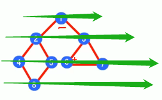

```java
public class Main {
    public static void main(String[] args) {
        //创建图，添加顶点
        String[] vertex = {"1","2","3","4","5","6","7","8"};
        int n = vertex.length;//顶点的个数
        Graph graph = new Graph(n);
        for (String val:vertex) {
            graph.insertVertex(val);
        }
        //添加边
        graph.insertEdge(0,1,1);//1-2
        graph.insertEdge(0,2,1);//1-3
        graph.insertEdge(1,3,1);//2-4
        graph.insertEdge(1,4,1);//2-5
        graph.insertEdge(3,7,1);//4-8
        graph.insertEdge(4,7,1);//5-8
        graph.insertEdge(2,5,1);//3-6
        graph.insertEdge(2,6,1);//3-7
        graph.insertEdge(5,6,1);//6-7
        //显示邻接矩阵
        graph.showGraph();
        //深度优先遍历
        System.out.println("\n深度优先搜索：");
        graph.dfs();
        //清空状态数组
        graph.resetVisited();
        //广度优先遍历
        System.out.println("\n广度优先搜索：");
        graph.bfs();
    }
}
class Graph{
    private List<String> vertexList;//存储顶点
    private int[][] edges;//存储邻接矩阵
    private int numOfEdges;//表示边的个数
    private boolean[] isVisited;//记录顶点是否访问过

    public Graph(int n) {
        vertexList = new ArrayList<>(n);
        edges = new int[n][n];
        isVisited = new boolean[n];
        numOfEdges = 0;
    }

    //返回顶点的个数
    public int getNumOfVertex(){
        return vertexList.size();
    }

    //返回边的数目
    public int getNumOfEdges(){
        return numOfEdges;
    }

    //返回顶点i对应的数据
    public String getValueByIndex(int i){
        return vertexList.get(i);
    }

    //返回两个顶点的权值
    public int getWeight(int v1, int v2){
        return edges[v1][v2];
    }

    //显示图对应的矩阵
    public void showGraph(){
        Object[] vertexArr = vertexList.toArray();
        System.out.println("    "+Arrays.toString(vertexArr));
        for (int i = 0;i<edges.length;i++){
            System.out.println("["+vertexArr[i]+"] "+Arrays.toString(edges[i]));
        }
    }

    //插入顶点
    public void insertVertex(String vertex){
        vertexList.add(vertex);
    }

    /**
     * 添加边(无向)
     * @param v1 顶点坐标
     * @param v2 顶点坐标
     * @param weight 边权值
     */
    public void insertEdge(int v1, int v2, int weight){
        edges[v1][v2] = weight;
        edges[v2][v1] = weight;
        numOfEdges++;
    }

    //清空状态数组（每次搜索最后数组都显示以遍历）
    public void resetVisited(){
        isVisited = new boolean[isVisited.length];
    }

    /**
     * 查询这个元素第一个邻接节点（edges中的行代表这个元素，这行的每一列代表这个元素连接的顶点情况）
     * @param preRowIndex 查询元素的行坐标
     * @return 在这一行里搜到第一个邻接的节点坐标
     */
    public int getFirstNeighbor(int preRowIndex){
        for (int i = 0; i < vertexList.size(); i++) {
            if (edges[preRowIndex][i]>0){
                return i;
            }
        }
        return -1;
    }

    /**
     * 查询这个元素的下一个邻接节点（和上面的方法一样）
     * @param preRowIndex 前一个邻接节点的行下标preRowIndex
     * @param preColIndex 前一个邻接节点的列下标preColIndex
     * @return 指定列坐标，所以只需要找这一行中这个列后面的其他列有连接节点的坐标
     */
    public int getNextNeighbor(int preRowIndex, int preColIndex){
        for (int i = preColIndex + 1; i < vertexList.size(); i++){
            if (edges[preRowIndex][i] > 0){
                return i;
            }
        }
        return -1;
    }

    //深度优先遍历（对一个节点进行）
    public void dfs(boolean[] isVisited, int i){
        //访问该节点
        System.out.print(getValueByIndex(i)+"->");
        //设置节点已访问
        isVisited[i] = true;
        //获取第一个邻接节点
        int w = getFirstNeighbor(i);
        //如果邻接节点存在，开始访问
        while (w != -1){
            //节点w未被访问过，则递归访问
            if (!isVisited[w]){
                dfs(isVisited,w);
            }
            //如果w已经被访问，则切换到下一个邻接节点
            w = getNextNeighbor(i,w);
        }
    }

    //对dfs进行重载（遍历将所有节点都进行搜索，因为如果存在未联通图会导致遍历不完全）
    public void dfs(){
        for (int i = 0;i < getNumOfVertex();i++){
            if (!isVisited[i]){
                dfs(isVisited,i);
            }
        }
    }

    //对一个节点开始进行广度优先遍历
    private void bfs(boolean[] isVisited,int i){
        int u;//表示队列头节点下标
        int w;//邻接节点下标
        //节点访问顺序队列(顶点的下标)
        LinkedList<Integer> queue = new LinkedList<>();
        //访问这个节点
        System.out.print(getValueByIndex(i)+"->");
        //标记为以访问
        isVisited[i] = true;
        //将节点加入队列
        queue.addLast(i);
        while (!queue.isEmpty()){//以队列来操作
            //取出队列的头节点
            u = queue.removeFirst();
            //获取第一个邻接节点
            w = getFirstNeighbor(u);
            //访问所有邻接节点
            while (w!=-1){
                //是否访问过
                if (!isVisited[w]){//没访问过
                    System.err.print(getValueByIndex(w)+"->");
                    //标记以访问
                    isVisited[w] = true;
                    //入队列
                    queue.addLast(w);
                }
                //切换到下一个邻接节点
                w = getNextNeighbor(u,w);
            }
        }
    }

    //对所有节点进行广度优先遍历（遍历将所有节点都进行搜索，因为如果存在未联通图（散在各处的图，彼此之间没有联系）会导致遍历不完全）
    public void bfs(){
        for (int i = 0;i < getNumOfVertex();i++){
            if (!isVisited[i]){
                bfs(isVisited,i);
            }
        }
    }
}
```


# 算法

## 递归

将操作分解为小操作，处理类似迷宫问题。


### 打印问题

```java
public class Main10 {
    public static void main(String[] args) {
        test(4);
    }
    public static void test(int n){
        if (n > 2){
            test(n-1);
        }
        System.out.println("n="+n);
    }
}
```


### 阶乘问题

```java
public class Main10 {
    public static void main(String[] args) {
        System.out.println("5!="+factorial(5));//5*4*3*2*1
    }

    public static int factorial(int n){
        System.out.println("递归进来n="+n);
        if (n == 1){
            return 1;
        }else {
            return factorial(n - 1) * n;
        }
    }
}
```


### 迷宫问题

每一次递归中，最后所有方法都会判断执行，直到碰到死路，或是达到终点。

```java
public class Main11 {
    public static void main(String[] args) {
        int map[][] = new int[8][7];
        //上下封边
        for (int i = 0; i < 7; i++) {
            map[0][i] = 1;
            map[7][i] = 1;
        }
        //左右封边
        for (int i = 0; i < 8; i++) {
            map[i][0] = 1;
            map[i][6] = 1;
        }
        //地图建筑
        map[4][1] = 1;
        map[4][2] = 1;
        map[4][3] = 1;
        map[3][3] = 1;
        map[3][4] = 1;
        map[2][3] = 1;
        map[5][5] = 1;
        //空地图展示
        for (int[] row:map) {
            System.out.println(Arrays.toString(row));
        }

        boolean result = setWay(map,1,1);
        System.out.println("迷宫最后是否可以走到终点:"+result);
        System.out.println("走过的路径的地图：");
        for (int[] row:map) {
            System.out.println(Arrays.toString(row));
        }
    }

    /**
     * 走地图算法
     * 起点[0,0] 终点[6,5]
     * 1是建筑，0是未走路径，2是走过的路，3表示死路
     * 策略：走的判断是是下右上左（逆时针）
     * @param map 地图
     * @param i 出发点——第几行
     * @param j 出发点——第几列
     * @return 如果可以走通则反馈true，不行则返回false
     */
    public static boolean setWay(int[][] map, int i, int j){
        if (map[6][5]==2){
            return true;//说明到达终点
        }else {
            if (map[i][j]==0){//当前点未走过
                map[i][j] = 2;
                //判断下一步可以往哪走 下右上左
                if (setWay(map,i+1,j)){//向下走，能走通则true
                    return true;
                }else if (setWay(map,i,j+1)){//向下走不通则向右走
                    return true;
                }else if (setWay(map,i-1,j)){//向右走不通则向上走
                    return true;
                }else if (setWay(map,i,j-1)){//向上走不同则向左走
                    return true;
                }else {//递归到所有方法都试了都走不通，则是死路，return false进行回溯
                    map[i][j] = 3;
                    return false;
                }
            }else {//这个方法是一次性的，不能在以走的路通过，因为一旦已走的也返回true，则会陷入死循环，因为周围都是2。
                return false;
            }
        }
    }
}
```


**换策略**

之前的策略：下右上左，如果是上右下左则会有不同的体现。

```java
public class Main11 {
    public static void main(String[] args) {
        int map[][] = new int[8][7];
        //上下封边
        for (int i = 0; i < 7; i++) {
            map[0][i] = 1;
            map[7][i] = 1;
        }
        //左右封边
        for (int i = 0; i < 8; i++) {
            map[i][0] = 1;
            map[i][6] = 1;
        }
        //地图建筑
        map[4][1] = 1;
        map[4][2] = 1;
        map[4][3] = 1;
        map[3][3] = 1;
        map[3][4] = 1;
        map[2][3] = 1;
        map[5][5] = 1;
        //空地图展示
        for (int[] row:map) {
            System.out.println(Arrays.toString(row));
        }

        boolean result = setWay2(map,1,1);
        System.out.println("迷宫最后是否可以走到终点:"+result);
        System.out.println("走过的路径的地图：");
        for (int[] row:map) {
            System.out.println(Arrays.toString(row));
        }
    }

    /**
     * 走地图算法
     * 起点[0,0] 终点[6,5]
     * 1是建筑，0是未走路径，2是走过的路，3表示死路
     * 策略：走的判断是是下右上左（逆时针）
     * @param map 地图
     * @param i 出发点——第几行
     * @param j 出发点——第几列
     * @return 如果可以走通则反馈true，不行则返回false
     */
    public static boolean setWay(int[][] map, int i, int j){
        if (map[6][5]==2){
            return true;//说明到达终点
        }else {
            if (map[i][j]==0){//当前点未走过
                map[i][j] = 2;
                //判断下一步可以往哪走 下右上左
                if (setWay(map,i+1,j)){//向下走，能走通则true
                    return true;
                }else if (setWay(map,i,j+1)){//向下走不通则向右走
                    return true;
                }else if (setWay(map,i-1,j)){//向右走不通则向上走
                    return true;
                }else if (setWay(map,i,j-1)){//向上走不同则向左走
                    return true;
                }else {//递归到所有方法都试了都走不通，则是死路，return false进行回溯
                    map[i][j] = 3;
                    return false;
                }
            }else {//这个方法是一次性的，不能在以走的路通过，因为一旦已走的也返回true，则会陷入死循环，因为周围都是2。
                return false;
            }
        }
    }
    //策略2：上右下左
    public static boolean setWay2(int[][] map, int i, int j){
        if (map[6][5]==2){
            return true;//说明到达终点
        }else {
            if (map[i][j]==0){//当前点未走过
                map[i][j] = 2;
                //判断下一步可以往哪走 下右上左
                if (setWay(map,i-1,j)){//向上走
                    return true;
                }else if (setWay(map,i,j+1)){//向上走不通则向右走
                    return true;
                }else if (setWay(map,i+1,j)){//向右走不通则向下走
                    return true;
                }else if (setWay(map,i,j-1)){//向下走不通则向左走
                    return true;
                }else {//递归到所有方法都试了都走不通，则是死路，return false进行回溯
                    map[i][j] = 3;
                    return false;
                }
            }else {//这个方法是一次性的，不能在以走的路通过，因为一旦已走的也返回true，则会陷入死循环，因为周围都是2。
                return false;
            }
        }
    }
}
```


### 八皇后问题


这一个和树的产生类似，如果当前节点选择下在这个位置，则下一个节点以此为标准递归下，下到最后不能实现则会回溯到最开始，换一个地方下。最终第一个节点是遍历了整个棋盘的所有位置，其下的每一次下棋，第二步和第三步皆是如此。

```java
public class Main12 {
    int max = 8;
    int[] arr = new int[max];//每一个元素对应一个皇后在这一行的位置
    int count = 0;

    public static void main(String[] args) {
        Main12 queen = new Main12();
        queen.check(0);
        System.out.println("八皇后在8*8棋盘上有："+queen.count+"种解法。");
    }

    private void check(int n){
        if (n==max){//放到最后一个皇后就是成功了，可以输出结束
            System.out.println(Arrays.toString(arr));
            count++;
            return;
        }
        for (int i = 0; i < max; i++) {
            arr[n] = i;//放入皇后
            if (judge(n)){//如果不冲突则继续放
                check(n+1);
            }

        }
    }

    /**
     * 判断放置的皇后是否和棋盘中的冲突
     * @param n
     * @return
     */
    public boolean judge(int n){
        for (int i = 0; i < n; i++) {
            //在同一列或是同一斜线上时会冲突（竖直的长度是横向的长度，等腰直角三角形）
            if (arr[i] == arr[n] || Math.abs(n-i) == Math.abs(arr[n]-arr[i])){
                return false;
            }
        }
        return true;
    }
}
```


## 排序算法

#### 时间复杂度


##### 常数阶


##### 对数阶


##### 线性阶


##### 线性对数阶


##### 平方阶


##### 立法阶、k次方阶


#### 排序算法的时间复杂度

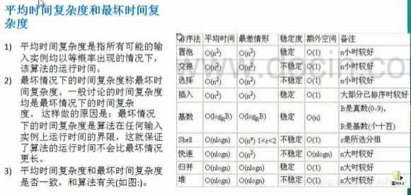


#### 空间复杂度


#### 冒泡排序

较大的数开始堆积到数组尾部，最尾部是最大的数。轻的数就会逐渐被挤压到前面。


```java
public class Main13 {
    public static void main(String[] args) {
        int arr[] = {3, 9, 01, 10, -2};
        int temp = 0;
        for (int i = 0; i < arr.length-1; i++) {//最后一个数不用处理
            for (int j = 0; j < arr.length -1 -i; j++) {//前面已处理的数不用处理
                if (arr[j] > arr[j + 1]) {
                    temp = arr[j];
                    arr[j] = arr[j + 1];
                    arr[j + 1] = temp;
                }
            }
        }
        System.out.println(Arrays.toString(arr));
    }
}
```


**优化版冒泡排序**

将重复的操作给去除

```java
public class Main13 {
    public static void main(String[] args) {
        int[] arr = new int[80000];
        for (int i = 0; i < 80000; i++) {
            arr[i] = (int)(Math.random() * 80000);
        }
        Date date1 = new Date();
        SimpleDateFormat sdf = new SimpleDateFormat("yyyy-MM-dd HH:mm:ss");
        String dataStr1 = sdf.format(date1);
        System.out.println("执行前的时间："+dataStr1);
        bubbleSort(arr);
        Date date2 = new Date();
        String dataStr2 = sdf.format(date2);
        System.out.println("执行后的时间："+dataStr2);
//        System.out.println("排序后的数组："+Arrays.toString(arr));
    }
    public static void bubbleSort(int arr[]){
        int temp = 0;
        boolean flag = false;
        for (int i = 0; i < arr.length-1; i++) {//最后一个数不用处理
            for (int j = 0; j < arr.length -1 -i; j++) {//前面已处理的数不用处理
                if (arr[j] > arr[j + 1]) {
                    flag = true;
                    temp = arr[j];
                    arr[j] = arr[j + 1];
                    arr[j + 1] = temp;
                }
            }
            if (!flag){//一次都没有交换过，表明此时已经有序了
                break;
            }else {
                flag = false;
            }
        }
    }
}
```


#### 选择排序

找到最小值，交换。重复这个过程。


```java
public class Main14 {
    public static void main(String[] args) {
        int[] arr = new int[80000];
        for (int i = 0; i < arr.length; i++) {
            arr[i] =(int)(Math.random() * 1000000);
        }
//        System.out.println("原来的数组："+ Arrays.toString(arr));
        Date date1 = new Date();
        SimpleDateFormat sdf = new SimpleDateFormat("yyyy-MM-dd HH:mm:ss");
        String dataStr1 = sdf.format(date1);
        System.out.println("执行前的时间："+dataStr1);
        selectSort(arr);
        Date date2 = new Date();
        String dataStr2 = sdf.format(date2);
        System.out.println("执行后的时间："+dataStr2);
//        System.out.println("排序后的数组："+ Arrays.toString(arr));
    }

    public static void selectSort(int arr[]){
        for (int i = 0; i < arr.length-1; i++) {//同冒泡，到最后一个元素不用排序
            int minIndex = i;
            int min = arr[i];
            //比较拿到最小值
            for (int j = i+1; j < arr.length; j++) {//比较结束的值就不用去重复比较了
                if (min > arr[j]){
                    min = arr[j];
                    minIndex = j;
                }
            }
            //如果成功找到，就进行交换
            if (minIndex!= i){
                arr[minIndex] = arr[i];
                arr[i] = min;
            }
        }
    }
}
```


#### 插入排序

是将一个数据从**无序的数组**中取出，然后根据比较插入到新的**有序数组**中，但为了节省空间，这里将两个表合二为一。即每次拿出来一个元素，都要和之前插入的元素做一个比较，一开始没几个元素比较的时间短，后面排序好的元素一多，就需要多点时间。

> 合并后，新数据在和旧数据比较时，要先将自己的位置空出来，然后一个个比较，大于我的旧往后挪。挪到合适的位置就插入。


```java
public class Main15 {
    public static void main(String[] args) {
        int[] arr = new int[80000];
        for (int i = 0; i < arr.length; i++) {
            arr[i] =(int)(Math.random() * 100000);
        }
//        System.out.println("原来的数组："+ Arrays.toString(arr));
        Date date1 = new Date();
        SimpleDateFormat sdf = new SimpleDateFormat("yyyy-MM-dd HH:mm:ss");
        String dataStr1 = sdf.format(date1);
        System.out.println("执行前的时间："+dataStr1);
        insertSort(arr);
        Date date2 = new Date();
        String dataStr2 = sdf.format(date2);
        System.out.println("执行后的时间："+dataStr2);
//        System.out.println("排序后的数组："+ Arrays.toString(arr));
    }

    public static void insertSort(int[] arr){
        for (int i = 1; i < arr.length; i++) {
            int tmp = arr[i];//是要比较的值，先保存在临时变量中，空出来一个位置可以用来挪元素
            int j = i;//开始比较的位置
            while (j > 0 && tmp < arr[j - 1]) {//如果这个位置的值比当前值大，则要挪开一个位置，最开始比较的值可以挪到我的位置
                arr[j] = arr[j - 1];//将j-1的元素挪到j的位置（不用怕会覆盖，因为在之前第一次比较时就挪出来位置了）
                j--;
            }
            //这里坐标不一样，说明挪过位置了，就将挪出来的位置插入这个值
            if (j != i) {
                arr[j] = tmp;
            }
        }
    }
}
```


#### 希尔排序

是插入排序的改进版。为了解决插入排序存在的问题。小的数如果是在数组尾部，当轮到它时前面的有序数组就很大了，要比较很多次。

> 根据一个增量值的变化，对数组进行分组分开进行插入排序。
>
> int n = 10;
>
> 第一次分组：10/2 = 5。分5组。n=5;
>
> 第二次分组：5/2=2。分2组。n=2；
>
> 第三次分组：2/2=1。分1组。n=1;


```java
public class Main16 {
    public static void main(String[] args) {
        int[] arr = new int[80000];
        System.out.println("无序数组长度："+arr.length);
        for (int i = 0; i < arr.length; i++) {
            arr[i] =(int)(Math.random() * 100000);
        }
//        System.out.println("原来的数组："+ Arrays.toString(arr));
        Date date1 = new Date();
        SimpleDateFormat sdf = new SimpleDateFormat("yyyy-MM-dd HH:mm:ss");
        String dataStr1 = sdf.format(date1);
        System.out.println("执行前的时间："+dataStr1);
        shellSort(arr);
        Date date2 = new Date();
        String dataStr2 = sdf.format(date2);
        System.out.println("执行后的时间："+dataStr2);
//        System.out.println("排序后的数组："+ Arrays.toString(arr));
    }
    public static void shellSort(int[] arr) {
        int temp;
        for (int step = arr.length / 2; step >= 1; step /= 2) {//增量，假设数组长度为10，则增量缩小情况为[5,2,1]
            for (int i = step; i < arr.length; i++) {//根据增量进行分组：第一次分组[5,6,7,8,9],第二次分组[2,3,4,5,6,7,8,9]...
                temp = arr[i];//-----------------------[第一次分组]插入排序中的插入值arr[5,6,7,8,9]
                int j = i - step;//--------------------[第一次分组]根据增量计算步长    [0,1,2,3,4]
                while (j >= 0 && arr[j] > temp) {//----[第一次分组]如果插入值小于比较值，要移位arr[0]>arr[5],arr[1]>arr[6]
                    arr[j + step] = arr[j];//----------[第一次分组]进行值挪位arr[0+5] = arr[0], arr[1+5] = arr[1],...
                    j -= step;//-----------------------[第一次分组]移动比较指针，往后分组一个组的元素越多
                }
                arr[j + step] = temp;//----------------[第一次分组]挪到合适的位置，插入值（值保存在temp中，所以空出位置可以挪位）
            }
        }
    }
}
```


#### 快速排序

是冒泡排序的改进版。利用了**递归**。找基准值，不断将数组切分为两半。左边一半的值小于右边一半，这样不断切分。在切分的数组中进行冒泡交换。


找基准值的时候，以分组的左边第一个数为基准值。然后遍历分组将小于基准值的数放左边，大于基准值的数放右边，最后中间放基准值。

```java
public class Main17 {
    public static void main(String[] args) {
        int[] arr = new int[80000];
        System.out.println("无序数组长度："+arr.length);
        for (int i = 0; i < arr.length; i++) {
            arr[i] =(int)(Math.random() * 100000);
        }
//        System.out.println("原来的数组："+ Arrays.toString(arr));
        Date date1 = new Date();
        SimpleDateFormat sdf = new SimpleDateFormat("yyyy-MM-dd HH:mm:ss");
        String dataStr1 = sdf.format(date1);
        System.out.println("执行前的时间："+dataStr1);
        quickSort(arr);
        Date date2 = new Date();
        String dataStr2 = sdf.format(date2);
        System.out.println("执行后的时间："+dataStr2);
//        System.out.println("排序后的数组："+ Arrays.toString(arr));
    }

    //快速排序入口
    public static void quickSort(int[] arr){
        subSort(arr,0,arr.length-1);
    }

    //排序方法
    private static void subSort(int[] arr, int left, int right) {
        if (left < right) {//指针遍历到一起就是结束
            int partitionIndex = partition(arr, left, right);//找到基准值，并将数组按照基准值分为两部分
            subSort(arr, left, partitionIndex - 1);//递归左边部分
            subSort(arr, partitionIndex + 1, right);//递归右边部分
        }
    }

    //设定基准值以及分组
    private static int partition(int[] arr, int left, int right) {
        int pivot = left;//直接取最左边的数为基准值
        int index = pivot + 1;//切分指针
        for (int i = index; i <= right; i++) {//遍历数组，将小于基准值的数放到左边
            if (arr[i] < arr[pivot]) {
                swap(arr, i, index);
                index++;
            }
        }
        swap(arr, pivot, index - 1);//将切分指针位置的元素和基准值元素互换
        return index - 1;
    }

    //交换数组中的两个元素
    private static void swap(int[] arr, int i, int j) {
        int temp = arr[i];
        arr[i] = arr[j];
        arr[j] = temp;
    }
}
```


#### 归并排序

也是利用了**递归**。分治算法，分是根据左右指针进行对半分，分过程不断调用比较，这样到底层治时才可以回溯到全部都治。治是同时遍历两个分组，两个分组互相比较元素，将小的元素逐个插入到临时数组中，最后将临时数组的内容复制会原数组。


```java
public class Main18 {
    public static void main(String[] args) {
        int[] arr = new int[80000];
        System.out.println("无序数组长度："+arr.length);
        for (int i = 0; i < arr.length; i++) {
            arr[i] =(int)(Math.random() * 100000);
        }
//        System.out.println("原来的数组："+ Arrays.toString(arr));
        Date date1 = new Date();
        SimpleDateFormat sdf = new SimpleDateFormat("yyyy-MM-dd HH:mm:ss");
        String dataStr1 = sdf.format(date1);
        System.out.println("执行前的时间："+dataStr1);
        mergeSort(arr, 0, arr.length-1,new int[arr.length]);
        Date date2 = new Date();
        String dataStr2 = sdf.format(date2);
        System.out.println("执行后的时间："+dataStr2);
//        System.out.println("排序后的数组："+ Arrays.toString(arr));
    }

    public static void mergeSort(int[] arr, int left, int right, int[] temp) {
        if (left < right) {
            int mid = (left + right) / 2;
            //向左递归分组
            mergeSort(arr, left, mid, temp);
            //向右递归分组
            mergeSort(arr, mid + 1, right, temp);
            //每分解一次就合并一次，最终开始合并是在最底层的分组，然后开始回溯
            merge(arr,left,mid,right,temp);
        }
    }

    /**
     * 合并
     *
     * @param arr   原数组
     * @param left  左边分组初始序列
     * @param mid   中间索引
     * @param right 右边分组初始序列
     * @param temp  临时数组
     */
    public static void merge(int[] arr, int left, int mid, int right, int[] temp) {
        int i = left;//左边数组的起始索引
        int j = mid + 1;//右边数组的起始索引
        int t = 0;//temp数组的索引
        //两个分组同时遍历，互相比较，小的那个先进临时数组temp
        while (i <= mid && j <= right) {
            if (arr[i] <= arr[j]) {//左分组的数小于等于右边分组的数
                temp[t] = arr[i];
                t += 1;
                i += 1;
            } else {//右边分组的数小于左边分组的数
                temp[t] = arr[j];
                t += 1;
                j += 1;
            }
        }
        //比较到最后会有分组剩下内容，则需要全填充到temp中
        //左边有剩余内容，全填充
        while (i <= mid) {
            temp[t] = arr[i];
            t += 1;
            i += 1;
        }
        //右边有剩余内容，全填充
        while (j <= right) {
            temp[t] = arr[j];
            t += 1;
            j += 1;
        }
        //组装完成数组，将结果copy到原数组
        t = 0;
        int tempLeft = left;
        while (tempLeft <= right) {
            arr[tempLeft] = temp[t];
            t += 1;
            tempLeft += 1;
        }
    }
}
```


#### 基数排序

是一种特殊的算法，根据元素的个位、十位、百位...的数值，进行逐次分桶，回填。到最后实现排序的过程。

> 这个就是和日常生活中数钱一样，只是对于182块钱，180块钱那个大，我们习惯从高位到低位比较。


```java
public class Main19 {
    public static void main(String[] args) {
        int[] arr = new int[80000];
        System.out.println("无序数组长度："+arr.length);
        for (int i = 0; i < arr.length; i++) {
            arr[i] =(int)(Math.random() * 1000);
        }
//        System.out.println("原来的数组："+ Arrays.toString(arr));
        Date date1 = new Date();
        SimpleDateFormat sdf = new SimpleDateFormat("yyyy-MM-dd HH:mm:ss");
        String dataStr1 = sdf.format(date1);
        System.out.println("执行前的时间："+dataStr1);
        radixSort(arr);
        Date date2 = new Date();
        String dataStr2 = sdf.format(date2);
        System.out.println("执行后的时间："+dataStr2);
//        System.out.println("排序后的数组："+ Arrays.toString(arr));
    }

    /**
     * 桶排序：这里不用担心残留bucket的数据影响，因为入桶的时候都是从0开始。出桶是从记录的高度开始
     * @param arr
     */
    public static void radixSort(int[] arr){
        //获取数组中最大元素有多少位
        int max = arr[0];
        for (int element : arr) {
            if (element>max)
                max = element;
        }
        int maxLength = (max+"").length();

        int[][] bucket = new int[10][arr.length];//0-9的桶，每个桶最多可以把整个排序数组元素总数
        int[] bucketHeight = new int[10];//记录每个桶中元素放了多少
        for (int i = 0, n = 1; i < maxLength; i++, n*=10) {//位数遍历
            //元素入桶
            for (int j = 0; j < arr.length; j++) {
                int digitOfElement = arr[j]/n % 10;//元素位数
                bucket[digitOfElement][bucketHeight[digitOfElement]] = arr[j];//将元素堆叠在对应的桶中
                bucketHeight[digitOfElement]++;
            }
            //桶中元素回填原数组
            int index = 0;
            for (int j = 0; j < bucketHeight.length; j++) {
                if (bucketHeight[j]!=0){//这个桶有内容
                    for (int k = 0; k < bucketHeight[j]; k++) {//将这个桶的内容回填到原来数组
                        arr[index++] = bucket[j][k];
                    }
                }
                bucketHeight[j] = 0;//计数桶归零
            }
        }
    }
}
```


#### 堆排序

堆排序设计到树结构，有关树的概念，详细见**[数据结构/树/二叉树]**


将无序的数组构建为大顶堆则是升序，小顶堆则是降序。

##### 大顶堆排序

> 步骤一：非叶子节点做处理，从左往右、从下往上


从左到右：节点6的左子节点和右子节点中找到最大的，如果比自己大则交换。


从下到上：处理完字数，回溯到上一层处理。这里4的左右节点中9叫比较大，和9交换。


大的往上走，小的往下沉。


> 步骤二：交换元素


这样算是一次排序找到最大的值到大顶堆的堆顶。然后置换下来。这个元素就和后面的排序无关了。

（在冒泡排序中也是，如果泡冒到了数组尾部，则这个就是最大的值，下次排序也是不会参与）


这一次的非叶子节点排序，9就不参与了。其他元素他们自己排。


重复这个过程，这里第二大的值8就先成功到堆顶，再被置换下来。


* 先将树转为大顶堆
* 再将堆顶元素和底部元素交换

```java
public class Main {
    public static void main(String[] args) {
//        int[] arr = {4,6,8,5,9,-1,90,89,56,-999};
        int[] arr = new int[80000];
        System.out.println("无序数组长度："+arr.length);
        for (int i = 0; i < arr.length; i++) {
            arr[i] =(int)(Math.random() * 1000);
        }
//        System.out.println("原来的数组："+ Arrays.toString(arr));
        Date date1 = new Date();
        SimpleDateFormat sdf = new SimpleDateFormat("yyyy-MM-dd HH:mm:ss");
        String dataStr1 = sdf.format(date1);
        System.out.println("执行前的时间："+dataStr1);
        heapSort(arr);
        Date date2 = new Date();
        String dataStr2 = sdf.format(date2);
        System.out.println("执行后的时间："+dataStr2);
//        System.out.println("排序后的数组："+ Arrays.toString(arr));
    }

    public static void heapSort(int arr[]){
        int temp = 0;
        //构建大顶堆，将树中的最大元素拉到堆顶
        for (int i = arr.length/2-1; i >= 0 ; i--) {
            adjustHeap(arr,i,arr.length);//从下到上
        }
        //交换顶堆元素，继续构建大顶堆和下一次交换（因为前面调整之后，接下来只需要调整一次即可形成新大顶堆）
        for (int i = arr.length-1; i > 0 ; i--) {
            temp = arr[i];
            arr[i] = arr[0];
            arr[0] = temp;
            adjustHeap(arr,0,i);//交换之后，数组顶部元素是要开始调整的元素，而调整的范围不能涉及之前排好序的元素
        }
    }

    /**
     * 将子节点大的值交换到当前节点
     * @param arr 数组
     * @param i 非叶子节点
     * @param length 要处理的数组长度
     * 每执行一次，则底层大的数值会逐渐往上提
     */
    public static void  adjustHeap(int[] arr, int i, int length){
        int temp = arr[i];//当前节点
        //判断交换子节点（可以处理当前节点，顺便检测子树下的子树）
        for (int j = i * 2 + 1; j < length; j = j * 2 +1) {
            //找到最大值的子节点坐标
            if (j+1<length && arr[j] < arr[j+1]){
                j++;
            }
            //如果子节点大于当前节点，则先把子节点提上来
            if (arr[j] > temp){
                arr[i] = arr[j];
                i = j;
            }else {
                break;//要是后面子树都符合了，那就不用检查了
            }
        }
        arr[i] = temp;//将子节点回填当前节点值
    }
}
```


## 查找算法

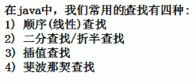

### 线性查找

又称顺序查找

```java
public class Main20 {
    public static void main(String[] args) {
        int arr[] = {1,9,11,-1,34,89};
        int index = seqSearch(arr, 11);
        if (index==-1)
            System.out.println("查找不到11这个元素!");
        System.out.println("元素11的坐标是:"+index);
    }
    public static int seqSearch(int[] arr, int value){
        for (int i = 0; i < arr.length; i++) {
            if (arr[i]==value){
                return i;
            }
        }
        return -1;
    }
}
```


### 二分查找

找到数组中间的基准值，判断当前比较值是在左边还是右边，然后就以右边的分组继续用基准值判断，将数据缩小到1个。


```java
public class Main21 {
    public static void main(String[] args) {
        int arr[] = {1,8,10,89,1000,1234};
        int index = binarySearch(arr,0,arr.length-1,1000);
        System.out.println("数值1000的位置在:"+index);
        index = binarySearch(arr,0,arr.length-1,999);
        System.out.println("数值999的位置在:"+index);
    }

    /**
     * 二分查找法
     *
     * @param arr     数组
     * @param left    左边的索引_起始点
     * @param right   右边的索引_结束点
     * @param findVal 查找的值
     * @return
     */
    public static int binarySearch(int[] arr, int left, int right, int findVal) {
        if (left>right)
            return -1;
        int mid = (left + right) / 2;
        int mindVal = arr[mid];
        if (findVal > mindVal) {//值比基准值大,向右递归
            return binarySearch(arr, mid + 1, right, findVal);
        } else if (findVal < mindVal) {
            return binarySearch(arr, left, mid - 1, findVal);
        }else {
            return mid;
        }
    }
}
```


**二分查找扩展（遇到相同的值时全部返回）**

在找到元素有，先继续往左找到看是否还有相同的值，有的话则添加到列表中返回。

```java
public class Main21 {
    public static void main(String[] args) {
//        int arr[] = {1,8,10,89,1000,1234};
//        int index = binarySearch(arr,0,arr.length-1,1000);
//        System.out.println("数值1000的位置在:"+index);
//        index = binarySearch(arr,0,arr.length-1,999);
//        System.out.println("数值999的位置在:"+index);
        int arr[] = {1,8,11,11,111,1234};
        List<Integer> indexs = binarySearch2(arr,0,arr.length-1,11);
        System.out.println("元素11出现在数字的位置:"+indexs);
    }

    /**
     * 二分查找法
     *
     * @param arr     数组
     * @param left    左边的索引_起始点
     * @param right   右边的索引_结束点
     * @param findVal 查找的值
     * @return
     */
    public static int binarySearch(int[] arr, int left, int right, int findVal) {
        if (left>right)
            return -1;
        int mid = (left + right) / 2;
        int mindVal = arr[mid];
        if (findVal > mindVal) {//值比基准值大,向右递归
            return binarySearch(arr, mid + 1, right, findVal);
        } else if (findVal < mindVal) {
            return binarySearch(arr, left, mid - 1, findVal);
        }else {
            return mid;
        }
    }

    public static List<Integer> binarySearch2(int[] arr, int left, int right, int findVal) {
        if (left>right)
            return null;
        int mid = (left + right) / 2;
        int mindVal = arr[mid];
        if (findVal > mindVal) {//值比基准值大,向右递归
            return binarySearch2(arr, mid + 1, right, findVal);
        } else if (findVal < mindVal) {
            return binarySearch2(arr, left, mid - 1, findVal);
        }else {
            List<Integer> list = new ArrayList<>();
            //向左边扫描
            int temp = mid -1;
            while (true){
                if (temp < 0 || arr[temp] != findVal)//找不到情况退出
                    break;
                list.add(temp);
                temp--;
            }
            list.add(mid);
            //向右边扫描
            temp = mid +1;
            while (true){
                if (temp > arr.length -1 || arr[temp] != findVal)//找不到情况退出
                    break;
                list.add(temp);
                temp++;
            }
            return list;
        }
    }
}
```


### 插值查找

特殊的数学算法，动态的mid。类似二分查找。是类似在0-100的数组中找到100的一种快速方法。


使用到了拉格朗日插值。`int mid - left + (right - left) * (findVal - arr[left])/(arr[right]-arr[left])`


```java
public class Main22 {
    private static int count = 0;
    public static void main(String[] args) {
        int arr[] = new int[100];
        for (int i = 1; i <= 100 ; i++) {
            arr[i-1] = i;
        }
        int index = insertSearch(arr,0,arr.length-1,1);
        System.out.println("数值1的位置在:"+index);
        count = 0;
        index = insertSearch(arr,0,arr.length-1,100);
        System.out.println("数值100的位置在:"+index);
    }
    /**
     * 插值查找法
     * @param arr     数组
     * @param left    左边的索引_起始点
     * @param right   右边的索引_结束点
     * @param findVal 查找的值
     * @return
     */
    public static int insertSearch(int[] arr, int left, int right, int findVal) {
        System.out.println("查找的次数:"+(++count));
        if (left>right || findVal < arr[0] || findVal > arr[arr.length-1])
            return -1;
        int mid = left + (right - left) * (findVal - arr[left]) / (arr[right] - arr[left]);
        int mindVal = arr[mid];
        if (findVal > mindVal) {//值比基准值大,向右递归
            return insertSearch(arr, mid + 1, right, findVal);
        } else if (findVal < mindVal) {
            return insertSearch(arr, left, mid - 1, findVal);
        }else {
            return mid;
        }
    }
}
```


### 斐波那契查找

黄金分割法查找。也是一种根据数据理论确定算法的查找方式。


```java
public class Main23 {
    public static final int maxSize = 20;

    public static void main(String[] args) {
        int arr[] = new int[100];
        for (int i = 1; i <= 100 ; i++) {
            arr[i-1] = i;
        }
        int index = fiboSearch(arr,10);
        System.out.println("数值10的位置在:"+index);
    }

    //构建一个斐波那契数列
    public static int[] fibo(){
        int[] f = new int[maxSize];
        f[0] = 1;
        f[1] = 1;
        for (int i = 2; i < maxSize; i++) {
            f[i] = f[i-1] + f[i-2];
        }
        return f;
    }

    public static int fiboSearch(int[] arr, int key){
        int low = 0;
        int high = arr.length-1;
        int k = 0;//斐波那契数列下标
        int mid = 0;
        int[] f = fibo();
        //获取到斐波那契分割数值下标
        while (high>f[k]-1)
            k++;
        int[] temp = Arrays.copyOf(arr,f[k]);
        //填补空白地方
        for (int i = high + 1; i < temp.length; i++) {
            temp[i] = arr[high];
        }
        while (low <= high){
            mid = low + f[k-1] -1;
            if (key < temp[mid]){
                /**
                 * 为什么k--
                 * 全部元素 = 前面的元素 + 后面的元素
                 * f[k] = f[k-1] + f[k-2]
                 * 前面有f[k-1]个元素,所以可以继续拆分f[k-1] = f[k-2] + f[k-3]
                 * 则下一个mid = f[k-1-1]-1
                 */
                high = mid - 1;//结束点往后退
                k--;
            }else if (key > temp[mid]){
                low = mid + 1;//起始点往前走
                k-=2;
            }else {
                //需要确定返回的是哪个坐标
                if (mid<=high)
                    return mid;
                else
                    return high;
            }
        }
        return -1;//找不到
    }
}
```


## 程序员常用的10种算法

### 二分查找算法（非递归）


 ```java
 public class Main {
     public static void main(String[] args) {
         int[] arr = {1,3,8,10,11,67,100};
         int index = binarySearch(arr, 67);
         System.out.println(index);
     }
 
     //二分查找法（非递归）
     public static int binarySearch(int[] arr, int target) {
         int left = 0;
         int right = arr.length - 1;
         while (left <= right) {//说明可以继续查找
             int mid = (left + right) / 2;
             if (arr[mid] == target) {
                 return mid;
             } else if (arr[mid] > target) {
                 right = mid - 1;//缩小范围-1：不需要当前mid值
             } else {
                 left = mid + 1;//缩小范围+1：不需要当前值
             }
         }
         return -1;
     }
 }
 ```


### 分治算法（递归分解）

将一个大问题拆解为小问题。


类似数学归纳法。当一个问题分解到小规模时，就应该这样去处理这个小规模问题。执行结束后会进行合并会原问题。


#### 汉诺塔问题

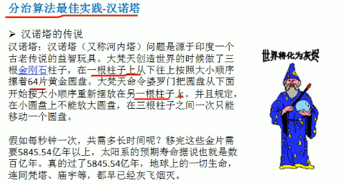

有A、B、C三根柱子：

如果A中有一个盘，则只需要移动A到C即完成。

如果A中有两个盘，就需要先移动小盘到B，移动大盘到C，再移动小盘到C即完成。

如果A中有三个盘，就需要移动小盘到C，移动中盘到B，将C的小盘移动到B中盘上面，移动大盘到C，移动B小盘到A，移动B中盘到C大盘上面，移动A小盘到C中盘上面即完成。

同理，如果遇到A中盘子数n>=2时，将大盘以上的部分全看作一个盘，此时首次分治的结果就是移动假象盘到B，移动大盘到C，将假象盘移动到C的大盘上即完成。大的步骤就是这样。


```java
public class Main {
    public static void main(String[] args) {
        hanoiTower(5,'A','B','C');
    }

    /**
     * 汉诺塔问题解决
     * @param num 盘数
     * @param a 柱子
     * @param b 柱子
     * @param c 柱子
     */
    public static void hanoiTower(int num, char a, char b, char c){
        if (num==1){
            System.out.println("第"+num+"个盘从"+a+"->"+c);
        }else {
            //如果盘子数列>=2时，分为两个盘：1. 最小面一个盘 2. 上面的所有做一个盘
            //1. 移动大盘上面所有盘A->B，移动过程借助C形参
            hanoiTower(num -1,a,c,b);//移动一个盘后回溯
            //2. 第一步回溯完成，则就可以移动大盘到C A->C
            System.out.println("第"+num+"个盘从"+a+"->"+c);//因为盘是不能大叠小的，这里做一次移动
            //3. B的所有盘移动到C，B->C，移动过程借助A形参
            hanoiTower(num -1,b,a,c);//将移动的盘递归回来
        }
    }
}
```


### 动态规划（选与不选）

分治算法是解决重复子问题。而对于不重复的问题。选和不选，得到最优解，解决重叠子问题，进行自底向上遍历是动态规划的解法。


#### 重叠子问题

斐波那契数列有这样的一个特性：

* 第1个元素值为1
* 第2个元素值为1
* 第3个元素为前两个元素和2
* 第4个元素为前两个元素和3
* ...
* 第n个元素为前两个元素和(n-1)+(n-2)


斐波那契数列在执行时会遇到一共问题：如果我想求其中某一个位置n的值，则程序会从这个值开始不断递归到`fib(1)+fib(2)`。这个过程会产生一颗二叉树，整个算法的时间复杂度为O(2^n)。

:heavy_check_mark:**要求第n个元素，则需要第n-1和n-2个元素的值。这是自顶向下的遍历**


像是节点7的值是需要左边节点6的值和右边节点5的值。但实际在节点6的递归中已有节点5的值存在，这里进行了两次重复的计算。这个就是**重叠子问题**。**如果能将左子树递归时把5的值给保存起来，则在右子树计算节点5时就不用递归。**


如果保存起来，则在计算时斐波那契数列时就变为了一个数列的问题，因为在计算时遇到节点5的情况很多。都保存的话会节省掉很多分支的计算。此时的时间复杂度为O(n)

:heavy_check_mark:**而如果自底向上去看，就可以在遍历的过程中保存可用的元素**


#### 任务安排

在工作时会画甘特图，表示一个任务信息。**一个任务的执行需要一定的时间**，执行完毕任务会获得奖励。一共工人每天的工作的时间有限，也就是说你需要合理安排任务，让你这一天中可以**获得最大值奖励**。

**任务不能重叠**，假如你领取了任务1，则任务2，任务3，任务5都不能领取。因为你这段时间是用来执行任务1的。可以领取任务4，因为你执行完任务1就可以执行任务4。执行完任务1就可以获得5块钱奖励。


对于这种求最优解的题，可以使用动态规划的方式解决。这里对任务进行选和不选判断。

:heavy_check_mark:**按照之前斐波那契的思路，先自顶向下思考最后一个任务选和不选的最优解**

**设定一个量叫OPT，表示最优解。OPT(i)表示当我要考虑1-8这些任务时的最优解是什么。**

* 如果i=8，则OPT(8)有两种状态

  * **选**
    * 能完成任务8，获得4块钱
    * 不能选第6个任务和第7个任务
      * 此时OPT(8) = 4 + OPT(5) :选择任务8+前面5个任务的最好结果
  * **不选**
    * 直接把第8个任务去掉，剩下就是OPT(8)  = OPT(7)

* 需要对选和不选这两个状态中找到一个最好的。

  * OPT(8) = max{ 4 + OPT(5), OPT(7)}

    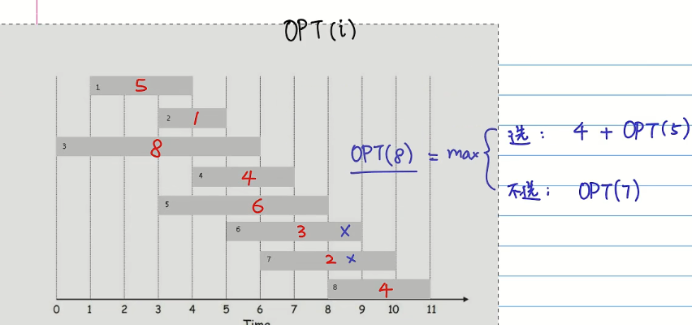

* 此时对于第i个选择的最优解是【在选第i个和不选第i个中找到最优解】

  * 选：vi + OPT(prev(i))  vi表示做第i个的价值，prev(i)表示硬要选第i个时前面是可以选哪个【如这个硬要选第8个，则前面是最多可以选5个：prev(8) = OPT(5)】

    

  * 不选：不断第i个的话，那就可以选前面的7个：OPT(i-1)


prev(i)


 计算前i个任务中的最优结果：OPT(i) = OPT(prev(i) + vi。展开类似斐波那契数列，出现了重叠子问题

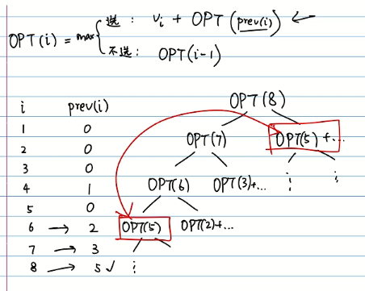

重叠子问题可以通过倒序来实现将为O(n)，通过倒推看到规律。（左边不选，右边选）

**:heavy_check_mark:自底向上**


进行逐个OPT(i)的计算


所以计算到这里，这一天中的任务最佳安排是【**1，4，8**】


#### 选数问题

在一堆数种选择几个，达到最大的总和。但是有个条件：选择这个数，则相邻的数不能选择。即你选了4则右边的1不能选。选择了9则左右的1不能选。

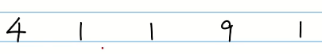


这和前面的动态规划类似，主要还是选和不选的问题。

所以最终的结果就是在这组数据中，选择的最优解是什么，也是在求OPT。所以可以和上一个案例结合得到。OPT(i)

**:heavy_check_mark:自顶向下**


这样可以从后推得到：如果选择6，如果不选择6的情况


* 选择6：顶多到4的范围的最优解OPT(4)+当前的价值arr[6]
* 不选6：顶多到5的范围的最优解OPT(5)


出现了重叠子问题


计算动态规划式子。对第i个的选择和不选择。还有递归的出口。


使用代码实现：

```java
public class Main {
    public static void main(String[] args) {
        //目标数组
        int arr[] = {1,2,4,1,7,8,3};
        //使用动态规划方式实现
        System.out.println("对于数组"+ Arrays.toString(arr)+"的最佳选择价值为："+recOpt(arr, arr.length - 1));
    }

    /**
     * 求数组中第i个的最优解
     * @param arr
     * @param i
     * @return
     */
    private static int recOpt(int[] arr,int i){
        //递归边界
        if (i==0){//如果是求第一个元素的最优解，那就是它自己
            return arr[0];
        }
        if (i==1){//如果是求第二个元素的最优解，那就是第一第二选最大一个
            return Math.max(arr[0],arr[1]);
        }

        //如果是第i个的最优解，则按照公式来做选和不选
        int select = recOpt(arr,i-2)+arr[i];
        int notSelect = recOpt(arr,i-1);
        return Math.max(select,notSelect);
    }
}
```


**但是使用递归会有一共问题：递推过程产生了很多重叠子问题**


这样时间复杂度是O(2^n)即随着数据量增长，运算时间呈现指数上升。

使用动态规划的从底向上计算，并保留计算值，这样递推到最上面就是可以得到最优解了。【从最底的最优解累计到最终的最优解】

**:heavy_check_mark:自底向上**

```java
public class Main {
    public static void main(String[] args) {
        //目标数组
        int arr[] = {1,2,4,1,7,8,3};//{4,1,1,9,1};
        //使用递归方式实现
        System.out.println("【递归】对于数组"+ Arrays.toString(arr)+"的最佳选择价值为："+recOpt(arr, arr.length - 1));
        //使用动态规划方式实现
        System.out.println("【dp】对于数组"+ Arrays.toString(arr)+"的最佳选择价值为："+dpOpt(arr));
    }

    /**
     * 求数组中第i个的最优解【递归求解】
     * @param arr
     * @param i
     * @return
     */
    private static int recOpt(int[] arr,int i){
        //递归边界
        if (i==0){//如果是求第一个元素的最优解，那就是它自己
            return arr[0];
        }
        if (i==1){//如果是求第二个元素的最优解，那就是第一第二选最大一个
            return Math.max(arr[0],arr[1]);
        }

        //如果是第i个的最优解，则按照公式来做选和不选
        int select = recOpt(arr,i-2)+arr[i];
        int notSelect = recOpt(arr,i-1);
        return Math.max(select,notSelect);
    }

    /**
     * 求数组中第i个的最优解【动态规划求解】
     * @param arr
     * @return
     */
    private static int dpOpt(int[] arr){
        int[] opt = new int[arr.length];
        opt[0] = arr[0];
        opt[1] = Math.max(arr[0],arr[1]);
        //这是从底往上推，推的过程保留住之前计算的数据，后面往上都使用到，越往上速度越快
        for (int j = 2; j < arr.length ; j++) {//计算当前这个节点的最优解
            int select = opt[j-2]+arr[j];//选择时的最优解
            int notSelect = opt[j-1];//不选择时的最优解
            opt[j] = Math.max(select,notSelect);//保存到opt数组
        }
        return opt[arr.length-1];
    }
}
```

#### 数组元素之和

有一个数组和一共期望结果值，求从数组中挑选几个数，加起来的结果是期望结果值，如果这个数组中有这几个数，则返回true。否则返回false。


同样，在动态规划的思想中，这题为了完成这个结果，对于数组中的每一个数字都有两种选择，选择这个数字或是不选择这个数字。这个时候题目就是变为**子集问题（SubSet）**。


i表示数组的下标，s表示要求得的结果。对于下标为5的元素，有选择和不选择的情况。选择的情况下，则剩下前面4个可选，并且此时的期望结果值将为9-arr[2]=7。


不选的情况下，子集就是只有前面4个可以选，而期望结果值和原来一样。


对于选和不选，只有两种子方案中有一个成立，则最终结果就是true。


此时公式基本成立，但还需要递推边界。边界这里是根据期望值的变化来判断。

* 当前面的值已经满足期望值时，s==0，此时返回true

  

* 当递归到第一个元素时，此时只有一共元素，但期望值没为0。此时有两种情况：

  * 这一个元素刚刚好填补使得期望值为0返回True，否则返回False

    

* 当前位置的值大于期望结果值时，只考虑不选的情况（因为挑选后直接超过结果值了）

  

最终可以得到一共动态规划的公式和递推边界。


使用刚刚推理时的递归式：

```java
public class Main2 {
    public static void main(String[] args) {
        int[] arr = {3,34,4,12,5,2};
        System.out.println("递归方式查找数组是否可以挑选出结果值9："+recSubSet(arr, arr.length - 1, 9));
        System.out.println("递归方式查找数组是否可以挑选出结果值10："+recSubSet(arr, arr.length - 1, 10));
        System.out.println("递归方式查找数组是否可以挑选出结果值11："+recSubSet(arr, arr.length - 1, 11));
        System.out.println("递归方式查找数组是否可以挑选出结果值12："+recSubSet(arr, arr.length - 1, 12));
        System.out.println("递归方式查找数组是否可以挑选出结果值13："+recSubSet(arr, arr.length - 1, 13));
    }

    /**
     * 计算数组是否满足加法得到期望结果值【递归方式：自顶向下】
     * @param arr 数组
     * @param i 选择元素的坐标
     * @param s 期望结果值
     * @return
     */
    private static boolean recSubSet(int[] arr, int i, int s){
        //当选择的元素满足期望结果值时返回true
        if (s==0){
            return true;
        }
        //当选到只剩一共时，返回最后一个是否可以满足期望结果值
        if (i==0){
            return arr[0]==s;
        }
        //如果当前选的元素大于结果值。那只能弃选
        if (arr[i]>s)
            return recSubSet(arr,i-1,s);
        //正常情况选和不选
        boolean select = recSubSet(arr,i-1,s-arr[i]);
        boolean notSelect = recSubSet(arr,i-1,s);
        return select||notSelect;
    }
}
```


感觉这一个计算过程，可以得出一共SubSet的情况。

像是SubSet(arr[2],3)这里arr[2]>3，则会向上移动即SubSet(arr[1],3)


这里的边界就是当s=0时，所有的最优解都返回true。当i=0时，只有arr[i]=s的那一列为true，其他为false。


这样就是自底向上的递推，只需要这样不断存储数组，就能递推到最终的一个选择SubSet(arr[5],9)的结果。


```java
public class Main2 {
    public static void main(String[] args) {
        int[] arr = {3,34,4,12,5,2};
        System.out.println("递归方式查找数组是否可以挑选出结果值9："+recSubSet(arr, arr.length - 1, 9));
        System.out.println("递归方式查找数组是否可以挑选出结果值10："+recSubSet(arr, arr.length - 1, 10));
        System.out.println("递归方式查找数组是否可以挑选出结果值11："+recSubSet(arr, arr.length - 1, 11));
        System.out.println("递归方式查找数组是否可以挑选出结果值12："+recSubSet(arr, arr.length - 1, 12));
        System.out.println("递归方式查找数组是否可以挑选出结果值13："+recSubSet(arr, arr.length - 1, 13));
        System.out.println("-------");
        System.out.println("dp方式查找数组是否可以挑选出结果值9：" +dpSubSet(arr,  9));
        System.out.println("dp方式查找数组是否可以挑选出结果值10："+dpSubSet(arr,  10));
        System.out.println("dp方式查找数组是否可以挑选出结果值11："+dpSubSet(arr,  11));
        System.out.println("dp方式查找数组是否可以挑选出结果值12："+dpSubSet(arr,  12));
        System.out.println("dp方式查找数组是否可以挑选出结果值13："+dpSubSet(arr,  13));
    }

    /**
     * 计算数组是否满足加法得到期望结果值【递归方式：自顶向下】
     * @param arr 数组
     * @param i 选择元素的坐标
     * @param s 期望结果值
     * @return
     */
    private static boolean recSubSet(int[] arr, int i, int s){
        //当选择的元素满足期望结果值时返回true
        if (s==0){
            return true;
        }
        //当选到只剩一共时，返回最后一个是否可以满足期望结果值
        if (i==0){
            return arr[0]==s;
        }
        //如果当前选的元素大于结果值。那只能弃选
        if (arr[i]>s)
            return recSubSet(arr,i-1,s);
        //正常情况选和不选
        boolean select = recSubSet(arr,i-1,s-arr[i]);
        boolean notSelect = recSubSet(arr,i-1,s);
        return select||notSelect;
    }

    private static boolean dpSubSet(int[] arr,int s){
        //定义一共最优解数组，列是s，行是元素i的坐标
        boolean[][] subset = new boolean[arr.length][s+1];
        //设定边界条件一：第一列s=0，所有最优解都返回true
        for (int i = 0; i < arr.length; i++) {
            subset[i][0]=true;
        }
        //边界条件二：第一行i=0,其中满足期望值的arr[i]=s的那一个元素为true
        for (int s2 = 0; s2 < s+1; s2++) {
            subset[0][s2]=false;
        }
        subset[0][arr[0]]=true;
        //开始递推，从空白的地方开始
        for (int i = 1; i < arr.length; i++) {
            for (int s2 = 1; s2 < s+1; s2++) {
                if (arr[i]>s2){//如果当前选择元素大于期望值，则不选
                    subset[i][s2] = subset[i-1][s2];
                }else {//正常选或不选
                    boolean select = subset[i-1][s2-arr[i]];
                    boolean notSelect = subset[i-1][s2];
                    subset[i][s2] = select||notSelect;
                }
            }
        }
        //前面的循环如果能递归到最后，则证明这个数组有一条路可以达到true
        return subset[arr.length-1][s];
    }
}
```


#### 背包问题

这一个算法和前面的数组元素之和的场景类似，都是给定一个空间，放入有限的元素，达到最大价值。


背包的容量不是固定的，是一开始假定容量后，不断动态增加，以此来获取到这个过程背包存入的物品的规律，提取出这个规律公式。

> 当只有一个物品到有全部物品时，背包容量在0-4这个变化过程中如何选择。
>
> > **当只有1把吉他的情况，该如何放**
> >
> > 
> >
> > * 背包在从1磅到4磅过程中的最优解是放一把吉他。每一步的最优解价值都为1500
> >
> >   
> >
> > **当有1把吉他和1个音响的情况，该如何放**
> >
> > * 背包1磅时，最优解价值1500
> >
> >   * 放1把吉他，价值为1500
> >   * 不能放音响，价值为0
> >
> > * 背包2磅时，最优解价值1500
> >
> >   * 放1把吉他，价值为1500
> >   * 不能放音响，价值为0
> >
> > * 背包3磅时，最优解价值1500
> >
> >   * 放1把吉他，价值为1500
> >   * 不能放音响，价值为0
> >
> > * 背包4磅时，最优解价值为3000
> >
> >   * 放1把吉他，价值为1500
> >   * 放1个音响，价值为3000
> >
> >   
> >
> > **当有1把吉他、1个音响和1台电脑的情况，该如何放**
> >
> > * 背包1磅时，最优解价值1500
> >
> >   * 放1把吉他，价值为1500
> >   * 不能放音响，价值为0
> >   * 不能放电脑，价值为0
> >
> > * 背包2磅时，最优解价值1500
> >
> >   * 放1把吉他，价值为1500
> >   * 不能放音响，价值为0
> >   * 不能放电脑，价值为0
> >
> > * 背包3磅时，最优解价值2000
> >
> >   * 放1把吉他，价值为1500
> >   * 不能放音响，价值为0
> >   * 放1台电脑，价值为2000
> >
> > * 背包4磅时，最优解价值3500
> >
> >   * 放1把吉他，有剩余空间放1台电脑，价值为3500
> >   * 放1个音响，没空间放其他，价值为3000
> >   * 放1台电脑，没空间放其他，价值为2000
> >
> >   
>
> 将上面的信息列出来一个表：


总结规律得出公式：

```
假设任意第i个物品，第j个背包。
w[i]第i个物品的重量
v[i]第i个物品的价值
C容量
v[i][j]表示在前i个物品中能够装入容量为j的背包的最大价值。
它们都具备下面的条件。
```

`(1) v[i][0] = v[0][j] = 0`：**边界情况**  填入第一行和第一列是0 （0磅时什么都装不入，零物品时没东西可装）


`(2) 当w[i]>j时；v[i][j] = v[i-1][j]`：**不选择物品时的情况，那么就剩下i-1种最优解**。


`(3) 当j>=w时；v[i][j] = max{v[i-1][j], v[i-1][j-w]+v[i]}`：**在选择`v[i-1][j]` 和不选`v[i-1][j-w]+v[i]`**中找到最大价值。

```java
public class Main {
    public static void main(String[] args) {
        int[] w = {0,1,4,3};           //背包磅数
        int[] v = {0,1500,3000,2000};  //物品价值
        int m = 5;                     //背包容量
        int n = v.length;              //物品数量
        int[][] subset = new int[n][m];//最优解数组

        //初始化边界——第一列，当背包容量为0时，所有的最优解价值为0
        for (int i = 0; i < n; i++) {
            subset[i][0]=0;
        }
        //初始化边界——第一行，当没有可选物品时，所有的最优解价值为0
        for (int i = 0; i < m; i++) {
            subset[0][i]=0;
        }
        //从数组空白处递推
        for (int i = 1; i < n; i++) {//物品
            for (int j = 1; j < m; j++) {//背包容量
                if (w[i]>j){//物品重量>背包容量
                    subset[i][j] = subset[i-1][j];//当前不选的最优解——前面i-1个物品时的最优解
                }else {
                    int select = subset[i-1][j-w[i]]+v[i];//选：前面i-1个物品j-当前重量后的最优解价值 + 当前价值
                    int notSelect = subset[i-1][j];//不选：前面i-1个物品时的最优解
                    subset[i][j] = Math.max(select,notSelect);//当前的最优解就是选和不选中的最大价值
                }
            }
        }

        //输出展示子集的计算结果
        for (int[] row:subset)
            System.out.println(Arrays.toString(row));
        System.out.println("01背包最终选择的最大价值为："+subset[n-1][m-1]);
    }
}
```


#### KMP算法

字符串匹配问题：

1、有一个字符串 str="BBC ABCDAB ABCDABCDABDE"，和一个子串str2 = "ABCDABCD"

2、现在要判断str是否含有str2，如果存在就返回第一次出现的位置，如果没有，则返回-1。

> 不管暴力搜索还是kmp都是要使用到两个指针
>
> * 主串指针：指向主串当前字符
> * 子串指针：指向子串当前字符
>
> 暴力搜索会频繁改动主串指针，kmp算法可以使得当前主串指针不会后移。


##### 暴力搜索

两个指针同时移动，比较字符

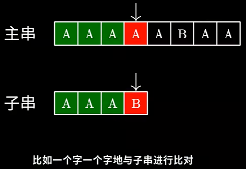

当遇到不匹配字符时


搜索过程主串指针后移频繁


```java
public class Main {
    public static void main(String[] args) {
        String str1 = "BBC ABCDAB ABCDABCDABDE";
        String str2 = "ABCDABCD";
        System.out.println("找到子串的位置："+violenceMatch(str1,str2));
    }

    public static int violenceMatch(String str1, String str2){
        char[] s1 = str1.toCharArray();
        char[] s2 = str2.toCharArray();

        int s1Len = s1.length;
        int s2Len = s2.length;

        int i = 0;
        int j = 0;
        //以一个字符为开头遍历，如果匹配不到就换到第二个字符
        while (i<s1Len && j < s2Len){
            if (s1[i]==s2[j]){
                i++;
                j++;
            }else {
                i = i-j+1;//从下一个字符开始匹配（i-j回退这一段比较字符，+1重新指到要匹配的下一个字符）
                j = 0;
            }
        }
        //如果比较没问题，那j肯定到了子串末尾
        if (j==s2Len)
            return i - j;
        else
            return -1;
    }
}
```


暴力搜索存在的问题是时间复杂度过高：**O(m*n)**


##### KMP算法

根据暴力搜索算法的局限，发现在匹配时避免回退主串指针的方法。


> kmp算法——线性时间复杂度

在匹配到不对的字符串时


利用前面已经匹配正确的字符串来避免暴力搜索的回退


移动子串跳过字符来到新位置进行匹配

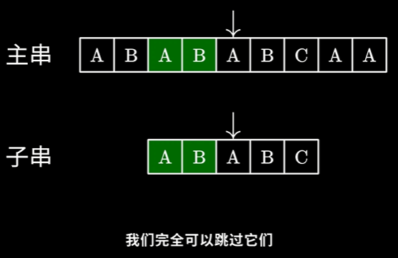


> next数组

子串要跳过n个字符来和主串重新匹配，跳过多少个字符是由next数组来确定。


next数组的功能是在kmp算法匹配失败时，告诉子串该移动多少字符。


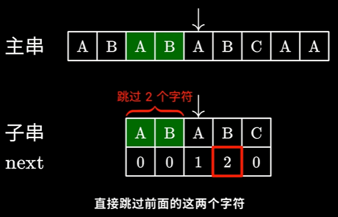


由于不用回退主串的指针，只有一次遍历就可以完成匹配，所以效率比暴力搜索高。时间复杂度O(n)。


> kmp算法实现

kmp使用next数据的代码实现：

```java
public class Main {
    public static void main(String[] args) {
        String str = "BBC ABCDAB ABCDABCDABDE";
        String sub = "ABCDABD";
        int index = kmp(str, sub);
        System.out.println("index = " + index);
    }
    
    private static int[] buildNext(String dest) {
		//构建next数组...
    }
	
    public static int kmp(String str, String sub) {
        int[] next = buildNext(sub);

        int i = 0;//主串指针
        int j = 0;//子串指针

        while (i < str.length()) {//逐个字符比较
            if (str.charAt(i) == sub.charAt(j)) {//字符匹配则指针后移
                i++;
                j++;
            } else if (j > 0) {//字符不匹配就根据next数组移动
                j = next[j - 1];
            }else {//主串第一个就匹配失败，移动
                i++;
            }
            if (j==sub.length())//返回子串的坐标
                return i-j;
        }
        return -1;
    }
}
```


> next数组作用

next可以指定跳过字符的原因是：


这里体现了公共前后缀的作用：


这一个前后缀AB的长度为2。所以在B字符下记录了2。

next数组的本质：


是最长的公共前后缀。


前后缀的范围可以交叉，但不能是本身。把整个括起来则没法移动了。


> next数组的生成过程

前1个字符时没有前后缀：0


前2个字符时也没有前后缀：0


前3个字符时有1个前后缀：1


前4个字符时有2个前后缀：2


前5个字符时没有前后缀：0


> next数组实现

可以使用暴力方式实现，但这里使用递推方式来实现更高效率。


假设目前知道部分next数组的内容，则递推来计算下一个字符的前后缀长度。


`动态规划：下一个字符相同 & 下一个字符不相同`

如果下一个字符相同，则+1：


如果下一个字符不相同：


既然ABA无法与下一个字符构成公共前后缀，就看这其中是否存在更短的前后缀。


这一步可以不用暴力求解，根据前面的前后缀信息。


只看左边的串。ABA的公共前后缀是1个。就是数数组的第1个元素。（同样看上面的串，如果串是ABACAB，则公共前后缀是2，即数数组第1和2个元素AB）


所以将前缀指针。（这里不是直接把前面串的指针拉到首位，就是利用了动态规划，我们现在的计算是基于前面计算的基础）


然后指针继续移动


next数组构建代码：

```java
public class Main {
    public static void main(String[] args) {
        String str = "BBC ABCDAB ABCDABCDABDE";
        String sub = "ABCDABD";
        int index = kmp(str, sub);
        System.out.println("index = " + index);
    }

    private static int[] buildNext(String sub) {
        int[] next = new int[sub.length()];//next数组

        int prefixLen = 0;//当前公共前后缀长度，前缀指针
        int i = 1;//后缀指针

        while (i<sub.length()){
            if (sub.charAt(prefixLen)==sub.charAt(i)){//比较字符相同
                prefixLen++;//前缀指针移动，记录长度+1
                next[i] = prefixLen;//后缀指针记录当前长度下的公共前后缀长度
                i++;//后缀指针移动
            }else {//当前字符不相同
                if (prefixLen==0){//到现在还是没有相同的字符（一直找不到）
                    next[i] = 0;//后缀指针记录当前长度下的公共前后缀为0
                    i++;//后缀指针移动（继续找）
                }else {//前面有找到相同的字符，就这里不同
                    prefixLen=next[prefixLen-1];//前缀指针根据前面的串，找公共前后缀，重新定位
                }
            }
        }
        return next;
    }

    public static int kmp(String str, String sub) {
        int[] next = buildNext(sub);

        int i = 0;//主串指针
        int j = 0;//子串指针

        while (i < str.length()) {//逐个字符比较
            if (str.charAt(i) == sub.charAt(j)) {//字符匹配则指针后移
                i++;
                j++;
            } else if (j > 0) {//字符不匹配就根据next数组移动
                j = next[j - 1];
            }else {//主串第一个就匹配失败，移动
                i++;
            }
            if (j==sub.length())
                return i-j;
        }
        return -1;
    }
}
```


### 贪心算法（每次遍历都找到最优）

类似动态规划，但是这次没有限制，而是要自己在满足条件的情况下，找到最优解。最小成本。【和动态规划DP不用的是，贪心算法不用考虑前后的子问题，而是考虑当前的子问题的最优解】


#### 广播台问题

简单的方式就是穷举所有可能。有((2^n)-1)种可能。这个和数求每一层的叶子节点一样。


* 假设有AB两个广播台，则组合结果有：((2^2)-1)=3种组合
* 假设有ABC三个广播台，则组合结果有：((2^3)-1)=7种组合

发现传统穷举，在随着广播台数量提升的过程，计算数量呈现指数上升，计算时间也是剧增。

**为了解决穷举所解决不了的问题，使用贪心算法**


**贪心算法的核心是：在每一步的选择中，都会选择最好的。**

> 贪心算法解广播台范围步骤

1、 遍历所有广播台，获取到一个全地区的集合。同时创建一个结果集，用来存放选择的广播台。


2、 第一次循环，找到覆盖范围最大的一个广播台，加入到结果集，同时在全地区集合中移除对应地区。


​									（这里K1、K2、K3广播台是一样大，但以首选的K1来加入结果集【确实会有算法漏洞】）


​								（将K1的电台范围从全地区集合中去除）

3、 第二次循环，找到覆盖范围最大的一个广播台，加入到结果集，同时在全地区集合中移除对应地区。


​								（这里K2、K3覆盖范围一样大，但以首选的K2来加入结果集）


​								（将K2的电台范围从全地区集合中去除）

4、 第三次循环，找到覆盖范围最大的一个广播台，加入到结果集，同时在全地区集合中移除对应地区。


​								（这里K3、K5覆盖范围一样大，但以首选的K3来加入结果集）


​								（将K3的电台范围从全地区集合中去除）

5、 第四次循环，找到覆盖范围最大的一个广播台，加入到结果集，同时在全地区集合中移除对应地区。


​						（这里找到最大的覆盖范围就是K5，将K5加入到结果集）


​						（将K5的覆盖范围从全地区集合中移除）

6、 第五次循环，此时发现全地区集合为空，结束循环


> 贪心算法解决广播台问题代码

```java
import java.util.*;

/**
 * @Author: zhuzhe
 * @ClassName: Main
 * @Date: 2022/5/22 17:54
 * @Description: 贪心算法
 * @Version: V1.0
 * @Param:
 */
public class Main {
    public static void main(String[] args) {
        //创建广播台集合
        Map<String, Set<String>> broadcasts = new HashMap<>();
        //创建广播台
        Set<String> broadcast1 = new HashSet<>();
        broadcast1.add("北京");
        broadcast1.add("上海");
        broadcast1.add("天津");
        broadcasts.put("K1",broadcast1);
        Set<String> broadcast2 = new HashSet<>();
        broadcast2.add("广州");
        broadcast2.add("北京");
        broadcast2.add("深圳");
        broadcasts.put("K2",broadcast2);
        Set<String> broadcast3 = new HashSet<>();
        broadcast3.add("成都");
        broadcast3.add("上海");
        broadcast3.add("杭州");
        broadcasts.put("K3",broadcast3);
        Set<String> broadcast4 = new HashSet<>();
        broadcast4.add("上海");
        broadcast4.add("天津");
        broadcasts.put("K4",broadcast4);
        Set<String> broadcast5 = new HashSet<>();
        broadcast5.add("杭州");
        broadcast5.add("大连");
        broadcasts.put("K5",broadcast5);
        //创建全地区集合
        Set<String> allAreas = new HashSet<>();
        allAreas.addAll(broadcast1);
        allAreas.addAll(broadcast2);
        allAreas.addAll(broadcast3);
        allAreas.addAll(broadcast4);
        allAreas.addAll(broadcast5);
        //创建结果集
        List<String> selects = new ArrayList<>();
        //开始遍历
        while (allAreas.size()!=0){//最后全部地区都覆盖完成，就结束循环
            String maxKey = null;
            for (String key: broadcasts.keySet()){//遍历找出覆盖范围最广的广播台

                int nowAreasCount = 0;//当前key的覆盖范围
                int preAreasCount = 0;//上一个key的覆盖范围
                Set<String> tempSet = new HashSet<>();//临时数组，用作计算覆盖地区

                //计算当前key的覆盖地区
                tempSet.addAll(broadcasts.get(key));
                tempSet.retainAll(allAreas);
                nowAreasCount = tempSet.size();
                tempSet.clear();

                //计算上一个key的覆盖范围
                if (maxKey!=null){
                    tempSet.addAll(broadcasts.get(maxKey));
                    tempSet.retainAll(allAreas);
                    preAreasCount = tempSet.size();
                    tempSet.clear();
                }

                //当前不能是无效的数据，如果是找到的第一个则直接赋予，如果不是得比较哪个覆盖范围大，选大的赋予
                if (nowAreasCount!=0&&(maxKey==null||nowAreasCount>preAreasCount)){
                    maxKey = key;
                }
            }
            //存储每次循环找到的最大覆盖地区广播台key，并将覆盖到的地区从全地区集合移除
            if (maxKey!=null){
                selects.add(maxKey);
                allAreas.removeAll(broadcasts.get(maxKey));
            }
        }
        System.out.println("贪心算法解决广播台覆盖地区结果：" + selects);
    }
}
```


### 普利姆算法（最小生成树）

最小生成树。


> 算法思路

在一个联通子图中，先从一个起顶点开始，找到所有邻接顶点，在所有邻顶点中找到权最小的路径的顶点。保存在一个集合中。下次搜索时从集合中开始。一样地去找到所有邻接顶点，避开上一次的路径，再次从结果中找到带权最小的路径顶点，再次保存到集合中。重复操作，直到找到所有顶点。

这个过程中所有顶点都有一个最小带权路径。


> prim算法的Java代码实现

```java
/**
 * @Author: zhuzhe
 * @ClassName: Main
 * @Date: 2022/5/23 11:17
 * @Description:
 * @Version: V1.0
 * @Param:
 */
public class Main {
    public static void main(String[] args) {
        //定义图参数
        char[] data = {'A','B','C','D','E','F','G'};
        int verxs = data.length;
        int[][] weight = {
                {0,5,7,0,0,0,2},
                {5,0,0,9,0,0,3},
                {7,0,0,0,8,0,0},
                {0,9,0,0,0,4,0},
                {0,0,8,0,0,5,4},
                {0,0,0,4,5,0,6},
                {2,3,0,0,4,6,0}
        };

        MGraph mGraph = new MGraph(verxs);
        MinTree minTree = new MinTree();
        minTree.createGraph(mGraph, verxs, data, weight);
        minTree.showGraph(mGraph);

        //测试普利姆算法（图从A点开始找到最小生成树）
        System.out.println("----------------");
        System.out.println("从A点开始的最小生成树：");
        minTree.prim(mGraph,0);

        //测试普利姆算法（图从B点开始找到最小生成树）
        System.out.println("----------------");
        System.out.println("从B点开始的最小生成树：");
        minTree.prim(mGraph,1);
    }
}

//最小生成数
class MinTree{
    /**
     * 使用邻接矩阵创建图
     * @param mGraph 图对象
     * @param verxs 图的顶点个数
     * @param data 图的各个顶点的值
     * @param weight 图的邻接矩阵
     */
    public void createGraph(MGraph mGraph, int verxs, char[] data, int[][] weight){
        int i, j;
        for (i = 0; i < verxs; i++) {//每一行代表一个顶点
            mGraph.data[i] = data[i];//将顶点放入图
            for (j = 0; j <verxs ; j++) {//遍历这个顶点和其他顶点的关系
                mGraph.weight[i][j] = weight[i][j];
            }
        }
    }

    //显示图的邻接矩阵
    public void showGraph(MGraph mGraph){
        for (int[] row : mGraph.weight) {
            System.out.println(Arrays.toString(row));
        }
    }

    /**
     * 生成最小生成树
     * @param mGraph 图
     * @param v v表示从哪个顶点开始生成
     */
    public void prim(MGraph mGraph, int v){
        //标记访问过的顶点
        int[] visited = new int[mGraph.verx];
        visited[v] = 1;
        //用h1，h2记录两个顶点下标
        int h1 = -1;
        int h2 = -1;
        int minWeight = -1;//初始化最小值
        for (int i = 1; i < mGraph.verx; i++) {//有n个顶点，则最小生成树的路径有n-1条

            for (int j = 0; j < mGraph.verx; j++) {//遍历矩阵，行
                for (int k = 0; k < mGraph.verx; k++) {//遍历矩阵，列
                    //当前节点是已访问过顶点 && 当前节点有邻接顶点 && 邻接顶点是未访问过
                    if (visited[j]==1 && mGraph.weight[j][k]!=0 && visited[k]==0 ){
                        //如果是第一次找到则直接赋予 || 如果是第n次找到，则判断替换为最小值
                        if (minWeight==-1||mGraph.weight[j][k]<minWeight){
                            minWeight = mGraph.weight[j][k];
                            h1 = j;
                            h2 = k;
                        }
                    }
                }
            }
            //找到一条边是最短路径
            System.out.println("边<"+mGraph.data[h1]+","+mGraph.data[h2]+">权值："+minWeight);
            //将当前找到的节点标记为已访问过
            visited[h2] = 1;
            //重新设置minWeight
            minWeight = -1;
        }

    }
}

//带权无向图
class MGraph{
    int verx;       //节点个数
    char[] data;    //存放节点数据
    int[][] weight; //存放边

    public MGraph(int verx) {
        this.verx = verx;
        data = new char[verx];
        weight = new int[verx][verx];
    }
}
```


### 克鲁斯卡尔算法（最小生成树）


> 思路分析

对于联通图的生成树有多种结果。


**克鲁斯卡尔算法是对顶点路径进行遍历，不断选取最短路径，直到选取完全部的顶点。（在选取过程中判断不能选择构成回路的路径）**


> 克鲁斯卡尔算法分析

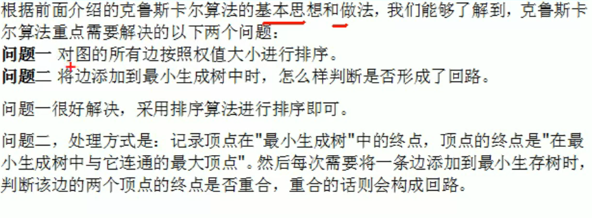

> 克鲁斯卡尔算法问题二分析


增加的这条边对于的两个顶点，如果他们都是已经指向同个终点，则证明这条边的添加将导致回路、也就判断出这条边不能加入。

【顶点的排序是按照字母来排序的，所以上面的图中都是以F作为终点】


> 克鲁斯卡尔算法解决公交站问题代码实现


解决问题二的方式就是通过一个数组来实现：假设有边<C,D>、<D,E>那么在添加<E,C>这条边时，C顶点的终点是E，E节点的终点是E（看作是一个链表，都指向同一个尾节点）所以不能添加这条边，会构成回路。


> 克鲁斯卡尔算法解决公交车站问题

```java
import java.util.Arrays;

/**
 * @Author: zhuzhe
 * @ClassName: Main
 * @Date: 2022/5/23 16:50
 * @Description: 克鲁斯卡尔算法解决公交站问题
 * @Version: V1.0
 * @Param:
 */
public class Main {
    //使用INF来表示两个顶点不能联通
    public static final int INF = Integer.MAX_VALUE;

    public static void main(String[] args) {
        char[] vertexs = {'A', 'B', 'C', 'D', 'E', 'F', 'G'};
        int[][] matrix = {
                {  0,  12, INF, INF, INF,  16,  14},
                { 12,   0,  10, INF, INF,   7, INF},
                {INF,  10,   0,   3,   5,   6, INF},
                {INF, INF,   3,   0,   4, INF, INF},
                {INF, INF,   5,   4,   0,   2,   8},
                { 16,   7,   6, INF,   2,   0,   9},
                { 14, INF, INF, INF,   8,   9,   0}
        };
        KruskalCase kruskalCase = new KruskalCase(vertexs,matrix);
        //打印邻接矩阵
        kruskalCase.print();
        //将邻接矩阵转换为路径数组
        EData[] edges = kruskalCase.getEdges();
        System.out.println("排序前的数组：\n"+Arrays.toString(edges));
        kruskalCase.sortEdges(edges);
        System.out.println("排序后的数组：\n"+Arrays.toString(edges));
        kruskalCase.kruskal();
    }
}

class KruskalCase{
    private int edgeNum;
    private char[] vertexs;
    private int[][] matrix;

    public KruskalCase(char[] vertexs, int[][] matrix) {
        int vlen = vertexs.length;
        //复制原来的顶点数组
        this.vertexs = new char[vlen];
        for (int i = 0; i < vertexs.length; i++) {
            this.vertexs[i] = vertexs[i];
        }
        //复制原来的边数组
        this.matrix = new int[vlen][vlen];
        for (int i = 0; i < vlen; i++) {
            for (int j = 0; j < vlen; j++) {
                this.matrix[i][j] = matrix[i][j];
            }
        }
        //统计边(这个边没有统计A-B和B-A的重复边)
        for (int i = 0; i < vlen; i++) {
            for (int j = i+1; j < vlen; j++) {
                if (this.matrix[i][j] != Integer.MAX_VALUE) {
                    edgeNum++;
                }
            }
        }
    }

    //打印邻接矩阵
    public void print() {
        System.out.println("图的邻接矩阵：");
        for (int i = 0; i < vertexs.length; i++) {
            System.out.printf("%10c\t", vertexs[i]);
        }
        System.out.println();
        for (int i = 0; i < vertexs.length; i++) {
            System.out.print(vertexs[i]+"\t");
            for (int j = 0; j < vertexs.length; j++) {
                System.out.printf("%10d\t|", matrix[i][j]);
            }
            System.out.println();
        }
    }

    /**
     * 将数组按照权值进行排序
     * @param edges
     */
    public void sortEdges(EData[] edges){
        //冒泡排序边数组
         for (int i = 0; i < edges.length -1; i++){
             for (int j = 0; j<edges.length-1-i;j++){
                 if (edges[j].weight>edges[j+1].weight){
                     EData temp = edges[j];
                     edges[j] = edges[j+1];
                     edges[j+1] = temp;
                 }
             }
         }
    }

    //找到顶点对于的下标
    public int getPosition(char ch){
        for (int i = 0; i < vertexs.length; i++) {
            if (vertexs[i]==ch){
                return i;
            }
        }
        return -1;
    }

    //将邻接矩阵转为EData数组 {{'A','B',12},{'B','F',7}}
    public EData[] getEdges(){
        int index = 0;
        EData[] edges = new EData[edgeNum];
        for (int i = 0; i < vertexs.length; i++) {
            for (int j = i+1; j < vertexs.length; j++) {//遍历上三角
                if (matrix[i][j]!=Integer.MAX_VALUE){
                    edges[index++] = new EData(vertexs[i], vertexs[j], matrix[i][j]);
                }
            }
        }
        return edges;
    }

    /**
     * 获取下标为i的顶点的终点（并查集）
     * @param ends 记录各个顶点对应的终点是哪个
     * @param i 传入的顶点对应的下标
     * @return 找到这个顶点对应的终点下标
     */
    public int getEnd(int[] ends, int i){
        while (ends[i]!=0){//如果当前顶点有下一个点，就继续递归深入，直到当前这个点没有下一个点，那个就是终点
            i = ends[i];//不断赋值到i，i又用到下一次循环，这样递推到最终的一个点就是终点
        }
        return i;//如果这个顶点本身没有下一个顶点，则返回自己的坐标
    }

    //克鲁斯卡尔算法
    public void kruskal(){
        int index = 0;//最后结果数组的索引
        int[] ends = new int[edgeNum];//顶点在最小生成树中的终点
        //创建结果数组，保存最后的最小生成树
        EData[] rets = new EData[edgeNum];
        //获取图中所有边集合
        EData[] edges = getEdges();
        System.out.println("原始图的边数："+edges.length);
        //问题一：按照边的权值来排序边集合
        sortEdges(edges);
        //问题二：将边添加到最小生成树，判断边是否构成回路，没构成就加入到结果数组
        for (int i = 0; i < edgeNum; i++) {//遍历边
            //拿到这条边的两个顶点
            int p1 = getPosition(edges[i].start);
            int p2 = getPosition(edges[i].end);
            //获取p1顶点它在已有最小生成树中的对应终点
            int p1End = getEnd(ends,p1);
            //获取p2顶点它在已有最小生成树中的对应终点
            int p2End = getEnd(ends,p2);
            //如果两个顶点递推最后都指向同个终点，则证明这条边的加入会构成回路
            if (p1End!=p2End){//不构成的情况加入
                ends[p1End] = p2End;//设置p1顶点在最小生成树的终点[0,0,0,0,5,0,0,0,0,0,0]顶点坐标4的终点是坐标5顶点
                rets[index++] = edges[i];//将这个边加到结果数组
            }
        }
        //统计并打印最小生成树
        System.out.println("最小生成树：\n"+Arrays.toString(rets));
    }
}

//边对象
class EData{
    char start; //边的起点
    char end;   //边的终点
    int weight; //边的权值

    public EData(char start, char end, int weight) {
        this.start = start;
        this.end = end;
        this.weight = weight;
    }

    @Override
    public String toString() {
        return "EData{" +
                "start=" + start +
                ", end=" + end +
                ", weight=" + weight +
                "}\n";
    }
}
```


### 迪杰斯特拉算法（最短路径）

这一个和最小生成树的概念不同，最小生成树是为了节省路径而设计。而最短路径在遍历上只看能到达点的最短距离。(算法的底层使用的是广度优先搜索)

比如之前的普利姆算法得出的最小生成树：


这里的话到达B点到达D点肯定不能走B->G->E->F->D的


最短路径是是直接B->D


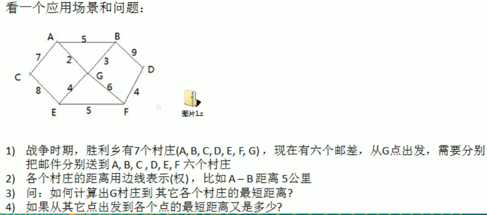


> 迪杰斯特拉算法思路


以一个点为**起始点**，遍历邻接顶点，记录访问、记录从**起始点**到该节点的距离、记录遍历到的邻接节点关系。

从遍历到的邻接节点中，开始下一层遍历，如果有最小路径的，则优先从最小路径开始。遍历下一层的邻接节点，记录访问（每个用来遍历下一层的顶点要记录已访问），记录从**起始点**到该节点的距离（之前记录的距离+现在到达的距离）

这样直到所有的顶点都进行了遍历访问自己的邻接节点，此时就记录和更新了从**起始点**到所有其他节点的最短路径。


​																												    （G点到其他节点的距离）


> 迪杰斯特拉算法实现

```java
import java.util.Arrays;

/**
 * @Author: zhuzhe
 * @ClassName: Main
 * @Date: 2022/5/24 11:45
 * @Description: 迪杰斯特拉算法
 * @Version: V1.0
 * @Param:
 */
public class Main {
    public static void main(String[] args) {
        //最大值
        final int N = 65535;
        //顶点数组
        char[] vertex = {'A', 'B', 'C', 'D', 'E', 'F', 'G'};
        //邻接矩阵
        int[][] matrix = {
                {N,5,7,N,N,N,2},
                {5,N,N,9,N,N,3},
                {7,N,N,N,8,N,N},
                {N,9,N,N,N,4,N},
                {N,N,8,N,N,5,4},
                {N,N,N,4,5,N,6},
                {2,3,N,N,4,6,N}
        };
        //创建图
        Graph graph = new Graph(vertex, matrix);
        graph.showGraph();
        //测试迪杰斯特拉算法
        graph.dijkstra(6);
    }
}

class Graph{
    private char[] vertex;      //顶点数组
    private int[][] matrix;     //邻接矩阵
    private VisitedVertex vv;   //已经访问顶点的集合

    public Graph(char[] vertex, int[][] matrix) {
        this.vertex = vertex;
        this. matrix = matrix;
    }

    //显示图
    public void showGraph(){
        System.out.print("[ ] ");
        for (char c : vertex) {
            System.out.printf("[  %c  ]",c);
        }
        System.out.println();

        for (int i = 0; i < matrix.length; i++) {
            int[] row = matrix[i];
            System.out.print("["+vertex[i]+"] [");
            for (int j = 0; j < row.length; j++) {
                int element = row[j];
                if (j==0)
                    System.out.printf("%5d,",element);
                else if (j==row.length-1)
                    System.out.printf("%6d",element);
                else
                    System.out.printf("%6d,",element);
            }
            System.out.println("]");
        }
    }

    /**
     * 迪杰斯特拉算法（广度+贪心）
     * @param index 表示出发顶点对应的下标
     */
    public void dijkstra(int index){
        vv = new VisitedVertex(vertex.length, index);
        update(index);//更新index顶点到周围顶点的距离和联系
        for (int i = 1; i < vertex.length; i++) {
            index = vv.updateArr();//选择下一层顶点来访问
            update(index);
        }
    }

    //更新index下标顶点到周围顶点的距离和周围顶点的前驱顶点
    private void update(int index){
        int len = 0;
        //遍历这个点的邻接矩阵（这个点的这一行，记录着和其他顶点连接路径的长度）
        for (int i = 0; i < matrix[index].length; i++) {
            //出发顶点到index顶点的距离 + index顶点到i顶点的距离（因为有的点到达是要过很多个顶点）
            len = vv.getDis(index) + matrix[index][i];
            if (!vv.isVisited(i) && len < vv.getDis(i)){//更新到这个i顶点的距离（如果有更短到的距离，那当然选短的）
                vv.updatePre(i,index);  //记录联系
                vv.updateDis(i,len);    //更新距离
            }
        }

        vv.show(index,vertex,matrix);
    }
}

//已访问过顶点
class VisitedVertex{
    //记录各个顶点是否访问过
    public int[] visited;
    //每个顶点下标对应的前驱顶点下标
    public int[] pre_visited;
    //出发顶点到其他所有顶点的距离，如果有最短则更新最短
    public int[] dis;

    /**
     *
     * @param len 顶点个数
     * @param index 出发顶点下标
     */
    public VisitedVertex(int len, int index) {
        this.visited = new int[len];
        this.pre_visited = new int[len];
        this.dis = new int[len];
        //初始化距离
        Arrays.fill(this.dis,65535);
        this.dis[index] = 0;//自己到自己的距离是0
        this.visited[index] = 1;
    }

    /**
     * 判断index顶点是否被访问过
     * @param index
     * @return
     */
    public boolean isVisited(int index){
        return visited[index] == 1;
    }

    /**
     * 更新出发顶点到index顶点的距离
     * @param index
     * @param len
     */
    public void updateDis(int index, int len){
        this.dis[index] = len;
    }

    /**
     * 更新顶点的前驱顶点
     * @param index
     * @param pre
     */
    public void updatePre(int index, int pre){
        this.pre_visited[index] = pre;
    }

    /**
     * 返回 出发顶点 到 index顶点 的距离
     * @param index
     */
    public int getDis(int index){
        return this.dis[index];
    }

    /**
     * 当G点访问过邻接点后，找到权值最小的顶点A，以顶点A作为起始点开始下一层访问
     * @return
     */
    public int updateArr(){
        int min = 65535;
        int index = 0;
        for (int i = 0; i < visited.length; i++) {
            //找到上一次访问中的最小权值顶点，以这个顶点开始继续下一层访问
            if (dis[i] < min && visited[i]==0){//广度优先+贪心
                min = dis[i];
                index = i;
            }
        }
        //更新index顶点为访问过
        visited[index]=1;
        return index;
    }

    public void show(int index, char[] vertex, int[][] matrix){
        System.out.println("==================================================================");
        System.out.println("遍历进度：");
        for (char c : vertex) {
            System.out.printf(" %c ",c);
        }
        System.out.println();
        System.out.println(Arrays.toString(visited));
        System.out.print("访问："+vertex[index]+"->");
        for (int i = 0; i < matrix[index].length; i++) {
            if (matrix[index][i]!=65535)
                System.out.print(vertex[i]);
        }
        System.out.println();
        System.out.print("此时节点G到各个节点的距离：");
        for (int i = 0; i < dis.length; i++) {
            int len = dis[i];
            if (len==65535)
                System.out.print(vertex[i]+"(N) ");
            else
                System.out.print(vertex[i]+"("+len+") ");
        }
        System.out.println();
        System.out.print("顶点关系：");
        for (int i = 0; i < pre_visited.length; i++) {
            int prevIndex = pre_visited[i];
            if (prevIndex==0)
                System.out.printf("(?->%c),",vertex[i]);
            else
                System.out.printf("(%c->%c),",vertex[prevIndex],vertex[i]);
        }
        System.out.println();
    }
}
```

运行结果：

```
C:\software\jdk1.8.0_301\bin\java.exe ...
[ ] [  A  ][  B  ][  C  ][  D  ][  E  ][  F  ][  G  ]
[A] [65535,     5,     7, 65535, 65535, 65535,     2]
[B] [    5, 65535, 65535,     9, 65535, 65535,     3]
[C] [    7, 65535, 65535, 65535,     8, 65535, 65535]
[D] [65535,     9, 65535, 65535, 65535,     4, 65535]
[E] [65535, 65535,     8, 65535, 65535,     5,     4]
[F] [65535, 65535, 65535,     4,     5, 65535,     6]
[G] [    2,     3, 65535, 65535,     4,     6, 65535]
==================================================================
遍历进度：
 A  B  C  D  E  F  G 
[0, 0, 0, 0, 0, 0, 1]
访问：G->ABEF
此时节点G到各个节点的距离：A(2) B(3) C(N) D(N) E(4) F(6) G(0) 
顶点关系：(G->A),(G->B),(?->C),(?->D),(G->E),(G->F),(?->G),
==================================================================
遍历进度：
 A  B  C  D  E  F  G 
[1, 0, 0, 0, 0, 0, 1]
访问：A->BCG
此时节点G到各个节点的距离：A(2) B(3) C(9) D(N) E(4) F(6) G(0) 
顶点关系：(G->A),(G->B),(?->C),(?->D),(G->E),(G->F),(?->G),
==================================================================
遍历进度：
 A  B  C  D  E  F  G 
[1, 1, 0, 0, 0, 0, 1]
访问：B->ADG
此时节点G到各个节点的距离：A(2) B(3) C(9) D(12) E(4) F(6) G(0) 
顶点关系：(G->A),(G->B),(?->C),(B->D),(G->E),(G->F),(?->G),
==================================================================
遍历进度：
 A  B  C  D  E  F  G 
[1, 1, 0, 0, 1, 0, 1]
访问：E->CFG
此时节点G到各个节点的距离：A(2) B(3) C(9) D(12) E(4) F(6) G(0) 
顶点关系：(G->A),(G->B),(?->C),(B->D),(G->E),(G->F),(?->G),
==================================================================
遍历进度：
 A  B  C  D  E  F  G 
[1, 1, 0, 0, 1, 1, 1]
访问：F->DEG
此时节点G到各个节点的距离：A(2) B(3) C(9) D(10) E(4) F(6) G(0) 
顶点关系：(G->A),(G->B),(?->C),(F->D),(G->E),(G->F),(?->G),
==================================================================
遍历进度：
 A  B  C  D  E  F  G 
[1, 1, 1, 0, 1, 1, 1]
访问：C->AE
此时节点G到各个节点的距离：A(2) B(3) C(9) D(10) E(4) F(6) G(0) 
顶点关系：(G->A),(G->B),(?->C),(F->D),(G->E),(G->F),(?->G),
==================================================================
遍历进度：
 A  B  C  D  E  F  G 
[1, 1, 1, 1, 1, 1, 1]
访问：D->BF
此时节点G到各个节点的距离：A(2) B(3) C(9) D(10) E(4) F(6) G(0) 
顶点关系：(G->A),(G->B),(?->C),(F->D),(G->E),(G->F),(?->G),

Process finished with exit code 0

```


### 弗洛伊德算法（最短路径）

迪杰斯特拉是一对多，弗洛伊德是多对多。


> 弗洛伊德算法分析


和动态规划类似，选和不选的问题：计算直接从i到j和从i到k到j那个的距离短。

弗洛伊德算法步骤：


> 弗洛伊德算法步骤解析


**第一轮循环**

在邻接矩阵中，描述了一个点到另外一个点的路径长度。这是两点连接形成的直线。

如果有两个点的路径，需要经过另外一个点的连接，即三个点练成的直线，则称这一个处在中间起到桥梁作用的顶点——中间顶点


弗洛伊德算法第一轮循环就是以一个点为中间顶点，对受益顶点，更新新的路径到邻接矩阵和前驱关系表中。

* 在邻接矩阵中，对两个顶点的路径长度进行更新，如果新路径大于原路径，则不更新。
* 在前驱关系表中，更新两个顶点连接的中间顶点


> 弗洛伊德算法循环条件

通过创建三个数组，开启三层遍历。

第一层遍历是中间顶点、第二层遍历是起始顶点、第三层遍历是结束顶点。以此来判断两个顶点的到达是否借助中间顶点，还有借助后的路径是否比原来的路径小。


> 弗洛伊德算法实现

```java
import java.util.Arrays;

/**
 * @Author: zhuzhe
 * @ClassName: Main
 * @Date: 2022/5/24 18:09
 * @Description: 弗洛伊德算法
 * @Version: V1.0
 * @Param:
 */
public class Main {
    public static void main(String[] args) {
        final int N = 65535;
        char[] vertex = {'A', 'B', 'C', 'D', 'E', 'F', 'G'};
        int[][] matrix = {
                {0, 5, 7, N, N, N, 2},
                {5, 0, N, 9, N, N, 3},
                {7, N, 0, N, 8, N, N},
                {N, 9, N, 0, N, 4, N},
                {N, N, 8, N, 0, 5, 4},
                {N, N, N, 4, 5, 0, 6},
                {2, 3, N, N, 4, 6, 0}
        };
        Graph graph = new Graph(vertex.length, matrix, vertex);
        graph.show();
        System.out.println("===========================进行弗洛伊德求每个点的最短路径===========================");
        graph.floyd();
        graph.show();
    }

}

//图
class Graph {
    private char[] vertex;  //顶点数组
    private int[][] dis;    //邻接矩阵
    private int[][] pre;    //前驱节点表

    public Graph(int len, int[][] matrix, char[] vertex) {
        this.vertex = vertex;
        this.dis = matrix;
        this.pre = new int[len][len];
        //初始化前驱节点数组，和思路图不太一样，存放的是前驱节点的下标
        for (int i = 0; i < len; i++) {
            Arrays.fill(pre[i], i);
        }
    }

    public void show() {
        System.out.println("前驱数组：");
        char[][] temp = new char[vertex.length][vertex.length];
        for (int i = 0; i < pre.length; i++) {
            for (int j = 0; j < pre.length; j++) {
                temp[i][j] = vertex[pre[i][j]];
            }
        }
        for (char[] row : temp) {
            System.out.println(Arrays.toString(row));
        }
        System.out.println("邻接矩阵：");
        System.out.print("[ ] ");
        for (int i = 0; i < vertex.length; i++) {
            System.out.printf("[  %c  ]",vertex[i]);
        }
        System.out.println();
        for (int i = 0; i < dis.length; i++) {
            for (int j = 0; j < dis.length; j++) {
                if (j==0){
                    System.out.printf("[%c] [%5d, ",vertex[i],dis[i][j]);
                }else if (j==dis.length-1){
                    System.out.printf("%5d] ",dis[i][j]);
                }else {
                    System.out.printf("%5d, ",dis[i][j]);
                }
            }
            System.out.println();
        }
    }

    //弗洛伊德算法
    public void floyd(){
        int len = 0;
        //对 "中间顶点" 的遍历
        for (int i = 0; i < dis.length; i++) {
            //对 "起始顶点" 的遍历
            for (int j = 0; j < dis.length; j++) {
                //对 "终止顶点" 的遍历
                for (int k = 0; k < dis.length; k++) {
                    len = dis[j][i] + dis[i][k];//从 "起始顶点->中间顶点" 的距离 + "中间顶点->终止顶点" 的距离
                    if (len < dis[j][k]){//如果使用 "中间顶点" 的路径小于原本直连的路径，就可以更新
                        dis[j][k] = len;//更新邻接矩阵
                        pre[j][k] = pre[i][k];//更新前驱数组（pre[i][k]代表要从j走到k时，k的前一步 不能用i是因为 pre[i][k]不一定等于i 它等于从i到k的k的前一步 i到k中间可能经过了其他节点）
                        //从 "起始顶点->中间顶点" 这段路是直到的，但是从 "中间顶点->终止顶点" 着段路是有可能再次构建新 "中间顶点"的
                    }
                }
            }
        }
    }
}
```


A点到D点的最短路径是12，虽然走多了几条路，但是确实是12。


经过少节点的路径，反而权值大。


同时这也说明了在代码中`pre[j][k] = pre[i][k];`的含义：G->D的中间节点是F。

所以从A->D的中间节点，实际是前中间节点G->D的中间节点，而G->D这里如果是直连，则是保留原本的G不变，但是如果里面再有一个中间节点，则就是读取到这段路径的中间节点。即要求的中间节点是G->D中的F顶点。


### 马踏棋盘算法

深度优先+贪心

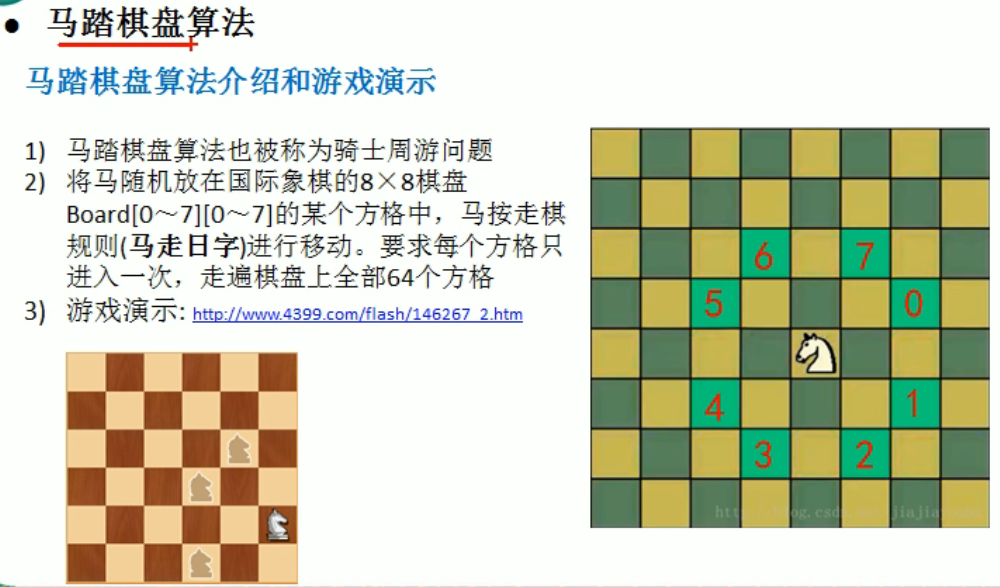


> 马踏棋盘算法思路


> 马踏棋盘代码

通过深度优先，找到当前棋子在棋盘中的所有可行路线，选第一个点递归走下一步，如果走到后面发现不能把棋盘填满，则回溯到最开始，重置棋盘。换下一个点重复这个过程，直到把棋盘走完。

```java
import java.awt.*;
import java.util.ArrayList;
import java.util.Arrays;

/**
 * @Author: zhuzhe
 * @ClassName: Main
 * @Date: 2022/5/24 22:42
 * @Description:
 * @Version: V1.0
 * @Param:
 */
public class Main {
    public static void main(String[] args) {
        HorseChessBoard.instance(8,8);
    }
}

class HorseChessBoard {
    /**
     * ·········→X
     * ·
     * ·
     * ↓
     * Y
     */
    private static int X; //棋盘的列数
    private static int Y; //棋盘的行数
    private static boolean[] visited;//标记棋盘各个位置是否被访问过
    private static boolean isFinished; //标记棋盘是否所有位置都访问过

    public static void instance(int x, int y){
        X = x;
        Y = y;
        int[][] chessboard = new int[x][y];
        visited = new boolean[x * y];
        long startTime = System.currentTimeMillis();
        traversalChessboard(chessboard,0,0,1);
        long endTime = System.currentTimeMillis();
        System.out.println("骑士周游算法执行耗时："+(endTime-startTime)+"ms");
        //输出棋盘的最后情况
        for (int[] row: chessboard) {
            System.out.println(Arrays.toString(row));
        }
    }

    /**
     * 根据当前的位置（Point对象），计算马儿还能走哪些位置（Point对象），并放入到一个集合中（ArrayList），最多有8个位置
     *
     * @param curPoint
     * @return
     */
    public static ArrayList<Point> next(Point curPoint) {
        ArrayList<Point> ps = new ArrayList<>();
        /**
         * 新建一个临时点
         *
         * 0-------------->X
         * |       (-)
         * |        ↑
         * |        |
         * |  (-)←--p1--→(+)
         * |        |
         * ↓        ↓
         * Y       (+)
         */
        Point p1 = new Point();
        /**
         * 横向左上角的点可以走
         * p1 0  0
         * 0  0  cur
         */
        if ((p1.x = curPoint.x - 2) >= 0 && (p1.y = curPoint.y - 1) >= 0){
            ps.add(new Point(p1));
        }
        /**
         * 竖向左上角的点可以走
         * p1 0
         * 0  0
         * 0  cur
         */
        if ((p1.x = curPoint.x - 1) >= 0 && (p1.y = curPoint.y - 2) >= 0){
            ps.add(new Point(p1));
        }
        /**
         * 竖向右上角可以走
         * 0   p1
         * 0   0
         * cur 0
         */
        if ((p1.x = curPoint.x + 1) < X && (p1.y = curPoint.y - 2) >= 0){
            ps.add(new Point(p1));
        }
        /**
         * 横向右上角可以走
         * 0   0 p1
         * cur 0 0
         */
        if ((p1.x = curPoint.x + 2) < X && (p1.y = curPoint.y - 1) >= 0){
            ps.add(new Point(p1));
        }
        /**
         * 横向右下角
         * cur 0 0
         * 0   0 p1
         */
        if ((p1.x = curPoint.x + 2) < X && (p1.y = curPoint.y + 1) < Y){
            ps.add(new Point(p1));
        }
        /**
         * 竖向右下角
         * cur 0
         * 0   0
         * 0   p1
         */
        if ((p1.x = curPoint.x + 1) < X && (p1.y = curPoint.y + 2) < Y){
            ps.add(new Point(p1));
        }
        /**
         * 竖向左下角
         * 0  cur
         * 0  0
         * p1 0
         */
        if ((p1.x = curPoint.x - 1) >= 0 && (p1.y = curPoint.y + 2) < Y){
            ps.add(new Point(p1));
        }
        /**
         * 横向左下角
         * 0  0 cur
         * p1 0 0
         */
        if ((p1.x = curPoint.x - 2) >= 0 && (p1.y = curPoint.y + 1) < Y){
            ps.add(new Point(p1));
        }
        return ps;
    }

    /**
     * 完成骑士周游
     * @param chessboard 棋盘
     * @param row 马当前位置行X
     * @param col 马当前位置列Y
     * @param step 是第几步，初始位置就是第1步
     */
    public static void traversalChessboard(int[][] chessboard, int row, int col, int step){
        chessboard[row][col] = step;
        visited[row * X + col] = true;//二维数组压缩为一维数组的坐标，从棋盘左上角0开始数，从左往右，从上往下数到第36个元素即是当前元素
        //获取可以走的下一个位置的集合
        ArrayList<Point> ps = next(new Point(col, row));//x对应列，y对应行

        while (!ps.isEmpty()){
            Point point = ps.remove(0);//取出下一个可以走的位置
            //判断该点是否已经访问过
            if (!visited[point.y * X + point.x]){
                traversalChessboard(chessboard,point.y,point.x,step+1);
            }
        }

        //判断马是否完成了任务，使用step和应该走的步数比较，如果没有达到数量，则表示没有完成任务，将整个棋盘制空
        //step < X * Y：
        //1. 棋盘到目前位置，仍然没有走完
        //2. 棋盘处于一个回溯过程
        if (step < X * Y && !isFinished){//如果还没有走完(这里每一次的递归回溯时都会进入判断)
            chessboard[row][col] = 0;
            visited[row * X + col] = false;
        }else {
            isFinished = true;
        }
    }
}
```


#### 贪心算法优化

之前的算法运行结束平均要30秒时间

原本的策略是每走到一个点，获取所有可以下一步走的点，顺时针遍历递归去走下一步。但实际可以用贪心算法来择优一些点来走。提高运行效率。

> 改进思路

因为查找下一步是按照ps数组进行正序循环递归的。所以只需要对ps进行一个处理


> 优化代码

```java
import java.awt.*;
import java.util.ArrayList;
import java.util.Arrays;
import java.util.Comparator;

/**
 * @Author: zhuzhe
 * @ClassName: Main
 * @Date: 2022/5/24 22:42
 * @Description:
 * @Version: V1.0
 * @Param:
 */
public class Main {
    public static void main(String[] args) {
        HorseChessBoard.instance(8,8);
    }
}

class HorseChessBoard {
    /**
     * ·········→X
     * ·
     * ·
     * ↓
     * Y
     */
    private static int X; //棋盘的列数
    private static int Y; //棋盘的行数
    private static boolean[] visited;//标记棋盘各个位置是否被访问过
    private static boolean isFinished; //标记棋盘是否所有位置都访问过

    public static void instance(int x, int y){
        X = x;
        Y = y;
        int[][] chessboard = new int[x][y];
        visited = new boolean[x * y];
        long startTime = System.currentTimeMillis();
        traversalChessboard(chessboard,0,0,1);
        long endTime = System.currentTimeMillis();
        System.out.println("骑士周游算法执行耗时："+(endTime-startTime)+"ms");
        //输出棋盘的最后情况
        for (int[] row: chessboard) {
            System.out.println(Arrays.toString(row));
        }
    }

    /**
     * 根据当前的位置（Point对象），计算马儿还能走哪些位置（Point对象），并放入到一个集合中（ArrayList），最多有8个位置
     *
     * @param curPoint
     * @return
     */
    public static ArrayList<Point> next(Point curPoint) {
        ArrayList<Point> ps = new ArrayList<>();
        /**
         * 新建一个临时点
         *
         * 0-------------->X
         * |       (-)
         * |        ↑
         * |        |
         * |  (-)←--p1--→(+)
         * |        |
         * ↓        ↓
         * Y       (+)
         */
        Point p1 = new Point();
        /**
         * 横向左上角的点可以走
         * p1 0  0
         * 0  0  cur
         */
        if ((p1.x = curPoint.x - 2) >= 0 && (p1.y = curPoint.y - 1) >= 0){
            ps.add(new Point(p1));
        }
        /**
         * 竖向左上角的点可以走
         * p1 0
         * 0  0
         * 0  cur
         */
        if ((p1.x = curPoint.x - 1) >= 0 && (p1.y = curPoint.y - 2) >= 0){
            ps.add(new Point(p1));
        }
        /**
         * 竖向右上角可以走
         * 0   p1
         * 0   0
         * cur 0
         */
        if ((p1.x = curPoint.x + 1) < X && (p1.y = curPoint.y - 2) >= 0){
            ps.add(new Point(p1));
        }
        /**
         * 横向右上角可以走
         * 0   0 p1
         * cur 0 0
         */
        if ((p1.x = curPoint.x + 2) < X && (p1.y = curPoint.y - 1) >= 0){
            ps.add(new Point(p1));
        }
        /**
         * 横向右下角
         * cur 0 0
         * 0   0 p1
         */
        if ((p1.x = curPoint.x + 2) < X && (p1.y = curPoint.y + 1) < Y){
            ps.add(new Point(p1));
        }
        /**
         * 竖向右下角
         * cur 0
         * 0   0
         * 0   p1
         */
        if ((p1.x = curPoint.x + 1) < X && (p1.y = curPoint.y + 2) < Y){
            ps.add(new Point(p1));
        }
        /**
         * 竖向左下角
         * 0  cur
         * 0  0
         * p1 0
         */
        if ((p1.x = curPoint.x - 1) >= 0 && (p1.y = curPoint.y + 2) < Y){
            ps.add(new Point(p1));
        }
        /**
         * 横向左下角
         * 0  0 cur
         * p1 0 0
         */
        if ((p1.x = curPoint.x - 2) >= 0 && (p1.y = curPoint.y + 1) < Y){
            ps.add(new Point(p1));
        }
        return ps;
    }

    //根据当前这一步的所有下一步，选择位置，进行非递减排序
    public static void sort(ArrayList<Point> ps){
        /**
         * compare方法返回值大于0，会交换前后两个数位置
         * compare方法返回值小于等于0，位置不交换
         */
        ps.sort(new Comparator<Point>() {
            @Override
            public int compare(Point o1, Point o2) {
                int o1Size = next(o1).size();
                int o2Size = next(o2).size();
                if (o1Size < o2Size)
                    return -1;
                else if (o1Size == o2Size)
                    return 0;
                else
                    return 1;
            }
        });
    }

    /**
     * 完成骑士周游
     * @param chessboard 棋盘
     * @param row 马当前位置行X
     * @param col 马当前位置列Y
     * @param step 是第几步，初始位置就是第1步
     */
    public static void traversalChessboard(int[][] chessboard, int row, int col, int step){
        chessboard[row][col] = step;
        visited[row * X + col] = true;//二维数组压缩为一维数组的坐标，从棋盘左上角0开始数，从左往右，从上往下数到第36个元素即是当前元素
        //获取可以走的下一个位置的集合
        ArrayList<Point> ps = next(new Point(col, row));//x对应列，y对应行
        //todo 对ps进行非递减排序
        sort(ps);

        while (!ps.isEmpty()){
            Point point = ps.remove(0);//取出下一个可以走的位置
            //判断该点是否已经访问过
            if (!visited[point.y * X + point.x]){
                traversalChessboard(chessboard,point.y,point.x,step+1);
            }
        }

        //判断马是否完成了任务，使用step和应该走的步数比较，如果没有达到数量，则表示没有完成任务，将整个棋盘制空
        //step < X * Y：
        //1. 棋盘到目前位置，仍然没有走完
        //2. 棋盘处于一个回溯过程
        if (step < X * Y && !isFinished){//如果还没有走完(这里每一次的递归回溯时都会进入判断)
            chessboard[row][col] = 0;
            visited[row * X + col] = false;
        }else {
            isFinished = true;
        }
    }
}
```


