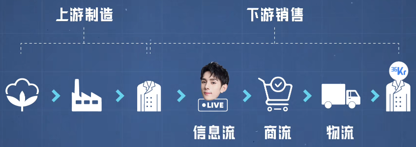
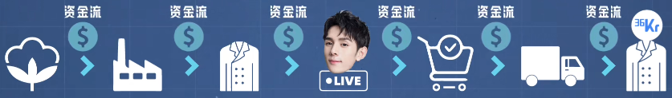

# 供应链

## 供应链前世今生

### 如何形成

指的是产品从生产到交付的过程中，所涉及到的企业、信息的网络。

例子：奶茶产业

* 茶叶去哪买
* 珍珠哪里最偏移
* 机器那里买靠谱

管理好并解决了上面的三个问题，则此时这一个就算是一个奶茶的供应链。

现代社会中，所有的商品都无一例外涉及到供应链的概念。这些又和全球化相关（一台手机的来源），供应链是连接着世界各地。

### 初代的供应链

丝绸之路、海运、铁路

**现代供应链**

根据需求而产生

**支撑的基础**

工厂（工人+工厂+效率）。大量的工厂为社会提供了大量的资源，而这些产品的也促进了对原材料的需求。

**成本的降低**

由于大量的工厂连接上了铁路，海运。这使得产品推向全球，也加快了产品的生产效率、降低了产品的售卖价格。


### 第二代供应链

在第一代的基础上，通过航运、铁路、工厂构成。


同时不止是简单的链接，还需要又上下游的垂直整合。


### 第三代供应链

在原本第二代的基础上，对哪些各自生产零部件的工厂，福特进行了整合为流水线。在垂直方向上进行了管理。


最大的好处就是控制材料、缩减成本、加强品控。这种方式就是强化了供应链概念的管理。

### 及时生产制度

日本的丰田在创立之初，发现了美国的超市供应策略。而产生的一种适用于供应链的制度：

及时生产制：

* **按照上游订单为主，需求订单到了才去采购、生产**。

传统的推动方式：

* 生产出多少就需要销售卖出去多少

同时为了配合这种反向生产方式，丰田又研究出了看板系统。为了保证品质，丰田公司将生产上的每个环节（零部件、生产工具、生产动作）都进行了标准化。然后又与零部件生产商签订了长期的供货合同。最终在保证质量和效率的同时，实现了极致的不积压原材料、不压货、零库存。

苹果的借鉴：将现有产品定为一种产品线，再去优化部分零部件使其通用，这样使得减少采购零部件的种类，同时加大订单。降低了成本。（供应商和苹果成为了绑定关系）

### 航运的改革

提出了航运集装箱的一套标准，使得集装箱运输对于全球化供应提供了便捷。许多商品进行跨国销售，运费成本能占据1/4。

* 没标准化前：集装箱海运要$2400
* 标准化后：海运$1000。如果是运输鞋子货物，则每双鞋子的运费只两块五

航运使得供应链中可以支持到全世界。比如现在的世界各地原材料。


一件商品都是基于全球化下的供应链流水线产生。

### RCEP

《区域全面经济伙伴关系协定》对国家而言，在这片区域里贸易会更加方便。


供应链渗透进我们生活中的方方面面。（网购、自主研发高铁）

### 现代供应链概念

一件商品从原材料开始到最终涉及到的所有环节，就是供应链。这里面的信息：


例子：从抖音直播间购买了一件衣服

1. 从棉花进入工厂生产
2. 材料加工为成衣
3. 被抖音主播选中，开始订货
4. 用户在抖音看到带货，下单
5. 商家发货，用户收货

这整个链上涉及到的一每个节点，也就是供应链上的一环。


利用上面的模型，可以看到上游、下游、四流





（所以这也就说明了每一件商品的背后，都包含着这样一个庞大的供应链）

## 中国供应链的前世今生

### 上世纪90年代

比较多都是中国制造，还算不上完整的供应链。在崛起时的最大优势是人力成本低、厂房租赁费用便宜是优势。

存在的问题：不可替代性低、如果其他国家生产售价更为便宜则中国会失去优势

### 现代

中国在全球供应链中提升自己的不可替代性。（中国世界工厂2010-2020）


**规模**


**效率**

因为种类基本都有，所以效率也就提高。

**市场**

中国拥有全球最大的市场。来中国投资建厂会大大降低企业成本。（人工成本、运输成本、营销成本）

**影响**


REEP的签订会降低全球供应产品的关税。对参与国区域内的投资者和公司员工都提供便捷。


## 供应链系统SCM

**SCM**(Supply Chain Management)，中文是供应链管理（系统），是对供应链上从供应商、生产厂家、分销商到零售商等的物流进行计划和控制，让生产资料以最快的速度，通过生产、分销环节变成增值的产品，最后到达有消费需求的消费者手中。它以提高整体供应链的效率、降低成本耗散、更好推动企业业务发展为目标。SCM从单一的企业角度来看，是指企业通过改善上、下游供应链关系，整合和优化供应链中的信息流、物流、资金流，以获得企业的竞争优势。

* 基础信息

  ```
  物料信息、供应商信息、作业类型、仓库信息管理、仓管员信息管理
  ```

* 采购管理

  ```
  物料采购管理、采购订单管理、采购订单变更、采购退货管理
  ```

* 供应商管理

  ```
  供应商信息、供应商考核信息、供货比例设置、物料更新信息
  ```

* 库存管理

  ```
  基础设置、期初数据、入库管理、出库管理、调拨管理、存量查询、账本查询、储蓄分析、库存盘点管理。可根据行业要求、企业管理的特点、定义系统参数，构建所需的库存模块。
  ```

* 财务管理

  ```
  供应商对帐管理、费用预算、常用的财务统计报表、应付款管理以及发票管理
  ```

* 供应商物料报价

  ```
  订单数量、库存信息、采购订单执行查询、请购计划执行查询、库存台帐查询、库存盘点综合查询、应付执行查询。
  ```

* 销售管理

  ```
  销售自动化、销售机会管理、销售预测、计划和目标制定，回款跟进管理、销售的统计查询和报表等。销售管理模块以订单为核心，对企业销售业务的执行过程跟踪和管理。
  ```

* 市场管理

  ```
  了市场活动管理、市场信息管理、竞争对手分析、市场渠道管理等
  ```

* 服务管理

  ```
  客户服务工作自动化、与呼叫中心集成、合作伙伴入口、客户服务知识库、客户反馈管理、一对一服务等。
  ```

* 订单管理

  ```
  订单统计报表、订单处理流程控制、退货管理、报价管理、报价邀请、动态的报价过程等。
  ```

* 质量管理

  ```
  质量控制的实现、采购产品的验收
  ```

* 产品设计

  ```
  品和样品的设计、产品设计和打样过程
  ```

* 仓储物流管理

  ```
  对产品进行存储管理、库存管理和物流管理等
  ```

* 自定义表单

  ```
  自定义流程表单、自定义数据表单、自定义电子表格表单、使用自定义明细表、自定义字段扩展等。
  ```

* 合同管理

  ```
  合同档案管理、合同审批、汇签流程。采购合同管理对企业物品、劳务等多种采购合同进行管理(对签订合同的执行状态进行跟踪，为采购管理提供准确和详细的统计、分析信息，实现对合同履行的全程控制和管理。)
  ```

* 工作任务

  ```
  工作流程控制、督办和跟催、工作总结报告、工作办理过程记录和报告、工作日志、工作质量评估。
  ```

* 电子商务集成

  ```
  创建电子商务网站、B2C电子商务、B2B电子商务等。
  ```

* 资产管理

  ```
  企业资产管理、设备管理、办公用品管理等。
  ```

* 个人工具

  ```
  用户界面自定义、个人工作平台、个人资料设置、个人笔记、支持单点登录服务等。
  ```

* SCM系统后台

  ```
  权限设置和管理、部门管理、成员管理、项目团队、成员集合、数据备份、日志管理、数据导入导出工具、参数设置、个性化设置内容等。系统权限主要包括：组织访问权限、菜单访问权限，系统功能使用权限。
  ```

* 其他信息化服务

  ```
  邮件管理、密码恢复、加密文档恢复等功能。
  ```


# 电商

## 概念

### **商业**

商业的核心是企业，同行企业构成了行业，而相关的行业便构成了产业。这也就是一个商业流程，可以用价值链、供应链、产业链来阐述。

### **价值链**

价值链就是企业为顾客创造价值，可以简单的描述为：产品设计-原料采购-工厂生产-仓库存储-物流运输-营销宣传-中间销售-消费者购买。而中间的销售过程，又衍生出很多角色，比如经销商、分销商、渠道商、零售商等等，就这么一个简单的链条又扩展出一个复杂的“小网”。

### **供应链**

[供应链](#供应链)就是在产品生产和流通过程中，将相关的角色，按照合理的流程，组合成合理的网络结构。比如：原材料供应商、生产商、分销商、零售商以及最终消费者等。供应链就像是一个团队大网，从一家企业拓宽到多家企业协作，将多个企业又组合成一张更大的协同网。

### **产业链**

产业链又是什么呢?产业链说起来更为宏观一点，属于集聚而成的企业群结构，不过产业维度基本已超出大多数中小企业可作为的范畴。

### **商业模式**

B2C、B2B、B2B2C、C2C、O2O、风口新零售、C2M、C2B，跨境电商。

### **商家竞争**

如果商家没有找到正确的选品就不能获得流量和曝光，我们知道足够的曝光才能带来转化率，如果曝光量上不去，赚钱无从谈起。因此，对于电商刚刚起步或者是小商家，就要学会细分领域，根据长尾效应来看，个性化的产品收益率也是很客观的。

### 电子商务

电子商务（Electronic Commerce）是以信息网络技术为手段，以商品交换为中心的商务活动。

也可理解为在互联网（Internet）、企业内部网（Intranet）和增值网（VAN，Value Added Network）上以电子交易方式进行交易活动和相关服务的活动，是传统商业活动各环节的电子化、网络化、信息化。


## 电子商务模式

**B2B（经济组织对经济组织）**

```
Business to Business：阿里巴巴、企业对企业贸易、批发
```

**B2C（经济组织对消费者）**

```
Business to Consumer：京东自营、企业到消费者
```

**B2B2C（企业对企业对消费者）**

```
Business to Business to Customer：天猫、京东、亚马逊。企业和企业到消费者。
```

**C2B(T)（消费者集合竞价-团购）**

```
Consumer to Business：拼多多、京东拼购、淘宝拼团。小分组到企业，个性化需求得到完全满足。伪C2B的过渡期。
```

**C2C（消费者对消费者）**

```
Consumer to Consumer：淘宝、倾向于个人卖家出售产品给消费者。
```

**B2F（企业对家庭）**

**O2O（网上与网下相结合）**

```
Online to Offline：美团、饿了么、百度外卖。线上线下结合。
```

**SaaS（软件服务）**

**PaaS（平台服务）**

**IaaS（基础服务）**

**M-B（移动电子商务）**

**B2G（政府采购）**

**G2B（政府抛售）**

**B2M（面向市场营销的电子商务企业）**

**M2C（生产厂商对消费者）**

**SoLoMo（社交+本地化+移动）**

**ABC（代理商-商家-消费者）**

```
代理商（Agents)、商家（Business）和消费者（Consumer）共同搭建的集生产、经营、消费为一体的电子商务平台。相互之间可以转化。大家都是这个平台的主人，生产者，消费者，经营者，合作者，管理者，大家相互服务，相互支持，你中有我，我中有你，真正形成一个利益共同体，资源共享，产、消共生而达到共同幸福的良性局面，从而达到共产、共消、共福。淘众福就是这个模式的首创者。
```

**BAB（企业-联盟-企业）**

**P2C（生活服务平台）**

**P2P（点对点、渠道对渠道）**

**SNS-EC（社会化网络电子商务）**

**B2S（分享式商务，或体验式商务）**


## 经典C2C电商系统

### 核心


### 角度

**人**

平台型电商一般由于自身无论是内容还是公信力或者营销能力，可以带来大量流量；大量的流量带来了交易需求的潜力，从而吸引了商家的入驻；而优质，品类齐全的商家货品则会进一步增加用户粘性，带来新用户，形成正向循环。

**货**

根据平台定位的不同，会吸引不同用户画像的人群，从而会开放不同的品类，品牌，价格区间 来满足对应的人以及额外的品类吸引额外的人。

**场**

电商核心场景一般分为成交前流量场景和交易效率撮合场景； 前者是 如何把用户吸引到本平台；后者是当用户到了平台之后，如何为无明确意向用户种草（产生购物需求），为有意向用户拔草（快速成交）。


### 角色

**消费者**

高性价比，快速，便捷的享受服务

**平台运营**

交易撮合，保持生态平稳正向循环，保持长期喝短期利润稳步增长

**商家**

长期和短期利润可平衡，实现长期利润稳步增长（意味着不一定是交易越多越好）


### 总业务架构


### 商家管理

商家入驻与清退，商家考核与培养，商家培训等商家事宜管理。

### 商品域

#### 类目系统

**前台类名**

平台经营的绝对类目，如非大的变动，轻易不可调整，如手机，服装之类；商品关联的绝对类目必须按照平台规则关联；

**后台类名**

平台运营为促销活动或者用户感知创建的前台相关类目，如热销3C之类；可自定义类目聚合商品，关联类目可以随意跨绝对类目；

#### 商品系统

主要管理SKU(最小库存单位)、SPU（标准化产品单元）商品模版，商品属性（销售属性，非销售属性），价格，库存等信息。同时在商品详情中包含对敏感词，水印图片黄色图片，不清晰图片等异常图片，超低或者超低异常价格的风控处理。

大型电商一般会经营多品类，当品类差异较大时，会出现多个商品系统的存在。

#### 商品中心

针对于大型电商，聚合不同品类商品的基础属性和对外服务属性，对外数据服务均由商品中心处理，商品系统仅做业务流转和原始数据处理。

- 商品状态

​      在设计商品系统之前，我们还要与运营一起确定好商品的上下架流程，以确定商品的状态，如果商品需要运营审核才能上架，那对应商品便新增了审核相关待审核、审核失败等状态。如果直接上下架，那商品简化下来就只有两种状态，未上架和已上架。

- 商品结构

​      在确定好商品的状态后，就需要进行商品层的信息结构设计。商品拆分下来可包含以下几个基本模块：

​      a、类目。创建商品时需选择类目，类目需要专门的地方进行维护，主流的类目层级为3级。

​      b、商品基本信息。包含商品名、商品英文名、商品卖点等。

​      c、商品属性。即根据商品类目关联的结构化属性，如使用性别、出厂时间、使用说明等等，这些属性信息可作为后续商品筛选条件使用。

​      d、销售规格。组合生成[sku](https://www.zhihu.com/search?q=sku&search_source=Entity&hybrid_search_source=Entity&hybrid_search_extra={"sourceType"%3A"article"%2C"sourceId"%3A"33379421"})规格，规格由规格和规格值组成。如衣服的规格有颜色和大小，每个规格下有规格值，颜色的规格值可能包含红、绿、蓝，大小的规格值有XXL，XL等，不同规格的规格值组合生成sku。

​      e、商品图，商品图一般5-6张，由一张主图和多张副图组成。

​       f、商品文描信息，商品的富文本信息，用于编辑商品的详细信息。

​      g、商品销售信息。可对商品的sku进行库存和价格设置，以进行前台的销售。

​      h、配送设置。可选择物流模版，设置商品的配送规则。物流模版可设置模块单独进行管理。

​      i、上下架设置。可设置商品的上下架方式，如定时上下架等。

- 商品操作

​      商品在生成后，需对运营提供编辑、上下架等日常维护操作。

#### 评价管理

主要管理各品类评价模版，以及用户评价，反馈和追评。同样涉及到对敏感词，水印图片黄色图片，不清晰图片等异常图片的风控处理。

### 会员中心（用户系统）

**基础会员信息** 

用户信息包含注册信息，个人信息和成长信息3部分

- 注册信息

​      用户注册成为电商用户的留的信息，包括手机号、账号、密码等。

- 个人信息

​      用户为自己设置的个人信息，如头像、昵称、收货地址、身份信息等。

- 成长信息

​      记录用户的由于购买或登录行为根据一定的规则生成的等级或积分等信息。成长信息还可以记录用户的偏好数据，以便后续进行精准的推荐，像[jd](https://www.zhihu.com/search?q=jd&search_source=Entity&hybrid_search_source=Entity&hybrid_search_extra={"sourceType"%3A"article"%2C"sourceId"%3A"33379421"})、小红书目前有了plus会员机制，也是在这里进行管理。

 **会员营销信息管理**

主要管理用户基础信息，等级、用户权益、积分、卡券等会员相关信息和通过结合会员自然行为和交易行为精细化用户画像，针对于新老会员做促活，留存，提高客单价；同时经过一系列的营销活动来拉新。

### 订单域

#### 订单系统

管理订单从下单付款发货收货到完结的正向流程业务流转以及退款，退货换货的逆向订单状态流转（售前取消，售后退换货，退款，部分公司售后和订单耦合在一起，独立会比较便于处理）服务以及对商家，对客，BI等各个数据消费放的数据服务；

当电商平台较大时，由于经营范围过大，不同品类不同行业订单业务流程相差过大，故而可能会存在多个订单系统；分别独立处理各自业务流转。

#### 订单中心

针对于大型电商，聚合不同类型订单静态结构信息和通用包装功能，对外数据服务均由订单中心处理，订单系统仅做业务流转和原始数据处理。此处在保证各个订单系统和订单中心的数据一致容易出现问题，订单信息同步往往很难完全保证。

**订单结构**

订单状态梳理完成后，我们需要去规划订单的数据结构。订单结构中至少要包含：

​      a、商品信息。即用户购买的商品信息。包含商品基本信息，sku信息和数量。

​      b、商品的价格信息。包含商品总价、优惠金额、[应付金额](https://www.zhihu.com/search?q=应付金额&search_source=Entity&hybrid_search_source=Entity&hybrid_search_extra={"sourceType"%3A"article"%2C"sourceId"%3A"33379421"})。

​      c、用户付款信息。包含用户的付款金额、付款方式、付款流水单号。

​      d、用户信息。包含购买人信息、用户的收货地址等。

**订单操作**

订单生成后，需要可以对订单进行配送信息录入、退单等操作支持。

### 支付系统

负责销售流程过程中和第三方支付服务以及企业自有钱包支付的收款，退款，自动续费，分期付款和查询等服务，以及和第三方流水对账等服务；

### 财务系统（结算系统）

主要管理和商家结算的订单、佣金和营销费用相关的财务数据，主要是结算侧设计，还包含对账，清帐，以及相关的数据统计等服务。

### 客服中心

分为两类：平台客服管理和商家客服管理；平台和商家侧均需根据不同的角色支持不同的客服操作权限，同时一般包含400电话和在线沟通工具服务的融合，便于更好的服务用户。如果平台较大，则可能包含对应的工单调度和任务单管理系统。

### 内容管理CMS

主要用于前台活动页，首页，频道页等自定义页面的搭建，以及切换条件控制管理等信息。

一般分为活动页和固定页。针对于固定页，包含固定页位置管理模块。

### 风控

交易前：商品敏感词，图片等风控处理；

交易中：下单用户，商品，支付，优惠活动风控处理；

交易后：点评敏感词图片等风控处理；

主要是风控规则引擎和风控规则的引入以及实施不断的建模和优化，风控于电商的重要性，要么不开张，要么就玩完。随着诈骗案例层出不穷，各电商平台针对于风控也越来越重视。

### 搜索

搜索在电商的主要目的是在站内为有明确购物目的的用户提供快速触达自己想要的商品的服务。搜索背后的依赖于强大的技术，用户数据，销售数据等底层数据的完善和指导才能做到好的召回率和准确率，便于进一步为用户提供服务。

### 促销系统

负责平台侧满减/加类，券类，满返类，以及玩法类（秒杀，预售等）等促销活动的管理以及促销主题管理和后续数据监控服务。

### 开放平台

负责商家侧ERP 中商品，订单，物流，财务信息与平台的交易信息的对接，适用于有ERP的平台大商家。

### 数据统计（报表系统）

针对于电商平台侧从用户价值（用户行为，用户交易行为），销售情况（销售额，利润），产品分析（转化，类目，单品销售等情况）以及异常数据监控等进行分析，从而为进一步商家销售和平台运营规划做数据指导工作。

### 商家中心

商家管理平台，包含商家的基本信息，商品管理，订单管理，财务管理，营销管理，客服管理，权限管理，数据分析等模块，是其他后台模块商家角色侧服务提供的消费者。商家侧可以在商家后台进行业务操作，也可以通过开放平台在本商家ERP侧处理之后将处理结果同步到平台侧。


