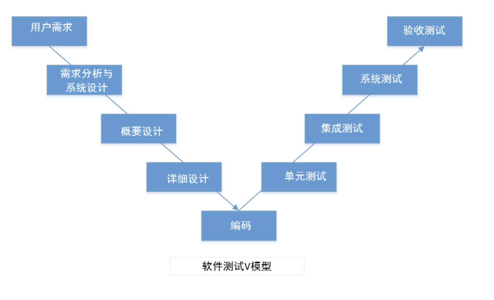
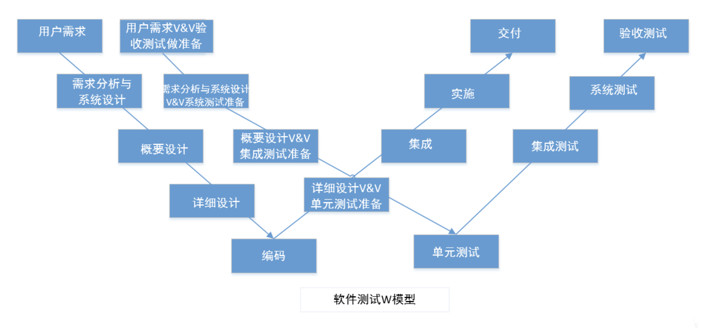
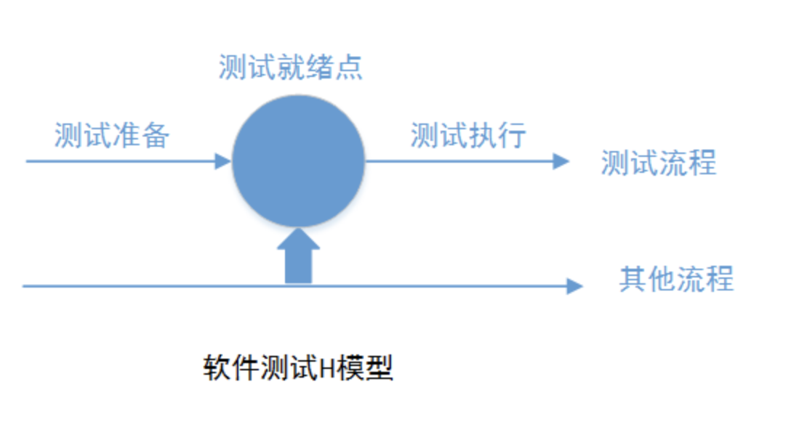
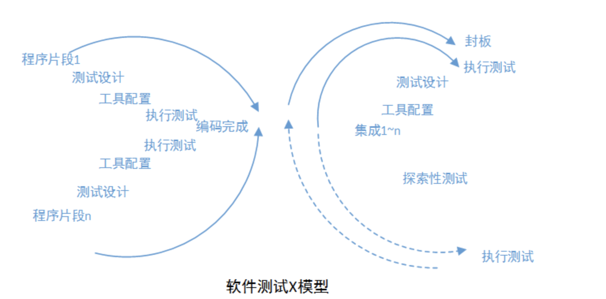
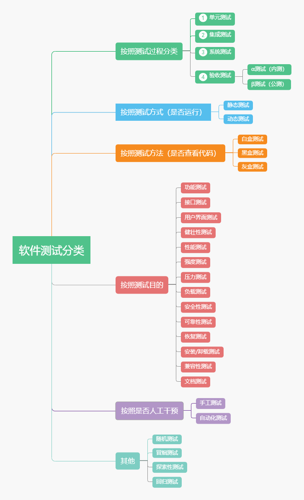
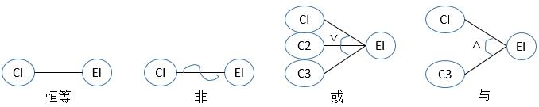
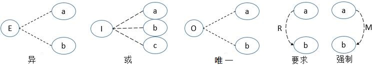
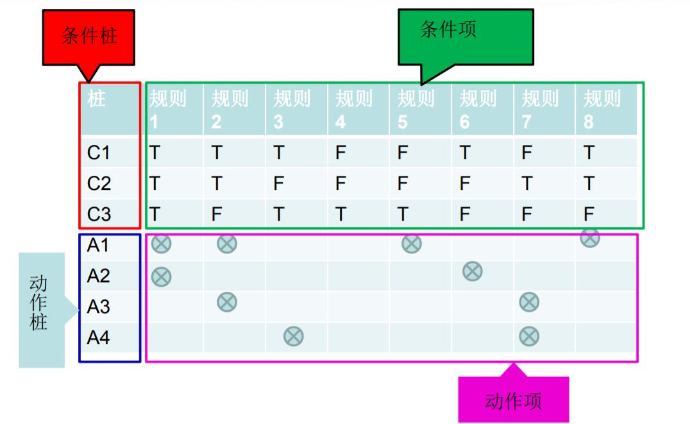

# 测试工程师面试

## 1. 面试常问

### 1.1 为什么选择测试，不选择开发

```
我在之前工作时除了开发程序外，还从身边的测试同事了解到软件测试流程，让我对软件测试有概念。后来去读书的时候，学校有教《软件测试原理》这门课，对软件测试有一个完整的接触。在学习之后开始去尝试去应用，使用一些测试工具。这个过程加深了对软件测试的理解，现在是打算找这个软件测试的工作。
因为软件测试也是需要有软件开发流程的理解，最好是有编程的基础，这样才能全面理解一个系统，在测试时会有更清晰的思路。而我之前有学习和开发过程序，所以认为转软件测试岗位是很合适的。测试有很多分支，不仅仅是点点点。需要系统学习知识和持续学习，测试做的好是不会比开发差的。
```

### 1.2 你认为一个测试需要具备哪些知识

> 专业的技能

比如编写一个测试用例，覆盖的面越广，软件的质量就越高，测试一个功能点，不仅在执行用例上获得预期的结果，还要结合测试工具和测试方法，多方面对一个软件进行测试。来保证软件质量。比如性能测试、安全测试等。

> 良好的沟通能力

因为测试人员是要和开发、产品进行频繁沟通，推动产品上线，所以要有清晰的逻辑和良好的沟通协调能力，让项目的进展更快速和有效。

> 不断学习的心态

开发的技术一直在变化，作为测试也不能落后。需要持续学习，用技术提高测试的效率，比如提高自己的自动化测试水平，保证软件之前的功能不受现在的开发影响。同时在编写测试脚本时，要提高代码能力，提高测试的生产力。

> 一定的编程基础

测试工程师有时需要对源码进行检查，特别是白盒测试工程师要从程序结构的角度来测试软件，编写测试脚本。读懂源代码是白盒测试工程师最基本的要求。

### 1.3 你对软件测试这个岗位的了解

```
测试的工作是贯穿整个项目周期。不仅要发现系统存在的缺陷，还要对项目中存在的风险情况进行提醒。
```

> 需求和用例评审

1. 在需求说明书形成后，测试人员需要评审需求的可测试性以及是否存在风险，提醒项目经理规避风险
2. 在设计说明书完成之后，测试需要评审可测试性、数据可跟踪性
3. 测试需求和测试用例评审时，需要和项目经理、开发人员一起评审。产品经理检查测试用例是否遗漏的地方，开发人员根据自己开发的功能。结合测试用例来检查或修改测试用例，提醒测试人员重点测试哪些模块。
4. 用例评审时测试人员要准确讲出对需求的理解和思路。

> 项目保障预警提醒：

1. **进度预警**：开发如果不能及时提测，应该给项目经理预警。开发在指定日期不能提测后对整个项目进度的影响。

2. **功能模块风险预警**：当测试发现整个功能模块缺陷集中时，应该给项目经理预警。项目经理安排对该模块的整体处理，不应在这个模块上投入大量的测试人力，否则对项目总体的测试进度造成影响。

3. **缺陷预警**：但缺陷遇到争议，或是缺陷反复出现三次以上，缺陷的驻留时间过长。应该给项目经理预警，召开缺陷讨论会议，尽快明确缺陷的责任、修改方案和计划。

4. **项目保障**：当项目经理不能及时处理项目风险、导致不能送测或者缺陷处理不及时时，测试有义务向上级汇报，保障目前的风险情况上级及时了解，采取应对措施。

> 测试环境部署

1. **测试环境**有对应的测试经理管理，负责资源申请、配置修改、查询日志、测试人员权限、数据库修改。

2. **测试环境部署**和生产环境部署，测试人员在开发提测之后，按照部署手册，这部分人员最好具备系统工程相关知识。对操作命令比较熟悉。

> 人员和分工

1. **交叉测试**：一般写测试用例和只需用例都是同一个人。也可以一个用例通过和其他人执行交叉测试，来发现测试项目中存在的问题，避免由于视觉疲劳导致的漏测，同时参与者也可以对此发现测试用例中是否存在漏测项。

2. **测试工作**：测试的工作是比较细节和繁杂的，如果之前测试的员工不细致认真、可以通过细化测试用例，通过用例跟踪，来对测试工作进行监督。

3. **测试计划**：经常测试的系统，执行测试用例是可以进行时间评估的。在分工时可以做到时间可控。同时也要考虑其他因素，比如系统中引入了新类型的数据、测试用例的前期准备时间、多个系统参与批量测试时计划的制定。要谨慎并且严格执行。

### 1.4 谈谈对公司的了解

```
明源云：
我之前是在牛客网有看到贵公司的信息，得知是是国内领先的地产生态链数字化解决方案服务商。为各个行业提供互联网服务，进行数字化转型。是产业互联网的先行者。感觉平台大，发展空间大，前景好。
```

## 2. 测试用例题

### 2.1 如何测试一个网站

> 功能测试

1. 功能测试
2. 链接测试，链接是否跳转正常
3. 提交功能测试，提交的内容是否成功到达后台
4. 多媒体元素是否正常加载
5. 多语言的切换是否正常
6. 需求的内容是否全部实现

> 界面测试

1. 是否风格统一
2. 布局是否合理
3. 空间是否使用正常
4. 文件是否正常

> 性能测试

1. 负载测试：确定各种工作负载下，系统的性能随着负载逐渐增加时，各项指标的变化情况。
2. 压力测试：确定一个系统的瓶颈，或是系统不能接受的性能点。以此来获取系统的最大服务级别。

> 安全性测试

1. 基本的登录功能
2. 是否存在错误，导致页面奔溃，或是存在权限泄露。
3. 系统是否兼容其他平台

> 数据库测试

1. 数据库是否符合范式。
2. 数据库是否设计合理。
3. 数据库配置是否正确。

### 2.2 如何测试一个视频通话软件

> 功能测试

验证产品是否正常和满足需求，包括视频是否连接成功，声音和画面是否正常，能否同步，挂断功能是否正常，单人视频和多人视频是否正常。

> 性能测试

1. 压力测试：长时间视频（如12小时）是否能保持正常，CPU、内存耗用情况等。
2. 稳定性测试：频繁进行视频和随机操作等，前后台切换，与其他应用切换，视频过程中来电话、短信等。
3. 安装卸载测试
4. 容量测试
5. 网络测试：不同网络环境测试（WiFi、流量）
6. 耗电量测试
7. 发热测试

> 界面测试

测试软件界面是否正常和满足需求，文字、图片、LOGO显示是否正常，操作过程中的提示是否正确。

> 易用性测试

软件操作流程是否符合用户习惯，容易上手，操作出现异常时是否有错误提示，并且内容清晰易懂。

> 兼容性测试

在Android手机和IOS手机上分别测试，选择不同机型，不同系统版本进行测试。

## 3. 软件测试理论

### 3.1 概述

#### 3.1.1 软件测试观点

```
1. 测试是为了证明程序有错，而不是证明程序无错。
2. 一个好的测试用例是在于它能发现至今未发现的错误。
3. 一个成功的测试是发现了至今未发现的错误的测试。
```

#### 3.1.2 软件测试目的

```
软件测试的目的是为了发现程序中的错误而执行程序的过程。
```

#### 3.1.3 软件测试原则

```
1. 所有的测试都应追溯到用户需求
2. 应尽早地和不断地进行软件测试
3. 在有限的时间和资源下进行完全测试并找出软件的所有错误和缺陷是不可能的，软件测试不能无限进行下去，应适时终止。
4. 测试只能证明如那件存在的错误，而不能证明软件没有错误。
5. 充分关注测试中的集群现象。
6. 程序员应避免自己检查自己的程序
7. 尽量避免测试的随意性
```


#### 3.1.4 软件测试过程模型

> 软件测试V模型

是软件开发模型——瀑布模型的变种，反映测试活动与分析和设计之间的关系。



```
优点：反映测试活动与分析和设计之间的关系。
缺点：把测试过程作为在需求分析、系统设计及编码之后的一个阶段，忽视了测试对需求分析,系统设计的验证。
```


> 软件测试W模型

对V模型的改进。W模型由2个V模型组成，代表测试与开发过程并行的关系。

W模型强调，测试伴随整个软件开发周期，测试的对象不仅仅是程序、需求、设计等同样要测试。



```
优点：
1. 测试的活动与软件开发同步进行。
2. 测试的对象不仅仅是程序，还包括需求和设计。（没有V模型缺点）
3. 尽早发现软件缺陷可降低软件开发成本。
缺点：
1. 测试和开发活动保持一种线性的前后关系，上一个阶段完成才能进行下一个阶段工作。
2. 无法支持迭代开发的模型。
```


> 软件测试H模型

H模型将测试活动完全独立出来。贯穿整个产品周期，与其他流程并发的进行。当某个测试点就绪时，软件测试即从测试准备阶段进入测试执行阶段。



```
优点：
1. 揭示了软件测试除执行外，还有很多其他工作。
2. 测试活动可以尽早准备、尽早执行，具有很强的灵活性。
3. 可以根据被测物的不同阶段、分阶段、分次序执行。可以被迭代。
缺点：
1. 项目管理要求高
2. 定义规模困难
3. 测试就绪点分析困难
4. 团队配合要求高
```

> 软件测试X模型

对V模型的改进。X模型提出针对单独的程序片段进行相互分离的编码和测试，此后通过频繁的交流，集合最终可执行的程序。




#### 3.1.5 测试用例的要素

1. 用例编号
2. 用例标题
3. 测试项目
4. 用例优先级
5. 预制条件
6. 测试输入
7. 操作步骤
8. 预期结果

#### 3.1.6 软件开发流程

1. 需求分析
2. 概要设计
3. 详细设计
4. 编码
5. 单元测试
6. 集成测试
7. 系统测试
8. 维护


### 3.2 软件测试流程和分类

#### 3.2.1 软件测试流程

1. 需求分析
2. 指定测试计划
3. 设计测试方案
4. 测试准备和测试环境搭建
5. 执行测试
6. 测试评估
7. 测试总结
8. 测试维护

#### 3.2.2 软件测试分类



### 3.3 Bug

#### 3.2.1 Bug定义

1. 软件没有实现产品说明书中描述的功能
2. 软件实现了产品说明书中不应该有的功能。
3. 软件没有实现产品说明书没有描述但应该具备的功能。
4. 从软件测试人员角度，软件难以使用、不易使用、运行缓慢。最终用户使用起来认为不对劲的地方。

#### 3.2.2 Bug的生命周期

1. 发现Bug
2. 提交Bug
3. 指派Bug
4. 确认Bug
5. 修复Bug
6. 是否通过验证
7. 关闭Bug

#### 3.2.3 Bug的等级

1. 致命：正常操作情况下出现死机、闪退、卡死。安全相关的隐私信息泄露，交易金钱出错，使用产生阻断性。
2. 严重：重要的功能未实现，非正常操作死机、闪退、卡死。密码明文可见未加密情况。
3. 一般：次要的功能未实现，操作界面的错误：弹框信息、查询信息错误。
4. 轻微：界面信息错误：页面改进，建议。

#### 3.2.4 Bug的内容

1. 缺陷Id
2. 缺陷标题
3. 测试环境
4. 缺陷发现日期
5. 提交测试人员
6. 缺陷优先级
7. 缺陷等级
8. 产生缺陷的版本
9. 使用的测试类型
10. 缺陷的复现步骤
11. 功能的期望结果
12. 功能的实际结果
13. 附件

### 3.4 黑盒测试

黑盒测试：又称功能测试、数据驱动测试，指通过软件的外部表现来发现缺陷和错误。已知产品的功能设计规格，可以进行测试证明每个实现了的功能是否符合需求。
黑盒测试主要发现：
1. 是否有不正确或遗漏的功能
2. 在接口上，输入是否能正确的接受、正确的返回
3. 是否有数据结构错误或外部信息访问错误
4. 性能上是否额能够满足要求
5. 是否有初始化或终止性错误

#### 3.4.1 等价类划分法（输入）

将程序输入数据划分为有效等价类和无效等价类。

```
有效等价类：有意义的输入数据构成的集合。
无效等价类：无意义的输入数据构成的集合。至少一个，可能多个。
```

> 有效等价类

1. 输入是取值范围或值个数：1个有效+2个无效

   ```
   输入[1,9]
   有效：1<=值<=9
   无效：值<1, 值>9
   ```

2. 输入强调必须值时：1个有效+1个无效

   ```
   必须输入数字
   有效：数字
   无效：非数字
   ```

3. 输入布尔值时：1个有效+1个无效

   ```
   输入True或者False
   有效：True
   无效：False
   ```

4. 输入确定内容时：n个有效+1个无效

   ```
   输入字符a,c,d
   有效：a,c,d
   无效：除此之外的所有字符
   ```

5. 输入强调规则时：1个有效+n个无效

   ```
   点击按钮，弹出提示
   有效：点击按钮
   无效：长按按钮、拖动按钮、点击空白处...
   ```

6. 可划分情况下再次细致划分等价类


#### 3.4.2 边界值分析法（输入）

边界值分析法是对等价类划分法的一种补充。

1. 边界值测试只考虑有效范围内的边界值
2. 健壮边界值测试会考虑有效和无效数据范围内的边界值

> 边界值测试

1. 最小值（Min）
2. 略高最小值（Min+）
3. 正常值（Normal）
4. 略低最大值（Max-）
5. 最大值（Max）

.png)

会产生4n+1个测试用例


> 健壮边界值测试

1. 略低最小值（Min-）
2. 最小值（Min）
3. 略高最小值（Min+）
4. 正常值（Normal）
5. 略低最大值（Max-）
6. 最大值（Max）
7. 略高最大值（Max+）

.png)

会产生6n+1个测试用例

> 原则

首先确定边界情况，通常输入等价类与输出等价类的边界。

#### 3.4.3 因果图法（输入&输出）

考虑输入条件的联系、组合。

> 基本关系

由输入原因导致输出结果。

1. 原因：左节点Ci表示输入状态。
2. 结果：右节点Ei表示输出状态。

可以组合出四种基本关系。



（1）恒等：若C1=1，则E1=1。（否则E1=0）

（2）非~：若C1=1，则E1=0。（否则E1=1）

（3）或∨：若C1或C2或C3=1，则E1=1。（否则E1=0）

（4）与∧：若C1和C3=1，则E1=1。（否则E1=0）


> 依赖关系（约束）

输入原因之间相互依赖。



（1）约束E：a,b至多一个为1。a,b不能同时为1。（上限，a,b可以都为0）

（2）约束I：a,b,c至少一个为1。a,b,c不能同时为0。（下限，a,b,c可以都为1）

（3）约束O：a,b必须由一个为1。有且仅有一个为1。（上下限，a,b一个为1一个为0）

（4）约束R：a=1时b=1。不能a=1时b=0。（要求，a=1时b=1。但其余情况任意）

（5）约束M：a=1时b=0。不能a=1时b=1。（强制，与要求相反。同样满足但其余情况任意）

> 测试用例

1. 分析软件规格说明书
2. 确定因果图中各个约束
3. 将因果图转换为判定表
4. 根据评定表的每一列设计输出测试用例


#### 3.4.4 决策表法（判定表、输入&输出）

和因果图有重叠的功能。可以用来分析和表达多逻辑条件下执行不同操作的情况的工具。

> 组成



（1）条件桩：列出问题的所有条件。

（2）动作桩：列出问题可能的操作。

（3）条件项：对条件桩的取值。

（4）动作项：对应条件项取值的采取动作。

> 构造步骤

1. 确定规则的个数。n个条件，每隔条件2个取值，则有2^n种条件项。
2. 列出所有条件桩和动作桩。
3. 填入条件项
4. 填入动作项
5. 简化（合并有两条或多条规则具有相同的动作，合并条件项用`-`表示），说明执行的动作和该条件取值无关。

> 因果图和决策表

因果图只是清晰地表达了需求分析的内容，如果要得到测试用例，就必须借助于决策表，也就是需要将因果图转化成决策表。 


#### 3.4.5 正交测试法（挑选、输入&输出）

在决策表的基础上改进。从大量的实验点钟挑选出适量的、有代表性的点。 

#### 3.4.6 错误推断法（直觉、输入&输出）

有经验的测试人员往往可以根据自己的工作经验和直觉推测出程序可能存在的错误，从而有针对性地进行测试。

#### 3.4.7 场景法（流程控制、输入&输出）

软件系统中流程的控制由事件触发决定，事件不同的触发顺序和处理结果形成事件流，每隔事件流触发时的场景便形成了场景。通过运用场景来对系统的功能点或业务流程的描述，可以提高测试效果。


### 3.5 白盒测试

白盒测试：又称结构测试、逻辑驱动测试，指通过对程序内部结构的分析、检测来寻找问题。已知产品的内部工作过程，可以通过测试证明每种内部操作都符合设计规格要求，所有内部成分是否已经过检查。

#### 3.5.1 静态白盒测试（结构分析）

不执行程序的条件下审查软件设计、体系结构和代码，从而找出软件缺陷的过程。测试对象是文档、代码等非计算机执行的部分。

错误发现得越早，改正错误的成本就越低。，正确改正错误的可能性越大，改正错误时可能引发的其他错误的数量也越少。

```
1. 代码检查法（看代码）
1.1 代码审查和走查：小组为单位阅读代码。
1.2 桌面检查：由程序员检查自己编写的程序。
2. 静态结构分析法（用测试软件）
2.1 生成图表进行静态分析
2.2 静态错误分析
2.3 表达式分析
2.4 接口分析
3. 静态质量度量法
```

#### 3.5.2 动态白盒测试（结构化测试）

> 逻辑覆盖测试法

1. 语句覆盖
2. 判定覆盖
3. 条件覆盖
4. 判定条件覆盖
5. 条件组合覆盖
6. 路径覆盖

> 基本路径测试法

1. 程序控制流图
2. 计算环路复杂度
3. 确定独立路径集合
4. 图形矩阵

> 程序插桩法

#### 3.5.3 其他白盒测试（参考）

1. 域测试
2. 符号测试
3. Z路径测试
4. 程序变异

### 3.6 灰盒测试

是介于白盒测试与黑盒测试之间。灰盒测试关注对于输入的正确性，同时也关注内部表现，但这种关注不像白盒那样详细、完整，只是通过一些表征性的现象、事件、标志来判断内部的运行状态。
有时候输出是正确的，但内部其实已经错误了，这种情况时常发生，如果每次都要通过白盒测试来操作，那效率就会很低，因此需要采取这样的一种灰盒方法。


### 3.7 单元测试（分支测试）

单元测试又称模块测试。单元测试是开发者编写的一小段代码，用于检查被测代码很小的、很明确的功能是否正确。单元测试的内容包括模块程序结构检查、代码测试和模块内功能测试。

单元测试可以说是软件测试中最基础的测试，集成测试、功能测试和系统测试都建立在单元测试之上。

> 主要任务

1. 程序语法检查
2. 序逻辑检查
3. 模块接口测试
4. 局部数据结构测试
5. 路径测试
6. 边界条件测试
7. 错误处理
8. 代码书写规范检查

#### 3.7.1 单元测试流程

1. 制定单元测试计划
2. 搭建测试环境
3. 执行单元测试用例
4. 判定测试用例是否通过
5. 提交《单元测试报告》

#### 3.7.2 单元测试的方法

1. 单元测试的对象是可独立编译或汇编的程序模块
2. 单元测试的目的是检查每个软件单元能否正确地实现设计说明中的功能、性能、接口和其他设计约束要求，发现单元内可能存在的各种差错。

#### 3.7.3 单元测试静态、动态方法

1. 人工静态代码检查：看代码设计是否符合规范。
2. 动态执行跟踪：黑盒+白盒
   1. 黑盒：对照功能设计规格、等价类、边界值
   2. 白盒：语句覆盖、判定覆盖、基本路径测试

#### 3.7.4 测试重点

> 测试环境辅助模块的关系

1. 驱动模块：模拟被测模块的上级模块。
2. 被调用模块子模块：被测模块工作过程中所调用的模块。

#### 3.7.5 测试策略

1. 孤立的单元测试策略：不考虑模块关系，所有的被测模块都给辅助模块（驱动模块、被调用模块子模块）。
2. 自顶向下单元测试策略：从主控模块层层往下，到下一层时，考虑上层模块。（驱动模块）
3. 自底向上单元测试策略：从底层模块层层往上，到上一层时，考虑下层模块。（被调用模块子模块）

### 3.8 集成测试（组装测试）

是将所有通过单元测试或假定通过单元测试的软件单元，按照设计要求组装成系统或子系统，然后对这些系统或子系统进行测试的测试阶段。

### 3.9 系统测试（预发布测试、线上测试）

系统测试是在真实系统工作环境下或系统仿真环境下检验完整的软件配置项能否和系统正确连接，并满足系统设计文档的要求。

#### 3.9.1 连接测试

#### 3.9.2 兼容性测试

答：兼容性测试是指检查被测软件在不同的硬件平台上、不同的应用软件之间、不同的操作系统中、不同的网络环境中是否可以正常运行的一种测试。

#### 3.9.3 功能测试

#### 3.9.4 性能测试

#### 3.9.5 边界测试

#### 3.9.6 接口测试

#### 3.9.7 余量测试

#### 3.9.8 安全性测试

答：验证应用程序的安全等级和识别潜在安全缺陷的过程。

其目的是为了查找软件自身程序设计中存在的安全隐患，并检查应用程序对非法侵入的防范能力。

#### 3.9.9 强度测试

#### 3.9.10 易用性测试

答：这种测试方法，不是去测试软件能不能用，而是去测试软件好不好用，用户学习成本高不高，所以主观性比较强烈。

### 3.10 验收测试

#### 3.10.1 自动化测试

### 3.11 其他测试

#### 3.11.1 回归测试

#### 3.11.1 敏捷测试


## 4. 测试场景题

## 5. 自动化测试工具

## 6. 软件开发模型

## 7. 软件测试模型

## 8. 其他人的面经

> 牛客网面经

https://www.nowcoder.com/search?query=%E8%BD%AF%E4%BB%B6%E6%B5%8B%E8%AF%95%E5%88%86%E7%B1%BB&type=all&searchType=%E6%89%8B%E5%8A%A8%E8%BE%93%E5%85%A5

