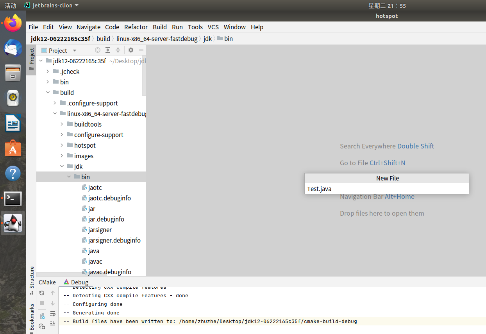

# 1. 编译调试Jdk12

## 1. 下载安装Ubuntu

因为是编译jdk12，所以需要使用**Ubuntu18.04**版本系统，如果使用最新的系统(Ubuntu22.04)会有编译环境过高的错误，且无法短时间解决。推荐编译jdk12就使用**Ubuntu18.04**。

官网下载地址：https://releases.ubuntu.com/18.04/


使用VMWare进行安装系统。


注意：最好这里给虚拟机设置40G的内存，至少不要少于30G。因为一个程序在编译之后的容量变大，像是jdk原本是171MB，在编译之后是6.6GB。一个gcc程序源码60.5MB，在编译之后是5GB多。如果一开始就默认虚拟机的20G，则有可能在编译后超出系统磁盘存储，会导致系统无法正常启动。（要么重新安装系统，要么进入安全模式删除文件腾出空间）


之后就是系统安装的配置，这一步就默认。（当遇到下载资源缓慢时，可以线skip进入系统，后续补充下载）

进入系统后，修改资源下载镜像源。（默认连接外网，速度慢）

修改apt的下载源（在系统进入后会默认弹出，也可以通过下面操作配置文件来打开）

```shell
# 进入到这个目录
cd /etc/apt/
# 看到sources.list文件，双击即打开apt镜像源配置
```


选择第一项，开始切换数据源


选择其他站点（因为一开始都是英文的，所以这里是选Other）


找到中国（China）的选项，选中后点击右边的**查找最佳服务器**


查找到后会默认选中最佳的那一个，只需要查找完毕**点击选择**即可

在选择好后，**点击关闭**，此时就会开始切换数据源，需要等待一段时间。

切换完毕后，就到语言那一栏，点击管理语言（在一开始的英文中，应该是看到Language Manager这种选项按钮）


在打开后就会开始检查语言包，然后你此时就可以通过国内镜像来下载语言包了


在下载完毕之后，就可以点击添加或删除语言（add or delete...），选择中文简体（Chinese（Simple））


选择完毕之后，在上面那个栏目中就会添加上中文语言，但是还需要手动拖动中文到最顶部


拖动到最顶部，点击**应用到整个系统**。

同样，第二个选项卡也是要选择中文，**应用到整个系统**。


操作完毕之后，系统就会逐步开始切换语言，此时可以通过**直接重启系统**来完全应用。


重启之后会出现一个弹框提示是否切换文件夹的名称，建议这里不切换并不再询问（因为要保持Linux的用户目录还是英文的）。


## 2. 下载jdk源码

前面下载的系统Ubuntu18.04是为了编译jdk12使用的，这里开始下载jdk12。通过openJdk12的官网：

https://hg.openjdk.java.net/jdk/jdk12 


GitHub方式下载：

https://github.com/openjdk/jdk/tree/master
点`master`分支，点`tags`，往下拖，选中JDK12最新版，最后点`Code`, `DownloadZip`即可。


下载之后的文件是171MB：


## 3. 设置Ubuntu环境

Ubuntu18.04环境还需要做一些调整，方便后续的编译操作

> 全屏展示

虚拟机默认安装系统在联网后，就会下载对应的虚拟机工具包到系统里，来支持系统的全屏展示。如果某些情况下导致没有全屏，则可以手动下载工具。

```shell
sudo apt-get install open-vm-tools
```

> 远程连接

后面移动jdk源码进入Ubuntu系统时，需要通过宿主机的外部ssh连接。Ubuntu系统默认没有安装ssh程序，这里要下载安装

```shell
sudo apt install openssh-server
```

> 在线编辑

如果遇到系统配置问题，需要查看文件，此时就需要下载vim工具

```shell
sudo apt install vim
```

> 文件传输

因为需要将文件进行传输，所以使用简单的sz/rz工具（注意：这个工具只能最大传输小于4G的文件，如果需要移动更大的文件，要么分片要么使用ftp）

```shell
sudo apt-get install lrzsz
```

下载文件就是`sz filename` 上传文件就直接丢到Xshell界面就行


## 4. 设置编译环境

jdk的编译需要特定编译环境，c++编译环境，这里就通过下载一个整合包直接完成（注意：只有在Ubuntu18.04系统中，这个命令就会下载Gnu make 4.1 和 gcc7.5。如果你是在Ubuntu22.04系统中，这个命令就会下载Gnu make 4.3 和 gcc10 这两个都高于编译jdk12的标准，会导致报错编译失败。并且这两个版本是系统安装指定的，也就是说你不能靠apt来下载安装回Gnu make 4.1 和 gcc7.5软件，只能去下载源码包、进行编译、进行安装。而这个过程会发生很多问题，建议不要尝试高版本编译jdk12。）最好是使用系统Ubuntu18.04 LTS

```shell
# 使用apt下载编译环境整合包
sudo apt-get install build-essential
# 查看编译软件make的版本
make --version
# 查看c++编译环境的版本
gcc --version
```


编译jdk需要的环境

```shell
sudo apt-get install autoconf
sudo apt-get install libx11-dev libxext-dev libxrender-dev libxrandr-dev libxtst-dev libxt-dev
sudo apt-get install libcups2-dev
sudo apt-get install libfreetype6-dev
sudo apt-get install libasound2-dev
sudo apt-get install libffi-dev
sudo apt-get install libfontconfig1-dev
```

如果你要编译版本号为N的JDK，那你的Linux系统必需已经安装有较大版本号，或者至少N-1版本号的OpenJDK。譬如要编译JDK12，那你的电脑必须已经至少安装了JDK11。官方称之为Bootstrap JDK。

```shell
# 使用apt下载jdk11
sudo apt-get install openjdk-11-jdk
# 查看jdk11的安装效果
java --version
```


## 5. 编译jdk

先通过Xshell将jdk的源码文件移动到Ubuntu18.04系统中


移动之后，就可以在界面化系统中将jdk的源码包解压开，得到文件夹


通过命令窗口，进入到文件夹里面


进行编译环境检查，jdk的源码可以编译出多种版本，这里为了调试方便，编译debug版本

```shell
bash configure --enable-debug --with-jvm-variants=server
```


​																									（这样就是完成了编译环境检查）

执行编译（编译时间需要1个小时左右，如果前面的操作漏了，那这里就会很快结束，然后提示错误）

```shell
make all
```

注：如果你用不同参数configure了几次，那需要带参数CONF来指定用哪一次的

```shell
make all CONF=linux-x86_64-server-fastdebug
```

编译完成！


编译结束在jdk源码会产生一个build文件夹，在build目录下就会生成之前编译环境配置的一个版本(debug版本)的jdk


进入到这个文件夹内，执行Java命令来查看编译出来的Java程序是否正常


​																							（这样就是正常显示出来Java）


如果遇到过编译错误，那此时先要进行编译残余清除

```shell
make clean
make dist-clean
```

清除完毕之后再去重新`configure`


## 6. 调试jdk

将jdk设置为本地

配置JAVA_HOME

```shell
sudo gedit ~/.bashrc
```

```shell
# diy jdk12
export JAVA_HOME=/home/zhuzhe/Desktop/jdk12-06222165c35f/build/linux-x86_64-server-fastdebug/jdk
export JRE_HOME=${JAVA_HOME}/jre
export CLASSPATH=.:${JAVA_HOME}/lib:${JRE_HOME}/lib
export PATH=${JAVA_HOME}/bin:$PATH
```


保存之后会有一个警告，但只是提示，可以不理


修改文件后使其立即生效

```shell
source ~/.bashrc
```

这样就可以在任意路径下使用 java -version查看效果


在jdk源码目录新建**CMakeLists.txt**文件

```cmake
cmake_minimum_required(VERSION 3.7)
project(hotspot)
include_directories(
		src/hotspot/cpu
		src/hotspot/os
		src/hotspot/os_cpu
		src/hotspot/share
		src/hotspot/share/precompiled
		src/hotspot/share/include
		src/java.base/unix/native/include
		src/java.base/share/native/include
		src/java.base/share/native/libjli
)
file(GLOB_RECURSE SOURCE_FILES "*.cpp" "*.hpp" "*.c" "*.h")
add_executable(hotspot ${SOURCE_FILES})
```


编辑文件

```shell
vim CMakeLists.txt
```


下载安装Clion

官网：https://www.jetbrains.com.cn/en-us/clion/download/#section=linux


下载之后通过sz/rz工具，从Xshell传递进虚拟机中的Ubuntu系统


解压文件

```shell
tar zxvf CLion-2022.1.1.tar.gz
```

进入到解压后项目的bin目录，执行命令（这个命令是安装和启动Clion）

```shell
./clion.sh
```


执行之后就会进入安装界面


登录用户，如果是学生则可以申请一年试用（只要学校邮箱还有效，就可以无限刷新）


点击close就行，这样以后就不会弹出来。从学生申请开始有1年的试用

使用CLion打开项目


以CMake Project方式打开，信任Trust Project


新建测试文件，在编译好的jdk的bin目录下：/Desktop/jdk12-06222165c35f/build/linux-x86_64-server-fastdebug/jdk/bin



```java
public class Test{
	public static void main(String[] args){	
		System.out.println("Hello world!");
	}
}
```


编译Java源代码为字节码

```shell
javac Test.java
```


在CLion中配置运行字节码


配置完毕后，点击运行就可以看到测试程序的运行结果：


这样就调通了自己编译的jdk运行自己创建的Java代码。

同时也可以通过debug的方式来调试jdk的源码，比如对程序入口的java.c进行debug


