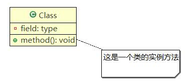
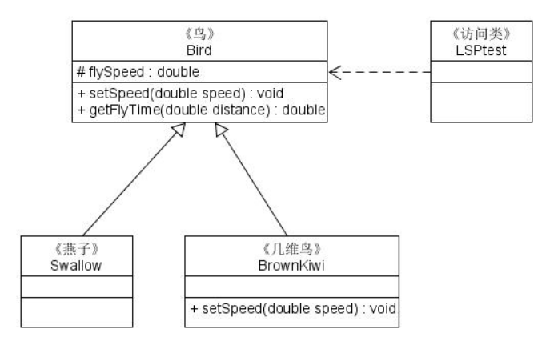
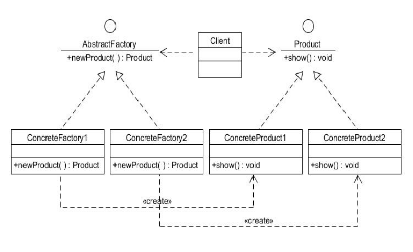
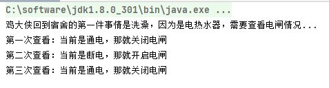

# 设计模式

软件设计模式（Software Design pattern），又称设计模式，是一套被反复使用、多数人知晓的、经过分类编目的、代码设计经验的总结。


# UML

统一建模语言（Unified Modeling Language，简称：UML）：是用来设计软件蓝图的可视化建模语言，1997年被国际对象组织OMG采纳为为面向对象的建模语言的国际标准。

UML从目标系统的不同角度出发，定义了：**用例图**、**类图**、**对象图**、**状态图**、**活动图**、**序列图**、**协作图**、**构件图**、**部署图**等9种图。


对应文件[第01章 软件设计模式基础.pptx](设计模式.assets/第01章 软件设计模式基础.pptx)


如果是画类图，则参考[第09章 设计模式实验指导.pptx](设计模式.assets/第09章 设计模式实验指导.pptx)


类图的实验题，则参考[类图.ppt](设计模式.assets/类图.ppt)

## 类

类是指具有相同属性、方法和关系的对象的抽象,它具有封装性、继承性和多态性等三大特性。在UML中类包含：

1. 类名（Name）是一个字符串，如：Student。

2. 属性（Attribute）是指类的特性，即类的成员变量。

   格式：

   ```
   [可见性] 属性名：类型 [=缺省值]
   ```

   可见性：

   * public + ：public 公用的用+ 前缀表示 ，该属性对所有类可见
   * private -：private 私有的：用- 前缀表示，只对该类本身可见
   * package ~：package 包的：用 ~ 前缀表示，只对同一包声明的其他类可见
   * protected #：protected 受保护的：用 # 前缀表示，对该类的子孙可见

   例子：

   ```
   - name : String
   ```

3. 操作(Operations)是类的成员方法。

   格式：

   ```
    [可见性] 名称(参数列表) [: 返回类型] 
   ```

   例子：

   ```
   + method() : int
   ```


## 接口

接口（Interface）是一种特殊的类，它包含抽象操作，但不包含属性。它描述了类或组件对外可见的动作。下图是图形类接口的UML表示：


## 类图

类图（ClassDiagram）是用来显示系统中的类、接口、协作以及它们之间的静态结构和关系的一种静态模型。
“计算长方形和圆形的周长与面积”的类图：


## 类之间的关系

**没关系 > 依赖 > 关联 > 聚合 > 组合。**


### 依赖

依赖（Dependency）是一种使用关系。【对象之间耦合度最弱】

在代码中，某个类的方法通过**局部变量**、**方法的参数**或者对**静态方法的调用**来访问另一个类（被依赖类）中的某些方法来完成一些职责。

一个类A使用到了另一个类B，而这种使用关系是具有偶然性的、临时性的、非常弱的，但是B类的变化会影响到A；

> Person对象通过实例方法call的参数，依赖了MobilePhone


```java
public class A {
	public void methodA(B b) {
		b.methodB();
	}
}
```

```java
public class B {
	public void methodB() {
		
	}
}
```


### 关联

关联（Association）是对象之间的一种引用关系。包含：

* 一般关联关系
* 聚合关系
* 组合关系

#### 一般关联

一类对象与另一类对象之间的联系。是两个类、或者类与接口之间语义级别的一种**强依赖关系**，比如我和我的朋友；这种关系**比依赖更强**、不存在依赖关系的偶然性、关系也不是临时性的，一般是长期性的，而且双方的关系一般是平等的、关联可以是单向、双向的；

> 单向关联


```java

public class A {
	private B b;

	public B getB() {
		return b;
	}

	public void setB(B b) {
		this.b = b;
	}
	
	public void methodA() {
		b.methodB();
	}
}
```

```java
public class B {
	public void methodB() {
		
	}
}
```

> 双向关联


```java
public class A {
	private B b;

	public B getB() {
		return b;
	}
	public void setB(B b) {
		this.b = b;
	}
}
```

```java
public class B {
	private A a;
    
	public A getA() {
		return a;
	}
	public void setA(A a) {
		this.a = a;
	}
}
```

> 自关联


```java
public class A {
	private A a;
    
	public A getA() {
		return a;
	}

	public void setA(A a) {
		this.a = a;
	}
}
```


#### 聚合关系

聚合（Aggregation）是强关联关系，是整体和部分之间的关系。【has-a】


```java
public class A {
	private B b;

	public B getB() {
		return b;
	}

	public void setB(B b) {
		this.b = b;
	}
	
	public void methodA() {
		b.methodB();
	}
}
```

```java
public class B {
	public void methodB() {
		
	}
}
```


#### 组合关系

组合（Composition）也表示类之间的整体与部分的关系。但它是一种更强烈的聚合关系。【contains-a】

整体对象可以控制部分对象的生命周期，一旦整体对象不存在，部分对象也将不存在，部分对象不能脱离整体对象而存在。


```java
public class A {
	private B b;
	
	public A(B b) {
		super();
		this.b = b;
	}

	public B getB() {
		return b;
	}
	
	public void methodA() {
		b.methodB();
	}
}
```

```java
public class B {
	public void methodB() {
		
	}
}
```


### 泛化

泛化（Generalization）是对象之间耦合度最大的一种关系，表示一般与特殊的关系,是父类与子类之间的关系，是一种继承关系。【is-a】【继承】


```java
public class A {
}
```

```java
public class B extends A {

}
```


### 实现

实现（Realization）是接口与实现类之间的关系。


```java
public interface A {

}
```

```java
public class B implements A {

}
```


### 注释




# 面向对象的设计原则

对应文件[第01章 软件设计模式基础.pptx](设计模式.assets/第01章 软件设计模式基础.pptx)


## 开闭原则

> 定义

开闭原则（OCP）：软件实体应当**对扩展开放，对修改关闭**。勃兰特·梅耶（Bertrand Meyer）在1988年的著作《面向对象软件构造》中提出，这里的软件实体包括以下几个部分：1）项目中划分出的模块；2）类与接口；3）方法。

> 重要性

​    （1）对软件测试的影响，软件测试时只需要对扩展的代码进行测试就。
​    （2）可以提高代码的可复用性。
​    （3）可以提高软件的可维护性，易于扩展和维护。

> 实现方法

可以通过“抽象约束、封装变化”来实现开闭原则，即通过**接口**或者**抽象类**为软件实体定义一个相对稳定的**抽象层**，而将相同的可变因素封装在相同的具体实现类中。


```java
public interface AbstractSubject {
    void display();
}
```

```java
public class SpecificSubject01 implements AbstractSubject{
    @Override
    public void display() {
        System.out.println("[SpecificSubject01]:display!");
    }
}
```

```java
public class SpecificSubject02 implements AbstractSubject{
    @Override
    public void display() {
        System.out.println("[SpecificSubject02]:display!");
    }
}
```

```java
public class Windows {
    public static void display() {
        AbstractSubject subject = new SpecificSubject01();
        subject.display();
    }
}
```


## 里氏替换原则

> 定义

里氏替换原则（LSP）：**继承必须确保超类所拥有的性质在子类中仍然成立**。由麻省理工学院计算机科学实验室的Liskov女士在1987年的OOPSLA（面向对象技术的高峰会议）上发表的一篇文章《数据抽象和层次》里面提出来的。

> 重要性

​    （1）里氏替换原则是实现开闭原则的重要方式之一。
​    （2）它克服了继承中重写父类造成的可复用性变差的缺点。
​    （3）它是动作正确性的保证。即类的扩展不会给已有的系统引入新的错误，降低了代码出错的可能性。 

> 实现方法

子类可以扩展父类的功能，但不能改变父类原有的功能。



```java
public class Bird {
    private double flySpeed;

    public void setFlySpeed(double flySpeed) {
        this.flySpeed = flySpeed;
    }

    public double getFlyTime(double distance){
        return distance/flySpeed;
    }
}
```

```java
public class Swallow extends Bird{
}
```

```java
public class BrownKiwi extends Bird{
    @Override
    public void setFlySpeed(double flySpeed) {//子类仍然可以使用父类方法
        super.setFlySpeed(flySpeed*1000);//因为几维鸟不会飞，所以速度慢
    }
}
```

```java
public class LSPtest {
    public static void main(String[] args) {
        Bird bird = new BrownKiwi();
        bird.setFlySpeed(10);
        bird.getFlyTime(20);
    }
}
```


## 依赖倒置原则

> 定义

依赖倒置原则（DIP）的含义是：**高层模块不应该依赖低层模块，两者都应该依赖其抽象；抽象不应该依赖细节，细节应该依赖抽象。**其核心思想是：要面向接口编程，不要面向实现编程。是Object Mentor公司总裁Robert C. Martin于1996年在C++Report上发表的文章中提出的。

> 重要性

​    （1）依赖倒置原则可以降低类间的耦合性。
​    （2）依赖倒置原则可以提高系统的稳定性。
​    （3）依赖倒置原则可以减少并行开发引起的风险。
​    （4）依赖倒置原则可以提高代码的可读性和可维护性。

> 实现方法

  （1）每个类尽量提供接口或抽象类，或者两者都具备。
  （2）变量的声明类型尽量是接口或者是抽象类。
  （3）任何类都不应该从具体类派生。
  （4）使用继承时尽量遵循里氏替换原则。


```java
public interface Shop {
    String sell();
}
```

```java
public class ShaoguanShop implements Shop{
    @Override
    public String sell() {
        return "韶关网店";
    }
}
```

```java
public class WuyuanShop implements Shop{

    @Override
    public String sell() {
        return "婺源网店";
    }
}
```

```java
public class Customer {
    public void shopping(Shop shop){//不应该定义出ShaoguanShopShopping和WuyuanShopShopping这些方法，应该只定义抽象shopping，而依赖ShaoguanShop和WuyuanShop的接口。
        System.out.println(shop.sell());
    }
}
```


## 单一职责原则

> 定义

单一职责原则（SRP）规定**一个类应该有且仅有一个引起它变化的原因，否则类应该被拆分**。由罗伯特·C·马丁（Robert C. Martin）于《敏捷软件开发：原则、模式和实践》一书中给出的。

> 重要性

​    （1）降低类的复杂度。
​    （2）提高类的可读性。复杂性降低，自然其可读性会提高。
​    （3）提高系统的可维护性。可读性提高，那自然更容易维护了。
​    （4）变更引起的风险降低。变更是必然的，如果单一职责原则遵守得好，当修改一个功能时，可以显著降低对其他功能的影响。

> 实现方法

单一职责原则是最简单但又最难运用的原则，需要设计人员**发现类的不同职责并将其分离**，再封装到不同的类或模块中。而发现类的多重职责需要设计人员具有较强的分析设计能力和相关重构经验。


```java
public class StudentWork {
    //生活辅导由辅导员负责
    public void LifeCoaching(Assistant teacher){
        teacher.teach01();
        teacher.teach02();
        teacher.teach03();
    }
    //学业辅导由学业导师负责
    public void AcademicCoaching(AcademicAdviser teacher){
        teacher.teach01();
        teacher.teach02();
        teacher.teach03();
    }
}
```

```java
public class Assistant {//辅导员
    public void teach01(){
        System.out.println("班委建设");
    }
    public void teach02(){
        System.out.println("出勤统计");
    }
    public void teach03(){
        System.out.println("心理辅导");
    }
    public void teach04(){
        System.out.println("费用缴催");
    }
    public void teach05(){
        System.out.println("班级管理");
    }
}
```

```java
public class AcademicAdviser {//学业导师
    public void teach01(){
        System.out.println("专业指导");
    }
    public void teach02(){
        System.out.println("学习辅导");
    }
    public void teach03(){
        System.out.println("科研指导");
    }
    public void teach04(){
        System.out.println("学习总结");
    }
}
```

每个类都有各自的职责，而不是创建一个万金油的 "教师" 类，去同时负责生活和学业指导，这将导致 "教师" 类的职责不清，后续所有新加的功能都塞到一个类里。


## 接口隔离原则

> 定义

接口隔离原则（ISP）含义是：**客户端不应该被迫依赖于它不使用的方法**。2002年罗伯特·C·马丁在《敏捷软件开发：原则、模式和实践》一书中提出，它要求程序员尽量将臃肿庞大的接口拆分成更小的和更具体的接口，让接口中只包含客户感兴趣的方法。

> 重要性

​    （1）将臃肿庞大的接口分解，可以预防外来变更的扩散。
​    （2）接口隔离提高了系统的内聚性，减少了对外交互。
​    （3）如果接口的粒度大小定义合理，能够保证系统的稳定性。
​    （4）使用多个专门的接口还能够体现对象的层次。
​    （5）能减少项目工程中的代码冗余。过大的接口里面通常放置许多不用的方法。

> 实现方法

  （1）接口尽量小，但是要有限度。
  （2）只提供调用者需要的方法,屏蔽不需要的方法。
  （3）了解环境，拒绝盲从。
  （4）提高内聚，减少对外交互。


```java
public interface InputModule {
    void insert();
    void delete();
    void modify();
}
```

```java
public interface CountModule {
    void countTotalScore();
    void countAverage();
}
```

```java
public interface PrintModule {
    void printStuInfo();
    void queryStuInfo();
}
```

```java
public class StuScoreList implements InputModule,CountModule,PrintModule{

    private StuScoreList(){}//直接禁掉外部实例化的入口，避免让外部获取到一个全部接口的对象

    public InputModule getInputModule(){//如果访问者只需要InputModule，那就只提供InputModule的方法
        return new StuScoreList();
    }

    public CountModule getCountModule(){//如果访问者只需要CountModule，那就只提供CountModule的方法
        return new StuScoreList();
    }

    public PrintModule getPrintModule(){//如果访问者只需要PrintModule，那就只提供PrintModule的方法
        return new StuScoreList();
    }

    @Override
    public void countTotalScore() {

    }

    @Override
    public void countAverage() {

    }

    @Override
    public void insert() {

    }

    @Override
    public void delete() {

    }

    @Override
    public void modify() {

    }

    @Override
    public void printStuInfo() {

    }

    @Override
    public void queryStuInfo() {

    }
}
```


## 迪米特法则

> 定义

迪米特法则（LoD）又叫作最少知识原则（LKP）,其定义是：**只与你的直接朋友交谈，不跟“陌生人”说话**。1987年美国东北大学的Ian Holland提出，后来又因为在经典著作《 程序员修炼之道》而广为人知。

迪米特法则中的“朋友”是指：当前对象本身、当前对象的成员对象、当前对象所创建的对象、当前对象的方法参数等，这些对象同当前对象存在关联、聚合或组合关系，可以直接访问这些对象的方法。

> 重要性

​    （1）降低了类之间的耦合度，提高了模块的相对独立性。
​    （2）由于耦合度降低，从而提高了类的可复用率和系统的扩展性。

> 实现方法

  （1）在类的划分上，应该创建弱耦合的类。
  （2）在类的结构设计上，尽量降低类成员的访问权限。
  （3）在类的设计上，优先考虑将一个类设置成不变类。
  （4）在对其他类的引用上，将引用其它对象的次数降到最低。
  （5）不暴露类的属性成员，而应该提供相应的访问器（set和get方法）。
  （6）谨慎使用序列化（Serializable）功能。


朋友的朋友不熟悉，不直接交谈。我将消息告知我的朋友，他告知他的朋友。我与他之间的交流只能通过我们的共同朋友进行。

```java
public class Fans {
    private String name;

    public Fans(String name) {
        this.name = name;
    }

    public String getName() {
        return name;
    }
}
```

```java
public class Company {
    private String name;

    public Company(String name) {
        this.name = name;
    }

    public String getName() {
        return name;
    }
}
```

```java
public class Star {
    private String name;

    public Star(String name){
        this.name = name;
    }

    public String getName(){
        return name;
    }
}
```

```java
public class Agent {//经纪人：我和粉丝、明星、媒体公司之间是朋友关系。他们会直接和我交谈，互相之间不会交谈。
    private Star myStar;
    private Fans myFans;
    private Company myCompany;

    public void setMyStar(Star myStar) {
        this.myStar = myStar;
    }

    public void setMyFans(Fans myFans) {
        this.myFans = myFans;
    }

    public void setMyCompany(Company myCompany) {
        this.myCompany = myCompany;
    }

    public void meeting(){//粉丝和明星不会直接耦合，而是粉丝耦合经纪人，明星耦合经纪人，经纪人安排了粉丝和明星的活动
        System.out.println(myFans.getName()+"与明星"+myStar.getName()+"见面了。");
    }

    public void business(){//媒体公司和明星不会直接耦合，而是媒体公司耦合经纪人，明星耦合经纪人，经纪人安排了媒体公司和明星的活动
        System.out.println(myCompany.getName()+"与明星"+myStar.getName()+"洽谈业务。");
    }
}
```


## 合成复用原则

> 定义

合成复用原则（CRP）又叫组合/聚合复用原则(CARP)。它要求**在软件复用时，要尽量先使用组合或者聚合等关联关系来实现（部分和整体）**，其次才考虑使用继承关系来实现。如果要使用继承关系，则必须遵循里氏代换原则（确保超类所拥有的性质在子类中仍然成立）。

> 重要性

​    （1）它维持了类的封装性。因为成分对象的内部细节是新对象看不见的，所以这种复用又称为“黑箱”复用；
​    （2）新旧类之间的耦合度低。这种复用所需的依赖较少，新对象存取成分对象的唯一方法是通过成分对象的接口；
​    （3）复用的灵活性高。这种复用可以在运行时动态进行，新对象可以动态地引用与成分对象类型相同的对象。

> 实现方法

 合成复用原则是通过**将已有的对象纳入到新对象中**，作为新对象的成员对象来实现的，新对象可以调用已有对象的功能，从而达到复用。下面以汽车分类管理程序为例来介绍合成复用原则的应用。


# 创建型模式

> 特点

**将对象的创建与使用分离**

对应文件[第02章 创建型模式（上）.pptx](设计模式.assets/第02章 创建型模式（上）.pptx)

## 【01】单例模式

单例（Singleton）模式：某个类只能生成一个实例，该类提供了一个全局访问点供外部获取该实例，其拓展是有限多例模式。

* 单例类：包含一个实例且能自行创建这个实例的类。
* 访问者类：使用单例的类。


### 饿汉式

该模式的特点是类一旦加载就创建一个单例，保证在调用getInstance方法之前单例已经存在了。

```java
public class HungrySingleton {
	public static final HungrySingleton instance = new HungrySingleton();
	
	private HungrySingleton(){}
	
	public static HungrySingleton getInstance() {
		return instance;
	}
}
```

```java
public class TestSingleton {
	public static void main(String[] args) {
		HungrySingleton instanceOne = HungrySingleton.getInstance();
		System.out.println("对象1："+System.identityHashCode(instanceOne));
		HungrySingleton instanceTwo = HungrySingleton.getInstance();
		System.out.println("对象2："+System.identityHashCode(instanceTwo));
	}
}
```

### 懒汉式

该模式的特点是类加载时没有生成单例，只有当第一次调用getInstance方法时才去创建这个单例

```java
public class LazySingleton {
	private static volatile LazySingleton instance = null;
	
	private LazySingleton(){}
	
	public static synchronized LazySingleton getInstance() {
		if(instance==null){
			instance = new LazySingleton();
		}
		return instance;
	}
}
```

```java
public class TestSingleton {
	public static void main(String[] args) {
		LazySingleton instanceOne = LazySingleton.getInstance();
		System.out.println("对象1："+System.identityHashCode(instanceOne));
		LazySingleton instanceTwo = LazySingleton.getInstance();
		System.out.println("对象2："+System.identityHashCode(instanceTwo));
	}
}
```

  （1）在应用场景中，某类只要求生成一个对象的时候。如：一个班中的班长、每个人的身份证号等；
  （2）当对象需要被共享的场合。由于单例模式只允许创建一个对象，共享该对象可以节省内存，并加快对象访问速度。如：WEB中的配置对象、数据库的连接池等。
  （3）当某类需要频繁实例化，而创建的对象又频繁被销毁的时候。如：多线程的线程池、网络连接池等。


## 【02】原型模式

原型（Prototype）模式：将一个对象作为原型，通过对其进行复制而克隆出多个和原型类似的新实例。

* 抽象原型类：规定了具体原型对象必须实现的接口。
* 具体原型类：实现抽象原型类的clone方法，它可被复制。
* 访问者类：使用具体原型类中的clone方法来复制新的对象。

克隆分为浅克隆和深克隆。


### 普通模式


```java
public class Realizetype implements Cloneable {

	public Realizetype() {
		super();
		System.out.println("原型类初始化！");
	}

	/* (non-Javadoc)
	 * @see java.lang.Object#clone()
	 */
	@Override
	protected Realizetype clone() throws CloneNotSupportedException {
		// TODO Auto-generated method stub
		System.out.println("开始复制！");
		return (Realizetype) super.clone();
	}
	
}
```

```java
public class TestProtoType {
	public static void main(String[] args) throws CloneNotSupportedException {
		Realizetype realizeObj = new Realizetype();
		Realizetype cloneObj = realizeObj.clone();
		System.out.println("比较原型对象和克隆对象："+(realizeObj==cloneObj));
	}
}
```


### 管理器模式


```java
public class RealizetypeOne implements ProtoType {
	
	public RealizetypeOne() {
		super();
		// TODO Auto-generated constructor stub
		System.out.println("RealizetypeOne("+System.identityHashCode(this)+")原型类1初始化成功！");
	}

	@Override
	public Object clone() {
		// TODO Auto-generated method stub
		RealizetypeOne cloneObj = null;
		try {
			cloneObj = (RealizetypeOne) super.clone();
			System.out.println("RealizetypeOne("+System.identityHashCode(cloneObj)+")原型类1开启克隆！");
		} catch (CloneNotSupportedException e) {
			// TODO: handle exception
			e.printStackTrace();
		}
		return cloneObj;
	}

	@Override
	public void show() {
		// TODO Auto-generated method stub
		System.out.println("RealizetypeOne("+System.identityHashCode(this)+")被调用！");
	}

}
```

```java
public class RealizetypeTwo implements ProtoType {
	
	public RealizetypeTwo() {
		super();
		// TODO Auto-generated constructor stub
		System.out.println("RealizetypeTwo("+System.identityHashCode(this)+")原型类2初始化成功！");
	}

	@Override
	public Object clone() {
		// TODO Auto-generated method stub
		RealizetypeTwo cloneObj = null;
		try {
			cloneObj = (RealizetypeTwo) super.clone();
			System.out.println("RealizetypeTwo("+System.identityHashCode(cloneObj)+")原型类2开启克隆！");
		} catch (CloneNotSupportedException e) {
			// TODO: handle exception
			e.printStackTrace();
		}
		return cloneObj;
	}

	@Override
	public void show() {
		// TODO Auto-generated method stub
		System.out.println("RealizetypeTwo("+System.identityHashCode(this)+")被调用！");
	}

}
```

```java
import java.util.HashMap;


public class ProtoTypeManager {
	private HashMap<String,ProtoType> map = new HashMap<String,ProtoType>();

	public ProtoTypeManager() {
		super();
		// TODO Auto-generated constructor stub
		map.put("one", new RealizetypeOne());
		map.put("two", new RealizetypeTwo());
	}

	public void addMap(String key,ProtoType value) {
		map.put(key, value);
	}
	
    //根据key来获取需要的原型类的克隆对象
	public ProtoType getProtoType(String key) {
		ProtoType protoType = map.get(key);
		return (ProtoType) protoType.clone();
	}
}
```

```java
public class TestProtoTypeManager {
	public static void main(String[] args) {
		ProtoTypeManager manager = new ProtoTypeManager();
		ProtoType cloneObjOne = manager.getProtoType("one");
		cloneObjOne.show();
		ProtoType cloneTwo = manager.getProtoType("two");
		cloneTwo.show();
	}
}
```


## 【03】工厂方法模式

工厂方法（Factory Method）模式：定义一个用于创建产品的接口，由子类决定生产什么产品。

对应文件[第03章 创建型模式（下）.pptx](设计模式.assets/第03章 创建型模式（下）.pptx)

定义：定义一个创建产品对象的**工厂接口**，将产品对象的实际**创建**工作推迟到具体**子工厂类**当中。

优点：

​	1）用户知道具体工厂的名称就可得到所要的产品，无须知道产品的创建过程；

​	2）增加新的产品时只需要添加具体产品类和对应的具体工厂类，无需修改源代码，满足开闭原则。
缺点：每增加一个产品就要增加一个具体产品类和一个对应的具体工厂类，这增加了系统的复杂度。

* **抽象工厂**(Abstract Factory)：提供了创建产品的接口，调用者通过它访问具体工厂的工厂方法newProduct()来创建产品。
* **具体工厂**(Concrete Factory)：主要是实现抽象工厂中的抽象方法，完成具体产品的创建。
* **抽象产品**(Product)：定义了产品的规范，描述了产品的主要特性和功能。
* **具体产品**(Concrete Product)：实现了抽象产品角色所定义的接口，由具体工厂来创建，它同具体工厂之间一一对应。



```java
//抽象产品
public interface Product {
	public void show();
}
```

```java
public class ConcreteProductOne implements Product {

	@Override
	public void show() {
		// TODO Auto-generated method stub
		System.out.println("具体产品1创建成功！");
	}

}
```

```java
public class ConcreteProductTwo implements Product {

	@Override
	public void show() {
		// TODO Auto-generated method stub
		System.out.println("具体产品2创建成功！");
	}

}
```

```java
//抽象工厂
public interface AbstractFactory {
	public Product newProduct();
}
```

```java
public class ConcreteFactoryOne implements AbstractFactory {

	@Override
	public Product newProduct() {
		// TODO Auto-generated method stub
		System.out.println("具体工厂1创建成功！");
		return new ConcreteProductOne();
	}

}
```

```java
public class ConcreteFactoryTwo implements AbstractFactory {

	@Override
	public Product newProduct() {
		// TODO Auto-generated method stub
		System.out.println("具体工厂2创建成功！");
		return new ConcreteProductTwo();
	}

}
```

```java
public class TestFactory {
	public static void main(String[] args) {
		AbstractFactory factory = null;
		Product product = null;
		
		factory = new ConcreteFactoryOne();
		product = factory.newProduct();
		product.show();
		
		factory = new ConcreteFactoryTwo();
		product = factory.newProduct();
		product.show();
	}
}
```

   1）客户只知道创建产品的工厂名,而不知道具体的产品名。如：TCL电视工厂、海信电视工厂等；
   2）创建对象的任务由多个具体子工厂中的某一个完成，而抽象工厂只提供创建产品的接口。
   3）客户不关心创建产品的细节，只关心产品的品牌。


## 【04】抽象工厂模式

抽象工厂（Abstract Factory）模式：提供一个创建产品族的接口，其每个子类可以生产一系列相关的产品。


海尔电视机、海尔空调都是属于一个产品族——海尔品牌

海尔空调、TCL空调都是属于一个产品族——空调

这时的产品关系呈现二维结构，普通的工厂方法不能支持这种创建，就需要抽象工厂模式。

* 抽象工厂(Abstract Factory)：提供了创建产品的接口，它包含多个创建产品的方法newProduct()，可以创建多个不同**等级**的产品。一个工厂就是一个**产品族**。
* 具体工厂(Concrete Factory)：主要是实现抽象工厂中的多个抽象方法，完成具体产品的创建。
* 抽象产品(Product)：定义了产品的规范，描述了产品的主要特性和功能，抽象工厂模式有多个抽象产品。
* 具体产品(Concrete Product)：实现了抽象产品角色所定义的接口，由具体工厂来创建，它同具体工厂之间是多对一的关系。


```java
//抽象工厂——产品族
public interface AbstractFactory {
	public TV newTV();
	public WashingMachine newWashingMachine(); 
}
```

```java
//具体工厂1(小米工厂)——本身就是产品族，负责生产各种等级产品
public class XiaomiFactory implements AbstractFactory {

	@Override
	public TV newTV() {
		// TODO Auto-generated method stub
		return new XiaomiTV();
	}

	@Override
	public WashingMachine newWashingMachine() {
		// TODO Auto-generated method stub
		return new XiaomiWashingMachine();
	}

}
```

```java
//具体工厂2(海尔工厂)——本身就是产品族，负责生产各种等级产品
public class HaierFactory implements AbstractFactory {

	@Override
	public TV newTV() {
		// TODO Auto-generated method stub
		return new HaierTV();
	}

	@Override
	public WashingMachine newWashingMachine() {
		// TODO Auto-generated method stub
		return new HaierWashingMachine();
	}

}
```

```java
//抽象产品1(电视等级)——产品等级
public interface TV {
	public void play();
}
```

```java
public class XiaomiTV implements TV {

	@Override
	public void play() {
		// TODO Auto-generated method stub
		System.out.println("小米电视播放！");
	}

}
```

```java
public class HaierTV implements TV{

	@Override
	public void play() {
		// TODO Auto-generated method stub
		System.out.println("海尔电视播放！");
	}

}
```

```java
//抽象产品2(洗衣机等级)——产品等级
public interface WashingMachine {
	public void washClothes();
}
```

```java
public class XiaomiWashingMachine implements WashingMachine {

	@Override
	public void washClothes() {
		// TODO Auto-generated method stub
		System.out.println("小米洗衣机洗衣！");
	}

}
```

```java
public class HaierWashingMachine implements WashingMachine{

	@Override
	public void washClothes() {
		// TODO Auto-generated method stub
		System.out.println("海尔洗衣机洗衣！");
	}

}
```

```java
public class TestFactory {
	public static void main(String[] args) {
		AbstractFactory factory = null;
		TV tv = null;
		WashingMachine wm = null;
		
		factory = new HaierFactory();
		tv = factory.newTV();
		tv.play();
		wm = factory.newWashingMachine();
		wm.washClothes();
		
		factory = new XiaomiFactory();
		tv = factory.newTV();
		tv.play();
		wm = factory.newWashingMachine();
		wm.washClothes();
	}
}
```

   1）当增加一个新的产品族时只需增加一个新的具体工厂，不需要修改原代码，满足开闭原则。
   2）当产品族中需要增加一个新种类的产品时，则所有的工厂类都需要进行修改，不满足开闭原则。
  另一方面，当系统中只存在一个等级结构的产品时，抽象工厂模式将退化到工厂方法模式。


## 【05】建造者模式

建造者（Builder）模式：将一个复杂对象分解成多个相对简单的部分，然后根据不同需要分别创建它们，最后构建成该复杂对象。

在软件开发过程中有时需要创建一个复杂的对象，这个复杂对象通常由多个子部件按一定的步骤组合而成。

> 优点

1）各个具体的建造者相互独立的，有利于系统的扩展；
2）客户端不必知道产品内部组成的细节，便于控制细节风险。

> 缺点

1）产品的组成部分必须相同，这限制了其使用范围；
2）如果产品的内部变化复杂，该模式会增加很多的建造者类。

* **产品角色**（Product）：它是包含多个组成部件的复杂对象，由具体建造者来创建其各个组成部件。
* **抽象建造者**（Builder）：是一个包含创建产品各个子部件的抽象方法的接口，它通常还包含一个返回复杂产品的方法getResult()。
* **具体建造者**（ConcreteBuilder）：实现了Builder接口，完成复杂产品的各个部件的具体创建方法。
* **指挥者**（Director）：它调用建造者对象中的部件构造与装配方法完成复杂对象的创建，在指挥者中不涉及具体产品的信息。


```java
//产品类——产品本来就提供这些组件的入口，如果需要就给组装上
public class Product {
	private String A;
	private String B;
	private String C;
	
	/**
	 * @return the a
	 */
	public String getA() {
		return A;
	}
	/**
	 * @param a the a to set
	 */
	public void setA(String a) {
		A = a;
	}
	/**
	 * @return the b
	 */
	public String getB() {
		return B;
	}
	/**
	 * @param b the b to set
	 */
	public void setB(String b) {
		B = b;
	}
	/**
	 * @return the c
	 */
	public String getC() {
		return C;
	}
	/**
	 * @param c the c to set
	 */
	public void setC(String c) {
		C = c;
	}
	
	public void show() {
		System.out.println("当前构建的产品有这些组件："+(A!=null?A:"")+(B!=null?B:"")+(C!=null?C:""));
	}
}
```

```java
//抽象建造者——抽象每个人对产品的定制
public abstract class Builder {
	protected Product product = new Product();
	public abstract void buildA();
	public abstract void buildB();
	public abstract void buildC();
	
	public Product getProduct(){
		return product;
	}
}
```

```java
//具体建造者1——用户对于产品有自己的需求
public class ConcreteBuilderOne extends Builder {

	@Override
	public void buildA() {
		// TODO Auto-generated method stub
		product.setA("PartA");
	}

	@Override
	public void buildB() {
		// TODO Auto-generated method stub
		product.setB("PartB");
	}

	@Override
	public void buildC() {
		// TODO Auto-generated method stub
		
	}

}
```

```java
//抽象建造者2——用户对于产品有自己的需求
public class ConcreteBuilderTwo extends Builder {

	@Override
	public void buildA() {
		// TODO Auto-generated method stub
		
	}

	@Override
	public void buildB() {
		// TODO Auto-generated method stub
		product.setB("PartB");
	}

	@Override
	public void buildC() {
		// TODO Auto-generated method stub
		product.setC("PartC");
	}

}
```

```java
//指挥者——如果用户定好自己的需求后，就由店长来帮你组装
public class Director {
	private Builder builder;

	public Director(Builder builder) {
		super();
		this.builder = builder;
	}
	
	public Product construct() {
		builder.buildA();
		builder.buildB();
		builder.buildC();
		return builder.getProduct();
	}
}
```

```java
public class TestBuilder {
	public static void main(String[] args) {
		Builder builderOne = new ConcreteBuilderOne();
		Director directorOne = new Director(builderOne);
		Product productOne = directorOne.construct();
		productOne.show();
		
		ConcreteBuilderTwo builderTwo = new ConcreteBuilderTwo();
		Director directorTwo = new Director(builderTwo);
		Product productTwo = directorTwo.construct();
		productTwo.show();
	}
}
```

建造者模式在应用过程中可以根据需要改变，如果创建的产品种类只有一种，只需要一个具体的建造者，这时可以省略掉抽象建造者，甚至可以省略掉指导者角色。


# 结构型模式

结构型模式描述如何将类或对象按某种布局组成更大的结构。它分为类结构型模式和对象结构型模式，前者采用继承机制来组织接口和类，后者采用组合或聚合来组合对象。

对应文件[第04章 结构型模式（上）.pptx](设计模式.assets/第04章 结构型模式（上）.pptx)


## 【06】代理模式

代理（Proxy）模式：为某对象提供一种代理以控制对该对象的访问。即客户端通过代理间接地访问该对象，从而限制、增强或修改该对象的一些特性。

> 定义

访问对象不适合或者不能直接引用目标对象，代理对象作为访问对象和目标对象之间的中介

> 优点

1）代理模式在客户端与目标对象之间起到一个中介作用和保护目标对象的作用；

2）代理对象可以扩展目标对象的功能；

3）代理模式能将客户端与目标对象分离，在一定程度上降低了系统的耦合度。

> 缺点

1）在客户端和目标对象增加一个代理对象，会造成请求处理速度变慢；

2）增加了系统的复杂度。

* **抽象主题**（Subject）类：通过接口或抽象类声明真实主题和代理对象实现的业务方法。
* **真实主题**（RealSubject）类：实现了抽象主题中的具体业务，是代理对象所代表的真实对象，是我们最终要引用的对象。
* **代理**（Proxy）类：提供了与真实主题相同的接口，其内部含有对真实主题的引用，它可以访问或控制或扩展真实主题的功能。

### 静态代理


```java
//抽象主题
public interface Subject {
	public void Request();
}
```

```java
//真实主题——代理类只访问到接口，没有直接操作到真实类
public class RealSubject implements Subject {

	@Override
	public void Request() {
		// TODO Auto-generated method stub
		System.out.println("真实主题执行操作！");
	}

}
```

```java
//代理类——除了操作真实主题外，还可以附加其他操作
public class Proxy implements Subject {
	private RealSubject realSubject;
	
	@Override
	public void Request() {
		// TODO Auto-generated method stub
		if(realSubject==null){
			realSubject = new RealSubject();
		}
		preRequest();
		realSubject.Request();
		postRequest();
	}
	
	public void preRequest() {
		System.out.println("代理类前置操作！");
	}
	
	public void postRequest(){
		System.out.println("代理类后置操作！");
	}
}
```

```java
public class TestProxy {
	public static void main(String[] args) {
		Proxy proxy = new Proxy();
		proxy.Request();
	}
}
```

### 动态代理(没写)

   1）远程代理，这种方式通常是为了隐藏目标对象存在于不同地址空间的事实，方便客户端访问。例如用户申请某些网盘空间时，会在用户的文件系统中建立一个虚拟的硬盘，用户访问它实际访问的是网盘空间。
    2）虚拟代理，这种方式通常用于要创建的目标对象开销很大时。比如下载一幅很大的图像需要很长时间，因某种计算比较复杂而短时间无法完成，这时可以先用小比例的虚拟代理替换真实的对象，消除用户对服务器慢的感觉。
    3）安全代理，这种方式通常用于控制不同种类客户对真实对象的访问权限。
    4）智能指引，主要用于当调用目标对象时，代理附加一些额外的处理功能。比如增加计算真实对象的引用次数的功能，这样当该对象没有引用时，就可以自动释放它。
    5）延迟加载，指为了提高系统的性能，延迟对目标的加载。例如，Hibernate中就存在属性的延迟加载和关联表的延时加载。


## 【07】适配器模式

适配器（Adapter）模式：将一个类的接口转换成客户希望的另外一个接口，使得原本由于接口不兼容而不能一起工作的那些类能一起工作。

> 优点

​    1）客户端通过适配器可以透明地调用目标接口；
​    2）程序员不需要修改原有代码而重用现有的适配者类；
​    3）将目标类和适配者类解耦，解决了目标类和适配者类接口不一致的问题。

> 缺点

缺点：对于类适配器来说，更换适配器的实现过程比较复杂。

* **目标**（Target）接口：当前系统业务所期待的接口，它可以是抽象类或接口。
* **适配者**（Adaptee）类：是被访问和适配的现存组件库中的组件接口。
* **适配器**（Adapter）类：它一个转换器，通过继承或引用适配者的对象，把适配者接口转换成目标接口，让客户按目标接口的格式访问适配者。

### 类适配器


```java
//目标——旧业务接口
public interface Target {
	public void request();
}
```

```java
//适配者——新业务接口
public class Adaptee {
	public void specificRequest(){
		System.out.println("执行新业务！");
	}
}
```

```java
//适配器——旧业务接口就可以在操作中使用新业务接口
public class ClassAdapter extends Adaptee implements Target {

	@Override
	public void request() {
		// TODO Auto-generated method stub
		specificRequest();
	}

}
```

```java
public class TestAdapter {
	public static void main(String[] args) {
		Target target = new ClassAdapter();
		target.request();
	}
}
```


### 对象适配器


```java
//目标——旧业务接口
public interface Target {
	public void request();
}
```

```java
//适配者——新业务接口
public class Adaptee {
	public void specificRequest(){
		System.out.println("执行新业务！");
	}
}
```

```java
//适配器——旧业务接口就可以在操作中使用新业务接口（通过引用对象进来调用，这里继不继承都无所谓，没使用到父类）
public class ObjectAdapter extends Adaptee implements Target {
	private Adaptee adaptee;
	
	public ObjectAdapter(Adaptee adaptee) {
		super();
		this.adaptee = adaptee;
	}

	@Override
	public void request() {
		// TODO Auto-generated method stub
		adaptee.specificRequest();
	}

}
```

```java
public class TestAdapter {
	public static void main(String[] args) {
		Adaptee adaptee = new Adaptee();
		Target target = new ObjectAdapter(adaptee);
		target.request();
	}
}
```

​    1）以前开发的系统存在满足新系统功能需求的类，但其接口同新系统的接口不一致。
​    2）使用第三方提供的组件，但组件接口定义和自己要求的接口定义不同。

### 双向适配器

对象适配器的扩展，A可由引入B来适配B接口。B也可以由引入A来适配A接口


```java
//目标——旧业务接口
public interface Target {
	public void request();
}
```

```java
public class TargetRealize implements Target {

	@Override
	public void request() {
		// TODO Auto-generated method stub
		System.out.println("执行了旧业务！");
	}

}
```

```java
//适配者——新业务接口
public interface Adaptee {
	public void specificRequest();
}
```

```java
public class AdapteeRealize implements Adaptee {

	@Override
	public void specificRequest() {
		// TODO Auto-generated method stub
		System.out.println("执行了新业务！");
	}

}
```

```java
public class TwoWayAdapter implements Target, Adaptee {
	private Target target;
	private Adaptee adaptee;
	
	public TwoWayAdapter(Target target) {
		super();
		this.target = target;
	}

	public TwoWayAdapter(Adaptee adaptee) {
		super();
		this.adaptee = adaptee;
	}
	
    //旧接口执行新业务
	@Override
	public void request() {
		// TODO Auto-generated method stub
		adaptee.specificRequest();
	}
	
    //新接口执行旧业务
	@Override
	public void specificRequest() {
		// TODO Auto-generated method stub
		target.request();
	}
}
```

```java
public class TestTwoWayAdapter {
	public static void main(String[] args) {
		Adaptee adaptee = new AdapteeRealize();
		Target AdapterTarget = new TwoWayAdapter(adaptee);
		AdapterTarget.request();
		
		Target target = new TargetRealize();
		Adaptee AdapterAdaptee = new TwoWayAdapter(target);
		AdapterAdaptee.specificRequest();
	}
}

```


## 【08】桥接模式

桥接(Bridge)模式：将抽象与实现分离，使他们可以独立的变化。它是用组合关系代替继承关系来实现，从而降低了抽象和实现这2个可变维度的耦合度。

> 优点

​    1）由于抽象与实现分离，所以扩展能力强；
​    2）其实现细节对客户透明。

> 缺点

由于聚合关系建立在抽象层，要求开发者针对抽象化进行设计与编程，这增加了系统的理解与设计难度。

* **抽象化**(Abstraction)角色：定义抽象类，并包含一个对实现化对象的引用。
* **扩展抽象化**(Refined Abstraction)角色：是抽象化角色的子类，实现父类中的业务方法，并通过组合关系调用实现化角色中的业务方法。
* **实现化**(Implementor)角色：定义实现化角色的接口，供扩展抽象化角色调用。
* **具体实现化**(Concrete Implementor)角色：给出实现化角色接口的具体实现。


解决多对多情况，角色1和角色2都想获得鲜花和泥土。


### 普通桥接


```java
//抽象角色
public abstract class Abstraction {
	protected Implementor impl;

	public Abstraction(Implementor impl) {
		super();
		this.impl = impl;
	}
	
	public abstract void Opertation();
}
```

```java
//扩展抽象角色1
public class RefindAbstractionOne extends Abstraction {

	public RefindAbstractionOne(Implementor impl) {
		super(impl);
		// TODO Auto-generated constructor stub
	}

	@Override
	public void Opertation() {
		// TODO Auto-generated method stub
		String operation = impl.OperationImpl();
		System.out.println("角色1获得了："+operation);
	}

}
```

```java
//扩展抽象角色2
public class RefindAbstractionTwo extends Abstraction {

	public RefindAbstractionTwo(Implementor impl) {
		super(impl);
		// TODO Auto-generated constructor stub
	}

	@Override
	public void Opertation() {
		// TODO Auto-generated method stub
		String operation = impl.OperationImpl();
		System.out.println("角色1获得了："+operation);
	}

}
```

```java
//实现化角色
public interface Implementor {
	public String OperationImpl();
}
```

```java
//具体实现化角色1
public class ConcreteImplementorOne implements Implementor {

	@Override
	public String OperationImpl() {
		// TODO Auto-generated method stub
		return "鲜花！";
	}

}
```

```java
//具体实现化角色2
public class ConcreteImplementorTwo implements Implementor {

	@Override
	public String OperationImpl() {
		// TODO Auto-generated method stub
		return "泥土！";
	}

}
```

```java
public class TestBridge {
	public static void main(String[] args) {
		Implementor implementorOne = new ConcreteImplementorOne();
		Abstraction abstractionOne = new RefindAbstractionOne(implementorOne);
		abstractionOne.Opertation();
		
		Abstraction abstractionTwo = new RefindAbstractionTwo(implementorOne);
		abstractionTwo.Opertation();
	}
}
```


### 适配器桥接

在软件开发中，有时桥接模式可与适配器模式联合使用。当桥接模式的实现化角色的接口与现有类的接口不一致时，可以在二者中间定义一个适配器将二者联接起来。


```java
//抽象角色
public abstract class Abstraction {
	protected Implementor impl;

	public Abstraction(Implementor impl) {
		super();
		this.impl = impl;
	}
	
	public abstract void Operation();
}
```

```java
//扩展抽象角色1
public class RefinedAbstraction extends Abstraction {

	public RefinedAbstraction(Implementor impl) {
		super(impl);
		// TODO Auto-generated constructor stub
	}

	@Override
	public void Operation() {
		// TODO Auto-generated method stub
		String operation = impl.OperationImple();
		System.out.println("角色1获得了："+operation);
	}

}
```

```java
//实现化角色
public interface Implementor {
	public String OperationImple();
}
```

```java
//具体实现化角色1
public class CoincreteImplementor implements Implementor {

	@Override
	public String OperationImple() {
		// TODO Auto-generated method stub
		return "鲜花！";
	}

}
```

```java
//适配者——新业务接口（这个接口同样被抽象角色所需要，但却和实现化角色不属于同个接口）
public class Adaptee {
	public String specificRequest(){
		return "电动三轮车！";
	}
}
```

```java
//具体实现化角色2
public class ObjectAdapter extends CoincreteImplementor{
	Adaptee adaptee;

	public ObjectAdapter(Adaptee adaptee) {
		super();
		this.adaptee = adaptee;
	}

	@Override
	public String OperationImple() {
		// TODO Auto-generated method stub
		return adaptee.specificRequest();
	}
}
```

```java
public class TestBridge{
	public static void main(String[] args) {
		Adaptee adaptee = new Adaptee();
		Implementor adapter = new ObjectAdapter(adaptee);
		RefinedAbstraction abstraction = new RefinedAbstraction(adapter);
		abstraction.Operation();
	}
}
```


## 【09】装饰模式

装饰(Decorator)模式：动态的给对象增加一些职责，即增加其额外的功能。指在不改变现有对象结构的情况下，动态地给该对象增加一些职责（即增加其额外功能）的模式。

对应文件[第05章 结构型模式（下）.pptx](设计模式.assets/第05章 结构型模式（下）.pptx)

> 优点

​    1）采用装饰模式扩展对象的功能比采用继承方式更加灵活；
​    2）可以设计出多个不同的具体装饰类，创造出多个不同行为的组合。

> 缺点

装饰模式增加了许多子类，如果过度使用会使程序变得很复杂。

* **抽象构件**（Component）角色：定义一个抽象接口以规范准备接收附加责任的对象。
* **具体构件**（Concrete Component）角色：实现抽象构件，通过装饰角色为其添加一些职责。
* **抽象装饰**（Decorator）角色：继承抽象构件，并包含具体构件的实例，可以通过其子类扩展具体构件的功能。
* **具体装饰**（Concrete Decorator）角色：实现抽象装饰的相关方法，并给具体构件对象添加附加的责任。


### 普通装饰器


```java
//抽象构件
public interface Component {
	public void operation();
}
```

```java
//具体构件
public class ConcreteComponent implements Component {

	@Override
	public void operation() {
		// TODO Auto-generated method stub
		System.out.println("旧业务！");
	}

}
```

```java
//抽象装饰——统一都是Component对象，同时通过依赖获来引入旧业务
public class Decorator implements Component {
	private Component component;//旧业务
	
	public Decorator(Component component) {
		super();
		this.component = component;
	}

	@Override
	public void operation() {//旧业务方法
		// TODO Auto-generated method stub
		component.operation();
	}
	
}
```

```java
//具体装饰
public class ConcreteDecoratorOne extends Decorator {

	public ConcreteDecoratorOne(Component component) {
		super(component);
		// TODO Auto-generated constructor stub
	}

	@Override
	public void operation() {
		// TODO Auto-generated method stub
		super.operation();
		addedFunction();//给旧业务扩展方法
	}
	
	public void addedFunction(){
		System.out.println("装饰器1方法");
	}

}
```

```java
//具体装饰
public class ConcreteDecoratorTwo extends Decorator {

	public ConcreteDecoratorTwo(Component component) {
		super(component);
		// TODO Auto-generated constructor stub
	}

	@Override
	public void operation() {
		// TODO Auto-generated method stub
		super.operation();
		addedFunction();//给旧业务扩展方法
	}

	public void addedFunction(){
		System.out.println("装饰器2方法");
	}
}
```

```java
public class TestDecorator {
	public static void main(String[] args) {
		ConcreteComponent component = new ConcreteComponent();
		
		Decorator decoratorOne = new ConcreteDecoratorOne(component);
		decoratorOne.operation();
		
		Decorator decoratorTwo = new ConcreteDecoratorTwo(component);
		decoratorTwo.operation();
	}
}
```


   1）当需要给一个现有类添加附加职责，而又不能采用生成子类的方法进行扩充时。如，该类被隐藏或者该类是终极类或者采用继承方式会产生大量的子类。
   2）当需要通过对现有的一组基本功能进行排列组合而产生非常多的功能时，采用继承关系很难实现，而采用装饰模式却很好实现。
   3）当对象的功能要求可以动态地添加，也可以再动态地撤销时。

### 简化装饰器

#### 多个构件只要一个装饰器

如果只有一个具体装饰时，可以将抽象装饰和具体装饰合并


```java
//抽象构件——被装饰对象
public interface Component {
	public void operation();
}
```

```java
//具体构件——被装饰对象
public class ConcreteComponent implements Component {

	@Override
	public void operation() {
		// TODO Auto-generated method stub
		System.out.println("旧业务！");
	}

}
```

```java
//具体装饰
public class ConcreteDecorator implements Component{
	private Component component;

	public ConcreteDecorator(Component component) {
		super();
		this.component = component;
	}
	
	@Override
	public void operation() {
		// TODO Auto-generated method stub
		component.operation();
		addedFunction();
	}
	
	public void addedFunction(){
		System.out.println("装饰器方法");
	}

}
```

```java
public class TestDecorator {
	public static void main(String[] args) {
		Component component = new ConcreteComponent();
		ConcreteDecorator decorator = new ConcreteDecorator(component);
		decorator.operation();
	}
}
```

#### 一个构件需要多个装饰器

如果只有一个具体构件而没有抽象构件时，可以让抽象装饰继承具体构件


```java
//具体构件
public class ConcreteComponent {
	public void operation() {
		// TODO Auto-generated method stub
		System.out.println("旧业务！");
	}
}
```

```java
//抽象装饰器
public class Decorator extends ConcreteComponent {
	private ConcreteComponent component;
	
	public Decorator(ConcreteComponent component) {
		super();
		this.component = component;
	}

	@Override
	public void operation() {
		// TODO Auto-generated method stub
		component.operation();
	}
	
}
```

```java
//具体装饰器1
public class ConcreteDecoratorOne extends Decorator {
	
	public ConcreteDecoratorOne(ConcreteComponent component) {
		super(component);
		// TODO Auto-generated constructor stub
	}

	@Override
	public void operation() {
		// TODO Auto-generated method stub
		super.operation();
		addedFunction();
	}


	public void addedFunction(){
		System.out.println("装饰器1方法！");
	}

}
```

```java
//具体装饰器2
public class ConcreteDecoratorTwo extends Decorator {

	public ConcreteDecoratorTwo(ConcreteComponent component) {
		super(component);
		// TODO Auto-generated constructor stub
	}

	@Override
	public void operation() {
		// TODO Auto-generated method stub
		super.operation();
		addedFunction();
	}

	public void addedFunction(){
		System.out.println("装饰器2方法！");
	}
}
```


## 【10】外观模式

外观(Facade)模式：为多个复杂的子系统提供一个一致的接口，使这些子系统更加容易被访问。

> 优点

1）降低了子系统与客户端之间的耦合度，使得子系统的变化不会影响到调用它的客户类；

2）对客户屏蔽了子系统组件，减少了客户处理的对象数目，并使得子系统使用起来更加容易；

3）降低了大型软件系统中的编译依赖性，简化了系统在不同平台之间的移植过程，因为编译一个子系统不会影响其他的子系统，也不会影响到外观对象。

> 缺点

1）不能很好地限制客户使用子系统类；

2）增加新的子系统可能需要修改外观类或客户端的源代码，违背了“开闭原则”。

* **外观**（Facade）角色：为多个子系统对外提供一个共同的接口。
* **子系统**（SubSystem）角色：实现系统的部分功能，客户可以通过外观角色访问它。
* **客户**（client）角色：通过一个外观角色访问各个子系统的功能。


### 普通外观


```java
//子系统1
public class SubSystemOne {
	public void method() {
		System.out.println("业务1");
	}
}
```

```java
//子系统2
public class SubSystemTwo {
	public void method() {
		System.out.println("业务2");
	}
}
```

```java
//子系统3
public class SubSystemThree {
	public void method() {
		System.out.println("业务3");
	}
}
```

```java
//外观
public class Facade {
	
	private SubSystemOne one = new SubSystemOne();
	private SubSystemTwo two = new SubSystemTwo();
	private SubSystemThree three = new SubSystemThree();
	
	public void method() {
		one.method();
		two.method();
		three.method();
	}
}
```

```java
public class TestFacade {
	public static void main(String[] args) {
		Facade facade = new Facade();
		facade.method();
	}
}
```

  1）对分层结构系统构建时，使用外观模式定义子系统中每层的入口点可以简化子系统之间的依赖关系。
  2）对于一个复杂系统，其子系统很多，外观模式可以为系统设计一个简单的接口供外界访问。
  3）当客户端与多个子系统之间存在很大的联系时，引入外观模式可将它们分离，从而提高子系统的独立性和可移植性。


### 抽象外观

如果整套系统需要提供多个对外接口，则可以抽象出抽象外观


```java
//子系统1
public class SubSystemOne {
	public void method() {
		System.out.println("子系统1");
	}
}
```

```java
//子系统2
public class SubSystemTwo {
	public void method() {
		System.out.println("子系统2");
	}
}
```

```java
//子系统3
public class SubSystemThree {
	public void method() {
		System.out.println("子系统3");
	}
}
```

```java
//子系统4
public class SubSystemFour {
	public void method() {
		System.out.println("子系统4");
	}
}
```

```java
//抽象外观
public interface AbstractFacade {
	public void method();
}
```

```java
//具体外观——只提供123的子系统
public class FacadeOne implements AbstractFacade {
	private SubSystemOne one = new SubSystemOne();
	private SubSystemTwo two = new SubSystemTwo(); 
	private SubSystemThree three = new SubSystemThree();
	
	@Override
	public void method() {
		// TODO Auto-generated method stub
		one.method();
		two.method();
		three.method();
	}
}
```

```java
//具体外观——只提供124的子系统
public class FacadeTwo implements AbstractFacade {
	private SubSystemTwo two = new SubSystemTwo(); 
	private SubSystemThree three = new SubSystemThree();
	private SubSystemFour four = new SubSystemFour();
	
	@Override
	public void method() {
		// TODO Auto-generated method stub
		two.method();
		three.method();
		four.method();
	}

}
```

```java
public class TestFacade {
	public static void main(String[] args) {
		AbstractFacade facade = null;
		facade = new FacadeOne();
		facade.method();
		
		facade = new FacadeTwo();
		facade.method();
	}
}
```


## 【11】享元模式

享元(Flyweight)模式：运用共享技术来有效地支持大量细粒度对象的复用。

在面向对象程序设计过程中，有时会面临要**创建大量相同或相似对象实例**的问题。创建那么多的对象将会耗费很多的系统资源，它是系统性能提高的一个瓶颈。

把它们**相同的部分提取出来共享，则能节省大量的系统资源**，这就是享元模式的产生的背景。

> 优点

相同对象只要保存一份，这降低了系统中对象的数量，从而降低了系统中细粒度对象给内存带来的压力。

> 缺点

1）为了使对象可以共享，需要将一些不能共享的状态外部化，这将增加程序的复杂性；
2）读取享元模式的外部状态会使得运行时间稍微变长。

> 享元模式中存在2种状态

​     1）内部状态：即不会随着环境的改变而改变的可共享部分；
​     2）外部状态：指随环境改变而改变的不可以共享的部分。

> 角色

* 抽象享元（Flyweight）角色：是所有的具体享元类的基类，为具体享元规范需要实现的公共接口，非享元的外部状态以参数的形式通过方法传入。
* 具体享元(ConcreteFlyweight)角色：实现抽象享元角色中所规定的接口。
* 非享元(UnsharableFlyweight)角色：是不可以共享的外部状态，它以参数的形式注入到具体享元的相关方法中。
* 享元工厂(FlyweightFactoiy)角色：负责创建和管理享元角色。


### 普通享元


```java
//非享元
public class UnSharedConcreteFlyweight {
    private String info;

    public UnSharedConcreteFlyweight(String info) {
        super();
        this.info = info;
    }

    public String getInfo() {
        return info;
    }

    public void setInfo(String info) {
        this.info = info;
    }
}
```

```java
//抽象享元
public interface Flyweight {
    public void operation(UnSharedConcreteFlyweight unFlyweight);
}
```

```java
//具体享元
public class ConcreteFlyweight implements Flyweight {
    private String key;

    public ConcreteFlyweight(String key) {
        this.key = key;
    }

    @Override
    public void operation(UnSharedConcreteFlyweight unFlyweight) {
        //非享元角色是不可以共享的外部状态，它以参数的形式注入到具体享元的相关方法中。
        System.out.println(unFlyweight.getInfo() + " 共享使用了 " + key);
    }
}
```

```java
//享元工厂
public class FlyweightFactory {
    private Map<String, Flyweight> map = new HashMap<String, Flyweight>();

    public Flyweight getFlyweight(String key) {
        Flyweight flyweight = map.get(key);

        if (flyweight != null) {
            System.out.println("使用[" + key + "]获取到享元对象！");
        } else {
            System.out.println("使用[" + key + "]获取不到享元对象！开始创建！");
            flyweight = new ConcreteFlyweight(key);
            map.put(key, flyweight);
        }

        return flyweight;
    }
}
```

```java
public class TestFlyweight {
    public static void main(String[] args) {
        FlyweightFactory factory = new FlyweightFactory();
        UnSharedConcreteFlyweight uf1 = new UnSharedConcreteFlyweight("鸡大侠");
        UnSharedConcreteFlyweight uf2 = new UnSharedConcreteFlyweight("鸭大侠");

        Flyweight f1 = factory.getFlyweight("肉夹馍");
        Flyweight f2 = factory.getFlyweight("老头乐");

        System.out.println();

        f1.operation(uf1);
        f1.operation(uf2);

    }
}
```


  在以下几种情形适合采用享元模式：  
  1）系统中存在大量相同或相似的对象，这些对象耗费大量的内存资源。
  2）大部分的对象可以按照内部状态进行分成组，且可将不同部分外部化，这样每一个组只需保存一个内部状态。
  3）由于享元模式需要额外维护一个保存享元的数据结构，所以应当在有足够多的享元实例时才值得使用享元模式。


### 单纯享元

移除了非享元角色

1）单纯享元模式，这种享元模式中的所有的具体享元类都是可以共享的，不存在非共享的具体享元类


```java
//享元
public interface Flyweight {
	public void operation();
}
```

```java
public class ConcreteFlyweight implements Flyweight {
	private String key;
	
	public ConcreteFlyweight(String key) {
		super();
		this.key = key;
	}

	@Override
	public void operation() {
		// TODO Auto-generated method stub
		System.out.println("共享使用了 " + key);
	}

}
```

```java
//享元工厂
public class FlyweightFactory {
	private HashMap<String,Flyweight> map = new HashMap<String,Flyweight>();
	
	public Flyweight getFlyweight(String key){
		Flyweight flyweight = map.get(key);
		if (flyweight != null) {
            System.out.println("使用[" + key + "]获取到享元对象！");
        } else {
            System.out.println("使用[" + key + "]获取不到享元对象！开始创建！");
            flyweight = new ConcreteFlyweight(key);
            map.put(key, flyweight);
        }
		return flyweight;
	}
}
```

```java
public class TestFlyweight {
	public static void main(String[] args) {
        String person = "鸡大侠";
		FlyweightFactory factory = new FlyweightFactory();
		Flyweight deviceOne = factory.getFlyweight("肉夹馍");
		Flyweight deviceTwo = factory.getFlyweight("老头乐");
		
        System.out.println(preson + "");
		deviceOne.operation();
		deviceTwo.operation();
	}
}
```


### 复合享元（没写）

复合享元模式：这种享元模式中的有些享元对象是由一些单纯享元对象组合而成的，它们就是复合享元对象。虽然复合享元对象本身不能共享，但它们可以分解成单纯享元对象再被共享


## 【12】组合模式

组合(Composite)模式：将对象组合成树状层次结构，使用户对单个对象和组合对象具有一致的访问性。（和建造者模式类似）

> 优点
>

​	1）组合模式使得客户端代码可以一致地处理单个对象和组合对象，无需关心自己处理的是单个对象，还是组合对象，这简化了客户端代码；
​    2）更容易在组合体内加入新的对象，客户端不会因为加入了新的对象而更改源代码，满足“开闭原则”。

> 缺点

1）设计较复杂，客户端需要花更多时间理清类之间的层次关系；

2）不容易限制容器中的构件；

3）不容易用继承的方法来增加构件的新功能。

> 角色

* **抽象构件**（Component）角色：它的主要作用是为树叶构件和树枝构件声明公共接口，并实现它们的缺省行为。在透明式的组合模式中抽象构件还声明访问和管理子类的接口；在安全式的组合模式中不声明访问和管理子类的接口，管理工作由树枝构件完成。
* **树叶构件**（Leaf）角色：是组合中的叶节点对象，它没有子节点，用于实现抽象构件角色中声明的公共接口。
* **树枝构件**（Composite）角色：是组合中的分支节点对象，它有子节点。它实现了抽象构件角色中声明的接口，它的主要作用是存储和管理子部件，通常包含Add（）、Remove（）、GetChild()等方法。

### 透明组合

在该方式中，由于抽象构件声明了所有子类中的全部方法，所以客户端无需区别树叶对象和树枝对象，对于客户端来说是透明的


```java
//抽象构件
public interface Component {
	public void add(Component c);
	public void remove(Component c);
	public Component getChild(int i);
	public void operator();
}
```

```java
//树叶构件
public class Leaf implements Component {
    private String name;

    public Leaf(String name) {
        super();
        this.name = name;
    }

    @Override
    public void add(Component c) {
        // TODO Auto-generated method stub
    }

    @Override
    public void remove(Component c) {
        // TODO Auto-generated method stub
    }

    @Override
    public Component getChild(int i) {
        // TODO Auto-generated method stub
        return null;
    }

    @Override
    public void operator() {
        // TODO Auto-generated method stub
        System.out.println("叶子"+name);
    }
}
```

```java
import java.util.ArrayList;
import java.util.List;

//树枝构件
public class Composite implements Component {
    private String name;
    private List<Component> children = new ArrayList<Component>();//通过关联多个叶子节点

    public Composite(String name) {
        super();
        this.name = name;
    }

    @Override
    public void add(Component c) {
        children.add(c);
    }

    @Override
    public void remove(Component c) {
        children.remove(c);
    }

    @Override
    public Component getChild(int i) {
        return children.get(i);
    }

    @Override
    public void operator() {
        System.out.println("树枝"+name);
        for(Component child:children){
            child.operator();
        }
        System.out.println();
    }
}
```

```java
public class TestComposite {
    public static void main(String[] args) {
        Component node1 = new Composite("①");
        Component node2 = new Composite("②");
        Component node3 = new Composite("③");

        Component node4 = new Leaf("④");
        Component node5 = new Leaf("⑤");
        Component node6 = new Leaf("⑥");
        Component node7 = new Leaf("⑦");
        Component node8 = new Leaf("⑧");
        Component node9 = new Leaf("⑨");

        node1.add(node2);
        node1.add(node3);

        node2.add(node4);
        node2.add(node5);
        node2.add(node6);

        node3.add(node7);
        node3.add(node8);
        node3.add(node9);

        node1.operator();
    }
}
```


### 安全组合(没写)

在该方式中，将管理子构件的方法移到树枝构件中，抽象构件和树叶构件没有对子对象的管理方法，客户端在调用时要知道**树叶对象和树枝对象的存在**，所以失去了透明性


### 复杂组合(没写)

如果对前面介绍的组合模式中的树叶结点和树枝结点进行抽象，也就是说树叶结点和树枝结点还有子结点，这时组合模式就扩展成复杂的组合模式了


# 行为型模式

对应文件[第06章 行为型模式（上）.pptx](设计模式.assets/第06章 行为型模式（上）.pptx)

行为型模式用于描述程序在运行时复杂的流程控制，即描述多个类或对象之间怎样相互协作共同完成单个对象都无法单独完成的任务，它涉及到算法与对象间职责的分配。行为型模式分为**类行为模式**和**对象行为模式**，前者采用继承机制来在类间分派行为，后者采用组合或聚合来在对象间分配行为。


## 【13】模板方法模式

【继承的体现】

模板方法（Template Method）模式：定义一个操作中的算法骨架，而将算法的一些步骤延迟到子类中，使得子类可以不改变该算法结构的情况下重定义该算法的某些特定步骤。

> 优点

1）它封装了不变部分，扩展可变部分。它把认为是不变部分的算法封装到父类中实现，而把可变部分算法由子类继承实现，便于子类继续扩展；

2）它在父类中提取了公共的部分代码，便于代码复用；

3）部分方法是由子类实现的，因此子类可以通过扩展方式增加相应的功能，符合开闭原则。

> 缺点

1）对每个不同的实现都需要定义一个子类，这会导致类的个数增加，系统更加庞大，设计也更加抽象；

2）父类中的抽象方法由子类实现，子类执行的结果会影响父类的结果，这导致一种反向的控制结构，它提高了代码阅读的难度。

> 角色

* 抽象类（AbstractClass）：负责给出一个算法的轮廓和骨架，包含以下方法：
  * 模板方法：定义了算法的骨架，按某种顺序调用其包含的基本方法。
  * 基本方法：是整个算法中的一个步骤，包含以下几种类型：
    * 抽象方法：在抽象类中申明，由具体子类实现。
    * 具体方法：在抽象类中已经实现，在具体子类中可以继承或重写它。
    * 钩子方法：在抽象类中已经实现，包括用于判断的逻辑方法和需要子类重写的空方法2种。
* 具体子类（ConcreteClass）：实现抽象类中所定义的抽象方法和钩子方法，它们是一个顶级逻辑的一个组成步骤。

### 普通模板


```java
//抽象类
public abstract class AbstractClass {
	//模板方法
	public void TemplateMethod(){
		SpecificMethod();
		abstractMethodOne();
		abstractMethodTwo();
	}
	//基本方法——具体方法
	public void SpecificMethod(){
		System.out.println("抽象父类基本方法！");
	}
	//基本方法——抽象方法
	public abstract void abstractMethodOne();
	public abstract void abstractMethodTwo();
}
```

```java
public class ConcreteClass extends AbstractClass {

	@Override
	public void abstractMethodOne() {
		// TODO Auto-generated method stub
		System.out.println("子类实现父类抽象方法1！");
	}

	@Override
	public void abstractMethodTwo() {
		// TODO Auto-generated method stub
		System.out.println("子类实现父类抽象方法2！");
	}
}
```

```java
public class TestTemplate {
	public static void main(String[] args) {
		AbstractClass template = new ConcreteClass();
		template.TemplateMethod();
	}
}
```


   1）算法的整体步骤很固定，但其中个别部分易变时，这时候可以使用模板方法模式，将容易变的部分抽象出来，供子类实现。
   2）当多个子类存在公共的行为时，可以将其提取出来并集中到一个公共父类中以避免代码重复。
   3）当需要控制子类的扩展时，模板方法只在特定点调用钩子操作，这样就只允许在这些点进行扩展。

### 钩子模板

在模板方法模式中，正确使用“钩子方法”可以使得子类控制父类的行为。（控制权发生了反转）


```java
//抽象类
public abstract class HookAbstractClass {
	//模板方法
	public void TemplateMethod(){
		abstractMethodOne();
		HookMethodOne();
		boolean hook = HookMethodTwo();//获取钩子信息
		System.out.println("钩子状态："+hook);
		if(hook){
			SpecificMethod();//钩子触发父类方法
		}
		abstractMethodTwo();
	}
	//基本方法——具体方法
	private void SpecificMethod(){
		System.out.println("抽象父类基本方法！");
	}
	//基本方法——具体方法、空方法
	public void HookMethodOne(){};
    //基本方法——钩子方法
	public boolean HookMethodTwo(){
		return true;
	}
	//基本方法——抽象方法
	public abstract void abstractMethodOne();
	public abstract void abstractMethodTwo();
}
```

```java
public class HookConcreteClass extends HookAbstractClass {
	
	@Override
	public void HookMethodOne() {
		System.out.println("重写父类空方法！");
	}

	@Override
	public boolean HookMethodTwo() {
		System.out.println("重写父类钩子方法！改变原本父类会执行的行为！");
		return false;
	}

	@Override
	public void abstractMethodOne() {
		System.out.println("子类重写父类抽象方法1！");
	}

	@Override
	public void abstractMethodTwo() {
		System.out.println("子类重写父类抽象方法2！");
	}
}
```

```java
public class TestHookTemplate {
	public static void main(String[] args) {
		HookAbstractClass template = new HookConcreteClass();
		template.TemplateMethod();
	}
}
```

子类通过重写钩子方法，使得父类原本会执行的基本方法没有执行，子类控制了父类的部分行为。


## 【14】策略模式

【多态的体现】

策略（Strategy）模式：定义了一系列算法，并将每个算法封装起来，使他们可以相互替换，且算法的改变不会影响到使用算法的客户。

> 优点

​    1）多重条件语句不易维护，而使用策略模式可以避免使用多重条件语句；
​    2）策略模式提供了一系列的可供重用的算法族，恰当使用继承可以把算法族的公共代码转移到父类里面，从而避免重复的代码；
​    3）策略模式可以提供相同行为的不同实现，客户可以根据不同时间或空间要求选择不同的策略；

​	4）策略模式提供了对“开闭原则”的完美支持，可以在不修改原代码的情况下，灵活增加新算法；
​    5）策略模式把算法的使用放到环境类中，而算法的实现移到具体策略类中，实现了二者的分离。

> 缺点

​    1）客户端必须理解所有策略算法的区别，以便适时选择恰当的算法类；
​    2）策略模式造成很多的策略类。

> 角色

*  **抽象策略**（Strategy）类：定义了一个公共接口，各种不同的算法以不同的方式实现这个接口，环境角色使用这个接口调用不同的算法，一般使用接口或抽象类实现。
* **具体策略**（ConcreteStrategy）类：实现了抽象策略定义的接口，提供具体的算法实现。
* **环境**（Context）类：持有一个策略类的引用，最终给客户端调用。


### 普通策略


```java
//抽象策略
public interface Strategy {
	public void strategyMethod();
}
```

```java
//具体策略1
public class ConcreteStrategyOne implements Strategy {

	@Override
	public void strategyMethod() {
		// TODO Auto-generated method stub
		System.out.println("红桃A");
	}

}
```

```java
//具体策略2
public class ConcreteStrategyTwo implements Strategy {

	@Override
	public void strategyMethod() {
		// TODO Auto-generated method stub
		System.out.println("黑桃Q");
	}

}
```

```java
//环境
public class Context {
    private Strategy strategy;

    public Strategy getStrategy() {
        return strategy;
    }

    public void setStrategy(Strategy strategy) {
        System.out.println("插入卡牌！当前盒子容量为1！");
        this.strategy = strategy;
    }

    public void strategyMethod(){
        System.out.println("斗地主发完牌，开始使用算法确定癞子牌！");
        System.out.print("执行算法策略：");
        strategy.strategyMethod();
        System.out.println();
    }
}
```

```java
public class TestStrategy {
	public static void main(String[] args) {
		//定义一个扑克牌盒
        Context context = new Context();
		//插入一张牌
		Strategy strategOne = new ConcreteStrategyOne();
		context.setStrategy(strategOne);
        //抽出来看看
		context.strategyMethod();
		//换张牌插进去
		Strategy strategyTwo = new ConcreteStrategyTwo();
		context.setStrategy(strategyTwo);
        //抽出来看看
		context.strategyMethod();
	}
}
```


   1）一个系统**需要动态地在几种算法中选择一种**时，可将每个算法封装到策略类中。
   2）一个类定义了多种行为 , 并且这些行为在这个类的操作中以多个条件语句的形式出现，可将每个条件分支移入到它们各自的策略类中以代替这些条件语句。
   3）系统中各算法彼此完全独立，且要求对客户隐藏具体算法的实现细节时。
   4）系统要求使用算法的客户不应该知道其操作的数据时，可使用策略模式来隐藏与算法相关的数据结构。
   5）多个类只区别在表现行为不同，可以使用策略模式，在运行时动态选择具体要执行的行为。


### 策略工厂

在一个使用策略模式的系统中，当存在的策略很多时，客户端管理所有策略算法将变得很复杂，如果在环境类中使用简单工厂模式来管理这些策略类将大大减少客户端的工作复杂度。


```java
//抽象策略
public interface Strategy {
	public void strategyMethod();
}
```

```java
//具体策略
public class ConcreteStrategyOne implements Strategy {
    @Override
    public void strategyMethod() {
        // TODO Auto-generated method stub
        System.out.println("冲击钻");
    }
}
```

```java
//具体策略
public class ConcreteStrategyTwo implements Strategy {
    @Override
    public void strategyMethod() {
        // TODO Auto-generated method stub
        System.out.println("铁榔头");
    }
}
```

```java
//环境
public class Context {
    private Map<String,Strategy> map = new HashMap<String,Strategy>();

    public Context() {
        System.out.println("工具箱初始化成功！是空的！");
    }

    public void setStrategy(String key, Strategy strategy){
        map.put(key, strategy);
        System.out.println("工具箱存入："+key+"，当前工具箱有"+map.size()+"件物品。");
    }

    public Strategy getStrategy(String key){
        return map.get(key);
    }

    public void strategyMethod(String key){
        System.out.print("从工具箱取出 "+ key + "，居然是 ");
        map.get(key).strategyMethod();
        System.out.print("尝试使用...");
    }
}
```

```java
public class TestStrategy {
    public static void main(String[] args) {
        System.out.println("鸡大侠中午点了外卖，但是发现没法打开，他拿来了工具箱...");
        Context context = new Context();
        Strategy strategyOne = new ConcreteStrategyOne();
        context.setStrategy("尖尖的", strategyOne);
        Strategy strategyTwo = new ConcreteStrategyTwo();
        context.setStrategy("硬硬的", strategyTwo);

        context.strategyMethod("尖尖的");
        System.out.println("发现还不能打开...");
        context.strategyMethod("硬硬的");
        System.out.println("成功打开了外卖盒！");
    }
}
```


## 【15】命令模式

命令（Command）模式：将一个请求封装为一个对象，使发出请求的责任和执行请求的责任分割开。这样两者之间通过命令对象进行沟通，这个方便将命令对象进行储存、传递、调用、增加与管理。

> 优点

​    1）降低系统的耦合度。命令模式能将调用操作的对象与实现该操作的对象解耦；
​    2）增加或删除命令非常方便。采用命令模式增加与删除命令不会影响其它类，它满足“开闭原则”，对扩展比较灵活；

​    3）可以实现宏命令。命令模式可以与组合模式结合，将多个命令装配成一个组合命令，即宏命令；
​    4）方便实现Undo和Redo操作。命令模式可以与后面章节介绍的备忘录模式结合，实现命令的撤消与恢复。

> 缺点

可能产生大量具体命令类。因为针对每一个具体操作都需要设计一个具体命令类，这将增加系统的复杂性。

> 角色

* **抽象命令类**(Command)角色：声明执行命令的接口，拥有执行命令的抽象方法execute()。
* **具体命令角色**(ConcreteCommand)角色：是抽象命令类的具体实现类，它拥有接收者对象，并通过调用接收者的功能来完成命令要执行的操作。
* **实现者**/**接收者**(Receiver)角色：执行命令功能的相关操作，是具体命令对象业务的真正实现者。
* **调用者**/**请求者**(Invoker)角色：是请求的发送者，它通常拥有很多的命令对象，并通过访问命令对象来执行相关请求，它不直接访问接收者。

### 普通命令


```java
//抽象命令
public interface Comment {
	public abstract void execute();
}
```

```java
//调用者
public class Invoker {
	private Comment comment;

	public Invoker(Comment comment) {
		super();
		this.comment = comment;
	}

	/**
	 * @param comment the comment to set
	 */
	public void setComment(Comment comment) {
		this.comment = comment;
	}
	
	public void call(){
		System.out.println("执行命令：");
		comment.execute();
	}
}
```

```java
//具体命令一
public class ConcreteCommentOne implements Comment {
    private ReceiverOne receiver;

    public ConcreteCommentOne() {
        System.out.println("创建命令1：收衣服");
        receiver = new ReceiverOne();
    }

    @Override
    public void execute() {
        // TODO Auto-generated method stub
        System.out.println("发送命令1");
        receiver.action();
    }
}
```

```java
//接收者一
public class ReceiverOne {
    public void action(){
        System.out.println("机器人：收拾衣服进房间！");
    }
}
```

```java
//具体命令二
public class ConcreteCommentTwo implements Comment{
    private ReceiverTwo receiver;

    public ConcreteCommentTwo() {
        System.out.println("创建命令2：关窗");
        receiver = new ReceiverTwo();
    }

    @Override
    public void execute() {
        // TODO Auto-generated method stub
        System.out.println("执行命令2");
        receiver.action();
    }
}
```

```java
//接收者二
public class ReceiverTwo {
    public void action(){
        System.out.println("机器人：关闭落地窗！");
    }
}
```

```java
public class TestComment {
    public static void main(String[] args) {
        System.out.println("鸡大侠在公司加班，突然发现来台风了，他向家里机器人发送命令...");
        Comment commentOne = new ConcreteCommentOne();
        Invoker invoker = new Invoker(commentOne);
        invoker.call();

        Comment commentTwo = new ConcreteCommentTwo();
        invoker.setComment(commentTwo);
        invoker.call();
    }
}
```


   1）当系统需要将**请求调用者**与**请求接收者**解耦时，命令模式使得调用者和接收者不直接交互。
   2）当系统需要随机请求命令或经常增加或删除命令时，命令模式比较方便实现这些功能。
   3）当系统需要执行一组操作时，命令模式可以定义宏命令来实现该功能。
   4）当系统需要支持命令的撤销(Undo)操作和恢复(Redo)操作时，可以将命令对象存储起来，采用备忘录模式来实现。


### 宏命令(没写)

在软件开发中，有时将命令模式与前面学的组合模式联合使用，这就构成了宏命令模式，也叫组合命令模式


## 【16】职责链模式

【链表】

职责链（Chain of Responsibility）模式：把请求从链中的一个对象传到下一个对象，直到请求被响应为止。通过这种方式去除对象之间的耦合。

对应文件[第07章 行为型模式（中）.pptx](设计模式.assets/第07章 行为型模式（中）.pptx)

> 优点

​    1）降低了对象之间的耦合度。该模式使得一个对象无需知道到底是哪一个对象处理其请求以及链的结构，发送者和接收者也无需拥有对方的明确信息。
​    2）增强了系统的可扩展性。可以根据需要增加新的请求处理类，满足开闭原则；

​    3）增强了给对象指派职责的灵活性。当工作流程发生变化，可以动态地改变链内的成员或者调动它们的次序，也可动态地新增或者删除责任。
​    4）职责链简化了对象之间的连接。每个对象只需保持一个指向其后继者的引用，不需保持其它所有处理者的引用，这避免了使用众多的if或者if-else语句。
​    5）责任分担。每个类只需要处理自己该处理的工作，不该处理的传递给下一个对象完成，明确各类的责任范围，符合类的单一职责原则。

> 缺点

​    1）不能保证每个请求一定被处理。由于一个请求没有明确的接收者，所以不能保证它一定会被处理，该请求可能一直传到链的末端都得不到处理；
​    2）对于比较长的职责链，请求的处理可能涉及到多个处理对象，系统性能将受到一定影响；
​    3）职责链建立的合理性要靠客户端来保证，增加了客户端的复杂性，可能会由于职责链的错误设置而导致系统出错，如：可能会造成循环调用。

> 角色

* **抽象处理者**(Handler)角色：定义一个处理请求的接口，包含抽象处理方法和一个后继连接。
* **具体处理者**(ConcreteHandler)角色：实现抽象处理者的处理方法，判断能否处理本次请求，如果可以处理请求则处理，否则将该请求转给他的后继者。
* **客户类**(Client)角色：创建处理链，并向链头的具体处理者对象提交请求，它不关心处理细节和请求的传递过程。


```java
//抽象处理者
public abstract class Handler {
	private Handler next;

	public Handler getNext() {
		return next;
	}

	public void setNext(Handler next) {
		this.next = next;
	}
	
	public abstract void handlerRequest(String request);
}
```

```java
//具体处理者一
public class ConcreteHandlerOne extends Handler {

    @Override
    public void handlerRequest(String request) {
        if(request.equals("方便面")){
            System.out.println("拿了 " + request);
        }else{
            if(getNext()!=null){
                System.out.println("当前货柜没有" +request+ "，走到后面货柜看看...");
                getNext().handlerRequest(request);
            }else{
                System.out.println("走到尽头了，看来超市没有卖 "+request);
            }
        }
    }
}
```

```java
//具体处理者二
public class ConcreteHandlerTwo extends Handler {

    @Override
    public void handlerRequest(String request) {
        if(request.equals("矿泉水")){
            System.out.println("拿了 " + request);
        }else{
            if(getNext()!=null){
                System.out.println("当前货柜没有" +request+ "，走到后面货柜看看...");
                getNext().handlerRequest(request);
            }else{
                System.out.println("走到尽头了，看来超市没有卖 "+request);
            }
        }
    }
}
```

```java
public class TestHandler {
    public static void main(String[] args) {
        System.out.println("鸡大侠中午肚子饿，想吃点零食。走到超市货柜...");
        Handler head = new ConcreteHandlerOne();
        Handler node = new ConcreteHandlerTwo();
        head.setNext(node);

        System.out.println("===============想买方便面==============");
        head.handlerRequest("方便面");
        System.out.println("===============想买老坛酸菜=============");
        head.handlerRequest("老坛酸菜");
        System.out.println("===============想买矿泉水==============");
        head.handlerRequest("矿泉水");
    }
}
```


   1）有多个对象可以处理一个请求，哪个对象处理该请求由运行时刻自动确定。
   2）可动态指定一组对象处理请求，或添加新的处理者。
   3）在不明确指定请求处理者的情况下，向多个处理者中的一个提交请求。

> 模式

   1）纯的职责链模式（自己做）：一个请求必须被某一个处理者对象所接收，且一个具体处理者对某个请求的处理只能采用以下两种行为之一：a.自己处理（承担责任）；b.把责任推给下家处理。
   2）不纯的职责链模式（分工）：允许出现某一个具体处理者对象在承担了请求的一部分责任后又将剩余的责任传给下家的情况，且一个请求可以最终不被任何接收端对象所接收。


## 【17】状态模式

状态（State）模式：允许一个对象在其内部状态发生改变时改变其行为能力。

在软件开发过程中，应用程序中的有些**对象**可能会**根据不同的情况**作出**不同的行为**，我们把这种对象称为有状态的对象，而把影响对象行为的一个或多个动态变化的属性称为状态。

对于有状态的对象，把复杂的“判断逻辑”提取到不同的状态对象中，允许状态对象在其内部状态发生改变时改变其行为。

> 优点

1）状态模式将与特定状态相关的行为局部化到一个状态中，并且将不同状态的行为分割开来，满足“单一职责原则”；

2）减少对象间的相互依赖。将不同的状态引入到独立的对象中会使得状态转换变得更加明确，且减少对象间的相互依赖；

3）有利于程序的扩展。通过定义新的子类很容易地增加新的状态和转换。

> 缺点

1）状态模式的使用必然会增加系统的类与对象的个数；

2）状态模式的结构与实现都较为复杂，如果使用不当会导致程序结构和代码的混乱。

> 角色

* **环境**（Context）角色：也称为上下文，它定义了客户感兴趣的接口，维护一个当前状态，并将与状态相关的操作委托给当前状态对象来处理。
* **抽象状态**（State）角色：定义一个接口，用以封装环境对象中的特定状态所对应的行为。
* **具体状态**（ConcreteState）角色：实现抽象状态所对应的行为。


### 普通状态


```java
//抽象状态
public abstract class State {
    //查看状态方法（多出来的，和上面的图不一致，可以删除）
    public abstract String getInfo();
    //切换状态方法
    public abstract void Handler(Context context);
}
```

```java
//具体状态1
public class ConcreteStateOne extends State {
    public String info = "通电";

    @Override
    public String getInfo() {
        return info;
    }

    //切换状态
    @Override
    public void Handler(Context context) {
        System.out.println("当前是"+context.getState().getInfo()+"，那就关闭电闸");
        context.setState(new ConcreteStateTwo());
    }
}
```

```java
public class ConcreteStateTwo extends State {
    public String info = "断电";

    @Override
    public String getInfo() {
        return info;
    }

    @Override
    public void Handler(Context context) {
        System.out.println("当前是"+context.getState().getInfo()+"，那就开启电闸");
        context.setState(new ConcreteStateOne());
    }
}
```

```java

public class Context {
	private State state;

	public Context() {
		state = new ConcreteStateOne();
	}

	public State getState() {
		return state;
	}
 
	public void setState(State state) {
		this.state = state;
	}
	
	public void Handler(){
		state.Handler(this);
	}
}
```

```java
public class TestState {
    public static void main(String[] args) {
        System.out.println("鸡大侠回到宿舍的第一件事情是洗澡，因为是电热水器，需要查看电闸情况...");
        Context context = new Context();
        System.out.print("第一次查看：");
        context.Handler();
        System.out.print("第二次查看：");
        context.Handler();
        System.out.print("第三次查看：");
        context.Handler();
    }
}
```



  1）当一个对象的行为取决于它的状态，并且它必须在运行时刻根据状态改变它的行为时，就可以考虑使用状态模式。
  2）一个操作中含有庞大的分支结构，并且这些分支决定于对象的状态时。

### 享元状态(没写)

在有些情况下，可能有多个环境对象需要共享一组状态，这时需要引入享元模式，将这些具体状态对象放在集合中供程序共享


## 【18】观察者模式

【将一个消息发送，两个接收者消费。类似对一件事情进行分工处理】

观察者（Observer）模式：多个对象间存在一对多关系，当一个对象发生改变时，把这种改变通知给其它多个对象，从而影响其它对象的行为。

> 优点

1）降低了目标与观察者之间的耦合关系，两者之间是抽象耦合关系；
2）目标与观察者之间建立了一套触发机制。

> 缺点

1）目标与观察者之间的依赖关系并没有完全解除，而且有可能出现循环引用；
2）当观察者对象很多时，通知的发布会花费很多时间，影响程序的效率。

> 角色

* **抽象主题**（Subject）角色：也叫抽象目标类，它提供了一个用于保存观察者对象的聚集类和增加、删除观察者对象的方法，以及通知所有观察者的抽象方法。
* **具体主题**(ConcreteSubject)角色：也叫具体目标类，它实现抽象目标中的通知方法，当具体主题的内部状态发生改变时，通知所有注册过的观察者对象。
* **抽象观察者**(Observer)角色：它是一个抽象类或接口，它包含了一个更新自己的抽象方法，当接到具体主题的更改通知时被调用。
* **具体观察者**(ConcreteObserver)角色：实现抽象观察者中定义的抽象方法，以便在得到目标的更改通知时更新自身的状态。


```java
//抽象主题
public abstract class Subject {
    protected List<Observer> observers = new ArrayList<Observer>();

    public void add(Observer observer){
        observers.add(observer);
    }

    public void remove(Observer observer){
        observers.remove(observer);
    }

    public abstract void notifyObserver();
}
```

```java
//具体主题
public class ConcreteSubject extends Subject {
    @Override
    public void notifyObserver() {
        System.out.println("肯德基前台：客户需要炸鸡饮料套餐");
        for(Observer observer:observers){
            observer.response();
        }
    }
}
```

```java
//抽象观察者
public interface Observer {
    public void response();
}
```

```java
//具体观察者一
public class ConcreteObserverOne implements Observer {
    @Override
    public void response() {
        System.out.println("后厨1：好的，我来制作饮料");
    }
}
```

```java
//具体观察者二
public class ConcreteObserverTwo implements Observer {
    @Override
    public void response() {
        System.out.println("后厨2：收到，炸鸡准备炸");
    }
}
```

```java
public class TestObserver {
    public static void main(String[] args) {
        System.out.println("创建肯德基...");
        Subject subject = new ConcreteSubject();
        System.out.println("招收2名后厨...");
        Observer observerOne = new ConcreteObserverOne();
        Observer observerTwo = new ConcreteObserverTwo();
        subject.add(observerOne);
        subject.add(observerTwo);
        System.out.println("=========有用户进来点餐=========");
        subject.notifyObserver();
    }
}
```


  1）对象间存在一对多关系，一个对象的状态发生改变会影响其它对象。
  2）当一个抽象模型有两个方面, 其中一个方面依赖于另一方面时，可将这二者封装在独立的对象中以使它们可以各自独立地改变和复用。


## 【19】中介者模式

【类似在QQ群中，一人发话，其他群员都可见】

中介者（Mediator）模式：定义一个中介对象来简化原有对象之间的交互关系，降低系统中对象间的耦合度，使原有对象之间不必相互了解。

> 优点

​    1）降低了对象之间的耦合性，使得对象易于独立地被复用；
​    2）将对象间的一对多关联转变为一对一的关联，提高系统的灵活性，使得系统易于维护和扩展。

> 缺点

当同事类太多时，中介者的职责将很大，它会变得复杂而庞大，以至于系统难以维护。

> 角色

* **抽象中介者**（Mediator）角色：它是具体中介者的接口，它提供了同事对象注册与转发同事对象信息的抽象方法。
* **具体中介者**（ConcreteMediator）角色：实现中介者接口，定义一个List来管理同事对象，协调各个同事角色之间的交互关系，因此它依赖于同事角色。
* **抽象同事类**（Colleague）角色：定义同事类的接口，保存中介者对象，提供同事对象交互的抽象方法,实现所有相互影响的同事类的公共功能。
* **具体同事类**（ConcreteColleague）角色：是抽象同事类的实现者，当需要与其他同事对象交互时，由中介者对象负责后续的交互。


### 普通中介


```java
//抽象中介——客户被中介管理
public abstract class Mediator {
	public abstract void register(Colleague colleague);
	public abstract void relay(Colleague colleague);
}
```

```java
//具体中介——客户被中介管理，并定义消息发送规则（群发）
public class ConcreteMediator extends Mediator {
    private List<Colleague> colleagues = new ArrayList<Colleague>();

    //管理同事
    @Override
    public void register(Colleague colleague) {
        if(!colleagues.contains(colleague)){
            colleagues.add(colleague);//同事进入管理列表
            colleague.setMediator(this);//对同事设置代理者为当前自己
        }
    }

    @Override
    public void relay(Colleague colleague) {
        //向非当前的其他同事发送消息
        for(Colleague c:colleagues){
            if(!c.equals(colleague)){
                c.receive();
            }
        }
    }
}
```

```java
//抽象同事——每个同事都有一个中介者，用作沟通的标识
public abstract class Colleague {
	protected Mediator mediator;

	public void setMediator(Mediator mediator) {
		this.mediator = mediator;
	}
	
	public abstract void receive();
	public abstract void send();
}
```

```java
//具体同事1
public class ConcreteColleagueOne extends Colleague {

    @Override
    public void receive() {
        System.out.println("客户1：我来！");
    }

    @Override
    public void send() {
        System.out.println("客户1：这个炸鸡饮料套餐有人来一起拼吗？");
        mediator.relay(this);
    }

}
```

```java
//具体同事2
public class ConcreteColleagueTwo extends Colleague {

    @Override
    public void receive() {
        System.out.println("客户2：我来！");
    }

    @Override
    public void send() {
        System.out.println("客户2：我这里买了3个圣代，有人来一起吃吗？");
        mediator.relay(this);
    }
}
```

```java
//具体同事3
public class ConcreteColleagueThree extends Colleague {

    @Override
    public void receive() {
        System.out.println("客户3：我来！");
    }

    @Override
    public void send() {
        System.out.println("客户3：我这里有个全家桶，大家要一起拼吗？");
        mediator.relay(this);
    }

}
```

```java
public class TestColleague {
    public static void main(String[] args) {
        System.out.println("在一家肯德基店里，客户可以在群聊上聊天...");
        Mediator mediator = new ConcreteMediator();
        System.out.println("添加3个客户进聊天群...");
        Colleague colleagueOne = new ConcreteColleagueOne();
        Colleague colleagueTwo = new ConcreteColleagueTwo();
        Colleague colleagueThree = new ConcreteColleagueThree();
        mediator.register(colleagueOne);
        mediator.register(colleagueTwo);
        mediator.register(colleagueThree);

        System.out.println("==============聊天记录================");
        colleagueOne.send();
        colleagueTwo.send();
        colleagueThree.send();
    }
}
```


   1）当对象之间存在复杂的网状结构关系而导致依赖关系混乱且难以复用时。
   2）当想创建一个运行于多个类之间的对象，又不想生成新的子类时。

### 单例中介(没写)

在实际开发中，通常采用以下2种方法来简化中介者模式，使开发变得更简单：
   1）不定义中介者接口，把具体中介者对象实现成为单例。
   2）同事对象不持有中介者，而是在需要的时候直接获取中介者对象并调用。


## 【20】迭代器模式

迭代器（Iterator）模式：提供一种方法来顺序访问聚合对象中的一系列数据，而不暴露聚合对象的内部表示。

对应文件[第08章 行为型模式（下）.pptx](设计模式.assets/第08章 行为型模式（下）.pptx)

> 优点

​    1）访问一个聚合对象的内容而无需暴露它的内部表示；
​    2）遍历任务交由迭代器完成，这简化了聚合类；
​    3）它支持以不同方式遍历一个聚合，甚至可以自定义迭代器的子类以支持新的遍历；
​    4）增加新的聚合类和迭代器类都很方便，无须修改原有代码；
​    5）封装性良好，为遍历不同的聚合结构提供一个统一的接口。

> 缺点

增加了类的个数，这在一定程度上增加了系统的复杂性。

> 角色

* **抽象聚合**（Aggregate）角色：定义存储、添加、删除聚合对象以及创建迭代器对象的接口。
* **具体聚合**（ConcreteAggregate）角色：实现抽象聚合类，返回一个具体迭代器的实例。
* **抽象迭代器**（Iterator）角色：定义访问和遍历聚合元素的接口，通常包含以下方法：hasNext()、first()、next()等。
* **具体迭代器**（ConcreteIterator）角色：实现抽象迭代器接口中所定义的方法，完成对聚合对象的遍历，记录遍历的当前位置。


### 普通迭代器


```java
//抽象聚合
public interface Aggregate {
	public void add(Object obj);
	public void remove(Object obj);
	public Iterator getIterator();
}
```

```java
//具体聚合——列表对象
public class ConcreteAggregate implements Aggregate {
	private List<Object> list = new ArrayList<Object>();
	
	@Override
	public void add(Object obj) {
		list.add(obj);
	}

	@Override
	public void remove(Object obj) {
		list.remove(obj);
	}
	//将列表对象转为迭代器对象
	@Override
	public Iterator getIterator() {
		return new ConcreteIterator(list);
	}
}
```

```java
//抽象迭代器
public interface Iterator {
	Object first();
	Object next();
	boolean hasNext();
}
```

```java
//具体迭代器——实现了一个链表，靠一个指针来记录当前的访问位置
public class ConcreteIterator implements Iterator {
	private List<Object> list = null;
	private int index = -1;
	
	public ConcreteIterator(List<Object> list) {
		super();
		this.list = list;
	}

	@Override
	public Object first() {
		// TODO Auto-generated method stub
		index = 0;
		Object obj = list.get(index);
		return obj;
	}

	@Override
	public Object next() {
		// TODO Auto-generated method stub
		Object obj = null;
		if(this.hasNext()){
			obj = list.get(++index);
		}
		return obj;
	}

	@Override
	public boolean hasNext() {
		// TODO Auto-generated method stub
		if(index<(list.size()-1)){
			return true;
		}
		return false;
	}
}
```

```java
public class TestIterator {
	public static void main(String[] args) {
		Aggregate aggregate = new ConcreteAggregate();
		aggregate.add("one");
		aggregate.add("two");
		aggregate.add("three");
		aggregate.add("four");
		aggregate.add("five");
		
		Iterator iterator = aggregate.getIterator();
		while(iterator.hasNext()){
			Object next = iterator.next();
			System.out.println("next="+next);
		}
	}
}
```

   1）当需要为聚合对象提供多种遍历方式时。
   2）当需要为遍历不同的聚合结构提供一个统一的接口时。
   3）当访问一个聚合对象的内容而无需暴露其内部细节的表示时。


### 组合迭代器(没写)

迭代器模式常常与组合模式结合起来使用，在对组合模式中的容器构件进行访问时，经常将迭代器潜藏在组合模式的容器构成类中。当然，也可以构造一个外部迭代器来对容器构件进行访问


## 【21】访问者模式

访问者（Visitor）模式：在不改变集合元素的前提下，为一个集合中的每个元素提供多种访问方式，即每个元素有多个访问者对象访问。

【前提：集合中的元素不一致，所以每个元素的操作也不一致】

【为元素赋予不同的操作】

在现实生活中，有些集合对象中存在多种不同的元素，且每种元素也存在多种不同的访问者和处理方式。

> 定义

将作用于某种数据结构中的各元素的操作分离出来封装成独立的类，使其在不改变数据结构的前提下可以添加作用于这些元素的新的操作，为数据结构中的每个元素提供多种访问方式。

> 优点

​    1）扩展性好。能够在不修改对象结构中的元素的情况下，为对象结构中的元素添加新的功能；
​    2）复用性好。可以通过访问者来定义整个对象结构通用的功能，从而提高系统的复用程度；
​    3）灵活性好。访问者模式将数据结构与作用于结构上的操作解耦，使得操作集合可相对自由地演化而不影响系统的数据结构；
​    4）符合单一职责原则。访问者模式把相关的行为封装在一起，构成一个访问者，使每一个访问者的功能都比较单一。

> 缺点

​    1）增加新的元素类很困难。在访问者模式中，每增加一个新的元素类，都要在每一个具体访问者类中增加相应的具体操作，这违背了“开闭原则”；
​    2）破坏封装。访问者模式中具体元素对访问者公布细节，这破坏了对象的封装性；
​    3）违反了依赖倒置原则。访问者模式依赖了具体类，而没有依赖抽象类。

> 角色

* **抽象访问者**（Visitor）角色：定义一个访问具体元素的接口，为每个**具体元素类**对应一个访问操作visit()，该操作中的参数类型标识了被访问的具体元素。
* **具体访问者**（ConcreteVisitor）角色：实现抽象访问者角色中声明的各个访问操作，确定访问者访问一个元素时该做什么。
* **抽象元素**（Element）角色：声明一个包含接受操作accept()的接口，被接受的访问者对象作为accept()方法的参数。
*  **具体元素**（ConcreteElement）角色：实现抽象元素角色提供的accept()操作，其方法体通常都是visitor.visit(this)，另外具体元素中可能还包含本身业务逻辑的相关操作。
* **对象结构**（ObjectStructure）角色：是一个包含元素角色的容器，提供让访问者对象遍历容器中的所有元素的方法，通常由List、Set、Map等聚合类实现。

### 普通访问者


```java
//抽象访问者
public interface Visitor {
    void visit(ConcreteElementOne one);
    void visit(ConcreteElementTwo two);
}
```

```java
//具体访问者1
public class ConcreteVisitorOne implements Visitor {
    @Override
    public void visit(ConcreteElementOne one) {
        System.out.println("用户1使用 " + one.operationOne() + " 玩起了王者荣耀...");
    }

    @Override
    public void visit(ConcreteElementTwo two) {
        System.out.println("用户1使用 " + two.operationTwo() + " 进行学习...");
    }
}
```

```java
//具体访问者2
public class ConcreteVisitorTwo implements Visitor {
    @Override
    public void visit(ConcreteElementOne one) {
        System.out.println("用户2使用 "+one.operationOne()+" 进行学习...");
    }
    @Override
    public void visit(ConcreteElementTwo two) {
        System.out.println("用户2使用 "+two.operationTwo() + " 玩起了荒野行动...");
    }
}
```

```java
//抽象元素
public interface Element {
    void accept(Visitor visitor);
}
```

```java
//具体元素1
public class ConcreteElementOne implements Element {

    @Override
    public void accept(Visitor visitor) {
        //不同的访问者对当前的元素操作不同
        System.out.println("■访问者对当前元素进行操作");
        visitor.visit(this);//元素操作访问者方法，传入自己
    }

    public String operationOne(){
        return "手机";
    }
}
```

```java
//具体元素2
public class ConcreteElementTwo implements Element {

    @Override
    public void accept(Visitor visitor) {
        //不同的访问者对当前的元素操作不同
        System.out.println("■访问者对当前元素进行操作");
        visitor.visit(this);//元素操作访问者方法，传入自己
    }

    public String operationTwo(){
        return "电脑";
    }
}
```

```java
//对象结构
public class ObjectStructure {
    //管理元素
    private List<Element> list = new ArrayList<>();

    //为所有元素设定访问者
    public void accept(Visitor visitor){
        for (int i = 0; i < list.size(); i++) {
            Element element = list.get(i);
            System.out.println("■为第"+(i+1)+"个元素设置访问者");
            element.accept(visitor);
        }
    }

    //添加元素
    public void add(Element e){
        list.add(e);
        System.out.println("成功添加元素，当前背包:"+list.size());
    }

    //删除元素
    public void remove(Element e){
        list.remove(e);
    }
}
```

```java
public class TestVisitor {
    public static void main(String[] args) {
        System.out.println("用户1和用户2共用一个背包...");
        System.out.println("创建背包");
        ObjectStructure structure = new ObjectStructure();
        System.out.println("背包放入两件物品");
        Element elementOne = new ConcreteElementOne();
        Element elementTwo = new ConcreteElementTwo();
        structure.add(elementOne);
        structure.add(elementTwo);

        System.out.println();
        System.out.println("用户1使用背包");
        Visitor visitorOne = new ConcreteVisitorOne();
        structure.accept(visitorOne);
        System.out.println();
        System.out.println("用户2使用背包");
        Visitor visitorTwo = new ConcreteVisitorTwo();
        structure.accept(visitorTwo);

    }
}
```


  1）对象结构相对稳定，但其操作算法经常变化的程序。
  2）对象结构中的对象需要提供多种不同且不相关的操作，而且要避免让这些操作的变化影响对象的结构。
  3）对象结构包含很多类型的对象，希望对这些对象实施一些依赖于其具体类型的操作。


### 组合访问者（没写）

与上一章所学的“迭代器模式”联用。因为访问者模式中的“对象结构”是一个包含元素角色的容器，当访问者遍历容器中的所有元素时，常常要用迭代器。


### 迭代访问者（没写）

访问者模式同“组合模式”联用。因为访问者模式中的“元素对象”可能是叶子对象或者是容器对象，如果元素对象包含容器对象，就必须用到组合模式。

对象结构是用List实现的，它通过List对象的iterator()方法获取迭代器。


## 【22】备忘录模式

备忘录（Memento）模式：在不破坏封装性的前提下，捕获一个对象的内部状态，并在该对象之外保存这个状态，以便以后当需要时能将该对象恢复到原先保存的状态。该模式又叫快照模式。

> 优点

​    1）提供了一种可以恢复状态的机制。用户当需要时能够比较方便地将数据恢复到某个历史的状态；
​    2）实现了内部状态的封装。除了创建它的发起人之外其他对象都不能够访问这些状态信息；
​    3）简化了发起人类。发起人不需要管理和保存其内部状态的各个备份，所有状态信息都保存在备忘录中，并由管理者进行管理，这符合单一职责原则。

> 缺点

资源消耗大。如果要保存的内部状态信息过多或者特别频繁，将会占用比较大的内存资源。

> 角色

* **发起人**（Originator）角色：记录当前时刻的内部状态信息，提供创建备忘录和恢复备忘录数据的功能，实现其它业务功能，它可以访问备忘录里的所有信息。
* **备忘录**(Memento)角色：负责存储发起人的内部状态，在需要的时候提供这些内部状态给发起人。
* **管理者**(Caretaker)角色：对备忘录进行管理，提供保存与获取备忘录的功能，但其不能对备忘录的内容进行访问与修改。


### 普通备忘录


```java
//发起人
public class Originator {
	private String state;//状态

	public String getState() {
		return state;
	}

	public void setState(String state) {
		this.state = state;
	}

	public Memento createMemento(){//创建备忘录
		return new Memento(state);
	}
	
	public void restoreMemento(Memento m){
		this.setState(m.getState());//从备忘录中拉取快照进行恢复
	}
}
```

```java
//备忘录
public class Memento {
	private String state;//快照状态

	public Memento(String state) {
		this.state = state;
	}

	public String getState() {
		return state;
	}

	public void setState(String state) {
		this.state = state;
	}
}
```

```java
//管理者
public class Caretaker {
	private Memento memento;//管理备忘录

	public Memento getMemento() {
		return memento;
	}

	public void setMemento(Memento memento) {
		this.memento = memento;
	}
}
```

```java
public class TestMemento {
	public static void main(String[] args) {
		//新建一个发起人
		Originator originator = new Originator();
		originator.setState("基泥");
		System.out.println("当前发起人状态为："+originator.getState());
		//创建管理者
		Caretaker caretaker = new Caretaker();
		caretaker.setMemento(originator.createMemento());//让管理者管理发起人的备忘录
		//此时因为一些业务原因，发起人的状态进行了变换
		originator.setState("苔煤");
		System.out.println("当前发起人状态为："+originator.getState());
		
        //需要将发起人的状态恢复到原先的环境
		originator.restoreMemento(caretaker.getMemento());//发起人找管理者要到快照进行恢复
		System.out.println("当前发起人状态为："+originator.getState());
	}
}
```

  1）需要保存与恢复数据的场景，如：玩游戏时的中间结果的存档功能。
  2）需要提供一个可回滚操作的场景,如：Word、记事本、Photoshop、Eclipse等软件在编辑时按“Ctrl+Z”键，还有数据库中事务操作。

### 原型备忘录(没写)

备忘录模式可以同原型模式混合使用。原型模式的clone()方法具有自备份功能，所以，如果让发起人实现Cloneable接口就有备份自己的功能，这时可以删除备忘录类。


## 【23】解释器模式(没写)

解释器（Interpreter）模式：提供如何定义语言的文法，以及对语言句子的解释方法，即解释器。

> 优点

​    1）扩展性好。由于在解释器模式中使用类来表示语言的文法规则，因此可以通过继承等机制来改变或扩展文法；
​    2）容易实现。在语法树中的每个表达式节点类都是相似的，所以实现其文法较为容易。

> 缺点

​    1）执行效率较低。解释器模式中通常使用大量的循环和递归调用，当要解释的句子较复杂时，其运行速度很慢，且代码的调试过程也比较麻烦；
​    2）会引起类膨胀。解释器模式中的每条规则至少需要定义一个类，当包含的文法规则很多时，类的个数将急剧增加，导致系统难以管理与维护；
​    3）可应用的场景比较少。在软件开发中，需要定义语言文法的应用实例非常少，所以这种模式很少被使用到。

> 概念

  （1）文法：是用于描述语言的语法结构的形式规则。

  （2）句子：是语言的基本单位，是语言集中的一个元素，它由终结符构成，能由“文法”推导出。如，上述文法可以推出“我是大学生”，所以它是句子。

  （3）语法树：是句子结构的一种树型表示，它代表了句子的推导结果，它有利于理解句子语法结构的层次。

> 角色

* 抽象表达式（AbstractExpression）角色：定义解释器的接口，约定解释器的解释操作，主要包含解释方法interpret()。
* 终结符表达式（TerminalExpression）角色：是抽象表达式的子类，用来实现文法中与终结符相关的操作，文法中的每一个终结符都有一个具体终结表达式与之相对应。

*  非终结符表达式（NonterminalExpression）角色：也是抽象表达式的子类，用来实现文法中与非终结符相关的操作，文法中的每条规则都对应于一个非终结符表达式。
* 环境（Context）角色：通常包含各个解释器需要的数据或是公共的功能，一般用来传递被所有解释器共享的数据，后面的解释器可以从这里获取这些值。
* 客户端（Client）：主要任务是将需要分析的句子或表达式转换成使用解释器对象描述的抽象语法树，然后调用解释器的解释方法，当然也可以通过环境角色间接访问解释器的解释方法。


   1）当语言的文法较为简单，且执行效率不是关键问题时。
   2）当问题重复出现，且可以用一种简单的语言来进行表达时。
   3）当一个语言需要解释执行，并且语言中的句子可以表示为一个抽象语法树的时候，如：XML文档解释。


